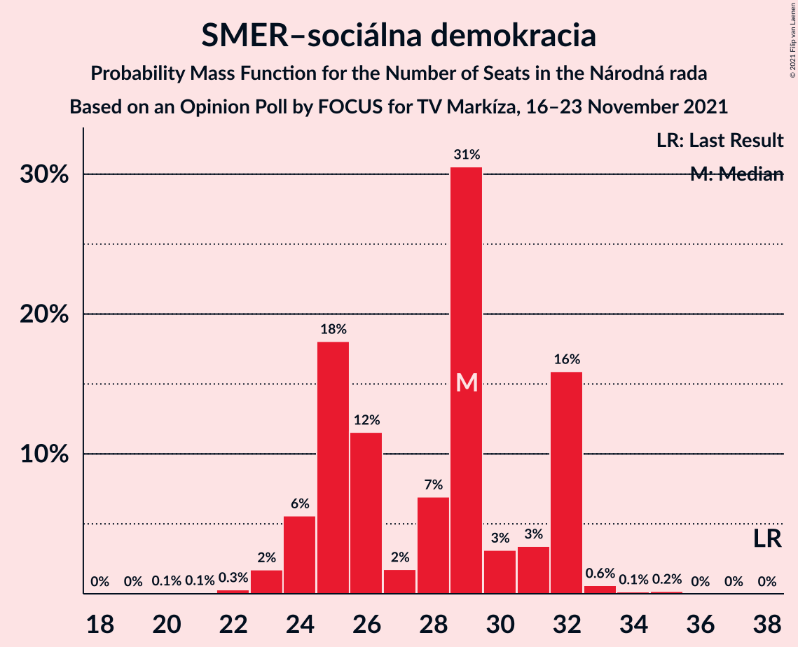
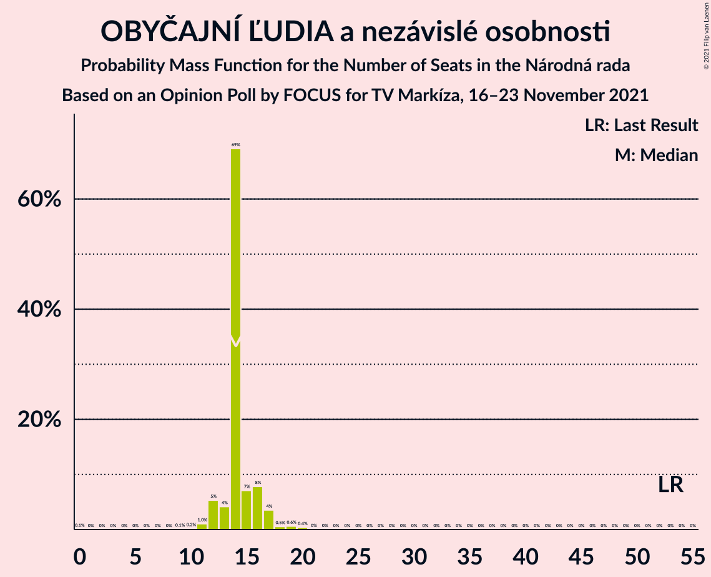
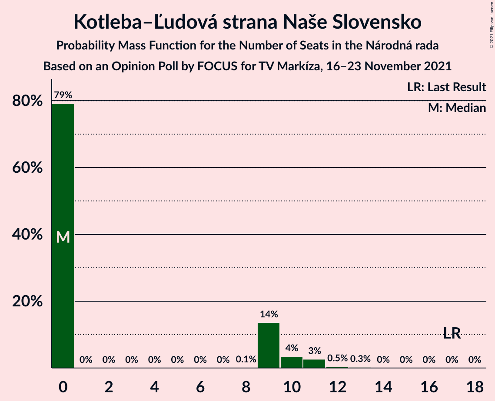
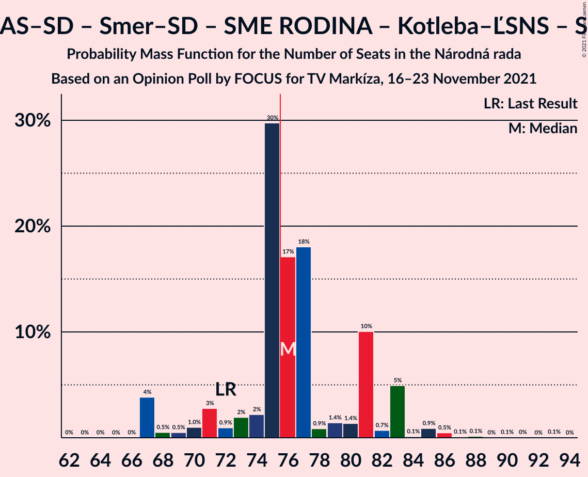
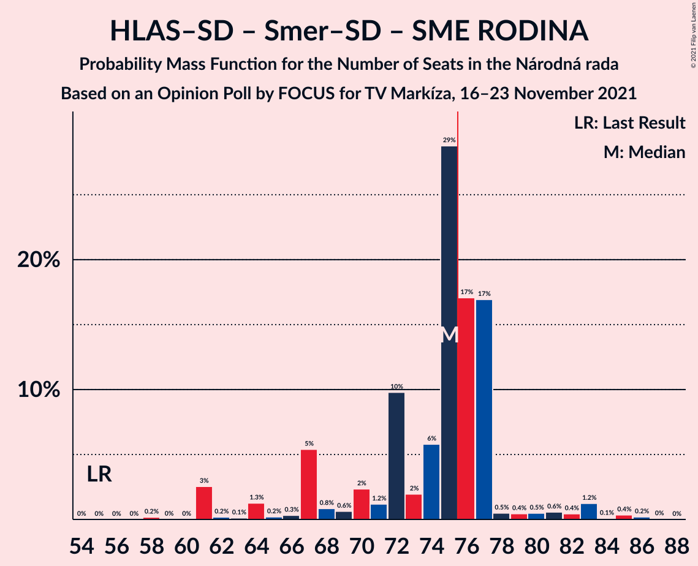
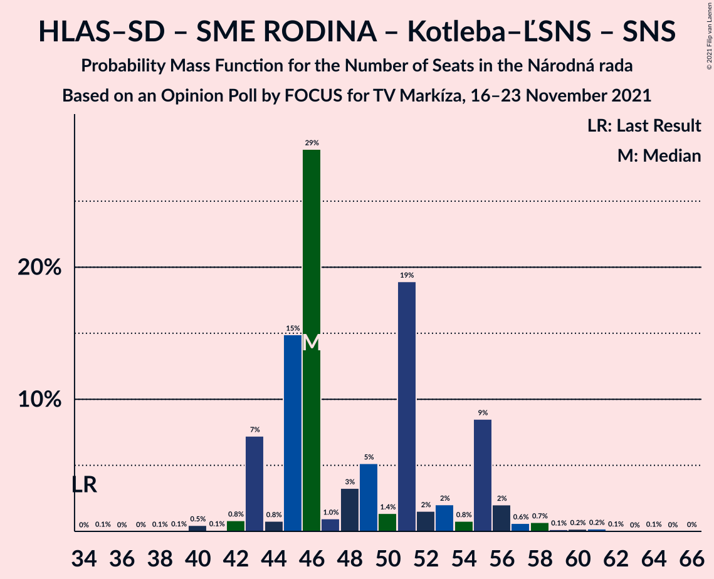
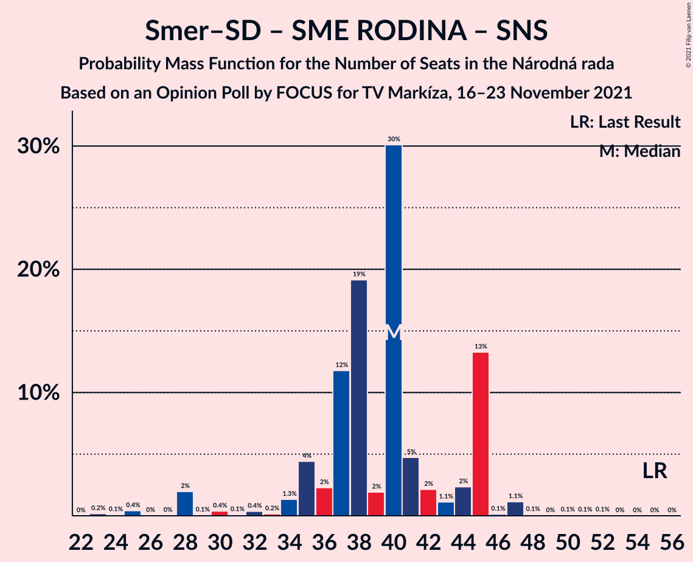

# Opinion Poll by FOCUS for TV Markíza, 16–23 November 2021

<a href="#voting-intentions">Voting Intentions</a> | <a href="#seats">Seats</a> | <a href="#coalitions">Coalitions</a> | <a href="#technical-information">Technical Information</a>

## Voting Intentions

### Confidence Intervals

| Party | Last Result | Poll Result | 80% Confidence Interval | 90% Confidence Interval | 95% Confidence Interval | 99% Confidence Interval |
|:-----:|:-----------:|:-----------:|:-----------------------:|:-----------------------:|:-----------------------:|:-----------------------:|
| HLAS–sociálna demokracia | 0.0% | 19.2% | 17.7–20.9% |17.3–21.4% |16.9–21.8% |16.2–22.6% |
| SMER–sociálna demokracia | 18.3% | 15.0% | 13.7–16.6% |13.3–17.0% |12.9–17.4% |12.3–18.1% |
| Sloboda a Solidarita | 6.2% | 11.5% | 10.3–12.9% |10.0–13.3% |9.7–13.7% |9.2–14.4% |
| OBYČAJNÍ ĽUDIA a nezávislé osobnosti | 25.0% | 7.9% | 6.9–9.1% |6.6–9.4% |6.4–9.7% |5.9–10.3% |
| Progresívne Slovensko | 7.0% | 7.7% | 6.7–8.9% |6.4–9.2% |6.2–9.5% |5.7–10.1% |
| REPUBLIKA | 0.0% | 6.8% | 5.8–7.9% |5.6–8.2% |5.4–8.5% |5.0–9.1% |
| SME RODINA | 8.2% | 6.1% | 5.2–7.1% |5.0–7.5% |4.8–7.7% |4.4–8.3% |
| Kresťanskodemokratické hnutie | 4.6% | 6.1% | 5.2–7.1% |5.0–7.5% |4.8–7.7% |4.4–8.3% |
| Kotleba–Ľudová strana Naše Slovensko | 8.0% | 4.8% | 4.0–5.8% |3.8–6.0% |3.6–6.3% |3.3–6.8% |
| Strana maďarskej koalície–Magyar Koalíció Pártja | 3.9% | 4.4% | 3.6–5.3% |3.4–5.6% |3.3–5.8% |3.0–6.3% |
| Slovenská národná strana | 3.2% | 3.6% | 2.9–4.5% |2.7–4.7% |2.6–4.9% |2.3–5.4% |
| Za ľudí | 5.8% | 2.1% | 1.6–2.8% |1.5–3.0% |1.4–3.2% |1.2–3.6% |
| Dobrá voľba | 3.1% | 2.1% | 1.6–2.8% |1.5–3.0% |1.4–3.2% |1.2–3.6% |
| SPOLU–Občianska Demokracia | 7.0% | 1.0% | 0.7–1.5% |0.6–1.7% |0.5–1.8% |0.4–2.1% |

*Note:* The poll result column reflects the actual value used in the calculations. Published results may vary slightly, and in addition be rounded to fewer digits.

## Seats

### Confidence Intervals

| Party | Last Result | Median | 80% Confidence Interval | 90% Confidence Interval | 95% Confidence Interval | 99% Confidence Interval |
|:-----:|:-----------:|:------:|:-----------------------:|:-----------------------:|:-----------------------:|:-----------------------:|
| <a href="#hlas–sociálna-demokracia">HLAS–sociálna demokracia</a> | 0 | 35 | 32–38 |32–39 |31–39 |28–41 |
| <a href="#smer–sociálna-demokracia">SMER–sociálna demokracia</a> | 38 | 29 | 25–32 |24–32 |24–32 |23–33 |
| <a href="#sloboda-a-solidarita">Sloboda a Solidarita</a> | 13 | 23 | 19–25 |18–25 |17–25 |17–27 |
| <a href="#obyčajní-ľudia-a-nezávislé-osobnosti">OBYČAJNÍ ĽUDIA a nezávislé osobnosti</a> | 53 | 14 | 13–16 |12–17 |12–17 |11–19 |
| <a href="#progresívne-slovensko">Progresívne Slovensko</a> | 0 | 13 | 12–16 |12–17 |11–18 |10–18 |
| <a href="#republika">REPUBLIKA</a> | 0 | 13 | 10–13 |10–14 |10–15 |0–17 |
| <a href="#sme-rodina">SME RODINA</a> | 17 | 11 | 10–13 |9–13 |0–14 |0–17 |
| <a href="#kresťanskodemokratické-hnutie">Kresťanskodemokratické hnutie</a> | 0 | 11 | 9–13 |0–13 |0–14 |0–15 |
| <a href="#kotleba–ľudová-strana-naše-slovensko">Kotleba–Ľudová strana Naše Slovensko</a> | 17 | 0 | 0–9 |0–10 |0–11 |0–12 |
| <a href="#strana-maďarskej-koalície–magyar-koalíció-pártja">Strana maďarskej koalície–Magyar Koalíció Pártja</a> | 0 | 0 | 0–9 |0–9 |0–10 |0–11 |
| <a href="#slovenská-národná-strana">Slovenská národná strana</a> | 0 | 0 | 0 |0 |0 |0–10 |
| <a href="#za-ľudí">Za ľudí</a> | 12 | 0 | 0 |0 |0 |0 |
| <a href="#dobrá-voľba">Dobrá voľba</a> | 0 | 0 | 0 |0 |0 |0 |
| <a href="#spolu–občianska-demokracia">SPOLU–Občianska Demokracia</a> | 0 | 0 | 0 |0 |0 |0 |

### HLAS–sociálna demokracia

*For a full overview of the results for this party, see the [HLAS–sociálna demokracia](party-hlas–sociálnademokracia.html) page.*

| Number of Seats | Probability | Accumulated | Special Marks |
|:---------------:|:-----------:|:-----------:|:-------------:|
| 0 | 0% | 100% | Last Result |
| 1 | 0% | 100% |  |
| 2 | 0% | 100% |  |
| 3 | 0% | 100% |  |
| 4 | 0% | 100% |  |
| 5 | 0% | 100% |  |
| 6 | 0% | 100% |  |
| 7 | 0% | 100% |  |
| 8 | 0% | 100% |  |
| 9 | 0% | 100% |  |
| 10 | 0% | 100% |  |
| 11 | 0% | 100% |  |
| 12 | 0% | 100% |  |
| 13 | 0% | 100% |  |
| 14 | 0% | 100% |  |
| 15 | 0% | 100% |  |
| 16 | 0% | 100% |  |
| 17 | 0% | 100% |  |
| 18 | 0% | 100% |  |
| 19 | 0% | 100% |  |
| 20 | 0% | 100% |  |
| 21 | 0% | 100% |  |
| 22 | 0% | 100% |  |
| 23 | 0% | 100% |  |
| 24 | 0% | 100% |  |
| 25 | 0% | 100% |  |
| 26 | 0% | 100% |  |
| 27 | 0.4% | 100% |  |
| 28 | 1.3% | 99.6% |  |
| 29 | 0.2% | 98% |  |
| 30 | 0.4% | 98% |  |
| 31 | 0.9% | 98% |  |
| 32 | 20% | 97% |  |
| 33 | 7% | 77% |  |
| 34 | 1.1% | 69% |  |
| 35 | 41% | 68% | Median |
| 36 | 2% | 27% |  |
| 37 | 2% | 25% |  |
| 38 | 16% | 23% |  |
| 39 | 6% | 8% |  |
| 40 | 0.8% | 2% |  |
| 41 | 0.6% | 1.1% |  |
| 42 | 0.3% | 0.5% |  |
| 43 | 0.2% | 0.2% |  |
| 44 | 0% | 0% |  |

### SMER–sociálna demokracia

*For a full overview of the results for this party, see the [SMER–sociálna demokracia](party-smer–sociálnademokracia.html) page.*

| Number of Seats | Probability | Accumulated | Special Marks |
|:---------------:|:-----------:|:-----------:|:-------------:|
| 20 | 0.1% | 100% |  |
| 21 | 0.1% | 99.9% |  |
| 22 | 0.3% | 99.8% |  |
| 23 | 2% | 99.5% |  |
| 24 | 6% | 98% |  |
| 25 | 18% | 92% |  |
| 26 | 12% | 74% |  |
| 27 | 2% | 63% |  |
| 28 | 7% | 61% |  |
| 29 | 31% | 54% | Median |
| 30 | 3% | 23% |  |
| 31 | 3% | 20% |  |
| 32 | 16% | 17% |  |
| 33 | 0.6% | 1.0% |  |
| 34 | 0.1% | 0.4% |  |
| 35 | 0.2% | 0.2% |  |
| 36 | 0% | 0% |  |
| 37 | 0% | 0% |  |
| 38 | 0% | 0% | Last Result |

### Sloboda a Solidarita

*For a full overview of the results for this party, see the [Sloboda a Solidarita](party-slobodaasolidarita.html) page.*

| Number of Seats | Probability | Accumulated | Special Marks |
|:---------------:|:-----------:|:-----------:|:-------------:|
| 13 | 0% | 100% | Last Result |
| 14 | 0.1% | 100% |  |
| 15 | 0.1% | 99.9% |  |
| 16 | 0.1% | 99.9% |  |
| 17 | 4% | 99.7% |  |
| 18 | 3% | 95% |  |
| 19 | 17% | 92% |  |
| 20 | 4% | 75% |  |
| 21 | 2% | 71% |  |
| 22 | 18% | 69% |  |
| 23 | 17% | 51% | Median |
| 24 | 2% | 34% |  |
| 25 | 30% | 32% |  |
| 26 | 0.2% | 2% |  |
| 27 | 2% | 2% |  |
| 28 | 0.1% | 0.1% |  |
| 29 | 0% | 0.1% |  |
| 30 | 0.1% | 0.1% |  |
| 31 | 0% | 0% |  |

### OBYČAJNÍ ĽUDIA a nezávislé osobnosti

*For a full overview of the results for this party, see the [OBYČAJNÍ ĽUDIA a nezávislé osobnosti](party-obyčajníľudiaanezávisléosobnosti.html) page.*

| Number of Seats | Probability | Accumulated | Special Marks |
|:---------------:|:-----------:|:-----------:|:-------------:|
| 0 | 0.1% | 100% |  |
| 1 | 0% | 99.9% |  |
| 2 | 0% | 99.9% |  |
| 3 | 0% | 99.9% |  |
| 4 | 0% | 99.9% |  |
| 5 | 0% | 99.9% |  |
| 6 | 0% | 99.9% |  |
| 7 | 0% | 99.9% |  |
| 8 | 0% | 99.9% |  |
| 9 | 0.1% | 99.9% |  |
| 10 | 0.2% | 99.9% |  |
| 11 | 1.0% | 99.7% |  |
| 12 | 5% | 98.7% |  |
| 13 | 4% | 93% |  |
| 14 | 69% | 89% | Median |
| 15 | 7% | 20% |  |
| 16 | 8% | 13% |  |
| 17 | 4% | 5% |  |
| 18 | 0.5% | 2% |  |
| 19 | 0.6% | 1.0% |  |
| 20 | 0.4% | 0.4% |  |
| 21 | 0% | 0% |  |
| 22 | 0% | 0% |  |
| 23 | 0% | 0% |  |
| 24 | 0% | 0% |  |
| 25 | 0% | 0% |  |
| 26 | 0% | 0% |  |
| 27 | 0% | 0% |  |
| 28 | 0% | 0% |  |
| 29 | 0% | 0% |  |
| 30 | 0% | 0% |  |
| 31 | 0% | 0% |  |
| 32 | 0% | 0% |  |
| 33 | 0% | 0% |  |
| 34 | 0% | 0% |  |
| 35 | 0% | 0% |  |
| 36 | 0% | 0% |  |
| 37 | 0% | 0% |  |
| 38 | 0% | 0% |  |
| 39 | 0% | 0% |  |
| 40 | 0% | 0% |  |
| 41 | 0% | 0% |  |
| 42 | 0% | 0% |  |
| 43 | 0% | 0% |  |
| 44 | 0% | 0% |  |
| 45 | 0% | 0% |  |
| 46 | 0% | 0% |  |
| 47 | 0% | 0% |  |
| 48 | 0% | 0% |  |
| 49 | 0% | 0% |  |
| 50 | 0% | 0% |  |
| 51 | 0% | 0% |  |
| 52 | 0% | 0% |  |
| 53 | 0% | 0% | Last Result |

### Progresívne Slovensko

*For a full overview of the results for this party, see the [Progresívne Slovensko](party-progresívneslovensko.html) page.*

| Number of Seats | Probability | Accumulated | Special Marks |
|:---------------:|:-----------:|:-----------:|:-------------:|
| 0 | 0% | 100% | Last Result |
| 1 | 0% | 100% |  |
| 2 | 0% | 100% |  |
| 3 | 0% | 100% |  |
| 4 | 0% | 100% |  |
| 5 | 0% | 100% |  |
| 6 | 0% | 100% |  |
| 7 | 0% | 100% |  |
| 8 | 0% | 100% |  |
| 9 | 0% | 100% |  |
| 10 | 0.8% | 100% |  |
| 11 | 4% | 99.1% |  |
| 12 | 34% | 95% |  |
| 13 | 24% | 61% | Median |
| 14 | 24% | 37% |  |
| 15 | 3% | 13% |  |
| 16 | 4% | 10% |  |
| 17 | 4% | 7% |  |
| 18 | 2% | 3% |  |
| 19 | 0.3% | 0.3% |  |
| 20 | 0% | 0.1% |  |
| 21 | 0% | 0% |  |

### REPUBLIKA

*For a full overview of the results for this party, see the [REPUBLIKA](party-republika.html) page.*

| Number of Seats | Probability | Accumulated | Special Marks |
|:---------------:|:-----------:|:-----------:|:-------------:|
| 0 | 2% | 100% | Last Result |
| 1 | 0% | 98% |  |
| 2 | 0% | 98% |  |
| 3 | 0% | 98% |  |
| 4 | 0% | 98% |  |
| 5 | 0% | 98% |  |
| 6 | 0% | 98% |  |
| 7 | 0% | 98% |  |
| 8 | 0% | 98% |  |
| 9 | 0.3% | 98% |  |
| 10 | 10% | 98% |  |
| 11 | 10% | 88% |  |
| 12 | 21% | 78% |  |
| 13 | 49% | 57% | Median |
| 14 | 5% | 8% |  |
| 15 | 2% | 4% |  |
| 16 | 1.2% | 2% |  |
| 17 | 0.7% | 1.0% |  |
| 18 | 0.1% | 0.3% |  |
| 19 | 0.2% | 0.2% |  |
| 20 | 0% | 0% |  |

### SME RODINA

*For a full overview of the results for this party, see the [SME RODINA](party-smerodina.html) page.*

| Number of Seats | Probability | Accumulated | Special Marks |
|:---------------:|:-----------:|:-----------:|:-------------:|
| 0 | 5% | 100% |  |
| 1 | 0% | 95% |  |
| 2 | 0% | 95% |  |
| 3 | 0% | 95% |  |
| 4 | 0% | 95% |  |
| 5 | 0% | 95% |  |
| 6 | 0% | 95% |  |
| 7 | 0% | 95% |  |
| 8 | 0% | 95% |  |
| 9 | 4% | 95% |  |
| 10 | 8% | 91% |  |
| 11 | 43% | 84% | Median |
| 12 | 6% | 40% |  |
| 13 | 31% | 34% |  |
| 14 | 2% | 3% |  |
| 15 | 0.5% | 1.4% |  |
| 16 | 0.1% | 0.9% |  |
| 17 | 0.8% | 0.8% | Last Result |
| 18 | 0% | 0% |  |

### Kresťanskodemokratické hnutie

*For a full overview of the results for this party, see the [Kresťanskodemokratické hnutie](party-kresťanskodemokratickéhnutie.html) page.*

| Number of Seats | Probability | Accumulated | Special Marks |
|:---------------:|:-----------:|:-----------:|:-------------:|
| 0 | 7% | 100% | Last Result |
| 1 | 0% | 93% |  |
| 2 | 0% | 93% |  |
| 3 | 0% | 93% |  |
| 4 | 0% | 93% |  |
| 5 | 0% | 93% |  |
| 6 | 0% | 93% |  |
| 7 | 0% | 93% |  |
| 8 | 0% | 93% |  |
| 9 | 3% | 93% |  |
| 10 | 16% | 90% |  |
| 11 | 31% | 74% | Median |
| 12 | 31% | 44% |  |
| 13 | 9% | 12% |  |
| 14 | 2% | 3% |  |
| 15 | 2% | 2% |  |
| 16 | 0% | 0.1% |  |
| 17 | 0% | 0% |  |

### Kotleba–Ľudová strana Naše Slovensko

*For a full overview of the results for this party, see the [Kotleba–Ľudová strana Naše Slovensko](party-kotleba–ľudovástrananašeslovensko.html) page.*

| Number of Seats | Probability | Accumulated | Special Marks |
|:---------------:|:-----------:|:-----------:|:-------------:|
| 0 | 79% | 100% | Median |
| 1 | 0% | 21% |  |
| 2 | 0% | 21% |  |
| 3 | 0% | 21% |  |
| 4 | 0% | 21% |  |
| 5 | 0% | 21% |  |
| 6 | 0% | 21% |  |
| 7 | 0% | 21% |  |
| 8 | 0.1% | 21% |  |
| 9 | 14% | 21% |  |
| 10 | 4% | 7% |  |
| 11 | 3% | 3% |  |
| 12 | 0.5% | 0.8% |  |
| 13 | 0.3% | 0.3% |  |
| 14 | 0% | 0.1% |  |
| 15 | 0% | 0% |  |
| 16 | 0% | 0% |  |
| 17 | 0% | 0% | Last Result |

### Strana maďarskej koalície–Magyar Koalíció Pártja

*For a full overview of the results for this party, see the [Strana maďarskej koalície–Magyar Koalíció Pártja](party-stranamaďarskejkoalície–magyarkoalíciópártja.html) page.*

| Number of Seats | Probability | Accumulated | Special Marks |
|:---------------:|:-----------:|:-----------:|:-------------:|
| 0 | 89% | 100% | Last Result, Median |
| 1 | 0% | 11% |  |
| 2 | 0% | 11% |  |
| 3 | 0% | 11% |  |
| 4 | 0% | 11% |  |
| 5 | 0% | 11% |  |
| 6 | 0% | 11% |  |
| 7 | 0% | 11% |  |
| 8 | 0% | 11% |  |
| 9 | 7% | 11% |  |
| 10 | 2% | 4% |  |
| 11 | 2% | 2% |  |
| 12 | 0.1% | 0.1% |  |
| 13 | 0% | 0% |  |

### Slovenská národná strana

*For a full overview of the results for this party, see the [Slovenská národná strana](party-slovenskánárodnástrana.html) page.*

| Number of Seats | Probability | Accumulated | Special Marks |
|:---------------:|:-----------:|:-----------:|:-------------:|
| 0 | 98% | 100% | Last Result, Median |
| 1 | 0% | 2% |  |
| 2 | 0% | 2% |  |
| 3 | 0% | 2% |  |
| 4 | 0% | 2% |  |
| 5 | 0% | 2% |  |
| 6 | 0% | 2% |  |
| 7 | 0% | 2% |  |
| 8 | 0% | 2% |  |
| 9 | 1.1% | 2% |  |
| 10 | 1.2% | 1.3% |  |
| 11 | 0.1% | 0.1% |  |
| 12 | 0% | 0% |  |

### Za ľudí

*For a full overview of the results for this party, see the [Za ľudí](party-zaľudí.html) page.*

| Number of Seats | Probability | Accumulated | Special Marks |
|:---------------:|:-----------:|:-----------:|:-------------:|
| 0 | 100% | 100% | Median |
| 1 | 0% | 0% |  |
| 2 | 0% | 0% |  |
| 3 | 0% | 0% |  |
| 4 | 0% | 0% |  |
| 5 | 0% | 0% |  |
| 6 | 0% | 0% |  |
| 7 | 0% | 0% |  |
| 8 | 0% | 0% |  |
| 9 | 0% | 0% |  |
| 10 | 0% | 0% |  |
| 11 | 0% | 0% |  |
| 12 | 0% | 0% | Last Result |

### Dobrá voľba

*For a full overview of the results for this party, see the [Dobrá voľba](party-dobrávoľba.html) page.*

| Number of Seats | Probability | Accumulated | Special Marks |
|:---------------:|:-----------:|:-----------:|:-------------:|
| 0 | 100% | 100% | Last Result, Median |

### SPOLU–Občianska Demokracia

*For a full overview of the results for this party, see the [SPOLU–Občianska Demokracia](party-spolu–občianskademokracia.html) page.*

| Number of Seats | Probability | Accumulated | Special Marks |
|:---------------:|:-----------:|:-----------:|:-------------:|
| 0 | 100% | 100% | Last Result, Median |

## Coalitions

### Confidence Intervals

| Coalition | Last Result | Median | Majority? | 80% Confidence Interval | 90% Confidence Interval | 95% Confidence Interval | 99% Confidence Interval |
|:---------:|:-----------:|:------:|:---------:|:-----------------------:|:-----------------------:|:-----------------------:|:-----------------------:|
| HLAS–sociálna demokracia – SMER–sociálna demokracia – SME RODINA – Kotleba–Ľudová strana Naše Slovensko – Slovenská národná strana | 72 | 76 | 56% | 73–81 | 70–83 | 67–83 | 67–86 |
| HLAS–sociálna demokracia – SMER–sociálna demokracia – SME RODINA – Slovenská národná strana | 55 | 75 | 40% | 69–77 | 67–78 | 61–82 | 61–85 |
| HLAS–sociálna demokracia – SMER–sociálna demokracia – SME RODINA | 55 | 75 | 38% | 67–77 | 67–77 | 61–81 | 61–85 |
| HLAS–sociálna demokracia – SMER–sociálna demokracia – Slovenská národná strana | 38 | 64 | 1.2% | 59–66 | 56–70 | 56–71 | 52–77 |
| HLAS–sociálna demokracia – SME RODINA – Kotleba–Ľudová strana Naše Slovensko – Slovenská národná strana | 34 | 46 | 0% | 45–55 | 43–55 | 43–56 | 40–60 |
| HLAS–sociálna demokracia – SME RODINA | 17 | 46 | 0% | 42–51 | 40–51 | 36–52 | 33–54 |
| HLAS–sociálna demokracia – SME RODINA – Slovenská národná strana | 17 | 46 | 0% | 43–51 | 40–51 | 36–52 | 33–54 |
| SMER–sociálna demokracia – SME RODINA – Kotleba–Ľudová strana Naše Slovensko – Slovenská národná strana | 72 | 40 | 0% | 38–46 | 35–49 | 35–50 | 32–52 |
| SMER–sociálna demokracia – SME RODINA | 55 | 40 | 0% | 35–45 | 33–45 | 28–45 | 25–46 |
| SMER–sociálna demokracia – SME RODINA – Slovenská národná strana | 55 | 40 | 0% | 36–45 | 34–45 | 28–45 | 25–47 |
| HLAS–sociálna demokracia – Slovenská národná strana | 0 | 35 | 0% | 32–38 | 32–39 | 31–41 | 28–49 |
| SMER–sociálna demokracia – Slovenská národná strana | 38 | 29 | 0% | 25–32 | 24–32 | 24–34 | 23–38 |
| SMER–sociálna demokracia | 38 | 29 | 0% | 25–32 | 24–32 | 24–32 | 23–33 |

### HLAS–sociálna demokracia – SMER–sociálna demokracia – SME RODINA – Kotleba–Ľudová strana Naše Slovensko – Slovenská národná strana

| Number of Seats | Probability | Accumulated | Special Marks |
|:---------------:|:-----------:|:-----------:|:-------------:|
| 63 | 0% | 100% |  |
| 64 | 0% | 99.9% |  |
| 65 | 0% | 99.9% |  |
| 66 | 0% | 99.9% |  |
| 67 | 4% | 99.9% |  |
| 68 | 0.5% | 96% |  |
| 69 | 0.5% | 96% |  |
| 70 | 1.0% | 95% |  |
| 71 | 3% | 94% |  |
| 72 | 0.9% | 91% | Last Result |
| 73 | 2% | 90% |  |
| 74 | 2% | 88% |  |
| 75 | 30% | 86% | Median |
| 76 | 17% | 56% | Majority |
| 77 | 18% | 39% |  |
| 78 | 0.9% | 21% |  |
| 79 | 1.4% | 20% |  |
| 80 | 1.4% | 19% |  |
| 81 | 10% | 18% |  |
| 82 | 0.7% | 8% |  |
| 83 | 5% | 7% |  |
| 84 | 0.1% | 2% |  |
| 85 | 0.9% | 2% |  |
| 86 | 0.5% | 0.9% |  |
| 87 | 0.1% | 0.4% |  |
| 88 | 0.1% | 0.3% |  |
| 89 | 0% | 0.2% |  |
| 90 | 0.1% | 0.2% |  |
| 91 | 0% | 0.1% |  |
| 92 | 0% | 0.1% |  |
| 93 | 0.1% | 0.1% |  |
| 94 | 0% | 0% |  |

### HLAS–sociálna demokracia – SMER–sociálna demokracia – SME RODINA – Slovenská národná strana

| Number of Seats | Probability | Accumulated | Special Marks |
|:---------------:|:-----------:|:-----------:|:-------------:|
| 55 | 0% | 100% | Last Result |
| 56 | 0% | 100% |  |
| 57 | 0% | 100% |  |
| 58 | 0.2% | 100% |  |
| 59 | 0% | 99.8% |  |
| 60 | 0% | 99.8% |  |
| 61 | 2% | 99.8% |  |
| 62 | 0.2% | 97% |  |
| 63 | 0.1% | 97% |  |
| 64 | 1.2% | 97% |  |
| 65 | 0% | 96% |  |
| 66 | 0.3% | 96% |  |
| 67 | 4% | 96% |  |
| 68 | 0.8% | 91% |  |
| 69 | 0.6% | 90% |  |
| 70 | 2% | 90% |  |
| 71 | 1.2% | 88% |  |
| 72 | 10% | 87% |  |
| 73 | 2% | 77% |  |
| 74 | 6% | 75% |  |
| 75 | 29% | 69% | Median |
| 76 | 17% | 40% | Majority |
| 77 | 18% | 23% |  |
| 78 | 0.5% | 5% |  |
| 79 | 1.2% | 5% |  |
| 80 | 0.5% | 4% |  |
| 81 | 0.6% | 3% |  |
| 82 | 0.5% | 3% |  |
| 83 | 1.2% | 2% |  |
| 84 | 0% | 0.8% |  |
| 85 | 0.4% | 0.8% |  |
| 86 | 0.3% | 0.4% |  |
| 87 | 0% | 0.1% |  |
| 88 | 0% | 0.1% |  |
| 89 | 0% | 0.1% |  |
| 90 | 0% | 0.1% |  |
| 91 | 0% | 0.1% |  |
| 92 | 0% | 0.1% |  |
| 93 | 0.1% | 0.1% |  |
| 94 | 0% | 0% |  |

### HLAS–sociálna demokracia – SMER–sociálna demokracia – SME RODINA

| Number of Seats | Probability | Accumulated | Special Marks |
|:---------------:|:-----------:|:-----------:|:-------------:|
| 55 | 0% | 100% | Last Result |
| 56 | 0% | 100% |  |
| 57 | 0% | 100% |  |
| 58 | 0.2% | 100% |  |
| 59 | 0% | 99.8% |  |
| 60 | 0% | 99.8% |  |
| 61 | 3% | 99.8% |  |
| 62 | 0.2% | 97% |  |
| 63 | 0.1% | 97% |  |
| 64 | 1.3% | 97% |  |
| 65 | 0.2% | 96% |  |
| 66 | 0.3% | 95% |  |
| 67 | 5% | 95% |  |
| 68 | 0.8% | 90% |  |
| 69 | 0.6% | 89% |  |
| 70 | 2% | 88% |  |
| 71 | 1.2% | 86% |  |
| 72 | 10% | 85% |  |
| 73 | 2% | 75% |  |
| 74 | 6% | 73% |  |
| 75 | 29% | 67% | Median |
| 76 | 17% | 38% | Majority |
| 77 | 17% | 21% |  |
| 78 | 0.5% | 4% |  |
| 79 | 0.4% | 4% |  |
| 80 | 0.5% | 3% |  |
| 81 | 0.6% | 3% |  |
| 82 | 0.4% | 2% |  |
| 83 | 1.2% | 2% |  |
| 84 | 0.1% | 0.7% |  |
| 85 | 0.4% | 0.6% |  |
| 86 | 0.2% | 0.3% |  |
| 87 | 0% | 0.1% |  |
| 88 | 0% | 0% |  |

### HLAS–sociálna demokracia – SMER–sociálna demokracia – Slovenská národná strana

| Number of Seats | Probability | Accumulated | Special Marks |
|:---------------:|:-----------:|:-----------:|:-------------:|
| 38 | 0% | 100% | Last Result |
| 39 | 0% | 100% |  |
| 40 | 0% | 100% |  |
| 41 | 0% | 100% |  |
| 42 | 0% | 100% |  |
| 43 | 0% | 100% |  |
| 44 | 0% | 100% |  |
| 45 | 0% | 100% |  |
| 46 | 0% | 100% |  |
| 47 | 0% | 100% |  |
| 48 | 0% | 100% |  |
| 49 | 0% | 100% |  |
| 50 | 0% | 100% |  |
| 51 | 0.1% | 100% |  |
| 52 | 1.1% | 99.9% |  |
| 53 | 0% | 98.8% |  |
| 54 | 0.1% | 98.7% |  |
| 55 | 0.2% | 98.7% |  |
| 56 | 5% | 98% |  |
| 57 | 0.5% | 94% |  |
| 58 | 1.4% | 93% |  |
| 59 | 2% | 92% |  |
| 60 | 3% | 90% |  |
| 61 | 11% | 87% |  |
| 62 | 2% | 76% |  |
| 63 | 18% | 74% |  |
| 64 | 42% | 56% | Median |
| 65 | 3% | 14% |  |
| 66 | 2% | 11% |  |
| 67 | 3% | 9% |  |
| 68 | 0.4% | 6% |  |
| 69 | 0.7% | 6% |  |
| 70 | 3% | 5% |  |
| 71 | 0.2% | 3% |  |
| 72 | 0.8% | 2% |  |
| 73 | 0.2% | 2% |  |
| 74 | 0.1% | 1.4% |  |
| 75 | 0.1% | 1.2% |  |
| 76 | 0% | 1.2% | Majority |
| 77 | 1.1% | 1.2% |  |
| 78 | 0% | 0.1% |  |
| 79 | 0% | 0.1% |  |
| 80 | 0% | 0.1% |  |
| 81 | 0.1% | 0.1% |  |
| 82 | 0% | 0% |  |

### HLAS–sociálna demokracia – SME RODINA – Kotleba–Ľudová strana Naše Slovensko – Slovenská národná strana

| Number of Seats | Probability | Accumulated | Special Marks |
|:---------------:|:-----------:|:-----------:|:-------------:|
| 34 | 0% | 100% | Last Result |
| 35 | 0.1% | 100% |  |
| 36 | 0% | 99.9% |  |
| 37 | 0% | 99.9% |  |
| 38 | 0.1% | 99.9% |  |
| 39 | 0.1% | 99.8% |  |
| 40 | 0.5% | 99.7% |  |
| 41 | 0.1% | 99.3% |  |
| 42 | 0.8% | 99.2% |  |
| 43 | 7% | 98% |  |
| 44 | 0.8% | 91% |  |
| 45 | 15% | 90% |  |
| 46 | 29% | 75% | Median |
| 47 | 1.0% | 47% |  |
| 48 | 3% | 46% |  |
| 49 | 5% | 42% |  |
| 50 | 1.4% | 37% |  |
| 51 | 19% | 36% |  |
| 52 | 2% | 17% |  |
| 53 | 2% | 15% |  |
| 54 | 0.8% | 13% |  |
| 55 | 9% | 13% |  |
| 56 | 2% | 4% |  |
| 57 | 0.6% | 2% |  |
| 58 | 0.7% | 1.4% |  |
| 59 | 0.1% | 0.7% |  |
| 60 | 0.2% | 0.6% |  |
| 61 | 0.2% | 0.4% |  |
| 62 | 0.1% | 0.2% |  |
| 63 | 0% | 0.1% |  |
| 64 | 0.1% | 0.1% |  |
| 65 | 0% | 0% |  |

### HLAS–sociálna demokracia – SME RODINA

| Number of Seats | Probability | Accumulated | Special Marks |
|:---------------:|:-----------:|:-----------:|:-------------:|
| 17 | 0% | 100% | Last Result |
| 18 | 0% | 100% |  |
| 19 | 0% | 100% |  |
| 20 | 0% | 100% |  |
| 21 | 0% | 100% |  |
| 22 | 0% | 100% |  |
| 23 | 0% | 100% |  |
| 24 | 0% | 100% |  |
| 25 | 0% | 100% |  |
| 26 | 0% | 100% |  |
| 27 | 0% | 100% |  |
| 28 | 0% | 100% |  |
| 29 | 0% | 100% |  |
| 30 | 0% | 100% |  |
| 31 | 0% | 100% |  |
| 32 | 0% | 100% |  |
| 33 | 2% | 99.9% |  |
| 34 | 0.1% | 98% |  |
| 35 | 0.3% | 98% |  |
| 36 | 0.4% | 98% |  |
| 37 | 0.3% | 97% |  |
| 38 | 0.5% | 97% |  |
| 39 | 1.1% | 96% |  |
| 40 | 2% | 95% |  |
| 41 | 1.0% | 94% |  |
| 42 | 3% | 93% |  |
| 43 | 6% | 89% |  |
| 44 | 3% | 84% |  |
| 45 | 15% | 81% |  |
| 46 | 37% | 66% | Median |
| 47 | 3% | 29% |  |
| 48 | 3% | 26% |  |
| 49 | 4% | 23% |  |
| 50 | 0.8% | 19% |  |
| 51 | 15% | 18% |  |
| 52 | 1.2% | 3% |  |
| 53 | 0.6% | 1.4% |  |
| 54 | 0.6% | 0.8% |  |
| 55 | 0.1% | 0.2% |  |
| 56 | 0% | 0.1% |  |
| 57 | 0% | 0% |  |

### HLAS–sociálna demokracia – SME RODINA – Slovenská národná strana

| Number of Seats | Probability | Accumulated | Special Marks |
|:---------------:|:-----------:|:-----------:|:-------------:|
| 17 | 0% | 100% | Last Result |
| 18 | 0% | 100% |  |
| 19 | 0% | 100% |  |
| 20 | 0% | 100% |  |
| 21 | 0% | 100% |  |
| 22 | 0% | 100% |  |
| 23 | 0% | 100% |  |
| 24 | 0% | 100% |  |
| 25 | 0% | 100% |  |
| 26 | 0% | 100% |  |
| 27 | 0% | 100% |  |
| 28 | 0% | 100% |  |
| 29 | 0% | 100% |  |
| 30 | 0% | 100% |  |
| 31 | 0% | 100% |  |
| 32 | 0% | 100% |  |
| 33 | 2% | 100% |  |
| 34 | 0.1% | 98% |  |
| 35 | 0.2% | 98% |  |
| 36 | 0.4% | 98% |  |
| 37 | 0.3% | 97% |  |
| 38 | 0.2% | 97% |  |
| 39 | 0.2% | 97% |  |
| 40 | 2% | 97% |  |
| 41 | 0.3% | 95% |  |
| 42 | 3% | 95% |  |
| 43 | 6% | 91% |  |
| 44 | 3% | 86% |  |
| 45 | 15% | 83% |  |
| 46 | 37% | 68% | Median |
| 47 | 3% | 31% |  |
| 48 | 3% | 28% |  |
| 49 | 5% | 25% |  |
| 50 | 1.5% | 20% |  |
| 51 | 15% | 18% |  |
| 52 | 1.3% | 3% |  |
| 53 | 0.6% | 2% |  |
| 54 | 0.6% | 1.0% |  |
| 55 | 0.2% | 0.4% |  |
| 56 | 0.1% | 0.3% |  |
| 57 | 0.1% | 0.2% |  |
| 58 | 0% | 0.1% |  |
| 59 | 0% | 0.1% |  |
| 60 | 0% | 0.1% |  |
| 61 | 0% | 0.1% |  |
| 62 | 0.1% | 0.1% |  |
| 63 | 0% | 0% |  |

### SMER–sociálna demokracia – SME RODINA – Kotleba–Ľudová strana Naše Slovensko – Slovenská národná strana

| Number of Seats | Probability | Accumulated | Special Marks |
|:---------------:|:-----------:|:-----------:|:-------------:|
| 28 | 0% | 100% |  |
| 29 | 0% | 99.9% |  |
| 30 | 0.3% | 99.9% |  |
| 31 | 0% | 99.6% |  |
| 32 | 0.2% | 99.6% |  |
| 33 | 0.1% | 99.4% |  |
| 34 | 0.6% | 99.3% |  |
| 35 | 4% | 98.7% |  |
| 36 | 1.3% | 95% |  |
| 37 | 2% | 93% |  |
| 38 | 21% | 92% |  |
| 39 | 2% | 71% |  |
| 40 | 30% | 69% | Median |
| 41 | 3% | 39% |  |
| 42 | 0.9% | 37% |  |
| 43 | 1.4% | 36% |  |
| 44 | 2% | 34% |  |
| 45 | 14% | 32% |  |
| 46 | 10% | 18% |  |
| 47 | 3% | 8% |  |
| 48 | 0.5% | 6% |  |
| 49 | 0.2% | 5% |  |
| 50 | 3% | 5% |  |
| 51 | 1.3% | 2% |  |
| 52 | 0.3% | 0.8% |  |
| 53 | 0.1% | 0.5% |  |
| 54 | 0.1% | 0.4% |  |
| 55 | 0.2% | 0.3% |  |
| 56 | 0% | 0.1% |  |
| 57 | 0.1% | 0.1% |  |
| 58 | 0% | 0% |  |
| 59 | 0% | 0% |  |
| 60 | 0% | 0% |  |
| 61 | 0% | 0% |  |
| 62 | 0% | 0% |  |
| 63 | 0% | 0% |  |
| 64 | 0% | 0% |  |
| 65 | 0% | 0% |  |
| 66 | 0% | 0% |  |
| 67 | 0% | 0% |  |
| 68 | 0% | 0% |  |
| 69 | 0% | 0% |  |
| 70 | 0% | 0% |  |
| 71 | 0% | 0% |  |
| 72 | 0% | 0% | Last Result |

### SMER–sociálna demokracia – SME RODINA

| Number of Seats | Probability | Accumulated | Special Marks |
|:---------------:|:-----------:|:-----------:|:-------------:|
| 23 | 0.2% | 100% |  |
| 24 | 0.1% | 99.8% |  |
| 25 | 0.4% | 99.7% |  |
| 26 | 0.1% | 99.3% |  |
| 27 | 0% | 99.2% |  |
| 28 | 3% | 99.1% |  |
| 29 | 0.1% | 96% |  |
| 30 | 0.4% | 96% |  |
| 31 | 0.1% | 96% |  |
| 32 | 0.4% | 96% |  |
| 33 | 0.2% | 95% |  |
| 34 | 1.3% | 95% |  |
| 35 | 4% | 94% |  |
| 36 | 2% | 89% |  |
| 37 | 12% | 87% |  |
| 38 | 19% | 75% |  |
| 39 | 2% | 56% |  |
| 40 | 30% | 54% | Median |
| 41 | 5% | 24% |  |
| 42 | 2% | 19% |  |
| 43 | 1.2% | 17% |  |
| 44 | 2% | 16% |  |
| 45 | 13% | 14% |  |
| 46 | 0.1% | 0.5% |  |
| 47 | 0.3% | 0.4% |  |
| 48 | 0% | 0.1% |  |
| 49 | 0% | 0% |  |
| 50 | 0% | 0% |  |
| 51 | 0% | 0% |  |
| 52 | 0% | 0% |  |
| 53 | 0% | 0% |  |
| 54 | 0% | 0% |  |
| 55 | 0% | 0% | Last Result |

### SMER–sociálna demokracia – SME RODINA – Slovenská národná strana

| Number of Seats | Probability | Accumulated | Special Marks |
|:---------------:|:-----------:|:-----------:|:-------------:|
| 23 | 0.2% | 100% |  |
| 24 | 0.1% | 99.8% |  |
| 25 | 0.4% | 99.7% |  |
| 26 | 0% | 99.3% |  |
| 27 | 0% | 99.3% |  |
| 28 | 2% | 99.2% |  |
| 29 | 0.1% | 97% |  |
| 30 | 0.4% | 97% |  |
| 31 | 0.1% | 97% |  |
| 32 | 0.4% | 97% |  |
| 33 | 0.2% | 96% |  |
| 34 | 1.3% | 96% |  |
| 35 | 4% | 95% |  |
| 36 | 2% | 90% |  |
| 37 | 12% | 88% |  |
| 38 | 19% | 76% |  |
| 39 | 2% | 57% |  |
| 40 | 30% | 55% | Median |
| 41 | 5% | 25% |  |
| 42 | 2% | 20% |  |
| 43 | 1.1% | 18% |  |
| 44 | 2% | 17% |  |
| 45 | 13% | 15% |  |
| 46 | 0.1% | 2% |  |
| 47 | 1.1% | 1.5% |  |
| 48 | 0.1% | 0.3% |  |
| 49 | 0% | 0.2% |  |
| 50 | 0.1% | 0.2% |  |
| 51 | 0.1% | 0.1% |  |
| 52 | 0.1% | 0.1% |  |
| 53 | 0% | 0% |  |
| 54 | 0% | 0% |  |
| 55 | 0% | 0% | Last Result |

### HLAS–sociálna demokracia – Slovenská národná strana

| Number of Seats | Probability | Accumulated | Special Marks |
|:---------------:|:-----------:|:-----------:|:-------------:|
| 0 | 0% | 100% | Last Result |
| 1 | 0% | 100% |  |
| 2 | 0% | 100% |  |
| 3 | 0% | 100% |  |
| 4 | 0% | 100% |  |
| 5 | 0% | 100% |  |
| 6 | 0% | 100% |  |
| 7 | 0% | 100% |  |
| 8 | 0% | 100% |  |
| 9 | 0% | 100% |  |
| 10 | 0% | 100% |  |
| 11 | 0% | 100% |  |
| 12 | 0% | 100% |  |
| 13 | 0% | 100% |  |
| 14 | 0% | 100% |  |
| 15 | 0% | 100% |  |
| 16 | 0% | 100% |  |
| 17 | 0% | 100% |  |
| 18 | 0% | 100% |  |
| 19 | 0% | 100% |  |
| 20 | 0% | 100% |  |
| 21 | 0% | 100% |  |
| 22 | 0% | 100% |  |
| 23 | 0% | 100% |  |
| 24 | 0% | 100% |  |
| 25 | 0% | 100% |  |
| 26 | 0% | 100% |  |
| 27 | 0.2% | 100% |  |
| 28 | 1.3% | 99.8% |  |
| 29 | 0.2% | 98.5% |  |
| 30 | 0.4% | 98% |  |
| 31 | 0.9% | 98% |  |
| 32 | 20% | 97% |  |
| 33 | 7% | 78% |  |
| 34 | 1.1% | 70% |  |
| 35 | 41% | 69% | Median |
| 36 | 2% | 28% |  |
| 37 | 2% | 26% |  |
| 38 | 16% | 25% |  |
| 39 | 5% | 9% |  |
| 40 | 0.8% | 4% |  |
| 41 | 1.3% | 3% |  |
| 42 | 0.3% | 2% |  |
| 43 | 0.2% | 2% |  |
| 44 | 0% | 1.4% |  |
| 45 | 0.1% | 1.4% |  |
| 46 | 0.1% | 1.3% |  |
| 47 | 0% | 1.1% |  |
| 48 | 0.1% | 1.1% |  |
| 49 | 1.0% | 1.1% |  |
| 50 | 0.1% | 0.1% |  |
| 51 | 0% | 0% |  |

### SMER–sociálna demokracia – Slovenská národná strana

| Number of Seats | Probability | Accumulated | Special Marks |
|:---------------:|:-----------:|:-----------:|:-------------:|
| 21 | 0.1% | 100% |  |
| 22 | 0.3% | 99.9% |  |
| 23 | 2% | 99.6% |  |
| 24 | 6% | 98% |  |
| 25 | 18% | 92% |  |
| 26 | 11% | 74% |  |
| 27 | 2% | 63% |  |
| 28 | 6% | 61% |  |
| 29 | 30% | 55% | Median |
| 30 | 3% | 26% |  |
| 31 | 3% | 23% |  |
| 32 | 16% | 19% |  |
| 33 | 0.6% | 3% |  |
| 34 | 0.3% | 3% |  |
| 35 | 0.2% | 2% |  |
| 36 | 0.2% | 2% |  |
| 37 | 0.1% | 2% |  |
| 38 | 2% | 2% | Last Result |
| 39 | 0.1% | 0.2% |  |
| 40 | 0.1% | 0.1% |  |
| 41 | 0% | 0% |  |

### SMER–sociálna demokracia

| Number of Seats | Probability | Accumulated | Special Marks |
|:---------------:|:-----------:|:-----------:|:-------------:|
| 20 | 0.1% | 100% |  |
| 21 | 0.1% | 99.9% |  |
| 22 | 0.3% | 99.8% |  |
| 23 | 2% | 99.5% |  |
| 24 | 6% | 98% |  |
| 25 | 18% | 92% |  |
| 26 | 12% | 74% |  |
| 27 | 2% | 63% |  |
| 28 | 7% | 61% |  |
| 29 | 31% | 54% | Median |
| 30 | 3% | 23% |  |
| 31 | 3% | 20% |  |
| 32 | 16% | 17% |  |
| 33 | 0.6% | 1.0% |  |
| 34 | 0.1% | 0.4% |  |
| 35 | 0.2% | 0.2% |  |
| 36 | 0% | 0% |  |
| 37 | 0% | 0% |  |
| 38 | 0% | 0% | Last Result |

## Technical Information

### Opinion Poll

+ **Polling firm:** FOCUS
+ **Commissioner(s):** TV Markíza
+ **Fieldwork period:** 16–23 November 2021

### Calculations

+ **Sample size:** 1005
+ **Simulations done:** 1,048,576
+ **Error estimate:** 2.96%

