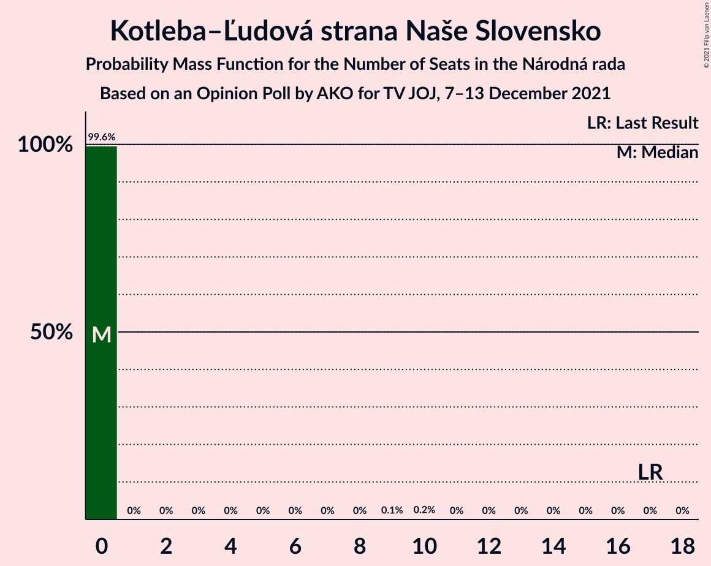

# Opinion Poll by AKO for TV JOJ, 7–13 December 2021

<a href="#voting-intentions">Voting Intentions</a> | <a href="#seats">Seats</a> | <a href="#coalitions">Coalitions</a> | <a href="#technical-information">Technical Information</a>

## Voting Intentions

### Confidence Intervals

| Party | Last Result | Poll Result | 80% Confidence Interval | 90% Confidence Interval | 95% Confidence Interval | 99% Confidence Interval |
|:-----:|:-----------:|:-----------:|:-----------------------:|:-----------------------:|:-----------------------:|:-----------------------:|
| HLAS–sociálna demokracia | 0.0% | 19.0% | 17.5–20.7% |17.1–21.1% |16.7–21.6% |16.0–22.4% |
| Sloboda a Solidarita | 6.2% | 13.9% | 12.6–15.4% |12.2–15.8% |11.9–16.2% |11.3–16.9% |
| SMER–sociálna demokracia | 18.3% | 13.7% | 12.4–15.2% |12.0–15.6% |11.7–16.0% |11.1–16.7% |
| OBYČAJNÍ ĽUDIA a nezávislé osobnosti | 25.0% | 9.0% | 7.9–10.3% |7.6–10.6% |7.4–10.9% |6.9–11.6% |
| Progresívne Slovensko | 7.0% | 8.6% | 7.6–9.8% |7.3–10.2% |7.0–10.5% |6.5–11.1% |
| SME RODINA | 8.2% | 6.5% | 5.6–7.6% |5.3–7.9% |5.1–8.2% |4.7–8.8% |
| Kresťanskodemokratické hnutie | 4.6% | 6.0% | 5.1–7.1% |4.9–7.4% |4.7–7.7% |4.3–8.2% |
| REPUBLIKA | 0.0% | 5.9% | 5.0–7.0% |4.8–7.3% |4.6–7.5% |4.2–8.1% |
| Strana maďarskej koalície–Magyar Koalíció Pártja | 3.9% | 3.7% | 3.0–4.6% |2.9–4.8% |2.7–5.1% |2.4–5.5% |
| Slovenská národná strana | 3.2% | 3.6% | 2.9–4.5% |2.8–4.7% |2.6–5.0% |2.3–5.4% |
| Kotleba–Ľudová strana Naše Slovensko | 8.0% | 3.4% | 2.8–4.3% |2.6–4.5% |2.4–4.7% |2.2–5.2% |
| Za ľudí | 5.8% | 2.4% | 1.9–3.2% |1.7–3.4% |1.6–3.6% |1.4–3.9% |
| Dobrá voľba | 3.1% | 2.2% | 1.7–2.9% |1.6–3.1% |1.4–3.3% |1.2–3.7% |

*Note:* The poll result column reflects the actual value used in the calculations. Published results may vary slightly, and in addition be rounded to fewer digits.

## Seats

### Confidence Intervals

| Party | Last Result | Median | 80% Confidence Interval | 90% Confidence Interval | 95% Confidence Interval | 99% Confidence Interval |
|:-----:|:-----------:|:------:|:-----------------------:|:-----------------------:|:-----------------------:|:-----------------------:|
| <a href="#hlas–sociálna-demokracia">HLAS–sociálna demokracia</a> | 0 | 35 | 29–40 |29–40 |29–40 |29–42 |
| <a href="#sloboda-a-solidarita">Sloboda a Solidarita</a> | 13 | 25 | 23–28 |23–28 |22–29 |20–32 |
| <a href="#smer–sociálna-demokracia">SMER–sociálna demokracia</a> | 38 | 25 | 23–29 |21–30 |21–31 |20–31 |
| <a href="#obyčajní-ľudia-a-nezávislé-osobnosti">OBYČAJNÍ ĽUDIA a nezávislé osobnosti</a> | 53 | 17 | 14–19 |14–21 |14–21 |13–21 |
| <a href="#progresívne-slovensko">Progresívne Slovensko</a> | 0 | 16 | 14–20 |13–20 |12–20 |11–20 |
| <a href="#sme-rodina">SME RODINA</a> | 17 | 11 | 10–13 |10–15 |9–15 |0–16 |
| <a href="#kresťanskodemokratické-hnutie">Kresťanskodemokratické hnutie</a> | 0 | 10 | 9–13 |0–13 |0–14 |0–16 |
| <a href="#republika">REPUBLIKA</a> | 0 | 10 | 0–12 |0–12 |0–13 |0–14 |
| <a href="#strana-maďarskej-koalície–magyar-koalíció-pártja">Strana maďarskej koalície–Magyar Koalíció Pártja</a> | 0 | 0 | 0 |0–9 |0–10 |0–10 |
| <a href="#slovenská-národná-strana">Slovenská národná strana</a> | 0 | 0 | 0 |0 |0–9 |0–9 |
| <a href="#kotleba–ľudová-strana-naše-slovensko">Kotleba–Ľudová strana Naše Slovensko</a> | 17 | 0 | 0 |0 |0 |0 |
| <a href="#za-ľudí">Za ľudí</a> | 12 | 0 | 0 |0 |0 |0 |
| <a href="#dobrá-voľba">Dobrá voľba</a> | 0 | 0 | 0 |0 |0 |0 |

### HLAS–sociálna demokracia

*For a full overview of the results for this party, see the [HLAS–sociálna demokracia](party-hlas–sociálnademokracia.html) page.*

| Number of Seats | Probability | Accumulated | Special Marks |
|:---------------:|:-----------:|:-----------:|:-------------:|
| 0 | 0% | 100% | Last Result |
| 1 | 0% | 100% |  |
| 2 | 0% | 100% |  |
| 3 | 0% | 100% |  |
| 4 | 0% | 100% |  |
| 5 | 0% | 100% |  |
| 6 | 0% | 100% |  |
| 7 | 0% | 100% |  |
| 8 | 0% | 100% |  |
| 9 | 0% | 100% |  |
| 10 | 0% | 100% |  |
| 11 | 0% | 100% |  |
| 12 | 0% | 100% |  |
| 13 | 0% | 100% |  |
| 14 | 0% | 100% |  |
| 15 | 0% | 100% |  |
| 16 | 0% | 100% |  |
| 17 | 0% | 100% |  |
| 18 | 0% | 100% |  |
| 19 | 0% | 100% |  |
| 20 | 0% | 100% |  |
| 21 | 0% | 100% |  |
| 22 | 0% | 100% |  |
| 23 | 0% | 100% |  |
| 24 | 0% | 100% |  |
| 25 | 0% | 100% |  |
| 26 | 0% | 100% |  |
| 27 | 0% | 100% |  |
| 28 | 0.3% | 100% |  |
| 29 | 13% | 99.6% |  |
| 30 | 2% | 87% |  |
| 31 | 2% | 85% |  |
| 32 | 14% | 83% |  |
| 33 | 5% | 69% |  |
| 34 | 5% | 64% |  |
| 35 | 30% | 59% | Median |
| 36 | 3% | 29% |  |
| 37 | 3% | 25% |  |
| 38 | 3% | 23% |  |
| 39 | 2% | 20% |  |
| 40 | 16% | 18% |  |
| 41 | 0.8% | 2% |  |
| 42 | 0.8% | 1.1% |  |
| 43 | 0% | 0.3% |  |
| 44 | 0.3% | 0.3% |  |
| 45 | 0% | 0% |  |

### Sloboda a Solidarita

*For a full overview of the results for this party, see the [Sloboda a Solidarita](party-slobodaasolidarita.html) page.*

| Number of Seats | Probability | Accumulated | Special Marks |
|:---------------:|:-----------:|:-----------:|:-------------:|
| 13 | 0% | 100% | Last Result |
| 14 | 0% | 100% |  |
| 15 | 0% | 100% |  |
| 16 | 0% | 100% |  |
| 17 | 0% | 100% |  |
| 18 | 0% | 100% |  |
| 19 | 0.1% | 100% |  |
| 20 | 1.1% | 99.9% |  |
| 21 | 0.4% | 98.9% |  |
| 22 | 2% | 98% |  |
| 23 | 7% | 96% |  |
| 24 | 26% | 90% |  |
| 25 | 19% | 63% | Median |
| 26 | 22% | 44% |  |
| 27 | 12% | 23% |  |
| 28 | 6% | 10% |  |
| 29 | 3% | 5% |  |
| 30 | 0.6% | 2% |  |
| 31 | 0.1% | 2% |  |
| 32 | 1.4% | 1.5% |  |
| 33 | 0.1% | 0.1% |  |
| 34 | 0% | 0% |  |

### SMER–sociálna demokracia

*For a full overview of the results for this party, see the [SMER–sociálna demokracia](party-smer–sociálnademokracia.html) page.*

| Number of Seats | Probability | Accumulated | Special Marks |
|:---------------:|:-----------:|:-----------:|:-------------:|
| 18 | 0.1% | 100% |  |
| 19 | 0.2% | 99.9% |  |
| 20 | 0.7% | 99.7% |  |
| 21 | 7% | 99.0% |  |
| 22 | 2% | 92% |  |
| 23 | 8% | 90% |  |
| 24 | 11% | 82% |  |
| 25 | 28% | 71% | Median |
| 26 | 4% | 43% |  |
| 27 | 2% | 39% |  |
| 28 | 14% | 36% |  |
| 29 | 15% | 22% |  |
| 30 | 5% | 7% |  |
| 31 | 2% | 3% |  |
| 32 | 0.1% | 0.3% |  |
| 33 | 0.2% | 0.2% |  |
| 34 | 0% | 0% |  |
| 35 | 0% | 0% |  |
| 36 | 0% | 0% |  |
| 37 | 0% | 0% |  |
| 38 | 0% | 0% | Last Result |

### OBYČAJNÍ ĽUDIA a nezávislé osobnosti

*For a full overview of the results for this party, see the [OBYČAJNÍ ĽUDIA a nezávislé osobnosti](party-obyčajníľudiaanezávisléosobnosti.html) page.*

| Number of Seats | Probability | Accumulated | Special Marks |
|:---------------:|:-----------:|:-----------:|:-------------:|
| 11 | 0.1% | 100% |  |
| 12 | 0.2% | 99.9% |  |
| 13 | 2% | 99.8% |  |
| 14 | 9% | 98% |  |
| 15 | 6% | 89% |  |
| 16 | 17% | 83% |  |
| 17 | 33% | 66% | Median |
| 18 | 20% | 32% |  |
| 19 | 4% | 12% |  |
| 20 | 0.9% | 8% |  |
| 21 | 7% | 7% |  |
| 22 | 0.1% | 0.2% |  |
| 23 | 0.1% | 0.1% |  |
| 24 | 0% | 0% |  |
| 25 | 0% | 0% |  |
| 26 | 0% | 0% |  |
| 27 | 0% | 0% |  |
| 28 | 0% | 0% |  |
| 29 | 0% | 0% |  |
| 30 | 0% | 0% |  |
| 31 | 0% | 0% |  |
| 32 | 0% | 0% |  |
| 33 | 0% | 0% |  |
| 34 | 0% | 0% |  |
| 35 | 0% | 0% |  |
| 36 | 0% | 0% |  |
| 37 | 0% | 0% |  |
| 38 | 0% | 0% |  |
| 39 | 0% | 0% |  |
| 40 | 0% | 0% |  |
| 41 | 0% | 0% |  |
| 42 | 0% | 0% |  |
| 43 | 0% | 0% |  |
| 44 | 0% | 0% |  |
| 45 | 0% | 0% |  |
| 46 | 0% | 0% |  |
| 47 | 0% | 0% |  |
| 48 | 0% | 0% |  |
| 49 | 0% | 0% |  |
| 50 | 0% | 0% |  |
| 51 | 0% | 0% |  |
| 52 | 0% | 0% |  |
| 53 | 0% | 0% | Last Result |

### Progresívne Slovensko

*For a full overview of the results for this party, see the [Progresívne Slovensko](party-progresívneslovensko.html) page.*

| Number of Seats | Probability | Accumulated | Special Marks |
|:---------------:|:-----------:|:-----------:|:-------------:|
| 0 | 0% | 100% | Last Result |
| 1 | 0% | 100% |  |
| 2 | 0% | 100% |  |
| 3 | 0% | 100% |  |
| 4 | 0% | 100% |  |
| 5 | 0% | 100% |  |
| 6 | 0% | 100% |  |
| 7 | 0% | 100% |  |
| 8 | 0% | 100% |  |
| 9 | 0% | 100% |  |
| 10 | 0% | 100% |  |
| 11 | 2% | 100% |  |
| 12 | 0.9% | 98% |  |
| 13 | 6% | 97% |  |
| 14 | 7% | 92% |  |
| 15 | 15% | 84% |  |
| 16 | 33% | 70% | Median |
| 17 | 5% | 37% |  |
| 18 | 20% | 32% |  |
| 19 | 3% | 13% |  |
| 20 | 10% | 10% |  |
| 21 | 0.2% | 0.4% |  |
| 22 | 0.1% | 0.1% |  |
| 23 | 0% | 0% |  |

### SME RODINA

*For a full overview of the results for this party, see the [SME RODINA](party-smerodina.html) page.*

| Number of Seats | Probability | Accumulated | Special Marks |
|:---------------:|:-----------:|:-----------:|:-------------:|
| 0 | 2% | 100% |  |
| 1 | 0% | 98% |  |
| 2 | 0% | 98% |  |
| 3 | 0% | 98% |  |
| 4 | 0% | 98% |  |
| 5 | 0% | 98% |  |
| 6 | 0% | 98% |  |
| 7 | 0% | 98% |  |
| 8 | 0% | 98% |  |
| 9 | 2% | 98% |  |
| 10 | 14% | 97% |  |
| 11 | 35% | 83% | Median |
| 12 | 16% | 48% |  |
| 13 | 22% | 32% |  |
| 14 | 4% | 10% |  |
| 15 | 5% | 6% |  |
| 16 | 1.0% | 1.1% |  |
| 17 | 0.1% | 0.1% | Last Result |
| 18 | 0% | 0% |  |

### Kresťanskodemokratické hnutie

*For a full overview of the results for this party, see the [Kresťanskodemokratické hnutie](party-kresťanskodemokratickéhnutie.html) page.*

| Number of Seats | Probability | Accumulated | Special Marks |
|:---------------:|:-----------:|:-----------:|:-------------:|
| 0 | 7% | 100% | Last Result |
| 1 | 0% | 93% |  |
| 2 | 0% | 93% |  |
| 3 | 0% | 93% |  |
| 4 | 0% | 93% |  |
| 5 | 0% | 93% |  |
| 6 | 0% | 93% |  |
| 7 | 0% | 93% |  |
| 8 | 0% | 93% |  |
| 9 | 12% | 93% |  |
| 10 | 40% | 81% | Median |
| 11 | 12% | 41% |  |
| 12 | 6% | 29% |  |
| 13 | 20% | 23% |  |
| 14 | 3% | 3% |  |
| 15 | 0.1% | 0.7% |  |
| 16 | 0.1% | 0.5% |  |
| 17 | 0.5% | 0.5% |  |
| 18 | 0% | 0% |  |

### REPUBLIKA

*For a full overview of the results for this party, see the [REPUBLIKA](party-republika.html) page.*

| Number of Seats | Probability | Accumulated | Special Marks |
|:---------------:|:-----------:|:-----------:|:-------------:|
| 0 | 24% | 100% | Last Result |
| 1 | 0% | 76% |  |
| 2 | 0% | 76% |  |
| 3 | 0% | 76% |  |
| 4 | 0% | 76% |  |
| 5 | 0% | 76% |  |
| 6 | 0% | 76% |  |
| 7 | 0% | 76% |  |
| 8 | 0% | 76% |  |
| 9 | 9% | 76% |  |
| 10 | 31% | 67% | Median |
| 11 | 20% | 36% |  |
| 12 | 11% | 16% |  |
| 13 | 3% | 5% |  |
| 14 | 2% | 2% |  |
| 15 | 0.2% | 0.3% |  |
| 16 | 0% | 0% |  |

### Strana maďarskej koalície–Magyar Koalíció Pártja

*For a full overview of the results for this party, see the [Strana maďarskej koalície–Magyar Koalíció Pártja](party-stranamaďarskejkoalície–magyarkoalíciópártja.html) page.*

| Number of Seats | Probability | Accumulated | Special Marks |
|:---------------:|:-----------:|:-----------:|:-------------:|
| 0 | 94% | 100% | Last Result, Median |
| 1 | 0% | 6% |  |
| 2 | 0% | 6% |  |
| 3 | 0% | 6% |  |
| 4 | 0% | 6% |  |
| 5 | 0% | 6% |  |
| 6 | 0% | 6% |  |
| 7 | 0% | 6% |  |
| 8 | 0% | 6% |  |
| 9 | 1.4% | 6% |  |
| 10 | 5% | 5% |  |
| 11 | 0% | 0% |  |

### Slovenská národná strana

*For a full overview of the results for this party, see the [Slovenská národná strana](party-slovenskánárodnástrana.html) page.*

| Number of Seats | Probability | Accumulated | Special Marks |
|:---------------:|:-----------:|:-----------:|:-------------:|
| 0 | 96% | 100% | Last Result, Median |
| 1 | 0% | 4% |  |
| 2 | 0% | 4% |  |
| 3 | 0% | 4% |  |
| 4 | 0% | 4% |  |
| 5 | 0% | 4% |  |
| 6 | 0% | 4% |  |
| 7 | 0% | 4% |  |
| 8 | 0% | 4% |  |
| 9 | 4% | 4% |  |
| 10 | 0.4% | 0.5% |  |
| 11 | 0.1% | 0.1% |  |
| 12 | 0% | 0% |  |

### Kotleba–Ľudová strana Naše Slovensko

*For a full overview of the results for this party, see the [Kotleba–Ľudová strana Naše Slovensko](party-kotleba–ľudovástrananašeslovensko.html) page.*

| Number of Seats | Probability | Accumulated | Special Marks |
|:---------------:|:-----------:|:-----------:|:-------------:|
| 0 | 99.6% | 100% | Median |
| 1 | 0% | 0.4% |  |
| 2 | 0% | 0.4% |  |
| 3 | 0% | 0.4% |  |
| 4 | 0% | 0.4% |  |
| 5 | 0% | 0.4% |  |
| 6 | 0% | 0.4% |  |
| 7 | 0% | 0.4% |  |
| 8 | 0% | 0.4% |  |
| 9 | 0.1% | 0.4% |  |
| 10 | 0.2% | 0.2% |  |
| 11 | 0% | 0% |  |
| 12 | 0% | 0% |  |
| 13 | 0% | 0% |  |
| 14 | 0% | 0% |  |
| 15 | 0% | 0% |  |
| 16 | 0% | 0% |  |
| 17 | 0% | 0% | Last Result |

### Za ľudí

*For a full overview of the results for this party, see the [Za ľudí](party-zaľudí.html) page.*

| Number of Seats | Probability | Accumulated | Special Marks |
|:---------------:|:-----------:|:-----------:|:-------------:|
| 0 | 100% | 100% | Median |
| 1 | 0% | 0% |  |
| 2 | 0% | 0% |  |
| 3 | 0% | 0% |  |
| 4 | 0% | 0% |  |
| 5 | 0% | 0% |  |
| 6 | 0% | 0% |  |
| 7 | 0% | 0% |  |
| 8 | 0% | 0% |  |
| 9 | 0% | 0% |  |
| 10 | 0% | 0% |  |
| 11 | 0% | 0% |  |
| 12 | 0% | 0% | Last Result |

### Dobrá voľba

*For a full overview of the results for this party, see the [Dobrá voľba](party-dobrávoľba.html) page.*

| Number of Seats | Probability | Accumulated | Special Marks |
|:---------------:|:-----------:|:-----------:|:-------------:|
| 0 | 100% | 100% | Last Result, Median |

## Coalitions

### Confidence Intervals

| Coalition | Last Result | Median | Majority? | 80% Confidence Interval | 90% Confidence Interval | 95% Confidence Interval | 99% Confidence Interval |
|:---------:|:-----------:|:------:|:---------:|:-----------------------:|:-----------------------:|:-----------------------:|:-----------------------:|
| HLAS–sociálna demokracia – SMER–sociálna demokracia – SME RODINA – Slovenská národná strana – Kotleba–Ľudová strana Naše Slovensko | 72 | 72 | 29% | 67–78 | 67–80 | 65–81 | 63–83 |
| HLAS–sociálna demokracia – SMER–sociálna demokracia – SME RODINA | 55 | 71 | 28% | 67–78 | 65–80 | 65–80 | 63–81 |
| HLAS–sociálna demokracia – SMER–sociálna demokracia – SME RODINA – Slovenská národná strana | 55 | 72 | 29% | 67–78 | 67–80 | 65–80 | 63–82 |
| HLAS–sociálna demokracia – SMER–sociálna demokracia – Slovenská národná strana | 38 | 60 | 0% | 56–65 | 56–66 | 55–68 | 53–70 |
| HLAS–sociálna demokracia – SME RODINA – Slovenská národná strana – Kotleba–Ľudová strana Naše Slovensko | 34 | 46 | 0% | 40–53 | 40–53 | 40–53 | 35–56 |
| HLAS–sociálna demokracia – SME RODINA | 17 | 46 | 0% | 40–53 | 40–53 | 40–53 | 35–55 |
| HLAS–sociálna demokracia – SME RODINA – Slovenská národná strana | 17 | 46 | 0% | 40–53 | 40–53 | 40–53 | 35–55 |
| SMER–sociálna demokracia – SME RODINA – Slovenská národná strana – Kotleba–Ľudová strana Naše Slovensko | 72 | 38 | 0% | 33–42 | 32–43 | 31–45 | 27–47 |
| SMER–sociálna demokracia – SME RODINA | 55 | 38 | 0% | 32–41 | 32–43 | 31–45 | 27–45 |
| SMER–sociálna demokracia – SME RODINA – Slovenská národná strana | 55 | 38 | 0% | 33–42 | 32–43 | 31–45 | 27–47 |
| HLAS–sociálna demokracia – Slovenská národná strana | 0 | 35 | 0% | 29–40 | 29–41 | 29–41 | 29–44 |
| SMER–sociálna demokracia – Slovenská národná strana | 38 | 25 | 0% | 23–30 | 21–31 | 21–32 | 20–33 |
| SMER–sociálna demokracia | 38 | 25 | 0% | 23–29 | 21–30 | 21–31 | 20–31 |

### HLAS–sociálna demokracia – SMER–sociálna demokracia – SME RODINA – Slovenská národná strana – Kotleba–Ľudová strana Naše Slovensko

| Number of Seats | Probability | Accumulated | Special Marks |
|:---------------:|:-----------:|:-----------:|:-------------:|
| 59 | 0% | 100% |  |
| 60 | 0.1% | 99.9% |  |
| 61 | 0.1% | 99.9% |  |
| 62 | 0.1% | 99.7% |  |
| 63 | 0.5% | 99.7% |  |
| 64 | 1.2% | 99.2% |  |
| 65 | 0.7% | 98% |  |
| 66 | 1.4% | 97% |  |
| 67 | 9% | 96% |  |
| 68 | 1.4% | 87% |  |
| 69 | 16% | 86% |  |
| 70 | 14% | 70% |  |
| 71 | 3% | 57% | Median |
| 72 | 8% | 53% | Last Result |
| 73 | 9% | 45% |  |
| 74 | 5% | 37% |  |
| 75 | 3% | 32% |  |
| 76 | 4% | 29% | Majority |
| 77 | 0.3% | 25% |  |
| 78 | 18% | 25% |  |
| 79 | 1.3% | 7% |  |
| 80 | 3% | 6% |  |
| 81 | 2% | 3% |  |
| 82 | 0% | 0.6% |  |
| 83 | 0.2% | 0.5% |  |
| 84 | 0% | 0.4% |  |
| 85 | 0.2% | 0.3% |  |
| 86 | 0% | 0.1% |  |
| 87 | 0.1% | 0.1% |  |
| 88 | 0% | 0% |  |

### HLAS–sociálna demokracia – SMER–sociálna demokracia – SME RODINA

| Number of Seats | Probability | Accumulated | Special Marks |
|:---------------:|:-----------:|:-----------:|:-------------:|
| 55 | 0% | 100% | Last Result |
| 56 | 0% | 100% |  |
| 57 | 0% | 100% |  |
| 58 | 0% | 100% |  |
| 59 | 0% | 99.9% |  |
| 60 | 0.1% | 99.9% |  |
| 61 | 0.1% | 99.8% |  |
| 62 | 0.1% | 99.7% |  |
| 63 | 0.5% | 99.6% |  |
| 64 | 1.3% | 99.1% |  |
| 65 | 4% | 98% |  |
| 66 | 1.5% | 93% |  |
| 67 | 9% | 92% |  |
| 68 | 1.4% | 83% |  |
| 69 | 16% | 82% |  |
| 70 | 14% | 66% |  |
| 71 | 3% | 52% | Median |
| 72 | 8% | 49% |  |
| 73 | 9% | 41% |  |
| 74 | 1.3% | 32% |  |
| 75 | 3% | 31% |  |
| 76 | 4% | 28% | Majority |
| 77 | 0.2% | 24% |  |
| 78 | 18% | 24% |  |
| 79 | 1.1% | 6% |  |
| 80 | 3% | 5% |  |
| 81 | 2% | 2% |  |
| 82 | 0% | 0.4% |  |
| 83 | 0.1% | 0.4% |  |
| 84 | 0% | 0.3% |  |
| 85 | 0.2% | 0.3% |  |
| 86 | 0% | 0.1% |  |
| 87 | 0.1% | 0.1% |  |
| 88 | 0% | 0% |  |

### HLAS–sociálna demokracia – SMER–sociálna demokracia – SME RODINA – Slovenská národná strana

| Number of Seats | Probability | Accumulated | Special Marks |
|:---------------:|:-----------:|:-----------:|:-------------:|
| 55 | 0% | 100% | Last Result |
| 56 | 0% | 100% |  |
| 57 | 0% | 100% |  |
| 58 | 0% | 100% |  |
| 59 | 0% | 100% |  |
| 60 | 0.1% | 99.9% |  |
| 61 | 0.1% | 99.8% |  |
| 62 | 0.1% | 99.7% |  |
| 63 | 0.5% | 99.6% |  |
| 64 | 1.3% | 99.2% |  |
| 65 | 0.8% | 98% |  |
| 66 | 1.4% | 97% |  |
| 67 | 9% | 96% |  |
| 68 | 1.4% | 87% |  |
| 69 | 16% | 86% |  |
| 70 | 14% | 70% |  |
| 71 | 3% | 56% | Median |
| 72 | 8% | 53% |  |
| 73 | 9% | 45% |  |
| 74 | 5% | 36% |  |
| 75 | 3% | 32% |  |
| 76 | 4% | 29% | Majority |
| 77 | 0.3% | 25% |  |
| 78 | 18% | 25% |  |
| 79 | 1.2% | 7% |  |
| 80 | 3% | 6% |  |
| 81 | 2% | 2% |  |
| 82 | 0% | 0.5% |  |
| 83 | 0.2% | 0.5% |  |
| 84 | 0% | 0.3% |  |
| 85 | 0.2% | 0.3% |  |
| 86 | 0% | 0.1% |  |
| 87 | 0.1% | 0.1% |  |
| 88 | 0% | 0% |  |

### HLAS–sociálna demokracia – SMER–sociálna demokracia – Slovenská národná strana

| Number of Seats | Probability | Accumulated | Special Marks |
|:---------------:|:-----------:|:-----------:|:-------------:|
| 38 | 0% | 100% | Last Result |
| 39 | 0% | 100% |  |
| 40 | 0% | 100% |  |
| 41 | 0% | 100% |  |
| 42 | 0% | 100% |  |
| 43 | 0% | 100% |  |
| 44 | 0% | 100% |  |
| 45 | 0% | 100% |  |
| 46 | 0% | 100% |  |
| 47 | 0% | 100% |  |
| 48 | 0% | 100% |  |
| 49 | 0% | 100% |  |
| 50 | 0.1% | 99.9% |  |
| 51 | 0.1% | 99.9% |  |
| 52 | 0.2% | 99.8% |  |
| 53 | 0.3% | 99.6% |  |
| 54 | 0.6% | 99.3% |  |
| 55 | 3% | 98.7% |  |
| 56 | 8% | 96% |  |
| 57 | 2% | 88% |  |
| 58 | 16% | 86% |  |
| 59 | 8% | 70% |  |
| 60 | 17% | 62% | Median |
| 61 | 5% | 45% |  |
| 62 | 6% | 40% |  |
| 63 | 3% | 34% |  |
| 64 | 5% | 30% |  |
| 65 | 19% | 25% |  |
| 66 | 2% | 6% |  |
| 67 | 0.8% | 3% |  |
| 68 | 1.1% | 3% |  |
| 69 | 0% | 1.4% |  |
| 70 | 0.9% | 1.3% |  |
| 71 | 0.2% | 0.4% |  |
| 72 | 0.1% | 0.2% |  |
| 73 | 0.1% | 0.1% |  |
| 74 | 0% | 0.1% |  |
| 75 | 0% | 0% |  |

### HLAS–sociálna demokracia – SME RODINA – Slovenská národná strana – Kotleba–Ľudová strana Naše Slovensko

| Number of Seats | Probability | Accumulated | Special Marks |
|:---------------:|:-----------:|:-----------:|:-------------:|
| 34 | 0% | 100% | Last Result |
| 35 | 0.5% | 99.9% |  |
| 36 | 0.1% | 99.4% |  |
| 37 | 0% | 99.3% |  |
| 38 | 0.6% | 99.3% |  |
| 39 | 0% | 98.7% |  |
| 40 | 13% | 98.7% |  |
| 41 | 1.1% | 86% |  |
| 42 | 3% | 85% |  |
| 43 | 3% | 82% |  |
| 44 | 9% | 79% |  |
| 45 | 14% | 71% |  |
| 46 | 13% | 57% | Median |
| 47 | 7% | 44% |  |
| 48 | 4% | 37% |  |
| 49 | 2% | 33% |  |
| 50 | 5% | 32% |  |
| 51 | 6% | 26% |  |
| 52 | 2% | 21% |  |
| 53 | 16% | 18% |  |
| 54 | 1.0% | 2% |  |
| 55 | 0.5% | 1.0% |  |
| 56 | 0.1% | 0.5% |  |
| 57 | 0.2% | 0.4% |  |
| 58 | 0% | 0.3% |  |
| 59 | 0.1% | 0.3% |  |
| 60 | 0.1% | 0.2% |  |
| 61 | 0.1% | 0.1% |  |
| 62 | 0% | 0% |  |

### HLAS–sociálna demokracia – SME RODINA

| Number of Seats | Probability | Accumulated | Special Marks |
|:---------------:|:-----------:|:-----------:|:-------------:|
| 17 | 0% | 100% | Last Result |
| 18 | 0% | 100% |  |
| 19 | 0% | 100% |  |
| 20 | 0% | 100% |  |
| 21 | 0% | 100% |  |
| 22 | 0% | 100% |  |
| 23 | 0% | 100% |  |
| 24 | 0% | 100% |  |
| 25 | 0% | 100% |  |
| 26 | 0% | 100% |  |
| 27 | 0% | 100% |  |
| 28 | 0% | 100% |  |
| 29 | 0% | 100% |  |
| 30 | 0% | 100% |  |
| 31 | 0% | 100% |  |
| 32 | 0% | 100% |  |
| 33 | 0% | 100% |  |
| 34 | 0.1% | 100% |  |
| 35 | 0.5% | 99.9% |  |
| 36 | 0.1% | 99.4% |  |
| 37 | 0% | 99.3% |  |
| 38 | 0.6% | 99.3% |  |
| 39 | 0.1% | 98.6% |  |
| 40 | 13% | 98.6% |  |
| 41 | 1.1% | 86% |  |
| 42 | 6% | 84% |  |
| 43 | 3% | 78% |  |
| 44 | 9% | 75% |  |
| 45 | 14% | 66% |  |
| 46 | 13% | 53% | Median |
| 47 | 7% | 40% |  |
| 48 | 4% | 33% |  |
| 49 | 2% | 29% |  |
| 50 | 5% | 27% |  |
| 51 | 2% | 22% |  |
| 52 | 2% | 20% |  |
| 53 | 16% | 18% |  |
| 54 | 0.8% | 1.3% |  |
| 55 | 0.4% | 0.5% |  |
| 56 | 0% | 0.1% |  |
| 57 | 0% | 0% |  |

### HLAS–sociálna demokracia – SME RODINA – Slovenská národná strana

| Number of Seats | Probability | Accumulated | Special Marks |
|:---------------:|:-----------:|:-----------:|:-------------:|
| 17 | 0% | 100% | Last Result |
| 18 | 0% | 100% |  |
| 19 | 0% | 100% |  |
| 20 | 0% | 100% |  |
| 21 | 0% | 100% |  |
| 22 | 0% | 100% |  |
| 23 | 0% | 100% |  |
| 24 | 0% | 100% |  |
| 25 | 0% | 100% |  |
| 26 | 0% | 100% |  |
| 27 | 0% | 100% |  |
| 28 | 0% | 100% |  |
| 29 | 0% | 100% |  |
| 30 | 0% | 100% |  |
| 31 | 0% | 100% |  |
| 32 | 0% | 100% |  |
| 33 | 0% | 100% |  |
| 34 | 0% | 100% |  |
| 35 | 0.5% | 99.9% |  |
| 36 | 0.1% | 99.4% |  |
| 37 | 0% | 99.3% |  |
| 38 | 0.6% | 99.3% |  |
| 39 | 0% | 98.7% |  |
| 40 | 13% | 98.6% |  |
| 41 | 1.1% | 86% |  |
| 42 | 3% | 85% |  |
| 43 | 3% | 82% |  |
| 44 | 9% | 79% |  |
| 45 | 14% | 70% |  |
| 46 | 13% | 57% | Median |
| 47 | 7% | 44% |  |
| 48 | 4% | 37% |  |
| 49 | 2% | 33% |  |
| 50 | 5% | 31% |  |
| 51 | 6% | 26% |  |
| 52 | 2% | 20% |  |
| 53 | 16% | 18% |  |
| 54 | 1.0% | 2% |  |
| 55 | 0.5% | 0.9% |  |
| 56 | 0.1% | 0.4% |  |
| 57 | 0.1% | 0.4% |  |
| 58 | 0% | 0.2% |  |
| 59 | 0.1% | 0.2% |  |
| 60 | 0% | 0.1% |  |
| 61 | 0.1% | 0.1% |  |
| 62 | 0% | 0% |  |

### SMER–sociálna demokracia – SME RODINA – Slovenská národná strana – Kotleba–Ľudová strana Naše Slovensko

| Number of Seats | Probability | Accumulated | Special Marks |
|:---------------:|:-----------:|:-----------:|:-------------:|
| 23 | 0% | 100% |  |
| 24 | 0.1% | 99.9% |  |
| 25 | 0% | 99.9% |  |
| 26 | 0.2% | 99.9% |  |
| 27 | 0.7% | 99.7% |  |
| 28 | 0.4% | 99.0% |  |
| 29 | 0.1% | 98.6% |  |
| 30 | 0.4% | 98.5% |  |
| 31 | 0.6% | 98% |  |
| 32 | 7% | 97% |  |
| 33 | 0.8% | 90% |  |
| 34 | 2% | 89% |  |
| 35 | 17% | 88% |  |
| 36 | 6% | 71% | Median |
| 37 | 2% | 65% |  |
| 38 | 18% | 63% |  |
| 39 | 6% | 44% |  |
| 40 | 21% | 39% |  |
| 41 | 5% | 18% |  |
| 42 | 5% | 13% |  |
| 43 | 3% | 8% |  |
| 44 | 0.4% | 5% |  |
| 45 | 3% | 4% |  |
| 46 | 0.2% | 0.9% |  |
| 47 | 0.4% | 0.7% |  |
| 48 | 0.1% | 0.3% |  |
| 49 | 0.2% | 0.2% |  |
| 50 | 0% | 0.1% |  |
| 51 | 0% | 0% |  |
| 52 | 0% | 0% |  |
| 53 | 0% | 0% |  |
| 54 | 0% | 0% |  |
| 55 | 0% | 0% |  |
| 56 | 0% | 0% |  |
| 57 | 0% | 0% |  |
| 58 | 0% | 0% |  |
| 59 | 0% | 0% |  |
| 60 | 0% | 0% |  |
| 61 | 0% | 0% |  |
| 62 | 0% | 0% |  |
| 63 | 0% | 0% |  |
| 64 | 0% | 0% |  |
| 65 | 0% | 0% |  |
| 66 | 0% | 0% |  |
| 67 | 0% | 0% |  |
| 68 | 0% | 0% |  |
| 69 | 0% | 0% |  |
| 70 | 0% | 0% |  |
| 71 | 0% | 0% |  |
| 72 | 0% | 0% | Last Result |

### SMER–sociálna demokracia – SME RODINA

| Number of Seats | Probability | Accumulated | Special Marks |
|:---------------:|:-----------:|:-----------:|:-------------:|
| 23 | 0% | 100% |  |
| 24 | 0.1% | 99.9% |  |
| 25 | 0% | 99.9% |  |
| 26 | 0.2% | 99.9% |  |
| 27 | 0.7% | 99.7% |  |
| 28 | 0.4% | 98.9% |  |
| 29 | 0.1% | 98.6% |  |
| 30 | 0.4% | 98% |  |
| 31 | 0.7% | 98% |  |
| 32 | 7% | 97% |  |
| 33 | 4% | 90% |  |
| 34 | 2% | 86% |  |
| 35 | 17% | 84% |  |
| 36 | 6% | 67% | Median |
| 37 | 2% | 60% |  |
| 38 | 18% | 58% |  |
| 39 | 6% | 40% |  |
| 40 | 21% | 34% |  |
| 41 | 5% | 13% |  |
| 42 | 1.2% | 8% |  |
| 43 | 3% | 7% |  |
| 44 | 0.4% | 4% |  |
| 45 | 3% | 3% |  |
| 46 | 0.1% | 0.3% |  |
| 47 | 0.2% | 0.2% |  |
| 48 | 0% | 0% |  |
| 49 | 0% | 0% |  |
| 50 | 0% | 0% |  |
| 51 | 0% | 0% |  |
| 52 | 0% | 0% |  |
| 53 | 0% | 0% |  |
| 54 | 0% | 0% |  |
| 55 | 0% | 0% | Last Result |

### SMER–sociálna demokracia – SME RODINA – Slovenská národná strana

| Number of Seats | Probability | Accumulated | Special Marks |
|:---------------:|:-----------:|:-----------:|:-------------:|
| 23 | 0% | 100% |  |
| 24 | 0.1% | 99.9% |  |
| 25 | 0% | 99.9% |  |
| 26 | 0.2% | 99.9% |  |
| 27 | 0.7% | 99.7% |  |
| 28 | 0.4% | 99.0% |  |
| 29 | 0.1% | 98.6% |  |
| 30 | 0.4% | 98.5% |  |
| 31 | 0.7% | 98% |  |
| 32 | 7% | 97% |  |
| 33 | 0.8% | 90% |  |
| 34 | 2% | 89% |  |
| 35 | 17% | 87% |  |
| 36 | 6% | 71% | Median |
| 37 | 2% | 64% |  |
| 38 | 18% | 62% |  |
| 39 | 6% | 44% |  |
| 40 | 21% | 38% |  |
| 41 | 5% | 17% |  |
| 42 | 5% | 12% |  |
| 43 | 3% | 8% |  |
| 44 | 0.4% | 4% |  |
| 45 | 3% | 4% |  |
| 46 | 0.1% | 0.7% |  |
| 47 | 0.4% | 0.5% |  |
| 48 | 0.1% | 0.1% |  |
| 49 | 0% | 0% |  |
| 50 | 0% | 0% |  |
| 51 | 0% | 0% |  |
| 52 | 0% | 0% |  |
| 53 | 0% | 0% |  |
| 54 | 0% | 0% |  |
| 55 | 0% | 0% | Last Result |

### HLAS–sociálna demokracia – Slovenská národná strana

| Number of Seats | Probability | Accumulated | Special Marks |
|:---------------:|:-----------:|:-----------:|:-------------:|
| 0 | 0% | 100% | Last Result |
| 1 | 0% | 100% |  |
| 2 | 0% | 100% |  |
| 3 | 0% | 100% |  |
| 4 | 0% | 100% |  |
| 5 | 0% | 100% |  |
| 6 | 0% | 100% |  |
| 7 | 0% | 100% |  |
| 8 | 0% | 100% |  |
| 9 | 0% | 100% |  |
| 10 | 0% | 100% |  |
| 11 | 0% | 100% |  |
| 12 | 0% | 100% |  |
| 13 | 0% | 100% |  |
| 14 | 0% | 100% |  |
| 15 | 0% | 100% |  |
| 16 | 0% | 100% |  |
| 17 | 0% | 100% |  |
| 18 | 0% | 100% |  |
| 19 | 0% | 100% |  |
| 20 | 0% | 100% |  |
| 21 | 0% | 100% |  |
| 22 | 0% | 100% |  |
| 23 | 0% | 100% |  |
| 24 | 0% | 100% |  |
| 25 | 0% | 100% |  |
| 26 | 0% | 100% |  |
| 27 | 0% | 100% |  |
| 28 | 0.3% | 100% |  |
| 29 | 13% | 99.7% |  |
| 30 | 2% | 87% |  |
| 31 | 2% | 85% |  |
| 32 | 10% | 83% |  |
| 33 | 5% | 73% |  |
| 34 | 5% | 68% |  |
| 35 | 30% | 63% | Median |
| 36 | 3% | 33% |  |
| 37 | 3% | 30% |  |
| 38 | 3% | 27% |  |
| 39 | 2% | 24% |  |
| 40 | 16% | 22% |  |
| 41 | 5% | 6% |  |
| 42 | 0.9% | 2% |  |
| 43 | 0.1% | 0.8% |  |
| 44 | 0.4% | 0.7% |  |
| 45 | 0.1% | 0.3% |  |
| 46 | 0.1% | 0.3% |  |
| 47 | 0% | 0.1% |  |
| 48 | 0.1% | 0.1% |  |
| 49 | 0% | 0% |  |

### SMER–sociálna demokracia – Slovenská národná strana

| Number of Seats | Probability | Accumulated | Special Marks |
|:---------------:|:-----------:|:-----------:|:-------------:|
| 18 | 0.1% | 100% |  |
| 19 | 0.2% | 99.9% |  |
| 20 | 0.7% | 99.7% |  |
| 21 | 7% | 99.0% |  |
| 22 | 1.5% | 92% |  |
| 23 | 5% | 90% |  |
| 24 | 11% | 86% |  |
| 25 | 28% | 75% | Median |
| 26 | 4% | 47% |  |
| 27 | 2% | 43% |  |
| 28 | 14% | 41% |  |
| 29 | 15% | 27% |  |
| 30 | 5% | 11% |  |
| 31 | 2% | 7% |  |
| 32 | 4% | 5% |  |
| 33 | 0.2% | 0.6% |  |
| 34 | 0.2% | 0.4% |  |
| 35 | 0.1% | 0.2% |  |
| 36 | 0% | 0.1% |  |
| 37 | 0% | 0.1% |  |
| 38 | 0% | 0% | Last Result |

### SMER–sociálna demokracia

| Number of Seats | Probability | Accumulated | Special Marks |
|:---------------:|:-----------:|:-----------:|:-------------:|
| 18 | 0.1% | 100% |  |
| 19 | 0.2% | 99.9% |  |
| 20 | 0.7% | 99.7% |  |
| 21 | 7% | 99.0% |  |
| 22 | 2% | 92% |  |
| 23 | 8% | 90% |  |
| 24 | 11% | 82% |  |
| 25 | 28% | 71% | Median |
| 26 | 4% | 43% |  |
| 27 | 2% | 39% |  |
| 28 | 14% | 36% |  |
| 29 | 15% | 22% |  |
| 30 | 5% | 7% |  |
| 31 | 2% | 3% |  |
| 32 | 0.1% | 0.3% |  |
| 33 | 0.2% | 0.2% |  |
| 34 | 0% | 0% |  |
| 35 | 0% | 0% |  |
| 36 | 0% | 0% |  |
| 37 | 0% | 0% |  |
| 38 | 0% | 0% | Last Result |

## Technical Information

### Opinion Poll

+ **Polling firm:** AKO
+ **Commissioner(s):** TV JOJ
+ **Fieldwork period:** 7–13 December 2021

### Calculations

+ **Sample size:** 1000
+ **Simulations done:** 1,048,576
+ **Error estimate:** 1.92%

