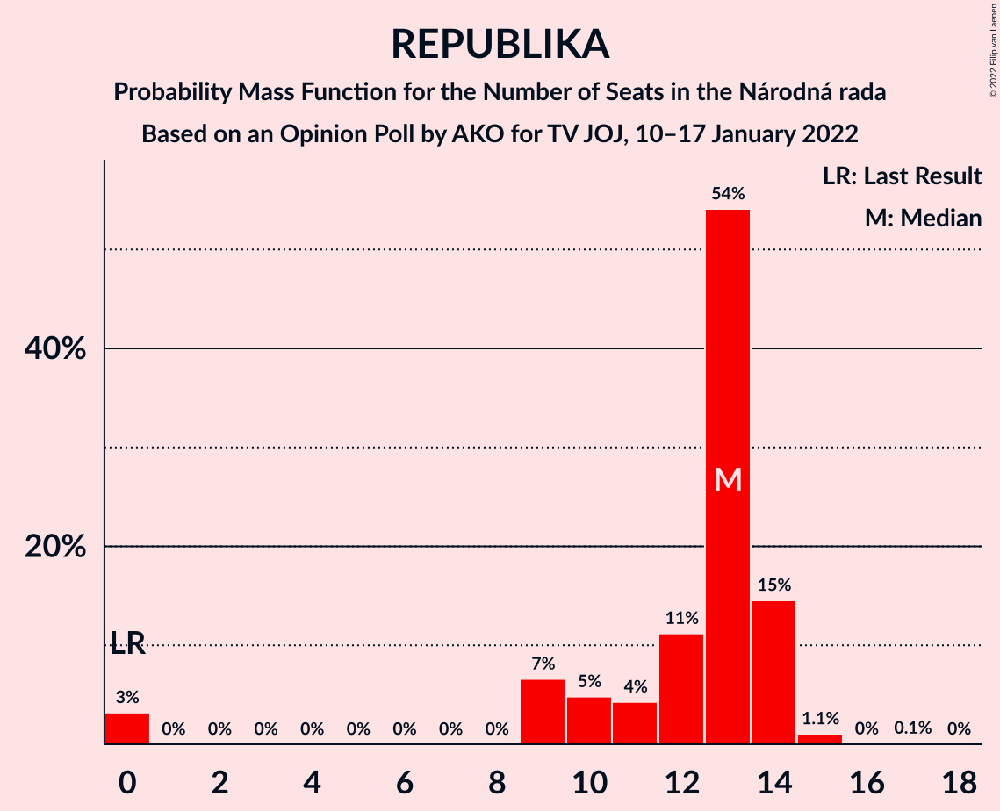
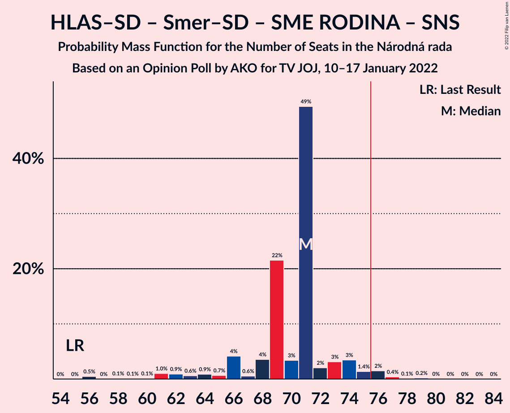

# Opinion Poll by AKO for TV JOJ, 10–17 January 2022

<a href="#voting-intentions">Voting Intentions</a> | <a href="#seats">Seats</a> | <a href="#coalitions">Coalitions</a> | <a href="#technical-information">Technical Information</a>

## Voting Intentions

### Confidence Intervals

| Party | Last Result | Poll Result | 80% Confidence Interval | 90% Confidence Interval | 95% Confidence Interval | 99% Confidence Interval |
|:-----:|:-----------:|:-----------:|:-----------------------:|:-----------------------:|:-----------------------:|:-----------------------:|
| HLAS–sociálna demokracia | 0.0% | 18.0% | 16.5–19.6% |16.1–20.1% |15.7–20.5% |15.0–21.3% |
| Sloboda a Solidarita | 6.2% | 14.2% | 12.9–15.7% |12.5–16.1% |12.2–16.5% |11.6–17.3% |
| SMER–sociálna demokracia | 18.3% | 13.8% | 12.5–15.3% |12.1–15.7% |11.8–16.1% |11.2–16.8% |
| OBYČAJNÍ ĽUDIA a nezávislé osobnosti | 25.0% | 9.3% | 8.2–10.6% |7.9–10.9% |7.7–11.3% |7.2–11.9% |
| Progresívne Slovensko | 7.0% | 8.5% | 7.5–9.7% |7.2–10.1% |6.9–10.4% |6.4–11.0% |
| SME RODINA | 8.2% | 6.5% | 5.6–7.6% |5.3–7.9% |5.1–8.2% |4.7–8.8% |
| REPUBLIKA | 0.0% | 6.2% | 5.3–7.3% |5.1–7.6% |4.9–7.9% |4.5–8.4% |
| Kresťanskodemokratické hnutie | 4.6% | 6.0% | 5.1–7.1% |4.9–7.4% |4.7–7.7% |4.3–8.2% |
| Strana maďarskej koalície–Magyar Koalíció Pártja | 3.9% | 4.0% | 3.3–4.9% |3.1–5.2% |2.9–5.4% |2.7–5.9% |
| Slovenská národná strana | 3.2% | 3.6% | 2.9–4.5% |2.8–4.7% |2.6–5.0% |2.3–5.4% |
| Kotleba–Ľudová strana Naše Slovensko | 8.0% | 2.9% | 2.3–3.7% |2.2–3.9% |2.0–4.1% |1.8–4.6% |
| Za ľudí | 5.8% | 2.2% | 1.7–2.9% |1.6–3.1% |1.4–3.3% |1.2–3.7% |
| Dobrá voľba | 3.1% | 2.0% | 1.5–2.7% |1.4–2.9% |1.3–3.1% |1.1–3.4% |
| SPOLU–Občianska Demokracia | 7.0% | 0.8% | 0.5–1.3% |0.5–1.4% |0.4–1.6% |0.3–1.9% |

*Note:* The poll result column reflects the actual value used in the calculations. Published results may vary slightly, and in addition be rounded to fewer digits.

## Seats

### Confidence Intervals

| Party | Last Result | Median | 80% Confidence Interval | 90% Confidence Interval | 95% Confidence Interval | 99% Confidence Interval |
|:-----:|:-----------:|:------:|:-----------------------:|:-----------------------:|:-----------------------:|:-----------------------:|
| <a href="#hlas–sociálna-demokracia">HLAS–sociálna demokracia</a> | 0 | 33 | 30–37 |30–37 |28–39 |26–39 |
| <a href="#sloboda-a-solidarita">Sloboda a Solidarita</a> | 13 | 23 | 23–29 |22–29 |22–29 |21–33 |
| <a href="#smer–sociálna-demokracia">SMER–sociálna demokracia</a> | 38 | 24 | 23–27 |22–30 |21–30 |20–31 |
| <a href="#obyčajní-ľudia-a-nezávislé-osobnosti">OBYČAJNÍ ĽUDIA a nezávislé osobnosti</a> | 53 | 17 | 15–19 |14–19 |14–20 |13–21 |
| <a href="#progresívne-slovensko">Progresívne Slovensko</a> | 0 | 15 | 14–18 |13–18 |12–18 |11–20 |
| <a href="#sme-rodina">SME RODINA</a> | 17 | 12 | 10–14 |9–14 |9–15 |0–16 |
| <a href="#republika">REPUBLIKA</a> | 0 | 13 | 10–14 |9–14 |0–14 |0–15 |
| <a href="#kresťanskodemokratické-hnutie">Kresťanskodemokratické hnutie</a> | 0 | 11 | 0–13 |0–14 |0–14 |0–16 |
| <a href="#strana-maďarskej-koalície–magyar-koalíció-pártja">Strana maďarskej koalície–Magyar Koalíció Pártja</a> | 0 | 0 | 0 |0–10 |0–10 |0–11 |
| <a href="#slovenská-národná-strana">Slovenská národná strana</a> | 0 | 0 | 0 |0 |0 |0–9 |
| <a href="#kotleba–ľudová-strana-naše-slovensko">Kotleba–Ľudová strana Naše Slovensko</a> | 17 | 0 | 0 |0 |0 |0 |
| <a href="#za-ľudí">Za ľudí</a> | 12 | 0 | 0 |0 |0 |0 |
| <a href="#dobrá-voľba">Dobrá voľba</a> | 0 | 0 | 0 |0 |0 |0 |
| <a href="#spolu–občianska-demokracia">SPOLU–Občianska Demokracia</a> | 0 | 0 | 0 |0 |0 |0 |

### HLAS–sociálna demokracia

*For a full overview of the results for this party, see the [HLAS–sociálna demokracia](party-hlas–sociálnademokracia.html) page.*

| Number of Seats | Probability | Accumulated | Special Marks |
|:---------------:|:-----------:|:-----------:|:-------------:|
| 0 | 0% | 100% | Last Result |
| 1 | 0% | 100% |  |
| 2 | 0% | 100% |  |
| 3 | 0% | 100% |  |
| 4 | 0% | 100% |  |
| 5 | 0% | 100% |  |
| 6 | 0% | 100% |  |
| 7 | 0% | 100% |  |
| 8 | 0% | 100% |  |
| 9 | 0% | 100% |  |
| 10 | 0% | 100% |  |
| 11 | 0% | 100% |  |
| 12 | 0% | 100% |  |
| 13 | 0% | 100% |  |
| 14 | 0% | 100% |  |
| 15 | 0% | 100% |  |
| 16 | 0% | 100% |  |
| 17 | 0% | 100% |  |
| 18 | 0% | 100% |  |
| 19 | 0% | 100% |  |
| 20 | 0% | 100% |  |
| 21 | 0% | 100% |  |
| 22 | 0% | 100% |  |
| 23 | 0% | 100% |  |
| 24 | 0% | 100% |  |
| 25 | 0% | 100% |  |
| 26 | 1.1% | 100% |  |
| 27 | 0.9% | 98.8% |  |
| 28 | 1.4% | 98% |  |
| 29 | 1.3% | 97% |  |
| 30 | 18% | 95% |  |
| 31 | 2% | 77% |  |
| 32 | 8% | 76% |  |
| 33 | 25% | 68% | Median |
| 34 | 2% | 43% |  |
| 35 | 5% | 41% |  |
| 36 | 0.5% | 36% |  |
| 37 | 32% | 36% |  |
| 38 | 1.0% | 4% |  |
| 39 | 3% | 3% |  |
| 40 | 0.1% | 0.3% |  |
| 41 | 0.1% | 0.2% |  |
| 42 | 0.1% | 0.2% |  |
| 43 | 0.1% | 0.1% |  |
| 44 | 0% | 0% |  |

### Sloboda a Solidarita

*For a full overview of the results for this party, see the [Sloboda a Solidarita](party-slobodaasolidarita.html) page.*

| Number of Seats | Probability | Accumulated | Special Marks |
|:---------------:|:-----------:|:-----------:|:-------------:|
| 13 | 0% | 100% | Last Result |
| 14 | 0% | 100% |  |
| 15 | 0% | 100% |  |
| 16 | 0% | 100% |  |
| 17 | 0% | 100% |  |
| 18 | 0% | 100% |  |
| 19 | 0% | 100% |  |
| 20 | 0.1% | 100% |  |
| 21 | 0.9% | 99.9% |  |
| 22 | 4% | 99.0% |  |
| 23 | 54% | 95% | Median |
| 24 | 2% | 41% |  |
| 25 | 7% | 38% |  |
| 26 | 4% | 31% |  |
| 27 | 4% | 27% |  |
| 28 | 5% | 22% |  |
| 29 | 15% | 17% |  |
| 30 | 1.2% | 2% |  |
| 31 | 0.2% | 1.2% |  |
| 32 | 0.5% | 1.0% |  |
| 33 | 0.5% | 0.5% |  |
| 34 | 0% | 0.1% |  |
| 35 | 0% | 0% |  |

### SMER–sociálna demokracia

*For a full overview of the results for this party, see the [SMER–sociálna demokracia](party-smer–sociálnademokracia.html) page.*

| Number of Seats | Probability | Accumulated | Special Marks |
|:---------------:|:-----------:|:-----------:|:-------------:|
| 19 | 0.1% | 100% |  |
| 20 | 0.7% | 99.9% |  |
| 21 | 2% | 99.2% |  |
| 22 | 7% | 97% |  |
| 23 | 31% | 90% |  |
| 24 | 24% | 60% | Median |
| 25 | 2% | 35% |  |
| 26 | 6% | 33% |  |
| 27 | 18% | 27% |  |
| 28 | 0.7% | 9% |  |
| 29 | 2% | 8% |  |
| 30 | 5% | 6% |  |
| 31 | 1.0% | 1.3% |  |
| 32 | 0.1% | 0.2% |  |
| 33 | 0.1% | 0.1% |  |
| 34 | 0% | 0% |  |
| 35 | 0% | 0% |  |
| 36 | 0% | 0% |  |
| 37 | 0% | 0% |  |
| 38 | 0% | 0% | Last Result |

### OBYČAJNÍ ĽUDIA a nezávislé osobnosti

*For a full overview of the results for this party, see the [OBYČAJNÍ ĽUDIA a nezávislé osobnosti](party-obyčajníľudiaanezávisléosobnosti.html) page.*

| Number of Seats | Probability | Accumulated | Special Marks |
|:---------------:|:-----------:|:-----------:|:-------------:|
| 12 | 0.1% | 100% |  |
| 13 | 1.3% | 99.9% |  |
| 14 | 4% | 98.6% |  |
| 15 | 9% | 94% |  |
| 16 | 7% | 86% |  |
| 17 | 33% | 78% | Median |
| 18 | 17% | 46% |  |
| 19 | 25% | 29% |  |
| 20 | 3% | 4% |  |
| 21 | 0.6% | 1.0% |  |
| 22 | 0.1% | 0.4% |  |
| 23 | 0.2% | 0.3% |  |
| 24 | 0% | 0% |  |
| 25 | 0% | 0% |  |
| 26 | 0% | 0% |  |
| 27 | 0% | 0% |  |
| 28 | 0% | 0% |  |
| 29 | 0% | 0% |  |
| 30 | 0% | 0% |  |
| 31 | 0% | 0% |  |
| 32 | 0% | 0% |  |
| 33 | 0% | 0% |  |
| 34 | 0% | 0% |  |
| 35 | 0% | 0% |  |
| 36 | 0% | 0% |  |
| 37 | 0% | 0% |  |
| 38 | 0% | 0% |  |
| 39 | 0% | 0% |  |
| 40 | 0% | 0% |  |
| 41 | 0% | 0% |  |
| 42 | 0% | 0% |  |
| 43 | 0% | 0% |  |
| 44 | 0% | 0% |  |
| 45 | 0% | 0% |  |
| 46 | 0% | 0% |  |
| 47 | 0% | 0% |  |
| 48 | 0% | 0% |  |
| 49 | 0% | 0% |  |
| 50 | 0% | 0% |  |
| 51 | 0% | 0% |  |
| 52 | 0% | 0% |  |
| 53 | 0% | 0% | Last Result |

### Progresívne Slovensko

*For a full overview of the results for this party, see the [Progresívne Slovensko](party-progresívneslovensko.html) page.*

| Number of Seats | Probability | Accumulated | Special Marks |
|:---------------:|:-----------:|:-----------:|:-------------:|
| 0 | 0% | 100% | Last Result |
| 1 | 0% | 100% |  |
| 2 | 0% | 100% |  |
| 3 | 0% | 100% |  |
| 4 | 0% | 100% |  |
| 5 | 0% | 100% |  |
| 6 | 0% | 100% |  |
| 7 | 0% | 100% |  |
| 8 | 0% | 100% |  |
| 9 | 0% | 100% |  |
| 10 | 0.1% | 100% |  |
| 11 | 0.9% | 99.9% |  |
| 12 | 3% | 99.0% |  |
| 13 | 5% | 96% |  |
| 14 | 28% | 91% |  |
| 15 | 36% | 63% | Median |
| 16 | 3% | 27% |  |
| 17 | 8% | 24% |  |
| 18 | 14% | 16% |  |
| 19 | 1.1% | 2% |  |
| 20 | 0.9% | 1.0% |  |
| 21 | 0.1% | 0.1% |  |
| 22 | 0.1% | 0.1% |  |
| 23 | 0% | 0% |  |

### SME RODINA

*For a full overview of the results for this party, see the [SME RODINA](party-smerodina.html) page.*

| Number of Seats | Probability | Accumulated | Special Marks |
|:---------------:|:-----------:|:-----------:|:-------------:|
| 0 | 2% | 100% |  |
| 1 | 0% | 98% |  |
| 2 | 0% | 98% |  |
| 3 | 0% | 98% |  |
| 4 | 0% | 98% |  |
| 5 | 0% | 98% |  |
| 6 | 0% | 98% |  |
| 7 | 0% | 98% |  |
| 8 | 0% | 98% |  |
| 9 | 5% | 98% |  |
| 10 | 3% | 93% |  |
| 11 | 36% | 90% |  |
| 12 | 30% | 54% | Median |
| 13 | 6% | 24% |  |
| 14 | 14% | 18% |  |
| 15 | 3% | 4% |  |
| 16 | 0.7% | 0.9% |  |
| 17 | 0.1% | 0.2% | Last Result |
| 18 | 0.1% | 0.1% |  |
| 19 | 0% | 0% |  |

### REPUBLIKA

*For a full overview of the results for this party, see the [REPUBLIKA](party-republika.html) page.*

| Number of Seats | Probability | Accumulated | Special Marks |
|:---------------:|:-----------:|:-----------:|:-------------:|
| 0 | 3% | 100% | Last Result |
| 1 | 0% | 97% |  |
| 2 | 0% | 97% |  |
| 3 | 0% | 97% |  |
| 4 | 0% | 97% |  |
| 5 | 0% | 97% |  |
| 6 | 0% | 97% |  |
| 7 | 0% | 97% |  |
| 8 | 0% | 97% |  |
| 9 | 7% | 97% |  |
| 10 | 5% | 90% |  |
| 11 | 4% | 85% |  |
| 12 | 11% | 81% |  |
| 13 | 54% | 70% | Median |
| 14 | 15% | 16% |  |
| 15 | 1.1% | 1.2% |  |
| 16 | 0% | 0.2% |  |
| 17 | 0.1% | 0.1% |  |
| 18 | 0% | 0% |  |

### Kresťanskodemokratické hnutie

*For a full overview of the results for this party, see the [Kresťanskodemokratické hnutie](party-kresťanskodemokratickéhnutie.html) page.*

| Number of Seats | Probability | Accumulated | Special Marks |
|:---------------:|:-----------:|:-----------:|:-------------:|
| 0 | 16% | 100% | Last Result |
| 1 | 0% | 84% |  |
| 2 | 0% | 84% |  |
| 3 | 0% | 84% |  |
| 4 | 0% | 84% |  |
| 5 | 0% | 84% |  |
| 6 | 0% | 84% |  |
| 7 | 0% | 84% |  |
| 8 | 0% | 84% |  |
| 9 | 3% | 84% |  |
| 10 | 10% | 81% |  |
| 11 | 37% | 71% | Median |
| 12 | 23% | 34% |  |
| 13 | 1.3% | 10% |  |
| 14 | 8% | 9% |  |
| 15 | 0.5% | 1.5% |  |
| 16 | 1.0% | 1.0% |  |
| 17 | 0% | 0% |  |

### Strana maďarskej koalície–Magyar Koalíció Pártja

*For a full overview of the results for this party, see the [Strana maďarskej koalície–Magyar Koalíció Pártja](party-stranamaďarskejkoalície–magyarkoalíciópártja.html) page.*

| Number of Seats | Probability | Accumulated | Special Marks |
|:---------------:|:-----------:|:-----------:|:-------------:|
| 0 | 92% | 100% | Last Result, Median |
| 1 | 0% | 8% |  |
| 2 | 0% | 8% |  |
| 3 | 0% | 8% |  |
| 4 | 0% | 8% |  |
| 5 | 0% | 8% |  |
| 6 | 0% | 8% |  |
| 7 | 0% | 8% |  |
| 8 | 0% | 8% |  |
| 9 | 3% | 8% |  |
| 10 | 4% | 5% |  |
| 11 | 0.8% | 0.8% |  |
| 12 | 0.1% | 0.1% |  |
| 13 | 0% | 0% |  |

### Slovenská národná strana

*For a full overview of the results for this party, see the [Slovenská národná strana](party-slovenskánárodnástrana.html) page.*

| Number of Seats | Probability | Accumulated | Special Marks |
|:---------------:|:-----------:|:-----------:|:-------------:|
| 0 | 99.2% | 100% | Last Result, Median |
| 1 | 0% | 0.8% |  |
| 2 | 0% | 0.8% |  |
| 3 | 0% | 0.8% |  |
| 4 | 0% | 0.8% |  |
| 5 | 0% | 0.8% |  |
| 6 | 0% | 0.8% |  |
| 7 | 0% | 0.8% |  |
| 8 | 0% | 0.8% |  |
| 9 | 0.6% | 0.8% |  |
| 10 | 0.2% | 0.3% |  |
| 11 | 0% | 0% |  |

### Kotleba–Ľudová strana Naše Slovensko

*For a full overview of the results for this party, see the [Kotleba–Ľudová strana Naše Slovensko](party-kotleba–ľudovástrananašeslovensko.html) page.*

| Number of Seats | Probability | Accumulated | Special Marks |
|:---------------:|:-----------:|:-----------:|:-------------:|
| 0 | 99.9% | 100% | Median |
| 1 | 0% | 0.1% |  |
| 2 | 0% | 0.1% |  |
| 3 | 0% | 0.1% |  |
| 4 | 0% | 0.1% |  |
| 5 | 0% | 0.1% |  |
| 6 | 0% | 0.1% |  |
| 7 | 0% | 0.1% |  |
| 8 | 0% | 0.1% |  |
| 9 | 0% | 0.1% |  |
| 10 | 0% | 0% |  |
| 11 | 0% | 0% |  |
| 12 | 0% | 0% |  |
| 13 | 0% | 0% |  |
| 14 | 0% | 0% |  |
| 15 | 0% | 0% |  |
| 16 | 0% | 0% |  |
| 17 | 0% | 0% | Last Result |

### Za ľudí

*For a full overview of the results for this party, see the [Za ľudí](party-zaľudí.html) page.*

| Number of Seats | Probability | Accumulated | Special Marks |
|:---------------:|:-----------:|:-----------:|:-------------:|
| 0 | 100% | 100% | Median |
| 1 | 0% | 0% |  |
| 2 | 0% | 0% |  |
| 3 | 0% | 0% |  |
| 4 | 0% | 0% |  |
| 5 | 0% | 0% |  |
| 6 | 0% | 0% |  |
| 7 | 0% | 0% |  |
| 8 | 0% | 0% |  |
| 9 | 0% | 0% |  |
| 10 | 0% | 0% |  |
| 11 | 0% | 0% |  |
| 12 | 0% | 0% | Last Result |

### Dobrá voľba

*For a full overview of the results for this party, see the [Dobrá voľba](party-dobrávoľba.html) page.*

| Number of Seats | Probability | Accumulated | Special Marks |
|:---------------:|:-----------:|:-----------:|:-------------:|
| 0 | 100% | 100% | Last Result, Median |

### SPOLU–Občianska Demokracia

*For a full overview of the results for this party, see the [SPOLU–Občianska Demokracia](party-spolu–občianskademokracia.html) page.*

| Number of Seats | Probability | Accumulated | Special Marks |
|:---------------:|:-----------:|:-----------:|:-------------:|
| 0 | 100% | 100% | Last Result, Median |

## Coalitions

### Confidence Intervals

| Coalition | Last Result | Median | Majority? | 80% Confidence Interval | 90% Confidence Interval | 95% Confidence Interval | 99% Confidence Interval |
|:---------:|:-----------:|:------:|:---------:|:-----------------------:|:-----------------------:|:-----------------------:|:-----------------------:|
| HLAS–sociálna demokracia – SMER–sociálna demokracia – SME RODINA – Slovenská národná strana – Kotleba–Ľudová strana Naše Slovensko | 72 | 71 | 2% | 68–73 | 66–74 | 62–75 | 57–77 |
| HLAS–sociálna demokracia – SMER–sociálna demokracia – SME RODINA | 55 | 71 | 2% | 67–72 | 65–74 | 62–75 | 57–77 |
| HLAS–sociálna demokracia – SMER–sociálna demokracia – SME RODINA – Slovenská národná strana | 55 | 71 | 2% | 68–73 | 66–74 | 62–75 | 57–77 |
| HLAS–sociálna demokracia – SMER–sociálna demokracia – Slovenská národná strana | 38 | 58 | 0.1% | 56–62 | 54–63 | 53–64 | 50–66 |
| HLAS–sociálna demokracia – SME RODINA – Slovenská národná strana – Kotleba–Ľudová strana Naše Slovensko | 34 | 45 | 0% | 42–48 | 40–49 | 39–50 | 32–54 |
| HLAS–sociálna demokracia – SME RODINA | 17 | 45 | 0% | 42–48 | 40–48 | 39–50 | 31–53 |
| HLAS–sociálna demokracia – SME RODINA – Slovenská národná strana | 17 | 45 | 0% | 42–48 | 40–49 | 39–50 | 32–54 |
| SMER–sociálna demokracia – SME RODINA – Slovenská národná strana – Kotleba–Ľudová strana Naše Slovensko | 72 | 36 | 0% | 34–41 | 33–41 | 31–42 | 27–46 |
| SMER–sociálna demokracia – SME RODINA | 55 | 36 | 0% | 34–41 | 33–41 | 31–42 | 27–45 |
| SMER–sociálna demokracia – SME RODINA – Slovenská národná strana | 55 | 36 | 0% | 34–41 | 33–41 | 31–42 | 27–46 |
| HLAS–sociálna demokracia – Slovenská národná strana | 0 | 33 | 0% | 30–37 | 30–37 | 28–39 | 26–41 |
| SMER–sociálna demokracia | 38 | 24 | 0% | 23–27 | 22–30 | 21–30 | 20–31 |
| SMER–sociálna demokracia – Slovenská národná strana | 38 | 24 | 0% | 23–27 | 22–30 | 21–30 | 20–32 |

### HLAS–sociálna demokracia – SMER–sociálna demokracia – SME RODINA – Slovenská národná strana – Kotleba–Ľudová strana Naše Slovensko

| Number of Seats | Probability | Accumulated | Special Marks |
|:---------------:|:-----------:|:-----------:|:-------------:|
| 56 | 0.5% | 100% |  |
| 57 | 0% | 99.5% |  |
| 58 | 0.1% | 99.5% |  |
| 59 | 0.1% | 99.4% |  |
| 60 | 0.1% | 99.3% |  |
| 61 | 1.0% | 99.2% |  |
| 62 | 0.9% | 98% |  |
| 63 | 0.6% | 97% |  |
| 64 | 0.9% | 97% |  |
| 65 | 0.7% | 96% |  |
| 66 | 4% | 95% |  |
| 67 | 0.5% | 91% |  |
| 68 | 4% | 90% |  |
| 69 | 22% | 87% | Median |
| 70 | 3% | 65% |  |
| 71 | 49% | 62% |  |
| 72 | 2% | 12% | Last Result |
| 73 | 3% | 10% |  |
| 74 | 3% | 7% |  |
| 75 | 1.4% | 4% |  |
| 76 | 2% | 2% | Majority |
| 77 | 0.4% | 0.9% |  |
| 78 | 0.1% | 0.5% |  |
| 79 | 0.2% | 0.4% |  |
| 80 | 0% | 0.2% |  |
| 81 | 0% | 0.1% |  |
| 82 | 0% | 0.1% |  |
| 83 | 0% | 0.1% |  |
| 84 | 0% | 0% |  |

### HLAS–sociálna demokracia – SMER–sociálna demokracia – SME RODINA

| Number of Seats | Probability | Accumulated | Special Marks |
|:---------------:|:-----------:|:-----------:|:-------------:|
| 55 | 0% | 100% | Last Result |
| 56 | 0.5% | 100% |  |
| 57 | 0% | 99.5% |  |
| 58 | 0.1% | 99.5% |  |
| 59 | 0.1% | 99.4% |  |
| 60 | 0.1% | 99.2% |  |
| 61 | 1.0% | 99.1% |  |
| 62 | 1.0% | 98% |  |
| 63 | 0.6% | 97% |  |
| 64 | 0.9% | 96% |  |
| 65 | 0.7% | 96% |  |
| 66 | 4% | 95% |  |
| 67 | 1.0% | 91% |  |
| 68 | 4% | 90% |  |
| 69 | 22% | 86% | Median |
| 70 | 3% | 65% |  |
| 71 | 49% | 61% |  |
| 72 | 2% | 12% |  |
| 73 | 3% | 10% |  |
| 74 | 3% | 7% |  |
| 75 | 1.4% | 3% |  |
| 76 | 1.1% | 2% | Majority |
| 77 | 0.3% | 0.7% |  |
| 78 | 0.1% | 0.3% |  |
| 79 | 0.1% | 0.3% |  |
| 80 | 0% | 0.1% |  |
| 81 | 0% | 0.1% |  |
| 82 | 0% | 0% |  |

### HLAS–sociálna demokracia – SMER–sociálna demokracia – SME RODINA – Slovenská národná strana

| Number of Seats | Probability | Accumulated | Special Marks |
|:---------------:|:-----------:|:-----------:|:-------------:|
| 55 | 0% | 100% | Last Result |
| 56 | 0.5% | 100% |  |
| 57 | 0% | 99.5% |  |
| 58 | 0.1% | 99.5% |  |
| 59 | 0.1% | 99.4% |  |
| 60 | 0.1% | 99.3% |  |
| 61 | 1.0% | 99.2% |  |
| 62 | 0.9% | 98% |  |
| 63 | 0.6% | 97% |  |
| 64 | 0.9% | 97% |  |
| 65 | 0.7% | 96% |  |
| 66 | 4% | 95% |  |
| 67 | 0.6% | 91% |  |
| 68 | 4% | 90% |  |
| 69 | 22% | 87% | Median |
| 70 | 3% | 65% |  |
| 71 | 49% | 62% |  |
| 72 | 2% | 12% |  |
| 73 | 3% | 10% |  |
| 74 | 3% | 7% |  |
| 75 | 1.4% | 4% |  |
| 76 | 2% | 2% | Majority |
| 77 | 0.4% | 0.8% |  |
| 78 | 0.1% | 0.4% |  |
| 79 | 0.2% | 0.3% |  |
| 80 | 0% | 0.1% |  |
| 81 | 0% | 0.1% |  |
| 82 | 0% | 0.1% |  |
| 83 | 0% | 0% |  |

### HLAS–sociálna demokracia – SMER–sociálna demokracia – Slovenská národná strana

| Number of Seats | Probability | Accumulated | Special Marks |
|:---------------:|:-----------:|:-----------:|:-------------:|
| 38 | 0% | 100% | Last Result |
| 39 | 0% | 100% |  |
| 40 | 0% | 100% |  |
| 41 | 0% | 100% |  |
| 42 | 0% | 100% |  |
| 43 | 0% | 100% |  |
| 44 | 0% | 100% |  |
| 45 | 0% | 100% |  |
| 46 | 0% | 100% |  |
| 47 | 0.1% | 100% |  |
| 48 | 0% | 99.9% |  |
| 49 | 0.1% | 99.9% |  |
| 50 | 1.0% | 99.8% |  |
| 51 | 0.4% | 98.8% |  |
| 52 | 0.8% | 98% |  |
| 53 | 2% | 98% |  |
| 54 | 0.8% | 96% |  |
| 55 | 5% | 95% |  |
| 56 | 3% | 90% |  |
| 57 | 35% | 88% | Median |
| 58 | 4% | 52% |  |
| 59 | 3% | 49% |  |
| 60 | 32% | 46% |  |
| 61 | 2% | 13% |  |
| 62 | 6% | 11% |  |
| 63 | 2% | 5% |  |
| 64 | 2% | 3% |  |
| 65 | 0.4% | 1.0% |  |
| 66 | 0.1% | 0.6% |  |
| 67 | 0.2% | 0.5% |  |
| 68 | 0.1% | 0.3% |  |
| 69 | 0.1% | 0.3% |  |
| 70 | 0% | 0.2% |  |
| 71 | 0.1% | 0.2% |  |
| 72 | 0% | 0.1% |  |
| 73 | 0% | 0.1% |  |
| 74 | 0% | 0.1% |  |
| 75 | 0% | 0.1% |  |
| 76 | 0% | 0.1% | Majority |
| 77 | 0.1% | 0.1% |  |
| 78 | 0% | 0% |  |

### HLAS–sociálna demokracia – SME RODINA – Slovenská národná strana – Kotleba–Ľudová strana Naše Slovensko

| Number of Seats | Probability | Accumulated | Special Marks |
|:---------------:|:-----------:|:-----------:|:-------------:|
| 29 | 0.5% | 100% |  |
| 30 | 0% | 99.5% |  |
| 31 | 0% | 99.5% |  |
| 32 | 0% | 99.5% |  |
| 33 | 0.1% | 99.5% |  |
| 34 | 0.1% | 99.4% | Last Result |
| 35 | 0.9% | 99.3% |  |
| 36 | 0% | 98% |  |
| 37 | 0.2% | 98% |  |
| 38 | 0.3% | 98% |  |
| 39 | 2% | 98% |  |
| 40 | 1.1% | 96% |  |
| 41 | 4% | 95% |  |
| 42 | 3% | 91% |  |
| 43 | 1.5% | 88% |  |
| 44 | 19% | 86% |  |
| 45 | 25% | 68% | Median |
| 46 | 3% | 43% |  |
| 47 | 2% | 40% |  |
| 48 | 32% | 38% |  |
| 49 | 2% | 5% |  |
| 50 | 1.4% | 3% |  |
| 51 | 0.2% | 2% |  |
| 52 | 0.1% | 2% |  |
| 53 | 1.0% | 2% |  |
| 54 | 0.4% | 0.7% |  |
| 55 | 0.2% | 0.3% |  |
| 56 | 0% | 0.1% |  |
| 57 | 0% | 0% |  |

### HLAS–sociálna demokracia – SME RODINA

| Number of Seats | Probability | Accumulated | Special Marks |
|:---------------:|:-----------:|:-----------:|:-------------:|
| 17 | 0% | 100% | Last Result |
| 18 | 0% | 100% |  |
| 19 | 0% | 100% |  |
| 20 | 0% | 100% |  |
| 21 | 0% | 100% |  |
| 22 | 0% | 100% |  |
| 23 | 0% | 100% |  |
| 24 | 0% | 100% |  |
| 25 | 0% | 100% |  |
| 26 | 0% | 100% |  |
| 27 | 0% | 100% |  |
| 28 | 0% | 100% |  |
| 29 | 0.5% | 100% |  |
| 30 | 0% | 99.5% |  |
| 31 | 0% | 99.5% |  |
| 32 | 0% | 99.5% |  |
| 33 | 0.1% | 99.5% |  |
| 34 | 0.2% | 99.4% |  |
| 35 | 0.9% | 99.3% |  |
| 36 | 0.1% | 98% |  |
| 37 | 0.3% | 98% |  |
| 38 | 0.3% | 98% |  |
| 39 | 2% | 98% |  |
| 40 | 1.2% | 95% |  |
| 41 | 4% | 94% |  |
| 42 | 3% | 90% |  |
| 43 | 2% | 87% |  |
| 44 | 19% | 86% |  |
| 45 | 25% | 67% | Median |
| 46 | 3% | 42% |  |
| 47 | 2% | 39% |  |
| 48 | 32% | 37% |  |
| 49 | 2% | 5% |  |
| 50 | 1.3% | 3% |  |
| 51 | 0.2% | 1.3% |  |
| 52 | 0.1% | 1.1% |  |
| 53 | 0.9% | 1.0% |  |
| 54 | 0% | 0.1% |  |
| 55 | 0.1% | 0.1% |  |
| 56 | 0% | 0% |  |

### HLAS–sociálna demokracia – SME RODINA – Slovenská národná strana

| Number of Seats | Probability | Accumulated | Special Marks |
|:---------------:|:-----------:|:-----------:|:-------------:|
| 17 | 0% | 100% | Last Result |
| 18 | 0% | 100% |  |
| 19 | 0% | 100% |  |
| 20 | 0% | 100% |  |
| 21 | 0% | 100% |  |
| 22 | 0% | 100% |  |
| 23 | 0% | 100% |  |
| 24 | 0% | 100% |  |
| 25 | 0% | 100% |  |
| 26 | 0% | 100% |  |
| 27 | 0% | 100% |  |
| 28 | 0% | 100% |  |
| 29 | 0.5% | 100% |  |
| 30 | 0% | 99.5% |  |
| 31 | 0% | 99.5% |  |
| 32 | 0% | 99.5% |  |
| 33 | 0.1% | 99.5% |  |
| 34 | 0.1% | 99.4% |  |
| 35 | 0.9% | 99.3% |  |
| 36 | 0% | 98% |  |
| 37 | 0.2% | 98% |  |
| 38 | 0.3% | 98% |  |
| 39 | 2% | 98% |  |
| 40 | 1.1% | 96% |  |
| 41 | 4% | 95% |  |
| 42 | 3% | 91% |  |
| 43 | 1.5% | 88% |  |
| 44 | 19% | 86% |  |
| 45 | 25% | 68% | Median |
| 46 | 3% | 43% |  |
| 47 | 2% | 40% |  |
| 48 | 32% | 38% |  |
| 49 | 2% | 5% |  |
| 50 | 1.4% | 3% |  |
| 51 | 0.2% | 2% |  |
| 52 | 0.1% | 2% |  |
| 53 | 0.9% | 2% |  |
| 54 | 0.4% | 0.6% |  |
| 55 | 0.2% | 0.2% |  |
| 56 | 0% | 0.1% |  |
| 57 | 0% | 0% |  |

### SMER–sociálna demokracia – SME RODINA – Slovenská národná strana – Kotleba–Ľudová strana Naše Slovensko

| Number of Seats | Probability | Accumulated | Special Marks |
|:---------------:|:-----------:|:-----------:|:-------------:|
| 24 | 0.1% | 100% |  |
| 25 | 0% | 99.9% |  |
| 26 | 0.1% | 99.8% |  |
| 27 | 1.3% | 99.8% |  |
| 28 | 0% | 98% |  |
| 29 | 0.1% | 98% |  |
| 30 | 0.1% | 98% |  |
| 31 | 1.2% | 98% |  |
| 32 | 1.2% | 97% |  |
| 33 | 3% | 96% |  |
| 34 | 32% | 93% |  |
| 35 | 4% | 60% |  |
| 36 | 22% | 56% | Median |
| 37 | 2% | 34% |  |
| 38 | 4% | 32% |  |
| 39 | 6% | 28% |  |
| 40 | 2% | 21% |  |
| 41 | 16% | 20% |  |
| 42 | 2% | 4% |  |
| 43 | 0.4% | 2% |  |
| 44 | 1.1% | 2% |  |
| 45 | 0.2% | 0.8% |  |
| 46 | 0.4% | 0.6% |  |
| 47 | 0.1% | 0.2% |  |
| 48 | 0% | 0.1% |  |
| 49 | 0% | 0.1% |  |
| 50 | 0% | 0% |  |
| 51 | 0% | 0% |  |
| 52 | 0% | 0% |  |
| 53 | 0% | 0% |  |
| 54 | 0% | 0% |  |
| 55 | 0% | 0% |  |
| 56 | 0% | 0% |  |
| 57 | 0% | 0% |  |
| 58 | 0% | 0% |  |
| 59 | 0% | 0% |  |
| 60 | 0% | 0% |  |
| 61 | 0% | 0% |  |
| 62 | 0% | 0% |  |
| 63 | 0% | 0% |  |
| 64 | 0% | 0% |  |
| 65 | 0% | 0% |  |
| 66 | 0% | 0% |  |
| 67 | 0% | 0% |  |
| 68 | 0% | 0% |  |
| 69 | 0% | 0% |  |
| 70 | 0% | 0% |  |
| 71 | 0% | 0% |  |
| 72 | 0% | 0% | Last Result |

### SMER–sociálna demokracia – SME RODINA

| Number of Seats | Probability | Accumulated | Special Marks |
|:---------------:|:-----------:|:-----------:|:-------------:|
| 24 | 0.2% | 100% |  |
| 25 | 0% | 99.8% |  |
| 26 | 0.1% | 99.7% |  |
| 27 | 1.3% | 99.6% |  |
| 28 | 0.1% | 98% |  |
| 29 | 0.1% | 98% |  |
| 30 | 0.1% | 98% |  |
| 31 | 1.2% | 98% |  |
| 32 | 1.3% | 97% |  |
| 33 | 3% | 96% |  |
| 34 | 32% | 92% |  |
| 35 | 4% | 60% |  |
| 36 | 22% | 56% | Median |
| 37 | 2% | 33% |  |
| 38 | 4% | 31% |  |
| 39 | 6% | 27% |  |
| 40 | 2% | 21% |  |
| 41 | 15% | 19% |  |
| 42 | 2% | 4% |  |
| 43 | 0.4% | 2% |  |
| 44 | 0.7% | 1.3% |  |
| 45 | 0.2% | 0.6% |  |
| 46 | 0.4% | 0.4% |  |
| 47 | 0% | 0% |  |
| 48 | 0% | 0% |  |
| 49 | 0% | 0% |  |
| 50 | 0% | 0% |  |
| 51 | 0% | 0% |  |
| 52 | 0% | 0% |  |
| 53 | 0% | 0% |  |
| 54 | 0% | 0% |  |
| 55 | 0% | 0% | Last Result |

### SMER–sociálna demokracia – SME RODINA – Slovenská národná strana

| Number of Seats | Probability | Accumulated | Special Marks |
|:---------------:|:-----------:|:-----------:|:-------------:|
| 24 | 0.1% | 100% |  |
| 25 | 0% | 99.9% |  |
| 26 | 0.1% | 99.8% |  |
| 27 | 1.3% | 99.8% |  |
| 28 | 0% | 98% |  |
| 29 | 0.1% | 98% |  |
| 30 | 0.1% | 98% |  |
| 31 | 1.2% | 98% |  |
| 32 | 1.2% | 97% |  |
| 33 | 3% | 96% |  |
| 34 | 32% | 93% |  |
| 35 | 4% | 60% |  |
| 36 | 22% | 56% | Median |
| 37 | 2% | 34% |  |
| 38 | 4% | 32% |  |
| 39 | 6% | 28% |  |
| 40 | 2% | 21% |  |
| 41 | 16% | 20% |  |
| 42 | 2% | 4% |  |
| 43 | 0.4% | 2% |  |
| 44 | 1.1% | 2% |  |
| 45 | 0.2% | 0.7% |  |
| 46 | 0.4% | 0.5% |  |
| 47 | 0.1% | 0.1% |  |
| 48 | 0% | 0.1% |  |
| 49 | 0% | 0.1% |  |
| 50 | 0% | 0% |  |
| 51 | 0% | 0% |  |
| 52 | 0% | 0% |  |
| 53 | 0% | 0% |  |
| 54 | 0% | 0% |  |
| 55 | 0% | 0% | Last Result |

### HLAS–sociálna demokracia – Slovenská národná strana

| Number of Seats | Probability | Accumulated | Special Marks |
|:---------------:|:-----------:|:-----------:|:-------------:|
| 0 | 0% | 100% | Last Result |
| 1 | 0% | 100% |  |
| 2 | 0% | 100% |  |
| 3 | 0% | 100% |  |
| 4 | 0% | 100% |  |
| 5 | 0% | 100% |  |
| 6 | 0% | 100% |  |
| 7 | 0% | 100% |  |
| 8 | 0% | 100% |  |
| 9 | 0% | 100% |  |
| 10 | 0% | 100% |  |
| 11 | 0% | 100% |  |
| 12 | 0% | 100% |  |
| 13 | 0% | 100% |  |
| 14 | 0% | 100% |  |
| 15 | 0% | 100% |  |
| 16 | 0% | 100% |  |
| 17 | 0% | 100% |  |
| 18 | 0% | 100% |  |
| 19 | 0% | 100% |  |
| 20 | 0% | 100% |  |
| 21 | 0% | 100% |  |
| 22 | 0% | 100% |  |
| 23 | 0% | 100% |  |
| 24 | 0% | 100% |  |
| 25 | 0% | 100% |  |
| 26 | 1.1% | 100% |  |
| 27 | 0.9% | 98.9% |  |
| 28 | 1.3% | 98% |  |
| 29 | 1.3% | 97% |  |
| 30 | 18% | 95% |  |
| 31 | 2% | 78% |  |
| 32 | 7% | 76% |  |
| 33 | 25% | 69% | Median |
| 34 | 2% | 43% |  |
| 35 | 5% | 42% |  |
| 36 | 0.5% | 37% |  |
| 37 | 32% | 36% |  |
| 38 | 1.0% | 5% |  |
| 39 | 3% | 4% |  |
| 40 | 0.2% | 0.9% |  |
| 41 | 0.4% | 0.7% |  |
| 42 | 0.1% | 0.3% |  |
| 43 | 0% | 0.2% |  |
| 44 | 0% | 0.2% |  |
| 45 | 0% | 0.1% |  |
| 46 | 0% | 0.1% |  |
| 47 | 0% | 0.1% |  |
| 48 | 0% | 0.1% |  |
| 49 | 0% | 0.1% |  |
| 50 | 0% | 0.1% |  |
| 51 | 0% | 0.1% |  |
| 52 | 0% | 0.1% |  |
| 53 | 0.1% | 0.1% |  |
| 54 | 0% | 0% |  |

### SMER–sociálna demokracia

| Number of Seats | Probability | Accumulated | Special Marks |
|:---------------:|:-----------:|:-----------:|:-------------:|
| 19 | 0.1% | 100% |  |
| 20 | 0.7% | 99.9% |  |
| 21 | 2% | 99.2% |  |
| 22 | 7% | 97% |  |
| 23 | 31% | 90% |  |
| 24 | 24% | 60% | Median |
| 25 | 2% | 35% |  |
| 26 | 6% | 33% |  |
| 27 | 18% | 27% |  |
| 28 | 0.7% | 9% |  |
| 29 | 2% | 8% |  |
| 30 | 5% | 6% |  |
| 31 | 1.0% | 1.3% |  |
| 32 | 0.1% | 0.2% |  |
| 33 | 0.1% | 0.1% |  |
| 34 | 0% | 0% |  |
| 35 | 0% | 0% |  |
| 36 | 0% | 0% |  |
| 37 | 0% | 0% |  |
| 38 | 0% | 0% | Last Result |

### SMER–sociálna demokracia – Slovenská národná strana

| Number of Seats | Probability | Accumulated | Special Marks |
|:---------------:|:-----------:|:-----------:|:-------------:|
| 19 | 0.1% | 100% |  |
| 20 | 0.7% | 99.9% |  |
| 21 | 2% | 99.3% |  |
| 22 | 7% | 97% |  |
| 23 | 31% | 91% |  |
| 24 | 24% | 60% | Median |
| 25 | 2% | 36% |  |
| 26 | 6% | 34% |  |
| 27 | 18% | 28% |  |
| 28 | 0.7% | 10% |  |
| 29 | 2% | 9% |  |
| 30 | 5% | 7% |  |
| 31 | 1.5% | 2% |  |
| 32 | 0.2% | 0.5% |  |
| 33 | 0.1% | 0.3% |  |
| 34 | 0.1% | 0.2% |  |
| 35 | 0% | 0.1% |  |
| 36 | 0% | 0.1% |  |
| 37 | 0% | 0% |  |
| 38 | 0% | 0% | Last Result |

## Technical Information

### Opinion Poll

+ **Polling firm:** AKO
+ **Commissioner(s):** TV JOJ
+ **Fieldwork period:** 10–17 January 2022

### Calculations

+ **Sample size:** 1000
+ **Simulations done:** 1,048,576
+ **Error estimate:** 5.17%

