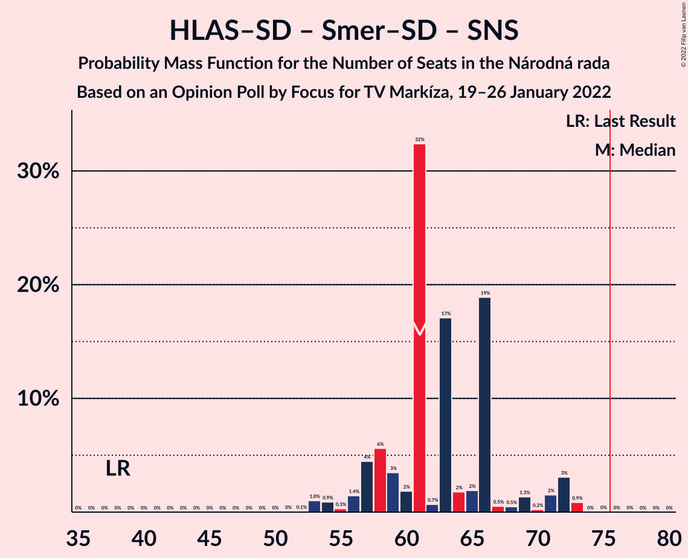

# Opinion Poll by Focus for TV Markíza, 19–26 January 2022

<a href="#voting-intentions">Voting Intentions</a> | <a href="#seats">Seats</a> | <a href="#coalitions">Coalitions</a> | <a href="#technical-information">Technical Information</a>

## Voting Intentions

### Confidence Intervals

| Party | Last Result | Poll Result | 80% Confidence Interval | 90% Confidence Interval | 95% Confidence Interval | 99% Confidence Interval |
|:-----:|:-----------:|:-----------:|:-----------------------:|:-----------------------:|:-----------------------:|:-----------------------:|
| HLAS–sociálna demokracia | 0.0% | 17.8% | 16.3–19.4% |15.9–19.9% |15.6–20.3% |14.9–21.1% |
| SMER–sociálna demokracia | 18.3% | 16.3% | 14.9–17.9% |14.5–18.3% |14.2–18.7% |13.5–19.5% |
| Sloboda a Solidarita | 6.2% | 11.1% | 9.9–12.5% |9.6–12.9% |9.3–13.2% |8.8–13.9% |
| Progresívne Slovensko | 7.0% | 8.3% | 7.2–9.5% |7.0–9.8% |6.7–10.1% |6.3–10.7% |
| OBYČAJNÍ ĽUDIA a nezávislé osobnosti | 25.0% | 8.0% | 7.0–9.2% |6.7–9.5% |6.4–9.8% |6.0–10.4% |
| REPUBLIKA | 0.0% | 7.8% | 6.8–8.9% |6.5–9.3% |6.3–9.6% |5.8–10.2% |
| SME RODINA | 8.2% | 6.1% | 5.2–7.2% |5.0–7.5% |4.8–7.7% |4.4–8.3% |
| Kresťanskodemokratické hnutie | 4.6% | 5.8% | 5.0–6.9% |4.7–7.1% |4.5–7.4% |4.1–8.0% |
| Strana maďarskej koalície–Magyar Koalíció Pártja | 3.9% | 4.4% | 3.7–5.4% |3.5–5.6% |3.3–5.9% |3.0–6.4% |
| Kotleba–Ľudová strana Naše Slovensko | 8.0% | 4.3% | 3.6–5.3% |3.4–5.5% |3.2–5.8% |2.9–6.2% |
| Slovenská národná strana | 3.2% | 3.9% | 3.2–4.8% |3.1–5.1% |2.9–5.3% |2.6–5.8% |
| Za ľudí | 5.8% | 3.0% | 2.5–3.9% |2.3–4.1% |2.1–4.3% |1.9–4.7% |
| Dobrá voľba | 3.1% | 1.0% | 0.7–1.5% |0.6–1.7% |0.5–1.8% |0.4–2.1% |
| SPOLU–Občianska Demokracia | 7.0% | 0.7% | 0.5–1.2% |0.4–1.3% |0.3–1.4% |0.2–1.7% |

*Note:* The poll result column reflects the actual value used in the calculations. Published results may vary slightly, and in addition be rounded to fewer digits.

## Seats

### Confidence Intervals

| Party | Last Result | Median | 80% Confidence Interval | 90% Confidence Interval | 95% Confidence Interval | 99% Confidence Interval |
|:-----:|:-----------:|:------:|:-----------------------:|:-----------------------:|:-----------------------:|:-----------------------:|
| <a href="#hlas–sociálna-demokracia">HLAS–sociálna demokracia</a> | 0 | 34 | 30–36 |29–38 |28–39 |26–41 |
| <a href="#smer–sociálna-demokracia">SMER–sociálna demokracia</a> | 38 | 27 | 26–33 |25–33 |25–34 |23–36 |
| <a href="#sloboda-a-solidarita">Sloboda a Solidarita</a> | 13 | 18 | 18–21 |17–23 |17–24 |16–25 |
| <a href="#progresívne-slovensko">Progresívne Slovensko</a> | 0 | 15 | 13–17 |13–17 |12–18 |11–20 |
| <a href="#obyčajní-ľudia-a-nezávislé-osobnosti">OBYČAJNÍ ĽUDIA a nezávislé osobnosti</a> | 53 | 13 | 12–17 |12–18 |11–20 |11–20 |
| <a href="#republika">REPUBLIKA</a> | 0 | 13 | 11–17 |11–17 |10–19 |9–20 |
| <a href="#sme-rodina">SME RODINA</a> | 17 | 9 | 9–12 |0–13 |0–13 |0–15 |
| <a href="#kresťanskodemokratické-hnutie">Kresťanskodemokratické hnutie</a> | 0 | 13 | 9–13 |0–13 |0–13 |0–14 |
| <a href="#strana-maďarskej-koalície–magyar-koalíció-pártja">Strana maďarskej koalície–Magyar Koalíció Pártja</a> | 0 | 0 | 0–9 |0–10 |0–10 |0–12 |
| <a href="#kotleba–ľudová-strana-naše-slovensko">Kotleba–Ľudová strana Naše Slovensko</a> | 17 | 0 | 0–9 |0–9 |0–10 |0–11 |
| <a href="#slovenská-národná-strana">Slovenská národná strana</a> | 0 | 0 | 0 |0 |0 |0–10 |
| <a href="#za-ľudí">Za ľudí</a> | 12 | 0 | 0 |0 |0 |0 |
| <a href="#dobrá-voľba">Dobrá voľba</a> | 0 | 0 | 0 |0 |0 |0 |
| <a href="#spolu–občianska-demokracia">SPOLU–Občianska Demokracia</a> | 0 | 0 | 0 |0 |0 |0 |

### HLAS–sociálna demokracia

*For a full overview of the results for this party, see the [HLAS–sociálna demokracia](party-hlas–sociálnademokracia.html) page.*

| Number of Seats | Probability | Accumulated | Special Marks |
|:---------------:|:-----------:|:-----------:|:-------------:|
| 0 | 0% | 100% | Last Result |
| 1 | 0% | 100% |  |
| 2 | 0% | 100% |  |
| 3 | 0% | 100% |  |
| 4 | 0% | 100% |  |
| 5 | 0% | 100% |  |
| 6 | 0% | 100% |  |
| 7 | 0% | 100% |  |
| 8 | 0% | 100% |  |
| 9 | 0% | 100% |  |
| 10 | 0% | 100% |  |
| 11 | 0% | 100% |  |
| 12 | 0% | 100% |  |
| 13 | 0% | 100% |  |
| 14 | 0% | 100% |  |
| 15 | 0% | 100% |  |
| 16 | 0% | 100% |  |
| 17 | 0% | 100% |  |
| 18 | 0% | 100% |  |
| 19 | 0% | 100% |  |
| 20 | 0% | 100% |  |
| 21 | 0% | 100% |  |
| 22 | 0% | 100% |  |
| 23 | 0% | 100% |  |
| 24 | 0.1% | 100% |  |
| 25 | 0.1% | 99.9% |  |
| 26 | 0.8% | 99.9% |  |
| 27 | 0.7% | 99.1% |  |
| 28 | 2% | 98% |  |
| 29 | 2% | 96% |  |
| 30 | 5% | 94% |  |
| 31 | 4% | 89% |  |
| 32 | 8% | 85% |  |
| 33 | 21% | 77% |  |
| 34 | 34% | 56% | Median |
| 35 | 2% | 22% |  |
| 36 | 13% | 20% |  |
| 37 | 0.8% | 7% |  |
| 38 | 2% | 6% |  |
| 39 | 2% | 4% |  |
| 40 | 0.4% | 2% |  |
| 41 | 1.5% | 2% |  |
| 42 | 0.3% | 0.3% |  |
| 43 | 0% | 0% |  |

### SMER–sociálna demokracia

*For a full overview of the results for this party, see the [SMER–sociálna demokracia](party-smer–sociálnademokracia.html) page.*

| Number of Seats | Probability | Accumulated | Special Marks |
|:---------------:|:-----------:|:-----------:|:-------------:|
| 22 | 0.1% | 100% |  |
| 23 | 0.4% | 99.9% |  |
| 24 | 0.4% | 99.5% |  |
| 25 | 4% | 99.1% |  |
| 26 | 8% | 95% |  |
| 27 | 44% | 87% | Median |
| 28 | 3% | 43% |  |
| 29 | 9% | 40% |  |
| 30 | 5% | 31% |  |
| 31 | 3% | 27% |  |
| 32 | 0.7% | 24% |  |
| 33 | 20% | 23% |  |
| 34 | 2% | 3% |  |
| 35 | 0.3% | 1.0% |  |
| 36 | 0.4% | 0.6% |  |
| 37 | 0.1% | 0.2% |  |
| 38 | 0.1% | 0.1% | Last Result |
| 39 | 0% | 0% |  |

### Sloboda a Solidarita

*For a full overview of the results for this party, see the [Sloboda a Solidarita](party-slobodaasolidarita.html) page.*

| Number of Seats | Probability | Accumulated | Special Marks |
|:---------------:|:-----------:|:-----------:|:-------------:|
| 13 | 0% | 100% | Last Result |
| 14 | 0.1% | 100% |  |
| 15 | 0.3% | 99.9% |  |
| 16 | 1.1% | 99.6% |  |
| 17 | 6% | 98.5% |  |
| 18 | 47% | 93% | Median |
| 19 | 4% | 45% |  |
| 20 | 12% | 41% |  |
| 21 | 20% | 29% |  |
| 22 | 3% | 9% |  |
| 23 | 2% | 6% |  |
| 24 | 3% | 4% |  |
| 25 | 0.9% | 1.2% |  |
| 26 | 0.3% | 0.4% |  |
| 27 | 0% | 0% |  |

### Progresívne Slovensko

*For a full overview of the results for this party, see the [Progresívne Slovensko](party-progresívneslovensko.html) page.*

| Number of Seats | Probability | Accumulated | Special Marks |
|:---------------:|:-----------:|:-----------:|:-------------:|
| 0 | 0% | 100% | Last Result |
| 1 | 0% | 100% |  |
| 2 | 0% | 100% |  |
| 3 | 0% | 100% |  |
| 4 | 0% | 100% |  |
| 5 | 0% | 100% |  |
| 6 | 0% | 100% |  |
| 7 | 0% | 100% |  |
| 8 | 0% | 100% |  |
| 9 | 0% | 100% |  |
| 10 | 0.2% | 100% |  |
| 11 | 2% | 99.8% |  |
| 12 | 2% | 98% |  |
| 13 | 8% | 96% |  |
| 14 | 23% | 89% |  |
| 15 | 34% | 65% | Median |
| 16 | 6% | 31% |  |
| 17 | 21% | 25% |  |
| 18 | 3% | 4% |  |
| 19 | 0.6% | 2% |  |
| 20 | 1.0% | 1.2% |  |
| 21 | 0.2% | 0.2% |  |
| 22 | 0% | 0.1% |  |
| 23 | 0.1% | 0.1% |  |
| 24 | 0% | 0% |  |

### OBYČAJNÍ ĽUDIA a nezávislé osobnosti

*For a full overview of the results for this party, see the [OBYČAJNÍ ĽUDIA a nezávislé osobnosti](party-obyčajníľudiaanezávisléosobnosti.html) page.*

| Number of Seats | Probability | Accumulated | Special Marks |
|:---------------:|:-----------:|:-----------:|:-------------:|
| 10 | 0.4% | 100% |  |
| 11 | 4% | 99.6% |  |
| 12 | 32% | 96% |  |
| 13 | 16% | 64% | Median |
| 14 | 12% | 48% |  |
| 15 | 5% | 36% |  |
| 16 | 20% | 31% |  |
| 17 | 5% | 11% |  |
| 18 | 3% | 6% |  |
| 19 | 0.4% | 3% |  |
| 20 | 2% | 3% |  |
| 21 | 0% | 0.3% |  |
| 22 | 0% | 0.3% |  |
| 23 | 0% | 0.3% |  |
| 24 | 0.3% | 0.3% |  |
| 25 | 0% | 0% |  |
| 26 | 0% | 0% |  |
| 27 | 0% | 0% |  |
| 28 | 0% | 0% |  |
| 29 | 0% | 0% |  |
| 30 | 0% | 0% |  |
| 31 | 0% | 0% |  |
| 32 | 0% | 0% |  |
| 33 | 0% | 0% |  |
| 34 | 0% | 0% |  |
| 35 | 0% | 0% |  |
| 36 | 0% | 0% |  |
| 37 | 0% | 0% |  |
| 38 | 0% | 0% |  |
| 39 | 0% | 0% |  |
| 40 | 0% | 0% |  |
| 41 | 0% | 0% |  |
| 42 | 0% | 0% |  |
| 43 | 0% | 0% |  |
| 44 | 0% | 0% |  |
| 45 | 0% | 0% |  |
| 46 | 0% | 0% |  |
| 47 | 0% | 0% |  |
| 48 | 0% | 0% |  |
| 49 | 0% | 0% |  |
| 50 | 0% | 0% |  |
| 51 | 0% | 0% |  |
| 52 | 0% | 0% |  |
| 53 | 0% | 0% | Last Result |

### REPUBLIKA

*For a full overview of the results for this party, see the [REPUBLIKA](party-republika.html) page.*

| Number of Seats | Probability | Accumulated | Special Marks |
|:---------------:|:-----------:|:-----------:|:-------------:|
| 0 | 0% | 100% | Last Result |
| 1 | 0% | 100% |  |
| 2 | 0% | 100% |  |
| 3 | 0% | 100% |  |
| 4 | 0% | 100% |  |
| 5 | 0% | 100% |  |
| 6 | 0% | 100% |  |
| 7 | 0% | 100% |  |
| 8 | 0% | 100% |  |
| 9 | 0.5% | 100% |  |
| 10 | 2% | 99.5% |  |
| 11 | 8% | 97% |  |
| 12 | 8% | 90% |  |
| 13 | 34% | 82% | Median |
| 14 | 21% | 48% |  |
| 15 | 14% | 27% |  |
| 16 | 2% | 13% |  |
| 17 | 6% | 11% |  |
| 18 | 1.4% | 5% |  |
| 19 | 2% | 3% |  |
| 20 | 1.1% | 1.5% |  |
| 21 | 0.4% | 0.4% |  |
| 22 | 0% | 0% |  |

### SME RODINA

*For a full overview of the results for this party, see the [SME RODINA](party-smerodina.html) page.*

| Number of Seats | Probability | Accumulated | Special Marks |
|:---------------:|:-----------:|:-----------:|:-------------:|
| 0 | 6% | 100% |  |
| 1 | 0% | 94% |  |
| 2 | 0% | 94% |  |
| 3 | 0% | 94% |  |
| 4 | 0% | 94% |  |
| 5 | 0% | 94% |  |
| 6 | 0% | 94% |  |
| 7 | 0% | 94% |  |
| 8 | 0% | 94% |  |
| 9 | 47% | 94% | Median |
| 10 | 22% | 47% |  |
| 11 | 9% | 25% |  |
| 12 | 11% | 17% |  |
| 13 | 3% | 6% |  |
| 14 | 1.5% | 2% |  |
| 15 | 0.7% | 1.0% |  |
| 16 | 0.3% | 0.3% |  |
| 17 | 0% | 0.1% | Last Result |
| 18 | 0% | 0% |  |

### Kresťanskodemokratické hnutie

*For a full overview of the results for this party, see the [Kresťanskodemokratické hnutie](party-kresťanskodemokratickéhnutie.html) page.*

| Number of Seats | Probability | Accumulated | Special Marks |
|:---------------:|:-----------:|:-----------:|:-------------:|
| 0 | 7% | 100% | Last Result |
| 1 | 0% | 93% |  |
| 2 | 0% | 93% |  |
| 3 | 0% | 93% |  |
| 4 | 0% | 93% |  |
| 5 | 0% | 93% |  |
| 6 | 0% | 93% |  |
| 7 | 0% | 93% |  |
| 8 | 0% | 93% |  |
| 9 | 5% | 93% |  |
| 10 | 10% | 88% |  |
| 11 | 19% | 78% |  |
| 12 | 8% | 59% |  |
| 13 | 49% | 51% | Median |
| 14 | 1.1% | 1.4% |  |
| 15 | 0% | 0.3% |  |
| 16 | 0.2% | 0.2% |  |
| 17 | 0% | 0% |  |

### Strana maďarskej koalície–Magyar Koalíció Pártja

*For a full overview of the results for this party, see the [Strana maďarskej koalície–Magyar Koalíció Pártja](party-stranamaďarskejkoalície–magyarkoalíciópártja.html) page.*

| Number of Seats | Probability | Accumulated | Special Marks |
|:---------------:|:-----------:|:-----------:|:-------------:|
| 0 | 89% | 100% | Last Result, Median |
| 1 | 0% | 11% |  |
| 2 | 0% | 11% |  |
| 3 | 0% | 11% |  |
| 4 | 0% | 11% |  |
| 5 | 0% | 11% |  |
| 6 | 0% | 11% |  |
| 7 | 0% | 11% |  |
| 8 | 0% | 11% |  |
| 9 | 5% | 11% |  |
| 10 | 5% | 7% |  |
| 11 | 0.8% | 1.3% |  |
| 12 | 0.5% | 0.6% |  |
| 13 | 0% | 0% |  |

### Kotleba–Ľudová strana Naše Slovensko

*For a full overview of the results for this party, see the [Kotleba–Ľudová strana Naše Slovensko](party-kotleba–ľudovástrananašeslovensko.html) page.*

| Number of Seats | Probability | Accumulated | Special Marks |
|:---------------:|:-----------:|:-----------:|:-------------:|
| 0 | 61% | 100% | Median |
| 1 | 0% | 39% |  |
| 2 | 0% | 39% |  |
| 3 | 0% | 39% |  |
| 4 | 0% | 39% |  |
| 5 | 0% | 39% |  |
| 6 | 0% | 39% |  |
| 7 | 0% | 39% |  |
| 8 | 0.3% | 39% |  |
| 9 | 36% | 39% |  |
| 10 | 1.4% | 3% |  |
| 11 | 1.5% | 2% |  |
| 12 | 0% | 0.1% |  |
| 13 | 0% | 0% |  |
| 14 | 0% | 0% |  |
| 15 | 0% | 0% |  |
| 16 | 0% | 0% |  |
| 17 | 0% | 0% | Last Result |

### Slovenská národná strana

*For a full overview of the results for this party, see the [Slovenská národná strana](party-slovenskánárodnástrana.html) page.*

| Number of Seats | Probability | Accumulated | Special Marks |
|:---------------:|:-----------:|:-----------:|:-------------:|
| 0 | 98% | 100% | Last Result, Median |
| 1 | 0% | 2% |  |
| 2 | 0% | 2% |  |
| 3 | 0% | 2% |  |
| 4 | 0% | 2% |  |
| 5 | 0% | 2% |  |
| 6 | 0% | 2% |  |
| 7 | 0% | 2% |  |
| 8 | 0.1% | 2% |  |
| 9 | 1.3% | 2% |  |
| 10 | 0.5% | 0.9% |  |
| 11 | 0.4% | 0.4% |  |
| 12 | 0% | 0% |  |

### Za ľudí

*For a full overview of the results for this party, see the [Za ľudí](party-zaľudí.html) page.*

| Number of Seats | Probability | Accumulated | Special Marks |
|:---------------:|:-----------:|:-----------:|:-------------:|
| 0 | 100% | 100% | Median |
| 1 | 0% | 0% |  |
| 2 | 0% | 0% |  |
| 3 | 0% | 0% |  |
| 4 | 0% | 0% |  |
| 5 | 0% | 0% |  |
| 6 | 0% | 0% |  |
| 7 | 0% | 0% |  |
| 8 | 0% | 0% |  |
| 9 | 0% | 0% |  |
| 10 | 0% | 0% |  |
| 11 | 0% | 0% |  |
| 12 | 0% | 0% | Last Result |

### Dobrá voľba

*For a full overview of the results for this party, see the [Dobrá voľba](party-dobrávoľba.html) page.*

| Number of Seats | Probability | Accumulated | Special Marks |
|:---------------:|:-----------:|:-----------:|:-------------:|
| 0 | 100% | 100% | Last Result, Median |

### SPOLU–Občianska Demokracia

*For a full overview of the results for this party, see the [SPOLU–Občianska Demokracia](party-spolu–občianskademokracia.html) page.*

| Number of Seats | Probability | Accumulated | Special Marks |
|:---------------:|:-----------:|:-----------:|:-------------:|
| 0 | 100% | 100% | Last Result, Median |

## Coalitions

### Confidence Intervals

| Coalition | Last Result | Median | Majority? | 80% Confidence Interval | 90% Confidence Interval | 95% Confidence Interval | 99% Confidence Interval |
|:---------:|:-----------:|:------:|:---------:|:-----------------------:|:-----------------------:|:-----------------------:|:-----------------------:|
| HLAS–sociálna demokracia – SMER–sociálna demokracia – SME RODINA – Kotleba–Ľudová strana Naše Slovensko – Slovenská národná strana | 72 | 75 | 44% | 71–79 | 68–79 | 68–82 | 64–85 |
| HLAS–sociálna demokracia – SMER–sociálna demokracia – SME RODINA – Slovenská národná strana | 55 | 72 | 6% | 69–75 | 68–76 | 67–79 | 64–83 |
| HLAS–sociálna demokracia – SMER–sociálna demokracia – SME RODINA | 55 | 72 | 5% | 69–75 | 68–75 | 65–77 | 60–81 |
| HLAS–sociálna demokracia – SMER–sociálna demokracia – Slovenská národná strana | 38 | 61 | 0% | 58–66 | 57–71 | 56–72 | 53–73 |
| HLAS–sociálna demokracia – SME RODINA – Kotleba–Ľudová strana Naše Slovensko – Slovenská národná strana | 34 | 46 | 0% | 41–52 | 40–53 | 39–54 | 38–55 |
| SMER–sociálna demokracia – SME RODINA – Kotleba–Ľudová strana Naše Slovensko – Slovenská národná strana | 72 | 42 | 0% | 37–47 | 34–49 | 33–51 | 30–54 |
| HLAS–sociálna demokracia – SME RODINA – Slovenská národná strana | 17 | 43 | 0% | 41–46 | 39–47 | 38–50 | 37–52 |
| HLAS–sociálna demokracia – SME RODINA | 17 | 43 | 0% | 41–46 | 39–46 | 38–48 | 31–50 |
| SMER–sociálna demokracia – SME RODINA – Slovenská národná strana | 55 | 37 | 0% | 36–42 | 34–43 | 33–46 | 30–52 |
| SMER–sociálna demokracia – SME RODINA | 55 | 37 | 0% | 36–42 | 34–42 | 32–44 | 28–47 |
| HLAS–sociálna demokracia – Slovenská národná strana | 0 | 34 | 0% | 31–36 | 30–39 | 28–40 | 26–42 |
| SMER–sociálna demokracia – Slovenská národná strana | 38 | 27 | 0% | 26–33 | 26–33 | 25–35 | 24–41 |
| SMER–sociálna demokracia | 38 | 27 | 0% | 26–33 | 25–33 | 25–34 | 23–36 |

### HLAS–sociálna demokracia – SMER–sociálna demokracia – SME RODINA – Kotleba–Ľudová strana Naše Slovensko – Slovenská národná strana

| Number of Seats | Probability | Accumulated | Special Marks |
|:---------------:|:-----------:|:-----------:|:-------------:|
| 61 | 0.1% | 100% |  |
| 62 | 0% | 99.9% |  |
| 63 | 0% | 99.9% |  |
| 64 | 0.4% | 99.8% |  |
| 65 | 0.5% | 99.5% |  |
| 66 | 0.1% | 99.0% |  |
| 67 | 0.2% | 98.9% |  |
| 68 | 4% | 98.7% |  |
| 69 | 2% | 95% |  |
| 70 | 0.7% | 93% | Median |
| 71 | 4% | 92% |  |
| 72 | 5% | 88% | Last Result |
| 73 | 17% | 83% |  |
| 74 | 2% | 66% |  |
| 75 | 19% | 64% |  |
| 76 | 2% | 44% | Majority |
| 77 | 2% | 42% |  |
| 78 | 1.0% | 40% |  |
| 79 | 34% | 39% |  |
| 80 | 0.7% | 5% |  |
| 81 | 0.4% | 4% |  |
| 82 | 2% | 4% |  |
| 83 | 1.4% | 2% |  |
| 84 | 0.1% | 0.8% |  |
| 85 | 0.5% | 0.7% |  |
| 86 | 0% | 0.2% |  |
| 87 | 0% | 0.2% |  |
| 88 | 0.1% | 0.1% |  |
| 89 | 0% | 0% |  |

### HLAS–sociálna demokracia – SMER–sociálna demokracia – SME RODINA – Slovenská národná strana

| Number of Seats | Probability | Accumulated | Special Marks |
|:---------------:|:-----------:|:-----------:|:-------------:|
| 55 | 0% | 100% | Last Result |
| 56 | 0% | 100% |  |
| 57 | 0% | 100% |  |
| 58 | 0% | 100% |  |
| 59 | 0.1% | 100% |  |
| 60 | 0% | 99.9% |  |
| 61 | 0.1% | 99.9% |  |
| 62 | 0% | 99.8% |  |
| 63 | 0.3% | 99.8% |  |
| 64 | 0.8% | 99.5% |  |
| 65 | 0.6% | 98.7% |  |
| 66 | 0.5% | 98% |  |
| 67 | 0.4% | 98% |  |
| 68 | 6% | 97% |  |
| 69 | 3% | 92% |  |
| 70 | 33% | 89% | Median |
| 71 | 4% | 56% |  |
| 72 | 5% | 52% |  |
| 73 | 18% | 47% |  |
| 74 | 3% | 29% |  |
| 75 | 20% | 25% |  |
| 76 | 2% | 6% | Majority |
| 77 | 1.4% | 4% |  |
| 78 | 0.4% | 3% |  |
| 79 | 0.6% | 3% |  |
| 80 | 0.7% | 2% |  |
| 81 | 0.2% | 1.3% |  |
| 82 | 0.5% | 1.1% |  |
| 83 | 0% | 0.5% |  |
| 84 | 0.1% | 0.5% |  |
| 85 | 0.4% | 0.4% |  |
| 86 | 0% | 0% |  |

### HLAS–sociálna demokracia – SMER–sociálna demokracia – SME RODINA

| Number of Seats | Probability | Accumulated | Special Marks |
|:---------------:|:-----------:|:-----------:|:-------------:|
| 55 | 0% | 100% | Last Result |
| 56 | 0% | 100% |  |
| 57 | 0% | 100% |  |
| 58 | 0.4% | 100% |  |
| 59 | 0.1% | 99.6% |  |
| 60 | 0.1% | 99.5% |  |
| 61 | 0.1% | 99.5% |  |
| 62 | 0.2% | 99.4% |  |
| 63 | 0.3% | 99.2% |  |
| 64 | 1.1% | 98.9% |  |
| 65 | 0.6% | 98% |  |
| 66 | 0.5% | 97% |  |
| 67 | 0.5% | 97% |  |
| 68 | 6% | 96% |  |
| 69 | 3% | 91% |  |
| 70 | 33% | 88% | Median |
| 71 | 4% | 55% |  |
| 72 | 5% | 51% |  |
| 73 | 19% | 46% |  |
| 74 | 3% | 27% |  |
| 75 | 20% | 24% |  |
| 76 | 2% | 5% | Majority |
| 77 | 1.1% | 3% |  |
| 78 | 0.2% | 2% |  |
| 79 | 0.6% | 2% |  |
| 80 | 0.6% | 1.2% |  |
| 81 | 0.2% | 0.7% |  |
| 82 | 0% | 0.4% |  |
| 83 | 0% | 0.4% |  |
| 84 | 0% | 0.4% |  |
| 85 | 0.4% | 0.4% |  |
| 86 | 0% | 0% |  |

### HLAS–sociálna demokracia – SMER–sociálna demokracia – Slovenská národná strana

| Number of Seats | Probability | Accumulated | Special Marks |
|:---------------:|:-----------:|:-----------:|:-------------:|
| 38 | 0% | 100% | Last Result |
| 39 | 0% | 100% |  |
| 40 | 0% | 100% |  |
| 41 | 0% | 100% |  |
| 42 | 0% | 100% |  |
| 43 | 0% | 100% |  |
| 44 | 0% | 100% |  |
| 45 | 0% | 100% |  |
| 46 | 0% | 100% |  |
| 47 | 0% | 100% |  |
| 48 | 0% | 100% |  |
| 49 | 0% | 100% |  |
| 50 | 0% | 100% |  |
| 51 | 0% | 100% |  |
| 52 | 0.1% | 99.9% |  |
| 53 | 1.0% | 99.9% |  |
| 54 | 0.9% | 98.9% |  |
| 55 | 0.3% | 98% |  |
| 56 | 1.4% | 98% |  |
| 57 | 4% | 96% |  |
| 58 | 6% | 92% |  |
| 59 | 3% | 86% |  |
| 60 | 2% | 83% |  |
| 61 | 32% | 81% | Median |
| 62 | 0.7% | 48% |  |
| 63 | 17% | 48% |  |
| 64 | 2% | 31% |  |
| 65 | 2% | 29% |  |
| 66 | 19% | 27% |  |
| 67 | 0.5% | 8% |  |
| 68 | 0.5% | 8% |  |
| 69 | 1.3% | 7% |  |
| 70 | 0.2% | 6% |  |
| 71 | 2% | 6% |  |
| 72 | 3% | 4% |  |
| 73 | 0.9% | 0.9% |  |
| 74 | 0% | 0.1% |  |
| 75 | 0% | 0.1% |  |
| 76 | 0% | 0% | Majority |

### HLAS–sociálna demokracia – SME RODINA – Kotleba–Ľudová strana Naše Slovensko – Slovenská národná strana

| Number of Seats | Probability | Accumulated | Special Marks |
|:---------------:|:-----------:|:-----------:|:-------------:|
| 31 | 0% | 100% |  |
| 32 | 0% | 99.9% |  |
| 33 | 0% | 99.9% |  |
| 34 | 0% | 99.9% | Last Result |
| 35 | 0.1% | 99.9% |  |
| 36 | 0.1% | 99.8% |  |
| 37 | 0.1% | 99.8% |  |
| 38 | 2% | 99.7% |  |
| 39 | 2% | 98% |  |
| 40 | 2% | 96% |  |
| 41 | 4% | 94% |  |
| 42 | 22% | 90% |  |
| 43 | 0.9% | 68% | Median |
| 44 | 7% | 67% |  |
| 45 | 1.0% | 60% |  |
| 46 | 15% | 59% |  |
| 47 | 1.4% | 44% |  |
| 48 | 1.4% | 43% |  |
| 49 | 1.0% | 41% |  |
| 50 | 3% | 40% |  |
| 51 | 0.6% | 38% |  |
| 52 | 28% | 37% |  |
| 53 | 6% | 9% |  |
| 54 | 3% | 3% |  |
| 55 | 0.2% | 0.6% |  |
| 56 | 0.1% | 0.4% |  |
| 57 | 0.1% | 0.3% |  |
| 58 | 0.1% | 0.3% |  |
| 59 | 0% | 0.1% |  |
| 60 | 0% | 0.1% |  |
| 61 | 0% | 0.1% |  |
| 62 | 0% | 0.1% |  |
| 63 | 0.1% | 0.1% |  |
| 64 | 0% | 0% |  |

### SMER–sociálna demokracia – SME RODINA – Kotleba–Ľudová strana Naše Slovensko – Slovenská národná strana

| Number of Seats | Probability | Accumulated | Special Marks |
|:---------------:|:-----------:|:-----------:|:-------------:|
| 29 | 0% | 100% |  |
| 30 | 1.4% | 99.9% |  |
| 31 | 0.3% | 98% |  |
| 32 | 0.1% | 98% |  |
| 33 | 2% | 98% |  |
| 34 | 2% | 96% |  |
| 35 | 2% | 95% |  |
| 36 | 0.4% | 93% | Median |
| 37 | 15% | 92% |  |
| 38 | 3% | 77% |  |
| 39 | 7% | 74% |  |
| 40 | 0.7% | 67% |  |
| 41 | 3% | 67% |  |
| 42 | 20% | 64% |  |
| 43 | 2% | 44% |  |
| 44 | 0.4% | 43% |  |
| 45 | 29% | 42% |  |
| 46 | 0.7% | 14% |  |
| 47 | 6% | 13% |  |
| 48 | 2% | 7% |  |
| 49 | 0.9% | 5% |  |
| 50 | 2% | 4% |  |
| 51 | 1.4% | 3% |  |
| 52 | 0.3% | 1.2% |  |
| 53 | 0.1% | 0.9% |  |
| 54 | 0.6% | 0.8% |  |
| 55 | 0.1% | 0.3% |  |
| 56 | 0% | 0.2% |  |
| 57 | 0.1% | 0.1% |  |
| 58 | 0% | 0% |  |
| 59 | 0% | 0% |  |
| 60 | 0% | 0% |  |
| 61 | 0% | 0% |  |
| 62 | 0% | 0% |  |
| 63 | 0% | 0% |  |
| 64 | 0% | 0% |  |
| 65 | 0% | 0% |  |
| 66 | 0% | 0% |  |
| 67 | 0% | 0% |  |
| 68 | 0% | 0% |  |
| 69 | 0% | 0% |  |
| 70 | 0% | 0% |  |
| 71 | 0% | 0% |  |
| 72 | 0% | 0% | Last Result |

### HLAS–sociálna demokracia – SME RODINA – Slovenská národná strana

| Number of Seats | Probability | Accumulated | Special Marks |
|:---------------:|:-----------:|:-----------:|:-------------:|
| 17 | 0% | 100% | Last Result |
| 18 | 0% | 100% |  |
| 19 | 0% | 100% |  |
| 20 | 0% | 100% |  |
| 21 | 0% | 100% |  |
| 22 | 0% | 100% |  |
| 23 | 0% | 100% |  |
| 24 | 0% | 100% |  |
| 25 | 0% | 100% |  |
| 26 | 0% | 100% |  |
| 27 | 0% | 100% |  |
| 28 | 0% | 100% |  |
| 29 | 0% | 100% |  |
| 30 | 0% | 100% |  |
| 31 | 0.1% | 99.9% |  |
| 32 | 0% | 99.8% |  |
| 33 | 0% | 99.8% |  |
| 34 | 0% | 99.8% |  |
| 35 | 0.2% | 99.8% |  |
| 36 | 0.1% | 99.6% |  |
| 37 | 0.4% | 99.5% |  |
| 38 | 2% | 99.1% |  |
| 39 | 2% | 97% |  |
| 40 | 2% | 95% |  |
| 41 | 5% | 92% |  |
| 42 | 23% | 87% |  |
| 43 | 30% | 64% | Median |
| 44 | 12% | 35% |  |
| 45 | 2% | 22% |  |
| 46 | 14% | 20% |  |
| 47 | 1.5% | 6% |  |
| 48 | 1.3% | 4% |  |
| 49 | 0.5% | 3% |  |
| 50 | 2% | 3% |  |
| 51 | 0.2% | 0.9% |  |
| 52 | 0.3% | 0.7% |  |
| 53 | 0.1% | 0.4% |  |
| 54 | 0.1% | 0.3% |  |
| 55 | 0.1% | 0.2% |  |
| 56 | 0% | 0.1% |  |
| 57 | 0% | 0.1% |  |
| 58 | 0.1% | 0.1% |  |
| 59 | 0% | 0% |  |

### HLAS–sociálna demokracia – SME RODINA

| Number of Seats | Probability | Accumulated | Special Marks |
|:---------------:|:-----------:|:-----------:|:-------------:|
| 17 | 0% | 100% | Last Result |
| 18 | 0% | 100% |  |
| 19 | 0% | 100% |  |
| 20 | 0% | 100% |  |
| 21 | 0% | 100% |  |
| 22 | 0% | 100% |  |
| 23 | 0% | 100% |  |
| 24 | 0% | 100% |  |
| 25 | 0% | 100% |  |
| 26 | 0% | 100% |  |
| 27 | 0% | 100% |  |
| 28 | 0% | 100% |  |
| 29 | 0% | 100% |  |
| 30 | 0.3% | 99.9% |  |
| 31 | 0.1% | 99.6% |  |
| 32 | 0% | 99.5% |  |
| 33 | 0.2% | 99.5% |  |
| 34 | 0% | 99.3% |  |
| 35 | 0.2% | 99.3% |  |
| 36 | 0.2% | 99.0% |  |
| 37 | 0.5% | 98.9% |  |
| 38 | 2% | 98% |  |
| 39 | 3% | 96% |  |
| 40 | 2% | 94% |  |
| 41 | 5% | 91% |  |
| 42 | 23% | 86% |  |
| 43 | 30% | 63% | Median |
| 44 | 12% | 33% |  |
| 45 | 2% | 21% |  |
| 46 | 14% | 18% |  |
| 47 | 1.4% | 4% |  |
| 48 | 1.1% | 3% |  |
| 49 | 0.5% | 2% |  |
| 50 | 1.1% | 2% |  |
| 51 | 0.1% | 0.4% |  |
| 52 | 0.3% | 0.3% |  |
| 53 | 0% | 0% |  |

### SMER–sociálna demokracia – SME RODINA – Slovenská národná strana

| Number of Seats | Probability | Accumulated | Special Marks |
|:---------------:|:-----------:|:-----------:|:-------------:|
| 27 | 0% | 100% |  |
| 28 | 0.1% | 99.9% |  |
| 29 | 0.1% | 99.9% |  |
| 30 | 1.4% | 99.8% |  |
| 31 | 0.3% | 98% |  |
| 32 | 0.2% | 98% |  |
| 33 | 2% | 98% |  |
| 34 | 2% | 96% |  |
| 35 | 2% | 94% |  |
| 36 | 28% | 92% | Median |
| 37 | 17% | 64% |  |
| 38 | 8% | 47% |  |
| 39 | 7% | 39% |  |
| 40 | 2% | 32% |  |
| 41 | 4% | 31% |  |
| 42 | 21% | 27% |  |
| 43 | 2% | 5% |  |
| 44 | 0.4% | 4% |  |
| 45 | 0.8% | 4% |  |
| 46 | 0.6% | 3% |  |
| 47 | 0.9% | 2% |  |
| 48 | 0.3% | 1.3% |  |
| 49 | 0.1% | 1.0% |  |
| 50 | 0.1% | 0.9% |  |
| 51 | 0.1% | 0.7% |  |
| 52 | 0.2% | 0.7% |  |
| 53 | 0.1% | 0.5% |  |
| 54 | 0.4% | 0.4% |  |
| 55 | 0% | 0% | Last Result |

### SMER–sociálna demokracia – SME RODINA

| Number of Seats | Probability | Accumulated | Special Marks |
|:---------------:|:-----------:|:-----------:|:-------------:|
| 25 | 0.1% | 100% |  |
| 26 | 0% | 99.9% |  |
| 27 | 0% | 99.9% |  |
| 28 | 0.4% | 99.9% |  |
| 29 | 0.2% | 99.5% |  |
| 30 | 1.5% | 99.3% |  |
| 31 | 0.3% | 98% |  |
| 32 | 0.2% | 98% |  |
| 33 | 2% | 97% |  |
| 34 | 2% | 96% |  |
| 35 | 2% | 94% |  |
| 36 | 29% | 92% | Median |
| 37 | 17% | 63% |  |
| 38 | 8% | 46% |  |
| 39 | 7% | 38% |  |
| 40 | 2% | 31% |  |
| 41 | 4% | 30% |  |
| 42 | 21% | 26% |  |
| 43 | 2% | 4% |  |
| 44 | 0.3% | 3% |  |
| 45 | 0.9% | 2% |  |
| 46 | 0.6% | 1.5% |  |
| 47 | 0.6% | 0.9% |  |
| 48 | 0.1% | 0.4% |  |
| 49 | 0.1% | 0.2% |  |
| 50 | 0.1% | 0.1% |  |
| 51 | 0% | 0.1% |  |
| 52 | 0% | 0% |  |
| 53 | 0% | 0% |  |
| 54 | 0% | 0% |  |
| 55 | 0% | 0% | Last Result |

### HLAS–sociálna demokracia – Slovenská národná strana

| Number of Seats | Probability | Accumulated | Special Marks |
|:---------------:|:-----------:|:-----------:|:-------------:|
| 0 | 0% | 100% | Last Result |
| 1 | 0% | 100% |  |
| 2 | 0% | 100% |  |
| 3 | 0% | 100% |  |
| 4 | 0% | 100% |  |
| 5 | 0% | 100% |  |
| 6 | 0% | 100% |  |
| 7 | 0% | 100% |  |
| 8 | 0% | 100% |  |
| 9 | 0% | 100% |  |
| 10 | 0% | 100% |  |
| 11 | 0% | 100% |  |
| 12 | 0% | 100% |  |
| 13 | 0% | 100% |  |
| 14 | 0% | 100% |  |
| 15 | 0% | 100% |  |
| 16 | 0% | 100% |  |
| 17 | 0% | 100% |  |
| 18 | 0% | 100% |  |
| 19 | 0% | 100% |  |
| 20 | 0% | 100% |  |
| 21 | 0% | 100% |  |
| 22 | 0% | 100% |  |
| 23 | 0% | 100% |  |
| 24 | 0% | 100% |  |
| 25 | 0.1% | 100% |  |
| 26 | 0.5% | 99.9% |  |
| 27 | 0.7% | 99.4% |  |
| 28 | 1.3% | 98.7% |  |
| 29 | 2% | 97% |  |
| 30 | 5% | 96% |  |
| 31 | 4% | 91% |  |
| 32 | 8% | 87% |  |
| 33 | 21% | 79% |  |
| 34 | 34% | 58% | Median |
| 35 | 2% | 24% |  |
| 36 | 13% | 22% |  |
| 37 | 1.4% | 9% |  |
| 38 | 2% | 7% |  |
| 39 | 2% | 5% |  |
| 40 | 0.7% | 3% |  |
| 41 | 2% | 2% |  |
| 42 | 0.4% | 0.7% |  |
| 43 | 0.1% | 0.3% |  |
| 44 | 0.1% | 0.2% |  |
| 45 | 0% | 0.1% |  |
| 46 | 0% | 0.1% |  |
| 47 | 0.1% | 0.1% |  |
| 48 | 0% | 0% |  |

### SMER–sociálna demokracia – Slovenská národná strana

| Number of Seats | Probability | Accumulated | Special Marks |
|:---------------:|:-----------:|:-----------:|:-------------:|
| 23 | 0.4% | 100% |  |
| 24 | 0.4% | 99.6% |  |
| 25 | 4% | 99.2% |  |
| 26 | 8% | 95% |  |
| 27 | 44% | 87% | Median |
| 28 | 3% | 44% |  |
| 29 | 8% | 41% |  |
| 30 | 4% | 33% |  |
| 31 | 3% | 28% |  |
| 32 | 0.4% | 26% |  |
| 33 | 20% | 25% |  |
| 34 | 2% | 5% |  |
| 35 | 0.4% | 3% |  |
| 36 | 0.6% | 2% |  |
| 37 | 0.3% | 2% |  |
| 38 | 0.3% | 1.3% | Last Result |
| 39 | 0.2% | 1.0% |  |
| 40 | 0.2% | 0.8% |  |
| 41 | 0.5% | 0.5% |  |
| 42 | 0.1% | 0.1% |  |
| 43 | 0% | 0% |  |

### SMER–sociálna demokracia

| Number of Seats | Probability | Accumulated | Special Marks |
|:---------------:|:-----------:|:-----------:|:-------------:|
| 22 | 0.1% | 100% |  |
| 23 | 0.4% | 99.9% |  |
| 24 | 0.4% | 99.5% |  |
| 25 | 4% | 99.1% |  |
| 26 | 8% | 95% |  |
| 27 | 44% | 87% | Median |
| 28 | 3% | 43% |  |
| 29 | 9% | 40% |  |
| 30 | 5% | 31% |  |
| 31 | 3% | 27% |  |
| 32 | 0.7% | 24% |  |
| 33 | 20% | 23% |  |
| 34 | 2% | 3% |  |
| 35 | 0.3% | 1.0% |  |
| 36 | 0.4% | 0.6% |  |
| 37 | 0.1% | 0.2% |  |
| 38 | 0.1% | 0.1% | Last Result |
| 39 | 0% | 0% |  |

## Technical Information

### Opinion Poll

+ **Polling firm:** Focus
+ **Commissioner(s):** TV Markíza
+ **Fieldwork period:** 19–26 January 2022

### Calculations

+ **Sample size:** 1017
+ **Simulations done:** 1,048,576
+ **Error estimate:** 2.33%

