# Opinion Poll by Median, 27 January–1 February 2022

<a href="#voting-intentions">Voting Intentions</a> | <a href="#seats">Seats</a> | <a href="#coalitions">Coalitions</a> | <a href="#technical-information">Technical Information</a>

## Voting Intentions

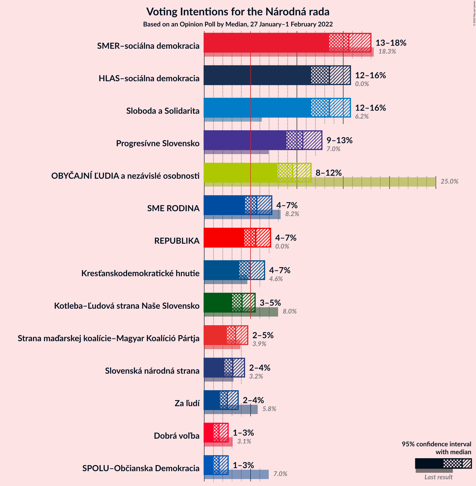

### Confidence Intervals

| Party | Last Result | Poll Result | 80% Confidence Interval | 90% Confidence Interval | 95% Confidence Interval | 99% Confidence Interval |
|:-----:|:-----------:|:-----------:|:-----------------------:|:-----------------------:|:-----------------------:|:-----------------------:|
| SMER–sociálna demokracia | 18.3% | 15.6% | 14.2–17.2% |13.8–17.6% |13.5–18.0% |12.8–18.7% |
| Sloboda a Solidarita | 6.2% | 13.5% | 12.2–15.0% |11.9–15.4% |11.5–15.8% |10.9–16.5% |
| HLAS–sociálna demokracia | 0.0% | 13.5% | 12.2–15.0% |11.9–15.4% |11.5–15.8% |10.9–16.5% |
| Progresívne Slovensko | 7.0% | 10.6% | 9.5–12.0% |9.1–12.4% |8.9–12.7% |8.4–13.4% |
| OBYČAJNÍ ĽUDIA a nezávislé osobnosti | 25.0% | 9.5% | 8.4–10.8% |8.1–11.2% |7.9–11.5% |7.4–12.2% |
| SME RODINA | 8.2% | 5.7% | 4.8–6.7% |4.6–7.0% |4.4–7.3% |4.0–7.8% |
| REPUBLIKA | 0.0% | 5.6% | 4.7–6.6% |4.5–6.9% |4.3–7.2% |3.9–7.7% |
| Kresťanskodemokratické hnutie | 4.6% | 5.0% | 4.2–6.0% |4.0–6.2% |3.8–6.5% |3.4–7.0% |
| Kotleba–Ľudová strana Naše Slovensko | 8.0% | 4.1% | 3.4–5.0% |3.2–5.3% |3.0–5.5% |2.7–6.0% |
| Strana maďarskej koalície–Magyar Koalíció Pártja | 3.9% | 3.4% | 2.7–4.2% |2.6–4.5% |2.4–4.7% |2.1–5.1% |
| Slovenská národná strana | 3.2% | 3.1% | 2.5–3.9% |2.3–4.1% |2.2–4.3% |1.9–4.8% |
| Za ľudí | 5.8% | 2.5% | 2.0–3.2% |1.8–3.5% |1.7–3.7% |1.5–4.0% |
| SPOLU–Občianska Demokracia | 7.0% | 1.6% | 1.2–2.2% |1.1–2.4% |1.0–2.6% |0.8–2.9% |
| Dobrá voľba | 3.1% | 1.6% | 1.2–2.2% |1.1–2.4% |1.0–2.6% |0.8–2.9% |

*Note:* The poll result column reflects the actual value used in the calculations. Published results may vary slightly, and in addition be rounded to fewer digits.

## Seats

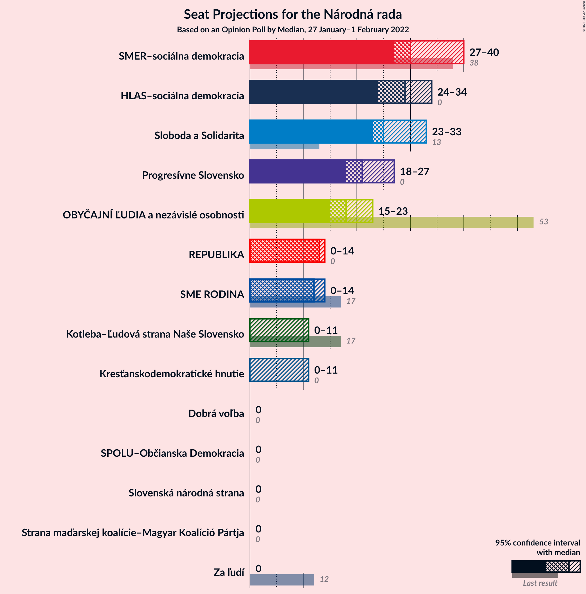

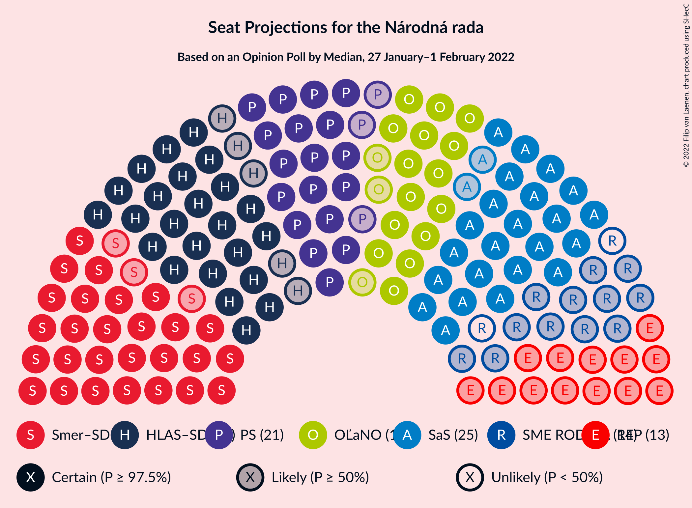

### Confidence Intervals

| Party | Last Result | Median | 80% Confidence Interval | 90% Confidence Interval | 95% Confidence Interval | 99% Confidence Interval |
|:-----:|:-----------:|:------:|:-----------------------:|:-----------------------:|:-----------------------:|:-----------------------:|
| <a href="#smer–sociálna-demokracia">SMER–sociálna demokracia</a> | 38 | 30 | 27–33 |27–38 |27–40 |26–40 |
| <a href="#sloboda-a-solidarita">Sloboda a Solidarita</a> | 13 | 25 | 24–30 |23–33 |23–33 |21–33 |
| <a href="#hlas–sociálna-demokracia">HLAS–sociálna demokracia</a> | 0 | 29 | 25–32 |25–34 |24–34 |23–34 |
| <a href="#progresívne-slovensko">Progresívne Slovensko</a> | 0 | 21 | 20–24 |18–25 |18–27 |17–27 |
| <a href="#obyčajní-ľudia-a-nezávislé-osobnosti">OBYČAJNÍ ĽUDIA a nezávislé osobnosti</a> | 53 | 18 | 17–22 |17–23 |15–23 |15–25 |
| <a href="#sme-rodina">SME RODINA</a> | 17 | 12 | 0–14 |0–14 |0–14 |0–15 |
| <a href="#republika">REPUBLIKA</a> | 0 | 13 | 0–14 |0–14 |0–14 |0–14 |
| <a href="#kresťanskodemokratické-hnutie">Kresťanskodemokratické hnutie</a> | 0 | 0 | 0–11 |0–11 |0–11 |0–12 |
| <a href="#kotleba–ľudová-strana-naše-slovensko">Kotleba–Ľudová strana Naše Slovensko</a> | 17 | 0 | 0 |0–10 |0–11 |0–12 |
| <a href="#strana-maďarskej-koalície–magyar-koalíció-pártja">Strana maďarskej koalície–Magyar Koalíció Pártja</a> | 0 | 0 | 0 |0 |0 |0 |
| <a href="#slovenská-národná-strana">Slovenská národná strana</a> | 0 | 0 | 0 |0 |0 |0 |
| <a href="#za-ľudí">Za ľudí</a> | 12 | 0 | 0 |0 |0 |0 |
| <a href="#spolu–občianska-demokracia">SPOLU–Občianska Demokracia</a> | 0 | 0 | 0 |0 |0 |0 |
| <a href="#dobrá-voľba">Dobrá voľba</a> | 0 | 0 | 0 |0 |0 |0 |

### SMER–sociálna demokracia

*For a full overview of the results for this party, see the [SMER–sociálna demokracia](party-smer–sociálnademokracia.html) page.*

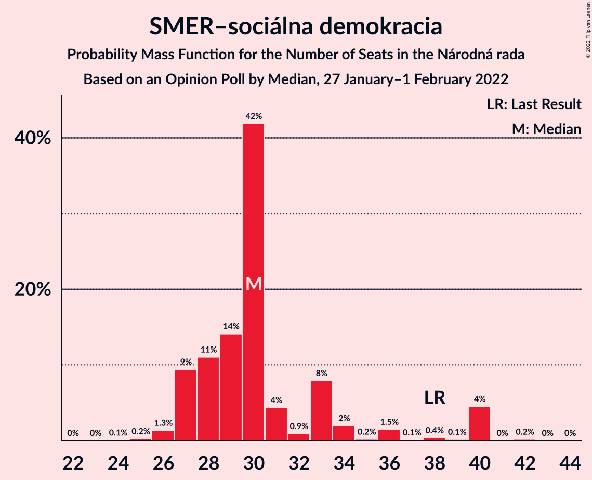

| Number of Seats | Probability | Accumulated | Special Marks |
|:---------------:|:-----------:|:-----------:|:-------------:|
| 24 | 0.1% | 100% |  |
| 25 | 0.2% | 99.9% |  |
| 26 | 1.3% | 99.7% |  |
| 27 | 9% | 98% |  |
| 28 | 11% | 89% |  |
| 29 | 14% | 78% |  |
| 30 | 42% | 64% | Median |
| 31 | 4% | 22% |  |
| 32 | 0.9% | 18% |  |
| 33 | 8% | 17% |  |
| 34 | 2% | 9% |  |
| 35 | 0.2% | 7% |  |
| 36 | 1.5% | 7% |  |
| 37 | 0.1% | 5% |  |
| 38 | 0.4% | 5% | Last Result |
| 39 | 0.1% | 5% |  |
| 40 | 4% | 5% |  |
| 41 | 0% | 0.2% |  |
| 42 | 0.2% | 0.2% |  |
| 43 | 0% | 0% |  |

### Sloboda a Solidarita

*For a full overview of the results for this party, see the [Sloboda a Solidarita](party-slobodaasolidarita.html) page.*

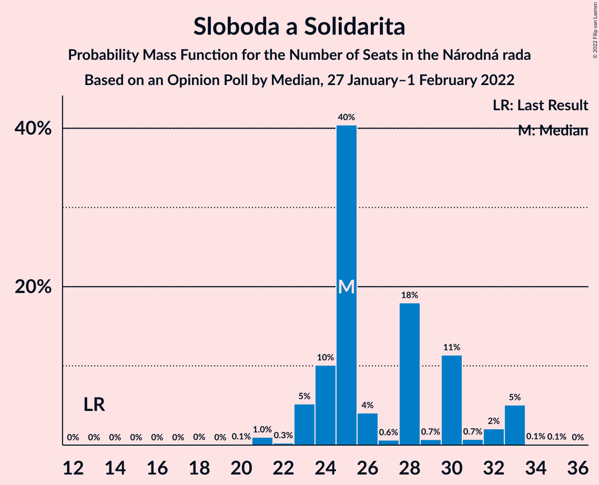

| Number of Seats | Probability | Accumulated | Special Marks |
|:---------------:|:-----------:|:-----------:|:-------------:|
| 13 | 0% | 100% | Last Result |
| 14 | 0% | 100% |  |
| 15 | 0% | 100% |  |
| 16 | 0% | 100% |  |
| 17 | 0% | 100% |  |
| 18 | 0% | 100% |  |
| 19 | 0% | 100% |  |
| 20 | 0.1% | 100% |  |
| 21 | 1.0% | 99.8% |  |
| 22 | 0.3% | 98.8% |  |
| 23 | 5% | 98.6% |  |
| 24 | 10% | 93% |  |
| 25 | 40% | 83% | Median |
| 26 | 4% | 43% |  |
| 27 | 0.6% | 39% |  |
| 28 | 18% | 38% |  |
| 29 | 0.7% | 20% |  |
| 30 | 11% | 19% |  |
| 31 | 0.7% | 8% |  |
| 32 | 2% | 7% |  |
| 33 | 5% | 5% |  |
| 34 | 0.1% | 0.2% |  |
| 35 | 0.1% | 0.1% |  |
| 36 | 0% | 0% |  |

### HLAS–sociálna demokracia

*For a full overview of the results for this party, see the [HLAS–sociálna demokracia](party-hlas–sociálnademokracia.html) page.*

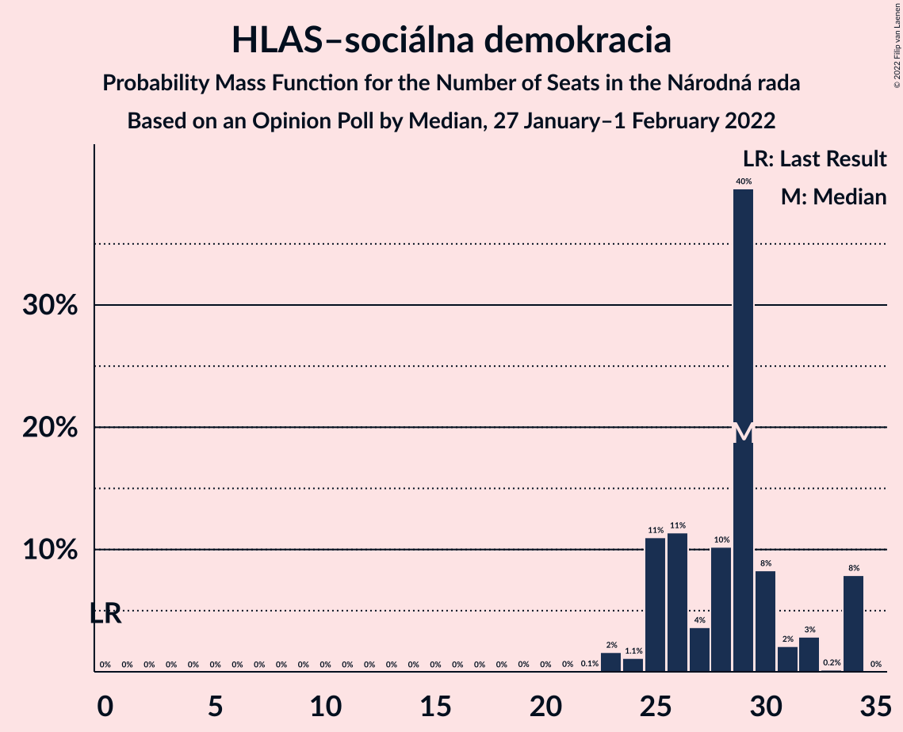

| Number of Seats | Probability | Accumulated | Special Marks |
|:---------------:|:-----------:|:-----------:|:-------------:|
| 0 | 0% | 100% | Last Result |
| 1 | 0% | 100% |  |
| 2 | 0% | 100% |  |
| 3 | 0% | 100% |  |
| 4 | 0% | 100% |  |
| 5 | 0% | 100% |  |
| 6 | 0% | 100% |  |
| 7 | 0% | 100% |  |
| 8 | 0% | 100% |  |
| 9 | 0% | 100% |  |
| 10 | 0% | 100% |  |
| 11 | 0% | 100% |  |
| 12 | 0% | 100% |  |
| 13 | 0% | 100% |  |
| 14 | 0% | 100% |  |
| 15 | 0% | 100% |  |
| 16 | 0% | 100% |  |
| 17 | 0% | 100% |  |
| 18 | 0% | 100% |  |
| 19 | 0% | 100% |  |
| 20 | 0% | 100% |  |
| 21 | 0% | 100% |  |
| 22 | 0.1% | 99.9% |  |
| 23 | 2% | 99.8% |  |
| 24 | 1.1% | 98% |  |
| 25 | 11% | 97% |  |
| 26 | 11% | 86% |  |
| 27 | 4% | 75% |  |
| 28 | 10% | 71% |  |
| 29 | 40% | 61% | Median |
| 30 | 8% | 21% |  |
| 31 | 2% | 13% |  |
| 32 | 3% | 11% |  |
| 33 | 0.2% | 8% |  |
| 34 | 8% | 8% |  |
| 35 | 0% | 0% |  |

### Progresívne Slovensko

*For a full overview of the results for this party, see the [Progresívne Slovensko](party-progresívneslovensko.html) page.*

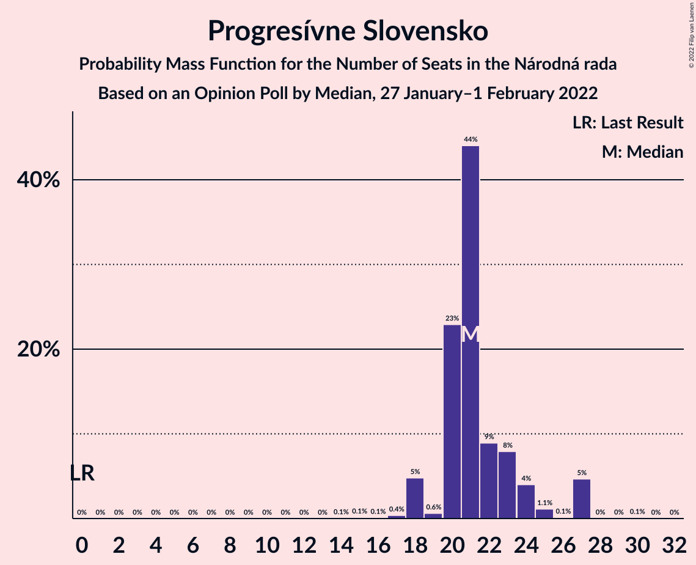

| Number of Seats | Probability | Accumulated | Special Marks |
|:---------------:|:-----------:|:-----------:|:-------------:|
| 0 | 0% | 100% | Last Result |
| 1 | 0% | 100% |  |
| 2 | 0% | 100% |  |
| 3 | 0% | 100% |  |
| 4 | 0% | 100% |  |
| 5 | 0% | 100% |  |
| 6 | 0% | 100% |  |
| 7 | 0% | 100% |  |
| 8 | 0% | 100% |  |
| 9 | 0% | 100% |  |
| 10 | 0% | 100% |  |
| 11 | 0% | 100% |  |
| 12 | 0% | 100% |  |
| 13 | 0% | 100% |  |
| 14 | 0.1% | 100% |  |
| 15 | 0.1% | 99.9% |  |
| 16 | 0.1% | 99.8% |  |
| 17 | 0.4% | 99.7% |  |
| 18 | 5% | 99.3% |  |
| 19 | 0.6% | 95% |  |
| 20 | 23% | 94% |  |
| 21 | 44% | 71% | Median |
| 22 | 9% | 27% |  |
| 23 | 8% | 18% |  |
| 24 | 4% | 10% |  |
| 25 | 1.1% | 6% |  |
| 26 | 0.1% | 5% |  |
| 27 | 5% | 5% |  |
| 28 | 0% | 0.1% |  |
| 29 | 0% | 0.1% |  |
| 30 | 0.1% | 0.1% |  |
| 31 | 0% | 0% |  |

### OBYČAJNÍ ĽUDIA a nezávislé osobnosti

*For a full overview of the results for this party, see the [OBYČAJNÍ ĽUDIA a nezávislé osobnosti](party-obyčajníľudiaanezávisléosobnosti.html) page.*

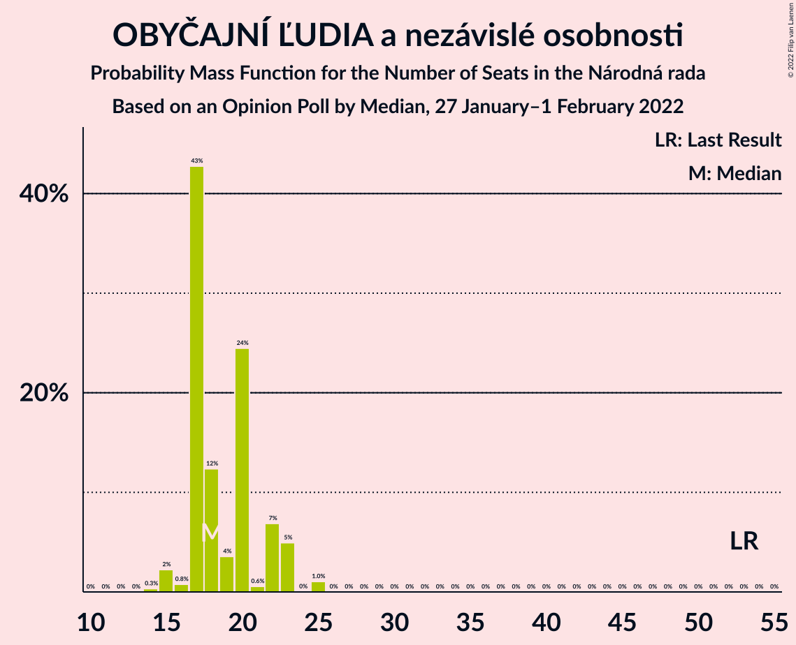

| Number of Seats | Probability | Accumulated | Special Marks |
|:---------------:|:-----------:|:-----------:|:-------------:|
| 14 | 0.3% | 100% |  |
| 15 | 2% | 99.7% |  |
| 16 | 0.8% | 97% |  |
| 17 | 43% | 97% |  |
| 18 | 12% | 54% | Median |
| 19 | 4% | 42% |  |
| 20 | 24% | 38% |  |
| 21 | 0.6% | 13% |  |
| 22 | 7% | 13% |  |
| 23 | 5% | 6% |  |
| 24 | 0% | 1.1% |  |
| 25 | 1.0% | 1.1% |  |
| 26 | 0% | 0% |  |
| 27 | 0% | 0% |  |
| 28 | 0% | 0% |  |
| 29 | 0% | 0% |  |
| 30 | 0% | 0% |  |
| 31 | 0% | 0% |  |
| 32 | 0% | 0% |  |
| 33 | 0% | 0% |  |
| 34 | 0% | 0% |  |
| 35 | 0% | 0% |  |
| 36 | 0% | 0% |  |
| 37 | 0% | 0% |  |
| 38 | 0% | 0% |  |
| 39 | 0% | 0% |  |
| 40 | 0% | 0% |  |
| 41 | 0% | 0% |  |
| 42 | 0% | 0% |  |
| 43 | 0% | 0% |  |
| 44 | 0% | 0% |  |
| 45 | 0% | 0% |  |
| 46 | 0% | 0% |  |
| 47 | 0% | 0% |  |
| 48 | 0% | 0% |  |
| 49 | 0% | 0% |  |
| 50 | 0% | 0% |  |
| 51 | 0% | 0% |  |
| 52 | 0% | 0% |  |
| 53 | 0% | 0% | Last Result |

### SME RODINA

*For a full overview of the results for this party, see the [SME RODINA](party-smerodina.html) page.*

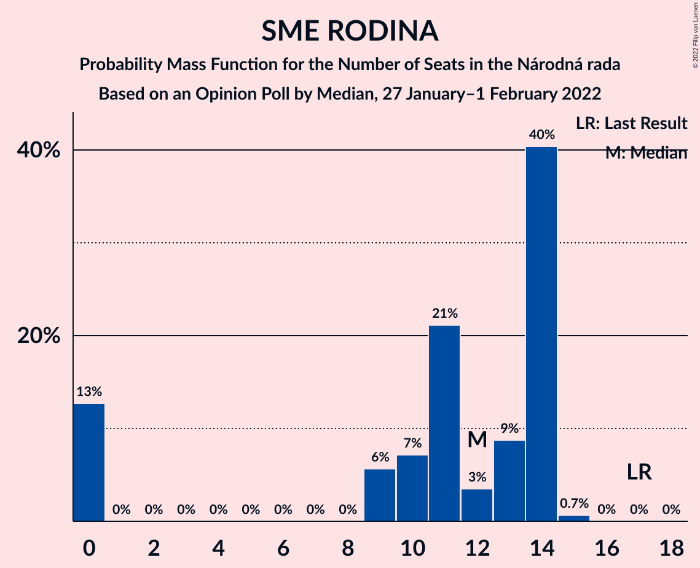

| Number of Seats | Probability | Accumulated | Special Marks |
|:---------------:|:-----------:|:-----------:|:-------------:|
| 0 | 13% | 100% |  |
| 1 | 0% | 87% |  |
| 2 | 0% | 87% |  |
| 3 | 0% | 87% |  |
| 4 | 0% | 87% |  |
| 5 | 0% | 87% |  |
| 6 | 0% | 87% |  |
| 7 | 0% | 87% |  |
| 8 | 0% | 87% |  |
| 9 | 6% | 87% |  |
| 10 | 7% | 82% |  |
| 11 | 21% | 74% |  |
| 12 | 3% | 53% | Median |
| 13 | 9% | 50% |  |
| 14 | 40% | 41% |  |
| 15 | 0.7% | 0.7% |  |
| 16 | 0% | 0% |  |
| 17 | 0% | 0% | Last Result |

### REPUBLIKA

*For a full overview of the results for this party, see the [REPUBLIKA](party-republika.html) page.*

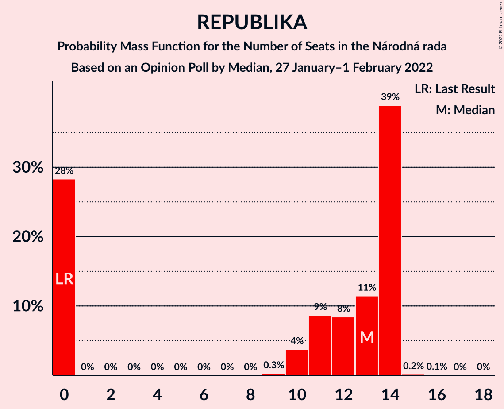

| Number of Seats | Probability | Accumulated | Special Marks |
|:---------------:|:-----------:|:-----------:|:-------------:|
| 0 | 28% | 100% | Last Result |
| 1 | 0% | 72% |  |
| 2 | 0% | 72% |  |
| 3 | 0% | 72% |  |
| 4 | 0% | 72% |  |
| 5 | 0% | 72% |  |
| 6 | 0% | 72% |  |
| 7 | 0% | 72% |  |
| 8 | 0% | 72% |  |
| 9 | 0.3% | 72% |  |
| 10 | 4% | 71% |  |
| 11 | 9% | 68% |  |
| 12 | 8% | 59% |  |
| 13 | 11% | 51% | Median |
| 14 | 39% | 39% |  |
| 15 | 0.2% | 0.2% |  |
| 16 | 0.1% | 0.1% |  |
| 17 | 0% | 0% |  |

### Kresťanskodemokratické hnutie

*For a full overview of the results for this party, see the [Kresťanskodemokratické hnutie](party-kresťanskodemokratickéhnutie.html) page.*

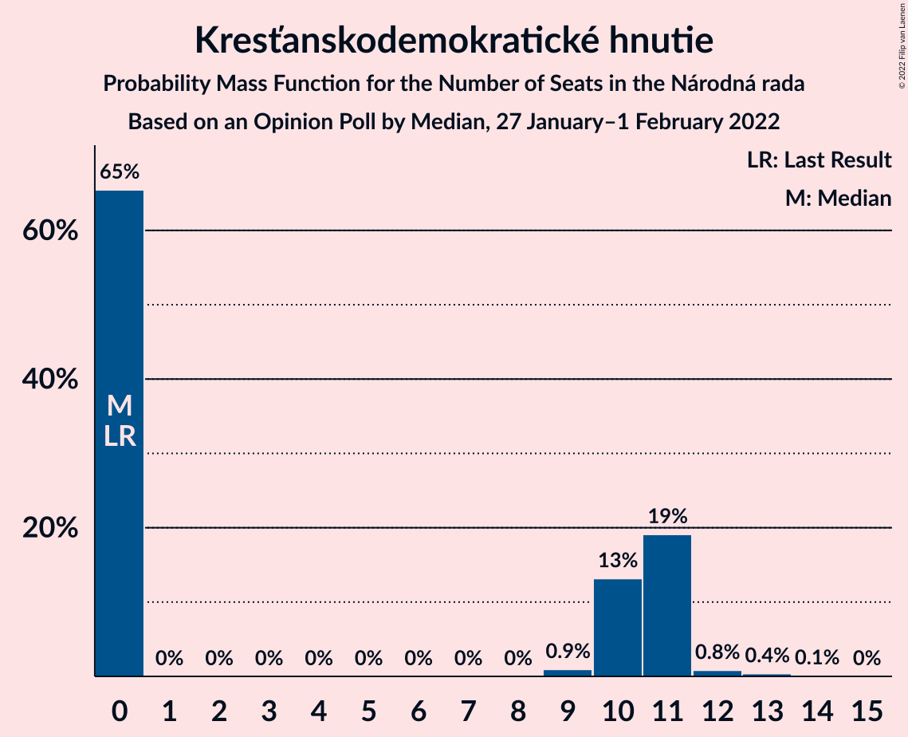

| Number of Seats | Probability | Accumulated | Special Marks |
|:---------------:|:-----------:|:-----------:|:-------------:|
| 0 | 65% | 100% | Last Result, Median |
| 1 | 0% | 35% |  |
| 2 | 0% | 35% |  |
| 3 | 0% | 35% |  |
| 4 | 0% | 35% |  |
| 5 | 0% | 35% |  |
| 6 | 0% | 35% |  |
| 7 | 0% | 35% |  |
| 8 | 0% | 35% |  |
| 9 | 0.9% | 35% |  |
| 10 | 13% | 34% |  |
| 11 | 19% | 20% |  |
| 12 | 0.8% | 1.3% |  |
| 13 | 0.4% | 0.5% |  |
| 14 | 0.1% | 0.1% |  |
| 15 | 0% | 0% |  |

### Kotleba–Ľudová strana Naše Slovensko

*For a full overview of the results for this party, see the [Kotleba–Ľudová strana Naše Slovensko](party-kotleba–ľudovástrananašeslovensko.html) page.*

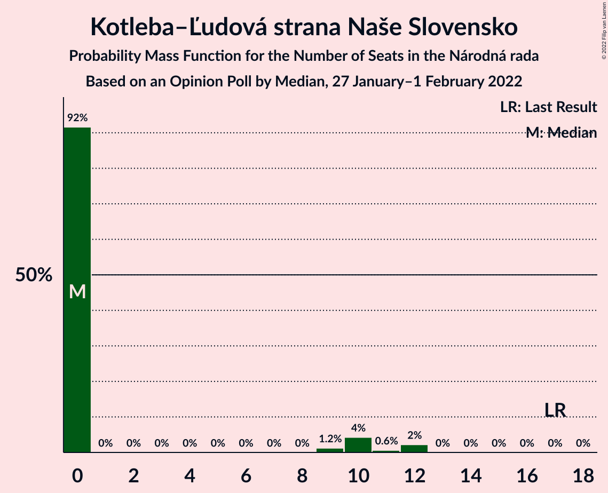

| Number of Seats | Probability | Accumulated | Special Marks |
|:---------------:|:-----------:|:-----------:|:-------------:|
| 0 | 92% | 100% | Median |
| 1 | 0% | 8% |  |
| 2 | 0% | 8% |  |
| 3 | 0% | 8% |  |
| 4 | 0% | 8% |  |
| 5 | 0% | 8% |  |
| 6 | 0% | 8% |  |
| 7 | 0% | 8% |  |
| 8 | 0% | 8% |  |
| 9 | 1.2% | 8% |  |
| 10 | 4% | 7% |  |
| 11 | 0.6% | 3% |  |
| 12 | 2% | 2% |  |
| 13 | 0% | 0% |  |
| 14 | 0% | 0% |  |
| 15 | 0% | 0% |  |
| 16 | 0% | 0% |  |
| 17 | 0% | 0% | Last Result |

### Strana maďarskej koalície–Magyar Koalíció Pártja

*For a full overview of the results for this party, see the [Strana maďarskej koalície–Magyar Koalíció Pártja](party-stranamaďarskejkoalície–magyarkoalíciópártja.html) page.*

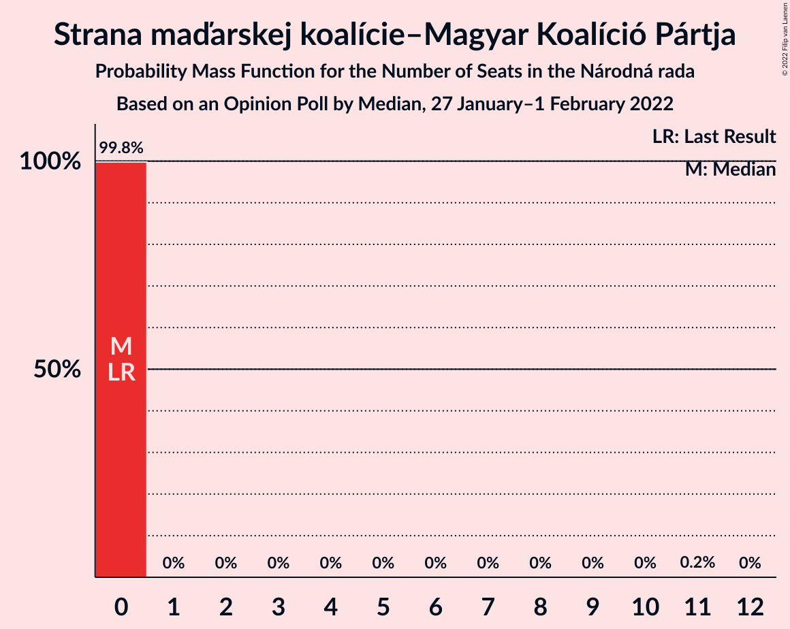

| Number of Seats | Probability | Accumulated | Special Marks |
|:---------------:|:-----------:|:-----------:|:-------------:|
| 0 | 99.8% | 100% | Last Result, Median |
| 1 | 0% | 0.2% |  |
| 2 | 0% | 0.2% |  |
| 3 | 0% | 0.2% |  |
| 4 | 0% | 0.2% |  |
| 5 | 0% | 0.2% |  |
| 6 | 0% | 0.2% |  |
| 7 | 0% | 0.2% |  |
| 8 | 0% | 0.2% |  |
| 9 | 0% | 0.2% |  |
| 10 | 0% | 0.2% |  |
| 11 | 0.2% | 0.2% |  |
| 12 | 0% | 0% |  |

### Slovenská národná strana

*For a full overview of the results for this party, see the [Slovenská národná strana](party-slovenskánárodnástrana.html) page.*

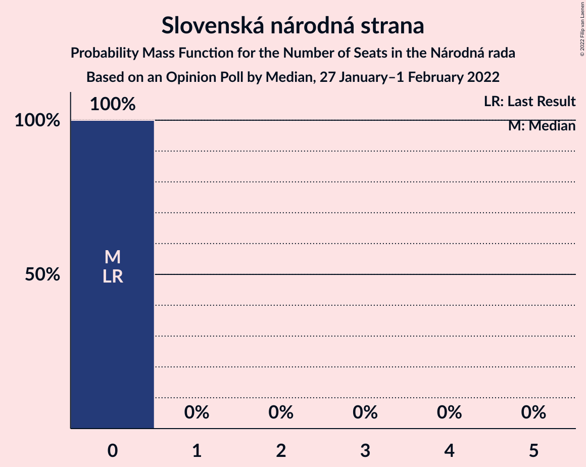

| Number of Seats | Probability | Accumulated | Special Marks |
|:---------------:|:-----------:|:-----------:|:-------------:|
| 0 | 100% | 100% | Last Result, Median |

### Za ľudí

*For a full overview of the results for this party, see the [Za ľudí](party-zaľudí.html) page.*

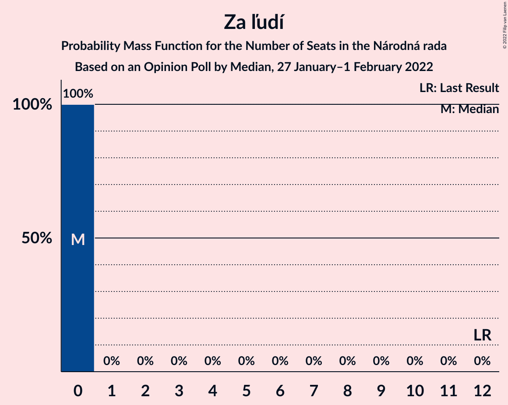

| Number of Seats | Probability | Accumulated | Special Marks |
|:---------------:|:-----------:|:-----------:|:-------------:|
| 0 | 100% | 100% | Median |
| 1 | 0% | 0% |  |
| 2 | 0% | 0% |  |
| 3 | 0% | 0% |  |
| 4 | 0% | 0% |  |
| 5 | 0% | 0% |  |
| 6 | 0% | 0% |  |
| 7 | 0% | 0% |  |
| 8 | 0% | 0% |  |
| 9 | 0% | 0% |  |
| 10 | 0% | 0% |  |
| 11 | 0% | 0% |  |
| 12 | 0% | 0% | Last Result |

### SPOLU–Občianska Demokracia

*For a full overview of the results for this party, see the [SPOLU–Občianska Demokracia](party-spolu–občianskademokracia.html) page.*

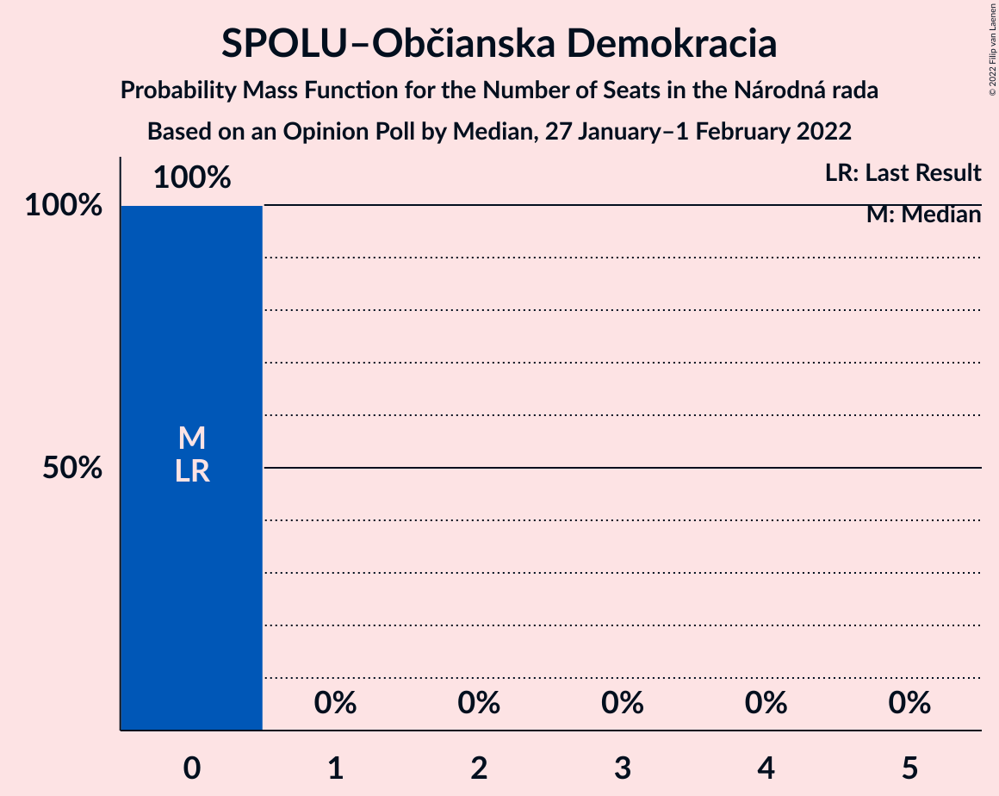

| Number of Seats | Probability | Accumulated | Special Marks |
|:---------------:|:-----------:|:-----------:|:-------------:|
| 0 | 100% | 100% | Last Result, Median |

### Dobrá voľba

*For a full overview of the results for this party, see the [Dobrá voľba](party-dobrávoľba.html) page.*

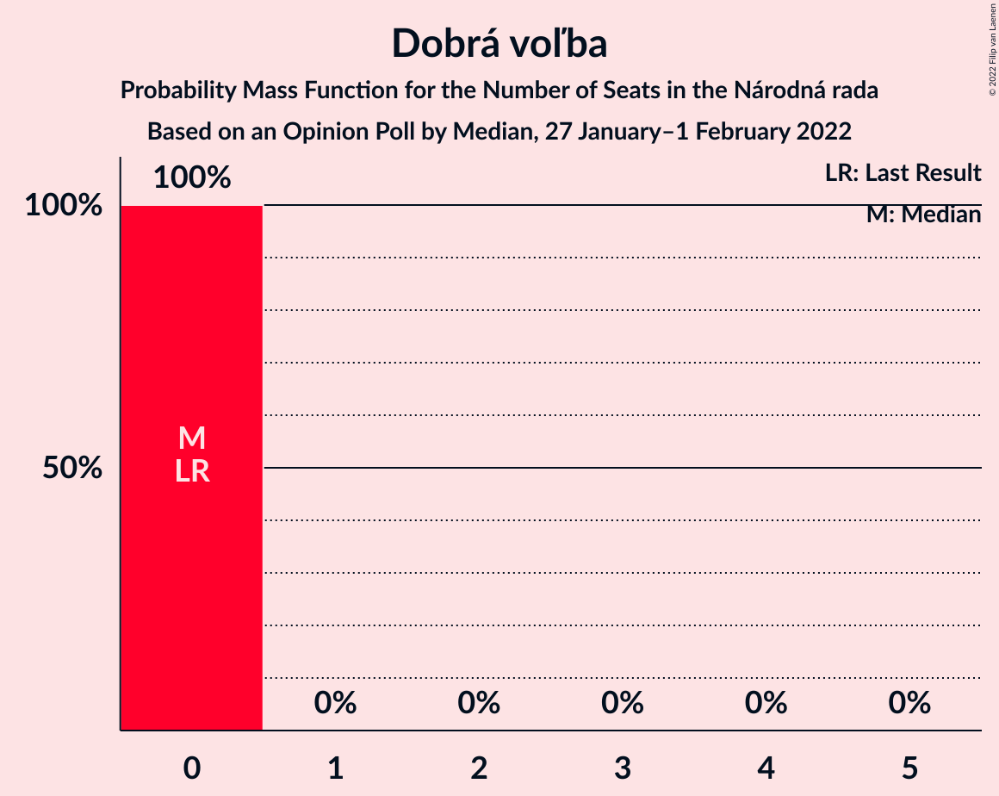

| Number of Seats | Probability | Accumulated | Special Marks |
|:---------------:|:-----------:|:-----------:|:-------------:|
| 0 | 100% | 100% | Last Result, Median |

## Coalitions

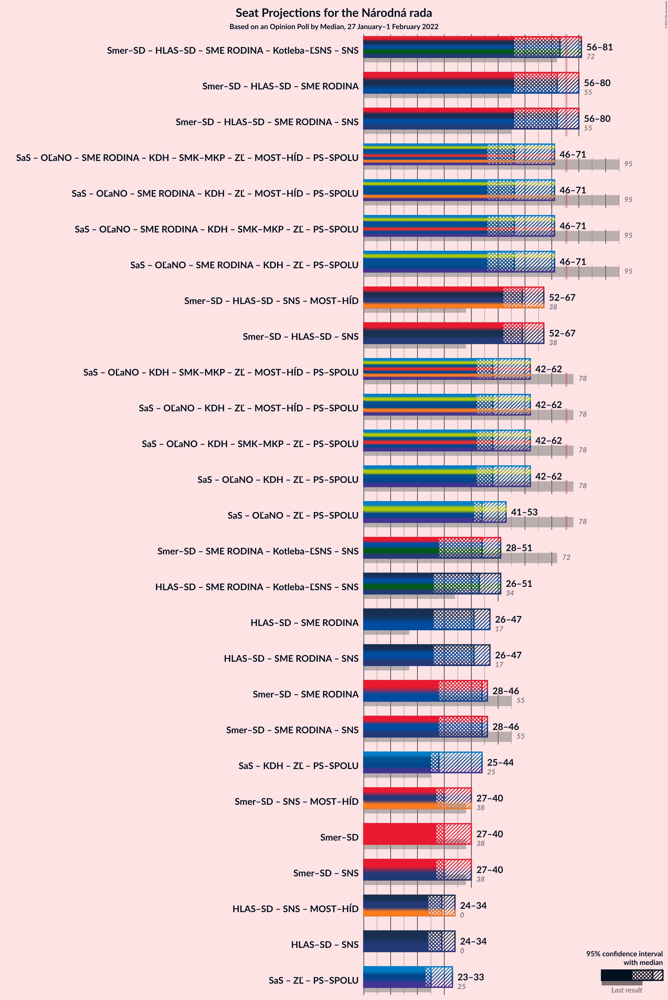

### Confidence Intervals

| Coalition | Last Result | Median | Majority? | 80% Confidence Interval | 90% Confidence Interval | 95% Confidence Interval | 99% Confidence Interval |
|:---------:|:-----------:|:------:|:---------:|:-----------------------:|:-----------------------:|:-----------------------:|:-----------------------:|
| SMER–sociálna demokracia – HLAS–sociálna demokracia – SME RODINA – Kotleba–Ľudová strana Naše Slovensko – Slovenská národná strana | 72 | 73 | 14% | 63–80 | 62–80 | 56–81 | 56–81 |
| SMER–sociálna demokracia – HLAS–sociálna demokracia – SME RODINA | 55 | 72 | 11% | 63–77 | 56–80 | 56–80 | 55–80 |
| SMER–sociálna demokracia – HLAS–sociálna demokracia – SME RODINA – Slovenská národná strana | 55 | 72 | 11% | 63–77 | 56–80 | 56–80 | 55–80 |
| SMER–sociálna demokracia – HLAS–sociálna demokracia – Slovenská národná strana | 38 | 59 | 0% | 52–66 | 52–67 | 52–67 | 51–67 |
| SMER–sociálna demokracia – SME RODINA – Kotleba–Ľudová strana Naše Slovensko – Slovenská národná strana | 72 | 44 | 0% | 38–46 | 36–49 | 28–51 | 28–51 |
| HLAS–sociálna demokracia – SME RODINA – Kotleba–Ľudová strana Naše Slovensko – Slovenská národná strana | 34 | 43 | 0% | 32–47 | 26–47 | 26–51 | 26–51 |
| HLAS–sociálna demokracia – SME RODINA | 17 | 41 | 0% | 28–45 | 26–47 | 26–47 | 25–47 |
| HLAS–sociálna demokracia – SME RODINA – Slovenská národná strana | 17 | 41 | 0% | 28–45 | 26–47 | 26–47 | 25–47 |
| SMER–sociálna demokracia – SME RODINA | 55 | 44 | 0% | 38–46 | 29–46 | 28–46 | 28–48 |
| SMER–sociálna demokracia – SME RODINA – Slovenská národná strana | 55 | 44 | 0% | 38–46 | 29–46 | 28–46 | 28–48 |
| SMER–sociálna demokracia | 38 | 30 | 0% | 27–33 | 27–38 | 27–40 | 26–40 |
| SMER–sociálna demokracia – Slovenská národná strana | 38 | 30 | 0% | 27–33 | 27–38 | 27–40 | 26–40 |
| HLAS–sociálna demokracia – Slovenská národná strana | 0 | 29 | 0% | 25–32 | 25–34 | 24–34 | 23–34 |

### SMER–sociálna demokracia – HLAS–sociálna demokracia – SME RODINA – Kotleba–Ľudová strana Naše Slovensko – Slovenská národná strana

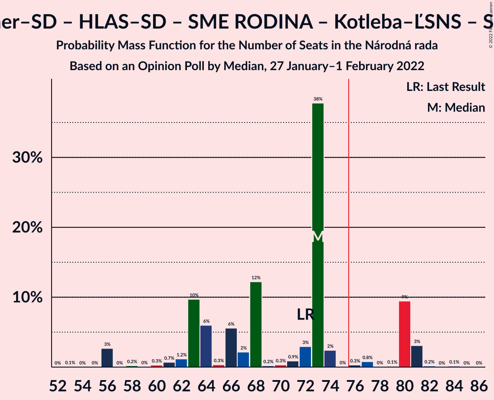

| Number of Seats | Probability | Accumulated | Special Marks |
|:---------------:|:-----------:|:-----------:|:-------------:|
| 53 | 0.1% | 100% |  |
| 54 | 0% | 99.9% |  |
| 55 | 0% | 99.9% |  |
| 56 | 3% | 99.9% |  |
| 57 | 0% | 97% |  |
| 58 | 0.2% | 97% |  |
| 59 | 0% | 97% |  |
| 60 | 0.3% | 97% |  |
| 61 | 0.7% | 97% |  |
| 62 | 1.2% | 96% |  |
| 63 | 10% | 95% |  |
| 64 | 6% | 85% |  |
| 65 | 0.3% | 79% |  |
| 66 | 6% | 79% |  |
| 67 | 2% | 73% |  |
| 68 | 12% | 71% |  |
| 69 | 0.2% | 59% |  |
| 70 | 0.3% | 59% |  |
| 71 | 0.9% | 58% | Median |
| 72 | 3% | 57% | Last Result |
| 73 | 38% | 54% |  |
| 74 | 2% | 17% |  |
| 75 | 0% | 14% |  |
| 76 | 0.3% | 14% | Majority |
| 77 | 0.8% | 14% |  |
| 78 | 0% | 13% |  |
| 79 | 0.1% | 13% |  |
| 80 | 9% | 13% |  |
| 81 | 3% | 3% |  |
| 82 | 0.2% | 0.3% |  |
| 83 | 0% | 0.2% |  |
| 84 | 0.1% | 0.2% |  |
| 85 | 0% | 0% |  |

### SMER–sociálna demokracia – HLAS–sociálna demokracia – SME RODINA

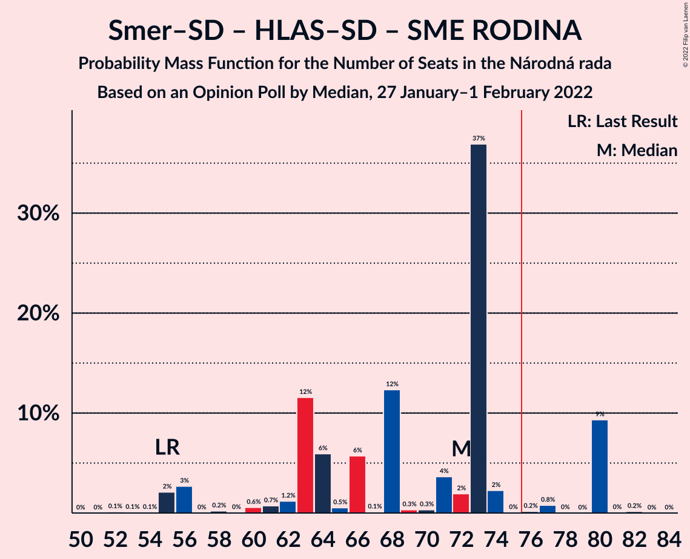

| Number of Seats | Probability | Accumulated | Special Marks |
|:---------------:|:-----------:|:-----------:|:-------------:|
| 52 | 0.1% | 100% |  |
| 53 | 0.1% | 99.9% |  |
| 54 | 0.1% | 99.8% |  |
| 55 | 2% | 99.7% | Last Result |
| 56 | 3% | 98% |  |
| 57 | 0% | 95% |  |
| 58 | 0.2% | 95% |  |
| 59 | 0% | 95% |  |
| 60 | 0.6% | 95% |  |
| 61 | 0.7% | 94% |  |
| 62 | 1.2% | 93% |  |
| 63 | 12% | 92% |  |
| 64 | 6% | 81% |  |
| 65 | 0.5% | 75% |  |
| 66 | 6% | 74% |  |
| 67 | 0.1% | 68% |  |
| 68 | 12% | 68% |  |
| 69 | 0.3% | 56% |  |
| 70 | 0.3% | 56% |  |
| 71 | 4% | 55% | Median |
| 72 | 2% | 52% |  |
| 73 | 37% | 50% |  |
| 74 | 2% | 13% |  |
| 75 | 0% | 11% |  |
| 76 | 0.2% | 11% | Majority |
| 77 | 0.8% | 10% |  |
| 78 | 0% | 10% |  |
| 79 | 0% | 10% |  |
| 80 | 9% | 10% |  |
| 81 | 0% | 0.2% |  |
| 82 | 0.2% | 0.2% |  |
| 83 | 0% | 0% |  |

### SMER–sociálna demokracia – HLAS–sociálna demokracia – SME RODINA – Slovenská národná strana

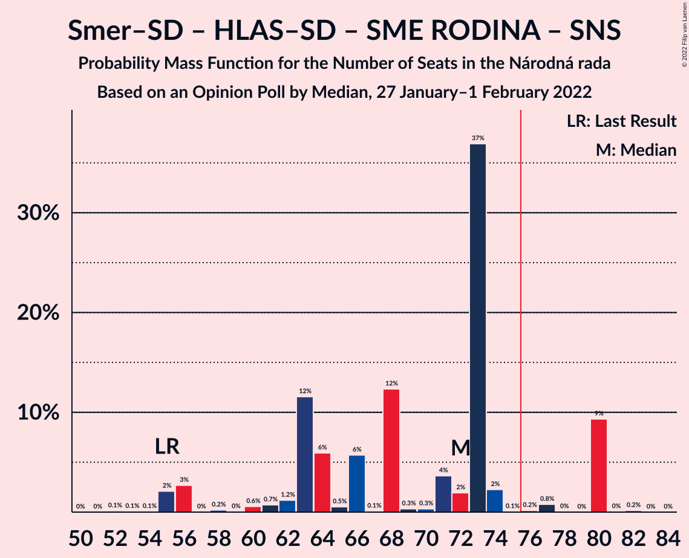

| Number of Seats | Probability | Accumulated | Special Marks |
|:---------------:|:-----------:|:-----------:|:-------------:|
| 52 | 0.1% | 100% |  |
| 53 | 0.1% | 99.9% |  |
| 54 | 0.1% | 99.8% |  |
| 55 | 2% | 99.7% | Last Result |
| 56 | 3% | 98% |  |
| 57 | 0% | 95% |  |
| 58 | 0.2% | 95% |  |
| 59 | 0% | 95% |  |
| 60 | 0.6% | 95% |  |
| 61 | 0.7% | 94% |  |
| 62 | 1.2% | 93% |  |
| 63 | 12% | 92% |  |
| 64 | 6% | 81% |  |
| 65 | 0.5% | 75% |  |
| 66 | 6% | 74% |  |
| 67 | 0.1% | 68% |  |
| 68 | 12% | 68% |  |
| 69 | 0.3% | 56% |  |
| 70 | 0.3% | 56% |  |
| 71 | 4% | 55% | Median |
| 72 | 2% | 52% |  |
| 73 | 37% | 50% |  |
| 74 | 2% | 13% |  |
| 75 | 0.1% | 11% |  |
| 76 | 0.2% | 11% | Majority |
| 77 | 0.8% | 10% |  |
| 78 | 0% | 10% |  |
| 79 | 0% | 10% |  |
| 80 | 9% | 10% |  |
| 81 | 0% | 0.2% |  |
| 82 | 0.2% | 0.2% |  |
| 83 | 0% | 0% |  |

### SMER–sociálna demokracia – HLAS–sociálna demokracia – Slovenská národná strana

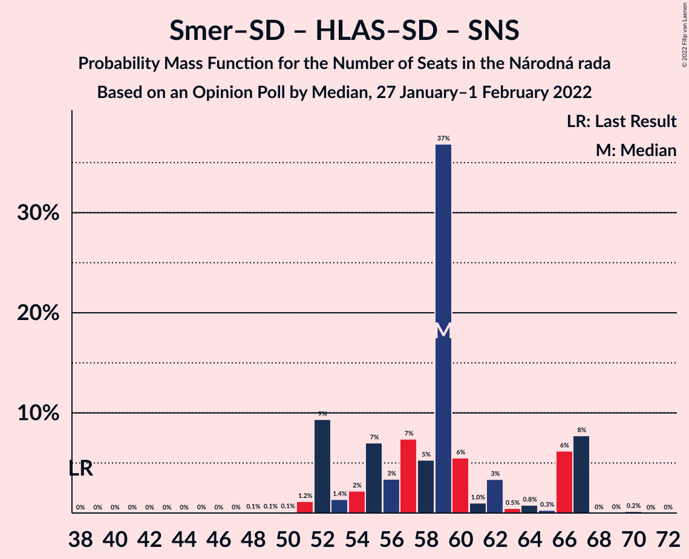

| Number of Seats | Probability | Accumulated | Special Marks |
|:---------------:|:-----------:|:-----------:|:-------------:|
| 38 | 0% | 100% | Last Result |
| 39 | 0% | 100% |  |
| 40 | 0% | 100% |  |
| 41 | 0% | 100% |  |
| 42 | 0% | 100% |  |
| 43 | 0% | 100% |  |
| 44 | 0% | 100% |  |
| 45 | 0% | 100% |  |
| 46 | 0% | 100% |  |
| 47 | 0% | 100% |  |
| 48 | 0.1% | 100% |  |
| 49 | 0.1% | 99.9% |  |
| 50 | 0.1% | 99.8% |  |
| 51 | 1.2% | 99.6% |  |
| 52 | 9% | 98% |  |
| 53 | 1.4% | 89% |  |
| 54 | 2% | 88% |  |
| 55 | 7% | 86% |  |
| 56 | 3% | 79% |  |
| 57 | 7% | 75% |  |
| 58 | 5% | 68% |  |
| 59 | 37% | 62% | Median |
| 60 | 6% | 26% |  |
| 61 | 1.0% | 20% |  |
| 62 | 3% | 19% |  |
| 63 | 0.5% | 16% |  |
| 64 | 0.8% | 15% |  |
| 65 | 0.3% | 14% |  |
| 66 | 6% | 14% |  |
| 67 | 8% | 8% |  |
| 68 | 0% | 0.3% |  |
| 69 | 0% | 0.2% |  |
| 70 | 0.2% | 0.2% |  |
| 71 | 0% | 0% |  |

### SMER–sociálna demokracia – SME RODINA – Kotleba–Ľudová strana Naše Slovensko – Slovenská národná strana

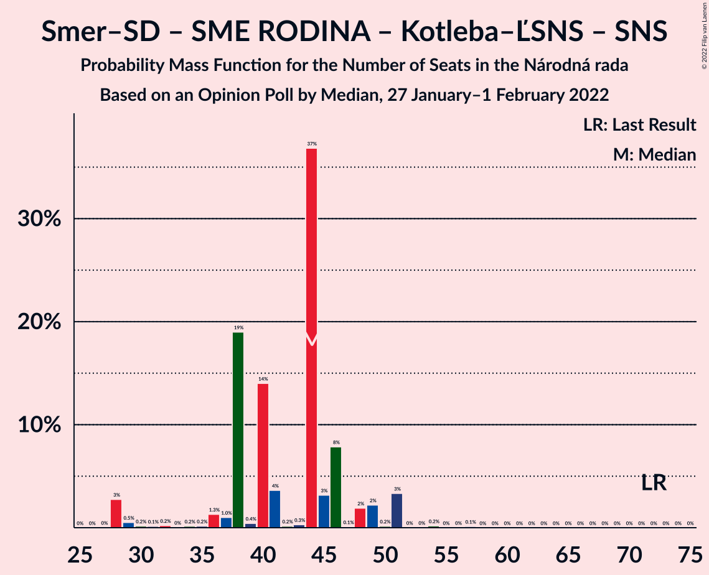

| Number of Seats | Probability | Accumulated | Special Marks |
|:---------------:|:-----------:|:-----------:|:-------------:|
| 28 | 3% | 100% |  |
| 29 | 0.5% | 97% |  |
| 30 | 0.2% | 97% |  |
| 31 | 0.1% | 97% |  |
| 32 | 0.2% | 96% |  |
| 33 | 0% | 96% |  |
| 34 | 0.2% | 96% |  |
| 35 | 0.2% | 96% |  |
| 36 | 1.3% | 96% |  |
| 37 | 1.0% | 94% |  |
| 38 | 19% | 93% |  |
| 39 | 0.4% | 74% |  |
| 40 | 14% | 74% |  |
| 41 | 4% | 60% |  |
| 42 | 0.2% | 56% | Median |
| 43 | 0.3% | 56% |  |
| 44 | 37% | 56% |  |
| 45 | 3% | 19% |  |
| 46 | 8% | 16% |  |
| 47 | 0.1% | 8% |  |
| 48 | 2% | 8% |  |
| 49 | 2% | 6% |  |
| 50 | 0.2% | 4% |  |
| 51 | 3% | 4% |  |
| 52 | 0% | 0.4% |  |
| 53 | 0% | 0.4% |  |
| 54 | 0.2% | 0.3% |  |
| 55 | 0% | 0.2% |  |
| 56 | 0% | 0.1% |  |
| 57 | 0.1% | 0.1% |  |
| 58 | 0% | 0% |  |
| 59 | 0% | 0% |  |
| 60 | 0% | 0% |  |
| 61 | 0% | 0% |  |
| 62 | 0% | 0% |  |
| 63 | 0% | 0% |  |
| 64 | 0% | 0% |  |
| 65 | 0% | 0% |  |
| 66 | 0% | 0% |  |
| 67 | 0% | 0% |  |
| 68 | 0% | 0% |  |
| 69 | 0% | 0% |  |
| 70 | 0% | 0% |  |
| 71 | 0% | 0% |  |
| 72 | 0% | 0% | Last Result |

### HLAS–sociálna demokracia – SME RODINA – Kotleba–Ľudová strana Naše Slovensko – Slovenská národná strana

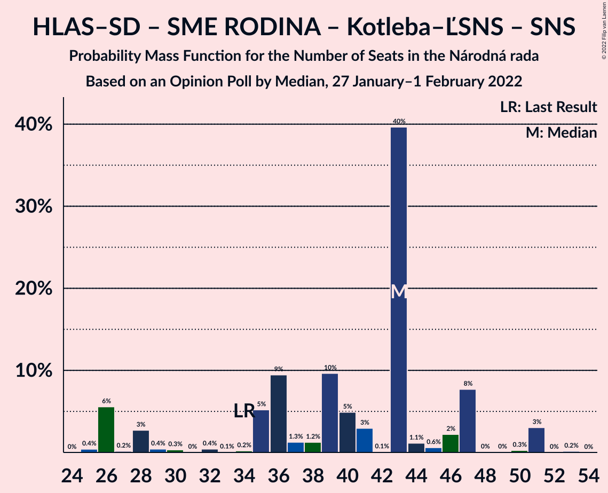

| Number of Seats | Probability | Accumulated | Special Marks |
|:---------------:|:-----------:|:-----------:|:-------------:|
| 25 | 0.4% | 100% |  |
| 26 | 6% | 99.6% |  |
| 27 | 0.2% | 94% |  |
| 28 | 3% | 94% |  |
| 29 | 0.4% | 91% |  |
| 30 | 0.3% | 91% |  |
| 31 | 0% | 90% |  |
| 32 | 0.4% | 90% |  |
| 33 | 0.1% | 90% |  |
| 34 | 0.2% | 90% | Last Result |
| 35 | 5% | 90% |  |
| 36 | 9% | 84% |  |
| 37 | 1.3% | 75% |  |
| 38 | 1.2% | 74% |  |
| 39 | 10% | 72% |  |
| 40 | 5% | 63% |  |
| 41 | 3% | 58% | Median |
| 42 | 0.1% | 55% |  |
| 43 | 40% | 55% |  |
| 44 | 1.1% | 15% |  |
| 45 | 0.6% | 14% |  |
| 46 | 2% | 13% |  |
| 47 | 8% | 11% |  |
| 48 | 0% | 4% |  |
| 49 | 0% | 4% |  |
| 50 | 0.3% | 3% |  |
| 51 | 3% | 3% |  |
| 52 | 0% | 0.2% |  |
| 53 | 0.2% | 0.2% |  |
| 54 | 0% | 0% |  |

### HLAS–sociálna demokracia – SME RODINA

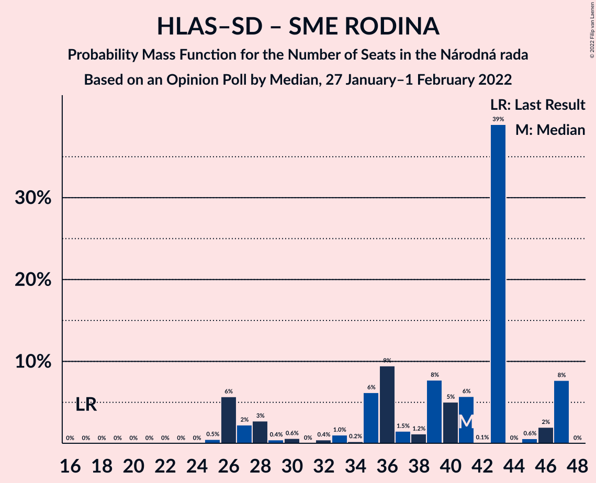

| Number of Seats | Probability | Accumulated | Special Marks |
|:---------------:|:-----------:|:-----------:|:-------------:|
| 17 | 0% | 100% | Last Result |
| 18 | 0% | 100% |  |
| 19 | 0% | 100% |  |
| 20 | 0% | 100% |  |
| 21 | 0% | 100% |  |
| 22 | 0% | 100% |  |
| 23 | 0% | 100% |  |
| 24 | 0% | 100% |  |
| 25 | 0.5% | 100% |  |
| 26 | 6% | 99.5% |  |
| 27 | 2% | 94% |  |
| 28 | 3% | 92% |  |
| 29 | 0.4% | 89% |  |
| 30 | 0.6% | 88% |  |
| 31 | 0% | 88% |  |
| 32 | 0.4% | 88% |  |
| 33 | 1.0% | 87% |  |
| 34 | 0.2% | 86% |  |
| 35 | 6% | 86% |  |
| 36 | 9% | 80% |  |
| 37 | 1.5% | 70% |  |
| 38 | 1.2% | 69% |  |
| 39 | 8% | 68% |  |
| 40 | 5% | 60% |  |
| 41 | 6% | 55% | Median |
| 42 | 0.1% | 49% |  |
| 43 | 39% | 49% |  |
| 44 | 0% | 10% |  |
| 45 | 0.6% | 10% |  |
| 46 | 2% | 10% |  |
| 47 | 8% | 8% |  |
| 48 | 0% | 0% |  |

### HLAS–sociálna demokracia – SME RODINA – Slovenská národná strana

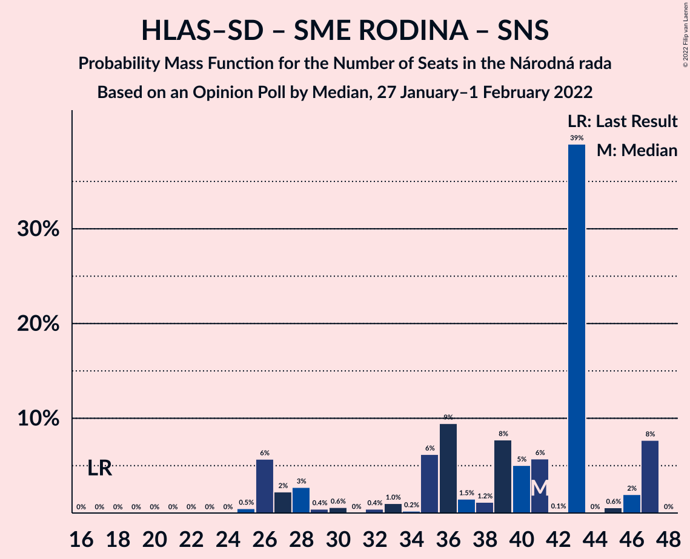

| Number of Seats | Probability | Accumulated | Special Marks |
|:---------------:|:-----------:|:-----------:|:-------------:|
| 17 | 0% | 100% | Last Result |
| 18 | 0% | 100% |  |
| 19 | 0% | 100% |  |
| 20 | 0% | 100% |  |
| 21 | 0% | 100% |  |
| 22 | 0% | 100% |  |
| 23 | 0% | 100% |  |
| 24 | 0% | 100% |  |
| 25 | 0.5% | 100% |  |
| 26 | 6% | 99.5% |  |
| 27 | 2% | 94% |  |
| 28 | 3% | 92% |  |
| 29 | 0.4% | 89% |  |
| 30 | 0.6% | 88% |  |
| 31 | 0% | 88% |  |
| 32 | 0.4% | 88% |  |
| 33 | 1.0% | 87% |  |
| 34 | 0.2% | 86% |  |
| 35 | 6% | 86% |  |
| 36 | 9% | 80% |  |
| 37 | 1.5% | 70% |  |
| 38 | 1.2% | 69% |  |
| 39 | 8% | 68% |  |
| 40 | 5% | 60% |  |
| 41 | 6% | 55% | Median |
| 42 | 0.1% | 49% |  |
| 43 | 39% | 49% |  |
| 44 | 0% | 10% |  |
| 45 | 0.6% | 10% |  |
| 46 | 2% | 10% |  |
| 47 | 8% | 8% |  |
| 48 | 0% | 0% |  |

### SMER–sociálna demokracia – SME RODINA

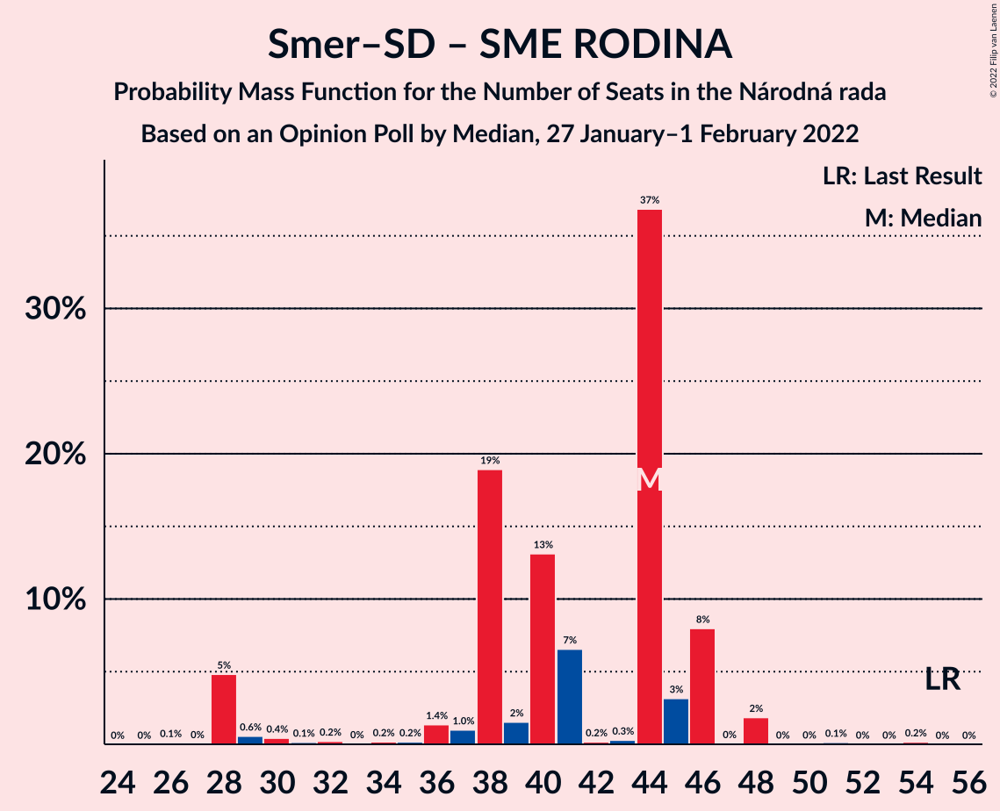

| Number of Seats | Probability | Accumulated | Special Marks |
|:---------------:|:-----------:|:-----------:|:-------------:|
| 26 | 0.1% | 100% |  |
| 27 | 0% | 99.9% |  |
| 28 | 5% | 99.8% |  |
| 29 | 0.6% | 95% |  |
| 30 | 0.4% | 94% |  |
| 31 | 0.1% | 94% |  |
| 32 | 0.2% | 94% |  |
| 33 | 0% | 94% |  |
| 34 | 0.2% | 94% |  |
| 35 | 0.2% | 93% |  |
| 36 | 1.4% | 93% |  |
| 37 | 1.0% | 92% |  |
| 38 | 19% | 91% |  |
| 39 | 2% | 72% |  |
| 40 | 13% | 70% |  |
| 41 | 7% | 57% |  |
| 42 | 0.2% | 51% | Median |
| 43 | 0.3% | 51% |  |
| 44 | 37% | 50% |  |
| 45 | 3% | 13% |  |
| 46 | 8% | 10% |  |
| 47 | 0% | 2% |  |
| 48 | 2% | 2% |  |
| 49 | 0% | 0.4% |  |
| 50 | 0% | 0.3% |  |
| 51 | 0.1% | 0.3% |  |
| 52 | 0% | 0.2% |  |
| 53 | 0% | 0.2% |  |
| 54 | 0.2% | 0.2% |  |
| 55 | 0% | 0% | Last Result |

### SMER–sociálna demokracia – SME RODINA – Slovenská národná strana

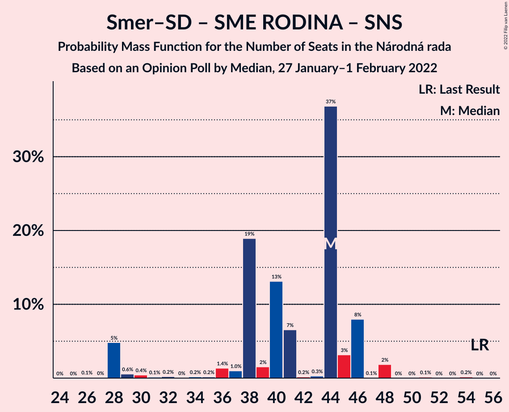

| Number of Seats | Probability | Accumulated | Special Marks |
|:---------------:|:-----------:|:-----------:|:-------------:|
| 26 | 0.1% | 100% |  |
| 27 | 0% | 99.9% |  |
| 28 | 5% | 99.8% |  |
| 29 | 0.6% | 95% |  |
| 30 | 0.4% | 94% |  |
| 31 | 0.1% | 94% |  |
| 32 | 0.2% | 94% |  |
| 33 | 0% | 94% |  |
| 34 | 0.2% | 94% |  |
| 35 | 0.2% | 93% |  |
| 36 | 1.4% | 93% |  |
| 37 | 1.0% | 92% |  |
| 38 | 19% | 91% |  |
| 39 | 2% | 72% |  |
| 40 | 13% | 70% |  |
| 41 | 7% | 57% |  |
| 42 | 0.2% | 51% | Median |
| 43 | 0.3% | 51% |  |
| 44 | 37% | 50% |  |
| 45 | 3% | 13% |  |
| 46 | 8% | 10% |  |
| 47 | 0.1% | 2% |  |
| 48 | 2% | 2% |  |
| 49 | 0% | 0.4% |  |
| 50 | 0% | 0.4% |  |
| 51 | 0.1% | 0.3% |  |
| 52 | 0% | 0.2% |  |
| 53 | 0% | 0.2% |  |
| 54 | 0.2% | 0.2% |  |
| 55 | 0% | 0% | Last Result |

### SMER–sociálna demokracia

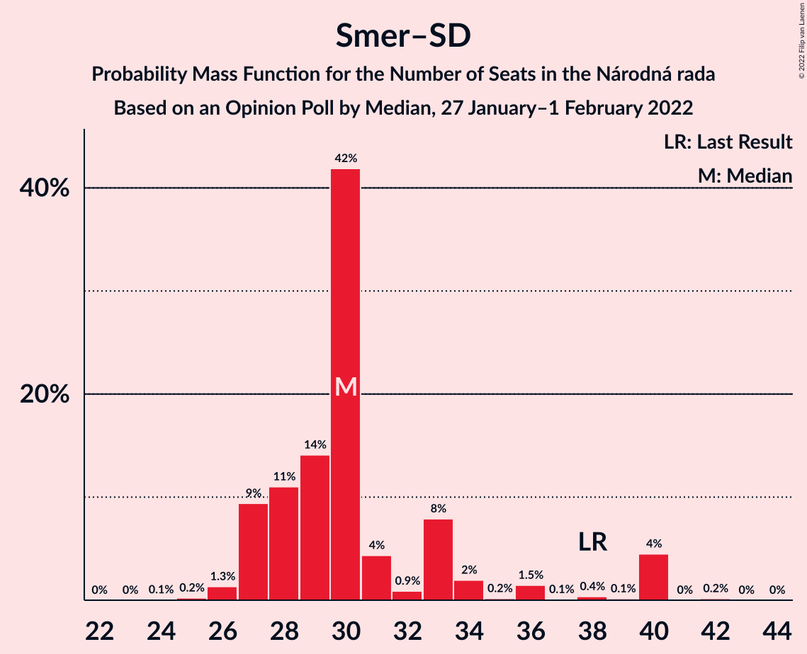

| Number of Seats | Probability | Accumulated | Special Marks |
|:---------------:|:-----------:|:-----------:|:-------------:|
| 24 | 0.1% | 100% |  |
| 25 | 0.2% | 99.9% |  |
| 26 | 1.3% | 99.7% |  |
| 27 | 9% | 98% |  |
| 28 | 11% | 89% |  |
| 29 | 14% | 78% |  |
| 30 | 42% | 64% | Median |
| 31 | 4% | 22% |  |
| 32 | 0.9% | 18% |  |
| 33 | 8% | 17% |  |
| 34 | 2% | 9% |  |
| 35 | 0.2% | 7% |  |
| 36 | 1.5% | 7% |  |
| 37 | 0.1% | 5% |  |
| 38 | 0.4% | 5% | Last Result |
| 39 | 0.1% | 5% |  |
| 40 | 4% | 5% |  |
| 41 | 0% | 0.2% |  |
| 42 | 0.2% | 0.2% |  |
| 43 | 0% | 0% |  |

### SMER–sociálna demokracia – Slovenská národná strana

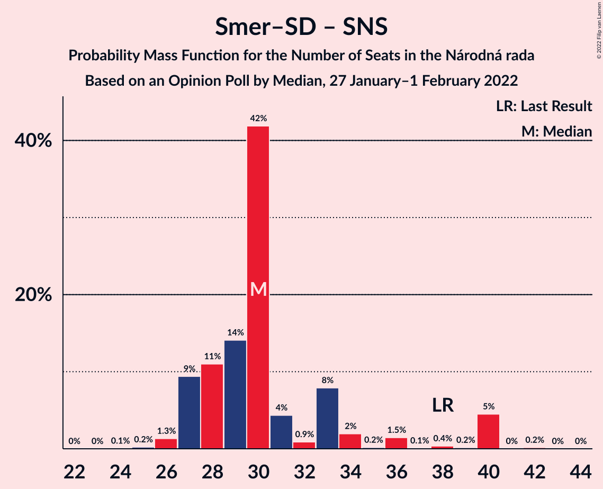

| Number of Seats | Probability | Accumulated | Special Marks |
|:---------------:|:-----------:|:-----------:|:-------------:|
| 24 | 0.1% | 100% |  |
| 25 | 0.2% | 99.9% |  |
| 26 | 1.3% | 99.7% |  |
| 27 | 9% | 98% |  |
| 28 | 11% | 89% |  |
| 29 | 14% | 78% |  |
| 30 | 42% | 64% | Median |
| 31 | 4% | 22% |  |
| 32 | 0.9% | 18% |  |
| 33 | 8% | 17% |  |
| 34 | 2% | 9% |  |
| 35 | 0.2% | 7% |  |
| 36 | 1.5% | 7% |  |
| 37 | 0.1% | 5% |  |
| 38 | 0.4% | 5% | Last Result |
| 39 | 0.2% | 5% |  |
| 40 | 5% | 5% |  |
| 41 | 0% | 0.2% |  |
| 42 | 0.2% | 0.2% |  |
| 43 | 0% | 0% |  |

### HLAS–sociálna demokracia – Slovenská národná strana

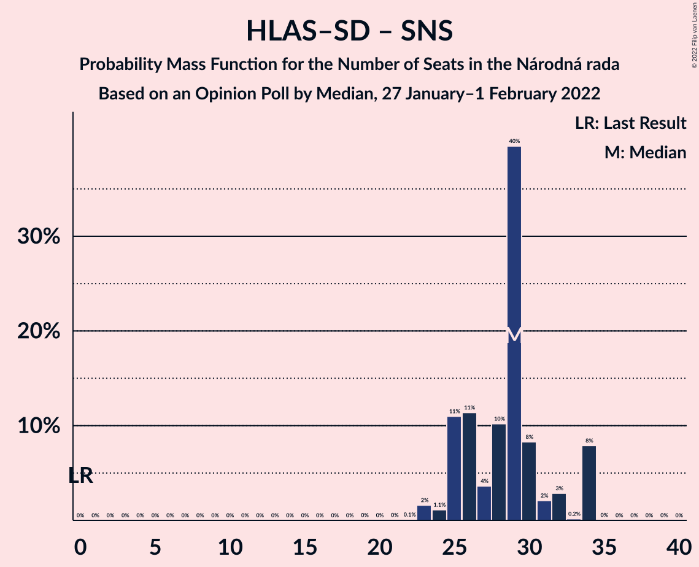

| Number of Seats | Probability | Accumulated | Special Marks |
|:---------------:|:-----------:|:-----------:|:-------------:|
| 0 | 0% | 100% | Last Result |
| 1 | 0% | 100% |  |
| 2 | 0% | 100% |  |
| 3 | 0% | 100% |  |
| 4 | 0% | 100% |  |
| 5 | 0% | 100% |  |
| 6 | 0% | 100% |  |
| 7 | 0% | 100% |  |
| 8 | 0% | 100% |  |
| 9 | 0% | 100% |  |
| 10 | 0% | 100% |  |
| 11 | 0% | 100% |  |
| 12 | 0% | 100% |  |
| 13 | 0% | 100% |  |
| 14 | 0% | 100% |  |
| 15 | 0% | 100% |  |
| 16 | 0% | 100% |  |
| 17 | 0% | 100% |  |
| 18 | 0% | 100% |  |
| 19 | 0% | 100% |  |
| 20 | 0% | 100% |  |
| 21 | 0% | 100% |  |
| 22 | 0.1% | 99.9% |  |
| 23 | 2% | 99.8% |  |
| 24 | 1.1% | 98% |  |
| 25 | 11% | 97% |  |
| 26 | 11% | 86% |  |
| 27 | 4% | 75% |  |
| 28 | 10% | 71% |  |
| 29 | 40% | 61% | Median |
| 30 | 8% | 21% |  |
| 31 | 2% | 13% |  |
| 32 | 3% | 11% |  |
| 33 | 0.2% | 8% |  |
| 34 | 8% | 8% |  |
| 35 | 0% | 0.1% |  |
| 36 | 0% | 0% |  |

## Technical Information

### Opinion Poll

+ **Polling firm:** Median
+ **Commissioner(s):** —
+ **Fieldwork period:** 27 January–1 February 2022

### Calculations

+ **Sample size:** 1006
+ **Simulations done:** 1,048,576
+ **Error estimate:** 1.62%

