# Opinion Poll by AKO for TV JOJ, 7–10 June 2022

<a href="#voting-intentions">Voting Intentions</a> | <a href="#seats">Seats</a> | <a href="#coalitions">Coalitions</a> | <a href="#technical-information">Technical Information</a>

## Voting Intentions

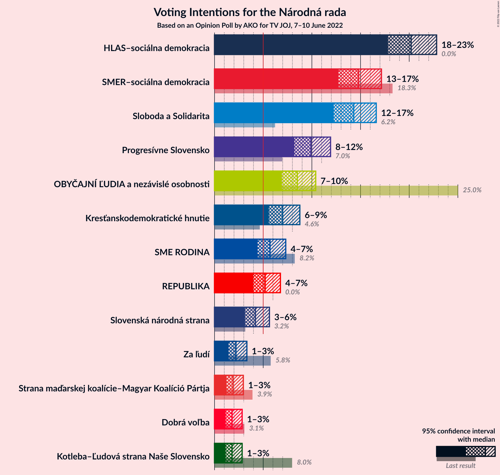

### Confidence Intervals

| Party | Last Result | Poll Result | 80% Confidence Interval | 90% Confidence Interval | 95% Confidence Interval | 99% Confidence Interval |
|:-----:|:-----------:|:-----------:|:-----------------------:|:-----------------------:|:-----------------------:|:-----------------------:|
| HLAS–sociálna demokracia | 0.0% | 20.2% | 18.6–21.9% |18.2–22.4% |17.8–22.8% |17.1–23.6% |
| SMER–sociálna demokracia | 18.3% | 14.8% | 13.4–16.3% |13.1–16.8% |12.7–17.1% |12.1–17.9% |
| Sloboda a Solidarita | 6.2% | 14.3% | 13.0–15.8% |12.6–16.2% |12.3–16.6% |11.6–17.4% |
| Progresívne Slovensko | 7.0% | 9.9% | 8.8–11.2% |8.5–11.6% |8.2–11.9% |7.7–12.6% |
| OBYČAJNÍ ĽUDIA a nezávislé osobnosti | 25.0% | 8.5% | 7.5–9.7% |7.2–10.1% |6.9–10.4% |6.4–11.0% |
| Kresťanskodemokratické hnutie | 4.6% | 7.0% | 6.1–8.2% |5.8–8.5% |5.6–8.8% |5.2–9.3% |
| SME RODINA | 8.2% | 5.7% | 4.9–6.8% |4.6–7.1% |4.4–7.3% |4.1–7.9% |
| REPUBLIKA | 0.0% | 5.2% | 4.4–6.2% |4.2–6.5% |4.0–6.8% |3.6–7.3% |
| Slovenská národná strana | 3.2% | 4.2% | 3.5–5.1% |3.3–5.4% |3.1–5.6% |2.8–6.1% |
| Za ľudí | 5.8% | 2.2% | 1.7–2.9% |1.6–3.1% |1.4–3.3% |1.2–3.7% |
| Strana maďarskej koalície–Magyar Koalíció Pártja | 3.9% | 1.9% | 1.4–2.6% |1.3–2.8% |1.2–3.0% |1.0–3.3% |
| Kotleba–Ľudová strana Naše Slovensko | 8.0% | 1.8% | 1.4–2.5% |1.2–2.7% |1.1–2.8% |1.0–3.2% |
| Dobrá voľba | 3.1% | 1.8% | 1.4–2.5% |1.2–2.7% |1.1–2.8% |1.0–3.2% |

*Note:* The poll result column reflects the actual value used in the calculations. Published results may vary slightly, and in addition be rounded to fewer digits.

## Seats

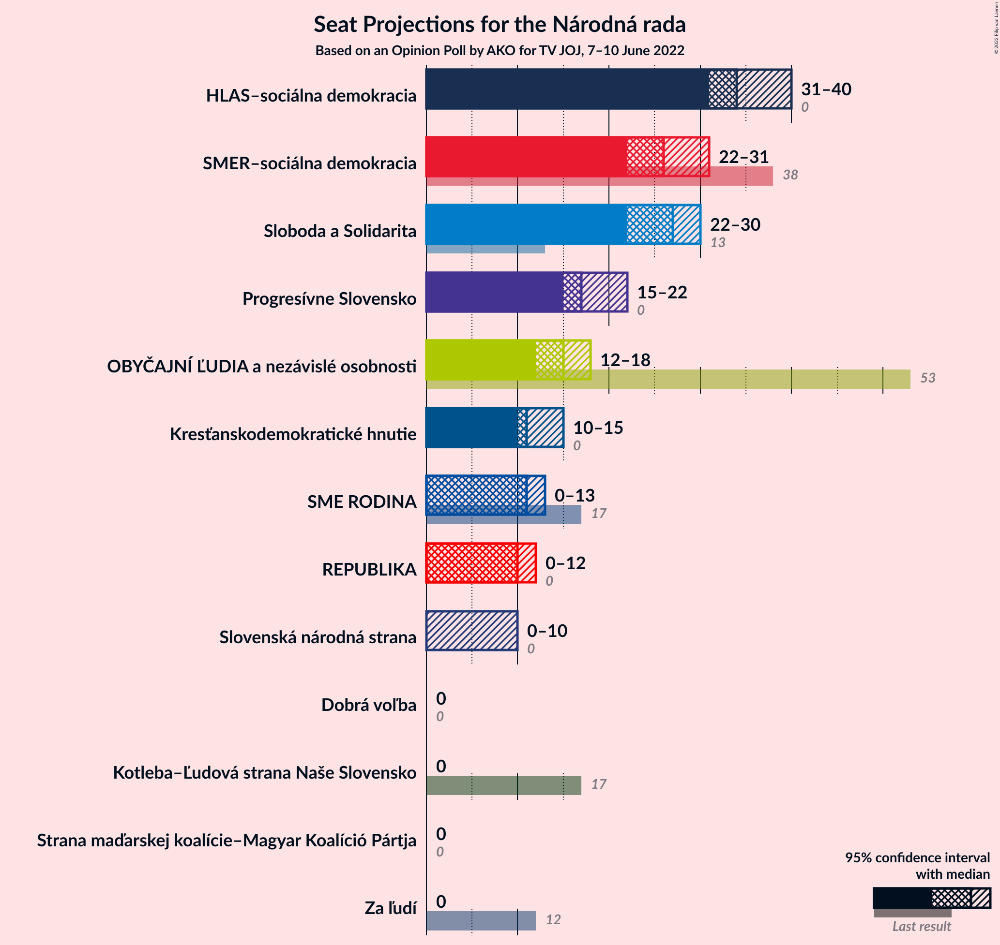

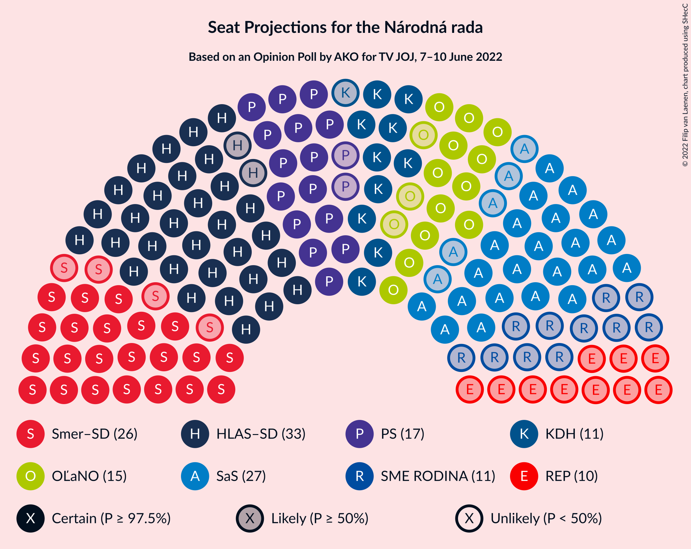

### Confidence Intervals

| Party | Last Result | Median | 80% Confidence Interval | 90% Confidence Interval | 95% Confidence Interval | 99% Confidence Interval |
|:-----:|:-----------:|:------:|:-----------------------:|:-----------------------:|:-----------------------:|:-----------------------:|
| <a href="#hlas–sociálna-demokracia">HLAS–sociálna demokracia</a> | 0 | 34 | 32–39 |32–40 |31–40 |30–44 |
| <a href="#smer–sociálna-demokracia">SMER–sociálna demokracia</a> | 38 | 26 | 25–30 |23–31 |22–31 |21–33 |
| <a href="#sloboda-a-solidarita">Sloboda a Solidarita</a> | 13 | 27 | 22–27 |22–29 |22–30 |21–33 |
| <a href="#progresívne-slovensko">Progresívne Slovensko</a> | 0 | 17 | 16–20 |16–21 |15–22 |14–23 |
| <a href="#obyčajní-ľudia-a-nezávislé-osobnosti">OBYČAJNÍ ĽUDIA a nezávislé osobnosti</a> | 53 | 15 | 13–17 |13–18 |12–18 |10–20 |
| <a href="#kresťanskodemokratické-hnutie">Kresťanskodemokratické hnutie</a> | 0 | 11 | 11–14 |10–14 |10–15 |0–16 |
| <a href="#sme-rodina">SME RODINA</a> | 17 | 11 | 0–12 |0–13 |0–13 |0–14 |
| <a href="#republika">REPUBLIKA</a> | 0 | 10 | 0–10 |0–11 |0–12 |0–13 |
| <a href="#slovenská-národná-strana">Slovenská národná strana</a> | 0 | 0 | 0–10 |0–10 |0–10 |0–10 |
| <a href="#za-ľudí">Za ľudí</a> | 12 | 0 | 0 |0 |0 |0 |
| <a href="#strana-maďarskej-koalície–magyar-koalíció-pártja">Strana maďarskej koalície–Magyar Koalíció Pártja</a> | 0 | 0 | 0 |0 |0 |0 |
| <a href="#kotleba–ľudová-strana-naše-slovensko">Kotleba–Ľudová strana Naše Slovensko</a> | 17 | 0 | 0 |0 |0 |0 |
| <a href="#dobrá-voľba">Dobrá voľba</a> | 0 | 0 | 0 |0 |0 |0 |

### HLAS–sociálna demokracia

*For a full overview of the results for this party, see the [HLAS–sociálna demokracia](party-hlas–sociálnademokracia.html) page.*

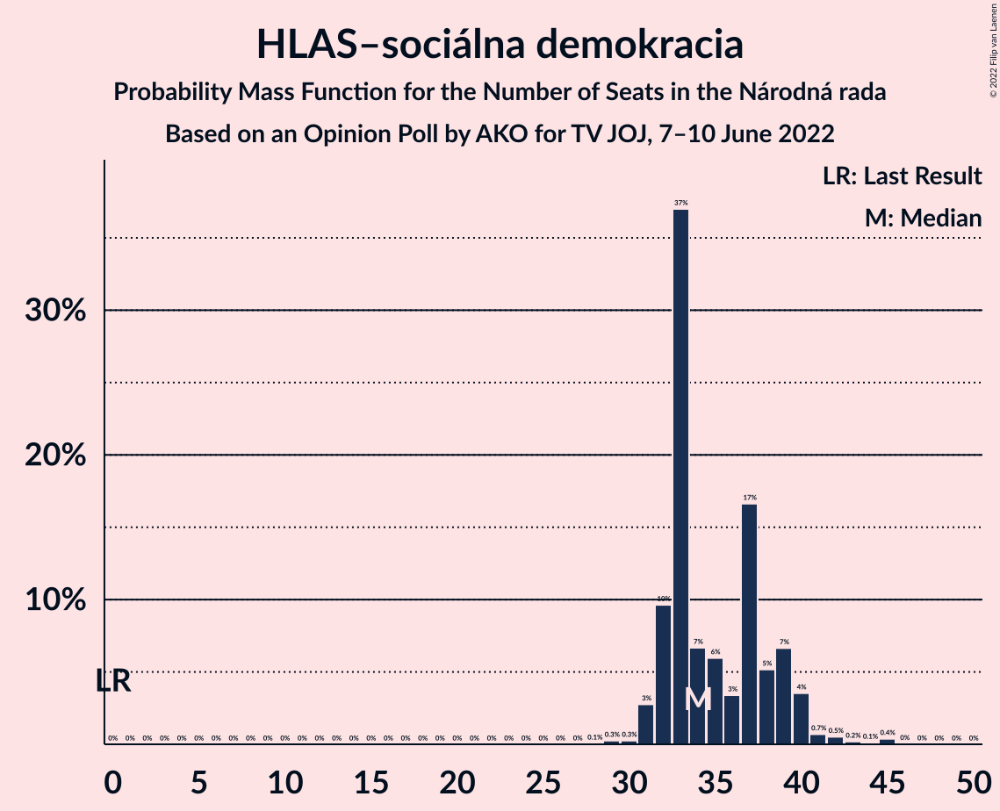

| Number of Seats | Probability | Accumulated | Special Marks |
|:---------------:|:-----------:|:-----------:|:-------------:|
| 0 | 0% | 100% | Last Result |
| 1 | 0% | 100% |  |
| 2 | 0% | 100% |  |
| 3 | 0% | 100% |  |
| 4 | 0% | 100% |  |
| 5 | 0% | 100% |  |
| 6 | 0% | 100% |  |
| 7 | 0% | 100% |  |
| 8 | 0% | 100% |  |
| 9 | 0% | 100% |  |
| 10 | 0% | 100% |  |
| 11 | 0% | 100% |  |
| 12 | 0% | 100% |  |
| 13 | 0% | 100% |  |
| 14 | 0% | 100% |  |
| 15 | 0% | 100% |  |
| 16 | 0% | 100% |  |
| 17 | 0% | 100% |  |
| 18 | 0% | 100% |  |
| 19 | 0% | 100% |  |
| 20 | 0% | 100% |  |
| 21 | 0% | 100% |  |
| 22 | 0% | 100% |  |
| 23 | 0% | 100% |  |
| 24 | 0% | 100% |  |
| 25 | 0% | 100% |  |
| 26 | 0% | 100% |  |
| 27 | 0% | 100% |  |
| 28 | 0.1% | 100% |  |
| 29 | 0.3% | 99.9% |  |
| 30 | 0.3% | 99.7% |  |
| 31 | 3% | 99.4% |  |
| 32 | 10% | 97% |  |
| 33 | 37% | 87% |  |
| 34 | 7% | 50% | Median |
| 35 | 6% | 43% |  |
| 36 | 3% | 37% |  |
| 37 | 17% | 34% |  |
| 38 | 5% | 17% |  |
| 39 | 7% | 12% |  |
| 40 | 4% | 6% |  |
| 41 | 0.7% | 2% |  |
| 42 | 0.5% | 1.3% |  |
| 43 | 0.2% | 0.7% |  |
| 44 | 0.1% | 0.6% |  |
| 45 | 0.4% | 0.4% |  |
| 46 | 0% | 0.1% |  |
| 47 | 0% | 0% |  |

### SMER–sociálna demokracia

*For a full overview of the results for this party, see the [SMER–sociálna demokracia](party-smer–sociálnademokracia.html) page.*

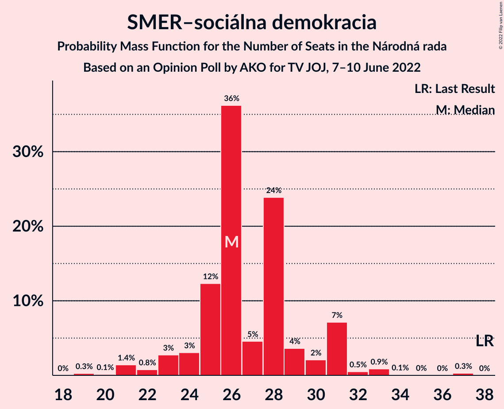

| Number of Seats | Probability | Accumulated | Special Marks |
|:---------------:|:-----------:|:-----------:|:-------------:|
| 19 | 0.3% | 100% |  |
| 20 | 0.1% | 99.7% |  |
| 21 | 1.4% | 99.6% |  |
| 22 | 0.8% | 98% |  |
| 23 | 3% | 97% |  |
| 24 | 3% | 95% |  |
| 25 | 12% | 92% |  |
| 26 | 36% | 79% | Median |
| 27 | 5% | 43% |  |
| 28 | 24% | 39% |  |
| 29 | 4% | 15% |  |
| 30 | 2% | 11% |  |
| 31 | 7% | 9% |  |
| 32 | 0.5% | 2% |  |
| 33 | 0.9% | 1.3% |  |
| 34 | 0.1% | 0.4% |  |
| 35 | 0% | 0.3% |  |
| 36 | 0% | 0.3% |  |
| 37 | 0.3% | 0.3% |  |
| 38 | 0% | 0% | Last Result |

### Sloboda a Solidarita

*For a full overview of the results for this party, see the [Sloboda a Solidarita](party-slobodaasolidarita.html) page.*

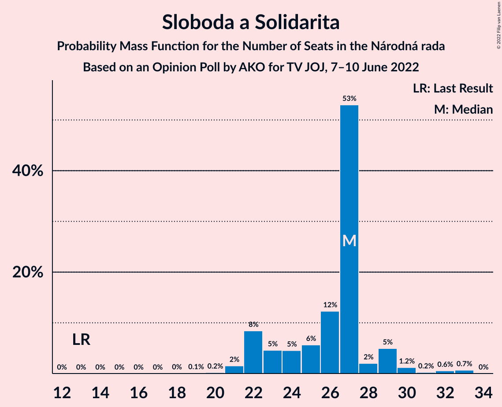

| Number of Seats | Probability | Accumulated | Special Marks |
|:---------------:|:-----------:|:-----------:|:-------------:|
| 13 | 0% | 100% | Last Result |
| 14 | 0% | 100% |  |
| 15 | 0% | 100% |  |
| 16 | 0% | 100% |  |
| 17 | 0% | 100% |  |
| 18 | 0% | 100% |  |
| 19 | 0.1% | 100% |  |
| 20 | 0.2% | 99.9% |  |
| 21 | 2% | 99.7% |  |
| 22 | 8% | 98% |  |
| 23 | 5% | 90% |  |
| 24 | 5% | 85% |  |
| 25 | 6% | 81% |  |
| 26 | 12% | 75% |  |
| 27 | 53% | 63% | Median |
| 28 | 2% | 10% |  |
| 29 | 5% | 8% |  |
| 30 | 1.2% | 3% |  |
| 31 | 0.2% | 1.5% |  |
| 32 | 0.6% | 1.2% |  |
| 33 | 0.7% | 0.7% |  |
| 34 | 0% | 0% |  |

### Progresívne Slovensko

*For a full overview of the results for this party, see the [Progresívne Slovensko](party-progresívneslovensko.html) page.*

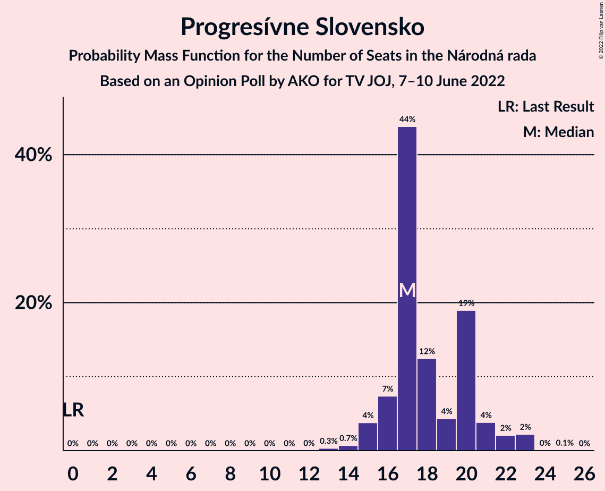

| Number of Seats | Probability | Accumulated | Special Marks |
|:---------------:|:-----------:|:-----------:|:-------------:|
| 0 | 0% | 100% | Last Result |
| 1 | 0% | 100% |  |
| 2 | 0% | 100% |  |
| 3 | 0% | 100% |  |
| 4 | 0% | 100% |  |
| 5 | 0% | 100% |  |
| 6 | 0% | 100% |  |
| 7 | 0% | 100% |  |
| 8 | 0% | 100% |  |
| 9 | 0% | 100% |  |
| 10 | 0% | 100% |  |
| 11 | 0% | 100% |  |
| 12 | 0% | 100% |  |
| 13 | 0.3% | 100% |  |
| 14 | 0.7% | 99.6% |  |
| 15 | 4% | 98.9% |  |
| 16 | 7% | 95% |  |
| 17 | 44% | 88% | Median |
| 18 | 12% | 44% |  |
| 19 | 4% | 32% |  |
| 20 | 19% | 27% |  |
| 21 | 4% | 8% |  |
| 22 | 2% | 4% |  |
| 23 | 2% | 2% |  |
| 24 | 0% | 0.1% |  |
| 25 | 0.1% | 0.1% |  |
| 26 | 0% | 0% |  |

### OBYČAJNÍ ĽUDIA a nezávislé osobnosti

*For a full overview of the results for this party, see the [OBYČAJNÍ ĽUDIA a nezávislé osobnosti](party-obyčajníľudiaanezávisléosobnosti.html) page.*

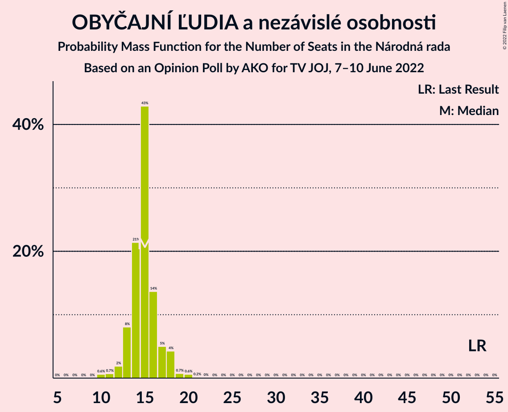

| Number of Seats | Probability | Accumulated | Special Marks |
|:---------------:|:-----------:|:-----------:|:-------------:|
| 10 | 0.6% | 100% |  |
| 11 | 0.7% | 99.4% |  |
| 12 | 2% | 98.7% |  |
| 13 | 8% | 97% |  |
| 14 | 21% | 89% |  |
| 15 | 43% | 67% | Median |
| 16 | 14% | 24% |  |
| 17 | 5% | 11% |  |
| 18 | 4% | 6% |  |
| 19 | 0.7% | 2% |  |
| 20 | 0.6% | 0.8% |  |
| 21 | 0.2% | 0.2% |  |
| 22 | 0% | 0% |  |
| 23 | 0% | 0% |  |
| 24 | 0% | 0% |  |
| 25 | 0% | 0% |  |
| 26 | 0% | 0% |  |
| 27 | 0% | 0% |  |
| 28 | 0% | 0% |  |
| 29 | 0% | 0% |  |
| 30 | 0% | 0% |  |
| 31 | 0% | 0% |  |
| 32 | 0% | 0% |  |
| 33 | 0% | 0% |  |
| 34 | 0% | 0% |  |
| 35 | 0% | 0% |  |
| 36 | 0% | 0% |  |
| 37 | 0% | 0% |  |
| 38 | 0% | 0% |  |
| 39 | 0% | 0% |  |
| 40 | 0% | 0% |  |
| 41 | 0% | 0% |  |
| 42 | 0% | 0% |  |
| 43 | 0% | 0% |  |
| 44 | 0% | 0% |  |
| 45 | 0% | 0% |  |
| 46 | 0% | 0% |  |
| 47 | 0% | 0% |  |
| 48 | 0% | 0% |  |
| 49 | 0% | 0% |  |
| 50 | 0% | 0% |  |
| 51 | 0% | 0% |  |
| 52 | 0% | 0% |  |
| 53 | 0% | 0% | Last Result |

### Kresťanskodemokratické hnutie

*For a full overview of the results for this party, see the [Kresťanskodemokratické hnutie](party-kresťanskodemokratickéhnutie.html) page.*

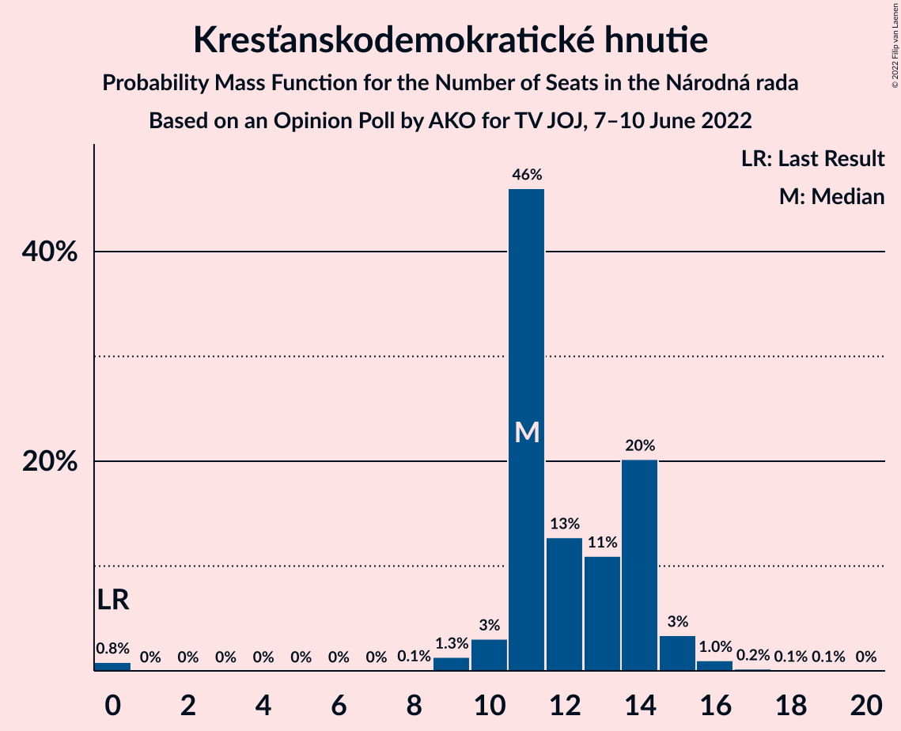

| Number of Seats | Probability | Accumulated | Special Marks |
|:---------------:|:-----------:|:-----------:|:-------------:|
| 0 | 0.8% | 100% | Last Result |
| 1 | 0% | 99.2% |  |
| 2 | 0% | 99.2% |  |
| 3 | 0% | 99.2% |  |
| 4 | 0% | 99.2% |  |
| 5 | 0% | 99.2% |  |
| 6 | 0% | 99.2% |  |
| 7 | 0% | 99.2% |  |
| 8 | 0.1% | 99.2% |  |
| 9 | 1.3% | 99.1% |  |
| 10 | 3% | 98% |  |
| 11 | 46% | 95% | Median |
| 12 | 13% | 49% |  |
| 13 | 11% | 36% |  |
| 14 | 20% | 25% |  |
| 15 | 3% | 5% |  |
| 16 | 1.0% | 1.4% |  |
| 17 | 0.2% | 0.4% |  |
| 18 | 0.1% | 0.2% |  |
| 19 | 0.1% | 0.1% |  |
| 20 | 0% | 0% |  |

### SME RODINA

*For a full overview of the results for this party, see the [SME RODINA](party-smerodina.html) page.*

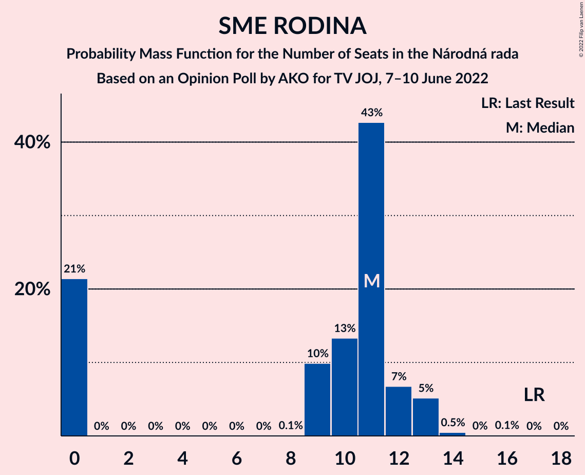

| Number of Seats | Probability | Accumulated | Special Marks |
|:---------------:|:-----------:|:-----------:|:-------------:|
| 0 | 21% | 100% |  |
| 1 | 0% | 79% |  |
| 2 | 0% | 79% |  |
| 3 | 0% | 79% |  |
| 4 | 0% | 79% |  |
| 5 | 0% | 79% |  |
| 6 | 0% | 79% |  |
| 7 | 0% | 79% |  |
| 8 | 0.1% | 79% |  |
| 9 | 10% | 78% |  |
| 10 | 13% | 69% |  |
| 11 | 43% | 55% | Median |
| 12 | 7% | 13% |  |
| 13 | 5% | 6% |  |
| 14 | 0.5% | 0.7% |  |
| 15 | 0% | 0.2% |  |
| 16 | 0.1% | 0.1% |  |
| 17 | 0% | 0% | Last Result |

### REPUBLIKA

*For a full overview of the results for this party, see the [REPUBLIKA](party-republika.html) page.*

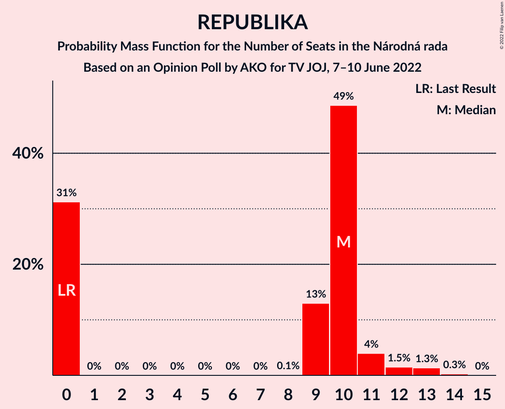

| Number of Seats | Probability | Accumulated | Special Marks |
|:---------------:|:-----------:|:-----------:|:-------------:|
| 0 | 31% | 100% | Last Result |
| 1 | 0% | 69% |  |
| 2 | 0% | 69% |  |
| 3 | 0% | 69% |  |
| 4 | 0% | 69% |  |
| 5 | 0% | 69% |  |
| 6 | 0% | 69% |  |
| 7 | 0% | 69% |  |
| 8 | 0.1% | 69% |  |
| 9 | 13% | 69% |  |
| 10 | 49% | 56% | Median |
| 11 | 4% | 7% |  |
| 12 | 1.5% | 3% |  |
| 13 | 1.3% | 2% |  |
| 14 | 0.3% | 0.3% |  |
| 15 | 0% | 0% |  |

### Slovenská národná strana

*For a full overview of the results for this party, see the [Slovenská národná strana](party-slovenskánárodnástrana.html) page.*

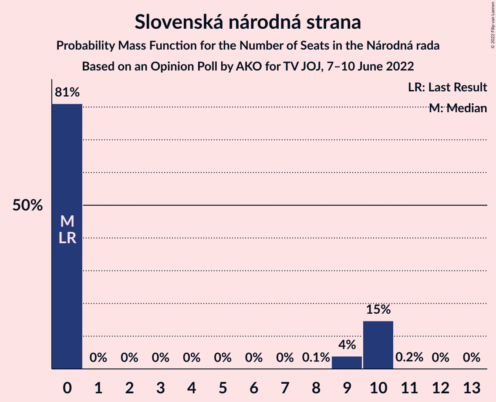

| Number of Seats | Probability | Accumulated | Special Marks |
|:---------------:|:-----------:|:-----------:|:-------------:|
| 0 | 81% | 100% | Last Result, Median |
| 1 | 0% | 19% |  |
| 2 | 0% | 19% |  |
| 3 | 0% | 19% |  |
| 4 | 0% | 19% |  |
| 5 | 0% | 19% |  |
| 6 | 0% | 19% |  |
| 7 | 0% | 19% |  |
| 8 | 0.1% | 19% |  |
| 9 | 4% | 19% |  |
| 10 | 15% | 15% |  |
| 11 | 0.2% | 0.2% |  |
| 12 | 0% | 0.1% |  |
| 13 | 0% | 0% |  |

### Za ľudí

*For a full overview of the results for this party, see the [Za ľudí](party-zaľudí.html) page.*

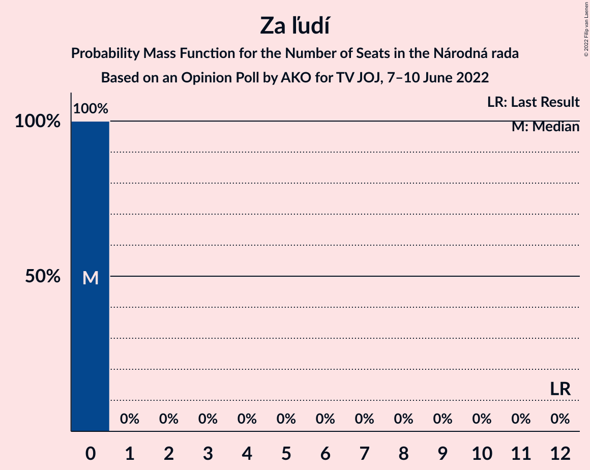

| Number of Seats | Probability | Accumulated | Special Marks |
|:---------------:|:-----------:|:-----------:|:-------------:|
| 0 | 100% | 100% | Median |
| 1 | 0% | 0% |  |
| 2 | 0% | 0% |  |
| 3 | 0% | 0% |  |
| 4 | 0% | 0% |  |
| 5 | 0% | 0% |  |
| 6 | 0% | 0% |  |
| 7 | 0% | 0% |  |
| 8 | 0% | 0% |  |
| 9 | 0% | 0% |  |
| 10 | 0% | 0% |  |
| 11 | 0% | 0% |  |
| 12 | 0% | 0% | Last Result |

### Strana maďarskej koalície–Magyar Koalíció Pártja

*For a full overview of the results for this party, see the [Strana maďarskej koalície–Magyar Koalíció Pártja](party-stranamaďarskejkoalície–magyarkoalíciópártja.html) page.*

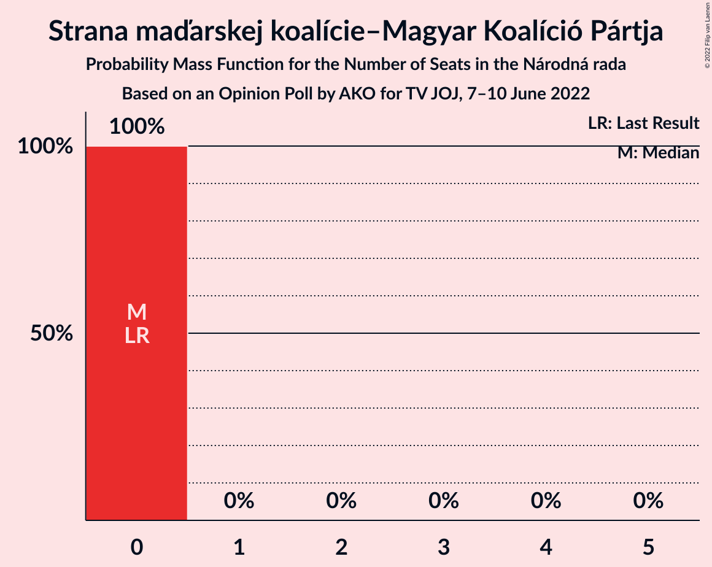

| Number of Seats | Probability | Accumulated | Special Marks |
|:---------------:|:-----------:|:-----------:|:-------------:|
| 0 | 100% | 100% | Last Result, Median |

### Kotleba–Ľudová strana Naše Slovensko

*For a full overview of the results for this party, see the [Kotleba–Ľudová strana Naše Slovensko](party-kotleba–ľudovástrananašeslovensko.html) page.*

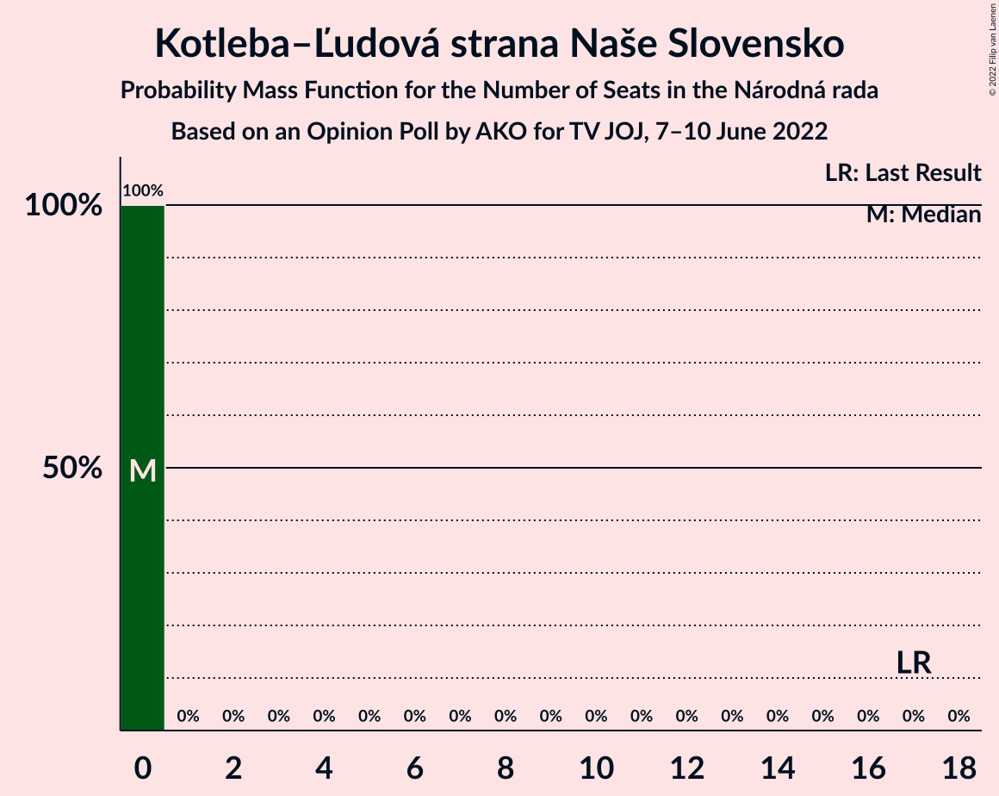

| Number of Seats | Probability | Accumulated | Special Marks |
|:---------------:|:-----------:|:-----------:|:-------------:|
| 0 | 100% | 100% | Median |
| 1 | 0% | 0% |  |
| 2 | 0% | 0% |  |
| 3 | 0% | 0% |  |
| 4 | 0% | 0% |  |
| 5 | 0% | 0% |  |
| 6 | 0% | 0% |  |
| 7 | 0% | 0% |  |
| 8 | 0% | 0% |  |
| 9 | 0% | 0% |  |
| 10 | 0% | 0% |  |
| 11 | 0% | 0% |  |
| 12 | 0% | 0% |  |
| 13 | 0% | 0% |  |
| 14 | 0% | 0% |  |
| 15 | 0% | 0% |  |
| 16 | 0% | 0% |  |
| 17 | 0% | 0% | Last Result |

### Dobrá voľba

*For a full overview of the results for this party, see the [Dobrá voľba](party-dobrávoľba.html) page.*

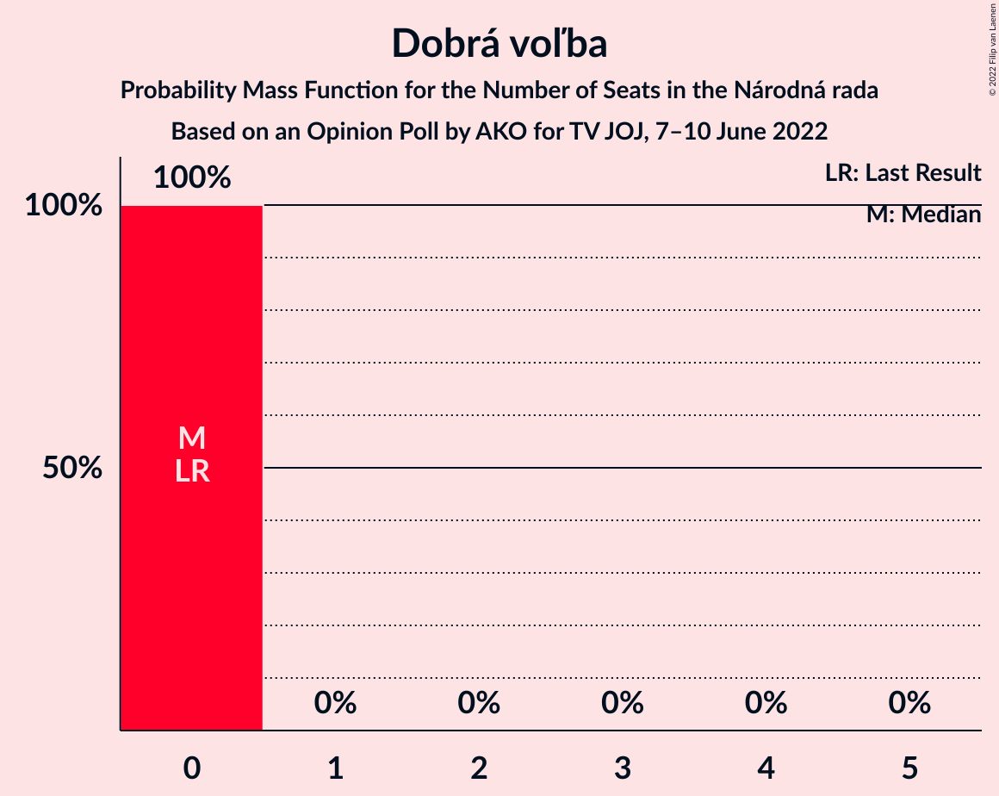

| Number of Seats | Probability | Accumulated | Special Marks |
|:---------------:|:-----------:|:-----------:|:-------------:|
| 0 | 100% | 100% | Last Result, Median |

## Coalitions

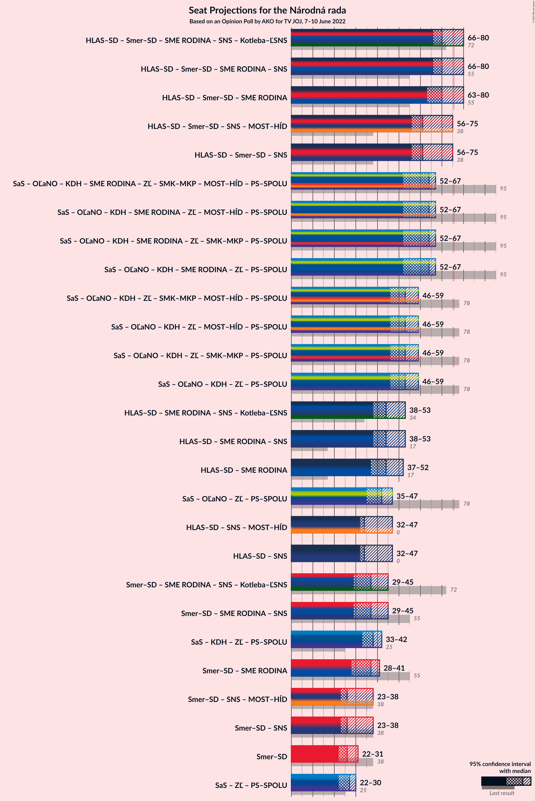

### Confidence Intervals

| Coalition | Last Result | Median | Majority? | 80% Confidence Interval | 90% Confidence Interval | 95% Confidence Interval | 99% Confidence Interval |
|:---------:|:-----------:|:------:|:---------:|:-----------------------:|:-----------------------:|:-----------------------:|:-----------------------:|
| HLAS–sociálna demokracia – SMER–sociálna demokracia – SME RODINA – Slovenská národná strana – Kotleba–Ľudová strana Naše Slovensko | 72 | 70 | 12% | 69–77 | 67–80 | 66–80 | 62–83 |
| HLAS–sociálna demokracia – SMER–sociálna demokracia – SME RODINA – Slovenská národná strana | 55 | 70 | 12% | 69–77 | 67–80 | 66–80 | 62–83 |
| HLAS–sociálna demokracia – SMER–sociálna demokracia – SME RODINA | 55 | 70 | 9% | 65–75 | 65–80 | 63–80 | 61–81 |
| HLAS–sociálna demokracia – SMER–sociálna demokracia – Slovenská národná strana | 38 | 61 | 0.4% | 59–75 | 58–75 | 56–75 | 55–75 |
| HLAS–sociálna demokracia – SME RODINA – Slovenská národná strana – Kotleba–Ľudová strana Naše Slovensko | 34 | 44 | 0% | 41–51 | 40–52 | 38–53 | 35–56 |
| HLAS–sociálna demokracia – SME RODINA – Slovenská národná strana | 17 | 44 | 0% | 41–51 | 40–52 | 38–53 | 35–56 |
| HLAS–sociálna demokracia – SME RODINA | 17 | 44 | 0% | 37–48 | 37–52 | 37–52 | 34–54 |
| HLAS–sociálna demokracia – Slovenská národná strana | 0 | 34 | 0% | 32–47 | 32–47 | 32–47 | 31–47 |
| SMER–sociálna demokracia – SME RODINA – Slovenská národná strana – Kotleba–Ľudová strana Naše Slovensko | 72 | 37 | 0% | 33–40 | 30–41 | 29–45 | 26–48 |
| SMER–sociálna demokracia – SME RODINA – Slovenská národná strana | 55 | 37 | 0% | 33–40 | 30–41 | 29–45 | 26–48 |
| SMER–sociálna demokracia – SME RODINA | 55 | 37 | 0% | 28–40 | 28–41 | 28–41 | 25–44 |
| SMER–sociálna demokracia – Slovenská národná strana | 38 | 26 | 0% | 25–38 | 24–38 | 23–38 | 21–39 |
| SMER–sociálna demokracia | 38 | 26 | 0% | 25–30 | 23–31 | 22–31 | 21–33 |

### HLAS–sociálna demokracia – SMER–sociálna demokracia – SME RODINA – Slovenská národná strana – Kotleba–Ľudová strana Naše Slovensko

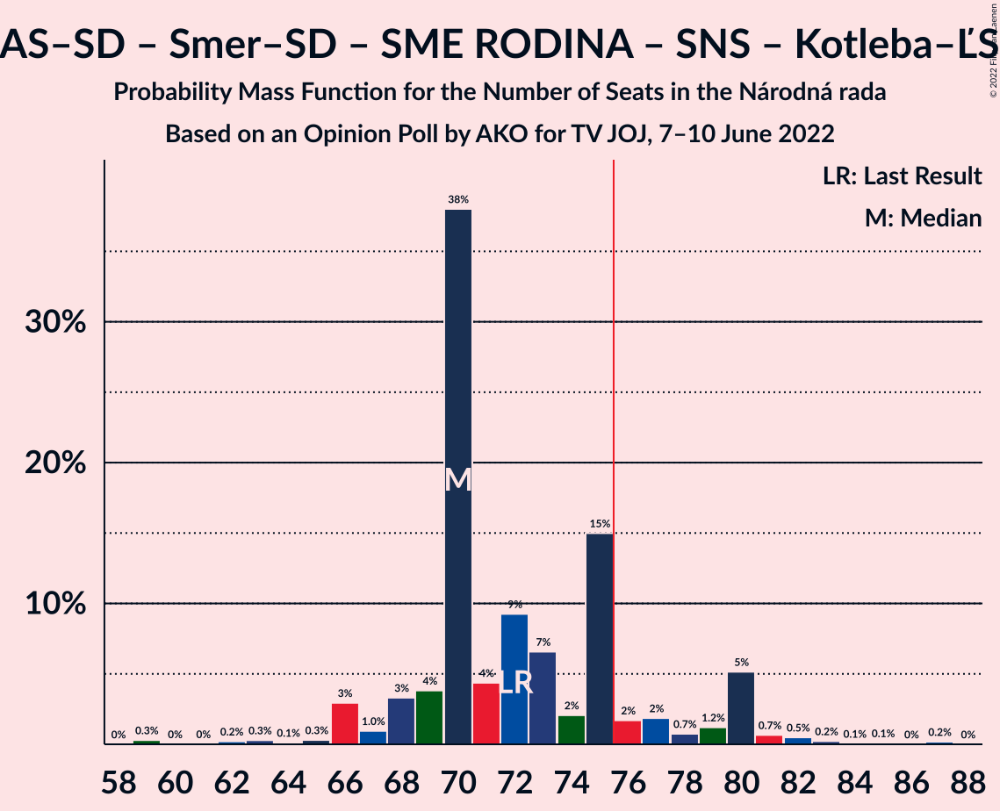

| Number of Seats | Probability | Accumulated | Special Marks |
|:---------------:|:-----------:|:-----------:|:-------------:|
| 59 | 0.3% | 100% |  |
| 60 | 0% | 99.7% |  |
| 61 | 0% | 99.7% |  |
| 62 | 0.2% | 99.6% |  |
| 63 | 0.3% | 99.4% |  |
| 64 | 0.1% | 99.1% |  |
| 65 | 0.3% | 99.0% |  |
| 66 | 3% | 98.7% |  |
| 67 | 1.0% | 96% |  |
| 68 | 3% | 95% |  |
| 69 | 4% | 92% |  |
| 70 | 38% | 88% |  |
| 71 | 4% | 50% | Median |
| 72 | 9% | 45% | Last Result |
| 73 | 7% | 36% |  |
| 74 | 2% | 29% |  |
| 75 | 15% | 27% |  |
| 76 | 2% | 12% | Majority |
| 77 | 2% | 11% |  |
| 78 | 0.7% | 9% |  |
| 79 | 1.2% | 8% |  |
| 80 | 5% | 7% |  |
| 81 | 0.7% | 2% |  |
| 82 | 0.5% | 1.1% |  |
| 83 | 0.2% | 0.6% |  |
| 84 | 0.1% | 0.3% |  |
| 85 | 0.1% | 0.3% |  |
| 86 | 0% | 0.2% |  |
| 87 | 0.2% | 0.2% |  |
| 88 | 0% | 0% |  |

### HLAS–sociálna demokracia – SMER–sociálna demokracia – SME RODINA – Slovenská národná strana

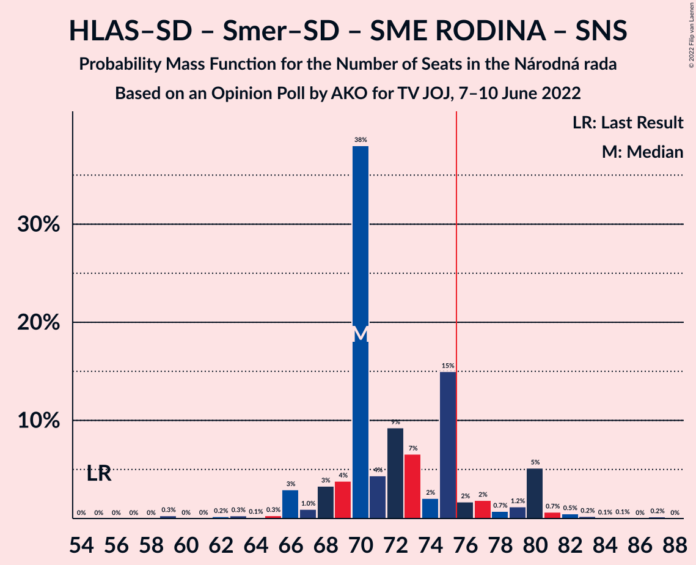

| Number of Seats | Probability | Accumulated | Special Marks |
|:---------------:|:-----------:|:-----------:|:-------------:|
| 55 | 0% | 100% | Last Result |
| 56 | 0% | 100% |  |
| 57 | 0% | 100% |  |
| 58 | 0% | 100% |  |
| 59 | 0.3% | 100% |  |
| 60 | 0% | 99.7% |  |
| 61 | 0% | 99.7% |  |
| 62 | 0.2% | 99.6% |  |
| 63 | 0.3% | 99.4% |  |
| 64 | 0.1% | 99.1% |  |
| 65 | 0.3% | 99.0% |  |
| 66 | 3% | 98.7% |  |
| 67 | 1.0% | 96% |  |
| 68 | 3% | 95% |  |
| 69 | 4% | 92% |  |
| 70 | 38% | 88% |  |
| 71 | 4% | 50% | Median |
| 72 | 9% | 45% |  |
| 73 | 7% | 36% |  |
| 74 | 2% | 29% |  |
| 75 | 15% | 27% |  |
| 76 | 2% | 12% | Majority |
| 77 | 2% | 11% |  |
| 78 | 0.7% | 9% |  |
| 79 | 1.2% | 8% |  |
| 80 | 5% | 7% |  |
| 81 | 0.7% | 2% |  |
| 82 | 0.5% | 1.1% |  |
| 83 | 0.2% | 0.6% |  |
| 84 | 0.1% | 0.3% |  |
| 85 | 0.1% | 0.3% |  |
| 86 | 0% | 0.2% |  |
| 87 | 0.2% | 0.2% |  |
| 88 | 0% | 0% |  |

### HLAS–sociálna demokracia – SMER–sociálna demokracia – SME RODINA

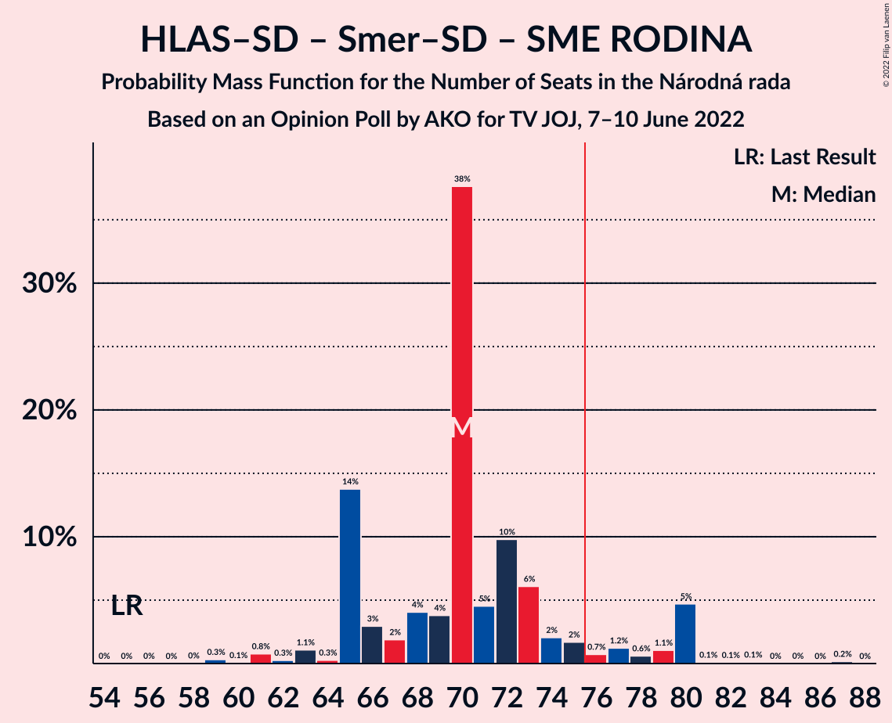

| Number of Seats | Probability | Accumulated | Special Marks |
|:---------------:|:-----------:|:-----------:|:-------------:|
| 55 | 0% | 100% | Last Result |
| 56 | 0% | 100% |  |
| 57 | 0% | 100% |  |
| 58 | 0% | 100% |  |
| 59 | 0.3% | 99.9% |  |
| 60 | 0.1% | 99.6% |  |
| 61 | 0.8% | 99.5% |  |
| 62 | 0.3% | 98.8% |  |
| 63 | 1.1% | 98% |  |
| 64 | 0.3% | 97% |  |
| 65 | 14% | 97% |  |
| 66 | 3% | 83% |  |
| 67 | 2% | 80% |  |
| 68 | 4% | 79% |  |
| 69 | 4% | 74% |  |
| 70 | 38% | 71% |  |
| 71 | 5% | 33% | Median |
| 72 | 10% | 28% |  |
| 73 | 6% | 19% |  |
| 74 | 2% | 13% |  |
| 75 | 2% | 11% |  |
| 76 | 0.7% | 9% | Majority |
| 77 | 1.2% | 8% |  |
| 78 | 0.6% | 7% |  |
| 79 | 1.1% | 6% |  |
| 80 | 5% | 5% |  |
| 81 | 0.1% | 0.5% |  |
| 82 | 0.1% | 0.4% |  |
| 83 | 0.1% | 0.3% |  |
| 84 | 0% | 0.2% |  |
| 85 | 0% | 0.2% |  |
| 86 | 0% | 0.2% |  |
| 87 | 0.2% | 0.2% |  |
| 88 | 0% | 0% |  |

### HLAS–sociálna demokracia – SMER–sociálna demokracia – Slovenská národná strana

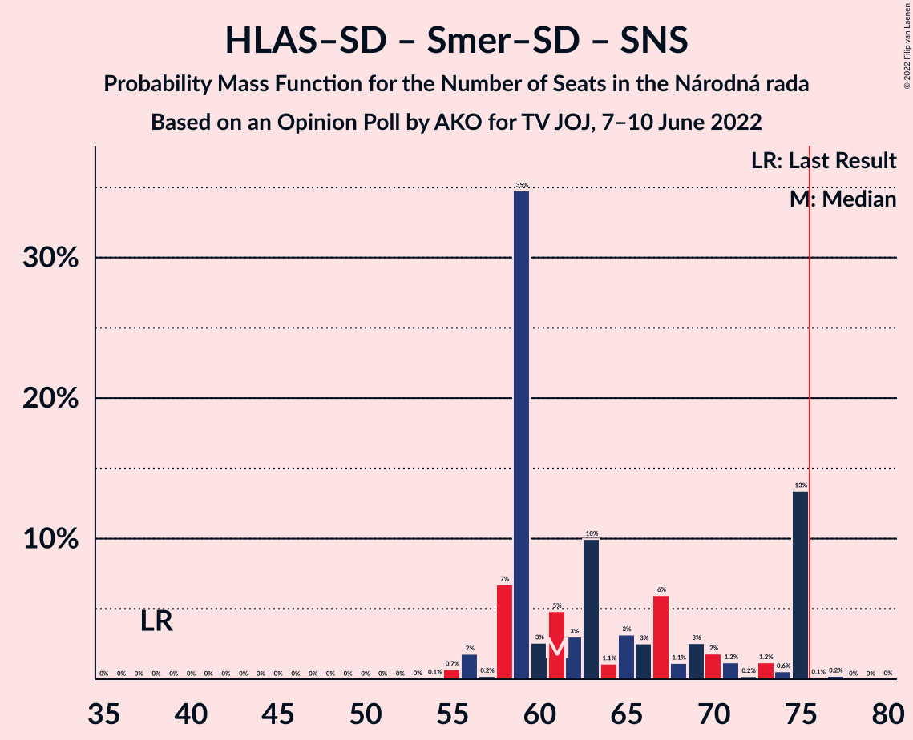

| Number of Seats | Probability | Accumulated | Special Marks |
|:---------------:|:-----------:|:-----------:|:-------------:|
| 38 | 0% | 100% | Last Result |
| 39 | 0% | 100% |  |
| 40 | 0% | 100% |  |
| 41 | 0% | 100% |  |
| 42 | 0% | 100% |  |
| 43 | 0% | 100% |  |
| 44 | 0% | 100% |  |
| 45 | 0% | 100% |  |
| 46 | 0% | 100% |  |
| 47 | 0% | 100% |  |
| 48 | 0% | 100% |  |
| 49 | 0% | 100% |  |
| 50 | 0% | 100% |  |
| 51 | 0% | 100% |  |
| 52 | 0% | 100% |  |
| 53 | 0% | 100% |  |
| 54 | 0.1% | 100% |  |
| 55 | 0.7% | 99.8% |  |
| 56 | 2% | 99.1% |  |
| 57 | 0.2% | 97% |  |
| 58 | 7% | 97% |  |
| 59 | 35% | 90% |  |
| 60 | 3% | 56% | Median |
| 61 | 5% | 53% |  |
| 62 | 3% | 48% |  |
| 63 | 10% | 45% |  |
| 64 | 1.1% | 35% |  |
| 65 | 3% | 34% |  |
| 66 | 3% | 31% |  |
| 67 | 6% | 28% |  |
| 68 | 1.1% | 22% |  |
| 69 | 3% | 21% |  |
| 70 | 2% | 19% |  |
| 71 | 1.2% | 17% |  |
| 72 | 0.2% | 16% |  |
| 73 | 1.2% | 16% |  |
| 74 | 0.6% | 14% |  |
| 75 | 13% | 14% |  |
| 76 | 0.1% | 0.4% | Majority |
| 77 | 0.2% | 0.3% |  |
| 78 | 0% | 0% |  |

### HLAS–sociálna demokracia – SME RODINA – Slovenská národná strana – Kotleba–Ľudová strana Naše Slovensko

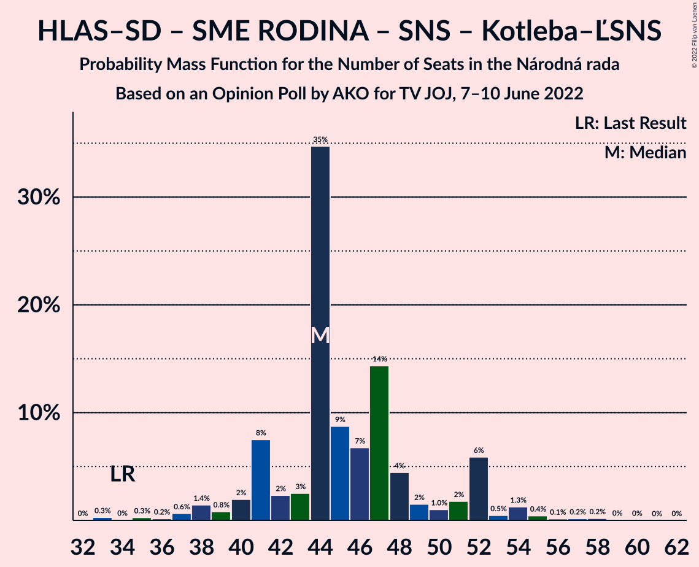

| Number of Seats | Probability | Accumulated | Special Marks |
|:---------------:|:-----------:|:-----------:|:-------------:|
| 33 | 0.3% | 100% |  |
| 34 | 0% | 99.7% | Last Result |
| 35 | 0.3% | 99.6% |  |
| 36 | 0.2% | 99.4% |  |
| 37 | 0.6% | 99.2% |  |
| 38 | 1.4% | 98.5% |  |
| 39 | 0.8% | 97% |  |
| 40 | 2% | 96% |  |
| 41 | 8% | 94% |  |
| 42 | 2% | 87% |  |
| 43 | 3% | 84% |  |
| 44 | 35% | 82% |  |
| 45 | 9% | 47% | Median |
| 46 | 7% | 39% |  |
| 47 | 14% | 32% |  |
| 48 | 4% | 17% |  |
| 49 | 2% | 13% |  |
| 50 | 1.0% | 11% |  |
| 51 | 2% | 10% |  |
| 52 | 6% | 9% |  |
| 53 | 0.5% | 3% |  |
| 54 | 1.3% | 2% |  |
| 55 | 0.4% | 1.0% |  |
| 56 | 0.1% | 0.6% |  |
| 57 | 0.2% | 0.5% |  |
| 58 | 0.2% | 0.3% |  |
| 59 | 0% | 0.1% |  |
| 60 | 0% | 0.1% |  |
| 61 | 0% | 0% |  |

### HLAS–sociálna demokracia – SME RODINA – Slovenská národná strana

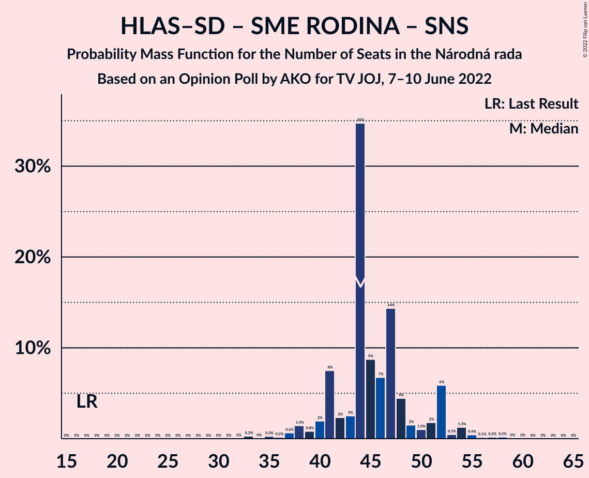

| Number of Seats | Probability | Accumulated | Special Marks |
|:---------------:|:-----------:|:-----------:|:-------------:|
| 17 | 0% | 100% | Last Result |
| 18 | 0% | 100% |  |
| 19 | 0% | 100% |  |
| 20 | 0% | 100% |  |
| 21 | 0% | 100% |  |
| 22 | 0% | 100% |  |
| 23 | 0% | 100% |  |
| 24 | 0% | 100% |  |
| 25 | 0% | 100% |  |
| 26 | 0% | 100% |  |
| 27 | 0% | 100% |  |
| 28 | 0% | 100% |  |
| 29 | 0% | 100% |  |
| 30 | 0% | 100% |  |
| 31 | 0% | 100% |  |
| 32 | 0% | 100% |  |
| 33 | 0.3% | 100% |  |
| 34 | 0% | 99.7% |  |
| 35 | 0.3% | 99.6% |  |
| 36 | 0.2% | 99.4% |  |
| 37 | 0.6% | 99.2% |  |
| 38 | 1.4% | 98.5% |  |
| 39 | 0.8% | 97% |  |
| 40 | 2% | 96% |  |
| 41 | 8% | 94% |  |
| 42 | 2% | 87% |  |
| 43 | 3% | 84% |  |
| 44 | 35% | 82% |  |
| 45 | 9% | 47% | Median |
| 46 | 7% | 39% |  |
| 47 | 14% | 32% |  |
| 48 | 4% | 17% |  |
| 49 | 2% | 13% |  |
| 50 | 1.0% | 11% |  |
| 51 | 2% | 10% |  |
| 52 | 6% | 9% |  |
| 53 | 0.5% | 3% |  |
| 54 | 1.3% | 2% |  |
| 55 | 0.4% | 1.0% |  |
| 56 | 0.1% | 0.6% |  |
| 57 | 0.2% | 0.5% |  |
| 58 | 0.2% | 0.3% |  |
| 59 | 0% | 0.1% |  |
| 60 | 0% | 0.1% |  |
| 61 | 0% | 0% |  |

### HLAS–sociálna demokracia – SME RODINA

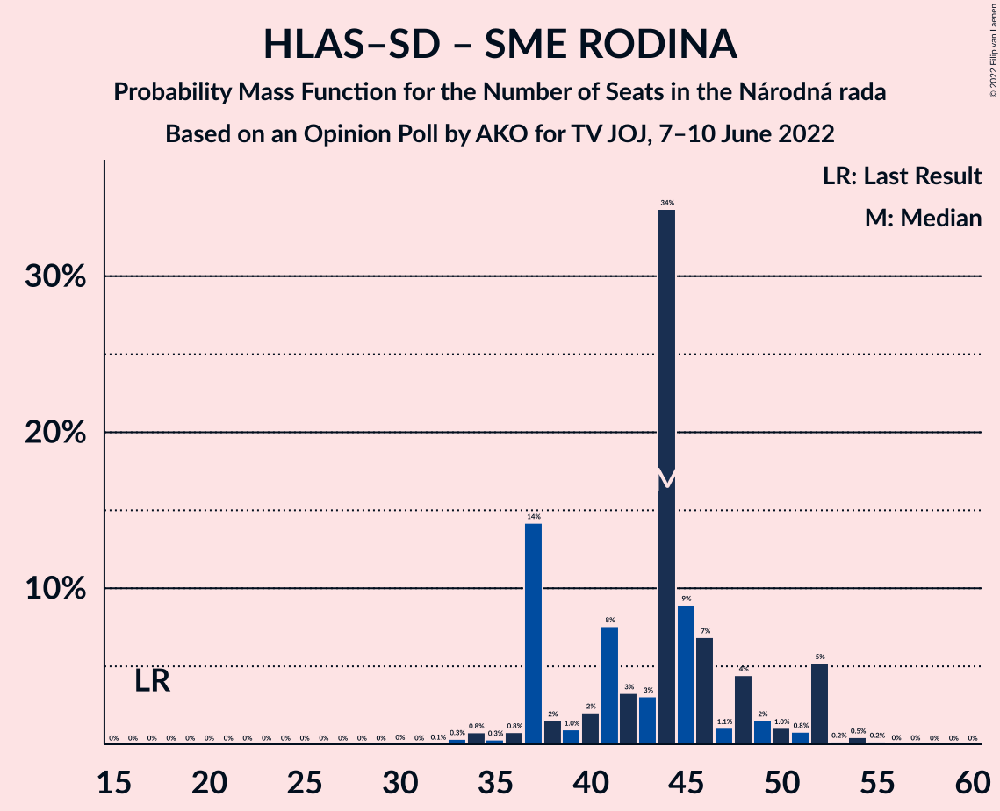

| Number of Seats | Probability | Accumulated | Special Marks |
|:---------------:|:-----------:|:-----------:|:-------------:|
| 17 | 0% | 100% | Last Result |
| 18 | 0% | 100% |  |
| 19 | 0% | 100% |  |
| 20 | 0% | 100% |  |
| 21 | 0% | 100% |  |
| 22 | 0% | 100% |  |
| 23 | 0% | 100% |  |
| 24 | 0% | 100% |  |
| 25 | 0% | 100% |  |
| 26 | 0% | 100% |  |
| 27 | 0% | 100% |  |
| 28 | 0% | 100% |  |
| 29 | 0% | 100% |  |
| 30 | 0% | 100% |  |
| 31 | 0% | 100% |  |
| 32 | 0.1% | 99.9% |  |
| 33 | 0.3% | 99.9% |  |
| 34 | 0.8% | 99.5% |  |
| 35 | 0.3% | 98.8% |  |
| 36 | 0.8% | 98% |  |
| 37 | 14% | 98% |  |
| 38 | 2% | 84% |  |
| 39 | 1.0% | 82% |  |
| 40 | 2% | 81% |  |
| 41 | 8% | 79% |  |
| 42 | 3% | 71% |  |
| 43 | 3% | 68% |  |
| 44 | 34% | 65% |  |
| 45 | 9% | 31% | Median |
| 46 | 7% | 22% |  |
| 47 | 1.1% | 15% |  |
| 48 | 4% | 14% |  |
| 49 | 2% | 9% |  |
| 50 | 1.0% | 8% |  |
| 51 | 0.8% | 7% |  |
| 52 | 5% | 6% |  |
| 53 | 0.2% | 0.8% |  |
| 54 | 0.5% | 0.7% |  |
| 55 | 0.2% | 0.2% |  |
| 56 | 0% | 0% |  |

### HLAS–sociálna demokracia – Slovenská národná strana

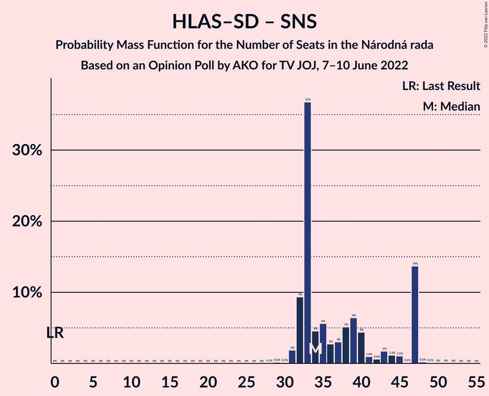

| Number of Seats | Probability | Accumulated | Special Marks |
|:---------------:|:-----------:|:-----------:|:-------------:|
| 0 | 0% | 100% | Last Result |
| 1 | 0% | 100% |  |
| 2 | 0% | 100% |  |
| 3 | 0% | 100% |  |
| 4 | 0% | 100% |  |
| 5 | 0% | 100% |  |
| 6 | 0% | 100% |  |
| 7 | 0% | 100% |  |
| 8 | 0% | 100% |  |
| 9 | 0% | 100% |  |
| 10 | 0% | 100% |  |
| 11 | 0% | 100% |  |
| 12 | 0% | 100% |  |
| 13 | 0% | 100% |  |
| 14 | 0% | 100% |  |
| 15 | 0% | 100% |  |
| 16 | 0% | 100% |  |
| 17 | 0% | 100% |  |
| 18 | 0% | 100% |  |
| 19 | 0% | 100% |  |
| 20 | 0% | 100% |  |
| 21 | 0% | 100% |  |
| 22 | 0% | 100% |  |
| 23 | 0% | 100% |  |
| 24 | 0% | 100% |  |
| 25 | 0% | 100% |  |
| 26 | 0% | 100% |  |
| 27 | 0% | 100% |  |
| 28 | 0.1% | 100% |  |
| 29 | 0.2% | 99.9% |  |
| 30 | 0.1% | 99.8% |  |
| 31 | 2% | 99.7% |  |
| 32 | 9% | 98% |  |
| 33 | 37% | 88% |  |
| 34 | 5% | 52% | Median |
| 35 | 6% | 47% |  |
| 36 | 3% | 41% |  |
| 37 | 3% | 39% |  |
| 38 | 5% | 36% |  |
| 39 | 6% | 31% |  |
| 40 | 4% | 24% |  |
| 41 | 1.0% | 20% |  |
| 42 | 0.6% | 19% |  |
| 43 | 2% | 18% |  |
| 44 | 1.2% | 16% |  |
| 45 | 1.1% | 15% |  |
| 46 | 0.1% | 14% |  |
| 47 | 14% | 14% |  |
| 48 | 0.2% | 0.4% |  |
| 49 | 0.1% | 0.2% |  |
| 50 | 0% | 0.1% |  |
| 51 | 0% | 0.1% |  |
| 52 | 0% | 0% |  |

### SMER–sociálna demokracia – SME RODINA – Slovenská národná strana – Kotleba–Ľudová strana Naše Slovensko

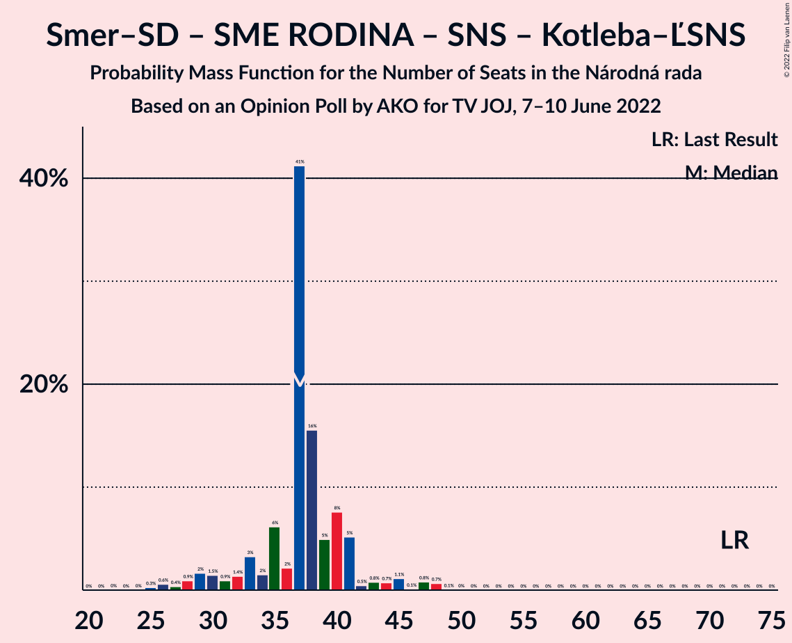

| Number of Seats | Probability | Accumulated | Special Marks |
|:---------------:|:-----------:|:-----------:|:-------------:|
| 23 | 0% | 100% |  |
| 24 | 0% | 99.9% |  |
| 25 | 0.3% | 99.9% |  |
| 26 | 0.6% | 99.6% |  |
| 27 | 0.4% | 99.1% |  |
| 28 | 0.9% | 98.7% |  |
| 29 | 2% | 98% |  |
| 30 | 1.5% | 96% |  |
| 31 | 0.9% | 95% |  |
| 32 | 1.4% | 94% |  |
| 33 | 3% | 92% |  |
| 34 | 2% | 89% |  |
| 35 | 6% | 88% |  |
| 36 | 2% | 81% |  |
| 37 | 41% | 79% | Median |
| 38 | 16% | 38% |  |
| 39 | 5% | 22% |  |
| 40 | 8% | 18% |  |
| 41 | 5% | 10% |  |
| 42 | 0.5% | 5% |  |
| 43 | 0.8% | 4% |  |
| 44 | 0.7% | 4% |  |
| 45 | 1.1% | 3% |  |
| 46 | 0.1% | 2% |  |
| 47 | 0.8% | 2% |  |
| 48 | 0.7% | 0.8% |  |
| 49 | 0.1% | 0.1% |  |
| 50 | 0% | 0% |  |
| 51 | 0% | 0% |  |
| 52 | 0% | 0% |  |
| 53 | 0% | 0% |  |
| 54 | 0% | 0% |  |
| 55 | 0% | 0% |  |
| 56 | 0% | 0% |  |
| 57 | 0% | 0% |  |
| 58 | 0% | 0% |  |
| 59 | 0% | 0% |  |
| 60 | 0% | 0% |  |
| 61 | 0% | 0% |  |
| 62 | 0% | 0% |  |
| 63 | 0% | 0% |  |
| 64 | 0% | 0% |  |
| 65 | 0% | 0% |  |
| 66 | 0% | 0% |  |
| 67 | 0% | 0% |  |
| 68 | 0% | 0% |  |
| 69 | 0% | 0% |  |
| 70 | 0% | 0% |  |
| 71 | 0% | 0% |  |
| 72 | 0% | 0% | Last Result |

### SMER–sociálna demokracia – SME RODINA – Slovenská národná strana

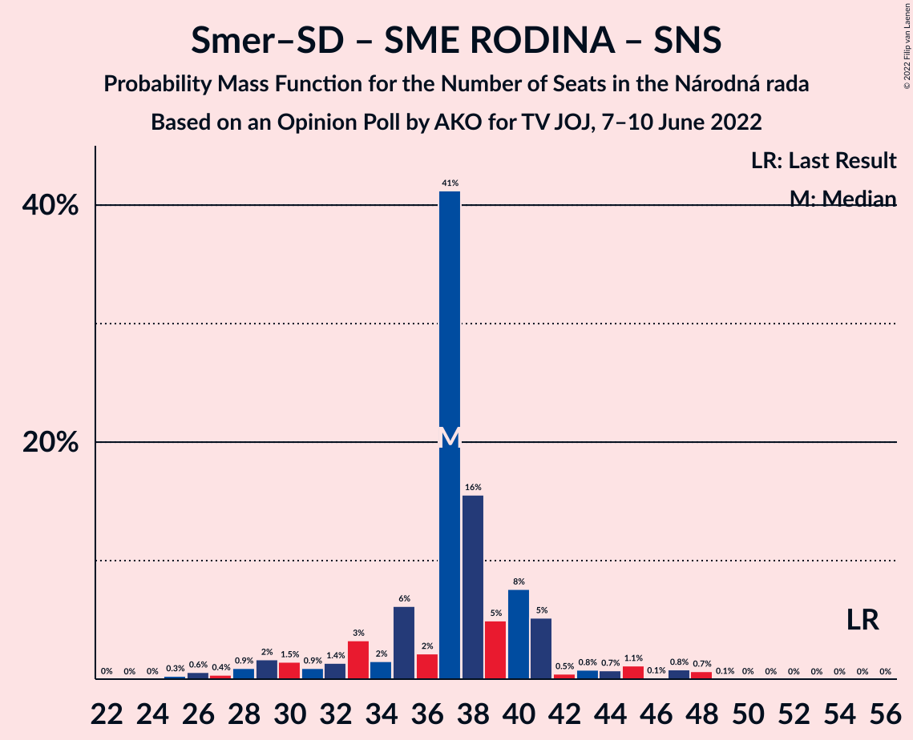

| Number of Seats | Probability | Accumulated | Special Marks |
|:---------------:|:-----------:|:-----------:|:-------------:|
| 23 | 0% | 100% |  |
| 24 | 0% | 99.9% |  |
| 25 | 0.3% | 99.9% |  |
| 26 | 0.6% | 99.6% |  |
| 27 | 0.4% | 99.1% |  |
| 28 | 0.9% | 98.7% |  |
| 29 | 2% | 98% |  |
| 30 | 1.5% | 96% |  |
| 31 | 0.9% | 95% |  |
| 32 | 1.4% | 94% |  |
| 33 | 3% | 92% |  |
| 34 | 2% | 89% |  |
| 35 | 6% | 88% |  |
| 36 | 2% | 81% |  |
| 37 | 41% | 79% | Median |
| 38 | 16% | 38% |  |
| 39 | 5% | 22% |  |
| 40 | 8% | 18% |  |
| 41 | 5% | 10% |  |
| 42 | 0.5% | 5% |  |
| 43 | 0.8% | 4% |  |
| 44 | 0.7% | 4% |  |
| 45 | 1.1% | 3% |  |
| 46 | 0.1% | 2% |  |
| 47 | 0.8% | 2% |  |
| 48 | 0.7% | 0.8% |  |
| 49 | 0.1% | 0.1% |  |
| 50 | 0% | 0% |  |
| 51 | 0% | 0% |  |
| 52 | 0% | 0% |  |
| 53 | 0% | 0% |  |
| 54 | 0% | 0% |  |
| 55 | 0% | 0% | Last Result |

### SMER–sociálna demokracia – SME RODINA

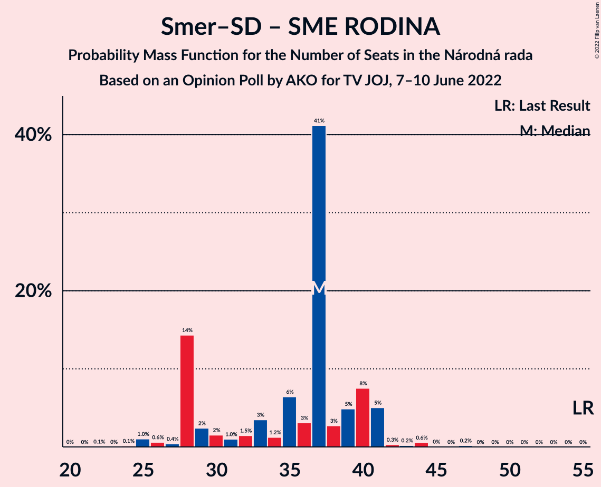

| Number of Seats | Probability | Accumulated | Special Marks |
|:---------------:|:-----------:|:-----------:|:-------------:|
| 22 | 0.1% | 100% |  |
| 23 | 0% | 99.9% |  |
| 24 | 0.1% | 99.9% |  |
| 25 | 1.0% | 99.7% |  |
| 26 | 0.6% | 98.7% |  |
| 27 | 0.4% | 98% |  |
| 28 | 14% | 98% |  |
| 29 | 2% | 83% |  |
| 30 | 2% | 81% |  |
| 31 | 1.0% | 79% |  |
| 32 | 1.5% | 78% |  |
| 33 | 3% | 77% |  |
| 34 | 1.2% | 73% |  |
| 35 | 6% | 72% |  |
| 36 | 3% | 66% |  |
| 37 | 41% | 63% | Median |
| 38 | 3% | 22% |  |
| 39 | 5% | 19% |  |
| 40 | 8% | 14% |  |
| 41 | 5% | 6% |  |
| 42 | 0.3% | 1.3% |  |
| 43 | 0.2% | 1.0% |  |
| 44 | 0.6% | 0.8% |  |
| 45 | 0% | 0.3% |  |
| 46 | 0% | 0.2% |  |
| 47 | 0.2% | 0.2% |  |
| 48 | 0% | 0% |  |
| 49 | 0% | 0% |  |
| 50 | 0% | 0% |  |
| 51 | 0% | 0% |  |
| 52 | 0% | 0% |  |
| 53 | 0% | 0% |  |
| 54 | 0% | 0% |  |
| 55 | 0% | 0% | Last Result |

### SMER–sociálna demokracia – Slovenská národná strana

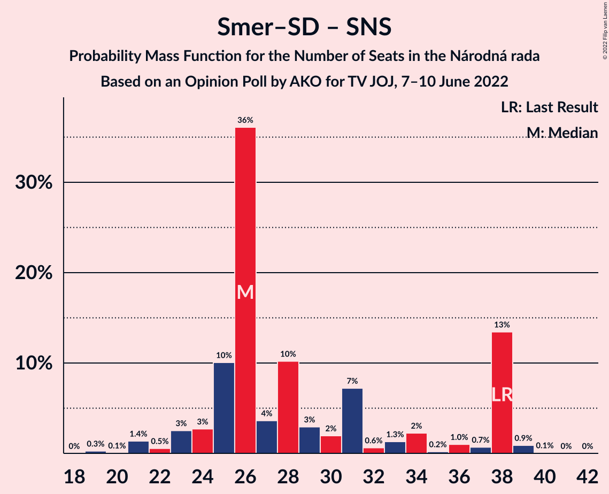

| Number of Seats | Probability | Accumulated | Special Marks |
|:---------------:|:-----------:|:-----------:|:-------------:|
| 19 | 0.3% | 100% |  |
| 20 | 0.1% | 99.7% |  |
| 21 | 1.4% | 99.7% |  |
| 22 | 0.5% | 98% |  |
| 23 | 3% | 98% |  |
| 24 | 3% | 95% |  |
| 25 | 10% | 93% |  |
| 26 | 36% | 82% | Median |
| 27 | 4% | 46% |  |
| 28 | 10% | 43% |  |
| 29 | 3% | 33% |  |
| 30 | 2% | 30% |  |
| 31 | 7% | 28% |  |
| 32 | 0.6% | 20% |  |
| 33 | 1.3% | 20% |  |
| 34 | 2% | 19% |  |
| 35 | 0.2% | 16% |  |
| 36 | 1.0% | 16% |  |
| 37 | 0.7% | 15% |  |
| 38 | 13% | 14% | Last Result |
| 39 | 0.9% | 1.0% |  |
| 40 | 0.1% | 0.1% |  |
| 41 | 0% | 0% |  |

### SMER–sociálna demokracia

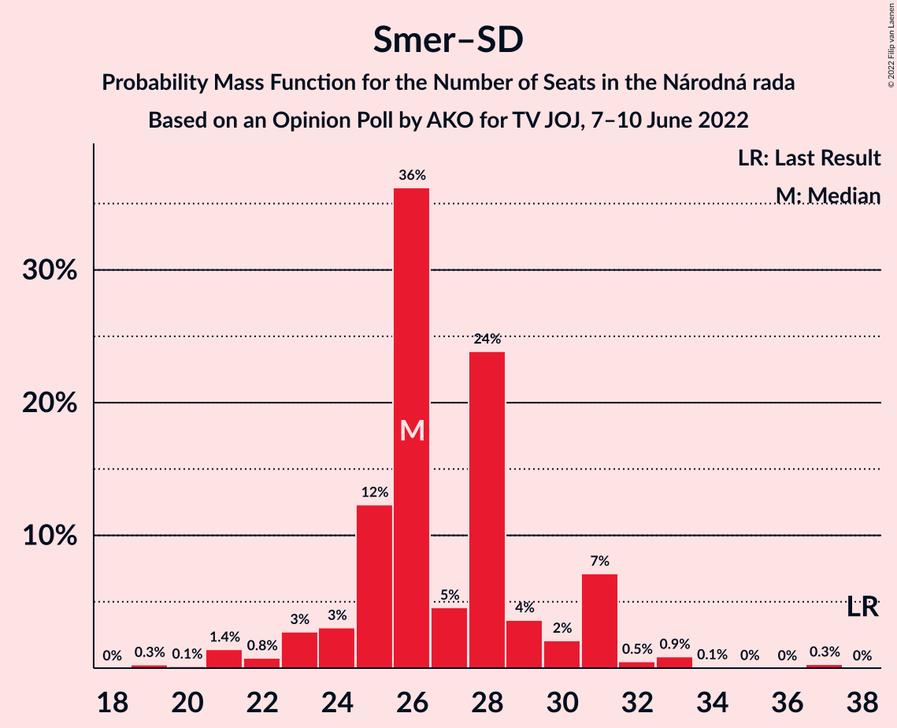

| Number of Seats | Probability | Accumulated | Special Marks |
|:---------------:|:-----------:|:-----------:|:-------------:|
| 19 | 0.3% | 100% |  |
| 20 | 0.1% | 99.7% |  |
| 21 | 1.4% | 99.6% |  |
| 22 | 0.8% | 98% |  |
| 23 | 3% | 97% |  |
| 24 | 3% | 95% |  |
| 25 | 12% | 92% |  |
| 26 | 36% | 79% | Median |
| 27 | 5% | 43% |  |
| 28 | 24% | 39% |  |
| 29 | 4% | 15% |  |
| 30 | 2% | 11% |  |
| 31 | 7% | 9% |  |
| 32 | 0.5% | 2% |  |
| 33 | 0.9% | 1.3% |  |
| 34 | 0.1% | 0.4% |  |
| 35 | 0% | 0.3% |  |
| 36 | 0% | 0.3% |  |
| 37 | 0.3% | 0.3% |  |
| 38 | 0% | 0% | Last Result |

## Technical Information

### Opinion Poll

+ **Polling firm:** AKO
+ **Commissioner(s):** TV JOJ
+ **Fieldwork period:** 7–10 June 2022

### Calculations

+ **Sample size:** 1000
+ **Simulations done:** 1,048,576
+ **Error estimate:** 2.80%

