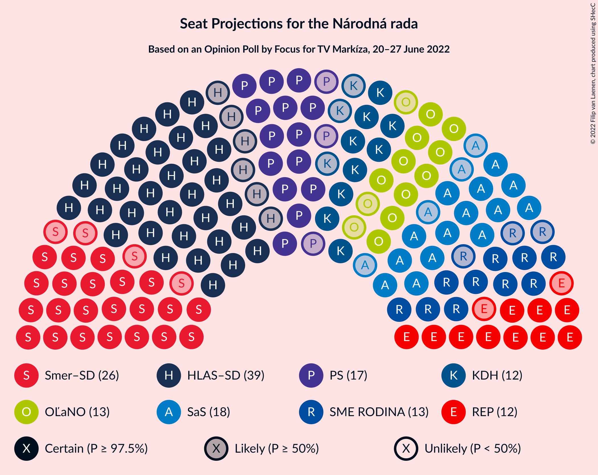
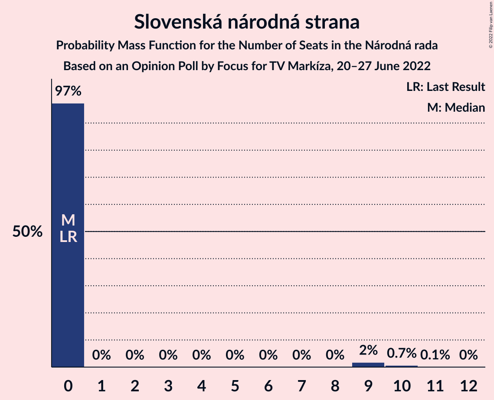
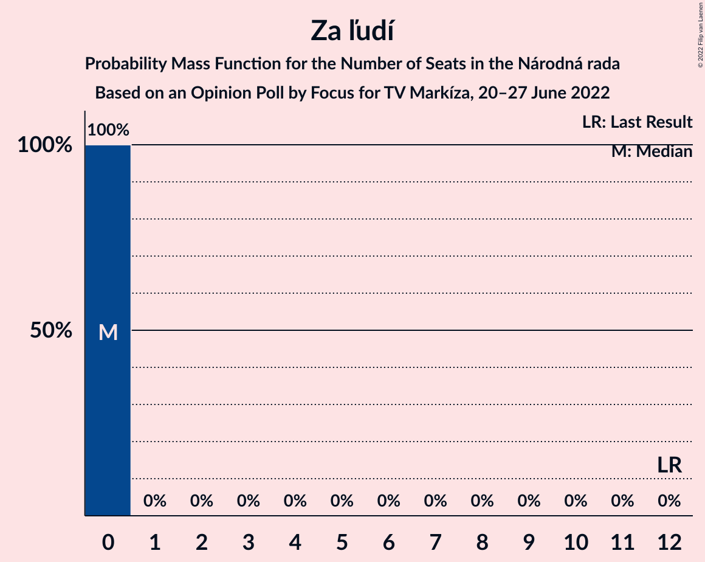
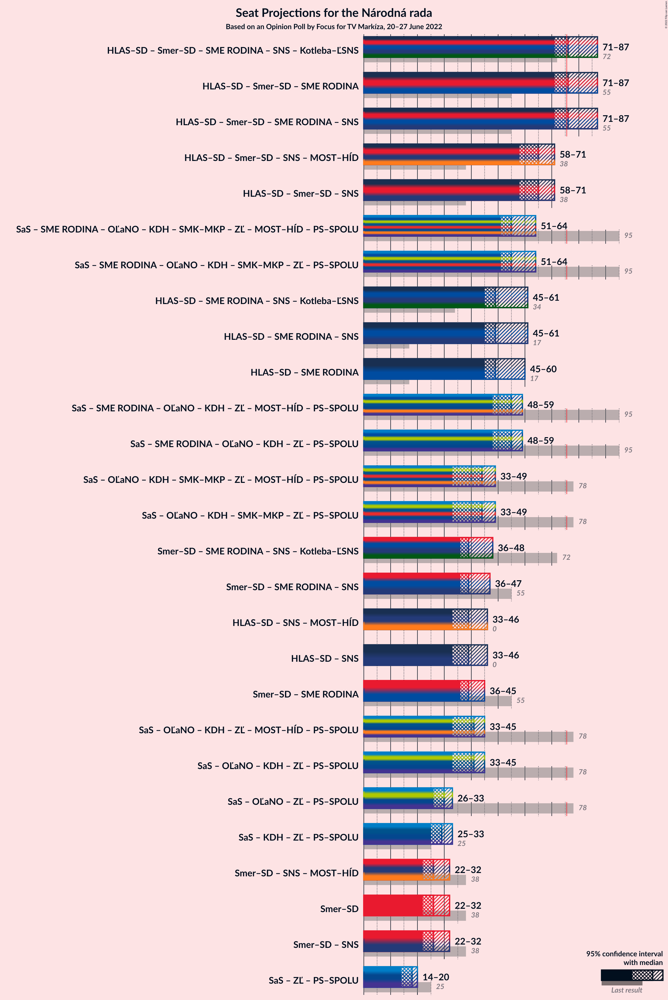

# Opinion Poll by Focus for TV Markíza, 20–27 June 2022

<a href="#voting-intentions">Voting Intentions</a> | <a href="#seats">Seats</a> | <a href="#coalitions">Coalitions</a> | <a href="#technical-information">Technical Information</a>

## Voting Intentions

### Confidence Intervals

| Party | Last Result | Poll Result | 80% Confidence Interval | 90% Confidence Interval | 95% Confidence Interval | 99% Confidence Interval |
|:-----:|:-----------:|:-----------:|:-----------------------:|:-----------------------:|:-----------------------:|:-----------------------:|
| HLAS–sociálna demokracia | 0.0% | 20.5% | 18.9–22.2% |18.5–22.7% |18.1–23.1% |17.4–23.9% |
| SMER–sociálna demokracia | 18.3% | 14.4% | 13.1–15.9% |12.7–16.4% |12.4–16.8% |11.8–17.5% |
| Sloboda a Solidarita | 6.2% | 9.6% | 8.5–10.9% |8.1–11.2% |7.9–11.5% |7.4–12.2% |
| Progresívne Slovensko | 7.0% | 9.1% | 8.0–10.3% |7.7–10.7% |7.4–11.0% |7.0–11.6% |
| SME RODINA | 8.2% | 7.6% | 6.6–8.7% |6.3–9.1% |6.1–9.4% |5.6–10.0% |
| OBYČAJNÍ ĽUDIA a nezávislé osobnosti | 25.0% | 7.1% | 6.1–8.2% |5.9–8.5% |5.6–8.8% |5.2–9.4% |
| REPUBLIKA | 0.0% | 6.8% | 5.8–7.9% |5.6–8.2% |5.4–8.5% |5.0–9.1% |
| Kresťanskodemokratické hnutie | 4.6% | 6.7% | 5.7–7.8% |5.5–8.1% |5.3–8.4% |4.9–9.0% |
| Strana maďarskej koalície–Magyar Koalíció Pártja | 3.9% | 4.1% | 3.4–5.0% |3.2–5.3% |3.0–5.5% |2.7–6.0% |
| Slovenská národná strana | 3.2% | 4.0% | 3.3–4.9% |3.1–5.2% |2.9–5.4% |2.6–5.9% |
| Kotleba–Ľudová strana Naše Slovensko | 8.0% | 3.5% | 2.8–4.3% |2.7–4.6% |2.5–4.8% |2.2–5.3% |
| Za ľudí | 5.8% | 2.1% | 1.6–2.8% |1.5–3.0% |1.4–3.2% |1.2–3.6% |
| Dobrá voľba | 3.1% | 1.2% | 0.9–1.8% |0.8–1.9% |0.7–2.1% |0.5–2.4% |
| SPOLU–Občianska Demokracia | 7.0% | 1.0% | 0.7–1.5% |0.6–1.7% |0.5–1.8% |0.4–2.1% |

*Note:* The poll result column reflects the actual value used in the calculations. Published results may vary slightly, and in addition be rounded to fewer digits.

## Seats

### Confidence Intervals

| Party | Last Result | Median | 80% Confidence Interval | 90% Confidence Interval | 95% Confidence Interval | 99% Confidence Interval |
|:-----:|:-----------:|:------:|:-----------------------:|:-----------------------:|:-----------------------:|:-----------------------:|
| <a href="#hlas–sociálna-demokracia">HLAS–sociálna demokracia</a> | 0 | 39 | 34–40 |34–43 |33–46 |31–46 |
| <a href="#smer–sociálna-demokracia">SMER–sociálna demokracia</a> | 38 | 26 | 23–31 |23–31 |22–32 |21–32 |
| <a href="#sloboda-a-solidarita">Sloboda a Solidarita</a> | 13 | 18 | 16–19 |14–19 |14–20 |14–21 |
| <a href="#progresívne-slovensko">Progresívne Slovensko</a> | 0 | 17 | 15–20 |14–20 |14–20 |12–21 |
| <a href="#sme-rodina">SME RODINA</a> | 17 | 13 | 10–16 |10–16 |10–18 |10–19 |
| <a href="#obyčajní-ľudia-a-nezávislé-osobnosti">OBYČAJNÍ ĽUDIA a nezávislé osobnosti</a> | 53 | 13 | 10–14 |10–15 |10–15 |0–16 |
| <a href="#republika">REPUBLIKA</a> | 0 | 12 | 11–16 |10–16 |10–16 |0–17 |
| <a href="#kresťanskodemokratické-hnutie">Kresťanskodemokratické hnutie</a> | 0 | 12 | 9–14 |9–14 |9–14 |0–15 |
| <a href="#strana-maďarskej-koalície–magyar-koalíció-pártja">Strana maďarskej koalície–Magyar Koalíció Pártja</a> | 0 | 0 | 0–9 |0–9 |0–10 |0–11 |
| <a href="#slovenská-národná-strana">Slovenská národná strana</a> | 0 | 0 | 0 |0 |0–9 |0–10 |
| <a href="#kotleba–ľudová-strana-naše-slovensko">Kotleba–Ľudová strana Naše Slovensko</a> | 17 | 0 | 0 |0 |0 |0 |
| <a href="#za-ľudí">Za ľudí</a> | 12 | 0 | 0 |0 |0 |0 |
| <a href="#dobrá-voľba">Dobrá voľba</a> | 0 | 0 | 0 |0 |0 |0 |
| <a href="#spolu–občianska-demokracia">SPOLU–Občianska Demokracia</a> | 0 | 0 | 0 |0 |0 |0 |

### HLAS–sociálna demokracia

*For a full overview of the results for this party, see the [HLAS–sociálna demokracia](party-hlas–sociálnademokracia.html) page.*

| Number of Seats | Probability | Accumulated | Special Marks |
|:---------------:|:-----------:|:-----------:|:-------------:|
| 0 | 0% | 100% | Last Result |
| 1 | 0% | 100% |  |
| 2 | 0% | 100% |  |
| 3 | 0% | 100% |  |
| 4 | 0% | 100% |  |
| 5 | 0% | 100% |  |
| 6 | 0% | 100% |  |
| 7 | 0% | 100% |  |
| 8 | 0% | 100% |  |
| 9 | 0% | 100% |  |
| 10 | 0% | 100% |  |
| 11 | 0% | 100% |  |
| 12 | 0% | 100% |  |
| 13 | 0% | 100% |  |
| 14 | 0% | 100% |  |
| 15 | 0% | 100% |  |
| 16 | 0% | 100% |  |
| 17 | 0% | 100% |  |
| 18 | 0% | 100% |  |
| 19 | 0% | 100% |  |
| 20 | 0% | 100% |  |
| 21 | 0% | 100% |  |
| 22 | 0% | 100% |  |
| 23 | 0% | 100% |  |
| 24 | 0% | 100% |  |
| 25 | 0% | 100% |  |
| 26 | 0% | 100% |  |
| 27 | 0% | 100% |  |
| 28 | 0% | 100% |  |
| 29 | 0% | 100% |  |
| 30 | 0.1% | 100% |  |
| 31 | 1.3% | 99.9% |  |
| 32 | 0.7% | 98.6% |  |
| 33 | 2% | 98% |  |
| 34 | 10% | 96% |  |
| 35 | 5% | 86% |  |
| 36 | 6% | 80% |  |
| 37 | 10% | 75% |  |
| 38 | 10% | 65% |  |
| 39 | 44% | 54% | Median |
| 40 | 4% | 11% |  |
| 41 | 0.6% | 7% |  |
| 42 | 0.2% | 6% |  |
| 43 | 3% | 6% |  |
| 44 | 0.2% | 3% |  |
| 45 | 0.2% | 3% |  |
| 46 | 3% | 3% |  |
| 47 | 0% | 0.1% |  |
| 48 | 0.1% | 0.1% |  |
| 49 | 0% | 0% |  |

### SMER–sociálna demokracia

*For a full overview of the results for this party, see the [SMER–sociálna demokracia](party-smer–sociálnademokracia.html) page.*

| Number of Seats | Probability | Accumulated | Special Marks |
|:---------------:|:-----------:|:-----------:|:-------------:|
| 20 | 0.1% | 100% |  |
| 21 | 0.6% | 99.9% |  |
| 22 | 4% | 99.3% |  |
| 23 | 5% | 95% |  |
| 24 | 14% | 90% |  |
| 25 | 10% | 76% |  |
| 26 | 26% | 66% | Median |
| 27 | 2% | 39% |  |
| 28 | 16% | 37% |  |
| 29 | 5% | 21% |  |
| 30 | 5% | 16% |  |
| 31 | 7% | 11% |  |
| 32 | 3% | 4% |  |
| 33 | 0.2% | 0.2% |  |
| 34 | 0% | 0% |  |
| 35 | 0% | 0% |  |
| 36 | 0% | 0% |  |
| 37 | 0% | 0% |  |
| 38 | 0% | 0% | Last Result |

### Sloboda a Solidarita

*For a full overview of the results for this party, see the [Sloboda a Solidarita](party-slobodaasolidarita.html) page.*

| Number of Seats | Probability | Accumulated | Special Marks |
|:---------------:|:-----------:|:-----------:|:-------------:|
| 12 | 0% | 100% |  |
| 13 | 0.4% | 99.9% | Last Result |
| 14 | 6% | 99.6% |  |
| 15 | 1.0% | 94% |  |
| 16 | 29% | 93% |  |
| 17 | 8% | 64% |  |
| 18 | 20% | 56% | Median |
| 19 | 32% | 37% |  |
| 20 | 3% | 4% |  |
| 21 | 1.2% | 1.4% |  |
| 22 | 0.1% | 0.2% |  |
| 23 | 0% | 0.1% |  |
| 24 | 0% | 0.1% |  |
| 25 | 0% | 0% |  |

### Progresívne Slovensko

*For a full overview of the results for this party, see the [Progresívne Slovensko](party-progresívneslovensko.html) page.*

| Number of Seats | Probability | Accumulated | Special Marks |
|:---------------:|:-----------:|:-----------:|:-------------:|
| 0 | 0% | 100% | Last Result |
| 1 | 0% | 100% |  |
| 2 | 0% | 100% |  |
| 3 | 0% | 100% |  |
| 4 | 0% | 100% |  |
| 5 | 0% | 100% |  |
| 6 | 0% | 100% |  |
| 7 | 0% | 100% |  |
| 8 | 0% | 100% |  |
| 9 | 0% | 100% |  |
| 10 | 0% | 100% |  |
| 11 | 0% | 100% |  |
| 12 | 0.5% | 100% |  |
| 13 | 0.6% | 99.5% |  |
| 14 | 8% | 98.8% |  |
| 15 | 23% | 91% |  |
| 16 | 11% | 68% |  |
| 17 | 14% | 57% | Median |
| 18 | 23% | 43% |  |
| 19 | 5% | 20% |  |
| 20 | 14% | 15% |  |
| 21 | 1.3% | 1.4% |  |
| 22 | 0% | 0.1% |  |
| 23 | 0% | 0% |  |

### SME RODINA

*For a full overview of the results for this party, see the [SME RODINA](party-smerodina.html) page.*

| Number of Seats | Probability | Accumulated | Special Marks |
|:---------------:|:-----------:|:-----------:|:-------------:|
| 9 | 0.1% | 100% |  |
| 10 | 22% | 99.9% |  |
| 11 | 16% | 78% |  |
| 12 | 3% | 62% |  |
| 13 | 30% | 59% | Median |
| 14 | 6% | 29% |  |
| 15 | 11% | 23% |  |
| 16 | 7% | 12% |  |
| 17 | 0.7% | 5% | Last Result |
| 18 | 2% | 4% |  |
| 19 | 2% | 2% |  |
| 20 | 0.1% | 0.1% |  |
| 21 | 0% | 0% |  |

### OBYČAJNÍ ĽUDIA a nezávislé osobnosti

*For a full overview of the results for this party, see the [OBYČAJNÍ ĽUDIA a nezávislé osobnosti](party-obyčajníľudiaanezávisléosobnosti.html) page.*

| Number of Seats | Probability | Accumulated | Special Marks |
|:---------------:|:-----------:|:-----------:|:-------------:|
| 0 | 2% | 100% |  |
| 1 | 0% | 98% |  |
| 2 | 0% | 98% |  |
| 3 | 0% | 98% |  |
| 4 | 0% | 98% |  |
| 5 | 0% | 98% |  |
| 6 | 0% | 98% |  |
| 7 | 0% | 98% |  |
| 8 | 0% | 98% |  |
| 9 | 0.3% | 98% |  |
| 10 | 10% | 98% |  |
| 11 | 3% | 88% |  |
| 12 | 7% | 85% |  |
| 13 | 36% | 78% | Median |
| 14 | 37% | 42% |  |
| 15 | 4% | 6% |  |
| 16 | 1.2% | 2% |  |
| 17 | 0.3% | 0.5% |  |
| 18 | 0.1% | 0.2% |  |
| 19 | 0.1% | 0.1% |  |
| 20 | 0% | 0% |  |
| 21 | 0% | 0% |  |
| 22 | 0% | 0% |  |
| 23 | 0% | 0% |  |
| 24 | 0% | 0% |  |
| 25 | 0% | 0% |  |
| 26 | 0% | 0% |  |
| 27 | 0% | 0% |  |
| 28 | 0% | 0% |  |
| 29 | 0% | 0% |  |
| 30 | 0% | 0% |  |
| 31 | 0% | 0% |  |
| 32 | 0% | 0% |  |
| 33 | 0% | 0% |  |
| 34 | 0% | 0% |  |
| 35 | 0% | 0% |  |
| 36 | 0% | 0% |  |
| 37 | 0% | 0% |  |
| 38 | 0% | 0% |  |
| 39 | 0% | 0% |  |
| 40 | 0% | 0% |  |
| 41 | 0% | 0% |  |
| 42 | 0% | 0% |  |
| 43 | 0% | 0% |  |
| 44 | 0% | 0% |  |
| 45 | 0% | 0% |  |
| 46 | 0% | 0% |  |
| 47 | 0% | 0% |  |
| 48 | 0% | 0% |  |
| 49 | 0% | 0% |  |
| 50 | 0% | 0% |  |
| 51 | 0% | 0% |  |
| 52 | 0% | 0% |  |
| 53 | 0% | 0% | Last Result |

### REPUBLIKA

*For a full overview of the results for this party, see the [REPUBLIKA](party-republika.html) page.*

| Number of Seats | Probability | Accumulated | Special Marks |
|:---------------:|:-----------:|:-----------:|:-------------:|
| 0 | 0.8% | 100% | Last Result |
| 1 | 0% | 99.2% |  |
| 2 | 0% | 99.2% |  |
| 3 | 0% | 99.2% |  |
| 4 | 0% | 99.2% |  |
| 5 | 0% | 99.2% |  |
| 6 | 0% | 99.2% |  |
| 7 | 0% | 99.2% |  |
| 8 | 0% | 99.2% |  |
| 9 | 0.6% | 99.2% |  |
| 10 | 5% | 98.6% |  |
| 11 | 13% | 94% |  |
| 12 | 49% | 81% | Median |
| 13 | 3% | 32% |  |
| 14 | 10% | 29% |  |
| 15 | 2% | 18% |  |
| 16 | 16% | 17% |  |
| 17 | 0.6% | 0.8% |  |
| 18 | 0% | 0.2% |  |
| 19 | 0.2% | 0.2% |  |
| 20 | 0% | 0% |  |

### Kresťanskodemokratické hnutie

*For a full overview of the results for this party, see the [Kresťanskodemokratické hnutie](party-kresťanskodemokratickéhnutie.html) page.*

| Number of Seats | Probability | Accumulated | Special Marks |
|:---------------:|:-----------:|:-----------:|:-------------:|
| 0 | 2% | 100% | Last Result |
| 1 | 0% | 98% |  |
| 2 | 0% | 98% |  |
| 3 | 0% | 98% |  |
| 4 | 0% | 98% |  |
| 5 | 0% | 98% |  |
| 6 | 0% | 98% |  |
| 7 | 0% | 98% |  |
| 8 | 0% | 98% |  |
| 9 | 12% | 98% |  |
| 10 | 21% | 86% |  |
| 11 | 7% | 65% |  |
| 12 | 37% | 58% | Median |
| 13 | 7% | 21% |  |
| 14 | 11% | 14% |  |
| 15 | 2% | 2% |  |
| 16 | 0.3% | 0.3% |  |
| 17 | 0% | 0.1% |  |
| 18 | 0% | 0% |  |

### Strana maďarskej koalície–Magyar Koalíció Pártja

*For a full overview of the results for this party, see the [Strana maďarskej koalície–Magyar Koalíció Pártja](party-stranamaďarskejkoalície–magyarkoalíciópártja.html) page.*

| Number of Seats | Probability | Accumulated | Special Marks |
|:---------------:|:-----------:|:-----------:|:-------------:|
| 0 | 85% | 100% | Last Result, Median |
| 1 | 0% | 15% |  |
| 2 | 0% | 15% |  |
| 3 | 0% | 15% |  |
| 4 | 0% | 15% |  |
| 5 | 0% | 15% |  |
| 6 | 0% | 15% |  |
| 7 | 0% | 15% |  |
| 8 | 0% | 15% |  |
| 9 | 10% | 15% |  |
| 10 | 4% | 5% |  |
| 11 | 0.5% | 0.5% |  |
| 12 | 0% | 0% |  |

### Slovenská národná strana

*For a full overview of the results for this party, see the [Slovenská národná strana](party-slovenskánárodnástrana.html) page.*

| Number of Seats | Probability | Accumulated | Special Marks |
|:---------------:|:-----------:|:-----------:|:-------------:|
| 0 | 97% | 100% | Last Result, Median |
| 1 | 0% | 3% |  |
| 2 | 0% | 3% |  |
| 3 | 0% | 3% |  |
| 4 | 0% | 3% |  |
| 5 | 0% | 3% |  |
| 6 | 0% | 3% |  |
| 7 | 0% | 3% |  |
| 8 | 0% | 3% |  |
| 9 | 2% | 3% |  |
| 10 | 0.7% | 0.8% |  |
| 11 | 0.1% | 0.1% |  |
| 12 | 0% | 0% |  |

### Kotleba–Ľudová strana Naše Slovensko

*For a full overview of the results for this party, see the [Kotleba–Ľudová strana Naše Slovensko](party-kotleba–ľudovástrananašeslovensko.html) page.*

| Number of Seats | Probability | Accumulated | Special Marks |
|:---------------:|:-----------:|:-----------:|:-------------:|
| 0 | 99.7% | 100% | Median |
| 1 | 0% | 0.3% |  |
| 2 | 0% | 0.3% |  |
| 3 | 0% | 0.3% |  |
| 4 | 0% | 0.3% |  |
| 5 | 0% | 0.3% |  |
| 6 | 0% | 0.3% |  |
| 7 | 0% | 0.3% |  |
| 8 | 0% | 0.3% |  |
| 9 | 0.1% | 0.3% |  |
| 10 | 0.1% | 0.1% |  |
| 11 | 0% | 0% |  |
| 12 | 0% | 0% |  |
| 13 | 0% | 0% |  |
| 14 | 0% | 0% |  |
| 15 | 0% | 0% |  |
| 16 | 0% | 0% |  |
| 17 | 0% | 0% | Last Result |

### Za ľudí

*For a full overview of the results for this party, see the [Za ľudí](party-zaľudí.html) page.*

| Number of Seats | Probability | Accumulated | Special Marks |
|:---------------:|:-----------:|:-----------:|:-------------:|
| 0 | 100% | 100% | Median |
| 1 | 0% | 0% |  |
| 2 | 0% | 0% |  |
| 3 | 0% | 0% |  |
| 4 | 0% | 0% |  |
| 5 | 0% | 0% |  |
| 6 | 0% | 0% |  |
| 7 | 0% | 0% |  |
| 8 | 0% | 0% |  |
| 9 | 0% | 0% |  |
| 10 | 0% | 0% |  |
| 11 | 0% | 0% |  |
| 12 | 0% | 0% | Last Result |

### Dobrá voľba

*For a full overview of the results for this party, see the [Dobrá voľba](party-dobrávoľba.html) page.*

| Number of Seats | Probability | Accumulated | Special Marks |
|:---------------:|:-----------:|:-----------:|:-------------:|
| 0 | 100% | 100% | Last Result, Median |

### SPOLU–Občianska Demokracia

*For a full overview of the results for this party, see the [SPOLU–Občianska Demokracia](party-spolu–občianskademokracia.html) page.*

| Number of Seats | Probability | Accumulated | Special Marks |
|:---------------:|:-----------:|:-----------:|:-------------:|
| 0 | 100% | 100% | Last Result, Median |

## Coalitions

### Confidence Intervals

| Coalition | Last Result | Median | Majority? | 80% Confidence Interval | 90% Confidence Interval | 95% Confidence Interval | 99% Confidence Interval |
|:---------:|:-----------:|:------:|:---------:|:-----------------------:|:-----------------------:|:-----------------------:|:-----------------------:|
| HLAS–sociálna demokracia – SMER–sociálna demokracia – SME RODINA – Slovenská národná strana – Kotleba–Ľudová strana Naše Slovensko | 72 | 76 | 53% | 73–82 | 73–84 | 71–87 | 68–88 |
| HLAS–sociálna demokracia – SMER–sociálna demokracia – SME RODINA | 55 | 76 | 51% | 73–81 | 73–82 | 71–87 | 68–88 |
| HLAS–sociálna demokracia – SMER–sociálna demokracia – SME RODINA – Slovenská národná strana | 55 | 76 | 53% | 73–82 | 73–84 | 71–87 | 68–88 |
| HLAS–sociálna demokracia – SMER–sociálna demokracia – Slovenská národná strana | 38 | 65 | 0.1% | 58–69 | 58–70 | 58–71 | 54–72 |
| HLAS–sociálna demokracia – SME RODINA – Slovenská národná strana – Kotleba–Ľudová strana Naše Slovensko | 34 | 49 | 0% | 48–57 | 48–60 | 45–61 | 44–61 |
| HLAS–sociálna demokracia – SME RODINA – Slovenská národná strana | 17 | 49 | 0% | 48–57 | 48–60 | 45–61 | 44–61 |
| HLAS–sociálna demokracia – SME RODINA | 17 | 49 | 0% | 48–54 | 48–60 | 45–60 | 44–61 |
| SMER–sociálna demokracia – SME RODINA – Slovenská národná strana – Kotleba–Ľudová strana Naše Slovensko | 72 | 39 | 0% | 36–44 | 36–45 | 36–48 | 35–50 |
| SMER–sociálna demokracia – SME RODINA – Slovenská národná strana | 55 | 39 | 0% | 36–44 | 36–45 | 36–47 | 35–50 |
| HLAS–sociálna demokracia – Slovenská národná strana | 0 | 39 | 0% | 34–40 | 34–45 | 33–46 | 31–48 |
| SMER–sociálna demokracia – SME RODINA | 55 | 39 | 0% | 36–42 | 36–45 | 36–45 | 34–49 |
| SMER–sociálna demokracia | 38 | 26 | 0% | 23–31 | 23–31 | 22–32 | 21–32 |
| SMER–sociálna demokracia – Slovenská národná strana | 38 | 26 | 0% | 24–31 | 23–32 | 22–32 | 21–34 |

### HLAS–sociálna demokracia – SMER–sociálna demokracia – SME RODINA – Slovenská národná strana – Kotleba–Ľudová strana Naše Slovensko

| Number of Seats | Probability | Accumulated | Special Marks |
|:---------------:|:-----------:|:-----------:|:-------------:|
| 67 | 0% | 100% |  |
| 68 | 1.1% | 99.9% |  |
| 69 | 0.1% | 98.8% |  |
| 70 | 0.4% | 98.7% |  |
| 71 | 1.0% | 98% |  |
| 72 | 0.7% | 97% | Last Result |
| 73 | 12% | 97% |  |
| 74 | 2% | 84% |  |
| 75 | 29% | 82% |  |
| 76 | 6% | 53% | Majority |
| 77 | 2% | 48% |  |
| 78 | 0.5% | 46% | Median |
| 79 | 2% | 46% |  |
| 80 | 29% | 44% |  |
| 81 | 4% | 15% |  |
| 82 | 3% | 11% |  |
| 83 | 0.7% | 7% |  |
| 84 | 2% | 6% |  |
| 85 | 0.2% | 4% |  |
| 86 | 0.3% | 4% |  |
| 87 | 2% | 4% |  |
| 88 | 2% | 2% |  |
| 89 | 0.2% | 0.3% |  |
| 90 | 0% | 0.1% |  |
| 91 | 0% | 0.1% |  |
| 92 | 0% | 0% |  |

### HLAS–sociálna demokracia – SMER–sociálna demokracia – SME RODINA

| Number of Seats | Probability | Accumulated | Special Marks |
|:---------------:|:-----------:|:-----------:|:-------------:|
| 55 | 0% | 100% | Last Result |
| 56 | 0% | 100% |  |
| 57 | 0% | 100% |  |
| 58 | 0% | 100% |  |
| 59 | 0% | 100% |  |
| 60 | 0% | 100% |  |
| 61 | 0% | 100% |  |
| 62 | 0% | 100% |  |
| 63 | 0% | 100% |  |
| 64 | 0% | 100% |  |
| 65 | 0% | 100% |  |
| 66 | 0% | 100% |  |
| 67 | 0.1% | 99.9% |  |
| 68 | 1.2% | 99.9% |  |
| 69 | 0.1% | 98.7% |  |
| 70 | 0.5% | 98.6% |  |
| 71 | 1.0% | 98% |  |
| 72 | 1.0% | 97% |  |
| 73 | 12% | 96% |  |
| 74 | 2% | 84% |  |
| 75 | 31% | 82% |  |
| 76 | 6% | 51% | Majority |
| 77 | 2% | 45% |  |
| 78 | 0.5% | 44% | Median |
| 79 | 2% | 43% |  |
| 80 | 29% | 41% |  |
| 81 | 4% | 12% |  |
| 82 | 3% | 8% |  |
| 83 | 0.6% | 5% |  |
| 84 | 0.2% | 4% |  |
| 85 | 0.1% | 4% |  |
| 86 | 0.2% | 4% |  |
| 87 | 2% | 4% |  |
| 88 | 2% | 2% |  |
| 89 | 0.2% | 0.2% |  |
| 90 | 0% | 0% |  |

### HLAS–sociálna demokracia – SMER–sociálna demokracia – SME RODINA – Slovenská národná strana

| Number of Seats | Probability | Accumulated | Special Marks |
|:---------------:|:-----------:|:-----------:|:-------------:|
| 55 | 0% | 100% | Last Result |
| 56 | 0% | 100% |  |
| 57 | 0% | 100% |  |
| 58 | 0% | 100% |  |
| 59 | 0% | 100% |  |
| 60 | 0% | 100% |  |
| 61 | 0% | 100% |  |
| 62 | 0% | 100% |  |
| 63 | 0% | 100% |  |
| 64 | 0% | 100% |  |
| 65 | 0% | 100% |  |
| 66 | 0% | 100% |  |
| 67 | 0.1% | 100% |  |
| 68 | 1.1% | 99.9% |  |
| 69 | 0.1% | 98.8% |  |
| 70 | 0.4% | 98.7% |  |
| 71 | 1.0% | 98% |  |
| 72 | 0.8% | 97% |  |
| 73 | 12% | 96% |  |
| 74 | 2% | 84% |  |
| 75 | 29% | 82% |  |
| 76 | 6% | 53% | Majority |
| 77 | 2% | 48% |  |
| 78 | 0.5% | 46% | Median |
| 79 | 2% | 45% |  |
| 80 | 29% | 43% |  |
| 81 | 4% | 14% |  |
| 82 | 3% | 10% |  |
| 83 | 0.7% | 7% |  |
| 84 | 2% | 6% |  |
| 85 | 0.2% | 4% |  |
| 86 | 0.2% | 4% |  |
| 87 | 2% | 4% |  |
| 88 | 2% | 2% |  |
| 89 | 0.2% | 0.2% |  |
| 90 | 0% | 0.1% |  |
| 91 | 0% | 0% |  |

### HLAS–sociálna demokracia – SMER–sociálna demokracia – Slovenská národná strana

| Number of Seats | Probability | Accumulated | Special Marks |
|:---------------:|:-----------:|:-----------:|:-------------:|
| 38 | 0% | 100% | Last Result |
| 39 | 0% | 100% |  |
| 40 | 0% | 100% |  |
| 41 | 0% | 100% |  |
| 42 | 0% | 100% |  |
| 43 | 0% | 100% |  |
| 44 | 0% | 100% |  |
| 45 | 0% | 100% |  |
| 46 | 0% | 100% |  |
| 47 | 0% | 100% |  |
| 48 | 0% | 100% |  |
| 49 | 0% | 100% |  |
| 50 | 0% | 100% |  |
| 51 | 0% | 100% |  |
| 52 | 0% | 100% |  |
| 53 | 0% | 100% |  |
| 54 | 1.2% | 100% |  |
| 55 | 0.1% | 98.8% |  |
| 56 | 0.5% | 98.7% |  |
| 57 | 0.7% | 98% |  |
| 58 | 10% | 98% |  |
| 59 | 1.1% | 88% |  |
| 60 | 4% | 87% |  |
| 61 | 2% | 83% |  |
| 62 | 10% | 81% |  |
| 63 | 2% | 71% |  |
| 64 | 4% | 69% |  |
| 65 | 22% | 65% | Median |
| 66 | 2% | 43% |  |
| 67 | 19% | 42% |  |
| 68 | 5% | 22% |  |
| 69 | 11% | 17% |  |
| 70 | 3% | 6% |  |
| 71 | 2% | 3% |  |
| 72 | 0.5% | 0.7% |  |
| 73 | 0% | 0.2% |  |
| 74 | 0% | 0.2% |  |
| 75 | 0% | 0.2% |  |
| 76 | 0% | 0.1% | Majority |
| 77 | 0.1% | 0.1% |  |
| 78 | 0% | 0% |  |

### HLAS–sociálna demokracia – SME RODINA – Slovenská národná strana – Kotleba–Ľudová strana Naše Slovensko

| Number of Seats | Probability | Accumulated | Special Marks |
|:---------------:|:-----------:|:-----------:|:-------------:|
| 34 | 0% | 100% | Last Result |
| 35 | 0% | 100% |  |
| 36 | 0% | 100% |  |
| 37 | 0% | 100% |  |
| 38 | 0% | 100% |  |
| 39 | 0% | 100% |  |
| 40 | 0% | 100% |  |
| 41 | 0% | 100% |  |
| 42 | 0% | 100% |  |
| 43 | 0.1% | 100% |  |
| 44 | 0.9% | 99.9% |  |
| 45 | 1.5% | 98.9% |  |
| 46 | 0.6% | 97% |  |
| 47 | 1.2% | 97% |  |
| 48 | 7% | 96% |  |
| 49 | 39% | 88% |  |
| 50 | 8% | 49% |  |
| 51 | 6% | 41% |  |
| 52 | 20% | 35% | Median |
| 53 | 0.5% | 14% |  |
| 54 | 2% | 14% |  |
| 55 | 0.7% | 11% |  |
| 56 | 0.2% | 11% |  |
| 57 | 0.7% | 11% |  |
| 58 | 2% | 10% |  |
| 59 | 0.5% | 8% |  |
| 60 | 4% | 7% |  |
| 61 | 3% | 4% |  |
| 62 | 0.2% | 0.3% |  |
| 63 | 0% | 0.1% |  |
| 64 | 0% | 0.1% |  |
| 65 | 0% | 0.1% |  |
| 66 | 0% | 0.1% |  |
| 67 | 0% | 0.1% |  |
| 68 | 0% | 0% |  |

### HLAS–sociálna demokracia – SME RODINA – Slovenská národná strana

| Number of Seats | Probability | Accumulated | Special Marks |
|:---------------:|:-----------:|:-----------:|:-------------:|
| 17 | 0% | 100% | Last Result |
| 18 | 0% | 100% |  |
| 19 | 0% | 100% |  |
| 20 | 0% | 100% |  |
| 21 | 0% | 100% |  |
| 22 | 0% | 100% |  |
| 23 | 0% | 100% |  |
| 24 | 0% | 100% |  |
| 25 | 0% | 100% |  |
| 26 | 0% | 100% |  |
| 27 | 0% | 100% |  |
| 28 | 0% | 100% |  |
| 29 | 0% | 100% |  |
| 30 | 0% | 100% |  |
| 31 | 0% | 100% |  |
| 32 | 0% | 100% |  |
| 33 | 0% | 100% |  |
| 34 | 0% | 100% |  |
| 35 | 0% | 100% |  |
| 36 | 0% | 100% |  |
| 37 | 0% | 100% |  |
| 38 | 0% | 100% |  |
| 39 | 0% | 100% |  |
| 40 | 0% | 100% |  |
| 41 | 0% | 100% |  |
| 42 | 0% | 100% |  |
| 43 | 0.1% | 100% |  |
| 44 | 0.9% | 99.8% |  |
| 45 | 1.5% | 98.9% |  |
| 46 | 0.6% | 97% |  |
| 47 | 1.2% | 97% |  |
| 48 | 7% | 96% |  |
| 49 | 39% | 88% |  |
| 50 | 8% | 49% |  |
| 51 | 6% | 40% |  |
| 52 | 20% | 34% | Median |
| 53 | 0.5% | 14% |  |
| 54 | 2% | 13% |  |
| 55 | 0.7% | 11% |  |
| 56 | 0.2% | 11% |  |
| 57 | 0.7% | 10% |  |
| 58 | 2% | 10% |  |
| 59 | 0.5% | 8% |  |
| 60 | 4% | 7% |  |
| 61 | 3% | 4% |  |
| 62 | 0.1% | 0.2% |  |
| 63 | 0% | 0.1% |  |
| 64 | 0% | 0.1% |  |
| 65 | 0% | 0% |  |

### HLAS–sociálna demokracia – SME RODINA

| Number of Seats | Probability | Accumulated | Special Marks |
|:---------------:|:-----------:|:-----------:|:-------------:|
| 17 | 0% | 100% | Last Result |
| 18 | 0% | 100% |  |
| 19 | 0% | 100% |  |
| 20 | 0% | 100% |  |
| 21 | 0% | 100% |  |
| 22 | 0% | 100% |  |
| 23 | 0% | 100% |  |
| 24 | 0% | 100% |  |
| 25 | 0% | 100% |  |
| 26 | 0% | 100% |  |
| 27 | 0% | 100% |  |
| 28 | 0% | 100% |  |
| 29 | 0% | 100% |  |
| 30 | 0% | 100% |  |
| 31 | 0% | 100% |  |
| 32 | 0% | 100% |  |
| 33 | 0% | 100% |  |
| 34 | 0% | 100% |  |
| 35 | 0% | 100% |  |
| 36 | 0% | 100% |  |
| 37 | 0% | 100% |  |
| 38 | 0% | 100% |  |
| 39 | 0% | 100% |  |
| 40 | 0% | 100% |  |
| 41 | 0% | 100% |  |
| 42 | 0% | 100% |  |
| 43 | 0.2% | 99.9% |  |
| 44 | 1.0% | 99.8% |  |
| 45 | 2% | 98.8% |  |
| 46 | 0.7% | 97% |  |
| 47 | 1.2% | 97% |  |
| 48 | 8% | 95% |  |
| 49 | 40% | 88% |  |
| 50 | 9% | 48% |  |
| 51 | 6% | 40% |  |
| 52 | 22% | 34% | Median |
| 53 | 0.5% | 11% |  |
| 54 | 2% | 11% |  |
| 55 | 0.6% | 9% |  |
| 56 | 0.2% | 8% |  |
| 57 | 0.6% | 8% |  |
| 58 | 2% | 7% |  |
| 59 | 0.2% | 6% |  |
| 60 | 4% | 5% |  |
| 61 | 2% | 2% |  |
| 62 | 0% | 0% |  |

### SMER–sociálna demokracia – SME RODINA – Slovenská národná strana – Kotleba–Ľudová strana Naše Slovensko

| Number of Seats | Probability | Accumulated | Special Marks |
|:---------------:|:-----------:|:-----------:|:-------------:|
| 32 | 0.1% | 100% |  |
| 33 | 0.1% | 99.9% |  |
| 34 | 0.3% | 99.9% |  |
| 35 | 0.8% | 99.6% |  |
| 36 | 28% | 98.8% |  |
| 37 | 3% | 71% |  |
| 38 | 7% | 68% |  |
| 39 | 11% | 60% | Median |
| 40 | 8% | 49% |  |
| 41 | 19% | 41% |  |
| 42 | 10% | 22% |  |
| 43 | 1.4% | 12% |  |
| 44 | 3% | 11% |  |
| 45 | 5% | 8% |  |
| 46 | 0.3% | 3% |  |
| 47 | 0.3% | 3% |  |
| 48 | 0.1% | 3% |  |
| 49 | 2% | 2% |  |
| 50 | 0.1% | 0.6% |  |
| 51 | 0.1% | 0.5% |  |
| 52 | 0.2% | 0.4% |  |
| 53 | 0.1% | 0.1% |  |
| 54 | 0% | 0.1% |  |
| 55 | 0% | 0.1% |  |
| 56 | 0% | 0% |  |
| 57 | 0% | 0% |  |
| 58 | 0% | 0% |  |
| 59 | 0% | 0% |  |
| 60 | 0% | 0% |  |
| 61 | 0% | 0% |  |
| 62 | 0% | 0% |  |
| 63 | 0% | 0% |  |
| 64 | 0% | 0% |  |
| 65 | 0% | 0% |  |
| 66 | 0% | 0% |  |
| 67 | 0% | 0% |  |
| 68 | 0% | 0% |  |
| 69 | 0% | 0% |  |
| 70 | 0% | 0% |  |
| 71 | 0% | 0% |  |
| 72 | 0% | 0% | Last Result |

### SMER–sociálna demokracia – SME RODINA – Slovenská národná strana

| Number of Seats | Probability | Accumulated | Special Marks |
|:---------------:|:-----------:|:-----------:|:-------------:|
| 32 | 0.1% | 100% |  |
| 33 | 0.1% | 99.9% |  |
| 34 | 0.3% | 99.8% |  |
| 35 | 0.8% | 99.5% |  |
| 36 | 28% | 98.8% |  |
| 37 | 3% | 71% |  |
| 38 | 7% | 68% |  |
| 39 | 11% | 60% | Median |
| 40 | 8% | 49% |  |
| 41 | 19% | 41% |  |
| 42 | 10% | 22% |  |
| 43 | 1.4% | 12% |  |
| 44 | 3% | 11% |  |
| 45 | 5% | 8% |  |
| 46 | 0.3% | 3% |  |
| 47 | 0.2% | 3% |  |
| 48 | 0.1% | 2% |  |
| 49 | 2% | 2% |  |
| 50 | 0.2% | 0.5% |  |
| 51 | 0.1% | 0.4% |  |
| 52 | 0.2% | 0.3% |  |
| 53 | 0.1% | 0.1% |  |
| 54 | 0% | 0% |  |
| 55 | 0% | 0% | Last Result |

### HLAS–sociálna demokracia – Slovenská národná strana

| Number of Seats | Probability | Accumulated | Special Marks |
|:---------------:|:-----------:|:-----------:|:-------------:|
| 0 | 0% | 100% | Last Result |
| 1 | 0% | 100% |  |
| 2 | 0% | 100% |  |
| 3 | 0% | 100% |  |
| 4 | 0% | 100% |  |
| 5 | 0% | 100% |  |
| 6 | 0% | 100% |  |
| 7 | 0% | 100% |  |
| 8 | 0% | 100% |  |
| 9 | 0% | 100% |  |
| 10 | 0% | 100% |  |
| 11 | 0% | 100% |  |
| 12 | 0% | 100% |  |
| 13 | 0% | 100% |  |
| 14 | 0% | 100% |  |
| 15 | 0% | 100% |  |
| 16 | 0% | 100% |  |
| 17 | 0% | 100% |  |
| 18 | 0% | 100% |  |
| 19 | 0% | 100% |  |
| 20 | 0% | 100% |  |
| 21 | 0% | 100% |  |
| 22 | 0% | 100% |  |
| 23 | 0% | 100% |  |
| 24 | 0% | 100% |  |
| 25 | 0% | 100% |  |
| 26 | 0% | 100% |  |
| 27 | 0% | 100% |  |
| 28 | 0% | 100% |  |
| 29 | 0% | 100% |  |
| 30 | 0.1% | 100% |  |
| 31 | 1.3% | 99.9% |  |
| 32 | 0.7% | 98.6% |  |
| 33 | 2% | 98% |  |
| 34 | 10% | 96% |  |
| 35 | 5% | 86% |  |
| 36 | 6% | 81% |  |
| 37 | 10% | 75% |  |
| 38 | 10% | 65% |  |
| 39 | 42% | 55% | Median |
| 40 | 4% | 13% |  |
| 41 | 0.6% | 9% |  |
| 42 | 0.3% | 9% |  |
| 43 | 3% | 8% |  |
| 44 | 0.2% | 6% |  |
| 45 | 0.5% | 5% |  |
| 46 | 3% | 5% |  |
| 47 | 0.1% | 2% |  |
| 48 | 2% | 2% |  |
| 49 | 0.2% | 0.2% |  |
| 50 | 0% | 0% |  |

### SMER–sociálna demokracia – SME RODINA

| Number of Seats | Probability | Accumulated | Special Marks |
|:---------------:|:-----------:|:-----------:|:-------------:|
| 32 | 0.1% | 100% |  |
| 33 | 0.1% | 99.9% |  |
| 34 | 0.3% | 99.8% |  |
| 35 | 1.1% | 99.4% |  |
| 36 | 29% | 98% |  |
| 37 | 3% | 69% |  |
| 38 | 7% | 66% |  |
| 39 | 12% | 58% | Median |
| 40 | 8% | 47% |  |
| 41 | 19% | 39% |  |
| 42 | 10% | 20% |  |
| 43 | 1.4% | 10% |  |
| 44 | 3% | 8% |  |
| 45 | 4% | 6% |  |
| 46 | 0.3% | 2% |  |
| 47 | 0.1% | 2% |  |
| 48 | 0% | 2% |  |
| 49 | 2% | 2% |  |
| 50 | 0.1% | 0.1% |  |
| 51 | 0% | 0% |  |
| 52 | 0% | 0% |  |
| 53 | 0% | 0% |  |
| 54 | 0% | 0% |  |
| 55 | 0% | 0% | Last Result |

### SMER–sociálna demokracia

| Number of Seats | Probability | Accumulated | Special Marks |
|:---------------:|:-----------:|:-----------:|:-------------:|
| 20 | 0.1% | 100% |  |
| 21 | 0.6% | 99.9% |  |
| 22 | 4% | 99.3% |  |
| 23 | 5% | 95% |  |
| 24 | 14% | 90% |  |
| 25 | 10% | 76% |  |
| 26 | 26% | 66% | Median |
| 27 | 2% | 39% |  |
| 28 | 16% | 37% |  |
| 29 | 5% | 21% |  |
| 30 | 5% | 16% |  |
| 31 | 7% | 11% |  |
| 32 | 3% | 4% |  |
| 33 | 0.2% | 0.2% |  |
| 34 | 0% | 0% |  |
| 35 | 0% | 0% |  |
| 36 | 0% | 0% |  |
| 37 | 0% | 0% |  |
| 38 | 0% | 0% | Last Result |

### SMER–sociálna demokracia – Slovenská národná strana

| Number of Seats | Probability | Accumulated | Special Marks |
|:---------------:|:-----------:|:-----------:|:-------------:|
| 20 | 0.1% | 100% |  |
| 21 | 0.6% | 99.9% |  |
| 22 | 4% | 99.3% |  |
| 23 | 4% | 96% |  |
| 24 | 14% | 92% |  |
| 25 | 10% | 78% |  |
| 26 | 26% | 68% | Median |
| 27 | 2% | 42% |  |
| 28 | 16% | 40% |  |
| 29 | 5% | 24% |  |
| 30 | 5% | 19% |  |
| 31 | 7% | 14% |  |
| 32 | 5% | 6% |  |
| 33 | 0.4% | 1.1% |  |
| 34 | 0.2% | 0.7% |  |
| 35 | 0.1% | 0.4% |  |
| 36 | 0.1% | 0.3% |  |
| 37 | 0.2% | 0.3% |  |
| 38 | 0% | 0% | Last Result |

## Technical Information

### Opinion Poll

+ **Polling firm:** Focus
+ **Commissioner(s):** TV Markíza
+ **Fieldwork period:** 20–27 June 2022

### Calculations

+ **Sample size:** 1005
+ **Simulations done:** 1,048,576
+ **Error estimate:** 3.31%

