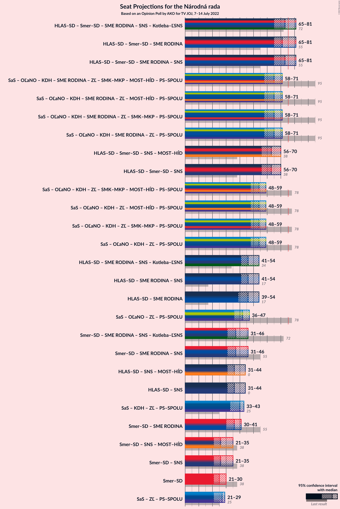
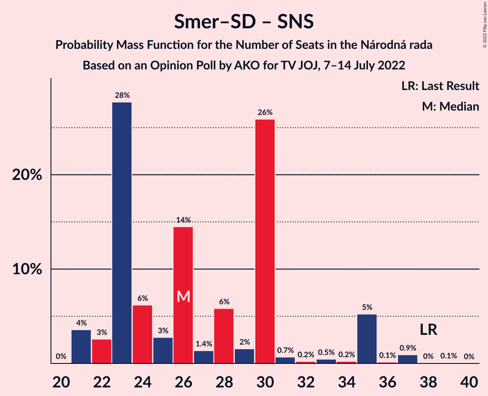

# Opinion Poll by AKO for TV JOJ, 7–14 July 2022

<a href="#voting-intentions">Voting Intentions</a> | <a href="#seats">Seats</a> | <a href="#coalitions">Coalitions</a> | <a href="#technical-information">Technical Information</a>

## Voting Intentions

### Confidence Intervals

| Party | Last Result | Poll Result | 80% Confidence Interval | 90% Confidence Interval | 95% Confidence Interval | 99% Confidence Interval |
|:-----:|:-----------:|:-----------:|:-----------------------:|:-----------------------:|:-----------------------:|:-----------------------:|
| HLAS–sociálna demokracia | 0.0% | 20.0% | 18.4–21.7% |18.0–22.2% |17.6–22.6% |16.9–23.4% |
| Sloboda a Solidarita | 6.2% | 14.7% | 13.3–16.2% |13.0–16.7% |12.6–17.0% |12.0–17.8% |
| SMER–sociálna demokracia | 18.3% | 14.6% | 13.2–16.1% |12.9–16.6% |12.5–16.9% |11.9–17.7% |
| Progresívne Slovensko | 7.0% | 9.8% | 8.7–11.1% |8.4–11.5% |8.1–11.8% |7.6–12.5% |
| OBYČAJNÍ ĽUDIA a nezávislé osobnosti | 25.0% | 9.2% | 8.1–10.5% |7.8–10.8% |7.6–11.2% |7.1–11.8% |
| Kresťanskodemokratické hnutie | 4.6% | 7.2% | 6.2–8.4% |6.0–8.7% |5.7–9.0% |5.3–9.6% |
| SME RODINA | 8.2% | 6.0% | 5.1–7.1% |4.9–7.4% |4.7–7.7% |4.3–8.2% |
| REPUBLIKA | 0.0% | 5.4% | 4.6–6.4% |4.3–6.7% |4.2–7.0% |3.8–7.5% |
| Slovenská národná strana | 3.2% | 4.1% | 3.4–5.0% |3.2–5.3% |3.0–5.5% |2.7–6.0% |
| Za ľudí | 5.8% | 2.2% | 1.7–2.9% |1.6–3.1% |1.4–3.3% |1.2–3.7% |
| Kotleba–Ľudová strana Naše Slovensko | 8.0% | 1.5% | 1.1–2.1% |1.0–2.3% |0.9–2.5% |0.7–2.8% |
| Dobrá voľba | 3.1% | 1.5% | 1.1–2.1% |1.0–2.3% |0.9–2.5% |0.7–2.8% |
| Strana maďarskej koalície–Magyar Koalíció Pártja | 3.9% | 1.1% | 0.8–1.7% |0.7–1.8% |0.6–2.0% |0.5–2.3% |
| SPOLU–Občianska Demokracia | 7.0% | 0.2% | 0.1–0.5% |0.1–0.6% |0.1–0.7% |0.0–0.9% |

*Note:* The poll result column reflects the actual value used in the calculations. Published results may vary slightly, and in addition be rounded to fewer digits.

## Seats

### Confidence Intervals

| Party | Last Result | Median | 80% Confidence Interval | 90% Confidence Interval | 95% Confidence Interval | 99% Confidence Interval |
|:-----:|:-----------:|:------:|:-----------------------:|:-----------------------:|:-----------------------:|:-----------------------:|
| <a href="#hlas–sociálna-demokracia">HLAS–sociálna demokracia</a> | 0 | 36 | 32–38 |32–43 |31–43 |28–44 |
| <a href="#sloboda-a-solidarita">Sloboda a Solidarita</a> | 13 | 27 | 23–28 |22–29 |21–29 |21–33 |
| <a href="#smer–sociálna-demokracia">SMER–sociálna demokracia</a> | 38 | 25 | 23–30 |22–30 |21–30 |19–31 |
| <a href="#progresívne-slovensko">Progresívne Slovensko</a> | 0 | 18 | 15–19 |15–21 |14–21 |14–22 |
| <a href="#obyčajní-ľudia-a-nezávislé-osobnosti">OBYČAJNÍ ĽUDIA a nezávislé osobnosti</a> | 53 | 16 | 13–19 |13–19 |13–19 |12–21 |
| <a href="#kresťanskodemokratické-hnutie">Kresťanskodemokratické hnutie</a> | 0 | 12 | 10–14 |10–15 |9–16 |0–16 |
| <a href="#sme-rodina">SME RODINA</a> | 17 | 10 | 10–12 |9–13 |0–13 |0–14 |
| <a href="#republika">REPUBLIKA</a> | 0 | 9 | 0–11 |0–11 |0–12 |0–13 |
| <a href="#slovenská-národná-strana">Slovenská národná strana</a> | 0 | 0 | 0 |0–10 |0–10 |0–10 |
| <a href="#za-ľudí">Za ľudí</a> | 12 | 0 | 0 |0 |0 |0 |
| <a href="#kotleba–ľudová-strana-naše-slovensko">Kotleba–Ľudová strana Naše Slovensko</a> | 17 | 0 | 0 |0 |0 |0 |
| <a href="#dobrá-voľba">Dobrá voľba</a> | 0 | 0 | 0 |0 |0 |0 |
| <a href="#strana-maďarskej-koalície–magyar-koalíció-pártja">Strana maďarskej koalície–Magyar Koalíció Pártja</a> | 0 | 0 | 0 |0 |0 |0 |
| <a href="#spolu–občianska-demokracia">SPOLU–Občianska Demokracia</a> | 0 | 0 | 0 |0 |0 |0 |

### HLAS–sociálna demokracia

*For a full overview of the results for this party, see the [HLAS–sociálna demokracia](party-hlas–sociálnademokracia.html) page.*

| Number of Seats | Probability | Accumulated | Special Marks |
|:---------------:|:-----------:|:-----------:|:-------------:|
| 0 | 0% | 100% | Last Result |
| 1 | 0% | 100% |  |
| 2 | 0% | 100% |  |
| 3 | 0% | 100% |  |
| 4 | 0% | 100% |  |
| 5 | 0% | 100% |  |
| 6 | 0% | 100% |  |
| 7 | 0% | 100% |  |
| 8 | 0% | 100% |  |
| 9 | 0% | 100% |  |
| 10 | 0% | 100% |  |
| 11 | 0% | 100% |  |
| 12 | 0% | 100% |  |
| 13 | 0% | 100% |  |
| 14 | 0% | 100% |  |
| 15 | 0% | 100% |  |
| 16 | 0% | 100% |  |
| 17 | 0% | 100% |  |
| 18 | 0% | 100% |  |
| 19 | 0% | 100% |  |
| 20 | 0% | 100% |  |
| 21 | 0% | 100% |  |
| 22 | 0% | 100% |  |
| 23 | 0% | 100% |  |
| 24 | 0% | 100% |  |
| 25 | 0% | 100% |  |
| 26 | 0.1% | 100% |  |
| 27 | 0.1% | 99.9% |  |
| 28 | 0.5% | 99.9% |  |
| 29 | 0.3% | 99.4% |  |
| 30 | 0.9% | 99.1% |  |
| 31 | 2% | 98% |  |
| 32 | 8% | 96% |  |
| 33 | 4% | 88% |  |
| 34 | 13% | 84% |  |
| 35 | 2% | 71% |  |
| 36 | 28% | 69% | Median |
| 37 | 10% | 40% |  |
| 38 | 21% | 30% |  |
| 39 | 0.3% | 9% |  |
| 40 | 3% | 9% |  |
| 41 | 0.4% | 6% |  |
| 42 | 0.1% | 6% |  |
| 43 | 4% | 6% |  |
| 44 | 2% | 2% |  |
| 45 | 0% | 0.2% |  |
| 46 | 0.1% | 0.2% |  |
| 47 | 0.1% | 0.1% |  |
| 48 | 0% | 0% |  |

### Sloboda a Solidarita

*For a full overview of the results for this party, see the [Sloboda a Solidarita](party-slobodaasolidarita.html) page.*

| Number of Seats | Probability | Accumulated | Special Marks |
|:---------------:|:-----------:|:-----------:|:-------------:|
| 13 | 0% | 100% | Last Result |
| 14 | 0% | 100% |  |
| 15 | 0% | 100% |  |
| 16 | 0% | 100% |  |
| 17 | 0% | 100% |  |
| 18 | 0% | 100% |  |
| 19 | 0% | 100% |  |
| 20 | 0.1% | 99.9% |  |
| 21 | 3% | 99.8% |  |
| 22 | 3% | 97% |  |
| 23 | 9% | 94% |  |
| 24 | 15% | 85% |  |
| 25 | 3% | 69% |  |
| 26 | 8% | 66% |  |
| 27 | 11% | 58% | Median |
| 28 | 41% | 47% |  |
| 29 | 3% | 5% |  |
| 30 | 0.7% | 2% |  |
| 31 | 0.8% | 2% |  |
| 32 | 0.3% | 0.8% |  |
| 33 | 0.5% | 0.5% |  |
| 34 | 0% | 0% |  |

### SMER–sociálna demokracia

*For a full overview of the results for this party, see the [SMER–sociálna demokracia](party-smer–sociálnademokracia.html) page.*

| Number of Seats | Probability | Accumulated | Special Marks |
|:---------------:|:-----------:|:-----------:|:-------------:|
| 19 | 0.8% | 100% |  |
| 20 | 0.1% | 99.2% |  |
| 21 | 4% | 99.1% |  |
| 22 | 3% | 95% |  |
| 23 | 28% | 92% |  |
| 24 | 6% | 64% |  |
| 25 | 8% | 58% | Median |
| 26 | 15% | 50% |  |
| 27 | 2% | 35% |  |
| 28 | 5% | 33% |  |
| 29 | 2% | 28% |  |
| 30 | 25% | 26% |  |
| 31 | 0.4% | 0.6% |  |
| 32 | 0.1% | 0.2% |  |
| 33 | 0% | 0.1% |  |
| 34 | 0.1% | 0.1% |  |
| 35 | 0% | 0% |  |
| 36 | 0% | 0% |  |
| 37 | 0% | 0% |  |
| 38 | 0% | 0% | Last Result |

### Progresívne Slovensko

*For a full overview of the results for this party, see the [Progresívne Slovensko](party-progresívneslovensko.html) page.*

| Number of Seats | Probability | Accumulated | Special Marks |
|:---------------:|:-----------:|:-----------:|:-------------:|
| 0 | 0% | 100% | Last Result |
| 1 | 0% | 100% |  |
| 2 | 0% | 100% |  |
| 3 | 0% | 100% |  |
| 4 | 0% | 100% |  |
| 5 | 0% | 100% |  |
| 6 | 0% | 100% |  |
| 7 | 0% | 100% |  |
| 8 | 0% | 100% |  |
| 9 | 0% | 100% |  |
| 10 | 0% | 100% |  |
| 11 | 0% | 100% |  |
| 12 | 0.3% | 100% |  |
| 13 | 0.1% | 99.7% |  |
| 14 | 4% | 99.6% |  |
| 15 | 9% | 96% |  |
| 16 | 6% | 87% |  |
| 17 | 23% | 82% |  |
| 18 | 9% | 58% | Median |
| 19 | 42% | 50% |  |
| 20 | 1.0% | 7% |  |
| 21 | 6% | 6% |  |
| 22 | 0.4% | 0.7% |  |
| 23 | 0.1% | 0.2% |  |
| 24 | 0% | 0.1% |  |
| 25 | 0.1% | 0.1% |  |
| 26 | 0% | 0% |  |

### OBYČAJNÍ ĽUDIA a nezávislé osobnosti

*For a full overview of the results for this party, see the [OBYČAJNÍ ĽUDIA a nezávislé osobnosti](party-obyčajníľudiaanezávisléosobnosti.html) page.*

| Number of Seats | Probability | Accumulated | Special Marks |
|:---------------:|:-----------:|:-----------:|:-------------:|
| 11 | 0.1% | 100% |  |
| 12 | 0.6% | 99.9% |  |
| 13 | 29% | 99.2% |  |
| 14 | 10% | 71% |  |
| 15 | 6% | 61% |  |
| 16 | 15% | 55% | Median |
| 17 | 10% | 40% |  |
| 18 | 12% | 30% |  |
| 19 | 16% | 18% |  |
| 20 | 1.1% | 2% |  |
| 21 | 0.4% | 0.6% |  |
| 22 | 0.2% | 0.2% |  |
| 23 | 0% | 0% |  |
| 24 | 0% | 0% |  |
| 25 | 0% | 0% |  |
| 26 | 0% | 0% |  |
| 27 | 0% | 0% |  |
| 28 | 0% | 0% |  |
| 29 | 0% | 0% |  |
| 30 | 0% | 0% |  |
| 31 | 0% | 0% |  |
| 32 | 0% | 0% |  |
| 33 | 0% | 0% |  |
| 34 | 0% | 0% |  |
| 35 | 0% | 0% |  |
| 36 | 0% | 0% |  |
| 37 | 0% | 0% |  |
| 38 | 0% | 0% |  |
| 39 | 0% | 0% |  |
| 40 | 0% | 0% |  |
| 41 | 0% | 0% |  |
| 42 | 0% | 0% |  |
| 43 | 0% | 0% |  |
| 44 | 0% | 0% |  |
| 45 | 0% | 0% |  |
| 46 | 0% | 0% |  |
| 47 | 0% | 0% |  |
| 48 | 0% | 0% |  |
| 49 | 0% | 0% |  |
| 50 | 0% | 0% |  |
| 51 | 0% | 0% |  |
| 52 | 0% | 0% |  |
| 53 | 0% | 0% | Last Result |

### Kresťanskodemokratické hnutie

*For a full overview of the results for this party, see the [Kresťanskodemokratické hnutie](party-kresťanskodemokratickéhnutie.html) page.*

| Number of Seats | Probability | Accumulated | Special Marks |
|:---------------:|:-----------:|:-----------:|:-------------:|
| 0 | 1.4% | 100% | Last Result |
| 1 | 0% | 98.6% |  |
| 2 | 0% | 98.6% |  |
| 3 | 0% | 98.6% |  |
| 4 | 0% | 98.6% |  |
| 5 | 0% | 98.6% |  |
| 6 | 0% | 98.6% |  |
| 7 | 0% | 98.6% |  |
| 8 | 0.1% | 98.6% |  |
| 9 | 3% | 98% |  |
| 10 | 10% | 96% |  |
| 11 | 4% | 85% |  |
| 12 | 60% | 81% | Median |
| 13 | 5% | 21% |  |
| 14 | 9% | 16% |  |
| 15 | 4% | 6% |  |
| 16 | 2% | 3% |  |
| 17 | 0.2% | 0.3% |  |
| 18 | 0% | 0.1% |  |
| 19 | 0.1% | 0.1% |  |
| 20 | 0% | 0% |  |

### SME RODINA

*For a full overview of the results for this party, see the [SME RODINA](party-smerodina.html) page.*

| Number of Seats | Probability | Accumulated | Special Marks |
|:---------------:|:-----------:|:-----------:|:-------------:|
| 0 | 3% | 100% |  |
| 1 | 0% | 97% |  |
| 2 | 0% | 97% |  |
| 3 | 0% | 97% |  |
| 4 | 0% | 97% |  |
| 5 | 0% | 97% |  |
| 6 | 0% | 97% |  |
| 7 | 0% | 97% |  |
| 8 | 0.1% | 97% |  |
| 9 | 3% | 97% |  |
| 10 | 52% | 95% | Median |
| 11 | 26% | 42% |  |
| 12 | 7% | 16% |  |
| 13 | 7% | 9% |  |
| 14 | 2% | 2% |  |
| 15 | 0.1% | 0.3% |  |
| 16 | 0% | 0.2% |  |
| 17 | 0.1% | 0.2% | Last Result |
| 18 | 0.1% | 0.1% |  |
| 19 | 0% | 0% |  |

### REPUBLIKA

*For a full overview of the results for this party, see the [REPUBLIKA](party-republika.html) page.*

| Number of Seats | Probability | Accumulated | Special Marks |
|:---------------:|:-----------:|:-----------:|:-------------:|
| 0 | 49% | 100% | Last Result |
| 1 | 0% | 51% |  |
| 2 | 0% | 51% |  |
| 3 | 0% | 51% |  |
| 4 | 0% | 51% |  |
| 5 | 0% | 51% |  |
| 6 | 0% | 51% |  |
| 7 | 0% | 51% |  |
| 8 | 1.3% | 51% |  |
| 9 | 30% | 50% | Median |
| 10 | 9% | 20% |  |
| 11 | 7% | 11% |  |
| 12 | 2% | 4% |  |
| 13 | 1.3% | 2% |  |
| 14 | 0.3% | 0.5% |  |
| 15 | 0.1% | 0.1% |  |
| 16 | 0% | 0% |  |

### Slovenská národná strana

*For a full overview of the results for this party, see the [Slovenská národná strana](party-slovenskánárodnástrana.html) page.*

| Number of Seats | Probability | Accumulated | Special Marks |
|:---------------:|:-----------:|:-----------:|:-------------:|
| 0 | 91% | 100% | Last Result, Median |
| 1 | 0% | 9% |  |
| 2 | 0% | 9% |  |
| 3 | 0% | 9% |  |
| 4 | 0% | 9% |  |
| 5 | 0% | 9% |  |
| 6 | 0% | 9% |  |
| 7 | 0% | 9% |  |
| 8 | 0.3% | 9% |  |
| 9 | 2% | 8% |  |
| 10 | 6% | 6% |  |
| 11 | 0.2% | 0.2% |  |
| 12 | 0% | 0% |  |

### Za ľudí

*For a full overview of the results for this party, see the [Za ľudí](party-zaľudí.html) page.*

| Number of Seats | Probability | Accumulated | Special Marks |
|:---------------:|:-----------:|:-----------:|:-------------:|
| 0 | 100% | 100% | Median |
| 1 | 0% | 0% |  |
| 2 | 0% | 0% |  |
| 3 | 0% | 0% |  |
| 4 | 0% | 0% |  |
| 5 | 0% | 0% |  |
| 6 | 0% | 0% |  |
| 7 | 0% | 0% |  |
| 8 | 0% | 0% |  |
| 9 | 0% | 0% |  |
| 10 | 0% | 0% |  |
| 11 | 0% | 0% |  |
| 12 | 0% | 0% | Last Result |

### Kotleba–Ľudová strana Naše Slovensko

*For a full overview of the results for this party, see the [Kotleba–Ľudová strana Naše Slovensko](party-kotleba–ľudovástrananašeslovensko.html) page.*

| Number of Seats | Probability | Accumulated | Special Marks |
|:---------------:|:-----------:|:-----------:|:-------------:|
| 0 | 100% | 100% | Median |
| 1 | 0% | 0% |  |
| 2 | 0% | 0% |  |
| 3 | 0% | 0% |  |
| 4 | 0% | 0% |  |
| 5 | 0% | 0% |  |
| 6 | 0% | 0% |  |
| 7 | 0% | 0% |  |
| 8 | 0% | 0% |  |
| 9 | 0% | 0% |  |
| 10 | 0% | 0% |  |
| 11 | 0% | 0% |  |
| 12 | 0% | 0% |  |
| 13 | 0% | 0% |  |
| 14 | 0% | 0% |  |
| 15 | 0% | 0% |  |
| 16 | 0% | 0% |  |
| 17 | 0% | 0% | Last Result |

### Dobrá voľba

*For a full overview of the results for this party, see the [Dobrá voľba](party-dobrávoľba.html) page.*

| Number of Seats | Probability | Accumulated | Special Marks |
|:---------------:|:-----------:|:-----------:|:-------------:|
| 0 | 100% | 100% | Last Result, Median |

### Strana maďarskej koalície–Magyar Koalíció Pártja

*For a full overview of the results for this party, see the [Strana maďarskej koalície–Magyar Koalíció Pártja](party-stranamaďarskejkoalície–magyarkoalíciópártja.html) page.*

| Number of Seats | Probability | Accumulated | Special Marks |
|:---------------:|:-----------:|:-----------:|:-------------:|
| 0 | 100% | 100% | Last Result, Median |

### SPOLU–Občianska Demokracia

*For a full overview of the results for this party, see the [SPOLU–Občianska Demokracia](party-spolu–občianskademokracia.html) page.*

| Number of Seats | Probability | Accumulated | Special Marks |
|:---------------:|:-----------:|:-----------:|:-------------:|
| 0 | 100% | 100% | Last Result, Median |

## Coalitions

### Confidence Intervals

| Coalition | Last Result | Median | Majority? | 80% Confidence Interval | 90% Confidence Interval | 95% Confidence Interval | 99% Confidence Interval |
|:---------:|:-----------:|:------:|:---------:|:-----------------------:|:-----------------------:|:-----------------------:|:-----------------------:|
| HLAS–sociálna demokracia – SMER–sociálna demokracia – SME RODINA – Slovenská národná strana – Kotleba–Ľudová strana Naše Slovensko | 72 | 73 | 34% | 69–78 | 67–80 | 65–81 | 61–81 |
| HLAS–sociálna demokracia – SMER–sociálna demokracia – SME RODINA | 55 | 71 | 26% | 68–78 | 67–80 | 65–81 | 60–81 |
| HLAS–sociálna demokracia – SMER–sociálna demokracia – SME RODINA – Slovenská národná strana | 55 | 73 | 34% | 69–78 | 67–80 | 65–81 | 61–81 |
| HLAS–sociálna demokracia – SMER–sociálna demokracia – Slovenská národná strana | 38 | 63 | 0% | 58–68 | 58–69 | 56–70 | 53–71 |
| HLAS–sociálna demokracia – SME RODINA – Slovenská národná strana – Kotleba–Ľudová strana Naše Slovensko | 34 | 46 | 0% | 45–53 | 42–54 | 41–54 | 36–59 |
| HLAS–sociálna demokracia – SME RODINA – Slovenská národná strana | 17 | 46 | 0% | 45–53 | 42–54 | 41–54 | 36–59 |
| HLAS–sociálna demokracia – SME RODINA | 17 | 46 | 0% | 43–50 | 41–54 | 39–54 | 35–54 |
| SMER–sociálna demokracia – SME RODINA – Slovenská národná strana – Kotleba–Ľudová strana Naše Slovensko | 72 | 37 | 0% | 33–41 | 33–46 | 31–46 | 25–47 |
| SMER–sociálna demokracia – SME RODINA – Slovenská národná strana | 55 | 37 | 0% | 33–41 | 33–46 | 31–46 | 25–47 |
| HLAS–sociálna demokracia – Slovenská národná strana | 0 | 36 | 0% | 34–42 | 32–43 | 31–44 | 29–46 |
| SMER–sociálna demokracia – SME RODINA | 55 | 36 | 0% | 33–41 | 32–41 | 30–41 | 24–42 |
| SMER–sociálna demokracia – Slovenská národná strana | 38 | 26 | 0% | 23–30 | 22–35 | 21–35 | 21–37 |
| SMER–sociálna demokracia | 38 | 25 | 0% | 23–30 | 22–30 | 21–30 | 19–31 |

### HLAS–sociálna demokracia – SMER–sociálna demokracia – SME RODINA – Slovenská národná strana – Kotleba–Ľudová strana Naše Slovensko

| Number of Seats | Probability | Accumulated | Special Marks |
|:---------------:|:-----------:|:-----------:|:-------------:|
| 60 | 0.4% | 100% |  |
| 61 | 0.5% | 99.6% |  |
| 62 | 0.1% | 99.1% |  |
| 63 | 0.5% | 99.0% |  |
| 64 | 0.3% | 98.5% |  |
| 65 | 0.9% | 98% |  |
| 66 | 1.2% | 97% |  |
| 67 | 3% | 96% |  |
| 68 | 1.0% | 93% |  |
| 69 | 28% | 92% |  |
| 70 | 3% | 64% |  |
| 71 | 6% | 61% | Median |
| 72 | 4% | 56% | Last Result |
| 73 | 2% | 51% |  |
| 74 | 3% | 49% |  |
| 75 | 13% | 46% |  |
| 76 | 2% | 34% | Majority |
| 77 | 2% | 32% |  |
| 78 | 20% | 30% |  |
| 79 | 0.2% | 10% |  |
| 80 | 7% | 10% |  |
| 81 | 3% | 3% |  |
| 82 | 0.1% | 0.2% |  |
| 83 | 0.1% | 0.1% |  |
| 84 | 0% | 0% |  |

### HLAS–sociálna demokracia – SMER–sociálna demokracia – SME RODINA

| Number of Seats | Probability | Accumulated | Special Marks |
|:---------------:|:-----------:|:-----------:|:-------------:|
| 55 | 0% | 100% | Last Result |
| 56 | 0.1% | 100% |  |
| 57 | 0.1% | 99.9% |  |
| 58 | 0% | 99.8% |  |
| 59 | 0% | 99.8% |  |
| 60 | 0.5% | 99.8% |  |
| 61 | 0.5% | 99.3% |  |
| 62 | 0.1% | 98.8% |  |
| 63 | 0.6% | 98.7% |  |
| 64 | 0.4% | 98% |  |
| 65 | 0.9% | 98% |  |
| 66 | 2% | 97% |  |
| 67 | 3% | 95% |  |
| 68 | 6% | 92% |  |
| 69 | 29% | 86% |  |
| 70 | 4% | 57% |  |
| 71 | 6% | 53% | Median |
| 72 | 4% | 48% |  |
| 73 | 2% | 43% |  |
| 74 | 3% | 41% |  |
| 75 | 12% | 39% |  |
| 76 | 2% | 26% | Majority |
| 77 | 2% | 25% |  |
| 78 | 14% | 23% |  |
| 79 | 0% | 9% |  |
| 80 | 6% | 9% |  |
| 81 | 3% | 3% |  |
| 82 | 0% | 0.1% |  |
| 83 | 0.1% | 0.1% |  |
| 84 | 0% | 0% |  |

### HLAS–sociálna demokracia – SMER–sociálna demokracia – SME RODINA – Slovenská národná strana

| Number of Seats | Probability | Accumulated | Special Marks |
|:---------------:|:-----------:|:-----------:|:-------------:|
| 55 | 0% | 100% | Last Result |
| 56 | 0% | 100% |  |
| 57 | 0% | 100% |  |
| 58 | 0% | 100% |  |
| 59 | 0% | 100% |  |
| 60 | 0.4% | 100% |  |
| 61 | 0.5% | 99.6% |  |
| 62 | 0.1% | 99.1% |  |
| 63 | 0.5% | 99.0% |  |
| 64 | 0.3% | 98.5% |  |
| 65 | 0.9% | 98% |  |
| 66 | 1.2% | 97% |  |
| 67 | 3% | 96% |  |
| 68 | 1.0% | 93% |  |
| 69 | 28% | 92% |  |
| 70 | 3% | 64% |  |
| 71 | 6% | 61% | Median |
| 72 | 4% | 56% |  |
| 73 | 2% | 51% |  |
| 74 | 3% | 49% |  |
| 75 | 13% | 46% |  |
| 76 | 2% | 34% | Majority |
| 77 | 2% | 32% |  |
| 78 | 20% | 30% |  |
| 79 | 0.2% | 10% |  |
| 80 | 7% | 10% |  |
| 81 | 3% | 3% |  |
| 82 | 0.1% | 0.2% |  |
| 83 | 0.1% | 0.1% |  |
| 84 | 0% | 0% |  |

### HLAS–sociálna demokracia – SMER–sociálna demokracia – Slovenská národná strana

| Number of Seats | Probability | Accumulated | Special Marks |
|:---------------:|:-----------:|:-----------:|:-------------:|
| 38 | 0% | 100% | Last Result |
| 39 | 0% | 100% |  |
| 40 | 0% | 100% |  |
| 41 | 0% | 100% |  |
| 42 | 0% | 100% |  |
| 43 | 0% | 100% |  |
| 44 | 0% | 100% |  |
| 45 | 0% | 100% |  |
| 46 | 0% | 100% |  |
| 47 | 0% | 100% |  |
| 48 | 0% | 100% |  |
| 49 | 0% | 100% |  |
| 50 | 0.1% | 100% |  |
| 51 | 0% | 99.9% |  |
| 52 | 0% | 99.9% |  |
| 53 | 0.5% | 99.8% |  |
| 54 | 0.6% | 99.3% |  |
| 55 | 1.0% | 98.8% |  |
| 56 | 1.0% | 98% |  |
| 57 | 2% | 97% |  |
| 58 | 5% | 95% |  |
| 59 | 28% | 90% |  |
| 60 | 3% | 61% |  |
| 61 | 8% | 59% | Median |
| 62 | 0.6% | 51% |  |
| 63 | 2% | 50% |  |
| 64 | 15% | 49% |  |
| 65 | 1.4% | 34% |  |
| 66 | 3% | 32% |  |
| 67 | 6% | 29% |  |
| 68 | 16% | 24% |  |
| 69 | 4% | 7% |  |
| 70 | 3% | 3% |  |
| 71 | 0.4% | 0.8% |  |
| 72 | 0.1% | 0.4% |  |
| 73 | 0.1% | 0.3% |  |
| 74 | 0% | 0.1% |  |
| 75 | 0.1% | 0.1% |  |
| 76 | 0% | 0% | Majority |

### HLAS–sociálna demokracia – SME RODINA – Slovenská národná strana – Kotleba–Ľudová strana Naše Slovensko

| Number of Seats | Probability | Accumulated | Special Marks |
|:---------------:|:-----------:|:-----------:|:-------------:|
| 33 | 0.2% | 100% |  |
| 34 | 0% | 99.8% | Last Result |
| 35 | 0.1% | 99.8% |  |
| 36 | 0.6% | 99.6% |  |
| 37 | 0.1% | 99.0% |  |
| 38 | 0.8% | 98.9% |  |
| 39 | 0.1% | 98% |  |
| 40 | 0.3% | 98% |  |
| 41 | 2% | 98% |  |
| 42 | 2% | 95% |  |
| 43 | 0.6% | 93% |  |
| 44 | 1.2% | 93% |  |
| 45 | 14% | 91% |  |
| 46 | 29% | 77% | Median |
| 47 | 5% | 48% |  |
| 48 | 17% | 43% |  |
| 49 | 5% | 26% |  |
| 50 | 3% | 20% |  |
| 51 | 1.0% | 17% |  |
| 52 | 0.5% | 16% |  |
| 53 | 9% | 16% |  |
| 54 | 6% | 7% |  |
| 55 | 0% | 1.3% |  |
| 56 | 0.4% | 1.3% |  |
| 57 | 0% | 0.8% |  |
| 58 | 0% | 0.8% |  |
| 59 | 0.7% | 0.8% |  |
| 60 | 0% | 0% |  |

### HLAS–sociálna demokracia – SME RODINA – Slovenská národná strana

| Number of Seats | Probability | Accumulated | Special Marks |
|:---------------:|:-----------:|:-----------:|:-------------:|
| 17 | 0% | 100% | Last Result |
| 18 | 0% | 100% |  |
| 19 | 0% | 100% |  |
| 20 | 0% | 100% |  |
| 21 | 0% | 100% |  |
| 22 | 0% | 100% |  |
| 23 | 0% | 100% |  |
| 24 | 0% | 100% |  |
| 25 | 0% | 100% |  |
| 26 | 0% | 100% |  |
| 27 | 0% | 100% |  |
| 28 | 0% | 100% |  |
| 29 | 0% | 100% |  |
| 30 | 0% | 100% |  |
| 31 | 0% | 100% |  |
| 32 | 0% | 100% |  |
| 33 | 0.2% | 100% |  |
| 34 | 0% | 99.8% |  |
| 35 | 0.1% | 99.8% |  |
| 36 | 0.6% | 99.6% |  |
| 37 | 0.1% | 99.0% |  |
| 38 | 0.8% | 98.9% |  |
| 39 | 0.1% | 98% |  |
| 40 | 0.3% | 98% |  |
| 41 | 2% | 98% |  |
| 42 | 2% | 95% |  |
| 43 | 0.6% | 93% |  |
| 44 | 1.2% | 93% |  |
| 45 | 14% | 91% |  |
| 46 | 29% | 77% | Median |
| 47 | 5% | 48% |  |
| 48 | 17% | 43% |  |
| 49 | 5% | 26% |  |
| 50 | 3% | 20% |  |
| 51 | 1.0% | 17% |  |
| 52 | 0.5% | 16% |  |
| 53 | 9% | 16% |  |
| 54 | 6% | 7% |  |
| 55 | 0% | 1.3% |  |
| 56 | 0.4% | 1.3% |  |
| 57 | 0% | 0.8% |  |
| 58 | 0% | 0.8% |  |
| 59 | 0.7% | 0.8% |  |
| 60 | 0% | 0% |  |

### HLAS–sociálna demokracia – SME RODINA

| Number of Seats | Probability | Accumulated | Special Marks |
|:---------------:|:-----------:|:-----------:|:-------------:|
| 17 | 0% | 100% | Last Result |
| 18 | 0% | 100% |  |
| 19 | 0% | 100% |  |
| 20 | 0% | 100% |  |
| 21 | 0% | 100% |  |
| 22 | 0% | 100% |  |
| 23 | 0% | 100% |  |
| 24 | 0% | 100% |  |
| 25 | 0% | 100% |  |
| 26 | 0% | 100% |  |
| 27 | 0% | 100% |  |
| 28 | 0% | 100% |  |
| 29 | 0% | 100% |  |
| 30 | 0% | 100% |  |
| 31 | 0.1% | 100% |  |
| 32 | 0% | 99.9% |  |
| 33 | 0.2% | 99.9% |  |
| 34 | 0.1% | 99.7% |  |
| 35 | 0.2% | 99.6% |  |
| 36 | 0.6% | 99.4% |  |
| 37 | 0.2% | 98.8% |  |
| 38 | 0.9% | 98.6% |  |
| 39 | 0.2% | 98% |  |
| 40 | 0.5% | 97% |  |
| 41 | 2% | 97% |  |
| 42 | 2% | 95% |  |
| 43 | 7% | 92% |  |
| 44 | 2% | 86% |  |
| 45 | 14% | 84% |  |
| 46 | 29% | 70% | Median |
| 47 | 6% | 41% |  |
| 48 | 17% | 36% |  |
| 49 | 5% | 18% |  |
| 50 | 4% | 13% |  |
| 51 | 0.8% | 9% |  |
| 52 | 0.1% | 9% |  |
| 53 | 3% | 8% |  |
| 54 | 5% | 5% |  |
| 55 | 0% | 0% |  |

### SMER–sociálna demokracia – SME RODINA – Slovenská národná strana – Kotleba–Ľudová strana Naše Slovensko

| Number of Seats | Probability | Accumulated | Special Marks |
|:---------------:|:-----------:|:-----------:|:-------------:|
| 22 | 0.4% | 100% |  |
| 23 | 0% | 99.6% |  |
| 24 | 0% | 99.6% |  |
| 25 | 0.3% | 99.6% |  |
| 26 | 0.3% | 99.3% |  |
| 27 | 0% | 99.0% |  |
| 28 | 0.3% | 99.0% |  |
| 29 | 0.3% | 98.7% |  |
| 30 | 0.8% | 98% |  |
| 31 | 0.7% | 98% |  |
| 32 | 0.9% | 97% |  |
| 33 | 30% | 96% |  |
| 34 | 7% | 66% |  |
| 35 | 3% | 60% | Median |
| 36 | 6% | 57% |  |
| 37 | 6% | 51% |  |
| 38 | 2% | 45% |  |
| 39 | 4% | 43% |  |
| 40 | 15% | 39% |  |
| 41 | 17% | 25% |  |
| 42 | 0.4% | 8% |  |
| 43 | 0.6% | 7% |  |
| 44 | 0.2% | 7% |  |
| 45 | 0.4% | 7% |  |
| 46 | 5% | 6% |  |
| 47 | 1.1% | 1.3% |  |
| 48 | 0% | 0.2% |  |
| 49 | 0.1% | 0.1% |  |
| 50 | 0% | 0% |  |
| 51 | 0% | 0% |  |
| 52 | 0% | 0% |  |
| 53 | 0% | 0% |  |
| 54 | 0% | 0% |  |
| 55 | 0% | 0% |  |
| 56 | 0% | 0% |  |
| 57 | 0% | 0% |  |
| 58 | 0% | 0% |  |
| 59 | 0% | 0% |  |
| 60 | 0% | 0% |  |
| 61 | 0% | 0% |  |
| 62 | 0% | 0% |  |
| 63 | 0% | 0% |  |
| 64 | 0% | 0% |  |
| 65 | 0% | 0% |  |
| 66 | 0% | 0% |  |
| 67 | 0% | 0% |  |
| 68 | 0% | 0% |  |
| 69 | 0% | 0% |  |
| 70 | 0% | 0% |  |
| 71 | 0% | 0% |  |
| 72 | 0% | 0% | Last Result |

### SMER–sociálna demokracia – SME RODINA – Slovenská národná strana

| Number of Seats | Probability | Accumulated | Special Marks |
|:---------------:|:-----------:|:-----------:|:-------------:|
| 22 | 0.4% | 100% |  |
| 23 | 0% | 99.6% |  |
| 24 | 0% | 99.6% |  |
| 25 | 0.3% | 99.6% |  |
| 26 | 0.3% | 99.3% |  |
| 27 | 0% | 99.0% |  |
| 28 | 0.3% | 99.0% |  |
| 29 | 0.3% | 98.7% |  |
| 30 | 0.8% | 98% |  |
| 31 | 0.7% | 98% |  |
| 32 | 0.9% | 97% |  |
| 33 | 30% | 96% |  |
| 34 | 7% | 66% |  |
| 35 | 3% | 60% | Median |
| 36 | 6% | 57% |  |
| 37 | 6% | 51% |  |
| 38 | 2% | 45% |  |
| 39 | 4% | 43% |  |
| 40 | 15% | 39% |  |
| 41 | 17% | 25% |  |
| 42 | 0.4% | 8% |  |
| 43 | 0.6% | 7% |  |
| 44 | 0.2% | 7% |  |
| 45 | 0.4% | 7% |  |
| 46 | 5% | 6% |  |
| 47 | 1.1% | 1.3% |  |
| 48 | 0% | 0.2% |  |
| 49 | 0.1% | 0.1% |  |
| 50 | 0% | 0% |  |
| 51 | 0% | 0% |  |
| 52 | 0% | 0% |  |
| 53 | 0% | 0% |  |
| 54 | 0% | 0% |  |
| 55 | 0% | 0% | Last Result |

### HLAS–sociálna demokracia – Slovenská národná strana

| Number of Seats | Probability | Accumulated | Special Marks |
|:---------------:|:-----------:|:-----------:|:-------------:|
| 0 | 0% | 100% | Last Result |
| 1 | 0% | 100% |  |
| 2 | 0% | 100% |  |
| 3 | 0% | 100% |  |
| 4 | 0% | 100% |  |
| 5 | 0% | 100% |  |
| 6 | 0% | 100% |  |
| 7 | 0% | 100% |  |
| 8 | 0% | 100% |  |
| 9 | 0% | 100% |  |
| 10 | 0% | 100% |  |
| 11 | 0% | 100% |  |
| 12 | 0% | 100% |  |
| 13 | 0% | 100% |  |
| 14 | 0% | 100% |  |
| 15 | 0% | 100% |  |
| 16 | 0% | 100% |  |
| 17 | 0% | 100% |  |
| 18 | 0% | 100% |  |
| 19 | 0% | 100% |  |
| 20 | 0% | 100% |  |
| 21 | 0% | 100% |  |
| 22 | 0% | 100% |  |
| 23 | 0% | 100% |  |
| 24 | 0% | 100% |  |
| 25 | 0% | 100% |  |
| 26 | 0% | 100% |  |
| 27 | 0% | 100% |  |
| 28 | 0.4% | 100% |  |
| 29 | 0.1% | 99.6% |  |
| 30 | 0.7% | 99.5% |  |
| 31 | 2% | 98.7% |  |
| 32 | 3% | 97% |  |
| 33 | 2% | 94% |  |
| 34 | 13% | 91% |  |
| 35 | 2% | 79% |  |
| 36 | 28% | 76% | Median |
| 37 | 10% | 48% |  |
| 38 | 21% | 39% |  |
| 39 | 0.4% | 18% |  |
| 40 | 3% | 17% |  |
| 41 | 0.5% | 14% |  |
| 42 | 5% | 14% |  |
| 43 | 5% | 8% |  |
| 44 | 2% | 3% |  |
| 45 | 0% | 1.2% |  |
| 46 | 0.9% | 1.2% |  |
| 47 | 0.2% | 0.2% |  |
| 48 | 0.1% | 0.1% |  |
| 49 | 0% | 0% |  |

### SMER–sociálna demokracia – SME RODINA

| Number of Seats | Probability | Accumulated | Special Marks |
|:---------------:|:-----------:|:-----------:|:-------------:|
| 22 | 0.4% | 100% |  |
| 23 | 0.1% | 99.6% |  |
| 24 | 0% | 99.5% |  |
| 25 | 0.4% | 99.5% |  |
| 26 | 0.4% | 99.1% |  |
| 27 | 0% | 98.8% |  |
| 28 | 0.3% | 98.7% |  |
| 29 | 0.3% | 98% |  |
| 30 | 0.9% | 98% |  |
| 31 | 0.8% | 97% |  |
| 32 | 2% | 97% |  |
| 33 | 30% | 95% |  |
| 34 | 7% | 65% |  |
| 35 | 3% | 58% | Median |
| 36 | 11% | 55% |  |
| 37 | 8% | 44% |  |
| 38 | 2% | 37% |  |
| 39 | 4% | 35% |  |
| 40 | 15% | 31% |  |
| 41 | 16% | 16% |  |
| 42 | 0.2% | 0.5% |  |
| 43 | 0.1% | 0.3% |  |
| 44 | 0.1% | 0.2% |  |
| 45 | 0.1% | 0.1% |  |
| 46 | 0% | 0% |  |
| 47 | 0% | 0% |  |
| 48 | 0% | 0% |  |
| 49 | 0% | 0% |  |
| 50 | 0% | 0% |  |
| 51 | 0% | 0% |  |
| 52 | 0% | 0% |  |
| 53 | 0% | 0% |  |
| 54 | 0% | 0% |  |
| 55 | 0% | 0% | Last Result |

### SMER–sociálna demokracia – Slovenská národná strana

| Number of Seats | Probability | Accumulated | Special Marks |
|:---------------:|:-----------:|:-----------:|:-------------:|
| 21 | 4% | 100% |  |
| 22 | 3% | 96% |  |
| 23 | 28% | 94% |  |
| 24 | 6% | 66% |  |
| 25 | 3% | 60% | Median |
| 26 | 14% | 57% |  |
| 27 | 1.4% | 43% |  |
| 28 | 6% | 41% |  |
| 29 | 2% | 35% |  |
| 30 | 26% | 34% |  |
| 31 | 0.7% | 8% |  |
| 32 | 0.2% | 7% |  |
| 33 | 0.5% | 7% |  |
| 34 | 0.2% | 7% |  |
| 35 | 5% | 6% |  |
| 36 | 0.1% | 1.2% |  |
| 37 | 0.9% | 1.1% |  |
| 38 | 0% | 0.1% | Last Result |
| 39 | 0.1% | 0.1% |  |
| 40 | 0% | 0% |  |

### SMER–sociálna demokracia

| Number of Seats | Probability | Accumulated | Special Marks |
|:---------------:|:-----------:|:-----------:|:-------------:|
| 19 | 0.8% | 100% |  |
| 20 | 0.1% | 99.2% |  |
| 21 | 4% | 99.1% |  |
| 22 | 3% | 95% |  |
| 23 | 28% | 92% |  |
| 24 | 6% | 64% |  |
| 25 | 8% | 58% | Median |
| 26 | 15% | 50% |  |
| 27 | 2% | 35% |  |
| 28 | 5% | 33% |  |
| 29 | 2% | 28% |  |
| 30 | 25% | 26% |  |
| 31 | 0.4% | 0.6% |  |
| 32 | 0.1% | 0.2% |  |
| 33 | 0% | 0.1% |  |
| 34 | 0.1% | 0.1% |  |
| 35 | 0% | 0% |  |
| 36 | 0% | 0% |  |
| 37 | 0% | 0% |  |
| 38 | 0% | 0% | Last Result |

## Technical Information

### Opinion Poll

+ **Polling firm:** AKO
+ **Commissioner(s):** TV JOJ
+ **Fieldwork period:** 7–14 July 2022

### Calculations

+ **Sample size:** 1000
+ **Simulations done:** 1,048,576
+ **Error estimate:** 2.27%

