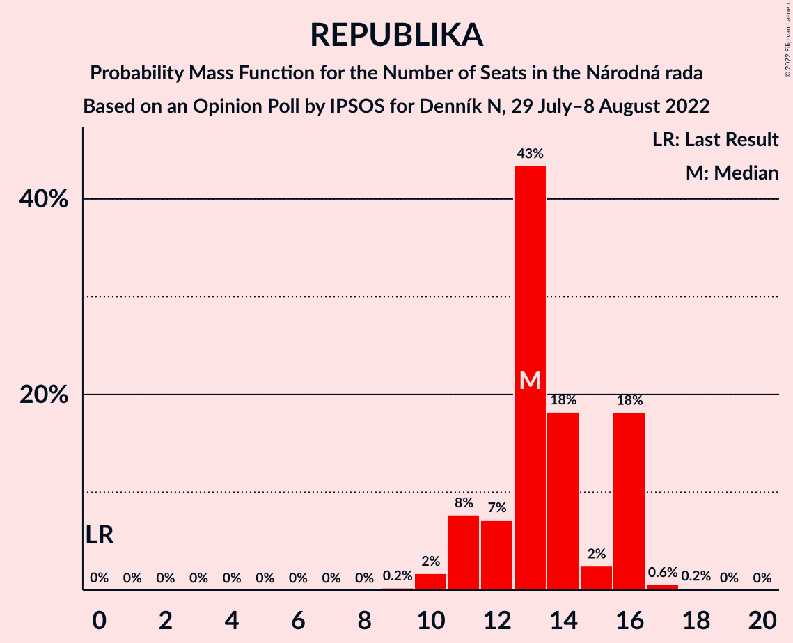
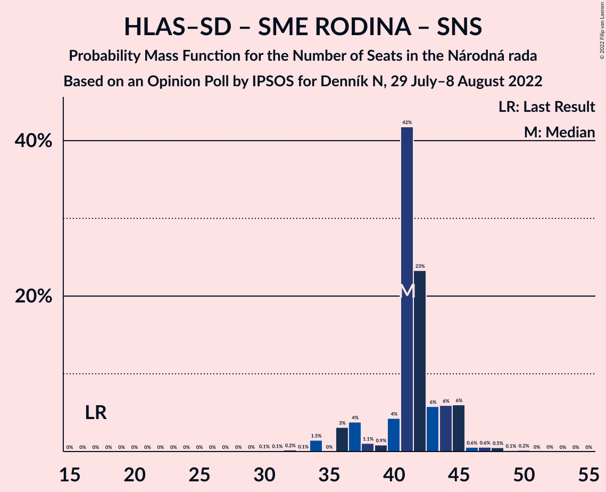

# Opinion Poll by IPSOS for Denník N, 29 July–8 August 2022

<a href="#voting-intentions">Voting Intentions</a> | <a href="#seats">Seats</a> | <a href="#coalitions">Coalitions</a> | <a href="#technical-information">Technical Information</a>

## Voting Intentions

### Confidence Intervals

| Party | Last Result | Poll Result | 80% Confidence Interval | 90% Confidence Interval | 95% Confidence Interval | 99% Confidence Interval |
|:-----:|:-----------:|:-----------:|:-----------------------:|:-----------------------:|:-----------------------:|:-----------------------:|
| HLAS–sociálna demokracia | 0.0% | 17.2% | 15.8–18.8% |15.4–19.3% |15.1–19.7% |14.4–20.5% |
| SMER–sociálna demokracia | 18.3% | 15.5% | 14.1–17.0% |13.8–17.5% |13.4–17.8% |12.8–18.6% |
| Sloboda a Solidarita | 6.2% | 12.2% | 11.0–13.6% |10.7–14.0% |10.4–14.4% |9.8–15.1% |
| Progresívne Slovensko | 7.0% | 11.4% | 10.2–12.7% |9.9–13.1% |9.6–13.5% |9.0–14.1% |
| OBYČAJNÍ ĽUDIA a nezávislé osobnosti | 25.0% | 7.8% | 6.8–9.0% |6.6–9.3% |6.3–9.6% |5.9–10.2% |
| REPUBLIKA | 0.0% | 7.3% | 6.4–8.5% |6.1–8.8% |5.9–9.1% |5.5–9.6% |
| SME RODINA | 8.2% | 6.4% | 5.5–7.4% |5.2–7.7% |5.0–8.0% |4.6–8.6% |
| Kresťanskodemokratické hnutie | 4.6% | 6.3% | 5.4–7.3% |5.2–7.6% |4.9–7.9% |4.6–8.5% |
| Za ľudí | 5.8% | 3.0% | 2.4–3.8% |2.2–4.0% |2.1–4.2% |1.9–4.6% |
| Kotleba–Ľudová strana Naše Slovensko | 8.0% | 2.9% | 2.3–3.7% |2.2–3.9% |2.0–4.1% |1.8–4.5% |
| Slovenská národná strana | 3.2% | 2.3% | 1.8–3.0% |1.7–3.2% |1.6–3.4% |1.3–3.8% |
| Strana maďarskej koalície–Magyar Koalíció Pártja | 3.9% | 2.1% | 1.6–2.8% |1.5–3.0% |1.4–3.2% |1.2–3.6% |

*Note:* The poll result column reflects the actual value used in the calculations. Published results may vary slightly, and in addition be rounded to fewer digits.

## Seats

### Confidence Intervals

| Party | Last Result | Median | 80% Confidence Interval | 90% Confidence Interval | 95% Confidence Interval | 99% Confidence Interval |
|:-----:|:-----------:|:------:|:-----------------------:|:-----------------------:|:-----------------------:|:-----------------------:|
| <a href="#hlas–sociálna-demokracia">HLAS–sociálna demokracia</a> | 0 | 30 | 28–33 |28–35 |27–36 |26–36 |
| <a href="#smer–sociálna-demokracia">SMER–sociálna demokracia</a> | 38 | 27 | 25–30 |24–31 |24–31 |24–32 |
| <a href="#sloboda-a-solidarita">Sloboda a Solidarita</a> | 13 | 23 | 20–24 |20–25 |19–25 |18–27 |
| <a href="#progresívne-slovensko">Progresívne Slovensko</a> | 0 | 20 | 18–22 |18–24 |18–25 |17–25 |
| <a href="#obyčajní-ľudia-a-nezávislé-osobnosti">OBYČAJNÍ ĽUDIA a nezávislé osobnosti</a> | 53 | 13 | 12–16 |11–17 |11–17 |10–18 |
| <a href="#republika">REPUBLIKA</a> | 0 | 13 | 12–16 |11–16 |11–16 |10–17 |
| <a href="#sme-rodina">SME RODINA</a> | 17 | 12 | 10–13 |0–13 |0–14 |0–15 |
| <a href="#kresťanskodemokratické-hnutie">Kresťanskodemokratické hnutie</a> | 0 | 12 | 10–12 |9–14 |0–14 |0–15 |
| <a href="#za-ľudí">Za ľudí</a> | 12 | 0 | 0 |0 |0 |0 |
| <a href="#kotleba–ľudová-strana-naše-slovensko">Kotleba–Ľudová strana Naše Slovensko</a> | 17 | 0 | 0 |0 |0 |0 |
| <a href="#slovenská-národná-strana">Slovenská národná strana</a> | 0 | 0 | 0 |0 |0 |0 |
| <a href="#strana-maďarskej-koalície–magyar-koalíció-pártja">Strana maďarskej koalície–Magyar Koalíció Pártja</a> | 0 | 0 | 0 |0 |0 |0 |

### HLAS–sociálna demokracia

*For a full overview of the results for this party, see the [HLAS–sociálna demokracia](party-hlas–sociálnademokracia.html) page.*

| Number of Seats | Probability | Accumulated | Special Marks |
|:---------------:|:-----------:|:-----------:|:-------------:|
| 0 | 0% | 100% | Last Result |
| 1 | 0% | 100% |  |
| 2 | 0% | 100% |  |
| 3 | 0% | 100% |  |
| 4 | 0% | 100% |  |
| 5 | 0% | 100% |  |
| 6 | 0% | 100% |  |
| 7 | 0% | 100% |  |
| 8 | 0% | 100% |  |
| 9 | 0% | 100% |  |
| 10 | 0% | 100% |  |
| 11 | 0% | 100% |  |
| 12 | 0% | 100% |  |
| 13 | 0% | 100% |  |
| 14 | 0% | 100% |  |
| 15 | 0% | 100% |  |
| 16 | 0% | 100% |  |
| 17 | 0% | 100% |  |
| 18 | 0% | 100% |  |
| 19 | 0% | 100% |  |
| 20 | 0% | 100% |  |
| 21 | 0% | 100% |  |
| 22 | 0% | 100% |  |
| 23 | 0% | 100% |  |
| 24 | 0% | 100% |  |
| 25 | 0.1% | 100% |  |
| 26 | 2% | 99.9% |  |
| 27 | 3% | 98% |  |
| 28 | 6% | 95% |  |
| 29 | 38% | 89% |  |
| 30 | 17% | 51% | Median |
| 31 | 13% | 34% |  |
| 32 | 9% | 21% |  |
| 33 | 4% | 13% |  |
| 34 | 2% | 9% |  |
| 35 | 2% | 6% |  |
| 36 | 4% | 4% |  |
| 37 | 0.1% | 0.3% |  |
| 38 | 0.2% | 0.2% |  |
| 39 | 0% | 0% |  |

### SMER–sociálna demokracia

*For a full overview of the results for this party, see the [SMER–sociálna demokracia](party-smer–sociálnademokracia.html) page.*

| Number of Seats | Probability | Accumulated | Special Marks |
|:---------------:|:-----------:|:-----------:|:-------------:|
| 22 | 0.1% | 100% |  |
| 23 | 0.1% | 99.9% |  |
| 24 | 6% | 99.8% |  |
| 25 | 6% | 94% |  |
| 26 | 5% | 88% |  |
| 27 | 42% | 83% | Median |
| 28 | 18% | 41% |  |
| 29 | 8% | 23% |  |
| 30 | 9% | 15% |  |
| 31 | 4% | 6% |  |
| 32 | 2% | 2% |  |
| 33 | 0.3% | 0.4% |  |
| 34 | 0% | 0.1% |  |
| 35 | 0% | 0.1% |  |
| 36 | 0% | 0% |  |
| 37 | 0% | 0% |  |
| 38 | 0% | 0% | Last Result |

### Sloboda a Solidarita

*For a full overview of the results for this party, see the [Sloboda a Solidarita](party-slobodaasolidarita.html) page.*

| Number of Seats | Probability | Accumulated | Special Marks |
|:---------------:|:-----------:|:-----------:|:-------------:|
| 13 | 0% | 100% | Last Result |
| 14 | 0% | 100% |  |
| 15 | 0% | 100% |  |
| 16 | 0.1% | 100% |  |
| 17 | 0.3% | 99.9% |  |
| 18 | 1.2% | 99.6% |  |
| 19 | 2% | 98% |  |
| 20 | 21% | 96% |  |
| 21 | 8% | 75% |  |
| 22 | 16% | 67% |  |
| 23 | 6% | 51% | Median |
| 24 | 40% | 45% |  |
| 25 | 4% | 5% |  |
| 26 | 0.3% | 1.2% |  |
| 27 | 0.5% | 0.9% |  |
| 28 | 0.3% | 0.4% |  |
| 29 | 0.1% | 0.1% |  |
| 30 | 0% | 0% |  |

### Progresívne Slovensko

*For a full overview of the results for this party, see the [Progresívne Slovensko](party-progresívneslovensko.html) page.*

| Number of Seats | Probability | Accumulated | Special Marks |
|:---------------:|:-----------:|:-----------:|:-------------:|
| 0 | 0% | 100% | Last Result |
| 1 | 0% | 100% |  |
| 2 | 0% | 100% |  |
| 3 | 0% | 100% |  |
| 4 | 0% | 100% |  |
| 5 | 0% | 100% |  |
| 6 | 0% | 100% |  |
| 7 | 0% | 100% |  |
| 8 | 0% | 100% |  |
| 9 | 0% | 100% |  |
| 10 | 0% | 100% |  |
| 11 | 0% | 100% |  |
| 12 | 0% | 100% |  |
| 13 | 0% | 100% |  |
| 14 | 0% | 100% |  |
| 15 | 0% | 100% |  |
| 16 | 0.3% | 100% |  |
| 17 | 2% | 99.7% |  |
| 18 | 8% | 98% |  |
| 19 | 9% | 90% |  |
| 20 | 54% | 81% | Median |
| 21 | 8% | 27% |  |
| 22 | 10% | 19% |  |
| 23 | 4% | 9% |  |
| 24 | 2% | 5% |  |
| 25 | 2% | 3% |  |
| 26 | 0.2% | 0.4% |  |
| 27 | 0% | 0.1% |  |
| 28 | 0.1% | 0.1% |  |
| 29 | 0% | 0% |  |

### OBYČAJNÍ ĽUDIA a nezávislé osobnosti

*For a full overview of the results for this party, see the [OBYČAJNÍ ĽUDIA a nezávislé osobnosti](party-obyčajníľudiaanezávisléosobnosti.html) page.*

| Number of Seats | Probability | Accumulated | Special Marks |
|:---------------:|:-----------:|:-----------:|:-------------:|
| 9 | 0.1% | 100% |  |
| 10 | 0.6% | 99.9% |  |
| 11 | 5% | 99.4% |  |
| 12 | 4% | 94% |  |
| 13 | 54% | 90% | Median |
| 14 | 11% | 36% |  |
| 15 | 10% | 25% |  |
| 16 | 10% | 15% |  |
| 17 | 4% | 5% |  |
| 18 | 0.9% | 1.2% |  |
| 19 | 0.3% | 0.3% |  |
| 20 | 0% | 0% |  |
| 21 | 0% | 0% |  |
| 22 | 0% | 0% |  |
| 23 | 0% | 0% |  |
| 24 | 0% | 0% |  |
| 25 | 0% | 0% |  |
| 26 | 0% | 0% |  |
| 27 | 0% | 0% |  |
| 28 | 0% | 0% |  |
| 29 | 0% | 0% |  |
| 30 | 0% | 0% |  |
| 31 | 0% | 0% |  |
| 32 | 0% | 0% |  |
| 33 | 0% | 0% |  |
| 34 | 0% | 0% |  |
| 35 | 0% | 0% |  |
| 36 | 0% | 0% |  |
| 37 | 0% | 0% |  |
| 38 | 0% | 0% |  |
| 39 | 0% | 0% |  |
| 40 | 0% | 0% |  |
| 41 | 0% | 0% |  |
| 42 | 0% | 0% |  |
| 43 | 0% | 0% |  |
| 44 | 0% | 0% |  |
| 45 | 0% | 0% |  |
| 46 | 0% | 0% |  |
| 47 | 0% | 0% |  |
| 48 | 0% | 0% |  |
| 49 | 0% | 0% |  |
| 50 | 0% | 0% |  |
| 51 | 0% | 0% |  |
| 52 | 0% | 0% |  |
| 53 | 0% | 0% | Last Result |

### REPUBLIKA

*For a full overview of the results for this party, see the [REPUBLIKA](party-republika.html) page.*

| Number of Seats | Probability | Accumulated | Special Marks |
|:---------------:|:-----------:|:-----------:|:-------------:|
| 0 | 0% | 100% | Last Result |
| 1 | 0% | 100% |  |
| 2 | 0% | 100% |  |
| 3 | 0% | 100% |  |
| 4 | 0% | 100% |  |
| 5 | 0% | 100% |  |
| 6 | 0% | 100% |  |
| 7 | 0% | 100% |  |
| 8 | 0% | 100% |  |
| 9 | 0.2% | 100% |  |
| 10 | 2% | 99.7% |  |
| 11 | 8% | 98% |  |
| 12 | 7% | 90% |  |
| 13 | 43% | 83% | Median |
| 14 | 18% | 40% |  |
| 15 | 2% | 21% |  |
| 16 | 18% | 19% |  |
| 17 | 0.6% | 0.8% |  |
| 18 | 0.2% | 0.3% |  |
| 19 | 0% | 0% |  |

### SME RODINA

*For a full overview of the results for this party, see the [SME RODINA](party-smerodina.html) page.*

| Number of Seats | Probability | Accumulated | Special Marks |
|:---------------:|:-----------:|:-----------:|:-------------:|
| 0 | 5% | 100% |  |
| 1 | 0% | 95% |  |
| 2 | 0% | 95% |  |
| 3 | 0% | 95% |  |
| 4 | 0% | 95% |  |
| 5 | 0% | 95% |  |
| 6 | 0% | 95% |  |
| 7 | 0% | 95% |  |
| 8 | 0% | 95% |  |
| 9 | 2% | 95% |  |
| 10 | 7% | 93% |  |
| 11 | 22% | 86% |  |
| 12 | 53% | 64% | Median |
| 13 | 8% | 11% |  |
| 14 | 2% | 3% |  |
| 15 | 0.9% | 1.0% |  |
| 16 | 0.1% | 0.1% |  |
| 17 | 0% | 0% | Last Result |

### Kresťanskodemokratické hnutie

*For a full overview of the results for this party, see the [Kresťanskodemokratické hnutie](party-kresťanskodemokratickéhnutie.html) page.*

| Number of Seats | Probability | Accumulated | Special Marks |
|:---------------:|:-----------:|:-----------:|:-------------:|
| 0 | 3% | 100% | Last Result |
| 1 | 0% | 97% |  |
| 2 | 0% | 97% |  |
| 3 | 0% | 97% |  |
| 4 | 0% | 97% |  |
| 5 | 0% | 97% |  |
| 6 | 0% | 97% |  |
| 7 | 0% | 97% |  |
| 8 | 0% | 97% |  |
| 9 | 2% | 97% |  |
| 10 | 14% | 94% |  |
| 11 | 18% | 80% |  |
| 12 | 53% | 62% | Median |
| 13 | 3% | 9% |  |
| 14 | 4% | 6% |  |
| 15 | 2% | 2% |  |
| 16 | 0.1% | 0.1% |  |
| 17 | 0% | 0% |  |

### Za ľudí

*For a full overview of the results for this party, see the [Za ľudí](party-zaľudí.html) page.*

| Number of Seats | Probability | Accumulated | Special Marks |
|:---------------:|:-----------:|:-----------:|:-------------:|
| 0 | 100% | 100% | Median |
| 1 | 0% | 0% |  |
| 2 | 0% | 0% |  |
| 3 | 0% | 0% |  |
| 4 | 0% | 0% |  |
| 5 | 0% | 0% |  |
| 6 | 0% | 0% |  |
| 7 | 0% | 0% |  |
| 8 | 0% | 0% |  |
| 9 | 0% | 0% |  |
| 10 | 0% | 0% |  |
| 11 | 0% | 0% |  |
| 12 | 0% | 0% | Last Result |

### Kotleba–Ľudová strana Naše Slovensko

*For a full overview of the results for this party, see the [Kotleba–Ľudová strana Naše Slovensko](party-kotleba–ľudovástrananašeslovensko.html) page.*

| Number of Seats | Probability | Accumulated | Special Marks |
|:---------------:|:-----------:|:-----------:|:-------------:|
| 0 | 100% | 100% | Median |
| 1 | 0% | 0% |  |
| 2 | 0% | 0% |  |
| 3 | 0% | 0% |  |
| 4 | 0% | 0% |  |
| 5 | 0% | 0% |  |
| 6 | 0% | 0% |  |
| 7 | 0% | 0% |  |
| 8 | 0% | 0% |  |
| 9 | 0% | 0% |  |
| 10 | 0% | 0% |  |
| 11 | 0% | 0% |  |
| 12 | 0% | 0% |  |
| 13 | 0% | 0% |  |
| 14 | 0% | 0% |  |
| 15 | 0% | 0% |  |
| 16 | 0% | 0% |  |
| 17 | 0% | 0% | Last Result |

### Slovenská národná strana

*For a full overview of the results for this party, see the [Slovenská národná strana](party-slovenskánárodnástrana.html) page.*

| Number of Seats | Probability | Accumulated | Special Marks |
|:---------------:|:-----------:|:-----------:|:-------------:|
| 0 | 100% | 100% | Last Result, Median |

### Strana maďarskej koalície–Magyar Koalíció Pártja

*For a full overview of the results for this party, see the [Strana maďarskej koalície–Magyar Koalíció Pártja](party-stranamaďarskejkoalície–magyarkoalíciópártja.html) page.*

| Number of Seats | Probability | Accumulated | Special Marks |
|:---------------:|:-----------:|:-----------:|:-------------:|
| 0 | 100% | 100% | Last Result, Median |

## Coalitions

### Confidence Intervals

| Coalition | Last Result | Median | Majority? | 80% Confidence Interval | 90% Confidence Interval | 95% Confidence Interval | 99% Confidence Interval |
|:---------:|:-----------:|:------:|:---------:|:-----------------------:|:-----------------------:|:-----------------------:|:-----------------------:|
| HLAS–sociálna demokracia – SMER–sociálna demokracia – SME RODINA – Kotleba–Ľudová strana Naše Slovensko – Slovenská národná strana | 72 | 68 | 0.9% | 66–72 | 64–74 | 64–74 | 62–77 |
| HLAS–sociálna demokracia – SMER–sociálna demokracia – SME RODINA | 55 | 68 | 0.8% | 66–72 | 64–74 | 64–74 | 62–77 |
| HLAS–sociálna demokracia – SMER–sociálna demokracia – SME RODINA – Slovenská národná strana | 55 | 68 | 0.8% | 66–72 | 64–74 | 64–74 | 62–77 |
| HLAS–sociálna demokracia – SMER–sociálna demokracia – Slovenská národná strana | 38 | 56 | 0% | 54–62 | 53–64 | 53–66 | 52–66 |
| HLAS–sociálna demokracia – SME RODINA – Kotleba–Ľudová strana Naše Slovensko – Slovenská národná strana | 34 | 41 | 0% | 39–44 | 36–45 | 36–45 | 33–48 |
| HLAS–sociálna demokracia – SME RODINA | 17 | 41 | 0% | 39–44 | 36–45 | 36–45 | 33–48 |
| HLAS–sociálna demokracia – SME RODINA – Slovenská národná strana | 17 | 41 | 0% | 39–44 | 36–45 | 36–45 | 33–48 |
| SMER–sociálna demokracia – SME RODINA – Kotleba–Ľudová strana Naše Slovensko – Slovenská národná strana | 72 | 39 | 0% | 36–42 | 32–42 | 30–43 | 27–44 |
| SMER–sociálna demokracia – SME RODINA | 55 | 39 | 0% | 36–42 | 32–42 | 30–43 | 27–44 |
| SMER–sociálna demokracia – SME RODINA – Slovenská národná strana | 55 | 39 | 0% | 36–42 | 32–42 | 30–43 | 27–44 |
| HLAS–sociálna demokracia – Slovenská národná strana | 0 | 30 | 0% | 28–33 | 28–35 | 27–36 | 26–36 |
| SMER–sociálna demokracia | 38 | 27 | 0% | 25–30 | 24–31 | 24–31 | 24–32 |
| SMER–sociálna demokracia – Slovenská národná strana | 38 | 27 | 0% | 25–30 | 24–31 | 24–31 | 24–32 |

### HLAS–sociálna demokracia – SMER–sociálna demokracia – SME RODINA – Kotleba–Ľudová strana Naše Slovensko – Slovenská národná strana

| Number of Seats | Probability | Accumulated | Special Marks |
|:---------------:|:-----------:|:-----------:|:-------------:|
| 59 | 0.3% | 100% |  |
| 60 | 0.1% | 99.7% |  |
| 61 | 0.1% | 99.6% |  |
| 62 | 1.1% | 99.5% |  |
| 63 | 0.7% | 98% |  |
| 64 | 3% | 98% |  |
| 65 | 2% | 95% |  |
| 66 | 9% | 92% |  |
| 67 | 2% | 83% |  |
| 68 | 38% | 81% |  |
| 69 | 9% | 43% | Median |
| 70 | 13% | 34% |  |
| 71 | 2% | 21% |  |
| 72 | 9% | 19% | Last Result |
| 73 | 0.4% | 9% |  |
| 74 | 7% | 9% |  |
| 75 | 1.2% | 2% |  |
| 76 | 0.3% | 0.9% | Majority |
| 77 | 0.2% | 0.6% |  |
| 78 | 0.1% | 0.4% |  |
| 79 | 0.2% | 0.3% |  |
| 80 | 0% | 0.1% |  |
| 81 | 0.1% | 0.1% |  |
| 82 | 0% | 0% |  |

### HLAS–sociálna demokracia – SMER–sociálna demokracia – SME RODINA

| Number of Seats | Probability | Accumulated | Special Marks |
|:---------------:|:-----------:|:-----------:|:-------------:|
| 55 | 0% | 100% | Last Result |
| 56 | 0% | 100% |  |
| 57 | 0% | 100% |  |
| 58 | 0% | 100% |  |
| 59 | 0.3% | 100% |  |
| 60 | 0.1% | 99.7% |  |
| 61 | 0.1% | 99.6% |  |
| 62 | 1.1% | 99.5% |  |
| 63 | 0.7% | 98% |  |
| 64 | 3% | 98% |  |
| 65 | 2% | 95% |  |
| 66 | 9% | 92% |  |
| 67 | 2% | 83% |  |
| 68 | 38% | 81% |  |
| 69 | 9% | 43% | Median |
| 70 | 13% | 34% |  |
| 71 | 2% | 21% |  |
| 72 | 9% | 19% |  |
| 73 | 0.4% | 9% |  |
| 74 | 7% | 9% |  |
| 75 | 1.2% | 2% |  |
| 76 | 0.3% | 0.8% | Majority |
| 77 | 0.2% | 0.6% |  |
| 78 | 0.1% | 0.4% |  |
| 79 | 0.2% | 0.3% |  |
| 80 | 0% | 0.1% |  |
| 81 | 0.1% | 0.1% |  |
| 82 | 0% | 0% |  |

### HLAS–sociálna demokracia – SMER–sociálna demokracia – SME RODINA – Slovenská národná strana

| Number of Seats | Probability | Accumulated | Special Marks |
|:---------------:|:-----------:|:-----------:|:-------------:|
| 55 | 0% | 100% | Last Result |
| 56 | 0% | 100% |  |
| 57 | 0% | 100% |  |
| 58 | 0% | 100% |  |
| 59 | 0.3% | 100% |  |
| 60 | 0.1% | 99.7% |  |
| 61 | 0.1% | 99.6% |  |
| 62 | 1.1% | 99.5% |  |
| 63 | 0.7% | 98% |  |
| 64 | 3% | 98% |  |
| 65 | 2% | 95% |  |
| 66 | 9% | 92% |  |
| 67 | 2% | 83% |  |
| 68 | 38% | 81% |  |
| 69 | 9% | 43% | Median |
| 70 | 13% | 34% |  |
| 71 | 2% | 21% |  |
| 72 | 9% | 19% |  |
| 73 | 0.4% | 9% |  |
| 74 | 7% | 9% |  |
| 75 | 1.2% | 2% |  |
| 76 | 0.3% | 0.8% | Majority |
| 77 | 0.2% | 0.6% |  |
| 78 | 0.1% | 0.4% |  |
| 79 | 0.2% | 0.3% |  |
| 80 | 0% | 0.1% |  |
| 81 | 0.1% | 0.1% |  |
| 82 | 0% | 0% |  |

### HLAS–sociálna demokracia – SMER–sociálna demokracia – Slovenská národná strana

| Number of Seats | Probability | Accumulated | Special Marks |
|:---------------:|:-----------:|:-----------:|:-------------:|
| 38 | 0% | 100% | Last Result |
| 39 | 0% | 100% |  |
| 40 | 0% | 100% |  |
| 41 | 0% | 100% |  |
| 42 | 0% | 100% |  |
| 43 | 0% | 100% |  |
| 44 | 0% | 100% |  |
| 45 | 0% | 100% |  |
| 46 | 0% | 100% |  |
| 47 | 0% | 100% |  |
| 48 | 0% | 100% |  |
| 49 | 0% | 100% |  |
| 50 | 0% | 100% |  |
| 51 | 0.1% | 100% |  |
| 52 | 1.1% | 99.8% |  |
| 53 | 4% | 98.7% |  |
| 54 | 6% | 95% |  |
| 55 | 4% | 89% |  |
| 56 | 38% | 85% |  |
| 57 | 2% | 47% | Median |
| 58 | 8% | 45% |  |
| 59 | 15% | 38% |  |
| 60 | 7% | 23% |  |
| 61 | 3% | 16% |  |
| 62 | 4% | 13% |  |
| 63 | 2% | 9% |  |
| 64 | 3% | 7% |  |
| 65 | 2% | 5% |  |
| 66 | 2% | 3% |  |
| 67 | 0.1% | 0.5% |  |
| 68 | 0.4% | 0.4% |  |
| 69 | 0% | 0% |  |

### HLAS–sociálna demokracia – SME RODINA – Kotleba–Ľudová strana Naše Slovensko – Slovenská národná strana

| Number of Seats | Probability | Accumulated | Special Marks |
|:---------------:|:-----------:|:-----------:|:-------------:|
| 30 | 0.1% | 100% |  |
| 31 | 0.1% | 99.9% |  |
| 32 | 0.2% | 99.8% |  |
| 33 | 0.1% | 99.5% |  |
| 34 | 1.5% | 99.5% | Last Result |
| 35 | 0% | 98% |  |
| 36 | 3% | 98% |  |
| 37 | 4% | 95% |  |
| 38 | 1.1% | 91% |  |
| 39 | 0.9% | 90% |  |
| 40 | 4% | 89% |  |
| 41 | 42% | 85% |  |
| 42 | 23% | 43% | Median |
| 43 | 6% | 20% |  |
| 44 | 6% | 14% |  |
| 45 | 6% | 8% |  |
| 46 | 0.6% | 2% |  |
| 47 | 0.6% | 1.5% |  |
| 48 | 0.5% | 0.9% |  |
| 49 | 0.2% | 0.4% |  |
| 50 | 0.2% | 0.2% |  |
| 51 | 0% | 0.1% |  |
| 52 | 0% | 0% |  |

### HLAS–sociálna demokracia – SME RODINA

| Number of Seats | Probability | Accumulated | Special Marks |
|:---------------:|:-----------:|:-----------:|:-------------:|
| 17 | 0% | 100% | Last Result |
| 18 | 0% | 100% |  |
| 19 | 0% | 100% |  |
| 20 | 0% | 100% |  |
| 21 | 0% | 100% |  |
| 22 | 0% | 100% |  |
| 23 | 0% | 100% |  |
| 24 | 0% | 100% |  |
| 25 | 0% | 100% |  |
| 26 | 0% | 100% |  |
| 27 | 0% | 100% |  |
| 28 | 0% | 100% |  |
| 29 | 0% | 100% |  |
| 30 | 0.1% | 100% |  |
| 31 | 0.1% | 99.9% |  |
| 32 | 0.2% | 99.8% |  |
| 33 | 0.1% | 99.5% |  |
| 34 | 1.5% | 99.5% |  |
| 35 | 0% | 98% |  |
| 36 | 3% | 98% |  |
| 37 | 4% | 95% |  |
| 38 | 1.1% | 91% |  |
| 39 | 0.9% | 90% |  |
| 40 | 4% | 89% |  |
| 41 | 42% | 85% |  |
| 42 | 23% | 43% | Median |
| 43 | 6% | 20% |  |
| 44 | 6% | 14% |  |
| 45 | 6% | 8% |  |
| 46 | 0.6% | 2% |  |
| 47 | 0.6% | 1.5% |  |
| 48 | 0.5% | 0.9% |  |
| 49 | 0.1% | 0.4% |  |
| 50 | 0.2% | 0.2% |  |
| 51 | 0% | 0% |  |

### HLAS–sociálna demokracia – SME RODINA – Slovenská národná strana

| Number of Seats | Probability | Accumulated | Special Marks |
|:---------------:|:-----------:|:-----------:|:-------------:|
| 17 | 0% | 100% | Last Result |
| 18 | 0% | 100% |  |
| 19 | 0% | 100% |  |
| 20 | 0% | 100% |  |
| 21 | 0% | 100% |  |
| 22 | 0% | 100% |  |
| 23 | 0% | 100% |  |
| 24 | 0% | 100% |  |
| 25 | 0% | 100% |  |
| 26 | 0% | 100% |  |
| 27 | 0% | 100% |  |
| 28 | 0% | 100% |  |
| 29 | 0% | 100% |  |
| 30 | 0.1% | 100% |  |
| 31 | 0.1% | 99.9% |  |
| 32 | 0.2% | 99.8% |  |
| 33 | 0.1% | 99.5% |  |
| 34 | 1.5% | 99.5% |  |
| 35 | 0% | 98% |  |
| 36 | 3% | 98% |  |
| 37 | 4% | 95% |  |
| 38 | 1.1% | 91% |  |
| 39 | 0.9% | 90% |  |
| 40 | 4% | 89% |  |
| 41 | 42% | 85% |  |
| 42 | 23% | 43% | Median |
| 43 | 6% | 20% |  |
| 44 | 6% | 14% |  |
| 45 | 6% | 8% |  |
| 46 | 0.6% | 2% |  |
| 47 | 0.6% | 1.5% |  |
| 48 | 0.5% | 0.9% |  |
| 49 | 0.1% | 0.4% |  |
| 50 | 0.2% | 0.2% |  |
| 51 | 0% | 0% |  |

### SMER–sociálna demokracia – SME RODINA – Kotleba–Ľudová strana Naše Slovensko – Slovenská národná strana

| Number of Seats | Probability | Accumulated | Special Marks |
|:---------------:|:-----------:|:-----------:|:-------------:|
| 27 | 0.7% | 100% |  |
| 28 | 0.2% | 99.3% |  |
| 29 | 0.1% | 99.1% |  |
| 30 | 2% | 99.0% |  |
| 31 | 1.5% | 97% |  |
| 32 | 0.1% | 95% |  |
| 33 | 0.2% | 95% |  |
| 34 | 0.3% | 95% |  |
| 35 | 1.5% | 95% |  |
| 36 | 7% | 93% |  |
| 37 | 5% | 86% |  |
| 38 | 6% | 81% |  |
| 39 | 53% | 75% | Median |
| 40 | 4% | 22% |  |
| 41 | 8% | 19% |  |
| 42 | 7% | 11% |  |
| 43 | 2% | 4% |  |
| 44 | 2% | 2% |  |
| 45 | 0.2% | 0.5% |  |
| 46 | 0.2% | 0.3% |  |
| 47 | 0% | 0.1% |  |
| 48 | 0% | 0% |  |
| 49 | 0% | 0% |  |
| 50 | 0% | 0% |  |
| 51 | 0% | 0% |  |
| 52 | 0% | 0% |  |
| 53 | 0% | 0% |  |
| 54 | 0% | 0% |  |
| 55 | 0% | 0% |  |
| 56 | 0% | 0% |  |
| 57 | 0% | 0% |  |
| 58 | 0% | 0% |  |
| 59 | 0% | 0% |  |
| 60 | 0% | 0% |  |
| 61 | 0% | 0% |  |
| 62 | 0% | 0% |  |
| 63 | 0% | 0% |  |
| 64 | 0% | 0% |  |
| 65 | 0% | 0% |  |
| 66 | 0% | 0% |  |
| 67 | 0% | 0% |  |
| 68 | 0% | 0% |  |
| 69 | 0% | 0% |  |
| 70 | 0% | 0% |  |
| 71 | 0% | 0% |  |
| 72 | 0% | 0% | Last Result |

### SMER–sociálna demokracia – SME RODINA

| Number of Seats | Probability | Accumulated | Special Marks |
|:---------------:|:-----------:|:-----------:|:-------------:|
| 27 | 0.7% | 100% |  |
| 28 | 0.2% | 99.3% |  |
| 29 | 0.1% | 99.1% |  |
| 30 | 2% | 99.0% |  |
| 31 | 1.5% | 97% |  |
| 32 | 0.1% | 95% |  |
| 33 | 0.2% | 95% |  |
| 34 | 0.3% | 95% |  |
| 35 | 1.5% | 95% |  |
| 36 | 7% | 93% |  |
| 37 | 5% | 86% |  |
| 38 | 6% | 81% |  |
| 39 | 53% | 75% | Median |
| 40 | 4% | 22% |  |
| 41 | 8% | 19% |  |
| 42 | 7% | 11% |  |
| 43 | 2% | 4% |  |
| 44 | 2% | 2% |  |
| 45 | 0.2% | 0.5% |  |
| 46 | 0.2% | 0.3% |  |
| 47 | 0% | 0.1% |  |
| 48 | 0% | 0% |  |
| 49 | 0% | 0% |  |
| 50 | 0% | 0% |  |
| 51 | 0% | 0% |  |
| 52 | 0% | 0% |  |
| 53 | 0% | 0% |  |
| 54 | 0% | 0% |  |
| 55 | 0% | 0% | Last Result |

### SMER–sociálna demokracia – SME RODINA – Slovenská národná strana

| Number of Seats | Probability | Accumulated | Special Marks |
|:---------------:|:-----------:|:-----------:|:-------------:|
| 27 | 0.7% | 100% |  |
| 28 | 0.2% | 99.3% |  |
| 29 | 0.1% | 99.1% |  |
| 30 | 2% | 99.0% |  |
| 31 | 1.5% | 97% |  |
| 32 | 0.1% | 95% |  |
| 33 | 0.2% | 95% |  |
| 34 | 0.3% | 95% |  |
| 35 | 1.5% | 95% |  |
| 36 | 7% | 93% |  |
| 37 | 5% | 86% |  |
| 38 | 6% | 81% |  |
| 39 | 53% | 75% | Median |
| 40 | 4% | 22% |  |
| 41 | 8% | 19% |  |
| 42 | 7% | 11% |  |
| 43 | 2% | 4% |  |
| 44 | 2% | 2% |  |
| 45 | 0.2% | 0.5% |  |
| 46 | 0.2% | 0.3% |  |
| 47 | 0% | 0.1% |  |
| 48 | 0% | 0% |  |
| 49 | 0% | 0% |  |
| 50 | 0% | 0% |  |
| 51 | 0% | 0% |  |
| 52 | 0% | 0% |  |
| 53 | 0% | 0% |  |
| 54 | 0% | 0% |  |
| 55 | 0% | 0% | Last Result |

### HLAS–sociálna demokracia – Slovenská národná strana

| Number of Seats | Probability | Accumulated | Special Marks |
|:---------------:|:-----------:|:-----------:|:-------------:|
| 0 | 0% | 100% | Last Result |
| 1 | 0% | 100% |  |
| 2 | 0% | 100% |  |
| 3 | 0% | 100% |  |
| 4 | 0% | 100% |  |
| 5 | 0% | 100% |  |
| 6 | 0% | 100% |  |
| 7 | 0% | 100% |  |
| 8 | 0% | 100% |  |
| 9 | 0% | 100% |  |
| 10 | 0% | 100% |  |
| 11 | 0% | 100% |  |
| 12 | 0% | 100% |  |
| 13 | 0% | 100% |  |
| 14 | 0% | 100% |  |
| 15 | 0% | 100% |  |
| 16 | 0% | 100% |  |
| 17 | 0% | 100% |  |
| 18 | 0% | 100% |  |
| 19 | 0% | 100% |  |
| 20 | 0% | 100% |  |
| 21 | 0% | 100% |  |
| 22 | 0% | 100% |  |
| 23 | 0% | 100% |  |
| 24 | 0% | 100% |  |
| 25 | 0.1% | 100% |  |
| 26 | 2% | 99.9% |  |
| 27 | 3% | 98% |  |
| 28 | 6% | 95% |  |
| 29 | 38% | 89% |  |
| 30 | 17% | 51% | Median |
| 31 | 13% | 34% |  |
| 32 | 9% | 21% |  |
| 33 | 4% | 13% |  |
| 34 | 2% | 9% |  |
| 35 | 2% | 6% |  |
| 36 | 4% | 4% |  |
| 37 | 0.1% | 0.3% |  |
| 38 | 0.2% | 0.2% |  |
| 39 | 0% | 0% |  |

### SMER–sociálna demokracia

| Number of Seats | Probability | Accumulated | Special Marks |
|:---------------:|:-----------:|:-----------:|:-------------:|
| 22 | 0.1% | 100% |  |
| 23 | 0.1% | 99.9% |  |
| 24 | 6% | 99.8% |  |
| 25 | 6% | 94% |  |
| 26 | 5% | 88% |  |
| 27 | 42% | 83% | Median |
| 28 | 18% | 41% |  |
| 29 | 8% | 23% |  |
| 30 | 9% | 15% |  |
| 31 | 4% | 6% |  |
| 32 | 2% | 2% |  |
| 33 | 0.3% | 0.4% |  |
| 34 | 0% | 0.1% |  |
| 35 | 0% | 0.1% |  |
| 36 | 0% | 0% |  |
| 37 | 0% | 0% |  |
| 38 | 0% | 0% | Last Result |

### SMER–sociálna demokracia – Slovenská národná strana

| Number of Seats | Probability | Accumulated | Special Marks |
|:---------------:|:-----------:|:-----------:|:-------------:|
| 22 | 0.1% | 100% |  |
| 23 | 0.1% | 99.9% |  |
| 24 | 6% | 99.8% |  |
| 25 | 6% | 94% |  |
| 26 | 5% | 88% |  |
| 27 | 42% | 83% | Median |
| 28 | 18% | 41% |  |
| 29 | 8% | 23% |  |
| 30 | 9% | 15% |  |
| 31 | 4% | 6% |  |
| 32 | 2% | 2% |  |
| 33 | 0.3% | 0.4% |  |
| 34 | 0% | 0.1% |  |
| 35 | 0% | 0.1% |  |
| 36 | 0% | 0% |  |
| 37 | 0% | 0% |  |
| 38 | 0% | 0% | Last Result |

## Technical Information

### Opinion Poll

+ **Polling firm:** IPSOS
+ **Commissioner(s):** Denník N
+ **Fieldwork period:** 29 July–8 August 2022

### Calculations

+ **Sample size:** 1038
+ **Simulations done:** 1,048,576
+ **Error estimate:** 2.56%

