# Opinion Poll by AKO for TV JOJ, 15–18 August 2022

<a href="#voting-intentions">Voting Intentions</a> | <a href="#seats">Seats</a> | <a href="#coalitions">Coalitions</a> | <a href="#technical-information">Technical Information</a>

## Voting Intentions

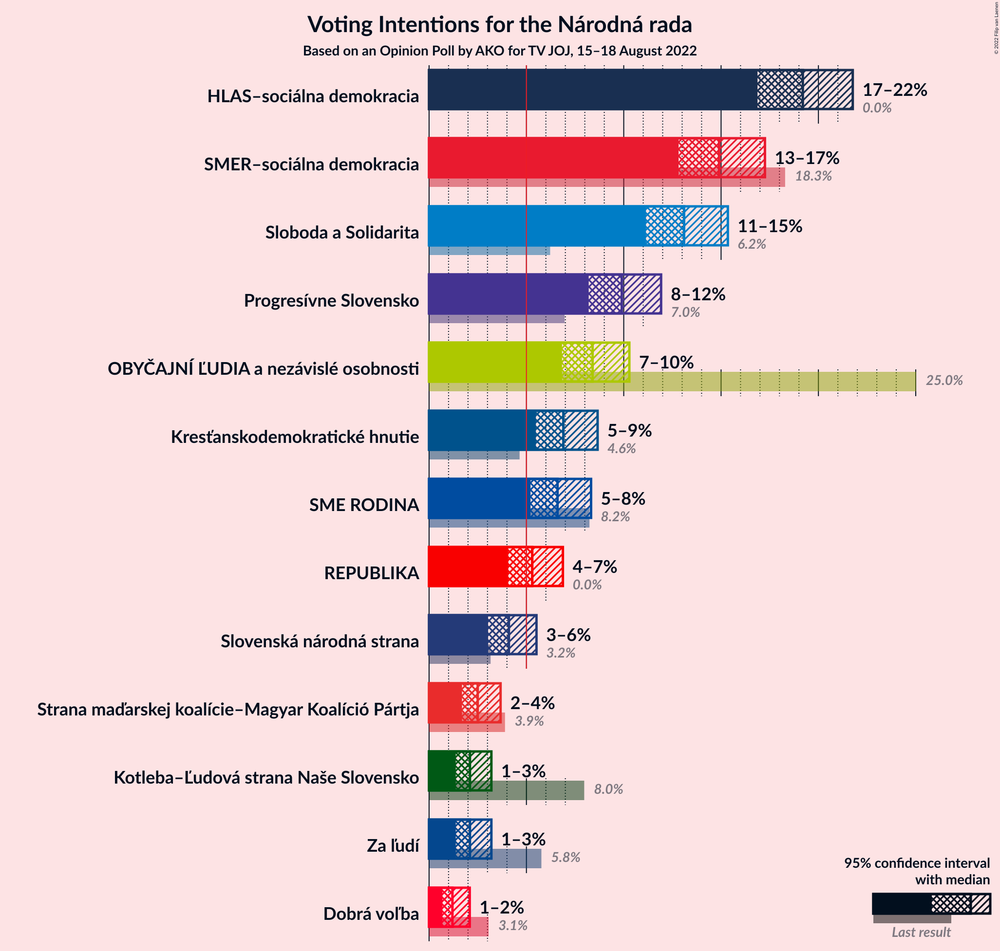

### Confidence Intervals

| Party | Last Result | Poll Result | 80% Confidence Interval | 90% Confidence Interval | 95% Confidence Interval | 99% Confidence Interval |
|:-----:|:-----------:|:-----------:|:-----------------------:|:-----------------------:|:-----------------------:|:-----------------------:|
| HLAS–sociálna demokracia | 0.0% | 19.2% | 17.7–20.9% |17.2–21.4% |16.9–21.8% |16.2–22.6% |
| SMER–sociálna demokracia | 18.3% | 14.9% | 13.5–16.4% |13.2–16.9% |12.8–17.3% |12.2–18.0% |
| Sloboda a Solidarita | 6.2% | 13.1% | 11.8–14.6% |11.4–15.0% |11.1–15.3% |10.6–16.1% |
| Progresívne Slovensko | 7.0% | 9.9% | 8.8–11.2% |8.5–11.6% |8.2–11.9% |7.7–12.6% |
| OBYČAJNÍ ĽUDIA a nezávislé osobnosti | 25.0% | 8.4% | 7.4–9.6% |7.1–10.0% |6.8–10.3% |6.4–10.9% |
| Kresťanskodemokratické hnutie | 4.6% | 6.9% | 6.0–8.0% |5.7–8.4% |5.5–8.7% |5.1–9.2% |
| SME RODINA | 8.2% | 6.6% | 5.7–7.7% |5.4–8.0% |5.2–8.3% |4.8–8.9% |
| REPUBLIKA | 0.0% | 5.3% | 4.5–6.3% |4.3–6.6% |4.1–6.9% |3.7–7.4% |
| Slovenská národná strana | 3.2% | 4.1% | 3.4–5.0% |3.2–5.3% |3.0–5.5% |2.7–6.0% |
| Strana maďarskej koalície–Magyar Koalíció Pártja | 3.9% | 2.5% | 2.0–3.3% |1.8–3.5% |1.7–3.7% |1.5–4.1% |
| Kotleba–Ľudová strana Naše Slovensko | 8.0% | 2.1% | 1.6–2.8% |1.5–3.0% |1.4–3.2% |1.2–3.6% |
| Za ľudí | 5.8% | 2.1% | 1.6–2.8% |1.5–3.0% |1.4–3.2% |1.2–3.6% |
| Dobrá voľba | 3.1% | 1.2% | 0.9–1.8% |0.8–1.9% |0.7–2.1% |0.5–2.4% |

*Note:* The poll result column reflects the actual value used in the calculations. Published results may vary slightly, and in addition be rounded to fewer digits.

## Seats

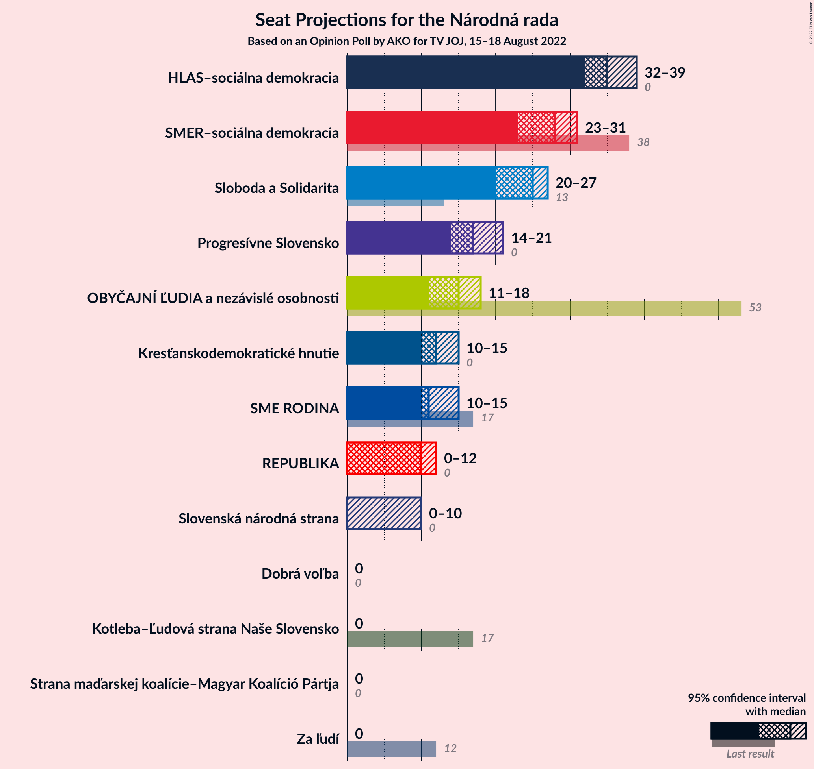

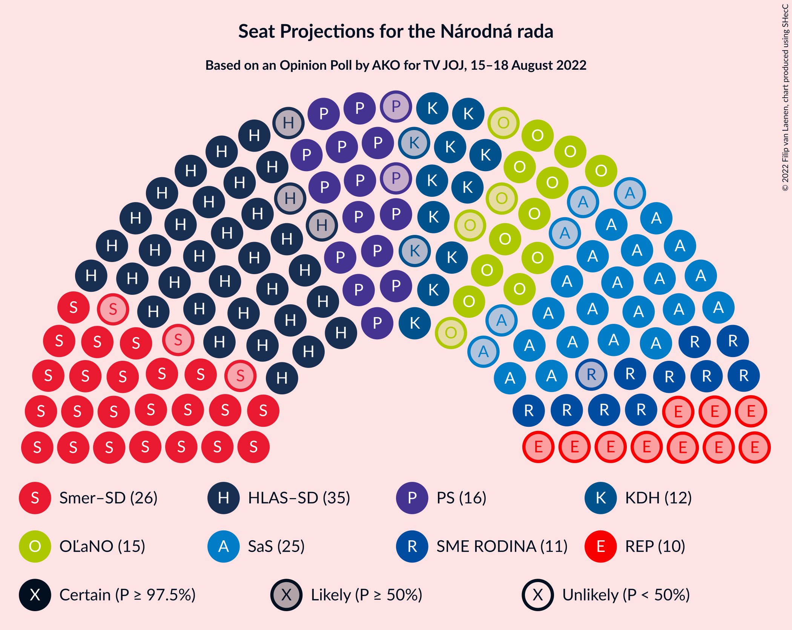

### Confidence Intervals

| Party | Last Result | Median | 80% Confidence Interval | 90% Confidence Interval | 95% Confidence Interval | 99% Confidence Interval |
|:-----:|:-----------:|:------:|:-----------------------:|:-----------------------:|:-----------------------:|:-----------------------:|
| <a href="#hlas–sociálna-demokracia">HLAS–sociálna demokracia</a> | 0 | 35 | 32–38 |32–39 |32–39 |28–41 |
| <a href="#smer–sociálna-demokracia">SMER–sociálna demokracia</a> | 38 | 28 | 25–30 |23–31 |23–31 |21–33 |
| <a href="#sloboda-a-solidarita">Sloboda a Solidarita</a> | 13 | 25 | 21–26 |20–27 |20–27 |19–30 |
| <a href="#progresívne-slovensko">Progresívne Slovensko</a> | 0 | 17 | 15–20 |14–21 |14–21 |14–23 |
| <a href="#obyčajní-ľudia-a-nezávislé-osobnosti">OBYČAJNÍ ĽUDIA a nezávislé osobnosti</a> | 53 | 15 | 13–17 |12–17 |11–18 |11–18 |
| <a href="#kresťanskodemokratické-hnutie">Kresťanskodemokratické hnutie</a> | 0 | 12 | 10–14 |10–14 |10–15 |10–16 |
| <a href="#sme-rodina">SME RODINA</a> | 17 | 11 | 10–14 |10–14 |10–15 |0–16 |
| <a href="#republika">REPUBLIKA</a> | 0 | 10 | 0–12 |0–12 |0–12 |0–13 |
| <a href="#slovenská-národná-strana">Slovenská národná strana</a> | 0 | 0 | 0 |0–10 |0–10 |0–10 |
| <a href="#strana-maďarskej-koalície–magyar-koalíció-pártja">Strana maďarskej koalície–Magyar Koalíció Pártja</a> | 0 | 0 | 0 |0 |0 |0 |
| <a href="#kotleba–ľudová-strana-naše-slovensko">Kotleba–Ľudová strana Naše Slovensko</a> | 17 | 0 | 0 |0 |0 |0 |
| <a href="#za-ľudí">Za ľudí</a> | 12 | 0 | 0 |0 |0 |0 |
| <a href="#dobrá-voľba">Dobrá voľba</a> | 0 | 0 | 0 |0 |0 |0 |

### HLAS–sociálna demokracia

*For a full overview of the results for this party, see the [HLAS–sociálna demokracia](party-hlas–sociálnademokracia.html) page.*

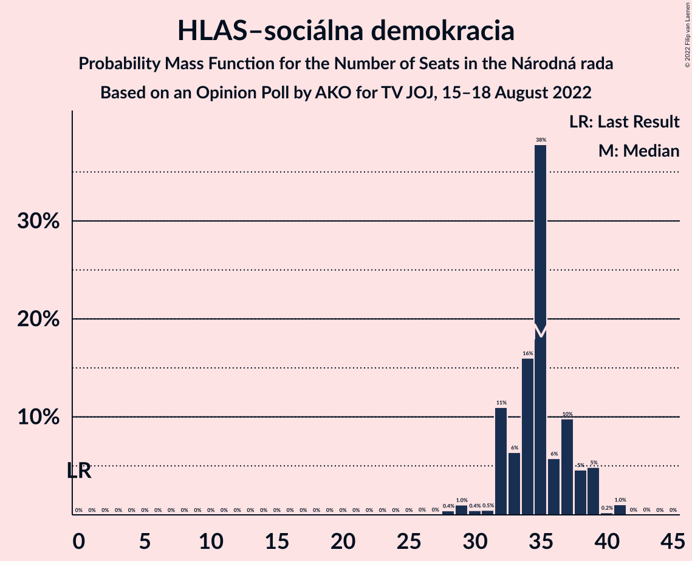

| Number of Seats | Probability | Accumulated | Special Marks |
|:---------------:|:-----------:|:-----------:|:-------------:|
| 0 | 0% | 100% | Last Result |
| 1 | 0% | 100% |  |
| 2 | 0% | 100% |  |
| 3 | 0% | 100% |  |
| 4 | 0% | 100% |  |
| 5 | 0% | 100% |  |
| 6 | 0% | 100% |  |
| 7 | 0% | 100% |  |
| 8 | 0% | 100% |  |
| 9 | 0% | 100% |  |
| 10 | 0% | 100% |  |
| 11 | 0% | 100% |  |
| 12 | 0% | 100% |  |
| 13 | 0% | 100% |  |
| 14 | 0% | 100% |  |
| 15 | 0% | 100% |  |
| 16 | 0% | 100% |  |
| 17 | 0% | 100% |  |
| 18 | 0% | 100% |  |
| 19 | 0% | 100% |  |
| 20 | 0% | 100% |  |
| 21 | 0% | 100% |  |
| 22 | 0% | 100% |  |
| 23 | 0% | 100% |  |
| 24 | 0% | 100% |  |
| 25 | 0% | 100% |  |
| 26 | 0% | 100% |  |
| 27 | 0% | 100% |  |
| 28 | 0.4% | 99.9% |  |
| 29 | 1.0% | 99.5% |  |
| 30 | 0.4% | 98% |  |
| 31 | 0.5% | 98% |  |
| 32 | 11% | 98% |  |
| 33 | 6% | 87% |  |
| 34 | 16% | 80% |  |
| 35 | 38% | 64% | Median |
| 36 | 6% | 26% |  |
| 37 | 10% | 21% |  |
| 38 | 5% | 11% |  |
| 39 | 5% | 6% |  |
| 40 | 0.2% | 1.4% |  |
| 41 | 1.0% | 1.1% |  |
| 42 | 0% | 0.1% |  |
| 43 | 0% | 0.1% |  |
| 44 | 0% | 0% |  |

### SMER–sociálna demokracia

*For a full overview of the results for this party, see the [SMER–sociálna demokracia](party-smer–sociálnademokracia.html) page.*

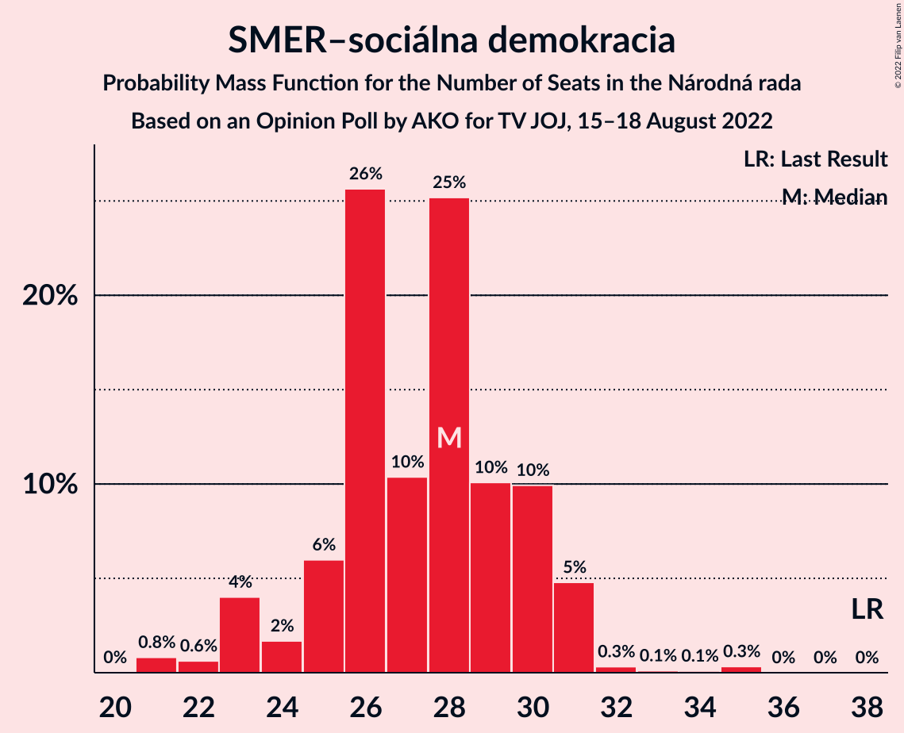

| Number of Seats | Probability | Accumulated | Special Marks |
|:---------------:|:-----------:|:-----------:|:-------------:|
| 21 | 0.8% | 100% |  |
| 22 | 0.6% | 99.2% |  |
| 23 | 4% | 98.5% |  |
| 24 | 2% | 95% |  |
| 25 | 6% | 93% |  |
| 26 | 26% | 87% |  |
| 27 | 10% | 61% |  |
| 28 | 25% | 51% | Median |
| 29 | 10% | 26% |  |
| 30 | 10% | 16% |  |
| 31 | 5% | 6% |  |
| 32 | 0.3% | 0.9% |  |
| 33 | 0.1% | 0.5% |  |
| 34 | 0.1% | 0.4% |  |
| 35 | 0.3% | 0.3% |  |
| 36 | 0% | 0% |  |
| 37 | 0% | 0% |  |
| 38 | 0% | 0% | Last Result |

### Sloboda a Solidarita

*For a full overview of the results for this party, see the [Sloboda a Solidarita](party-slobodaasolidarita.html) page.*

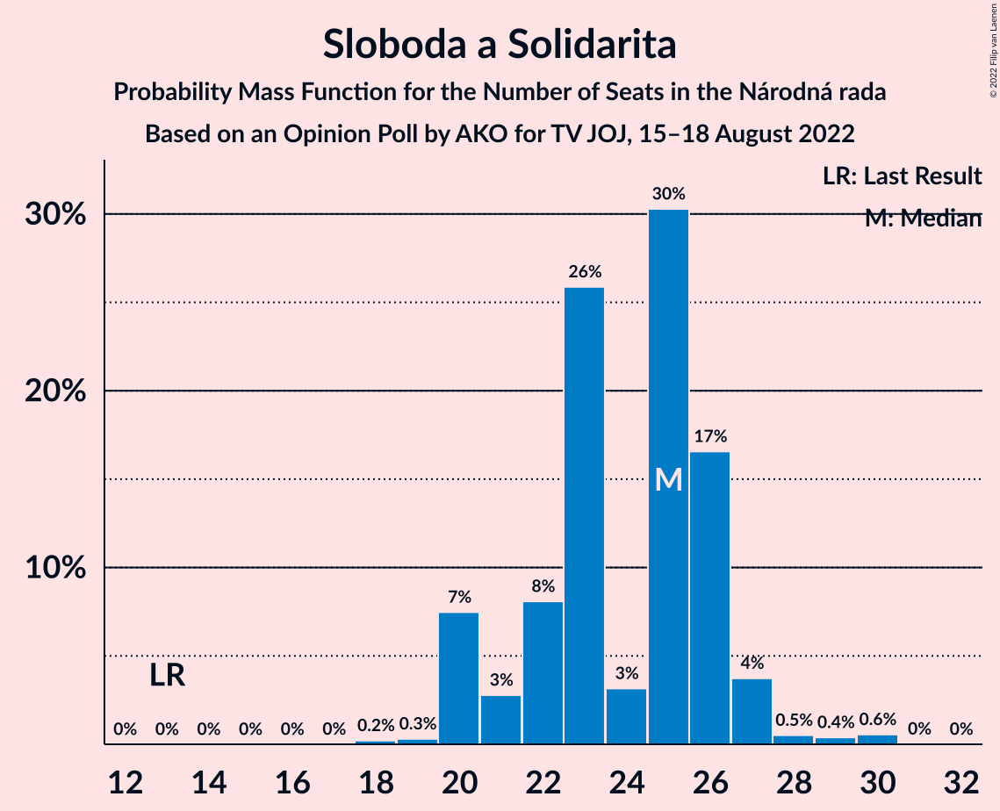

| Number of Seats | Probability | Accumulated | Special Marks |
|:---------------:|:-----------:|:-----------:|:-------------:|
| 13 | 0% | 100% | Last Result |
| 14 | 0% | 100% |  |
| 15 | 0% | 100% |  |
| 16 | 0% | 100% |  |
| 17 | 0% | 100% |  |
| 18 | 0.2% | 100% |  |
| 19 | 0.3% | 99.8% |  |
| 20 | 7% | 99.5% |  |
| 21 | 3% | 92% |  |
| 22 | 8% | 89% |  |
| 23 | 26% | 81% |  |
| 24 | 3% | 55% |  |
| 25 | 30% | 52% | Median |
| 26 | 17% | 22% |  |
| 27 | 4% | 5% |  |
| 28 | 0.5% | 1.5% |  |
| 29 | 0.4% | 1.0% |  |
| 30 | 0.6% | 0.6% |  |
| 31 | 0% | 0% |  |

### Progresívne Slovensko

*For a full overview of the results for this party, see the [Progresívne Slovensko](party-progresívneslovensko.html) page.*

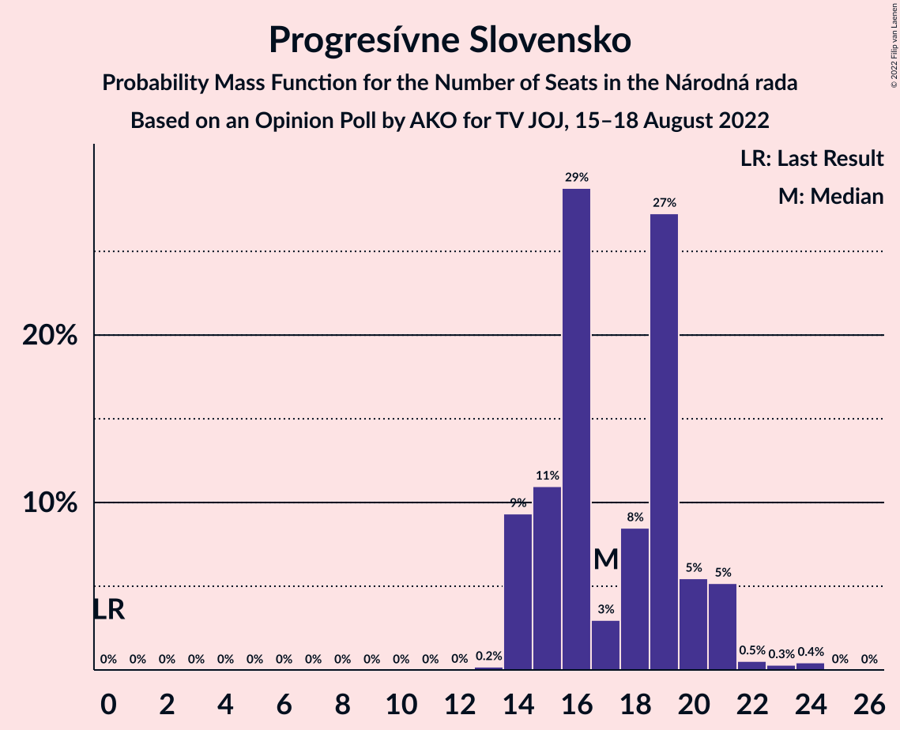

| Number of Seats | Probability | Accumulated | Special Marks |
|:---------------:|:-----------:|:-----------:|:-------------:|
| 0 | 0% | 100% | Last Result |
| 1 | 0% | 100% |  |
| 2 | 0% | 100% |  |
| 3 | 0% | 100% |  |
| 4 | 0% | 100% |  |
| 5 | 0% | 100% |  |
| 6 | 0% | 100% |  |
| 7 | 0% | 100% |  |
| 8 | 0% | 100% |  |
| 9 | 0% | 100% |  |
| 10 | 0% | 100% |  |
| 11 | 0% | 100% |  |
| 12 | 0% | 100% |  |
| 13 | 0.2% | 100% |  |
| 14 | 9% | 99.8% |  |
| 15 | 11% | 90% |  |
| 16 | 29% | 79% |  |
| 17 | 3% | 51% | Median |
| 18 | 8% | 48% |  |
| 19 | 27% | 39% |  |
| 20 | 5% | 12% |  |
| 21 | 5% | 6% |  |
| 22 | 0.5% | 1.3% |  |
| 23 | 0.3% | 0.8% |  |
| 24 | 0.4% | 0.5% |  |
| 25 | 0% | 0% |  |

### OBYČAJNÍ ĽUDIA a nezávislé osobnosti

*For a full overview of the results for this party, see the [OBYČAJNÍ ĽUDIA a nezávislé osobnosti](party-obyčajníľudiaanezávisléosobnosti.html) page.*

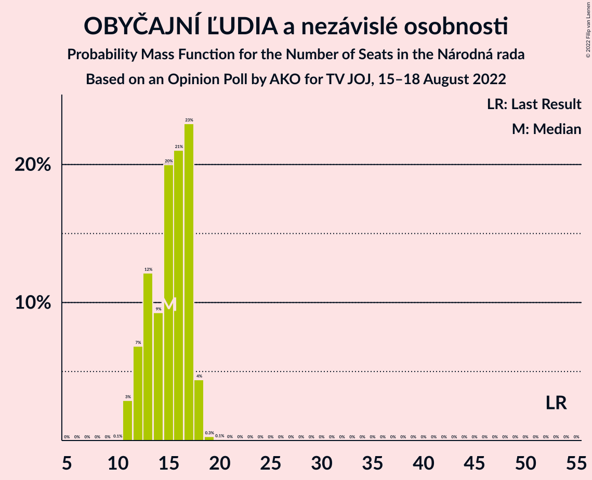

| Number of Seats | Probability | Accumulated | Special Marks |
|:---------------:|:-----------:|:-----------:|:-------------:|
| 10 | 0.1% | 100% |  |
| 11 | 3% | 99.9% |  |
| 12 | 7% | 97% |  |
| 13 | 12% | 90% |  |
| 14 | 9% | 78% |  |
| 15 | 20% | 69% | Median |
| 16 | 21% | 49% |  |
| 17 | 23% | 28% |  |
| 18 | 4% | 5% |  |
| 19 | 0.3% | 0.4% |  |
| 20 | 0.1% | 0.1% |  |
| 21 | 0% | 0% |  |
| 22 | 0% | 0% |  |
| 23 | 0% | 0% |  |
| 24 | 0% | 0% |  |
| 25 | 0% | 0% |  |
| 26 | 0% | 0% |  |
| 27 | 0% | 0% |  |
| 28 | 0% | 0% |  |
| 29 | 0% | 0% |  |
| 30 | 0% | 0% |  |
| 31 | 0% | 0% |  |
| 32 | 0% | 0% |  |
| 33 | 0% | 0% |  |
| 34 | 0% | 0% |  |
| 35 | 0% | 0% |  |
| 36 | 0% | 0% |  |
| 37 | 0% | 0% |  |
| 38 | 0% | 0% |  |
| 39 | 0% | 0% |  |
| 40 | 0% | 0% |  |
| 41 | 0% | 0% |  |
| 42 | 0% | 0% |  |
| 43 | 0% | 0% |  |
| 44 | 0% | 0% |  |
| 45 | 0% | 0% |  |
| 46 | 0% | 0% |  |
| 47 | 0% | 0% |  |
| 48 | 0% | 0% |  |
| 49 | 0% | 0% |  |
| 50 | 0% | 0% |  |
| 51 | 0% | 0% |  |
| 52 | 0% | 0% |  |
| 53 | 0% | 0% | Last Result |

### Kresťanskodemokratické hnutie

*For a full overview of the results for this party, see the [Kresťanskodemokratické hnutie](party-kresťanskodemokratickéhnutie.html) page.*

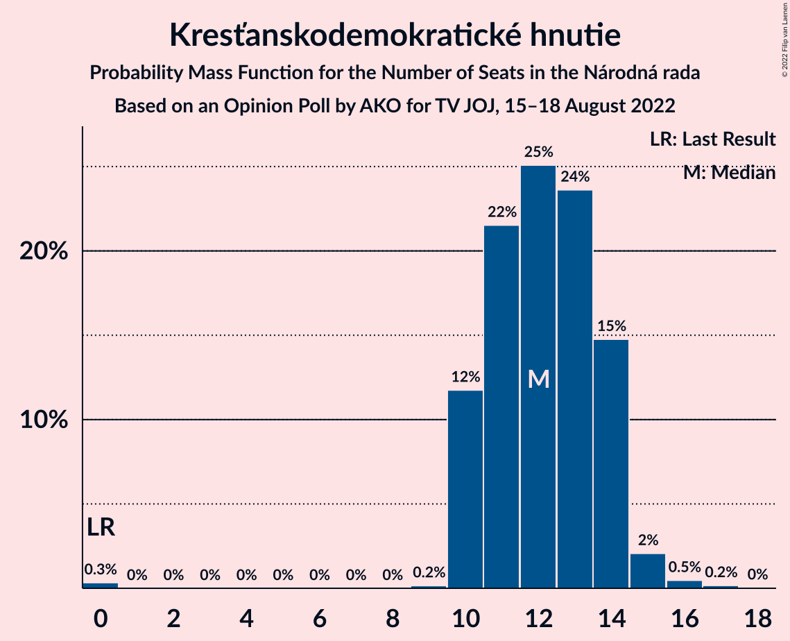

| Number of Seats | Probability | Accumulated | Special Marks |
|:---------------:|:-----------:|:-----------:|:-------------:|
| 0 | 0.3% | 100% | Last Result |
| 1 | 0% | 99.7% |  |
| 2 | 0% | 99.7% |  |
| 3 | 0% | 99.7% |  |
| 4 | 0% | 99.7% |  |
| 5 | 0% | 99.7% |  |
| 6 | 0% | 99.7% |  |
| 7 | 0% | 99.7% |  |
| 8 | 0% | 99.7% |  |
| 9 | 0.2% | 99.7% |  |
| 10 | 12% | 99.5% |  |
| 11 | 22% | 88% |  |
| 12 | 25% | 66% | Median |
| 13 | 24% | 41% |  |
| 14 | 15% | 18% |  |
| 15 | 2% | 3% |  |
| 16 | 0.5% | 0.7% |  |
| 17 | 0.2% | 0.2% |  |
| 18 | 0% | 0% |  |

### SME RODINA

*For a full overview of the results for this party, see the [SME RODINA](party-smerodina.html) page.*

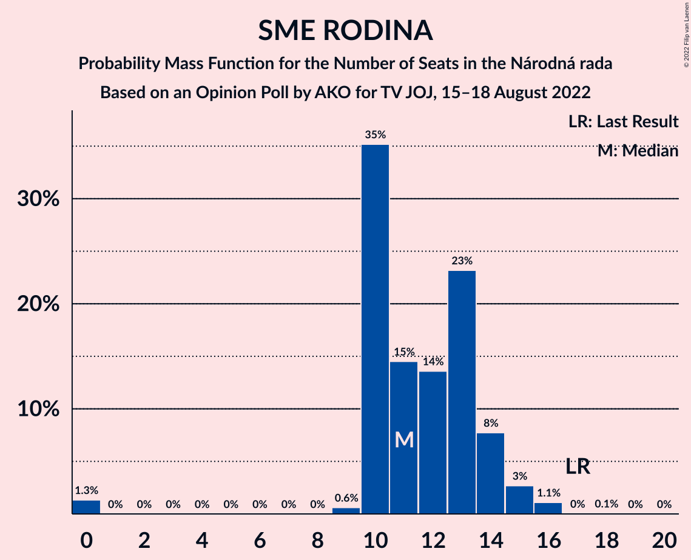

| Number of Seats | Probability | Accumulated | Special Marks |
|:---------------:|:-----------:|:-----------:|:-------------:|
| 0 | 1.3% | 100% |  |
| 1 | 0% | 98.7% |  |
| 2 | 0% | 98.7% |  |
| 3 | 0% | 98.7% |  |
| 4 | 0% | 98.7% |  |
| 5 | 0% | 98.7% |  |
| 6 | 0% | 98.7% |  |
| 7 | 0% | 98.7% |  |
| 8 | 0% | 98.7% |  |
| 9 | 0.6% | 98.7% |  |
| 10 | 35% | 98% |  |
| 11 | 15% | 63% | Median |
| 12 | 14% | 48% |  |
| 13 | 23% | 35% |  |
| 14 | 8% | 12% |  |
| 15 | 3% | 4% |  |
| 16 | 1.1% | 1.2% |  |
| 17 | 0% | 0.1% | Last Result |
| 18 | 0.1% | 0.1% |  |
| 19 | 0% | 0% |  |

### REPUBLIKA

*For a full overview of the results for this party, see the [REPUBLIKA](party-republika.html) page.*

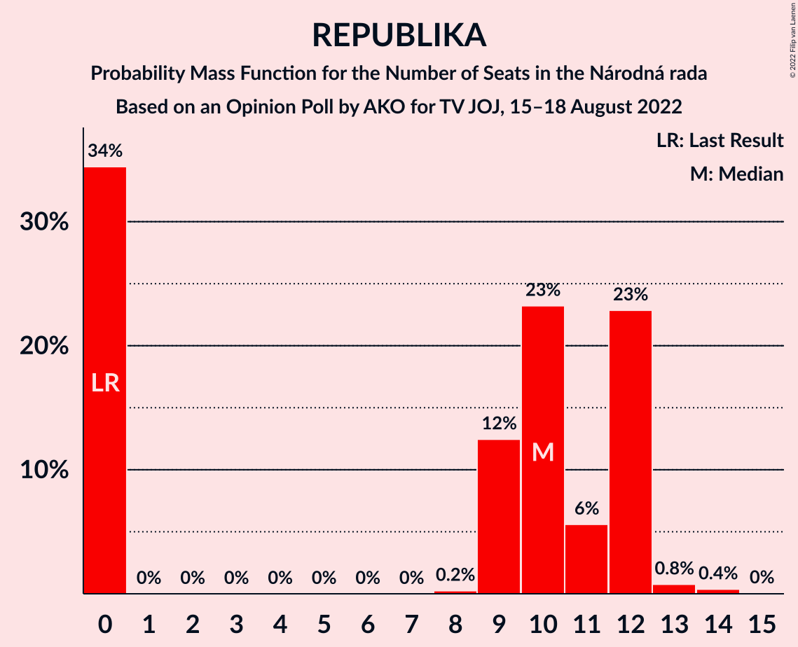

| Number of Seats | Probability | Accumulated | Special Marks |
|:---------------:|:-----------:|:-----------:|:-------------:|
| 0 | 34% | 100% | Last Result |
| 1 | 0% | 66% |  |
| 2 | 0% | 66% |  |
| 3 | 0% | 66% |  |
| 4 | 0% | 66% |  |
| 5 | 0% | 66% |  |
| 6 | 0% | 66% |  |
| 7 | 0% | 66% |  |
| 8 | 0.2% | 66% |  |
| 9 | 12% | 65% |  |
| 10 | 23% | 53% | Median |
| 11 | 6% | 30% |  |
| 12 | 23% | 24% |  |
| 13 | 0.8% | 1.2% |  |
| 14 | 0.4% | 0.4% |  |
| 15 | 0% | 0% |  |

### Slovenská národná strana

*For a full overview of the results for this party, see the [Slovenská národná strana](party-slovenskánárodnástrana.html) page.*

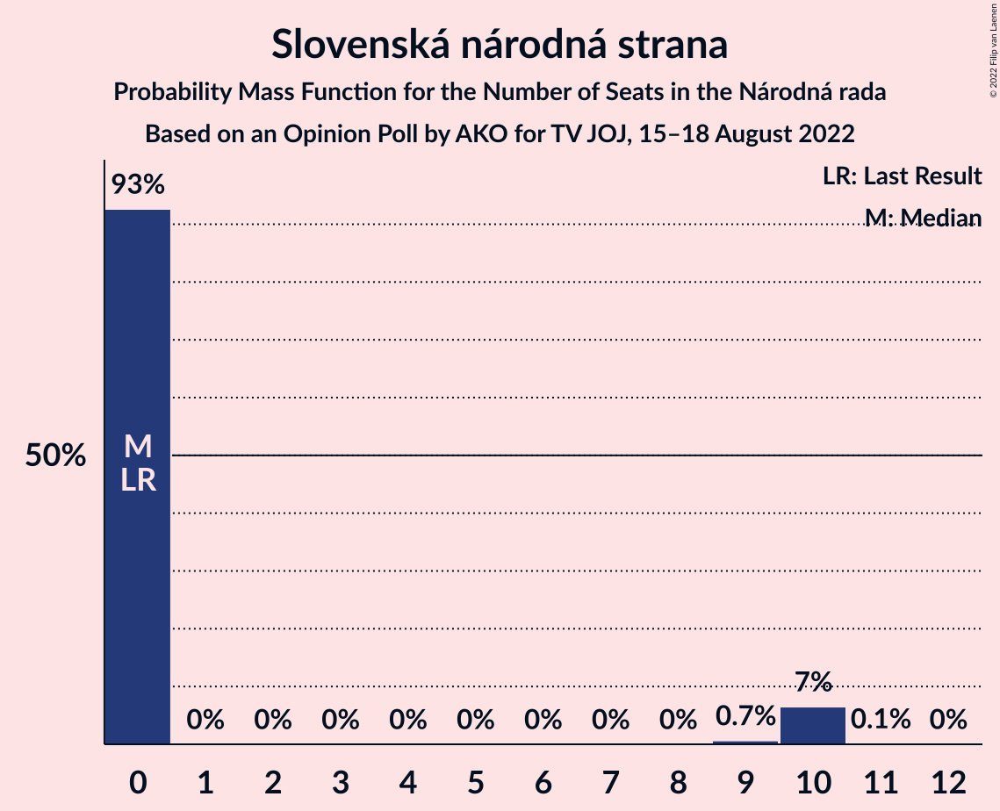

| Number of Seats | Probability | Accumulated | Special Marks |
|:---------------:|:-----------:|:-----------:|:-------------:|
| 0 | 93% | 100% | Last Result, Median |
| 1 | 0% | 7% |  |
| 2 | 0% | 7% |  |
| 3 | 0% | 7% |  |
| 4 | 0% | 7% |  |
| 5 | 0% | 7% |  |
| 6 | 0% | 7% |  |
| 7 | 0% | 7% |  |
| 8 | 0% | 7% |  |
| 9 | 0.7% | 7% |  |
| 10 | 7% | 7% |  |
| 11 | 0.1% | 0.2% |  |
| 12 | 0% | 0% |  |

### Strana maďarskej koalície–Magyar Koalíció Pártja

*For a full overview of the results for this party, see the [Strana maďarskej koalície–Magyar Koalíció Pártja](party-stranamaďarskejkoalície–magyarkoalíciópártja.html) page.*

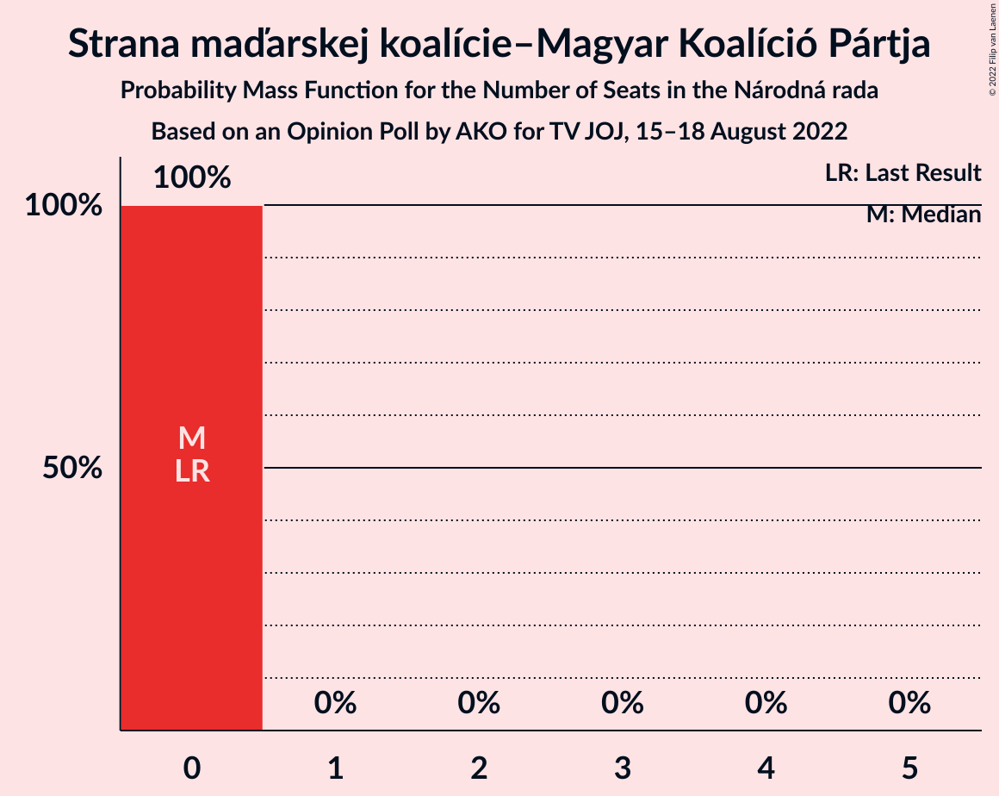

| Number of Seats | Probability | Accumulated | Special Marks |
|:---------------:|:-----------:|:-----------:|:-------------:|
| 0 | 100% | 100% | Last Result, Median |

### Kotleba–Ľudová strana Naše Slovensko

*For a full overview of the results for this party, see the [Kotleba–Ľudová strana Naše Slovensko](party-kotleba–ľudovástrananašeslovensko.html) page.*

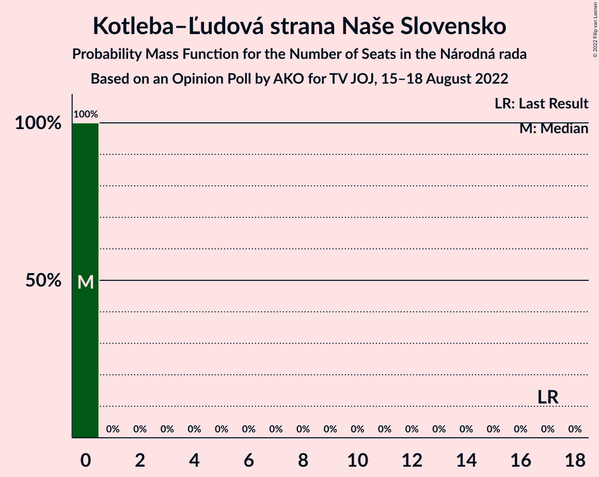

| Number of Seats | Probability | Accumulated | Special Marks |
|:---------------:|:-----------:|:-----------:|:-------------:|
| 0 | 100% | 100% | Median |
| 1 | 0% | 0% |  |
| 2 | 0% | 0% |  |
| 3 | 0% | 0% |  |
| 4 | 0% | 0% |  |
| 5 | 0% | 0% |  |
| 6 | 0% | 0% |  |
| 7 | 0% | 0% |  |
| 8 | 0% | 0% |  |
| 9 | 0% | 0% |  |
| 10 | 0% | 0% |  |
| 11 | 0% | 0% |  |
| 12 | 0% | 0% |  |
| 13 | 0% | 0% |  |
| 14 | 0% | 0% |  |
| 15 | 0% | 0% |  |
| 16 | 0% | 0% |  |
| 17 | 0% | 0% | Last Result |

### Za ľudí

*For a full overview of the results for this party, see the [Za ľudí](party-zaľudí.html) page.*

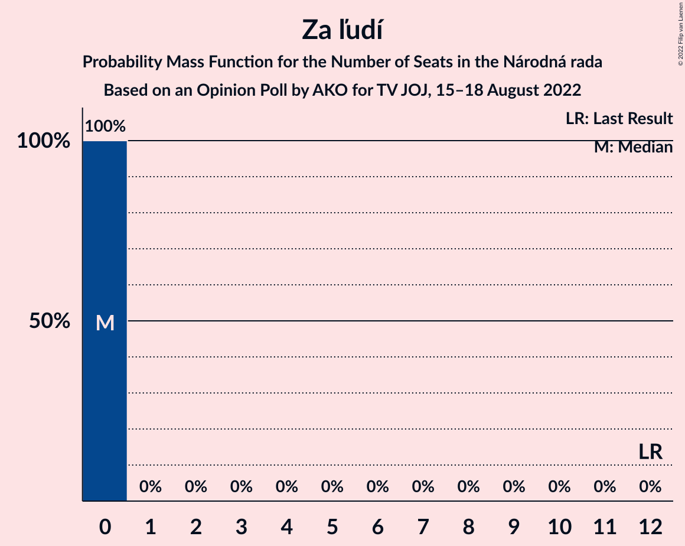

| Number of Seats | Probability | Accumulated | Special Marks |
|:---------------:|:-----------:|:-----------:|:-------------:|
| 0 | 100% | 100% | Median |
| 1 | 0% | 0% |  |
| 2 | 0% | 0% |  |
| 3 | 0% | 0% |  |
| 4 | 0% | 0% |  |
| 5 | 0% | 0% |  |
| 6 | 0% | 0% |  |
| 7 | 0% | 0% |  |
| 8 | 0% | 0% |  |
| 9 | 0% | 0% |  |
| 10 | 0% | 0% |  |
| 11 | 0% | 0% |  |
| 12 | 0% | 0% | Last Result |

### Dobrá voľba

*For a full overview of the results for this party, see the [Dobrá voľba](party-dobrávoľba.html) page.*

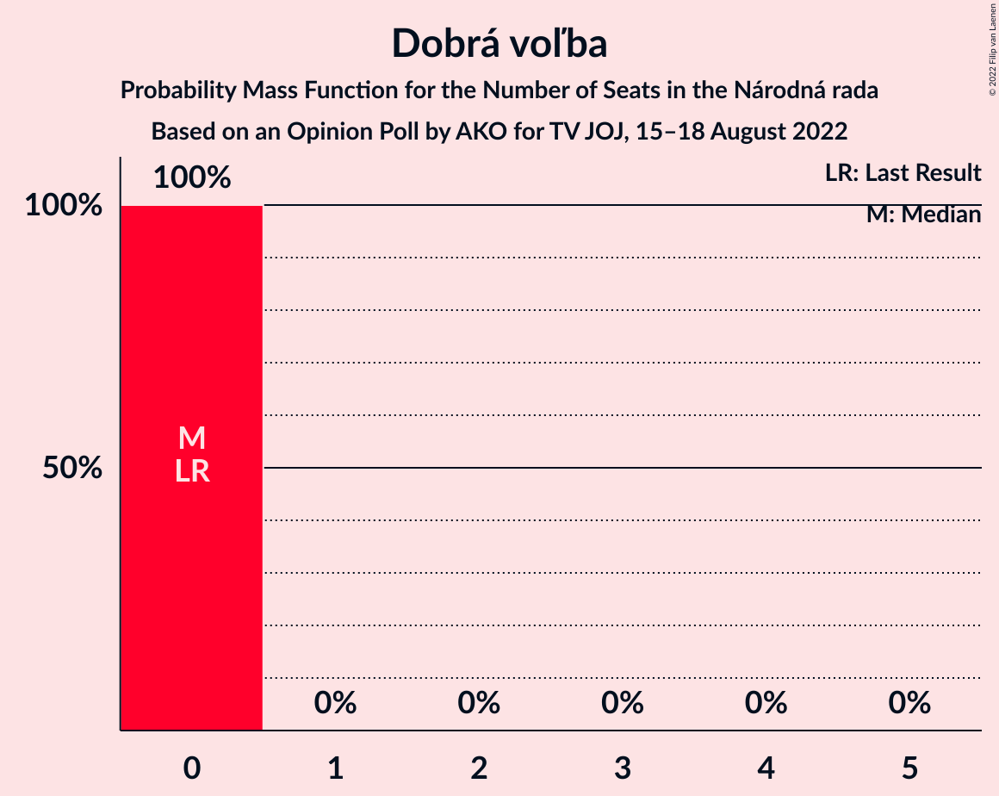

| Number of Seats | Probability | Accumulated | Special Marks |
|:---------------:|:-----------:|:-----------:|:-------------:|
| 0 | 100% | 100% | Last Result, Median |

## Coalitions

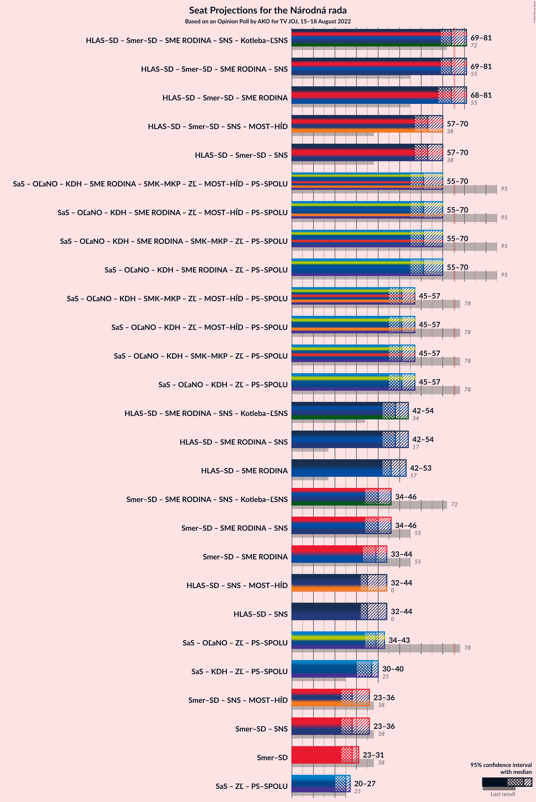

### Confidence Intervals

| Coalition | Last Result | Median | Majority? | 80% Confidence Interval | 90% Confidence Interval | 95% Confidence Interval | 99% Confidence Interval |
|:---------:|:-----------:|:------:|:---------:|:-----------------------:|:-----------------------:|:-----------------------:|:-----------------------:|
| HLAS–sociálna demokracia – SMER–sociálna demokracia – SME RODINA – Slovenská národná strana – Kotleba–Ľudová strana Naše Slovensko | 72 | 74 | 38% | 71–80 | 71–80 | 69–81 | 67–82 |
| HLAS–sociálna demokracia – SMER–sociálna demokracia – SME RODINA – Slovenská národná strana | 55 | 74 | 38% | 71–80 | 71–80 | 69–81 | 67–82 |
| HLAS–sociálna demokracia – SMER–sociálna demokracia – SME RODINA | 55 | 74 | 31% | 70–79 | 70–80 | 68–81 | 60–82 |
| HLAS–sociálna demokracia – SMER–sociálna demokracia – Slovenská národná strana | 38 | 63 | 0% | 61–66 | 58–70 | 57–70 | 54–70 |
| HLAS–sociálna demokracia – SME RODINA – Slovenská národná strana – Kotleba–Ľudová strana Naše Slovensko | 34 | 48 | 0% | 42–52 | 42–54 | 42–54 | 37–55 |
| HLAS–sociálna demokracia – SME RODINA – Slovenská národná strana | 17 | 48 | 0% | 42–52 | 42–54 | 42–54 | 37–55 |
| HLAS–sociálna demokracia – SME RODINA | 17 | 46 | 0% | 42–50 | 42–52 | 42–53 | 32–54 |
| SMER–sociálna demokracia – SME RODINA – Slovenská národná strana – Kotleba–Ľudová strana Naše Slovensko | 72 | 40 | 0% | 36–43 | 36–46 | 34–46 | 31–47 |
| SMER–sociálna demokracia – SME RODINA – Slovenská národná strana | 55 | 40 | 0% | 36–43 | 36–46 | 34–46 | 31–47 |
| SMER–sociálna demokracia – SME RODINA | 55 | 39 | 0% | 36–42 | 35–43 | 33–44 | 28–46 |
| HLAS–sociálna demokracia – Slovenská národná strana | 0 | 35 | 0% | 32–39 | 32–44 | 32–44 | 29–44 |
| SMER–sociálna demokracia – Slovenská národná strana | 38 | 28 | 0% | 25–31 | 23–36 | 23–36 | 21–38 |
| SMER–sociálna demokracia | 38 | 28 | 0% | 25–30 | 23–31 | 23–31 | 21–33 |

### HLAS–sociálna demokracia – SMER–sociálna demokracia – SME RODINA – Slovenská národná strana – Kotleba–Ľudová strana Naše Slovensko

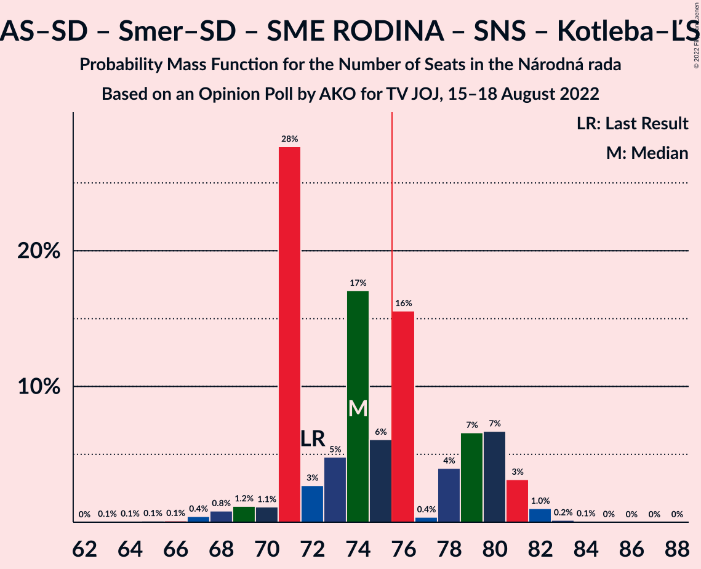

| Number of Seats | Probability | Accumulated | Special Marks |
|:---------------:|:-----------:|:-----------:|:-------------:|
| 63 | 0.1% | 100% |  |
| 64 | 0.1% | 99.9% |  |
| 65 | 0.1% | 99.9% |  |
| 66 | 0.1% | 99.8% |  |
| 67 | 0.4% | 99.7% |  |
| 68 | 0.8% | 99.2% |  |
| 69 | 1.2% | 98% |  |
| 70 | 1.1% | 97% |  |
| 71 | 28% | 96% |  |
| 72 | 3% | 68% | Last Result |
| 73 | 5% | 66% |  |
| 74 | 17% | 61% | Median |
| 75 | 6% | 44% |  |
| 76 | 16% | 38% | Majority |
| 77 | 0.4% | 22% |  |
| 78 | 4% | 22% |  |
| 79 | 7% | 18% |  |
| 80 | 7% | 11% |  |
| 81 | 3% | 4% |  |
| 82 | 1.0% | 1.3% |  |
| 83 | 0.2% | 0.3% |  |
| 84 | 0.1% | 0.2% |  |
| 85 | 0% | 0.1% |  |
| 86 | 0% | 0.1% |  |
| 87 | 0% | 0% |  |

### HLAS–sociálna demokracia – SMER–sociálna demokracia – SME RODINA – Slovenská národná strana

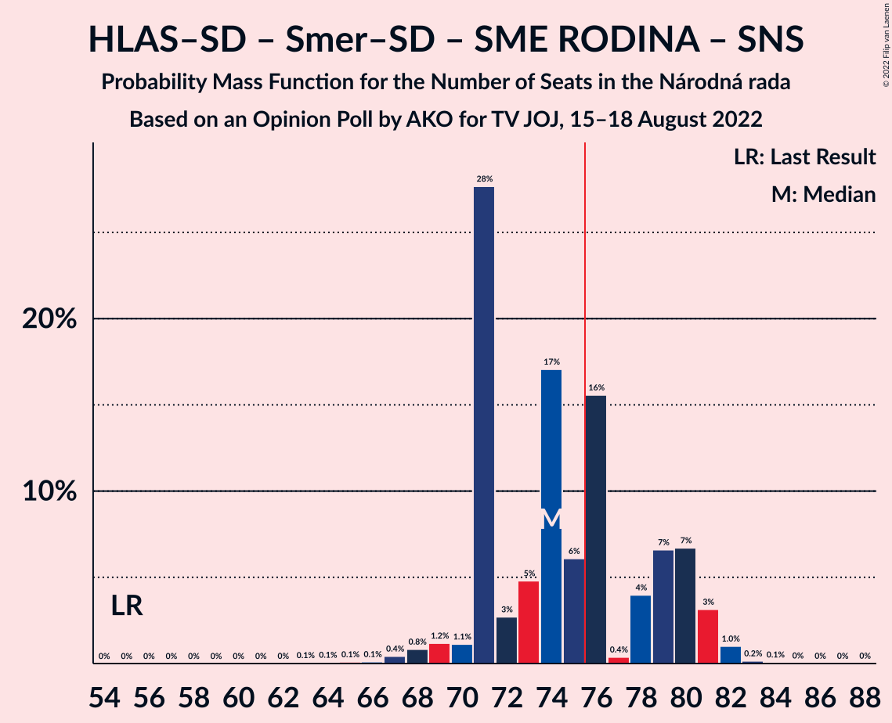

| Number of Seats | Probability | Accumulated | Special Marks |
|:---------------:|:-----------:|:-----------:|:-------------:|
| 55 | 0% | 100% | Last Result |
| 56 | 0% | 100% |  |
| 57 | 0% | 100% |  |
| 58 | 0% | 100% |  |
| 59 | 0% | 100% |  |
| 60 | 0% | 100% |  |
| 61 | 0% | 100% |  |
| 62 | 0% | 100% |  |
| 63 | 0.1% | 100% |  |
| 64 | 0.1% | 99.9% |  |
| 65 | 0.1% | 99.9% |  |
| 66 | 0.1% | 99.8% |  |
| 67 | 0.4% | 99.7% |  |
| 68 | 0.8% | 99.2% |  |
| 69 | 1.2% | 98% |  |
| 70 | 1.1% | 97% |  |
| 71 | 28% | 96% |  |
| 72 | 3% | 68% |  |
| 73 | 5% | 66% |  |
| 74 | 17% | 61% | Median |
| 75 | 6% | 44% |  |
| 76 | 16% | 38% | Majority |
| 77 | 0.4% | 22% |  |
| 78 | 4% | 22% |  |
| 79 | 7% | 18% |  |
| 80 | 7% | 11% |  |
| 81 | 3% | 4% |  |
| 82 | 1.0% | 1.3% |  |
| 83 | 0.2% | 0.3% |  |
| 84 | 0.1% | 0.2% |  |
| 85 | 0% | 0.1% |  |
| 86 | 0% | 0.1% |  |
| 87 | 0% | 0% |  |

### HLAS–sociálna demokracia – SMER–sociálna demokracia – SME RODINA

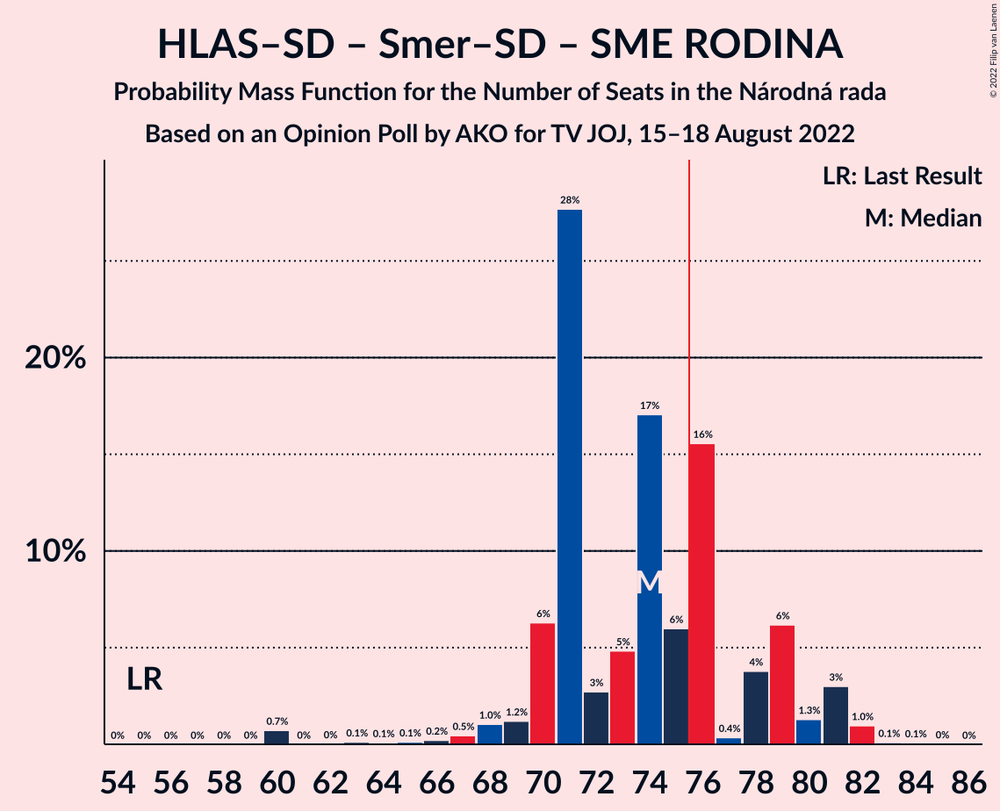

| Number of Seats | Probability | Accumulated | Special Marks |
|:---------------:|:-----------:|:-----------:|:-------------:|
| 55 | 0% | 100% | Last Result |
| 56 | 0% | 100% |  |
| 57 | 0% | 100% |  |
| 58 | 0% | 100% |  |
| 59 | 0% | 100% |  |
| 60 | 0.7% | 100% |  |
| 61 | 0% | 99.3% |  |
| 62 | 0% | 99.3% |  |
| 63 | 0.1% | 99.2% |  |
| 64 | 0.1% | 99.1% |  |
| 65 | 0.1% | 99.0% |  |
| 66 | 0.2% | 98.9% |  |
| 67 | 0.5% | 98.7% |  |
| 68 | 1.0% | 98% |  |
| 69 | 1.2% | 97% |  |
| 70 | 6% | 96% |  |
| 71 | 28% | 90% |  |
| 72 | 3% | 62% |  |
| 73 | 5% | 59% |  |
| 74 | 17% | 54% | Median |
| 75 | 6% | 37% |  |
| 76 | 16% | 31% | Majority |
| 77 | 0.4% | 16% |  |
| 78 | 4% | 15% |  |
| 79 | 6% | 12% |  |
| 80 | 1.3% | 5% |  |
| 81 | 3% | 4% |  |
| 82 | 1.0% | 1.2% |  |
| 83 | 0.1% | 0.2% |  |
| 84 | 0.1% | 0.1% |  |
| 85 | 0% | 0% |  |

### HLAS–sociálna demokracia – SMER–sociálna demokracia – Slovenská národná strana

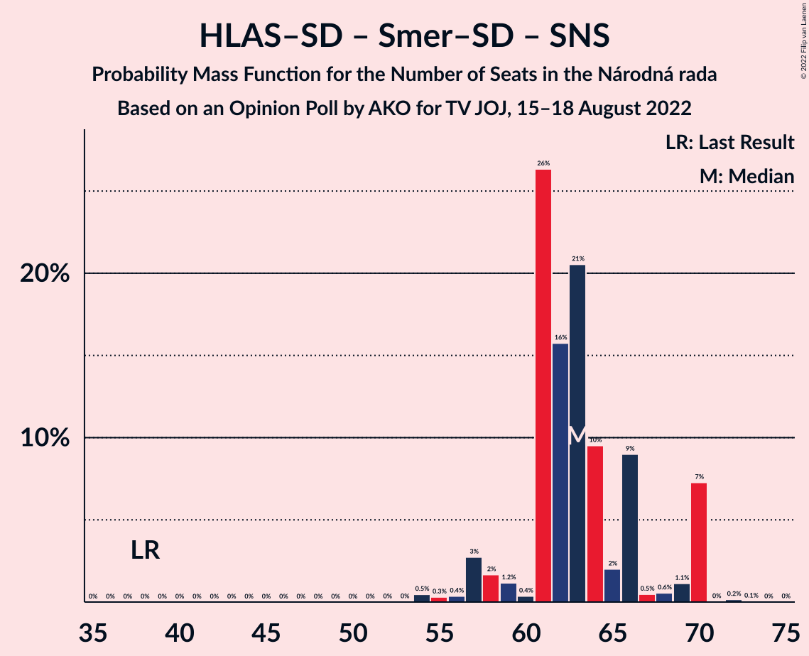

| Number of Seats | Probability | Accumulated | Special Marks |
|:---------------:|:-----------:|:-----------:|:-------------:|
| 38 | 0% | 100% | Last Result |
| 39 | 0% | 100% |  |
| 40 | 0% | 100% |  |
| 41 | 0% | 100% |  |
| 42 | 0% | 100% |  |
| 43 | 0% | 100% |  |
| 44 | 0% | 100% |  |
| 45 | 0% | 100% |  |
| 46 | 0% | 100% |  |
| 47 | 0% | 100% |  |
| 48 | 0% | 100% |  |
| 49 | 0% | 100% |  |
| 50 | 0% | 100% |  |
| 51 | 0% | 100% |  |
| 52 | 0% | 100% |  |
| 53 | 0% | 100% |  |
| 54 | 0.5% | 100% |  |
| 55 | 0.3% | 99.5% |  |
| 56 | 0.4% | 99.2% |  |
| 57 | 3% | 98.8% |  |
| 58 | 2% | 96% |  |
| 59 | 1.2% | 94% |  |
| 60 | 0.4% | 93% |  |
| 61 | 26% | 93% |  |
| 62 | 16% | 67% |  |
| 63 | 21% | 51% | Median |
| 64 | 10% | 30% |  |
| 65 | 2% | 21% |  |
| 66 | 9% | 19% |  |
| 67 | 0.5% | 10% |  |
| 68 | 0.6% | 9% |  |
| 69 | 1.1% | 9% |  |
| 70 | 7% | 8% |  |
| 71 | 0% | 0.3% |  |
| 72 | 0.2% | 0.3% |  |
| 73 | 0.1% | 0.1% |  |
| 74 | 0% | 0% |  |

### HLAS–sociálna demokracia – SME RODINA – Slovenská národná strana – Kotleba–Ľudová strana Naše Slovensko

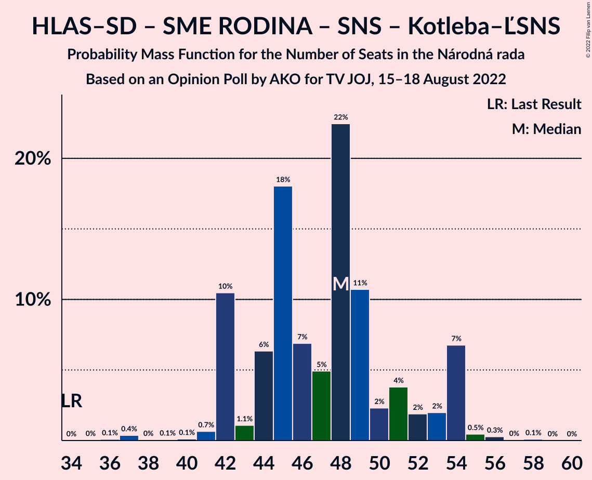

| Number of Seats | Probability | Accumulated | Special Marks |
|:---------------:|:-----------:|:-----------:|:-------------:|
| 34 | 0% | 100% | Last Result |
| 35 | 0% | 100% |  |
| 36 | 0.1% | 99.9% |  |
| 37 | 0.4% | 99.8% |  |
| 38 | 0% | 99.5% |  |
| 39 | 0.1% | 99.4% |  |
| 40 | 0.1% | 99.4% |  |
| 41 | 0.7% | 99.3% |  |
| 42 | 10% | 98.6% |  |
| 43 | 1.1% | 88% |  |
| 44 | 6% | 87% |  |
| 45 | 18% | 81% |  |
| 46 | 7% | 63% | Median |
| 47 | 5% | 56% |  |
| 48 | 22% | 51% |  |
| 49 | 11% | 28% |  |
| 50 | 2% | 18% |  |
| 51 | 4% | 15% |  |
| 52 | 2% | 12% |  |
| 53 | 2% | 10% |  |
| 54 | 7% | 8% |  |
| 55 | 0.5% | 0.9% |  |
| 56 | 0.3% | 0.5% |  |
| 57 | 0% | 0.2% |  |
| 58 | 0.1% | 0.1% |  |
| 59 | 0% | 0% |  |

### HLAS–sociálna demokracia – SME RODINA – Slovenská národná strana

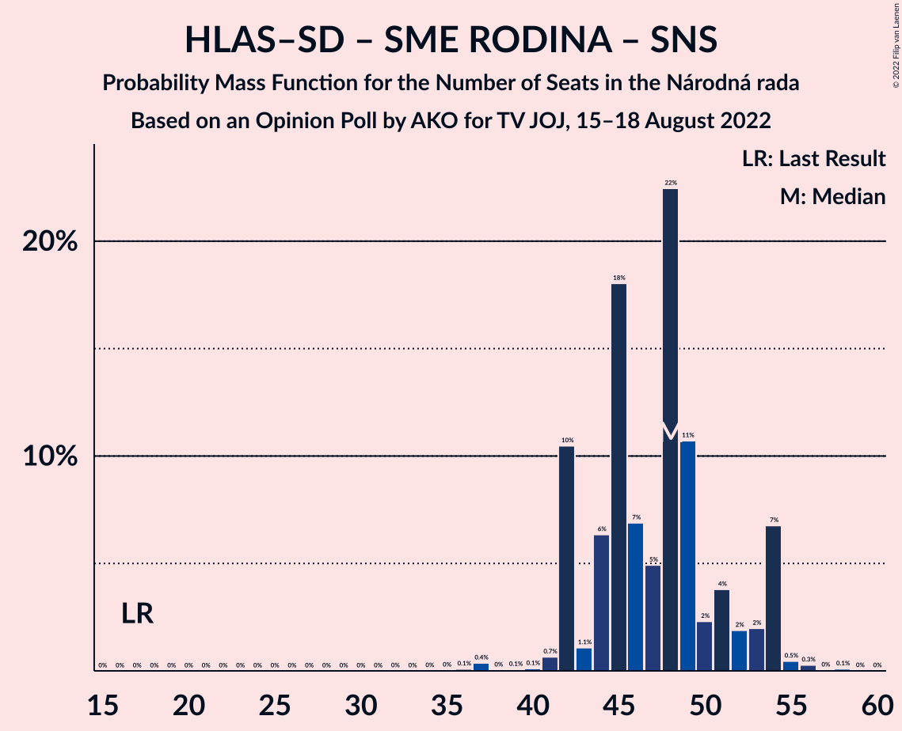

| Number of Seats | Probability | Accumulated | Special Marks |
|:---------------:|:-----------:|:-----------:|:-------------:|
| 17 | 0% | 100% | Last Result |
| 18 | 0% | 100% |  |
| 19 | 0% | 100% |  |
| 20 | 0% | 100% |  |
| 21 | 0% | 100% |  |
| 22 | 0% | 100% |  |
| 23 | 0% | 100% |  |
| 24 | 0% | 100% |  |
| 25 | 0% | 100% |  |
| 26 | 0% | 100% |  |
| 27 | 0% | 100% |  |
| 28 | 0% | 100% |  |
| 29 | 0% | 100% |  |
| 30 | 0% | 100% |  |
| 31 | 0% | 100% |  |
| 32 | 0% | 100% |  |
| 33 | 0% | 100% |  |
| 34 | 0% | 100% |  |
| 35 | 0% | 100% |  |
| 36 | 0.1% | 99.9% |  |
| 37 | 0.4% | 99.8% |  |
| 38 | 0% | 99.5% |  |
| 39 | 0.1% | 99.4% |  |
| 40 | 0.1% | 99.4% |  |
| 41 | 0.7% | 99.3% |  |
| 42 | 10% | 98.6% |  |
| 43 | 1.1% | 88% |  |
| 44 | 6% | 87% |  |
| 45 | 18% | 81% |  |
| 46 | 7% | 63% | Median |
| 47 | 5% | 56% |  |
| 48 | 22% | 51% |  |
| 49 | 11% | 28% |  |
| 50 | 2% | 18% |  |
| 51 | 4% | 15% |  |
| 52 | 2% | 12% |  |
| 53 | 2% | 10% |  |
| 54 | 7% | 8% |  |
| 55 | 0.5% | 0.9% |  |
| 56 | 0.3% | 0.5% |  |
| 57 | 0% | 0.2% |  |
| 58 | 0.1% | 0.1% |  |
| 59 | 0% | 0% |  |

### HLAS–sociálna demokracia – SME RODINA

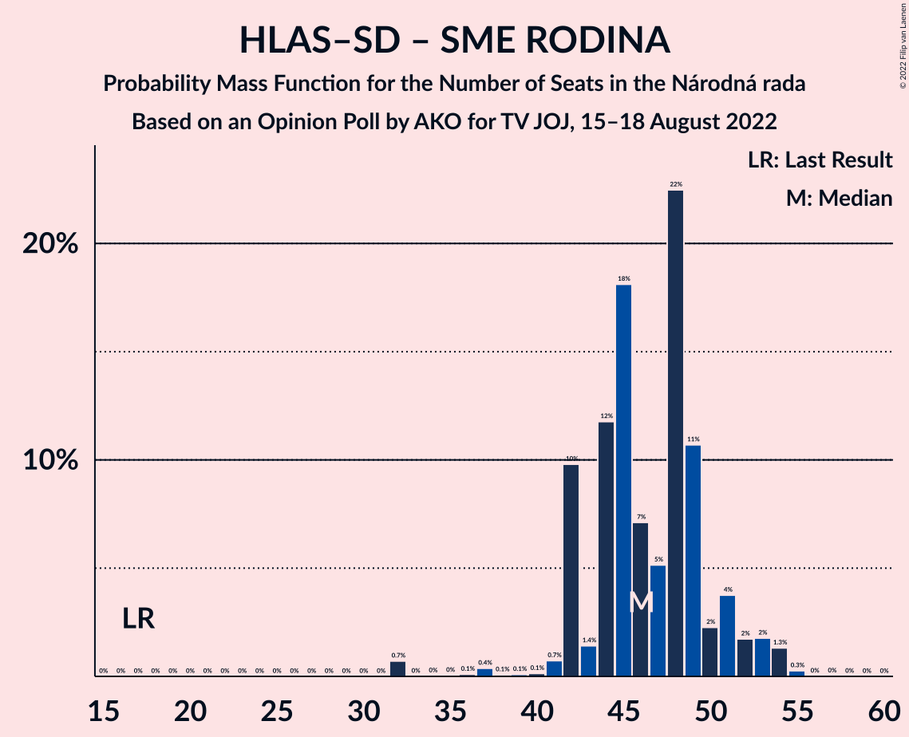

| Number of Seats | Probability | Accumulated | Special Marks |
|:---------------:|:-----------:|:-----------:|:-------------:|
| 17 | 0% | 100% | Last Result |
| 18 | 0% | 100% |  |
| 19 | 0% | 100% |  |
| 20 | 0% | 100% |  |
| 21 | 0% | 100% |  |
| 22 | 0% | 100% |  |
| 23 | 0% | 100% |  |
| 24 | 0% | 100% |  |
| 25 | 0% | 100% |  |
| 26 | 0% | 100% |  |
| 27 | 0% | 100% |  |
| 28 | 0% | 100% |  |
| 29 | 0% | 100% |  |
| 30 | 0% | 100% |  |
| 31 | 0% | 100% |  |
| 32 | 0.7% | 100% |  |
| 33 | 0% | 99.3% |  |
| 34 | 0% | 99.3% |  |
| 35 | 0% | 99.3% |  |
| 36 | 0.1% | 99.2% |  |
| 37 | 0.4% | 99.1% |  |
| 38 | 0.1% | 98.7% |  |
| 39 | 0.1% | 98.6% |  |
| 40 | 0.1% | 98.6% |  |
| 41 | 0.7% | 98% |  |
| 42 | 10% | 98% |  |
| 43 | 1.4% | 88% |  |
| 44 | 12% | 86% |  |
| 45 | 18% | 75% |  |
| 46 | 7% | 57% | Median |
| 47 | 5% | 49% |  |
| 48 | 22% | 44% |  |
| 49 | 11% | 22% |  |
| 50 | 2% | 11% |  |
| 51 | 4% | 9% |  |
| 52 | 2% | 5% |  |
| 53 | 2% | 3% |  |
| 54 | 1.3% | 2% |  |
| 55 | 0.3% | 0.3% |  |
| 56 | 0% | 0% |  |

### SMER–sociálna demokracia – SME RODINA – Slovenská národná strana – Kotleba–Ľudová strana Naše Slovensko

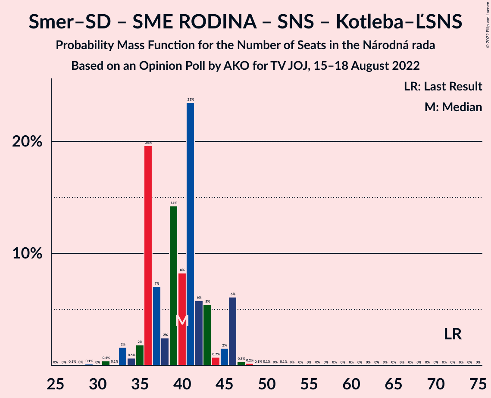

| Number of Seats | Probability | Accumulated | Special Marks |
|:---------------:|:-----------:|:-----------:|:-------------:|
| 27 | 0.1% | 100% |  |
| 28 | 0% | 99.9% |  |
| 29 | 0.1% | 99.9% |  |
| 30 | 0% | 99.8% |  |
| 31 | 0.4% | 99.8% |  |
| 32 | 0.1% | 99.4% |  |
| 33 | 2% | 99.3% |  |
| 34 | 0.6% | 98% |  |
| 35 | 2% | 97% |  |
| 36 | 20% | 95% |  |
| 37 | 7% | 76% |  |
| 38 | 2% | 69% |  |
| 39 | 14% | 66% | Median |
| 40 | 8% | 52% |  |
| 41 | 23% | 44% |  |
| 42 | 6% | 20% |  |
| 43 | 5% | 14% |  |
| 44 | 0.7% | 9% |  |
| 45 | 2% | 8% |  |
| 46 | 6% | 7% |  |
| 47 | 0.3% | 0.7% |  |
| 48 | 0.2% | 0.4% |  |
| 49 | 0.1% | 0.2% |  |
| 50 | 0.1% | 0.1% |  |
| 51 | 0% | 0.1% |  |
| 52 | 0.1% | 0.1% |  |
| 53 | 0% | 0% |  |
| 54 | 0% | 0% |  |
| 55 | 0% | 0% |  |
| 56 | 0% | 0% |  |
| 57 | 0% | 0% |  |
| 58 | 0% | 0% |  |
| 59 | 0% | 0% |  |
| 60 | 0% | 0% |  |
| 61 | 0% | 0% |  |
| 62 | 0% | 0% |  |
| 63 | 0% | 0% |  |
| 64 | 0% | 0% |  |
| 65 | 0% | 0% |  |
| 66 | 0% | 0% |  |
| 67 | 0% | 0% |  |
| 68 | 0% | 0% |  |
| 69 | 0% | 0% |  |
| 70 | 0% | 0% |  |
| 71 | 0% | 0% |  |
| 72 | 0% | 0% | Last Result |

### SMER–sociálna demokracia – SME RODINA – Slovenská národná strana

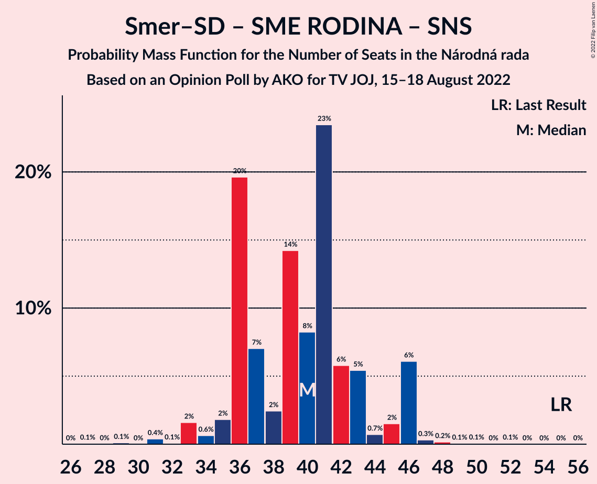

| Number of Seats | Probability | Accumulated | Special Marks |
|:---------------:|:-----------:|:-----------:|:-------------:|
| 27 | 0.1% | 100% |  |
| 28 | 0% | 99.9% |  |
| 29 | 0.1% | 99.9% |  |
| 30 | 0% | 99.8% |  |
| 31 | 0.4% | 99.8% |  |
| 32 | 0.1% | 99.4% |  |
| 33 | 2% | 99.3% |  |
| 34 | 0.6% | 98% |  |
| 35 | 2% | 97% |  |
| 36 | 20% | 95% |  |
| 37 | 7% | 76% |  |
| 38 | 2% | 69% |  |
| 39 | 14% | 66% | Median |
| 40 | 8% | 52% |  |
| 41 | 23% | 44% |  |
| 42 | 6% | 20% |  |
| 43 | 5% | 14% |  |
| 44 | 0.7% | 9% |  |
| 45 | 2% | 8% |  |
| 46 | 6% | 7% |  |
| 47 | 0.3% | 0.7% |  |
| 48 | 0.2% | 0.4% |  |
| 49 | 0.1% | 0.2% |  |
| 50 | 0.1% | 0.1% |  |
| 51 | 0% | 0.1% |  |
| 52 | 0.1% | 0.1% |  |
| 53 | 0% | 0% |  |
| 54 | 0% | 0% |  |
| 55 | 0% | 0% | Last Result |

### SMER–sociálna demokracia – SME RODINA

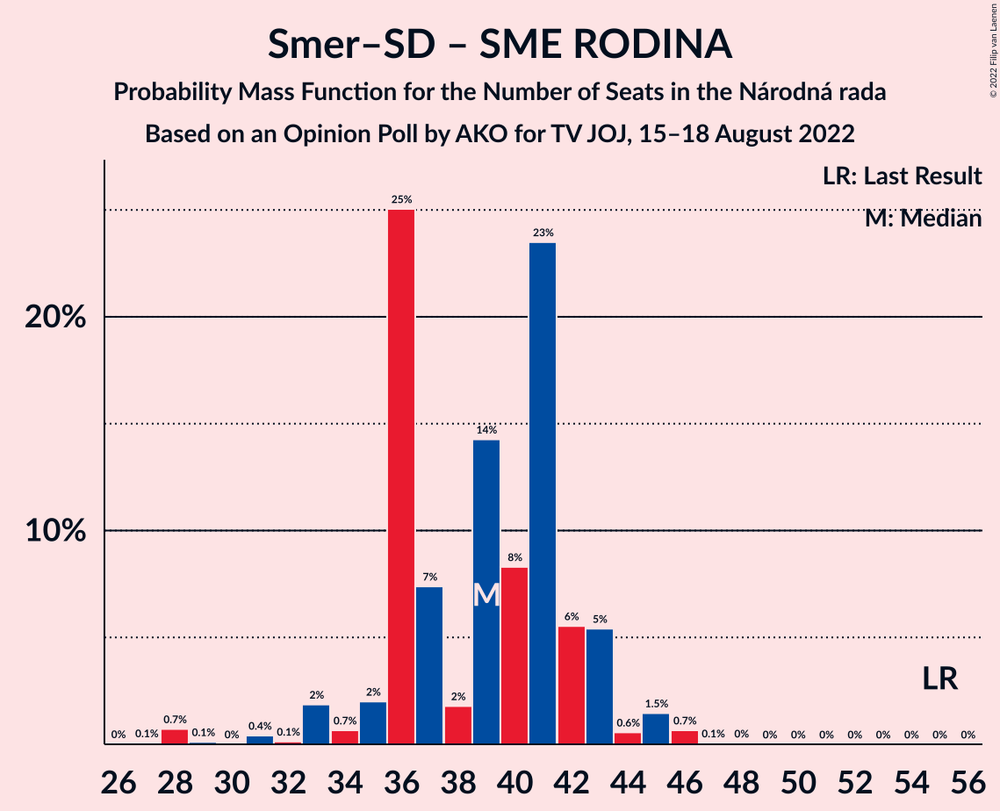

| Number of Seats | Probability | Accumulated | Special Marks |
|:---------------:|:-----------:|:-----------:|:-------------:|
| 27 | 0.1% | 100% |  |
| 28 | 0.7% | 99.9% |  |
| 29 | 0.1% | 99.2% |  |
| 30 | 0% | 99.1% |  |
| 31 | 0.4% | 99.1% |  |
| 32 | 0.1% | 98.7% |  |
| 33 | 2% | 98.5% |  |
| 34 | 0.7% | 97% |  |
| 35 | 2% | 96% |  |
| 36 | 25% | 94% |  |
| 37 | 7% | 69% |  |
| 38 | 2% | 62% |  |
| 39 | 14% | 60% | Median |
| 40 | 8% | 46% |  |
| 41 | 23% | 37% |  |
| 42 | 6% | 14% |  |
| 43 | 5% | 8% |  |
| 44 | 0.6% | 3% |  |
| 45 | 1.5% | 2% |  |
| 46 | 0.7% | 0.8% |  |
| 47 | 0.1% | 0.1% |  |
| 48 | 0% | 0% |  |
| 49 | 0% | 0% |  |
| 50 | 0% | 0% |  |
| 51 | 0% | 0% |  |
| 52 | 0% | 0% |  |
| 53 | 0% | 0% |  |
| 54 | 0% | 0% |  |
| 55 | 0% | 0% | Last Result |

### HLAS–sociálna demokracia – Slovenská národná strana

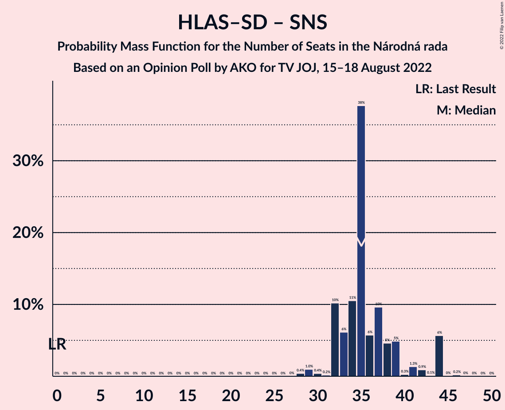

| Number of Seats | Probability | Accumulated | Special Marks |
|:---------------:|:-----------:|:-----------:|:-------------:|
| 0 | 0% | 100% | Last Result |
| 1 | 0% | 100% |  |
| 2 | 0% | 100% |  |
| 3 | 0% | 100% |  |
| 4 | 0% | 100% |  |
| 5 | 0% | 100% |  |
| 6 | 0% | 100% |  |
| 7 | 0% | 100% |  |
| 8 | 0% | 100% |  |
| 9 | 0% | 100% |  |
| 10 | 0% | 100% |  |
| 11 | 0% | 100% |  |
| 12 | 0% | 100% |  |
| 13 | 0% | 100% |  |
| 14 | 0% | 100% |  |
| 15 | 0% | 100% |  |
| 16 | 0% | 100% |  |
| 17 | 0% | 100% |  |
| 18 | 0% | 100% |  |
| 19 | 0% | 100% |  |
| 20 | 0% | 100% |  |
| 21 | 0% | 100% |  |
| 22 | 0% | 100% |  |
| 23 | 0% | 100% |  |
| 24 | 0% | 100% |  |
| 25 | 0% | 100% |  |
| 26 | 0% | 100% |  |
| 27 | 0% | 100% |  |
| 28 | 0.4% | 100% |  |
| 29 | 1.0% | 99.6% |  |
| 30 | 0.4% | 98.6% |  |
| 31 | 0.2% | 98% |  |
| 32 | 10% | 98% |  |
| 33 | 6% | 88% |  |
| 34 | 11% | 82% |  |
| 35 | 38% | 71% | Median |
| 36 | 6% | 33% |  |
| 37 | 10% | 28% |  |
| 38 | 5% | 18% |  |
| 39 | 5% | 13% |  |
| 40 | 0.3% | 9% |  |
| 41 | 1.3% | 8% |  |
| 42 | 0.9% | 7% |  |
| 43 | 0.1% | 6% |  |
| 44 | 6% | 6% |  |
| 45 | 0% | 0.3% |  |
| 46 | 0.2% | 0.3% |  |
| 47 | 0% | 0.1% |  |
| 48 | 0% | 0% |  |

### SMER–sociálna demokracia – Slovenská národná strana

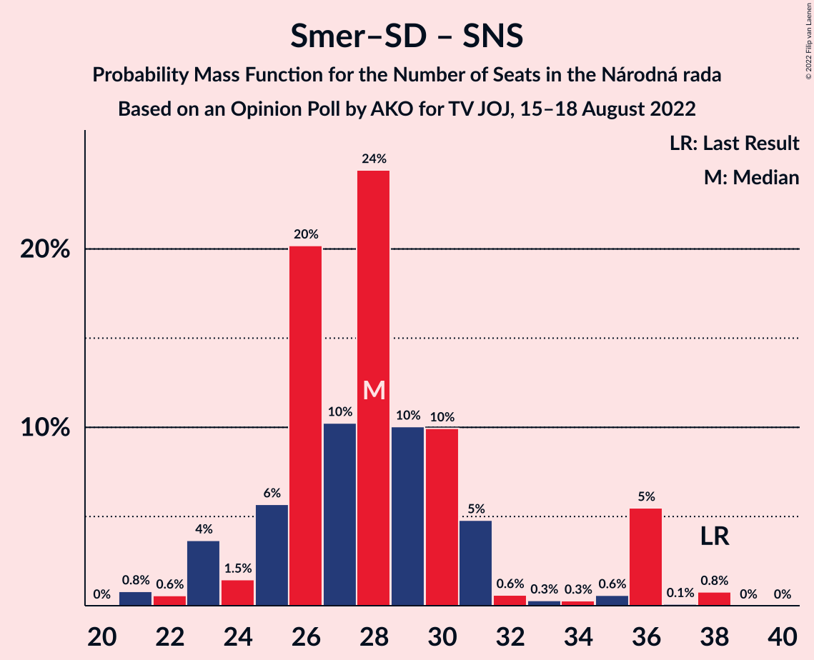

| Number of Seats | Probability | Accumulated | Special Marks |
|:---------------:|:-----------:|:-----------:|:-------------:|
| 21 | 0.8% | 100% |  |
| 22 | 0.6% | 99.2% |  |
| 23 | 4% | 98.6% |  |
| 24 | 1.5% | 95% |  |
| 25 | 6% | 93% |  |
| 26 | 20% | 88% |  |
| 27 | 10% | 68% |  |
| 28 | 24% | 57% | Median |
| 29 | 10% | 33% |  |
| 30 | 10% | 23% |  |
| 31 | 5% | 13% |  |
| 32 | 0.6% | 8% |  |
| 33 | 0.3% | 8% |  |
| 34 | 0.3% | 7% |  |
| 35 | 0.6% | 7% |  |
| 36 | 5% | 6% |  |
| 37 | 0.1% | 0.9% |  |
| 38 | 0.8% | 0.8% | Last Result |
| 39 | 0% | 0% |  |

### SMER–sociálna demokracia

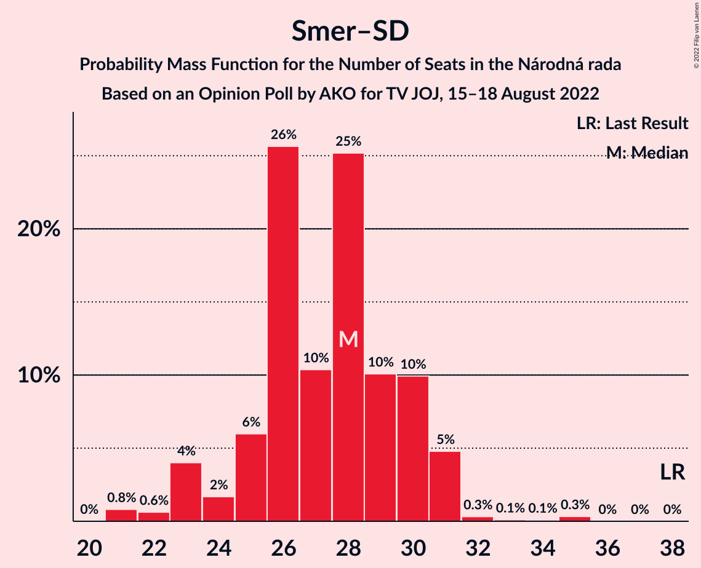

| Number of Seats | Probability | Accumulated | Special Marks |
|:---------------:|:-----------:|:-----------:|:-------------:|
| 21 | 0.8% | 100% |  |
| 22 | 0.6% | 99.2% |  |
| 23 | 4% | 98.5% |  |
| 24 | 2% | 95% |  |
| 25 | 6% | 93% |  |
| 26 | 26% | 87% |  |
| 27 | 10% | 61% |  |
| 28 | 25% | 51% | Median |
| 29 | 10% | 26% |  |
| 30 | 10% | 16% |  |
| 31 | 5% | 6% |  |
| 32 | 0.3% | 0.9% |  |
| 33 | 0.1% | 0.5% |  |
| 34 | 0.1% | 0.4% |  |
| 35 | 0.3% | 0.3% |  |
| 36 | 0% | 0% |  |
| 37 | 0% | 0% |  |
| 38 | 0% | 0% | Last Result |

## Technical Information

### Opinion Poll

+ **Polling firm:** AKO
+ **Commissioner(s):** TV JOJ
+ **Fieldwork period:** 15–18 August 2022

### Calculations

+ **Sample size:** 1000
+ **Simulations done:** 1,048,576
+ **Error estimate:** 1.91%

