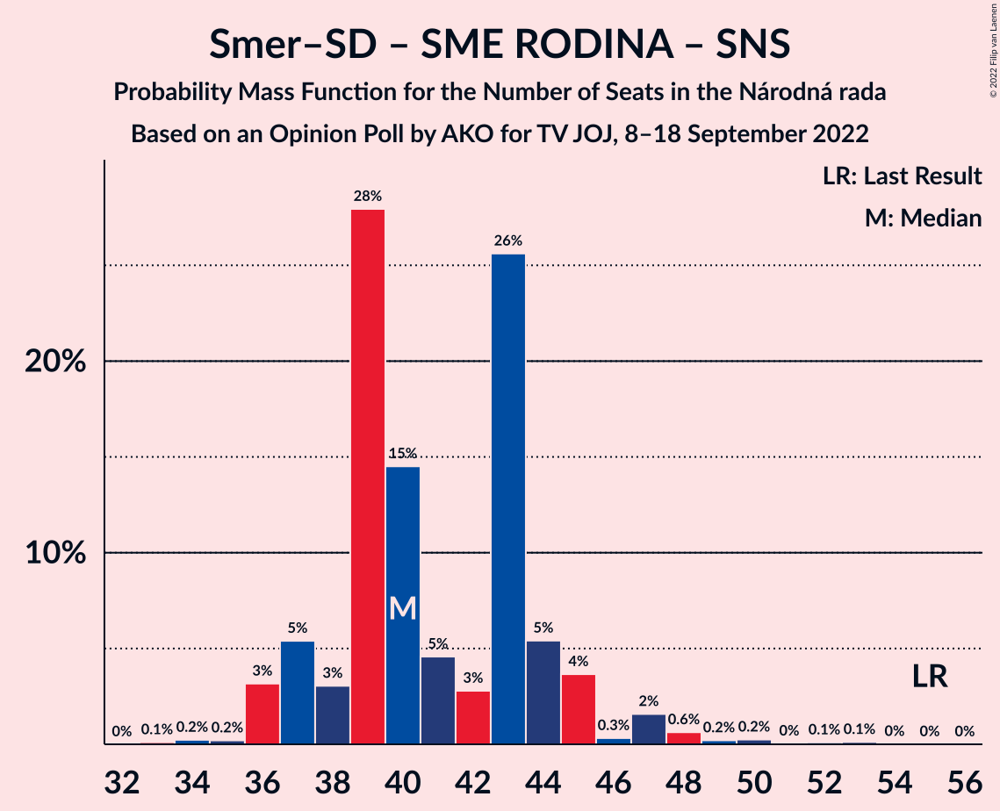
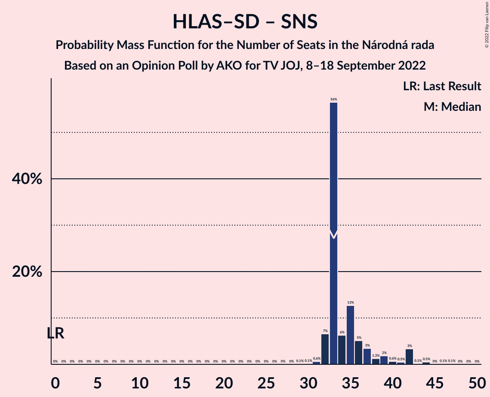

# Opinion Poll by AKO for TV JOJ, 8–18 September 2022

<a href="#voting-intentions">Voting Intentions</a> | <a href="#seats">Seats</a> | <a href="#coalitions">Coalitions</a> | <a href="#technical-information">Technical Information</a>

## Voting Intentions

### Confidence Intervals

| Party | Last Result | Poll Result | 80% Confidence Interval | 90% Confidence Interval | 95% Confidence Interval | 99% Confidence Interval |
|:-----:|:-----------:|:-----------:|:-----------------------:|:-----------------------:|:-----------------------:|:-----------------------:|
| HLAS–sociálna demokracia | 0.0% | 19.3% | 17.8–21.0% |17.3–21.5% |17.0–21.9% |16.3–22.7% |
| SMER–sociálna demokracia | 18.3% | 15.0% | 13.6–16.5% |13.2–17.0% |12.9–17.4% |12.3–18.1% |
| Sloboda a Solidarita | 6.2% | 12.9% | 11.6–14.4% |11.3–14.8% |11.0–15.1% |10.4–15.9% |
| Progresívne Slovensko | 7.0% | 10.0% | 8.9–11.3% |8.6–11.7% |8.3–12.0% |7.8–12.7% |
| OBYČAJNÍ ĽUDIA a nezávislé osobnosti | 25.0% | 7.9% | 6.9–9.1% |6.6–9.4% |6.4–9.7% |5.9–10.3% |
| SME RODINA | 8.2% | 7.6% | 6.6–8.8% |6.3–9.1% |6.1–9.4% |5.7–10.0% |
| Kresťanskodemokratické hnutie | 4.6% | 6.2% | 5.3–7.3% |5.1–7.6% |4.9–7.9% |4.5–8.4% |
| REPUBLIKA | 0.0% | 5.2% | 4.4–6.2% |4.2–6.5% |4.0–6.8% |3.6–7.3% |
| Slovenská národná strana | 3.2% | 4.2% | 3.5–5.1% |3.3–5.4% |3.1–5.6% |2.8–6.1% |
| Strana maďarskej koalície–Magyar Koalíció Pártja | 3.9% | 2.7% | 2.1–3.5% |2.0–3.7% |1.9–3.9% |1.6–4.3% |
| Kotleba–Ľudová strana Naše Slovensko | 8.0% | 2.3% | 1.8–3.0% |1.6–3.2% |1.5–3.4% |1.3–3.8% |
| Za ľudí | 5.8% | 2.3% | 1.8–3.0% |1.6–3.2% |1.5–3.4% |1.3–3.8% |
| Dobrá voľba | 3.1% | 1.0% | 0.7–1.5% |0.6–1.7% |0.5–1.8% |0.4–2.1% |

*Note:* The poll result column reflects the actual value used in the calculations. Published results may vary slightly, and in addition be rounded to fewer digits.

## Seats

### Confidence Intervals

| Party | Last Result | Median | 80% Confidence Interval | 90% Confidence Interval | 95% Confidence Interval | 99% Confidence Interval |
|:-----:|:-----------:|:------:|:-----------------------:|:-----------------------:|:-----------------------:|:-----------------------:|
| <a href="#hlas–sociálna-demokracia">HLAS–sociálna demokracia</a> | 0 | 33 | 33–36 |32–37 |32–39 |30–42 |
| <a href="#smer–sociálna-demokracia">SMER–sociálna demokracia</a> | 38 | 27 | 24–28 |23–30 |23–32 |21–33 |
| <a href="#sloboda-a-solidarita">Sloboda a Solidarita</a> | 13 | 25 | 22–26 |21–27 |21–27 |19–28 |
| <a href="#progresívne-slovensko">Progresívne Slovensko</a> | 0 | 17 | 16–20 |16–20 |15–20 |15–24 |
| <a href="#obyčajní-ľudia-a-nezávislé-osobnosti">OBYČAJNÍ ĽUDIA a nezávislé osobnosti</a> | 53 | 15 | 13–17 |12–17 |11–18 |11–18 |
| <a href="#sme-rodina">SME RODINA</a> | 17 | 14 | 12–16 |11–17 |11–17 |10–18 |
| <a href="#kresťanskodemokratické-hnutie">Kresťanskodemokratické hnutie</a> | 0 | 11 | 10–13 |10–13 |9–14 |0–15 |
| <a href="#republika">REPUBLIKA</a> | 0 | 9 | 0–10 |0–11 |0–11 |0–13 |
| <a href="#slovenská-národná-strana">Slovenská národná strana</a> | 0 | 0 | 0 |0 |0–9 |0–9 |
| <a href="#strana-maďarskej-koalície–magyar-koalíció-pártja">Strana maďarskej koalície–Magyar Koalíció Pártja</a> | 0 | 0 | 0 |0 |0 |0 |
| <a href="#kotleba–ľudová-strana-naše-slovensko">Kotleba–Ľudová strana Naše Slovensko</a> | 17 | 0 | 0 |0 |0 |0 |
| <a href="#za-ľudí">Za ľudí</a> | 12 | 0 | 0 |0 |0 |0 |
| <a href="#dobrá-voľba">Dobrá voľba</a> | 0 | 0 | 0 |0 |0 |0 |

### HLAS–sociálna demokracia

*For a full overview of the results for this party, see the [HLAS–sociálna demokracia](party-hlas–sociálnademokracia.html) page.*

| Number of Seats | Probability | Accumulated | Special Marks |
|:---------------:|:-----------:|:-----------:|:-------------:|
| 0 | 0% | 100% | Last Result |
| 1 | 0% | 100% |  |
| 2 | 0% | 100% |  |
| 3 | 0% | 100% |  |
| 4 | 0% | 100% |  |
| 5 | 0% | 100% |  |
| 6 | 0% | 100% |  |
| 7 | 0% | 100% |  |
| 8 | 0% | 100% |  |
| 9 | 0% | 100% |  |
| 10 | 0% | 100% |  |
| 11 | 0% | 100% |  |
| 12 | 0% | 100% |  |
| 13 | 0% | 100% |  |
| 14 | 0% | 100% |  |
| 15 | 0% | 100% |  |
| 16 | 0% | 100% |  |
| 17 | 0% | 100% |  |
| 18 | 0% | 100% |  |
| 19 | 0% | 100% |  |
| 20 | 0% | 100% |  |
| 21 | 0% | 100% |  |
| 22 | 0% | 100% |  |
| 23 | 0% | 100% |  |
| 24 | 0% | 100% |  |
| 25 | 0% | 100% |  |
| 26 | 0% | 100% |  |
| 27 | 0% | 100% |  |
| 28 | 0.1% | 100% |  |
| 29 | 0.3% | 99.9% |  |
| 30 | 0.3% | 99.6% |  |
| 31 | 0.7% | 99.3% |  |
| 32 | 7% | 98.6% |  |
| 33 | 60% | 92% | Median |
| 34 | 6% | 32% |  |
| 35 | 13% | 26% |  |
| 36 | 5% | 13% |  |
| 37 | 4% | 8% |  |
| 38 | 1.1% | 4% |  |
| 39 | 2% | 3% |  |
| 40 | 0.6% | 1.4% |  |
| 41 | 0.3% | 0.8% |  |
| 42 | 0% | 0.5% |  |
| 43 | 0.1% | 0.5% |  |
| 44 | 0.4% | 0.4% |  |
| 45 | 0% | 0% |  |

### SMER–sociálna demokracia

*For a full overview of the results for this party, see the [SMER–sociálna demokracia](party-smer–sociálnademokracia.html) page.*

| Number of Seats | Probability | Accumulated | Special Marks |
|:---------------:|:-----------:|:-----------:|:-------------:|
| 21 | 0.9% | 100% |  |
| 22 | 0.2% | 99.0% |  |
| 23 | 7% | 98.8% |  |
| 24 | 7% | 92% |  |
| 25 | 29% | 85% |  |
| 26 | 4% | 56% |  |
| 27 | 18% | 52% | Median |
| 28 | 25% | 34% |  |
| 29 | 3% | 9% |  |
| 30 | 2% | 7% |  |
| 31 | 2% | 5% |  |
| 32 | 0.9% | 3% |  |
| 33 | 1.4% | 2% |  |
| 34 | 0.2% | 0.5% |  |
| 35 | 0.3% | 0.3% |  |
| 36 | 0% | 0% |  |
| 37 | 0% | 0% |  |
| 38 | 0% | 0% | Last Result |

### Sloboda a Solidarita

*For a full overview of the results for this party, see the [Sloboda a Solidarita](party-slobodaasolidarita.html) page.*

| Number of Seats | Probability | Accumulated | Special Marks |
|:---------------:|:-----------:|:-----------:|:-------------:|
| 13 | 0% | 100% | Last Result |
| 14 | 0% | 100% |  |
| 15 | 0% | 100% |  |
| 16 | 0% | 100% |  |
| 17 | 0% | 100% |  |
| 18 | 0.1% | 100% |  |
| 19 | 0.4% | 99.9% |  |
| 20 | 2% | 99.5% |  |
| 21 | 5% | 98% |  |
| 22 | 4% | 93% |  |
| 23 | 5% | 89% |  |
| 24 | 7% | 84% |  |
| 25 | 57% | 77% | Median |
| 26 | 14% | 19% |  |
| 27 | 4% | 6% |  |
| 28 | 2% | 2% |  |
| 29 | 0.1% | 0.2% |  |
| 30 | 0% | 0.1% |  |
| 31 | 0.1% | 0.1% |  |
| 32 | 0% | 0% |  |

### Progresívne Slovensko

*For a full overview of the results for this party, see the [Progresívne Slovensko](party-progresívneslovensko.html) page.*

| Number of Seats | Probability | Accumulated | Special Marks |
|:---------------:|:-----------:|:-----------:|:-------------:|
| 0 | 0% | 100% | Last Result |
| 1 | 0% | 100% |  |
| 2 | 0% | 100% |  |
| 3 | 0% | 100% |  |
| 4 | 0% | 100% |  |
| 5 | 0% | 100% |  |
| 6 | 0% | 100% |  |
| 7 | 0% | 100% |  |
| 8 | 0% | 100% |  |
| 9 | 0% | 100% |  |
| 10 | 0% | 100% |  |
| 11 | 0% | 100% |  |
| 12 | 0% | 100% |  |
| 13 | 0.1% | 100% |  |
| 14 | 0.2% | 99.9% |  |
| 15 | 3% | 99.8% |  |
| 16 | 31% | 96% |  |
| 17 | 45% | 65% | Median |
| 18 | 5% | 20% |  |
| 19 | 5% | 15% |  |
| 20 | 8% | 10% |  |
| 21 | 0.5% | 2% |  |
| 22 | 0.1% | 2% |  |
| 23 | 0.2% | 2% |  |
| 24 | 1.3% | 2% |  |
| 25 | 0.1% | 0.2% |  |
| 26 | 0.1% | 0.1% |  |
| 27 | 0% | 0% |  |

### OBYČAJNÍ ĽUDIA a nezávislé osobnosti

*For a full overview of the results for this party, see the [OBYČAJNÍ ĽUDIA a nezávislé osobnosti](party-obyčajníľudiaanezávisléosobnosti.html) page.*

| Number of Seats | Probability | Accumulated | Special Marks |
|:---------------:|:-----------:|:-----------:|:-------------:|
| 9 | 0.1% | 100% |  |
| 10 | 0.2% | 99.9% |  |
| 11 | 4% | 99.7% |  |
| 12 | 2% | 96% |  |
| 13 | 9% | 94% |  |
| 14 | 27% | 85% |  |
| 15 | 10% | 58% | Median |
| 16 | 37% | 48% |  |
| 17 | 7% | 11% |  |
| 18 | 4% | 4% |  |
| 19 | 0.2% | 0.3% |  |
| 20 | 0% | 0% |  |
| 21 | 0% | 0% |  |
| 22 | 0% | 0% |  |
| 23 | 0% | 0% |  |
| 24 | 0% | 0% |  |
| 25 | 0% | 0% |  |
| 26 | 0% | 0% |  |
| 27 | 0% | 0% |  |
| 28 | 0% | 0% |  |
| 29 | 0% | 0% |  |
| 30 | 0% | 0% |  |
| 31 | 0% | 0% |  |
| 32 | 0% | 0% |  |
| 33 | 0% | 0% |  |
| 34 | 0% | 0% |  |
| 35 | 0% | 0% |  |
| 36 | 0% | 0% |  |
| 37 | 0% | 0% |  |
| 38 | 0% | 0% |  |
| 39 | 0% | 0% |  |
| 40 | 0% | 0% |  |
| 41 | 0% | 0% |  |
| 42 | 0% | 0% |  |
| 43 | 0% | 0% |  |
| 44 | 0% | 0% |  |
| 45 | 0% | 0% |  |
| 46 | 0% | 0% |  |
| 47 | 0% | 0% |  |
| 48 | 0% | 0% |  |
| 49 | 0% | 0% |  |
| 50 | 0% | 0% |  |
| 51 | 0% | 0% |  |
| 52 | 0% | 0% |  |
| 53 | 0% | 0% | Last Result |

### SME RODINA

*For a full overview of the results for this party, see the [SME RODINA](party-smerodina.html) page.*

| Number of Seats | Probability | Accumulated | Special Marks |
|:---------------:|:-----------:|:-----------:|:-------------:|
| 9 | 0.2% | 100% |  |
| 10 | 1.0% | 99.8% |  |
| 11 | 6% | 98.9% |  |
| 12 | 4% | 93% |  |
| 13 | 22% | 89% |  |
| 14 | 33% | 67% | Median |
| 15 | 24% | 34% |  |
| 16 | 2% | 11% |  |
| 17 | 7% | 9% | Last Result |
| 18 | 2% | 2% |  |
| 19 | 0.2% | 0.3% |  |
| 20 | 0.1% | 0.1% |  |
| 21 | 0% | 0% |  |

### Kresťanskodemokratické hnutie

*For a full overview of the results for this party, see the [Kresťanskodemokratické hnutie](party-kresťanskodemokratickéhnutie.html) page.*

| Number of Seats | Probability | Accumulated | Special Marks |
|:---------------:|:-----------:|:-----------:|:-------------:|
| 0 | 1.0% | 100% | Last Result |
| 1 | 0% | 99.0% |  |
| 2 | 0% | 99.0% |  |
| 3 | 0% | 99.0% |  |
| 4 | 0% | 99.0% |  |
| 5 | 0% | 99.0% |  |
| 6 | 0% | 99.0% |  |
| 7 | 0% | 99.0% |  |
| 8 | 0% | 99.0% |  |
| 9 | 2% | 99.0% |  |
| 10 | 33% | 97% |  |
| 11 | 37% | 64% | Median |
| 12 | 13% | 27% |  |
| 13 | 11% | 14% |  |
| 14 | 0.9% | 3% |  |
| 15 | 2% | 2% |  |
| 16 | 0.1% | 0.2% |  |
| 17 | 0% | 0% |  |

### REPUBLIKA

*For a full overview of the results for this party, see the [REPUBLIKA](party-republika.html) page.*

| Number of Seats | Probability | Accumulated | Special Marks |
|:---------------:|:-----------:|:-----------:|:-------------:|
| 0 | 19% | 100% | Last Result |
| 1 | 0% | 81% |  |
| 2 | 0% | 81% |  |
| 3 | 0% | 81% |  |
| 4 | 0% | 81% |  |
| 5 | 0% | 81% |  |
| 6 | 0% | 81% |  |
| 7 | 0% | 81% |  |
| 8 | 0% | 81% |  |
| 9 | 60% | 81% | Median |
| 10 | 15% | 21% |  |
| 11 | 4% | 6% |  |
| 12 | 0.4% | 2% |  |
| 13 | 2% | 2% |  |
| 14 | 0% | 0.1% |  |
| 15 | 0% | 0% |  |

### Slovenská národná strana

*For a full overview of the results for this party, see the [Slovenská národná strana](party-slovenskánárodnástrana.html) page.*

| Number of Seats | Probability | Accumulated | Special Marks |
|:---------------:|:-----------:|:-----------:|:-------------:|
| 0 | 96% | 100% | Last Result, Median |
| 1 | 0% | 4% |  |
| 2 | 0% | 4% |  |
| 3 | 0% | 4% |  |
| 4 | 0% | 4% |  |
| 5 | 0% | 4% |  |
| 6 | 0% | 4% |  |
| 7 | 0% | 4% |  |
| 8 | 0% | 4% |  |
| 9 | 4% | 4% |  |
| 10 | 0.2% | 0.3% |  |
| 11 | 0.1% | 0.1% |  |
| 12 | 0% | 0% |  |

### Strana maďarskej koalície–Magyar Koalíció Pártja

*For a full overview of the results for this party, see the [Strana maďarskej koalície–Magyar Koalíció Pártja](party-stranamaďarskejkoalície–magyarkoalíciópártja.html) page.*

| Number of Seats | Probability | Accumulated | Special Marks |
|:---------------:|:-----------:|:-----------:|:-------------:|
| 0 | 100% | 100% | Last Result, Median |

### Kotleba–Ľudová strana Naše Slovensko

*For a full overview of the results for this party, see the [Kotleba–Ľudová strana Naše Slovensko](party-kotleba–ľudovástrananašeslovensko.html) page.*

| Number of Seats | Probability | Accumulated | Special Marks |
|:---------------:|:-----------:|:-----------:|:-------------:|
| 0 | 100% | 100% | Median |
| 1 | 0% | 0% |  |
| 2 | 0% | 0% |  |
| 3 | 0% | 0% |  |
| 4 | 0% | 0% |  |
| 5 | 0% | 0% |  |
| 6 | 0% | 0% |  |
| 7 | 0% | 0% |  |
| 8 | 0% | 0% |  |
| 9 | 0% | 0% |  |
| 10 | 0% | 0% |  |
| 11 | 0% | 0% |  |
| 12 | 0% | 0% |  |
| 13 | 0% | 0% |  |
| 14 | 0% | 0% |  |
| 15 | 0% | 0% |  |
| 16 | 0% | 0% |  |
| 17 | 0% | 0% | Last Result |

### Za ľudí

*For a full overview of the results for this party, see the [Za ľudí](party-zaľudí.html) page.*

| Number of Seats | Probability | Accumulated | Special Marks |
|:---------------:|:-----------:|:-----------:|:-------------:|
| 0 | 100% | 100% | Median |
| 1 | 0% | 0% |  |
| 2 | 0% | 0% |  |
| 3 | 0% | 0% |  |
| 4 | 0% | 0% |  |
| 5 | 0% | 0% |  |
| 6 | 0% | 0% |  |
| 7 | 0% | 0% |  |
| 8 | 0% | 0% |  |
| 9 | 0% | 0% |  |
| 10 | 0% | 0% |  |
| 11 | 0% | 0% |  |
| 12 | 0% | 0% | Last Result |

### Dobrá voľba

*For a full overview of the results for this party, see the [Dobrá voľba](party-dobrávoľba.html) page.*

| Number of Seats | Probability | Accumulated | Special Marks |
|:---------------:|:-----------:|:-----------:|:-------------:|
| 0 | 100% | 100% | Last Result, Median |

## Coalitions

### Confidence Intervals

| Coalition | Last Result | Median | Majority? | 80% Confidence Interval | 90% Confidence Interval | 95% Confidence Interval | 99% Confidence Interval |
|:---------:|:-----------:|:------:|:---------:|:-----------------------:|:-----------------------:|:-----------------------:|:-----------------------:|
| HLAS–sociálna demokracia – SMER–sociálna demokracia – SME RODINA – Slovenská národná strana – Kotleba–Ľudová strana Naše Slovensko | 72 | 75 | 46% | 72–79 | 71–80 | 71–81 | 69–85 |
| HLAS–sociálna demokracia – SMER–sociálna demokracia – SME RODINA – Slovenská národná strana | 55 | 75 | 46% | 72–79 | 71–80 | 71–81 | 69–85 |
| HLAS–sociálna demokracia – SMER–sociálna demokracia – SME RODINA | 55 | 74 | 42% | 71–79 | 71–79 | 67–81 | 67–83 |
| HLAS–sociálna demokracia – SMER–sociálna demokracia – Slovenská národná strana | 38 | 61 | 0% | 58–65 | 58–66 | 58–67 | 55–71 |
| HLAS–sociálna demokracia – SME RODINA – Slovenská národná strana – Kotleba–Ľudová strana Naše Slovensko | 34 | 48 | 0% | 46–52 | 44–53 | 44–54 | 43–57 |
| HLAS–sociálna demokracia – SME RODINA | 17 | 48 | 0% | 45–51 | 44–52 | 44–54 | 43–56 |
| HLAS–sociálna demokracia – SME RODINA – Slovenská národná strana | 17 | 48 | 0% | 46–52 | 44–53 | 44–54 | 43–57 |
| SMER–sociálna demokracia – SME RODINA – Slovenská národná strana – Kotleba–Ľudová strana Naše Slovensko | 72 | 40 | 0% | 38–44 | 37–45 | 36–47 | 35–50 |
| SMER–sociálna demokracia – SME RODINA – Slovenská národná strana | 55 | 40 | 0% | 38–44 | 37–45 | 36–47 | 35–50 |
| SMER–sociálna demokracia – SME RODINA | 55 | 40 | 0% | 37–44 | 36–45 | 34–45 | 34–48 |
| HLAS–sociálna demokracia – Slovenská národná strana | 0 | 33 | 0% | 33–37 | 32–40 | 32–42 | 31–44 |
| SMER–sociálna demokracia – Slovenská národná strana | 38 | 27 | 0% | 24–30 | 24–32 | 23–33 | 21–36 |
| SMER–sociálna demokracia | 38 | 27 | 0% | 24–28 | 23–30 | 23–32 | 21–33 |

### HLAS–sociálna demokracia – SMER–sociálna demokracia – SME RODINA – Slovenská národná strana – Kotleba–Ľudová strana Naše Slovensko

| Number of Seats | Probability | Accumulated | Special Marks |
|:---------------:|:-----------:|:-----------:|:-------------:|
| 68 | 0.2% | 100% |  |
| 69 | 0.9% | 99.8% |  |
| 70 | 0.1% | 98.9% |  |
| 71 | 5% | 98.8% |  |
| 72 | 31% | 93% | Last Result |
| 73 | 8% | 62% |  |
| 74 | 2% | 54% | Median |
| 75 | 6% | 52% |  |
| 76 | 29% | 46% | Majority |
| 77 | 2% | 17% |  |
| 78 | 4% | 15% |  |
| 79 | 6% | 12% |  |
| 80 | 2% | 6% |  |
| 81 | 1.5% | 4% |  |
| 82 | 0.9% | 2% |  |
| 83 | 0.6% | 1.3% |  |
| 84 | 0.2% | 0.8% |  |
| 85 | 0.1% | 0.5% |  |
| 86 | 0.2% | 0.4% |  |
| 87 | 0.1% | 0.2% |  |
| 88 | 0% | 0.1% |  |
| 89 | 0.1% | 0.1% |  |
| 90 | 0% | 0% |  |

### HLAS–sociálna demokracia – SMER–sociálna demokracia – SME RODINA – Slovenská národná strana

| Number of Seats | Probability | Accumulated | Special Marks |
|:---------------:|:-----------:|:-----------:|:-------------:|
| 55 | 0% | 100% | Last Result |
| 56 | 0% | 100% |  |
| 57 | 0% | 100% |  |
| 58 | 0% | 100% |  |
| 59 | 0% | 100% |  |
| 60 | 0% | 100% |  |
| 61 | 0% | 100% |  |
| 62 | 0% | 100% |  |
| 63 | 0% | 100% |  |
| 64 | 0% | 100% |  |
| 65 | 0% | 100% |  |
| 66 | 0% | 100% |  |
| 67 | 0% | 100% |  |
| 68 | 0.2% | 100% |  |
| 69 | 0.9% | 99.8% |  |
| 70 | 0.1% | 98.9% |  |
| 71 | 5% | 98.8% |  |
| 72 | 31% | 93% |  |
| 73 | 8% | 62% |  |
| 74 | 2% | 54% | Median |
| 75 | 6% | 52% |  |
| 76 | 29% | 46% | Majority |
| 77 | 2% | 17% |  |
| 78 | 4% | 15% |  |
| 79 | 6% | 12% |  |
| 80 | 2% | 6% |  |
| 81 | 1.5% | 4% |  |
| 82 | 0.9% | 2% |  |
| 83 | 0.6% | 1.3% |  |
| 84 | 0.2% | 0.8% |  |
| 85 | 0.1% | 0.5% |  |
| 86 | 0.2% | 0.4% |  |
| 87 | 0.1% | 0.2% |  |
| 88 | 0% | 0.1% |  |
| 89 | 0.1% | 0.1% |  |
| 90 | 0% | 0% |  |

### HLAS–sociálna demokracia – SMER–sociálna demokracia – SME RODINA

| Number of Seats | Probability | Accumulated | Special Marks |
|:---------------:|:-----------:|:-----------:|:-------------:|
| 55 | 0% | 100% | Last Result |
| 56 | 0% | 100% |  |
| 57 | 0% | 100% |  |
| 58 | 0% | 100% |  |
| 59 | 0% | 100% |  |
| 60 | 0% | 100% |  |
| 61 | 0% | 100% |  |
| 62 | 0.2% | 100% |  |
| 63 | 0% | 99.8% |  |
| 64 | 0% | 99.8% |  |
| 65 | 0% | 99.8% |  |
| 66 | 0% | 99.8% |  |
| 67 | 3% | 99.7% |  |
| 68 | 0.3% | 96% |  |
| 69 | 0.9% | 96% |  |
| 70 | 0.1% | 95% |  |
| 71 | 5% | 95% |  |
| 72 | 31% | 90% |  |
| 73 | 8% | 58% |  |
| 74 | 2% | 50% | Median |
| 75 | 6% | 48% |  |
| 76 | 26% | 42% | Majority |
| 77 | 2% | 17% |  |
| 78 | 4% | 15% |  |
| 79 | 6% | 11% |  |
| 80 | 2% | 5% |  |
| 81 | 1.4% | 3% |  |
| 82 | 0.8% | 2% |  |
| 83 | 0.5% | 0.9% |  |
| 84 | 0.1% | 0.4% |  |
| 85 | 0% | 0.2% |  |
| 86 | 0.1% | 0.2% |  |
| 87 | 0% | 0.1% |  |
| 88 | 0% | 0.1% |  |
| 89 | 0.1% | 0.1% |  |
| 90 | 0% | 0% |  |

### HLAS–sociálna demokracia – SMER–sociálna demokracia – Slovenská národná strana

| Number of Seats | Probability | Accumulated | Special Marks |
|:---------------:|:-----------:|:-----------:|:-------------:|
| 38 | 0% | 100% | Last Result |
| 39 | 0% | 100% |  |
| 40 | 0% | 100% |  |
| 41 | 0% | 100% |  |
| 42 | 0% | 100% |  |
| 43 | 0% | 100% |  |
| 44 | 0% | 100% |  |
| 45 | 0% | 100% |  |
| 46 | 0% | 100% |  |
| 47 | 0% | 100% |  |
| 48 | 0% | 100% |  |
| 49 | 0% | 100% |  |
| 50 | 0% | 100% |  |
| 51 | 0% | 100% |  |
| 52 | 0% | 100% |  |
| 53 | 0% | 100% |  |
| 54 | 0.3% | 100% |  |
| 55 | 0.4% | 99.6% |  |
| 56 | 1.1% | 99.2% |  |
| 57 | 0.2% | 98% |  |
| 58 | 30% | 98% |  |
| 59 | 6% | 68% |  |
| 60 | 11% | 62% | Median |
| 61 | 25% | 51% |  |
| 62 | 7% | 26% |  |
| 63 | 3% | 19% |  |
| 64 | 3% | 15% |  |
| 65 | 7% | 12% |  |
| 66 | 2% | 5% |  |
| 67 | 2% | 3% |  |
| 68 | 0.3% | 1.5% |  |
| 69 | 0.2% | 1.2% |  |
| 70 | 0.1% | 1.0% |  |
| 71 | 0.6% | 1.0% |  |
| 72 | 0.1% | 0.3% |  |
| 73 | 0.1% | 0.3% |  |
| 74 | 0.1% | 0.1% |  |
| 75 | 0% | 0.1% |  |
| 76 | 0% | 0% | Majority |

### HLAS–sociálna demokracia – SME RODINA – Slovenská národná strana – Kotleba–Ľudová strana Naše Slovensko

| Number of Seats | Probability | Accumulated | Special Marks |
|:---------------:|:-----------:|:-----------:|:-------------:|
| 34 | 0% | 100% | Last Result |
| 35 | 0% | 100% |  |
| 36 | 0% | 100% |  |
| 37 | 0% | 100% |  |
| 38 | 0% | 100% |  |
| 39 | 0% | 100% |  |
| 40 | 0% | 100% |  |
| 41 | 0% | 100% |  |
| 42 | 0.1% | 100% |  |
| 43 | 0.8% | 99.8% |  |
| 44 | 4% | 99.0% |  |
| 45 | 2% | 95% |  |
| 46 | 7% | 93% |  |
| 47 | 29% | 86% | Median |
| 48 | 32% | 58% |  |
| 49 | 6% | 26% |  |
| 50 | 4% | 20% |  |
| 51 | 4% | 16% |  |
| 52 | 4% | 12% |  |
| 53 | 5% | 8% |  |
| 54 | 2% | 4% |  |
| 55 | 0.4% | 2% |  |
| 56 | 0.7% | 1.5% |  |
| 57 | 0.3% | 0.8% |  |
| 58 | 0.3% | 0.5% |  |
| 59 | 0.1% | 0.2% |  |
| 60 | 0.1% | 0.1% |  |
| 61 | 0% | 0% |  |

### HLAS–sociálna demokracia – SME RODINA

| Number of Seats | Probability | Accumulated | Special Marks |
|:---------------:|:-----------:|:-----------:|:-------------:|
| 17 | 0% | 100% | Last Result |
| 18 | 0% | 100% |  |
| 19 | 0% | 100% |  |
| 20 | 0% | 100% |  |
| 21 | 0% | 100% |  |
| 22 | 0% | 100% |  |
| 23 | 0% | 100% |  |
| 24 | 0% | 100% |  |
| 25 | 0% | 100% |  |
| 26 | 0% | 100% |  |
| 27 | 0% | 100% |  |
| 28 | 0% | 100% |  |
| 29 | 0% | 100% |  |
| 30 | 0% | 100% |  |
| 31 | 0% | 100% |  |
| 32 | 0% | 100% |  |
| 33 | 0% | 100% |  |
| 34 | 0% | 100% |  |
| 35 | 0% | 100% |  |
| 36 | 0% | 100% |  |
| 37 | 0% | 100% |  |
| 38 | 0% | 100% |  |
| 39 | 0% | 100% |  |
| 40 | 0.1% | 100% |  |
| 41 | 0.2% | 99.9% |  |
| 42 | 0.2% | 99.7% |  |
| 43 | 1.0% | 99.5% |  |
| 44 | 8% | 98.6% |  |
| 45 | 2% | 91% |  |
| 46 | 7% | 89% |  |
| 47 | 29% | 83% | Median |
| 48 | 32% | 54% |  |
| 49 | 6% | 22% |  |
| 50 | 3% | 15% |  |
| 51 | 4% | 12% |  |
| 52 | 4% | 8% |  |
| 53 | 1.4% | 4% |  |
| 54 | 2% | 3% |  |
| 55 | 0.3% | 1.2% |  |
| 56 | 0.6% | 0.9% |  |
| 57 | 0.2% | 0.3% |  |
| 58 | 0.1% | 0.1% |  |
| 59 | 0% | 0% |  |

### HLAS–sociálna demokracia – SME RODINA – Slovenská národná strana

| Number of Seats | Probability | Accumulated | Special Marks |
|:---------------:|:-----------:|:-----------:|:-------------:|
| 17 | 0% | 100% | Last Result |
| 18 | 0% | 100% |  |
| 19 | 0% | 100% |  |
| 20 | 0% | 100% |  |
| 21 | 0% | 100% |  |
| 22 | 0% | 100% |  |
| 23 | 0% | 100% |  |
| 24 | 0% | 100% |  |
| 25 | 0% | 100% |  |
| 26 | 0% | 100% |  |
| 27 | 0% | 100% |  |
| 28 | 0% | 100% |  |
| 29 | 0% | 100% |  |
| 30 | 0% | 100% |  |
| 31 | 0% | 100% |  |
| 32 | 0% | 100% |  |
| 33 | 0% | 100% |  |
| 34 | 0% | 100% |  |
| 35 | 0% | 100% |  |
| 36 | 0% | 100% |  |
| 37 | 0% | 100% |  |
| 38 | 0% | 100% |  |
| 39 | 0% | 100% |  |
| 40 | 0% | 100% |  |
| 41 | 0% | 100% |  |
| 42 | 0.1% | 100% |  |
| 43 | 0.8% | 99.8% |  |
| 44 | 4% | 99.0% |  |
| 45 | 2% | 95% |  |
| 46 | 7% | 93% |  |
| 47 | 29% | 86% | Median |
| 48 | 32% | 58% |  |
| 49 | 6% | 26% |  |
| 50 | 4% | 20% |  |
| 51 | 4% | 16% |  |
| 52 | 4% | 12% |  |
| 53 | 5% | 8% |  |
| 54 | 2% | 4% |  |
| 55 | 0.4% | 2% |  |
| 56 | 0.7% | 1.5% |  |
| 57 | 0.3% | 0.8% |  |
| 58 | 0.3% | 0.5% |  |
| 59 | 0.1% | 0.2% |  |
| 60 | 0.1% | 0.1% |  |
| 61 | 0% | 0% |  |

### SMER–sociálna demokracia – SME RODINA – Slovenská národná strana – Kotleba–Ľudová strana Naše Slovensko

| Number of Seats | Probability | Accumulated | Special Marks |
|:---------------:|:-----------:|:-----------:|:-------------:|
| 33 | 0.1% | 100% |  |
| 34 | 0.2% | 99.9% |  |
| 35 | 0.2% | 99.6% |  |
| 36 | 3% | 99.4% |  |
| 37 | 5% | 96% |  |
| 38 | 3% | 91% |  |
| 39 | 28% | 88% |  |
| 40 | 15% | 60% |  |
| 41 | 5% | 45% | Median |
| 42 | 3% | 41% |  |
| 43 | 26% | 38% |  |
| 44 | 5% | 12% |  |
| 45 | 4% | 7% |  |
| 46 | 0.3% | 3% |  |
| 47 | 2% | 3% |  |
| 48 | 0.6% | 1.4% |  |
| 49 | 0.2% | 0.8% |  |
| 50 | 0.2% | 0.5% |  |
| 51 | 0% | 0.3% |  |
| 52 | 0.1% | 0.3% |  |
| 53 | 0.1% | 0.2% |  |
| 54 | 0% | 0% |  |
| 55 | 0% | 0% |  |
| 56 | 0% | 0% |  |
| 57 | 0% | 0% |  |
| 58 | 0% | 0% |  |
| 59 | 0% | 0% |  |
| 60 | 0% | 0% |  |
| 61 | 0% | 0% |  |
| 62 | 0% | 0% |  |
| 63 | 0% | 0% |  |
| 64 | 0% | 0% |  |
| 65 | 0% | 0% |  |
| 66 | 0% | 0% |  |
| 67 | 0% | 0% |  |
| 68 | 0% | 0% |  |
| 69 | 0% | 0% |  |
| 70 | 0% | 0% |  |
| 71 | 0% | 0% |  |
| 72 | 0% | 0% | Last Result |

### SMER–sociálna demokracia – SME RODINA – Slovenská národná strana

| Number of Seats | Probability | Accumulated | Special Marks |
|:---------------:|:-----------:|:-----------:|:-------------:|
| 33 | 0.1% | 100% |  |
| 34 | 0.2% | 99.9% |  |
| 35 | 0.2% | 99.6% |  |
| 36 | 3% | 99.4% |  |
| 37 | 5% | 96% |  |
| 38 | 3% | 91% |  |
| 39 | 28% | 88% |  |
| 40 | 15% | 60% |  |
| 41 | 5% | 45% | Median |
| 42 | 3% | 41% |  |
| 43 | 26% | 38% |  |
| 44 | 5% | 12% |  |
| 45 | 4% | 7% |  |
| 46 | 0.3% | 3% |  |
| 47 | 2% | 3% |  |
| 48 | 0.6% | 1.4% |  |
| 49 | 0.2% | 0.8% |  |
| 50 | 0.2% | 0.5% |  |
| 51 | 0% | 0.3% |  |
| 52 | 0.1% | 0.3% |  |
| 53 | 0.1% | 0.2% |  |
| 54 | 0% | 0% |  |
| 55 | 0% | 0% | Last Result |

### SMER–sociálna demokracia – SME RODINA

| Number of Seats | Probability | Accumulated | Special Marks |
|:---------------:|:-----------:|:-----------:|:-------------:|
| 33 | 0.3% | 100% |  |
| 34 | 3% | 99.7% |  |
| 35 | 0.3% | 96% |  |
| 36 | 3% | 96% |  |
| 37 | 6% | 93% |  |
| 38 | 3% | 87% |  |
| 39 | 28% | 84% |  |
| 40 | 15% | 56% |  |
| 41 | 5% | 41% | Median |
| 42 | 3% | 37% |  |
| 43 | 22% | 34% |  |
| 44 | 5% | 12% |  |
| 45 | 4% | 6% |  |
| 46 | 0.2% | 2% |  |
| 47 | 1.4% | 2% |  |
| 48 | 0.5% | 0.8% |  |
| 49 | 0.1% | 0.2% |  |
| 50 | 0.1% | 0.2% |  |
| 51 | 0% | 0.1% |  |
| 52 | 0.1% | 0.1% |  |
| 53 | 0% | 0% |  |
| 54 | 0% | 0% |  |
| 55 | 0% | 0% | Last Result |

### HLAS–sociálna demokracia – Slovenská národná strana

| Number of Seats | Probability | Accumulated | Special Marks |
|:---------------:|:-----------:|:-----------:|:-------------:|
| 0 | 0% | 100% | Last Result |
| 1 | 0% | 100% |  |
| 2 | 0% | 100% |  |
| 3 | 0% | 100% |  |
| 4 | 0% | 100% |  |
| 5 | 0% | 100% |  |
| 6 | 0% | 100% |  |
| 7 | 0% | 100% |  |
| 8 | 0% | 100% |  |
| 9 | 0% | 100% |  |
| 10 | 0% | 100% |  |
| 11 | 0% | 100% |  |
| 12 | 0% | 100% |  |
| 13 | 0% | 100% |  |
| 14 | 0% | 100% |  |
| 15 | 0% | 100% |  |
| 16 | 0% | 100% |  |
| 17 | 0% | 100% |  |
| 18 | 0% | 100% |  |
| 19 | 0% | 100% |  |
| 20 | 0% | 100% |  |
| 21 | 0% | 100% |  |
| 22 | 0% | 100% |  |
| 23 | 0% | 100% |  |
| 24 | 0% | 100% |  |
| 25 | 0% | 100% |  |
| 26 | 0% | 100% |  |
| 27 | 0% | 100% |  |
| 28 | 0% | 100% |  |
| 29 | 0.1% | 100% |  |
| 30 | 0.1% | 99.9% |  |
| 31 | 0.6% | 99.7% |  |
| 32 | 7% | 99.1% |  |
| 33 | 56% | 93% | Median |
| 34 | 6% | 36% |  |
| 35 | 13% | 30% |  |
| 36 | 5% | 17% |  |
| 37 | 3% | 12% |  |
| 38 | 1.3% | 8% |  |
| 39 | 2% | 7% |  |
| 40 | 0.6% | 5% |  |
| 41 | 0.5% | 5% |  |
| 42 | 3% | 4% |  |
| 43 | 0.1% | 0.9% |  |
| 44 | 0.5% | 0.8% |  |
| 45 | 0% | 0.3% |  |
| 46 | 0.1% | 0.3% |  |
| 47 | 0.1% | 0.1% |  |
| 48 | 0% | 0% |  |

### SMER–sociálna demokracia – Slovenská národná strana

| Number of Seats | Probability | Accumulated | Special Marks |
|:---------------:|:-----------:|:-----------:|:-------------:|
| 21 | 0.7% | 100% |  |
| 22 | 0.2% | 99.2% |  |
| 23 | 3% | 99.1% |  |
| 24 | 7% | 96% |  |
| 25 | 29% | 89% |  |
| 26 | 4% | 60% |  |
| 27 | 17% | 56% | Median |
| 28 | 25% | 39% |  |
| 29 | 3% | 14% |  |
| 30 | 2% | 11% |  |
| 31 | 2% | 9% |  |
| 32 | 4% | 7% |  |
| 33 | 1.5% | 3% |  |
| 34 | 0.3% | 1.2% |  |
| 35 | 0.4% | 0.9% |  |
| 36 | 0.2% | 0.5% |  |
| 37 | 0.2% | 0.3% |  |
| 38 | 0.1% | 0.1% | Last Result |
| 39 | 0% | 0.1% |  |
| 40 | 0% | 0% |  |

### SMER–sociálna demokracia

| Number of Seats | Probability | Accumulated | Special Marks |
|:---------------:|:-----------:|:-----------:|:-------------:|
| 21 | 0.9% | 100% |  |
| 22 | 0.2% | 99.0% |  |
| 23 | 7% | 98.8% |  |
| 24 | 7% | 92% |  |
| 25 | 29% | 85% |  |
| 26 | 4% | 56% |  |
| 27 | 18% | 52% | Median |
| 28 | 25% | 34% |  |
| 29 | 3% | 9% |  |
| 30 | 2% | 7% |  |
| 31 | 2% | 5% |  |
| 32 | 0.9% | 3% |  |
| 33 | 1.4% | 2% |  |
| 34 | 0.2% | 0.5% |  |
| 35 | 0.3% | 0.3% |  |
| 36 | 0% | 0% |  |
| 37 | 0% | 0% |  |
| 38 | 0% | 0% | Last Result |

## Technical Information

### Opinion Poll

+ **Polling firm:** AKO
+ **Commissioner(s):** TV JOJ
+ **Fieldwork period:** 8–18 September 2022

### Calculations

+ **Sample size:** 1000
+ **Simulations done:** 1,048,576
+ **Error estimate:** 1.78%

