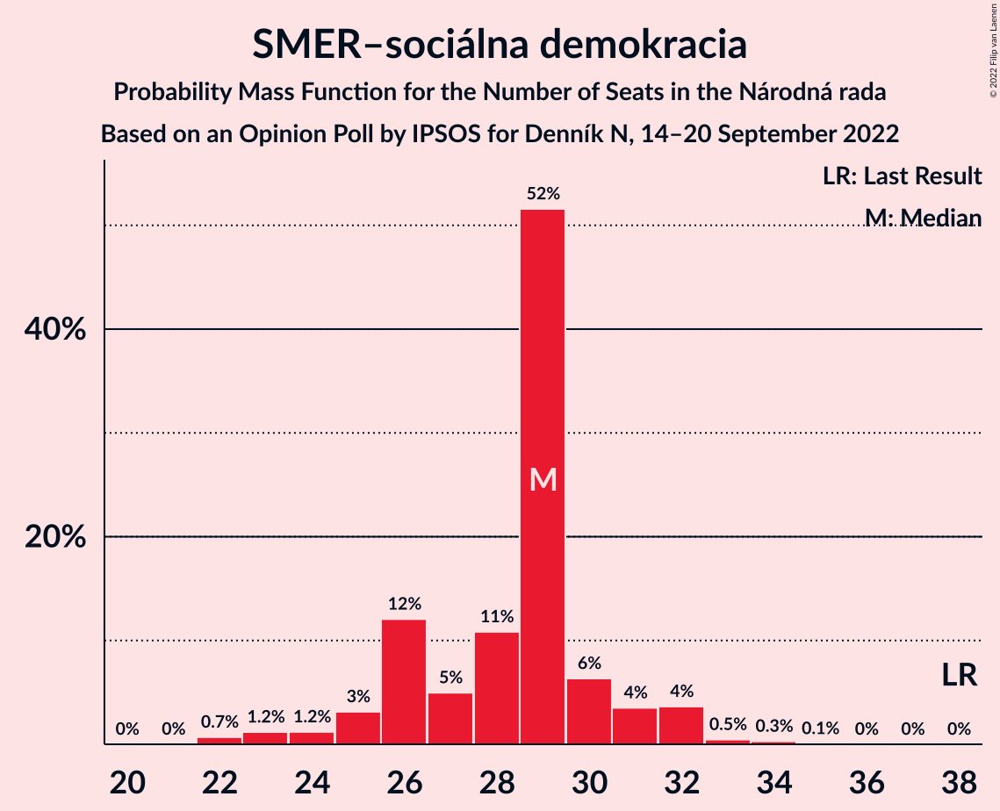
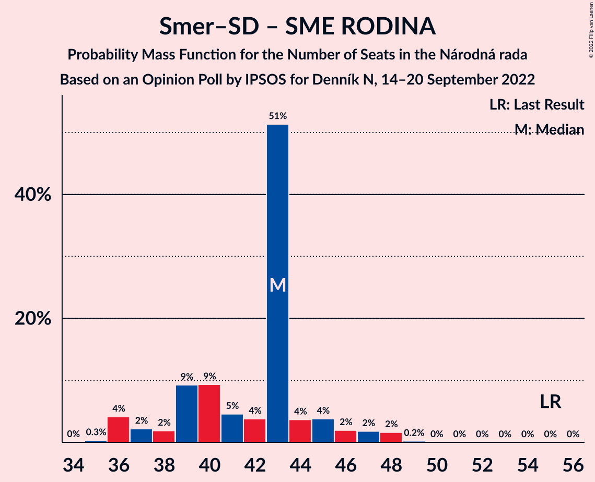
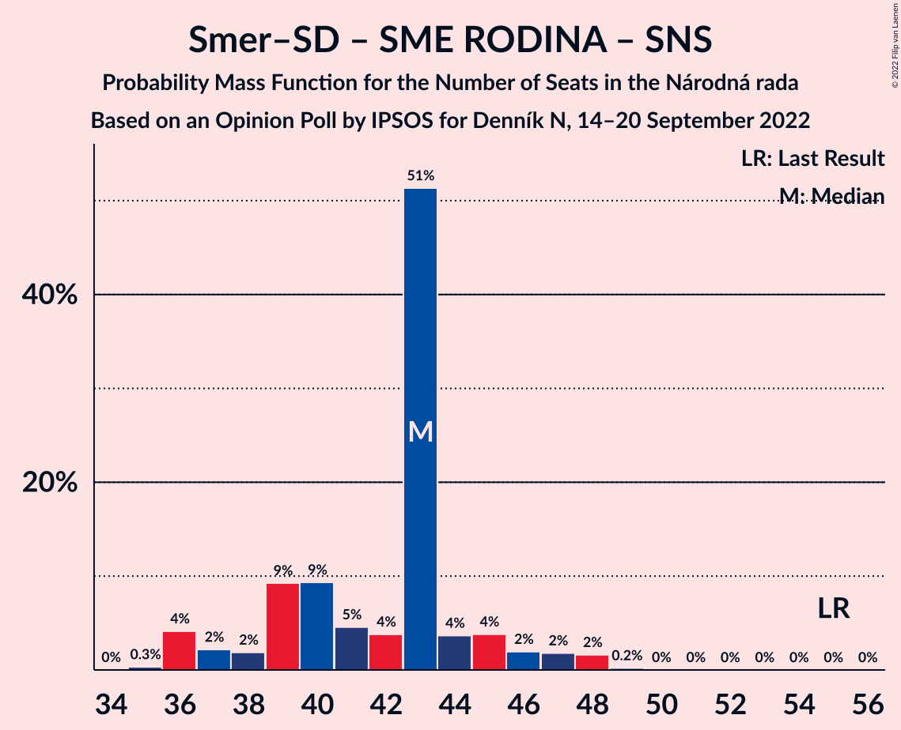

# Opinion Poll by IPSOS for Denník N, 14–20 September 2022

<a href="#voting-intentions">Voting Intentions</a> | <a href="#seats">Seats</a> | <a href="#coalitions">Coalitions</a> | <a href="#technical-information">Technical Information</a>

## Voting Intentions

### Confidence Intervals

| Party | Last Result | Poll Result | 80% Confidence Interval | 90% Confidence Interval | 95% Confidence Interval | 99% Confidence Interval |
|:-----:|:-----------:|:-----------:|:-----------------------:|:-----------------------:|:-----------------------:|:-----------------------:|
| HLAS–sociálna demokracia | 0.0% | 18.3% | 16.8–20.0% |16.4–20.5% |16.1–20.9% |15.4–21.7% |
| SMER–sociálna demokracia | 18.3% | 15.5% | 14.1–17.0% |13.7–17.5% |13.3–17.8% |12.7–18.6% |
| Progresívne Slovensko | 7.0% | 11.6% | 10.3–13.0% |10.0–13.4% |9.7–13.7% |9.2–14.4% |
| Sloboda a Solidarita | 6.2% | 9.3% | 8.2–10.5% |7.9–10.9% |7.6–11.2% |7.1–11.9% |
| OBYČAJNÍ ĽUDIA a nezávislé osobnosti | 25.0% | 7.8% | 6.8–9.0% |6.5–9.3% |6.3–9.6% |5.8–10.2% |
| SME RODINA | 8.2% | 7.5% | 6.5–8.7% |6.2–9.0% |6.0–9.3% |5.6–9.9% |
| REPUBLIKA | 0.0% | 7.0% | 6.0–8.1% |5.8–8.4% |5.6–8.7% |5.1–9.3% |
| Kresťanskodemokratické hnutie | 4.6% | 6.5% | 5.6–7.6% |5.3–7.9% |5.1–8.2% |4.7–8.7% |
| Slovenská národná strana | 3.2% | 2.8% | 2.2–3.6% |2.1–3.8% |1.9–4.0% |1.7–4.4% |
| Kotleba–Ľudová strana Naše Slovensko | 8.0% | 2.7% | 2.1–3.5% |2.0–3.7% |1.9–3.9% |1.6–4.3% |
| Strana maďarskej koalície–Magyar Koalíció Pártja | 3.9% | 2.1% | 1.6–2.8% |1.5–3.0% |1.4–3.2% |1.2–3.6% |
| Za ľudí | 5.8% | 1.7% | 1.3–2.3% |1.2–2.5% |1.1–2.7% |0.9–3.0% |

*Note:* The poll result column reflects the actual value used in the calculations. Published results may vary slightly, and in addition be rounded to fewer digits.

## Seats

### Confidence Intervals

| Party | Last Result | Median | 80% Confidence Interval | 90% Confidence Interval | 95% Confidence Interval | 99% Confidence Interval |
|:-----:|:-----------:|:------:|:-----------------------:|:-----------------------:|:-----------------------:|:-----------------------:|
| <a href="#hlas–sociálna-demokracia">HLAS–sociálna demokracia</a> | 0 | 33 | 31–35 |29–37 |29–38 |28–38 |
| <a href="#smer–sociálna-demokracia">SMER–sociálna demokracia</a> | 38 | 29 | 26–30 |25–31 |24–32 |22–33 |
| <a href="#progresívne-slovensko">Progresívne Slovensko</a> | 0 | 20 | 19–22 |18–23 |18–24 |17–26 |
| <a href="#sloboda-a-solidarita">Sloboda a Solidarita</a> | 13 | 18 | 15–19 |14–19 |14–20 |13–21 |
| <a href="#obyčajní-ľudia-a-nezávislé-osobnosti">OBYČAJNÍ ĽUDIA a nezávislé osobnosti</a> | 53 | 14 | 13–16 |12–17 |11–17 |10–19 |
| <a href="#sme-rodina">SME RODINA</a> | 17 | 14 | 11–15 |10–16 |10–16 |10–18 |
| <a href="#republika">REPUBLIKA</a> | 0 | 10 | 10–14 |10–14 |10–15 |10–17 |
| <a href="#kresťanskodemokratické-hnutie">Kresťanskodemokratické hnutie</a> | 0 | 12 | 10–13 |10–14 |0–14 |0–15 |
| <a href="#slovenská-národná-strana">Slovenská národná strana</a> | 0 | 0 | 0 |0 |0 |0 |
| <a href="#kotleba–ľudová-strana-naše-slovensko">Kotleba–Ľudová strana Naše Slovensko</a> | 17 | 0 | 0 |0 |0 |0 |
| <a href="#strana-maďarskej-koalície–magyar-koalíció-pártja">Strana maďarskej koalície–Magyar Koalíció Pártja</a> | 0 | 0 | 0 |0 |0 |0 |
| <a href="#za-ľudí">Za ľudí</a> | 12 | 0 | 0 |0 |0 |0 |

### HLAS–sociálna demokracia

*For a full overview of the results for this party, see the [HLAS–sociálna demokracia](party-hlas–sociálnademokracia.html) page.*

| Number of Seats | Probability | Accumulated | Special Marks |
|:---------------:|:-----------:|:-----------:|:-------------:|
| 0 | 0% | 100% | Last Result |
| 1 | 0% | 100% |  |
| 2 | 0% | 100% |  |
| 3 | 0% | 100% |  |
| 4 | 0% | 100% |  |
| 5 | 0% | 100% |  |
| 6 | 0% | 100% |  |
| 7 | 0% | 100% |  |
| 8 | 0% | 100% |  |
| 9 | 0% | 100% |  |
| 10 | 0% | 100% |  |
| 11 | 0% | 100% |  |
| 12 | 0% | 100% |  |
| 13 | 0% | 100% |  |
| 14 | 0% | 100% |  |
| 15 | 0% | 100% |  |
| 16 | 0% | 100% |  |
| 17 | 0% | 100% |  |
| 18 | 0% | 100% |  |
| 19 | 0% | 100% |  |
| 20 | 0% | 100% |  |
| 21 | 0% | 100% |  |
| 22 | 0% | 100% |  |
| 23 | 0% | 100% |  |
| 24 | 0% | 100% |  |
| 25 | 0% | 100% |  |
| 26 | 0.1% | 100% |  |
| 27 | 0.1% | 99.9% |  |
| 28 | 1.2% | 99.8% |  |
| 29 | 4% | 98.6% |  |
| 30 | 2% | 95% |  |
| 31 | 15% | 93% |  |
| 32 | 6% | 78% |  |
| 33 | 50% | 72% | Median |
| 34 | 7% | 22% |  |
| 35 | 6% | 14% |  |
| 36 | 1.1% | 9% |  |
| 37 | 3% | 7% |  |
| 38 | 4% | 4% |  |
| 39 | 0.1% | 0.4% |  |
| 40 | 0.2% | 0.2% |  |
| 41 | 0% | 0.1% |  |
| 42 | 0% | 0% |  |

### SMER–sociálna demokracia

*For a full overview of the results for this party, see the [SMER–sociálna demokracia](party-smer–sociálnademokracia.html) page.*

| Number of Seats | Probability | Accumulated | Special Marks |
|:---------------:|:-----------:|:-----------:|:-------------:|
| 22 | 0.7% | 100% |  |
| 23 | 1.2% | 99.3% |  |
| 24 | 1.2% | 98% |  |
| 25 | 3% | 97% |  |
| 26 | 12% | 94% |  |
| 27 | 5% | 82% |  |
| 28 | 11% | 77% |  |
| 29 | 52% | 66% | Median |
| 30 | 6% | 14% |  |
| 31 | 4% | 8% |  |
| 32 | 4% | 4% |  |
| 33 | 0.5% | 0.8% |  |
| 34 | 0.3% | 0.4% |  |
| 35 | 0.1% | 0.1% |  |
| 36 | 0% | 0% |  |
| 37 | 0% | 0% |  |
| 38 | 0% | 0% | Last Result |

### Progresívne Slovensko

*For a full overview of the results for this party, see the [Progresívne Slovensko](party-progresívneslovensko.html) page.*

| Number of Seats | Probability | Accumulated | Special Marks |
|:---------------:|:-----------:|:-----------:|:-------------:|
| 0 | 0% | 100% | Last Result |
| 1 | 0% | 100% |  |
| 2 | 0% | 100% |  |
| 3 | 0% | 100% |  |
| 4 | 0% | 100% |  |
| 5 | 0% | 100% |  |
| 6 | 0% | 100% |  |
| 7 | 0% | 100% |  |
| 8 | 0% | 100% |  |
| 9 | 0% | 100% |  |
| 10 | 0% | 100% |  |
| 11 | 0% | 100% |  |
| 12 | 0% | 100% |  |
| 13 | 0% | 100% |  |
| 14 | 0% | 100% |  |
| 15 | 0.1% | 100% |  |
| 16 | 0.4% | 99.9% |  |
| 17 | 2% | 99.6% |  |
| 18 | 5% | 98% |  |
| 19 | 6% | 92% |  |
| 20 | 51% | 86% | Median |
| 21 | 16% | 35% |  |
| 22 | 10% | 19% |  |
| 23 | 3% | 8% |  |
| 24 | 3% | 5% |  |
| 25 | 1.0% | 2% |  |
| 26 | 0.1% | 0.6% |  |
| 27 | 0.4% | 0.5% |  |
| 28 | 0% | 0% |  |

### Sloboda a Solidarita

*For a full overview of the results for this party, see the [Sloboda a Solidarita](party-slobodaasolidarita.html) page.*

| Number of Seats | Probability | Accumulated | Special Marks |
|:---------------:|:-----------:|:-----------:|:-------------:|
| 12 | 0.1% | 100% |  |
| 13 | 2% | 99.9% | Last Result |
| 14 | 4% | 98% |  |
| 15 | 7% | 94% |  |
| 16 | 14% | 88% |  |
| 17 | 8% | 74% |  |
| 18 | 54% | 65% | Median |
| 19 | 8% | 11% |  |
| 20 | 3% | 3% |  |
| 21 | 0.5% | 0.8% |  |
| 22 | 0.2% | 0.3% |  |
| 23 | 0% | 0.1% |  |
| 24 | 0% | 0% |  |

### OBYČAJNÍ ĽUDIA a nezávislé osobnosti

*For a full overview of the results for this party, see the [OBYČAJNÍ ĽUDIA a nezávislé osobnosti](party-obyčajníľudiaanezávisléosobnosti.html) page.*

| Number of Seats | Probability | Accumulated | Special Marks |
|:---------------:|:-----------:|:-----------:|:-------------:|
| 10 | 0.6% | 100% |  |
| 11 | 2% | 99.4% |  |
| 12 | 5% | 97% |  |
| 13 | 11% | 92% |  |
| 14 | 52% | 82% | Median |
| 15 | 11% | 30% |  |
| 16 | 13% | 18% |  |
| 17 | 3% | 5% |  |
| 18 | 1.2% | 2% |  |
| 19 | 0.7% | 0.7% |  |
| 20 | 0% | 0% |  |
| 21 | 0% | 0% |  |
| 22 | 0% | 0% |  |
| 23 | 0% | 0% |  |
| 24 | 0% | 0% |  |
| 25 | 0% | 0% |  |
| 26 | 0% | 0% |  |
| 27 | 0% | 0% |  |
| 28 | 0% | 0% |  |
| 29 | 0% | 0% |  |
| 30 | 0% | 0% |  |
| 31 | 0% | 0% |  |
| 32 | 0% | 0% |  |
| 33 | 0% | 0% |  |
| 34 | 0% | 0% |  |
| 35 | 0% | 0% |  |
| 36 | 0% | 0% |  |
| 37 | 0% | 0% |  |
| 38 | 0% | 0% |  |
| 39 | 0% | 0% |  |
| 40 | 0% | 0% |  |
| 41 | 0% | 0% |  |
| 42 | 0% | 0% |  |
| 43 | 0% | 0% |  |
| 44 | 0% | 0% |  |
| 45 | 0% | 0% |  |
| 46 | 0% | 0% |  |
| 47 | 0% | 0% |  |
| 48 | 0% | 0% |  |
| 49 | 0% | 0% |  |
| 50 | 0% | 0% |  |
| 51 | 0% | 0% |  |
| 52 | 0% | 0% |  |
| 53 | 0% | 0% | Last Result |

### SME RODINA

*For a full overview of the results for this party, see the [SME RODINA](party-smerodina.html) page.*

| Number of Seats | Probability | Accumulated | Special Marks |
|:---------------:|:-----------:|:-----------:|:-------------:|
| 9 | 0% | 100% |  |
| 10 | 6% | 99.9% |  |
| 11 | 9% | 94% |  |
| 12 | 3% | 85% |  |
| 13 | 10% | 83% |  |
| 14 | 55% | 73% | Median |
| 15 | 12% | 18% |  |
| 16 | 5% | 6% |  |
| 17 | 0.2% | 0.8% | Last Result |
| 18 | 0.2% | 0.5% |  |
| 19 | 0.3% | 0.3% |  |
| 20 | 0% | 0% |  |

### REPUBLIKA

*For a full overview of the results for this party, see the [REPUBLIKA](party-republika.html) page.*

| Number of Seats | Probability | Accumulated | Special Marks |
|:---------------:|:-----------:|:-----------:|:-------------:|
| 0 | 0.3% | 100% | Last Result |
| 1 | 0% | 99.7% |  |
| 2 | 0% | 99.7% |  |
| 3 | 0% | 99.7% |  |
| 4 | 0% | 99.7% |  |
| 5 | 0% | 99.7% |  |
| 6 | 0% | 99.7% |  |
| 7 | 0% | 99.7% |  |
| 8 | 0% | 99.7% |  |
| 9 | 0.2% | 99.7% |  |
| 10 | 50% | 99.5% | Median |
| 11 | 6% | 49% |  |
| 12 | 15% | 43% |  |
| 13 | 18% | 29% |  |
| 14 | 6% | 11% |  |
| 15 | 4% | 5% |  |
| 16 | 0.7% | 1.3% |  |
| 17 | 0.4% | 0.6% |  |
| 18 | 0.2% | 0.2% |  |
| 19 | 0% | 0% |  |

### Kresťanskodemokratické hnutie

*For a full overview of the results for this party, see the [Kresťanskodemokratické hnutie](party-kresťanskodemokratickéhnutie.html) page.*

| Number of Seats | Probability | Accumulated | Special Marks |
|:---------------:|:-----------:|:-----------:|:-------------:|
| 0 | 3% | 100% | Last Result |
| 1 | 0% | 97% |  |
| 2 | 0% | 97% |  |
| 3 | 0% | 97% |  |
| 4 | 0% | 97% |  |
| 5 | 0% | 97% |  |
| 6 | 0% | 97% |  |
| 7 | 0% | 97% |  |
| 8 | 0% | 97% |  |
| 9 | 0.9% | 97% |  |
| 10 | 10% | 96% |  |
| 11 | 7% | 86% |  |
| 12 | 61% | 80% | Median |
| 13 | 11% | 19% |  |
| 14 | 7% | 8% |  |
| 15 | 1.0% | 1.3% |  |
| 16 | 0.2% | 0.3% |  |
| 17 | 0% | 0.1% |  |
| 18 | 0% | 0% |  |

### Slovenská národná strana

*For a full overview of the results for this party, see the [Slovenská národná strana](party-slovenskánárodnástrana.html) page.*

| Number of Seats | Probability | Accumulated | Special Marks |
|:---------------:|:-----------:|:-----------:|:-------------:|
| 0 | 100% | 100% | Last Result, Median |

### Kotleba–Ľudová strana Naše Slovensko

*For a full overview of the results for this party, see the [Kotleba–Ľudová strana Naše Slovensko](party-kotleba–ľudovástrananašeslovensko.html) page.*

| Number of Seats | Probability | Accumulated | Special Marks |
|:---------------:|:-----------:|:-----------:|:-------------:|
| 0 | 100% | 100% | Median |
| 1 | 0% | 0% |  |
| 2 | 0% | 0% |  |
| 3 | 0% | 0% |  |
| 4 | 0% | 0% |  |
| 5 | 0% | 0% |  |
| 6 | 0% | 0% |  |
| 7 | 0% | 0% |  |
| 8 | 0% | 0% |  |
| 9 | 0% | 0% |  |
| 10 | 0% | 0% |  |
| 11 | 0% | 0% |  |
| 12 | 0% | 0% |  |
| 13 | 0% | 0% |  |
| 14 | 0% | 0% |  |
| 15 | 0% | 0% |  |
| 16 | 0% | 0% |  |
| 17 | 0% | 0% | Last Result |

### Strana maďarskej koalície–Magyar Koalíció Pártja

*For a full overview of the results for this party, see the [Strana maďarskej koalície–Magyar Koalíció Pártja](party-stranamaďarskejkoalície–magyarkoalíciópártja.html) page.*

| Number of Seats | Probability | Accumulated | Special Marks |
|:---------------:|:-----------:|:-----------:|:-------------:|
| 0 | 100% | 100% | Last Result, Median |

### Za ľudí

*For a full overview of the results for this party, see the [Za ľudí](party-zaľudí.html) page.*

| Number of Seats | Probability | Accumulated | Special Marks |
|:---------------:|:-----------:|:-----------:|:-------------:|
| 0 | 100% | 100% | Median |
| 1 | 0% | 0% |  |
| 2 | 0% | 0% |  |
| 3 | 0% | 0% |  |
| 4 | 0% | 0% |  |
| 5 | 0% | 0% |  |
| 6 | 0% | 0% |  |
| 7 | 0% | 0% |  |
| 8 | 0% | 0% |  |
| 9 | 0% | 0% |  |
| 10 | 0% | 0% |  |
| 11 | 0% | 0% |  |
| 12 | 0% | 0% | Last Result |

## Coalitions

### Confidence Intervals

| Coalition | Last Result | Median | Majority? | 80% Confidence Interval | 90% Confidence Interval | 95% Confidence Interval | 99% Confidence Interval |
|:---------:|:-----------:|:------:|:---------:|:-----------------------:|:-----------------------:|:-----------------------:|:-----------------------:|
| HLAS–sociálna demokracia – SMER–sociálna demokracia – SME RODINA – Slovenská národná strana – Kotleba–Ľudová strana Naše Slovensko | 72 | 76 | 65% | 70–77 | 70–81 | 69–81 | 68–83 |
| HLAS–sociálna demokracia – SMER–sociálna demokracia – SME RODINA | 55 | 76 | 65% | 70–77 | 70–81 | 69–81 | 68–83 |
| HLAS–sociálna demokracia – SMER–sociálna demokracia – SME RODINA – Slovenská národná strana | 55 | 76 | 65% | 70–77 | 70–81 | 69–81 | 68–83 |
| HLAS–sociálna demokracia – SMER–sociálna demokracia – Slovenská národná strana | 38 | 62 | 0% | 58–64 | 57–65 | 55–66 | 54–67 |
| HLAS–sociálna demokracia – SME RODINA – Slovenská národná strana – Kotleba–Ľudová strana Naše Slovensko | 34 | 47 | 0% | 42–49 | 42–51 | 41–53 | 39–53 |
| HLAS–sociálna demokracia – SME RODINA | 17 | 47 | 0% | 42–49 | 42–51 | 41–53 | 39–53 |
| HLAS–sociálna demokracia – SME RODINA – Slovenská národná strana | 17 | 47 | 0% | 42–49 | 42–51 | 41–53 | 39–53 |
| SMER–sociálna demokracia – SME RODINA – Slovenská národná strana – Kotleba–Ľudová strana Naše Slovensko | 72 | 43 | 0% | 39–44 | 37–46 | 36–47 | 36–48 |
| SMER–sociálna demokracia – SME RODINA | 55 | 43 | 0% | 39–44 | 37–46 | 36–47 | 36–48 |
| SMER–sociálna demokracia – SME RODINA – Slovenská národná strana | 55 | 43 | 0% | 39–44 | 37–46 | 36–47 | 36–48 |
| HLAS–sociálna demokracia – Slovenská národná strana | 0 | 33 | 0% | 31–35 | 29–37 | 29–38 | 28–38 |
| SMER–sociálna demokracia | 38 | 29 | 0% | 26–30 | 25–31 | 24–32 | 22–33 |
| SMER–sociálna demokracia – Slovenská národná strana | 38 | 29 | 0% | 26–30 | 25–31 | 24–32 | 22–33 |

### HLAS–sociálna demokracia – SMER–sociálna demokracia – SME RODINA – Slovenská národná strana – Kotleba–Ľudová strana Naše Slovensko

| Number of Seats | Probability | Accumulated | Special Marks |
|:---------------:|:-----------:|:-----------:|:-------------:|
| 65 | 0% | 100% |  |
| 66 | 0.1% | 99.9% |  |
| 67 | 0.3% | 99.8% |  |
| 68 | 1.2% | 99.5% |  |
| 69 | 3% | 98% |  |
| 70 | 8% | 96% |  |
| 71 | 9% | 88% |  |
| 72 | 4% | 79% | Last Result |
| 73 | 2% | 75% |  |
| 74 | 2% | 73% |  |
| 75 | 6% | 71% |  |
| 76 | 48% | 65% | Median, Majority |
| 77 | 9% | 18% |  |
| 78 | 2% | 9% |  |
| 79 | 0.4% | 7% |  |
| 80 | 2% | 7% |  |
| 81 | 3% | 5% |  |
| 82 | 0.3% | 2% |  |
| 83 | 1.3% | 2% |  |
| 84 | 0% | 0.2% |  |
| 85 | 0% | 0.1% |  |
| 86 | 0.1% | 0.1% |  |
| 87 | 0% | 0% |  |

### HLAS–sociálna demokracia – SMER–sociálna demokracia – SME RODINA

| Number of Seats | Probability | Accumulated | Special Marks |
|:---------------:|:-----------:|:-----------:|:-------------:|
| 55 | 0% | 100% | Last Result |
| 56 | 0% | 100% |  |
| 57 | 0% | 100% |  |
| 58 | 0% | 100% |  |
| 59 | 0% | 100% |  |
| 60 | 0% | 100% |  |
| 61 | 0% | 100% |  |
| 62 | 0% | 100% |  |
| 63 | 0% | 100% |  |
| 64 | 0% | 100% |  |
| 65 | 0% | 100% |  |
| 66 | 0.1% | 99.9% |  |
| 67 | 0.3% | 99.8% |  |
| 68 | 1.2% | 99.5% |  |
| 69 | 3% | 98% |  |
| 70 | 8% | 96% |  |
| 71 | 9% | 88% |  |
| 72 | 4% | 79% |  |
| 73 | 2% | 75% |  |
| 74 | 2% | 73% |  |
| 75 | 6% | 71% |  |
| 76 | 48% | 65% | Median, Majority |
| 77 | 9% | 18% |  |
| 78 | 2% | 9% |  |
| 79 | 0.4% | 7% |  |
| 80 | 2% | 7% |  |
| 81 | 3% | 5% |  |
| 82 | 0.3% | 2% |  |
| 83 | 1.3% | 2% |  |
| 84 | 0% | 0.2% |  |
| 85 | 0% | 0.1% |  |
| 86 | 0.1% | 0.1% |  |
| 87 | 0% | 0% |  |

### HLAS–sociálna demokracia – SMER–sociálna demokracia – SME RODINA – Slovenská národná strana

| Number of Seats | Probability | Accumulated | Special Marks |
|:---------------:|:-----------:|:-----------:|:-------------:|
| 55 | 0% | 100% | Last Result |
| 56 | 0% | 100% |  |
| 57 | 0% | 100% |  |
| 58 | 0% | 100% |  |
| 59 | 0% | 100% |  |
| 60 | 0% | 100% |  |
| 61 | 0% | 100% |  |
| 62 | 0% | 100% |  |
| 63 | 0% | 100% |  |
| 64 | 0% | 100% |  |
| 65 | 0% | 100% |  |
| 66 | 0.1% | 99.9% |  |
| 67 | 0.3% | 99.8% |  |
| 68 | 1.2% | 99.5% |  |
| 69 | 3% | 98% |  |
| 70 | 8% | 96% |  |
| 71 | 9% | 88% |  |
| 72 | 4% | 79% |  |
| 73 | 2% | 75% |  |
| 74 | 2% | 73% |  |
| 75 | 6% | 71% |  |
| 76 | 48% | 65% | Median, Majority |
| 77 | 9% | 18% |  |
| 78 | 2% | 9% |  |
| 79 | 0.4% | 7% |  |
| 80 | 2% | 7% |  |
| 81 | 3% | 5% |  |
| 82 | 0.3% | 2% |  |
| 83 | 1.3% | 2% |  |
| 84 | 0% | 0.2% |  |
| 85 | 0% | 0.1% |  |
| 86 | 0.1% | 0.1% |  |
| 87 | 0% | 0% |  |

### HLAS–sociálna demokracia – SMER–sociálna demokracia – Slovenská národná strana

| Number of Seats | Probability | Accumulated | Special Marks |
|:---------------:|:-----------:|:-----------:|:-------------:|
| 38 | 0% | 100% | Last Result |
| 39 | 0% | 100% |  |
| 40 | 0% | 100% |  |
| 41 | 0% | 100% |  |
| 42 | 0% | 100% |  |
| 43 | 0% | 100% |  |
| 44 | 0% | 100% |  |
| 45 | 0% | 100% |  |
| 46 | 0% | 100% |  |
| 47 | 0% | 100% |  |
| 48 | 0% | 100% |  |
| 49 | 0% | 100% |  |
| 50 | 0% | 100% |  |
| 51 | 0% | 100% |  |
| 52 | 0% | 100% |  |
| 53 | 0.1% | 100% |  |
| 54 | 1.5% | 99.9% |  |
| 55 | 1.0% | 98% |  |
| 56 | 1.1% | 97% |  |
| 57 | 6% | 96% |  |
| 58 | 4% | 90% |  |
| 59 | 7% | 86% |  |
| 60 | 4% | 79% |  |
| 61 | 7% | 75% |  |
| 62 | 53% | 68% | Median |
| 63 | 4% | 15% |  |
| 64 | 4% | 11% |  |
| 65 | 3% | 7% |  |
| 66 | 2% | 5% |  |
| 67 | 2% | 2% |  |
| 68 | 0.1% | 0.4% |  |
| 69 | 0% | 0.3% |  |
| 70 | 0.2% | 0.3% |  |
| 71 | 0% | 0.1% |  |
| 72 | 0% | 0% |  |

### HLAS–sociálna demokracia – SME RODINA – Slovenská národná strana – Kotleba–Ľudová strana Naše Slovensko

| Number of Seats | Probability | Accumulated | Special Marks |
|:---------------:|:-----------:|:-----------:|:-------------:|
| 34 | 0% | 100% | Last Result |
| 35 | 0% | 100% |  |
| 36 | 0% | 100% |  |
| 37 | 0% | 100% |  |
| 38 | 0% | 100% |  |
| 39 | 0.8% | 99.9% |  |
| 40 | 1.3% | 99.1% |  |
| 41 | 0.8% | 98% |  |
| 42 | 7% | 97% |  |
| 43 | 2% | 90% |  |
| 44 | 3% | 87% |  |
| 45 | 13% | 84% |  |
| 46 | 4% | 72% |  |
| 47 | 49% | 68% | Median |
| 48 | 4% | 19% |  |
| 49 | 6% | 15% |  |
| 50 | 1.4% | 9% |  |
| 51 | 4% | 8% |  |
| 52 | 1.4% | 4% |  |
| 53 | 3% | 3% |  |
| 54 | 0.1% | 0.3% |  |
| 55 | 0.1% | 0.2% |  |
| 56 | 0% | 0% |  |

### HLAS–sociálna demokracia – SME RODINA

| Number of Seats | Probability | Accumulated | Special Marks |
|:---------------:|:-----------:|:-----------:|:-------------:|
| 17 | 0% | 100% | Last Result |
| 18 | 0% | 100% |  |
| 19 | 0% | 100% |  |
| 20 | 0% | 100% |  |
| 21 | 0% | 100% |  |
| 22 | 0% | 100% |  |
| 23 | 0% | 100% |  |
| 24 | 0% | 100% |  |
| 25 | 0% | 100% |  |
| 26 | 0% | 100% |  |
| 27 | 0% | 100% |  |
| 28 | 0% | 100% |  |
| 29 | 0% | 100% |  |
| 30 | 0% | 100% |  |
| 31 | 0% | 100% |  |
| 32 | 0% | 100% |  |
| 33 | 0% | 100% |  |
| 34 | 0% | 100% |  |
| 35 | 0% | 100% |  |
| 36 | 0% | 100% |  |
| 37 | 0% | 100% |  |
| 38 | 0% | 100% |  |
| 39 | 0.8% | 99.9% |  |
| 40 | 1.3% | 99.1% |  |
| 41 | 0.8% | 98% |  |
| 42 | 7% | 97% |  |
| 43 | 2% | 90% |  |
| 44 | 3% | 87% |  |
| 45 | 13% | 84% |  |
| 46 | 4% | 71% |  |
| 47 | 49% | 68% | Median |
| 48 | 4% | 19% |  |
| 49 | 6% | 15% |  |
| 50 | 1.4% | 9% |  |
| 51 | 4% | 8% |  |
| 52 | 1.4% | 4% |  |
| 53 | 3% | 3% |  |
| 54 | 0.1% | 0.3% |  |
| 55 | 0.1% | 0.1% |  |
| 56 | 0% | 0% |  |

### HLAS–sociálna demokracia – SME RODINA – Slovenská národná strana

| Number of Seats | Probability | Accumulated | Special Marks |
|:---------------:|:-----------:|:-----------:|:-------------:|
| 17 | 0% | 100% | Last Result |
| 18 | 0% | 100% |  |
| 19 | 0% | 100% |  |
| 20 | 0% | 100% |  |
| 21 | 0% | 100% |  |
| 22 | 0% | 100% |  |
| 23 | 0% | 100% |  |
| 24 | 0% | 100% |  |
| 25 | 0% | 100% |  |
| 26 | 0% | 100% |  |
| 27 | 0% | 100% |  |
| 28 | 0% | 100% |  |
| 29 | 0% | 100% |  |
| 30 | 0% | 100% |  |
| 31 | 0% | 100% |  |
| 32 | 0% | 100% |  |
| 33 | 0% | 100% |  |
| 34 | 0% | 100% |  |
| 35 | 0% | 100% |  |
| 36 | 0% | 100% |  |
| 37 | 0% | 100% |  |
| 38 | 0% | 100% |  |
| 39 | 0.8% | 99.9% |  |
| 40 | 1.3% | 99.1% |  |
| 41 | 0.8% | 98% |  |
| 42 | 7% | 97% |  |
| 43 | 2% | 90% |  |
| 44 | 3% | 87% |  |
| 45 | 13% | 84% |  |
| 46 | 4% | 71% |  |
| 47 | 49% | 68% | Median |
| 48 | 4% | 19% |  |
| 49 | 6% | 15% |  |
| 50 | 1.4% | 9% |  |
| 51 | 4% | 8% |  |
| 52 | 1.4% | 4% |  |
| 53 | 3% | 3% |  |
| 54 | 0.1% | 0.3% |  |
| 55 | 0.1% | 0.1% |  |
| 56 | 0% | 0% |  |

### SMER–sociálna demokracia – SME RODINA – Slovenská národná strana – Kotleba–Ľudová strana Naše Slovensko

| Number of Seats | Probability | Accumulated | Special Marks |
|:---------------:|:-----------:|:-----------:|:-------------:|
| 34 | 0% | 100% |  |
| 35 | 0.3% | 99.9% |  |
| 36 | 4% | 99.6% |  |
| 37 | 2% | 95% |  |
| 38 | 2% | 93% |  |
| 39 | 9% | 91% |  |
| 40 | 9% | 82% |  |
| 41 | 5% | 73% |  |
| 42 | 4% | 68% |  |
| 43 | 51% | 64% | Median |
| 44 | 4% | 13% |  |
| 45 | 4% | 9% |  |
| 46 | 2% | 6% |  |
| 47 | 2% | 4% |  |
| 48 | 2% | 2% |  |
| 49 | 0.2% | 0.2% |  |
| 50 | 0% | 0% |  |
| 51 | 0% | 0% |  |
| 52 | 0% | 0% |  |
| 53 | 0% | 0% |  |
| 54 | 0% | 0% |  |
| 55 | 0% | 0% |  |
| 56 | 0% | 0% |  |
| 57 | 0% | 0% |  |
| 58 | 0% | 0% |  |
| 59 | 0% | 0% |  |
| 60 | 0% | 0% |  |
| 61 | 0% | 0% |  |
| 62 | 0% | 0% |  |
| 63 | 0% | 0% |  |
| 64 | 0% | 0% |  |
| 65 | 0% | 0% |  |
| 66 | 0% | 0% |  |
| 67 | 0% | 0% |  |
| 68 | 0% | 0% |  |
| 69 | 0% | 0% |  |
| 70 | 0% | 0% |  |
| 71 | 0% | 0% |  |
| 72 | 0% | 0% | Last Result |

### SMER–sociálna demokracia – SME RODINA

| Number of Seats | Probability | Accumulated | Special Marks |
|:---------------:|:-----------:|:-----------:|:-------------:|
| 34 | 0% | 100% |  |
| 35 | 0.3% | 99.9% |  |
| 36 | 4% | 99.6% |  |
| 37 | 2% | 95% |  |
| 38 | 2% | 93% |  |
| 39 | 9% | 91% |  |
| 40 | 9% | 82% |  |
| 41 | 5% | 73% |  |
| 42 | 4% | 68% |  |
| 43 | 51% | 64% | Median |
| 44 | 4% | 13% |  |
| 45 | 4% | 9% |  |
| 46 | 2% | 6% |  |
| 47 | 2% | 4% |  |
| 48 | 2% | 2% |  |
| 49 | 0.2% | 0.2% |  |
| 50 | 0% | 0% |  |
| 51 | 0% | 0% |  |
| 52 | 0% | 0% |  |
| 53 | 0% | 0% |  |
| 54 | 0% | 0% |  |
| 55 | 0% | 0% | Last Result |

### SMER–sociálna demokracia – SME RODINA – Slovenská národná strana

| Number of Seats | Probability | Accumulated | Special Marks |
|:---------------:|:-----------:|:-----------:|:-------------:|
| 34 | 0% | 100% |  |
| 35 | 0.3% | 99.9% |  |
| 36 | 4% | 99.6% |  |
| 37 | 2% | 95% |  |
| 38 | 2% | 93% |  |
| 39 | 9% | 91% |  |
| 40 | 9% | 82% |  |
| 41 | 5% | 73% |  |
| 42 | 4% | 68% |  |
| 43 | 51% | 64% | Median |
| 44 | 4% | 13% |  |
| 45 | 4% | 9% |  |
| 46 | 2% | 6% |  |
| 47 | 2% | 4% |  |
| 48 | 2% | 2% |  |
| 49 | 0.2% | 0.2% |  |
| 50 | 0% | 0% |  |
| 51 | 0% | 0% |  |
| 52 | 0% | 0% |  |
| 53 | 0% | 0% |  |
| 54 | 0% | 0% |  |
| 55 | 0% | 0% | Last Result |

### HLAS–sociálna demokracia – Slovenská národná strana

| Number of Seats | Probability | Accumulated | Special Marks |
|:---------------:|:-----------:|:-----------:|:-------------:|
| 0 | 0% | 100% | Last Result |
| 1 | 0% | 100% |  |
| 2 | 0% | 100% |  |
| 3 | 0% | 100% |  |
| 4 | 0% | 100% |  |
| 5 | 0% | 100% |  |
| 6 | 0% | 100% |  |
| 7 | 0% | 100% |  |
| 8 | 0% | 100% |  |
| 9 | 0% | 100% |  |
| 10 | 0% | 100% |  |
| 11 | 0% | 100% |  |
| 12 | 0% | 100% |  |
| 13 | 0% | 100% |  |
| 14 | 0% | 100% |  |
| 15 | 0% | 100% |  |
| 16 | 0% | 100% |  |
| 17 | 0% | 100% |  |
| 18 | 0% | 100% |  |
| 19 | 0% | 100% |  |
| 20 | 0% | 100% |  |
| 21 | 0% | 100% |  |
| 22 | 0% | 100% |  |
| 23 | 0% | 100% |  |
| 24 | 0% | 100% |  |
| 25 | 0% | 100% |  |
| 26 | 0.1% | 100% |  |
| 27 | 0.1% | 99.9% |  |
| 28 | 1.2% | 99.8% |  |
| 29 | 4% | 98.6% |  |
| 30 | 2% | 95% |  |
| 31 | 15% | 93% |  |
| 32 | 6% | 78% |  |
| 33 | 50% | 72% | Median |
| 34 | 7% | 22% |  |
| 35 | 6% | 14% |  |
| 36 | 1.1% | 9% |  |
| 37 | 3% | 7% |  |
| 38 | 4% | 4% |  |
| 39 | 0.1% | 0.4% |  |
| 40 | 0.2% | 0.2% |  |
| 41 | 0% | 0.1% |  |
| 42 | 0% | 0% |  |

### SMER–sociálna demokracia

| Number of Seats | Probability | Accumulated | Special Marks |
|:---------------:|:-----------:|:-----------:|:-------------:|
| 22 | 0.7% | 100% |  |
| 23 | 1.2% | 99.3% |  |
| 24 | 1.2% | 98% |  |
| 25 | 3% | 97% |  |
| 26 | 12% | 94% |  |
| 27 | 5% | 82% |  |
| 28 | 11% | 77% |  |
| 29 | 52% | 66% | Median |
| 30 | 6% | 14% |  |
| 31 | 4% | 8% |  |
| 32 | 4% | 4% |  |
| 33 | 0.5% | 0.8% |  |
| 34 | 0.3% | 0.4% |  |
| 35 | 0.1% | 0.1% |  |
| 36 | 0% | 0% |  |
| 37 | 0% | 0% |  |
| 38 | 0% | 0% | Last Result |

### SMER–sociálna demokracia – Slovenská národná strana

| Number of Seats | Probability | Accumulated | Special Marks |
|:---------------:|:-----------:|:-----------:|:-------------:|
| 22 | 0.7% | 100% |  |
| 23 | 1.2% | 99.3% |  |
| 24 | 1.2% | 98% |  |
| 25 | 3% | 97% |  |
| 26 | 12% | 94% |  |
| 27 | 5% | 82% |  |
| 28 | 11% | 77% |  |
| 29 | 52% | 66% | Median |
| 30 | 6% | 14% |  |
| 31 | 4% | 8% |  |
| 32 | 4% | 4% |  |
| 33 | 0.5% | 0.8% |  |
| 34 | 0.3% | 0.4% |  |
| 35 | 0.1% | 0.1% |  |
| 36 | 0% | 0% |  |
| 37 | 0% | 0% |  |
| 38 | 0% | 0% | Last Result |

## Technical Information

### Opinion Poll

+ **Polling firm:** IPSOS
+ **Commissioner(s):** Denník N
+ **Fieldwork period:** 14–20 September 2022

### Calculations

+ **Sample size:** 1003
+ **Simulations done:** 1,048,576
+ **Error estimate:** 1.49%

