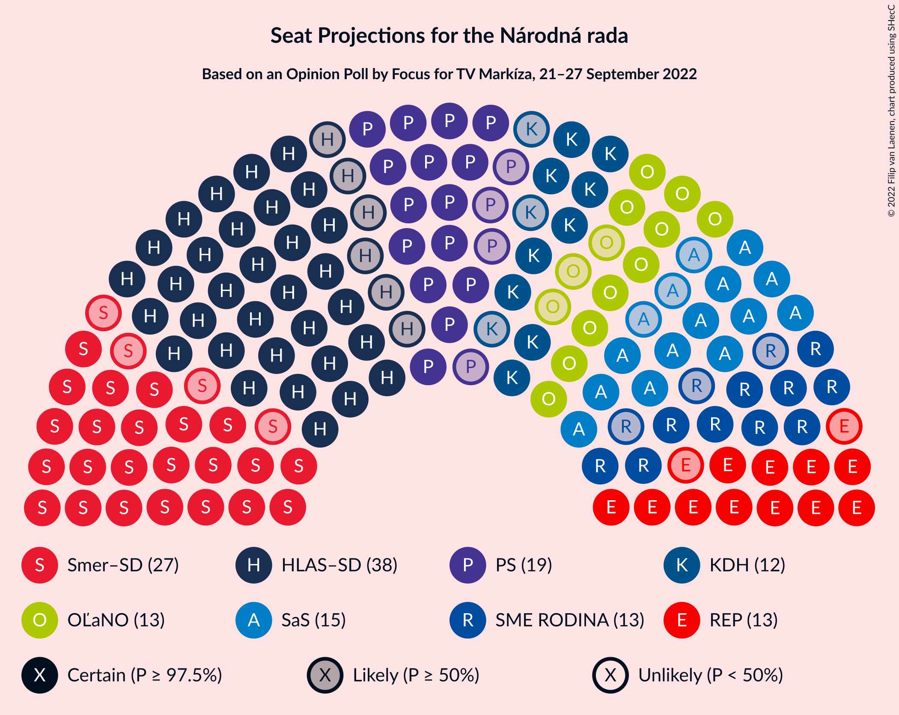
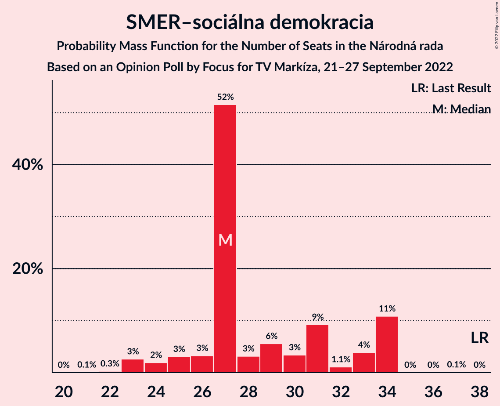
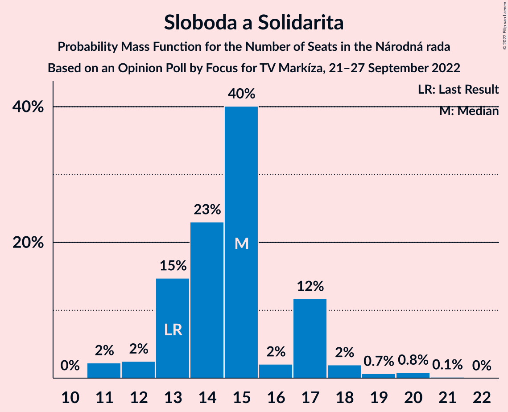
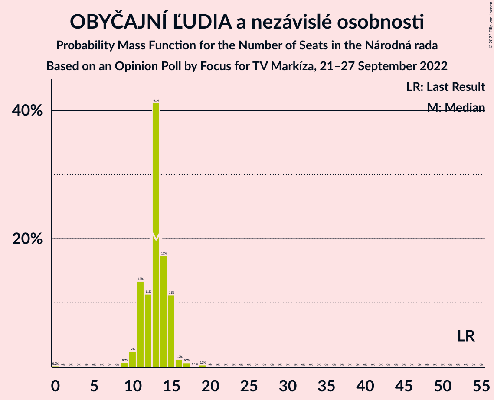
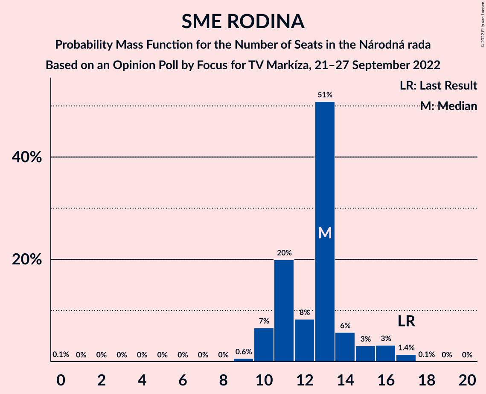
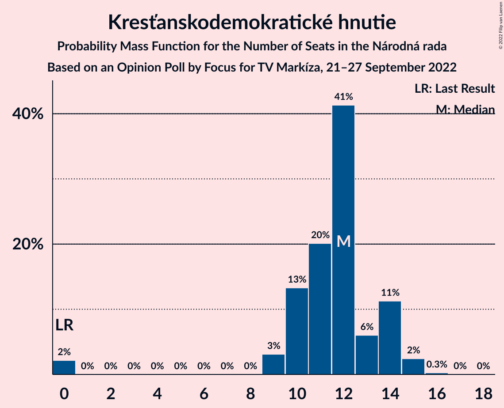
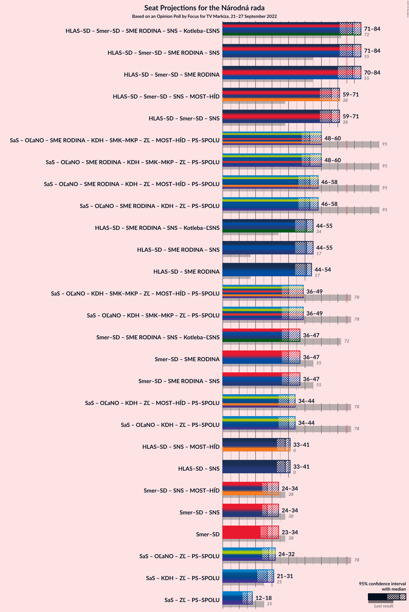
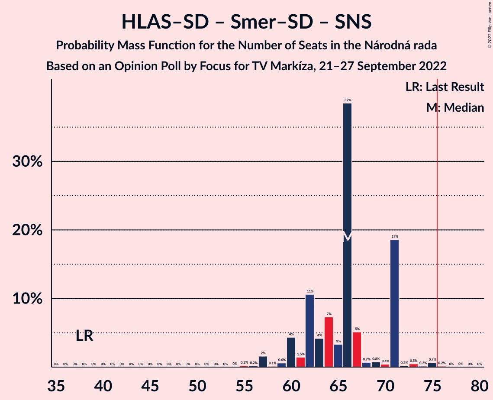

# Opinion Poll by Focus for TV Markíza, 21–27 September 2022

<a href="#voting-intentions">Voting Intentions</a> | <a href="#seats">Seats</a> | <a href="#coalitions">Coalitions</a> | <a href="#technical-information">Technical Information</a>

## Voting Intentions

### Confidence Intervals

| Party | Last Result | Poll Result | 80% Confidence Interval | 90% Confidence Interval | 95% Confidence Interval | 99% Confidence Interval |
|:-----:|:-----------:|:-----------:|:-----------------------:|:-----------------------:|:-----------------------:|:-----------------------:|
| HLAS–sociálna demokracia | 0.0% | 20.4% | 18.9–22.1% |18.4–22.6% |18.0–23.0% |17.3–23.9% |
| SMER–sociálna demokracia | 18.3% | 15.4% | 14.0–16.9% |13.6–17.3% |13.3–17.7% |12.6–18.5% |
| Progresívne Slovensko | 7.0% | 9.7% | 8.6–11.0% |8.3–11.4% |8.0–11.7% |7.5–12.3% |
| Sloboda a Solidarita | 6.2% | 8.2% | 7.2–9.4% |6.9–9.8% |6.7–10.1% |6.2–10.7% |
| REPUBLIKA | 0.0% | 7.8% | 6.8–9.0% |6.6–9.4% |6.3–9.7% |5.9–10.3% |
| OBYČAJNÍ ĽUDIA a nezávislé osobnosti | 25.0% | 7.2% | 6.3–8.4% |6.0–8.7% |5.8–9.0% |5.4–9.6% |
| SME RODINA | 8.2% | 7.0% | 6.1–8.2% |5.8–8.5% |5.6–8.8% |5.2–9.4% |
| Kresťanskodemokratické hnutie | 4.6% | 6.2% | 5.4–7.3% |5.1–7.7% |4.9–7.9% |4.5–8.5% |
| Strana maďarskej koalície–Magyar Koalíció Pártja | 3.9% | 4.7% | 3.9–5.6% |3.7–5.9% |3.5–6.1% |3.2–6.6% |
| Slovenská národná strana | 3.2% | 4.0% | 3.3–4.9% |3.1–5.1% |2.9–5.4% |2.6–5.8% |
| Kotleba–Ľudová strana Naše Slovensko | 8.0% | 2.9% | 2.3–3.7% |2.1–3.9% |2.0–4.1% |1.8–4.5% |
| Za ľudí | 5.8% | 2.4% | 1.9–3.1% |1.7–3.3% |1.6–3.5% |1.4–3.9% |
| Dobrá voľba | 3.1% | 1.5% | 1.1–2.1% |1.0–2.3% |0.9–2.4% |0.7–2.8% |
| SPOLU–Občianska Demokracia | 7.0% | 0.7% | 0.5–1.2% |0.4–1.3% |0.3–1.4% |0.2–1.7% |

*Note:* The poll result column reflects the actual value used in the calculations. Published results may vary slightly, and in addition be rounded to fewer digits.

## Seats

### Confidence Intervals

| Party | Last Result | Median | 80% Confidence Interval | 90% Confidence Interval | 95% Confidence Interval | 99% Confidence Interval |
|:-----:|:-----------:|:------:|:-----------------------:|:-----------------------:|:-----------------------:|:-----------------------:|
| <a href="#hlas–sociálna-demokracia">HLAS–sociálna demokracia</a> | 0 | 38 | 34–39 |33–40 |32–40 |29–41 |
| <a href="#smer–sociálna-demokracia">SMER–sociálna demokracia</a> | 38 | 27 | 26–34 |25–34 |23–34 |23–34 |
| <a href="#progresívne-slovensko">Progresívne Slovensko</a> | 0 | 19 | 16–20 |15–20 |15–21 |14–22 |
| <a href="#sloboda-a-solidarita">Sloboda a Solidarita</a> | 13 | 15 | 13–17 |13–17 |12–18 |11–20 |
| <a href="#republika">REPUBLIKA</a> | 0 | 13 | 12–15 |12–16 |11–16 |11–17 |
| <a href="#obyčajní-ľudia-a-nezávislé-osobnosti">OBYČAJNÍ ĽUDIA a nezávislé osobnosti</a> | 53 | 13 | 11–15 |11–15 |10–15 |9–17 |
| <a href="#sme-rodina">SME RODINA</a> | 17 | 13 | 11–14 |10–15 |10–16 |9–17 |
| <a href="#kresťanskodemokratické-hnutie">Kresťanskodemokratické hnutie</a> | 0 | 12 | 10–14 |9–14 |9–15 |0–15 |
| <a href="#strana-maďarskej-koalície–magyar-koalíció-pártja">Strana maďarskej koalície–Magyar Koalíció Pártja</a> | 0 | 0 | 0–9 |0–9 |0–10 |0–12 |
| <a href="#slovenská-národná-strana">Slovenská národná strana</a> | 0 | 0 | 0 |0 |0 |0–10 |
| <a href="#kotleba–ľudová-strana-naše-slovensko">Kotleba–Ľudová strana Naše Slovensko</a> | 17 | 0 | 0 |0 |0 |0 |
| <a href="#za-ľudí">Za ľudí</a> | 12 | 0 | 0 |0 |0 |0 |
| <a href="#dobrá-voľba">Dobrá voľba</a> | 0 | 0 | 0 |0 |0 |0 |
| <a href="#spolu–občianska-demokracia">SPOLU–Občianska Demokracia</a> | 0 | 0 | 0 |0 |0 |0 |

### HLAS–sociálna demokracia

*For a full overview of the results for this party, see the [HLAS–sociálna demokracia](party-hlas–sociálnademokracia.html) page.*

| Number of Seats | Probability | Accumulated | Special Marks |
|:---------------:|:-----------:|:-----------:|:-------------:|
| 0 | 0% | 100% | Last Result |
| 1 | 0% | 100% |  |
| 2 | 0% | 100% |  |
| 3 | 0% | 100% |  |
| 4 | 0% | 100% |  |
| 5 | 0% | 100% |  |
| 6 | 0% | 100% |  |
| 7 | 0% | 100% |  |
| 8 | 0% | 100% |  |
| 9 | 0% | 100% |  |
| 10 | 0% | 100% |  |
| 11 | 0% | 100% |  |
| 12 | 0% | 100% |  |
| 13 | 0% | 100% |  |
| 14 | 0% | 100% |  |
| 15 | 0% | 100% |  |
| 16 | 0% | 100% |  |
| 17 | 0% | 100% |  |
| 18 | 0% | 100% |  |
| 19 | 0% | 100% |  |
| 20 | 0% | 100% |  |
| 21 | 0% | 100% |  |
| 22 | 0% | 100% |  |
| 23 | 0% | 100% |  |
| 24 | 0% | 100% |  |
| 25 | 0% | 100% |  |
| 26 | 0% | 100% |  |
| 27 | 0% | 100% |  |
| 28 | 0.4% | 100% |  |
| 29 | 0.1% | 99.6% |  |
| 30 | 0.4% | 99.5% |  |
| 31 | 0.8% | 99.1% |  |
| 32 | 1.1% | 98% |  |
| 33 | 4% | 97% |  |
| 34 | 7% | 94% |  |
| 35 | 15% | 86% |  |
| 36 | 3% | 71% |  |
| 37 | 17% | 68% |  |
| 38 | 3% | 51% | Median |
| 39 | 38% | 48% |  |
| 40 | 9% | 10% |  |
| 41 | 0.6% | 1.0% |  |
| 42 | 0.2% | 0.4% |  |
| 43 | 0.1% | 0.2% |  |
| 44 | 0% | 0.2% |  |
| 45 | 0.1% | 0.1% |  |
| 46 | 0% | 0% |  |

### SMER–sociálna demokracia

*For a full overview of the results for this party, see the [SMER–sociálna demokracia](party-smer–sociálnademokracia.html) page.*

| Number of Seats | Probability | Accumulated | Special Marks |
|:---------------:|:-----------:|:-----------:|:-------------:|
| 21 | 0.1% | 100% |  |
| 22 | 0.3% | 99.9% |  |
| 23 | 3% | 99.7% |  |
| 24 | 2% | 97% |  |
| 25 | 3% | 95% |  |
| 26 | 3% | 92% |  |
| 27 | 52% | 89% | Median |
| 28 | 3% | 37% |  |
| 29 | 6% | 34% |  |
| 30 | 3% | 29% |  |
| 31 | 9% | 25% |  |
| 32 | 1.1% | 16% |  |
| 33 | 4% | 15% |  |
| 34 | 11% | 11% |  |
| 35 | 0% | 0.1% |  |
| 36 | 0% | 0.1% |  |
| 37 | 0.1% | 0.1% |  |
| 38 | 0% | 0% | Last Result |

### Progresívne Slovensko

*For a full overview of the results for this party, see the [Progresívne Slovensko](party-progresívneslovensko.html) page.*

| Number of Seats | Probability | Accumulated | Special Marks |
|:---------------:|:-----------:|:-----------:|:-------------:|
| 0 | 0% | 100% | Last Result |
| 1 | 0% | 100% |  |
| 2 | 0% | 100% |  |
| 3 | 0% | 100% |  |
| 4 | 0% | 100% |  |
| 5 | 0% | 100% |  |
| 6 | 0% | 100% |  |
| 7 | 0% | 100% |  |
| 8 | 0% | 100% |  |
| 9 | 0% | 100% |  |
| 10 | 0% | 100% |  |
| 11 | 0% | 100% |  |
| 12 | 0% | 100% |  |
| 13 | 0.2% | 100% |  |
| 14 | 1.1% | 99.8% |  |
| 15 | 6% | 98.7% |  |
| 16 | 19% | 93% |  |
| 17 | 6% | 74% |  |
| 18 | 14% | 68% |  |
| 19 | 37% | 54% | Median |
| 20 | 13% | 17% |  |
| 21 | 3% | 4% |  |
| 22 | 0.5% | 0.7% |  |
| 23 | 0.1% | 0.1% |  |
| 24 | 0% | 0% |  |

### Sloboda a Solidarita

*For a full overview of the results for this party, see the [Sloboda a Solidarita](party-slobodaasolidarita.html) page.*

| Number of Seats | Probability | Accumulated | Special Marks |
|:---------------:|:-----------:|:-----------:|:-------------:|
| 11 | 2% | 100% |  |
| 12 | 2% | 98% |  |
| 13 | 15% | 95% | Last Result |
| 14 | 23% | 80% |  |
| 15 | 40% | 57% | Median |
| 16 | 2% | 17% |  |
| 17 | 12% | 15% |  |
| 18 | 2% | 4% |  |
| 19 | 0.7% | 2% |  |
| 20 | 0.8% | 1.0% |  |
| 21 | 0.1% | 0.2% |  |
| 22 | 0% | 0% |  |

### REPUBLIKA

*For a full overview of the results for this party, see the [REPUBLIKA](party-republika.html) page.*

| Number of Seats | Probability | Accumulated | Special Marks |
|:---------------:|:-----------:|:-----------:|:-------------:|
| 0 | 0% | 100% | Last Result |
| 1 | 0% | 100% |  |
| 2 | 0% | 100% |  |
| 3 | 0% | 100% |  |
| 4 | 0% | 100% |  |
| 5 | 0% | 100% |  |
| 6 | 0% | 100% |  |
| 7 | 0% | 100% |  |
| 8 | 0% | 100% |  |
| 9 | 0% | 100% |  |
| 10 | 0.2% | 100% |  |
| 11 | 3% | 99.7% |  |
| 12 | 39% | 97% |  |
| 13 | 16% | 57% | Median |
| 14 | 30% | 41% |  |
| 15 | 6% | 11% |  |
| 16 | 3% | 5% |  |
| 17 | 2% | 2% |  |
| 18 | 0.1% | 0.3% |  |
| 19 | 0.1% | 0.1% |  |
| 20 | 0% | 0% |  |

### OBYČAJNÍ ĽUDIA a nezávislé osobnosti

*For a full overview of the results for this party, see the [OBYČAJNÍ ĽUDIA a nezávislé osobnosti](party-obyčajníľudiaanezávisléosobnosti.html) page.*

| Number of Seats | Probability | Accumulated | Special Marks |
|:---------------:|:-----------:|:-----------:|:-------------:|
| 0 | 0.2% | 100% |  |
| 1 | 0% | 99.8% |  |
| 2 | 0% | 99.8% |  |
| 3 | 0% | 99.8% |  |
| 4 | 0% | 99.8% |  |
| 5 | 0% | 99.8% |  |
| 6 | 0% | 99.8% |  |
| 7 | 0% | 99.8% |  |
| 8 | 0% | 99.8% |  |
| 9 | 0.7% | 99.8% |  |
| 10 | 2% | 99.2% |  |
| 11 | 13% | 97% |  |
| 12 | 11% | 83% |  |
| 13 | 41% | 72% | Median |
| 14 | 17% | 31% |  |
| 15 | 11% | 14% |  |
| 16 | 1.2% | 2% |  |
| 17 | 0.7% | 1.0% |  |
| 18 | 0.1% | 0.4% |  |
| 19 | 0.3% | 0.3% |  |
| 20 | 0% | 0% |  |
| 21 | 0% | 0% |  |
| 22 | 0% | 0% |  |
| 23 | 0% | 0% |  |
| 24 | 0% | 0% |  |
| 25 | 0% | 0% |  |
| 26 | 0% | 0% |  |
| 27 | 0% | 0% |  |
| 28 | 0% | 0% |  |
| 29 | 0% | 0% |  |
| 30 | 0% | 0% |  |
| 31 | 0% | 0% |  |
| 32 | 0% | 0% |  |
| 33 | 0% | 0% |  |
| 34 | 0% | 0% |  |
| 35 | 0% | 0% |  |
| 36 | 0% | 0% |  |
| 37 | 0% | 0% |  |
| 38 | 0% | 0% |  |
| 39 | 0% | 0% |  |
| 40 | 0% | 0% |  |
| 41 | 0% | 0% |  |
| 42 | 0% | 0% |  |
| 43 | 0% | 0% |  |
| 44 | 0% | 0% |  |
| 45 | 0% | 0% |  |
| 46 | 0% | 0% |  |
| 47 | 0% | 0% |  |
| 48 | 0% | 0% |  |
| 49 | 0% | 0% |  |
| 50 | 0% | 0% |  |
| 51 | 0% | 0% |  |
| 52 | 0% | 0% |  |
| 53 | 0% | 0% | Last Result |

### SME RODINA

*For a full overview of the results for this party, see the [SME RODINA](party-smerodina.html) page.*

| Number of Seats | Probability | Accumulated | Special Marks |
|:---------------:|:-----------:|:-----------:|:-------------:|
| 0 | 0.1% | 100% |  |
| 1 | 0% | 99.9% |  |
| 2 | 0% | 99.9% |  |
| 3 | 0% | 99.9% |  |
| 4 | 0% | 99.9% |  |
| 5 | 0% | 99.9% |  |
| 6 | 0% | 99.9% |  |
| 7 | 0% | 99.9% |  |
| 8 | 0% | 99.9% |  |
| 9 | 0.6% | 99.9% |  |
| 10 | 7% | 99.3% |  |
| 11 | 20% | 93% |  |
| 12 | 8% | 73% |  |
| 13 | 51% | 64% | Median |
| 14 | 6% | 14% |  |
| 15 | 3% | 8% |  |
| 16 | 3% | 5% |  |
| 17 | 1.4% | 2% | Last Result |
| 18 | 0.1% | 0.1% |  |
| 19 | 0% | 0% |  |

### Kresťanskodemokratické hnutie

*For a full overview of the results for this party, see the [Kresťanskodemokratické hnutie](party-kresťanskodemokratickéhnutie.html) page.*

| Number of Seats | Probability | Accumulated | Special Marks |
|:---------------:|:-----------:|:-----------:|:-------------:|
| 0 | 2% | 100% | Last Result |
| 1 | 0% | 98% |  |
| 2 | 0% | 98% |  |
| 3 | 0% | 98% |  |
| 4 | 0% | 98% |  |
| 5 | 0% | 98% |  |
| 6 | 0% | 98% |  |
| 7 | 0% | 98% |  |
| 8 | 0% | 98% |  |
| 9 | 3% | 98% |  |
| 10 | 13% | 95% |  |
| 11 | 20% | 81% |  |
| 12 | 41% | 61% | Median |
| 13 | 6% | 20% |  |
| 14 | 11% | 14% |  |
| 15 | 2% | 3% |  |
| 16 | 0.3% | 0.3% |  |
| 17 | 0% | 0% |  |

### Strana maďarskej koalície–Magyar Koalíció Pártja

*For a full overview of the results for this party, see the [Strana maďarskej koalície–Magyar Koalíció Pártja](party-stranamaďarskejkoalície–magyarkoalíciópártja.html) page.*

| Number of Seats | Probability | Accumulated | Special Marks |
|:---------------:|:-----------:|:-----------:|:-------------:|
| 0 | 88% | 100% | Last Result, Median |
| 1 | 0% | 12% |  |
| 2 | 0% | 12% |  |
| 3 | 0% | 12% |  |
| 4 | 0% | 12% |  |
| 5 | 0% | 12% |  |
| 6 | 0% | 12% |  |
| 7 | 0% | 12% |  |
| 8 | 0.1% | 12% |  |
| 9 | 7% | 12% |  |
| 10 | 3% | 5% |  |
| 11 | 0.8% | 2% |  |
| 12 | 0.9% | 1.0% |  |
| 13 | 0% | 0% |  |

### Slovenská národná strana

*For a full overview of the results for this party, see the [Slovenská národná strana](party-slovenskánárodnástrana.html) page.*

| Number of Seats | Probability | Accumulated | Special Marks |
|:---------------:|:-----------:|:-----------:|:-------------:|
| 0 | 98% | 100% | Last Result, Median |
| 1 | 0% | 2% |  |
| 2 | 0% | 2% |  |
| 3 | 0% | 2% |  |
| 4 | 0% | 2% |  |
| 5 | 0% | 2% |  |
| 6 | 0% | 2% |  |
| 7 | 0% | 2% |  |
| 8 | 0.1% | 2% |  |
| 9 | 1.1% | 2% |  |
| 10 | 1.2% | 1.2% |  |
| 11 | 0% | 0% |  |

### Kotleba–Ľudová strana Naše Slovensko

*For a full overview of the results for this party, see the [Kotleba–Ľudová strana Naše Slovensko](party-kotleba–ľudovástrananašeslovensko.html) page.*

| Number of Seats | Probability | Accumulated | Special Marks |
|:---------------:|:-----------:|:-----------:|:-------------:|
| 0 | 100% | 100% | Median |
| 1 | 0% | 0% |  |
| 2 | 0% | 0% |  |
| 3 | 0% | 0% |  |
| 4 | 0% | 0% |  |
| 5 | 0% | 0% |  |
| 6 | 0% | 0% |  |
| 7 | 0% | 0% |  |
| 8 | 0% | 0% |  |
| 9 | 0% | 0% |  |
| 10 | 0% | 0% |  |
| 11 | 0% | 0% |  |
| 12 | 0% | 0% |  |
| 13 | 0% | 0% |  |
| 14 | 0% | 0% |  |
| 15 | 0% | 0% |  |
| 16 | 0% | 0% |  |
| 17 | 0% | 0% | Last Result |

### Za ľudí

*For a full overview of the results for this party, see the [Za ľudí](party-zaľudí.html) page.*

| Number of Seats | Probability | Accumulated | Special Marks |
|:---------------:|:-----------:|:-----------:|:-------------:|
| 0 | 100% | 100% | Median |
| 1 | 0% | 0% |  |
| 2 | 0% | 0% |  |
| 3 | 0% | 0% |  |
| 4 | 0% | 0% |  |
| 5 | 0% | 0% |  |
| 6 | 0% | 0% |  |
| 7 | 0% | 0% |  |
| 8 | 0% | 0% |  |
| 9 | 0% | 0% |  |
| 10 | 0% | 0% |  |
| 11 | 0% | 0% |  |
| 12 | 0% | 0% | Last Result |

### Dobrá voľba

*For a full overview of the results for this party, see the [Dobrá voľba](party-dobrávoľba.html) page.*

| Number of Seats | Probability | Accumulated | Special Marks |
|:---------------:|:-----------:|:-----------:|:-------------:|
| 0 | 100% | 100% | Last Result, Median |

### SPOLU–Občianska Demokracia

*For a full overview of the results for this party, see the [SPOLU–Občianska Demokracia](party-spolu–občianskademokracia.html) page.*

| Number of Seats | Probability | Accumulated | Special Marks |
|:---------------:|:-----------:|:-----------:|:-------------:|
| 0 | 100% | 100% | Last Result, Median |

## Coalitions

### Confidence Intervals

| Coalition | Last Result | Median | Majority? | 80% Confidence Interval | 90% Confidence Interval | 95% Confidence Interval | 99% Confidence Interval |
|:---------:|:-----------:|:------:|:---------:|:-----------------------:|:-----------------------:|:-----------------------:|:-----------------------:|
| HLAS–sociálna demokracia – SMER–sociálna demokracia – SME RODINA – Slovenská národná strana – Kotleba–Ľudová strana Naše Slovensko | 72 | 79 | 78% | 73–84 | 73–84 | 71–84 | 68–87 |
| HLAS–sociálna demokracia – SMER–sociálna demokracia – SME RODINA – Slovenská národná strana | 55 | 79 | 78% | 73–84 | 73–84 | 71–84 | 68–87 |
| HLAS–sociálna demokracia – SMER–sociálna demokracia – SME RODINA | 55 | 79 | 76% | 73–84 | 72–84 | 70–84 | 67–86 |
| HLAS–sociálna demokracia – SMER–sociálna demokracia – Slovenská národná strana | 38 | 66 | 0.2% | 62–71 | 60–71 | 59–71 | 57–75 |
| HLAS–sociálna demokracia – SME RODINA – Slovenská národná strana – Kotleba–Ľudová strana Naše Slovensko | 34 | 51 | 0% | 46–52 | 45–54 | 44–55 | 41–62 |
| HLAS–sociálna demokracia – SME RODINA – Slovenská národná strana | 17 | 51 | 0% | 46–52 | 45–54 | 44–55 | 41–62 |
| HLAS–sociálna demokracia – SME RODINA | 17 | 51 | 0% | 46–52 | 44–52 | 44–54 | 41–55 |
| SMER–sociálna demokracia – SME RODINA – Slovenská národná strana – Kotleba–Ľudová strana Naše Slovensko | 72 | 40 | 0% | 38–47 | 37–47 | 36–47 | 35–48 |
| SMER–sociálna demokracia – SME RODINA | 55 | 40 | 0% | 38–47 | 37–47 | 36–47 | 34–47 |
| SMER–sociálna demokracia – SME RODINA – Slovenská národná strana | 55 | 40 | 0% | 38–47 | 37–47 | 36–47 | 35–48 |
| HLAS–sociálna demokracia – Slovenská národná strana | 0 | 38 | 0% | 34–40 | 33–40 | 33–41 | 31–50 |
| SMER–sociálna demokracia – Slovenská národná strana | 38 | 27 | 0% | 27–34 | 25–34 | 24–34 | 23–36 |
| SMER–sociálna demokracia | 38 | 27 | 0% | 26–34 | 25–34 | 23–34 | 23–34 |

### HLAS–sociálna demokracia – SMER–sociálna demokracia – SME RODINA – Slovenská národná strana – Kotleba–Ľudová strana Naše Slovensko

| Number of Seats | Probability | Accumulated | Special Marks |
|:---------------:|:-----------:|:-----------:|:-------------:|
| 66 | 0.2% | 100% |  |
| 67 | 0.2% | 99.8% |  |
| 68 | 0.2% | 99.5% |  |
| 69 | 0.4% | 99.4% |  |
| 70 | 1.0% | 99.0% |  |
| 71 | 1.1% | 98% |  |
| 72 | 1.1% | 97% | Last Result |
| 73 | 11% | 96% |  |
| 74 | 5% | 85% |  |
| 75 | 1.1% | 79% |  |
| 76 | 5% | 78% | Majority |
| 77 | 5% | 73% |  |
| 78 | 2% | 69% | Median |
| 79 | 42% | 67% |  |
| 80 | 0.3% | 26% |  |
| 81 | 3% | 25% |  |
| 82 | 9% | 22% |  |
| 83 | 0.2% | 13% |  |
| 84 | 11% | 13% |  |
| 85 | 0.3% | 2% |  |
| 86 | 0.3% | 1.2% |  |
| 87 | 0.7% | 0.9% |  |
| 88 | 0% | 0.2% |  |
| 89 | 0.1% | 0.2% |  |
| 90 | 0% | 0.1% |  |
| 91 | 0% | 0% |  |

### HLAS–sociálna demokracia – SMER–sociálna demokracia – SME RODINA – Slovenská národná strana

| Number of Seats | Probability | Accumulated | Special Marks |
|:---------------:|:-----------:|:-----------:|:-------------:|
| 55 | 0% | 100% | Last Result |
| 56 | 0% | 100% |  |
| 57 | 0% | 100% |  |
| 58 | 0% | 100% |  |
| 59 | 0% | 100% |  |
| 60 | 0% | 100% |  |
| 61 | 0% | 100% |  |
| 62 | 0% | 100% |  |
| 63 | 0% | 100% |  |
| 64 | 0% | 100% |  |
| 65 | 0% | 100% |  |
| 66 | 0.2% | 100% |  |
| 67 | 0.2% | 99.8% |  |
| 68 | 0.2% | 99.5% |  |
| 69 | 0.4% | 99.4% |  |
| 70 | 1.0% | 99.0% |  |
| 71 | 1.1% | 98% |  |
| 72 | 1.1% | 97% |  |
| 73 | 11% | 96% |  |
| 74 | 5% | 85% |  |
| 75 | 1.1% | 79% |  |
| 76 | 5% | 78% | Majority |
| 77 | 5% | 73% |  |
| 78 | 2% | 69% | Median |
| 79 | 42% | 67% |  |
| 80 | 0.3% | 26% |  |
| 81 | 3% | 25% |  |
| 82 | 9% | 22% |  |
| 83 | 0.2% | 13% |  |
| 84 | 11% | 13% |  |
| 85 | 0.3% | 2% |  |
| 86 | 0.3% | 1.2% |  |
| 87 | 0.7% | 0.9% |  |
| 88 | 0% | 0.2% |  |
| 89 | 0.1% | 0.2% |  |
| 90 | 0% | 0% |  |

### HLAS–sociálna demokracia – SMER–sociálna demokracia – SME RODINA

| Number of Seats | Probability | Accumulated | Special Marks |
|:---------------:|:-----------:|:-----------:|:-------------:|
| 55 | 0% | 100% | Last Result |
| 56 | 0% | 100% |  |
| 57 | 0% | 100% |  |
| 58 | 0% | 100% |  |
| 59 | 0% | 100% |  |
| 60 | 0% | 100% |  |
| 61 | 0% | 100% |  |
| 62 | 0% | 100% |  |
| 63 | 0% | 100% |  |
| 64 | 0% | 100% |  |
| 65 | 0.1% | 100% |  |
| 66 | 0.2% | 99.9% |  |
| 67 | 0.6% | 99.7% |  |
| 68 | 0.2% | 99.1% |  |
| 69 | 0.5% | 98.9% |  |
| 70 | 1.4% | 98% |  |
| 71 | 1.2% | 97% |  |
| 72 | 1.5% | 96% |  |
| 73 | 11% | 94% |  |
| 74 | 5% | 83% |  |
| 75 | 1.2% | 78% |  |
| 76 | 4% | 76% | Majority |
| 77 | 5% | 72% |  |
| 78 | 1.4% | 67% | Median |
| 79 | 41% | 65% |  |
| 80 | 0.3% | 24% |  |
| 81 | 3% | 24% |  |
| 82 | 9% | 21% |  |
| 83 | 0.2% | 12% |  |
| 84 | 11% | 12% |  |
| 85 | 0.2% | 0.7% |  |
| 86 | 0.3% | 0.5% |  |
| 87 | 0% | 0.2% |  |
| 88 | 0% | 0.2% |  |
| 89 | 0.1% | 0.2% |  |
| 90 | 0% | 0% |  |

### HLAS–sociálna demokracia – SMER–sociálna demokracia – Slovenská národná strana

| Number of Seats | Probability | Accumulated | Special Marks |
|:---------------:|:-----------:|:-----------:|:-------------:|
| 38 | 0% | 100% | Last Result |
| 39 | 0% | 100% |  |
| 40 | 0% | 100% |  |
| 41 | 0% | 100% |  |
| 42 | 0% | 100% |  |
| 43 | 0% | 100% |  |
| 44 | 0% | 100% |  |
| 45 | 0% | 100% |  |
| 46 | 0% | 100% |  |
| 47 | 0% | 100% |  |
| 48 | 0% | 100% |  |
| 49 | 0% | 100% |  |
| 50 | 0% | 100% |  |
| 51 | 0% | 100% |  |
| 52 | 0% | 100% |  |
| 53 | 0% | 100% |  |
| 54 | 0% | 100% |  |
| 55 | 0.2% | 99.9% |  |
| 56 | 0.2% | 99.7% |  |
| 57 | 2% | 99.5% |  |
| 58 | 0.1% | 98% |  |
| 59 | 0.6% | 98% |  |
| 60 | 4% | 97% |  |
| 61 | 1.5% | 93% |  |
| 62 | 11% | 91% |  |
| 63 | 4% | 81% |  |
| 64 | 7% | 77% |  |
| 65 | 3% | 69% | Median |
| 66 | 39% | 66% |  |
| 67 | 5% | 27% |  |
| 68 | 0.7% | 22% |  |
| 69 | 0.8% | 22% |  |
| 70 | 0.4% | 21% |  |
| 71 | 19% | 20% |  |
| 72 | 0.2% | 2% |  |
| 73 | 0.5% | 2% |  |
| 74 | 0.2% | 1.0% |  |
| 75 | 0.7% | 0.9% |  |
| 76 | 0.2% | 0.2% | Majority |
| 77 | 0% | 0% |  |

### HLAS–sociálna demokracia – SME RODINA – Slovenská národná strana – Kotleba–Ľudová strana Naše Slovensko

| Number of Seats | Probability | Accumulated | Special Marks |
|:---------------:|:-----------:|:-----------:|:-------------:|
| 34 | 0% | 100% | Last Result |
| 35 | 0% | 100% |  |
| 36 | 0% | 100% |  |
| 37 | 0% | 100% |  |
| 38 | 0% | 100% |  |
| 39 | 0% | 100% |  |
| 40 | 0% | 99.9% |  |
| 41 | 0.9% | 99.9% |  |
| 42 | 0.1% | 99.0% |  |
| 43 | 0.2% | 98.9% |  |
| 44 | 3% | 98.7% |  |
| 45 | 3% | 96% |  |
| 46 | 14% | 93% |  |
| 47 | 3% | 79% |  |
| 48 | 5% | 76% |  |
| 49 | 1.3% | 71% |  |
| 50 | 15% | 70% |  |
| 51 | 10% | 55% | Median |
| 52 | 38% | 44% |  |
| 53 | 0.3% | 6% |  |
| 54 | 3% | 6% |  |
| 55 | 0.7% | 3% |  |
| 56 | 0.7% | 2% |  |
| 57 | 0.2% | 1.2% |  |
| 58 | 0.1% | 1.1% |  |
| 59 | 0.1% | 1.0% |  |
| 60 | 0.2% | 0.9% |  |
| 61 | 0% | 0.7% |  |
| 62 | 0.6% | 0.7% |  |
| 63 | 0.1% | 0.1% |  |
| 64 | 0% | 0% |  |

### HLAS–sociálna demokracia – SME RODINA – Slovenská národná strana

| Number of Seats | Probability | Accumulated | Special Marks |
|:---------------:|:-----------:|:-----------:|:-------------:|
| 17 | 0% | 100% | Last Result |
| 18 | 0% | 100% |  |
| 19 | 0% | 100% |  |
| 20 | 0% | 100% |  |
| 21 | 0% | 100% |  |
| 22 | 0% | 100% |  |
| 23 | 0% | 100% |  |
| 24 | 0% | 100% |  |
| 25 | 0% | 100% |  |
| 26 | 0% | 100% |  |
| 27 | 0% | 100% |  |
| 28 | 0% | 100% |  |
| 29 | 0% | 100% |  |
| 30 | 0% | 100% |  |
| 31 | 0% | 100% |  |
| 32 | 0% | 100% |  |
| 33 | 0% | 100% |  |
| 34 | 0% | 100% |  |
| 35 | 0% | 100% |  |
| 36 | 0% | 100% |  |
| 37 | 0% | 100% |  |
| 38 | 0% | 100% |  |
| 39 | 0% | 100% |  |
| 40 | 0% | 99.9% |  |
| 41 | 0.9% | 99.9% |  |
| 42 | 0.1% | 99.0% |  |
| 43 | 0.2% | 98.9% |  |
| 44 | 3% | 98.7% |  |
| 45 | 3% | 96% |  |
| 46 | 14% | 93% |  |
| 47 | 3% | 79% |  |
| 48 | 5% | 76% |  |
| 49 | 1.3% | 71% |  |
| 50 | 15% | 70% |  |
| 51 | 10% | 55% | Median |
| 52 | 38% | 44% |  |
| 53 | 0.3% | 6% |  |
| 54 | 3% | 6% |  |
| 55 | 0.7% | 3% |  |
| 56 | 0.7% | 2% |  |
| 57 | 0.2% | 1.2% |  |
| 58 | 0.1% | 1.1% |  |
| 59 | 0.1% | 1.0% |  |
| 60 | 0.2% | 0.9% |  |
| 61 | 0% | 0.7% |  |
| 62 | 0.6% | 0.7% |  |
| 63 | 0.1% | 0.1% |  |
| 64 | 0% | 0% |  |

### HLAS–sociálna demokracia – SME RODINA

| Number of Seats | Probability | Accumulated | Special Marks |
|:---------------:|:-----------:|:-----------:|:-------------:|
| 17 | 0% | 100% | Last Result |
| 18 | 0% | 100% |  |
| 19 | 0% | 100% |  |
| 20 | 0% | 100% |  |
| 21 | 0% | 100% |  |
| 22 | 0% | 100% |  |
| 23 | 0% | 100% |  |
| 24 | 0% | 100% |  |
| 25 | 0% | 100% |  |
| 26 | 0% | 100% |  |
| 27 | 0% | 100% |  |
| 28 | 0% | 100% |  |
| 29 | 0% | 100% |  |
| 30 | 0% | 100% |  |
| 31 | 0% | 100% |  |
| 32 | 0% | 100% |  |
| 33 | 0% | 100% |  |
| 34 | 0% | 100% |  |
| 35 | 0% | 100% |  |
| 36 | 0% | 100% |  |
| 37 | 0% | 100% |  |
| 38 | 0% | 100% |  |
| 39 | 0% | 100% |  |
| 40 | 0.1% | 99.9% |  |
| 41 | 0.9% | 99.9% |  |
| 42 | 0.6% | 99.0% |  |
| 43 | 0.3% | 98% |  |
| 44 | 3% | 98% |  |
| 45 | 3% | 95% |  |
| 46 | 14% | 92% |  |
| 47 | 3% | 78% |  |
| 48 | 5% | 75% |  |
| 49 | 1.4% | 70% |  |
| 50 | 15% | 69% |  |
| 51 | 10% | 53% | Median |
| 52 | 39% | 43% |  |
| 53 | 0.3% | 4% |  |
| 54 | 3% | 4% |  |
| 55 | 0.7% | 1.0% |  |
| 56 | 0% | 0.3% |  |
| 57 | 0.1% | 0.3% |  |
| 58 | 0% | 0.2% |  |
| 59 | 0% | 0.1% |  |
| 60 | 0.1% | 0.1% |  |
| 61 | 0% | 0% |  |

### SMER–sociálna demokracia – SME RODINA – Slovenská národná strana – Kotleba–Ľudová strana Naše Slovensko

| Number of Seats | Probability | Accumulated | Special Marks |
|:---------------:|:-----------:|:-----------:|:-------------:|
| 29 | 0% | 100% |  |
| 30 | 0% | 99.9% |  |
| 31 | 0% | 99.9% |  |
| 32 | 0.1% | 99.9% |  |
| 33 | 0.1% | 99.8% |  |
| 34 | 0.1% | 99.7% |  |
| 35 | 1.0% | 99.6% |  |
| 36 | 1.3% | 98.6% |  |
| 37 | 3% | 97% |  |
| 38 | 11% | 94% |  |
| 39 | 2% | 83% |  |
| 40 | 40% | 80% | Median |
| 41 | 4% | 40% |  |
| 42 | 13% | 37% |  |
| 43 | 4% | 24% |  |
| 44 | 2% | 20% |  |
| 45 | 5% | 18% |  |
| 46 | 0.4% | 13% |  |
| 47 | 12% | 13% |  |
| 48 | 0.5% | 0.9% |  |
| 49 | 0.2% | 0.4% |  |
| 50 | 0.1% | 0.2% |  |
| 51 | 0% | 0.1% |  |
| 52 | 0% | 0.1% |  |
| 53 | 0% | 0% |  |
| 54 | 0% | 0% |  |
| 55 | 0% | 0% |  |
| 56 | 0% | 0% |  |
| 57 | 0% | 0% |  |
| 58 | 0% | 0% |  |
| 59 | 0% | 0% |  |
| 60 | 0% | 0% |  |
| 61 | 0% | 0% |  |
| 62 | 0% | 0% |  |
| 63 | 0% | 0% |  |
| 64 | 0% | 0% |  |
| 65 | 0% | 0% |  |
| 66 | 0% | 0% |  |
| 67 | 0% | 0% |  |
| 68 | 0% | 0% |  |
| 69 | 0% | 0% |  |
| 70 | 0% | 0% |  |
| 71 | 0% | 0% |  |
| 72 | 0% | 0% | Last Result |

### SMER–sociálna demokracia – SME RODINA

| Number of Seats | Probability | Accumulated | Special Marks |
|:---------------:|:-----------:|:-----------:|:-------------:|
| 29 | 0% | 100% |  |
| 30 | 0% | 99.9% |  |
| 31 | 0% | 99.9% |  |
| 32 | 0.2% | 99.9% |  |
| 33 | 0.2% | 99.8% |  |
| 34 | 0.3% | 99.6% |  |
| 35 | 1.4% | 99.3% |  |
| 36 | 2% | 98% |  |
| 37 | 4% | 96% |  |
| 38 | 11% | 92% |  |
| 39 | 3% | 81% |  |
| 40 | 40% | 78% | Median |
| 41 | 4% | 38% |  |
| 42 | 13% | 34% |  |
| 43 | 4% | 21% |  |
| 44 | 1.5% | 18% |  |
| 45 | 4% | 16% |  |
| 46 | 0.3% | 12% |  |
| 47 | 11% | 12% |  |
| 48 | 0.1% | 0.3% |  |
| 49 | 0.1% | 0.2% |  |
| 50 | 0.1% | 0.1% |  |
| 51 | 0% | 0% |  |
| 52 | 0% | 0% |  |
| 53 | 0% | 0% |  |
| 54 | 0% | 0% |  |
| 55 | 0% | 0% | Last Result |

### SMER–sociálna demokracia – SME RODINA – Slovenská národná strana

| Number of Seats | Probability | Accumulated | Special Marks |
|:---------------:|:-----------:|:-----------:|:-------------:|
| 29 | 0% | 100% |  |
| 30 | 0% | 99.9% |  |
| 31 | 0% | 99.9% |  |
| 32 | 0.1% | 99.9% |  |
| 33 | 0.1% | 99.8% |  |
| 34 | 0.1% | 99.7% |  |
| 35 | 1.0% | 99.6% |  |
| 36 | 1.3% | 98.6% |  |
| 37 | 3% | 97% |  |
| 38 | 11% | 94% |  |
| 39 | 2% | 83% |  |
| 40 | 40% | 80% | Median |
| 41 | 4% | 40% |  |
| 42 | 13% | 37% |  |
| 43 | 4% | 24% |  |
| 44 | 2% | 20% |  |
| 45 | 5% | 18% |  |
| 46 | 0.4% | 13% |  |
| 47 | 12% | 13% |  |
| 48 | 0.5% | 0.9% |  |
| 49 | 0.2% | 0.4% |  |
| 50 | 0.1% | 0.2% |  |
| 51 | 0% | 0.1% |  |
| 52 | 0% | 0.1% |  |
| 53 | 0% | 0% |  |
| 54 | 0% | 0% |  |
| 55 | 0% | 0% | Last Result |

### HLAS–sociálna demokracia – Slovenská národná strana

| Number of Seats | Probability | Accumulated | Special Marks |
|:---------------:|:-----------:|:-----------:|:-------------:|
| 0 | 0% | 100% | Last Result |
| 1 | 0% | 100% |  |
| 2 | 0% | 100% |  |
| 3 | 0% | 100% |  |
| 4 | 0% | 100% |  |
| 5 | 0% | 100% |  |
| 6 | 0% | 100% |  |
| 7 | 0% | 100% |  |
| 8 | 0% | 100% |  |
| 9 | 0% | 100% |  |
| 10 | 0% | 100% |  |
| 11 | 0% | 100% |  |
| 12 | 0% | 100% |  |
| 13 | 0% | 100% |  |
| 14 | 0% | 100% |  |
| 15 | 0% | 100% |  |
| 16 | 0% | 100% |  |
| 17 | 0% | 100% |  |
| 18 | 0% | 100% |  |
| 19 | 0% | 100% |  |
| 20 | 0% | 100% |  |
| 21 | 0% | 100% |  |
| 22 | 0% | 100% |  |
| 23 | 0% | 100% |  |
| 24 | 0% | 100% |  |
| 25 | 0% | 100% |  |
| 26 | 0% | 100% |  |
| 27 | 0% | 100% |  |
| 28 | 0% | 100% |  |
| 29 | 0.1% | 100% |  |
| 30 | 0.3% | 99.9% |  |
| 31 | 0.8% | 99.6% |  |
| 32 | 1.0% | 98.8% |  |
| 33 | 3% | 98% |  |
| 34 | 7% | 94% |  |
| 35 | 15% | 87% |  |
| 36 | 3% | 72% |  |
| 37 | 17% | 69% |  |
| 38 | 3% | 52% | Median |
| 39 | 38% | 49% |  |
| 40 | 8% | 11% |  |
| 41 | 0.6% | 3% |  |
| 42 | 0.3% | 2% |  |
| 43 | 0.4% | 2% |  |
| 44 | 0.1% | 2% |  |
| 45 | 0.3% | 1.5% |  |
| 46 | 0.1% | 1.2% |  |
| 47 | 0.3% | 1.1% |  |
| 48 | 0% | 0.8% |  |
| 49 | 0.1% | 0.8% |  |
| 50 | 0.7% | 0.7% |  |
| 51 | 0% | 0% |  |

### SMER–sociálna demokracia – Slovenská národná strana

| Number of Seats | Probability | Accumulated | Special Marks |
|:---------------:|:-----------:|:-----------:|:-------------:|
| 22 | 0.2% | 100% |  |
| 23 | 2% | 99.8% |  |
| 24 | 2% | 98% |  |
| 25 | 2% | 96% |  |
| 26 | 3% | 94% |  |
| 27 | 52% | 91% | Median |
| 28 | 3% | 39% |  |
| 29 | 6% | 37% |  |
| 30 | 3% | 31% |  |
| 31 | 9% | 28% |  |
| 32 | 2% | 18% |  |
| 33 | 4% | 17% |  |
| 34 | 11% | 13% |  |
| 35 | 0.7% | 1.5% |  |
| 36 | 0.4% | 0.7% |  |
| 37 | 0.1% | 0.3% |  |
| 38 | 0.1% | 0.2% | Last Result |
| 39 | 0% | 0% |  |

### SMER–sociálna demokracia

| Number of Seats | Probability | Accumulated | Special Marks |
|:---------------:|:-----------:|:-----------:|:-------------:|
| 21 | 0.1% | 100% |  |
| 22 | 0.3% | 99.9% |  |
| 23 | 3% | 99.7% |  |
| 24 | 2% | 97% |  |
| 25 | 3% | 95% |  |
| 26 | 3% | 92% |  |
| 27 | 52% | 89% | Median |
| 28 | 3% | 37% |  |
| 29 | 6% | 34% |  |
| 30 | 3% | 29% |  |
| 31 | 9% | 25% |  |
| 32 | 1.1% | 16% |  |
| 33 | 4% | 15% |  |
| 34 | 11% | 11% |  |
| 35 | 0% | 0.1% |  |
| 36 | 0% | 0.1% |  |
| 37 | 0.1% | 0.1% |  |
| 38 | 0% | 0% | Last Result |

## Technical Information

### Opinion Poll

+ **Polling firm:** Focus
+ **Commissioner(s):** TV Markíza
+ **Fieldwork period:** 21–27 September 2022

### Calculations

+ **Sample size:** 1009
+ **Simulations done:** 1,048,576
+ **Error estimate:** 3.76%

