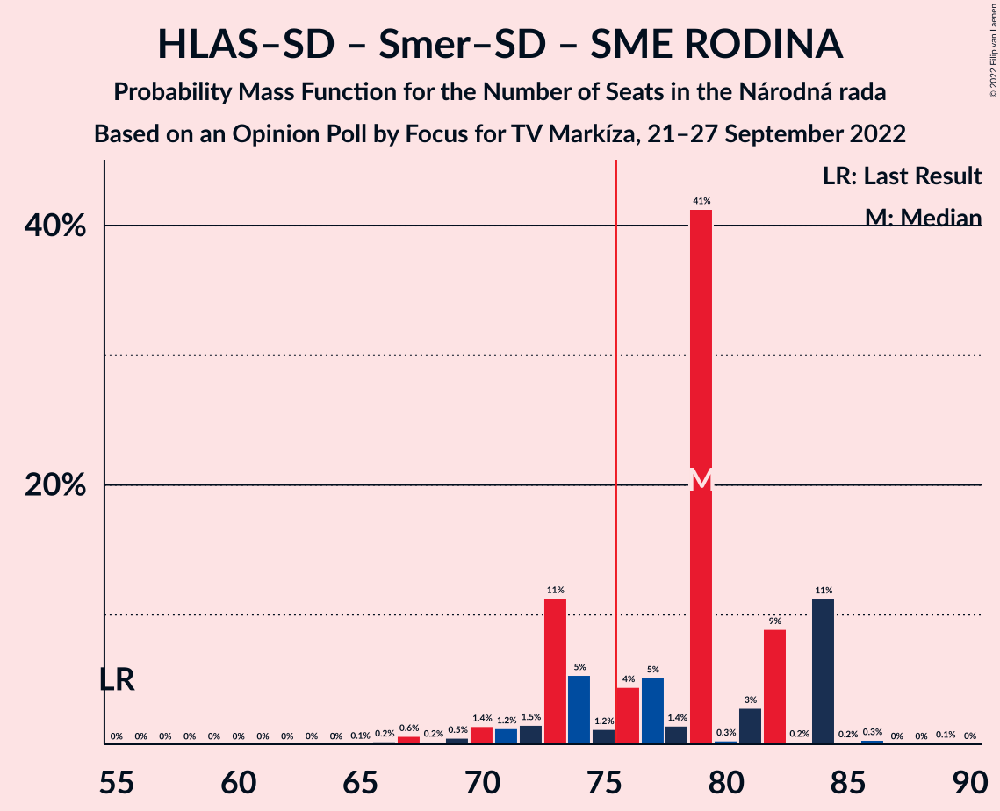
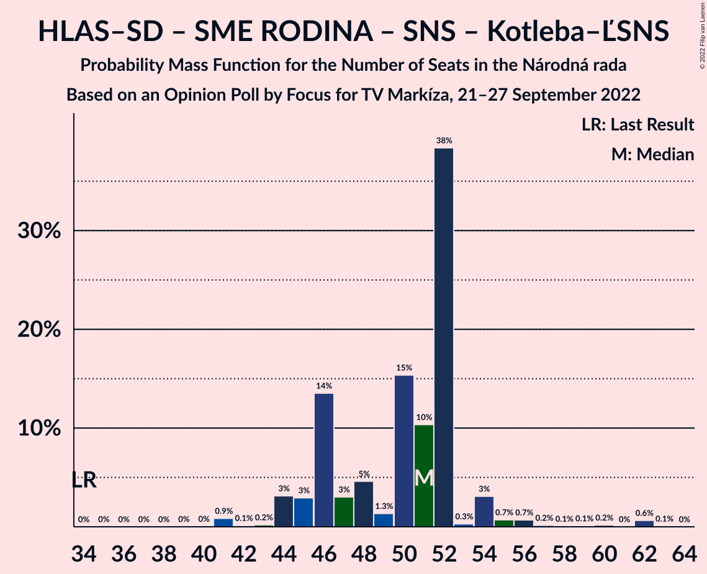

# Opinion Poll by Focus for TV Markíza, 21–27 September 2022

<a href="#voting-intentions">Voting Intentions</a> | <a href="#seats">Seats</a> | <a href="#coalitions">Coalitions</a> | <a href="#technical-information">Technical Information</a>

## Voting Intentions

### Confidence Intervals

| Party | Last Result | Poll Result | 80% Confidence Interval | 90% Confidence Interval | 95% Confidence Interval | 99% Confidence Interval |
|:-----:|:-----------:|:-----------:|:-----------------------:|:-----------------------:|:-----------------------:|:-----------------------:|
| HLAS–sociálna demokracia | 0.0% | 20.3% | 18.8–22.0% |18.3–22.5% |17.9–22.9% |17.2–23.7% |
| SMER–sociálna demokracia | 18.3% | 15.3% | 13.9–16.8% |13.5–17.2% |13.2–17.6% |12.5–18.4% |
| Progresívne Slovensko | 7.0% | 9.6% | 8.5–10.9% |8.2–11.3% |7.9–11.6% |7.4–12.2% |
| Sloboda a Solidarita | 6.2% | 8.2% | 7.2–9.4% |6.9–9.8% |6.7–10.1% |6.2–10.7% |
| REPUBLIKA | 0.0% | 7.8% | 6.8–9.0% |6.6–9.4% |6.3–9.7% |5.9–10.3% |
| OBYČAJNÍ ĽUDIA a nezávislé osobnosti | 25.0% | 7.2% | 6.3–8.4% |6.0–8.7% |5.8–9.0% |5.4–9.6% |
| SME RODINA | 8.2% | 7.0% | 6.1–8.2% |5.8–8.5% |5.6–8.8% |5.2–9.4% |
| Kresťanskodemokratické hnutie | 4.6% | 6.2% | 5.4–7.3% |5.1–7.7% |4.9–7.9% |4.5–8.5% |
| Strana maďarskej koalície–Magyar Koalíció Pártja | 3.9% | 4.6% | 3.8–5.5% |3.6–5.8% |3.4–6.0% |3.1–6.5% |
| Slovenská národná strana | 3.2% | 3.9% | 3.2–4.8% |3.0–5.0% |2.8–5.2% |2.5–5.7% |
| Kotleba–Ľudová strana Naše Slovensko | 8.0% | 2.9% | 2.3–3.7% |2.1–3.9% |2.0–4.1% |1.8–4.5% |
| Za ľudí | 5.8% | 2.4% | 1.9–3.1% |1.7–3.3% |1.6–3.5% |1.4–3.9% |
| Dobrá voľba | 3.1% | 1.5% | 1.1–2.1% |1.0–2.3% |0.9–2.4% |0.7–2.8% |

*Note:* The poll result column reflects the actual value used in the calculations. Published results may vary slightly, and in addition be rounded to fewer digits.

## Seats

### Confidence Intervals

| Party | Last Result | Median | 80% Confidence Interval | 90% Confidence Interval | 95% Confidence Interval | 99% Confidence Interval |
|:-----:|:-----------:|:------:|:-----------------------:|:-----------------------:|:-----------------------:|:-----------------------:|
| <a href="#hlas–sociálna-demokracia">HLAS–sociálna demokracia</a> | 0 | 36 | 34–42 |33–42 |32–42 |31–42 |
| <a href="#smer–sociálna-demokracia">SMER–sociálna demokracia</a> | 38 | 27 | 25–31 |25–33 |24–34 |22–34 |
| <a href="#progresívne-slovensko">Progresívne Slovensko</a> | 0 | 17 | 14–19 |14–19 |14–21 |13–23 |
| <a href="#sloboda-a-solidarita">Sloboda a Solidarita</a> | 13 | 15 | 13–17 |12–17 |12–18 |10–20 |
| <a href="#republika">REPUBLIKA</a> | 0 | 14 | 12–16 |12–17 |11–18 |10–19 |
| <a href="#obyčajní-ľudia-a-nezávislé-osobnosti">OBYČAJNÍ ĽUDIA a nezávislé osobnosti</a> | 53 | 14 | 12–16 |11–16 |10–17 |10–18 |
| <a href="#sme-rodina">SME RODINA</a> | 17 | 13 | 12–15 |11–15 |11–15 |9–17 |
| <a href="#kresťanskodemokratické-hnutie">Kresťanskodemokratické hnutie</a> | 0 | 10 | 9–13 |0–14 |0–14 |0–16 |
| <a href="#strana-maďarskej-koalície–magyar-koalíció-pártja">Strana maďarskej koalície–Magyar Koalíció Pártja</a> | 0 | 0 | 0–9 |0–9 |0–10 |0–11 |
| <a href="#slovenská-národná-strana">Slovenská národná strana</a> | 0 | 0 | 0 |0 |0–10 |0–10 |
| <a href="#kotleba–ľudová-strana-naše-slovensko">Kotleba–Ľudová strana Naše Slovensko</a> | 17 | 0 | 0 |0 |0 |0 |
| <a href="#za-ľudí">Za ľudí</a> | 12 | 0 | 0 |0 |0 |0 |
| <a href="#dobrá-voľba">Dobrá voľba</a> | 0 | 0 | 0 |0 |0 |0 |

### HLAS–sociálna demokracia

*For a full overview of the results for this party, see the [HLAS–sociálna demokracia](party-hlas–sociálnademokracia.html) page.*

| Number of Seats | Probability | Accumulated | Special Marks |
|:---------------:|:-----------:|:-----------:|:-------------:|
| 0 | 0% | 100% | Last Result |
| 1 | 0% | 100% |  |
| 2 | 0% | 100% |  |
| 3 | 0% | 100% |  |
| 4 | 0% | 100% |  |
| 5 | 0% | 100% |  |
| 6 | 0% | 100% |  |
| 7 | 0% | 100% |  |
| 8 | 0% | 100% |  |
| 9 | 0% | 100% |  |
| 10 | 0% | 100% |  |
| 11 | 0% | 100% |  |
| 12 | 0% | 100% |  |
| 13 | 0% | 100% |  |
| 14 | 0% | 100% |  |
| 15 | 0% | 100% |  |
| 16 | 0% | 100% |  |
| 17 | 0% | 100% |  |
| 18 | 0% | 100% |  |
| 19 | 0% | 100% |  |
| 20 | 0% | 100% |  |
| 21 | 0% | 100% |  |
| 22 | 0% | 100% |  |
| 23 | 0% | 100% |  |
| 24 | 0% | 100% |  |
| 25 | 0% | 100% |  |
| 26 | 0% | 100% |  |
| 27 | 0% | 100% |  |
| 28 | 0.1% | 100% |  |
| 29 | 0.1% | 99.9% |  |
| 30 | 0.1% | 99.8% |  |
| 31 | 2% | 99.7% |  |
| 32 | 2% | 98% |  |
| 33 | 4% | 96% |  |
| 34 | 3% | 92% |  |
| 35 | 17% | 89% |  |
| 36 | 24% | 72% | Median |
| 37 | 4% | 48% |  |
| 38 | 5% | 44% |  |
| 39 | 8% | 39% |  |
| 40 | 12% | 31% |  |
| 41 | 1.0% | 19% |  |
| 42 | 17% | 18% |  |
| 43 | 0.1% | 0.3% |  |
| 44 | 0.1% | 0.2% |  |
| 45 | 0.1% | 0.1% |  |
| 46 | 0% | 0% |  |

### SMER–sociálna demokracia

*For a full overview of the results for this party, see the [SMER–sociálna demokracia](party-smer–sociálnademokracia.html) page.*

| Number of Seats | Probability | Accumulated | Special Marks |
|:---------------:|:-----------:|:-----------:|:-------------:|
| 20 | 0.2% | 100% |  |
| 21 | 0.1% | 99.8% |  |
| 22 | 2% | 99.7% |  |
| 23 | 0.3% | 98% |  |
| 24 | 2% | 98% |  |
| 25 | 17% | 96% |  |
| 26 | 14% | 79% |  |
| 27 | 20% | 65% | Median |
| 28 | 9% | 45% |  |
| 29 | 15% | 36% |  |
| 30 | 2% | 21% |  |
| 31 | 11% | 19% |  |
| 32 | 2% | 9% |  |
| 33 | 3% | 6% |  |
| 34 | 3% | 3% |  |
| 35 | 0.1% | 0.1% |  |
| 36 | 0% | 0.1% |  |
| 37 | 0% | 0% |  |
| 38 | 0% | 0% | Last Result |

### Progresívne Slovensko

*For a full overview of the results for this party, see the [Progresívne Slovensko](party-progresívneslovensko.html) page.*

| Number of Seats | Probability | Accumulated | Special Marks |
|:---------------:|:-----------:|:-----------:|:-------------:|
| 0 | 0% | 100% | Last Result |
| 1 | 0% | 100% |  |
| 2 | 0% | 100% |  |
| 3 | 0% | 100% |  |
| 4 | 0% | 100% |  |
| 5 | 0% | 100% |  |
| 6 | 0% | 100% |  |
| 7 | 0% | 100% |  |
| 8 | 0% | 100% |  |
| 9 | 0% | 100% |  |
| 10 | 0% | 100% |  |
| 11 | 0% | 100% |  |
| 12 | 0.1% | 100% |  |
| 13 | 0.9% | 99.9% |  |
| 14 | 10% | 99.0% |  |
| 15 | 6% | 89% |  |
| 16 | 29% | 83% |  |
| 17 | 12% | 54% | Median |
| 18 | 20% | 42% |  |
| 19 | 17% | 22% |  |
| 20 | 2% | 5% |  |
| 21 | 2% | 3% |  |
| 22 | 0.5% | 1.0% |  |
| 23 | 0.2% | 0.5% |  |
| 24 | 0.2% | 0.3% |  |
| 25 | 0% | 0% |  |

### Sloboda a Solidarita

*For a full overview of the results for this party, see the [Sloboda a Solidarita](party-slobodaasolidarita.html) page.*

| Number of Seats | Probability | Accumulated | Special Marks |
|:---------------:|:-----------:|:-----------:|:-------------:|
| 10 | 1.5% | 100% |  |
| 11 | 0.5% | 98.5% |  |
| 12 | 3% | 98% |  |
| 13 | 14% | 95% | Last Result |
| 14 | 29% | 81% |  |
| 15 | 8% | 52% | Median |
| 16 | 20% | 43% |  |
| 17 | 19% | 24% |  |
| 18 | 2% | 4% |  |
| 19 | 2% | 2% |  |
| 20 | 0.7% | 0.8% |  |
| 21 | 0% | 0.1% |  |
| 22 | 0% | 0% |  |

### REPUBLIKA

*For a full overview of the results for this party, see the [REPUBLIKA](party-republika.html) page.*

| Number of Seats | Probability | Accumulated | Special Marks |
|:---------------:|:-----------:|:-----------:|:-------------:|
| 0 | 0% | 100% | Last Result |
| 1 | 0% | 100% |  |
| 2 | 0% | 100% |  |
| 3 | 0% | 100% |  |
| 4 | 0% | 100% |  |
| 5 | 0% | 100% |  |
| 6 | 0% | 100% |  |
| 7 | 0% | 100% |  |
| 8 | 0% | 100% |  |
| 9 | 0.1% | 100% |  |
| 10 | 1.1% | 99.9% |  |
| 11 | 3% | 98.8% |  |
| 12 | 7% | 96% |  |
| 13 | 12% | 89% |  |
| 14 | 38% | 77% | Median |
| 15 | 16% | 39% |  |
| 16 | 19% | 24% |  |
| 17 | 2% | 5% |  |
| 18 | 3% | 3% |  |
| 19 | 0.4% | 0.6% |  |
| 20 | 0.1% | 0.2% |  |
| 21 | 0% | 0% |  |

### OBYČAJNÍ ĽUDIA a nezávislé osobnosti

*For a full overview of the results for this party, see the [OBYČAJNÍ ĽUDIA a nezávislé osobnosti](party-obyčajníľudiaanezávisléosobnosti.html) page.*

| Number of Seats | Probability | Accumulated | Special Marks |
|:---------------:|:-----------:|:-----------:|:-------------:|
| 0 | 0.2% | 100% |  |
| 1 | 0% | 99.8% |  |
| 2 | 0% | 99.8% |  |
| 3 | 0% | 99.8% |  |
| 4 | 0% | 99.8% |  |
| 5 | 0% | 99.8% |  |
| 6 | 0% | 99.8% |  |
| 7 | 0% | 99.8% |  |
| 8 | 0% | 99.8% |  |
| 9 | 0.2% | 99.8% |  |
| 10 | 2% | 99.6% |  |
| 11 | 4% | 97% |  |
| 12 | 6% | 93% |  |
| 13 | 24% | 87% |  |
| 14 | 34% | 63% | Median |
| 15 | 8% | 29% |  |
| 16 | 16% | 20% |  |
| 17 | 4% | 5% |  |
| 18 | 1.0% | 1.0% |  |
| 19 | 0% | 0% |  |
| 20 | 0% | 0% |  |
| 21 | 0% | 0% |  |
| 22 | 0% | 0% |  |
| 23 | 0% | 0% |  |
| 24 | 0% | 0% |  |
| 25 | 0% | 0% |  |
| 26 | 0% | 0% |  |
| 27 | 0% | 0% |  |
| 28 | 0% | 0% |  |
| 29 | 0% | 0% |  |
| 30 | 0% | 0% |  |
| 31 | 0% | 0% |  |
| 32 | 0% | 0% |  |
| 33 | 0% | 0% |  |
| 34 | 0% | 0% |  |
| 35 | 0% | 0% |  |
| 36 | 0% | 0% |  |
| 37 | 0% | 0% |  |
| 38 | 0% | 0% |  |
| 39 | 0% | 0% |  |
| 40 | 0% | 0% |  |
| 41 | 0% | 0% |  |
| 42 | 0% | 0% |  |
| 43 | 0% | 0% |  |
| 44 | 0% | 0% |  |
| 45 | 0% | 0% |  |
| 46 | 0% | 0% |  |
| 47 | 0% | 0% |  |
| 48 | 0% | 0% |  |
| 49 | 0% | 0% |  |
| 50 | 0% | 0% |  |
| 51 | 0% | 0% |  |
| 52 | 0% | 0% |  |
| 53 | 0% | 0% | Last Result |

### SME RODINA

*For a full overview of the results for this party, see the [SME RODINA](party-smerodina.html) page.*

| Number of Seats | Probability | Accumulated | Special Marks |
|:---------------:|:-----------:|:-----------:|:-------------:|
| 0 | 0.3% | 100% |  |
| 1 | 0% | 99.7% |  |
| 2 | 0% | 99.7% |  |
| 3 | 0% | 99.7% |  |
| 4 | 0% | 99.7% |  |
| 5 | 0% | 99.7% |  |
| 6 | 0% | 99.7% |  |
| 7 | 0% | 99.7% |  |
| 8 | 0% | 99.7% |  |
| 9 | 0.5% | 99.7% |  |
| 10 | 1.2% | 99.2% |  |
| 11 | 3% | 98% |  |
| 12 | 19% | 95% |  |
| 13 | 36% | 76% | Median |
| 14 | 27% | 40% |  |
| 15 | 11% | 12% |  |
| 16 | 0.3% | 2% |  |
| 17 | 1.1% | 1.2% | Last Result |
| 18 | 0.1% | 0.1% |  |
| 19 | 0% | 0% |  |

### Kresťanskodemokratické hnutie

*For a full overview of the results for this party, see the [Kresťanskodemokratické hnutie](party-kresťanskodemokratickéhnutie.html) page.*

| Number of Seats | Probability | Accumulated | Special Marks |
|:---------------:|:-----------:|:-----------:|:-------------:|
| 0 | 9% | 100% | Last Result |
| 1 | 0% | 91% |  |
| 2 | 0% | 91% |  |
| 3 | 0% | 91% |  |
| 4 | 0% | 91% |  |
| 5 | 0% | 91% |  |
| 6 | 0% | 91% |  |
| 7 | 0% | 91% |  |
| 8 | 0% | 91% |  |
| 9 | 13% | 91% |  |
| 10 | 36% | 78% | Median |
| 11 | 7% | 42% |  |
| 12 | 20% | 35% |  |
| 13 | 8% | 15% |  |
| 14 | 4% | 6% |  |
| 15 | 1.3% | 2% |  |
| 16 | 0.2% | 0.6% |  |
| 17 | 0.4% | 0.4% |  |
| 18 | 0% | 0% |  |

### Strana maďarskej koalície–Magyar Koalíció Pártja

*For a full overview of the results for this party, see the [Strana maďarskej koalície–Magyar Koalíció Pártja](party-stranamaďarskejkoalície–magyarkoalíciópártja.html) page.*

| Number of Seats | Probability | Accumulated | Special Marks |
|:---------------:|:-----------:|:-----------:|:-------------:|
| 0 | 90% | 100% | Last Result, Median |
| 1 | 0% | 10% |  |
| 2 | 0% | 10% |  |
| 3 | 0% | 10% |  |
| 4 | 0% | 10% |  |
| 5 | 0% | 10% |  |
| 6 | 0% | 10% |  |
| 7 | 0% | 10% |  |
| 8 | 0.1% | 10% |  |
| 9 | 6% | 10% |  |
| 10 | 2% | 4% |  |
| 11 | 1.4% | 2% |  |
| 12 | 0.3% | 0.3% |  |
| 13 | 0% | 0% |  |

### Slovenská národná strana

*For a full overview of the results for this party, see the [Slovenská národná strana](party-slovenskánárodnástrana.html) page.*

| Number of Seats | Probability | Accumulated | Special Marks |
|:---------------:|:-----------:|:-----------:|:-------------:|
| 0 | 96% | 100% | Last Result, Median |
| 1 | 0% | 4% |  |
| 2 | 0% | 4% |  |
| 3 | 0% | 4% |  |
| 4 | 0% | 4% |  |
| 5 | 0% | 4% |  |
| 6 | 0% | 4% |  |
| 7 | 0% | 4% |  |
| 8 | 0% | 4% |  |
| 9 | 1.1% | 4% |  |
| 10 | 3% | 3% |  |
| 11 | 0% | 0% |  |

### Kotleba–Ľudová strana Naše Slovensko

*For a full overview of the results for this party, see the [Kotleba–Ľudová strana Naše Slovensko](party-kotleba–ľudovástrananašeslovensko.html) page.*

| Number of Seats | Probability | Accumulated | Special Marks |
|:---------------:|:-----------:|:-----------:|:-------------:|
| 0 | 99.9% | 100% | Median |
| 1 | 0% | 0.1% |  |
| 2 | 0% | 0.1% |  |
| 3 | 0% | 0.1% |  |
| 4 | 0% | 0.1% |  |
| 5 | 0% | 0.1% |  |
| 6 | 0% | 0.1% |  |
| 7 | 0% | 0.1% |  |
| 8 | 0% | 0.1% |  |
| 9 | 0% | 0.1% |  |
| 10 | 0% | 0% |  |
| 11 | 0% | 0% |  |
| 12 | 0% | 0% |  |
| 13 | 0% | 0% |  |
| 14 | 0% | 0% |  |
| 15 | 0% | 0% |  |
| 16 | 0% | 0% |  |
| 17 | 0% | 0% | Last Result |

### Za ľudí

*For a full overview of the results for this party, see the [Za ľudí](party-zaľudí.html) page.*

| Number of Seats | Probability | Accumulated | Special Marks |
|:---------------:|:-----------:|:-----------:|:-------------:|
| 0 | 100% | 100% | Median |
| 1 | 0% | 0% |  |
| 2 | 0% | 0% |  |
| 3 | 0% | 0% |  |
| 4 | 0% | 0% |  |
| 5 | 0% | 0% |  |
| 6 | 0% | 0% |  |
| 7 | 0% | 0% |  |
| 8 | 0% | 0% |  |
| 9 | 0% | 0% |  |
| 10 | 0% | 0% |  |
| 11 | 0% | 0% |  |
| 12 | 0% | 0% | Last Result |

### Dobrá voľba

*For a full overview of the results for this party, see the [Dobrá voľba](party-dobrávoľba.html) page.*

| Number of Seats | Probability | Accumulated | Special Marks |
|:---------------:|:-----------:|:-----------:|:-------------:|
| 0 | 100% | 100% | Last Result, Median |

## Coalitions

### Confidence Intervals

| Coalition | Last Result | Median | Majority? | 80% Confidence Interval | 90% Confidence Interval | 95% Confidence Interval | 99% Confidence Interval |
|:---------:|:-----------:|:------:|:---------:|:-----------------------:|:-----------------------:|:-----------------------:|:-----------------------:|
| HLAS–sociálna demokracia – SMER–sociálna demokracia – SME RODINA – Slovenská národná strana – Kotleba–Ľudová strana Naše Slovensko | 72 | 80 | 65% | 74–83 | 73–87 | 71–90 | 68–90 |
| HLAS–sociálna demokracia – SMER–sociálna demokracia – SME RODINA – Slovenská národná strana | 55 | 80 | 65% | 74–83 | 73–87 | 71–90 | 68–90 |
| HLAS–sociálna demokracia – SMER–sociálna demokracia – SME RODINA | 55 | 80 | 64% | 74–83 | 72–83 | 71–87 | 67–87 |
| HLAS–sociálna demokracia – SMER–sociálna demokracia – Slovenská národná strana | 38 | 65 | 3% | 60–71 | 60–74 | 58–78 | 56–78 |
| HLAS–sociálna demokracia – SME RODINA – Slovenská národná strana – Kotleba–Ľudová strana Naše Slovensko | 34 | 51 | 0% | 47–55 | 46–55 | 44–62 | 42–62 |
| HLAS–sociálna demokracia – SME RODINA – Slovenská národná strana | 17 | 51 | 0% | 47–55 | 46–55 | 44–62 | 42–62 |
| HLAS–sociálna demokracia – SME RODINA | 17 | 51 | 0% | 47–55 | 46–55 | 44–55 | 42–56 |
| SMER–sociálna demokracia – SME RODINA – Slovenská národná strana – Kotleba–Ľudová strana Naše Slovensko | 72 | 40 | 0% | 39–45 | 37–47 | 36–50 | 33–50 |
| SMER–sociálna demokracia – SME RODINA – Slovenská národná strana | 55 | 40 | 0% | 39–45 | 37–47 | 36–50 | 33–50 |
| HLAS–sociálna demokracia – Slovenská národná strana | 0 | 36 | 0% | 34–42 | 33–42 | 32–50 | 31–50 |
| SMER–sociálna demokracia – SME RODINA | 55 | 40 | 0% | 39–45 | 37–46 | 36–47 | 33–47 |
| SMER–sociálna demokracia – Slovenská národná strana | 38 | 27 | 0% | 25–33 | 25–34 | 24–38 | 22–38 |
| SMER–sociálna demokracia | 38 | 27 | 0% | 25–31 | 25–33 | 24–34 | 22–34 |

### HLAS–sociálna demokracia – SMER–sociálna demokracia – SME RODINA – Slovenská národná strana – Kotleba–Ľudová strana Naše Slovensko

| Number of Seats | Probability | Accumulated | Special Marks |
|:---------------:|:-----------:|:-----------:|:-------------:|
| 65 | 0% | 100% |  |
| 66 | 0.1% | 99.9% |  |
| 67 | 0.2% | 99.8% |  |
| 68 | 0.5% | 99.6% |  |
| 69 | 0.9% | 99.2% |  |
| 70 | 0.1% | 98% |  |
| 71 | 2% | 98% |  |
| 72 | 0.5% | 96% | Last Result |
| 73 | 0.8% | 96% |  |
| 74 | 15% | 95% |  |
| 75 | 14% | 79% |  |
| 76 | 4% | 65% | Median, Majority |
| 77 | 2% | 61% |  |
| 78 | 1.0% | 59% |  |
| 79 | 3% | 58% |  |
| 80 | 11% | 55% |  |
| 81 | 9% | 44% |  |
| 82 | 20% | 35% |  |
| 83 | 7% | 14% |  |
| 84 | 0.6% | 7% |  |
| 85 | 0.7% | 7% |  |
| 86 | 0.8% | 6% |  |
| 87 | 2% | 5% |  |
| 88 | 0.1% | 3% |  |
| 89 | 0% | 3% |  |
| 90 | 3% | 3% |  |
| 91 | 0% | 0.1% |  |
| 92 | 0% | 0% |  |

### HLAS–sociálna demokracia – SMER–sociálna demokracia – SME RODINA – Slovenská národná strana

| Number of Seats | Probability | Accumulated | Special Marks |
|:---------------:|:-----------:|:-----------:|:-------------:|
| 55 | 0% | 100% | Last Result |
| 56 | 0% | 100% |  |
| 57 | 0% | 100% |  |
| 58 | 0% | 100% |  |
| 59 | 0% | 100% |  |
| 60 | 0% | 100% |  |
| 61 | 0% | 100% |  |
| 62 | 0% | 100% |  |
| 63 | 0% | 100% |  |
| 64 | 0% | 100% |  |
| 65 | 0% | 100% |  |
| 66 | 0.1% | 99.9% |  |
| 67 | 0.2% | 99.8% |  |
| 68 | 0.5% | 99.6% |  |
| 69 | 0.9% | 99.2% |  |
| 70 | 0.1% | 98% |  |
| 71 | 2% | 98% |  |
| 72 | 0.5% | 96% |  |
| 73 | 0.8% | 96% |  |
| 74 | 15% | 95% |  |
| 75 | 14% | 79% |  |
| 76 | 4% | 65% | Median, Majority |
| 77 | 2% | 61% |  |
| 78 | 1.0% | 59% |  |
| 79 | 3% | 58% |  |
| 80 | 11% | 55% |  |
| 81 | 9% | 44% |  |
| 82 | 20% | 34% |  |
| 83 | 7% | 14% |  |
| 84 | 0.6% | 7% |  |
| 85 | 0.7% | 7% |  |
| 86 | 0.8% | 6% |  |
| 87 | 2% | 5% |  |
| 88 | 0.1% | 3% |  |
| 89 | 0% | 3% |  |
| 90 | 3% | 3% |  |
| 91 | 0% | 0.1% |  |
| 92 | 0% | 0% |  |

### HLAS–sociálna demokracia – SMER–sociálna demokracia – SME RODINA

| Number of Seats | Probability | Accumulated | Special Marks |
|:---------------:|:-----------:|:-----------:|:-------------:|
| 55 | 0% | 100% | Last Result |
| 56 | 0% | 100% |  |
| 57 | 0% | 100% |  |
| 58 | 0% | 100% |  |
| 59 | 0% | 100% |  |
| 60 | 0% | 100% |  |
| 61 | 0% | 100% |  |
| 62 | 0% | 100% |  |
| 63 | 0% | 100% |  |
| 64 | 0.1% | 100% |  |
| 65 | 0.1% | 99.9% |  |
| 66 | 0.1% | 99.7% |  |
| 67 | 0.2% | 99.6% |  |
| 68 | 0.5% | 99.4% |  |
| 69 | 0.9% | 98.9% |  |
| 70 | 0.2% | 98% |  |
| 71 | 2% | 98% |  |
| 72 | 0.6% | 96% |  |
| 73 | 0.9% | 95% |  |
| 74 | 16% | 94% |  |
| 75 | 14% | 78% |  |
| 76 | 4% | 64% | Median, Majority |
| 77 | 2% | 60% |  |
| 78 | 1.0% | 57% |  |
| 79 | 3% | 56% |  |
| 80 | 14% | 54% |  |
| 81 | 9% | 40% |  |
| 82 | 20% | 31% |  |
| 83 | 6% | 11% |  |
| 84 | 0.5% | 4% |  |
| 85 | 0.6% | 4% |  |
| 86 | 0.7% | 3% |  |
| 87 | 2% | 3% |  |
| 88 | 0.1% | 0.2% |  |
| 89 | 0% | 0.1% |  |
| 90 | 0% | 0.1% |  |
| 91 | 0% | 0% |  |

### HLAS–sociálna demokracia – SMER–sociálna demokracia – Slovenská národná strana

| Number of Seats | Probability | Accumulated | Special Marks |
|:---------------:|:-----------:|:-----------:|:-------------:|
| 38 | 0% | 100% | Last Result |
| 39 | 0% | 100% |  |
| 40 | 0% | 100% |  |
| 41 | 0% | 100% |  |
| 42 | 0% | 100% |  |
| 43 | 0% | 100% |  |
| 44 | 0% | 100% |  |
| 45 | 0% | 100% |  |
| 46 | 0% | 100% |  |
| 47 | 0% | 100% |  |
| 48 | 0% | 100% |  |
| 49 | 0% | 100% |  |
| 50 | 0% | 100% |  |
| 51 | 0% | 100% |  |
| 52 | 0% | 100% |  |
| 53 | 0% | 100% |  |
| 54 | 0% | 100% |  |
| 55 | 0.1% | 100% |  |
| 56 | 0.9% | 99.8% |  |
| 57 | 1.4% | 99.0% |  |
| 58 | 0.5% | 98% |  |
| 59 | 1.3% | 97% |  |
| 60 | 16% | 96% |  |
| 61 | 0.6% | 80% |  |
| 62 | 13% | 79% |  |
| 63 | 4% | 67% | Median |
| 64 | 4% | 63% |  |
| 65 | 9% | 59% |  |
| 66 | 2% | 50% |  |
| 67 | 11% | 48% |  |
| 68 | 3% | 37% |  |
| 69 | 18% | 34% |  |
| 70 | 4% | 16% |  |
| 71 | 5% | 12% |  |
| 72 | 0.8% | 7% |  |
| 73 | 0.6% | 6% |  |
| 74 | 3% | 5% |  |
| 75 | 0.1% | 3% |  |
| 76 | 0.1% | 3% | Majority |
| 77 | 0% | 3% |  |
| 78 | 3% | 3% |  |
| 79 | 0% | 0% |  |

### HLAS–sociálna demokracia – SME RODINA – Slovenská národná strana – Kotleba–Ľudová strana Naše Slovensko

| Number of Seats | Probability | Accumulated | Special Marks |
|:---------------:|:-----------:|:-----------:|:-------------:|
| 34 | 0% | 100% | Last Result |
| 35 | 0% | 100% |  |
| 36 | 0% | 100% |  |
| 37 | 0% | 100% |  |
| 38 | 0% | 100% |  |
| 39 | 0% | 99.9% |  |
| 40 | 0% | 99.9% |  |
| 41 | 0.2% | 99.9% |  |
| 42 | 0.2% | 99.7% |  |
| 43 | 0.8% | 99.4% |  |
| 44 | 1.5% | 98.7% |  |
| 45 | 0.9% | 97% |  |
| 46 | 5% | 96% |  |
| 47 | 4% | 91% |  |
| 48 | 2% | 87% |  |
| 49 | 25% | 85% | Median |
| 50 | 9% | 61% |  |
| 51 | 11% | 52% |  |
| 52 | 10% | 41% |  |
| 53 | 6% | 31% |  |
| 54 | 3% | 25% |  |
| 55 | 17% | 21% |  |
| 56 | 0.6% | 4% |  |
| 57 | 0.2% | 4% |  |
| 58 | 0.2% | 4% |  |
| 59 | 0.7% | 3% |  |
| 60 | 0% | 3% |  |
| 61 | 0% | 3% |  |
| 62 | 3% | 3% |  |
| 63 | 0% | 0% |  |

### HLAS–sociálna demokracia – SME RODINA – Slovenská národná strana

| Number of Seats | Probability | Accumulated | Special Marks |
|:---------------:|:-----------:|:-----------:|:-------------:|
| 17 | 0% | 100% | Last Result |
| 18 | 0% | 100% |  |
| 19 | 0% | 100% |  |
| 20 | 0% | 100% |  |
| 21 | 0% | 100% |  |
| 22 | 0% | 100% |  |
| 23 | 0% | 100% |  |
| 24 | 0% | 100% |  |
| 25 | 0% | 100% |  |
| 26 | 0% | 100% |  |
| 27 | 0% | 100% |  |
| 28 | 0% | 100% |  |
| 29 | 0% | 100% |  |
| 30 | 0% | 100% |  |
| 31 | 0% | 100% |  |
| 32 | 0% | 100% |  |
| 33 | 0% | 100% |  |
| 34 | 0% | 100% |  |
| 35 | 0% | 100% |  |
| 36 | 0% | 100% |  |
| 37 | 0% | 100% |  |
| 38 | 0% | 100% |  |
| 39 | 0% | 99.9% |  |
| 40 | 0% | 99.9% |  |
| 41 | 0.2% | 99.9% |  |
| 42 | 0.2% | 99.7% |  |
| 43 | 0.8% | 99.4% |  |
| 44 | 1.5% | 98.7% |  |
| 45 | 0.9% | 97% |  |
| 46 | 5% | 96% |  |
| 47 | 4% | 91% |  |
| 48 | 2% | 87% |  |
| 49 | 25% | 85% | Median |
| 50 | 9% | 61% |  |
| 51 | 11% | 52% |  |
| 52 | 10% | 41% |  |
| 53 | 6% | 31% |  |
| 54 | 3% | 25% |  |
| 55 | 17% | 21% |  |
| 56 | 0.6% | 4% |  |
| 57 | 0.2% | 4% |  |
| 58 | 0.2% | 4% |  |
| 59 | 0.7% | 3% |  |
| 60 | 0% | 3% |  |
| 61 | 0% | 3% |  |
| 62 | 3% | 3% |  |
| 63 | 0% | 0% |  |

### HLAS–sociálna demokracia – SME RODINA

| Number of Seats | Probability | Accumulated | Special Marks |
|:---------------:|:-----------:|:-----------:|:-------------:|
| 17 | 0% | 100% | Last Result |
| 18 | 0% | 100% |  |
| 19 | 0% | 100% |  |
| 20 | 0% | 100% |  |
| 21 | 0% | 100% |  |
| 22 | 0% | 100% |  |
| 23 | 0% | 100% |  |
| 24 | 0% | 100% |  |
| 25 | 0% | 100% |  |
| 26 | 0% | 100% |  |
| 27 | 0% | 100% |  |
| 28 | 0% | 100% |  |
| 29 | 0% | 100% |  |
| 30 | 0% | 100% |  |
| 31 | 0% | 100% |  |
| 32 | 0% | 100% |  |
| 33 | 0% | 100% |  |
| 34 | 0.1% | 100% |  |
| 35 | 0% | 99.9% |  |
| 36 | 0% | 99.8% |  |
| 37 | 0% | 99.8% |  |
| 38 | 0% | 99.8% |  |
| 39 | 0% | 99.8% |  |
| 40 | 0% | 99.8% |  |
| 41 | 0.2% | 99.8% |  |
| 42 | 0.3% | 99.5% |  |
| 43 | 0.8% | 99.3% |  |
| 44 | 2% | 98% |  |
| 45 | 1.0% | 97% |  |
| 46 | 5% | 96% |  |
| 47 | 4% | 91% |  |
| 48 | 2% | 87% |  |
| 49 | 25% | 85% | Median |
| 50 | 10% | 60% |  |
| 51 | 11% | 50% |  |
| 52 | 13% | 40% |  |
| 53 | 6% | 27% |  |
| 54 | 3% | 21% |  |
| 55 | 17% | 18% |  |
| 56 | 0.5% | 0.8% |  |
| 57 | 0.1% | 0.3% |  |
| 58 | 0.1% | 0.2% |  |
| 59 | 0.1% | 0.1% |  |
| 60 | 0% | 0% |  |

### SMER–sociálna demokracia – SME RODINA – Slovenská národná strana – Kotleba–Ľudová strana Naše Slovensko

| Number of Seats | Probability | Accumulated | Special Marks |
|:---------------:|:-----------:|:-----------:|:-------------:|
| 29 | 0.1% | 100% |  |
| 30 | 0% | 99.9% |  |
| 31 | 0.1% | 99.9% |  |
| 32 | 0.1% | 99.7% |  |
| 33 | 0.3% | 99.6% |  |
| 34 | 0.4% | 99.4% |  |
| 35 | 0.3% | 99.0% |  |
| 36 | 2% | 98.7% |  |
| 37 | 2% | 96% |  |
| 38 | 3% | 95% |  |
| 39 | 23% | 92% |  |
| 40 | 21% | 68% | Median |
| 41 | 8% | 47% |  |
| 42 | 4% | 39% |  |
| 43 | 7% | 34% |  |
| 44 | 10% | 27% |  |
| 45 | 8% | 17% |  |
| 46 | 2% | 9% |  |
| 47 | 3% | 7% |  |
| 48 | 0.2% | 3% |  |
| 49 | 0.2% | 3% |  |
| 50 | 3% | 3% |  |
| 51 | 0% | 0.1% |  |
| 52 | 0% | 0.1% |  |
| 53 | 0% | 0.1% |  |
| 54 | 0% | 0% |  |
| 55 | 0% | 0% |  |
| 56 | 0% | 0% |  |
| 57 | 0% | 0% |  |
| 58 | 0% | 0% |  |
| 59 | 0% | 0% |  |
| 60 | 0% | 0% |  |
| 61 | 0% | 0% |  |
| 62 | 0% | 0% |  |
| 63 | 0% | 0% |  |
| 64 | 0% | 0% |  |
| 65 | 0% | 0% |  |
| 66 | 0% | 0% |  |
| 67 | 0% | 0% |  |
| 68 | 0% | 0% |  |
| 69 | 0% | 0% |  |
| 70 | 0% | 0% |  |
| 71 | 0% | 0% |  |
| 72 | 0% | 0% | Last Result |

### SMER–sociálna demokracia – SME RODINA – Slovenská národná strana

| Number of Seats | Probability | Accumulated | Special Marks |
|:---------------:|:-----------:|:-----------:|:-------------:|
| 29 | 0.1% | 100% |  |
| 30 | 0% | 99.9% |  |
| 31 | 0.1% | 99.9% |  |
| 32 | 0.1% | 99.7% |  |
| 33 | 0.3% | 99.6% |  |
| 34 | 0.4% | 99.4% |  |
| 35 | 0.3% | 99.0% |  |
| 36 | 2% | 98.7% |  |
| 37 | 2% | 96% |  |
| 38 | 3% | 95% |  |
| 39 | 23% | 92% |  |
| 40 | 21% | 68% | Median |
| 41 | 8% | 47% |  |
| 42 | 4% | 39% |  |
| 43 | 7% | 34% |  |
| 44 | 10% | 27% |  |
| 45 | 8% | 17% |  |
| 46 | 2% | 9% |  |
| 47 | 3% | 7% |  |
| 48 | 0.2% | 3% |  |
| 49 | 0.2% | 3% |  |
| 50 | 3% | 3% |  |
| 51 | 0% | 0.1% |  |
| 52 | 0% | 0.1% |  |
| 53 | 0% | 0.1% |  |
| 54 | 0% | 0% |  |
| 55 | 0% | 0% | Last Result |

### HLAS–sociálna demokracia – Slovenská národná strana

| Number of Seats | Probability | Accumulated | Special Marks |
|:---------------:|:-----------:|:-----------:|:-------------:|
| 0 | 0% | 100% | Last Result |
| 1 | 0% | 100% |  |
| 2 | 0% | 100% |  |
| 3 | 0% | 100% |  |
| 4 | 0% | 100% |  |
| 5 | 0% | 100% |  |
| 6 | 0% | 100% |  |
| 7 | 0% | 100% |  |
| 8 | 0% | 100% |  |
| 9 | 0% | 100% |  |
| 10 | 0% | 100% |  |
| 11 | 0% | 100% |  |
| 12 | 0% | 100% |  |
| 13 | 0% | 100% |  |
| 14 | 0% | 100% |  |
| 15 | 0% | 100% |  |
| 16 | 0% | 100% |  |
| 17 | 0% | 100% |  |
| 18 | 0% | 100% |  |
| 19 | 0% | 100% |  |
| 20 | 0% | 100% |  |
| 21 | 0% | 100% |  |
| 22 | 0% | 100% |  |
| 23 | 0% | 100% |  |
| 24 | 0% | 100% |  |
| 25 | 0% | 100% |  |
| 26 | 0% | 100% |  |
| 27 | 0% | 100% |  |
| 28 | 0% | 100% |  |
| 29 | 0.1% | 100% |  |
| 30 | 0.1% | 99.9% |  |
| 31 | 1.4% | 99.8% |  |
| 32 | 2% | 98% |  |
| 33 | 4% | 97% |  |
| 34 | 3% | 93% |  |
| 35 | 17% | 90% |  |
| 36 | 24% | 73% | Median |
| 37 | 4% | 49% |  |
| 38 | 4% | 45% |  |
| 39 | 8% | 40% |  |
| 40 | 10% | 33% |  |
| 41 | 1.1% | 23% |  |
| 42 | 18% | 22% |  |
| 43 | 0.4% | 4% |  |
| 44 | 0.2% | 4% |  |
| 45 | 0.2% | 4% |  |
| 46 | 0% | 3% |  |
| 47 | 0.6% | 3% |  |
| 48 | 0.1% | 3% |  |
| 49 | 0% | 3% |  |
| 50 | 3% | 3% |  |
| 51 | 0% | 0% |  |

### SMER–sociálna demokracia – SME RODINA

| Number of Seats | Probability | Accumulated | Special Marks |
|:---------------:|:-----------:|:-----------:|:-------------:|
| 29 | 0.1% | 100% |  |
| 30 | 0.1% | 99.9% |  |
| 31 | 0.1% | 99.7% |  |
| 32 | 0.1% | 99.6% |  |
| 33 | 0.3% | 99.5% |  |
| 34 | 0.5% | 99.2% |  |
| 35 | 0.4% | 98.7% |  |
| 36 | 3% | 98% |  |
| 37 | 2% | 95% |  |
| 38 | 3% | 94% |  |
| 39 | 23% | 90% |  |
| 40 | 24% | 67% | Median |
| 41 | 9% | 43% |  |
| 42 | 4% | 35% |  |
| 43 | 7% | 30% |  |
| 44 | 10% | 23% |  |
| 45 | 8% | 13% |  |
| 46 | 2% | 6% |  |
| 47 | 3% | 3% |  |
| 48 | 0% | 0.1% |  |
| 49 | 0.1% | 0.1% |  |
| 50 | 0% | 0% |  |
| 51 | 0% | 0% |  |
| 52 | 0% | 0% |  |
| 53 | 0% | 0% |  |
| 54 | 0% | 0% |  |
| 55 | 0% | 0% | Last Result |

### SMER–sociálna demokracia – Slovenská národná strana

| Number of Seats | Probability | Accumulated | Special Marks |
|:---------------:|:-----------:|:-----------:|:-------------:|
| 20 | 0.1% | 100% |  |
| 21 | 0.1% | 99.9% |  |
| 22 | 2% | 99.7% |  |
| 23 | 0.2% | 98% |  |
| 24 | 1.3% | 98% |  |
| 25 | 17% | 97% |  |
| 26 | 13% | 80% |  |
| 27 | 20% | 66% | Median |
| 28 | 6% | 46% |  |
| 29 | 14% | 40% |  |
| 30 | 2% | 25% |  |
| 31 | 11% | 23% |  |
| 32 | 2% | 13% |  |
| 33 | 4% | 10% |  |
| 34 | 3% | 7% |  |
| 35 | 0.1% | 4% |  |
| 36 | 0.1% | 3% |  |
| 37 | 0.2% | 3% |  |
| 38 | 3% | 3% | Last Result |
| 39 | 0.3% | 0.4% |  |
| 40 | 0% | 0% |  |

### SMER–sociálna demokracia

| Number of Seats | Probability | Accumulated | Special Marks |
|:---------------:|:-----------:|:-----------:|:-------------:|
| 20 | 0.2% | 100% |  |
| 21 | 0.1% | 99.8% |  |
| 22 | 2% | 99.7% |  |
| 23 | 0.3% | 98% |  |
| 24 | 2% | 98% |  |
| 25 | 17% | 96% |  |
| 26 | 14% | 79% |  |
| 27 | 20% | 65% | Median |
| 28 | 9% | 45% |  |
| 29 | 15% | 36% |  |
| 30 | 2% | 21% |  |
| 31 | 11% | 19% |  |
| 32 | 2% | 9% |  |
| 33 | 3% | 6% |  |
| 34 | 3% | 3% |  |
| 35 | 0.1% | 0.1% |  |
| 36 | 0% | 0.1% |  |
| 37 | 0% | 0% |  |
| 38 | 0% | 0% | Last Result |

## Technical Information

### Opinion Poll

+ **Polling firm:** Focus
+ **Commissioner(s):** TV Markíza
+ **Fieldwork period:** 21–27 September 2022

### Calculations

+ **Sample size:** 1009
+ **Simulations done:** 1,048,576
+ **Error estimate:** 3.58%

