# Opinion Poll by AKO for TV JOJ, 12–19 October 2022

<a href="#voting-intentions">Voting Intentions</a> | <a href="#seats">Seats</a> | <a href="#coalitions">Coalitions</a> | <a href="#technical-information">Technical Information</a>

## Voting Intentions

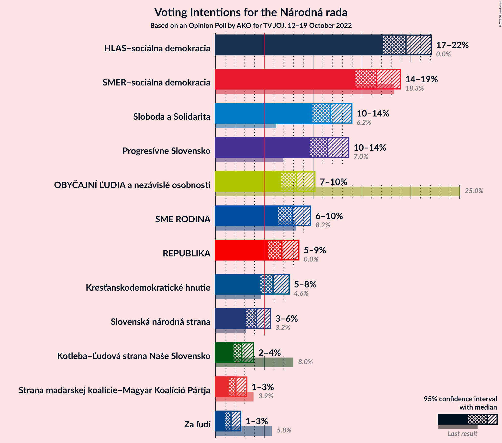

### Confidence Intervals

| Party | Last Result | Poll Result | 80% Confidence Interval | 90% Confidence Interval | 95% Confidence Interval | 99% Confidence Interval |
|:-----:|:-----------:|:-----------:|:-----------------------:|:-----------------------:|:-----------------------:|:-----------------------:|
| HLAS–sociálna demokracia | 0.0% | 19.5% | 18.0–21.2% |17.5–21.7% |17.2–22.1% |16.4–22.9% |
| SMER–sociálna demokracia | 18.3% | 16.5% | 15.1–18.1% |14.7–18.5% |14.3–18.9% |13.7–19.7% |
| Sloboda a Solidarita | 6.2% | 11.8% | 10.6–13.2% |10.2–13.6% |9.9–14.0% |9.4–14.6% |
| Progresívne Slovensko | 7.0% | 11.5% | 10.3–12.9% |10.0–13.3% |9.7–13.6% |9.1–14.3% |
| OBYČAJNÍ ĽUDIA a nezávislé osobnosti | 25.0% | 8.3% | 7.3–9.5% |7.0–9.9% |6.7–10.2% |6.3–10.8% |
| SME RODINA | 8.2% | 7.9% | 6.9–9.1% |6.6–9.4% |6.4–9.7% |5.9–10.3% |
| REPUBLIKA | 0.0% | 6.8% | 5.9–7.9% |5.6–8.3% |5.4–8.5% |5.0–9.1% |
| Kresťanskodemokratické hnutie | 4.6% | 5.9% | 5.0–7.0% |4.8–7.3% |4.6–7.5% |4.2–8.1% |
| Slovenská národná strana | 3.2% | 4.2% | 3.5–5.1% |3.3–5.4% |3.1–5.6% |2.8–6.1% |
| Kotleba–Ľudová strana Naše Slovensko | 8.0% | 2.7% | 2.1–3.5% |2.0–3.7% |1.9–3.9% |1.6–4.3% |
| Strana maďarskej koalície–Magyar Koalíció Pártja | 3.9% | 2.1% | 1.6–2.8% |1.5–3.0% |1.4–3.2% |1.2–3.6% |
| Za ľudí | 5.8% | 1.6% | 1.2–2.2% |1.1–2.4% |1.0–2.6% |0.8–2.9% |

*Note:* The poll result column reflects the actual value used in the calculations. Published results may vary slightly, and in addition be rounded to fewer digits.

## Seats

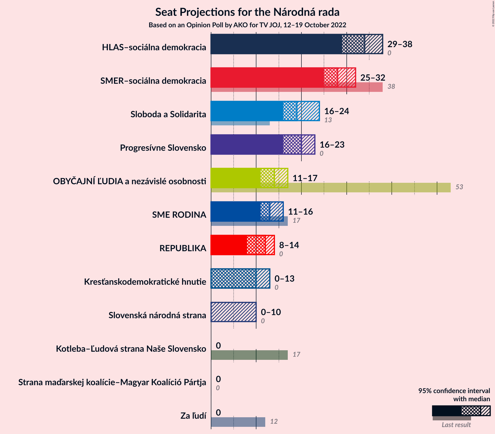

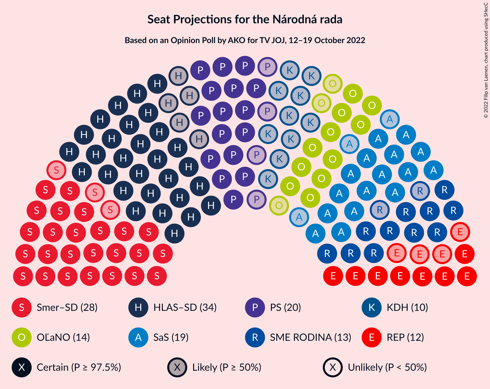

### Confidence Intervals

| Party | Last Result | Median | 80% Confidence Interval | 90% Confidence Interval | 95% Confidence Interval | 99% Confidence Interval |
|:-----:|:-----------:|:------:|:-----------------------:|:-----------------------:|:-----------------------:|:-----------------------:|
| <a href="#hlas–sociálna-demokracia">HLAS–sociálna demokracia</a> | 0 | 34 | 31–37 |30–37 |29–38 |27–40 |
| <a href="#smer–sociálna-demokracia">SMER–sociálna demokracia</a> | 38 | 28 | 25–31 |25–31 |25–32 |24–34 |
| <a href="#sloboda-a-solidarita">Sloboda a Solidarita</a> | 13 | 19 | 18–22 |16–23 |16–24 |15–25 |
| <a href="#progresívne-slovensko">Progresívne Slovensko</a> | 0 | 20 | 17–23 |17–23 |16–23 |15–25 |
| <a href="#obyčajní-ľudia-a-nezávislé-osobnosti">OBYČAJNÍ ĽUDIA a nezávislé osobnosti</a> | 53 | 14 | 12–16 |12–16 |11–17 |11–18 |
| <a href="#sme-rodina">SME RODINA</a> | 17 | 13 | 12–15 |11–16 |11–16 |10–18 |
| <a href="#republika">REPUBLIKA</a> | 0 | 12 | 9–13 |8–13 |8–14 |0–15 |
| <a href="#kresťanskodemokratické-hnutie">Kresťanskodemokratické hnutie</a> | 0 | 10 | 9–12 |0–13 |0–13 |0–13 |
| <a href="#slovenská-národná-strana">Slovenská národná strana</a> | 0 | 0 | 0–9 |0–10 |0–10 |0–10 |
| <a href="#kotleba–ľudová-strana-naše-slovensko">Kotleba–Ľudová strana Naše Slovensko</a> | 17 | 0 | 0 |0 |0 |0 |
| <a href="#strana-maďarskej-koalície–magyar-koalíció-pártja">Strana maďarskej koalície–Magyar Koalíció Pártja</a> | 0 | 0 | 0 |0 |0 |0 |
| <a href="#za-ľudí">Za ľudí</a> | 12 | 0 | 0 |0 |0 |0 |

### HLAS–sociálna demokracia

*For a full overview of the results for this party, see the [HLAS–sociálna demokracia](party-hlas–sociálnademokracia.html) page.*

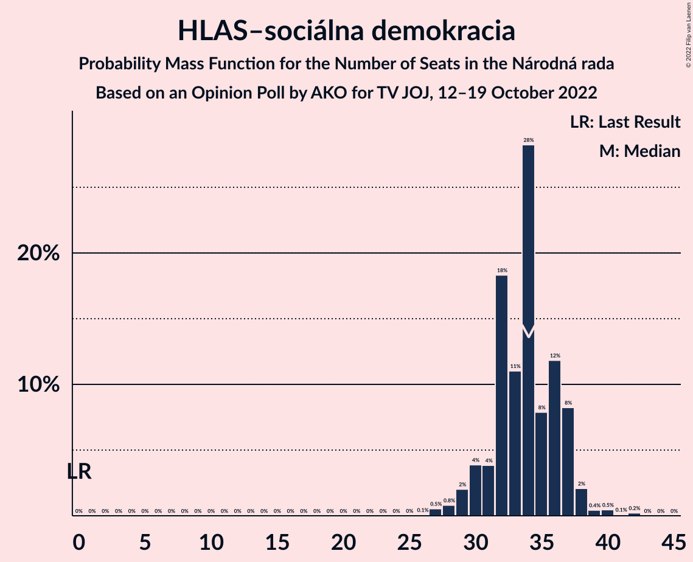

| Number of Seats | Probability | Accumulated | Special Marks |
|:---------------:|:-----------:|:-----------:|:-------------:|
| 0 | 0% | 100% | Last Result |
| 1 | 0% | 100% |  |
| 2 | 0% | 100% |  |
| 3 | 0% | 100% |  |
| 4 | 0% | 100% |  |
| 5 | 0% | 100% |  |
| 6 | 0% | 100% |  |
| 7 | 0% | 100% |  |
| 8 | 0% | 100% |  |
| 9 | 0% | 100% |  |
| 10 | 0% | 100% |  |
| 11 | 0% | 100% |  |
| 12 | 0% | 100% |  |
| 13 | 0% | 100% |  |
| 14 | 0% | 100% |  |
| 15 | 0% | 100% |  |
| 16 | 0% | 100% |  |
| 17 | 0% | 100% |  |
| 18 | 0% | 100% |  |
| 19 | 0% | 100% |  |
| 20 | 0% | 100% |  |
| 21 | 0% | 100% |  |
| 22 | 0% | 100% |  |
| 23 | 0% | 100% |  |
| 24 | 0% | 100% |  |
| 25 | 0% | 100% |  |
| 26 | 0.1% | 100% |  |
| 27 | 0.5% | 99.9% |  |
| 28 | 0.8% | 99.4% |  |
| 29 | 2% | 98.6% |  |
| 30 | 4% | 97% |  |
| 31 | 4% | 93% |  |
| 32 | 18% | 89% |  |
| 33 | 11% | 71% |  |
| 34 | 28% | 59% | Median |
| 35 | 8% | 31% |  |
| 36 | 12% | 23% |  |
| 37 | 8% | 12% |  |
| 38 | 2% | 3% |  |
| 39 | 0.4% | 1.2% |  |
| 40 | 0.5% | 0.8% |  |
| 41 | 0.1% | 0.3% |  |
| 42 | 0.2% | 0.2% |  |
| 43 | 0% | 0% |  |

### SMER–sociálna demokracia

*For a full overview of the results for this party, see the [SMER–sociálna demokracia](party-smer–sociálnademokracia.html) page.*

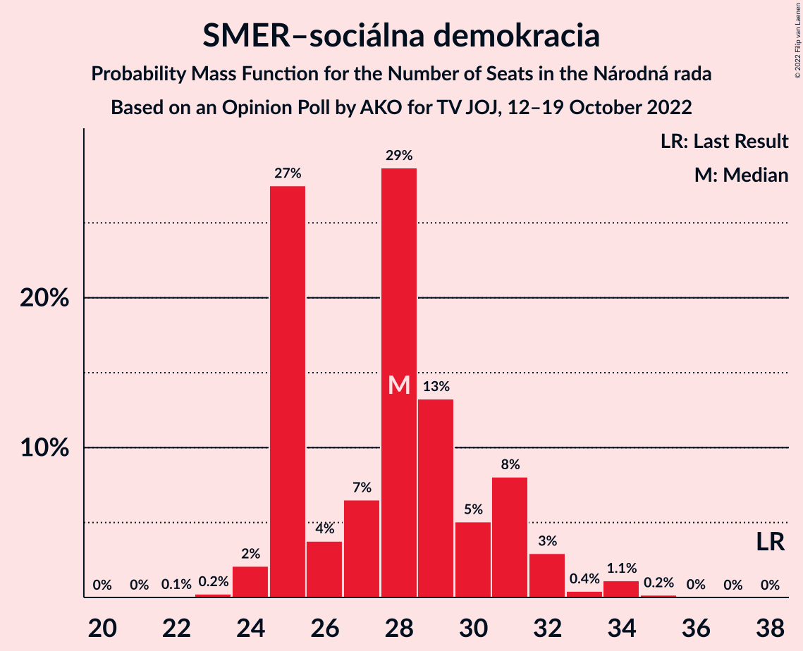

| Number of Seats | Probability | Accumulated | Special Marks |
|:---------------:|:-----------:|:-----------:|:-------------:|
| 22 | 0.1% | 100% |  |
| 23 | 0.2% | 99.9% |  |
| 24 | 2% | 99.7% |  |
| 25 | 27% | 98% |  |
| 26 | 4% | 70% |  |
| 27 | 7% | 66% |  |
| 28 | 29% | 60% | Median |
| 29 | 13% | 31% |  |
| 30 | 5% | 18% |  |
| 31 | 8% | 13% |  |
| 32 | 3% | 5% |  |
| 33 | 0.4% | 2% |  |
| 34 | 1.1% | 1.4% |  |
| 35 | 0.2% | 0.2% |  |
| 36 | 0% | 0.1% |  |
| 37 | 0% | 0% |  |
| 38 | 0% | 0% | Last Result |

### Sloboda a Solidarita

*For a full overview of the results for this party, see the [Sloboda a Solidarita](party-slobodaasolidarita.html) page.*

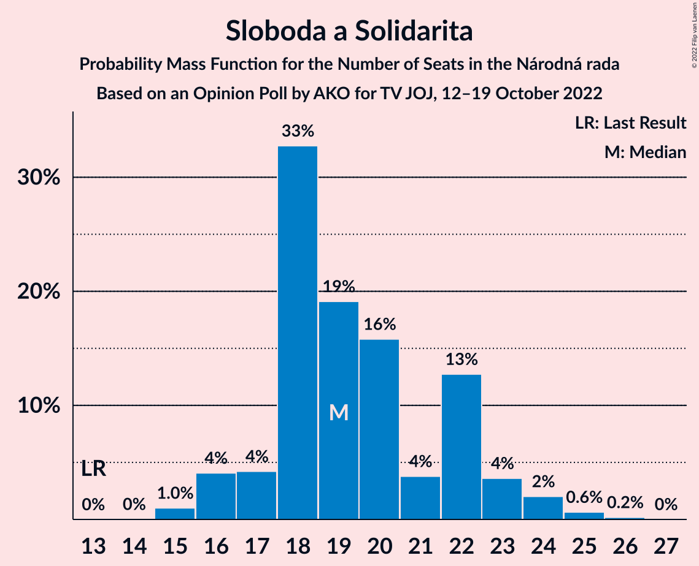

| Number of Seats | Probability | Accumulated | Special Marks |
|:---------------:|:-----------:|:-----------:|:-------------:|
| 13 | 0% | 100% | Last Result |
| 14 | 0% | 100% |  |
| 15 | 1.0% | 100% |  |
| 16 | 4% | 99.0% |  |
| 17 | 4% | 95% |  |
| 18 | 33% | 91% |  |
| 19 | 19% | 58% | Median |
| 20 | 16% | 39% |  |
| 21 | 4% | 23% |  |
| 22 | 13% | 19% |  |
| 23 | 4% | 6% |  |
| 24 | 2% | 3% |  |
| 25 | 0.6% | 0.8% |  |
| 26 | 0.2% | 0.2% |  |
| 27 | 0% | 0% |  |

### Progresívne Slovensko

*For a full overview of the results for this party, see the [Progresívne Slovensko](party-progresívneslovensko.html) page.*

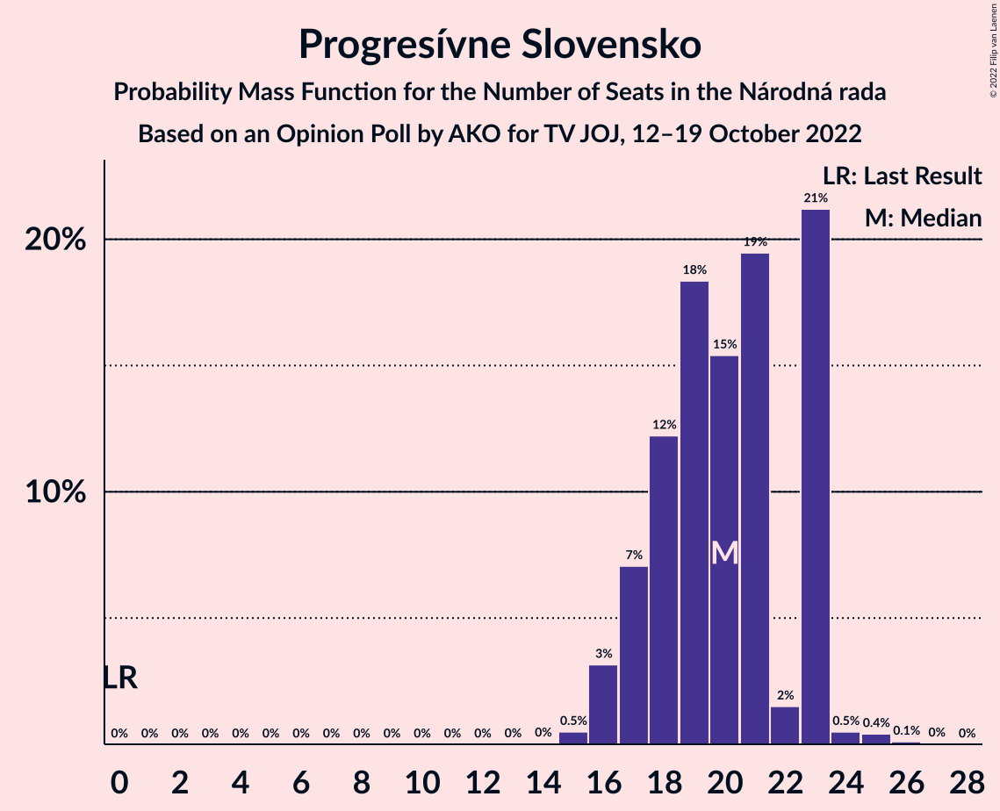

| Number of Seats | Probability | Accumulated | Special Marks |
|:---------------:|:-----------:|:-----------:|:-------------:|
| 0 | 0% | 100% | Last Result |
| 1 | 0% | 100% |  |
| 2 | 0% | 100% |  |
| 3 | 0% | 100% |  |
| 4 | 0% | 100% |  |
| 5 | 0% | 100% |  |
| 6 | 0% | 100% |  |
| 7 | 0% | 100% |  |
| 8 | 0% | 100% |  |
| 9 | 0% | 100% |  |
| 10 | 0% | 100% |  |
| 11 | 0% | 100% |  |
| 12 | 0% | 100% |  |
| 13 | 0% | 100% |  |
| 14 | 0% | 100% |  |
| 15 | 0.5% | 100% |  |
| 16 | 3% | 99.5% |  |
| 17 | 7% | 96% |  |
| 18 | 12% | 89% |  |
| 19 | 18% | 77% |  |
| 20 | 15% | 59% | Median |
| 21 | 19% | 43% |  |
| 22 | 2% | 24% |  |
| 23 | 21% | 22% |  |
| 24 | 0.5% | 1.1% |  |
| 25 | 0.4% | 0.6% |  |
| 26 | 0.1% | 0.2% |  |
| 27 | 0% | 0% |  |

### OBYČAJNÍ ĽUDIA a nezávislé osobnosti

*For a full overview of the results for this party, see the [OBYČAJNÍ ĽUDIA a nezávislé osobnosti](party-obyčajníľudiaanezávisléosobnosti.html) page.*

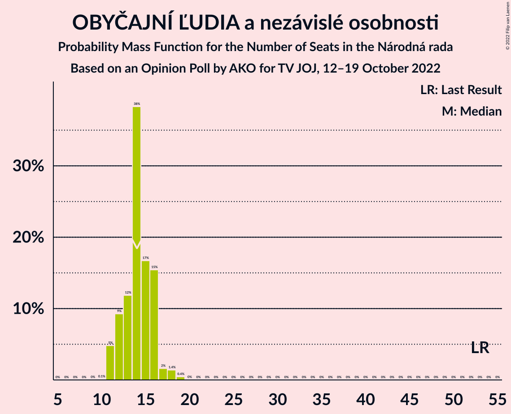

| Number of Seats | Probability | Accumulated | Special Marks |
|:---------------:|:-----------:|:-----------:|:-------------:|
| 10 | 0.1% | 100% |  |
| 11 | 5% | 99.9% |  |
| 12 | 9% | 95% |  |
| 13 | 12% | 86% |  |
| 14 | 38% | 74% | Median |
| 15 | 17% | 36% |  |
| 16 | 15% | 19% |  |
| 17 | 2% | 3% |  |
| 18 | 1.4% | 2% |  |
| 19 | 0.4% | 0.5% |  |
| 20 | 0% | 0% |  |
| 21 | 0% | 0% |  |
| 22 | 0% | 0% |  |
| 23 | 0% | 0% |  |
| 24 | 0% | 0% |  |
| 25 | 0% | 0% |  |
| 26 | 0% | 0% |  |
| 27 | 0% | 0% |  |
| 28 | 0% | 0% |  |
| 29 | 0% | 0% |  |
| 30 | 0% | 0% |  |
| 31 | 0% | 0% |  |
| 32 | 0% | 0% |  |
| 33 | 0% | 0% |  |
| 34 | 0% | 0% |  |
| 35 | 0% | 0% |  |
| 36 | 0% | 0% |  |
| 37 | 0% | 0% |  |
| 38 | 0% | 0% |  |
| 39 | 0% | 0% |  |
| 40 | 0% | 0% |  |
| 41 | 0% | 0% |  |
| 42 | 0% | 0% |  |
| 43 | 0% | 0% |  |
| 44 | 0% | 0% |  |
| 45 | 0% | 0% |  |
| 46 | 0% | 0% |  |
| 47 | 0% | 0% |  |
| 48 | 0% | 0% |  |
| 49 | 0% | 0% |  |
| 50 | 0% | 0% |  |
| 51 | 0% | 0% |  |
| 52 | 0% | 0% |  |
| 53 | 0% | 0% | Last Result |

### SME RODINA

*For a full overview of the results for this party, see the [SME RODINA](party-smerodina.html) page.*

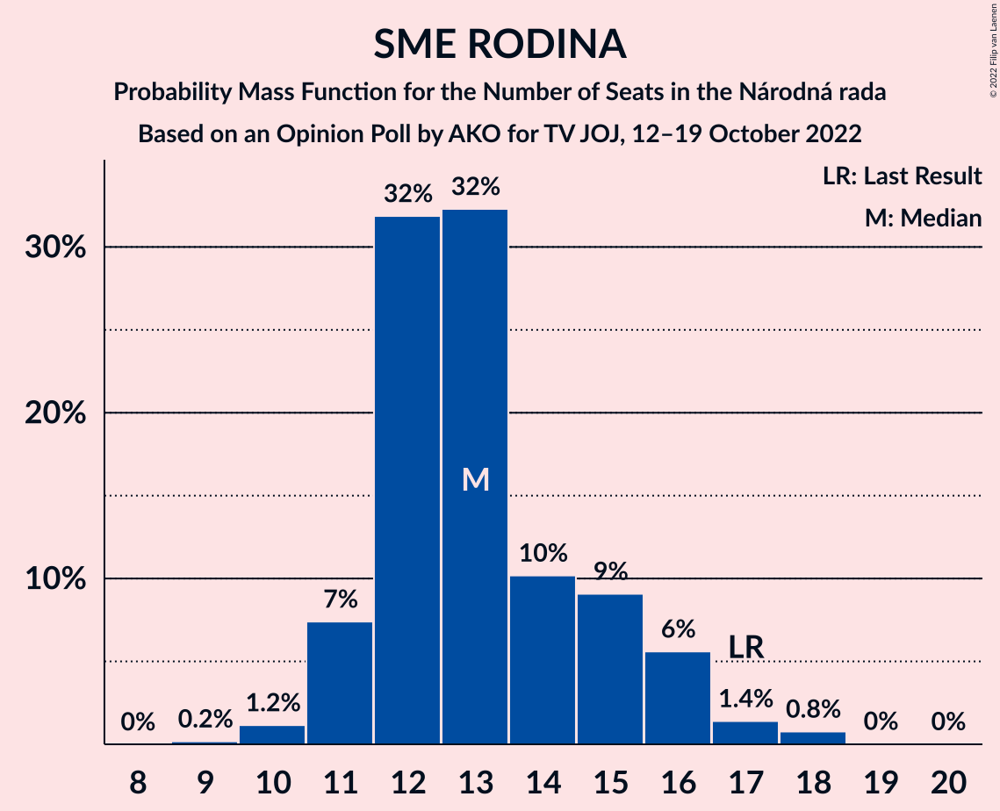

| Number of Seats | Probability | Accumulated | Special Marks |
|:---------------:|:-----------:|:-----------:|:-------------:|
| 9 | 0.2% | 100% |  |
| 10 | 1.2% | 99.8% |  |
| 11 | 7% | 98.7% |  |
| 12 | 32% | 91% |  |
| 13 | 32% | 59% | Median |
| 14 | 10% | 27% |  |
| 15 | 9% | 17% |  |
| 16 | 6% | 8% |  |
| 17 | 1.4% | 2% | Last Result |
| 18 | 0.8% | 0.8% |  |
| 19 | 0% | 0.1% |  |
| 20 | 0% | 0% |  |

### REPUBLIKA

*For a full overview of the results for this party, see the [REPUBLIKA](party-republika.html) page.*

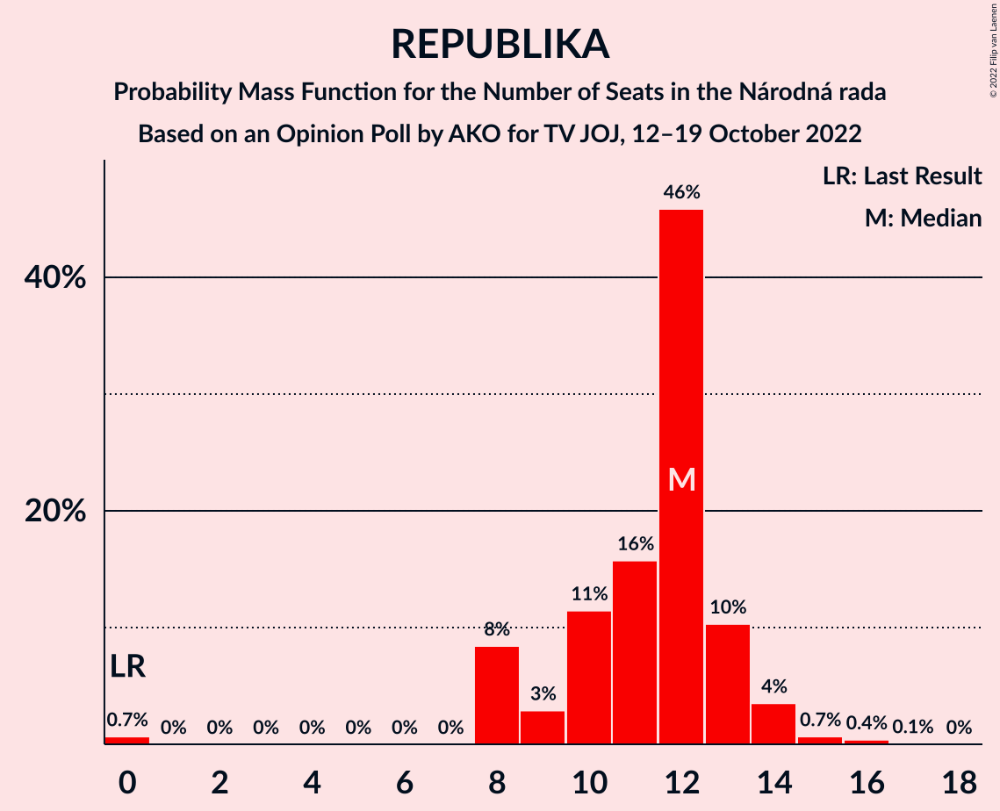

| Number of Seats | Probability | Accumulated | Special Marks |
|:---------------:|:-----------:|:-----------:|:-------------:|
| 0 | 0.7% | 100% | Last Result |
| 1 | 0% | 99.3% |  |
| 2 | 0% | 99.3% |  |
| 3 | 0% | 99.3% |  |
| 4 | 0% | 99.3% |  |
| 5 | 0% | 99.3% |  |
| 6 | 0% | 99.3% |  |
| 7 | 0% | 99.3% |  |
| 8 | 8% | 99.3% |  |
| 9 | 3% | 91% |  |
| 10 | 11% | 88% |  |
| 11 | 16% | 77% |  |
| 12 | 46% | 61% | Median |
| 13 | 10% | 15% |  |
| 14 | 4% | 5% |  |
| 15 | 0.7% | 1.1% |  |
| 16 | 0.4% | 0.5% |  |
| 17 | 0.1% | 0.1% |  |
| 18 | 0% | 0% |  |

### Kresťanskodemokratické hnutie

*For a full overview of the results for this party, see the [Kresťanskodemokratické hnutie](party-kresťanskodemokratickéhnutie.html) page.*

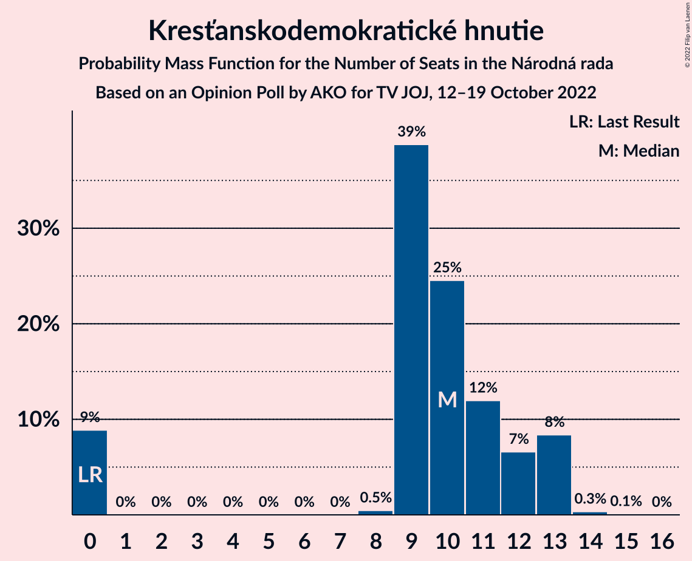

| Number of Seats | Probability | Accumulated | Special Marks |
|:---------------:|:-----------:|:-----------:|:-------------:|
| 0 | 9% | 100% | Last Result |
| 1 | 0% | 91% |  |
| 2 | 0% | 91% |  |
| 3 | 0% | 91% |  |
| 4 | 0% | 91% |  |
| 5 | 0% | 91% |  |
| 6 | 0% | 91% |  |
| 7 | 0% | 91% |  |
| 8 | 0.5% | 91% |  |
| 9 | 39% | 91% |  |
| 10 | 25% | 52% | Median |
| 11 | 12% | 27% |  |
| 12 | 7% | 15% |  |
| 13 | 8% | 9% |  |
| 14 | 0.3% | 0.4% |  |
| 15 | 0.1% | 0.1% |  |
| 16 | 0% | 0% |  |

### Slovenská národná strana

*For a full overview of the results for this party, see the [Slovenská národná strana](party-slovenskánárodnástrana.html) page.*

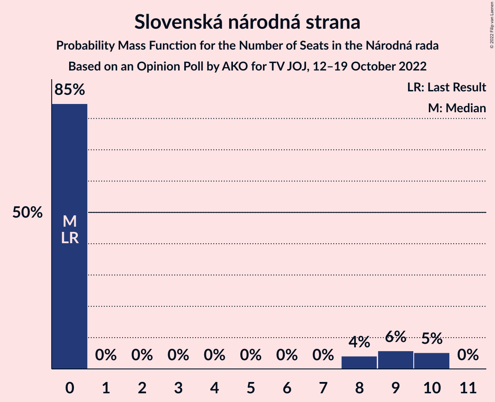

| Number of Seats | Probability | Accumulated | Special Marks |
|:---------------:|:-----------:|:-----------:|:-------------:|
| 0 | 85% | 100% | Last Result, Median |
| 1 | 0% | 15% |  |
| 2 | 0% | 15% |  |
| 3 | 0% | 15% |  |
| 4 | 0% | 15% |  |
| 5 | 0% | 15% |  |
| 6 | 0% | 15% |  |
| 7 | 0% | 15% |  |
| 8 | 4% | 15% |  |
| 9 | 6% | 11% |  |
| 10 | 5% | 5% |  |
| 11 | 0% | 0% |  |

### Kotleba–Ľudová strana Naše Slovensko

*For a full overview of the results for this party, see the [Kotleba–Ľudová strana Naše Slovensko](party-kotleba–ľudovástrananašeslovensko.html) page.*

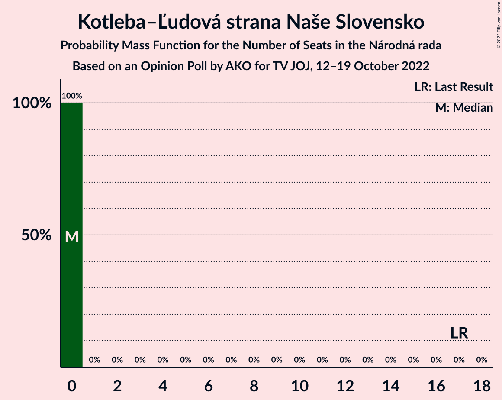

| Number of Seats | Probability | Accumulated | Special Marks |
|:---------------:|:-----------:|:-----------:|:-------------:|
| 0 | 100% | 100% | Median |
| 1 | 0% | 0% |  |
| 2 | 0% | 0% |  |
| 3 | 0% | 0% |  |
| 4 | 0% | 0% |  |
| 5 | 0% | 0% |  |
| 6 | 0% | 0% |  |
| 7 | 0% | 0% |  |
| 8 | 0% | 0% |  |
| 9 | 0% | 0% |  |
| 10 | 0% | 0% |  |
| 11 | 0% | 0% |  |
| 12 | 0% | 0% |  |
| 13 | 0% | 0% |  |
| 14 | 0% | 0% |  |
| 15 | 0% | 0% |  |
| 16 | 0% | 0% |  |
| 17 | 0% | 0% | Last Result |

### Strana maďarskej koalície–Magyar Koalíció Pártja

*For a full overview of the results for this party, see the [Strana maďarskej koalície–Magyar Koalíció Pártja](party-stranamaďarskejkoalície–magyarkoalíciópártja.html) page.*

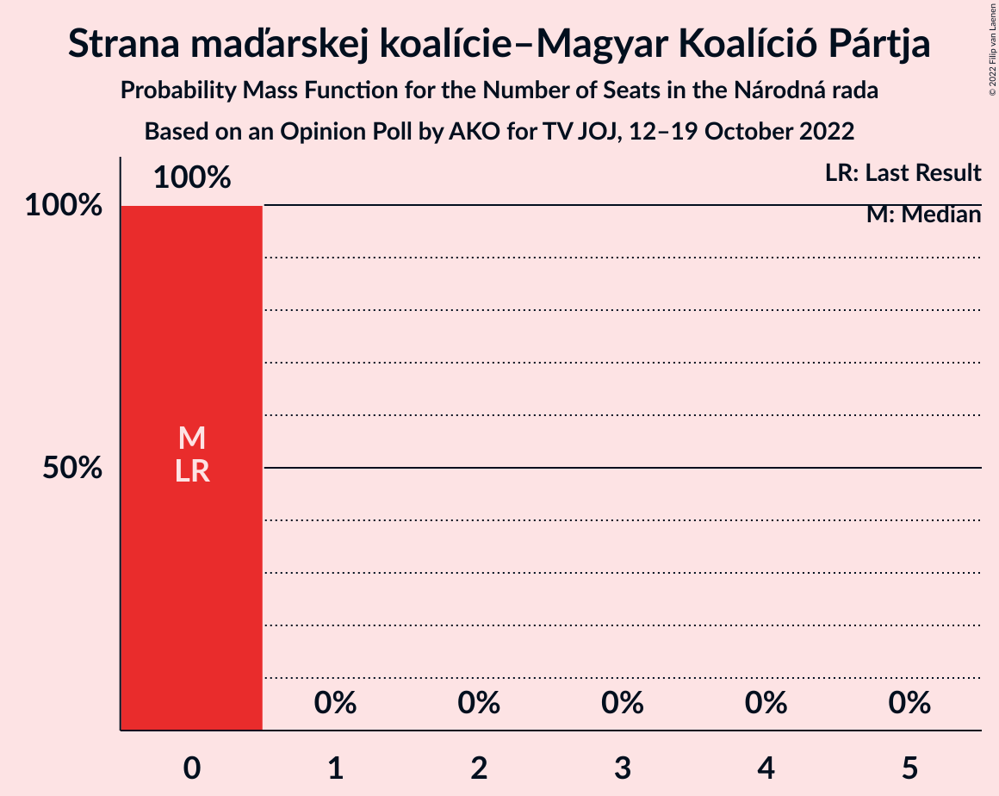

| Number of Seats | Probability | Accumulated | Special Marks |
|:---------------:|:-----------:|:-----------:|:-------------:|
| 0 | 100% | 100% | Last Result, Median |

### Za ľudí

*For a full overview of the results for this party, see the [Za ľudí](party-zaľudí.html) page.*

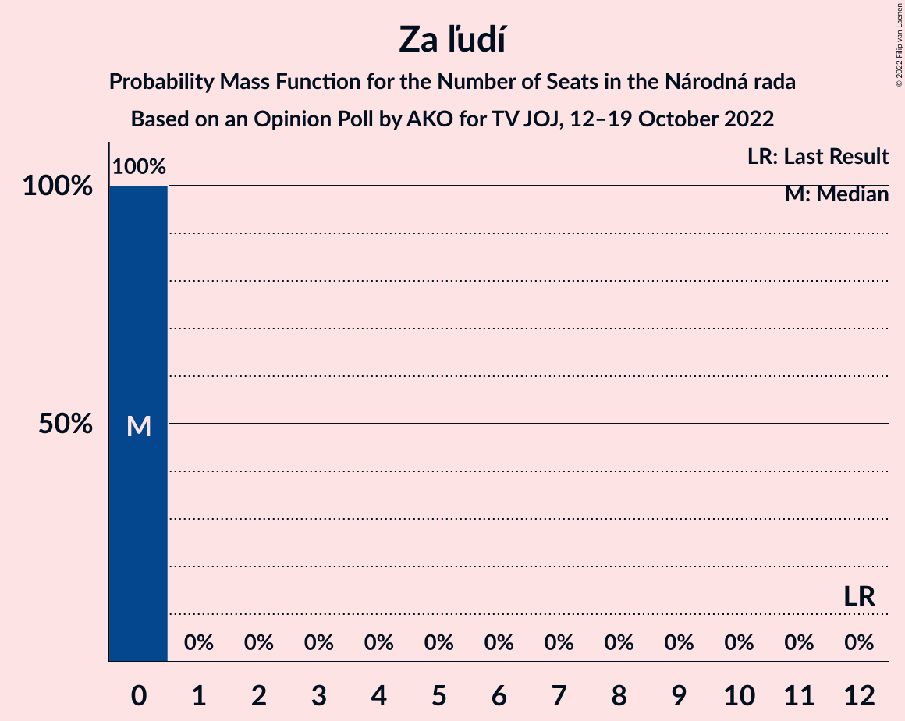

| Number of Seats | Probability | Accumulated | Special Marks |
|:---------------:|:-----------:|:-----------:|:-------------:|
| 0 | 100% | 100% | Median |
| 1 | 0% | 0% |  |
| 2 | 0% | 0% |  |
| 3 | 0% | 0% |  |
| 4 | 0% | 0% |  |
| 5 | 0% | 0% |  |
| 6 | 0% | 0% |  |
| 7 | 0% | 0% |  |
| 8 | 0% | 0% |  |
| 9 | 0% | 0% |  |
| 10 | 0% | 0% |  |
| 11 | 0% | 0% |  |
| 12 | 0% | 0% | Last Result |

## Coalitions

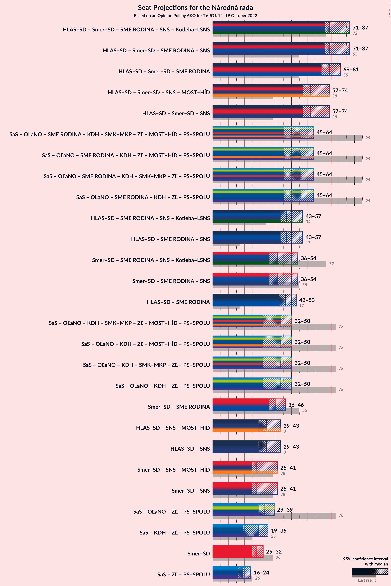

### Confidence Intervals

| Coalition | Last Result | Median | Majority? | 80% Confidence Interval | 90% Confidence Interval | 95% Confidence Interval | 99% Confidence Interval |
|:---------:|:-----------:|:------:|:---------:|:-----------------------:|:-----------------------:|:-----------------------:|:-----------------------:|
| HLAS–sociálna demokracia – SMER–sociálna demokracia – SME RODINA – Slovenská národná strana – Kotleba–Ľudová strana Naše Slovensko | 72 | 74 | 40% | 71–81 | 71–83 | 71–87 | 69–87 |
| HLAS–sociálna demokracia – SMER–sociálna demokracia – SME RODINA – Slovenská národná strana | 55 | 74 | 40% | 71–81 | 71–83 | 71–87 | 69–87 |
| HLAS–sociálna demokracia – SMER–sociálna demokracia – SME RODINA | 55 | 74 | 28% | 71–79 | 70–80 | 69–81 | 67–83 |
| HLAS–sociálna demokracia – SMER–sociálna demokracia – Slovenská národná strana | 38 | 62 | 0% | 59–68 | 57–70 | 57–74 | 56–74 |
| HLAS–sociálna demokracia – SME RODINA – Slovenská národná strana – Kotleba–Ľudová strana Naše Slovensko | 34 | 47 | 0% | 45–55 | 44–56 | 43–57 | 41–58 |
| HLAS–sociálna demokracia – SME RODINA – Slovenská národná strana | 17 | 47 | 0% | 45–55 | 44–56 | 43–57 | 41–58 |
| SMER–sociálna demokracia – SME RODINA – Slovenská národná strana – Kotleba–Ľudová strana Naše Slovensko | 72 | 41 | 0% | 37–49 | 37–50 | 36–54 | 36–54 |
| SMER–sociálna demokracia – SME RODINA – Slovenská národná strana | 55 | 41 | 0% | 37–49 | 37–50 | 36–54 | 36–54 |
| HLAS–sociálna demokracia – SME RODINA | 17 | 46 | 0% | 44–49 | 43–50 | 42–53 | 40–54 |
| SMER–sociálna demokracia – SME RODINA | 55 | 40 | 0% | 37–44 | 36–46 | 36–46 | 35–48 |
| HLAS–sociálna demokracia – Slovenská národná strana | 0 | 34 | 0% | 32–40 | 31–43 | 29–43 | 27–45 |
| SMER–sociálna demokracia – Slovenská národná strana | 38 | 28 | 0% | 25–34 | 25–35 | 25–41 | 24–41 |
| SMER–sociálna demokracia | 38 | 28 | 0% | 25–31 | 25–31 | 25–32 | 24–34 |

### HLAS–sociálna demokracia – SMER–sociálna demokracia – SME RODINA – Slovenská národná strana – Kotleba–Ľudová strana Naše Slovensko

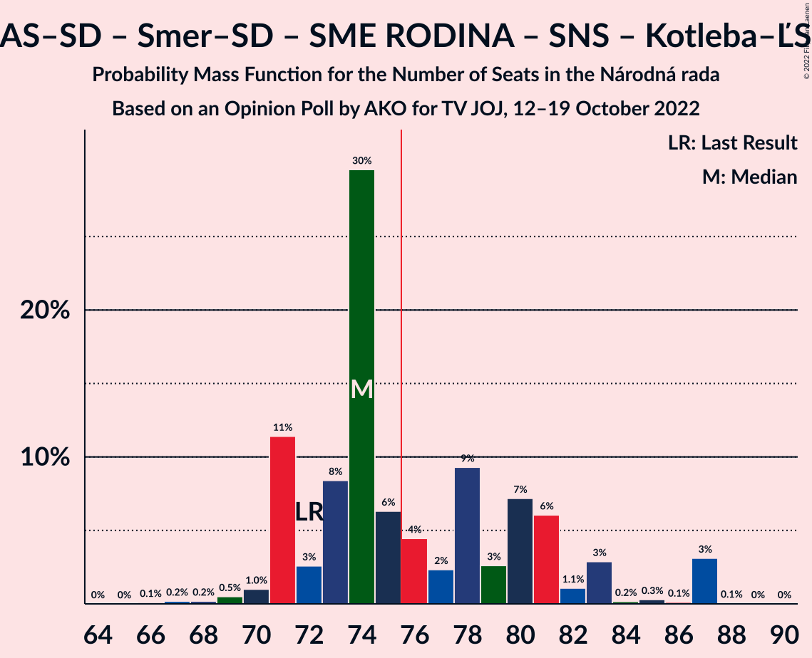

| Number of Seats | Probability | Accumulated | Special Marks |
|:---------------:|:-----------:|:-----------:|:-------------:|
| 66 | 0.1% | 100% |  |
| 67 | 0.2% | 99.9% |  |
| 68 | 0.2% | 99.7% |  |
| 69 | 0.5% | 99.5% |  |
| 70 | 1.0% | 99.0% |  |
| 71 | 11% | 98% |  |
| 72 | 3% | 87% | Last Result |
| 73 | 8% | 84% |  |
| 74 | 30% | 76% |  |
| 75 | 6% | 46% | Median |
| 76 | 4% | 40% | Majority |
| 77 | 2% | 35% |  |
| 78 | 9% | 33% |  |
| 79 | 3% | 24% |  |
| 80 | 7% | 21% |  |
| 81 | 6% | 14% |  |
| 82 | 1.1% | 8% |  |
| 83 | 3% | 7% |  |
| 84 | 0.2% | 4% |  |
| 85 | 0.3% | 4% |  |
| 86 | 0.1% | 3% |  |
| 87 | 3% | 3% |  |
| 88 | 0.1% | 0.1% |  |
| 89 | 0% | 0.1% |  |
| 90 | 0% | 0% |  |

### HLAS–sociálna demokracia – SMER–sociálna demokracia – SME RODINA – Slovenská národná strana

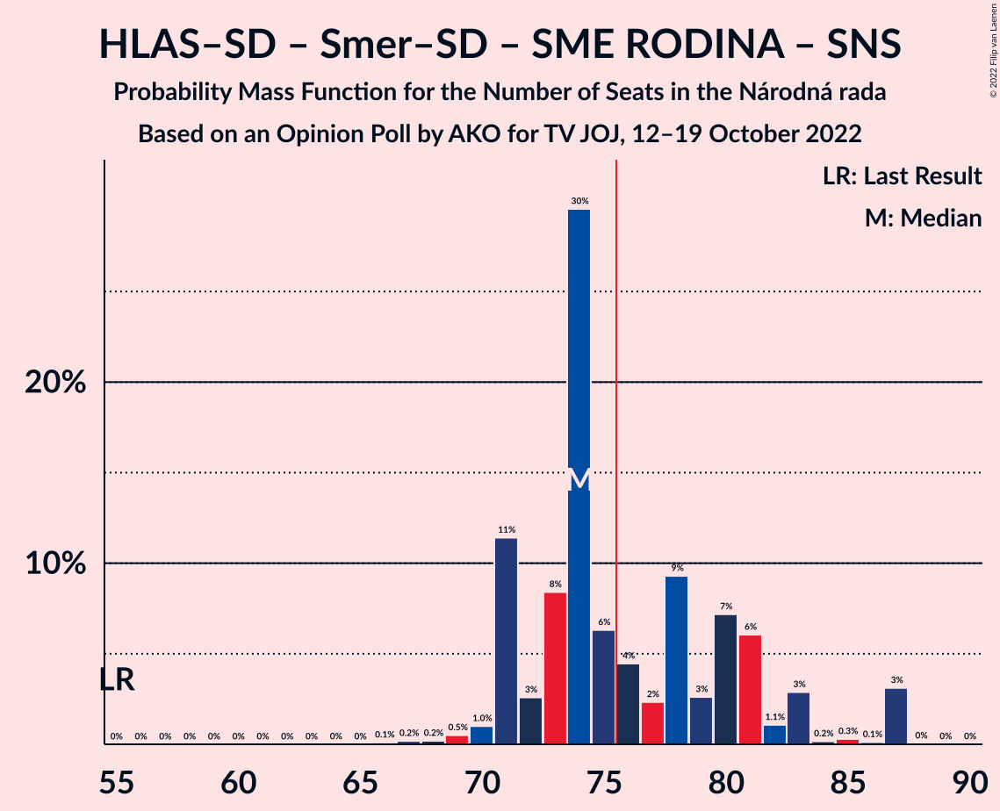

| Number of Seats | Probability | Accumulated | Special Marks |
|:---------------:|:-----------:|:-----------:|:-------------:|
| 55 | 0% | 100% | Last Result |
| 56 | 0% | 100% |  |
| 57 | 0% | 100% |  |
| 58 | 0% | 100% |  |
| 59 | 0% | 100% |  |
| 60 | 0% | 100% |  |
| 61 | 0% | 100% |  |
| 62 | 0% | 100% |  |
| 63 | 0% | 100% |  |
| 64 | 0% | 100% |  |
| 65 | 0% | 100% |  |
| 66 | 0.1% | 100% |  |
| 67 | 0.2% | 99.9% |  |
| 68 | 0.2% | 99.7% |  |
| 69 | 0.5% | 99.5% |  |
| 70 | 1.0% | 99.0% |  |
| 71 | 11% | 98% |  |
| 72 | 3% | 87% |  |
| 73 | 8% | 84% |  |
| 74 | 30% | 76% |  |
| 75 | 6% | 46% | Median |
| 76 | 4% | 40% | Majority |
| 77 | 2% | 35% |  |
| 78 | 9% | 33% |  |
| 79 | 3% | 24% |  |
| 80 | 7% | 21% |  |
| 81 | 6% | 14% |  |
| 82 | 1.1% | 8% |  |
| 83 | 3% | 7% |  |
| 84 | 0.2% | 4% |  |
| 85 | 0.3% | 4% |  |
| 86 | 0.1% | 3% |  |
| 87 | 3% | 3% |  |
| 88 | 0% | 0.1% |  |
| 89 | 0% | 0.1% |  |
| 90 | 0% | 0% |  |

### HLAS–sociálna demokracia – SMER–sociálna demokracia – SME RODINA

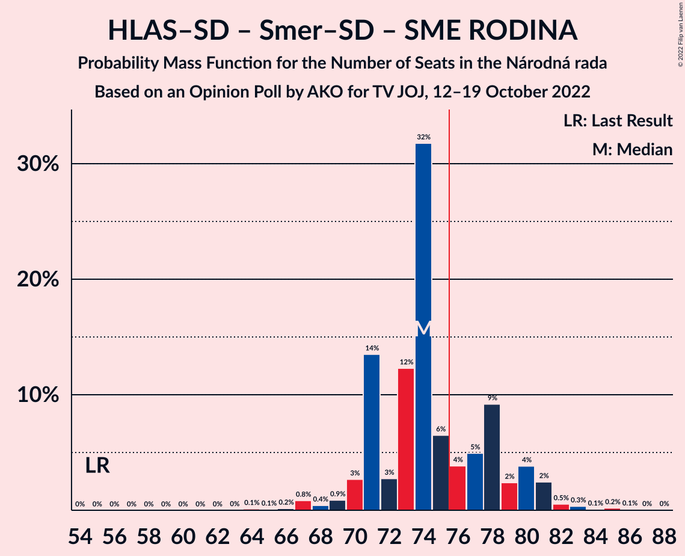

| Number of Seats | Probability | Accumulated | Special Marks |
|:---------------:|:-----------:|:-----------:|:-------------:|
| 55 | 0% | 100% | Last Result |
| 56 | 0% | 100% |  |
| 57 | 0% | 100% |  |
| 58 | 0% | 100% |  |
| 59 | 0% | 100% |  |
| 60 | 0% | 100% |  |
| 61 | 0% | 100% |  |
| 62 | 0% | 100% |  |
| 63 | 0% | 100% |  |
| 64 | 0.1% | 100% |  |
| 65 | 0.1% | 99.8% |  |
| 66 | 0.2% | 99.8% |  |
| 67 | 0.8% | 99.6% |  |
| 68 | 0.4% | 98.8% |  |
| 69 | 0.9% | 98% |  |
| 70 | 3% | 97% |  |
| 71 | 14% | 95% |  |
| 72 | 3% | 81% |  |
| 73 | 12% | 79% |  |
| 74 | 32% | 66% |  |
| 75 | 6% | 34% | Median |
| 76 | 4% | 28% | Majority |
| 77 | 5% | 24% |  |
| 78 | 9% | 19% |  |
| 79 | 2% | 10% |  |
| 80 | 4% | 8% |  |
| 81 | 2% | 4% |  |
| 82 | 0.5% | 1.3% |  |
| 83 | 0.3% | 0.8% |  |
| 84 | 0.1% | 0.4% |  |
| 85 | 0.2% | 0.4% |  |
| 86 | 0.1% | 0.2% |  |
| 87 | 0% | 0.1% |  |
| 88 | 0% | 0% |  |

### HLAS–sociálna demokracia – SMER–sociálna demokracia – Slovenská národná strana

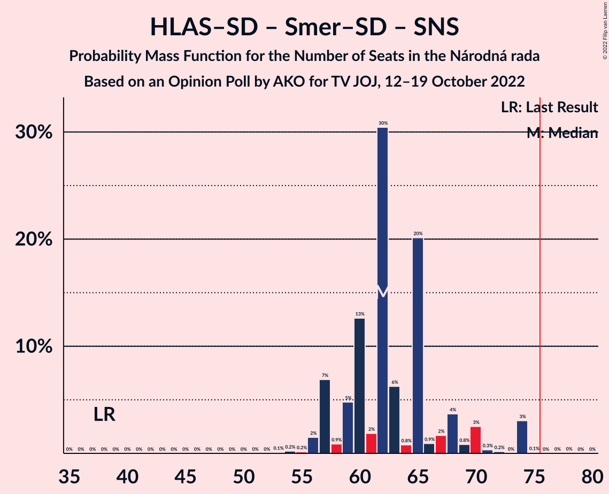

| Number of Seats | Probability | Accumulated | Special Marks |
|:---------------:|:-----------:|:-----------:|:-------------:|
| 38 | 0% | 100% | Last Result |
| 39 | 0% | 100% |  |
| 40 | 0% | 100% |  |
| 41 | 0% | 100% |  |
| 42 | 0% | 100% |  |
| 43 | 0% | 100% |  |
| 44 | 0% | 100% |  |
| 45 | 0% | 100% |  |
| 46 | 0% | 100% |  |
| 47 | 0% | 100% |  |
| 48 | 0% | 100% |  |
| 49 | 0% | 100% |  |
| 50 | 0% | 100% |  |
| 51 | 0% | 100% |  |
| 52 | 0% | 100% |  |
| 53 | 0.1% | 100% |  |
| 54 | 0.2% | 99.9% |  |
| 55 | 0.2% | 99.7% |  |
| 56 | 2% | 99.5% |  |
| 57 | 7% | 98% |  |
| 58 | 0.9% | 91% |  |
| 59 | 5% | 90% |  |
| 60 | 13% | 85% |  |
| 61 | 2% | 73% |  |
| 62 | 30% | 71% | Median |
| 63 | 6% | 41% |  |
| 64 | 0.8% | 34% |  |
| 65 | 20% | 33% |  |
| 66 | 0.9% | 13% |  |
| 67 | 2% | 12% |  |
| 68 | 4% | 11% |  |
| 69 | 0.8% | 7% |  |
| 70 | 3% | 6% |  |
| 71 | 0.3% | 4% |  |
| 72 | 0.2% | 3% |  |
| 73 | 0% | 3% |  |
| 74 | 3% | 3% |  |
| 75 | 0.1% | 0.1% |  |
| 76 | 0% | 0% | Majority |

### HLAS–sociálna demokracia – SME RODINA – Slovenská národná strana – Kotleba–Ľudová strana Naše Slovensko

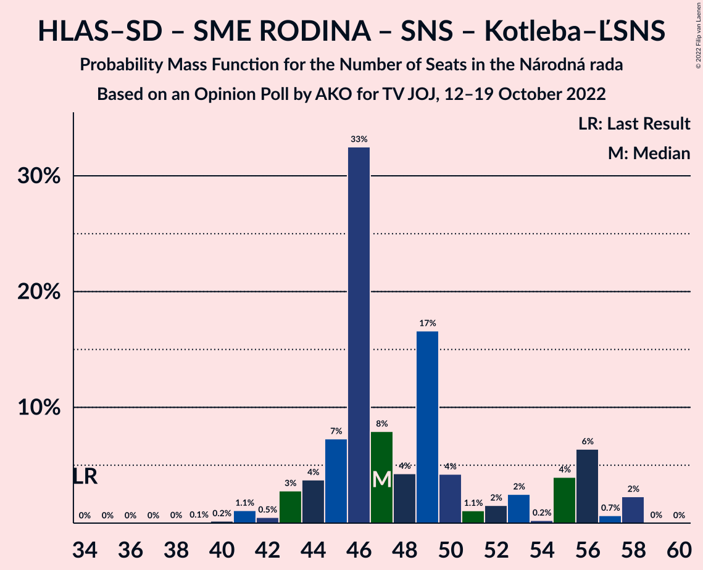

| Number of Seats | Probability | Accumulated | Special Marks |
|:---------------:|:-----------:|:-----------:|:-------------:|
| 34 | 0% | 100% | Last Result |
| 35 | 0% | 100% |  |
| 36 | 0% | 100% |  |
| 37 | 0% | 100% |  |
| 38 | 0% | 100% |  |
| 39 | 0.1% | 100% |  |
| 40 | 0.2% | 99.9% |  |
| 41 | 1.1% | 99.7% |  |
| 42 | 0.5% | 98.6% |  |
| 43 | 3% | 98% |  |
| 44 | 4% | 95% |  |
| 45 | 7% | 92% |  |
| 46 | 33% | 84% |  |
| 47 | 8% | 52% | Median |
| 48 | 4% | 44% |  |
| 49 | 17% | 40% |  |
| 50 | 4% | 23% |  |
| 51 | 1.1% | 19% |  |
| 52 | 2% | 18% |  |
| 53 | 2% | 16% |  |
| 54 | 0.2% | 14% |  |
| 55 | 4% | 13% |  |
| 56 | 6% | 9% |  |
| 57 | 0.7% | 3% |  |
| 58 | 2% | 2% |  |
| 59 | 0% | 0.1% |  |
| 60 | 0% | 0% |  |

### HLAS–sociálna demokracia – SME RODINA – Slovenská národná strana

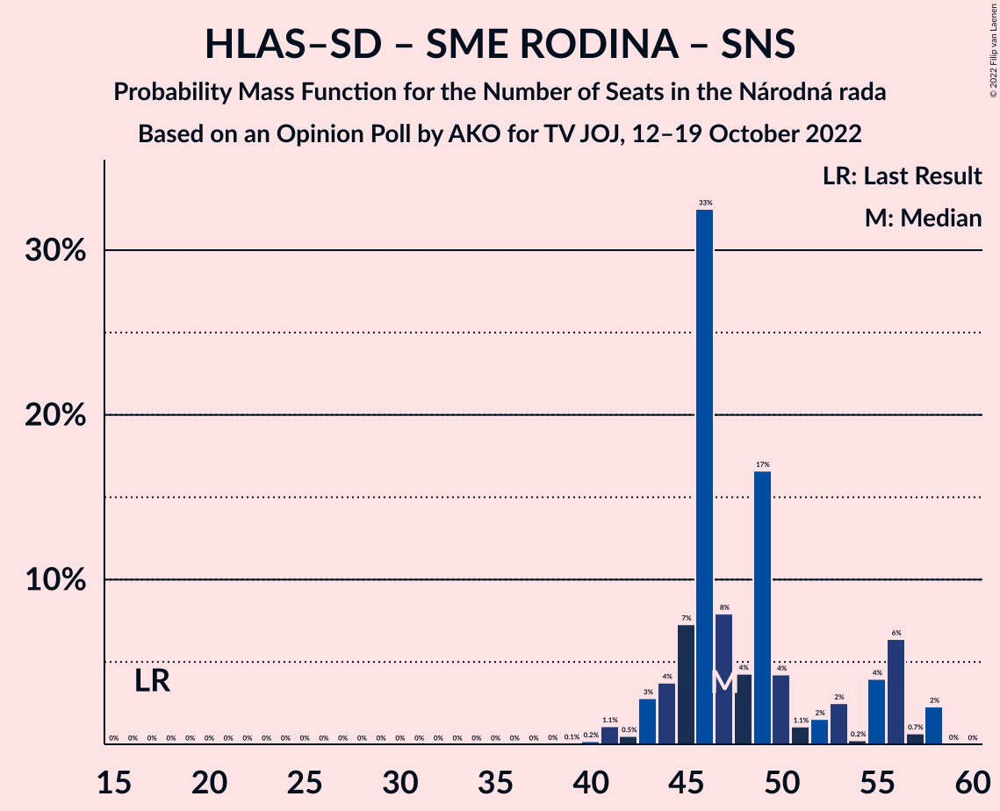

| Number of Seats | Probability | Accumulated | Special Marks |
|:---------------:|:-----------:|:-----------:|:-------------:|
| 17 | 0% | 100% | Last Result |
| 18 | 0% | 100% |  |
| 19 | 0% | 100% |  |
| 20 | 0% | 100% |  |
| 21 | 0% | 100% |  |
| 22 | 0% | 100% |  |
| 23 | 0% | 100% |  |
| 24 | 0% | 100% |  |
| 25 | 0% | 100% |  |
| 26 | 0% | 100% |  |
| 27 | 0% | 100% |  |
| 28 | 0% | 100% |  |
| 29 | 0% | 100% |  |
| 30 | 0% | 100% |  |
| 31 | 0% | 100% |  |
| 32 | 0% | 100% |  |
| 33 | 0% | 100% |  |
| 34 | 0% | 100% |  |
| 35 | 0% | 100% |  |
| 36 | 0% | 100% |  |
| 37 | 0% | 100% |  |
| 38 | 0% | 100% |  |
| 39 | 0.1% | 100% |  |
| 40 | 0.2% | 99.9% |  |
| 41 | 1.1% | 99.7% |  |
| 42 | 0.5% | 98.6% |  |
| 43 | 3% | 98% |  |
| 44 | 4% | 95% |  |
| 45 | 7% | 92% |  |
| 46 | 33% | 84% |  |
| 47 | 8% | 52% | Median |
| 48 | 4% | 44% |  |
| 49 | 17% | 40% |  |
| 50 | 4% | 23% |  |
| 51 | 1.1% | 19% |  |
| 52 | 2% | 18% |  |
| 53 | 2% | 16% |  |
| 54 | 0.2% | 14% |  |
| 55 | 4% | 13% |  |
| 56 | 6% | 9% |  |
| 57 | 0.7% | 3% |  |
| 58 | 2% | 2% |  |
| 59 | 0% | 0.1% |  |
| 60 | 0% | 0% |  |

### SMER–sociálna demokracia – SME RODINA – Slovenská národná strana – Kotleba–Ľudová strana Naše Slovensko

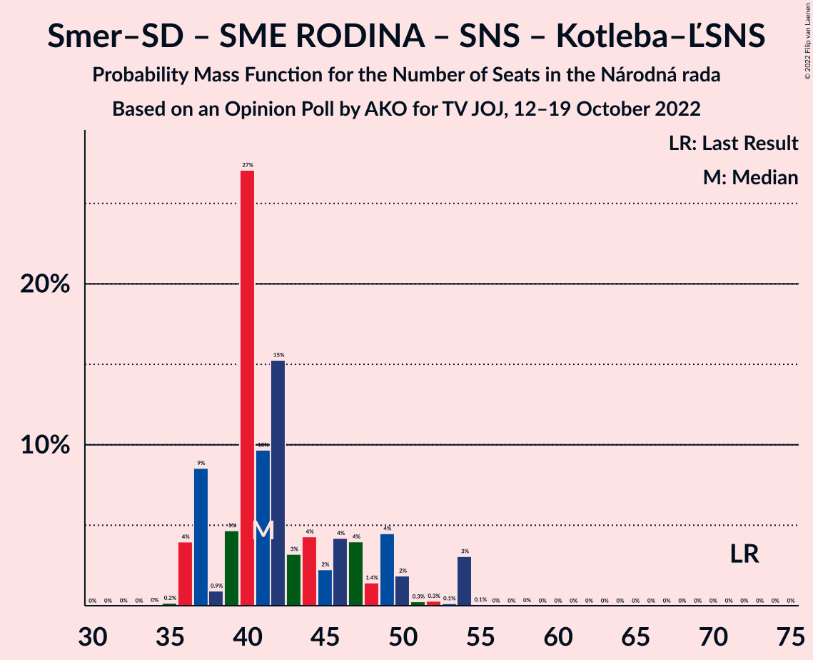

| Number of Seats | Probability | Accumulated | Special Marks |
|:---------------:|:-----------:|:-----------:|:-------------:|
| 34 | 0% | 100% |  |
| 35 | 0.2% | 99.9% |  |
| 36 | 4% | 99.8% |  |
| 37 | 9% | 96% |  |
| 38 | 0.9% | 87% |  |
| 39 | 5% | 86% |  |
| 40 | 27% | 82% |  |
| 41 | 10% | 55% | Median |
| 42 | 15% | 45% |  |
| 43 | 3% | 30% |  |
| 44 | 4% | 26% |  |
| 45 | 2% | 22% |  |
| 46 | 4% | 20% |  |
| 47 | 4% | 16% |  |
| 48 | 1.4% | 12% |  |
| 49 | 4% | 10% |  |
| 50 | 2% | 6% |  |
| 51 | 0.3% | 4% |  |
| 52 | 0.3% | 4% |  |
| 53 | 0.1% | 3% |  |
| 54 | 3% | 3% |  |
| 55 | 0.1% | 0.1% |  |
| 56 | 0% | 0% |  |
| 57 | 0% | 0% |  |
| 58 | 0% | 0% |  |
| 59 | 0% | 0% |  |
| 60 | 0% | 0% |  |
| 61 | 0% | 0% |  |
| 62 | 0% | 0% |  |
| 63 | 0% | 0% |  |
| 64 | 0% | 0% |  |
| 65 | 0% | 0% |  |
| 66 | 0% | 0% |  |
| 67 | 0% | 0% |  |
| 68 | 0% | 0% |  |
| 69 | 0% | 0% |  |
| 70 | 0% | 0% |  |
| 71 | 0% | 0% |  |
| 72 | 0% | 0% | Last Result |

### SMER–sociálna demokracia – SME RODINA – Slovenská národná strana

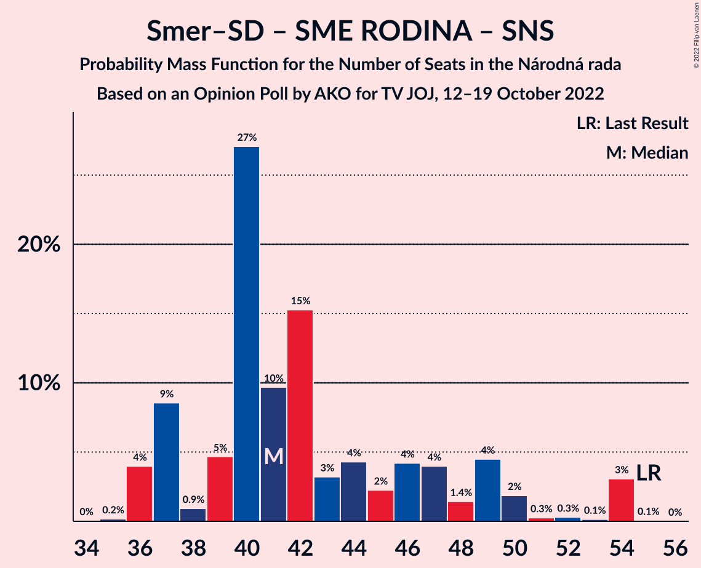

| Number of Seats | Probability | Accumulated | Special Marks |
|:---------------:|:-----------:|:-----------:|:-------------:|
| 34 | 0% | 100% |  |
| 35 | 0.2% | 99.9% |  |
| 36 | 4% | 99.8% |  |
| 37 | 9% | 96% |  |
| 38 | 0.9% | 87% |  |
| 39 | 5% | 86% |  |
| 40 | 27% | 82% |  |
| 41 | 10% | 55% | Median |
| 42 | 15% | 45% |  |
| 43 | 3% | 30% |  |
| 44 | 4% | 26% |  |
| 45 | 2% | 22% |  |
| 46 | 4% | 20% |  |
| 47 | 4% | 16% |  |
| 48 | 1.4% | 12% |  |
| 49 | 4% | 10% |  |
| 50 | 2% | 6% |  |
| 51 | 0.3% | 4% |  |
| 52 | 0.3% | 4% |  |
| 53 | 0.1% | 3% |  |
| 54 | 3% | 3% |  |
| 55 | 0.1% | 0.1% | Last Result |
| 56 | 0% | 0% |  |

### HLAS–sociálna demokracia – SME RODINA

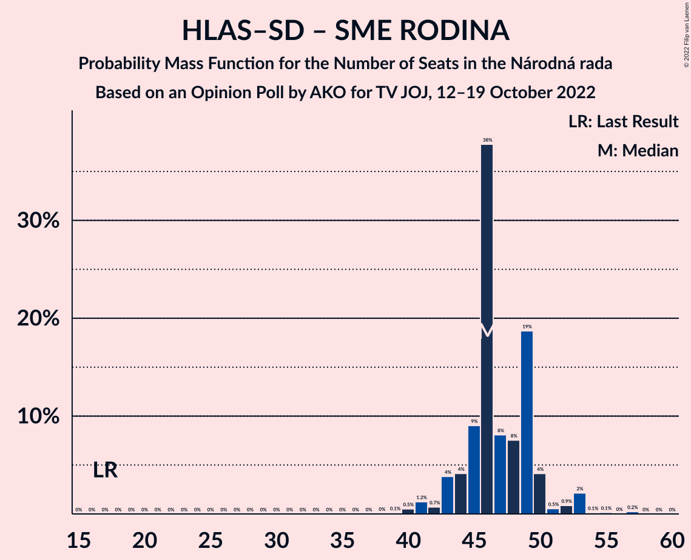

| Number of Seats | Probability | Accumulated | Special Marks |
|:---------------:|:-----------:|:-----------:|:-------------:|
| 17 | 0% | 100% | Last Result |
| 18 | 0% | 100% |  |
| 19 | 0% | 100% |  |
| 20 | 0% | 100% |  |
| 21 | 0% | 100% |  |
| 22 | 0% | 100% |  |
| 23 | 0% | 100% |  |
| 24 | 0% | 100% |  |
| 25 | 0% | 100% |  |
| 26 | 0% | 100% |  |
| 27 | 0% | 100% |  |
| 28 | 0% | 100% |  |
| 29 | 0% | 100% |  |
| 30 | 0% | 100% |  |
| 31 | 0% | 100% |  |
| 32 | 0% | 100% |  |
| 33 | 0% | 100% |  |
| 34 | 0% | 100% |  |
| 35 | 0% | 100% |  |
| 36 | 0% | 100% |  |
| 37 | 0% | 100% |  |
| 38 | 0% | 100% |  |
| 39 | 0.1% | 99.9% |  |
| 40 | 0.5% | 99.8% |  |
| 41 | 1.2% | 99.3% |  |
| 42 | 0.7% | 98% |  |
| 43 | 4% | 97% |  |
| 44 | 4% | 94% |  |
| 45 | 9% | 89% |  |
| 46 | 38% | 80% |  |
| 47 | 8% | 43% | Median |
| 48 | 8% | 34% |  |
| 49 | 19% | 27% |  |
| 50 | 4% | 8% |  |
| 51 | 0.5% | 4% |  |
| 52 | 0.9% | 4% |  |
| 53 | 2% | 3% |  |
| 54 | 0.1% | 0.6% |  |
| 55 | 0.1% | 0.4% |  |
| 56 | 0% | 0.3% |  |
| 57 | 0.2% | 0.2% |  |
| 58 | 0% | 0% |  |

### SMER–sociálna demokracia – SME RODINA

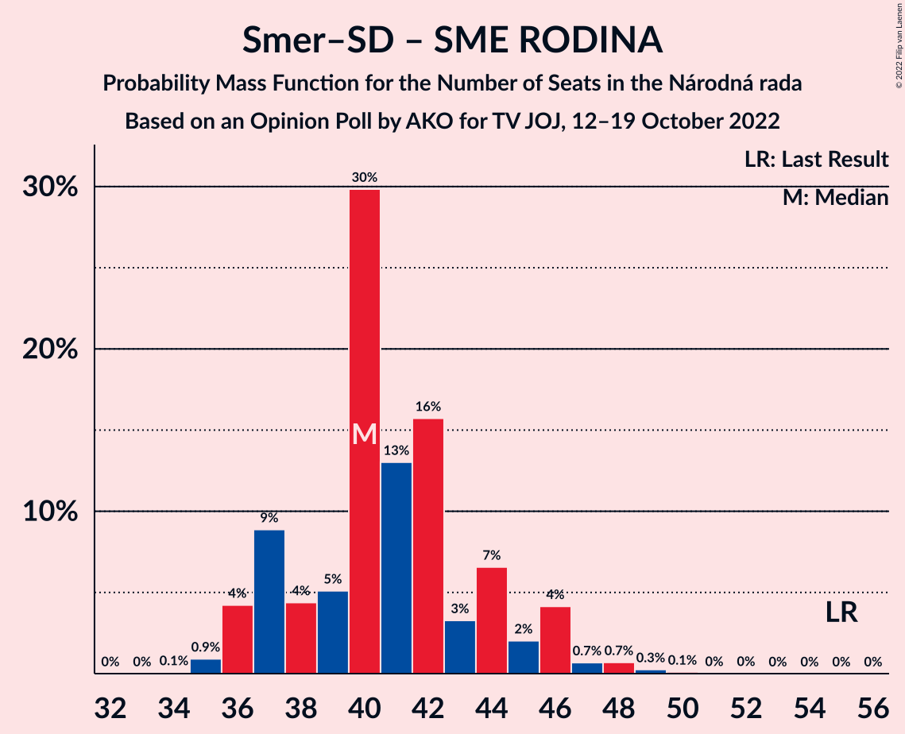

| Number of Seats | Probability | Accumulated | Special Marks |
|:---------------:|:-----------:|:-----------:|:-------------:|
| 34 | 0.1% | 100% |  |
| 35 | 0.9% | 99.9% |  |
| 36 | 4% | 99.0% |  |
| 37 | 9% | 95% |  |
| 38 | 4% | 86% |  |
| 39 | 5% | 82% |  |
| 40 | 30% | 76% |  |
| 41 | 13% | 47% | Median |
| 42 | 16% | 34% |  |
| 43 | 3% | 18% |  |
| 44 | 7% | 15% |  |
| 45 | 2% | 8% |  |
| 46 | 4% | 6% |  |
| 47 | 0.7% | 2% |  |
| 48 | 0.7% | 1.1% |  |
| 49 | 0.3% | 0.4% |  |
| 50 | 0.1% | 0.2% |  |
| 51 | 0% | 0% |  |
| 52 | 0% | 0% |  |
| 53 | 0% | 0% |  |
| 54 | 0% | 0% |  |
| 55 | 0% | 0% | Last Result |

### HLAS–sociálna demokracia – Slovenská národná strana

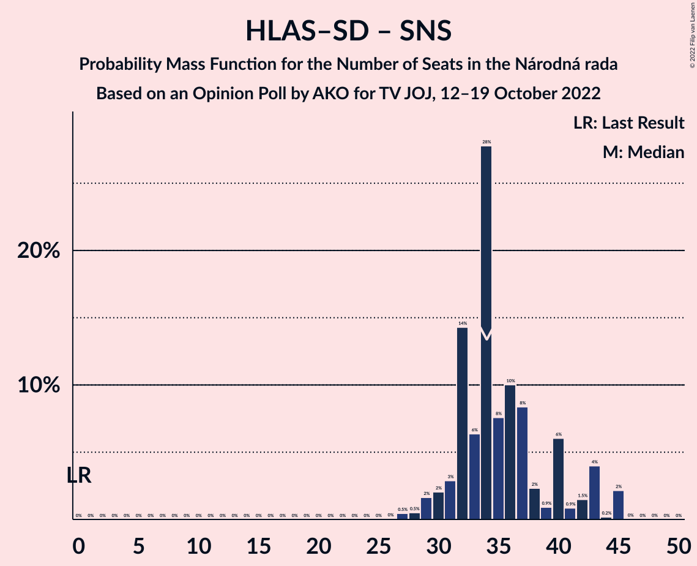

| Number of Seats | Probability | Accumulated | Special Marks |
|:---------------:|:-----------:|:-----------:|:-------------:|
| 0 | 0% | 100% | Last Result |
| 1 | 0% | 100% |  |
| 2 | 0% | 100% |  |
| 3 | 0% | 100% |  |
| 4 | 0% | 100% |  |
| 5 | 0% | 100% |  |
| 6 | 0% | 100% |  |
| 7 | 0% | 100% |  |
| 8 | 0% | 100% |  |
| 9 | 0% | 100% |  |
| 10 | 0% | 100% |  |
| 11 | 0% | 100% |  |
| 12 | 0% | 100% |  |
| 13 | 0% | 100% |  |
| 14 | 0% | 100% |  |
| 15 | 0% | 100% |  |
| 16 | 0% | 100% |  |
| 17 | 0% | 100% |  |
| 18 | 0% | 100% |  |
| 19 | 0% | 100% |  |
| 20 | 0% | 100% |  |
| 21 | 0% | 100% |  |
| 22 | 0% | 100% |  |
| 23 | 0% | 100% |  |
| 24 | 0% | 100% |  |
| 25 | 0% | 100% |  |
| 26 | 0% | 100% |  |
| 27 | 0.5% | 99.9% |  |
| 28 | 0.5% | 99.5% |  |
| 29 | 2% | 99.0% |  |
| 30 | 2% | 97% |  |
| 31 | 3% | 95% |  |
| 32 | 14% | 92% |  |
| 33 | 6% | 78% |  |
| 34 | 28% | 72% | Median |
| 35 | 8% | 44% |  |
| 36 | 10% | 36% |  |
| 37 | 8% | 26% |  |
| 38 | 2% | 18% |  |
| 39 | 0.9% | 16% |  |
| 40 | 6% | 15% |  |
| 41 | 0.9% | 9% |  |
| 42 | 1.5% | 8% |  |
| 43 | 4% | 6% |  |
| 44 | 0.2% | 2% |  |
| 45 | 2% | 2% |  |
| 46 | 0% | 0% |  |

### SMER–sociálna demokracia – Slovenská národná strana

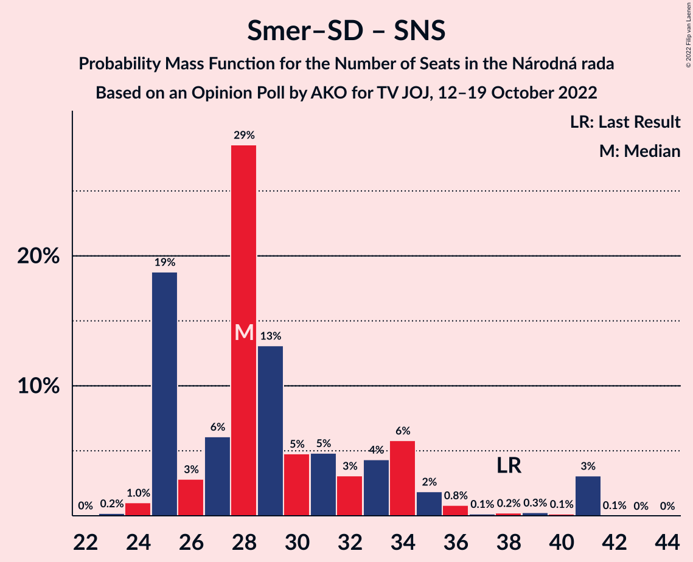

| Number of Seats | Probability | Accumulated | Special Marks |
|:---------------:|:-----------:|:-----------:|:-------------:|
| 23 | 0.2% | 100% |  |
| 24 | 1.0% | 99.8% |  |
| 25 | 19% | 98.7% |  |
| 26 | 3% | 80% |  |
| 27 | 6% | 77% |  |
| 28 | 29% | 71% | Median |
| 29 | 13% | 43% |  |
| 30 | 5% | 29% |  |
| 31 | 5% | 25% |  |
| 32 | 3% | 20% |  |
| 33 | 4% | 17% |  |
| 34 | 6% | 12% |  |
| 35 | 2% | 7% |  |
| 36 | 0.8% | 5% |  |
| 37 | 0.1% | 4% |  |
| 38 | 0.2% | 4% | Last Result |
| 39 | 0.3% | 4% |  |
| 40 | 0.1% | 3% |  |
| 41 | 3% | 3% |  |
| 42 | 0.1% | 0.1% |  |
| 43 | 0% | 0% |  |

### SMER–sociálna demokracia

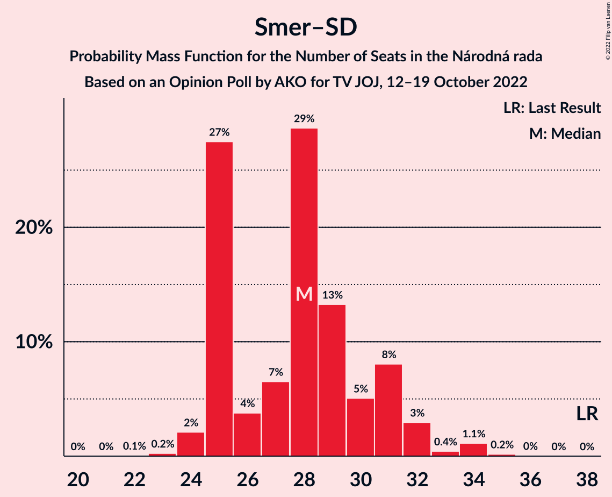

| Number of Seats | Probability | Accumulated | Special Marks |
|:---------------:|:-----------:|:-----------:|:-------------:|
| 22 | 0.1% | 100% |  |
| 23 | 0.2% | 99.9% |  |
| 24 | 2% | 99.7% |  |
| 25 | 27% | 98% |  |
| 26 | 4% | 70% |  |
| 27 | 7% | 66% |  |
| 28 | 29% | 60% | Median |
| 29 | 13% | 31% |  |
| 30 | 5% | 18% |  |
| 31 | 8% | 13% |  |
| 32 | 3% | 5% |  |
| 33 | 0.4% | 2% |  |
| 34 | 1.1% | 1.4% |  |
| 35 | 0.2% | 0.2% |  |
| 36 | 0% | 0.1% |  |
| 37 | 0% | 0% |  |
| 38 | 0% | 0% | Last Result |

## Technical Information

### Opinion Poll

+ **Polling firm:** AKO
+ **Commissioner(s):** TV JOJ
+ **Fieldwork period:** 12–19 October 2022

### Calculations

+ **Sample size:** 1000
+ **Simulations done:** 1,048,576
+ **Error estimate:** 1.84%

