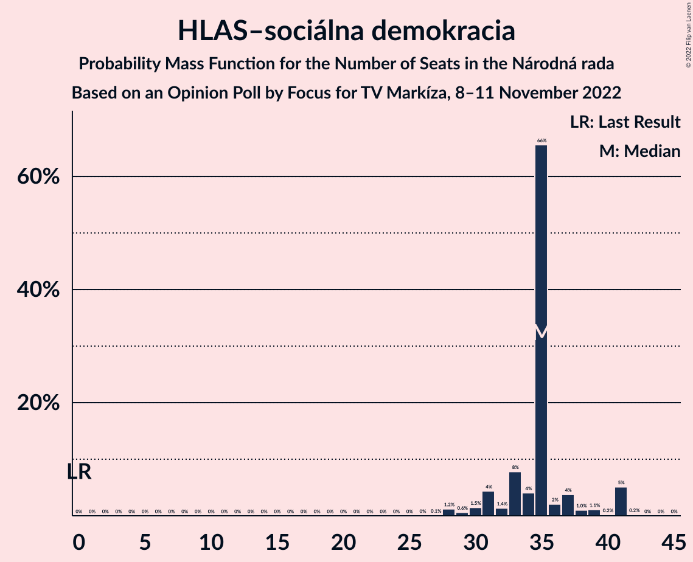
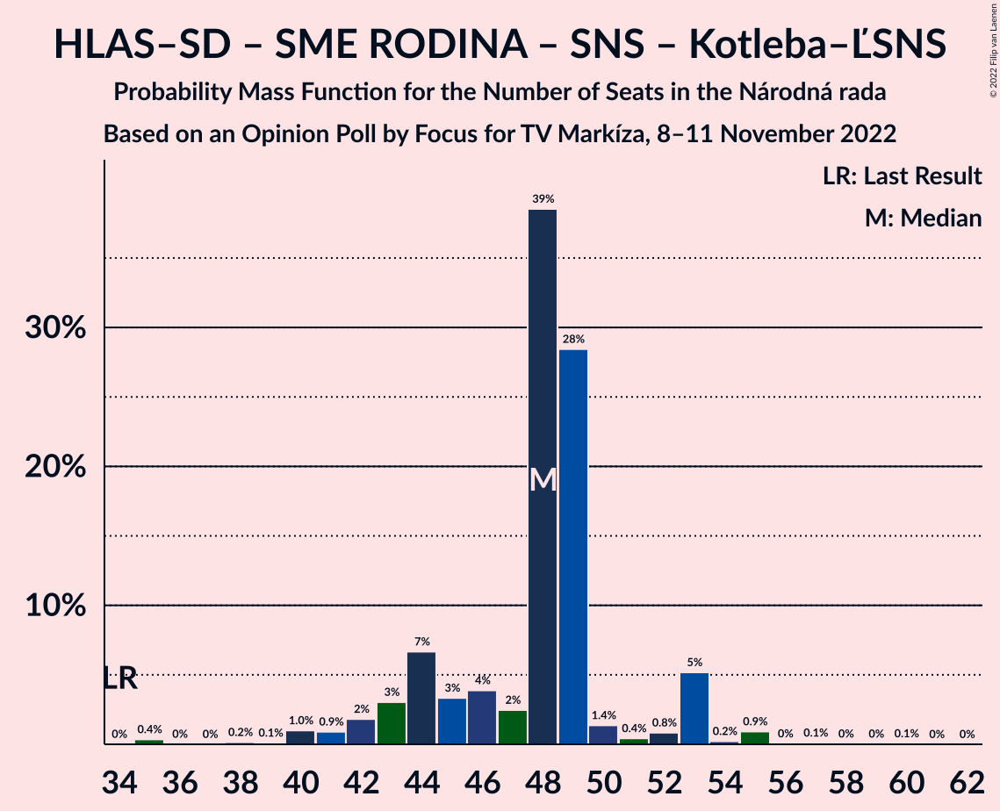

# Opinion Poll by Focus for TV Markíza, 8–11 November 2022

<a href="#voting-intentions">Voting Intentions</a> | <a href="#seats">Seats</a> | <a href="#coalitions">Coalitions</a> | <a href="#technical-information">Technical Information</a>

## Voting Intentions

### Confidence Intervals

| Party | Last Result | Poll Result | 80% Confidence Interval | 90% Confidence Interval | 95% Confidence Interval | 99% Confidence Interval |
|:-----:|:-----------:|:-----------:|:-----------------------:|:-----------------------:|:-----------------------:|:-----------------------:|
| HLAS–sociálna demokracia | 0.0% | 19.4% | 17.8–21.0% |17.4–21.5% |17.1–21.9% |16.4–22.7% |
| SMER–sociálna demokracia | 18.3% | 15.6% | 14.3–17.2% |13.9–17.6% |13.5–18.0% |12.9–18.8% |
| Progresívne Slovensko | 7.0% | 10.2% | 9.1–11.6% |8.8–11.9% |8.5–12.3% |8.0–12.9% |
| Sloboda a Solidarita | 6.2% | 8.1% | 7.1–9.3% |6.8–9.6% |6.5–9.9% |6.1–10.5% |
| REPUBLIKA | 0.0% | 7.2% | 6.2–8.3% |6.0–8.7% |5.7–8.9% |5.3–9.5% |
| OBYČAJNÍ ĽUDIA a nezávislé osobnosti | 25.0% | 7.0% | 6.1–8.1% |5.8–8.4% |5.6–8.7% |5.2–9.3% |
| Kresťanskodemokratické hnutie | 4.6% | 6.9% | 6.0–8.0% |5.7–8.3% |5.5–8.6% |5.1–9.2% |
| SME RODINA | 8.2% | 6.6% | 5.7–7.7% |5.4–8.0% |5.2–8.3% |4.8–8.9% |
| Strana maďarskej koalície–Magyar Koalíció Pártja | 3.9% | 5.6% | 4.8–6.6% |4.5–6.9% |4.3–7.2% |4.0–7.7% |
| Slovenská národná strana | 3.2% | 3.8% | 3.2–4.7% |3.0–5.0% |2.8–5.2% |2.5–5.7% |
| Kotleba–Ľudová strana Naše Slovensko | 8.0% | 3.5% | 2.9–4.4% |2.7–4.6% |2.6–4.9% |2.3–5.3% |
| Za ľudí | 5.8% | 2.0% | 1.5–2.7% |1.4–2.9% |1.3–3.0% |1.1–3.4% |
| Dobrá voľba | 3.1% | 1.5% | 1.1–2.1% |1.0–2.3% |0.9–2.4% |0.7–2.8% |
| SPOLU–Občianska Demokracia | 7.0% | 0.7% | 0.5–1.2% |0.4–1.3% |0.3–1.4% |0.2–1.7% |

*Note:* The poll result column reflects the actual value used in the calculations. Published results may vary slightly, and in addition be rounded to fewer digits.

## Seats

### Confidence Intervals

| Party | Last Result | Median | 80% Confidence Interval | 90% Confidence Interval | 95% Confidence Interval | 99% Confidence Interval |
|:-----:|:-----------:|:------:|:-----------------------:|:-----------------------:|:-----------------------:|:-----------------------:|
| <a href="#hlas–sociálna-demokracia">HLAS–sociálna demokracia</a> | 0 | 35 | 33–37 |31–41 |30–41 |28–41 |
| <a href="#smer–sociálna-demokracia">SMER–sociálna demokracia</a> | 38 | 28 | 24–29 |24–31 |24–32 |22–33 |
| <a href="#progresívne-slovensko">Progresívne Slovensko</a> | 0 | 18 | 17–20 |16–21 |15–22 |14–22 |
| <a href="#sloboda-a-solidarita">Sloboda a Solidarita</a> | 13 | 14 | 13–16 |13–17 |12–17 |11–18 |
| <a href="#republika">REPUBLIKA</a> | 0 | 13 | 10–14 |10–15 |10–16 |9–16 |
| <a href="#obyčajní-ľudia-a-nezávislé-osobnosti">OBYČAJNÍ ĽUDIA a nezávislé osobnosti</a> | 53 | 13 | 11–13 |10–14 |9–16 |9–17 |
| <a href="#kresťanskodemokratické-hnutie">Kresťanskodemokratické hnutie</a> | 0 | 12 | 11–18 |10–18 |9–18 |0–18 |
| <a href="#sme-rodina">SME RODINA</a> | 17 | 13 | 11–14 |10–14 |9–14 |0–16 |
| <a href="#strana-maďarskej-koalície–magyar-koalíció-pártja">Strana maďarskej koalície–Magyar Koalíció Pártja</a> | 0 | 9 | 0–11 |0–11 |0–12 |0–13 |
| <a href="#slovenská-národná-strana">Slovenská národná strana</a> | 0 | 0 | 0 |0 |0 |0–9 |
| <a href="#kotleba–ľudová-strana-naše-slovensko">Kotleba–Ľudová strana Naše Slovensko</a> | 17 | 0 | 0 |0 |0 |0–9 |
| <a href="#za-ľudí">Za ľudí</a> | 12 | 0 | 0 |0 |0 |0 |
| <a href="#dobrá-voľba">Dobrá voľba</a> | 0 | 0 | 0 |0 |0 |0 |
| <a href="#spolu–občianska-demokracia">SPOLU–Občianska Demokracia</a> | 0 | 0 | 0 |0 |0 |0 |

### HLAS–sociálna demokracia

*For a full overview of the results for this party, see the [HLAS–sociálna demokracia](party-hlas–sociálnademokracia.html) page.*

| Number of Seats | Probability | Accumulated | Special Marks |
|:---------------:|:-----------:|:-----------:|:-------------:|
| 0 | 0% | 100% | Last Result |
| 1 | 0% | 100% |  |
| 2 | 0% | 100% |  |
| 3 | 0% | 100% |  |
| 4 | 0% | 100% |  |
| 5 | 0% | 100% |  |
| 6 | 0% | 100% |  |
| 7 | 0% | 100% |  |
| 8 | 0% | 100% |  |
| 9 | 0% | 100% |  |
| 10 | 0% | 100% |  |
| 11 | 0% | 100% |  |
| 12 | 0% | 100% |  |
| 13 | 0% | 100% |  |
| 14 | 0% | 100% |  |
| 15 | 0% | 100% |  |
| 16 | 0% | 100% |  |
| 17 | 0% | 100% |  |
| 18 | 0% | 100% |  |
| 19 | 0% | 100% |  |
| 20 | 0% | 100% |  |
| 21 | 0% | 100% |  |
| 22 | 0% | 100% |  |
| 23 | 0% | 100% |  |
| 24 | 0% | 100% |  |
| 25 | 0% | 100% |  |
| 26 | 0% | 100% |  |
| 27 | 0.1% | 100% |  |
| 28 | 1.2% | 99.9% |  |
| 29 | 0.6% | 98.7% |  |
| 30 | 1.5% | 98% |  |
| 31 | 4% | 97% |  |
| 32 | 1.4% | 92% |  |
| 33 | 8% | 91% |  |
| 34 | 4% | 83% |  |
| 35 | 66% | 79% | Median |
| 36 | 2% | 13% |  |
| 37 | 4% | 11% |  |
| 38 | 1.0% | 8% |  |
| 39 | 1.1% | 7% |  |
| 40 | 0.2% | 5% |  |
| 41 | 5% | 5% |  |
| 42 | 0.2% | 0.2% |  |
| 43 | 0% | 0% |  |

### SMER–sociálna demokracia

*For a full overview of the results for this party, see the [SMER–sociálna demokracia](party-smer–sociálnademokracia.html) page.*

| Number of Seats | Probability | Accumulated | Special Marks |
|:---------------:|:-----------:|:-----------:|:-------------:|
| 20 | 0% | 100% |  |
| 21 | 0.1% | 99.9% |  |
| 22 | 0.7% | 99.8% |  |
| 23 | 0.6% | 99.1% |  |
| 24 | 36% | 98% |  |
| 25 | 2% | 63% |  |
| 26 | 5% | 61% |  |
| 27 | 4% | 57% |  |
| 28 | 35% | 52% | Median |
| 29 | 7% | 17% |  |
| 30 | 3% | 9% |  |
| 31 | 3% | 6% |  |
| 32 | 2% | 3% |  |
| 33 | 0.3% | 0.7% |  |
| 34 | 0.2% | 0.4% |  |
| 35 | 0.1% | 0.2% |  |
| 36 | 0% | 0% |  |
| 37 | 0% | 0% |  |
| 38 | 0% | 0% | Last Result |

### Progresívne Slovensko

*For a full overview of the results for this party, see the [Progresívne Slovensko](party-progresívneslovensko.html) page.*

| Number of Seats | Probability | Accumulated | Special Marks |
|:---------------:|:-----------:|:-----------:|:-------------:|
| 0 | 0% | 100% | Last Result |
| 1 | 0% | 100% |  |
| 2 | 0% | 100% |  |
| 3 | 0% | 100% |  |
| 4 | 0% | 100% |  |
| 5 | 0% | 100% |  |
| 6 | 0% | 100% |  |
| 7 | 0% | 100% |  |
| 8 | 0% | 100% |  |
| 9 | 0% | 100% |  |
| 10 | 0% | 100% |  |
| 11 | 0% | 100% |  |
| 12 | 0% | 100% |  |
| 13 | 0.1% | 100% |  |
| 14 | 0.6% | 99.9% |  |
| 15 | 3% | 99.2% |  |
| 16 | 6% | 96% |  |
| 17 | 36% | 91% |  |
| 18 | 9% | 55% | Median |
| 19 | 4% | 46% |  |
| 20 | 36% | 42% |  |
| 21 | 3% | 6% |  |
| 22 | 3% | 3% |  |
| 23 | 0% | 0.1% |  |
| 24 | 0.1% | 0.1% |  |
| 25 | 0% | 0% |  |

### Sloboda a Solidarita

*For a full overview of the results for this party, see the [Sloboda a Solidarita](party-slobodaasolidarita.html) page.*

| Number of Seats | Probability | Accumulated | Special Marks |
|:---------------:|:-----------:|:-----------:|:-------------:|
| 10 | 0.1% | 100% |  |
| 11 | 1.0% | 99.9% |  |
| 12 | 4% | 98.9% |  |
| 13 | 7% | 95% | Last Result |
| 14 | 67% | 88% | Median |
| 15 | 11% | 21% |  |
| 16 | 4% | 10% |  |
| 17 | 5% | 6% |  |
| 18 | 1.0% | 1.1% |  |
| 19 | 0.1% | 0.1% |  |
| 20 | 0% | 0% |  |

### REPUBLIKA

*For a full overview of the results for this party, see the [REPUBLIKA](party-republika.html) page.*

| Number of Seats | Probability | Accumulated | Special Marks |
|:---------------:|:-----------:|:-----------:|:-------------:|
| 0 | 0.1% | 100% | Last Result |
| 1 | 0% | 99.9% |  |
| 2 | 0% | 99.9% |  |
| 3 | 0% | 99.9% |  |
| 4 | 0% | 99.9% |  |
| 5 | 0% | 99.9% |  |
| 6 | 0% | 99.9% |  |
| 7 | 0% | 99.9% |  |
| 8 | 0% | 99.9% |  |
| 9 | 1.3% | 99.9% |  |
| 10 | 36% | 98.6% |  |
| 11 | 7% | 63% |  |
| 12 | 3% | 55% |  |
| 13 | 35% | 52% | Median |
| 14 | 11% | 17% |  |
| 15 | 2% | 6% |  |
| 16 | 4% | 4% |  |
| 17 | 0.3% | 0.3% |  |
| 18 | 0% | 0% |  |

### OBYČAJNÍ ĽUDIA a nezávislé osobnosti

*For a full overview of the results for this party, see the [OBYČAJNÍ ĽUDIA a nezávislé osobnosti](party-obyčajníľudiaanezávisléosobnosti.html) page.*

| Number of Seats | Probability | Accumulated | Special Marks |
|:---------------:|:-----------:|:-----------:|:-------------:|
| 0 | 0.3% | 100% |  |
| 1 | 0% | 99.7% |  |
| 2 | 0% | 99.7% |  |
| 3 | 0% | 99.7% |  |
| 4 | 0% | 99.7% |  |
| 5 | 0% | 99.7% |  |
| 6 | 0% | 99.7% |  |
| 7 | 0% | 99.7% |  |
| 8 | 0% | 99.7% |  |
| 9 | 4% | 99.7% |  |
| 10 | 2% | 96% |  |
| 11 | 31% | 94% |  |
| 12 | 12% | 63% |  |
| 13 | 44% | 51% | Median |
| 14 | 2% | 7% |  |
| 15 | 2% | 5% |  |
| 16 | 2% | 3% |  |
| 17 | 0.2% | 0.7% |  |
| 18 | 0.5% | 0.5% |  |
| 19 | 0% | 0% |  |
| 20 | 0% | 0% |  |
| 21 | 0% | 0% |  |
| 22 | 0% | 0% |  |
| 23 | 0% | 0% |  |
| 24 | 0% | 0% |  |
| 25 | 0% | 0% |  |
| 26 | 0% | 0% |  |
| 27 | 0% | 0% |  |
| 28 | 0% | 0% |  |
| 29 | 0% | 0% |  |
| 30 | 0% | 0% |  |
| 31 | 0% | 0% |  |
| 32 | 0% | 0% |  |
| 33 | 0% | 0% |  |
| 34 | 0% | 0% |  |
| 35 | 0% | 0% |  |
| 36 | 0% | 0% |  |
| 37 | 0% | 0% |  |
| 38 | 0% | 0% |  |
| 39 | 0% | 0% |  |
| 40 | 0% | 0% |  |
| 41 | 0% | 0% |  |
| 42 | 0% | 0% |  |
| 43 | 0% | 0% |  |
| 44 | 0% | 0% |  |
| 45 | 0% | 0% |  |
| 46 | 0% | 0% |  |
| 47 | 0% | 0% |  |
| 48 | 0% | 0% |  |
| 49 | 0% | 0% |  |
| 50 | 0% | 0% |  |
| 51 | 0% | 0% |  |
| 52 | 0% | 0% |  |
| 53 | 0% | 0% | Last Result |

### Kresťanskodemokratické hnutie

*For a full overview of the results for this party, see the [Kresťanskodemokratické hnutie](party-kresťanskodemokratickéhnutie.html) page.*

| Number of Seats | Probability | Accumulated | Special Marks |
|:---------------:|:-----------:|:-----------:|:-------------:|
| 0 | 1.0% | 100% | Last Result |
| 1 | 0% | 99.0% |  |
| 2 | 0% | 99.0% |  |
| 3 | 0% | 99.0% |  |
| 4 | 0% | 99.0% |  |
| 5 | 0% | 99.0% |  |
| 6 | 0% | 99.0% |  |
| 7 | 0% | 99.0% |  |
| 8 | 0% | 99.0% |  |
| 9 | 2% | 99.0% |  |
| 10 | 6% | 97% |  |
| 11 | 40% | 91% |  |
| 12 | 12% | 51% | Median |
| 13 | 7% | 39% |  |
| 14 | 3% | 32% |  |
| 15 | 1.4% | 30% |  |
| 16 | 0.7% | 28% |  |
| 17 | 0.1% | 28% |  |
| 18 | 28% | 28% |  |
| 19 | 0% | 0% |  |

### SME RODINA

*For a full overview of the results for this party, see the [SME RODINA](party-smerodina.html) page.*

| Number of Seats | Probability | Accumulated | Special Marks |
|:---------------:|:-----------:|:-----------:|:-------------:|
| 0 | 2% | 100% |  |
| 1 | 0% | 98% |  |
| 2 | 0% | 98% |  |
| 3 | 0% | 98% |  |
| 4 | 0% | 98% |  |
| 5 | 0% | 98% |  |
| 6 | 0% | 98% |  |
| 7 | 0% | 98% |  |
| 8 | 0% | 98% |  |
| 9 | 3% | 98% |  |
| 10 | 4% | 96% |  |
| 11 | 8% | 92% |  |
| 12 | 12% | 84% |  |
| 13 | 42% | 72% | Median |
| 14 | 28% | 30% |  |
| 15 | 0.9% | 2% |  |
| 16 | 1.1% | 1.1% |  |
| 17 | 0% | 0% | Last Result |

### Strana maďarskej koalície–Magyar Koalíció Pártja

*For a full overview of the results for this party, see the [Strana maďarskej koalície–Magyar Koalíció Pártja](party-stranamaďarskejkoalície–magyarkoalíciópártja.html) page.*

| Number of Seats | Probability | Accumulated | Special Marks |
|:---------------:|:-----------:|:-----------:|:-------------:|
| 0 | 44% | 100% | Last Result |
| 1 | 0% | 56% |  |
| 2 | 0% | 56% |  |
| 3 | 0% | 56% |  |
| 4 | 0% | 56% |  |
| 5 | 0% | 56% |  |
| 6 | 0% | 56% |  |
| 7 | 0% | 56% |  |
| 8 | 0.7% | 56% |  |
| 9 | 9% | 56% | Median |
| 10 | 37% | 47% |  |
| 11 | 7% | 11% |  |
| 12 | 2% | 4% |  |
| 13 | 1.2% | 1.4% |  |
| 14 | 0.1% | 0.2% |  |
| 15 | 0% | 0% |  |

### Slovenská národná strana

*For a full overview of the results for this party, see the [Slovenská národná strana](party-slovenskánárodnástrana.html) page.*

| Number of Seats | Probability | Accumulated | Special Marks |
|:---------------:|:-----------:|:-----------:|:-------------:|
| 0 | 98% | 100% | Last Result, Median |
| 1 | 0% | 2% |  |
| 2 | 0% | 2% |  |
| 3 | 0% | 2% |  |
| 4 | 0% | 2% |  |
| 5 | 0% | 2% |  |
| 6 | 0% | 2% |  |
| 7 | 0% | 2% |  |
| 8 | 0.1% | 2% |  |
| 9 | 2% | 2% |  |
| 10 | 0.2% | 0.2% |  |
| 11 | 0% | 0% |  |

### Kotleba–Ľudová strana Naše Slovensko

*For a full overview of the results for this party, see the [Kotleba–Ľudová strana Naše Slovensko](party-kotleba–ľudovástrananašeslovensko.html) page.*

| Number of Seats | Probability | Accumulated | Special Marks |
|:---------------:|:-----------:|:-----------:|:-------------:|
| 0 | 99.2% | 100% | Median |
| 1 | 0% | 0.8% |  |
| 2 | 0% | 0.8% |  |
| 3 | 0% | 0.8% |  |
| 4 | 0% | 0.8% |  |
| 5 | 0% | 0.8% |  |
| 6 | 0% | 0.8% |  |
| 7 | 0% | 0.8% |  |
| 8 | 0% | 0.8% |  |
| 9 | 0.6% | 0.8% |  |
| 10 | 0.2% | 0.2% |  |
| 11 | 0% | 0% |  |
| 12 | 0% | 0% |  |
| 13 | 0% | 0% |  |
| 14 | 0% | 0% |  |
| 15 | 0% | 0% |  |
| 16 | 0% | 0% |  |
| 17 | 0% | 0% | Last Result |

### Za ľudí

*For a full overview of the results for this party, see the [Za ľudí](party-zaľudí.html) page.*

| Number of Seats | Probability | Accumulated | Special Marks |
|:---------------:|:-----------:|:-----------:|:-------------:|
| 0 | 100% | 100% | Median |
| 1 | 0% | 0% |  |
| 2 | 0% | 0% |  |
| 3 | 0% | 0% |  |
| 4 | 0% | 0% |  |
| 5 | 0% | 0% |  |
| 6 | 0% | 0% |  |
| 7 | 0% | 0% |  |
| 8 | 0% | 0% |  |
| 9 | 0% | 0% |  |
| 10 | 0% | 0% |  |
| 11 | 0% | 0% |  |
| 12 | 0% | 0% | Last Result |

### Dobrá voľba

*For a full overview of the results for this party, see the [Dobrá voľba](party-dobrávoľba.html) page.*

| Number of Seats | Probability | Accumulated | Special Marks |
|:---------------:|:-----------:|:-----------:|:-------------:|
| 0 | 100% | 100% | Last Result, Median |

### SPOLU–Občianska Demokracia

*For a full overview of the results for this party, see the [SPOLU–Občianska Demokracia](party-spolu–občianskademokracia.html) page.*

| Number of Seats | Probability | Accumulated | Special Marks |
|:---------------:|:-----------:|:-----------:|:-------------:|
| 0 | 100% | 100% | Last Result, Median |

## Coalitions

### Confidence Intervals

| Coalition | Last Result | Median | Majority? | 80% Confidence Interval | 90% Confidence Interval | 95% Confidence Interval | 99% Confidence Interval |
|:---------:|:-----------:|:------:|:---------:|:-----------------------:|:-----------------------:|:-----------------------:|:-----------------------:|
| HLAS–sociálna demokracia – SMER–sociálna demokracia – SME RODINA – Slovenská národná strana – Kotleba–Ľudová strana Naše Slovensko | 72 | 73 | 44% | 71–77 | 70–81 | 69–81 | 67–84 |
| HLAS–sociálna demokracia – SMER–sociálna demokracia – SME RODINA – Slovenská národná strana | 55 | 73 | 43% | 71–77 | 70–81 | 69–81 | 65–84 |
| HLAS–sociálna demokracia – SMER–sociálna demokracia – SME RODINA | 55 | 73 | 43% | 71–77 | 69–81 | 66–81 | 60–84 |
| HLAS–sociálna demokracia – SMER–sociálna demokracia – Slovenská národná strana | 38 | 62 | 0% | 59–66 | 58–69 | 58–69 | 54–69 |
| HLAS–sociálna demokracia – SME RODINA – Slovenská národná strana – Kotleba–Ľudová strana Naše Slovensko | 34 | 48 | 0% | 44–49 | 43–53 | 41–53 | 38–55 |
| HLAS–sociálna demokracia – SME RODINA – Slovenská národná strana | 17 | 48 | 0% | 44–49 | 43–53 | 41–53 | 38–55 |
| HLAS–sociálna demokracia – SME RODINA | 17 | 48 | 0% | 44–49 | 42–53 | 40–53 | 34–55 |
| SMER–sociálna demokracia – SME RODINA – Slovenská národná strana – Kotleba–Ľudová strana Naše Slovensko | 72 | 40 | 0% | 37–42 | 37–44 | 35–45 | 33–48 |
| SMER–sociálna demokracia – SME RODINA – Slovenská národná strana | 55 | 40 | 0% | 37–42 | 36–43 | 35–45 | 33–46 |
| SMER–sociálna demokracia – SME RODINA | 55 | 40 | 0% | 37–42 | 36–43 | 34–45 | 26–45 |
| HLAS–sociálna demokracia – Slovenská národná strana | 0 | 35 | 0% | 33–37 | 31–41 | 31–41 | 28–43 |
| SMER–sociálna demokracia – Slovenská národná strana | 38 | 28 | 0% | 24–30 | 24–32 | 24–33 | 22–35 |
| SMER–sociálna demokracia | 38 | 28 | 0% | 24–29 | 24–31 | 24–32 | 22–33 |

### HLAS–sociálna demokracia – SMER–sociálna demokracia – SME RODINA – Slovenská národná strana – Kotleba–Ľudová strana Naše Slovensko

| Number of Seats | Probability | Accumulated | Special Marks |
|:---------------:|:-----------:|:-----------:|:-------------:|
| 62 | 0% | 100% |  |
| 63 | 0% | 99.9% |  |
| 64 | 0.1% | 99.9% |  |
| 65 | 0.2% | 99.9% |  |
| 66 | 0% | 99.7% |  |
| 67 | 0.4% | 99.6% |  |
| 68 | 0.6% | 99.2% |  |
| 69 | 3% | 98.7% |  |
| 70 | 2% | 96% |  |
| 71 | 5% | 94% |  |
| 72 | 36% | 89% | Last Result |
| 73 | 3% | 53% |  |
| 74 | 3% | 49% |  |
| 75 | 3% | 46% |  |
| 76 | 2% | 44% | Median, Majority |
| 77 | 32% | 42% |  |
| 78 | 2% | 10% |  |
| 79 | 0.5% | 8% |  |
| 80 | 0.7% | 7% |  |
| 81 | 5% | 7% |  |
| 82 | 0.5% | 2% |  |
| 83 | 0.3% | 1.0% |  |
| 84 | 0.7% | 0.7% |  |
| 85 | 0% | 0.1% |  |
| 86 | 0% | 0% |  |

### HLAS–sociálna demokracia – SMER–sociálna demokracia – SME RODINA – Slovenská národná strana

| Number of Seats | Probability | Accumulated | Special Marks |
|:---------------:|:-----------:|:-----------:|:-------------:|
| 55 | 0% | 100% | Last Result |
| 56 | 0% | 100% |  |
| 57 | 0% | 100% |  |
| 58 | 0% | 100% |  |
| 59 | 0% | 100% |  |
| 60 | 0% | 100% |  |
| 61 | 0% | 100% |  |
| 62 | 0% | 100% |  |
| 63 | 0% | 99.9% |  |
| 64 | 0.1% | 99.9% |  |
| 65 | 0.5% | 99.8% |  |
| 66 | 0.1% | 99.3% |  |
| 67 | 0.5% | 99.3% |  |
| 68 | 0.6% | 98.8% |  |
| 69 | 3% | 98% |  |
| 70 | 2% | 96% |  |
| 71 | 5% | 93% |  |
| 72 | 36% | 88% |  |
| 73 | 3% | 52% |  |
| 74 | 3% | 49% |  |
| 75 | 3% | 46% |  |
| 76 | 2% | 43% | Median, Majority |
| 77 | 32% | 41% |  |
| 78 | 2% | 9% |  |
| 79 | 0.5% | 7% |  |
| 80 | 0.7% | 7% |  |
| 81 | 5% | 6% |  |
| 82 | 0.4% | 1.3% |  |
| 83 | 0.2% | 0.9% |  |
| 84 | 0.6% | 0.7% |  |
| 85 | 0% | 0.1% |  |
| 86 | 0% | 0% |  |

### HLAS–sociálna demokracia – SMER–sociálna demokracia – SME RODINA

| Number of Seats | Probability | Accumulated | Special Marks |
|:---------------:|:-----------:|:-----------:|:-------------:|
| 55 | 0% | 100% | Last Result |
| 56 | 0% | 100% |  |
| 57 | 0% | 100% |  |
| 58 | 0% | 100% |  |
| 59 | 0% | 100% |  |
| 60 | 0.9% | 100% |  |
| 61 | 0.2% | 99.1% |  |
| 62 | 0.1% | 98.9% |  |
| 63 | 0.1% | 98.8% |  |
| 64 | 0.1% | 98.7% |  |
| 65 | 0.9% | 98.6% |  |
| 66 | 0.2% | 98% |  |
| 67 | 0.5% | 97% |  |
| 68 | 0.6% | 97% |  |
| 69 | 2% | 96% |  |
| 70 | 2% | 94% |  |
| 71 | 5% | 92% |  |
| 72 | 36% | 87% |  |
| 73 | 3% | 51% |  |
| 74 | 2% | 48% |  |
| 75 | 3% | 46% |  |
| 76 | 2% | 43% | Median, Majority |
| 77 | 32% | 41% |  |
| 78 | 2% | 9% |  |
| 79 | 0.4% | 7% |  |
| 80 | 0.6% | 7% |  |
| 81 | 5% | 6% |  |
| 82 | 0.4% | 1.3% |  |
| 83 | 0.2% | 0.9% |  |
| 84 | 0.6% | 0.7% |  |
| 85 | 0% | 0% |  |

### HLAS–sociálna demokracia – SMER–sociálna demokracia – Slovenská národná strana

| Number of Seats | Probability | Accumulated | Special Marks |
|:---------------:|:-----------:|:-----------:|:-------------:|
| 38 | 0% | 100% | Last Result |
| 39 | 0% | 100% |  |
| 40 | 0% | 100% |  |
| 41 | 0% | 100% |  |
| 42 | 0% | 100% |  |
| 43 | 0% | 100% |  |
| 44 | 0% | 100% |  |
| 45 | 0% | 100% |  |
| 46 | 0% | 100% |  |
| 47 | 0% | 100% |  |
| 48 | 0% | 100% |  |
| 49 | 0% | 100% |  |
| 50 | 0% | 100% |  |
| 51 | 0% | 100% |  |
| 52 | 0% | 100% |  |
| 53 | 0.3% | 100% |  |
| 54 | 0.3% | 99.6% |  |
| 55 | 0.2% | 99.3% |  |
| 56 | 0.5% | 99.1% |  |
| 57 | 0.5% | 98.6% |  |
| 58 | 4% | 98% |  |
| 59 | 36% | 94% |  |
| 60 | 2% | 58% |  |
| 61 | 3% | 56% |  |
| 62 | 4% | 52% |  |
| 63 | 29% | 48% | Median |
| 64 | 4% | 20% |  |
| 65 | 4% | 16% |  |
| 66 | 4% | 12% |  |
| 67 | 0.7% | 8% |  |
| 68 | 1.1% | 7% |  |
| 69 | 6% | 6% |  |
| 70 | 0.1% | 0.4% |  |
| 71 | 0% | 0.3% |  |
| 72 | 0% | 0.3% |  |
| 73 | 0.1% | 0.2% |  |
| 74 | 0% | 0.2% |  |
| 75 | 0.1% | 0.2% |  |
| 76 | 0% | 0% | Majority |

### HLAS–sociálna demokracia – SME RODINA – Slovenská národná strana – Kotleba–Ľudová strana Naše Slovensko

| Number of Seats | Probability | Accumulated | Special Marks |
|:---------------:|:-----------:|:-----------:|:-------------:|
| 34 | 0% | 100% | Last Result |
| 35 | 0.4% | 100% |  |
| 36 | 0% | 99.6% |  |
| 37 | 0% | 99.6% |  |
| 38 | 0.2% | 99.6% |  |
| 39 | 0.1% | 99.4% |  |
| 40 | 1.0% | 99.3% |  |
| 41 | 0.9% | 98% |  |
| 42 | 2% | 97% |  |
| 43 | 3% | 96% |  |
| 44 | 7% | 93% |  |
| 45 | 3% | 86% |  |
| 46 | 4% | 83% |  |
| 47 | 2% | 79% |  |
| 48 | 39% | 76% | Median |
| 49 | 28% | 38% |  |
| 50 | 1.4% | 9% |  |
| 51 | 0.4% | 8% |  |
| 52 | 0.8% | 7% |  |
| 53 | 5% | 7% |  |
| 54 | 0.2% | 1.4% |  |
| 55 | 0.9% | 1.2% |  |
| 56 | 0% | 0.3% |  |
| 57 | 0.1% | 0.2% |  |
| 58 | 0% | 0.1% |  |
| 59 | 0% | 0.1% |  |
| 60 | 0.1% | 0.1% |  |
| 61 | 0% | 0% |  |

### HLAS–sociálna demokracia – SME RODINA – Slovenská národná strana

| Number of Seats | Probability | Accumulated | Special Marks |
|:---------------:|:-----------:|:-----------:|:-------------:|
| 17 | 0% | 100% | Last Result |
| 18 | 0% | 100% |  |
| 19 | 0% | 100% |  |
| 20 | 0% | 100% |  |
| 21 | 0% | 100% |  |
| 22 | 0% | 100% |  |
| 23 | 0% | 100% |  |
| 24 | 0% | 100% |  |
| 25 | 0% | 100% |  |
| 26 | 0% | 100% |  |
| 27 | 0% | 100% |  |
| 28 | 0% | 100% |  |
| 29 | 0% | 100% |  |
| 30 | 0% | 100% |  |
| 31 | 0% | 100% |  |
| 32 | 0% | 100% |  |
| 33 | 0% | 100% |  |
| 34 | 0% | 100% |  |
| 35 | 0.4% | 100% |  |
| 36 | 0% | 99.6% |  |
| 37 | 0.1% | 99.6% |  |
| 38 | 0.3% | 99.5% |  |
| 39 | 0.1% | 99.2% |  |
| 40 | 1.0% | 99.1% |  |
| 41 | 0.9% | 98% |  |
| 42 | 2% | 97% |  |
| 43 | 3% | 95% |  |
| 44 | 7% | 92% |  |
| 45 | 3% | 85% |  |
| 46 | 4% | 82% |  |
| 47 | 2% | 78% |  |
| 48 | 39% | 76% | Median |
| 49 | 28% | 37% |  |
| 50 | 1.4% | 9% |  |
| 51 | 0.4% | 7% |  |
| 52 | 0.5% | 7% |  |
| 53 | 5% | 6% |  |
| 54 | 0.2% | 1.1% |  |
| 55 | 0.8% | 0.9% |  |
| 56 | 0% | 0.1% |  |
| 57 | 0% | 0% |  |

### HLAS–sociálna demokracia – SME RODINA

| Number of Seats | Probability | Accumulated | Special Marks |
|:---------------:|:-----------:|:-----------:|:-------------:|
| 17 | 0% | 100% | Last Result |
| 18 | 0% | 100% |  |
| 19 | 0% | 100% |  |
| 20 | 0% | 100% |  |
| 21 | 0% | 100% |  |
| 22 | 0% | 100% |  |
| 23 | 0% | 100% |  |
| 24 | 0% | 100% |  |
| 25 | 0% | 100% |  |
| 26 | 0% | 100% |  |
| 27 | 0% | 100% |  |
| 28 | 0% | 100% |  |
| 29 | 0% | 100% |  |
| 30 | 0% | 100% |  |
| 31 | 0% | 100% |  |
| 32 | 0% | 100% |  |
| 33 | 0% | 100% |  |
| 34 | 0.9% | 100% |  |
| 35 | 0.4% | 99.1% |  |
| 36 | 0% | 98.8% |  |
| 37 | 0.3% | 98.7% |  |
| 38 | 0.3% | 98% |  |
| 39 | 0.2% | 98% |  |
| 40 | 1.2% | 98% |  |
| 41 | 1.3% | 97% |  |
| 42 | 2% | 95% |  |
| 43 | 3% | 93% |  |
| 44 | 7% | 91% |  |
| 45 | 3% | 84% |  |
| 46 | 4% | 81% |  |
| 47 | 2% | 77% |  |
| 48 | 39% | 75% | Median |
| 49 | 28% | 36% |  |
| 50 | 1.0% | 8% |  |
| 51 | 0.3% | 7% |  |
| 52 | 0.5% | 7% |  |
| 53 | 5% | 6% |  |
| 54 | 0.2% | 1.0% |  |
| 55 | 0.8% | 0.8% |  |
| 56 | 0% | 0% |  |

### SMER–sociálna demokracia – SME RODINA – Slovenská národná strana – Kotleba–Ľudová strana Naše Slovensko

| Number of Seats | Probability | Accumulated | Special Marks |
|:---------------:|:-----------:|:-----------:|:-------------:|
| 26 | 0% | 100% |  |
| 27 | 0% | 99.9% |  |
| 28 | 0% | 99.9% |  |
| 29 | 0.1% | 99.9% |  |
| 30 | 0% | 99.8% |  |
| 31 | 0% | 99.8% |  |
| 32 | 0% | 99.8% |  |
| 33 | 0.5% | 99.7% |  |
| 34 | 0.9% | 99.2% |  |
| 35 | 2% | 98% |  |
| 36 | 1.5% | 97% |  |
| 37 | 37% | 95% |  |
| 38 | 2% | 59% |  |
| 39 | 2% | 57% |  |
| 40 | 15% | 55% |  |
| 41 | 2% | 39% | Median |
| 42 | 29% | 37% |  |
| 43 | 2% | 8% |  |
| 44 | 1.3% | 5% |  |
| 45 | 3% | 4% |  |
| 46 | 0.6% | 1.2% |  |
| 47 | 0% | 0.7% |  |
| 48 | 0.3% | 0.6% |  |
| 49 | 0.2% | 0.3% |  |
| 50 | 0.1% | 0.1% |  |
| 51 | 0% | 0% |  |
| 52 | 0% | 0% |  |
| 53 | 0% | 0% |  |
| 54 | 0% | 0% |  |
| 55 | 0% | 0% |  |
| 56 | 0% | 0% |  |
| 57 | 0% | 0% |  |
| 58 | 0% | 0% |  |
| 59 | 0% | 0% |  |
| 60 | 0% | 0% |  |
| 61 | 0% | 0% |  |
| 62 | 0% | 0% |  |
| 63 | 0% | 0% |  |
| 64 | 0% | 0% |  |
| 65 | 0% | 0% |  |
| 66 | 0% | 0% |  |
| 67 | 0% | 0% |  |
| 68 | 0% | 0% |  |
| 69 | 0% | 0% |  |
| 70 | 0% | 0% |  |
| 71 | 0% | 0% |  |
| 72 | 0% | 0% | Last Result |

### SMER–sociálna demokracia – SME RODINA – Slovenská národná strana

| Number of Seats | Probability | Accumulated | Special Marks |
|:---------------:|:-----------:|:-----------:|:-------------:|
| 26 | 0% | 100% |  |
| 27 | 0% | 99.9% |  |
| 28 | 0% | 99.9% |  |
| 29 | 0.1% | 99.9% |  |
| 30 | 0% | 99.8% |  |
| 31 | 0% | 99.8% |  |
| 32 | 0% | 99.8% |  |
| 33 | 0.5% | 99.7% |  |
| 34 | 1.2% | 99.2% |  |
| 35 | 2% | 98% |  |
| 36 | 2% | 96% |  |
| 37 | 37% | 95% |  |
| 38 | 2% | 58% |  |
| 39 | 2% | 56% |  |
| 40 | 16% | 54% |  |
| 41 | 2% | 39% | Median |
| 42 | 29% | 36% |  |
| 43 | 2% | 7% |  |
| 44 | 1.3% | 5% |  |
| 45 | 3% | 4% |  |
| 46 | 0.5% | 0.8% |  |
| 47 | 0% | 0.3% |  |
| 48 | 0.1% | 0.3% |  |
| 49 | 0.1% | 0.2% |  |
| 50 | 0.1% | 0.1% |  |
| 51 | 0% | 0% |  |
| 52 | 0% | 0% |  |
| 53 | 0% | 0% |  |
| 54 | 0% | 0% |  |
| 55 | 0% | 0% | Last Result |

### SMER–sociálna demokracia – SME RODINA

| Number of Seats | Probability | Accumulated | Special Marks |
|:---------------:|:-----------:|:-----------:|:-------------:|
| 26 | 0.9% | 100% |  |
| 27 | 0% | 99.1% |  |
| 28 | 0% | 99.0% |  |
| 29 | 0.1% | 99.0% |  |
| 30 | 0% | 98.9% |  |
| 31 | 0.1% | 98.9% |  |
| 32 | 0.1% | 98.8% |  |
| 33 | 0.7% | 98.8% |  |
| 34 | 1.3% | 98% |  |
| 35 | 1.2% | 97% |  |
| 36 | 2% | 96% |  |
| 37 | 37% | 94% |  |
| 38 | 2% | 57% |  |
| 39 | 2% | 55% |  |
| 40 | 16% | 53% |  |
| 41 | 2% | 37% | Median |
| 42 | 29% | 35% |  |
| 43 | 2% | 6% |  |
| 44 | 0.9% | 4% |  |
| 45 | 3% | 3% |  |
| 46 | 0.4% | 0.5% |  |
| 47 | 0% | 0.1% |  |
| 48 | 0% | 0% |  |
| 49 | 0% | 0% |  |
| 50 | 0% | 0% |  |
| 51 | 0% | 0% |  |
| 52 | 0% | 0% |  |
| 53 | 0% | 0% |  |
| 54 | 0% | 0% |  |
| 55 | 0% | 0% | Last Result |

### HLAS–sociálna demokracia – Slovenská národná strana

| Number of Seats | Probability | Accumulated | Special Marks |
|:---------------:|:-----------:|:-----------:|:-------------:|
| 0 | 0% | 100% | Last Result |
| 1 | 0% | 100% |  |
| 2 | 0% | 100% |  |
| 3 | 0% | 100% |  |
| 4 | 0% | 100% |  |
| 5 | 0% | 100% |  |
| 6 | 0% | 100% |  |
| 7 | 0% | 100% |  |
| 8 | 0% | 100% |  |
| 9 | 0% | 100% |  |
| 10 | 0% | 100% |  |
| 11 | 0% | 100% |  |
| 12 | 0% | 100% |  |
| 13 | 0% | 100% |  |
| 14 | 0% | 100% |  |
| 15 | 0% | 100% |  |
| 16 | 0% | 100% |  |
| 17 | 0% | 100% |  |
| 18 | 0% | 100% |  |
| 19 | 0% | 100% |  |
| 20 | 0% | 100% |  |
| 21 | 0% | 100% |  |
| 22 | 0% | 100% |  |
| 23 | 0% | 100% |  |
| 24 | 0% | 100% |  |
| 25 | 0% | 100% |  |
| 26 | 0% | 100% |  |
| 27 | 0% | 100% |  |
| 28 | 0.9% | 100% |  |
| 29 | 0.3% | 99.0% |  |
| 30 | 1.1% | 98.7% |  |
| 31 | 4% | 98% |  |
| 32 | 1.3% | 93% |  |
| 33 | 8% | 92% |  |
| 34 | 3% | 84% |  |
| 35 | 66% | 81% | Median |
| 36 | 2% | 15% |  |
| 37 | 4% | 13% |  |
| 38 | 1.3% | 9% |  |
| 39 | 1.5% | 8% |  |
| 40 | 0.2% | 7% |  |
| 41 | 5% | 6% |  |
| 42 | 0.2% | 1.2% |  |
| 43 | 0.9% | 1.0% |  |
| 44 | 0% | 0.1% |  |
| 45 | 0% | 0.1% |  |
| 46 | 0% | 0% |  |

### SMER–sociálna demokracia – Slovenská národná strana

| Number of Seats | Probability | Accumulated | Special Marks |
|:---------------:|:-----------:|:-----------:|:-------------:|
| 21 | 0.1% | 100% |  |
| 22 | 0.7% | 99.9% |  |
| 23 | 0.6% | 99.2% |  |
| 24 | 35% | 98.6% |  |
| 25 | 1.4% | 64% |  |
| 26 | 4% | 62% |  |
| 27 | 4% | 59% |  |
| 28 | 35% | 54% | Median |
| 29 | 7% | 19% |  |
| 30 | 3% | 11% |  |
| 31 | 3% | 8% |  |
| 32 | 2% | 5% |  |
| 33 | 0.9% | 3% |  |
| 34 | 0.4% | 2% |  |
| 35 | 1.0% | 1.3% |  |
| 36 | 0.1% | 0.3% |  |
| 37 | 0% | 0.2% |  |
| 38 | 0% | 0.2% | Last Result |
| 39 | 0.1% | 0.1% |  |
| 40 | 0% | 0% |  |

### SMER–sociálna demokracia

| Number of Seats | Probability | Accumulated | Special Marks |
|:---------------:|:-----------:|:-----------:|:-------------:|
| 20 | 0% | 100% |  |
| 21 | 0.1% | 99.9% |  |
| 22 | 0.7% | 99.8% |  |
| 23 | 0.6% | 99.1% |  |
| 24 | 36% | 98% |  |
| 25 | 2% | 63% |  |
| 26 | 5% | 61% |  |
| 27 | 4% | 57% |  |
| 28 | 35% | 52% | Median |
| 29 | 7% | 17% |  |
| 30 | 3% | 9% |  |
| 31 | 3% | 6% |  |
| 32 | 2% | 3% |  |
| 33 | 0.3% | 0.7% |  |
| 34 | 0.2% | 0.4% |  |
| 35 | 0.1% | 0.2% |  |
| 36 | 0% | 0% |  |
| 37 | 0% | 0% |  |
| 38 | 0% | 0% | Last Result |

## Technical Information

### Opinion Poll

+ **Polling firm:** Focus
+ **Commissioner(s):** TV Markíza
+ **Fieldwork period:** 8–11 November 2022

### Calculations

+ **Sample size:** 1017
+ **Simulations done:** 1,048,576
+ **Error estimate:** 3.40%

