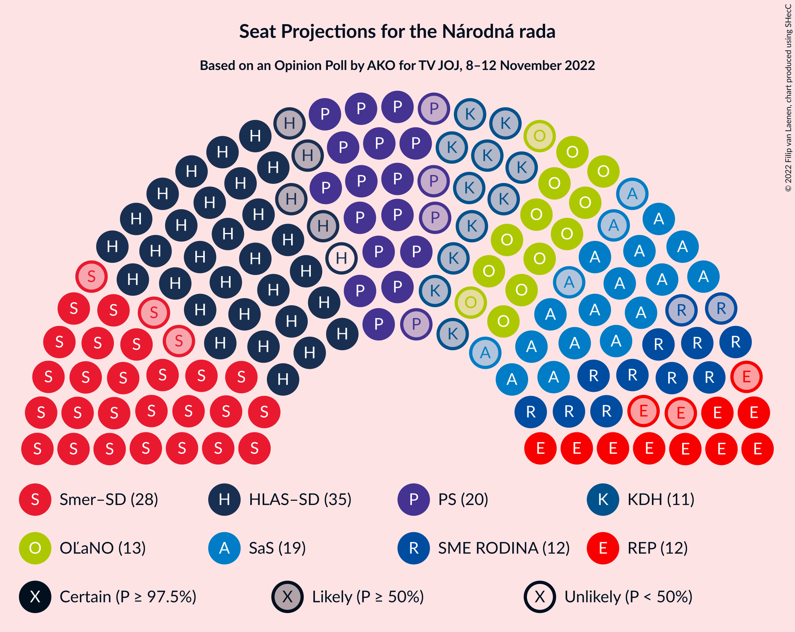

# Opinion Poll by AKO for TV JOJ, 8–12 November 2022

<a href="#voting-intentions">Voting Intentions</a> | <a href="#seats">Seats</a> | <a href="#coalitions">Coalitions</a> | <a href="#technical-information">Technical Information</a>

## Voting Intentions

### Confidence Intervals

| Party | Last Result | Poll Result | 80% Confidence Interval | 90% Confidence Interval | 95% Confidence Interval | 99% Confidence Interval |
|:-----:|:-----------:|:-----------:|:-----------------------:|:-----------------------:|:-----------------------:|:-----------------------:|
| HLAS–sociálna demokracia | 0.0% | 19.5% | 18.0–21.2% |17.5–21.7% |17.2–22.1% |16.4–22.9% |
| SMER–sociálna demokracia | 18.3% | 16.0% | 14.6–17.6% |14.2–18.0% |13.9–18.4% |13.2–19.2% |
| Progresívne Slovensko | 7.0% | 11.5% | 10.3–12.9% |10.0–13.3% |9.7–13.6% |9.1–14.3% |
| Sloboda a Solidarita | 6.2% | 10.8% | 9.6–12.2% |9.3–12.5% |9.0–12.9% |8.5–13.6% |
| OBYČAJNÍ ĽUDIA a nezávislé osobnosti | 25.0% | 7.5% | 6.5–8.7% |6.2–9.0% |6.0–9.3% |5.6–9.9% |
| SME RODINA | 8.2% | 6.9% | 6.0–8.0% |5.7–8.4% |5.5–8.7% |5.1–9.2% |
| REPUBLIKA | 0.0% | 6.3% | 5.4–7.4% |5.2–7.7% |5.0–8.0% |4.6–8.6% |
| Kresťanskodemokratické hnutie | 4.6% | 6.1% | 5.2–7.2% |5.0–7.5% |4.8–7.8% |4.4–8.3% |
| Slovenská národná strana | 3.2% | 4.2% | 3.5–5.1% |3.3–5.4% |3.1–5.6% |2.8–6.1% |
| Strana maďarskej koalície–Magyar Koalíció Pártja | 3.9% | 2.6% | 2.1–3.4% |1.9–3.6% |1.8–3.8% |1.6–4.2% |
| Kotleba–Ľudová strana Naše Slovensko | 8.0% | 1.9% | 1.4–2.6% |1.3–2.8% |1.2–3.0% |1.0–3.3% |
| Za ľudí | 5.8% | 1.9% | 1.4–2.6% |1.3–2.8% |1.2–3.0% |1.0–3.3% |
| Dobrá voľba | 3.1% | 1.5% | 1.1–2.1% |1.0–2.3% |0.9–2.5% |0.7–2.8% |

*Note:* The poll result column reflects the actual value used in the calculations. Published results may vary slightly, and in addition be rounded to fewer digits.

## Seats

### Confidence Intervals

| Party | Last Result | Median | 80% Confidence Interval | 90% Confidence Interval | 95% Confidence Interval | 99% Confidence Interval |
|:-----:|:-----------:|:------:|:-----------------------:|:-----------------------:|:-----------------------:|:-----------------------:|
| <a href="#hlas–sociálna-demokracia">HLAS–sociálna demokracia</a> | 0 | 34 | 33–38 |31–38 |30–38 |28–40 |
| <a href="#smer–sociálna-demokracia">SMER–sociálna demokracia</a> | 38 | 28 | 25–30 |25–31 |25–32 |23–36 |
| <a href="#progresívne-slovensko">Progresívne Slovensko</a> | 0 | 20 | 18–22 |16–24 |16–25 |16–25 |
| <a href="#sloboda-a-solidarita">Sloboda a Solidarita</a> | 13 | 19 | 17–20 |17–22 |15–23 |15–24 |
| <a href="#obyčajní-ľudia-a-nezávislé-osobnosti">OBYČAJNÍ ĽUDIA a nezávislé osobnosti</a> | 53 | 13 | 12–16 |11–16 |11–17 |9–17 |
| <a href="#sme-rodina">SME RODINA</a> | 17 | 12 | 11–16 |10–16 |10–16 |9–16 |
| <a href="#republika">REPUBLIKA</a> | 0 | 12 | 10–13 |9–14 |9–14 |0–15 |
| <a href="#kresťanskodemokratické-hnutie">Kresťanskodemokratické hnutie</a> | 0 | 11 | 9–12 |9–13 |0–13 |0–15 |
| <a href="#slovenská-národná-strana">Slovenská národná strana</a> | 0 | 0 | 0–8 |0–9 |0–10 |0–11 |
| <a href="#strana-maďarskej-koalície–magyar-koalíció-pártja">Strana maďarskej koalície–Magyar Koalíció Pártja</a> | 0 | 0 | 0 |0 |0 |0 |
| <a href="#kotleba–ľudová-strana-naše-slovensko">Kotleba–Ľudová strana Naše Slovensko</a> | 17 | 0 | 0 |0 |0 |0 |
| <a href="#za-ľudí">Za ľudí</a> | 12 | 0 | 0 |0 |0 |0 |
| <a href="#dobrá-voľba">Dobrá voľba</a> | 0 | 0 | 0 |0 |0 |0 |

### HLAS–sociálna demokracia

*For a full overview of the results for this party, see the [HLAS–sociálna demokracia](party-hlas–sociálnademokracia.html) page.*

| Number of Seats | Probability | Accumulated | Special Marks |
|:---------------:|:-----------:|:-----------:|:-------------:|
| 0 | 0% | 100% | Last Result |
| 1 | 0% | 100% |  |
| 2 | 0% | 100% |  |
| 3 | 0% | 100% |  |
| 4 | 0% | 100% |  |
| 5 | 0% | 100% |  |
| 6 | 0% | 100% |  |
| 7 | 0% | 100% |  |
| 8 | 0% | 100% |  |
| 9 | 0% | 100% |  |
| 10 | 0% | 100% |  |
| 11 | 0% | 100% |  |
| 12 | 0% | 100% |  |
| 13 | 0% | 100% |  |
| 14 | 0% | 100% |  |
| 15 | 0% | 100% |  |
| 16 | 0% | 100% |  |
| 17 | 0% | 100% |  |
| 18 | 0% | 100% |  |
| 19 | 0% | 100% |  |
| 20 | 0% | 100% |  |
| 21 | 0% | 100% |  |
| 22 | 0% | 100% |  |
| 23 | 0% | 100% |  |
| 24 | 0% | 100% |  |
| 25 | 0% | 100% |  |
| 26 | 0% | 100% |  |
| 27 | 0.1% | 100% |  |
| 28 | 0.5% | 99.9% |  |
| 29 | 2% | 99.4% |  |
| 30 | 0.8% | 98% |  |
| 31 | 4% | 97% |  |
| 32 | 2% | 93% |  |
| 33 | 37% | 91% |  |
| 34 | 11% | 55% | Median |
| 35 | 26% | 44% |  |
| 36 | 5% | 18% |  |
| 37 | 3% | 13% |  |
| 38 | 9% | 10% |  |
| 39 | 0.4% | 1.3% |  |
| 40 | 0.6% | 0.9% |  |
| 41 | 0.2% | 0.3% |  |
| 42 | 0% | 0.1% |  |
| 43 | 0% | 0% |  |

### SMER–sociálna demokracia

*For a full overview of the results for this party, see the [SMER–sociálna demokracia](party-smer–sociálnademokracia.html) page.*

| Number of Seats | Probability | Accumulated | Special Marks |
|:---------------:|:-----------:|:-----------:|:-------------:|
| 21 | 0% | 100% |  |
| 22 | 0.2% | 99.9% |  |
| 23 | 0.4% | 99.8% |  |
| 24 | 0.9% | 99.4% |  |
| 25 | 12% | 98% |  |
| 26 | 4% | 86% |  |
| 27 | 19% | 82% |  |
| 28 | 42% | 63% | Median |
| 29 | 9% | 21% |  |
| 30 | 6% | 12% |  |
| 31 | 2% | 6% |  |
| 32 | 2% | 4% |  |
| 33 | 0.4% | 2% |  |
| 34 | 0.5% | 1.2% |  |
| 35 | 0.2% | 0.7% |  |
| 36 | 0.5% | 0.6% |  |
| 37 | 0% | 0% |  |
| 38 | 0% | 0% | Last Result |

### Progresívne Slovensko

*For a full overview of the results for this party, see the [Progresívne Slovensko](party-progresívneslovensko.html) page.*

| Number of Seats | Probability | Accumulated | Special Marks |
|:---------------:|:-----------:|:-----------:|:-------------:|
| 0 | 0% | 100% | Last Result |
| 1 | 0% | 100% |  |
| 2 | 0% | 100% |  |
| 3 | 0% | 100% |  |
| 4 | 0% | 100% |  |
| 5 | 0% | 100% |  |
| 6 | 0% | 100% |  |
| 7 | 0% | 100% |  |
| 8 | 0% | 100% |  |
| 9 | 0% | 100% |  |
| 10 | 0% | 100% |  |
| 11 | 0% | 100% |  |
| 12 | 0% | 100% |  |
| 13 | 0% | 100% |  |
| 14 | 0% | 100% |  |
| 15 | 0.4% | 100% |  |
| 16 | 5% | 99.6% |  |
| 17 | 2% | 94% |  |
| 18 | 6% | 92% |  |
| 19 | 25% | 86% |  |
| 20 | 23% | 62% | Median |
| 21 | 8% | 38% |  |
| 22 | 25% | 31% |  |
| 23 | 1.0% | 6% |  |
| 24 | 0.8% | 5% |  |
| 25 | 4% | 4% |  |
| 26 | 0.4% | 0.4% |  |
| 27 | 0% | 0% |  |

### Sloboda a Solidarita

*For a full overview of the results for this party, see the [Sloboda a Solidarita](party-slobodaasolidarita.html) page.*

| Number of Seats | Probability | Accumulated | Special Marks |
|:---------------:|:-----------:|:-----------:|:-------------:|
| 13 | 0% | 100% | Last Result |
| 14 | 0.1% | 100% |  |
| 15 | 3% | 99.9% |  |
| 16 | 2% | 97% |  |
| 17 | 11% | 95% |  |
| 18 | 32% | 84% |  |
| 19 | 23% | 53% | Median |
| 20 | 20% | 29% |  |
| 21 | 3% | 9% |  |
| 22 | 4% | 7% |  |
| 23 | 2% | 3% |  |
| 24 | 0.8% | 1.1% |  |
| 25 | 0.1% | 0.3% |  |
| 26 | 0% | 0.2% |  |
| 27 | 0.2% | 0.2% |  |
| 28 | 0% | 0% |  |

### OBYČAJNÍ ĽUDIA a nezávislé osobnosti

*For a full overview of the results for this party, see the [OBYČAJNÍ ĽUDIA a nezávislé osobnosti](party-obyčajníľudiaanezávisléosobnosti.html) page.*

| Number of Seats | Probability | Accumulated | Special Marks |
|:---------------:|:-----------:|:-----------:|:-------------:|
| 9 | 0.5% | 100% |  |
| 10 | 1.3% | 99.4% |  |
| 11 | 4% | 98% |  |
| 12 | 42% | 94% |  |
| 13 | 16% | 52% | Median |
| 14 | 11% | 36% |  |
| 15 | 5% | 25% |  |
| 16 | 15% | 20% |  |
| 17 | 4% | 5% |  |
| 18 | 0.2% | 0.4% |  |
| 19 | 0% | 0.2% |  |
| 20 | 0.1% | 0.1% |  |
| 21 | 0% | 0% |  |
| 22 | 0% | 0% |  |
| 23 | 0% | 0% |  |
| 24 | 0% | 0% |  |
| 25 | 0% | 0% |  |
| 26 | 0% | 0% |  |
| 27 | 0% | 0% |  |
| 28 | 0% | 0% |  |
| 29 | 0% | 0% |  |
| 30 | 0% | 0% |  |
| 31 | 0% | 0% |  |
| 32 | 0% | 0% |  |
| 33 | 0% | 0% |  |
| 34 | 0% | 0% |  |
| 35 | 0% | 0% |  |
| 36 | 0% | 0% |  |
| 37 | 0% | 0% |  |
| 38 | 0% | 0% |  |
| 39 | 0% | 0% |  |
| 40 | 0% | 0% |  |
| 41 | 0% | 0% |  |
| 42 | 0% | 0% |  |
| 43 | 0% | 0% |  |
| 44 | 0% | 0% |  |
| 45 | 0% | 0% |  |
| 46 | 0% | 0% |  |
| 47 | 0% | 0% |  |
| 48 | 0% | 0% |  |
| 49 | 0% | 0% |  |
| 50 | 0% | 0% |  |
| 51 | 0% | 0% |  |
| 52 | 0% | 0% |  |
| 53 | 0% | 0% | Last Result |

### SME RODINA

*For a full overview of the results for this party, see the [SME RODINA](party-smerodina.html) page.*

| Number of Seats | Probability | Accumulated | Special Marks |
|:---------------:|:-----------:|:-----------:|:-------------:|
| 0 | 0.2% | 100% |  |
| 1 | 0% | 99.8% |  |
| 2 | 0% | 99.8% |  |
| 3 | 0% | 99.8% |  |
| 4 | 0% | 99.8% |  |
| 5 | 0% | 99.8% |  |
| 6 | 0% | 99.8% |  |
| 7 | 0% | 99.8% |  |
| 8 | 0% | 99.8% |  |
| 9 | 0.9% | 99.8% |  |
| 10 | 5% | 99.0% |  |
| 11 | 39% | 94% |  |
| 12 | 21% | 55% | Median |
| 13 | 6% | 34% |  |
| 14 | 4% | 28% |  |
| 15 | 6% | 24% |  |
| 16 | 18% | 19% |  |
| 17 | 0.2% | 0.2% | Last Result |
| 18 | 0% | 0% |  |

### REPUBLIKA

*For a full overview of the results for this party, see the [REPUBLIKA](party-republika.html) page.*

| Number of Seats | Probability | Accumulated | Special Marks |
|:---------------:|:-----------:|:-----------:|:-------------:|
| 0 | 2% | 100% | Last Result |
| 1 | 0% | 98% |  |
| 2 | 0% | 98% |  |
| 3 | 0% | 98% |  |
| 4 | 0% | 98% |  |
| 5 | 0% | 98% |  |
| 6 | 0% | 98% |  |
| 7 | 0% | 98% |  |
| 8 | 0% | 98% |  |
| 9 | 4% | 98% |  |
| 10 | 28% | 95% |  |
| 11 | 13% | 66% |  |
| 12 | 19% | 54% | Median |
| 13 | 26% | 35% |  |
| 14 | 8% | 9% |  |
| 15 | 0.6% | 0.7% |  |
| 16 | 0% | 0.1% |  |
| 17 | 0.1% | 0.1% |  |
| 18 | 0% | 0% |  |

### Kresťanskodemokratické hnutie

*For a full overview of the results for this party, see the [Kresťanskodemokratické hnutie](party-kresťanskodemokratickéhnutie.html) page.*

| Number of Seats | Probability | Accumulated | Special Marks |
|:---------------:|:-----------:|:-----------:|:-------------:|
| 0 | 3% | 100% | Last Result |
| 1 | 0% | 97% |  |
| 2 | 0% | 97% |  |
| 3 | 0% | 97% |  |
| 4 | 0% | 97% |  |
| 5 | 0% | 97% |  |
| 6 | 0% | 97% |  |
| 7 | 0% | 97% |  |
| 8 | 0% | 97% |  |
| 9 | 9% | 97% |  |
| 10 | 16% | 88% |  |
| 11 | 39% | 72% | Median |
| 12 | 26% | 33% |  |
| 13 | 5% | 7% |  |
| 14 | 2% | 2% |  |
| 15 | 0.5% | 0.5% |  |
| 16 | 0% | 0% |  |

### Slovenská národná strana

*For a full overview of the results for this party, see the [Slovenská národná strana](party-slovenskánárodnástrana.html) page.*

| Number of Seats | Probability | Accumulated | Special Marks |
|:---------------:|:-----------:|:-----------:|:-------------:|
| 0 | 88% | 100% | Last Result, Median |
| 1 | 0% | 12% |  |
| 2 | 0% | 12% |  |
| 3 | 0% | 12% |  |
| 4 | 0% | 12% |  |
| 5 | 0% | 12% |  |
| 6 | 0% | 12% |  |
| 7 | 0% | 12% |  |
| 8 | 6% | 12% |  |
| 9 | 3% | 6% |  |
| 10 | 2% | 3% |  |
| 11 | 0.6% | 0.6% |  |
| 12 | 0% | 0% |  |

### Strana maďarskej koalície–Magyar Koalíció Pártja

*For a full overview of the results for this party, see the [Strana maďarskej koalície–Magyar Koalíció Pártja](party-stranamaďarskejkoalície–magyarkoalíciópártja.html) page.*

| Number of Seats | Probability | Accumulated | Special Marks |
|:---------------:|:-----------:|:-----------:|:-------------:|
| 0 | 100% | 100% | Last Result, Median |

### Kotleba–Ľudová strana Naše Slovensko

*For a full overview of the results for this party, see the [Kotleba–Ľudová strana Naše Slovensko](party-kotleba–ľudovástrananašeslovensko.html) page.*

| Number of Seats | Probability | Accumulated | Special Marks |
|:---------------:|:-----------:|:-----------:|:-------------:|
| 0 | 100% | 100% | Median |
| 1 | 0% | 0% |  |
| 2 | 0% | 0% |  |
| 3 | 0% | 0% |  |
| 4 | 0% | 0% |  |
| 5 | 0% | 0% |  |
| 6 | 0% | 0% |  |
| 7 | 0% | 0% |  |
| 8 | 0% | 0% |  |
| 9 | 0% | 0% |  |
| 10 | 0% | 0% |  |
| 11 | 0% | 0% |  |
| 12 | 0% | 0% |  |
| 13 | 0% | 0% |  |
| 14 | 0% | 0% |  |
| 15 | 0% | 0% |  |
| 16 | 0% | 0% |  |
| 17 | 0% | 0% | Last Result |

### Za ľudí

*For a full overview of the results for this party, see the [Za ľudí](party-zaľudí.html) page.*

| Number of Seats | Probability | Accumulated | Special Marks |
|:---------------:|:-----------:|:-----------:|:-------------:|
| 0 | 100% | 100% | Median |
| 1 | 0% | 0% |  |
| 2 | 0% | 0% |  |
| 3 | 0% | 0% |  |
| 4 | 0% | 0% |  |
| 5 | 0% | 0% |  |
| 6 | 0% | 0% |  |
| 7 | 0% | 0% |  |
| 8 | 0% | 0% |  |
| 9 | 0% | 0% |  |
| 10 | 0% | 0% |  |
| 11 | 0% | 0% |  |
| 12 | 0% | 0% | Last Result |

### Dobrá voľba

*For a full overview of the results for this party, see the [Dobrá voľba](party-dobrávoľba.html) page.*

| Number of Seats | Probability | Accumulated | Special Marks |
|:---------------:|:-----------:|:-----------:|:-------------:|
| 0 | 100% | 100% | Last Result, Median |

## Coalitions

### Confidence Intervals

| Coalition | Last Result | Median | Majority? | 80% Confidence Interval | 90% Confidence Interval | 95% Confidence Interval | 99% Confidence Interval |
|:---------:|:-----------:|:------:|:---------:|:-----------------------:|:-----------------------:|:-----------------------:|:-----------------------:|
| HLAS–sociálna demokracia – SMER–sociálna demokracia – SME RODINA – Slovenská národná strana – Kotleba–Ľudová strana Naše Slovensko | 72 | 75 | 45% | 72–78 | 72–79 | 72–83 | 70–88 |
| HLAS–sociálna demokracia – SMER–sociálna demokracia – SME RODINA – Slovenská národná strana | 55 | 75 | 45% | 72–78 | 72–79 | 72–83 | 70–88 |
| HLAS–sociálna demokracia – SMER–sociálna demokracia – SME RODINA | 55 | 74 | 34% | 70–77 | 70–79 | 68–80 | 67–84 |
| HLAS–sociálna demokracia – SMER–sociálna demokracia – Slovenská národná strana | 38 | 63 | 0.4% | 60–67 | 60–68 | 60–70 | 58–75 |
| HLAS–sociálna demokracia – SME RODINA – Slovenská národná strana – Kotleba–Ľudová strana Naše Slovensko | 34 | 48 | 0% | 45–52 | 45–53 | 44–54 | 42–58 |
| HLAS–sociálna demokracia – SME RODINA – Slovenská národná strana | 17 | 48 | 0% | 45–52 | 45–53 | 44–54 | 42–58 |
| HLAS–sociálna demokracia – SME RODINA | 17 | 46 | 0% | 45–49 | 43–50 | 42–50 | 39–54 |
| SMER–sociálna demokracia – SME RODINA – Slovenská národná strana – Kotleba–Ľudová strana Naše Slovensko | 72 | 41 | 0% | 39–45 | 37–46 | 36–49 | 36–52 |
| SMER–sociálna demokracia – SME RODINA – Slovenská národná strana | 55 | 41 | 0% | 39–45 | 37–46 | 36–49 | 36–52 |
| SMER–sociálna demokracia – SME RODINA | 55 | 39 | 0% | 36–44 | 36–44 | 35–46 | 34–48 |
| HLAS–sociálna demokracia – Slovenská národná strana | 0 | 35 | 0% | 33–40 | 32–42 | 31–43 | 29–47 |
| SMER–sociálna demokracia – Slovenská národná strana | 38 | 28 | 0% | 27–33 | 25–35 | 25–39 | 24–40 |
| SMER–sociálna demokracia | 38 | 28 | 0% | 25–30 | 25–31 | 25–32 | 23–36 |

### HLAS–sociálna demokracia – SMER–sociálna demokracia – SME RODINA – Slovenská národná strana – Kotleba–Ľudová strana Naše Slovensko

| Number of Seats | Probability | Accumulated | Special Marks |
|:---------------:|:-----------:|:-----------:|:-------------:|
| 66 | 0.1% | 100% |  |
| 67 | 0.1% | 99.9% |  |
| 68 | 0.1% | 99.8% |  |
| 69 | 0.2% | 99.7% |  |
| 70 | 0.4% | 99.5% |  |
| 71 | 0.6% | 99.2% |  |
| 72 | 15% | 98.6% | Last Result |
| 73 | 2% | 84% |  |
| 74 | 28% | 82% | Median |
| 75 | 10% | 54% |  |
| 76 | 4% | 45% | Majority |
| 77 | 21% | 41% |  |
| 78 | 12% | 20% |  |
| 79 | 3% | 8% |  |
| 80 | 1.0% | 5% |  |
| 81 | 1.0% | 4% |  |
| 82 | 0.4% | 3% |  |
| 83 | 0.5% | 3% |  |
| 84 | 0.7% | 2% |  |
| 85 | 0.1% | 1.3% |  |
| 86 | 0.2% | 1.2% |  |
| 87 | 0.3% | 1.0% |  |
| 88 | 0.6% | 0.7% |  |
| 89 | 0% | 0.1% |  |
| 90 | 0% | 0.1% |  |
| 91 | 0.1% | 0.1% |  |
| 92 | 0% | 0% |  |

### HLAS–sociálna demokracia – SMER–sociálna demokracia – SME RODINA – Slovenská národná strana

| Number of Seats | Probability | Accumulated | Special Marks |
|:---------------:|:-----------:|:-----------:|:-------------:|
| 55 | 0% | 100% | Last Result |
| 56 | 0% | 100% |  |
| 57 | 0% | 100% |  |
| 58 | 0% | 100% |  |
| 59 | 0% | 100% |  |
| 60 | 0% | 100% |  |
| 61 | 0% | 100% |  |
| 62 | 0% | 100% |  |
| 63 | 0% | 100% |  |
| 64 | 0% | 100% |  |
| 65 | 0% | 100% |  |
| 66 | 0.1% | 100% |  |
| 67 | 0.1% | 99.9% |  |
| 68 | 0.1% | 99.8% |  |
| 69 | 0.2% | 99.7% |  |
| 70 | 0.4% | 99.5% |  |
| 71 | 0.6% | 99.2% |  |
| 72 | 15% | 98.6% |  |
| 73 | 2% | 84% |  |
| 74 | 28% | 82% | Median |
| 75 | 10% | 54% |  |
| 76 | 4% | 45% | Majority |
| 77 | 21% | 41% |  |
| 78 | 12% | 20% |  |
| 79 | 3% | 8% |  |
| 80 | 1.0% | 5% |  |
| 81 | 1.0% | 4% |  |
| 82 | 0.4% | 3% |  |
| 83 | 0.5% | 3% |  |
| 84 | 0.7% | 2% |  |
| 85 | 0.1% | 1.3% |  |
| 86 | 0.2% | 1.2% |  |
| 87 | 0.3% | 1.0% |  |
| 88 | 0.6% | 0.7% |  |
| 89 | 0% | 0.1% |  |
| 90 | 0% | 0.1% |  |
| 91 | 0.1% | 0.1% |  |
| 92 | 0% | 0% |  |

### HLAS–sociálna demokracia – SMER–sociálna demokracia – SME RODINA

| Number of Seats | Probability | Accumulated | Special Marks |
|:---------------:|:-----------:|:-----------:|:-------------:|
| 55 | 0% | 100% | Last Result |
| 56 | 0% | 100% |  |
| 57 | 0% | 100% |  |
| 58 | 0% | 100% |  |
| 59 | 0% | 100% |  |
| 60 | 0% | 100% |  |
| 61 | 0% | 100% |  |
| 62 | 0% | 100% |  |
| 63 | 0% | 100% |  |
| 64 | 0% | 100% |  |
| 65 | 0.1% | 99.9% |  |
| 66 | 0.1% | 99.8% |  |
| 67 | 0.6% | 99.8% |  |
| 68 | 2% | 99.1% |  |
| 69 | 2% | 97% |  |
| 70 | 6% | 95% |  |
| 71 | 0.7% | 89% |  |
| 72 | 15% | 89% |  |
| 73 | 2% | 74% |  |
| 74 | 28% | 72% | Median |
| 75 | 10% | 44% |  |
| 76 | 2% | 34% | Majority |
| 77 | 21% | 31% |  |
| 78 | 4% | 10% |  |
| 79 | 3% | 6% |  |
| 80 | 0.9% | 3% |  |
| 81 | 0.9% | 2% |  |
| 82 | 0.3% | 1.1% |  |
| 83 | 0.3% | 0.8% |  |
| 84 | 0.1% | 0.5% |  |
| 85 | 0.1% | 0.4% |  |
| 86 | 0.1% | 0.4% |  |
| 87 | 0% | 0.3% |  |
| 88 | 0.2% | 0.3% |  |
| 89 | 0% | 0% |  |

### HLAS–sociálna demokracia – SMER–sociálna demokracia – Slovenská národná strana

| Number of Seats | Probability | Accumulated | Special Marks |
|:---------------:|:-----------:|:-----------:|:-------------:|
| 38 | 0% | 100% | Last Result |
| 39 | 0% | 100% |  |
| 40 | 0% | 100% |  |
| 41 | 0% | 100% |  |
| 42 | 0% | 100% |  |
| 43 | 0% | 100% |  |
| 44 | 0% | 100% |  |
| 45 | 0% | 100% |  |
| 46 | 0% | 100% |  |
| 47 | 0% | 100% |  |
| 48 | 0% | 100% |  |
| 49 | 0% | 100% |  |
| 50 | 0% | 100% |  |
| 51 | 0% | 100% |  |
| 52 | 0% | 100% |  |
| 53 | 0% | 100% |  |
| 54 | 0% | 100% |  |
| 55 | 0% | 100% |  |
| 56 | 0.2% | 99.9% |  |
| 57 | 0% | 99.8% |  |
| 58 | 0.7% | 99.8% |  |
| 59 | 0.9% | 99.1% |  |
| 60 | 18% | 98% |  |
| 61 | 21% | 80% |  |
| 62 | 2% | 59% | Median |
| 63 | 28% | 57% |  |
| 64 | 7% | 29% |  |
| 65 | 3% | 21% |  |
| 66 | 2% | 18% |  |
| 67 | 8% | 16% |  |
| 68 | 4% | 8% |  |
| 69 | 1.1% | 5% |  |
| 70 | 1.2% | 4% |  |
| 71 | 0.4% | 2% |  |
| 72 | 0.3% | 2% |  |
| 73 | 0.7% | 2% |  |
| 74 | 0.1% | 1.0% |  |
| 75 | 0.5% | 0.9% |  |
| 76 | 0% | 0.4% | Majority |
| 77 | 0% | 0.4% |  |
| 78 | 0.3% | 0.3% |  |
| 79 | 0% | 0% |  |

### HLAS–sociálna demokracia – SME RODINA – Slovenská národná strana – Kotleba–Ľudová strana Naše Slovensko

| Number of Seats | Probability | Accumulated | Special Marks |
|:---------------:|:-----------:|:-----------:|:-------------:|
| 34 | 0% | 100% | Last Result |
| 35 | 0% | 100% |  |
| 36 | 0% | 99.9% |  |
| 37 | 0% | 99.9% |  |
| 38 | 0% | 99.9% |  |
| 39 | 0% | 99.8% |  |
| 40 | 0.1% | 99.8% |  |
| 41 | 0.2% | 99.7% |  |
| 42 | 0.5% | 99.5% |  |
| 43 | 0.5% | 99.0% |  |
| 44 | 2% | 98% |  |
| 45 | 15% | 96% |  |
| 46 | 28% | 81% | Median |
| 47 | 3% | 53% |  |
| 48 | 9% | 50% |  |
| 49 | 24% | 41% |  |
| 50 | 4% | 16% |  |
| 51 | 1.5% | 12% |  |
| 52 | 1.4% | 11% |  |
| 53 | 7% | 9% |  |
| 54 | 0.7% | 3% |  |
| 55 | 0.3% | 2% |  |
| 56 | 0.5% | 2% |  |
| 57 | 0% | 1.1% |  |
| 58 | 0.6% | 1.1% |  |
| 59 | 0% | 0.4% |  |
| 60 | 0.3% | 0.4% |  |
| 61 | 0% | 0.1% |  |
| 62 | 0% | 0% |  |

### HLAS–sociálna demokracia – SME RODINA – Slovenská národná strana

| Number of Seats | Probability | Accumulated | Special Marks |
|:---------------:|:-----------:|:-----------:|:-------------:|
| 17 | 0% | 100% | Last Result |
| 18 | 0% | 100% |  |
| 19 | 0% | 100% |  |
| 20 | 0% | 100% |  |
| 21 | 0% | 100% |  |
| 22 | 0% | 100% |  |
| 23 | 0% | 100% |  |
| 24 | 0% | 100% |  |
| 25 | 0% | 100% |  |
| 26 | 0% | 100% |  |
| 27 | 0% | 100% |  |
| 28 | 0% | 100% |  |
| 29 | 0% | 100% |  |
| 30 | 0% | 100% |  |
| 31 | 0% | 100% |  |
| 32 | 0% | 100% |  |
| 33 | 0% | 100% |  |
| 34 | 0% | 100% |  |
| 35 | 0% | 100% |  |
| 36 | 0% | 99.9% |  |
| 37 | 0% | 99.9% |  |
| 38 | 0% | 99.9% |  |
| 39 | 0% | 99.8% |  |
| 40 | 0.1% | 99.8% |  |
| 41 | 0.2% | 99.7% |  |
| 42 | 0.5% | 99.5% |  |
| 43 | 0.5% | 99.0% |  |
| 44 | 2% | 98% |  |
| 45 | 15% | 96% |  |
| 46 | 28% | 81% | Median |
| 47 | 3% | 53% |  |
| 48 | 9% | 50% |  |
| 49 | 24% | 41% |  |
| 50 | 4% | 16% |  |
| 51 | 1.5% | 12% |  |
| 52 | 1.4% | 11% |  |
| 53 | 7% | 9% |  |
| 54 | 0.7% | 3% |  |
| 55 | 0.3% | 2% |  |
| 56 | 0.5% | 2% |  |
| 57 | 0% | 1.1% |  |
| 58 | 0.6% | 1.1% |  |
| 59 | 0% | 0.4% |  |
| 60 | 0.3% | 0.4% |  |
| 61 | 0% | 0.1% |  |
| 62 | 0% | 0% |  |

### HLAS–sociálna demokracia – SME RODINA

| Number of Seats | Probability | Accumulated | Special Marks |
|:---------------:|:-----------:|:-----------:|:-------------:|
| 17 | 0% | 100% | Last Result |
| 18 | 0% | 100% |  |
| 19 | 0% | 100% |  |
| 20 | 0% | 100% |  |
| 21 | 0% | 100% |  |
| 22 | 0% | 100% |  |
| 23 | 0% | 100% |  |
| 24 | 0% | 100% |  |
| 25 | 0% | 100% |  |
| 26 | 0% | 100% |  |
| 27 | 0% | 100% |  |
| 28 | 0% | 100% |  |
| 29 | 0% | 100% |  |
| 30 | 0% | 100% |  |
| 31 | 0% | 100% |  |
| 32 | 0% | 100% |  |
| 33 | 0% | 100% |  |
| 34 | 0% | 100% |  |
| 35 | 0% | 100% |  |
| 36 | 0% | 99.9% |  |
| 37 | 0% | 99.9% |  |
| 38 | 0.1% | 99.9% |  |
| 39 | 1.2% | 99.8% |  |
| 40 | 0.6% | 98.6% |  |
| 41 | 0.2% | 98% |  |
| 42 | 0.6% | 98% |  |
| 43 | 3% | 97% |  |
| 44 | 3% | 94% |  |
| 45 | 20% | 91% |  |
| 46 | 28% | 71% | Median |
| 47 | 3% | 43% |  |
| 48 | 9% | 39% |  |
| 49 | 24% | 31% |  |
| 50 | 4% | 6% |  |
| 51 | 0.8% | 2% |  |
| 52 | 0.6% | 1.3% |  |
| 53 | 0.1% | 0.7% |  |
| 54 | 0.3% | 0.6% |  |
| 55 | 0% | 0.2% |  |
| 56 | 0.2% | 0.2% |  |
| 57 | 0% | 0% |  |

### SMER–sociálna demokracia – SME RODINA – Slovenská národná strana – Kotleba–Ľudová strana Naše Slovensko

| Number of Seats | Probability | Accumulated | Special Marks |
|:---------------:|:-----------:|:-----------:|:-------------:|
| 30 | 0% | 100% |  |
| 31 | 0% | 99.9% |  |
| 32 | 0% | 99.9% |  |
| 33 | 0% | 99.9% |  |
| 34 | 0.2% | 99.9% |  |
| 35 | 0.2% | 99.7% |  |
| 36 | 4% | 99.5% |  |
| 37 | 3% | 95% |  |
| 38 | 1.3% | 92% |  |
| 39 | 37% | 91% |  |
| 40 | 4% | 54% | Median |
| 41 | 4% | 51% |  |
| 42 | 8% | 47% |  |
| 43 | 4% | 38% |  |
| 44 | 24% | 34% |  |
| 45 | 4% | 10% |  |
| 46 | 2% | 6% |  |
| 47 | 1.0% | 5% |  |
| 48 | 0.3% | 4% |  |
| 49 | 2% | 3% |  |
| 50 | 0.7% | 2% |  |
| 51 | 0.4% | 0.9% |  |
| 52 | 0.4% | 0.6% |  |
| 53 | 0.2% | 0.2% |  |
| 54 | 0% | 0% |  |
| 55 | 0% | 0% |  |
| 56 | 0% | 0% |  |
| 57 | 0% | 0% |  |
| 58 | 0% | 0% |  |
| 59 | 0% | 0% |  |
| 60 | 0% | 0% |  |
| 61 | 0% | 0% |  |
| 62 | 0% | 0% |  |
| 63 | 0% | 0% |  |
| 64 | 0% | 0% |  |
| 65 | 0% | 0% |  |
| 66 | 0% | 0% |  |
| 67 | 0% | 0% |  |
| 68 | 0% | 0% |  |
| 69 | 0% | 0% |  |
| 70 | 0% | 0% |  |
| 71 | 0% | 0% |  |
| 72 | 0% | 0% | Last Result |

### SMER–sociálna demokracia – SME RODINA – Slovenská národná strana

| Number of Seats | Probability | Accumulated | Special Marks |
|:---------------:|:-----------:|:-----------:|:-------------:|
| 30 | 0% | 100% |  |
| 31 | 0% | 99.9% |  |
| 32 | 0% | 99.9% |  |
| 33 | 0% | 99.9% |  |
| 34 | 0.2% | 99.9% |  |
| 35 | 0.2% | 99.7% |  |
| 36 | 4% | 99.5% |  |
| 37 | 3% | 95% |  |
| 38 | 1.3% | 92% |  |
| 39 | 37% | 91% |  |
| 40 | 4% | 54% | Median |
| 41 | 4% | 51% |  |
| 42 | 8% | 47% |  |
| 43 | 4% | 38% |  |
| 44 | 24% | 34% |  |
| 45 | 4% | 10% |  |
| 46 | 2% | 6% |  |
| 47 | 1.0% | 5% |  |
| 48 | 0.3% | 4% |  |
| 49 | 2% | 3% |  |
| 50 | 0.7% | 2% |  |
| 51 | 0.4% | 0.9% |  |
| 52 | 0.4% | 0.6% |  |
| 53 | 0.2% | 0.2% |  |
| 54 | 0% | 0% |  |
| 55 | 0% | 0% | Last Result |

### SMER–sociálna demokracia – SME RODINA

| Number of Seats | Probability | Accumulated | Special Marks |
|:---------------:|:-----------:|:-----------:|:-------------:|
| 30 | 0% | 100% |  |
| 31 | 0.1% | 99.9% |  |
| 32 | 0% | 99.9% |  |
| 33 | 0% | 99.8% |  |
| 34 | 0.4% | 99.8% |  |
| 35 | 2% | 99.4% |  |
| 36 | 9% | 97% |  |
| 37 | 4% | 88% |  |
| 38 | 2% | 84% |  |
| 39 | 37% | 82% |  |
| 40 | 5% | 45% | Median |
| 41 | 5% | 40% |  |
| 42 | 9% | 35% |  |
| 43 | 4% | 27% |  |
| 44 | 18% | 22% |  |
| 45 | 2% | 4% |  |
| 46 | 2% | 3% |  |
| 47 | 0.3% | 0.9% |  |
| 48 | 0.2% | 0.6% |  |
| 49 | 0.1% | 0.4% |  |
| 50 | 0.1% | 0.3% |  |
| 51 | 0.3% | 0.3% |  |
| 52 | 0% | 0% |  |
| 53 | 0% | 0% |  |
| 54 | 0% | 0% |  |
| 55 | 0% | 0% | Last Result |

### HLAS–sociálna demokracia – Slovenská národná strana

| Number of Seats | Probability | Accumulated | Special Marks |
|:---------------:|:-----------:|:-----------:|:-------------:|
| 0 | 0% | 100% | Last Result |
| 1 | 0% | 100% |  |
| 2 | 0% | 100% |  |
| 3 | 0% | 100% |  |
| 4 | 0% | 100% |  |
| 5 | 0% | 100% |  |
| 6 | 0% | 100% |  |
| 7 | 0% | 100% |  |
| 8 | 0% | 100% |  |
| 9 | 0% | 100% |  |
| 10 | 0% | 100% |  |
| 11 | 0% | 100% |  |
| 12 | 0% | 100% |  |
| 13 | 0% | 100% |  |
| 14 | 0% | 100% |  |
| 15 | 0% | 100% |  |
| 16 | 0% | 100% |  |
| 17 | 0% | 100% |  |
| 18 | 0% | 100% |  |
| 19 | 0% | 100% |  |
| 20 | 0% | 100% |  |
| 21 | 0% | 100% |  |
| 22 | 0% | 100% |  |
| 23 | 0% | 100% |  |
| 24 | 0% | 100% |  |
| 25 | 0% | 100% |  |
| 26 | 0% | 100% |  |
| 27 | 0% | 100% |  |
| 28 | 0.4% | 100% |  |
| 29 | 0.3% | 99.5% |  |
| 30 | 0.7% | 99.3% |  |
| 31 | 3% | 98.6% |  |
| 32 | 1.2% | 95% |  |
| 33 | 35% | 94% |  |
| 34 | 5% | 59% | Median |
| 35 | 26% | 54% |  |
| 36 | 4% | 29% |  |
| 37 | 3% | 24% |  |
| 38 | 10% | 21% |  |
| 39 | 1.0% | 12% |  |
| 40 | 0.7% | 11% |  |
| 41 | 1.0% | 10% |  |
| 42 | 5% | 9% |  |
| 43 | 2% | 3% |  |
| 44 | 0.3% | 2% |  |
| 45 | 0.2% | 1.4% |  |
| 46 | 0.1% | 1.2% |  |
| 47 | 1.0% | 1.1% |  |
| 48 | 0% | 0.1% |  |
| 49 | 0% | 0.1% |  |
| 50 | 0% | 0% |  |

### SMER–sociálna demokracia – Slovenská národná strana

| Number of Seats | Probability | Accumulated | Special Marks |
|:---------------:|:-----------:|:-----------:|:-------------:|
| 22 | 0.2% | 100% |  |
| 23 | 0.2% | 99.8% |  |
| 24 | 0.4% | 99.7% |  |
| 25 | 5% | 99.3% |  |
| 26 | 3% | 94% |  |
| 27 | 19% | 91% |  |
| 28 | 41% | 72% | Median |
| 29 | 9% | 31% |  |
| 30 | 4% | 22% |  |
| 31 | 2% | 18% |  |
| 32 | 2% | 15% |  |
| 33 | 6% | 13% |  |
| 34 | 0.7% | 7% |  |
| 35 | 2% | 6% |  |
| 36 | 1.1% | 4% |  |
| 37 | 0.2% | 3% |  |
| 38 | 0.1% | 3% | Last Result |
| 39 | 2% | 3% |  |
| 40 | 0.3% | 0.6% |  |
| 41 | 0.1% | 0.3% |  |
| 42 | 0.2% | 0.2% |  |
| 43 | 0% | 0% |  |

### SMER–sociálna demokracia

| Number of Seats | Probability | Accumulated | Special Marks |
|:---------------:|:-----------:|:-----------:|:-------------:|
| 21 | 0% | 100% |  |
| 22 | 0.2% | 99.9% |  |
| 23 | 0.4% | 99.8% |  |
| 24 | 0.9% | 99.4% |  |
| 25 | 12% | 98% |  |
| 26 | 4% | 86% |  |
| 27 | 19% | 82% |  |
| 28 | 42% | 63% | Median |
| 29 | 9% | 21% |  |
| 30 | 6% | 12% |  |
| 31 | 2% | 6% |  |
| 32 | 2% | 4% |  |
| 33 | 0.4% | 2% |  |
| 34 | 0.5% | 1.2% |  |
| 35 | 0.2% | 0.7% |  |
| 36 | 0.5% | 0.6% |  |
| 37 | 0% | 0% |  |
| 38 | 0% | 0% | Last Result |

## Technical Information

### Opinion Poll

+ **Polling firm:** AKO
+ **Commissioner(s):** TV JOJ
+ **Fieldwork period:** 8–12 November 2022

### Calculations

+ **Sample size:** 1000
+ **Simulations done:** 1,048,576
+ **Error estimate:** 2.91%

