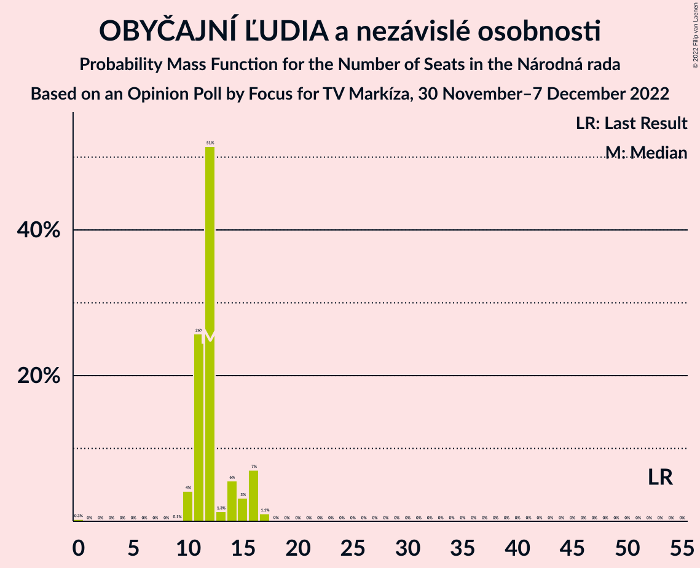

# Opinion Poll by Focus for TV Markíza, 30 November–7 December 2022

<a href="#voting-intentions">Voting Intentions</a> | <a href="#seats">Seats</a> | <a href="#coalitions">Coalitions</a> | <a href="#technical-information">Technical Information</a>

## Voting Intentions

### Confidence Intervals

| Party | Last Result | Poll Result | 80% Confidence Interval | 90% Confidence Interval | 95% Confidence Interval | 99% Confidence Interval |
|:-----:|:-----------:|:-----------:|:-----------------------:|:-----------------------:|:-----------------------:|:-----------------------:|
| HLAS–sociálna demokracia | 0.0% | 20.0% | 18.4–21.7% |18.0–22.1% |17.6–22.6% |16.9–23.4% |
| SMER–sociálna demokracia | 18.3% | 15.8% | 14.4–17.3% |14.0–17.8% |13.7–18.2% |13.0–18.9% |
| Progresívne Slovensko | 7.0% | 10.3% | 9.2–11.7% |8.9–12.0% |8.6–12.4% |8.1–13.0% |
| REPUBLIKA | 0.0% | 7.9% | 7.0–9.1% |6.7–9.5% |6.4–9.8% |6.0–10.4% |
| Sloboda a Solidarita | 6.2% | 7.7% | 6.8–8.9% |6.5–9.3% |6.2–9.6% |5.8–10.2% |
| SME RODINA | 8.2% | 7.3% | 6.4–8.5% |6.1–8.8% |5.9–9.1% |5.5–9.7% |
| OBYČAJNÍ ĽUDIA a nezávislé osobnosti | 25.0% | 7.1% | 6.1–8.2% |5.9–8.5% |5.6–8.8% |5.2–9.4% |
| Kresťanskodemokratické hnutie | 4.6% | 6.1% | 5.2–7.1% |4.9–7.4% |4.7–7.7% |4.4–8.3% |
| Strana maďarskej koalície–Magyar Koalíció Pártja | 3.9% | 5.1% | 4.3–6.1% |4.1–6.4% |3.9–6.6% |3.5–7.1% |
| Slovenská národná strana | 3.2% | 3.7% | 3.0–4.6% |2.8–4.8% |2.7–5.0% |2.4–5.5% |
| Kotleba–Ľudová strana Naše Slovensko | 8.0% | 3.0% | 2.4–3.8% |2.2–4.0% |2.1–4.2% |1.8–4.6% |
| Za ľudí | 5.8% | 2.7% | 2.1–3.5% |2.0–3.7% |1.8–3.9% |1.6–4.3% |
| Dobrá voľba | 3.1% | 1.1% | 0.8–1.6% |0.7–1.8% |0.6–2.0% |0.5–2.3% |
| SPOLU–Občianska Demokracia | 7.0% | 0.7% | 0.5–1.2% |0.4–1.3% |0.3–1.4% |0.2–1.7% |

*Note:* The poll result column reflects the actual value used in the calculations. Published results may vary slightly, and in addition be rounded to fewer digits.

## Seats

### Confidence Intervals

| Party | Last Result | Median | 80% Confidence Interval | 90% Confidence Interval | 95% Confidence Interval | 99% Confidence Interval |
|:-----:|:-----------:|:------:|:-----------------------:|:-----------------------:|:-----------------------:|:-----------------------:|
| <a href="#hlas–sociálna-demokracia">HLAS–sociálna demokracia</a> | 0 | 34 | 33–38 |30–40 |30–40 |29–41 |
| <a href="#smer–sociálna-demokracia">SMER–sociálna demokracia</a> | 38 | 26 | 24–31 |24–31 |24–31 |23–33 |
| <a href="#progresívne-slovensko">Progresívne Slovensko</a> | 0 | 18 | 17–22 |17–22 |15–22 |15–22 |
| <a href="#republika">REPUBLIKA</a> | 0 | 14 | 12–16 |12–16 |12–17 |12–17 |
| <a href="#sloboda-a-solidarita">Sloboda a Solidarita</a> | 13 | 13 | 11–16 |11–16 |11–17 |11–18 |
| <a href="#sme-rodina">SME RODINA</a> | 17 | 14 | 12–15 |11–15 |10–15 |10–17 |
| <a href="#obyčajní-ľudia-a-nezávislé-osobnosti">OBYČAJNÍ ĽUDIA a nezávislé osobnosti</a> | 53 | 12 | 11–15 |11–16 |10–16 |10–17 |
| <a href="#kresťanskodemokratické-hnutie">Kresťanskodemokratické hnutie</a> | 0 | 10 | 9–12 |9–13 |9–13 |0–13 |
| <a href="#strana-maďarskej-koalície–magyar-koalíció-pártja">Strana maďarskej koalície–Magyar Koalíció Pártja</a> | 0 | 0 | 0–10 |0–10 |0–11 |0–12 |
| <a href="#slovenská-národná-strana">Slovenská národná strana</a> | 0 | 0 | 0 |0 |0 |0–9 |
| <a href="#kotleba–ľudová-strana-naše-slovensko">Kotleba–Ľudová strana Naše Slovensko</a> | 17 | 0 | 0 |0 |0 |0 |
| <a href="#za-ľudí">Za ľudí</a> | 12 | 0 | 0 |0 |0 |0 |
| <a href="#dobrá-voľba">Dobrá voľba</a> | 0 | 0 | 0 |0 |0 |0 |
| <a href="#spolu–občianska-demokracia">SPOLU–Občianska Demokracia</a> | 0 | 0 | 0 |0 |0 |0 |

### HLAS–sociálna demokracia

*For a full overview of the results for this party, see the [HLAS–sociálna demokracia](party-hlas–sociálnademokracia.html) page.*

| Number of Seats | Probability | Accumulated | Special Marks |
|:---------------:|:-----------:|:-----------:|:-------------:|
| 0 | 0% | 100% | Last Result |
| 1 | 0% | 100% |  |
| 2 | 0% | 100% |  |
| 3 | 0% | 100% |  |
| 4 | 0% | 100% |  |
| 5 | 0% | 100% |  |
| 6 | 0% | 100% |  |
| 7 | 0% | 100% |  |
| 8 | 0% | 100% |  |
| 9 | 0% | 100% |  |
| 10 | 0% | 100% |  |
| 11 | 0% | 100% |  |
| 12 | 0% | 100% |  |
| 13 | 0% | 100% |  |
| 14 | 0% | 100% |  |
| 15 | 0% | 100% |  |
| 16 | 0% | 100% |  |
| 17 | 0% | 100% |  |
| 18 | 0% | 100% |  |
| 19 | 0% | 100% |  |
| 20 | 0% | 100% |  |
| 21 | 0% | 100% |  |
| 22 | 0% | 100% |  |
| 23 | 0% | 100% |  |
| 24 | 0% | 100% |  |
| 25 | 0% | 100% |  |
| 26 | 0% | 100% |  |
| 27 | 0% | 100% |  |
| 28 | 0% | 100% |  |
| 29 | 2% | 100% |  |
| 30 | 3% | 98% |  |
| 31 | 1.1% | 95% |  |
| 32 | 2% | 94% |  |
| 33 | 21% | 92% |  |
| 34 | 36% | 71% | Median |
| 35 | 4% | 35% |  |
| 36 | 1.1% | 31% |  |
| 37 | 1.4% | 30% |  |
| 38 | 21% | 29% |  |
| 39 | 2% | 8% |  |
| 40 | 4% | 6% |  |
| 41 | 2% | 2% |  |
| 42 | 0.1% | 0.1% |  |
| 43 | 0% | 0.1% |  |
| 44 | 0% | 0.1% |  |
| 45 | 0% | 0% |  |

### SMER–sociálna demokracia

*For a full overview of the results for this party, see the [SMER–sociálna demokracia](party-smer–sociálnademokracia.html) page.*

| Number of Seats | Probability | Accumulated | Special Marks |
|:---------------:|:-----------:|:-----------:|:-------------:|
| 21 | 0.1% | 100% |  |
| 22 | 0.2% | 99.9% |  |
| 23 | 0.3% | 99.7% |  |
| 24 | 22% | 99.4% |  |
| 25 | 25% | 77% |  |
| 26 | 4% | 52% | Median |
| 27 | 1.3% | 48% |  |
| 28 | 4% | 47% |  |
| 29 | 4% | 43% |  |
| 30 | 7% | 39% |  |
| 31 | 30% | 31% |  |
| 32 | 0.4% | 1.3% |  |
| 33 | 0.6% | 0.9% |  |
| 34 | 0.1% | 0.3% |  |
| 35 | 0% | 0.2% |  |
| 36 | 0.2% | 0.2% |  |
| 37 | 0% | 0% |  |
| 38 | 0% | 0% | Last Result |

### Progresívne Slovensko

*For a full overview of the results for this party, see the [Progresívne Slovensko](party-progresívneslovensko.html) page.*

| Number of Seats | Probability | Accumulated | Special Marks |
|:---------------:|:-----------:|:-----------:|:-------------:|
| 0 | 0% | 100% | Last Result |
| 1 | 0% | 100% |  |
| 2 | 0% | 100% |  |
| 3 | 0% | 100% |  |
| 4 | 0% | 100% |  |
| 5 | 0% | 100% |  |
| 6 | 0% | 100% |  |
| 7 | 0% | 100% |  |
| 8 | 0% | 100% |  |
| 9 | 0% | 100% |  |
| 10 | 0% | 100% |  |
| 11 | 0% | 100% |  |
| 12 | 0% | 100% |  |
| 13 | 0.1% | 100% |  |
| 14 | 0.3% | 99.9% |  |
| 15 | 2% | 99.5% |  |
| 16 | 2% | 97% |  |
| 17 | 42% | 95% |  |
| 18 | 17% | 53% | Median |
| 19 | 3% | 36% |  |
| 20 | 4% | 33% |  |
| 21 | 1.1% | 29% |  |
| 22 | 28% | 28% |  |
| 23 | 0% | 0.1% |  |
| 24 | 0% | 0% |  |

### REPUBLIKA

*For a full overview of the results for this party, see the [REPUBLIKA](party-republika.html) page.*

| Number of Seats | Probability | Accumulated | Special Marks |
|:---------------:|:-----------:|:-----------:|:-------------:|
| 0 | 0% | 100% | Last Result |
| 1 | 0% | 100% |  |
| 2 | 0% | 100% |  |
| 3 | 0% | 100% |  |
| 4 | 0% | 100% |  |
| 5 | 0% | 100% |  |
| 6 | 0% | 100% |  |
| 7 | 0% | 100% |  |
| 8 | 0% | 100% |  |
| 9 | 0% | 100% |  |
| 10 | 0.1% | 100% |  |
| 11 | 0.3% | 99.9% |  |
| 12 | 18% | 99.6% |  |
| 13 | 3% | 82% |  |
| 14 | 39% | 79% | Median |
| 15 | 6% | 40% |  |
| 16 | 30% | 34% |  |
| 17 | 4% | 4% |  |
| 18 | 0.2% | 0.2% |  |
| 19 | 0% | 0.1% |  |
| 20 | 0% | 0% |  |

### Sloboda a Solidarita

*For a full overview of the results for this party, see the [Sloboda a Solidarita](party-slobodaasolidarita.html) page.*

| Number of Seats | Probability | Accumulated | Special Marks |
|:---------------:|:-----------:|:-----------:|:-------------:|
| 0 | 0.1% | 100% |  |
| 1 | 0% | 99.9% |  |
| 2 | 0% | 99.9% |  |
| 3 | 0% | 99.9% |  |
| 4 | 0% | 99.9% |  |
| 5 | 0% | 99.9% |  |
| 6 | 0% | 99.9% |  |
| 7 | 0% | 99.9% |  |
| 8 | 0% | 99.9% |  |
| 9 | 0% | 99.9% |  |
| 10 | 0.4% | 99.9% |  |
| 11 | 31% | 99.5% |  |
| 12 | 4% | 68% |  |
| 13 | 17% | 64% | Last Result, Median |
| 14 | 24% | 46% |  |
| 15 | 8% | 23% |  |
| 16 | 11% | 15% |  |
| 17 | 3% | 4% |  |
| 18 | 0.8% | 1.1% |  |
| 19 | 0.3% | 0.3% |  |
| 20 | 0% | 0% |  |

### SME RODINA

*For a full overview of the results for this party, see the [SME RODINA](party-smerodina.html) page.*

| Number of Seats | Probability | Accumulated | Special Marks |
|:---------------:|:-----------:|:-----------:|:-------------:|
| 9 | 0.3% | 100% |  |
| 10 | 2% | 99.6% |  |
| 11 | 4% | 97% |  |
| 12 | 10% | 93% |  |
| 13 | 6% | 84% |  |
| 14 | 46% | 78% | Median |
| 15 | 30% | 32% |  |
| 16 | 0.9% | 2% |  |
| 17 | 0.9% | 0.9% | Last Result |
| 18 | 0% | 0.1% |  |
| 19 | 0% | 0% |  |

### OBYČAJNÍ ĽUDIA a nezávislé osobnosti

*For a full overview of the results for this party, see the [OBYČAJNÍ ĽUDIA a nezávislé osobnosti](party-obyčajníľudiaanezávisléosobnosti.html) page.*

| Number of Seats | Probability | Accumulated | Special Marks |
|:---------------:|:-----------:|:-----------:|:-------------:|
| 0 | 0.3% | 100% |  |
| 1 | 0% | 99.7% |  |
| 2 | 0% | 99.7% |  |
| 3 | 0% | 99.7% |  |
| 4 | 0% | 99.7% |  |
| 5 | 0% | 99.7% |  |
| 6 | 0% | 99.7% |  |
| 7 | 0% | 99.7% |  |
| 8 | 0% | 99.7% |  |
| 9 | 0.1% | 99.7% |  |
| 10 | 4% | 99.6% |  |
| 11 | 26% | 95% |  |
| 12 | 51% | 70% | Median |
| 13 | 1.3% | 18% |  |
| 14 | 6% | 17% |  |
| 15 | 3% | 11% |  |
| 16 | 7% | 8% |  |
| 17 | 1.1% | 1.1% |  |
| 18 | 0% | 0% |  |
| 19 | 0% | 0% |  |
| 20 | 0% | 0% |  |
| 21 | 0% | 0% |  |
| 22 | 0% | 0% |  |
| 23 | 0% | 0% |  |
| 24 | 0% | 0% |  |
| 25 | 0% | 0% |  |
| 26 | 0% | 0% |  |
| 27 | 0% | 0% |  |
| 28 | 0% | 0% |  |
| 29 | 0% | 0% |  |
| 30 | 0% | 0% |  |
| 31 | 0% | 0% |  |
| 32 | 0% | 0% |  |
| 33 | 0% | 0% |  |
| 34 | 0% | 0% |  |
| 35 | 0% | 0% |  |
| 36 | 0% | 0% |  |
| 37 | 0% | 0% |  |
| 38 | 0% | 0% |  |
| 39 | 0% | 0% |  |
| 40 | 0% | 0% |  |
| 41 | 0% | 0% |  |
| 42 | 0% | 0% |  |
| 43 | 0% | 0% |  |
| 44 | 0% | 0% |  |
| 45 | 0% | 0% |  |
| 46 | 0% | 0% |  |
| 47 | 0% | 0% |  |
| 48 | 0% | 0% |  |
| 49 | 0% | 0% |  |
| 50 | 0% | 0% |  |
| 51 | 0% | 0% |  |
| 52 | 0% | 0% |  |
| 53 | 0% | 0% | Last Result |

### Kresťanskodemokratické hnutie

*For a full overview of the results for this party, see the [Kresťanskodemokratické hnutie](party-kresťanskodemokratickéhnutie.html) page.*

| Number of Seats | Probability | Accumulated | Special Marks |
|:---------------:|:-----------:|:-----------:|:-------------:|
| 0 | 2% | 100% | Last Result |
| 1 | 0% | 98% |  |
| 2 | 0% | 98% |  |
| 3 | 0% | 98% |  |
| 4 | 0% | 98% |  |
| 5 | 0% | 98% |  |
| 6 | 0% | 98% |  |
| 7 | 0% | 98% |  |
| 8 | 0% | 98% |  |
| 9 | 28% | 98% |  |
| 10 | 25% | 70% | Median |
| 11 | 4% | 46% |  |
| 12 | 36% | 42% |  |
| 13 | 5% | 6% |  |
| 14 | 0.4% | 0.5% |  |
| 15 | 0% | 0% |  |

### Strana maďarskej koalície–Magyar Koalíció Pártja

*For a full overview of the results for this party, see the [Strana maďarskej koalície–Magyar Koalíció Pártja](party-stranamaďarskejkoalície–magyarkoalíciópártja.html) page.*

| Number of Seats | Probability | Accumulated | Special Marks |
|:---------------:|:-----------:|:-----------:|:-------------:|
| 0 | 52% | 100% | Last Result, Median |
| 1 | 0% | 48% |  |
| 2 | 0% | 48% |  |
| 3 | 0% | 48% |  |
| 4 | 0% | 48% |  |
| 5 | 0% | 48% |  |
| 6 | 0% | 48% |  |
| 7 | 0% | 48% |  |
| 8 | 0% | 48% |  |
| 9 | 4% | 48% |  |
| 10 | 40% | 44% |  |
| 11 | 2% | 4% |  |
| 12 | 2% | 2% |  |
| 13 | 0.3% | 0.4% |  |
| 14 | 0.1% | 0.1% |  |
| 15 | 0% | 0% |  |

### Slovenská národná strana

*For a full overview of the results for this party, see the [Slovenská národná strana](party-slovenskánárodnástrana.html) page.*

| Number of Seats | Probability | Accumulated | Special Marks |
|:---------------:|:-----------:|:-----------:|:-------------:|
| 0 | 99.5% | 100% | Last Result, Median |
| 1 | 0% | 0.5% |  |
| 2 | 0% | 0.5% |  |
| 3 | 0% | 0.5% |  |
| 4 | 0% | 0.5% |  |
| 5 | 0% | 0.5% |  |
| 6 | 0% | 0.5% |  |
| 7 | 0% | 0.5% |  |
| 8 | 0% | 0.5% |  |
| 9 | 0.4% | 0.5% |  |
| 10 | 0.1% | 0.2% |  |
| 11 | 0% | 0% |  |

### Kotleba–Ľudová strana Naše Slovensko

*For a full overview of the results for this party, see the [Kotleba–Ľudová strana Naše Slovensko](party-kotleba–ľudovástrananašeslovensko.html) page.*

| Number of Seats | Probability | Accumulated | Special Marks |
|:---------------:|:-----------:|:-----------:|:-------------:|
| 0 | 99.8% | 100% | Median |
| 1 | 0% | 0.2% |  |
| 2 | 0% | 0.2% |  |
| 3 | 0% | 0.2% |  |
| 4 | 0% | 0.2% |  |
| 5 | 0% | 0.2% |  |
| 6 | 0% | 0.2% |  |
| 7 | 0% | 0.2% |  |
| 8 | 0% | 0.2% |  |
| 9 | 0.2% | 0.2% |  |
| 10 | 0% | 0% |  |
| 11 | 0% | 0% |  |
| 12 | 0% | 0% |  |
| 13 | 0% | 0% |  |
| 14 | 0% | 0% |  |
| 15 | 0% | 0% |  |
| 16 | 0% | 0% |  |
| 17 | 0% | 0% | Last Result |

### Za ľudí

*For a full overview of the results for this party, see the [Za ľudí](party-zaľudí.html) page.*

| Number of Seats | Probability | Accumulated | Special Marks |
|:---------------:|:-----------:|:-----------:|:-------------:|
| 0 | 100% | 100% | Median |
| 1 | 0% | 0% |  |
| 2 | 0% | 0% |  |
| 3 | 0% | 0% |  |
| 4 | 0% | 0% |  |
| 5 | 0% | 0% |  |
| 6 | 0% | 0% |  |
| 7 | 0% | 0% |  |
| 8 | 0% | 0% |  |
| 9 | 0% | 0% |  |
| 10 | 0% | 0% |  |
| 11 | 0% | 0% |  |
| 12 | 0% | 0% | Last Result |

### Dobrá voľba

*For a full overview of the results for this party, see the [Dobrá voľba](party-dobrávoľba.html) page.*

| Number of Seats | Probability | Accumulated | Special Marks |
|:---------------:|:-----------:|:-----------:|:-------------:|
| 0 | 100% | 100% | Last Result, Median |

### SPOLU–Občianska Demokracia

*For a full overview of the results for this party, see the [SPOLU–Občianska Demokracia](party-spolu–občianskademokracia.html) page.*

| Number of Seats | Probability | Accumulated | Special Marks |
|:---------------:|:-----------:|:-----------:|:-------------:|
| 0 | 100% | 100% | Last Result, Median |

## Coalitions

### Confidence Intervals

| Coalition | Last Result | Median | Majority? | 80% Confidence Interval | 90% Confidence Interval | 95% Confidence Interval | 99% Confidence Interval |
|:---------:|:-----------:|:------:|:---------:|:-----------------------:|:-----------------------:|:-----------------------:|:-----------------------:|
| HLAS–sociálna demokracia – SMER–sociálna demokracia – SME RODINA – Slovenská národná strana – Kotleba–Ľudová strana Naše Slovensko | 72 | 77 | 61% | 72–79 | 70–80 | 70–81 | 68–88 |
| HLAS–sociálna demokracia – SMER–sociálna demokracia – SME RODINA – Slovenská národná strana | 55 | 77 | 60% | 72–79 | 70–80 | 70–81 | 68–88 |
| HLAS–sociálna demokracia – SMER–sociálna demokracia – SME RODINA | 55 | 77 | 60% | 72–79 | 70–80 | 70–80 | 68–88 |
| HLAS–sociálna demokracia – SMER–sociálna demokracia – Slovenská národná strana | 38 | 63 | 0% | 57–65 | 57–67 | 57–69 | 55–71 |
| HLAS–sociálna demokracia – SME RODINA – Slovenská národná strana – Kotleba–Ľudová strana Naše Slovensko | 34 | 48 | 0% | 48–52 | 42–52 | 41–55 | 41–57 |
| HLAS–sociálna demokracia – SME RODINA | 17 | 48 | 0% | 48–52 | 42–52 | 41–55 | 41–57 |
| HLAS–sociálna demokracia – SME RODINA – Slovenská národná strana | 17 | 48 | 0% | 48–52 | 42–52 | 41–55 | 41–57 |
| SMER–sociálna demokracia – SME RODINA – Slovenská národná strana – Kotleba–Ľudová strana Naše Slovensko | 72 | 40 | 0% | 38–45 | 37–45 | 37–45 | 36–48 |
| SMER–sociálna demokracia – SME RODINA | 55 | 39 | 0% | 38–45 | 37–45 | 37–45 | 35–48 |
| SMER–sociálna demokracia – SME RODINA – Slovenská národná strana | 55 | 40 | 0% | 38–45 | 37–45 | 37–45 | 35–48 |
| HLAS–sociálna demokracia – Slovenská národná strana | 0 | 34 | 0% | 33–38 | 30–40 | 30–41 | 29–44 |
| SMER–sociálna demokracia | 38 | 26 | 0% | 24–31 | 24–31 | 24–31 | 23–33 |
| SMER–sociálna demokracia – Slovenská národná strana | 38 | 26 | 0% | 24–31 | 24–31 | 24–31 | 23–34 |

### HLAS–sociálna demokracia – SMER–sociálna demokracia – SME RODINA – Slovenská národná strana – Kotleba–Ľudová strana Naše Slovensko

| Number of Seats | Probability | Accumulated | Special Marks |
|:---------------:|:-----------:|:-----------:|:-------------:|
| 67 | 0.1% | 100% |  |
| 68 | 0.5% | 99.9% |  |
| 69 | 1.3% | 99.4% |  |
| 70 | 3% | 98% |  |
| 71 | 0.8% | 95% |  |
| 72 | 23% | 94% | Last Result |
| 73 | 0.2% | 71% |  |
| 74 | 1.0% | 71% | Median |
| 75 | 9% | 70% |  |
| 76 | 0.2% | 61% | Majority |
| 77 | 17% | 60% |  |
| 78 | 0.5% | 43% |  |
| 79 | 37% | 43% |  |
| 80 | 3% | 6% |  |
| 81 | 0.5% | 3% |  |
| 82 | 0.3% | 2% |  |
| 83 | 0.4% | 2% |  |
| 84 | 0% | 1.5% |  |
| 85 | 0.1% | 1.5% |  |
| 86 | 0.3% | 1.4% |  |
| 87 | 0.2% | 1.1% |  |
| 88 | 0.8% | 0.9% |  |
| 89 | 0% | 0.1% |  |
| 90 | 0% | 0% |  |

### HLAS–sociálna demokracia – SMER–sociálna demokracia – SME RODINA – Slovenská národná strana

| Number of Seats | Probability | Accumulated | Special Marks |
|:---------------:|:-----------:|:-----------:|:-------------:|
| 55 | 0% | 100% | Last Result |
| 56 | 0% | 100% |  |
| 57 | 0% | 100% |  |
| 58 | 0% | 100% |  |
| 59 | 0% | 100% |  |
| 60 | 0% | 100% |  |
| 61 | 0% | 100% |  |
| 62 | 0% | 100% |  |
| 63 | 0% | 100% |  |
| 64 | 0% | 100% |  |
| 65 | 0% | 100% |  |
| 66 | 0% | 100% |  |
| 67 | 0.1% | 100% |  |
| 68 | 0.7% | 99.9% |  |
| 69 | 1.3% | 99.2% |  |
| 70 | 3% | 98% |  |
| 71 | 0.8% | 94% |  |
| 72 | 23% | 94% |  |
| 73 | 0.2% | 71% |  |
| 74 | 1.0% | 71% | Median |
| 75 | 9% | 70% |  |
| 76 | 0.2% | 60% | Majority |
| 77 | 17% | 60% |  |
| 78 | 0.5% | 43% |  |
| 79 | 37% | 43% |  |
| 80 | 3% | 6% |  |
| 81 | 0.5% | 3% |  |
| 82 | 0.3% | 2% |  |
| 83 | 0.4% | 2% |  |
| 84 | 0% | 1.5% |  |
| 85 | 0.1% | 1.5% |  |
| 86 | 0.3% | 1.4% |  |
| 87 | 0.2% | 1.1% |  |
| 88 | 0.8% | 0.9% |  |
| 89 | 0% | 0.1% |  |
| 90 | 0% | 0% |  |

### HLAS–sociálna demokracia – SMER–sociálna demokracia – SME RODINA

| Number of Seats | Probability | Accumulated | Special Marks |
|:---------------:|:-----------:|:-----------:|:-------------:|
| 55 | 0% | 100% | Last Result |
| 56 | 0% | 100% |  |
| 57 | 0% | 100% |  |
| 58 | 0% | 100% |  |
| 59 | 0% | 100% |  |
| 60 | 0% | 100% |  |
| 61 | 0% | 100% |  |
| 62 | 0% | 100% |  |
| 63 | 0% | 100% |  |
| 64 | 0% | 100% |  |
| 65 | 0% | 100% |  |
| 66 | 0% | 100% |  |
| 67 | 0.1% | 99.9% |  |
| 68 | 0.7% | 99.9% |  |
| 69 | 1.3% | 99.2% |  |
| 70 | 3% | 98% |  |
| 71 | 0.8% | 94% |  |
| 72 | 23% | 94% |  |
| 73 | 0.2% | 71% |  |
| 74 | 1.3% | 71% | Median |
| 75 | 9% | 70% |  |
| 76 | 0.4% | 60% | Majority |
| 77 | 17% | 60% |  |
| 78 | 0.5% | 43% |  |
| 79 | 37% | 42% |  |
| 80 | 3% | 5% |  |
| 81 | 0.5% | 2% |  |
| 82 | 0.3% | 2% |  |
| 83 | 0.1% | 1.4% |  |
| 84 | 0% | 1.3% |  |
| 85 | 0% | 1.3% |  |
| 86 | 0.1% | 1.3% |  |
| 87 | 0.2% | 1.1% |  |
| 88 | 0.8% | 0.9% |  |
| 89 | 0% | 0.1% |  |
| 90 | 0% | 0% |  |

### HLAS–sociálna demokracia – SMER–sociálna demokracia – Slovenská národná strana

| Number of Seats | Probability | Accumulated | Special Marks |
|:---------------:|:-----------:|:-----------:|:-------------:|
| 38 | 0% | 100% | Last Result |
| 39 | 0% | 100% |  |
| 40 | 0% | 100% |  |
| 41 | 0% | 100% |  |
| 42 | 0% | 100% |  |
| 43 | 0% | 100% |  |
| 44 | 0% | 100% |  |
| 45 | 0% | 100% |  |
| 46 | 0% | 100% |  |
| 47 | 0% | 100% |  |
| 48 | 0% | 100% |  |
| 49 | 0% | 100% |  |
| 50 | 0% | 100% |  |
| 51 | 0% | 100% |  |
| 52 | 0% | 100% |  |
| 53 | 0% | 100% |  |
| 54 | 0.1% | 100% |  |
| 55 | 0.6% | 99.9% |  |
| 56 | 1.4% | 99.3% |  |
| 57 | 21% | 98% |  |
| 58 | 0.6% | 77% |  |
| 59 | 4% | 77% |  |
| 60 | 2% | 73% | Median |
| 61 | 3% | 71% |  |
| 62 | 0.7% | 68% |  |
| 63 | 22% | 67% |  |
| 64 | 9% | 46% |  |
| 65 | 30% | 36% |  |
| 66 | 0.6% | 6% |  |
| 67 | 0.6% | 5% |  |
| 68 | 0.3% | 4% |  |
| 69 | 2% | 4% |  |
| 70 | 0.5% | 2% |  |
| 71 | 0.9% | 1.4% |  |
| 72 | 0.2% | 0.5% |  |
| 73 | 0.2% | 0.3% |  |
| 74 | 0% | 0.1% |  |
| 75 | 0% | 0.1% |  |
| 76 | 0% | 0% | Majority |

### HLAS–sociálna demokracia – SME RODINA – Slovenská národná strana – Kotleba–Ľudová strana Naše Slovensko

| Number of Seats | Probability | Accumulated | Special Marks |
|:---------------:|:-----------:|:-----------:|:-------------:|
| 34 | 0% | 100% | Last Result |
| 35 | 0% | 100% |  |
| 36 | 0% | 100% |  |
| 37 | 0% | 100% |  |
| 38 | 0% | 100% |  |
| 39 | 0% | 100% |  |
| 40 | 0% | 100% |  |
| 41 | 4% | 99.9% |  |
| 42 | 0.8% | 96% |  |
| 43 | 0.9% | 95% |  |
| 44 | 0.2% | 94% |  |
| 45 | 2% | 94% |  |
| 46 | 0.5% | 92% |  |
| 47 | 0.5% | 91% |  |
| 48 | 50% | 91% | Median |
| 49 | 10% | 41% |  |
| 50 | 7% | 31% |  |
| 51 | 2% | 24% |  |
| 52 | 17% | 22% |  |
| 53 | 0.4% | 4% |  |
| 54 | 0.1% | 4% |  |
| 55 | 2% | 4% |  |
| 56 | 0.2% | 2% |  |
| 57 | 0.9% | 1.4% |  |
| 58 | 0.1% | 0.5% |  |
| 59 | 0.3% | 0.3% |  |
| 60 | 0% | 0% |  |

### HLAS–sociálna demokracia – SME RODINA

| Number of Seats | Probability | Accumulated | Special Marks |
|:---------------:|:-----------:|:-----------:|:-------------:|
| 17 | 0% | 100% | Last Result |
| 18 | 0% | 100% |  |
| 19 | 0% | 100% |  |
| 20 | 0% | 100% |  |
| 21 | 0% | 100% |  |
| 22 | 0% | 100% |  |
| 23 | 0% | 100% |  |
| 24 | 0% | 100% |  |
| 25 | 0% | 100% |  |
| 26 | 0% | 100% |  |
| 27 | 0% | 100% |  |
| 28 | 0% | 100% |  |
| 29 | 0% | 100% |  |
| 30 | 0% | 100% |  |
| 31 | 0% | 100% |  |
| 32 | 0% | 100% |  |
| 33 | 0% | 100% |  |
| 34 | 0% | 100% |  |
| 35 | 0% | 100% |  |
| 36 | 0% | 100% |  |
| 37 | 0% | 100% |  |
| 38 | 0% | 100% |  |
| 39 | 0% | 100% |  |
| 40 | 0% | 99.9% |  |
| 41 | 4% | 99.9% |  |
| 42 | 0.8% | 96% |  |
| 43 | 0.9% | 95% |  |
| 44 | 0.4% | 94% |  |
| 45 | 2% | 94% |  |
| 46 | 0.5% | 91% |  |
| 47 | 0.5% | 91% |  |
| 48 | 50% | 91% | Median |
| 49 | 10% | 41% |  |
| 50 | 8% | 31% |  |
| 51 | 2% | 23% |  |
| 52 | 17% | 21% |  |
| 53 | 0.2% | 4% |  |
| 54 | 0.1% | 4% |  |
| 55 | 2% | 3% |  |
| 56 | 0.1% | 1.0% |  |
| 57 | 0.9% | 0.9% |  |
| 58 | 0% | 0% |  |

### HLAS–sociálna demokracia – SME RODINA – Slovenská národná strana

| Number of Seats | Probability | Accumulated | Special Marks |
|:---------------:|:-----------:|:-----------:|:-------------:|
| 17 | 0% | 100% | Last Result |
| 18 | 0% | 100% |  |
| 19 | 0% | 100% |  |
| 20 | 0% | 100% |  |
| 21 | 0% | 100% |  |
| 22 | 0% | 100% |  |
| 23 | 0% | 100% |  |
| 24 | 0% | 100% |  |
| 25 | 0% | 100% |  |
| 26 | 0% | 100% |  |
| 27 | 0% | 100% |  |
| 28 | 0% | 100% |  |
| 29 | 0% | 100% |  |
| 30 | 0% | 100% |  |
| 31 | 0% | 100% |  |
| 32 | 0% | 100% |  |
| 33 | 0% | 100% |  |
| 34 | 0% | 100% |  |
| 35 | 0% | 100% |  |
| 36 | 0% | 100% |  |
| 37 | 0% | 100% |  |
| 38 | 0% | 100% |  |
| 39 | 0% | 100% |  |
| 40 | 0% | 100% |  |
| 41 | 4% | 99.9% |  |
| 42 | 0.8% | 96% |  |
| 43 | 0.9% | 95% |  |
| 44 | 0.3% | 94% |  |
| 45 | 2% | 94% |  |
| 46 | 0.5% | 92% |  |
| 47 | 0.5% | 91% |  |
| 48 | 50% | 91% | Median |
| 49 | 10% | 41% |  |
| 50 | 7% | 31% |  |
| 51 | 2% | 24% |  |
| 52 | 17% | 21% |  |
| 53 | 0.2% | 4% |  |
| 54 | 0.1% | 4% |  |
| 55 | 2% | 4% |  |
| 56 | 0.2% | 2% |  |
| 57 | 0.9% | 1.4% |  |
| 58 | 0.1% | 0.5% |  |
| 59 | 0.3% | 0.3% |  |
| 60 | 0% | 0% |  |

### SMER–sociálna demokracia – SME RODINA – Slovenská národná strana – Kotleba–Ľudová strana Naše Slovensko

| Number of Seats | Probability | Accumulated | Special Marks |
|:---------------:|:-----------:|:-----------:|:-------------:|
| 33 | 0% | 100% |  |
| 34 | 0% | 99.9% |  |
| 35 | 0.4% | 99.9% |  |
| 36 | 0.3% | 99.6% |  |
| 37 | 8% | 99.2% |  |
| 38 | 3% | 91% |  |
| 39 | 37% | 88% |  |
| 40 | 9% | 50% | Median |
| 41 | 1.1% | 42% |  |
| 42 | 1.0% | 41% |  |
| 43 | 2% | 40% |  |
| 44 | 0.7% | 38% |  |
| 45 | 35% | 37% |  |
| 46 | 0.8% | 2% |  |
| 47 | 0.3% | 2% |  |
| 48 | 0.9% | 1.4% |  |
| 49 | 0% | 0.4% |  |
| 50 | 0.3% | 0.4% |  |
| 51 | 0% | 0.1% |  |
| 52 | 0.1% | 0.1% |  |
| 53 | 0% | 0% |  |
| 54 | 0% | 0% |  |
| 55 | 0% | 0% |  |
| 56 | 0% | 0% |  |
| 57 | 0% | 0% |  |
| 58 | 0% | 0% |  |
| 59 | 0% | 0% |  |
| 60 | 0% | 0% |  |
| 61 | 0% | 0% |  |
| 62 | 0% | 0% |  |
| 63 | 0% | 0% |  |
| 64 | 0% | 0% |  |
| 65 | 0% | 0% |  |
| 66 | 0% | 0% |  |
| 67 | 0% | 0% |  |
| 68 | 0% | 0% |  |
| 69 | 0% | 0% |  |
| 70 | 0% | 0% |  |
| 71 | 0% | 0% |  |
| 72 | 0% | 0% | Last Result |

### SMER–sociálna demokracia – SME RODINA

| Number of Seats | Probability | Accumulated | Special Marks |
|:---------------:|:-----------:|:-----------:|:-------------:|
| 32 | 0% | 100% |  |
| 33 | 0% | 99.9% |  |
| 34 | 0% | 99.9% |  |
| 35 | 0.5% | 99.9% |  |
| 36 | 0.3% | 99.4% |  |
| 37 | 8% | 99.0% |  |
| 38 | 3% | 91% |  |
| 39 | 37% | 87% |  |
| 40 | 9% | 50% | Median |
| 41 | 1.1% | 41% |  |
| 42 | 1.1% | 40% |  |
| 43 | 2% | 39% |  |
| 44 | 0.6% | 37% |  |
| 45 | 35% | 37% |  |
| 46 | 0.5% | 2% |  |
| 47 | 0.3% | 1.5% |  |
| 48 | 0.9% | 1.2% |  |
| 49 | 0% | 0.3% |  |
| 50 | 0.2% | 0.2% |  |
| 51 | 0% | 0% |  |
| 52 | 0% | 0% |  |
| 53 | 0% | 0% |  |
| 54 | 0% | 0% |  |
| 55 | 0% | 0% | Last Result |

### SMER–sociálna demokracia – SME RODINA – Slovenská národná strana

| Number of Seats | Probability | Accumulated | Special Marks |
|:---------------:|:-----------:|:-----------:|:-------------:|
| 33 | 0% | 100% |  |
| 34 | 0% | 99.9% |  |
| 35 | 0.5% | 99.9% |  |
| 36 | 0.3% | 99.4% |  |
| 37 | 8% | 99.1% |  |
| 38 | 3% | 91% |  |
| 39 | 37% | 88% |  |
| 40 | 9% | 50% | Median |
| 41 | 1.1% | 42% |  |
| 42 | 1.0% | 41% |  |
| 43 | 2% | 40% |  |
| 44 | 0.6% | 38% |  |
| 45 | 35% | 37% |  |
| 46 | 0.8% | 2% |  |
| 47 | 0.3% | 2% |  |
| 48 | 0.9% | 1.4% |  |
| 49 | 0% | 0.4% |  |
| 50 | 0.3% | 0.4% |  |
| 51 | 0% | 0.1% |  |
| 52 | 0.1% | 0.1% |  |
| 53 | 0% | 0% |  |
| 54 | 0% | 0% |  |
| 55 | 0% | 0% | Last Result |

### HLAS–sociálna demokracia – Slovenská národná strana

| Number of Seats | Probability | Accumulated | Special Marks |
|:---------------:|:-----------:|:-----------:|:-------------:|
| 0 | 0% | 100% | Last Result |
| 1 | 0% | 100% |  |
| 2 | 0% | 100% |  |
| 3 | 0% | 100% |  |
| 4 | 0% | 100% |  |
| 5 | 0% | 100% |  |
| 6 | 0% | 100% |  |
| 7 | 0% | 100% |  |
| 8 | 0% | 100% |  |
| 9 | 0% | 100% |  |
| 10 | 0% | 100% |  |
| 11 | 0% | 100% |  |
| 12 | 0% | 100% |  |
| 13 | 0% | 100% |  |
| 14 | 0% | 100% |  |
| 15 | 0% | 100% |  |
| 16 | 0% | 100% |  |
| 17 | 0% | 100% |  |
| 18 | 0% | 100% |  |
| 19 | 0% | 100% |  |
| 20 | 0% | 100% |  |
| 21 | 0% | 100% |  |
| 22 | 0% | 100% |  |
| 23 | 0% | 100% |  |
| 24 | 0% | 100% |  |
| 25 | 0% | 100% |  |
| 26 | 0% | 100% |  |
| 27 | 0% | 100% |  |
| 28 | 0% | 100% |  |
| 29 | 2% | 100% |  |
| 30 | 3% | 98% |  |
| 31 | 1.0% | 95% |  |
| 32 | 2% | 94% |  |
| 33 | 21% | 92% |  |
| 34 | 36% | 71% | Median |
| 35 | 4% | 36% |  |
| 36 | 1.1% | 32% |  |
| 37 | 1.1% | 30% |  |
| 38 | 21% | 29% |  |
| 39 | 2% | 8% |  |
| 40 | 4% | 7% |  |
| 41 | 2% | 3% |  |
| 42 | 0.1% | 0.6% |  |
| 43 | 0% | 0.5% |  |
| 44 | 0.2% | 0.5% |  |
| 45 | 0% | 0.3% |  |
| 46 | 0.3% | 0.3% |  |
| 47 | 0% | 0% |  |

### SMER–sociálna demokracia

| Number of Seats | Probability | Accumulated | Special Marks |
|:---------------:|:-----------:|:-----------:|:-------------:|
| 21 | 0.1% | 100% |  |
| 22 | 0.2% | 99.9% |  |
| 23 | 0.3% | 99.7% |  |
| 24 | 22% | 99.4% |  |
| 25 | 25% | 77% |  |
| 26 | 4% | 52% | Median |
| 27 | 1.3% | 48% |  |
| 28 | 4% | 47% |  |
| 29 | 4% | 43% |  |
| 30 | 7% | 39% |  |
| 31 | 30% | 31% |  |
| 32 | 0.4% | 1.3% |  |
| 33 | 0.6% | 0.9% |  |
| 34 | 0.1% | 0.3% |  |
| 35 | 0% | 0.2% |  |
| 36 | 0.2% | 0.2% |  |
| 37 | 0% | 0% |  |
| 38 | 0% | 0% | Last Result |

### SMER–sociálna demokracia – Slovenská národná strana

| Number of Seats | Probability | Accumulated | Special Marks |
|:---------------:|:-----------:|:-----------:|:-------------:|
| 21 | 0.1% | 100% |  |
| 22 | 0.2% | 99.9% |  |
| 23 | 0.3% | 99.7% |  |
| 24 | 22% | 99.4% |  |
| 25 | 25% | 77% |  |
| 26 | 4% | 52% | Median |
| 27 | 1.3% | 48% |  |
| 28 | 4% | 47% |  |
| 29 | 4% | 43% |  |
| 30 | 7% | 39% |  |
| 31 | 30% | 32% |  |
| 32 | 0.4% | 2% |  |
| 33 | 0.8% | 1.4% |  |
| 34 | 0.1% | 0.6% |  |
| 35 | 0% | 0.5% |  |
| 36 | 0.3% | 0.4% |  |
| 37 | 0% | 0.2% |  |
| 38 | 0.1% | 0.1% | Last Result |
| 39 | 0% | 0% |  |

## Technical Information

### Opinion Poll

+ **Polling firm:** Focus
+ **Commissioner(s):** TV Markíza
+ **Fieldwork period:** 30 November–7 December 2022

### Calculations

+ **Sample size:** 1007
+ **Simulations done:** 1,048,576
+ **Error estimate:** 3.61%

