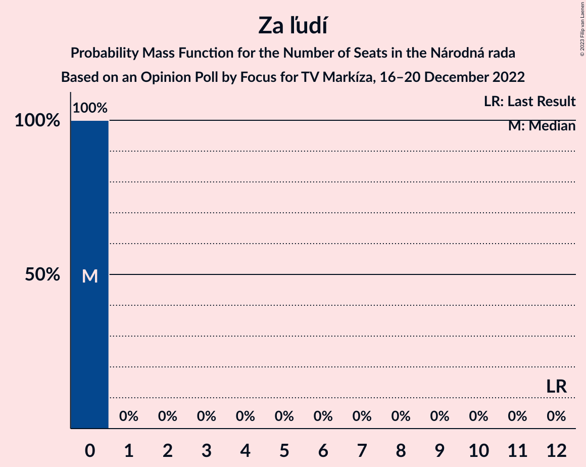

# Opinion Poll by Focus for TV Markíza, 16–20 December 2022

<a href="#voting-intentions">Voting Intentions</a> | <a href="#seats">Seats</a> | <a href="#coalitions">Coalitions</a> | <a href="#technical-information">Technical Information</a>

## Voting Intentions

### Confidence Intervals

| Party | Last Result | Poll Result | 80% Confidence Interval | 90% Confidence Interval | 95% Confidence Interval | 99% Confidence Interval |
|:-----:|:-----------:|:-----------:|:-----------------------:|:-----------------------:|:-----------------------:|:-----------------------:|
| HLAS–sociálna demokracia | 0.0% | 19.0% | 17.6–20.5% |17.2–20.9% |16.8–21.3% |16.2–22.1% |
| SMER–sociálna demokracia | 18.3% | 16.6% | 15.3–18.1% |14.9–18.5% |14.6–18.9% |14.0–19.6% |
| Progresívne Slovensko | 7.0% | 12.8% | 11.6–14.1% |11.3–14.5% |11.0–14.8% |10.5–15.5% |
| SME RODINA | 8.2% | 8.2% | 7.3–9.3% |7.0–9.7% |6.8–9.9% |6.4–10.5% |
| OBYČAJNÍ ĽUDIA a nezávislé osobnosti | 25.0% | 7.4% | 6.5–8.4% |6.2–8.7% |6.0–9.0% |5.6–9.6% |
| REPUBLIKA | 0.0% | 6.9% | 6.0–7.9% |5.8–8.2% |5.5–8.5% |5.2–9.0% |
| Kresťanskodemokratické hnutie | 4.6% | 5.9% | 5.1–6.9% |4.9–7.2% |4.7–7.4% |4.4–7.9% |
| Sloboda a Solidarita | 6.2% | 5.6% | 4.8–6.6% |4.6–6.8% |4.4–7.1% |4.1–7.5% |
| Strana maďarskej koalície–Magyar Koalíció Pártja | 3.9% | 4.4% | 3.7–5.3% |3.5–5.5% |3.4–5.7% |3.1–6.2% |
| Slovenská národná strana | 3.2% | 3.4% | 2.8–4.2% |2.6–4.4% |2.5–4.6% |2.2–5.0% |
| Kotleba–Ľudová strana Naše Slovensko | 8.0% | 3.1% | 2.6–3.9% |2.4–4.1% |2.3–4.3% |2.0–4.7% |
| Za ľudí | 5.8% | 2.2% | 1.7–2.9% |1.6–3.0% |1.5–3.2% |1.3–3.6% |
| Dobrá voľba | 3.1% | 1.1% | 0.8–1.6% |0.7–1.8% |0.6–1.9% |0.5–2.1% |
| SPOLU–Občianska Demokracia | 7.0% | 1.0% | 0.7–1.5% |0.6–1.6% |0.6–1.8% |0.5–2.0% |

*Note:* The poll result column reflects the actual value used in the calculations. Published results may vary slightly, and in addition be rounded to fewer digits.

## Seats

### Confidence Intervals

| Party | Last Result | Median | 80% Confidence Interval | 90% Confidence Interval | 95% Confidence Interval | 99% Confidence Interval |
|:-----:|:-----------:|:------:|:-----------------------:|:-----------------------:|:-----------------------:|:-----------------------:|
| <a href="#hlas–sociálna-demokracia">HLAS–sociálna demokracia</a> | 0 | 32 | 32–37 |31–39 |30–39 |30–40 |
| <a href="#smer–sociálna-demokracia">SMER–sociálna demokracia</a> | 38 | 29 | 27–34 |27–34 |27–34 |25–35 |
| <a href="#progresívne-slovensko">Progresívne Slovensko</a> | 0 | 25 | 21–27 |19–27 |19–27 |19–29 |
| <a href="#sme-rodina">SME RODINA</a> | 17 | 13 | 13–16 |12–16 |12–16 |12–18 |
| <a href="#obyčajní-ľudia-a-nezávislé-osobnosti">OBYČAJNÍ ĽUDIA a nezávislé osobnosti</a> | 53 | 14 | 11–15 |11–15 |10–15 |10–18 |
| <a href="#republika">REPUBLIKA</a> | 0 | 11 | 10–15 |10–15 |10–15 |10–16 |
| <a href="#kresťanskodemokratické-hnutie">Kresťanskodemokratické hnutie</a> | 0 | 10 | 9–13 |0–13 |0–13 |0–14 |
| <a href="#sloboda-a-solidarita">Sloboda a Solidarita</a> | 13 | 10 | 9–11 |0–12 |0–12 |0–12 |
| <a href="#strana-maďarskej-koalície–magyar-koalíció-pártja">Strana maďarskej koalície–Magyar Koalíció Pártja</a> | 0 | 9 | 0–9 |0–10 |0–10 |0–10 |
| <a href="#slovenská-národná-strana">Slovenská národná strana</a> | 0 | 0 | 0 |0 |0 |0 |
| <a href="#kotleba–ľudová-strana-naše-slovensko">Kotleba–Ľudová strana Naše Slovensko</a> | 17 | 0 | 0 |0 |0 |0 |
| <a href="#za-ľudí">Za ľudí</a> | 12 | 0 | 0 |0 |0 |0 |
| <a href="#dobrá-voľba">Dobrá voľba</a> | 0 | 0 | 0 |0 |0 |0 |
| <a href="#spolu–občianska-demokracia">SPOLU–Občianska Demokracia</a> | 0 | 0 | 0 |0 |0 |0 |

### HLAS–sociálna demokracia

*For a full overview of the results for this party, see the [HLAS–sociálna demokracia](party-hlas–sociálnademokracia.html) page.*

| Number of Seats | Probability | Accumulated | Special Marks |
|:---------------:|:-----------:|:-----------:|:-------------:|
| 0 | 0% | 100% | Last Result |
| 1 | 0% | 100% |  |
| 2 | 0% | 100% |  |
| 3 | 0% | 100% |  |
| 4 | 0% | 100% |  |
| 5 | 0% | 100% |  |
| 6 | 0% | 100% |  |
| 7 | 0% | 100% |  |
| 8 | 0% | 100% |  |
| 9 | 0% | 100% |  |
| 10 | 0% | 100% |  |
| 11 | 0% | 100% |  |
| 12 | 0% | 100% |  |
| 13 | 0% | 100% |  |
| 14 | 0% | 100% |  |
| 15 | 0% | 100% |  |
| 16 | 0% | 100% |  |
| 17 | 0% | 100% |  |
| 18 | 0% | 100% |  |
| 19 | 0% | 100% |  |
| 20 | 0% | 100% |  |
| 21 | 0% | 100% |  |
| 22 | 0% | 100% |  |
| 23 | 0% | 100% |  |
| 24 | 0% | 100% |  |
| 25 | 0% | 100% |  |
| 26 | 0% | 100% |  |
| 27 | 0% | 100% |  |
| 28 | 0% | 100% |  |
| 29 | 0.1% | 99.9% |  |
| 30 | 3% | 99.8% |  |
| 31 | 5% | 97% |  |
| 32 | 43% | 92% | Median |
| 33 | 12% | 50% |  |
| 34 | 10% | 38% |  |
| 35 | 0.7% | 28% |  |
| 36 | 15% | 28% |  |
| 37 | 4% | 13% |  |
| 38 | 0.3% | 9% |  |
| 39 | 8% | 9% |  |
| 40 | 0.3% | 0.7% |  |
| 41 | 0.2% | 0.4% |  |
| 42 | 0% | 0.2% |  |
| 43 | 0.1% | 0.2% |  |
| 44 | 0.1% | 0.1% |  |
| 45 | 0% | 0% |  |

### SMER–sociálna demokracia

*For a full overview of the results for this party, see the [SMER–sociálna demokracia](party-smer–sociálnademokracia.html) page.*

| Number of Seats | Probability | Accumulated | Special Marks |
|:---------------:|:-----------:|:-----------:|:-------------:|
| 25 | 0.8% | 100% |  |
| 26 | 0.3% | 99.2% |  |
| 27 | 43% | 98.8% |  |
| 28 | 0.4% | 56% |  |
| 29 | 15% | 56% | Median |
| 30 | 12% | 41% |  |
| 31 | 9% | 29% |  |
| 32 | 8% | 20% |  |
| 33 | 1.2% | 12% |  |
| 34 | 10% | 11% |  |
| 35 | 0.3% | 0.7% |  |
| 36 | 0.2% | 0.4% |  |
| 37 | 0.1% | 0.3% |  |
| 38 | 0.1% | 0.2% | Last Result |
| 39 | 0% | 0.1% |  |
| 40 | 0% | 0% |  |

### Progresívne Slovensko

*For a full overview of the results for this party, see the [Progresívne Slovensko](party-progresívneslovensko.html) page.*

| Number of Seats | Probability | Accumulated | Special Marks |
|:---------------:|:-----------:|:-----------:|:-------------:|
| 0 | 0% | 100% | Last Result |
| 1 | 0% | 100% |  |
| 2 | 0% | 100% |  |
| 3 | 0% | 100% |  |
| 4 | 0% | 100% |  |
| 5 | 0% | 100% |  |
| 6 | 0% | 100% |  |
| 7 | 0% | 100% |  |
| 8 | 0% | 100% |  |
| 9 | 0% | 100% |  |
| 10 | 0% | 100% |  |
| 11 | 0% | 100% |  |
| 12 | 0% | 100% |  |
| 13 | 0% | 100% |  |
| 14 | 0% | 100% |  |
| 15 | 0% | 100% |  |
| 16 | 0% | 100% |  |
| 17 | 0% | 100% |  |
| 18 | 0.1% | 100% |  |
| 19 | 9% | 99.9% |  |
| 20 | 0.8% | 91% |  |
| 21 | 14% | 90% |  |
| 22 | 12% | 77% |  |
| 23 | 6% | 65% |  |
| 24 | 0.4% | 59% |  |
| 25 | 45% | 58% | Median |
| 26 | 4% | 14% |  |
| 27 | 9% | 10% |  |
| 28 | 0.1% | 0.6% |  |
| 29 | 0.1% | 0.5% |  |
| 30 | 0.3% | 0.5% |  |
| 31 | 0.2% | 0.2% |  |
| 32 | 0% | 0% |  |

### SME RODINA

*For a full overview of the results for this party, see the [SME RODINA](party-smerodina.html) page.*

| Number of Seats | Probability | Accumulated | Special Marks |
|:---------------:|:-----------:|:-----------:|:-------------:|
| 11 | 0.2% | 100% |  |
| 12 | 9% | 99.8% |  |
| 13 | 42% | 91% | Median |
| 14 | 15% | 49% |  |
| 15 | 0.8% | 34% |  |
| 16 | 31% | 33% |  |
| 17 | 1.0% | 2% | Last Result |
| 18 | 0.9% | 1.2% |  |
| 19 | 0.1% | 0.2% |  |
| 20 | 0.1% | 0.1% |  |
| 21 | 0% | 0% |  |

### OBYČAJNÍ ĽUDIA a nezávislé osobnosti

*For a full overview of the results for this party, see the [OBYČAJNÍ ĽUDIA a nezávislé osobnosti](party-obyčajníľudiaanezávisléosobnosti.html) page.*

| Number of Seats | Probability | Accumulated | Special Marks |
|:---------------:|:-----------:|:-----------:|:-------------:|
| 10 | 4% | 100% |  |
| 11 | 10% | 96% |  |
| 12 | 1.2% | 86% |  |
| 13 | 6% | 85% |  |
| 14 | 61% | 79% | Median |
| 15 | 17% | 18% |  |
| 16 | 0.3% | 1.2% |  |
| 17 | 0.2% | 0.9% |  |
| 18 | 0.4% | 0.6% |  |
| 19 | 0.1% | 0.2% |  |
| 20 | 0.2% | 0.2% |  |
| 21 | 0% | 0% |  |
| 22 | 0% | 0% |  |
| 23 | 0% | 0% |  |
| 24 | 0% | 0% |  |
| 25 | 0% | 0% |  |
| 26 | 0% | 0% |  |
| 27 | 0% | 0% |  |
| 28 | 0% | 0% |  |
| 29 | 0% | 0% |  |
| 30 | 0% | 0% |  |
| 31 | 0% | 0% |  |
| 32 | 0% | 0% |  |
| 33 | 0% | 0% |  |
| 34 | 0% | 0% |  |
| 35 | 0% | 0% |  |
| 36 | 0% | 0% |  |
| 37 | 0% | 0% |  |
| 38 | 0% | 0% |  |
| 39 | 0% | 0% |  |
| 40 | 0% | 0% |  |
| 41 | 0% | 0% |  |
| 42 | 0% | 0% |  |
| 43 | 0% | 0% |  |
| 44 | 0% | 0% |  |
| 45 | 0% | 0% |  |
| 46 | 0% | 0% |  |
| 47 | 0% | 0% |  |
| 48 | 0% | 0% |  |
| 49 | 0% | 0% |  |
| 50 | 0% | 0% |  |
| 51 | 0% | 0% |  |
| 52 | 0% | 0% |  |
| 53 | 0% | 0% | Last Result |

### REPUBLIKA

*For a full overview of the results for this party, see the [REPUBLIKA](party-republika.html) page.*

| Number of Seats | Probability | Accumulated | Special Marks |
|:---------------:|:-----------:|:-----------:|:-------------:|
| 0 | 0% | 100% | Last Result |
| 1 | 0% | 100% |  |
| 2 | 0% | 100% |  |
| 3 | 0% | 100% |  |
| 4 | 0% | 100% |  |
| 5 | 0% | 100% |  |
| 6 | 0% | 100% |  |
| 7 | 0% | 100% |  |
| 8 | 0% | 100% |  |
| 9 | 0.1% | 100% |  |
| 10 | 44% | 99.9% |  |
| 11 | 18% | 56% | Median |
| 12 | 9% | 38% |  |
| 13 | 8% | 29% |  |
| 14 | 8% | 21% |  |
| 15 | 11% | 12% |  |
| 16 | 0.9% | 1.3% |  |
| 17 | 0.3% | 0.4% |  |
| 18 | 0.1% | 0.1% |  |
| 19 | 0% | 0% |  |

### Kresťanskodemokratické hnutie

*For a full overview of the results for this party, see the [Kresťanskodemokratické hnutie](party-kresťanskodemokratickéhnutie.html) page.*

| Number of Seats | Probability | Accumulated | Special Marks |
|:---------------:|:-----------:|:-----------:|:-------------:|
| 0 | 10% | 100% | Last Result |
| 1 | 0% | 90% |  |
| 2 | 0% | 90% |  |
| 3 | 0% | 90% |  |
| 4 | 0% | 90% |  |
| 5 | 0% | 90% |  |
| 6 | 0% | 90% |  |
| 7 | 0% | 90% |  |
| 8 | 0% | 90% |  |
| 9 | 2% | 90% |  |
| 10 | 45% | 88% | Median |
| 11 | 15% | 43% |  |
| 12 | 16% | 27% |  |
| 13 | 10% | 11% |  |
| 14 | 0.6% | 0.6% |  |
| 15 | 0% | 0% |  |

### Sloboda a Solidarita

*For a full overview of the results for this party, see the [Sloboda a Solidarita](party-slobodaasolidarita.html) page.*

| Number of Seats | Probability | Accumulated | Special Marks |
|:---------------:|:-----------:|:-----------:|:-------------:|
| 0 | 7% | 100% |  |
| 1 | 0% | 93% |  |
| 2 | 0% | 93% |  |
| 3 | 0% | 93% |  |
| 4 | 0% | 93% |  |
| 5 | 0% | 93% |  |
| 6 | 0% | 93% |  |
| 7 | 0% | 93% |  |
| 8 | 0% | 93% |  |
| 9 | 4% | 93% |  |
| 10 | 77% | 89% | Median |
| 11 | 5% | 13% |  |
| 12 | 7% | 8% |  |
| 13 | 0.3% | 0.5% | Last Result |
| 14 | 0% | 0.1% |  |
| 15 | 0.1% | 0.1% |  |
| 16 | 0% | 0% |  |

### Strana maďarskej koalície–Magyar Koalíció Pártja

*For a full overview of the results for this party, see the [Strana maďarskej koalície–Magyar Koalíció Pártja](party-stranamaďarskejkoalície–magyarkoalíciópártja.html) page.*

| Number of Seats | Probability | Accumulated | Special Marks |
|:---------------:|:-----------:|:-----------:|:-------------:|
| 0 | 48% | 100% | Last Result |
| 1 | 0% | 52% |  |
| 2 | 0% | 52% |  |
| 3 | 0% | 52% |  |
| 4 | 0% | 52% |  |
| 5 | 0% | 52% |  |
| 6 | 0% | 52% |  |
| 7 | 0% | 52% |  |
| 8 | 0% | 52% |  |
| 9 | 47% | 52% | Median |
| 10 | 6% | 6% |  |
| 11 | 0.1% | 0.1% |  |
| 12 | 0% | 0% |  |

### Slovenská národná strana

*For a full overview of the results for this party, see the [Slovenská národná strana](party-slovenskánárodnástrana.html) page.*

| Number of Seats | Probability | Accumulated | Special Marks |
|:---------------:|:-----------:|:-----------:|:-------------:|
| 0 | 99.9% | 100% | Last Result, Median |
| 1 | 0% | 0.1% |  |
| 2 | 0% | 0.1% |  |
| 3 | 0% | 0.1% |  |
| 4 | 0% | 0.1% |  |
| 5 | 0% | 0.1% |  |
| 6 | 0% | 0.1% |  |
| 7 | 0% | 0.1% |  |
| 8 | 0% | 0.1% |  |
| 9 | 0.1% | 0.1% |  |
| 10 | 0% | 0% |  |

### Kotleba–Ľudová strana Naše Slovensko

*For a full overview of the results for this party, see the [Kotleba–Ľudová strana Naše Slovensko](party-kotleba–ľudovástrananašeslovensko.html) page.*

| Number of Seats | Probability | Accumulated | Special Marks |
|:---------------:|:-----------:|:-----------:|:-------------:|
| 0 | 100% | 100% | Median |
| 1 | 0% | 0% |  |
| 2 | 0% | 0% |  |
| 3 | 0% | 0% |  |
| 4 | 0% | 0% |  |
| 5 | 0% | 0% |  |
| 6 | 0% | 0% |  |
| 7 | 0% | 0% |  |
| 8 | 0% | 0% |  |
| 9 | 0% | 0% |  |
| 10 | 0% | 0% |  |
| 11 | 0% | 0% |  |
| 12 | 0% | 0% |  |
| 13 | 0% | 0% |  |
| 14 | 0% | 0% |  |
| 15 | 0% | 0% |  |
| 16 | 0% | 0% |  |
| 17 | 0% | 0% | Last Result |

### Za ľudí

*For a full overview of the results for this party, see the [Za ľudí](party-zaľudí.html) page.*

| Number of Seats | Probability | Accumulated | Special Marks |
|:---------------:|:-----------:|:-----------:|:-------------:|
| 0 | 100% | 100% | Median |
| 1 | 0% | 0% |  |
| 2 | 0% | 0% |  |
| 3 | 0% | 0% |  |
| 4 | 0% | 0% |  |
| 5 | 0% | 0% |  |
| 6 | 0% | 0% |  |
| 7 | 0% | 0% |  |
| 8 | 0% | 0% |  |
| 9 | 0% | 0% |  |
| 10 | 0% | 0% |  |
| 11 | 0% | 0% |  |
| 12 | 0% | 0% | Last Result |

### Dobrá voľba

*For a full overview of the results for this party, see the [Dobrá voľba](party-dobrávoľba.html) page.*

| Number of Seats | Probability | Accumulated | Special Marks |
|:---------------:|:-----------:|:-----------:|:-------------:|
| 0 | 100% | 100% | Last Result, Median |

### SPOLU–Občianska Demokracia

*For a full overview of the results for this party, see the [SPOLU–Občianska Demokracia](party-spolu–občianskademokracia.html) page.*

| Number of Seats | Probability | Accumulated | Special Marks |
|:---------------:|:-----------:|:-----------:|:-------------:|
| 0 | 100% | 100% | Last Result, Median |

## Coalitions

### Confidence Intervals

| Coalition | Last Result | Median | Majority? | 80% Confidence Interval | 90% Confidence Interval | 95% Confidence Interval | 99% Confidence Interval |
|:---------:|:-----------:|:------:|:---------:|:-----------------------:|:-----------------------:|:-----------------------:|:-----------------------:|
| HLAS–sociálna demokracia – SMER–sociálna demokracia – SME RODINA – Slovenská národná strana – Kotleba–Ľudová strana Naše Slovensko | 72 | 77 | 58% | 72–83 | 72–83 | 72–83 | 72–89 |
| HLAS–sociálna demokracia – SMER–sociálna demokracia – SME RODINA | 55 | 77 | 57% | 72–83 | 72–83 | 72–83 | 72–89 |
| HLAS–sociálna demokracia – SMER–sociálna demokracia – SME RODINA – Slovenská národná strana | 55 | 77 | 58% | 72–83 | 72–83 | 72–83 | 72–89 |
| HLAS–sociálna demokracia – SMER–sociálna demokracia – Slovenská národná strana | 38 | 63 | 0.3% | 59–67 | 59–68 | 59–68 | 59–73 |
| HLAS–sociálna demokracia – SME RODINA – Slovenská národná strana – Kotleba–Ľudová strana Naše Slovensko | 34 | 47 | 0% | 45–52 | 45–53 | 45–53 | 44–57 |
| HLAS–sociálna demokracia – SME RODINA | 17 | 47 | 0% | 45–52 | 45–53 | 45–53 | 44–57 |
| HLAS–sociálna demokracia – SME RODINA – Slovenská národná strana | 17 | 47 | 0% | 45–52 | 45–53 | 45–53 | 44–57 |
| SMER–sociálna demokracia – SME RODINA – Slovenská národná strana – Kotleba–Ľudová strana Naše Slovensko | 72 | 42 | 0% | 40–50 | 40–50 | 40–50 | 40–52 |
| SMER–sociálna demokracia – SME RODINA | 55 | 42 | 0% | 40–50 | 40–50 | 40–50 | 40–52 |
| SMER–sociálna demokracia – SME RODINA – Slovenská národná strana | 55 | 42 | 0% | 40–50 | 40–50 | 40–50 | 40–52 |
| HLAS–sociálna demokracia – Slovenská národná strana | 0 | 32 | 0% | 32–37 | 31–39 | 30–39 | 30–40 |
| SMER–sociálna demokracia | 38 | 29 | 0% | 27–34 | 27–34 | 27–34 | 25–35 |
| SMER–sociálna demokracia – Slovenská národná strana | 38 | 29 | 0% | 27–34 | 27–34 | 27–34 | 25–36 |

### HLAS–sociálna demokracia – SMER–sociálna demokracia – SME RODINA – Slovenská národná strana – Kotleba–Ľudová strana Naše Slovensko

| Number of Seats | Probability | Accumulated | Special Marks |
|:---------------:|:-----------:|:-----------:|:-------------:|
| 70 | 0% | 100% |  |
| 71 | 0.1% | 99.9% |  |
| 72 | 41% | 99.8% | Last Result |
| 73 | 0.2% | 59% |  |
| 74 | 0.5% | 58% | Median |
| 75 | 0.3% | 58% |  |
| 76 | 0.8% | 58% | Majority |
| 77 | 7% | 57% |  |
| 78 | 11% | 50% |  |
| 79 | 3% | 39% |  |
| 80 | 7% | 36% |  |
| 81 | 0.3% | 29% |  |
| 82 | 8% | 28% |  |
| 83 | 19% | 21% |  |
| 84 | 0.2% | 2% |  |
| 85 | 0.1% | 1.3% |  |
| 86 | 0.2% | 1.2% |  |
| 87 | 0.2% | 0.9% |  |
| 88 | 0.2% | 0.7% |  |
| 89 | 0.1% | 0.5% |  |
| 90 | 0% | 0.4% |  |
| 91 | 0.1% | 0.4% |  |
| 92 | 0% | 0.3% |  |
| 93 | 0.2% | 0.3% |  |
| 94 | 0% | 0.1% |  |
| 95 | 0% | 0.1% |  |
| 96 | 0% | 0.1% |  |
| 97 | 0.1% | 0.1% |  |
| 98 | 0% | 0% |  |

### HLAS–sociálna demokracia – SMER–sociálna demokracia – SME RODINA

| Number of Seats | Probability | Accumulated | Special Marks |
|:---------------:|:-----------:|:-----------:|:-------------:|
| 55 | 0% | 100% | Last Result |
| 56 | 0% | 100% |  |
| 57 | 0% | 100% |  |
| 58 | 0% | 100% |  |
| 59 | 0% | 100% |  |
| 60 | 0% | 100% |  |
| 61 | 0% | 100% |  |
| 62 | 0% | 100% |  |
| 63 | 0% | 100% |  |
| 64 | 0% | 100% |  |
| 65 | 0% | 100% |  |
| 66 | 0% | 100% |  |
| 67 | 0% | 100% |  |
| 68 | 0% | 100% |  |
| 69 | 0% | 100% |  |
| 70 | 0.1% | 100% |  |
| 71 | 0.1% | 99.9% |  |
| 72 | 41% | 99.8% |  |
| 73 | 0.2% | 59% |  |
| 74 | 0.5% | 58% | Median |
| 75 | 0.3% | 58% |  |
| 76 | 0.9% | 57% | Majority |
| 77 | 7% | 57% |  |
| 78 | 11% | 50% |  |
| 79 | 3% | 39% |  |
| 80 | 7% | 35% |  |
| 81 | 0.3% | 28% |  |
| 82 | 8% | 28% |  |
| 83 | 19% | 20% |  |
| 84 | 0.2% | 1.4% |  |
| 85 | 0.1% | 1.2% |  |
| 86 | 0.2% | 1.1% |  |
| 87 | 0.2% | 0.9% |  |
| 88 | 0.1% | 0.7% |  |
| 89 | 0.1% | 0.5% |  |
| 90 | 0% | 0.4% |  |
| 91 | 0.1% | 0.4% |  |
| 92 | 0% | 0.3% |  |
| 93 | 0.2% | 0.3% |  |
| 94 | 0% | 0.1% |  |
| 95 | 0% | 0.1% |  |
| 96 | 0% | 0.1% |  |
| 97 | 0.1% | 0.1% |  |
| 98 | 0% | 0% |  |

### HLAS–sociálna demokracia – SMER–sociálna demokracia – SME RODINA – Slovenská národná strana

| Number of Seats | Probability | Accumulated | Special Marks |
|:---------------:|:-----------:|:-----------:|:-------------:|
| 55 | 0% | 100% | Last Result |
| 56 | 0% | 100% |  |
| 57 | 0% | 100% |  |
| 58 | 0% | 100% |  |
| 59 | 0% | 100% |  |
| 60 | 0% | 100% |  |
| 61 | 0% | 100% |  |
| 62 | 0% | 100% |  |
| 63 | 0% | 100% |  |
| 64 | 0% | 100% |  |
| 65 | 0% | 100% |  |
| 66 | 0% | 100% |  |
| 67 | 0% | 100% |  |
| 68 | 0% | 100% |  |
| 69 | 0% | 100% |  |
| 70 | 0% | 100% |  |
| 71 | 0.1% | 99.9% |  |
| 72 | 41% | 99.8% |  |
| 73 | 0.2% | 59% |  |
| 74 | 0.5% | 58% | Median |
| 75 | 0.3% | 58% |  |
| 76 | 0.8% | 58% | Majority |
| 77 | 7% | 57% |  |
| 78 | 11% | 50% |  |
| 79 | 3% | 39% |  |
| 80 | 7% | 36% |  |
| 81 | 0.3% | 29% |  |
| 82 | 8% | 28% |  |
| 83 | 19% | 21% |  |
| 84 | 0.2% | 2% |  |
| 85 | 0.1% | 1.3% |  |
| 86 | 0.2% | 1.1% |  |
| 87 | 0.2% | 0.9% |  |
| 88 | 0.2% | 0.7% |  |
| 89 | 0.1% | 0.5% |  |
| 90 | 0% | 0.4% |  |
| 91 | 0.1% | 0.4% |  |
| 92 | 0% | 0.3% |  |
| 93 | 0.2% | 0.3% |  |
| 94 | 0% | 0.1% |  |
| 95 | 0% | 0.1% |  |
| 96 | 0% | 0.1% |  |
| 97 | 0.1% | 0.1% |  |
| 98 | 0% | 0% |  |

### HLAS–sociálna demokracia – SMER–sociálna demokracia – Slovenská národná strana

| Number of Seats | Probability | Accumulated | Special Marks |
|:---------------:|:-----------:|:-----------:|:-------------:|
| 38 | 0% | 100% | Last Result |
| 39 | 0% | 100% |  |
| 40 | 0% | 100% |  |
| 41 | 0% | 100% |  |
| 42 | 0% | 100% |  |
| 43 | 0% | 100% |  |
| 44 | 0% | 100% |  |
| 45 | 0% | 100% |  |
| 46 | 0% | 100% |  |
| 47 | 0% | 100% |  |
| 48 | 0% | 100% |  |
| 49 | 0% | 100% |  |
| 50 | 0% | 100% |  |
| 51 | 0% | 100% |  |
| 52 | 0% | 100% |  |
| 53 | 0% | 100% |  |
| 54 | 0% | 100% |  |
| 55 | 0% | 100% |  |
| 56 | 0% | 100% |  |
| 57 | 0.2% | 99.9% |  |
| 58 | 0.2% | 99.8% |  |
| 59 | 42% | 99.6% |  |
| 60 | 0.7% | 57% |  |
| 61 | 1.2% | 57% | Median |
| 62 | 2% | 55% |  |
| 63 | 8% | 53% |  |
| 64 | 6% | 46% |  |
| 65 | 1.3% | 39% |  |
| 66 | 9% | 38% |  |
| 67 | 19% | 29% |  |
| 68 | 8% | 10% |  |
| 69 | 0.2% | 1.5% |  |
| 70 | 0.5% | 1.3% |  |
| 71 | 0% | 0.8% |  |
| 72 | 0.1% | 0.8% |  |
| 73 | 0.2% | 0.7% |  |
| 74 | 0.1% | 0.5% |  |
| 75 | 0.1% | 0.4% |  |
| 76 | 0.2% | 0.3% | Majority |
| 77 | 0% | 0.1% |  |
| 78 | 0% | 0.1% |  |
| 79 | 0% | 0.1% |  |
| 80 | 0.1% | 0.1% |  |
| 81 | 0% | 0% |  |

### HLAS–sociálna demokracia – SME RODINA – Slovenská národná strana – Kotleba–Ľudová strana Naše Slovensko

| Number of Seats | Probability | Accumulated | Special Marks |
|:---------------:|:-----------:|:-----------:|:-------------:|
| 34 | 0% | 100% | Last Result |
| 35 | 0% | 100% |  |
| 36 | 0% | 100% |  |
| 37 | 0% | 100% |  |
| 38 | 0% | 100% |  |
| 39 | 0% | 100% |  |
| 40 | 0% | 100% |  |
| 41 | 0% | 100% |  |
| 42 | 0% | 100% |  |
| 43 | 0.1% | 100% |  |
| 44 | 1.1% | 99.8% |  |
| 45 | 43% | 98.7% | Median |
| 46 | 2% | 56% |  |
| 47 | 3% | 53% |  |
| 48 | 9% | 50% |  |
| 49 | 14% | 41% |  |
| 50 | 8% | 27% |  |
| 51 | 0.4% | 19% |  |
| 52 | 10% | 19% |  |
| 53 | 8% | 9% |  |
| 54 | 0.1% | 1.1% |  |
| 55 | 0.2% | 0.9% |  |
| 56 | 0.1% | 0.7% |  |
| 57 | 0% | 0.5% |  |
| 58 | 0.3% | 0.5% |  |
| 59 | 0% | 0.2% |  |
| 60 | 0% | 0.1% |  |
| 61 | 0.1% | 0.1% |  |
| 62 | 0% | 0% |  |

### HLAS–sociálna demokracia – SME RODINA

| Number of Seats | Probability | Accumulated | Special Marks |
|:---------------:|:-----------:|:-----------:|:-------------:|
| 17 | 0% | 100% | Last Result |
| 18 | 0% | 100% |  |
| 19 | 0% | 100% |  |
| 20 | 0% | 100% |  |
| 21 | 0% | 100% |  |
| 22 | 0% | 100% |  |
| 23 | 0% | 100% |  |
| 24 | 0% | 100% |  |
| 25 | 0% | 100% |  |
| 26 | 0% | 100% |  |
| 27 | 0% | 100% |  |
| 28 | 0% | 100% |  |
| 29 | 0% | 100% |  |
| 30 | 0% | 100% |  |
| 31 | 0% | 100% |  |
| 32 | 0% | 100% |  |
| 33 | 0% | 100% |  |
| 34 | 0% | 100% |  |
| 35 | 0% | 100% |  |
| 36 | 0% | 100% |  |
| 37 | 0% | 100% |  |
| 38 | 0% | 100% |  |
| 39 | 0% | 100% |  |
| 40 | 0% | 100% |  |
| 41 | 0% | 100% |  |
| 42 | 0.1% | 100% |  |
| 43 | 0.1% | 99.9% |  |
| 44 | 1.1% | 99.8% |  |
| 45 | 43% | 98.7% | Median |
| 46 | 2% | 55% |  |
| 47 | 3% | 53% |  |
| 48 | 9% | 50% |  |
| 49 | 14% | 41% |  |
| 50 | 8% | 27% |  |
| 51 | 0.4% | 19% |  |
| 52 | 10% | 19% |  |
| 53 | 8% | 9% |  |
| 54 | 0.1% | 1.0% |  |
| 55 | 0.2% | 0.8% |  |
| 56 | 0.1% | 0.6% |  |
| 57 | 0% | 0.5% |  |
| 58 | 0.3% | 0.5% |  |
| 59 | 0% | 0.2% |  |
| 60 | 0% | 0.1% |  |
| 61 | 0.1% | 0.1% |  |
| 62 | 0% | 0% |  |

### HLAS–sociálna demokracia – SME RODINA – Slovenská národná strana

| Number of Seats | Probability | Accumulated | Special Marks |
|:---------------:|:-----------:|:-----------:|:-------------:|
| 17 | 0% | 100% | Last Result |
| 18 | 0% | 100% |  |
| 19 | 0% | 100% |  |
| 20 | 0% | 100% |  |
| 21 | 0% | 100% |  |
| 22 | 0% | 100% |  |
| 23 | 0% | 100% |  |
| 24 | 0% | 100% |  |
| 25 | 0% | 100% |  |
| 26 | 0% | 100% |  |
| 27 | 0% | 100% |  |
| 28 | 0% | 100% |  |
| 29 | 0% | 100% |  |
| 30 | 0% | 100% |  |
| 31 | 0% | 100% |  |
| 32 | 0% | 100% |  |
| 33 | 0% | 100% |  |
| 34 | 0% | 100% |  |
| 35 | 0% | 100% |  |
| 36 | 0% | 100% |  |
| 37 | 0% | 100% |  |
| 38 | 0% | 100% |  |
| 39 | 0% | 100% |  |
| 40 | 0% | 100% |  |
| 41 | 0% | 100% |  |
| 42 | 0% | 100% |  |
| 43 | 0.1% | 100% |  |
| 44 | 1.1% | 99.8% |  |
| 45 | 43% | 98.7% | Median |
| 46 | 2% | 56% |  |
| 47 | 3% | 53% |  |
| 48 | 9% | 50% |  |
| 49 | 14% | 41% |  |
| 50 | 8% | 27% |  |
| 51 | 0.4% | 19% |  |
| 52 | 10% | 19% |  |
| 53 | 8% | 9% |  |
| 54 | 0.1% | 1.0% |  |
| 55 | 0.2% | 0.9% |  |
| 56 | 0.1% | 0.7% |  |
| 57 | 0% | 0.5% |  |
| 58 | 0.3% | 0.5% |  |
| 59 | 0% | 0.2% |  |
| 60 | 0% | 0.1% |  |
| 61 | 0.1% | 0.1% |  |
| 62 | 0% | 0% |  |

### SMER–sociálna demokracia – SME RODINA – Slovenská národná strana – Kotleba–Ľudová strana Naše Slovensko

| Number of Seats | Probability | Accumulated | Special Marks |
|:---------------:|:-----------:|:-----------:|:-------------:|
| 39 | 0.1% | 100% |  |
| 40 | 41% | 99.9% |  |
| 41 | 5% | 58% |  |
| 42 | 5% | 54% | Median |
| 43 | 11% | 48% |  |
| 44 | 0.2% | 37% |  |
| 45 | 1.4% | 37% |  |
| 46 | 9% | 35% |  |
| 47 | 10% | 26% |  |
| 48 | 4% | 15% |  |
| 49 | 0.3% | 11% |  |
| 50 | 10% | 11% |  |
| 51 | 0% | 0.7% |  |
| 52 | 0.3% | 0.7% |  |
| 53 | 0.2% | 0.4% |  |
| 54 | 0.1% | 0.2% |  |
| 55 | 0% | 0.1% |  |
| 56 | 0% | 0% |  |
| 57 | 0% | 0% |  |
| 58 | 0% | 0% |  |
| 59 | 0% | 0% |  |
| 60 | 0% | 0% |  |
| 61 | 0% | 0% |  |
| 62 | 0% | 0% |  |
| 63 | 0% | 0% |  |
| 64 | 0% | 0% |  |
| 65 | 0% | 0% |  |
| 66 | 0% | 0% |  |
| 67 | 0% | 0% |  |
| 68 | 0% | 0% |  |
| 69 | 0% | 0% |  |
| 70 | 0% | 0% |  |
| 71 | 0% | 0% |  |
| 72 | 0% | 0% | Last Result |

### SMER–sociálna demokracia – SME RODINA

| Number of Seats | Probability | Accumulated | Special Marks |
|:---------------:|:-----------:|:-----------:|:-------------:|
| 39 | 0.1% | 100% |  |
| 40 | 41% | 99.9% |  |
| 41 | 5% | 58% |  |
| 42 | 5% | 54% | Median |
| 43 | 11% | 48% |  |
| 44 | 0.3% | 37% |  |
| 45 | 1.5% | 36% |  |
| 46 | 9% | 35% |  |
| 47 | 10% | 26% |  |
| 48 | 4% | 15% |  |
| 49 | 0.3% | 11% |  |
| 50 | 10% | 11% |  |
| 51 | 0% | 0.6% |  |
| 52 | 0.3% | 0.6% |  |
| 53 | 0.2% | 0.3% |  |
| 54 | 0% | 0.1% |  |
| 55 | 0% | 0.1% | Last Result |
| 56 | 0% | 0% |  |

### SMER–sociálna demokracia – SME RODINA – Slovenská národná strana

| Number of Seats | Probability | Accumulated | Special Marks |
|:---------------:|:-----------:|:-----------:|:-------------:|
| 39 | 0.1% | 100% |  |
| 40 | 41% | 99.9% |  |
| 41 | 5% | 58% |  |
| 42 | 5% | 54% | Median |
| 43 | 11% | 48% |  |
| 44 | 0.2% | 37% |  |
| 45 | 1.4% | 37% |  |
| 46 | 9% | 35% |  |
| 47 | 10% | 26% |  |
| 48 | 4% | 15% |  |
| 49 | 0.3% | 11% |  |
| 50 | 10% | 11% |  |
| 51 | 0% | 0.7% |  |
| 52 | 0.3% | 0.7% |  |
| 53 | 0.2% | 0.4% |  |
| 54 | 0.1% | 0.1% |  |
| 55 | 0% | 0.1% | Last Result |
| 56 | 0% | 0% |  |

### HLAS–sociálna demokracia – Slovenská národná strana

| Number of Seats | Probability | Accumulated | Special Marks |
|:---------------:|:-----------:|:-----------:|:-------------:|
| 0 | 0% | 100% | Last Result |
| 1 | 0% | 100% |  |
| 2 | 0% | 100% |  |
| 3 | 0% | 100% |  |
| 4 | 0% | 100% |  |
| 5 | 0% | 100% |  |
| 6 | 0% | 100% |  |
| 7 | 0% | 100% |  |
| 8 | 0% | 100% |  |
| 9 | 0% | 100% |  |
| 10 | 0% | 100% |  |
| 11 | 0% | 100% |  |
| 12 | 0% | 100% |  |
| 13 | 0% | 100% |  |
| 14 | 0% | 100% |  |
| 15 | 0% | 100% |  |
| 16 | 0% | 100% |  |
| 17 | 0% | 100% |  |
| 18 | 0% | 100% |  |
| 19 | 0% | 100% |  |
| 20 | 0% | 100% |  |
| 21 | 0% | 100% |  |
| 22 | 0% | 100% |  |
| 23 | 0% | 100% |  |
| 24 | 0% | 100% |  |
| 25 | 0% | 100% |  |
| 26 | 0% | 100% |  |
| 27 | 0% | 100% |  |
| 28 | 0% | 100% |  |
| 29 | 0.1% | 99.9% |  |
| 30 | 3% | 99.9% |  |
| 31 | 5% | 97% |  |
| 32 | 43% | 92% | Median |
| 33 | 12% | 50% |  |
| 34 | 10% | 38% |  |
| 35 | 0.6% | 29% |  |
| 36 | 15% | 28% |  |
| 37 | 4% | 13% |  |
| 38 | 0.3% | 9% |  |
| 39 | 8% | 9% |  |
| 40 | 0.3% | 0.8% |  |
| 41 | 0.2% | 0.5% |  |
| 42 | 0% | 0.2% |  |
| 43 | 0.1% | 0.2% |  |
| 44 | 0.1% | 0.1% |  |
| 45 | 0% | 0% |  |

### SMER–sociálna demokracia

| Number of Seats | Probability | Accumulated | Special Marks |
|:---------------:|:-----------:|:-----------:|:-------------:|
| 25 | 0.8% | 100% |  |
| 26 | 0.3% | 99.2% |  |
| 27 | 43% | 98.8% |  |
| 28 | 0.4% | 56% |  |
| 29 | 15% | 56% | Median |
| 30 | 12% | 41% |  |
| 31 | 9% | 29% |  |
| 32 | 8% | 20% |  |
| 33 | 1.2% | 12% |  |
| 34 | 10% | 11% |  |
| 35 | 0.3% | 0.7% |  |
| 36 | 0.2% | 0.4% |  |
| 37 | 0.1% | 0.3% |  |
| 38 | 0.1% | 0.2% | Last Result |
| 39 | 0% | 0.1% |  |
| 40 | 0% | 0% |  |

### SMER–sociálna demokracia – Slovenská národná strana

| Number of Seats | Probability | Accumulated | Special Marks |
|:---------------:|:-----------:|:-----------:|:-------------:|
| 25 | 0.8% | 100% |  |
| 26 | 0.3% | 99.2% |  |
| 27 | 43% | 98.8% |  |
| 28 | 0.3% | 56% |  |
| 29 | 15% | 56% | Median |
| 30 | 12% | 41% |  |
| 31 | 9% | 29% |  |
| 32 | 8% | 20% |  |
| 33 | 1.2% | 12% |  |
| 34 | 10% | 11% |  |
| 35 | 0.3% | 0.8% |  |
| 36 | 0.2% | 0.6% |  |
| 37 | 0.1% | 0.4% |  |
| 38 | 0.1% | 0.3% | Last Result |
| 39 | 0.1% | 0.1% |  |
| 40 | 0% | 0% |  |

## Technical Information

### Opinion Poll

+ **Polling firm:** Focus
+ **Commissioner(s):** TV Markíza
+ **Fieldwork period:** 16–20 December 2022

### Calculations

+ **Sample size:** 1180
+ **Simulations done:** 1,048,576
+ **Error estimate:** 2.85%

