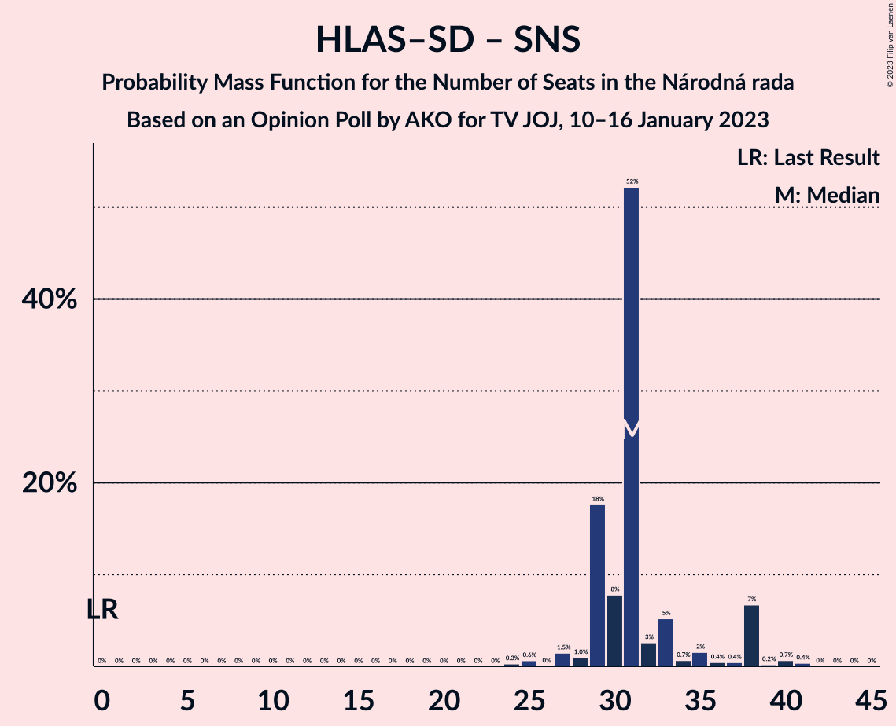

# Opinion Poll by AKO for TV JOJ, 10–16 January 2023

<a href="#voting-intentions">Voting Intentions</a> | <a href="#seats">Seats</a> | <a href="#coalitions">Coalitions</a> | <a href="#technical-information">Technical Information</a>

## Voting Intentions

### Confidence Intervals

| Party | Last Result | Poll Result | 80% Confidence Interval | 90% Confidence Interval | 95% Confidence Interval | 99% Confidence Interval |
|:-----:|:-----------:|:-----------:|:-----------------------:|:-----------------------:|:-----------------------:|:-----------------------:|
| HLAS–sociálna demokracia | 0.0% | 17.6% | 16.1–19.2% |15.7–19.7% |15.4–20.1% |14.7–20.9% |
| SMER–sociálna demokracia | 18.3% | 15.9% | 14.5–17.5% |14.1–17.9% |13.8–18.3% |13.1–19.1% |
| Progresívne Slovensko | 7.0% | 13.2% | 11.9–14.7% |11.6–15.1% |11.2–15.5% |10.7–16.2% |
| Sloboda a Solidarita | 6.2% | 9.1% | 8.0–10.4% |7.7–10.7% |7.5–11.1% |7.0–11.7% |
| OBYČAJNÍ ĽUDIA a nezávislé osobnosti | 25.0% | 8.7% | 7.7–10.0% |7.3–10.3% |7.1–10.6% |6.6–11.2% |
| REPUBLIKA | 0.0% | 7.3% | 6.3–8.5% |6.1–8.8% |5.8–9.1% |5.4–9.7% |
| SME RODINA | 8.2% | 6.8% | 5.9–7.9% |5.6–8.3% |5.4–8.5% |5.0–9.1% |
| Kresťanskodemokratické hnutie | 4.6% | 6.2% | 5.3–7.3% |5.1–7.6% |4.9–7.9% |4.5–8.4% |
| Slovenská národná strana | 3.2% | 4.1% | 3.4–5.0% |3.2–5.3% |3.0–5.5% |2.7–6.0% |
| Za ľudí | 5.8% | 2.9% | 2.3–3.7% |2.2–3.9% |2.0–4.1% |1.8–4.6% |
| Strana maďarskej koalície–Magyar Koalíció Pártja | 3.9% | 2.1% | 1.6–2.8% |1.5–3.0% |1.4–3.2% |1.2–3.6% |
| Kotleba–Ľudová strana Naše Slovensko | 8.0% | 1.9% | 1.4–2.6% |1.3–2.8% |1.2–3.0% |1.0–3.3% |
| Dobrá voľba | 3.1% | 0.6% | 0.4–1.1% |0.3–1.2% |0.3–1.3% |0.2–1.6% |
| SPOLU–Občianska Demokracia | 7.0% | 0.1% | 0.0–0.4% |0.0–0.5% |0.0–0.6% |0.0–0.7% |

*Note:* The poll result column reflects the actual value used in the calculations. Published results may vary slightly, and in addition be rounded to fewer digits.

## Seats

### Confidence Intervals

| Party | Last Result | Median | 80% Confidence Interval | 90% Confidence Interval | 95% Confidence Interval | 99% Confidence Interval |
|:-----:|:-----------:|:------:|:-----------------------:|:-----------------------:|:-----------------------:|:-----------------------:|
| <a href="#hlas–sociálna-demokracia">HLAS–sociálna demokracia</a> | 0 | 31 | 29–32 |29–33 |27–34 |25–35 |
| <a href="#smer–sociálna-demokracia">SMER–sociálna demokracia</a> | 38 | 30 | 25–34 |24–34 |24–34 |22–34 |
| <a href="#progresívne-slovensko">Progresívne Slovensko</a> | 0 | 27 | 19–27 |19–27 |19–27 |18–28 |
| <a href="#sloboda-a-solidarita">Sloboda a Solidarita</a> | 13 | 13 | 11–18 |11–18 |11–20 |11–20 |
| <a href="#obyčajní-ľudia-a-nezávislé-osobnosti">OBYČAJNÍ ĽUDIA a nezávislé osobnosti</a> | 53 | 15 | 13–16 |13–17 |13–17 |11–19 |
| <a href="#republika">REPUBLIKA</a> | 0 | 13 | 11–15 |11–15 |11–15 |10–17 |
| <a href="#sme-rodina">SME RODINA</a> | 17 | 12 | 12–13 |11–14 |10–16 |0–18 |
| <a href="#kresťanskodemokratické-hnutie">Kresťanskodemokratické hnutie</a> | 0 | 11 | 10–13 |10–13 |9–14 |0–15 |
| <a href="#slovenská-národná-strana">Slovenská národná strana</a> | 0 | 0 | 0 |0–9 |0–9 |0–11 |
| <a href="#za-ľudí">Za ľudí</a> | 12 | 0 | 0 |0 |0 |0 |
| <a href="#strana-maďarskej-koalície–magyar-koalíció-pártja">Strana maďarskej koalície–Magyar Koalíció Pártja</a> | 0 | 0 | 0 |0 |0 |0 |
| <a href="#kotleba–ľudová-strana-naše-slovensko">Kotleba–Ľudová strana Naše Slovensko</a> | 17 | 0 | 0 |0 |0 |0 |
| <a href="#dobrá-voľba">Dobrá voľba</a> | 0 | 0 | 0 |0 |0 |0 |
| <a href="#spolu–občianska-demokracia">SPOLU–Občianska Demokracia</a> | 0 | 0 | 0 |0 |0 |0 |

### HLAS–sociálna demokracia

*For a full overview of the results for this party, see the [HLAS–sociálna demokracia](party-hlas–sociálnademokracia.html) page.*

| Number of Seats | Probability | Accumulated | Special Marks |
|:---------------:|:-----------:|:-----------:|:-------------:|
| 0 | 0% | 100% | Last Result |
| 1 | 0% | 100% |  |
| 2 | 0% | 100% |  |
| 3 | 0% | 100% |  |
| 4 | 0% | 100% |  |
| 5 | 0% | 100% |  |
| 6 | 0% | 100% |  |
| 7 | 0% | 100% |  |
| 8 | 0% | 100% |  |
| 9 | 0% | 100% |  |
| 10 | 0% | 100% |  |
| 11 | 0% | 100% |  |
| 12 | 0% | 100% |  |
| 13 | 0% | 100% |  |
| 14 | 0% | 100% |  |
| 15 | 0% | 100% |  |
| 16 | 0% | 100% |  |
| 17 | 0% | 100% |  |
| 18 | 0% | 100% |  |
| 19 | 0% | 100% |  |
| 20 | 0% | 100% |  |
| 21 | 0% | 100% |  |
| 22 | 0% | 100% |  |
| 23 | 0% | 100% |  |
| 24 | 0.3% | 100% |  |
| 25 | 0.7% | 99.7% |  |
| 26 | 0.1% | 99.0% |  |
| 27 | 2% | 99.0% |  |
| 28 | 1.4% | 97% |  |
| 29 | 25% | 96% |  |
| 30 | 8% | 71% |  |
| 31 | 53% | 63% | Median |
| 32 | 3% | 10% |  |
| 33 | 5% | 8% |  |
| 34 | 0.7% | 3% |  |
| 35 | 2% | 2% |  |
| 36 | 0.3% | 0.3% |  |
| 37 | 0% | 0.1% |  |
| 38 | 0% | 0.1% |  |
| 39 | 0% | 0% |  |

### SMER–sociálna demokracia

*For a full overview of the results for this party, see the [SMER–sociálna demokracia](party-smer–sociálnademokracia.html) page.*

| Number of Seats | Probability | Accumulated | Special Marks |
|:---------------:|:-----------:|:-----------:|:-------------:|
| 21 | 0.3% | 100% |  |
| 22 | 0.8% | 99.7% |  |
| 23 | 0.2% | 98.9% |  |
| 24 | 8% | 98.6% |  |
| 25 | 1.3% | 91% |  |
| 26 | 4% | 90% |  |
| 27 | 6% | 85% |  |
| 28 | 9% | 80% |  |
| 29 | 6% | 71% |  |
| 30 | 51% | 65% | Median |
| 31 | 0.8% | 15% |  |
| 32 | 0.7% | 14% |  |
| 33 | 0.8% | 13% |  |
| 34 | 12% | 12% |  |
| 35 | 0.1% | 0.1% |  |
| 36 | 0% | 0% |  |
| 37 | 0% | 0% |  |
| 38 | 0% | 0% | Last Result |

### Progresívne Slovensko

*For a full overview of the results for this party, see the [Progresívne Slovensko](party-progresívneslovensko.html) page.*

| Number of Seats | Probability | Accumulated | Special Marks |
|:---------------:|:-----------:|:-----------:|:-------------:|
| 0 | 0% | 100% | Last Result |
| 1 | 0% | 100% |  |
| 2 | 0% | 100% |  |
| 3 | 0% | 100% |  |
| 4 | 0% | 100% |  |
| 5 | 0% | 100% |  |
| 6 | 0% | 100% |  |
| 7 | 0% | 100% |  |
| 8 | 0% | 100% |  |
| 9 | 0% | 100% |  |
| 10 | 0% | 100% |  |
| 11 | 0% | 100% |  |
| 12 | 0% | 100% |  |
| 13 | 0% | 100% |  |
| 14 | 0% | 100% |  |
| 15 | 0% | 100% |  |
| 16 | 0% | 100% |  |
| 17 | 0% | 100% |  |
| 18 | 0.8% | 100% |  |
| 19 | 10% | 99.2% |  |
| 20 | 2% | 89% |  |
| 21 | 3% | 87% |  |
| 22 | 5% | 84% |  |
| 23 | 18% | 79% |  |
| 24 | 2% | 61% |  |
| 25 | 5% | 59% |  |
| 26 | 2% | 54% |  |
| 27 | 50% | 51% | Median |
| 28 | 0.5% | 0.9% |  |
| 29 | 0.2% | 0.4% |  |
| 30 | 0.1% | 0.2% |  |
| 31 | 0% | 0.1% |  |
| 32 | 0.1% | 0.1% |  |
| 33 | 0% | 0% |  |

### Sloboda a Solidarita

*For a full overview of the results for this party, see the [Sloboda a Solidarita](party-slobodaasolidarita.html) page.*

| Number of Seats | Probability | Accumulated | Special Marks |
|:---------------:|:-----------:|:-----------:|:-------------:|
| 11 | 49% | 100% |  |
| 12 | 0.2% | 51% |  |
| 13 | 1.3% | 51% | Last Result, Median |
| 14 | 2% | 49% |  |
| 15 | 23% | 48% |  |
| 16 | 7% | 25% |  |
| 17 | 7% | 18% |  |
| 18 | 6% | 11% |  |
| 19 | 2% | 5% |  |
| 20 | 3% | 3% |  |
| 21 | 0.2% | 0.2% |  |
| 22 | 0% | 0% |  |

### OBYČAJNÍ ĽUDIA a nezávislé osobnosti

*For a full overview of the results for this party, see the [OBYČAJNÍ ĽUDIA a nezávislé osobnosti](party-obyčajníľudiaanezávisléosobnosti.html) page.*

| Number of Seats | Probability | Accumulated | Special Marks |
|:---------------:|:-----------:|:-----------:|:-------------:|
| 10 | 0.1% | 100% |  |
| 11 | 0.4% | 99.9% |  |
| 12 | 0.7% | 99.5% |  |
| 13 | 11% | 98.8% |  |
| 14 | 5% | 87% |  |
| 15 | 68% | 82% | Median |
| 16 | 5% | 15% |  |
| 17 | 7% | 9% |  |
| 18 | 2% | 2% |  |
| 19 | 0.4% | 0.6% |  |
| 20 | 0.1% | 0.2% |  |
| 21 | 0% | 0.1% |  |
| 22 | 0.1% | 0.1% |  |
| 23 | 0% | 0% |  |
| 24 | 0% | 0% |  |
| 25 | 0% | 0% |  |
| 26 | 0% | 0% |  |
| 27 | 0% | 0% |  |
| 28 | 0% | 0% |  |
| 29 | 0% | 0% |  |
| 30 | 0% | 0% |  |
| 31 | 0% | 0% |  |
| 32 | 0% | 0% |  |
| 33 | 0% | 0% |  |
| 34 | 0% | 0% |  |
| 35 | 0% | 0% |  |
| 36 | 0% | 0% |  |
| 37 | 0% | 0% |  |
| 38 | 0% | 0% |  |
| 39 | 0% | 0% |  |
| 40 | 0% | 0% |  |
| 41 | 0% | 0% |  |
| 42 | 0% | 0% |  |
| 43 | 0% | 0% |  |
| 44 | 0% | 0% |  |
| 45 | 0% | 0% |  |
| 46 | 0% | 0% |  |
| 47 | 0% | 0% |  |
| 48 | 0% | 0% |  |
| 49 | 0% | 0% |  |
| 50 | 0% | 0% |  |
| 51 | 0% | 0% |  |
| 52 | 0% | 0% |  |
| 53 | 0% | 0% | Last Result |

### REPUBLIKA

*For a full overview of the results for this party, see the [REPUBLIKA](party-republika.html) page.*

| Number of Seats | Probability | Accumulated | Special Marks |
|:---------------:|:-----------:|:-----------:|:-------------:|
| 0 | 0% | 100% | Last Result |
| 1 | 0% | 100% |  |
| 2 | 0% | 100% |  |
| 3 | 0% | 100% |  |
| 4 | 0% | 100% |  |
| 5 | 0% | 100% |  |
| 6 | 0% | 100% |  |
| 7 | 0% | 100% |  |
| 8 | 0% | 100% |  |
| 9 | 0.1% | 100% |  |
| 10 | 1.0% | 99.8% |  |
| 11 | 16% | 98.8% |  |
| 12 | 3% | 83% |  |
| 13 | 60% | 80% | Median |
| 14 | 7% | 20% |  |
| 15 | 11% | 13% |  |
| 16 | 0.8% | 2% |  |
| 17 | 0.5% | 0.7% |  |
| 18 | 0.2% | 0.3% |  |
| 19 | 0.1% | 0.1% |  |
| 20 | 0% | 0% |  |

### SME RODINA

*For a full overview of the results for this party, see the [SME RODINA](party-smerodina.html) page.*

| Number of Seats | Probability | Accumulated | Special Marks |
|:---------------:|:-----------:|:-----------:|:-------------:|
| 0 | 0.6% | 100% |  |
| 1 | 0% | 99.4% |  |
| 2 | 0% | 99.4% |  |
| 3 | 0% | 99.4% |  |
| 4 | 0% | 99.4% |  |
| 5 | 0% | 99.4% |  |
| 6 | 0% | 99.4% |  |
| 7 | 0% | 99.4% |  |
| 8 | 0% | 99.4% |  |
| 9 | 0.8% | 99.4% |  |
| 10 | 2% | 98.6% |  |
| 11 | 6% | 96% |  |
| 12 | 58% | 90% | Median |
| 13 | 25% | 32% |  |
| 14 | 4% | 8% |  |
| 15 | 1.2% | 4% |  |
| 16 | 0.1% | 3% |  |
| 17 | 2% | 2% | Last Result |
| 18 | 0.7% | 0.7% |  |
| 19 | 0% | 0% |  |

### Kresťanskodemokratické hnutie

*For a full overview of the results for this party, see the [Kresťanskodemokratické hnutie](party-kresťanskodemokratickéhnutie.html) page.*

| Number of Seats | Probability | Accumulated | Special Marks |
|:---------------:|:-----------:|:-----------:|:-------------:|
| 0 | 1.3% | 100% | Last Result |
| 1 | 0% | 98.7% |  |
| 2 | 0% | 98.7% |  |
| 3 | 0% | 98.7% |  |
| 4 | 0% | 98.7% |  |
| 5 | 0% | 98.7% |  |
| 6 | 0% | 98.7% |  |
| 7 | 0% | 98.7% |  |
| 8 | 0.2% | 98.7% |  |
| 9 | 2% | 98.6% |  |
| 10 | 21% | 97% |  |
| 11 | 62% | 76% | Median |
| 12 | 3% | 14% |  |
| 13 | 8% | 11% |  |
| 14 | 1.4% | 3% |  |
| 15 | 2% | 2% |  |
| 16 | 0% | 0% |  |

### Slovenská národná strana

*For a full overview of the results for this party, see the [Slovenská národná strana](party-slovenskánárodnástrana.html) page.*

| Number of Seats | Probability | Accumulated | Special Marks |
|:---------------:|:-----------:|:-----------:|:-------------:|
| 0 | 91% | 100% | Last Result, Median |
| 1 | 0% | 9% |  |
| 2 | 0% | 9% |  |
| 3 | 0% | 9% |  |
| 4 | 0% | 9% |  |
| 5 | 0% | 9% |  |
| 6 | 0% | 9% |  |
| 7 | 0% | 9% |  |
| 8 | 0.1% | 9% |  |
| 9 | 7% | 9% |  |
| 10 | 0.5% | 1.1% |  |
| 11 | 0.6% | 0.6% |  |
| 12 | 0% | 0% |  |

### Za ľudí

*For a full overview of the results for this party, see the [Za ľudí](party-zaľudí.html) page.*

| Number of Seats | Probability | Accumulated | Special Marks |
|:---------------:|:-----------:|:-----------:|:-------------:|
| 0 | 100% | 100% | Median |
| 1 | 0% | 0% |  |
| 2 | 0% | 0% |  |
| 3 | 0% | 0% |  |
| 4 | 0% | 0% |  |
| 5 | 0% | 0% |  |
| 6 | 0% | 0% |  |
| 7 | 0% | 0% |  |
| 8 | 0% | 0% |  |
| 9 | 0% | 0% |  |
| 10 | 0% | 0% |  |
| 11 | 0% | 0% |  |
| 12 | 0% | 0% | Last Result |

### Strana maďarskej koalície–Magyar Koalíció Pártja

*For a full overview of the results for this party, see the [Strana maďarskej koalície–Magyar Koalíció Pártja](party-stranamaďarskejkoalície–magyarkoalíciópártja.html) page.*

| Number of Seats | Probability | Accumulated | Special Marks |
|:---------------:|:-----------:|:-----------:|:-------------:|
| 0 | 100% | 100% | Last Result, Median |

### Kotleba–Ľudová strana Naše Slovensko

*For a full overview of the results for this party, see the [Kotleba–Ľudová strana Naše Slovensko](party-kotleba–ľudovástrananašeslovensko.html) page.*

| Number of Seats | Probability | Accumulated | Special Marks |
|:---------------:|:-----------:|:-----------:|:-------------:|
| 0 | 100% | 100% | Median |
| 1 | 0% | 0% |  |
| 2 | 0% | 0% |  |
| 3 | 0% | 0% |  |
| 4 | 0% | 0% |  |
| 5 | 0% | 0% |  |
| 6 | 0% | 0% |  |
| 7 | 0% | 0% |  |
| 8 | 0% | 0% |  |
| 9 | 0% | 0% |  |
| 10 | 0% | 0% |  |
| 11 | 0% | 0% |  |
| 12 | 0% | 0% |  |
| 13 | 0% | 0% |  |
| 14 | 0% | 0% |  |
| 15 | 0% | 0% |  |
| 16 | 0% | 0% |  |
| 17 | 0% | 0% | Last Result |

### Dobrá voľba

*For a full overview of the results for this party, see the [Dobrá voľba](party-dobrávoľba.html) page.*

| Number of Seats | Probability | Accumulated | Special Marks |
|:---------------:|:-----------:|:-----------:|:-------------:|
| 0 | 100% | 100% | Last Result, Median |

### SPOLU–Občianska Demokracia

*For a full overview of the results for this party, see the [SPOLU–Občianska Demokracia](party-spolu–občianskademokracia.html) page.*

| Number of Seats | Probability | Accumulated | Special Marks |
|:---------------:|:-----------:|:-----------:|:-------------:|
| 0 | 100% | 100% | Last Result, Median |

## Coalitions

### Confidence Intervals

| Coalition | Last Result | Median | Majority? | 80% Confidence Interval | 90% Confidence Interval | 95% Confidence Interval | 99% Confidence Interval |
|:---------:|:-----------:|:------:|:---------:|:-----------------------:|:-----------------------:|:-----------------------:|:-----------------------:|
| HLAS–sociálna demokracia – SMER–sociálna demokracia – SME RODINA – Slovenská národná strana – Kotleba–Ľudová strana Naše Slovensko | 72 | 73 | 16% | 69–76 | 68–76 | 66–77 | 65–80 |
| HLAS–sociálna demokracia – SMER–sociálna demokracia – SME RODINA – Slovenská národná strana | 55 | 73 | 16% | 69–76 | 68–76 | 66–77 | 65–80 |
| HLAS–sociálna demokracia – SMER–sociálna demokracia – SME RODINA | 55 | 73 | 14% | 68–76 | 66–76 | 66–76 | 62–78 |
| HLAS–sociálna demokracia – SMER–sociálna demokracia – Slovenská národná strana | 38 | 61 | 0% | 58–63 | 56–63 | 54–65 | 53–67 |
| HLAS–sociálna demokracia – SME RODINA – Slovenská národná strana – Kotleba–Ľudová strana Naše Slovensko | 34 | 43 | 0% | 42–47 | 40–51 | 39–51 | 36–52 |
| HLAS–sociálna demokracia – SME RODINA – Slovenská národná strana | 17 | 43 | 0% | 42–47 | 40–51 | 39–51 | 36–52 |
| SMER–sociálna demokracia – SME RODINA – Slovenská národná strana – Kotleba–Ľudová strana Naše Slovensko | 72 | 42 | 0% | 39–47 | 38–47 | 36–47 | 34–50 |
| SMER–sociálna demokracia – SME RODINA | 55 | 42 | 0% | 37–47 | 37–47 | 36–47 | 31–49 |
| SMER–sociálna demokracia – SME RODINA – Slovenská národná strana | 55 | 42 | 0% | 39–47 | 38–47 | 36–47 | 34–50 |
| HLAS–sociálna demokracia – SME RODINA | 17 | 43 | 0% | 42–45 | 40–46 | 39–46 | 33–48 |
| HLAS–sociálna demokracia – Slovenská národná strana | 0 | 31 | 0% | 29–35 | 29–38 | 28–38 | 25–40 |
| SMER–sociálna demokracia – Slovenská národná strana | 38 | 30 | 0% | 27–34 | 26–34 | 25–34 | 22–38 |
| SMER–sociálna demokracia | 38 | 30 | 0% | 25–34 | 24–34 | 24–34 | 22–34 |

### HLAS–sociálna demokracia – SMER–sociálna demokracia – SME RODINA – Slovenská národná strana – Kotleba–Ľudová strana Naše Slovensko

| Number of Seats | Probability | Accumulated | Special Marks |
|:---------------:|:-----------:|:-----------:|:-------------:|
| 59 | 0% | 100% |  |
| 60 | 0.1% | 99.9% |  |
| 61 | 0% | 99.9% |  |
| 62 | 0.1% | 99.9% |  |
| 63 | 0.1% | 99.8% |  |
| 64 | 0.1% | 99.6% |  |
| 65 | 1.3% | 99.6% |  |
| 66 | 0.8% | 98% |  |
| 67 | 0.6% | 97% |  |
| 68 | 4% | 97% |  |
| 69 | 4% | 93% |  |
| 70 | 6% | 89% |  |
| 71 | 2% | 83% |  |
| 72 | 0.4% | 81% | Last Result |
| 73 | 53% | 80% | Median |
| 74 | 4% | 27% |  |
| 75 | 7% | 23% |  |
| 76 | 12% | 16% | Majority |
| 77 | 1.2% | 3% |  |
| 78 | 0.7% | 2% |  |
| 79 | 0.7% | 1.3% |  |
| 80 | 0.2% | 0.6% |  |
| 81 | 0.4% | 0.4% |  |
| 82 | 0% | 0.1% |  |
| 83 | 0% | 0% |  |

### HLAS–sociálna demokracia – SMER–sociálna demokracia – SME RODINA – Slovenská národná strana

| Number of Seats | Probability | Accumulated | Special Marks |
|:---------------:|:-----------:|:-----------:|:-------------:|
| 55 | 0% | 100% | Last Result |
| 56 | 0% | 100% |  |
| 57 | 0% | 100% |  |
| 58 | 0% | 100% |  |
| 59 | 0% | 100% |  |
| 60 | 0.1% | 99.9% |  |
| 61 | 0% | 99.9% |  |
| 62 | 0.1% | 99.9% |  |
| 63 | 0.1% | 99.8% |  |
| 64 | 0.1% | 99.6% |  |
| 65 | 1.3% | 99.6% |  |
| 66 | 0.8% | 98% |  |
| 67 | 0.6% | 97% |  |
| 68 | 4% | 97% |  |
| 69 | 4% | 93% |  |
| 70 | 6% | 89% |  |
| 71 | 2% | 83% |  |
| 72 | 0.4% | 81% |  |
| 73 | 53% | 80% | Median |
| 74 | 4% | 27% |  |
| 75 | 7% | 23% |  |
| 76 | 12% | 16% | Majority |
| 77 | 1.2% | 3% |  |
| 78 | 0.7% | 2% |  |
| 79 | 0.7% | 1.3% |  |
| 80 | 0.2% | 0.6% |  |
| 81 | 0.4% | 0.4% |  |
| 82 | 0% | 0.1% |  |
| 83 | 0% | 0% |  |

### HLAS–sociálna demokracia – SMER–sociálna demokracia – SME RODINA

| Number of Seats | Probability | Accumulated | Special Marks |
|:---------------:|:-----------:|:-----------:|:-------------:|
| 55 | 0% | 100% | Last Result |
| 56 | 0% | 100% |  |
| 57 | 0.2% | 100% |  |
| 58 | 0% | 99.8% |  |
| 59 | 0% | 99.8% |  |
| 60 | 0.1% | 99.7% |  |
| 61 | 0% | 99.6% |  |
| 62 | 0.1% | 99.6% |  |
| 63 | 0.2% | 99.5% |  |
| 64 | 0.1% | 99.3% |  |
| 65 | 1.4% | 99.2% |  |
| 66 | 7% | 98% |  |
| 67 | 0.4% | 90% |  |
| 68 | 5% | 90% |  |
| 69 | 5% | 85% |  |
| 70 | 6% | 81% |  |
| 71 | 2% | 75% |  |
| 72 | 0.6% | 73% |  |
| 73 | 53% | 72% | Median |
| 74 | 4% | 19% |  |
| 75 | 0.4% | 14% |  |
| 76 | 12% | 14% | Majority |
| 77 | 1.0% | 2% |  |
| 78 | 0.3% | 0.6% |  |
| 79 | 0.1% | 0.3% |  |
| 80 | 0.1% | 0.2% |  |
| 81 | 0.1% | 0.1% |  |
| 82 | 0% | 0% |  |

### HLAS–sociálna demokracia – SMER–sociálna demokracia – Slovenská národná strana

| Number of Seats | Probability | Accumulated | Special Marks |
|:---------------:|:-----------:|:-----------:|:-------------:|
| 38 | 0% | 100% | Last Result |
| 39 | 0% | 100% |  |
| 40 | 0% | 100% |  |
| 41 | 0% | 100% |  |
| 42 | 0% | 100% |  |
| 43 | 0% | 100% |  |
| 44 | 0% | 100% |  |
| 45 | 0% | 100% |  |
| 46 | 0% | 100% |  |
| 47 | 0% | 100% |  |
| 48 | 0% | 100% |  |
| 49 | 0% | 100% |  |
| 50 | 0.1% | 100% |  |
| 51 | 0% | 99.9% |  |
| 52 | 0.4% | 99.9% |  |
| 53 | 0.3% | 99.5% |  |
| 54 | 2% | 99.2% |  |
| 55 | 1.3% | 97% |  |
| 56 | 3% | 96% |  |
| 57 | 2% | 93% |  |
| 58 | 8% | 90% |  |
| 59 | 4% | 82% |  |
| 60 | 2% | 78% |  |
| 61 | 53% | 76% | Median |
| 62 | 7% | 23% |  |
| 63 | 13% | 16% |  |
| 64 | 0.5% | 3% |  |
| 65 | 0.6% | 3% |  |
| 66 | 0.4% | 2% |  |
| 67 | 1.0% | 1.5% |  |
| 68 | 0.1% | 0.5% |  |
| 69 | 0.2% | 0.4% |  |
| 70 | 0.1% | 0.2% |  |
| 71 | 0% | 0% |  |

### HLAS–sociálna demokracia – SME RODINA – Slovenská národná strana – Kotleba–Ľudová strana Naše Slovensko

| Number of Seats | Probability | Accumulated | Special Marks |
|:---------------:|:-----------:|:-----------:|:-------------:|
| 29 | 0.1% | 100% |  |
| 30 | 0.1% | 99.9% |  |
| 31 | 0.1% | 99.8% |  |
| 32 | 0% | 99.8% |  |
| 33 | 0.1% | 99.8% |  |
| 34 | 0% | 99.7% | Last Result |
| 35 | 0% | 99.7% |  |
| 36 | 0.3% | 99.6% |  |
| 37 | 0% | 99.3% |  |
| 38 | 0.5% | 99.3% |  |
| 39 | 3% | 98.8% |  |
| 40 | 3% | 96% |  |
| 41 | 0.9% | 93% |  |
| 42 | 19% | 93% |  |
| 43 | 51% | 73% | Median |
| 44 | 4% | 23% |  |
| 45 | 0.9% | 19% |  |
| 46 | 7% | 18% |  |
| 47 | 2% | 11% |  |
| 48 | 0.7% | 9% |  |
| 49 | 0.6% | 8% |  |
| 50 | 0.3% | 8% |  |
| 51 | 6% | 7% |  |
| 52 | 0.7% | 1.0% |  |
| 53 | 0.1% | 0.3% |  |
| 54 | 0.1% | 0.2% |  |
| 55 | 0.1% | 0.1% |  |
| 56 | 0% | 0% |  |

### HLAS–sociálna demokracia – SME RODINA – Slovenská národná strana

| Number of Seats | Probability | Accumulated | Special Marks |
|:---------------:|:-----------:|:-----------:|:-------------:|
| 17 | 0% | 100% | Last Result |
| 18 | 0% | 100% |  |
| 19 | 0% | 100% |  |
| 20 | 0% | 100% |  |
| 21 | 0% | 100% |  |
| 22 | 0% | 100% |  |
| 23 | 0% | 100% |  |
| 24 | 0% | 100% |  |
| 25 | 0% | 100% |  |
| 26 | 0% | 100% |  |
| 27 | 0% | 100% |  |
| 28 | 0% | 100% |  |
| 29 | 0.1% | 100% |  |
| 30 | 0.1% | 99.9% |  |
| 31 | 0.1% | 99.8% |  |
| 32 | 0% | 99.8% |  |
| 33 | 0.1% | 99.8% |  |
| 34 | 0% | 99.7% |  |
| 35 | 0% | 99.7% |  |
| 36 | 0.3% | 99.6% |  |
| 37 | 0% | 99.3% |  |
| 38 | 0.5% | 99.3% |  |
| 39 | 3% | 98.8% |  |
| 40 | 3% | 96% |  |
| 41 | 0.9% | 93% |  |
| 42 | 19% | 93% |  |
| 43 | 51% | 73% | Median |
| 44 | 4% | 23% |  |
| 45 | 0.9% | 19% |  |
| 46 | 7% | 18% |  |
| 47 | 2% | 11% |  |
| 48 | 0.7% | 9% |  |
| 49 | 0.6% | 8% |  |
| 50 | 0.3% | 8% |  |
| 51 | 6% | 7% |  |
| 52 | 0.7% | 1.0% |  |
| 53 | 0.1% | 0.3% |  |
| 54 | 0.1% | 0.2% |  |
| 55 | 0.1% | 0.1% |  |
| 56 | 0% | 0% |  |

### SMER–sociálna demokracia – SME RODINA – Slovenská národná strana – Kotleba–Ľudová strana Naše Slovensko

| Number of Seats | Probability | Accumulated | Special Marks |
|:---------------:|:-----------:|:-----------:|:-------------:|
| 26 | 0% | 100% |  |
| 27 | 0% | 99.9% |  |
| 28 | 0% | 99.9% |  |
| 29 | 0% | 99.9% |  |
| 30 | 0.1% | 99.9% |  |
| 31 | 0% | 99.8% |  |
| 32 | 0% | 99.7% |  |
| 33 | 0.1% | 99.7% |  |
| 34 | 0.3% | 99.6% |  |
| 35 | 0.5% | 99.3% |  |
| 36 | 2% | 98.8% |  |
| 37 | 0.8% | 97% |  |
| 38 | 6% | 96% |  |
| 39 | 4% | 91% |  |
| 40 | 5% | 86% |  |
| 41 | 4% | 81% |  |
| 42 | 51% | 77% | Median |
| 43 | 2% | 26% |  |
| 44 | 0.6% | 24% |  |
| 45 | 2% | 24% |  |
| 46 | 7% | 21% |  |
| 47 | 13% | 15% |  |
| 48 | 0.1% | 2% |  |
| 49 | 0.9% | 2% |  |
| 50 | 0.8% | 1.2% |  |
| 51 | 0.1% | 0.4% |  |
| 52 | 0.1% | 0.2% |  |
| 53 | 0.1% | 0.1% |  |
| 54 | 0% | 0% |  |
| 55 | 0% | 0% |  |
| 56 | 0% | 0% |  |
| 57 | 0% | 0% |  |
| 58 | 0% | 0% |  |
| 59 | 0% | 0% |  |
| 60 | 0% | 0% |  |
| 61 | 0% | 0% |  |
| 62 | 0% | 0% |  |
| 63 | 0% | 0% |  |
| 64 | 0% | 0% |  |
| 65 | 0% | 0% |  |
| 66 | 0% | 0% |  |
| 67 | 0% | 0% |  |
| 68 | 0% | 0% |  |
| 69 | 0% | 0% |  |
| 70 | 0% | 0% |  |
| 71 | 0% | 0% |  |
| 72 | 0% | 0% | Last Result |

### SMER–sociálna demokracia – SME RODINA

| Number of Seats | Probability | Accumulated | Special Marks |
|:---------------:|:-----------:|:-----------:|:-------------:|
| 26 | 0.2% | 100% |  |
| 27 | 0% | 99.7% |  |
| 28 | 0% | 99.7% |  |
| 29 | 0% | 99.7% |  |
| 30 | 0.1% | 99.7% |  |
| 31 | 0.1% | 99.6% |  |
| 32 | 0.1% | 99.5% |  |
| 33 | 0.1% | 99.4% |  |
| 34 | 0.3% | 99.3% |  |
| 35 | 0.6% | 99.0% |  |
| 36 | 2% | 98% |  |
| 37 | 7% | 97% |  |
| 38 | 6% | 90% |  |
| 39 | 5% | 84% |  |
| 40 | 5% | 79% |  |
| 41 | 5% | 74% |  |
| 42 | 51% | 69% | Median |
| 43 | 2% | 18% |  |
| 44 | 0.7% | 16% |  |
| 45 | 2% | 15% |  |
| 46 | 0.3% | 13% |  |
| 47 | 12% | 13% |  |
| 48 | 0% | 0.7% |  |
| 49 | 0.7% | 0.7% |  |
| 50 | 0% | 0% |  |
| 51 | 0% | 0% |  |
| 52 | 0% | 0% |  |
| 53 | 0% | 0% |  |
| 54 | 0% | 0% |  |
| 55 | 0% | 0% | Last Result |

### SMER–sociálna demokracia – SME RODINA – Slovenská národná strana

| Number of Seats | Probability | Accumulated | Special Marks |
|:---------------:|:-----------:|:-----------:|:-------------:|
| 26 | 0% | 100% |  |
| 27 | 0% | 99.9% |  |
| 28 | 0% | 99.9% |  |
| 29 | 0% | 99.9% |  |
| 30 | 0.1% | 99.9% |  |
| 31 | 0% | 99.8% |  |
| 32 | 0% | 99.7% |  |
| 33 | 0.1% | 99.7% |  |
| 34 | 0.3% | 99.6% |  |
| 35 | 0.5% | 99.3% |  |
| 36 | 2% | 98.8% |  |
| 37 | 0.8% | 97% |  |
| 38 | 6% | 96% |  |
| 39 | 4% | 91% |  |
| 40 | 5% | 86% |  |
| 41 | 4% | 81% |  |
| 42 | 51% | 77% | Median |
| 43 | 2% | 26% |  |
| 44 | 0.6% | 24% |  |
| 45 | 2% | 24% |  |
| 46 | 7% | 21% |  |
| 47 | 13% | 15% |  |
| 48 | 0.1% | 2% |  |
| 49 | 0.9% | 2% |  |
| 50 | 0.8% | 1.2% |  |
| 51 | 0.1% | 0.4% |  |
| 52 | 0.1% | 0.2% |  |
| 53 | 0.1% | 0.1% |  |
| 54 | 0% | 0% |  |
| 55 | 0% | 0% | Last Result |

### HLAS–sociálna demokracia – SME RODINA

| Number of Seats | Probability | Accumulated | Special Marks |
|:---------------:|:-----------:|:-----------:|:-------------:|
| 17 | 0% | 100% | Last Result |
| 18 | 0% | 100% |  |
| 19 | 0% | 100% |  |
| 20 | 0% | 100% |  |
| 21 | 0% | 100% |  |
| 22 | 0% | 100% |  |
| 23 | 0% | 100% |  |
| 24 | 0% | 100% |  |
| 25 | 0% | 100% |  |
| 26 | 0% | 100% |  |
| 27 | 0% | 100% |  |
| 28 | 0% | 100% |  |
| 29 | 0.1% | 100% |  |
| 30 | 0.1% | 99.9% |  |
| 31 | 0.3% | 99.8% |  |
| 32 | 0% | 99.6% |  |
| 33 | 0.1% | 99.6% |  |
| 34 | 0% | 99.5% |  |
| 35 | 0.1% | 99.5% |  |
| 36 | 0.3% | 99.4% |  |
| 37 | 0% | 99.1% |  |
| 38 | 0.5% | 99.1% |  |
| 39 | 3% | 98.6% |  |
| 40 | 3% | 96% |  |
| 41 | 2% | 92% |  |
| 42 | 25% | 91% |  |
| 43 | 51% | 65% | Median |
| 44 | 4% | 15% |  |
| 45 | 1.1% | 11% |  |
| 46 | 8% | 10% |  |
| 47 | 2% | 2% |  |
| 48 | 0.4% | 0.7% |  |
| 49 | 0.2% | 0.3% |  |
| 50 | 0% | 0.1% |  |
| 51 | 0% | 0% |  |

### HLAS–sociálna demokracia – Slovenská národná strana

| Number of Seats | Probability | Accumulated | Special Marks |
|:---------------:|:-----------:|:-----------:|:-------------:|
| 0 | 0% | 100% | Last Result |
| 1 | 0% | 100% |  |
| 2 | 0% | 100% |  |
| 3 | 0% | 100% |  |
| 4 | 0% | 100% |  |
| 5 | 0% | 100% |  |
| 6 | 0% | 100% |  |
| 7 | 0% | 100% |  |
| 8 | 0% | 100% |  |
| 9 | 0% | 100% |  |
| 10 | 0% | 100% |  |
| 11 | 0% | 100% |  |
| 12 | 0% | 100% |  |
| 13 | 0% | 100% |  |
| 14 | 0% | 100% |  |
| 15 | 0% | 100% |  |
| 16 | 0% | 100% |  |
| 17 | 0% | 100% |  |
| 18 | 0% | 100% |  |
| 19 | 0% | 100% |  |
| 20 | 0% | 100% |  |
| 21 | 0% | 100% |  |
| 22 | 0% | 100% |  |
| 23 | 0% | 100% |  |
| 24 | 0.3% | 100% |  |
| 25 | 0.6% | 99.7% |  |
| 26 | 0% | 99.1% |  |
| 27 | 1.5% | 99.0% |  |
| 28 | 1.0% | 98% |  |
| 29 | 18% | 97% |  |
| 30 | 8% | 79% |  |
| 31 | 52% | 71% | Median |
| 32 | 3% | 19% |  |
| 33 | 5% | 16% |  |
| 34 | 0.7% | 11% |  |
| 35 | 2% | 10% |  |
| 36 | 0.4% | 9% |  |
| 37 | 0.4% | 8% |  |
| 38 | 7% | 8% |  |
| 39 | 0.2% | 1.3% |  |
| 40 | 0.7% | 1.1% |  |
| 41 | 0.4% | 0.4% |  |
| 42 | 0% | 0.1% |  |
| 43 | 0% | 0% |  |

### SMER–sociálna demokracia – Slovenská národná strana

| Number of Seats | Probability | Accumulated | Special Marks |
|:---------------:|:-----------:|:-----------:|:-------------:|
| 21 | 0.3% | 100% |  |
| 22 | 0.8% | 99.7% |  |
| 23 | 0.1% | 99.0% |  |
| 24 | 1.2% | 98.9% |  |
| 25 | 1.3% | 98% |  |
| 26 | 4% | 96% |  |
| 27 | 5% | 93% |  |
| 28 | 9% | 88% |  |
| 29 | 5% | 79% |  |
| 30 | 50% | 73% | Median |
| 31 | 0.8% | 23% |  |
| 32 | 0.8% | 22% |  |
| 33 | 7% | 21% |  |
| 34 | 12% | 14% |  |
| 35 | 0.4% | 2% |  |
| 36 | 0.4% | 2% |  |
| 37 | 0.2% | 1.3% |  |
| 38 | 0.8% | 1.1% | Last Result |
| 39 | 0% | 0.3% |  |
| 40 | 0.2% | 0.3% |  |
| 41 | 0% | 0.1% |  |
| 42 | 0.1% | 0.1% |  |
| 43 | 0% | 0% |  |

### SMER–sociálna demokracia

| Number of Seats | Probability | Accumulated | Special Marks |
|:---------------:|:-----------:|:-----------:|:-------------:|
| 21 | 0.3% | 100% |  |
| 22 | 0.8% | 99.7% |  |
| 23 | 0.2% | 98.9% |  |
| 24 | 8% | 98.6% |  |
| 25 | 1.3% | 91% |  |
| 26 | 4% | 90% |  |
| 27 | 6% | 85% |  |
| 28 | 9% | 80% |  |
| 29 | 6% | 71% |  |
| 30 | 51% | 65% | Median |
| 31 | 0.8% | 15% |  |
| 32 | 0.7% | 14% |  |
| 33 | 0.8% | 13% |  |
| 34 | 12% | 12% |  |
| 35 | 0.1% | 0.1% |  |
| 36 | 0% | 0% |  |
| 37 | 0% | 0% |  |
| 38 | 0% | 0% | Last Result |

## Technical Information

### Opinion Poll

+ **Polling firm:** AKO
+ **Commissioner(s):** TV JOJ
+ **Fieldwork period:** 10–16 January 2023

### Calculations

+ **Sample size:** 1000
+ **Simulations done:** 1,048,576
+ **Error estimate:** 2.19%

