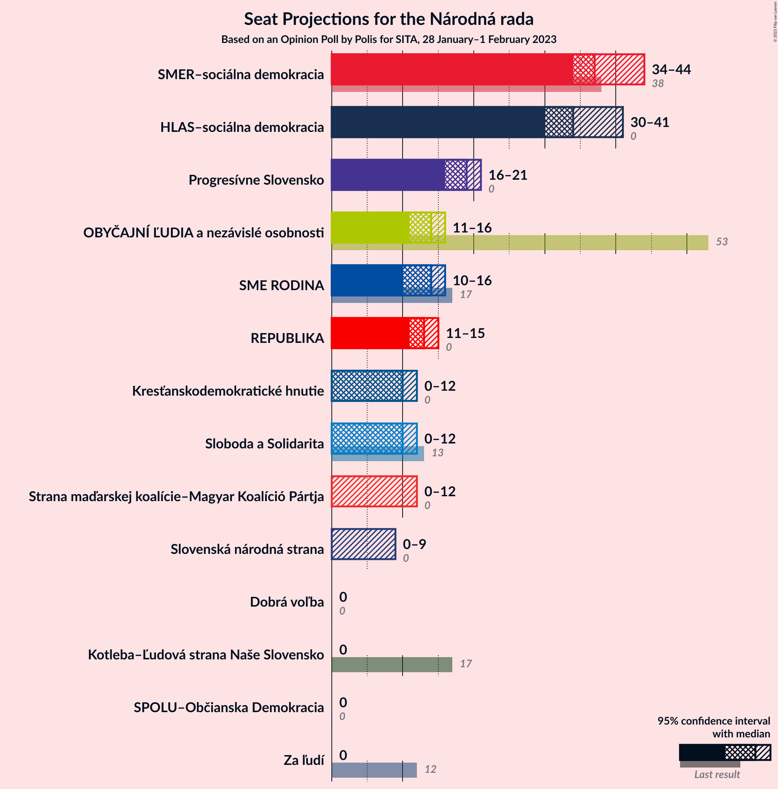

# Opinion Poll by Polis for SITA, 28 January–1 February 2023

<a href="#voting-intentions">Voting Intentions</a> | <a href="#seats">Seats</a> | <a href="#coalitions">Coalitions</a> | <a href="#technical-information">Technical Information</a>

## Voting Intentions

### Confidence Intervals

| Party | Last Result | Poll Result | 80% Confidence Interval | 90% Confidence Interval | 95% Confidence Interval | 99% Confidence Interval |
|:-----:|:-----------:|:-----------:|:-----------------------:|:-----------------------:|:-----------------------:|:-----------------------:|
| SMER–sociálna demokracia | 18.3% | 21.0% | 19.4–22.7% |18.9–23.2% |18.5–23.6% |17.8–24.4% |
| HLAS–sociálna demokracia | 0.0% | 19.4% | 17.8–21.0% |17.4–21.5% |17.0–21.9% |16.3–22.8% |
| Progresívne Slovensko | 7.0% | 9.5% | 8.4–10.8% |8.1–11.1% |7.8–11.5% |7.3–12.1% |
| OBYČAJNÍ ĽUDIA a nezávislé osobnosti | 25.0% | 7.2% | 6.2–8.4% |6.0–8.7% |5.7–9.0% |5.3–9.5% |
| REPUBLIKA | 0.0% | 7.1% | 6.1–8.2% |5.9–8.6% |5.7–8.9% |5.2–9.4% |
| SME RODINA | 8.2% | 6.5% | 5.6–7.6% |5.3–7.9% |5.1–8.2% |4.7–8.7% |
| Sloboda a Solidarita | 6.2% | 5.2% | 4.4–6.2% |4.2–6.5% |4.0–6.8% |3.6–7.3% |
| Kresťanskodemokratické hnutie | 4.6% | 5.0% | 4.2–6.0% |4.0–6.3% |3.8–6.5% |3.5–7.0% |
| Strana maďarskej koalície–Magyar Koalíció Pártja | 3.9% | 4.7% | 3.9–5.7% |3.7–5.9% |3.5–6.2% |3.2–6.7% |
| Slovenská národná strana | 3.2% | 3.8% | 3.1–4.7% |2.9–4.9% |2.8–5.2% |2.5–5.6% |
| Dobrá voľba | 3.1% | 3.5% | 2.9–4.4% |2.7–4.6% |2.5–4.8% |2.2–5.3% |
| Za ľudí | 5.8% | 3.1% | 2.5–3.9% |2.3–4.2% |2.2–4.4% |1.9–4.8% |
| Kotleba–Ľudová strana Naše Slovensko | 8.0% | 2.3% | 1.8–3.0% |1.6–3.2% |1.5–3.4% |1.3–3.8% |
| SPOLU–Občianska Demokracia | 7.0% | 1.0% | 0.7–1.5% |0.6–1.7% |0.5–1.8% |0.4–2.1% |

*Note:* The poll result column reflects the actual value used in the calculations. Published results may vary slightly, and in addition be rounded to fewer digits.

## Seats

### Confidence Intervals

| Party | Last Result | Median | 80% Confidence Interval | 90% Confidence Interval | 95% Confidence Interval | 99% Confidence Interval |
|:-----:|:-----------:|:------:|:-----------------------:|:-----------------------:|:-----------------------:|:-----------------------:|
| <a href="#smer–sociálna-demokracia">SMER–sociálna demokracia</a> | 38 | 37 | 37–43 |36–43 |34–44 |34–45 |
| <a href="#hlas–sociálna-demokracia">HLAS–sociálna demokracia</a> | 0 | 34 | 33–37 |30–39 |30–41 |30–44 |
| <a href="#progresívne-slovensko">Progresívne Slovensko</a> | 0 | 19 | 17–20 |16–20 |16–21 |13–21 |
| <a href="#obyčajní-ľudia-a-nezávislé-osobnosti">OBYČAJNÍ ĽUDIA a nezávislé osobnosti</a> | 53 | 14 | 11–15 |11–16 |11–16 |11–16 |
| <a href="#republika">REPUBLIKA</a> | 0 | 13 | 13–15 |12–15 |11–15 |11–16 |
| <a href="#sme-rodina">SME RODINA</a> | 17 | 14 | 11–16 |10–16 |10–16 |0–16 |
| <a href="#sloboda-a-solidarita">Sloboda a Solidarita</a> | 13 | 10 | 0–11 |0–12 |0–12 |0–12 |
| <a href="#kresťanskodemokratické-hnutie">Kresťanskodemokratické hnutie</a> | 0 | 10 | 0–12 |0–12 |0–12 |0–12 |
| <a href="#strana-maďarskej-koalície–magyar-koalíció-pártja">Strana maďarskej koalície–Magyar Koalíció Pártja</a> | 0 | 0 | 0–9 |0–11 |0–12 |0–12 |
| <a href="#slovenská-národná-strana">Slovenská národná strana</a> | 0 | 0 | 0 |0 |0–9 |0–10 |
| <a href="#dobrá-voľba">Dobrá voľba</a> | 0 | 0 | 0 |0 |0 |0 |
| <a href="#za-ľudí">Za ľudí</a> | 12 | 0 | 0 |0 |0 |0 |
| <a href="#kotleba–ľudová-strana-naše-slovensko">Kotleba–Ľudová strana Naše Slovensko</a> | 17 | 0 | 0 |0 |0 |0 |
| <a href="#spolu–občianska-demokracia">SPOLU–Občianska Demokracia</a> | 0 | 0 | 0 |0 |0 |0 |

### SMER–sociálna demokracia

*For a full overview of the results for this party, see the [SMER–sociálna demokracia](party-smer–sociálnademokracia.html) page.*

| Number of Seats | Probability | Accumulated | Special Marks |
|:---------------:|:-----------:|:-----------:|:-------------:|
| 32 | 0.1% | 100% |  |
| 33 | 0.2% | 99.9% |  |
| 34 | 3% | 99.8% |  |
| 35 | 0.6% | 97% |  |
| 36 | 1.5% | 96% |  |
| 37 | 46% | 95% | Median |
| 38 | 1.0% | 49% | Last Result |
| 39 | 11% | 48% |  |
| 40 | 0.5% | 37% |  |
| 41 | 4% | 36% |  |
| 42 | 0.1% | 32% |  |
| 43 | 29% | 32% |  |
| 44 | 1.3% | 3% |  |
| 45 | 2% | 2% |  |
| 46 | 0.1% | 0.2% |  |
| 47 | 0% | 0.1% |  |
| 48 | 0% | 0.1% |  |
| 49 | 0% | 0.1% |  |
| 50 | 0% | 0% |  |

### HLAS–sociálna demokracia

*For a full overview of the results for this party, see the [HLAS–sociálna demokracia](party-hlas–sociálnademokracia.html) page.*

| Number of Seats | Probability | Accumulated | Special Marks |
|:---------------:|:-----------:|:-----------:|:-------------:|
| 0 | 0% | 100% | Last Result |
| 1 | 0% | 100% |  |
| 2 | 0% | 100% |  |
| 3 | 0% | 100% |  |
| 4 | 0% | 100% |  |
| 5 | 0% | 100% |  |
| 6 | 0% | 100% |  |
| 7 | 0% | 100% |  |
| 8 | 0% | 100% |  |
| 9 | 0% | 100% |  |
| 10 | 0% | 100% |  |
| 11 | 0% | 100% |  |
| 12 | 0% | 100% |  |
| 13 | 0% | 100% |  |
| 14 | 0% | 100% |  |
| 15 | 0% | 100% |  |
| 16 | 0% | 100% |  |
| 17 | 0% | 100% |  |
| 18 | 0% | 100% |  |
| 19 | 0% | 100% |  |
| 20 | 0% | 100% |  |
| 21 | 0% | 100% |  |
| 22 | 0% | 100% |  |
| 23 | 0% | 100% |  |
| 24 | 0% | 100% |  |
| 25 | 0% | 100% |  |
| 26 | 0% | 100% |  |
| 27 | 0% | 100% |  |
| 28 | 0% | 100% |  |
| 29 | 0% | 100% |  |
| 30 | 5% | 100% |  |
| 31 | 0.6% | 95% |  |
| 32 | 1.3% | 94% |  |
| 33 | 14% | 93% |  |
| 34 | 35% | 79% | Median |
| 35 | 7% | 43% |  |
| 36 | 2% | 36% |  |
| 37 | 28% | 34% |  |
| 38 | 0.8% | 6% |  |
| 39 | 2% | 5% |  |
| 40 | 0.5% | 4% |  |
| 41 | 0.9% | 3% |  |
| 42 | 0.2% | 2% |  |
| 43 | 2% | 2% |  |
| 44 | 0.4% | 0.5% |  |
| 45 | 0% | 0.1% |  |
| 46 | 0.1% | 0.1% |  |
| 47 | 0% | 0% |  |

### Progresívne Slovensko

*For a full overview of the results for this party, see the [Progresívne Slovensko](party-progresívneslovensko.html) page.*

| Number of Seats | Probability | Accumulated | Special Marks |
|:---------------:|:-----------:|:-----------:|:-------------:|
| 0 | 0% | 100% | Last Result |
| 1 | 0% | 100% |  |
| 2 | 0% | 100% |  |
| 3 | 0% | 100% |  |
| 4 | 0% | 100% |  |
| 5 | 0% | 100% |  |
| 6 | 0% | 100% |  |
| 7 | 0% | 100% |  |
| 8 | 0% | 100% |  |
| 9 | 0% | 100% |  |
| 10 | 0% | 100% |  |
| 11 | 0% | 100% |  |
| 12 | 0% | 100% |  |
| 13 | 0.5% | 100% |  |
| 14 | 0.7% | 99.5% |  |
| 15 | 0.3% | 98.8% |  |
| 16 | 8% | 98% |  |
| 17 | 33% | 91% |  |
| 18 | 7% | 58% |  |
| 19 | 3% | 50% | Median |
| 20 | 44% | 47% |  |
| 21 | 3% | 3% |  |
| 22 | 0.1% | 0.2% |  |
| 23 | 0% | 0.1% |  |
| 24 | 0.1% | 0.1% |  |
| 25 | 0% | 0% |  |

### OBYČAJNÍ ĽUDIA a nezávislé osobnosti

*For a full overview of the results for this party, see the [OBYČAJNÍ ĽUDIA a nezávislé osobnosti](party-obyčajníľudiaanezávisléosobnosti.html) page.*

| Number of Seats | Probability | Accumulated | Special Marks |
|:---------------:|:-----------:|:-----------:|:-------------:|
| 10 | 0.2% | 100% |  |
| 11 | 21% | 99.8% |  |
| 12 | 10% | 79% |  |
| 13 | 18% | 69% |  |
| 14 | 36% | 51% | Median |
| 15 | 8% | 15% |  |
| 16 | 7% | 7% |  |
| 17 | 0.2% | 0.4% |  |
| 18 | 0.1% | 0.2% |  |
| 19 | 0% | 0.1% |  |
| 20 | 0% | 0% |  |
| 21 | 0% | 0% |  |
| 22 | 0% | 0% |  |
| 23 | 0% | 0% |  |
| 24 | 0% | 0% |  |
| 25 | 0% | 0% |  |
| 26 | 0% | 0% |  |
| 27 | 0% | 0% |  |
| 28 | 0% | 0% |  |
| 29 | 0% | 0% |  |
| 30 | 0% | 0% |  |
| 31 | 0% | 0% |  |
| 32 | 0% | 0% |  |
| 33 | 0% | 0% |  |
| 34 | 0% | 0% |  |
| 35 | 0% | 0% |  |
| 36 | 0% | 0% |  |
| 37 | 0% | 0% |  |
| 38 | 0% | 0% |  |
| 39 | 0% | 0% |  |
| 40 | 0% | 0% |  |
| 41 | 0% | 0% |  |
| 42 | 0% | 0% |  |
| 43 | 0% | 0% |  |
| 44 | 0% | 0% |  |
| 45 | 0% | 0% |  |
| 46 | 0% | 0% |  |
| 47 | 0% | 0% |  |
| 48 | 0% | 0% |  |
| 49 | 0% | 0% |  |
| 50 | 0% | 0% |  |
| 51 | 0% | 0% |  |
| 52 | 0% | 0% |  |
| 53 | 0% | 0% | Last Result |

### REPUBLIKA

*For a full overview of the results for this party, see the [REPUBLIKA](party-republika.html) page.*

| Number of Seats | Probability | Accumulated | Special Marks |
|:---------------:|:-----------:|:-----------:|:-------------:|
| 0 | 0% | 100% | Last Result |
| 1 | 0% | 100% |  |
| 2 | 0% | 100% |  |
| 3 | 0% | 100% |  |
| 4 | 0% | 100% |  |
| 5 | 0% | 100% |  |
| 6 | 0% | 100% |  |
| 7 | 0% | 100% |  |
| 8 | 0% | 100% |  |
| 9 | 0.1% | 100% |  |
| 10 | 0.2% | 99.8% |  |
| 11 | 5% | 99.7% |  |
| 12 | 3% | 95% |  |
| 13 | 53% | 92% | Median |
| 14 | 14% | 39% |  |
| 15 | 24% | 25% |  |
| 16 | 0.6% | 1.1% |  |
| 17 | 0.2% | 0.4% |  |
| 18 | 0.1% | 0.2% |  |
| 19 | 0% | 0.1% |  |
| 20 | 0.1% | 0.1% |  |
| 21 | 0% | 0% |  |

### SME RODINA

*For a full overview of the results for this party, see the [SME RODINA](party-smerodina.html) page.*

| Number of Seats | Probability | Accumulated | Special Marks |
|:---------------:|:-----------:|:-----------:|:-------------:|
| 0 | 0.6% | 100% |  |
| 1 | 0% | 99.4% |  |
| 2 | 0% | 99.4% |  |
| 3 | 0% | 99.4% |  |
| 4 | 0% | 99.4% |  |
| 5 | 0% | 99.4% |  |
| 6 | 0% | 99.4% |  |
| 7 | 0% | 99.4% |  |
| 8 | 0% | 99.4% |  |
| 9 | 1.1% | 99.4% |  |
| 10 | 8% | 98% |  |
| 11 | 17% | 90% |  |
| 12 | 7% | 74% |  |
| 13 | 7% | 67% |  |
| 14 | 21% | 60% | Median |
| 15 | 7% | 39% |  |
| 16 | 32% | 32% |  |
| 17 | 0.2% | 0.3% | Last Result |
| 18 | 0.1% | 0.1% |  |
| 19 | 0% | 0% |  |

### Sloboda a Solidarita

*For a full overview of the results for this party, see the [Sloboda a Solidarita](party-slobodaasolidarita.html) page.*

| Number of Seats | Probability | Accumulated | Special Marks |
|:---------------:|:-----------:|:-----------:|:-------------:|
| 0 | 17% | 100% |  |
| 1 | 0% | 83% |  |
| 2 | 0% | 83% |  |
| 3 | 0% | 83% |  |
| 4 | 0% | 83% |  |
| 5 | 0% | 83% |  |
| 6 | 0% | 83% |  |
| 7 | 0% | 83% |  |
| 8 | 0% | 83% |  |
| 9 | 32% | 83% |  |
| 10 | 27% | 51% | Median |
| 11 | 17% | 24% |  |
| 12 | 7% | 7% |  |
| 13 | 0.3% | 0.4% | Last Result |
| 14 | 0.1% | 0.1% |  |
| 15 | 0% | 0.1% |  |
| 16 | 0.1% | 0.1% |  |
| 17 | 0% | 0% |  |

### Kresťanskodemokratické hnutie

*For a full overview of the results for this party, see the [Kresťanskodemokratické hnutie](party-kresťanskodemokratickéhnutie.html) page.*

| Number of Seats | Probability | Accumulated | Special Marks |
|:---------------:|:-----------:|:-----------:|:-------------:|
| 0 | 37% | 100% | Last Result |
| 1 | 0% | 63% |  |
| 2 | 0% | 63% |  |
| 3 | 0% | 63% |  |
| 4 | 0% | 63% |  |
| 5 | 0% | 63% |  |
| 6 | 0% | 63% |  |
| 7 | 0% | 63% |  |
| 8 | 0% | 63% |  |
| 9 | 5% | 63% |  |
| 10 | 39% | 57% | Median |
| 11 | 3% | 18% |  |
| 12 | 15% | 15% |  |
| 13 | 0% | 0.1% |  |
| 14 | 0% | 0% |  |

### Strana maďarskej koalície–Magyar Koalíció Pártja

*For a full overview of the results for this party, see the [Strana maďarskej koalície–Magyar Koalíció Pártja](party-stranamaďarskejkoalície–magyarkoalíciópártja.html) page.*

| Number of Seats | Probability | Accumulated | Special Marks |
|:---------------:|:-----------:|:-----------:|:-------------:|
| 0 | 82% | 100% | Last Result, Median |
| 1 | 0% | 18% |  |
| 2 | 0% | 18% |  |
| 3 | 0% | 18% |  |
| 4 | 0% | 18% |  |
| 5 | 0% | 18% |  |
| 6 | 0% | 18% |  |
| 7 | 0% | 18% |  |
| 8 | 0% | 18% |  |
| 9 | 10% | 18% |  |
| 10 | 1.2% | 8% |  |
| 11 | 2% | 7% |  |
| 12 | 4% | 5% |  |
| 13 | 0% | 0% |  |

### Slovenská národná strana

*For a full overview of the results for this party, see the [Slovenská národná strana](party-slovenskánárodnástrana.html) page.*

| Number of Seats | Probability | Accumulated | Special Marks |
|:---------------:|:-----------:|:-----------:|:-------------:|
| 0 | 97% | 100% | Last Result, Median |
| 1 | 0% | 3% |  |
| 2 | 0% | 3% |  |
| 3 | 0% | 3% |  |
| 4 | 0% | 3% |  |
| 5 | 0% | 3% |  |
| 6 | 0% | 3% |  |
| 7 | 0% | 3% |  |
| 8 | 0% | 3% |  |
| 9 | 1.2% | 3% |  |
| 10 | 1.0% | 1.3% |  |
| 11 | 0.4% | 0.4% |  |
| 12 | 0% | 0% |  |

### Dobrá voľba

*For a full overview of the results for this party, see the [Dobrá voľba](party-dobrávoľba.html) page.*

| Number of Seats | Probability | Accumulated | Special Marks |
|:---------------:|:-----------:|:-----------:|:-------------:|
| 0 | 99.9% | 100% | Last Result, Median |
| 1 | 0% | 0.1% |  |
| 2 | 0% | 0.1% |  |
| 3 | 0% | 0.1% |  |
| 4 | 0% | 0.1% |  |
| 5 | 0% | 0.1% |  |
| 6 | 0% | 0.1% |  |
| 7 | 0% | 0.1% |  |
| 8 | 0% | 0.1% |  |
| 9 | 0% | 0.1% |  |
| 10 | 0% | 0.1% |  |
| 11 | 0.1% | 0.1% |  |
| 12 | 0% | 0% |  |

### Za ľudí

*For a full overview of the results for this party, see the [Za ľudí](party-zaľudí.html) page.*

| Number of Seats | Probability | Accumulated | Special Marks |
|:---------------:|:-----------:|:-----------:|:-------------:|
| 0 | 99.9% | 100% | Median |
| 1 | 0% | 0.1% |  |
| 2 | 0% | 0.1% |  |
| 3 | 0% | 0.1% |  |
| 4 | 0% | 0.1% |  |
| 5 | 0% | 0.1% |  |
| 6 | 0% | 0.1% |  |
| 7 | 0% | 0.1% |  |
| 8 | 0% | 0.1% |  |
| 9 | 0% | 0.1% |  |
| 10 | 0.1% | 0.1% |  |
| 11 | 0% | 0% |  |
| 12 | 0% | 0% | Last Result |

### Kotleba–Ľudová strana Naše Slovensko

*For a full overview of the results for this party, see the [Kotleba–Ľudová strana Naše Slovensko](party-kotleba–ľudovástrananašeslovensko.html) page.*

| Number of Seats | Probability | Accumulated | Special Marks |
|:---------------:|:-----------:|:-----------:|:-------------:|
| 0 | 100% | 100% | Median |
| 1 | 0% | 0% |  |
| 2 | 0% | 0% |  |
| 3 | 0% | 0% |  |
| 4 | 0% | 0% |  |
| 5 | 0% | 0% |  |
| 6 | 0% | 0% |  |
| 7 | 0% | 0% |  |
| 8 | 0% | 0% |  |
| 9 | 0% | 0% |  |
| 10 | 0% | 0% |  |
| 11 | 0% | 0% |  |
| 12 | 0% | 0% |  |
| 13 | 0% | 0% |  |
| 14 | 0% | 0% |  |
| 15 | 0% | 0% |  |
| 16 | 0% | 0% |  |
| 17 | 0% | 0% | Last Result |

### SPOLU–Občianska Demokracia

*For a full overview of the results for this party, see the [SPOLU–Občianska Demokracia](party-spolu–občianskademokracia.html) page.*

| Number of Seats | Probability | Accumulated | Special Marks |
|:---------------:|:-----------:|:-----------:|:-------------:|
| 0 | 100% | 100% | Last Result, Median |

## Coalitions

### Confidence Intervals

| Coalition | Last Result | Median | Majority? | 80% Confidence Interval | 90% Confidence Interval | 95% Confidence Interval | 99% Confidence Interval |
|:---------:|:-----------:|:------:|:---------:|:-----------------------:|:-----------------------:|:-----------------------:|:-----------------------:|
| SMER–sociálna demokracia – HLAS–sociálna demokracia – SME RODINA – Slovenská národná strana – Kotleba–Ľudová strana Naše Slovensko | 72 | 87 | 99.9% | 81–94 | 81–94 | 81–96 | 79–96 |
| SMER–sociálna demokracia – HLAS–sociálna demokracia – SME RODINA – Slovenská národná strana | 55 | 87 | 99.9% | 81–94 | 81–94 | 81–96 | 79–96 |
| SMER–sociálna demokracia – HLAS–sociálna demokracia – SME RODINA | 55 | 87 | 99.9% | 81–94 | 81–94 | 81–95 | 77–96 |
| SMER–sociálna demokracia – HLAS–sociálna demokracia – Slovenská národná strana | 38 | 73 | 38% | 70–80 | 70–81 | 68–84 | 68–85 |
| SMER–sociálna demokracia – SME RODINA – Slovenská národná strana – Kotleba–Ľudová strana Naše Slovensko | 72 | 53 | 0% | 48–57 | 48–57 | 47–57 | 43–61 |
| SMER–sociálna demokracia – SME RODINA | 55 | 53 | 0% | 48–57 | 47–57 | 47–57 | 43–57 |
| SMER–sociálna demokracia – SME RODINA – Slovenská národná strana | 55 | 53 | 0% | 48–57 | 48–57 | 47–57 | 43–61 |
| HLAS–sociálna demokracia – SME RODINA – Slovenská národná strana – Kotleba–Ľudová strana Naše Slovensko | 34 | 50 | 0% | 44–51 | 40–51 | 40–55 | 40–61 |
| HLAS–sociálna demokracia – SME RODINA – Slovenská národná strana | 17 | 50 | 0% | 44–51 | 40–51 | 40–55 | 40–61 |
| HLAS–sociálna demokracia – SME RODINA | 17 | 50 | 0% | 44–51 | 40–51 | 40–54 | 40–56 |
| SMER–sociálna demokracia – Slovenská národná strana | 38 | 38 | 0% | 37–43 | 37–44 | 34–45 | 34–51 |
| SMER–sociálna demokracia | 38 | 37 | 0% | 37–43 | 36–43 | 34–44 | 34–45 |
| HLAS–sociálna demokracia – Slovenská národná strana | 0 | 34 | 0% | 33–37 | 30–41 | 30–43 | 30–47 |

### SMER–sociálna demokracia – HLAS–sociálna demokracia – SME RODINA – Slovenská národná strana – Kotleba–Ľudová strana Naše Slovensko

| Number of Seats | Probability | Accumulated | Special Marks |
|:---------------:|:-----------:|:-----------:|:-------------:|
| 72 | 0% | 100% | Last Result |
| 73 | 0% | 100% |  |
| 74 | 0% | 99.9% |  |
| 75 | 0% | 99.9% |  |
| 76 | 0% | 99.9% | Majority |
| 77 | 0% | 99.9% |  |
| 78 | 0.1% | 99.9% |  |
| 79 | 0.5% | 99.8% |  |
| 80 | 0.1% | 99.3% |  |
| 81 | 16% | 99.1% |  |
| 82 | 0.1% | 83% |  |
| 83 | 6% | 83% |  |
| 84 | 0.7% | 77% |  |
| 85 | 0.1% | 76% | Median |
| 86 | 1.2% | 76% |  |
| 87 | 32% | 75% |  |
| 88 | 4% | 44% |  |
| 89 | 7% | 39% |  |
| 90 | 2% | 32% |  |
| 91 | 0.1% | 31% |  |
| 92 | 2% | 31% |  |
| 93 | 3% | 28% |  |
| 94 | 22% | 25% |  |
| 95 | 0.9% | 3% |  |
| 96 | 2% | 3% |  |
| 97 | 0% | 0.3% |  |
| 98 | 0% | 0.2% |  |
| 99 | 0% | 0.2% |  |
| 100 | 0% | 0.2% |  |
| 101 | 0% | 0.2% |  |
| 102 | 0.1% | 0.2% |  |
| 103 | 0% | 0% |  |

### SMER–sociálna demokracia – HLAS–sociálna demokracia – SME RODINA – Slovenská národná strana

| Number of Seats | Probability | Accumulated | Special Marks |
|:---------------:|:-----------:|:-----------:|:-------------:|
| 55 | 0% | 100% | Last Result |
| 56 | 0% | 100% |  |
| 57 | 0% | 100% |  |
| 58 | 0% | 100% |  |
| 59 | 0% | 100% |  |
| 60 | 0% | 100% |  |
| 61 | 0% | 100% |  |
| 62 | 0% | 100% |  |
| 63 | 0% | 100% |  |
| 64 | 0% | 100% |  |
| 65 | 0% | 100% |  |
| 66 | 0% | 100% |  |
| 67 | 0% | 100% |  |
| 68 | 0% | 100% |  |
| 69 | 0% | 100% |  |
| 70 | 0% | 100% |  |
| 71 | 0% | 100% |  |
| 72 | 0% | 100% |  |
| 73 | 0% | 100% |  |
| 74 | 0% | 99.9% |  |
| 75 | 0% | 99.9% |  |
| 76 | 0% | 99.9% | Majority |
| 77 | 0% | 99.9% |  |
| 78 | 0.1% | 99.9% |  |
| 79 | 0.5% | 99.8% |  |
| 80 | 0.1% | 99.3% |  |
| 81 | 16% | 99.1% |  |
| 82 | 0.1% | 83% |  |
| 83 | 6% | 83% |  |
| 84 | 0.7% | 77% |  |
| 85 | 0.1% | 76% | Median |
| 86 | 1.2% | 76% |  |
| 87 | 32% | 75% |  |
| 88 | 4% | 44% |  |
| 89 | 7% | 39% |  |
| 90 | 2% | 32% |  |
| 91 | 0.1% | 31% |  |
| 92 | 2% | 31% |  |
| 93 | 3% | 28% |  |
| 94 | 22% | 25% |  |
| 95 | 0.9% | 3% |  |
| 96 | 2% | 3% |  |
| 97 | 0% | 0.3% |  |
| 98 | 0% | 0.2% |  |
| 99 | 0% | 0.2% |  |
| 100 | 0% | 0.2% |  |
| 101 | 0% | 0.2% |  |
| 102 | 0.1% | 0.2% |  |
| 103 | 0% | 0% |  |

### SMER–sociálna demokracia – HLAS–sociálna demokracia – SME RODINA

| Number of Seats | Probability | Accumulated | Special Marks |
|:---------------:|:-----------:|:-----------:|:-------------:|
| 55 | 0% | 100% | Last Result |
| 56 | 0% | 100% |  |
| 57 | 0% | 100% |  |
| 58 | 0% | 100% |  |
| 59 | 0% | 100% |  |
| 60 | 0% | 100% |  |
| 61 | 0% | 100% |  |
| 62 | 0% | 100% |  |
| 63 | 0% | 100% |  |
| 64 | 0% | 100% |  |
| 65 | 0% | 100% |  |
| 66 | 0% | 100% |  |
| 67 | 0% | 100% |  |
| 68 | 0% | 100% |  |
| 69 | 0% | 100% |  |
| 70 | 0% | 100% |  |
| 71 | 0% | 100% |  |
| 72 | 0% | 100% |  |
| 73 | 0% | 100% |  |
| 74 | 0% | 99.9% |  |
| 75 | 0% | 99.9% |  |
| 76 | 0% | 99.9% | Majority |
| 77 | 1.1% | 99.9% |  |
| 78 | 0.1% | 98.8% |  |
| 79 | 0.5% | 98.7% |  |
| 80 | 0.1% | 98% |  |
| 81 | 17% | 98% |  |
| 82 | 0.2% | 82% |  |
| 83 | 6% | 81% |  |
| 84 | 1.2% | 76% |  |
| 85 | 0.4% | 75% | Median |
| 86 | 0.5% | 74% |  |
| 87 | 32% | 74% |  |
| 88 | 4% | 42% |  |
| 89 | 7% | 38% |  |
| 90 | 2% | 31% |  |
| 91 | 0.1% | 29% |  |
| 92 | 2% | 29% |  |
| 93 | 3% | 27% |  |
| 94 | 21% | 24% |  |
| 95 | 0.7% | 3% |  |
| 96 | 2% | 2% |  |
| 97 | 0% | 0.2% |  |
| 98 | 0% | 0.2% |  |
| 99 | 0% | 0.2% |  |
| 100 | 0% | 0.1% |  |
| 101 | 0% | 0.1% |  |
| 102 | 0.1% | 0.1% |  |
| 103 | 0% | 0% |  |

### SMER–sociálna demokracia – HLAS–sociálna demokracia – Slovenská národná strana

| Number of Seats | Probability | Accumulated | Special Marks |
|:---------------:|:-----------:|:-----------:|:-------------:|
| 38 | 0% | 100% | Last Result |
| 39 | 0% | 100% |  |
| 40 | 0% | 100% |  |
| 41 | 0% | 100% |  |
| 42 | 0% | 100% |  |
| 43 | 0% | 100% |  |
| 44 | 0% | 100% |  |
| 45 | 0% | 100% |  |
| 46 | 0% | 100% |  |
| 47 | 0% | 100% |  |
| 48 | 0% | 100% |  |
| 49 | 0% | 100% |  |
| 50 | 0% | 100% |  |
| 51 | 0% | 100% |  |
| 52 | 0% | 100% |  |
| 53 | 0% | 100% |  |
| 54 | 0% | 100% |  |
| 55 | 0% | 100% |  |
| 56 | 0% | 100% |  |
| 57 | 0% | 100% |  |
| 58 | 0% | 100% |  |
| 59 | 0% | 100% |  |
| 60 | 0% | 100% |  |
| 61 | 0% | 100% |  |
| 62 | 0% | 100% |  |
| 63 | 0% | 100% |  |
| 64 | 0% | 100% |  |
| 65 | 0% | 100% |  |
| 66 | 0.1% | 100% |  |
| 67 | 0% | 99.9% |  |
| 68 | 4% | 99.9% |  |
| 69 | 0.1% | 96% |  |
| 70 | 14% | 96% |  |
| 71 | 31% | 83% | Median |
| 72 | 0.2% | 51% |  |
| 73 | 6% | 51% |  |
| 74 | 7% | 45% |  |
| 75 | 0.1% | 38% |  |
| 76 | 4% | 38% | Majority |
| 77 | 1.2% | 34% |  |
| 78 | 0.4% | 33% |  |
| 79 | 0.1% | 32% |  |
| 80 | 24% | 32% |  |
| 81 | 3% | 8% |  |
| 82 | 1.4% | 5% |  |
| 83 | 0.1% | 3% |  |
| 84 | 3% | 3% |  |
| 85 | 0% | 0.5% |  |
| 86 | 0.3% | 0.5% |  |
| 87 | 0% | 0.2% |  |
| 88 | 0% | 0.2% |  |
| 89 | 0% | 0.2% |  |
| 90 | 0% | 0.1% |  |
| 91 | 0.1% | 0.1% |  |
| 92 | 0% | 0.1% |  |
| 93 | 0% | 0.1% |  |
| 94 | 0% | 0% |  |

### SMER–sociálna demokracia – SME RODINA – Slovenská národná strana – Kotleba–Ľudová strana Naše Slovensko

| Number of Seats | Probability | Accumulated | Special Marks |
|:---------------:|:-----------:|:-----------:|:-------------:|
| 39 | 0% | 100% |  |
| 40 | 0% | 99.9% |  |
| 41 | 0% | 99.9% |  |
| 42 | 0% | 99.9% |  |
| 43 | 0.4% | 99.9% |  |
| 44 | 0% | 99.5% |  |
| 45 | 0.1% | 99.4% |  |
| 46 | 0.1% | 99.3% |  |
| 47 | 3% | 99.2% |  |
| 48 | 14% | 96% |  |
| 49 | 0.2% | 82% |  |
| 50 | 0.8% | 82% |  |
| 51 | 6% | 81% | Median |
| 52 | 0.1% | 75% |  |
| 53 | 39% | 75% |  |
| 54 | 8% | 36% |  |
| 55 | 0.3% | 28% |  |
| 56 | 6% | 28% |  |
| 57 | 21% | 22% |  |
| 58 | 0.2% | 1.4% |  |
| 59 | 0.1% | 1.2% |  |
| 60 | 0.2% | 1.1% |  |
| 61 | 0.6% | 1.0% |  |
| 62 | 0.3% | 0.4% |  |
| 63 | 0% | 0.1% |  |
| 64 | 0% | 0.1% |  |
| 65 | 0% | 0% |  |
| 66 | 0% | 0% |  |
| 67 | 0% | 0% |  |
| 68 | 0% | 0% |  |
| 69 | 0% | 0% |  |
| 70 | 0% | 0% |  |
| 71 | 0% | 0% |  |
| 72 | 0% | 0% | Last Result |

### SMER–sociálna demokracia – SME RODINA

| Number of Seats | Probability | Accumulated | Special Marks |
|:---------------:|:-----------:|:-----------:|:-------------:|
| 39 | 0% | 100% |  |
| 40 | 0% | 99.9% |  |
| 41 | 0% | 99.9% |  |
| 42 | 0% | 99.9% |  |
| 43 | 0.4% | 99.9% |  |
| 44 | 0% | 99.5% |  |
| 45 | 1.5% | 99.4% |  |
| 46 | 0.3% | 98% |  |
| 47 | 3% | 98% |  |
| 48 | 14% | 94% |  |
| 49 | 0.3% | 80% |  |
| 50 | 0.9% | 80% |  |
| 51 | 6% | 79% | Median |
| 52 | 0.4% | 73% |  |
| 53 | 39% | 73% |  |
| 54 | 7% | 34% |  |
| 55 | 0.2% | 27% | Last Result |
| 56 | 5% | 26% |  |
| 57 | 21% | 21% |  |
| 58 | 0.2% | 0.5% |  |
| 59 | 0% | 0.2% |  |
| 60 | 0.1% | 0.2% |  |
| 61 | 0.1% | 0.1% |  |
| 62 | 0% | 0% |  |

### SMER–sociálna demokracia – SME RODINA – Slovenská národná strana

| Number of Seats | Probability | Accumulated | Special Marks |
|:---------------:|:-----------:|:-----------:|:-------------:|
| 39 | 0% | 100% |  |
| 40 | 0% | 99.9% |  |
| 41 | 0% | 99.9% |  |
| 42 | 0% | 99.9% |  |
| 43 | 0.4% | 99.9% |  |
| 44 | 0% | 99.5% |  |
| 45 | 0.1% | 99.4% |  |
| 46 | 0.1% | 99.3% |  |
| 47 | 3% | 99.2% |  |
| 48 | 14% | 96% |  |
| 49 | 0.2% | 82% |  |
| 50 | 0.8% | 82% |  |
| 51 | 6% | 81% | Median |
| 52 | 0.1% | 75% |  |
| 53 | 39% | 75% |  |
| 54 | 8% | 36% |  |
| 55 | 0.3% | 28% | Last Result |
| 56 | 6% | 28% |  |
| 57 | 21% | 22% |  |
| 58 | 0.2% | 1.4% |  |
| 59 | 0.1% | 1.2% |  |
| 60 | 0.2% | 1.1% |  |
| 61 | 0.6% | 1.0% |  |
| 62 | 0.3% | 0.4% |  |
| 63 | 0% | 0.1% |  |
| 64 | 0% | 0.1% |  |
| 65 | 0% | 0% |  |

### HLAS–sociálna demokracia – SME RODINA – Slovenská národná strana – Kotleba–Ľudová strana Naše Slovensko

| Number of Seats | Probability | Accumulated | Special Marks |
|:---------------:|:-----------:|:-----------:|:-------------:|
| 34 | 0% | 100% | Last Result |
| 35 | 0% | 100% |  |
| 36 | 0% | 100% |  |
| 37 | 0% | 100% |  |
| 38 | 0% | 100% |  |
| 39 | 0% | 99.9% |  |
| 40 | 5% | 99.9% |  |
| 41 | 0.4% | 95% |  |
| 42 | 0.5% | 94% |  |
| 43 | 0% | 94% |  |
| 44 | 14% | 94% |  |
| 45 | 0.1% | 80% |  |
| 46 | 0.1% | 80% |  |
| 47 | 5% | 80% |  |
| 48 | 0.2% | 74% | Median |
| 49 | 6% | 74% |  |
| 50 | 42% | 68% |  |
| 51 | 21% | 26% |  |
| 52 | 0.1% | 5% |  |
| 53 | 0.9% | 5% |  |
| 54 | 0.6% | 4% |  |
| 55 | 2% | 3% |  |
| 56 | 0.4% | 1.4% |  |
| 57 | 0.1% | 0.9% |  |
| 58 | 0.3% | 0.8% |  |
| 59 | 0% | 0.5% |  |
| 60 | 0% | 0.5% |  |
| 61 | 0.3% | 0.5% |  |
| 62 | 0.1% | 0.2% |  |
| 63 | 0% | 0.1% |  |
| 64 | 0.1% | 0.1% |  |
| 65 | 0% | 0% |  |

### HLAS–sociálna demokracia – SME RODINA – Slovenská národná strana

| Number of Seats | Probability | Accumulated | Special Marks |
|:---------------:|:-----------:|:-----------:|:-------------:|
| 17 | 0% | 100% | Last Result |
| 18 | 0% | 100% |  |
| 19 | 0% | 100% |  |
| 20 | 0% | 100% |  |
| 21 | 0% | 100% |  |
| 22 | 0% | 100% |  |
| 23 | 0% | 100% |  |
| 24 | 0% | 100% |  |
| 25 | 0% | 100% |  |
| 26 | 0% | 100% |  |
| 27 | 0% | 100% |  |
| 28 | 0% | 100% |  |
| 29 | 0% | 100% |  |
| 30 | 0% | 100% |  |
| 31 | 0% | 100% |  |
| 32 | 0% | 100% |  |
| 33 | 0% | 100% |  |
| 34 | 0% | 100% |  |
| 35 | 0% | 100% |  |
| 36 | 0% | 100% |  |
| 37 | 0% | 100% |  |
| 38 | 0% | 100% |  |
| 39 | 0% | 99.9% |  |
| 40 | 5% | 99.9% |  |
| 41 | 0.4% | 95% |  |
| 42 | 0.5% | 94% |  |
| 43 | 0% | 94% |  |
| 44 | 14% | 94% |  |
| 45 | 0.1% | 80% |  |
| 46 | 0.1% | 80% |  |
| 47 | 5% | 80% |  |
| 48 | 0.2% | 74% | Median |
| 49 | 6% | 74% |  |
| 50 | 42% | 68% |  |
| 51 | 21% | 26% |  |
| 52 | 0.1% | 5% |  |
| 53 | 0.9% | 5% |  |
| 54 | 0.6% | 4% |  |
| 55 | 2% | 3% |  |
| 56 | 0.4% | 1.4% |  |
| 57 | 0.1% | 0.9% |  |
| 58 | 0.3% | 0.8% |  |
| 59 | 0% | 0.5% |  |
| 60 | 0% | 0.5% |  |
| 61 | 0.3% | 0.5% |  |
| 62 | 0.1% | 0.2% |  |
| 63 | 0% | 0.1% |  |
| 64 | 0.1% | 0.1% |  |
| 65 | 0% | 0% |  |

### HLAS–sociálna demokracia – SME RODINA

| Number of Seats | Probability | Accumulated | Special Marks |
|:---------------:|:-----------:|:-----------:|:-------------:|
| 17 | 0% | 100% | Last Result |
| 18 | 0% | 100% |  |
| 19 | 0% | 100% |  |
| 20 | 0% | 100% |  |
| 21 | 0% | 100% |  |
| 22 | 0% | 100% |  |
| 23 | 0% | 100% |  |
| 24 | 0% | 100% |  |
| 25 | 0% | 100% |  |
| 26 | 0% | 100% |  |
| 27 | 0% | 100% |  |
| 28 | 0% | 100% |  |
| 29 | 0% | 100% |  |
| 30 | 0% | 100% |  |
| 31 | 0% | 100% |  |
| 32 | 0% | 100% |  |
| 33 | 0% | 100% |  |
| 34 | 0% | 100% |  |
| 35 | 0% | 100% |  |
| 36 | 0% | 100% |  |
| 37 | 0% | 100% |  |
| 38 | 0% | 99.9% |  |
| 39 | 0% | 99.9% |  |
| 40 | 5% | 99.9% |  |
| 41 | 2% | 95% |  |
| 42 | 0.5% | 93% |  |
| 43 | 0.6% | 92% |  |
| 44 | 14% | 92% |  |
| 45 | 0.1% | 78% |  |
| 46 | 0.2% | 78% |  |
| 47 | 5% | 78% |  |
| 48 | 0.5% | 73% | Median |
| 49 | 6% | 72% |  |
| 50 | 41% | 66% |  |
| 51 | 21% | 24% |  |
| 52 | 0.2% | 3% |  |
| 53 | 0.4% | 3% |  |
| 54 | 0.5% | 3% |  |
| 55 | 2% | 2% |  |
| 56 | 0.4% | 0.6% |  |
| 57 | 0% | 0.1% |  |
| 58 | 0% | 0.1% |  |
| 59 | 0% | 0.1% |  |
| 60 | 0% | 0.1% |  |
| 61 | 0% | 0.1% |  |
| 62 | 0% | 0.1% |  |
| 63 | 0% | 0.1% |  |
| 64 | 0.1% | 0.1% |  |
| 65 | 0% | 0% |  |

### SMER–sociálna demokracia – Slovenská národná strana

| Number of Seats | Probability | Accumulated | Special Marks |
|:---------------:|:-----------:|:-----------:|:-------------:|
| 32 | 0.1% | 100% |  |
| 33 | 0.1% | 99.9% |  |
| 34 | 3% | 99.9% |  |
| 35 | 0.2% | 97% |  |
| 36 | 0.4% | 97% |  |
| 37 | 46% | 96% | Median |
| 38 | 0.6% | 50% | Last Result |
| 39 | 11% | 50% |  |
| 40 | 0.5% | 39% |  |
| 41 | 3% | 38% |  |
| 42 | 0.2% | 35% |  |
| 43 | 29% | 35% |  |
| 44 | 1.3% | 6% |  |
| 45 | 3% | 5% |  |
| 46 | 0.5% | 2% |  |
| 47 | 0% | 1.1% |  |
| 48 | 0.3% | 1.1% |  |
| 49 | 0.1% | 0.7% |  |
| 50 | 0.1% | 0.6% |  |
| 51 | 0.5% | 0.6% |  |
| 52 | 0% | 0.1% |  |
| 53 | 0% | 0% |  |

### SMER–sociálna demokracia

| Number of Seats | Probability | Accumulated | Special Marks |
|:---------------:|:-----------:|:-----------:|:-------------:|
| 32 | 0.1% | 100% |  |
| 33 | 0.2% | 99.9% |  |
| 34 | 3% | 99.8% |  |
| 35 | 0.6% | 97% |  |
| 36 | 1.5% | 96% |  |
| 37 | 46% | 95% | Median |
| 38 | 1.0% | 49% | Last Result |
| 39 | 11% | 48% |  |
| 40 | 0.5% | 37% |  |
| 41 | 4% | 36% |  |
| 42 | 0.1% | 32% |  |
| 43 | 29% | 32% |  |
| 44 | 1.3% | 3% |  |
| 45 | 2% | 2% |  |
| 46 | 0.1% | 0.2% |  |
| 47 | 0% | 0.1% |  |
| 48 | 0% | 0.1% |  |
| 49 | 0% | 0.1% |  |
| 50 | 0% | 0% |  |

### HLAS–sociálna demokracia – Slovenská národná strana

| Number of Seats | Probability | Accumulated | Special Marks |
|:---------------:|:-----------:|:-----------:|:-------------:|
| 0 | 0% | 100% | Last Result |
| 1 | 0% | 100% |  |
| 2 | 0% | 100% |  |
| 3 | 0% | 100% |  |
| 4 | 0% | 100% |  |
| 5 | 0% | 100% |  |
| 6 | 0% | 100% |  |
| 7 | 0% | 100% |  |
| 8 | 0% | 100% |  |
| 9 | 0% | 100% |  |
| 10 | 0% | 100% |  |
| 11 | 0% | 100% |  |
| 12 | 0% | 100% |  |
| 13 | 0% | 100% |  |
| 14 | 0% | 100% |  |
| 15 | 0% | 100% |  |
| 16 | 0% | 100% |  |
| 17 | 0% | 100% |  |
| 18 | 0% | 100% |  |
| 19 | 0% | 100% |  |
| 20 | 0% | 100% |  |
| 21 | 0% | 100% |  |
| 22 | 0% | 100% |  |
| 23 | 0% | 100% |  |
| 24 | 0% | 100% |  |
| 25 | 0% | 100% |  |
| 26 | 0% | 100% |  |
| 27 | 0% | 100% |  |
| 28 | 0% | 100% |  |
| 29 | 0% | 100% |  |
| 30 | 5% | 100% |  |
| 31 | 0.6% | 95% |  |
| 32 | 0.1% | 94% |  |
| 33 | 14% | 94% |  |
| 34 | 35% | 80% | Median |
| 35 | 7% | 45% |  |
| 36 | 2% | 39% |  |
| 37 | 28% | 36% |  |
| 38 | 0.8% | 8% |  |
| 39 | 2% | 8% |  |
| 40 | 0.1% | 6% |  |
| 41 | 2% | 6% |  |
| 42 | 0.3% | 4% |  |
| 43 | 2% | 4% |  |
| 44 | 0.7% | 1.4% |  |
| 45 | 0% | 0.7% |  |
| 46 | 0.2% | 0.7% |  |
| 47 | 0% | 0.5% |  |
| 48 | 0% | 0.5% |  |
| 49 | 0.1% | 0.4% |  |
| 50 | 0% | 0.3% |  |
| 51 | 0.3% | 0.3% |  |
| 52 | 0% | 0% |  |

## Technical Information

### Opinion Poll

+ **Polling firm:** Polis
+ **Commissioner(s):** SITA
+ **Fieldwork period:** 28 January–1 February 2023

### Calculations

+ **Sample size:** 1002
+ **Simulations done:** 1,048,576
+ **Error estimate:** 1.16%

