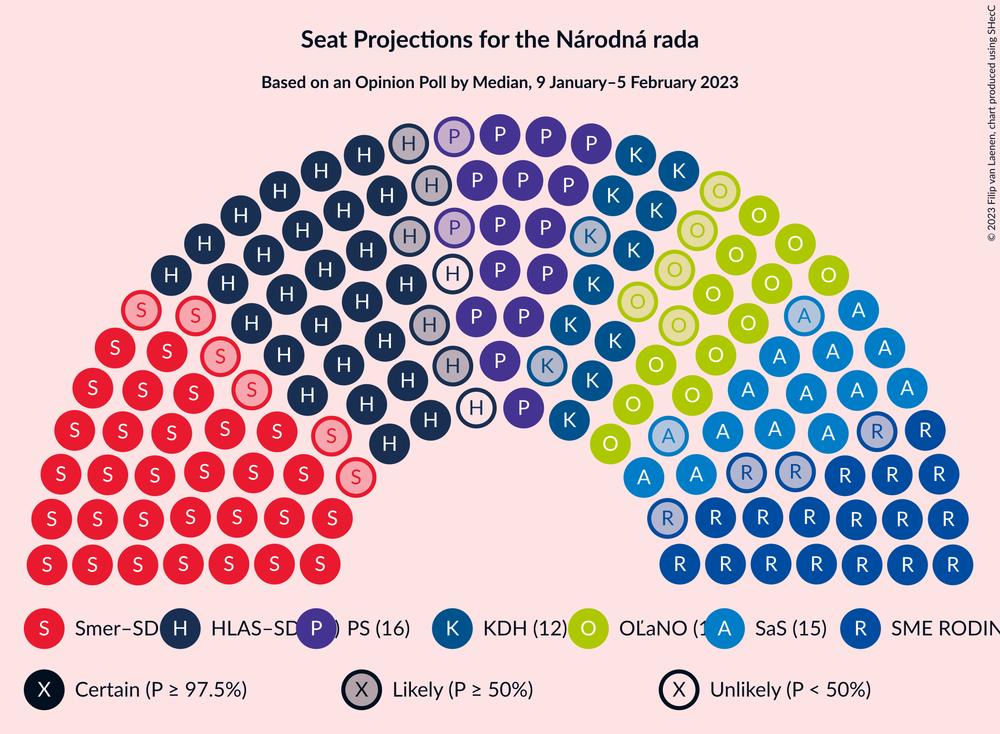
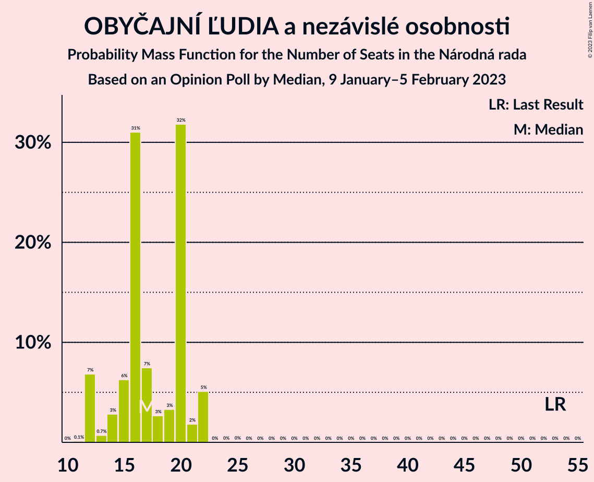
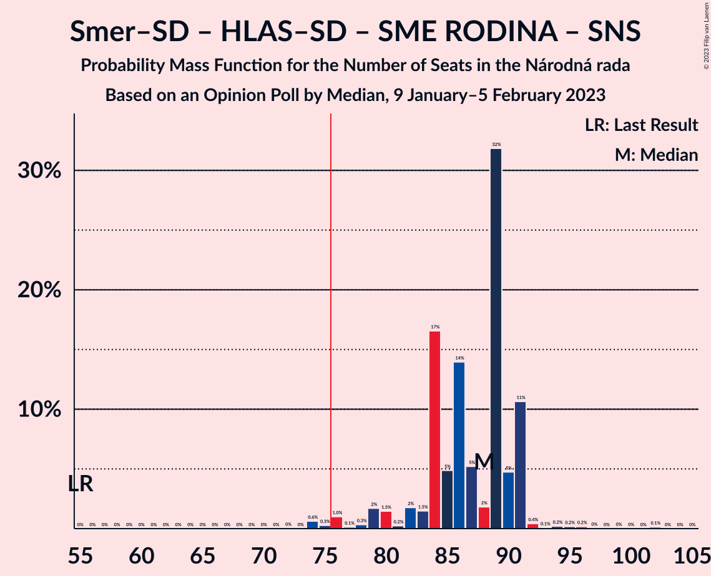

# Opinion Poll by Median, 9 January–5 February 2023

<a href="#voting-intentions">Voting Intentions</a> | <a href="#seats">Seats</a> | <a href="#coalitions">Coalitions</a> | <a href="#technical-information">Technical Information</a>

## Voting Intentions

### Confidence Intervals

| Party | Last Result | Poll Result | 80% Confidence Interval | 90% Confidence Interval | 95% Confidence Interval | 99% Confidence Interval |
|:-----:|:-----------:|:-----------:|:-----------------------:|:-----------------------:|:-----------------------:|:-----------------------:|
| SMER–sociálna demokracia | 18.3% | 17.9% | 16.4–19.5% |16.0–20.0% |15.7–20.3% |15.0–21.1% |
| HLAS–sociálna demokracia | 0.0% | 15.6% | 14.3–17.2% |13.9–17.6% |13.5–18.0% |12.9–18.8% |
| SME RODINA | 8.2% | 10.9% | 9.7–12.2% |9.4–12.6% |9.1–12.9% |8.6–13.6% |
| Progresívne Slovensko | 7.0% | 9.6% | 8.5–10.9% |8.2–11.3% |8.0–11.6% |7.5–12.2% |
| OBYČAJNÍ ĽUDIA a nezávislé osobnosti | 25.0% | 8.7% | 7.7–10.0% |7.4–10.3% |7.2–10.6% |6.7–11.2% |
| Sloboda a Solidarita | 6.2% | 7.8% | 6.8–8.9% |6.5–9.3% |6.3–9.6% |5.9–10.2% |
| Kresťanskodemokratické hnutie | 4.6% | 6.4% | 5.5–7.5% |5.3–7.8% |5.1–8.1% |4.7–8.6% |
| REPUBLIKA | 0.0% | 4.5% | 3.7–5.4% |3.5–5.7% |3.4–5.9% |3.0–6.4% |
| Strana maďarskej koalície–Magyar Koalíció Pártja | 3.9% | 4.0% | 3.3–4.9% |3.1–5.1% |2.9–5.4% |2.7–5.8% |
| Kotleba–Ľudová strana Naše Slovensko | 8.0% | 2.4% | 1.9–3.2% |1.8–3.4% |1.6–3.6% |1.4–4.0% |
| Slovenská národná strana | 3.2% | 2.0% | 1.6–2.7% |1.4–2.9% |1.3–3.1% |1.1–3.5% |
| Za ľudí | 5.8% | 2.0% | 1.6–2.7% |1.4–2.9% |1.3–3.1% |1.1–3.5% |
| Dobrá voľba | 3.1% | 1.8% | 1.4–2.5% |1.3–2.7% |1.2–2.9% |1.0–3.2% |
| SPOLU–Občianska Demokracia | 7.0% | 1.2% | 0.8–1.7% |0.7–1.9% |0.7–2.0% |0.5–2.3% |

*Note:* The poll result column reflects the actual value used in the calculations. Published results may vary slightly, and in addition be rounded to fewer digits.

## Seats

### Confidence Intervals

| Party | Last Result | Median | 80% Confidence Interval | 90% Confidence Interval | 95% Confidence Interval | 99% Confidence Interval |
|:-----:|:-----------:|:------:|:-----------------------:|:-----------------------:|:-----------------------:|:-----------------------:|
| <a href="#smer–sociálna-demokracia">SMER–sociálna demokracia</a> | 38 | 36 | 33–38 |31–39 |30–42 |29–43 |
| <a href="#hlas–sociálna-demokracia">HLAS–sociálna demokracia</a> | 0 | 31 | 27–33 |26–33 |26–33 |24–35 |
| <a href="#sme-rodina">SME RODINA</a> | 17 | 21 | 20–23 |19–23 |17–23 |16–26 |
| <a href="#progresívne-slovensko">Progresívne Slovensko</a> | 0 | 16 | 14–18 |14–20 |14–21 |14–23 |
| <a href="#obyčajní-ľudia-a-nezávislé-osobnosti">OBYČAJNÍ ĽUDIA a nezávislé osobnosti</a> | 53 | 17 | 14–20 |12–22 |12–22 |12–22 |
| <a href="#sloboda-a-solidarita">Sloboda a Solidarita</a> | 13 | 15 | 14–16 |14–17 |13–18 |12–20 |
| <a href="#kresťanskodemokratické-hnutie">Kresťanskodemokratické hnutie</a> | 0 | 12 | 11–16 |10–16 |10–16 |0–16 |
| <a href="#republika">REPUBLIKA</a> | 0 | 0 | 0 |0–10 |0–10 |0–11 |
| <a href="#strana-maďarskej-koalície–magyar-koalíció-pártja">Strana maďarskej koalície–Magyar Koalíció Pártja</a> | 0 | 0 | 0–10 |0–10 |0–10 |0–10 |
| <a href="#kotleba–ľudová-strana-naše-slovensko">Kotleba–Ľudová strana Naše Slovensko</a> | 17 | 0 | 0 |0 |0 |0 |
| <a href="#slovenská-národná-strana">Slovenská národná strana</a> | 0 | 0 | 0 |0 |0 |0 |
| <a href="#za-ľudí">Za ľudí</a> | 12 | 0 | 0 |0 |0 |0 |
| <a href="#dobrá-voľba">Dobrá voľba</a> | 0 | 0 | 0 |0 |0 |0 |
| <a href="#spolu–občianska-demokracia">SPOLU–Občianska Demokracia</a> | 0 | 0 | 0 |0 |0 |0 |

### SMER–sociálna demokracia

*For a full overview of the results for this party, see the [SMER–sociálna demokracia](party-smer–sociálnademokracia.html) page.*

| Number of Seats | Probability | Accumulated | Special Marks |
|:---------------:|:-----------:|:-----------:|:-------------:|
| 27 | 0% | 100% |  |
| 28 | 0.2% | 99.9% |  |
| 29 | 2% | 99.7% |  |
| 30 | 1.3% | 98% |  |
| 31 | 2% | 97% |  |
| 32 | 0.9% | 95% |  |
| 33 | 7% | 94% |  |
| 34 | 8% | 87% |  |
| 35 | 27% | 79% |  |
| 36 | 39% | 52% | Median |
| 37 | 3% | 13% |  |
| 38 | 4% | 11% | Last Result |
| 39 | 2% | 6% |  |
| 40 | 0.7% | 4% |  |
| 41 | 0.4% | 3% |  |
| 42 | 2% | 3% |  |
| 43 | 0.1% | 0.5% |  |
| 44 | 0.3% | 0.4% |  |
| 45 | 0.2% | 0.2% |  |
| 46 | 0% | 0% |  |

### HLAS–sociálna demokracia

*For a full overview of the results for this party, see the [HLAS–sociálna demokracia](party-hlas–sociálnademokracia.html) page.*

| Number of Seats | Probability | Accumulated | Special Marks |
|:---------------:|:-----------:|:-----------:|:-------------:|
| 0 | 0% | 100% | Last Result |
| 1 | 0% | 100% |  |
| 2 | 0% | 100% |  |
| 3 | 0% | 100% |  |
| 4 | 0% | 100% |  |
| 5 | 0% | 100% |  |
| 6 | 0% | 100% |  |
| 7 | 0% | 100% |  |
| 8 | 0% | 100% |  |
| 9 | 0% | 100% |  |
| 10 | 0% | 100% |  |
| 11 | 0% | 100% |  |
| 12 | 0% | 100% |  |
| 13 | 0% | 100% |  |
| 14 | 0% | 100% |  |
| 15 | 0% | 100% |  |
| 16 | 0% | 100% |  |
| 17 | 0% | 100% |  |
| 18 | 0% | 100% |  |
| 19 | 0% | 100% |  |
| 20 | 0% | 100% |  |
| 21 | 0% | 100% |  |
| 22 | 0% | 100% |  |
| 23 | 0.1% | 100% |  |
| 24 | 1.0% | 99.9% |  |
| 25 | 0.7% | 98.9% |  |
| 26 | 3% | 98% |  |
| 27 | 9% | 95% |  |
| 28 | 12% | 86% |  |
| 29 | 3% | 74% |  |
| 30 | 15% | 71% |  |
| 31 | 7% | 56% | Median |
| 32 | 6% | 49% |  |
| 33 | 42% | 43% |  |
| 34 | 0.2% | 1.3% |  |
| 35 | 0.7% | 1.1% |  |
| 36 | 0.2% | 0.4% |  |
| 37 | 0.1% | 0.1% |  |
| 38 | 0% | 0% |  |

### SME RODINA

*For a full overview of the results for this party, see the [SME RODINA](party-smerodina.html) page.*

| Number of Seats | Probability | Accumulated | Special Marks |
|:---------------:|:-----------:|:-----------:|:-------------:|
| 14 | 0.1% | 100% |  |
| 15 | 0% | 99.9% |  |
| 16 | 0.7% | 99.9% |  |
| 17 | 2% | 99.2% | Last Result |
| 18 | 2% | 97% |  |
| 19 | 5% | 96% |  |
| 20 | 36% | 91% |  |
| 21 | 34% | 55% | Median |
| 22 | 10% | 21% |  |
| 23 | 9% | 11% |  |
| 24 | 0.7% | 2% |  |
| 25 | 0.7% | 1.3% |  |
| 26 | 0.2% | 0.5% |  |
| 27 | 0.1% | 0.3% |  |
| 28 | 0.3% | 0.3% |  |
| 29 | 0% | 0% |  |

### Progresívne Slovensko

*For a full overview of the results for this party, see the [Progresívne Slovensko](party-progresívneslovensko.html) page.*

| Number of Seats | Probability | Accumulated | Special Marks |
|:---------------:|:-----------:|:-----------:|:-------------:|
| 0 | 0% | 100% | Last Result |
| 1 | 0% | 100% |  |
| 2 | 0% | 100% |  |
| 3 | 0% | 100% |  |
| 4 | 0% | 100% |  |
| 5 | 0% | 100% |  |
| 6 | 0% | 100% |  |
| 7 | 0% | 100% |  |
| 8 | 0% | 100% |  |
| 9 | 0% | 100% |  |
| 10 | 0% | 100% |  |
| 11 | 0% | 100% |  |
| 12 | 0% | 100% |  |
| 13 | 0.2% | 100% |  |
| 14 | 31% | 99.8% |  |
| 15 | 14% | 69% |  |
| 16 | 12% | 55% | Median |
| 17 | 12% | 43% |  |
| 18 | 22% | 31% |  |
| 19 | 3% | 9% |  |
| 20 | 2% | 7% |  |
| 21 | 2% | 4% |  |
| 22 | 1.2% | 2% |  |
| 23 | 0.2% | 0.6% |  |
| 24 | 0.1% | 0.4% |  |
| 25 | 0.3% | 0.3% |  |
| 26 | 0% | 0% |  |

### OBYČAJNÍ ĽUDIA a nezávislé osobnosti

*For a full overview of the results for this party, see the [OBYČAJNÍ ĽUDIA a nezávislé osobnosti](party-obyčajníľudiaanezávisléosobnosti.html) page.*

| Number of Seats | Probability | Accumulated | Special Marks |
|:---------------:|:-----------:|:-----------:|:-------------:|
| 11 | 0.1% | 100% |  |
| 12 | 7% | 99.9% |  |
| 13 | 0.7% | 93% |  |
| 14 | 3% | 92% |  |
| 15 | 6% | 90% |  |
| 16 | 31% | 83% |  |
| 17 | 7% | 52% | Median |
| 18 | 3% | 45% |  |
| 19 | 3% | 42% |  |
| 20 | 32% | 39% |  |
| 21 | 2% | 7% |  |
| 22 | 5% | 5% |  |
| 23 | 0% | 0.1% |  |
| 24 | 0% | 0.1% |  |
| 25 | 0% | 0% |  |
| 26 | 0% | 0% |  |
| 27 | 0% | 0% |  |
| 28 | 0% | 0% |  |
| 29 | 0% | 0% |  |
| 30 | 0% | 0% |  |
| 31 | 0% | 0% |  |
| 32 | 0% | 0% |  |
| 33 | 0% | 0% |  |
| 34 | 0% | 0% |  |
| 35 | 0% | 0% |  |
| 36 | 0% | 0% |  |
| 37 | 0% | 0% |  |
| 38 | 0% | 0% |  |
| 39 | 0% | 0% |  |
| 40 | 0% | 0% |  |
| 41 | 0% | 0% |  |
| 42 | 0% | 0% |  |
| 43 | 0% | 0% |  |
| 44 | 0% | 0% |  |
| 45 | 0% | 0% |  |
| 46 | 0% | 0% |  |
| 47 | 0% | 0% |  |
| 48 | 0% | 0% |  |
| 49 | 0% | 0% |  |
| 50 | 0% | 0% |  |
| 51 | 0% | 0% |  |
| 52 | 0% | 0% |  |
| 53 | 0% | 0% | Last Result |

### Sloboda a Solidarita

*For a full overview of the results for this party, see the [Sloboda a Solidarita](party-slobodaasolidarita.html) page.*

| Number of Seats | Probability | Accumulated | Special Marks |
|:---------------:|:-----------:|:-----------:|:-------------:|
| 11 | 0.2% | 100% |  |
| 12 | 1.2% | 99.7% |  |
| 13 | 3% | 98.5% | Last Result |
| 14 | 30% | 95% |  |
| 15 | 43% | 66% | Median |
| 16 | 16% | 22% |  |
| 17 | 3% | 6% |  |
| 18 | 1.1% | 3% |  |
| 19 | 0.9% | 2% |  |
| 20 | 1.0% | 1.1% |  |
| 21 | 0.1% | 0.1% |  |
| 22 | 0% | 0% |  |

### Kresťanskodemokratické hnutie

*For a full overview of the results for this party, see the [Kresťanskodemokratické hnutie](party-kresťanskodemokratickéhnutie.html) page.*

| Number of Seats | Probability | Accumulated | Special Marks |
|:---------------:|:-----------:|:-----------:|:-------------:|
| 0 | 1.2% | 100% | Last Result |
| 1 | 0% | 98.8% |  |
| 2 | 0% | 98.8% |  |
| 3 | 0% | 98.8% |  |
| 4 | 0% | 98.8% |  |
| 5 | 0% | 98.8% |  |
| 6 | 0% | 98.8% |  |
| 7 | 0% | 98.8% |  |
| 8 | 0% | 98.8% |  |
| 9 | 0.6% | 98.8% |  |
| 10 | 5% | 98% |  |
| 11 | 13% | 93% |  |
| 12 | 42% | 80% | Median |
| 13 | 6% | 38% |  |
| 14 | 4% | 32% |  |
| 15 | 13% | 27% |  |
| 16 | 14% | 14% |  |
| 17 | 0.3% | 0.3% |  |
| 18 | 0% | 0% |  |

### REPUBLIKA

*For a full overview of the results for this party, see the [REPUBLIKA](party-republika.html) page.*

| Number of Seats | Probability | Accumulated | Special Marks |
|:---------------:|:-----------:|:-----------:|:-------------:|
| 0 | 94% | 100% | Last Result, Median |
| 1 | 0% | 6% |  |
| 2 | 0% | 6% |  |
| 3 | 0% | 6% |  |
| 4 | 0% | 6% |  |
| 5 | 0% | 6% |  |
| 6 | 0% | 6% |  |
| 7 | 0% | 6% |  |
| 8 | 0% | 6% |  |
| 9 | 0.7% | 6% |  |
| 10 | 4% | 6% |  |
| 11 | 1.1% | 1.4% |  |
| 12 | 0.3% | 0.3% |  |
| 13 | 0% | 0% |  |

### Strana maďarskej koalície–Magyar Koalíció Pártja

*For a full overview of the results for this party, see the [Strana maďarskej koalície–Magyar Koalíció Pártja](party-stranamaďarskejkoalície–magyarkoalíciópártja.html) page.*

| Number of Seats | Probability | Accumulated | Special Marks |
|:---------------:|:-----------:|:-----------:|:-------------:|
| 0 | 89% | 100% | Last Result, Median |
| 1 | 0% | 11% |  |
| 2 | 0% | 11% |  |
| 3 | 0% | 11% |  |
| 4 | 0% | 11% |  |
| 5 | 0% | 11% |  |
| 6 | 0% | 11% |  |
| 7 | 0% | 11% |  |
| 8 | 0% | 11% |  |
| 9 | 0.7% | 11% |  |
| 10 | 10% | 11% |  |
| 11 | 0.2% | 0.3% |  |
| 12 | 0.1% | 0.1% |  |
| 13 | 0% | 0% |  |

### Kotleba–Ľudová strana Naše Slovensko

*For a full overview of the results for this party, see the [Kotleba–Ľudová strana Naše Slovensko](party-kotleba–ľudovástrananašeslovensko.html) page.*

| Number of Seats | Probability | Accumulated | Special Marks |
|:---------------:|:-----------:|:-----------:|:-------------:|
| 0 | 100% | 100% | Median |
| 1 | 0% | 0% |  |
| 2 | 0% | 0% |  |
| 3 | 0% | 0% |  |
| 4 | 0% | 0% |  |
| 5 | 0% | 0% |  |
| 6 | 0% | 0% |  |
| 7 | 0% | 0% |  |
| 8 | 0% | 0% |  |
| 9 | 0% | 0% |  |
| 10 | 0% | 0% |  |
| 11 | 0% | 0% |  |
| 12 | 0% | 0% |  |
| 13 | 0% | 0% |  |
| 14 | 0% | 0% |  |
| 15 | 0% | 0% |  |
| 16 | 0% | 0% |  |
| 17 | 0% | 0% | Last Result |

### Slovenská národná strana

*For a full overview of the results for this party, see the [Slovenská národná strana](party-slovenskánárodnástrana.html) page.*

| Number of Seats | Probability | Accumulated | Special Marks |
|:---------------:|:-----------:|:-----------:|:-------------:|
| 0 | 100% | 100% | Last Result, Median |

### Za ľudí

*For a full overview of the results for this party, see the [Za ľudí](party-zaľudí.html) page.*

| Number of Seats | Probability | Accumulated | Special Marks |
|:---------------:|:-----------:|:-----------:|:-------------:|
| 0 | 100% | 100% | Median |
| 1 | 0% | 0% |  |
| 2 | 0% | 0% |  |
| 3 | 0% | 0% |  |
| 4 | 0% | 0% |  |
| 5 | 0% | 0% |  |
| 6 | 0% | 0% |  |
| 7 | 0% | 0% |  |
| 8 | 0% | 0% |  |
| 9 | 0% | 0% |  |
| 10 | 0% | 0% |  |
| 11 | 0% | 0% |  |
| 12 | 0% | 0% | Last Result |

### Dobrá voľba

*For a full overview of the results for this party, see the [Dobrá voľba](party-dobrávoľba.html) page.*

| Number of Seats | Probability | Accumulated | Special Marks |
|:---------------:|:-----------:|:-----------:|:-------------:|
| 0 | 100% | 100% | Last Result, Median |

### SPOLU–Občianska Demokracia

*For a full overview of the results for this party, see the [SPOLU–Občianska Demokracia](party-spolu–občianskademokracia.html) page.*

| Number of Seats | Probability | Accumulated | Special Marks |
|:---------------:|:-----------:|:-----------:|:-------------:|
| 0 | 100% | 100% | Last Result, Median |

## Coalitions

### Confidence Intervals

| Coalition | Last Result | Median | Majority? | 80% Confidence Interval | 90% Confidence Interval | 95% Confidence Interval | 99% Confidence Interval |
|:---------:|:-----------:|:------:|:---------:|:-----------------------:|:-----------------------:|:-----------------------:|:-----------------------:|
| SMER–sociálna demokracia – HLAS–sociálna demokracia – SME RODINA – Kotleba–Ľudová strana Naše Slovensko – Slovenská národná strana | 72 | 88 | 99.1% | 84–91 | 80–91 | 79–91 | 74–95 |
| SMER–sociálna demokracia – HLAS–sociálna demokracia – SME RODINA | 55 | 88 | 99.1% | 84–91 | 80–91 | 79–91 | 74–95 |
| SMER–sociálna demokracia – HLAS–sociálna demokracia – SME RODINA – Slovenská národná strana | 55 | 88 | 99.1% | 84–91 | 80–91 | 79–91 | 74–95 |
| SMER–sociálna demokracia – HLAS–sociálna demokracia – Slovenská národná strana | 38 | 67 | 0.2% | 61–69 | 61–69 | 58–70 | 55–74 |
| SMER–sociálna demokracia – SME RODINA – Kotleba–Ľudová strana Naše Slovensko – Slovenská národná strana | 72 | 56 | 0% | 54–58 | 51–60 | 50–64 | 49–64 |
| SMER–sociálna demokracia – SME RODINA | 55 | 56 | 0% | 54–58 | 51–60 | 50–64 | 49–64 |
| SMER–sociálna demokracia – SME RODINA – Slovenská národná strana | 55 | 56 | 0% | 54–58 | 51–60 | 50–64 | 49–64 |
| HLAS–sociálna demokracia – SME RODINA – Kotleba–Ľudová strana Naše Slovensko – Slovenská národná strana | 34 | 51 | 0% | 49–55 | 46–55 | 45–55 | 43–57 |
| HLAS–sociálna demokracia – SME RODINA | 17 | 51 | 0% | 49–55 | 46–55 | 45–55 | 43–57 |
| HLAS–sociálna demokracia – SME RODINA – Slovenská národná strana | 17 | 51 | 0% | 49–55 | 46–55 | 45–55 | 43–57 |
| SMER–sociálna demokracia | 38 | 36 | 0% | 33–38 | 31–39 | 30–42 | 29–43 |
| SMER–sociálna demokracia – Slovenská národná strana | 38 | 36 | 0% | 33–38 | 31–39 | 30–42 | 29–43 |
| HLAS–sociálna demokracia – Slovenská národná strana | 0 | 31 | 0% | 27–33 | 26–33 | 26–33 | 24–35 |

### SMER–sociálna demokracia – HLAS–sociálna demokracia – SME RODINA – Kotleba–Ľudová strana Naše Slovensko – Slovenská národná strana

| Number of Seats | Probability | Accumulated | Special Marks |
|:---------------:|:-----------:|:-----------:|:-------------:|
| 72 | 0% | 100% | Last Result |
| 73 | 0% | 100% |  |
| 74 | 0.6% | 100% |  |
| 75 | 0.3% | 99.3% |  |
| 76 | 1.0% | 99.1% | Majority |
| 77 | 0.1% | 98% |  |
| 78 | 0.3% | 98% |  |
| 79 | 2% | 98% |  |
| 80 | 1.5% | 96% |  |
| 81 | 0.2% | 94% |  |
| 82 | 2% | 94% |  |
| 83 | 1.5% | 92% |  |
| 84 | 17% | 91% |  |
| 85 | 5% | 74% |  |
| 86 | 14% | 69% |  |
| 87 | 5% | 56% |  |
| 88 | 2% | 50% | Median |
| 89 | 32% | 49% |  |
| 90 | 5% | 17% |  |
| 91 | 11% | 12% |  |
| 92 | 0.4% | 1.3% |  |
| 93 | 0.1% | 0.8% |  |
| 94 | 0.2% | 0.8% |  |
| 95 | 0.2% | 0.6% |  |
| 96 | 0.2% | 0.4% |  |
| 97 | 0% | 0.2% |  |
| 98 | 0% | 0.2% |  |
| 99 | 0% | 0.2% |  |
| 100 | 0% | 0.1% |  |
| 101 | 0% | 0.1% |  |
| 102 | 0.1% | 0.1% |  |
| 103 | 0% | 0% |  |

### SMER–sociálna demokracia – HLAS–sociálna demokracia – SME RODINA

| Number of Seats | Probability | Accumulated | Special Marks |
|:---------------:|:-----------:|:-----------:|:-------------:|
| 55 | 0% | 100% | Last Result |
| 56 | 0% | 100% |  |
| 57 | 0% | 100% |  |
| 58 | 0% | 100% |  |
| 59 | 0% | 100% |  |
| 60 | 0% | 100% |  |
| 61 | 0% | 100% |  |
| 62 | 0% | 100% |  |
| 63 | 0% | 100% |  |
| 64 | 0% | 100% |  |
| 65 | 0% | 100% |  |
| 66 | 0% | 100% |  |
| 67 | 0% | 100% |  |
| 68 | 0% | 100% |  |
| 69 | 0% | 100% |  |
| 70 | 0% | 100% |  |
| 71 | 0% | 100% |  |
| 72 | 0% | 100% |  |
| 73 | 0% | 100% |  |
| 74 | 0.6% | 100% |  |
| 75 | 0.3% | 99.3% |  |
| 76 | 1.0% | 99.1% | Majority |
| 77 | 0.1% | 98% |  |
| 78 | 0.3% | 98% |  |
| 79 | 2% | 98% |  |
| 80 | 1.5% | 96% |  |
| 81 | 0.2% | 94% |  |
| 82 | 2% | 94% |  |
| 83 | 1.5% | 92% |  |
| 84 | 17% | 91% |  |
| 85 | 5% | 74% |  |
| 86 | 14% | 69% |  |
| 87 | 5% | 56% |  |
| 88 | 2% | 50% | Median |
| 89 | 32% | 49% |  |
| 90 | 5% | 17% |  |
| 91 | 11% | 12% |  |
| 92 | 0.4% | 1.3% |  |
| 93 | 0.1% | 0.8% |  |
| 94 | 0.2% | 0.8% |  |
| 95 | 0.2% | 0.6% |  |
| 96 | 0.2% | 0.4% |  |
| 97 | 0% | 0.2% |  |
| 98 | 0% | 0.2% |  |
| 99 | 0% | 0.2% |  |
| 100 | 0% | 0.1% |  |
| 101 | 0% | 0.1% |  |
| 102 | 0.1% | 0.1% |  |
| 103 | 0% | 0% |  |

### SMER–sociálna demokracia – HLAS–sociálna demokracia – SME RODINA – Slovenská národná strana

| Number of Seats | Probability | Accumulated | Special Marks |
|:---------------:|:-----------:|:-----------:|:-------------:|
| 55 | 0% | 100% | Last Result |
| 56 | 0% | 100% |  |
| 57 | 0% | 100% |  |
| 58 | 0% | 100% |  |
| 59 | 0% | 100% |  |
| 60 | 0% | 100% |  |
| 61 | 0% | 100% |  |
| 62 | 0% | 100% |  |
| 63 | 0% | 100% |  |
| 64 | 0% | 100% |  |
| 65 | 0% | 100% |  |
| 66 | 0% | 100% |  |
| 67 | 0% | 100% |  |
| 68 | 0% | 100% |  |
| 69 | 0% | 100% |  |
| 70 | 0% | 100% |  |
| 71 | 0% | 100% |  |
| 72 | 0% | 100% |  |
| 73 | 0% | 100% |  |
| 74 | 0.6% | 100% |  |
| 75 | 0.3% | 99.3% |  |
| 76 | 1.0% | 99.1% | Majority |
| 77 | 0.1% | 98% |  |
| 78 | 0.3% | 98% |  |
| 79 | 2% | 98% |  |
| 80 | 1.5% | 96% |  |
| 81 | 0.2% | 94% |  |
| 82 | 2% | 94% |  |
| 83 | 1.5% | 92% |  |
| 84 | 17% | 91% |  |
| 85 | 5% | 74% |  |
| 86 | 14% | 69% |  |
| 87 | 5% | 56% |  |
| 88 | 2% | 50% | Median |
| 89 | 32% | 49% |  |
| 90 | 5% | 17% |  |
| 91 | 11% | 12% |  |
| 92 | 0.4% | 1.3% |  |
| 93 | 0.1% | 0.8% |  |
| 94 | 0.2% | 0.8% |  |
| 95 | 0.2% | 0.6% |  |
| 96 | 0.2% | 0.4% |  |
| 97 | 0% | 0.2% |  |
| 98 | 0% | 0.2% |  |
| 99 | 0% | 0.2% |  |
| 100 | 0% | 0.1% |  |
| 101 | 0% | 0.1% |  |
| 102 | 0.1% | 0.1% |  |
| 103 | 0% | 0% |  |

### SMER–sociálna demokracia – HLAS–sociálna demokracia – Slovenská národná strana

| Number of Seats | Probability | Accumulated | Special Marks |
|:---------------:|:-----------:|:-----------:|:-------------:|
| 38 | 0% | 100% | Last Result |
| 39 | 0% | 100% |  |
| 40 | 0% | 100% |  |
| 41 | 0% | 100% |  |
| 42 | 0% | 100% |  |
| 43 | 0% | 100% |  |
| 44 | 0% | 100% |  |
| 45 | 0% | 100% |  |
| 46 | 0% | 100% |  |
| 47 | 0% | 100% |  |
| 48 | 0% | 100% |  |
| 49 | 0% | 100% |  |
| 50 | 0% | 100% |  |
| 51 | 0% | 100% |  |
| 52 | 0% | 100% |  |
| 53 | 0% | 100% |  |
| 54 | 0.1% | 100% |  |
| 55 | 1.2% | 99.9% |  |
| 56 | 0.4% | 98.6% |  |
| 57 | 0.6% | 98% |  |
| 58 | 0.3% | 98% |  |
| 59 | 1.4% | 97% |  |
| 60 | 0.8% | 96% |  |
| 61 | 7% | 95% |  |
| 62 | 0.7% | 88% |  |
| 63 | 12% | 88% |  |
| 64 | 3% | 75% |  |
| 65 | 16% | 73% |  |
| 66 | 5% | 57% |  |
| 67 | 4% | 52% | Median |
| 68 | 3% | 48% |  |
| 69 | 41% | 45% |  |
| 70 | 2% | 3% |  |
| 71 | 0.4% | 1.3% |  |
| 72 | 0.1% | 0.9% |  |
| 73 | 0.3% | 0.8% |  |
| 74 | 0.3% | 0.5% |  |
| 75 | 0% | 0.2% |  |
| 76 | 0.1% | 0.2% | Majority |
| 77 | 0% | 0.1% |  |
| 78 | 0.1% | 0.1% |  |
| 79 | 0% | 0% |  |

### SMER–sociálna demokracia – SME RODINA – Kotleba–Ľudová strana Naše Slovensko – Slovenská národná strana

| Number of Seats | Probability | Accumulated | Special Marks |
|:---------------:|:-----------:|:-----------:|:-------------:|
| 43 | 0.1% | 100% |  |
| 44 | 0% | 99.9% |  |
| 45 | 0% | 99.9% |  |
| 46 | 0.1% | 99.9% |  |
| 47 | 0.2% | 99.8% |  |
| 48 | 0.1% | 99.6% |  |
| 49 | 0.3% | 99.5% |  |
| 50 | 2% | 99.2% |  |
| 51 | 2% | 97% |  |
| 52 | 3% | 95% |  |
| 53 | 1.2% | 92% |  |
| 54 | 6% | 91% |  |
| 55 | 1.4% | 84% |  |
| 56 | 55% | 83% |  |
| 57 | 6% | 28% | Median |
| 58 | 13% | 21% |  |
| 59 | 2% | 9% |  |
| 60 | 3% | 6% |  |
| 61 | 0.4% | 4% |  |
| 62 | 0.1% | 3% |  |
| 63 | 0.2% | 3% |  |
| 64 | 2% | 3% |  |
| 65 | 0.1% | 0.5% |  |
| 66 | 0.3% | 0.4% |  |
| 67 | 0% | 0.1% |  |
| 68 | 0% | 0.1% |  |
| 69 | 0.1% | 0.1% |  |
| 70 | 0% | 0% |  |
| 71 | 0% | 0% |  |
| 72 | 0% | 0% | Last Result |

### SMER–sociálna demokracia – SME RODINA

| Number of Seats | Probability | Accumulated | Special Marks |
|:---------------:|:-----------:|:-----------:|:-------------:|
| 43 | 0.1% | 100% |  |
| 44 | 0% | 99.9% |  |
| 45 | 0% | 99.9% |  |
| 46 | 0.1% | 99.9% |  |
| 47 | 0.2% | 99.8% |  |
| 48 | 0.1% | 99.6% |  |
| 49 | 0.3% | 99.5% |  |
| 50 | 2% | 99.2% |  |
| 51 | 2% | 97% |  |
| 52 | 3% | 95% |  |
| 53 | 1.2% | 92% |  |
| 54 | 6% | 91% |  |
| 55 | 1.4% | 84% | Last Result |
| 56 | 55% | 83% |  |
| 57 | 6% | 28% | Median |
| 58 | 13% | 21% |  |
| 59 | 2% | 9% |  |
| 60 | 3% | 6% |  |
| 61 | 0.4% | 4% |  |
| 62 | 0.1% | 3% |  |
| 63 | 0.2% | 3% |  |
| 64 | 2% | 3% |  |
| 65 | 0.1% | 0.5% |  |
| 66 | 0.3% | 0.4% |  |
| 67 | 0% | 0.1% |  |
| 68 | 0% | 0.1% |  |
| 69 | 0.1% | 0.1% |  |
| 70 | 0% | 0% |  |

### SMER–sociálna demokracia – SME RODINA – Slovenská národná strana

| Number of Seats | Probability | Accumulated | Special Marks |
|:---------------:|:-----------:|:-----------:|:-------------:|
| 43 | 0.1% | 100% |  |
| 44 | 0% | 99.9% |  |
| 45 | 0% | 99.9% |  |
| 46 | 0.1% | 99.9% |  |
| 47 | 0.2% | 99.8% |  |
| 48 | 0.1% | 99.6% |  |
| 49 | 0.3% | 99.5% |  |
| 50 | 2% | 99.2% |  |
| 51 | 2% | 97% |  |
| 52 | 3% | 95% |  |
| 53 | 1.2% | 92% |  |
| 54 | 6% | 91% |  |
| 55 | 1.4% | 84% | Last Result |
| 56 | 55% | 83% |  |
| 57 | 6% | 28% | Median |
| 58 | 13% | 21% |  |
| 59 | 2% | 9% |  |
| 60 | 3% | 6% |  |
| 61 | 0.4% | 4% |  |
| 62 | 0.1% | 3% |  |
| 63 | 0.2% | 3% |  |
| 64 | 2% | 3% |  |
| 65 | 0.1% | 0.5% |  |
| 66 | 0.3% | 0.4% |  |
| 67 | 0% | 0.1% |  |
| 68 | 0% | 0.1% |  |
| 69 | 0.1% | 0.1% |  |
| 70 | 0% | 0% |  |

### HLAS–sociálna demokracia – SME RODINA – Kotleba–Ľudová strana Naše Slovensko – Slovenská národná strana

| Number of Seats | Probability | Accumulated | Special Marks |
|:---------------:|:-----------:|:-----------:|:-------------:|
| 34 | 0% | 100% | Last Result |
| 35 | 0% | 100% |  |
| 36 | 0% | 100% |  |
| 37 | 0% | 100% |  |
| 38 | 0% | 100% |  |
| 39 | 0% | 100% |  |
| 40 | 0% | 100% |  |
| 41 | 0.1% | 100% |  |
| 42 | 0.1% | 99.9% |  |
| 43 | 0.8% | 99.8% |  |
| 44 | 0.6% | 99.0% |  |
| 45 | 1.4% | 98% |  |
| 46 | 3% | 97% |  |
| 47 | 1.3% | 94% |  |
| 48 | 2% | 93% |  |
| 49 | 13% | 91% |  |
| 50 | 8% | 78% |  |
| 51 | 22% | 71% |  |
| 52 | 1.3% | 49% | Median |
| 53 | 31% | 48% |  |
| 54 | 5% | 16% |  |
| 55 | 10% | 11% |  |
| 56 | 0.6% | 1.2% |  |
| 57 | 0.2% | 0.6% |  |
| 58 | 0.1% | 0.4% |  |
| 59 | 0.2% | 0.3% |  |
| 60 | 0% | 0.2% |  |
| 61 | 0.1% | 0.1% |  |
| 62 | 0% | 0% |  |

### HLAS–sociálna demokracia – SME RODINA

| Number of Seats | Probability | Accumulated | Special Marks |
|:---------------:|:-----------:|:-----------:|:-------------:|
| 17 | 0% | 100% | Last Result |
| 18 | 0% | 100% |  |
| 19 | 0% | 100% |  |
| 20 | 0% | 100% |  |
| 21 | 0% | 100% |  |
| 22 | 0% | 100% |  |
| 23 | 0% | 100% |  |
| 24 | 0% | 100% |  |
| 25 | 0% | 100% |  |
| 26 | 0% | 100% |  |
| 27 | 0% | 100% |  |
| 28 | 0% | 100% |  |
| 29 | 0% | 100% |  |
| 30 | 0% | 100% |  |
| 31 | 0% | 100% |  |
| 32 | 0% | 100% |  |
| 33 | 0% | 100% |  |
| 34 | 0% | 100% |  |
| 35 | 0% | 100% |  |
| 36 | 0% | 100% |  |
| 37 | 0% | 100% |  |
| 38 | 0% | 100% |  |
| 39 | 0% | 100% |  |
| 40 | 0% | 100% |  |
| 41 | 0.1% | 100% |  |
| 42 | 0.1% | 99.9% |  |
| 43 | 0.8% | 99.8% |  |
| 44 | 0.6% | 99.0% |  |
| 45 | 1.4% | 98% |  |
| 46 | 3% | 97% |  |
| 47 | 1.3% | 94% |  |
| 48 | 2% | 93% |  |
| 49 | 13% | 91% |  |
| 50 | 8% | 78% |  |
| 51 | 22% | 71% |  |
| 52 | 1.3% | 49% | Median |
| 53 | 31% | 48% |  |
| 54 | 5% | 16% |  |
| 55 | 10% | 11% |  |
| 56 | 0.6% | 1.2% |  |
| 57 | 0.2% | 0.6% |  |
| 58 | 0.1% | 0.4% |  |
| 59 | 0.2% | 0.3% |  |
| 60 | 0% | 0.2% |  |
| 61 | 0.1% | 0.1% |  |
| 62 | 0% | 0% |  |

### HLAS–sociálna demokracia – SME RODINA – Slovenská národná strana

| Number of Seats | Probability | Accumulated | Special Marks |
|:---------------:|:-----------:|:-----------:|:-------------:|
| 17 | 0% | 100% | Last Result |
| 18 | 0% | 100% |  |
| 19 | 0% | 100% |  |
| 20 | 0% | 100% |  |
| 21 | 0% | 100% |  |
| 22 | 0% | 100% |  |
| 23 | 0% | 100% |  |
| 24 | 0% | 100% |  |
| 25 | 0% | 100% |  |
| 26 | 0% | 100% |  |
| 27 | 0% | 100% |  |
| 28 | 0% | 100% |  |
| 29 | 0% | 100% |  |
| 30 | 0% | 100% |  |
| 31 | 0% | 100% |  |
| 32 | 0% | 100% |  |
| 33 | 0% | 100% |  |
| 34 | 0% | 100% |  |
| 35 | 0% | 100% |  |
| 36 | 0% | 100% |  |
| 37 | 0% | 100% |  |
| 38 | 0% | 100% |  |
| 39 | 0% | 100% |  |
| 40 | 0% | 100% |  |
| 41 | 0.1% | 100% |  |
| 42 | 0.1% | 99.9% |  |
| 43 | 0.8% | 99.8% |  |
| 44 | 0.6% | 99.0% |  |
| 45 | 1.4% | 98% |  |
| 46 | 3% | 97% |  |
| 47 | 1.3% | 94% |  |
| 48 | 2% | 93% |  |
| 49 | 13% | 91% |  |
| 50 | 8% | 78% |  |
| 51 | 22% | 71% |  |
| 52 | 1.3% | 49% | Median |
| 53 | 31% | 48% |  |
| 54 | 5% | 16% |  |
| 55 | 10% | 11% |  |
| 56 | 0.6% | 1.2% |  |
| 57 | 0.2% | 0.6% |  |
| 58 | 0.1% | 0.4% |  |
| 59 | 0.2% | 0.3% |  |
| 60 | 0% | 0.2% |  |
| 61 | 0.1% | 0.1% |  |
| 62 | 0% | 0% |  |

### SMER–sociálna demokracia

| Number of Seats | Probability | Accumulated | Special Marks |
|:---------------:|:-----------:|:-----------:|:-------------:|
| 27 | 0% | 100% |  |
| 28 | 0.2% | 99.9% |  |
| 29 | 2% | 99.7% |  |
| 30 | 1.3% | 98% |  |
| 31 | 2% | 97% |  |
| 32 | 0.9% | 95% |  |
| 33 | 7% | 94% |  |
| 34 | 8% | 87% |  |
| 35 | 27% | 79% |  |
| 36 | 39% | 52% | Median |
| 37 | 3% | 13% |  |
| 38 | 4% | 11% | Last Result |
| 39 | 2% | 6% |  |
| 40 | 0.7% | 4% |  |
| 41 | 0.4% | 3% |  |
| 42 | 2% | 3% |  |
| 43 | 0.1% | 0.5% |  |
| 44 | 0.3% | 0.4% |  |
| 45 | 0.2% | 0.2% |  |
| 46 | 0% | 0% |  |

### SMER–sociálna demokracia – Slovenská národná strana

| Number of Seats | Probability | Accumulated | Special Marks |
|:---------------:|:-----------:|:-----------:|:-------------:|
| 27 | 0% | 100% |  |
| 28 | 0.2% | 99.9% |  |
| 29 | 2% | 99.7% |  |
| 30 | 1.3% | 98% |  |
| 31 | 2% | 97% |  |
| 32 | 0.9% | 95% |  |
| 33 | 7% | 94% |  |
| 34 | 8% | 87% |  |
| 35 | 27% | 79% |  |
| 36 | 39% | 52% | Median |
| 37 | 3% | 13% |  |
| 38 | 4% | 11% | Last Result |
| 39 | 2% | 6% |  |
| 40 | 0.7% | 4% |  |
| 41 | 0.4% | 3% |  |
| 42 | 2% | 3% |  |
| 43 | 0.1% | 0.5% |  |
| 44 | 0.3% | 0.4% |  |
| 45 | 0.2% | 0.2% |  |
| 46 | 0% | 0% |  |

### HLAS–sociálna demokracia – Slovenská národná strana

| Number of Seats | Probability | Accumulated | Special Marks |
|:---------------:|:-----------:|:-----------:|:-------------:|
| 0 | 0% | 100% | Last Result |
| 1 | 0% | 100% |  |
| 2 | 0% | 100% |  |
| 3 | 0% | 100% |  |
| 4 | 0% | 100% |  |
| 5 | 0% | 100% |  |
| 6 | 0% | 100% |  |
| 7 | 0% | 100% |  |
| 8 | 0% | 100% |  |
| 9 | 0% | 100% |  |
| 10 | 0% | 100% |  |
| 11 | 0% | 100% |  |
| 12 | 0% | 100% |  |
| 13 | 0% | 100% |  |
| 14 | 0% | 100% |  |
| 15 | 0% | 100% |  |
| 16 | 0% | 100% |  |
| 17 | 0% | 100% |  |
| 18 | 0% | 100% |  |
| 19 | 0% | 100% |  |
| 20 | 0% | 100% |  |
| 21 | 0% | 100% |  |
| 22 | 0% | 100% |  |
| 23 | 0.1% | 100% |  |
| 24 | 1.0% | 99.9% |  |
| 25 | 0.7% | 98.9% |  |
| 26 | 3% | 98% |  |
| 27 | 9% | 95% |  |
| 28 | 12% | 86% |  |
| 29 | 3% | 74% |  |
| 30 | 15% | 71% |  |
| 31 | 7% | 56% | Median |
| 32 | 6% | 49% |  |
| 33 | 42% | 43% |  |
| 34 | 0.2% | 1.3% |  |
| 35 | 0.7% | 1.1% |  |
| 36 | 0.2% | 0.4% |  |
| 37 | 0.1% | 0.1% |  |
| 38 | 0% | 0% |  |

## Technical Information

### Opinion Poll

+ **Polling firm:** Median
+ **Commissioner(s):** —
+ **Fieldwork period:** 9 January–5 February 2023

### Calculations

+ **Sample size:** 1029
+ **Simulations done:** 1,048,576
+ **Error estimate:** 1.65%

