# Opinion Poll by Median, 1 February–5 March 2023

<a href="#voting-intentions">Voting Intentions</a> | <a href="#seats">Seats</a> | <a href="#coalitions">Coalitions</a> | <a href="#technical-information">Technical Information</a>

## Voting Intentions

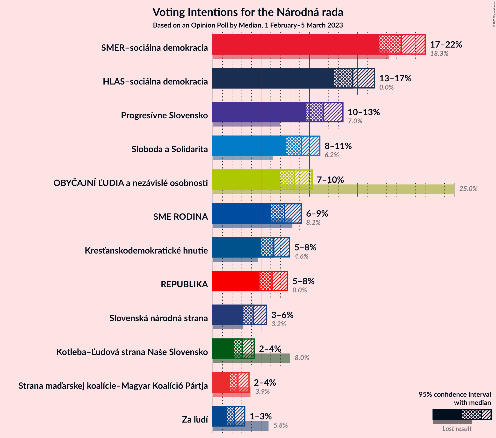

### Confidence Intervals

| Party | Last Result | Poll Result | 80% Confidence Interval | 90% Confidence Interval | 95% Confidence Interval | 99% Confidence Interval |
|:-----:|:-----------:|:-----------:|:-----------------------:|:-----------------------:|:-----------------------:|:-----------------------:|
| SMER–sociálna demokracia | 18.3% | 19.5% | 18.0–21.1% |17.6–21.6% |17.3–22.0% |16.6–22.8% |
| HLAS–sociálna demokracia | 0.0% | 14.5% | 13.2–16.0% |12.8–16.4% |12.5–16.7% |11.9–17.5% |
| Progresívne Slovensko | 7.0% | 11.4% | 10.3–12.8% |9.9–13.2% |9.7–13.5% |9.1–14.1% |
| Sloboda a Solidarita | 6.2% | 9.2% | 8.2–10.4% |7.9–10.8% |7.6–11.1% |7.1–11.7% |
| OBYČAJNÍ ĽUDIA a nezávislé osobnosti | 25.0% | 8.5% | 7.5–9.6% |7.2–10.0% |6.9–10.3% |6.5–10.9% |
| SME RODINA | 8.2% | 7.4% | 6.5–8.6% |6.2–8.9% |6.0–9.2% |5.6–9.7% |
| Kresťanskodemokratické hnutie | 4.6% | 6.3% | 5.5–7.4% |5.2–7.7% |5.0–7.9% |4.6–8.5% |
| REPUBLIKA | 0.0% | 6.1% | 5.3–7.2% |5.0–7.5% |4.8–7.7% |4.5–8.3% |
| Slovenská národná strana | 3.2% | 4.2% | 3.5–5.1% |3.3–5.3% |3.1–5.6% |2.8–6.0% |
| Kotleba–Ľudová strana Naše Slovensko | 8.0% | 3.1% | 2.5–3.9% |2.3–4.1% |2.2–4.3% |1.9–4.7% |
| Strana maďarskej koalície–Magyar Koalíció Pártja | 3.9% | 2.6% | 2.1–3.3% |1.9–3.6% |1.8–3.7% |1.6–4.1% |
| Za ľudí | 5.8% | 2.2% | 1.8–2.9% |1.6–3.1% |1.5–3.3% |1.3–3.7% |

*Note:* The poll result column reflects the actual value used in the calculations. Published results may vary slightly, and in addition be rounded to fewer digits.

## Seats

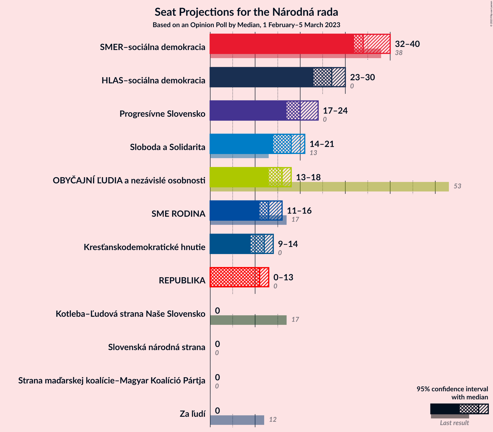

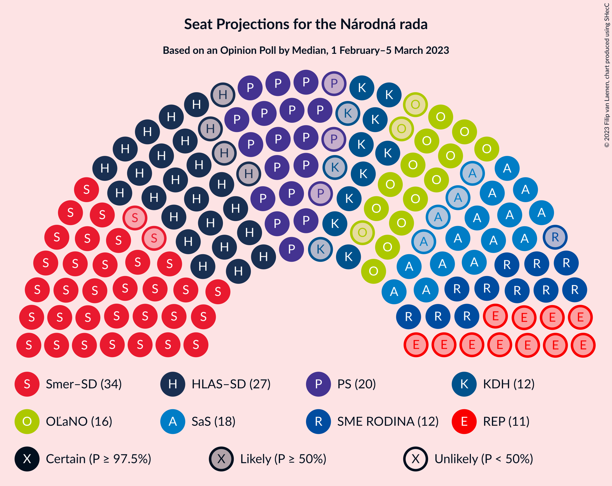

### Confidence Intervals

| Party | Last Result | Median | 80% Confidence Interval | 90% Confidence Interval | 95% Confidence Interval | 99% Confidence Interval |
|:-----:|:-----------:|:------:|:-----------------------:|:-----------------------:|:-----------------------:|:-----------------------:|
| <a href="#smer–sociálna-demokracia">SMER–sociálna demokracia</a> | 38 | 34 | 32–38 |32–39 |32–40 |31–41 |
| <a href="#hlas–sociálna-demokracia">HLAS–sociálna demokracia</a> | 0 | 27 | 24–28 |24–29 |23–30 |22–33 |
| <a href="#progresívne-slovensko">Progresívne Slovensko</a> | 0 | 20 | 18–22 |18–24 |17–24 |16–25 |
| <a href="#sloboda-a-solidarita">Sloboda a Solidarita</a> | 13 | 18 | 16–19 |15–20 |14–21 |13–21 |
| <a href="#obyčajní-ľudia-a-nezávislé-osobnosti">OBYČAJNÍ ĽUDIA a nezávislé osobnosti</a> | 53 | 16 | 13–17 |13–17 |13–18 |12–19 |
| <a href="#sme-rodina">SME RODINA</a> | 17 | 13 | 11–15 |11–15 |11–16 |10–18 |
| <a href="#kresťanskodemokratické-hnutie">Kresťanskodemokratické hnutie</a> | 0 | 12 | 9–14 |9–14 |9–14 |0–15 |
| <a href="#republika">REPUBLIKA</a> | 0 | 11 | 10–13 |10–13 |0–13 |0–14 |
| <a href="#slovenská-národná-strana">Slovenská národná strana</a> | 0 | 0 | 0 |0 |0 |0–9 |
| <a href="#kotleba–ľudová-strana-naše-slovensko">Kotleba–Ľudová strana Naše Slovensko</a> | 17 | 0 | 0 |0 |0 |0 |
| <a href="#strana-maďarskej-koalície–magyar-koalíció-pártja">Strana maďarskej koalície–Magyar Koalíció Pártja</a> | 0 | 0 | 0 |0 |0 |0 |
| <a href="#za-ľudí">Za ľudí</a> | 12 | 0 | 0 |0 |0 |0 |

### SMER–sociálna demokracia

*For a full overview of the results for this party, see the [SMER–sociálna demokracia](party-smer–sociálnademokracia.html) page.*

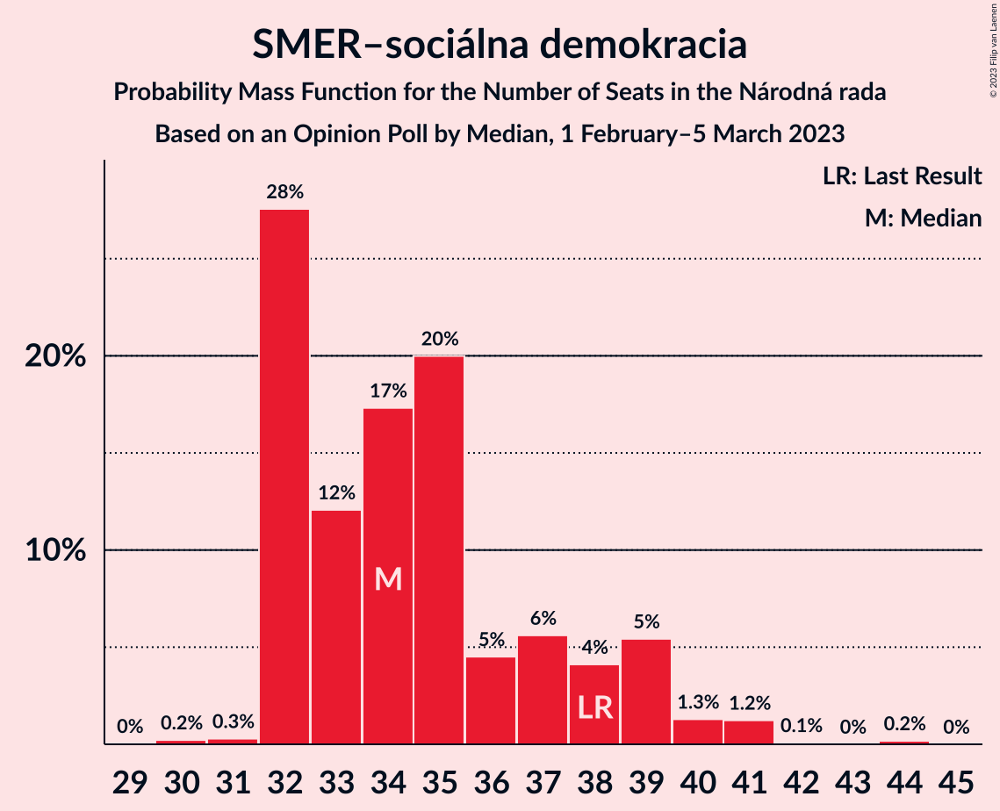

| Number of Seats | Probability | Accumulated | Special Marks |
|:---------------:|:-----------:|:-----------:|:-------------:|
| 29 | 0% | 100% |  |
| 30 | 0.2% | 99.9% |  |
| 31 | 0.3% | 99.7% |  |
| 32 | 28% | 99.4% |  |
| 33 | 12% | 72% |  |
| 34 | 17% | 60% | Median |
| 35 | 20% | 42% |  |
| 36 | 5% | 22% |  |
| 37 | 6% | 18% |  |
| 38 | 4% | 12% | Last Result |
| 39 | 5% | 8% |  |
| 40 | 1.3% | 3% |  |
| 41 | 1.2% | 2% |  |
| 42 | 0.1% | 0.3% |  |
| 43 | 0% | 0.2% |  |
| 44 | 0.2% | 0.2% |  |
| 45 | 0% | 0% |  |

### HLAS–sociálna demokracia

*For a full overview of the results for this party, see the [HLAS–sociálna demokracia](party-hlas–sociálnademokracia.html) page.*

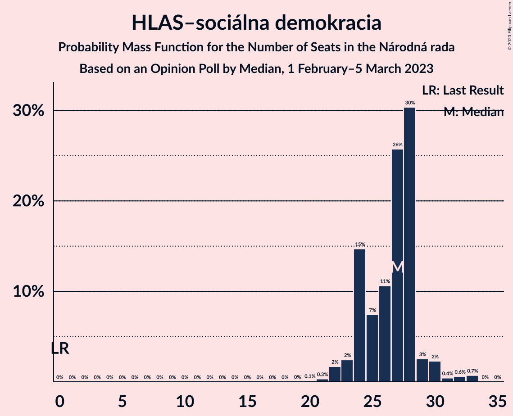

| Number of Seats | Probability | Accumulated | Special Marks |
|:---------------:|:-----------:|:-----------:|:-------------:|
| 0 | 0% | 100% | Last Result |
| 1 | 0% | 100% |  |
| 2 | 0% | 100% |  |
| 3 | 0% | 100% |  |
| 4 | 0% | 100% |  |
| 5 | 0% | 100% |  |
| 6 | 0% | 100% |  |
| 7 | 0% | 100% |  |
| 8 | 0% | 100% |  |
| 9 | 0% | 100% |  |
| 10 | 0% | 100% |  |
| 11 | 0% | 100% |  |
| 12 | 0% | 100% |  |
| 13 | 0% | 100% |  |
| 14 | 0% | 100% |  |
| 15 | 0% | 100% |  |
| 16 | 0% | 100% |  |
| 17 | 0% | 100% |  |
| 18 | 0% | 100% |  |
| 19 | 0% | 100% |  |
| 20 | 0.1% | 100% |  |
| 21 | 0.3% | 99.9% |  |
| 22 | 2% | 99.5% |  |
| 23 | 2% | 98% |  |
| 24 | 15% | 95% |  |
| 25 | 7% | 81% |  |
| 26 | 11% | 73% |  |
| 27 | 26% | 63% | Median |
| 28 | 30% | 37% |  |
| 29 | 3% | 7% |  |
| 30 | 2% | 4% |  |
| 31 | 0.4% | 2% |  |
| 32 | 0.6% | 1.3% |  |
| 33 | 0.7% | 0.7% |  |
| 34 | 0% | 0% |  |

### Progresívne Slovensko

*For a full overview of the results for this party, see the [Progresívne Slovensko](party-progresívneslovensko.html) page.*

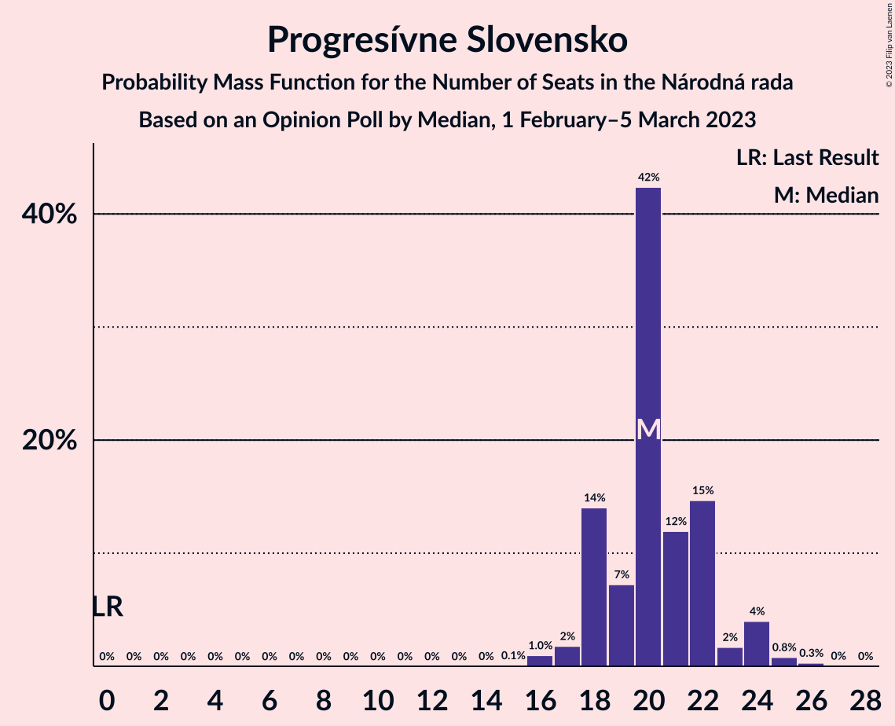

| Number of Seats | Probability | Accumulated | Special Marks |
|:---------------:|:-----------:|:-----------:|:-------------:|
| 0 | 0% | 100% | Last Result |
| 1 | 0% | 100% |  |
| 2 | 0% | 100% |  |
| 3 | 0% | 100% |  |
| 4 | 0% | 100% |  |
| 5 | 0% | 100% |  |
| 6 | 0% | 100% |  |
| 7 | 0% | 100% |  |
| 8 | 0% | 100% |  |
| 9 | 0% | 100% |  |
| 10 | 0% | 100% |  |
| 11 | 0% | 100% |  |
| 12 | 0% | 100% |  |
| 13 | 0% | 100% |  |
| 14 | 0% | 100% |  |
| 15 | 0.1% | 100% |  |
| 16 | 1.0% | 99.9% |  |
| 17 | 2% | 98.9% |  |
| 18 | 14% | 97% |  |
| 19 | 7% | 83% |  |
| 20 | 42% | 76% | Median |
| 21 | 12% | 33% |  |
| 22 | 15% | 22% |  |
| 23 | 2% | 7% |  |
| 24 | 4% | 5% |  |
| 25 | 0.8% | 1.2% |  |
| 26 | 0.3% | 0.4% |  |
| 27 | 0% | 0.1% |  |
| 28 | 0% | 0% |  |

### Sloboda a Solidarita

*For a full overview of the results for this party, see the [Sloboda a Solidarita](party-slobodaasolidarita.html) page.*

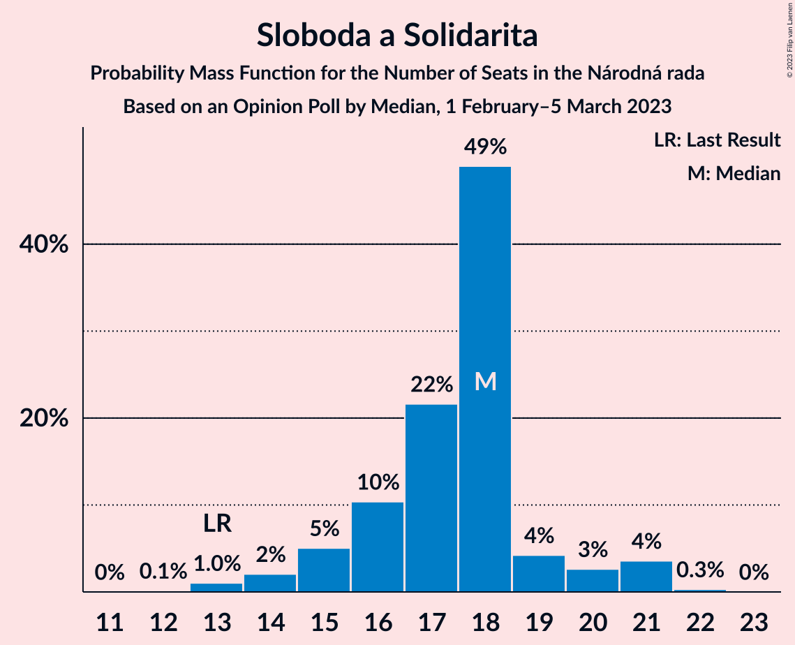

| Number of Seats | Probability | Accumulated | Special Marks |
|:---------------:|:-----------:|:-----------:|:-------------:|
| 12 | 0.1% | 100% |  |
| 13 | 1.0% | 99.9% | Last Result |
| 14 | 2% | 98.8% |  |
| 15 | 5% | 97% |  |
| 16 | 10% | 92% |  |
| 17 | 22% | 81% |  |
| 18 | 49% | 60% | Median |
| 19 | 4% | 11% |  |
| 20 | 3% | 7% |  |
| 21 | 4% | 4% |  |
| 22 | 0.3% | 0.3% |  |
| 23 | 0% | 0% |  |

### OBYČAJNÍ ĽUDIA a nezávislé osobnosti

*For a full overview of the results for this party, see the [OBYČAJNÍ ĽUDIA a nezávislé osobnosti](party-obyčajníľudiaanezávisléosobnosti.html) page.*

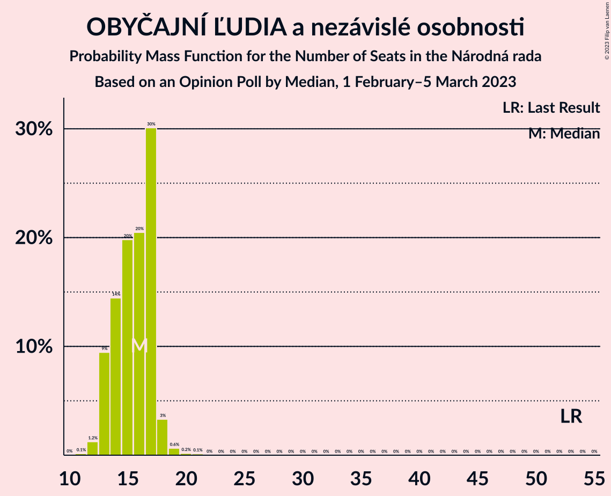

| Number of Seats | Probability | Accumulated | Special Marks |
|:---------------:|:-----------:|:-----------:|:-------------:|
| 11 | 0.1% | 100% |  |
| 12 | 1.2% | 99.8% |  |
| 13 | 9% | 98.6% |  |
| 14 | 14% | 89% |  |
| 15 | 20% | 75% |  |
| 16 | 20% | 55% | Median |
| 17 | 30% | 34% |  |
| 18 | 3% | 4% |  |
| 19 | 0.6% | 1.0% |  |
| 20 | 0.2% | 0.3% |  |
| 21 | 0.1% | 0.1% |  |
| 22 | 0% | 0% |  |
| 23 | 0% | 0% |  |
| 24 | 0% | 0% |  |
| 25 | 0% | 0% |  |
| 26 | 0% | 0% |  |
| 27 | 0% | 0% |  |
| 28 | 0% | 0% |  |
| 29 | 0% | 0% |  |
| 30 | 0% | 0% |  |
| 31 | 0% | 0% |  |
| 32 | 0% | 0% |  |
| 33 | 0% | 0% |  |
| 34 | 0% | 0% |  |
| 35 | 0% | 0% |  |
| 36 | 0% | 0% |  |
| 37 | 0% | 0% |  |
| 38 | 0% | 0% |  |
| 39 | 0% | 0% |  |
| 40 | 0% | 0% |  |
| 41 | 0% | 0% |  |
| 42 | 0% | 0% |  |
| 43 | 0% | 0% |  |
| 44 | 0% | 0% |  |
| 45 | 0% | 0% |  |
| 46 | 0% | 0% |  |
| 47 | 0% | 0% |  |
| 48 | 0% | 0% |  |
| 49 | 0% | 0% |  |
| 50 | 0% | 0% |  |
| 51 | 0% | 0% |  |
| 52 | 0% | 0% |  |
| 53 | 0% | 0% | Last Result |

### SME RODINA

*For a full overview of the results for this party, see the [SME RODINA](party-smerodina.html) page.*

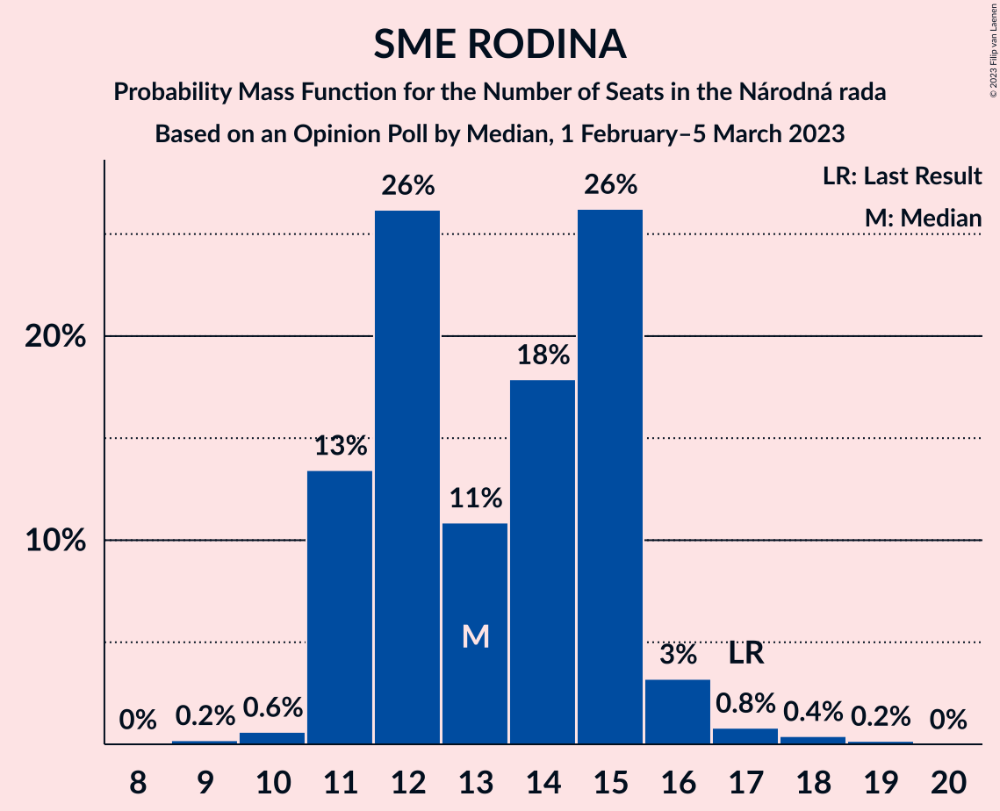

| Number of Seats | Probability | Accumulated | Special Marks |
|:---------------:|:-----------:|:-----------:|:-------------:|
| 9 | 0.2% | 100% |  |
| 10 | 0.6% | 99.8% |  |
| 11 | 13% | 99.2% |  |
| 12 | 26% | 86% |  |
| 13 | 11% | 60% | Median |
| 14 | 18% | 49% |  |
| 15 | 26% | 31% |  |
| 16 | 3% | 5% |  |
| 17 | 0.8% | 1.4% | Last Result |
| 18 | 0.4% | 0.6% |  |
| 19 | 0.2% | 0.2% |  |
| 20 | 0% | 0% |  |

### Kresťanskodemokratické hnutie

*For a full overview of the results for this party, see the [Kresťanskodemokratické hnutie](party-kresťanskodemokratickéhnutie.html) page.*

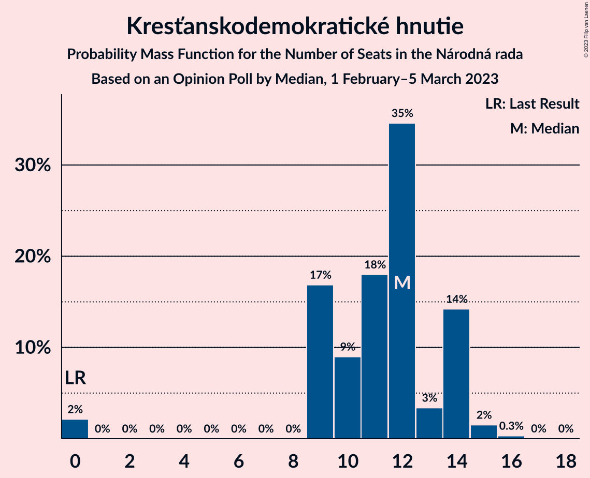

| Number of Seats | Probability | Accumulated | Special Marks |
|:---------------:|:-----------:|:-----------:|:-------------:|
| 0 | 2% | 100% | Last Result |
| 1 | 0% | 98% |  |
| 2 | 0% | 98% |  |
| 3 | 0% | 98% |  |
| 4 | 0% | 98% |  |
| 5 | 0% | 98% |  |
| 6 | 0% | 98% |  |
| 7 | 0% | 98% |  |
| 8 | 0% | 98% |  |
| 9 | 17% | 98% |  |
| 10 | 9% | 81% |  |
| 11 | 18% | 72% |  |
| 12 | 35% | 54% | Median |
| 13 | 3% | 19% |  |
| 14 | 14% | 16% |  |
| 15 | 2% | 2% |  |
| 16 | 0.3% | 0.3% |  |
| 17 | 0% | 0% |  |

### REPUBLIKA

*For a full overview of the results for this party, see the [REPUBLIKA](party-republika.html) page.*

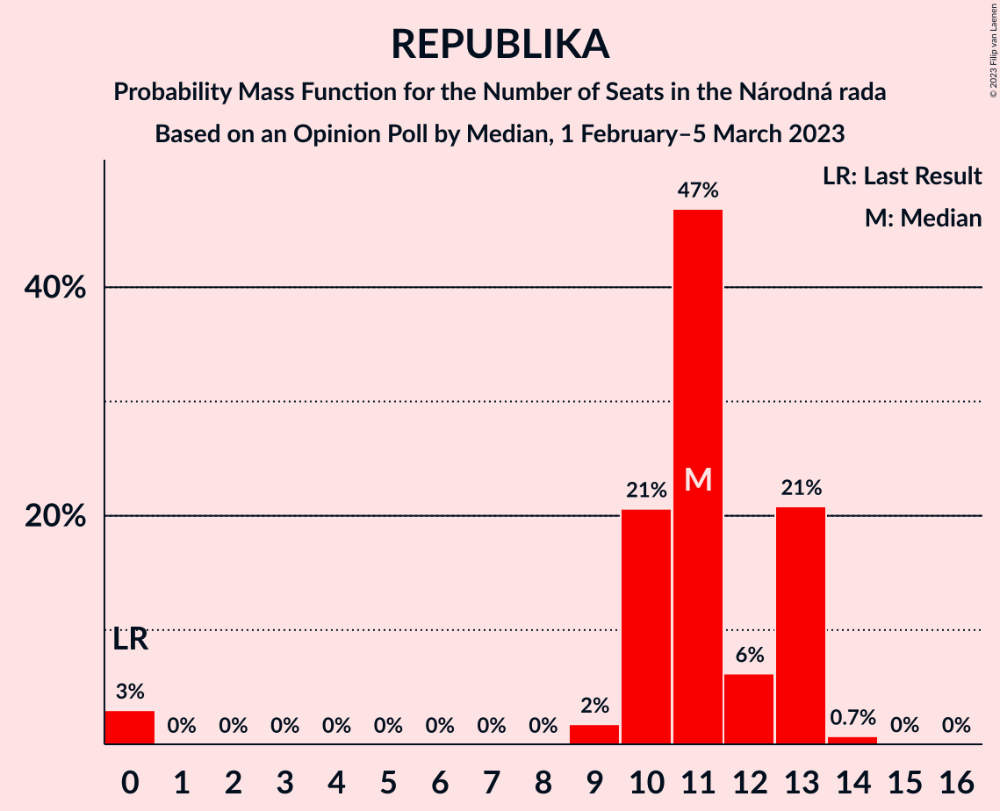

| Number of Seats | Probability | Accumulated | Special Marks |
|:---------------:|:-----------:|:-----------:|:-------------:|
| 0 | 3% | 100% | Last Result |
| 1 | 0% | 97% |  |
| 2 | 0% | 97% |  |
| 3 | 0% | 97% |  |
| 4 | 0% | 97% |  |
| 5 | 0% | 97% |  |
| 6 | 0% | 97% |  |
| 7 | 0% | 97% |  |
| 8 | 0% | 97% |  |
| 9 | 2% | 97% |  |
| 10 | 21% | 95% |  |
| 11 | 47% | 75% | Median |
| 12 | 6% | 28% |  |
| 13 | 21% | 22% |  |
| 14 | 0.7% | 0.8% |  |
| 15 | 0% | 0.1% |  |
| 16 | 0% | 0% |  |

### Slovenská národná strana

*For a full overview of the results for this party, see the [Slovenská národná strana](party-slovenskánárodnástrana.html) page.*

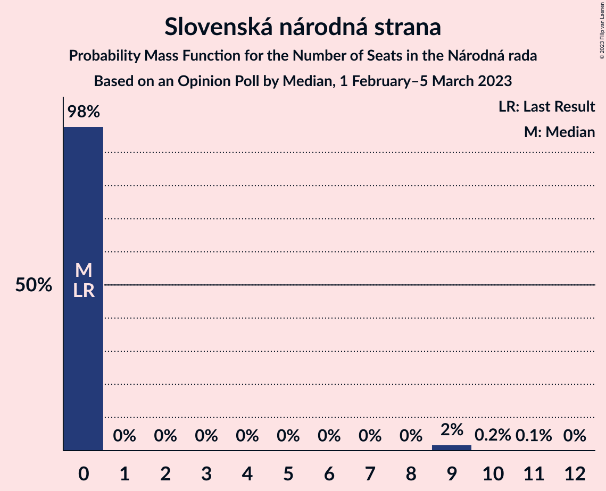

| Number of Seats | Probability | Accumulated | Special Marks |
|:---------------:|:-----------:|:-----------:|:-------------:|
| 0 | 98% | 100% | Last Result, Median |
| 1 | 0% | 2% |  |
| 2 | 0% | 2% |  |
| 3 | 0% | 2% |  |
| 4 | 0% | 2% |  |
| 5 | 0% | 2% |  |
| 6 | 0% | 2% |  |
| 7 | 0% | 2% |  |
| 8 | 0% | 2% |  |
| 9 | 2% | 2% |  |
| 10 | 0.2% | 0.3% |  |
| 11 | 0.1% | 0.1% |  |
| 12 | 0% | 0% |  |

### Kotleba–Ľudová strana Naše Slovensko

*For a full overview of the results for this party, see the [Kotleba–Ľudová strana Naše Slovensko](party-kotleba–ľudovástrananašeslovensko.html) page.*

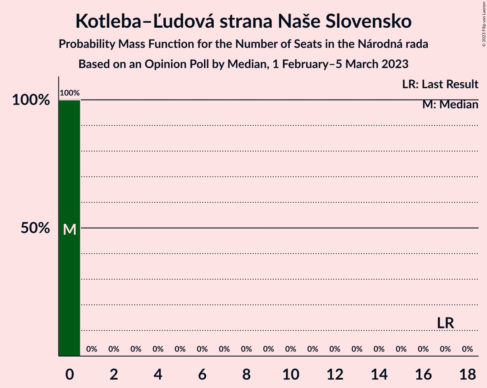

| Number of Seats | Probability | Accumulated | Special Marks |
|:---------------:|:-----------:|:-----------:|:-------------:|
| 0 | 100% | 100% | Median |
| 1 | 0% | 0% |  |
| 2 | 0% | 0% |  |
| 3 | 0% | 0% |  |
| 4 | 0% | 0% |  |
| 5 | 0% | 0% |  |
| 6 | 0% | 0% |  |
| 7 | 0% | 0% |  |
| 8 | 0% | 0% |  |
| 9 | 0% | 0% |  |
| 10 | 0% | 0% |  |
| 11 | 0% | 0% |  |
| 12 | 0% | 0% |  |
| 13 | 0% | 0% |  |
| 14 | 0% | 0% |  |
| 15 | 0% | 0% |  |
| 16 | 0% | 0% |  |
| 17 | 0% | 0% | Last Result |

### Strana maďarskej koalície–Magyar Koalíció Pártja

*For a full overview of the results for this party, see the [Strana maďarskej koalície–Magyar Koalíció Pártja](party-stranamaďarskejkoalície–magyarkoalíciópártja.html) page.*

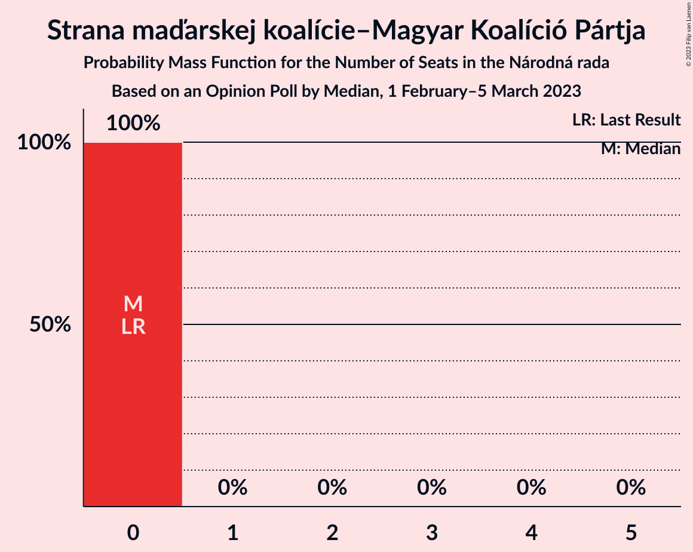

| Number of Seats | Probability | Accumulated | Special Marks |
|:---------------:|:-----------:|:-----------:|:-------------:|
| 0 | 100% | 100% | Last Result, Median |

### Za ľudí

*For a full overview of the results for this party, see the [Za ľudí](party-zaľudí.html) page.*

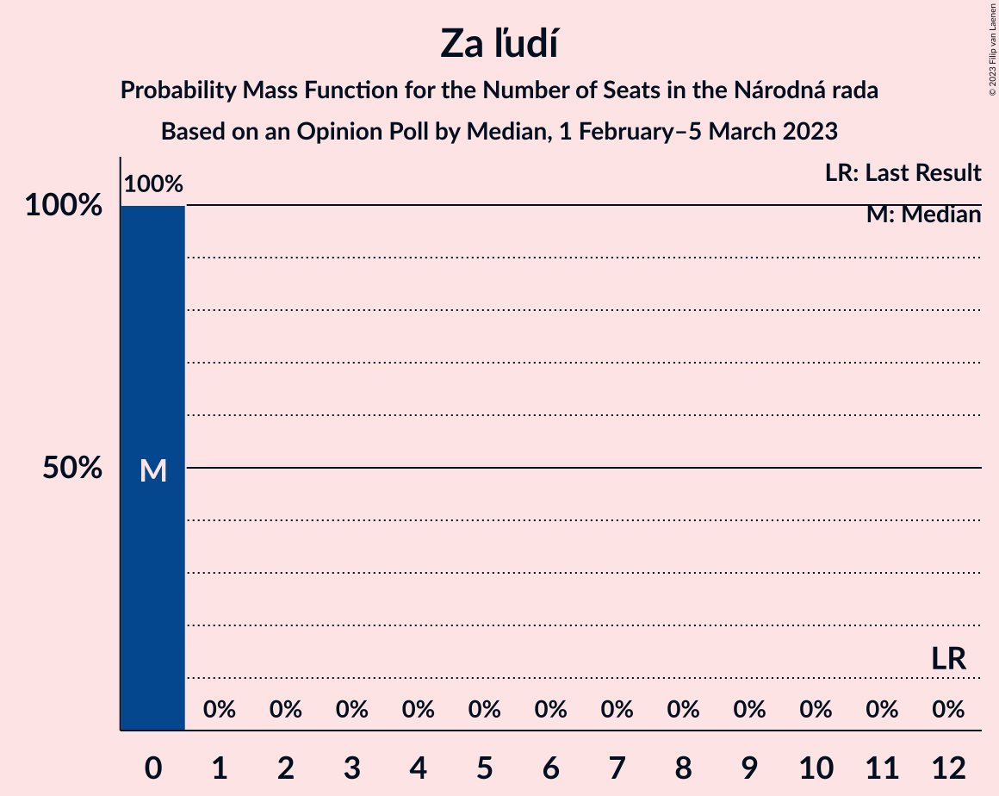

| Number of Seats | Probability | Accumulated | Special Marks |
|:---------------:|:-----------:|:-----------:|:-------------:|
| 0 | 100% | 100% | Median |
| 1 | 0% | 0% |  |
| 2 | 0% | 0% |  |
| 3 | 0% | 0% |  |
| 4 | 0% | 0% |  |
| 5 | 0% | 0% |  |
| 6 | 0% | 0% |  |
| 7 | 0% | 0% |  |
| 8 | 0% | 0% |  |
| 9 | 0% | 0% |  |
| 10 | 0% | 0% |  |
| 11 | 0% | 0% |  |
| 12 | 0% | 0% | Last Result |

## Coalitions

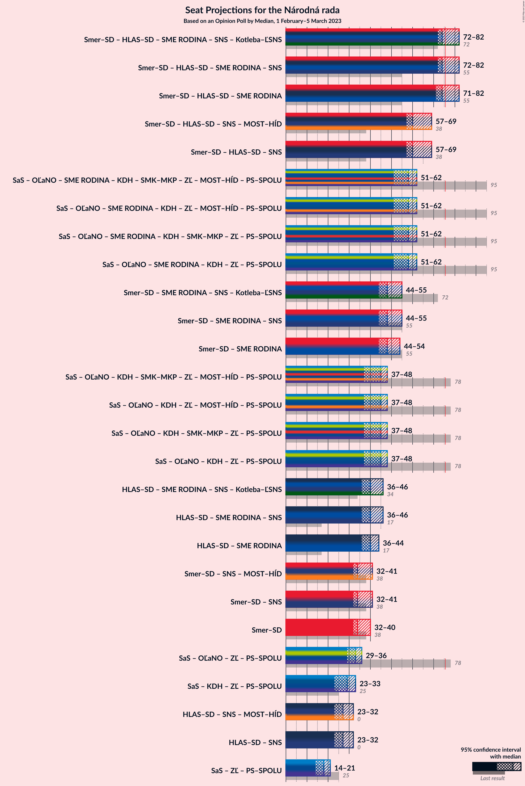

### Confidence Intervals

| Coalition | Last Result | Median | Majority? | 80% Confidence Interval | 90% Confidence Interval | 95% Confidence Interval | 99% Confidence Interval |
|:---------:|:-----------:|:------:|:---------:|:-----------------------:|:-----------------------:|:-----------------------:|:-----------------------:|
| SMER–sociálna demokracia – HLAS–sociálna demokracia – SME RODINA – Slovenská národná strana – Kotleba–Ľudová strana Naše Slovensko | 72 | 74 | 22% | 72–78 | 72–80 | 72–82 | 69–85 |
| SMER–sociálna demokracia – HLAS–sociálna demokracia – SME RODINA – Slovenská národná strana | 55 | 74 | 22% | 72–78 | 72–80 | 72–82 | 69–85 |
| SMER–sociálna demokracia – HLAS–sociálna demokracia – SME RODINA | 55 | 74 | 20% | 72–77 | 72–78 | 71–82 | 69–83 |
| SMER–sociálna demokracia – HLAS–sociálna demokracia – Slovenská národná strana | 38 | 60 | 0% | 59–66 | 59–66 | 57–69 | 56–71 |
| SMER–sociálna demokracia – SME RODINA – Slovenská národná strana – Kotleba–Ľudová strana Naše Slovensko | 72 | 48 | 0% | 44–51 | 44–53 | 44–55 | 44–59 |
| SMER–sociálna demokracia – SME RODINA – Slovenská národná strana | 55 | 48 | 0% | 44–51 | 44–53 | 44–55 | 44–59 |
| SMER–sociálna demokracia – SME RODINA | 55 | 48 | 0% | 44–50 | 44–52 | 44–54 | 44–56 |
| HLAS–sociálna demokracia – SME RODINA – Slovenská národná strana – Kotleba–Ľudová strana Naše Slovensko | 34 | 40 | 0% | 38–42 | 36–43 | 36–46 | 35–50 |
| HLAS–sociálna demokracia – SME RODINA – Slovenská národná strana | 17 | 40 | 0% | 38–42 | 36–43 | 36–46 | 35–50 |
| HLAS–sociálna demokracia – SME RODINA | 17 | 40 | 0% | 37–42 | 36–43 | 36–44 | 34–47 |
| SMER–sociálna demokracia – Slovenská národná strana | 38 | 34 | 0% | 32–39 | 32–39 | 32–41 | 32–44 |
| SMER–sociálna demokracia | 38 | 34 | 0% | 32–38 | 32–39 | 32–40 | 31–41 |
| HLAS–sociálna demokracia – Slovenská národná strana | 0 | 27 | 0% | 24–28 | 24–30 | 23–32 | 22–36 |

### SMER–sociálna demokracia – HLAS–sociálna demokracia – SME RODINA – Slovenská národná strana – Kotleba–Ľudová strana Naše Slovensko

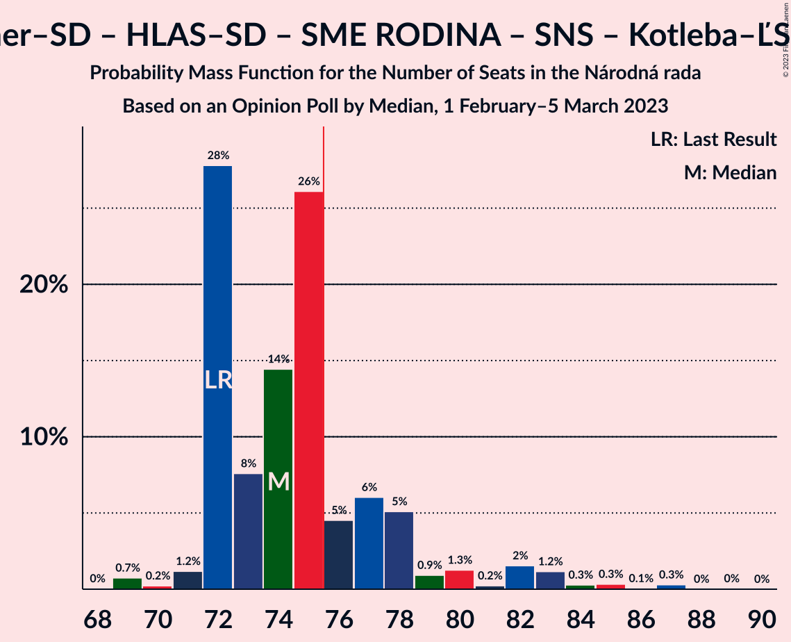

| Number of Seats | Probability | Accumulated | Special Marks |
|:---------------:|:-----------:|:-----------:|:-------------:|
| 68 | 0% | 100% |  |
| 69 | 0.7% | 99.9% |  |
| 70 | 0.2% | 99.2% |  |
| 71 | 1.2% | 99.0% |  |
| 72 | 28% | 98% | Last Result |
| 73 | 8% | 70% |  |
| 74 | 14% | 62% | Median |
| 75 | 26% | 48% |  |
| 76 | 5% | 22% | Majority |
| 77 | 6% | 17% |  |
| 78 | 5% | 11% |  |
| 79 | 0.9% | 6% |  |
| 80 | 1.3% | 5% |  |
| 81 | 0.2% | 4% |  |
| 82 | 2% | 4% |  |
| 83 | 1.2% | 2% |  |
| 84 | 0.3% | 1.0% |  |
| 85 | 0.3% | 0.8% |  |
| 86 | 0.1% | 0.4% |  |
| 87 | 0.3% | 0.4% |  |
| 88 | 0% | 0.1% |  |
| 89 | 0% | 0.1% |  |
| 90 | 0% | 0% |  |

### SMER–sociálna demokracia – HLAS–sociálna demokracia – SME RODINA – Slovenská národná strana

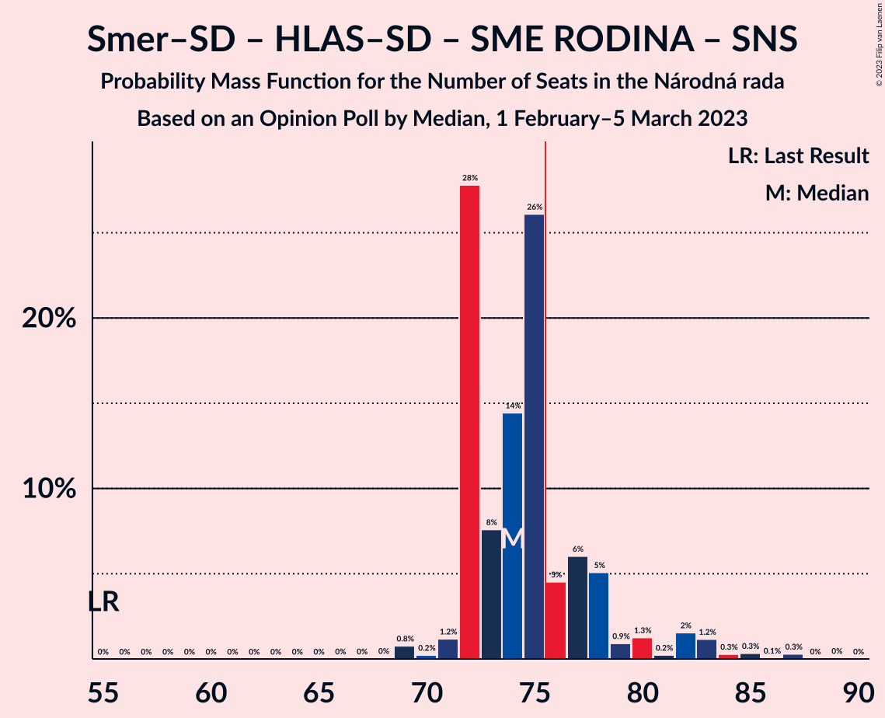

| Number of Seats | Probability | Accumulated | Special Marks |
|:---------------:|:-----------:|:-----------:|:-------------:|
| 55 | 0% | 100% | Last Result |
| 56 | 0% | 100% |  |
| 57 | 0% | 100% |  |
| 58 | 0% | 100% |  |
| 59 | 0% | 100% |  |
| 60 | 0% | 100% |  |
| 61 | 0% | 100% |  |
| 62 | 0% | 100% |  |
| 63 | 0% | 100% |  |
| 64 | 0% | 100% |  |
| 65 | 0% | 100% |  |
| 66 | 0% | 100% |  |
| 67 | 0% | 100% |  |
| 68 | 0% | 100% |  |
| 69 | 0.8% | 99.9% |  |
| 70 | 0.2% | 99.2% |  |
| 71 | 1.2% | 98.9% |  |
| 72 | 28% | 98% |  |
| 73 | 8% | 70% |  |
| 74 | 14% | 62% | Median |
| 75 | 26% | 48% |  |
| 76 | 5% | 22% | Majority |
| 77 | 6% | 17% |  |
| 78 | 5% | 11% |  |
| 79 | 0.9% | 6% |  |
| 80 | 1.3% | 5% |  |
| 81 | 0.2% | 4% |  |
| 82 | 2% | 4% |  |
| 83 | 1.2% | 2% |  |
| 84 | 0.3% | 1.0% |  |
| 85 | 0.3% | 0.8% |  |
| 86 | 0.1% | 0.4% |  |
| 87 | 0.3% | 0.4% |  |
| 88 | 0% | 0.1% |  |
| 89 | 0% | 0.1% |  |
| 90 | 0% | 0% |  |

### SMER–sociálna demokracia – HLAS–sociálna demokracia – SME RODINA

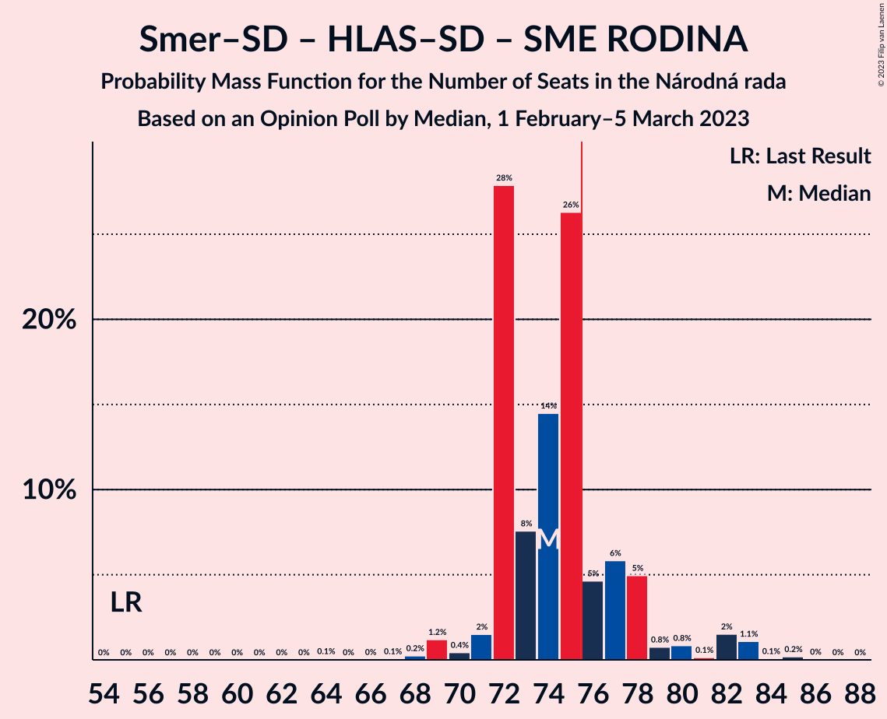

| Number of Seats | Probability | Accumulated | Special Marks |
|:---------------:|:-----------:|:-----------:|:-------------:|
| 55 | 0% | 100% | Last Result |
| 56 | 0% | 100% |  |
| 57 | 0% | 100% |  |
| 58 | 0% | 100% |  |
| 59 | 0% | 100% |  |
| 60 | 0% | 100% |  |
| 61 | 0% | 100% |  |
| 62 | 0% | 100% |  |
| 63 | 0% | 100% |  |
| 64 | 0.1% | 100% |  |
| 65 | 0% | 99.9% |  |
| 66 | 0% | 99.9% |  |
| 67 | 0.1% | 99.9% |  |
| 68 | 0.2% | 99.8% |  |
| 69 | 1.2% | 99.6% |  |
| 70 | 0.4% | 98% |  |
| 71 | 2% | 98% |  |
| 72 | 28% | 96% |  |
| 73 | 8% | 69% |  |
| 74 | 14% | 61% | Median |
| 75 | 26% | 46% |  |
| 76 | 5% | 20% | Majority |
| 77 | 6% | 16% |  |
| 78 | 5% | 10% |  |
| 79 | 0.8% | 5% |  |
| 80 | 0.8% | 4% |  |
| 81 | 0.1% | 3% |  |
| 82 | 2% | 3% |  |
| 83 | 1.1% | 1.5% |  |
| 84 | 0.1% | 0.4% |  |
| 85 | 0.2% | 0.3% |  |
| 86 | 0% | 0.1% |  |
| 87 | 0% | 0.1% |  |
| 88 | 0% | 0% |  |

### SMER–sociálna demokracia – HLAS–sociálna demokracia – Slovenská národná strana

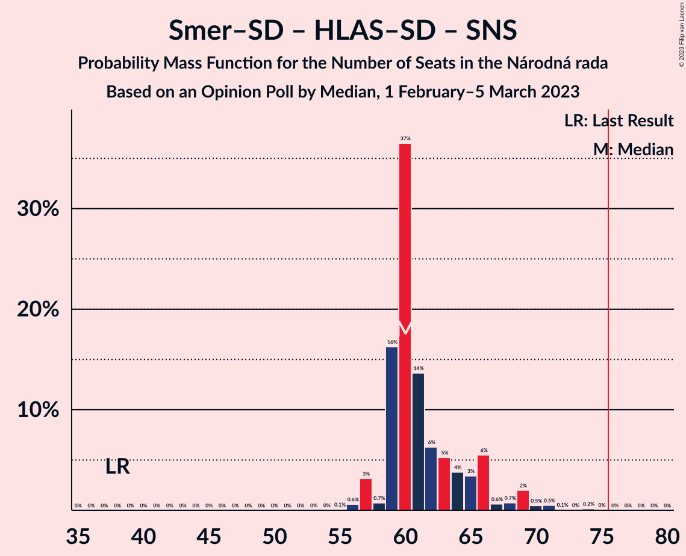

| Number of Seats | Probability | Accumulated | Special Marks |
|:---------------:|:-----------:|:-----------:|:-------------:|
| 38 | 0% | 100% | Last Result |
| 39 | 0% | 100% |  |
| 40 | 0% | 100% |  |
| 41 | 0% | 100% |  |
| 42 | 0% | 100% |  |
| 43 | 0% | 100% |  |
| 44 | 0% | 100% |  |
| 45 | 0% | 100% |  |
| 46 | 0% | 100% |  |
| 47 | 0% | 100% |  |
| 48 | 0% | 100% |  |
| 49 | 0% | 100% |  |
| 50 | 0% | 100% |  |
| 51 | 0% | 100% |  |
| 52 | 0% | 100% |  |
| 53 | 0% | 100% |  |
| 54 | 0% | 100% |  |
| 55 | 0.1% | 100% |  |
| 56 | 0.6% | 99.9% |  |
| 57 | 3% | 99.3% |  |
| 58 | 0.7% | 96% |  |
| 59 | 16% | 95% |  |
| 60 | 37% | 79% |  |
| 61 | 14% | 43% | Median |
| 62 | 6% | 29% |  |
| 63 | 5% | 23% |  |
| 64 | 4% | 17% |  |
| 65 | 3% | 14% |  |
| 66 | 6% | 10% |  |
| 67 | 0.6% | 5% |  |
| 68 | 0.7% | 4% |  |
| 69 | 2% | 3% |  |
| 70 | 0.5% | 1.3% |  |
| 71 | 0.5% | 0.8% |  |
| 72 | 0.1% | 0.3% |  |
| 73 | 0% | 0.3% |  |
| 74 | 0.2% | 0.2% |  |
| 75 | 0% | 0.1% |  |
| 76 | 0% | 0% | Majority |

### SMER–sociálna demokracia – SME RODINA – Slovenská národná strana – Kotleba–Ľudová strana Naše Slovensko

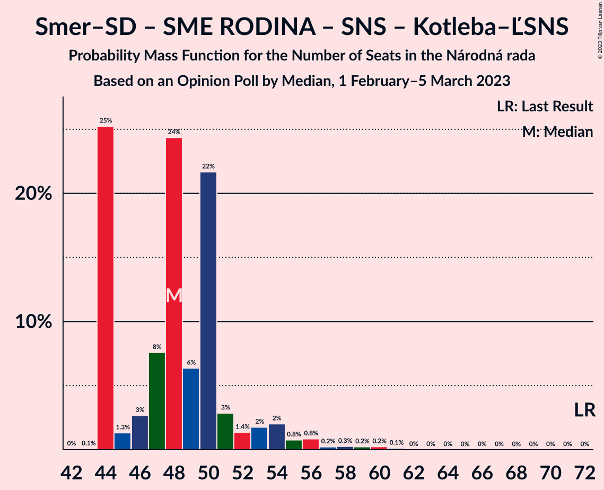

| Number of Seats | Probability | Accumulated | Special Marks |
|:---------------:|:-----------:|:-----------:|:-------------:|
| 42 | 0% | 100% |  |
| 43 | 0.1% | 99.9% |  |
| 44 | 25% | 99.9% |  |
| 45 | 1.3% | 75% |  |
| 46 | 3% | 73% |  |
| 47 | 8% | 71% | Median |
| 48 | 24% | 63% |  |
| 49 | 6% | 39% |  |
| 50 | 22% | 32% |  |
| 51 | 3% | 11% |  |
| 52 | 1.4% | 8% |  |
| 53 | 2% | 6% |  |
| 54 | 2% | 5% |  |
| 55 | 0.8% | 3% |  |
| 56 | 0.8% | 2% |  |
| 57 | 0.2% | 1.1% |  |
| 58 | 0.3% | 0.9% |  |
| 59 | 0.2% | 0.6% |  |
| 60 | 0.2% | 0.4% |  |
| 61 | 0.1% | 0.1% |  |
| 62 | 0% | 0% |  |
| 63 | 0% | 0% |  |
| 64 | 0% | 0% |  |
| 65 | 0% | 0% |  |
| 66 | 0% | 0% |  |
| 67 | 0% | 0% |  |
| 68 | 0% | 0% |  |
| 69 | 0% | 0% |  |
| 70 | 0% | 0% |  |
| 71 | 0% | 0% |  |
| 72 | 0% | 0% | Last Result |

### SMER–sociálna demokracia – SME RODINA – Slovenská národná strana

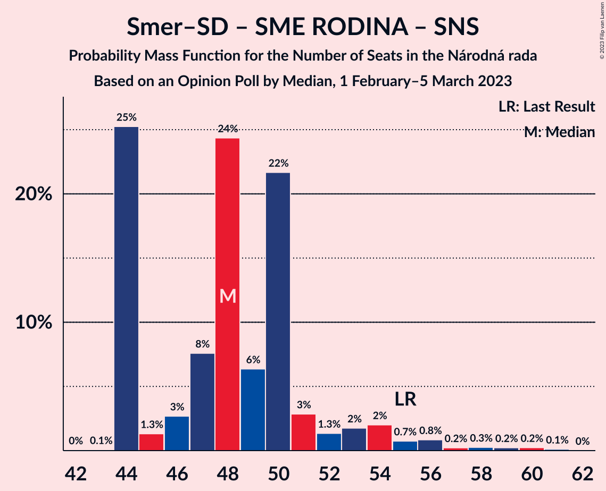

| Number of Seats | Probability | Accumulated | Special Marks |
|:---------------:|:-----------:|:-----------:|:-------------:|
| 42 | 0% | 100% |  |
| 43 | 0.1% | 99.9% |  |
| 44 | 25% | 99.9% |  |
| 45 | 1.3% | 75% |  |
| 46 | 3% | 73% |  |
| 47 | 8% | 71% | Median |
| 48 | 24% | 63% |  |
| 49 | 6% | 39% |  |
| 50 | 22% | 32% |  |
| 51 | 3% | 11% |  |
| 52 | 1.3% | 8% |  |
| 53 | 2% | 6% |  |
| 54 | 2% | 5% |  |
| 55 | 0.7% | 3% | Last Result |
| 56 | 0.8% | 2% |  |
| 57 | 0.2% | 1.1% |  |
| 58 | 0.3% | 0.9% |  |
| 59 | 0.2% | 0.6% |  |
| 60 | 0.2% | 0.4% |  |
| 61 | 0.1% | 0.1% |  |
| 62 | 0% | 0% |  |

### SMER–sociálna demokracia – SME RODINA

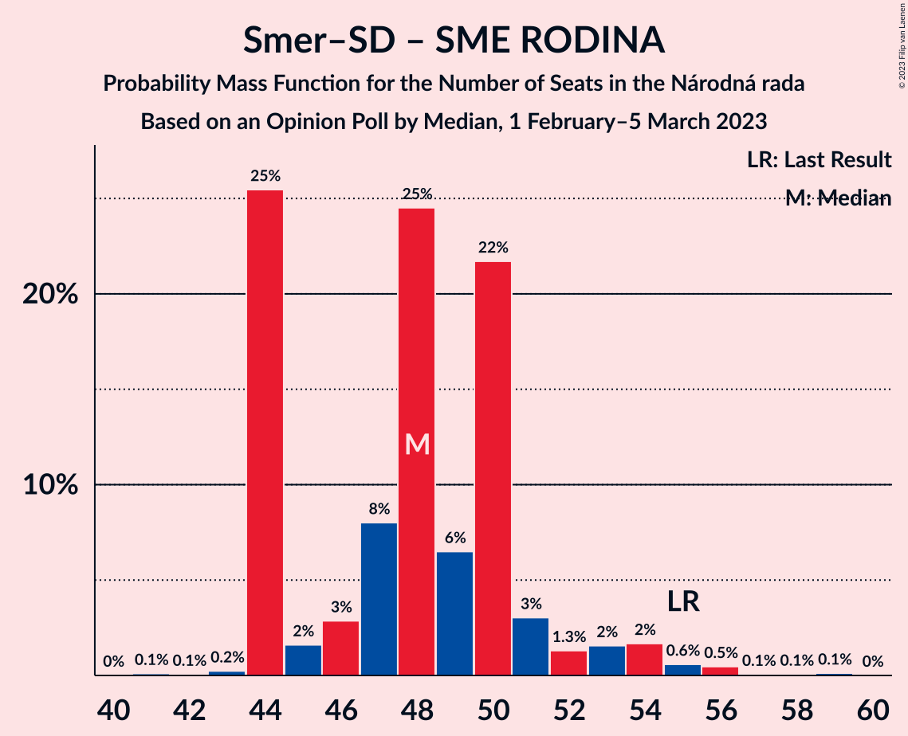

| Number of Seats | Probability | Accumulated | Special Marks |
|:---------------:|:-----------:|:-----------:|:-------------:|
| 41 | 0.1% | 100% |  |
| 42 | 0.1% | 99.9% |  |
| 43 | 0.2% | 99.8% |  |
| 44 | 25% | 99.6% |  |
| 45 | 2% | 74% |  |
| 46 | 3% | 72% |  |
| 47 | 8% | 70% | Median |
| 48 | 25% | 62% |  |
| 49 | 6% | 37% |  |
| 50 | 22% | 31% |  |
| 51 | 3% | 9% |  |
| 52 | 1.3% | 6% |  |
| 53 | 2% | 5% |  |
| 54 | 2% | 3% |  |
| 55 | 0.6% | 1.3% | Last Result |
| 56 | 0.5% | 0.7% |  |
| 57 | 0.1% | 0.3% |  |
| 58 | 0.1% | 0.2% |  |
| 59 | 0.1% | 0.1% |  |
| 60 | 0% | 0% |  |

### HLAS–sociálna demokracia – SME RODINA – Slovenská národná strana – Kotleba–Ľudová strana Naše Slovensko

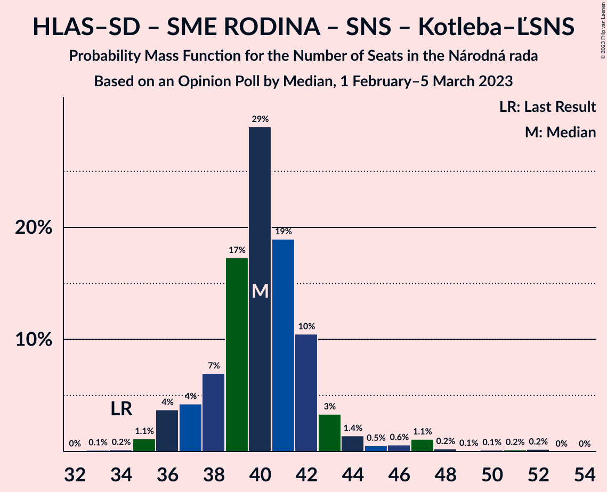

| Number of Seats | Probability | Accumulated | Special Marks |
|:---------------:|:-----------:|:-----------:|:-------------:|
| 33 | 0.1% | 100% |  |
| 34 | 0.2% | 99.8% | Last Result |
| 35 | 1.1% | 99.7% |  |
| 36 | 4% | 98.5% |  |
| 37 | 4% | 95% |  |
| 38 | 7% | 91% |  |
| 39 | 17% | 84% |  |
| 40 | 29% | 66% | Median |
| 41 | 19% | 37% |  |
| 42 | 10% | 18% |  |
| 43 | 3% | 8% |  |
| 44 | 1.4% | 5% |  |
| 45 | 0.5% | 3% |  |
| 46 | 0.6% | 3% |  |
| 47 | 1.1% | 2% |  |
| 48 | 0.2% | 0.9% |  |
| 49 | 0.1% | 0.6% |  |
| 50 | 0.1% | 0.5% |  |
| 51 | 0.2% | 0.4% |  |
| 52 | 0.2% | 0.2% |  |
| 53 | 0% | 0% |  |

### HLAS–sociálna demokracia – SME RODINA – Slovenská národná strana

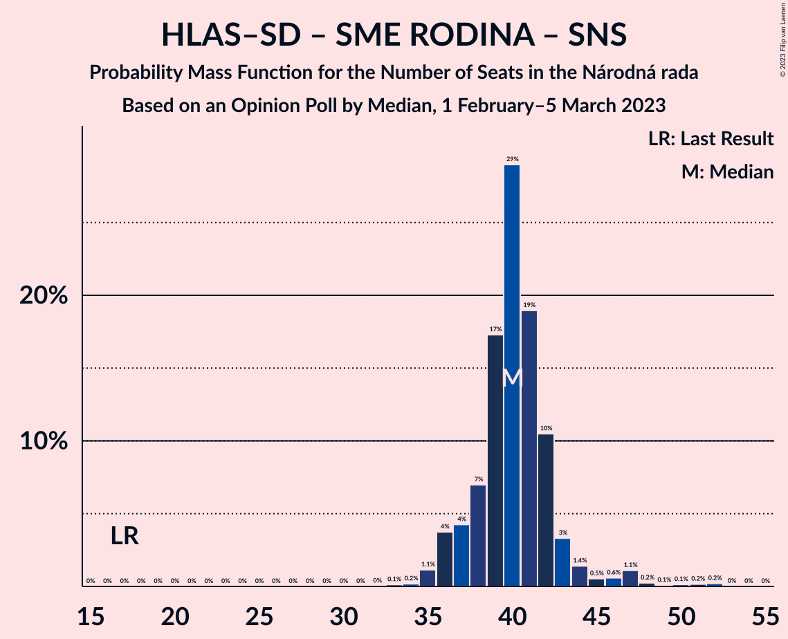

| Number of Seats | Probability | Accumulated | Special Marks |
|:---------------:|:-----------:|:-----------:|:-------------:|
| 17 | 0% | 100% | Last Result |
| 18 | 0% | 100% |  |
| 19 | 0% | 100% |  |
| 20 | 0% | 100% |  |
| 21 | 0% | 100% |  |
| 22 | 0% | 100% |  |
| 23 | 0% | 100% |  |
| 24 | 0% | 100% |  |
| 25 | 0% | 100% |  |
| 26 | 0% | 100% |  |
| 27 | 0% | 100% |  |
| 28 | 0% | 100% |  |
| 29 | 0% | 100% |  |
| 30 | 0% | 100% |  |
| 31 | 0% | 100% |  |
| 32 | 0% | 100% |  |
| 33 | 0.1% | 100% |  |
| 34 | 0.2% | 99.8% |  |
| 35 | 1.1% | 99.6% |  |
| 36 | 4% | 98.5% |  |
| 37 | 4% | 95% |  |
| 38 | 7% | 91% |  |
| 39 | 17% | 84% |  |
| 40 | 29% | 66% | Median |
| 41 | 19% | 37% |  |
| 42 | 10% | 18% |  |
| 43 | 3% | 8% |  |
| 44 | 1.4% | 4% |  |
| 45 | 0.5% | 3% |  |
| 46 | 0.6% | 3% |  |
| 47 | 1.1% | 2% |  |
| 48 | 0.2% | 0.9% |  |
| 49 | 0.1% | 0.6% |  |
| 50 | 0.1% | 0.5% |  |
| 51 | 0.2% | 0.4% |  |
| 52 | 0.2% | 0.2% |  |
| 53 | 0% | 0% |  |

### HLAS–sociálna demokracia – SME RODINA

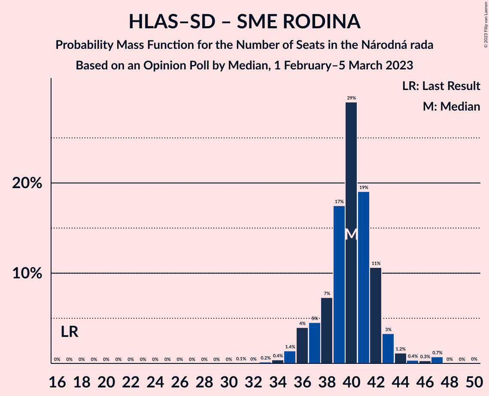

| Number of Seats | Probability | Accumulated | Special Marks |
|:---------------:|:-----------:|:-----------:|:-------------:|
| 17 | 0% | 100% | Last Result |
| 18 | 0% | 100% |  |
| 19 | 0% | 100% |  |
| 20 | 0% | 100% |  |
| 21 | 0% | 100% |  |
| 22 | 0% | 100% |  |
| 23 | 0% | 100% |  |
| 24 | 0% | 100% |  |
| 25 | 0% | 100% |  |
| 26 | 0% | 100% |  |
| 27 | 0% | 100% |  |
| 28 | 0% | 100% |  |
| 29 | 0% | 100% |  |
| 30 | 0% | 100% |  |
| 31 | 0.1% | 100% |  |
| 32 | 0% | 99.9% |  |
| 33 | 0.2% | 99.9% |  |
| 34 | 0.4% | 99.7% |  |
| 35 | 1.4% | 99.3% |  |
| 36 | 4% | 98% |  |
| 37 | 5% | 94% |  |
| 38 | 7% | 89% |  |
| 39 | 17% | 82% |  |
| 40 | 29% | 65% | Median |
| 41 | 19% | 36% |  |
| 42 | 11% | 17% |  |
| 43 | 3% | 6% |  |
| 44 | 1.2% | 3% |  |
| 45 | 0.4% | 1.5% |  |
| 46 | 0.3% | 1.1% |  |
| 47 | 0.7% | 0.8% |  |
| 48 | 0% | 0.1% |  |
| 49 | 0% | 0.1% |  |
| 50 | 0% | 0% |  |

### SMER–sociálna demokracia – Slovenská národná strana

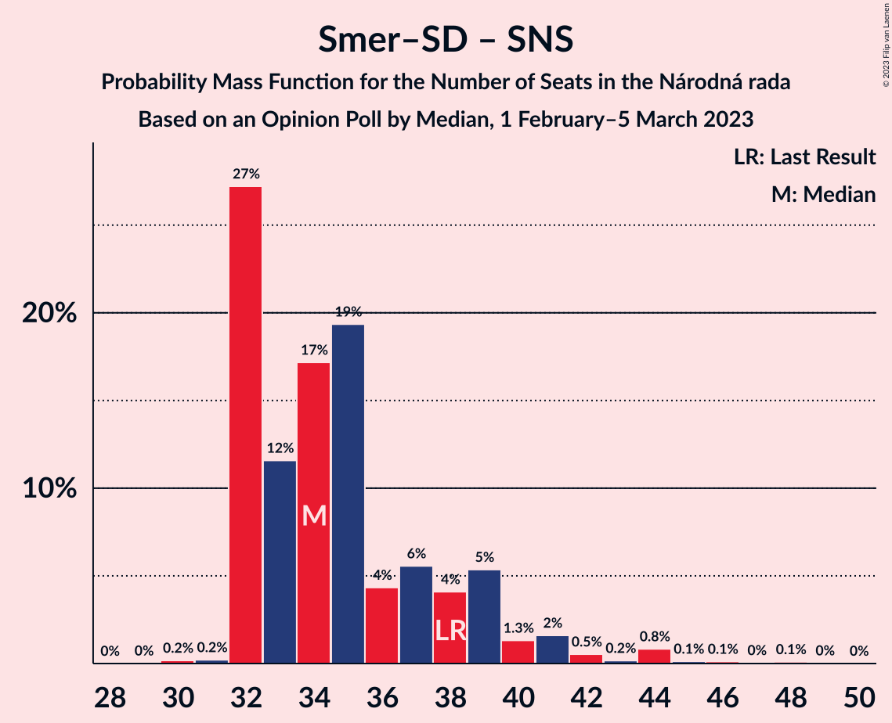

| Number of Seats | Probability | Accumulated | Special Marks |
|:---------------:|:-----------:|:-----------:|:-------------:|
| 30 | 0.2% | 100% |  |
| 31 | 0.2% | 99.8% |  |
| 32 | 27% | 99.6% |  |
| 33 | 12% | 72% |  |
| 34 | 17% | 61% | Median |
| 35 | 19% | 44% |  |
| 36 | 4% | 24% |  |
| 37 | 6% | 20% |  |
| 38 | 4% | 14% | Last Result |
| 39 | 5% | 10% |  |
| 40 | 1.3% | 5% |  |
| 41 | 2% | 4% |  |
| 42 | 0.5% | 2% |  |
| 43 | 0.2% | 1.4% |  |
| 44 | 0.8% | 1.3% |  |
| 45 | 0.1% | 0.4% |  |
| 46 | 0.1% | 0.3% |  |
| 47 | 0% | 0.2% |  |
| 48 | 0.1% | 0.1% |  |
| 49 | 0% | 0% |  |

### SMER–sociálna demokracia

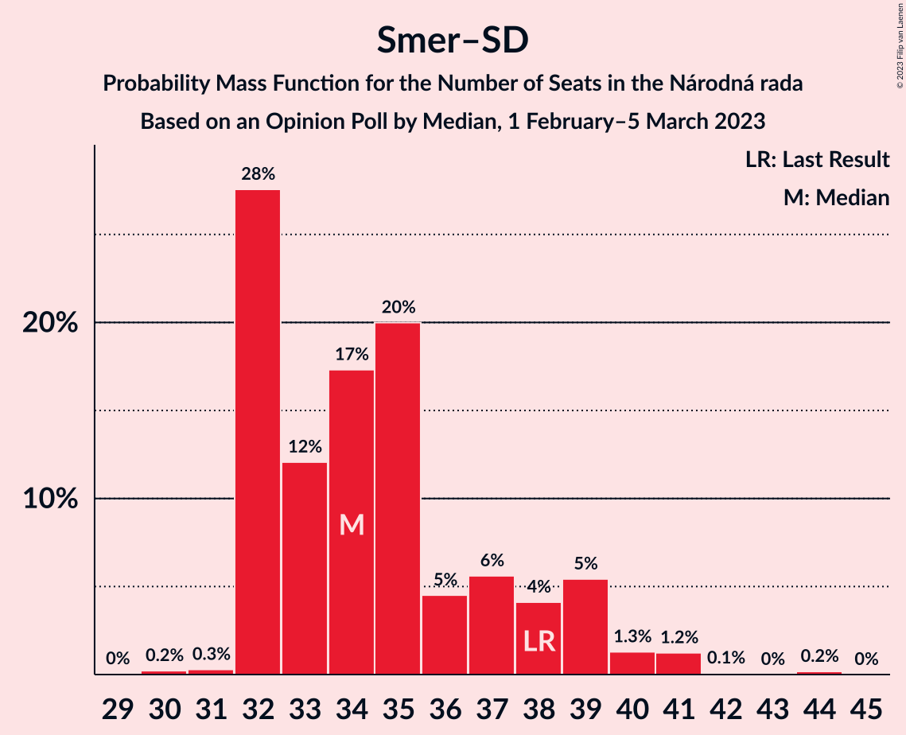

| Number of Seats | Probability | Accumulated | Special Marks |
|:---------------:|:-----------:|:-----------:|:-------------:|
| 29 | 0% | 100% |  |
| 30 | 0.2% | 99.9% |  |
| 31 | 0.3% | 99.7% |  |
| 32 | 28% | 99.4% |  |
| 33 | 12% | 72% |  |
| 34 | 17% | 60% | Median |
| 35 | 20% | 42% |  |
| 36 | 5% | 22% |  |
| 37 | 6% | 18% |  |
| 38 | 4% | 12% | Last Result |
| 39 | 5% | 8% |  |
| 40 | 1.3% | 3% |  |
| 41 | 1.2% | 2% |  |
| 42 | 0.1% | 0.3% |  |
| 43 | 0% | 0.2% |  |
| 44 | 0.2% | 0.2% |  |
| 45 | 0% | 0% |  |

### HLAS–sociálna demokracia – Slovenská národná strana

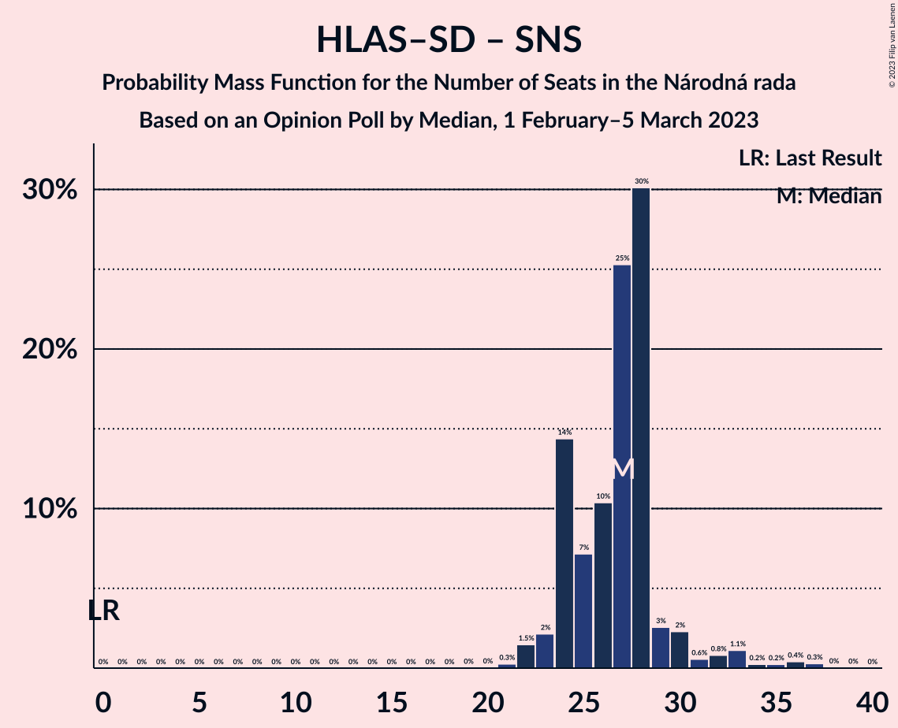

| Number of Seats | Probability | Accumulated | Special Marks |
|:---------------:|:-----------:|:-----------:|:-------------:|
| 0 | 0% | 100% | Last Result |
| 1 | 0% | 100% |  |
| 2 | 0% | 100% |  |
| 3 | 0% | 100% |  |
| 4 | 0% | 100% |  |
| 5 | 0% | 100% |  |
| 6 | 0% | 100% |  |
| 7 | 0% | 100% |  |
| 8 | 0% | 100% |  |
| 9 | 0% | 100% |  |
| 10 | 0% | 100% |  |
| 11 | 0% | 100% |  |
| 12 | 0% | 100% |  |
| 13 | 0% | 100% |  |
| 14 | 0% | 100% |  |
| 15 | 0% | 100% |  |
| 16 | 0% | 100% |  |
| 17 | 0% | 100% |  |
| 18 | 0% | 100% |  |
| 19 | 0% | 100% |  |
| 20 | 0% | 100% |  |
| 21 | 0.3% | 99.9% |  |
| 22 | 1.5% | 99.7% |  |
| 23 | 2% | 98% |  |
| 24 | 14% | 96% |  |
| 25 | 7% | 82% |  |
| 26 | 10% | 74% |  |
| 27 | 25% | 64% | Median |
| 28 | 30% | 39% |  |
| 29 | 3% | 9% |  |
| 30 | 2% | 6% |  |
| 31 | 0.6% | 4% |  |
| 32 | 0.8% | 3% |  |
| 33 | 1.1% | 2% |  |
| 34 | 0.2% | 1.3% |  |
| 35 | 0.2% | 1.0% |  |
| 36 | 0.4% | 0.8% |  |
| 37 | 0.3% | 0.4% |  |
| 38 | 0% | 0.1% |  |
| 39 | 0% | 0% |  |

## Technical Information

### Opinion Poll

+ **Polling firm:** Median
+ **Commissioner(s):** —
+ **Fieldwork period:** 1 February–5 March 2023

### Calculations

+ **Sample size:** 1076
+ **Simulations done:** 1,048,576
+ **Error estimate:** 1.20%

