# Opinion Poll by AKO for TV JOJ, 12 March 2023

<a href="#voting-intentions">Voting Intentions</a> | <a href="#seats">Seats</a> | <a href="#coalitions">Coalitions</a> | <a href="#technical-information">Technical Information</a>

## Voting Intentions

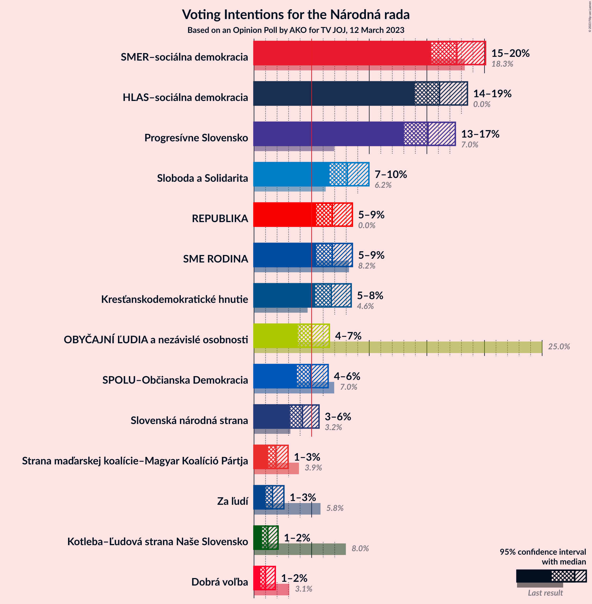

### Confidence Intervals

| Party | Last Result | Poll Result | 80% Confidence Interval | 90% Confidence Interval | 95% Confidence Interval | 99% Confidence Interval |
|:-----:|:-----------:|:-----------:|:-----------------------:|:-----------------------:|:-----------------------:|:-----------------------:|
| SMER–sociálna demokracia | 18.3% | 17.6% | 16.1–19.2% |15.7–19.7% |15.4–20.1% |14.7–20.9% |
| HLAS–sociálna demokracia | 0.0% | 16.1% | 14.7–17.7% |14.3–18.1% |13.9–18.5% |13.3–19.3% |
| Progresívne Slovensko | 7.0% | 15.1% | 13.7–16.6% |13.3–17.1% |13.0–17.5% |12.4–18.2% |
| Sloboda a Solidarita | 6.2% | 8.1% | 7.1–9.3% |6.8–9.7% |6.6–10.0% |6.1–10.6% |
| SME RODINA | 8.2% | 6.8% | 5.9–7.9% |5.6–8.3% |5.4–8.5% |5.0–9.1% |
| REPUBLIKA | 0.0% | 6.8% | 5.9–7.9% |5.6–8.3% |5.4–8.5% |5.0–9.1% |
| Kresťanskodemokratické hnutie | 4.6% | 6.7% | 5.8–7.8% |5.5–8.2% |5.3–8.4% |4.9–9.0% |
| OBYČAJNÍ ĽUDIA a nezávislé osobnosti | 25.0% | 5.0% | 4.2–6.0% |4.0–6.3% |3.8–6.5% |3.5–7.1% |
| SPOLU–Občianska Demokracia | 7.0% | 4.9% | 4.1–5.9% |3.9–6.2% |3.7–6.4% |3.4–6.9% |
| Slovenská národná strana | 3.2% | 4.2% | 3.5–5.1% |3.3–5.4% |3.1–5.6% |2.8–6.1% |
| Strana maďarskej koalície–Magyar Koalíció Pártja | 3.9% | 1.9% | 1.4–2.6% |1.3–2.8% |1.2–3.0% |1.0–3.3% |
| Za ľudí | 5.8% | 1.6% | 1.2–2.2% |1.1–2.4% |1.0–2.6% |0.8–2.9% |
| Kotleba–Ľudová strana Naše Slovensko | 8.0% | 1.2% | 0.9–1.8% |0.8–1.9% |0.7–2.1% |0.5–2.4% |
| Dobrá voľba | 3.1% | 1.0% | 0.7–1.5% |0.6–1.7% |0.5–1.8% |0.4–2.1% |

*Note:* The poll result column reflects the actual value used in the calculations. Published results may vary slightly, and in addition be rounded to fewer digits.

## Seats

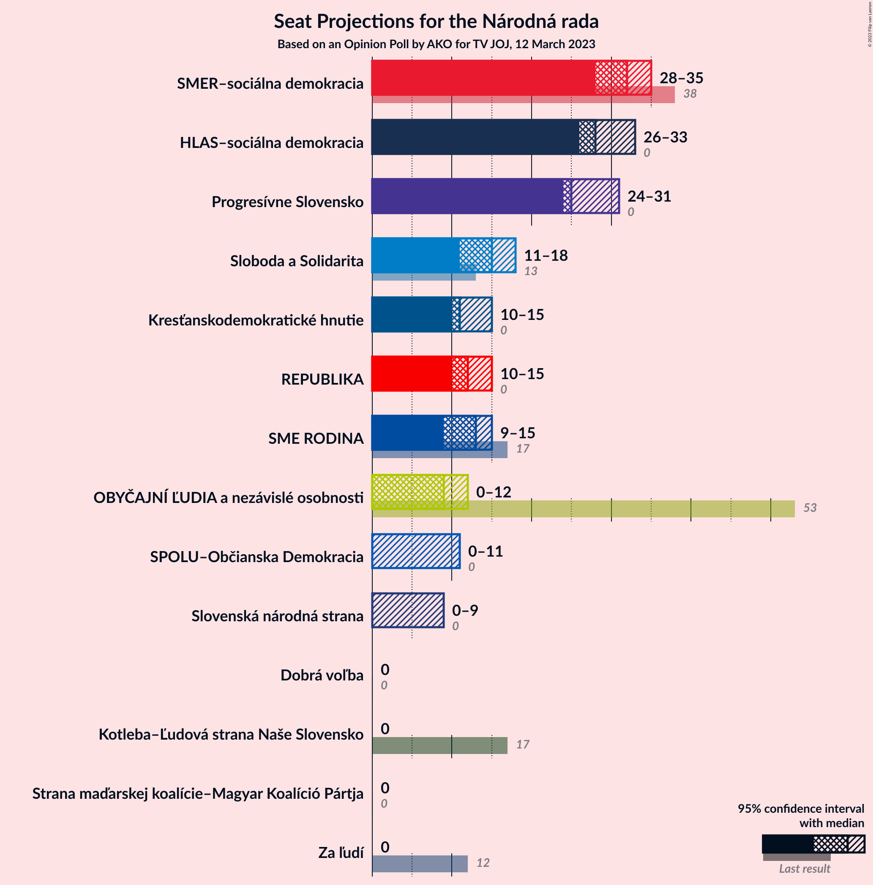

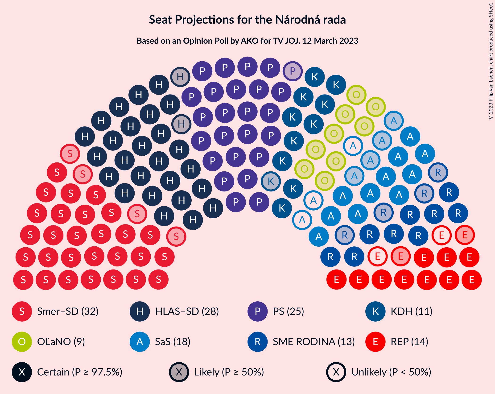

### Confidence Intervals

| Party | Last Result | Median | 80% Confidence Interval | 90% Confidence Interval | 95% Confidence Interval | 99% Confidence Interval |
|:-----:|:-----------:|:------:|:-----------------------:|:-----------------------:|:-----------------------:|:-----------------------:|
| <a href="#smer–sociálna-demokracia">SMER–sociálna demokracia</a> | 38 | 32 | 30–34 |30–34 |28–35 |27–38 |
| <a href="#hlas–sociálna-demokracia">HLAS–sociálna demokracia</a> | 0 | 28 | 27–32 |26–32 |26–33 |23–36 |
| <a href="#progresívne-slovensko">Progresívne Slovensko</a> | 0 | 25 | 24–31 |24–31 |24–31 |23–33 |
| <a href="#sloboda-a-solidarita">Sloboda a Solidarita</a> | 13 | 15 | 13–18 |12–18 |11–18 |11–19 |
| <a href="#sme-rodina">SME RODINA</a> | 17 | 13 | 11–14 |10–14 |9–15 |0–17 |
| <a href="#republika">REPUBLIKA</a> | 0 | 12 | 10–14 |10–14 |10–15 |9–17 |
| <a href="#kresťanskodemokratické-hnutie">Kresťanskodemokratické hnutie</a> | 0 | 11 | 11–14 |11–14 |10–15 |9–16 |
| <a href="#obyčajní-ľudia-a-nezávislé-osobnosti">OBYČAJNÍ ĽUDIA a nezávislé osobnosti</a> | 53 | 9 | 0–11 |0–12 |0–12 |0–12 |
| <a href="#spolu–občianska-demokracia">SPOLU–Občianska Demokracia</a> | 0 | 0 | 0–9 |0–10 |0–11 |0–13 |
| <a href="#slovenská-národná-strana">Slovenská národná strana</a> | 0 | 0 | 0–9 |0–9 |0–9 |0–10 |
| <a href="#strana-maďarskej-koalície–magyar-koalíció-pártja">Strana maďarskej koalície–Magyar Koalíció Pártja</a> | 0 | 0 | 0 |0 |0 |0 |
| <a href="#za-ľudí">Za ľudí</a> | 12 | 0 | 0 |0 |0 |0 |
| <a href="#kotleba–ľudová-strana-naše-slovensko">Kotleba–Ľudová strana Naše Slovensko</a> | 17 | 0 | 0 |0 |0 |0 |
| <a href="#dobrá-voľba">Dobrá voľba</a> | 0 | 0 | 0 |0 |0 |0 |

### SMER–sociálna demokracia

*For a full overview of the results for this party, see the [SMER–sociálna demokracia](party-smer–sociálnademokracia.html) page.*

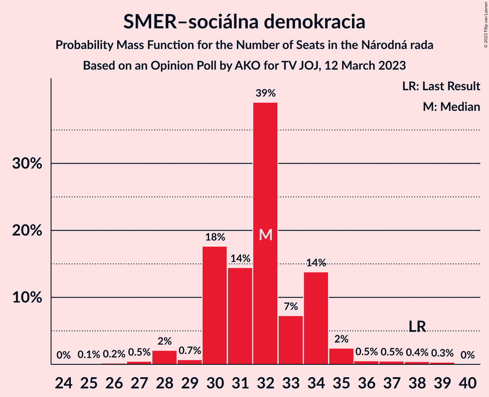

| Number of Seats | Probability | Accumulated | Special Marks |
|:---------------:|:-----------:|:-----------:|:-------------:|
| 25 | 0.1% | 100% |  |
| 26 | 0.2% | 99.9% |  |
| 27 | 0.5% | 99.7% |  |
| 28 | 2% | 99.3% |  |
| 29 | 0.7% | 97% |  |
| 30 | 18% | 96% |  |
| 31 | 14% | 79% |  |
| 32 | 39% | 64% | Median |
| 33 | 7% | 25% |  |
| 34 | 14% | 18% |  |
| 35 | 2% | 4% |  |
| 36 | 0.5% | 2% |  |
| 37 | 0.5% | 1.2% |  |
| 38 | 0.4% | 0.8% | Last Result |
| 39 | 0.3% | 0.3% |  |
| 40 | 0% | 0% |  |

### HLAS–sociálna demokracia

*For a full overview of the results for this party, see the [HLAS–sociálna demokracia](party-hlas–sociálnademokracia.html) page.*

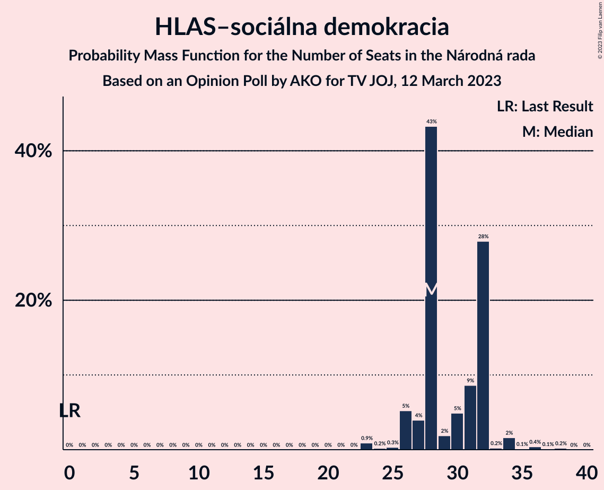

| Number of Seats | Probability | Accumulated | Special Marks |
|:---------------:|:-----------:|:-----------:|:-------------:|
| 0 | 0% | 100% | Last Result |
| 1 | 0% | 100% |  |
| 2 | 0% | 100% |  |
| 3 | 0% | 100% |  |
| 4 | 0% | 100% |  |
| 5 | 0% | 100% |  |
| 6 | 0% | 100% |  |
| 7 | 0% | 100% |  |
| 8 | 0% | 100% |  |
| 9 | 0% | 100% |  |
| 10 | 0% | 100% |  |
| 11 | 0% | 100% |  |
| 12 | 0% | 100% |  |
| 13 | 0% | 100% |  |
| 14 | 0% | 100% |  |
| 15 | 0% | 100% |  |
| 16 | 0% | 100% |  |
| 17 | 0% | 100% |  |
| 18 | 0% | 100% |  |
| 19 | 0% | 100% |  |
| 20 | 0% | 100% |  |
| 21 | 0% | 100% |  |
| 22 | 0% | 100% |  |
| 23 | 0.9% | 100% |  |
| 24 | 0.2% | 99.1% |  |
| 25 | 0.3% | 98.9% |  |
| 26 | 5% | 98.5% |  |
| 27 | 4% | 93% |  |
| 28 | 43% | 89% | Median |
| 29 | 2% | 46% |  |
| 30 | 5% | 44% |  |
| 31 | 9% | 39% |  |
| 32 | 28% | 31% |  |
| 33 | 0.2% | 3% |  |
| 34 | 2% | 2% |  |
| 35 | 0.1% | 0.9% |  |
| 36 | 0.4% | 0.7% |  |
| 37 | 0.1% | 0.3% |  |
| 38 | 0.2% | 0.2% |  |
| 39 | 0% | 0% |  |

### Progresívne Slovensko

*For a full overview of the results for this party, see the [Progresívne Slovensko](party-progresívneslovensko.html) page.*

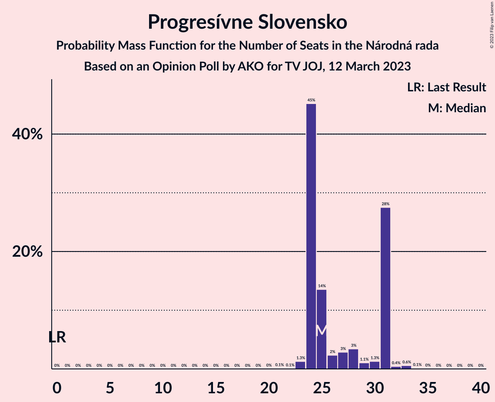

| Number of Seats | Probability | Accumulated | Special Marks |
|:---------------:|:-----------:|:-----------:|:-------------:|
| 0 | 0% | 100% | Last Result |
| 1 | 0% | 100% |  |
| 2 | 0% | 100% |  |
| 3 | 0% | 100% |  |
| 4 | 0% | 100% |  |
| 5 | 0% | 100% |  |
| 6 | 0% | 100% |  |
| 7 | 0% | 100% |  |
| 8 | 0% | 100% |  |
| 9 | 0% | 100% |  |
| 10 | 0% | 100% |  |
| 11 | 0% | 100% |  |
| 12 | 0% | 100% |  |
| 13 | 0% | 100% |  |
| 14 | 0% | 100% |  |
| 15 | 0% | 100% |  |
| 16 | 0% | 100% |  |
| 17 | 0% | 100% |  |
| 18 | 0% | 100% |  |
| 19 | 0% | 100% |  |
| 20 | 0% | 100% |  |
| 21 | 0.1% | 100% |  |
| 22 | 0.1% | 99.8% |  |
| 23 | 1.3% | 99.8% |  |
| 24 | 45% | 98% |  |
| 25 | 14% | 53% | Median |
| 26 | 2% | 40% |  |
| 27 | 3% | 37% |  |
| 28 | 3% | 35% |  |
| 29 | 1.1% | 31% |  |
| 30 | 1.3% | 30% |  |
| 31 | 28% | 29% |  |
| 32 | 0.4% | 1.2% |  |
| 33 | 0.6% | 0.8% |  |
| 34 | 0.1% | 0.2% |  |
| 35 | 0% | 0.1% |  |
| 36 | 0% | 0% |  |

### Sloboda a Solidarita

*For a full overview of the results for this party, see the [Sloboda a Solidarita](party-slobodaasolidarita.html) page.*

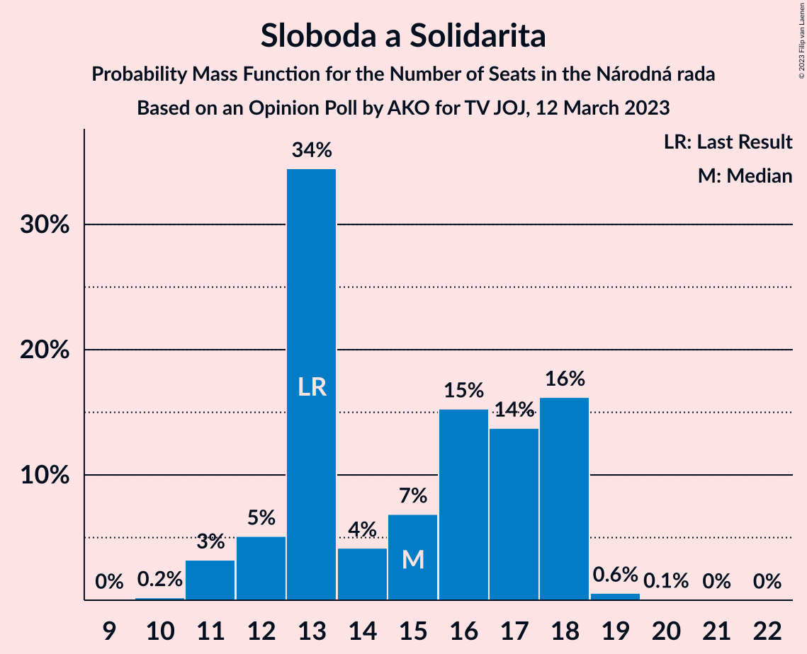

| Number of Seats | Probability | Accumulated | Special Marks |
|:---------------:|:-----------:|:-----------:|:-------------:|
| 10 | 0.2% | 100% |  |
| 11 | 3% | 99.8% |  |
| 12 | 5% | 97% |  |
| 13 | 34% | 91% | Last Result |
| 14 | 4% | 57% |  |
| 15 | 7% | 53% | Median |
| 16 | 15% | 46% |  |
| 17 | 14% | 31% |  |
| 18 | 16% | 17% |  |
| 19 | 0.6% | 0.7% |  |
| 20 | 0.1% | 0.1% |  |
| 21 | 0% | 0.1% |  |
| 22 | 0% | 0% |  |

### SME RODINA

*For a full overview of the results for this party, see the [SME RODINA](party-smerodina.html) page.*

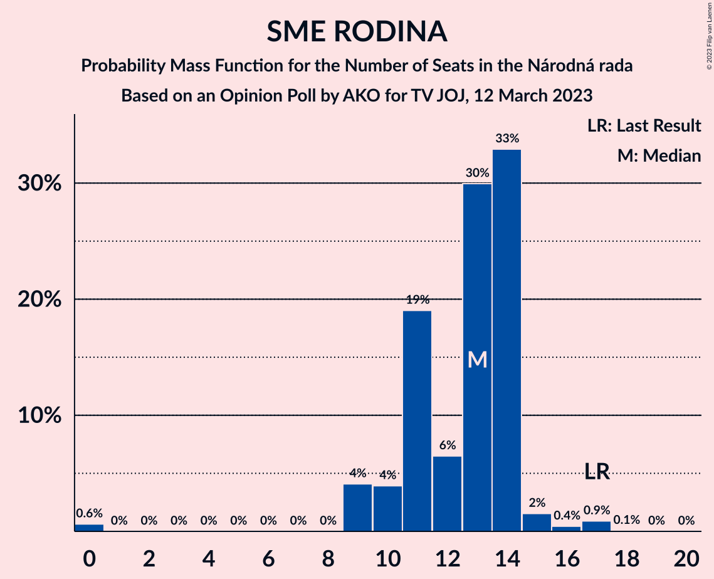

| Number of Seats | Probability | Accumulated | Special Marks |
|:---------------:|:-----------:|:-----------:|:-------------:|
| 0 | 0.6% | 100% |  |
| 1 | 0% | 99.4% |  |
| 2 | 0% | 99.4% |  |
| 3 | 0% | 99.4% |  |
| 4 | 0% | 99.4% |  |
| 5 | 0% | 99.4% |  |
| 6 | 0% | 99.4% |  |
| 7 | 0% | 99.4% |  |
| 8 | 0% | 99.4% |  |
| 9 | 4% | 99.4% |  |
| 10 | 4% | 95% |  |
| 11 | 19% | 91% |  |
| 12 | 6% | 72% |  |
| 13 | 30% | 66% | Median |
| 14 | 33% | 36% |  |
| 15 | 2% | 3% |  |
| 16 | 0.4% | 1.4% |  |
| 17 | 0.9% | 1.0% | Last Result |
| 18 | 0.1% | 0.1% |  |
| 19 | 0% | 0% |  |

### REPUBLIKA

*For a full overview of the results for this party, see the [REPUBLIKA](party-republika.html) page.*

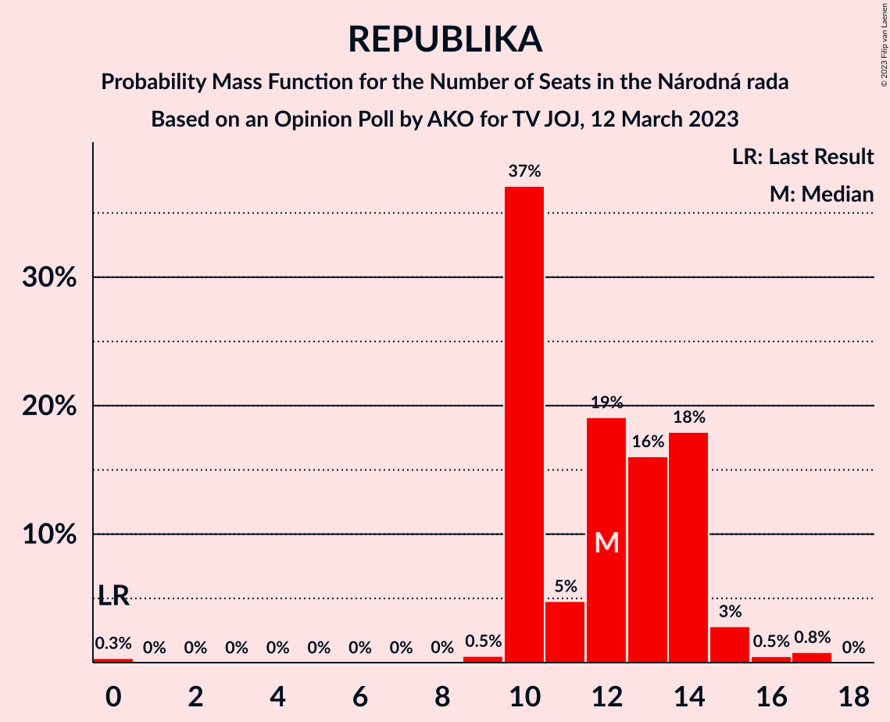

| Number of Seats | Probability | Accumulated | Special Marks |
|:---------------:|:-----------:|:-----------:|:-------------:|
| 0 | 0.3% | 100% | Last Result |
| 1 | 0% | 99.7% |  |
| 2 | 0% | 99.7% |  |
| 3 | 0% | 99.7% |  |
| 4 | 0% | 99.7% |  |
| 5 | 0% | 99.7% |  |
| 6 | 0% | 99.7% |  |
| 7 | 0% | 99.7% |  |
| 8 | 0% | 99.7% |  |
| 9 | 0.5% | 99.6% |  |
| 10 | 37% | 99.1% |  |
| 11 | 5% | 62% |  |
| 12 | 19% | 57% | Median |
| 13 | 16% | 38% |  |
| 14 | 18% | 22% |  |
| 15 | 3% | 4% |  |
| 16 | 0.5% | 1.3% |  |
| 17 | 0.8% | 0.8% |  |
| 18 | 0% | 0% |  |

### Kresťanskodemokratické hnutie

*For a full overview of the results for this party, see the [Kresťanskodemokratické hnutie](party-kresťanskodemokratickéhnutie.html) page.*

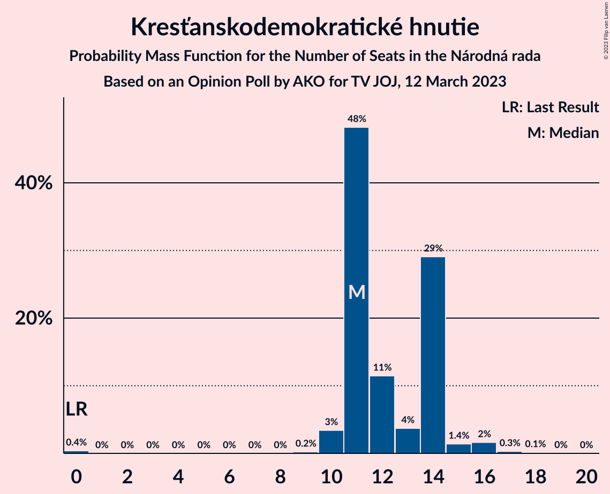

| Number of Seats | Probability | Accumulated | Special Marks |
|:---------------:|:-----------:|:-----------:|:-------------:|
| 0 | 0.4% | 100% | Last Result |
| 1 | 0% | 99.6% |  |
| 2 | 0% | 99.6% |  |
| 3 | 0% | 99.6% |  |
| 4 | 0% | 99.6% |  |
| 5 | 0% | 99.6% |  |
| 6 | 0% | 99.6% |  |
| 7 | 0% | 99.6% |  |
| 8 | 0% | 99.6% |  |
| 9 | 0.2% | 99.6% |  |
| 10 | 3% | 99.4% |  |
| 11 | 48% | 96% | Median |
| 12 | 11% | 48% |  |
| 13 | 4% | 36% |  |
| 14 | 29% | 33% |  |
| 15 | 1.4% | 4% |  |
| 16 | 2% | 2% |  |
| 17 | 0.3% | 0.5% |  |
| 18 | 0.1% | 0.2% |  |
| 19 | 0% | 0% |  |

### OBYČAJNÍ ĽUDIA a nezávislé osobnosti

*For a full overview of the results for this party, see the [OBYČAJNÍ ĽUDIA a nezávislé osobnosti](party-obyčajníľudiaanezávisléosobnosti.html) page.*

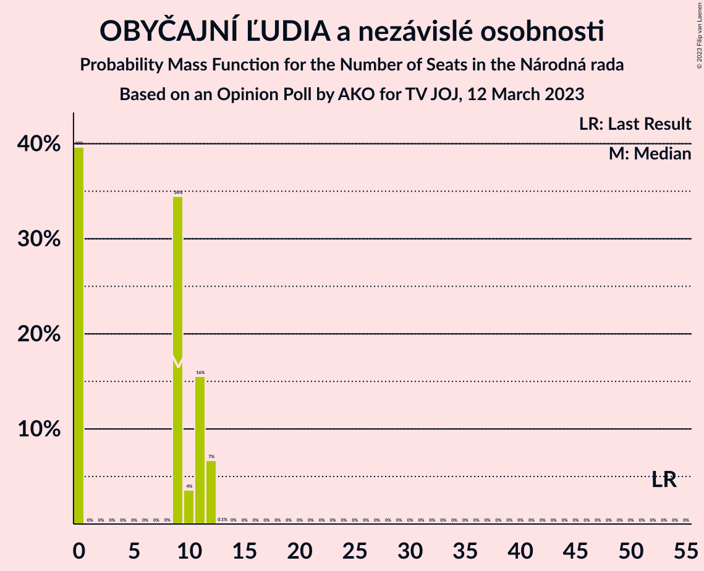

| Number of Seats | Probability | Accumulated | Special Marks |
|:---------------:|:-----------:|:-----------:|:-------------:|
| 0 | 40% | 100% |  |
| 1 | 0% | 60% |  |
| 2 | 0% | 60% |  |
| 3 | 0% | 60% |  |
| 4 | 0% | 60% |  |
| 5 | 0% | 60% |  |
| 6 | 0% | 60% |  |
| 7 | 0% | 60% |  |
| 8 | 0% | 60% |  |
| 9 | 34% | 60% | Median |
| 10 | 4% | 26% |  |
| 11 | 16% | 22% |  |
| 12 | 7% | 7% |  |
| 13 | 0.1% | 0.1% |  |
| 14 | 0% | 0% |  |
| 15 | 0% | 0% |  |
| 16 | 0% | 0% |  |
| 17 | 0% | 0% |  |
| 18 | 0% | 0% |  |
| 19 | 0% | 0% |  |
| 20 | 0% | 0% |  |
| 21 | 0% | 0% |  |
| 22 | 0% | 0% |  |
| 23 | 0% | 0% |  |
| 24 | 0% | 0% |  |
| 25 | 0% | 0% |  |
| 26 | 0% | 0% |  |
| 27 | 0% | 0% |  |
| 28 | 0% | 0% |  |
| 29 | 0% | 0% |  |
| 30 | 0% | 0% |  |
| 31 | 0% | 0% |  |
| 32 | 0% | 0% |  |
| 33 | 0% | 0% |  |
| 34 | 0% | 0% |  |
| 35 | 0% | 0% |  |
| 36 | 0% | 0% |  |
| 37 | 0% | 0% |  |
| 38 | 0% | 0% |  |
| 39 | 0% | 0% |  |
| 40 | 0% | 0% |  |
| 41 | 0% | 0% |  |
| 42 | 0% | 0% |  |
| 43 | 0% | 0% |  |
| 44 | 0% | 0% |  |
| 45 | 0% | 0% |  |
| 46 | 0% | 0% |  |
| 47 | 0% | 0% |  |
| 48 | 0% | 0% |  |
| 49 | 0% | 0% |  |
| 50 | 0% | 0% |  |
| 51 | 0% | 0% |  |
| 52 | 0% | 0% |  |
| 53 | 0% | 0% | Last Result |

### SPOLU–Občianska Demokracia

*For a full overview of the results for this party, see the [SPOLU–Občianska Demokracia](party-spolu–občianskademokracia.html) page.*

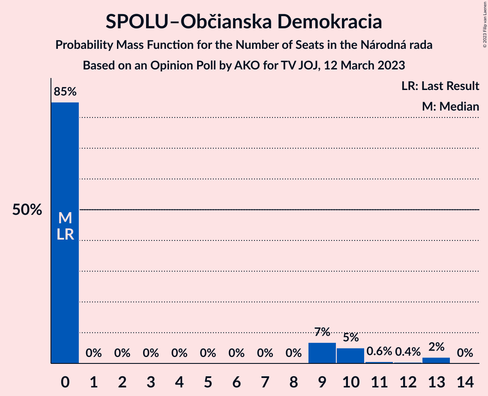

| Number of Seats | Probability | Accumulated | Special Marks |
|:---------------:|:-----------:|:-----------:|:-------------:|
| 0 | 85% | 100% | Last Result, Median |
| 1 | 0% | 15% |  |
| 2 | 0% | 15% |  |
| 3 | 0% | 15% |  |
| 4 | 0% | 15% |  |
| 5 | 0% | 15% |  |
| 6 | 0% | 15% |  |
| 7 | 0% | 15% |  |
| 8 | 0% | 15% |  |
| 9 | 7% | 15% |  |
| 10 | 5% | 8% |  |
| 11 | 0.6% | 3% |  |
| 12 | 0.4% | 2% |  |
| 13 | 2% | 2% |  |
| 14 | 0% | 0% |  |

### Slovenská národná strana

*For a full overview of the results for this party, see the [Slovenská národná strana](party-slovenskánárodnástrana.html) page.*

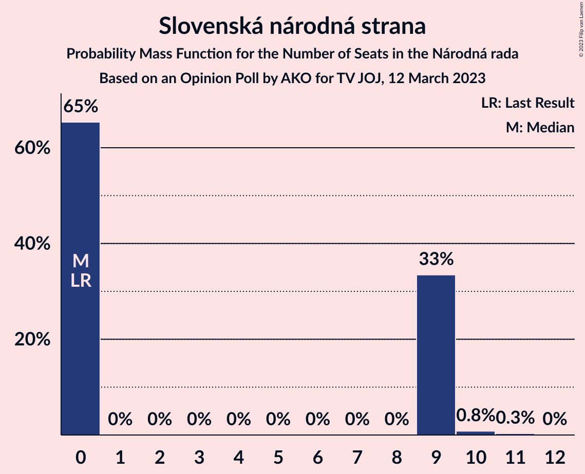

| Number of Seats | Probability | Accumulated | Special Marks |
|:---------------:|:-----------:|:-----------:|:-------------:|
| 0 | 65% | 100% | Last Result, Median |
| 1 | 0% | 35% |  |
| 2 | 0% | 35% |  |
| 3 | 0% | 35% |  |
| 4 | 0% | 35% |  |
| 5 | 0% | 35% |  |
| 6 | 0% | 35% |  |
| 7 | 0% | 35% |  |
| 8 | 0% | 35% |  |
| 9 | 33% | 35% |  |
| 10 | 0.8% | 1.2% |  |
| 11 | 0.3% | 0.4% |  |
| 12 | 0% | 0% |  |

### Strana maďarskej koalície–Magyar Koalíció Pártja

*For a full overview of the results for this party, see the [Strana maďarskej koalície–Magyar Koalíció Pártja](party-stranamaďarskejkoalície–magyarkoalíciópártja.html) page.*

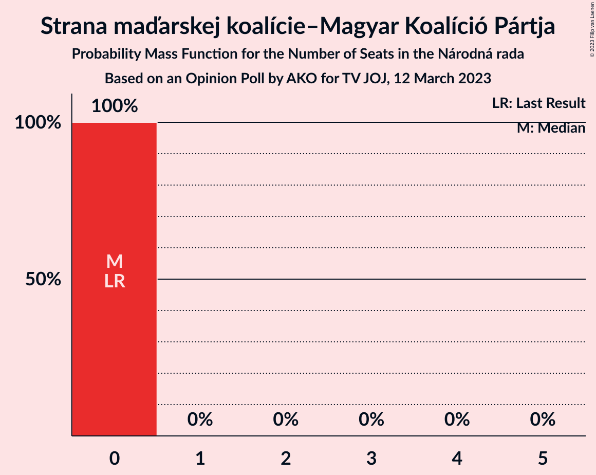

| Number of Seats | Probability | Accumulated | Special Marks |
|:---------------:|:-----------:|:-----------:|:-------------:|
| 0 | 100% | 100% | Last Result, Median |

### Za ľudí

*For a full overview of the results for this party, see the [Za ľudí](party-zaľudí.html) page.*

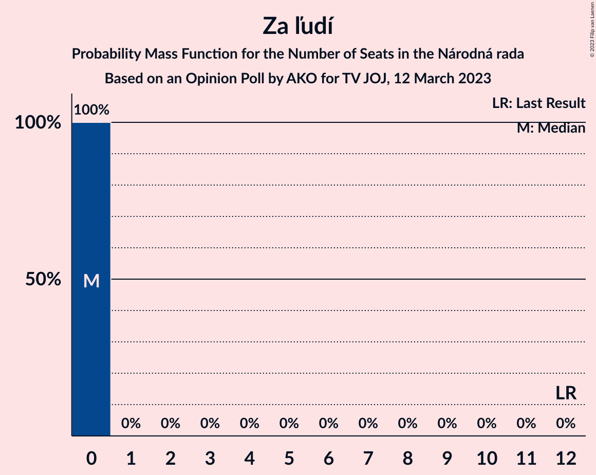

| Number of Seats | Probability | Accumulated | Special Marks |
|:---------------:|:-----------:|:-----------:|:-------------:|
| 0 | 100% | 100% | Median |
| 1 | 0% | 0% |  |
| 2 | 0% | 0% |  |
| 3 | 0% | 0% |  |
| 4 | 0% | 0% |  |
| 5 | 0% | 0% |  |
| 6 | 0% | 0% |  |
| 7 | 0% | 0% |  |
| 8 | 0% | 0% |  |
| 9 | 0% | 0% |  |
| 10 | 0% | 0% |  |
| 11 | 0% | 0% |  |
| 12 | 0% | 0% | Last Result |

### Kotleba–Ľudová strana Naše Slovensko

*For a full overview of the results for this party, see the [Kotleba–Ľudová strana Naše Slovensko](party-kotleba–ľudovástrananašeslovensko.html) page.*

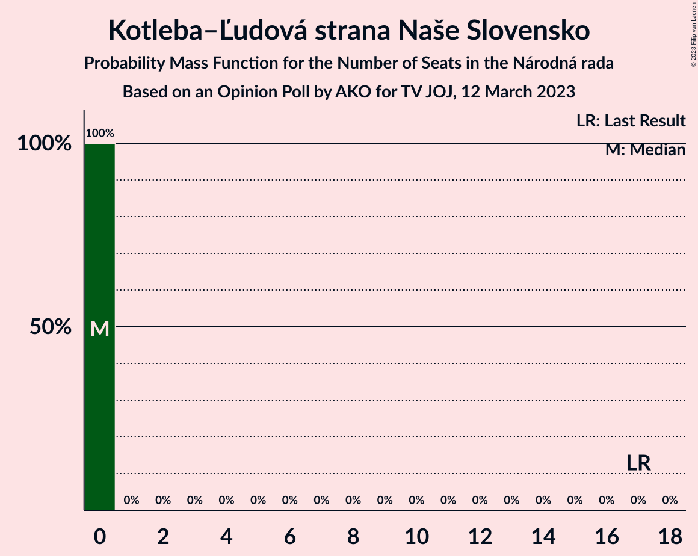

| Number of Seats | Probability | Accumulated | Special Marks |
|:---------------:|:-----------:|:-----------:|:-------------:|
| 0 | 100% | 100% | Median |
| 1 | 0% | 0% |  |
| 2 | 0% | 0% |  |
| 3 | 0% | 0% |  |
| 4 | 0% | 0% |  |
| 5 | 0% | 0% |  |
| 6 | 0% | 0% |  |
| 7 | 0% | 0% |  |
| 8 | 0% | 0% |  |
| 9 | 0% | 0% |  |
| 10 | 0% | 0% |  |
| 11 | 0% | 0% |  |
| 12 | 0% | 0% |  |
| 13 | 0% | 0% |  |
| 14 | 0% | 0% |  |
| 15 | 0% | 0% |  |
| 16 | 0% | 0% |  |
| 17 | 0% | 0% | Last Result |

### Dobrá voľba

*For a full overview of the results for this party, see the [Dobrá voľba](party-dobrávoľba.html) page.*

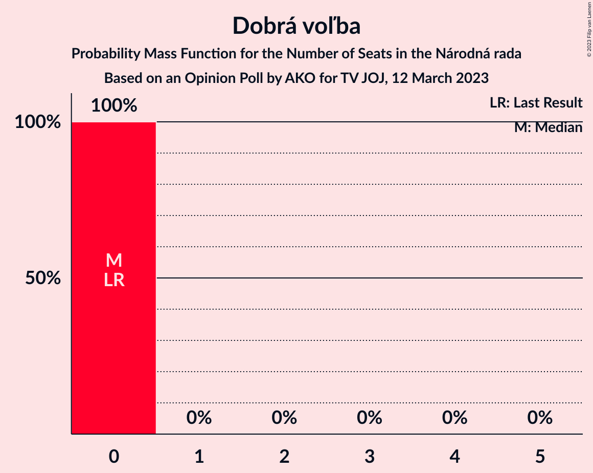

| Number of Seats | Probability | Accumulated | Special Marks |
|:---------------:|:-----------:|:-----------:|:-------------:|
| 0 | 100% | 100% | Last Result, Median |

## Coalitions

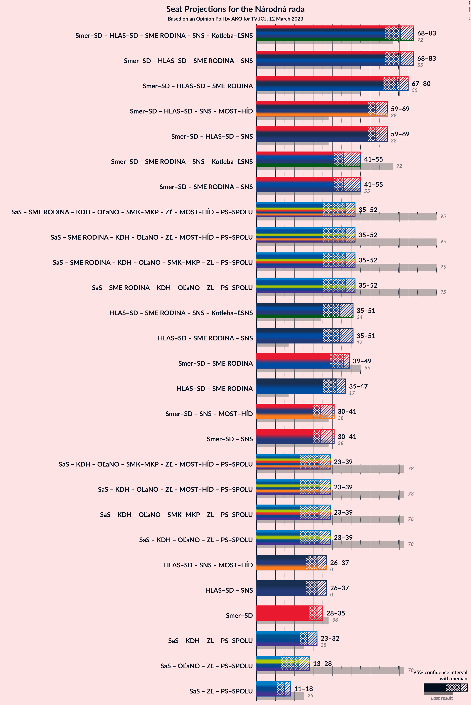

### Confidence Intervals

| Coalition | Last Result | Median | Majority? | 80% Confidence Interval | 90% Confidence Interval | 95% Confidence Interval | 99% Confidence Interval |
|:---------:|:-----------:|:------:|:---------:|:-----------------------:|:-----------------------:|:-----------------------:|:-----------------------:|
| SMER–sociálna demokracia – HLAS–sociálna demokracia – SME RODINA – Slovenská národná strana – Kotleba–Ľudová strana Naše Slovensko | 72 | 76 | 55% | 72–83 | 70–83 | 68–83 | 64–84 |
| SMER–sociálna demokracia – HLAS–sociálna demokracia – SME RODINA – Slovenská národná strana | 55 | 76 | 55% | 72–83 | 70–83 | 68–83 | 64–84 |
| SMER–sociálna demokracia – HLAS–sociálna demokracia – SME RODINA | 55 | 74 | 22% | 71–76 | 68–77 | 67–80 | 63–84 |
| SMER–sociálna demokracia – HLAS–sociálna demokracia – Slovenská národná strana | 38 | 63 | 0.2% | 61–69 | 60–69 | 59–69 | 56–71 |
| SMER–sociálna demokracia – SME RODINA – Slovenská národná strana – Kotleba–Ľudová strana Naše Slovensko | 72 | 46 | 0% | 41–55 | 41–55 | 41–55 | 35–55 |
| SMER–sociálna demokracia – SME RODINA – Slovenská národná strana | 55 | 46 | 0% | 41–55 | 41–55 | 41–55 | 35–55 |
| HLAS–sociálna demokracia – SME RODINA – Slovenská národná strana – Kotleba–Ľudová strana Naše Slovensko | 34 | 44 | 0% | 40–51 | 37–51 | 35–51 | 30–52 |
| HLAS–sociálna demokracia – SME RODINA – Slovenská národná strana | 17 | 44 | 0% | 40–51 | 37–51 | 35–51 | 30–52 |
| SMER–sociálna demokracia – SME RODINA | 55 | 46 | 0% | 41–47 | 41–47 | 39–49 | 35–52 |
| HLAS–sociálna demokracia – SME RODINA | 17 | 42 | 0% | 39–45 | 36–45 | 35–47 | 30–49 |
| SMER–sociálna demokracia – Slovenská národná strana | 38 | 34 | 0% | 30–41 | 30–41 | 30–41 | 28–41 |
| HLAS–sociálna demokracia – Slovenská národná strana | 0 | 32 | 0% | 28–37 | 27–37 | 26–37 | 23–40 |
| SMER–sociálna demokracia | 38 | 32 | 0% | 30–34 | 30–34 | 28–35 | 27–38 |

### SMER–sociálna demokracia – HLAS–sociálna demokracia – SME RODINA – Slovenská národná strana – Kotleba–Ľudová strana Naše Slovensko

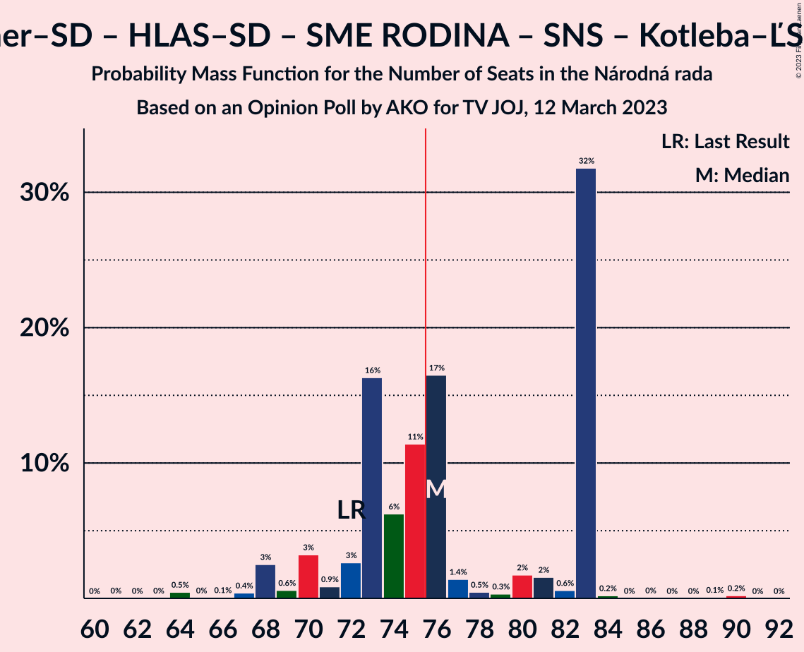

| Number of Seats | Probability | Accumulated | Special Marks |
|:---------------:|:-----------:|:-----------:|:-------------:|
| 61 | 0% | 100% |  |
| 62 | 0% | 99.9% |  |
| 63 | 0% | 99.9% |  |
| 64 | 0.5% | 99.9% |  |
| 65 | 0% | 99.4% |  |
| 66 | 0.1% | 99.4% |  |
| 67 | 0.4% | 99.3% |  |
| 68 | 3% | 98.9% |  |
| 69 | 0.6% | 96% |  |
| 70 | 3% | 96% |  |
| 71 | 0.9% | 93% |  |
| 72 | 3% | 92% | Last Result |
| 73 | 16% | 89% | Median |
| 74 | 6% | 73% |  |
| 75 | 11% | 66% |  |
| 76 | 17% | 55% | Majority |
| 77 | 1.4% | 39% |  |
| 78 | 0.5% | 37% |  |
| 79 | 0.3% | 37% |  |
| 80 | 2% | 36% |  |
| 81 | 2% | 35% |  |
| 82 | 0.6% | 33% |  |
| 83 | 32% | 32% |  |
| 84 | 0.2% | 0.6% |  |
| 85 | 0% | 0.4% |  |
| 86 | 0% | 0.4% |  |
| 87 | 0% | 0.3% |  |
| 88 | 0% | 0.3% |  |
| 89 | 0.1% | 0.3% |  |
| 90 | 0.2% | 0.2% |  |
| 91 | 0% | 0% |  |

### SMER–sociálna demokracia – HLAS–sociálna demokracia – SME RODINA – Slovenská národná strana

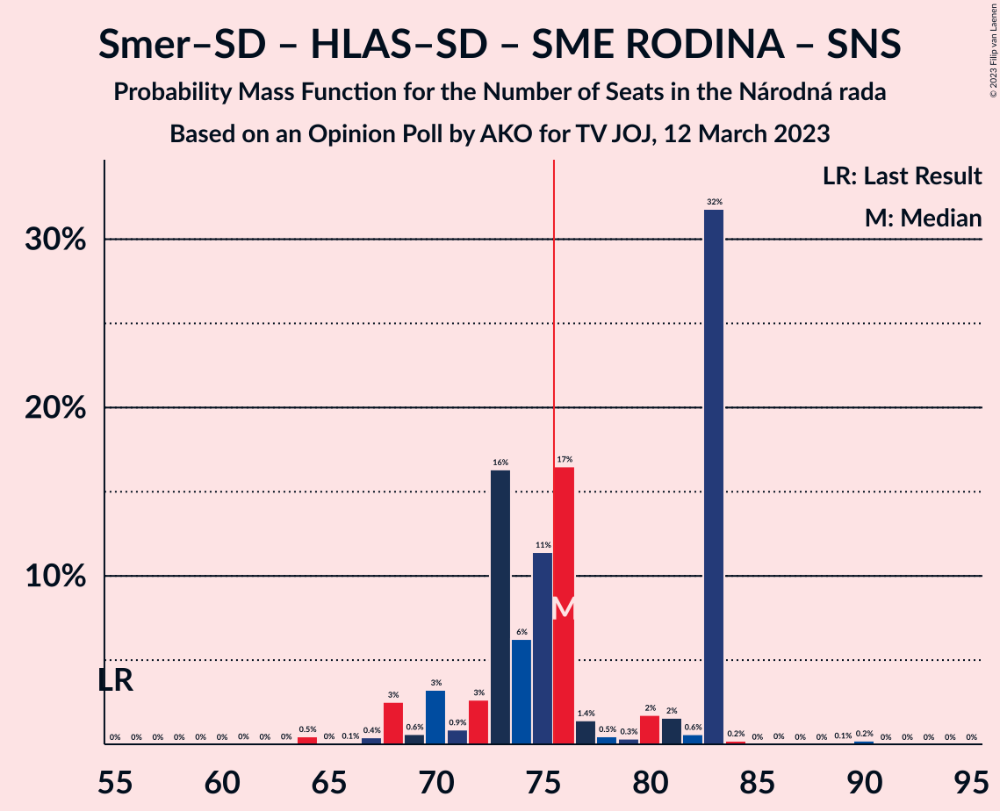

| Number of Seats | Probability | Accumulated | Special Marks |
|:---------------:|:-----------:|:-----------:|:-------------:|
| 55 | 0% | 100% | Last Result |
| 56 | 0% | 100% |  |
| 57 | 0% | 100% |  |
| 58 | 0% | 100% |  |
| 59 | 0% | 100% |  |
| 60 | 0% | 100% |  |
| 61 | 0% | 100% |  |
| 62 | 0% | 99.9% |  |
| 63 | 0% | 99.9% |  |
| 64 | 0.5% | 99.9% |  |
| 65 | 0% | 99.4% |  |
| 66 | 0.1% | 99.4% |  |
| 67 | 0.4% | 99.3% |  |
| 68 | 3% | 98.9% |  |
| 69 | 0.6% | 96% |  |
| 70 | 3% | 96% |  |
| 71 | 0.9% | 93% |  |
| 72 | 3% | 92% |  |
| 73 | 16% | 89% | Median |
| 74 | 6% | 73% |  |
| 75 | 11% | 66% |  |
| 76 | 17% | 55% | Majority |
| 77 | 1.4% | 39% |  |
| 78 | 0.5% | 37% |  |
| 79 | 0.3% | 37% |  |
| 80 | 2% | 36% |  |
| 81 | 2% | 35% |  |
| 82 | 0.6% | 33% |  |
| 83 | 32% | 32% |  |
| 84 | 0.2% | 0.6% |  |
| 85 | 0% | 0.4% |  |
| 86 | 0% | 0.4% |  |
| 87 | 0% | 0.3% |  |
| 88 | 0% | 0.3% |  |
| 89 | 0.1% | 0.3% |  |
| 90 | 0.2% | 0.2% |  |
| 91 | 0% | 0% |  |

### SMER–sociálna demokracia – HLAS–sociálna demokracia – SME RODINA

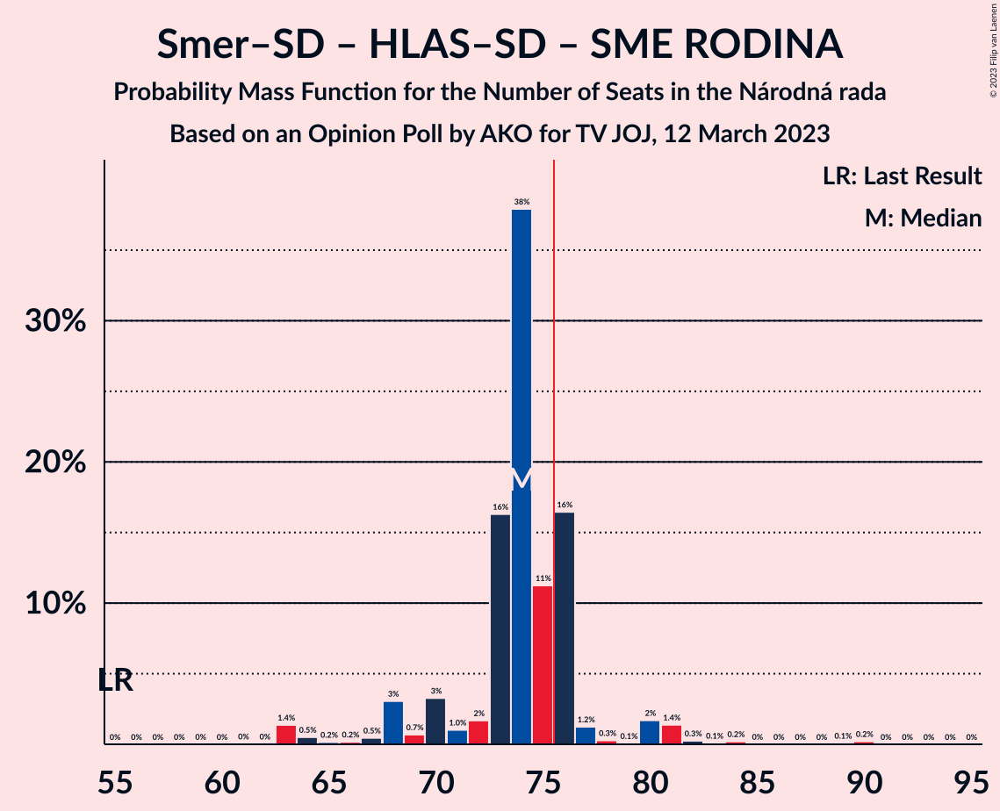

| Number of Seats | Probability | Accumulated | Special Marks |
|:---------------:|:-----------:|:-----------:|:-------------:|
| 55 | 0% | 100% | Last Result |
| 56 | 0% | 100% |  |
| 57 | 0% | 100% |  |
| 58 | 0% | 100% |  |
| 59 | 0% | 100% |  |
| 60 | 0% | 100% |  |
| 61 | 0% | 100% |  |
| 62 | 0% | 99.9% |  |
| 63 | 1.4% | 99.9% |  |
| 64 | 0.5% | 98.5% |  |
| 65 | 0.2% | 98% |  |
| 66 | 0.2% | 98% |  |
| 67 | 0.5% | 98% |  |
| 68 | 3% | 97% |  |
| 69 | 0.7% | 94% |  |
| 70 | 3% | 93% |  |
| 71 | 1.0% | 90% |  |
| 72 | 2% | 89% |  |
| 73 | 16% | 88% | Median |
| 74 | 38% | 71% |  |
| 75 | 11% | 33% |  |
| 76 | 16% | 22% | Majority |
| 77 | 1.2% | 6% |  |
| 78 | 0.3% | 4% |  |
| 79 | 0.1% | 4% |  |
| 80 | 2% | 4% |  |
| 81 | 1.4% | 2% |  |
| 82 | 0.3% | 0.9% |  |
| 83 | 0.1% | 0.6% |  |
| 84 | 0.2% | 0.5% |  |
| 85 | 0% | 0.3% |  |
| 86 | 0% | 0.3% |  |
| 87 | 0% | 0.3% |  |
| 88 | 0% | 0.3% |  |
| 89 | 0.1% | 0.3% |  |
| 90 | 0.2% | 0.2% |  |
| 91 | 0% | 0% |  |

### SMER–sociálna demokracia – HLAS–sociálna demokracia – Slovenská národná strana

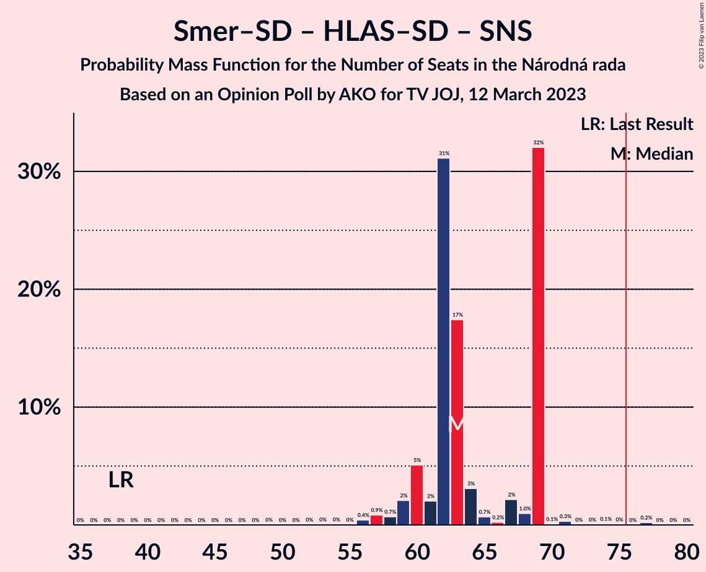

| Number of Seats | Probability | Accumulated | Special Marks |
|:---------------:|:-----------:|:-----------:|:-------------:|
| 38 | 0% | 100% | Last Result |
| 39 | 0% | 100% |  |
| 40 | 0% | 100% |  |
| 41 | 0% | 100% |  |
| 42 | 0% | 100% |  |
| 43 | 0% | 100% |  |
| 44 | 0% | 100% |  |
| 45 | 0% | 100% |  |
| 46 | 0% | 100% |  |
| 47 | 0% | 100% |  |
| 48 | 0% | 100% |  |
| 49 | 0% | 100% |  |
| 50 | 0% | 100% |  |
| 51 | 0% | 100% |  |
| 52 | 0% | 100% |  |
| 53 | 0% | 99.9% |  |
| 54 | 0% | 99.9% |  |
| 55 | 0% | 99.8% |  |
| 56 | 0.4% | 99.8% |  |
| 57 | 0.9% | 99.4% |  |
| 58 | 0.7% | 98.5% |  |
| 59 | 2% | 98% |  |
| 60 | 5% | 96% | Median |
| 61 | 2% | 91% |  |
| 62 | 31% | 89% |  |
| 63 | 17% | 57% |  |
| 64 | 3% | 40% |  |
| 65 | 0.7% | 37% |  |
| 66 | 0.2% | 36% |  |
| 67 | 2% | 36% |  |
| 68 | 1.0% | 34% |  |
| 69 | 32% | 33% |  |
| 70 | 0.1% | 0.8% |  |
| 71 | 0.3% | 0.8% |  |
| 72 | 0% | 0.4% |  |
| 73 | 0% | 0.4% |  |
| 74 | 0.1% | 0.4% |  |
| 75 | 0% | 0.3% |  |
| 76 | 0% | 0.2% | Majority |
| 77 | 0.2% | 0.2% |  |
| 78 | 0% | 0% |  |

### SMER–sociálna demokracia – SME RODINA – Slovenská národná strana – Kotleba–Ľudová strana Naše Slovensko

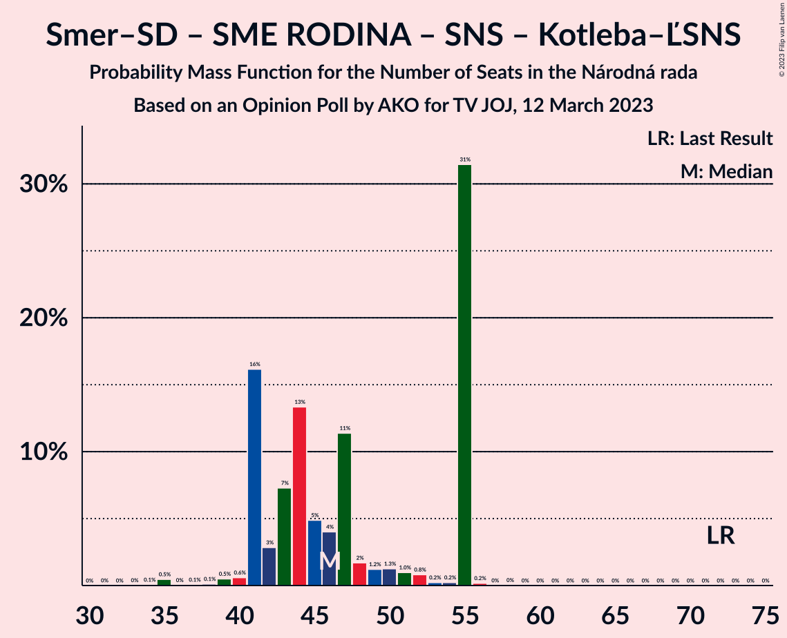

| Number of Seats | Probability | Accumulated | Special Marks |
|:---------------:|:-----------:|:-----------:|:-------------:|
| 33 | 0% | 100% |  |
| 34 | 0.1% | 99.9% |  |
| 35 | 0.5% | 99.9% |  |
| 36 | 0% | 99.4% |  |
| 37 | 0.1% | 99.4% |  |
| 38 | 0.1% | 99.3% |  |
| 39 | 0.5% | 99.2% |  |
| 40 | 0.6% | 98.7% |  |
| 41 | 16% | 98% |  |
| 42 | 3% | 82% |  |
| 43 | 7% | 79% |  |
| 44 | 13% | 72% |  |
| 45 | 5% | 58% | Median |
| 46 | 4% | 54% |  |
| 47 | 11% | 50% |  |
| 48 | 2% | 38% |  |
| 49 | 1.2% | 36% |  |
| 50 | 1.3% | 35% |  |
| 51 | 1.0% | 34% |  |
| 52 | 0.8% | 33% |  |
| 53 | 0.2% | 32% |  |
| 54 | 0.2% | 32% |  |
| 55 | 31% | 32% |  |
| 56 | 0.2% | 0.2% |  |
| 57 | 0% | 0.1% |  |
| 58 | 0% | 0% |  |
| 59 | 0% | 0% |  |
| 60 | 0% | 0% |  |
| 61 | 0% | 0% |  |
| 62 | 0% | 0% |  |
| 63 | 0% | 0% |  |
| 64 | 0% | 0% |  |
| 65 | 0% | 0% |  |
| 66 | 0% | 0% |  |
| 67 | 0% | 0% |  |
| 68 | 0% | 0% |  |
| 69 | 0% | 0% |  |
| 70 | 0% | 0% |  |
| 71 | 0% | 0% |  |
| 72 | 0% | 0% | Last Result |

### SMER–sociálna demokracia – SME RODINA – Slovenská národná strana

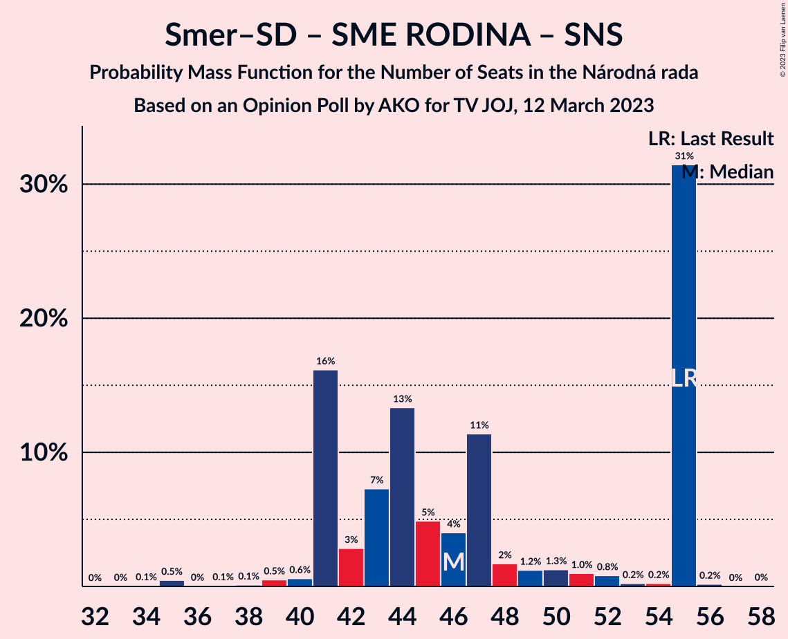

| Number of Seats | Probability | Accumulated | Special Marks |
|:---------------:|:-----------:|:-----------:|:-------------:|
| 33 | 0% | 100% |  |
| 34 | 0.1% | 99.9% |  |
| 35 | 0.5% | 99.9% |  |
| 36 | 0% | 99.4% |  |
| 37 | 0.1% | 99.4% |  |
| 38 | 0.1% | 99.3% |  |
| 39 | 0.5% | 99.2% |  |
| 40 | 0.6% | 98.7% |  |
| 41 | 16% | 98% |  |
| 42 | 3% | 82% |  |
| 43 | 7% | 79% |  |
| 44 | 13% | 72% |  |
| 45 | 5% | 58% | Median |
| 46 | 4% | 54% |  |
| 47 | 11% | 50% |  |
| 48 | 2% | 38% |  |
| 49 | 1.2% | 36% |  |
| 50 | 1.3% | 35% |  |
| 51 | 1.0% | 34% |  |
| 52 | 0.8% | 33% |  |
| 53 | 0.2% | 32% |  |
| 54 | 0.2% | 32% |  |
| 55 | 31% | 32% | Last Result |
| 56 | 0.2% | 0.2% |  |
| 57 | 0% | 0.1% |  |
| 58 | 0% | 0% |  |

### HLAS–sociálna demokracia – SME RODINA – Slovenská národná strana – Kotleba–Ľudová strana Naše Slovensko

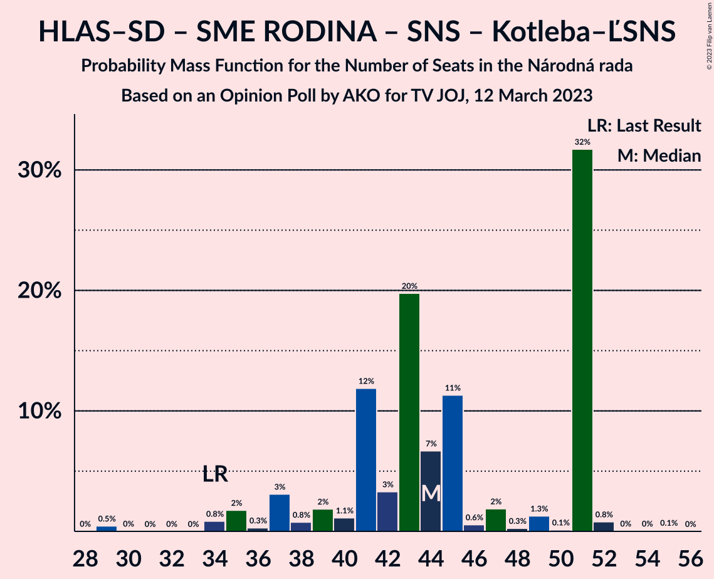

| Number of Seats | Probability | Accumulated | Special Marks |
|:---------------:|:-----------:|:-----------:|:-------------:|
| 29 | 0.5% | 100% |  |
| 30 | 0% | 99.5% |  |
| 31 | 0% | 99.5% |  |
| 32 | 0% | 99.5% |  |
| 33 | 0% | 99.5% |  |
| 34 | 0.8% | 99.5% | Last Result |
| 35 | 2% | 98.6% |  |
| 36 | 0.3% | 97% |  |
| 37 | 3% | 97% |  |
| 38 | 0.8% | 93% |  |
| 39 | 2% | 93% |  |
| 40 | 1.1% | 91% |  |
| 41 | 12% | 90% | Median |
| 42 | 3% | 78% |  |
| 43 | 20% | 75% |  |
| 44 | 7% | 55% |  |
| 45 | 11% | 48% |  |
| 46 | 0.6% | 37% |  |
| 47 | 2% | 36% |  |
| 48 | 0.3% | 34% |  |
| 49 | 1.3% | 34% |  |
| 50 | 0.1% | 33% |  |
| 51 | 32% | 33% |  |
| 52 | 0.8% | 1.0% |  |
| 53 | 0% | 0.2% |  |
| 54 | 0% | 0.1% |  |
| 55 | 0.1% | 0.1% |  |
| 56 | 0% | 0% |  |

### HLAS–sociálna demokracia – SME RODINA – Slovenská národná strana

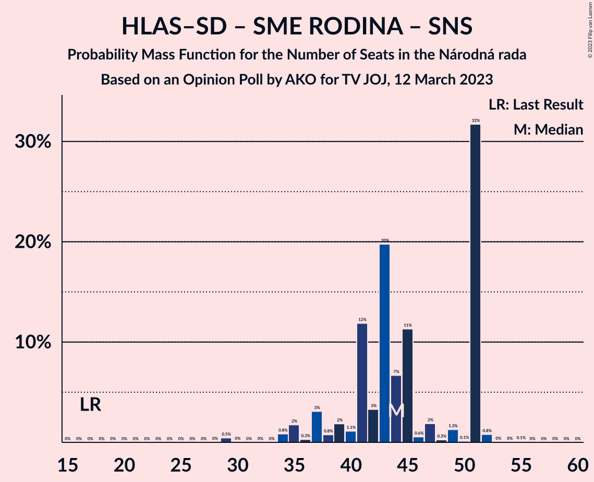

| Number of Seats | Probability | Accumulated | Special Marks |
|:---------------:|:-----------:|:-----------:|:-------------:|
| 17 | 0% | 100% | Last Result |
| 18 | 0% | 100% |  |
| 19 | 0% | 100% |  |
| 20 | 0% | 100% |  |
| 21 | 0% | 100% |  |
| 22 | 0% | 100% |  |
| 23 | 0% | 100% |  |
| 24 | 0% | 100% |  |
| 25 | 0% | 100% |  |
| 26 | 0% | 100% |  |
| 27 | 0% | 100% |  |
| 28 | 0% | 100% |  |
| 29 | 0.5% | 100% |  |
| 30 | 0% | 99.5% |  |
| 31 | 0% | 99.5% |  |
| 32 | 0% | 99.5% |  |
| 33 | 0% | 99.5% |  |
| 34 | 0.8% | 99.5% |  |
| 35 | 2% | 98.6% |  |
| 36 | 0.3% | 97% |  |
| 37 | 3% | 97% |  |
| 38 | 0.8% | 93% |  |
| 39 | 2% | 93% |  |
| 40 | 1.1% | 91% |  |
| 41 | 12% | 90% | Median |
| 42 | 3% | 78% |  |
| 43 | 20% | 75% |  |
| 44 | 7% | 55% |  |
| 45 | 11% | 48% |  |
| 46 | 0.6% | 37% |  |
| 47 | 2% | 36% |  |
| 48 | 0.3% | 34% |  |
| 49 | 1.3% | 34% |  |
| 50 | 0.1% | 33% |  |
| 51 | 32% | 33% |  |
| 52 | 0.8% | 1.0% |  |
| 53 | 0% | 0.2% |  |
| 54 | 0% | 0.1% |  |
| 55 | 0.1% | 0.1% |  |
| 56 | 0% | 0% |  |

### SMER–sociálna demokracia – SME RODINA

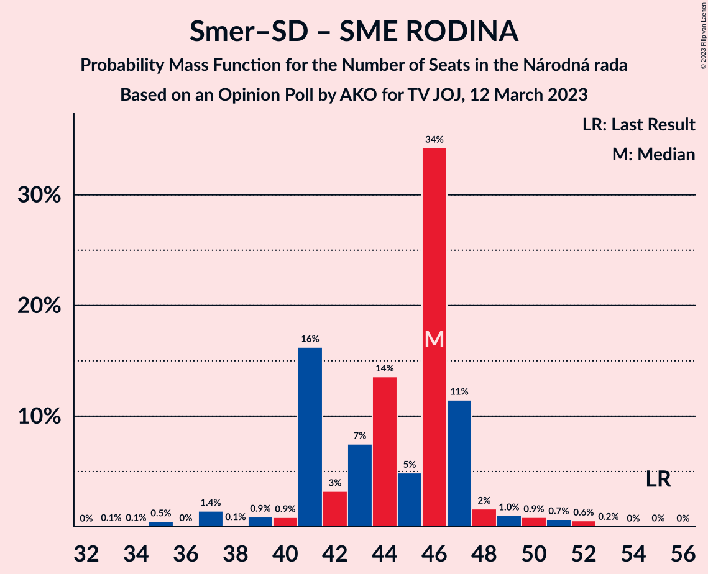

| Number of Seats | Probability | Accumulated | Special Marks |
|:---------------:|:-----------:|:-----------:|:-------------:|
| 33 | 0.1% | 100% |  |
| 34 | 0.1% | 99.9% |  |
| 35 | 0.5% | 99.8% |  |
| 36 | 0% | 99.4% |  |
| 37 | 1.4% | 99.3% |  |
| 38 | 0.1% | 98% |  |
| 39 | 0.9% | 98% |  |
| 40 | 0.9% | 97% |  |
| 41 | 16% | 96% |  |
| 42 | 3% | 80% |  |
| 43 | 7% | 77% |  |
| 44 | 14% | 69% |  |
| 45 | 5% | 56% | Median |
| 46 | 34% | 51% |  |
| 47 | 11% | 16% |  |
| 48 | 2% | 5% |  |
| 49 | 1.0% | 3% |  |
| 50 | 0.9% | 2% |  |
| 51 | 0.7% | 1.4% |  |
| 52 | 0.6% | 0.7% |  |
| 53 | 0.2% | 0.2% |  |
| 54 | 0% | 0% |  |
| 55 | 0% | 0% | Last Result |

### HLAS–sociálna demokracia – SME RODINA

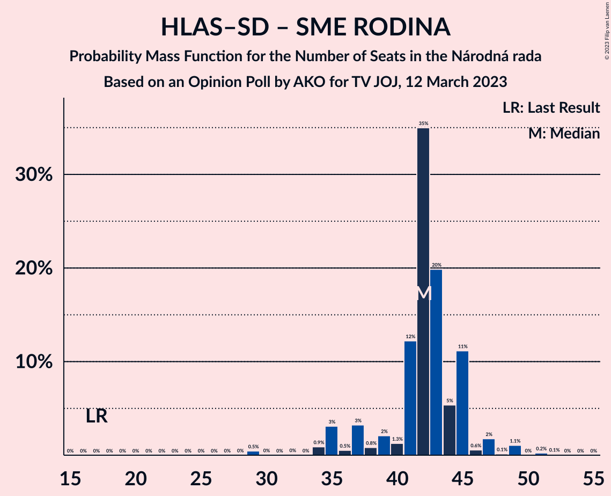

| Number of Seats | Probability | Accumulated | Special Marks |
|:---------------:|:-----------:|:-----------:|:-------------:|
| 17 | 0% | 100% | Last Result |
| 18 | 0% | 100% |  |
| 19 | 0% | 100% |  |
| 20 | 0% | 100% |  |
| 21 | 0% | 100% |  |
| 22 | 0% | 100% |  |
| 23 | 0% | 100% |  |
| 24 | 0% | 100% |  |
| 25 | 0% | 100% |  |
| 26 | 0% | 100% |  |
| 27 | 0% | 100% |  |
| 28 | 0% | 100% |  |
| 29 | 0.5% | 100% |  |
| 30 | 0% | 99.5% |  |
| 31 | 0% | 99.5% |  |
| 32 | 0% | 99.5% |  |
| 33 | 0% | 99.4% |  |
| 34 | 0.9% | 99.4% |  |
| 35 | 3% | 98.5% |  |
| 36 | 0.5% | 95% |  |
| 37 | 3% | 95% |  |
| 38 | 0.8% | 92% |  |
| 39 | 2% | 91% |  |
| 40 | 1.3% | 89% |  |
| 41 | 12% | 87% | Median |
| 42 | 35% | 75% |  |
| 43 | 20% | 40% |  |
| 44 | 5% | 20% |  |
| 45 | 11% | 15% |  |
| 46 | 0.6% | 4% |  |
| 47 | 2% | 3% |  |
| 48 | 0.1% | 2% |  |
| 49 | 1.1% | 1.4% |  |
| 50 | 0% | 0.4% |  |
| 51 | 0.2% | 0.3% |  |
| 52 | 0.1% | 0.1% |  |
| 53 | 0% | 0% |  |

### SMER–sociálna demokracia – Slovenská národná strana

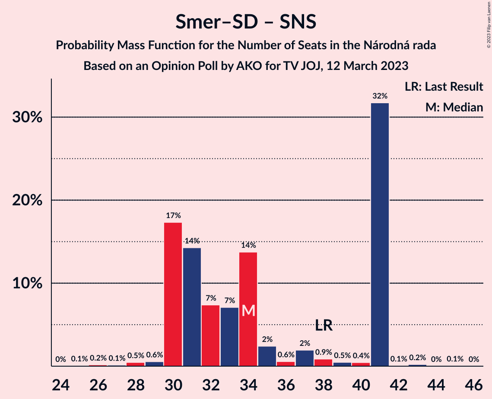

| Number of Seats | Probability | Accumulated | Special Marks |
|:---------------:|:-----------:|:-----------:|:-------------:|
| 25 | 0.1% | 100% |  |
| 26 | 0.2% | 99.9% |  |
| 27 | 0.1% | 99.8% |  |
| 28 | 0.5% | 99.6% |  |
| 29 | 0.6% | 99.2% |  |
| 30 | 17% | 98.6% |  |
| 31 | 14% | 81% |  |
| 32 | 7% | 67% | Median |
| 33 | 7% | 60% |  |
| 34 | 14% | 53% |  |
| 35 | 2% | 39% |  |
| 36 | 0.6% | 36% |  |
| 37 | 2% | 36% |  |
| 38 | 0.9% | 34% | Last Result |
| 39 | 0.5% | 33% |  |
| 40 | 0.4% | 33% |  |
| 41 | 32% | 32% |  |
| 42 | 0.1% | 0.3% |  |
| 43 | 0.2% | 0.3% |  |
| 44 | 0% | 0.1% |  |
| 45 | 0.1% | 0.1% |  |
| 46 | 0% | 0% |  |

### HLAS–sociálna demokracia – Slovenská národná strana

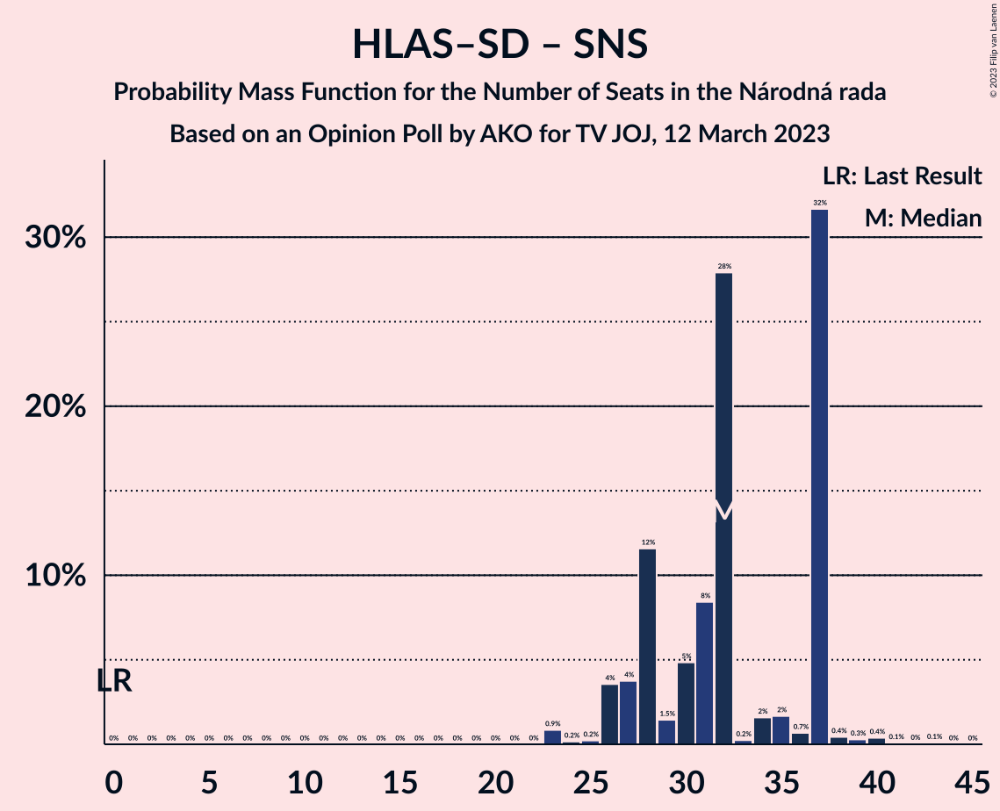

| Number of Seats | Probability | Accumulated | Special Marks |
|:---------------:|:-----------:|:-----------:|:-------------:|
| 0 | 0% | 100% | Last Result |
| 1 | 0% | 100% |  |
| 2 | 0% | 100% |  |
| 3 | 0% | 100% |  |
| 4 | 0% | 100% |  |
| 5 | 0% | 100% |  |
| 6 | 0% | 100% |  |
| 7 | 0% | 100% |  |
| 8 | 0% | 100% |  |
| 9 | 0% | 100% |  |
| 10 | 0% | 100% |  |
| 11 | 0% | 100% |  |
| 12 | 0% | 100% |  |
| 13 | 0% | 100% |  |
| 14 | 0% | 100% |  |
| 15 | 0% | 100% |  |
| 16 | 0% | 100% |  |
| 17 | 0% | 100% |  |
| 18 | 0% | 100% |  |
| 19 | 0% | 100% |  |
| 20 | 0% | 100% |  |
| 21 | 0% | 100% |  |
| 22 | 0% | 100% |  |
| 23 | 0.9% | 100% |  |
| 24 | 0.2% | 99.1% |  |
| 25 | 0.2% | 99.0% |  |
| 26 | 4% | 98.7% |  |
| 27 | 4% | 95% |  |
| 28 | 12% | 91% | Median |
| 29 | 1.5% | 80% |  |
| 30 | 5% | 78% |  |
| 31 | 8% | 74% |  |
| 32 | 28% | 65% |  |
| 33 | 0.2% | 37% |  |
| 34 | 2% | 37% |  |
| 35 | 2% | 35% |  |
| 36 | 0.7% | 34% |  |
| 37 | 32% | 33% |  |
| 38 | 0.4% | 1.3% |  |
| 39 | 0.3% | 0.9% |  |
| 40 | 0.4% | 0.6% |  |
| 41 | 0.1% | 0.2% |  |
| 42 | 0% | 0.1% |  |
| 43 | 0.1% | 0.1% |  |
| 44 | 0% | 0% |  |

### SMER–sociálna demokracia

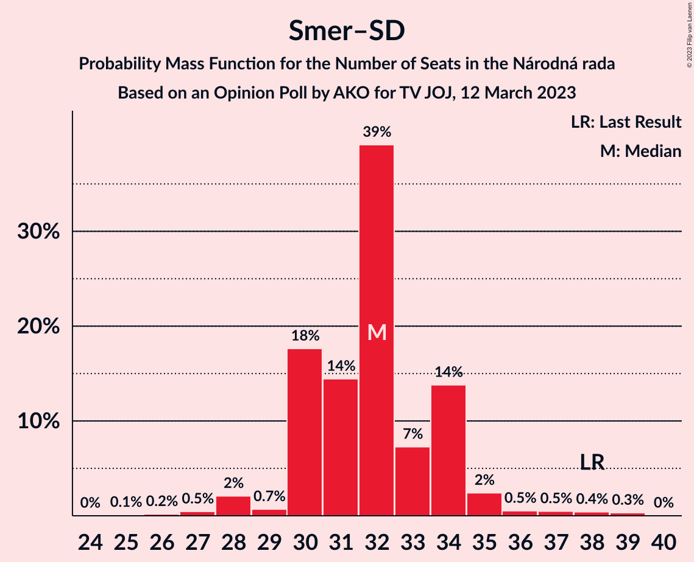

| Number of Seats | Probability | Accumulated | Special Marks |
|:---------------:|:-----------:|:-----------:|:-------------:|
| 25 | 0.1% | 100% |  |
| 26 | 0.2% | 99.9% |  |
| 27 | 0.5% | 99.7% |  |
| 28 | 2% | 99.3% |  |
| 29 | 0.7% | 97% |  |
| 30 | 18% | 96% |  |
| 31 | 14% | 79% |  |
| 32 | 39% | 64% | Median |
| 33 | 7% | 25% |  |
| 34 | 14% | 18% |  |
| 35 | 2% | 4% |  |
| 36 | 0.5% | 2% |  |
| 37 | 0.5% | 1.2% |  |
| 38 | 0.4% | 0.8% | Last Result |
| 39 | 0.3% | 0.3% |  |
| 40 | 0% | 0% |  |

## Technical Information

### Opinion Poll

+ **Polling firm:** AKO
+ **Commissioner(s):** TV JOJ
+ **Fieldwork period:** 12 March 2023

### Calculations

+ **Sample size:** 1000
+ **Simulations done:** 1,048,576
+ **Error estimate:** 1.55%

