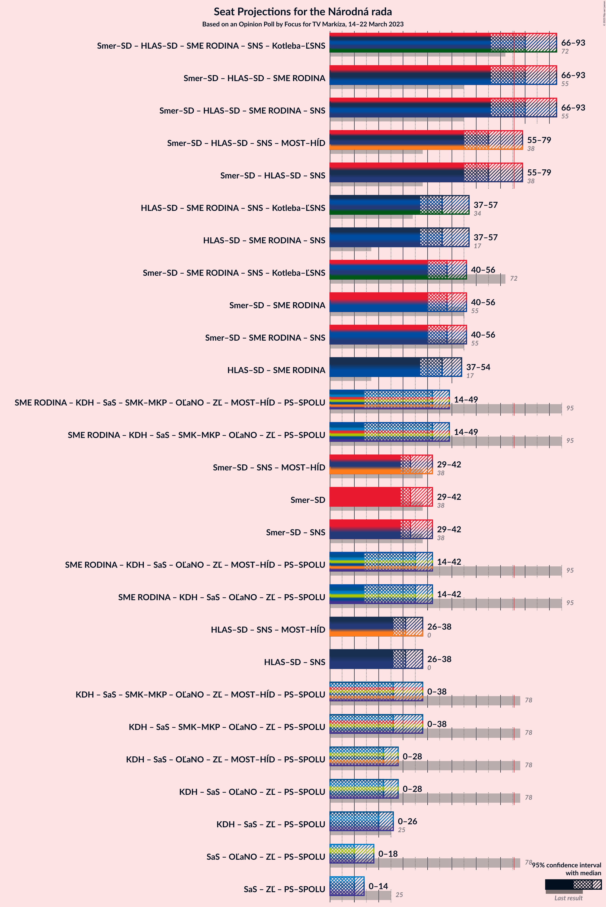

# Opinion Poll by Focus for TV Markíza, 14–22 March 2023

<a href="#voting-intentions">Voting Intentions</a> | <a href="#seats">Seats</a> | <a href="#coalitions">Coalitions</a> | <a href="#technical-information">Technical Information</a>

## Voting Intentions

### Confidence Intervals

| Party | Last Result | Poll Result | 80% Confidence Interval | 90% Confidence Interval | 95% Confidence Interval | 99% Confidence Interval |
|:-----:|:-----------:|:-----------:|:-----------------------:|:-----------------------:|:-----------------------:|:-----------------------:|
| SMER–sociálna demokracia | 18.3% | 17.6% | 16.1–19.2% |15.7–19.6% |15.4–20.1% |14.7–20.9% |
| HLAS–sociálna demokracia | 0.0% | 17.1% | 15.7–18.7% |15.2–19.1% |14.9–19.5% |14.2–20.3% |
| Progresívne Slovensko | 7.0% | 12.1% | 10.9–13.5% |10.5–13.9% |10.2–14.2% |9.7–14.9% |
| REPUBLIKA | 0.0% | 9.6% | 8.5–10.9% |8.2–11.3% |8.0–11.6% |7.5–12.2% |
| SME RODINA | 8.2% | 7.7% | 6.7–8.8% |6.4–9.2% |6.2–9.5% |5.7–10.1% |
| Kresťanskodemokratické hnutie | 4.6% | 5.8% | 5.0–6.8% |4.7–7.1% |4.5–7.4% |4.1–7.9% |
| Sloboda a Solidarita | 6.2% | 5.1% | 4.3–6.1% |4.1–6.4% |3.9–6.6% |3.6–7.1% |
| SPOLU–Občianska Demokracia | 7.0% | 5.0% | 4.2–6.0% |4.0–6.3% |3.8–6.5% |3.5–7.0% |
| Strana maďarskej koalície–Magyar Koalíció Pártja | 3.9% | 4.7% | 4.0–5.7% |3.7–6.0% |3.6–6.2% |3.2–6.7% |
| OBYČAJNÍ ĽUDIA a nezávislé osobnosti | 25.0% | 4.3% | 3.6–5.3% |3.4–5.5% |3.2–5.8% |2.9–6.2% |
| Slovenská národná strana | 3.2% | 3.4% | 2.8–4.3% |2.6–4.5% |2.5–4.8% |2.2–5.2% |
| Kotleba–Ľudová strana Naše Slovensko | 8.0% | 2.7% | 2.1–3.4% |2.0–3.6% |1.8–3.8% |1.6–4.2% |
| Dobrá voľba | 3.1% | 1.4% | 1.0–2.0% |0.9–2.1% |0.8–2.3% |0.7–2.6% |
| Za ľudí | 5.8% | 1.2% | 0.8–1.8% |0.7–1.9% |0.7–2.1% |0.5–2.4% |

*Note:* The poll result column reflects the actual value used in the calculations. Published results may vary slightly, and in addition be rounded to fewer digits.

## Seats

### Confidence Intervals

| Party | Last Result | Median | 80% Confidence Interval | 90% Confidence Interval | 95% Confidence Interval | 99% Confidence Interval |
|:-----:|:-----------:|:------:|:-----------------------:|:-----------------------:|:-----------------------:|:-----------------------:|
| <a href="#smer–sociálna-demokracia">SMER–sociálna demokracia</a> | 38 | 33 | 30–36 |29–39 |29–42 |27–42 |
| <a href="#hlas–sociálna-demokracia">HLAS–sociálna demokracia</a> | 0 | 31 | 28–35 |26–37 |26–37 |26–39 |
| <a href="#progresívne-slovensko">Progresívne Slovensko</a> | 0 | 23 | 20–26 |20–27 |20–27 |18–29 |
| <a href="#republika">REPUBLIKA</a> | 0 | 18 | 14–19 |14–20 |14–22 |14–23 |
| <a href="#sme-rodina">SME RODINA</a> | 17 | 15 | 12–17 |11–18 |11–18 |10–20 |
| <a href="#kresťanskodemokratické-hnutie">Kresťanskodemokratické hnutie</a> | 0 | 12 | 0–13 |0–13 |0–14 |0–15 |
| <a href="#sloboda-a-solidarita">Sloboda a Solidarita</a> | 13 | 10 | 0–11 |0–12 |0–14 |0–14 |
| <a href="#spolu–občianska-demokracia">SPOLU–Občianska Demokracia</a> | 0 | 0 | 0–12 |0–12 |0–12 |0–13 |
| <a href="#strana-maďarskej-koalície–magyar-koalíció-pártja">Strana maďarskej koalície–Magyar Koalíció Pártja</a> | 0 | 10 | 0–10 |0–10 |0–11 |0–12 |
| <a href="#obyčajní-ľudia-a-nezávislé-osobnosti">OBYČAJNÍ ĽUDIA a nezávislé osobnosti</a> | 53 | 0 | 0 |0–8 |0–10 |0–11 |
| <a href="#slovenská-národná-strana">Slovenská národná strana</a> | 0 | 0 | 0 |0 |0 |0–10 |
| <a href="#kotleba–ľudová-strana-naše-slovensko">Kotleba–Ľudová strana Naše Slovensko</a> | 17 | 0 | 0 |0 |0 |0 |
| <a href="#dobrá-voľba">Dobrá voľba</a> | 0 | 0 | 0 |0 |0 |0 |
| <a href="#za-ľudí">Za ľudí</a> | 12 | 0 | 0 |0 |0 |0 |

### SMER–sociálna demokracia

*For a full overview of the results for this party, see the [SMER–sociálna demokracia](party-smer–sociálnademokracia.html) page.*

| Number of Seats | Probability | Accumulated | Special Marks |
|:---------------:|:-----------:|:-----------:|:-------------:|
| 25 | 0% | 100% |  |
| 26 | 0% | 99.9% |  |
| 27 | 0.4% | 99.9% |  |
| 28 | 1.4% | 99.5% |  |
| 29 | 4% | 98% |  |
| 30 | 6% | 94% |  |
| 31 | 1.5% | 88% |  |
| 32 | 30% | 86% |  |
| 33 | 8% | 57% | Median |
| 34 | 31% | 49% |  |
| 35 | 5% | 17% |  |
| 36 | 5% | 12% |  |
| 37 | 0.5% | 7% |  |
| 38 | 1.2% | 7% | Last Result |
| 39 | 1.1% | 5% |  |
| 40 | 0.6% | 4% |  |
| 41 | 0% | 4% |  |
| 42 | 4% | 4% |  |
| 43 | 0.1% | 0.2% |  |
| 44 | 0% | 0% |  |

### HLAS–sociálna demokracia

*For a full overview of the results for this party, see the [HLAS–sociálna demokracia](party-hlas–sociálnademokracia.html) page.*

| Number of Seats | Probability | Accumulated | Special Marks |
|:---------------:|:-----------:|:-----------:|:-------------:|
| 0 | 0% | 100% | Last Result |
| 1 | 0% | 100% |  |
| 2 | 0% | 100% |  |
| 3 | 0% | 100% |  |
| 4 | 0% | 100% |  |
| 5 | 0% | 100% |  |
| 6 | 0% | 100% |  |
| 7 | 0% | 100% |  |
| 8 | 0% | 100% |  |
| 9 | 0% | 100% |  |
| 10 | 0% | 100% |  |
| 11 | 0% | 100% |  |
| 12 | 0% | 100% |  |
| 13 | 0% | 100% |  |
| 14 | 0% | 100% |  |
| 15 | 0% | 100% |  |
| 16 | 0% | 100% |  |
| 17 | 0% | 100% |  |
| 18 | 0% | 100% |  |
| 19 | 0% | 100% |  |
| 20 | 0% | 100% |  |
| 21 | 0% | 100% |  |
| 22 | 0% | 100% |  |
| 23 | 0% | 100% |  |
| 24 | 0% | 100% |  |
| 25 | 0.1% | 99.9% |  |
| 26 | 6% | 99.8% |  |
| 27 | 1.3% | 94% |  |
| 28 | 7% | 92% |  |
| 29 | 8% | 85% |  |
| 30 | 1.4% | 77% |  |
| 31 | 33% | 76% | Median |
| 32 | 21% | 42% |  |
| 33 | 4% | 21% |  |
| 34 | 7% | 17% |  |
| 35 | 1.2% | 10% |  |
| 36 | 2% | 9% |  |
| 37 | 4% | 7% |  |
| 38 | 1.4% | 2% |  |
| 39 | 0.5% | 0.9% |  |
| 40 | 0.1% | 0.3% |  |
| 41 | 0.1% | 0.2% |  |
| 42 | 0% | 0.1% |  |
| 43 | 0% | 0% |  |

### Progresívne Slovensko

*For a full overview of the results for this party, see the [Progresívne Slovensko](party-progresívneslovensko.html) page.*

| Number of Seats | Probability | Accumulated | Special Marks |
|:---------------:|:-----------:|:-----------:|:-------------:|
| 0 | 0% | 100% | Last Result |
| 1 | 0% | 100% |  |
| 2 | 0% | 100% |  |
| 3 | 0% | 100% |  |
| 4 | 0% | 100% |  |
| 5 | 0% | 100% |  |
| 6 | 0% | 100% |  |
| 7 | 0% | 100% |  |
| 8 | 0% | 100% |  |
| 9 | 0% | 100% |  |
| 10 | 0% | 100% |  |
| 11 | 0% | 100% |  |
| 12 | 0% | 100% |  |
| 13 | 0% | 100% |  |
| 14 | 0% | 100% |  |
| 15 | 0% | 100% |  |
| 16 | 0% | 100% |  |
| 17 | 0.4% | 100% |  |
| 18 | 0.7% | 99.6% |  |
| 19 | 1.2% | 99.0% |  |
| 20 | 21% | 98% |  |
| 21 | 0.8% | 76% |  |
| 22 | 8% | 76% |  |
| 23 | 34% | 67% | Median |
| 24 | 12% | 34% |  |
| 25 | 5% | 22% |  |
| 26 | 11% | 17% |  |
| 27 | 5% | 6% |  |
| 28 | 0.4% | 1.1% |  |
| 29 | 0.2% | 0.7% |  |
| 30 | 0.4% | 0.5% |  |
| 31 | 0% | 0.1% |  |
| 32 | 0% | 0.1% |  |
| 33 | 0% | 0.1% |  |
| 34 | 0.1% | 0.1% |  |
| 35 | 0% | 0% |  |

### REPUBLIKA

*For a full overview of the results for this party, see the [REPUBLIKA](party-republika.html) page.*

| Number of Seats | Probability | Accumulated | Special Marks |
|:---------------:|:-----------:|:-----------:|:-------------:|
| 0 | 0% | 100% | Last Result |
| 1 | 0% | 100% |  |
| 2 | 0% | 100% |  |
| 3 | 0% | 100% |  |
| 4 | 0% | 100% |  |
| 5 | 0% | 100% |  |
| 6 | 0% | 100% |  |
| 7 | 0% | 100% |  |
| 8 | 0% | 100% |  |
| 9 | 0% | 100% |  |
| 10 | 0% | 100% |  |
| 11 | 0% | 100% |  |
| 12 | 0.1% | 100% |  |
| 13 | 0.1% | 99.9% |  |
| 14 | 31% | 99.8% |  |
| 15 | 7% | 69% |  |
| 16 | 3% | 62% |  |
| 17 | 5% | 59% |  |
| 18 | 13% | 54% | Median |
| 19 | 33% | 41% |  |
| 20 | 4% | 9% |  |
| 21 | 2% | 5% |  |
| 22 | 2% | 3% |  |
| 23 | 0.6% | 0.8% |  |
| 24 | 0.1% | 0.2% |  |
| 25 | 0% | 0.1% |  |
| 26 | 0% | 0% |  |

### SME RODINA

*For a full overview of the results for this party, see the [SME RODINA](party-smerodina.html) page.*

| Number of Seats | Probability | Accumulated | Special Marks |
|:---------------:|:-----------:|:-----------:|:-------------:|
| 9 | 0.3% | 100% |  |
| 10 | 0.2% | 99.7% |  |
| 11 | 5% | 99.4% |  |
| 12 | 10% | 95% |  |
| 13 | 4% | 85% |  |
| 14 | 6% | 80% |  |
| 15 | 59% | 74% | Median |
| 16 | 4% | 15% |  |
| 17 | 5% | 11% | Last Result |
| 18 | 4% | 6% |  |
| 19 | 1.4% | 2% |  |
| 20 | 0.2% | 0.7% |  |
| 21 | 0.5% | 0.5% |  |
| 22 | 0% | 0% |  |

### Kresťanskodemokratické hnutie

*For a full overview of the results for this party, see the [Kresťanskodemokratické hnutie](party-kresťanskodemokratickéhnutie.html) page.*

| Number of Seats | Probability | Accumulated | Special Marks |
|:---------------:|:-----------:|:-----------:|:-------------:|
| 0 | 10% | 100% | Last Result |
| 1 | 0% | 90% |  |
| 2 | 0% | 90% |  |
| 3 | 0% | 90% |  |
| 4 | 0% | 90% |  |
| 5 | 0% | 90% |  |
| 6 | 0% | 90% |  |
| 7 | 0% | 90% |  |
| 8 | 0.1% | 90% |  |
| 9 | 7% | 90% |  |
| 10 | 28% | 82% |  |
| 11 | 4% | 54% |  |
| 12 | 14% | 50% | Median |
| 13 | 34% | 36% |  |
| 14 | 2% | 3% |  |
| 15 | 0.6% | 1.0% |  |
| 16 | 0.3% | 0.3% |  |
| 17 | 0% | 0% |  |

### Sloboda a Solidarita

*For a full overview of the results for this party, see the [Sloboda a Solidarita](party-slobodaasolidarita.html) page.*

| Number of Seats | Probability | Accumulated | Special Marks |
|:---------------:|:-----------:|:-----------:|:-------------:|
| 0 | 32% | 100% |  |
| 1 | 0% | 68% |  |
| 2 | 0% | 68% |  |
| 3 | 0% | 68% |  |
| 4 | 0% | 68% |  |
| 5 | 0% | 68% |  |
| 6 | 0% | 68% |  |
| 7 | 0% | 68% |  |
| 8 | 0% | 68% |  |
| 9 | 3% | 68% |  |
| 10 | 45% | 65% | Median |
| 11 | 12% | 20% |  |
| 12 | 4% | 8% |  |
| 13 | 1.3% | 4% | Last Result |
| 14 | 3% | 3% |  |
| 15 | 0% | 0% |  |

### SPOLU–Občianska Demokracia

*For a full overview of the results for this party, see the [SPOLU–Občianska Demokracia](party-spolu–občianskademokracia.html) page.*

| Number of Seats | Probability | Accumulated | Special Marks |
|:---------------:|:-----------:|:-----------:|:-------------:|
| 0 | 53% | 100% | Last Result, Median |
| 1 | 0% | 47% |  |
| 2 | 0% | 47% |  |
| 3 | 0% | 47% |  |
| 4 | 0% | 47% |  |
| 5 | 0% | 47% |  |
| 6 | 0% | 47% |  |
| 7 | 0% | 47% |  |
| 8 | 0% | 47% |  |
| 9 | 5% | 47% |  |
| 10 | 5% | 42% |  |
| 11 | 8% | 37% |  |
| 12 | 28% | 29% |  |
| 13 | 0.9% | 1.0% |  |
| 14 | 0.1% | 0.1% |  |
| 15 | 0% | 0% |  |

### Strana maďarskej koalície–Magyar Koalíció Pártja

*For a full overview of the results for this party, see the [Strana maďarskej koalície–Magyar Koalíció Pártja](party-stranamaďarskejkoalície–magyarkoalíciópártja.html) page.*

| Number of Seats | Probability | Accumulated | Special Marks |
|:---------------:|:-----------:|:-----------:|:-------------:|
| 0 | 29% | 100% | Last Result |
| 1 | 0% | 71% |  |
| 2 | 0% | 71% |  |
| 3 | 0% | 71% |  |
| 4 | 0% | 71% |  |
| 5 | 0% | 71% |  |
| 6 | 0% | 71% |  |
| 7 | 0% | 71% |  |
| 8 | 0% | 71% |  |
| 9 | 4% | 71% |  |
| 10 | 63% | 68% | Median |
| 11 | 3% | 5% |  |
| 12 | 0.6% | 1.0% |  |
| 13 | 0.2% | 0.4% |  |
| 14 | 0.1% | 0.2% |  |
| 15 | 0% | 0% |  |

### OBYČAJNÍ ĽUDIA a nezávislé osobnosti

*For a full overview of the results for this party, see the [OBYČAJNÍ ĽUDIA a nezávislé osobnosti](party-obyčajníľudiaanezávisléosobnosti.html) page.*

| Number of Seats | Probability | Accumulated | Special Marks |
|:---------------:|:-----------:|:-----------:|:-------------:|
| 0 | 93% | 100% | Median |
| 1 | 0% | 7% |  |
| 2 | 0% | 7% |  |
| 3 | 0% | 7% |  |
| 4 | 0% | 7% |  |
| 5 | 0% | 7% |  |
| 6 | 0% | 7% |  |
| 7 | 0% | 7% |  |
| 8 | 4% | 7% |  |
| 9 | 0.6% | 3% |  |
| 10 | 2% | 3% |  |
| 11 | 0.6% | 0.9% |  |
| 12 | 0.2% | 0.3% |  |
| 13 | 0.1% | 0.1% |  |
| 14 | 0% | 0% |  |
| 15 | 0% | 0% |  |
| 16 | 0% | 0% |  |
| 17 | 0% | 0% |  |
| 18 | 0% | 0% |  |
| 19 | 0% | 0% |  |
| 20 | 0% | 0% |  |
| 21 | 0% | 0% |  |
| 22 | 0% | 0% |  |
| 23 | 0% | 0% |  |
| 24 | 0% | 0% |  |
| 25 | 0% | 0% |  |
| 26 | 0% | 0% |  |
| 27 | 0% | 0% |  |
| 28 | 0% | 0% |  |
| 29 | 0% | 0% |  |
| 30 | 0% | 0% |  |
| 31 | 0% | 0% |  |
| 32 | 0% | 0% |  |
| 33 | 0% | 0% |  |
| 34 | 0% | 0% |  |
| 35 | 0% | 0% |  |
| 36 | 0% | 0% |  |
| 37 | 0% | 0% |  |
| 38 | 0% | 0% |  |
| 39 | 0% | 0% |  |
| 40 | 0% | 0% |  |
| 41 | 0% | 0% |  |
| 42 | 0% | 0% |  |
| 43 | 0% | 0% |  |
| 44 | 0% | 0% |  |
| 45 | 0% | 0% |  |
| 46 | 0% | 0% |  |
| 47 | 0% | 0% |  |
| 48 | 0% | 0% |  |
| 49 | 0% | 0% |  |
| 50 | 0% | 0% |  |
| 51 | 0% | 0% |  |
| 52 | 0% | 0% |  |
| 53 | 0% | 0% | Last Result |

### Slovenská národná strana

*For a full overview of the results for this party, see the [Slovenská národná strana](party-slovenskánárodnástrana.html) page.*

| Number of Seats | Probability | Accumulated | Special Marks |
|:---------------:|:-----------:|:-----------:|:-------------:|
| 0 | 99.0% | 100% | Last Result, Median |
| 1 | 0% | 1.0% |  |
| 2 | 0% | 1.0% |  |
| 3 | 0% | 1.0% |  |
| 4 | 0% | 1.0% |  |
| 5 | 0% | 1.0% |  |
| 6 | 0% | 1.0% |  |
| 7 | 0% | 1.0% |  |
| 8 | 0% | 1.0% |  |
| 9 | 0.1% | 1.0% |  |
| 10 | 0.9% | 0.9% |  |
| 11 | 0% | 0.1% |  |
| 12 | 0.1% | 0.1% |  |
| 13 | 0% | 0% |  |

### Kotleba–Ľudová strana Naše Slovensko

*For a full overview of the results for this party, see the [Kotleba–Ľudová strana Naše Slovensko](party-kotleba–ľudovástrananašeslovensko.html) page.*

| Number of Seats | Probability | Accumulated | Special Marks |
|:---------------:|:-----------:|:-----------:|:-------------:|
| 0 | 100% | 100% | Median |
| 1 | 0% | 0% |  |
| 2 | 0% | 0% |  |
| 3 | 0% | 0% |  |
| 4 | 0% | 0% |  |
| 5 | 0% | 0% |  |
| 6 | 0% | 0% |  |
| 7 | 0% | 0% |  |
| 8 | 0% | 0% |  |
| 9 | 0% | 0% |  |
| 10 | 0% | 0% |  |
| 11 | 0% | 0% |  |
| 12 | 0% | 0% |  |
| 13 | 0% | 0% |  |
| 14 | 0% | 0% |  |
| 15 | 0% | 0% |  |
| 16 | 0% | 0% |  |
| 17 | 0% | 0% | Last Result |

### Dobrá voľba

*For a full overview of the results for this party, see the [Dobrá voľba](party-dobrávoľba.html) page.*

| Number of Seats | Probability | Accumulated | Special Marks |
|:---------------:|:-----------:|:-----------:|:-------------:|
| 0 | 100% | 100% | Last Result, Median |

### Za ľudí

*For a full overview of the results for this party, see the [Za ľudí](party-zaľudí.html) page.*

| Number of Seats | Probability | Accumulated | Special Marks |
|:---------------:|:-----------:|:-----------:|:-------------:|
| 0 | 100% | 100% | Median |
| 1 | 0% | 0% |  |
| 2 | 0% | 0% |  |
| 3 | 0% | 0% |  |
| 4 | 0% | 0% |  |
| 5 | 0% | 0% |  |
| 6 | 0% | 0% |  |
| 7 | 0% | 0% |  |
| 8 | 0% | 0% |  |
| 9 | 0% | 0% |  |
| 10 | 0% | 0% |  |
| 11 | 0% | 0% |  |
| 12 | 0% | 0% | Last Result |

## Coalitions

### Confidence Intervals

| Coalition | Last Result | Median | Majority? | 80% Confidence Interval | 90% Confidence Interval | 95% Confidence Interval | 99% Confidence Interval |
|:---------:|:-----------:|:------:|:---------:|:-----------------------:|:-----------------------:|:-----------------------:|:-----------------------:|
| SMER–sociálna demokracia – HLAS–sociálna demokracia – SME RODINA – Slovenská národná strana – Kotleba–Ľudová strana Naše Slovensko | 72 | 80 | 82% | 73–87 | 69–92 | 66–93 | 66–94 |
| SMER–sociálna demokracia – HLAS–sociálna demokracia – SME RODINA | 55 | 80 | 82% | 73–87 | 69–92 | 66–93 | 66–94 |
| SMER–sociálna demokracia – HLAS–sociálna demokracia – SME RODINA – Slovenská národná strana | 55 | 80 | 82% | 73–87 | 69–92 | 66–93 | 66–94 |
| SMER–sociálna demokracia – HLAS–sociálna demokracia – Slovenská národná strana | 38 | 65 | 5% | 61–71 | 56–75 | 55–79 | 55–79 |
| HLAS–sociálna demokracia – SME RODINA – Slovenská národná strana – Kotleba–Ľudová strana Naše Slovensko | 34 | 46 | 0% | 41–51 | 38–52 | 37–57 | 37–57 |
| HLAS–sociálna demokracia – SME RODINA – Slovenská národná strana | 17 | 46 | 0% | 41–51 | 38–52 | 37–57 | 37–57 |
| SMER–sociálna demokracia – SME RODINA – Slovenská národná strana – Kotleba–Ľudová strana Naše Slovensko | 72 | 48 | 0% | 44–53 | 42–56 | 40–56 | 40–61 |
| SMER–sociálna demokracia – SME RODINA | 55 | 48 | 0% | 44–53 | 41–56 | 40–56 | 40–59 |
| SMER–sociálna demokracia – SME RODINA – Slovenská národná strana | 55 | 48 | 0% | 44–53 | 42–56 | 40–56 | 40–61 |
| HLAS–sociálna demokracia – SME RODINA | 17 | 46 | 0% | 41–51 | 38–52 | 37–54 | 37–57 |
| SMER–sociálna demokracia | 38 | 33 | 0% | 30–36 | 29–39 | 29–42 | 27–42 |
| SMER–sociálna demokracia – Slovenská národná strana | 38 | 33 | 0% | 30–36 | 29–40 | 29–42 | 27–45 |
| HLAS–sociálna demokracia – Slovenská národná strana | 0 | 31 | 0% | 28–36 | 26–37 | 26–38 | 26–41 |

### SMER–sociálna demokracia – HLAS–sociálna demokracia – SME RODINA – Slovenská národná strana – Kotleba–Ľudová strana Naše Slovensko

| Number of Seats | Probability | Accumulated | Special Marks |
|:---------------:|:-----------:|:-----------:|:-------------:|
| 66 | 4% | 100% |  |
| 67 | 0% | 96% |  |
| 68 | 0.1% | 96% |  |
| 69 | 3% | 96% |  |
| 70 | 0.2% | 93% |  |
| 71 | 0.1% | 93% |  |
| 72 | 0.1% | 93% | Last Result |
| 73 | 8% | 93% |  |
| 74 | 1.3% | 85% |  |
| 75 | 1.0% | 83% |  |
| 76 | 8% | 82% | Majority |
| 77 | 1.2% | 75% |  |
| 78 | 0.4% | 73% |  |
| 79 | 19% | 73% | Median |
| 80 | 31% | 54% |  |
| 81 | 1.3% | 23% |  |
| 82 | 5% | 22% |  |
| 83 | 2% | 17% |  |
| 84 | 0.3% | 15% |  |
| 85 | 3% | 15% |  |
| 86 | 2% | 13% |  |
| 87 | 3% | 11% |  |
| 88 | 0.2% | 8% |  |
| 89 | 1.2% | 8% |  |
| 90 | 0.1% | 7% |  |
| 91 | 0.1% | 7% |  |
| 92 | 2% | 7% |  |
| 93 | 4% | 5% |  |
| 94 | 0.5% | 0.9% |  |
| 95 | 0.1% | 0.3% |  |
| 96 | 0% | 0.2% |  |
| 97 | 0.1% | 0.2% |  |
| 98 | 0% | 0% |  |

### SMER–sociálna demokracia – HLAS–sociálna demokracia – SME RODINA

| Number of Seats | Probability | Accumulated | Special Marks |
|:---------------:|:-----------:|:-----------:|:-------------:|
| 55 | 0% | 100% | Last Result |
| 56 | 0% | 100% |  |
| 57 | 0% | 100% |  |
| 58 | 0% | 100% |  |
| 59 | 0% | 100% |  |
| 60 | 0% | 100% |  |
| 61 | 0% | 100% |  |
| 62 | 0% | 100% |  |
| 63 | 0% | 100% |  |
| 64 | 0% | 100% |  |
| 65 | 0.1% | 100% |  |
| 66 | 4% | 99.9% |  |
| 67 | 0% | 96% |  |
| 68 | 0.1% | 96% |  |
| 69 | 3% | 96% |  |
| 70 | 0.2% | 93% |  |
| 71 | 0.1% | 93% |  |
| 72 | 0.1% | 93% |  |
| 73 | 8% | 93% |  |
| 74 | 1.2% | 84% |  |
| 75 | 1.0% | 83% |  |
| 76 | 8% | 82% | Majority |
| 77 | 1.2% | 74% |  |
| 78 | 0.4% | 73% |  |
| 79 | 19% | 73% | Median |
| 80 | 31% | 54% |  |
| 81 | 1.3% | 23% |  |
| 82 | 5% | 22% |  |
| 83 | 2% | 16% |  |
| 84 | 0.3% | 15% |  |
| 85 | 3% | 14% |  |
| 86 | 2% | 12% |  |
| 87 | 3% | 10% |  |
| 88 | 0.2% | 7% |  |
| 89 | 1.2% | 7% |  |
| 90 | 0.1% | 6% |  |
| 91 | 0.1% | 6% |  |
| 92 | 1.4% | 6% |  |
| 93 | 4% | 4% |  |
| 94 | 0.5% | 0.8% |  |
| 95 | 0.1% | 0.2% |  |
| 96 | 0% | 0.1% |  |
| 97 | 0% | 0.1% |  |
| 98 | 0% | 0% |  |

### SMER–sociálna demokracia – HLAS–sociálna demokracia – SME RODINA – Slovenská národná strana

| Number of Seats | Probability | Accumulated | Special Marks |
|:---------------:|:-----------:|:-----------:|:-------------:|
| 55 | 0% | 100% | Last Result |
| 56 | 0% | 100% |  |
| 57 | 0% | 100% |  |
| 58 | 0% | 100% |  |
| 59 | 0% | 100% |  |
| 60 | 0% | 100% |  |
| 61 | 0% | 100% |  |
| 62 | 0% | 100% |  |
| 63 | 0% | 100% |  |
| 64 | 0% | 100% |  |
| 65 | 0% | 100% |  |
| 66 | 4% | 100% |  |
| 67 | 0% | 96% |  |
| 68 | 0.1% | 96% |  |
| 69 | 3% | 96% |  |
| 70 | 0.2% | 93% |  |
| 71 | 0.1% | 93% |  |
| 72 | 0.1% | 93% |  |
| 73 | 8% | 93% |  |
| 74 | 1.3% | 85% |  |
| 75 | 1.0% | 83% |  |
| 76 | 8% | 82% | Majority |
| 77 | 1.2% | 75% |  |
| 78 | 0.4% | 73% |  |
| 79 | 19% | 73% | Median |
| 80 | 31% | 54% |  |
| 81 | 1.3% | 23% |  |
| 82 | 5% | 22% |  |
| 83 | 2% | 17% |  |
| 84 | 0.3% | 15% |  |
| 85 | 3% | 15% |  |
| 86 | 2% | 13% |  |
| 87 | 3% | 11% |  |
| 88 | 0.2% | 8% |  |
| 89 | 1.2% | 8% |  |
| 90 | 0.1% | 7% |  |
| 91 | 0.1% | 7% |  |
| 92 | 2% | 7% |  |
| 93 | 4% | 5% |  |
| 94 | 0.5% | 0.9% |  |
| 95 | 0.1% | 0.3% |  |
| 96 | 0% | 0.2% |  |
| 97 | 0.1% | 0.2% |  |
| 98 | 0% | 0% |  |

### SMER–sociálna demokracia – HLAS–sociálna demokracia – Slovenská národná strana

| Number of Seats | Probability | Accumulated | Special Marks |
|:---------------:|:-----------:|:-----------:|:-------------:|
| 38 | 0% | 100% | Last Result |
| 39 | 0% | 100% |  |
| 40 | 0% | 100% |  |
| 41 | 0% | 100% |  |
| 42 | 0% | 100% |  |
| 43 | 0% | 100% |  |
| 44 | 0% | 100% |  |
| 45 | 0% | 100% |  |
| 46 | 0% | 100% |  |
| 47 | 0% | 100% |  |
| 48 | 0% | 100% |  |
| 49 | 0% | 100% |  |
| 50 | 0% | 100% |  |
| 51 | 0% | 100% |  |
| 52 | 0% | 100% |  |
| 53 | 0% | 100% |  |
| 54 | 0.2% | 99.9% |  |
| 55 | 4% | 99.8% |  |
| 56 | 2% | 96% |  |
| 57 | 0.2% | 94% |  |
| 58 | 0.9% | 94% |  |
| 59 | 0.5% | 93% |  |
| 60 | 0.6% | 92% |  |
| 61 | 16% | 92% |  |
| 62 | 1.2% | 76% |  |
| 63 | 0.6% | 74% |  |
| 64 | 20% | 74% | Median |
| 65 | 32% | 53% |  |
| 66 | 4% | 22% |  |
| 67 | 1.0% | 18% |  |
| 68 | 3% | 17% |  |
| 69 | 1.2% | 14% |  |
| 70 | 2% | 13% |  |
| 71 | 1.1% | 11% |  |
| 72 | 2% | 10% |  |
| 73 | 2% | 8% |  |
| 74 | 0.2% | 5% |  |
| 75 | 0.4% | 5% |  |
| 76 | 0.8% | 5% | Majority |
| 77 | 0.1% | 4% |  |
| 78 | 0% | 4% |  |
| 79 | 4% | 4% |  |
| 80 | 0% | 0.1% |  |
| 81 | 0.1% | 0.1% |  |
| 82 | 0% | 0% |  |

### HLAS–sociálna demokracia – SME RODINA – Slovenská národná strana – Kotleba–Ľudová strana Naše Slovensko

| Number of Seats | Probability | Accumulated | Special Marks |
|:---------------:|:-----------:|:-----------:|:-------------:|
| 34 | 0% | 100% | Last Result |
| 35 | 0% | 100% |  |
| 36 | 0% | 100% |  |
| 37 | 4% | 100% |  |
| 38 | 1.2% | 96% |  |
| 39 | 2% | 95% |  |
| 40 | 0.1% | 93% |  |
| 41 | 8% | 93% |  |
| 42 | 0.2% | 85% |  |
| 43 | 7% | 84% |  |
| 44 | 1.5% | 77% |  |
| 45 | 2% | 76% |  |
| 46 | 32% | 74% | Median |
| 47 | 22% | 42% |  |
| 48 | 0.6% | 21% |  |
| 49 | 2% | 20% |  |
| 50 | 4% | 18% |  |
| 51 | 6% | 13% |  |
| 52 | 3% | 7% |  |
| 53 | 0.6% | 5% |  |
| 54 | 0.9% | 4% |  |
| 55 | 0.2% | 3% |  |
| 56 | 0.6% | 3% |  |
| 57 | 2% | 3% |  |
| 58 | 0.1% | 0.3% |  |
| 59 | 0.1% | 0.2% |  |
| 60 | 0% | 0% |  |

### HLAS–sociálna demokracia – SME RODINA – Slovenská národná strana

| Number of Seats | Probability | Accumulated | Special Marks |
|:---------------:|:-----------:|:-----------:|:-------------:|
| 17 | 0% | 100% | Last Result |
| 18 | 0% | 100% |  |
| 19 | 0% | 100% |  |
| 20 | 0% | 100% |  |
| 21 | 0% | 100% |  |
| 22 | 0% | 100% |  |
| 23 | 0% | 100% |  |
| 24 | 0% | 100% |  |
| 25 | 0% | 100% |  |
| 26 | 0% | 100% |  |
| 27 | 0% | 100% |  |
| 28 | 0% | 100% |  |
| 29 | 0% | 100% |  |
| 30 | 0% | 100% |  |
| 31 | 0% | 100% |  |
| 32 | 0% | 100% |  |
| 33 | 0% | 100% |  |
| 34 | 0% | 100% |  |
| 35 | 0% | 100% |  |
| 36 | 0% | 100% |  |
| 37 | 4% | 100% |  |
| 38 | 1.2% | 96% |  |
| 39 | 2% | 95% |  |
| 40 | 0.1% | 93% |  |
| 41 | 8% | 93% |  |
| 42 | 0.2% | 85% |  |
| 43 | 7% | 84% |  |
| 44 | 1.5% | 77% |  |
| 45 | 2% | 76% |  |
| 46 | 32% | 74% | Median |
| 47 | 22% | 42% |  |
| 48 | 0.6% | 21% |  |
| 49 | 2% | 20% |  |
| 50 | 4% | 18% |  |
| 51 | 6% | 13% |  |
| 52 | 3% | 7% |  |
| 53 | 0.6% | 5% |  |
| 54 | 0.9% | 4% |  |
| 55 | 0.2% | 3% |  |
| 56 | 0.6% | 3% |  |
| 57 | 2% | 3% |  |
| 58 | 0.1% | 0.3% |  |
| 59 | 0.1% | 0.2% |  |
| 60 | 0% | 0% |  |

### SMER–sociálna demokracia – SME RODINA – Slovenská národná strana – Kotleba–Ľudová strana Naše Slovensko

| Number of Seats | Probability | Accumulated | Special Marks |
|:---------------:|:-----------:|:-----------:|:-------------:|
| 39 | 0.2% | 100% |  |
| 40 | 4% | 99.8% |  |
| 41 | 0.5% | 96% |  |
| 42 | 2% | 95% |  |
| 43 | 2% | 93% |  |
| 44 | 10% | 91% |  |
| 45 | 0.5% | 81% |  |
| 46 | 0.6% | 81% |  |
| 47 | 19% | 80% |  |
| 48 | 12% | 61% | Median |
| 49 | 33% | 49% |  |
| 50 | 1.2% | 16% |  |
| 51 | 1.3% | 15% |  |
| 52 | 2% | 14% |  |
| 53 | 3% | 11% |  |
| 54 | 2% | 8% |  |
| 55 | 0.3% | 7% |  |
| 56 | 5% | 6% |  |
| 57 | 0.1% | 2% |  |
| 58 | 0.1% | 2% |  |
| 59 | 0.5% | 1.4% |  |
| 60 | 0% | 1.0% |  |
| 61 | 0.7% | 1.0% |  |
| 62 | 0% | 0.2% |  |
| 63 | 0.1% | 0.2% |  |
| 64 | 0% | 0.1% |  |
| 65 | 0% | 0.1% |  |
| 66 | 0.1% | 0.1% |  |
| 67 | 0% | 0% |  |
| 68 | 0% | 0% |  |
| 69 | 0% | 0% |  |
| 70 | 0% | 0% |  |
| 71 | 0% | 0% |  |
| 72 | 0% | 0% | Last Result |

### SMER–sociálna demokracia – SME RODINA

| Number of Seats | Probability | Accumulated | Special Marks |
|:---------------:|:-----------:|:-----------:|:-------------:|
| 39 | 0.2% | 100% |  |
| 40 | 4% | 99.8% |  |
| 41 | 0.5% | 95% |  |
| 42 | 2% | 95% |  |
| 43 | 2% | 93% |  |
| 44 | 10% | 91% |  |
| 45 | 0.5% | 81% |  |
| 46 | 0.6% | 80% |  |
| 47 | 19% | 80% |  |
| 48 | 12% | 61% | Median |
| 49 | 33% | 49% |  |
| 50 | 1.2% | 16% |  |
| 51 | 2% | 15% |  |
| 52 | 2% | 13% |  |
| 53 | 3% | 11% |  |
| 54 | 2% | 7% |  |
| 55 | 0.3% | 6% | Last Result |
| 56 | 5% | 5% |  |
| 57 | 0.1% | 0.8% |  |
| 58 | 0.1% | 0.7% |  |
| 59 | 0.5% | 0.6% |  |
| 60 | 0% | 0.1% |  |
| 61 | 0% | 0.1% |  |
| 62 | 0% | 0.1% |  |
| 63 | 0.1% | 0.1% |  |
| 64 | 0% | 0% |  |

### SMER–sociálna demokracia – SME RODINA – Slovenská národná strana

| Number of Seats | Probability | Accumulated | Special Marks |
|:---------------:|:-----------:|:-----------:|:-------------:|
| 39 | 0.2% | 100% |  |
| 40 | 4% | 99.8% |  |
| 41 | 0.5% | 96% |  |
| 42 | 2% | 95% |  |
| 43 | 2% | 93% |  |
| 44 | 10% | 91% |  |
| 45 | 0.5% | 81% |  |
| 46 | 0.6% | 81% |  |
| 47 | 19% | 80% |  |
| 48 | 12% | 61% | Median |
| 49 | 33% | 49% |  |
| 50 | 1.2% | 16% |  |
| 51 | 1.3% | 15% |  |
| 52 | 2% | 14% |  |
| 53 | 3% | 11% |  |
| 54 | 2% | 8% |  |
| 55 | 0.3% | 7% | Last Result |
| 56 | 5% | 6% |  |
| 57 | 0.1% | 2% |  |
| 58 | 0.1% | 2% |  |
| 59 | 0.5% | 1.4% |  |
| 60 | 0% | 1.0% |  |
| 61 | 0.7% | 1.0% |  |
| 62 | 0% | 0.2% |  |
| 63 | 0.1% | 0.2% |  |
| 64 | 0% | 0.1% |  |
| 65 | 0% | 0.1% |  |
| 66 | 0.1% | 0.1% |  |
| 67 | 0% | 0% |  |

### HLAS–sociálna demokracia – SME RODINA

| Number of Seats | Probability | Accumulated | Special Marks |
|:---------------:|:-----------:|:-----------:|:-------------:|
| 17 | 0% | 100% | Last Result |
| 18 | 0% | 100% |  |
| 19 | 0% | 100% |  |
| 20 | 0% | 100% |  |
| 21 | 0% | 100% |  |
| 22 | 0% | 100% |  |
| 23 | 0% | 100% |  |
| 24 | 0% | 100% |  |
| 25 | 0% | 100% |  |
| 26 | 0% | 100% |  |
| 27 | 0% | 100% |  |
| 28 | 0% | 100% |  |
| 29 | 0% | 100% |  |
| 30 | 0% | 100% |  |
| 31 | 0% | 100% |  |
| 32 | 0% | 100% |  |
| 33 | 0% | 100% |  |
| 34 | 0% | 100% |  |
| 35 | 0% | 100% |  |
| 36 | 0% | 100% |  |
| 37 | 4% | 100% |  |
| 38 | 1.2% | 96% |  |
| 39 | 2% | 95% |  |
| 40 | 0.1% | 93% |  |
| 41 | 8% | 93% |  |
| 42 | 0.2% | 85% |  |
| 43 | 7% | 84% |  |
| 44 | 1.5% | 77% |  |
| 45 | 2% | 76% |  |
| 46 | 32% | 74% | Median |
| 47 | 22% | 42% |  |
| 48 | 0.7% | 20% |  |
| 49 | 3% | 19% |  |
| 50 | 4% | 17% |  |
| 51 | 6% | 12% |  |
| 52 | 3% | 6% |  |
| 53 | 0.6% | 4% |  |
| 54 | 0.9% | 3% |  |
| 55 | 0.2% | 2% |  |
| 56 | 0.6% | 2% |  |
| 57 | 1.5% | 2% |  |
| 58 | 0.1% | 0.1% |  |
| 59 | 0% | 0% |  |

### SMER–sociálna demokracia

| Number of Seats | Probability | Accumulated | Special Marks |
|:---------------:|:-----------:|:-----------:|:-------------:|
| 25 | 0% | 100% |  |
| 26 | 0% | 99.9% |  |
| 27 | 0.4% | 99.9% |  |
| 28 | 1.4% | 99.5% |  |
| 29 | 4% | 98% |  |
| 30 | 6% | 94% |  |
| 31 | 1.5% | 88% |  |
| 32 | 30% | 86% |  |
| 33 | 8% | 57% | Median |
| 34 | 31% | 49% |  |
| 35 | 5% | 17% |  |
| 36 | 5% | 12% |  |
| 37 | 0.5% | 7% |  |
| 38 | 1.2% | 7% | Last Result |
| 39 | 1.1% | 5% |  |
| 40 | 0.6% | 4% |  |
| 41 | 0% | 4% |  |
| 42 | 4% | 4% |  |
| 43 | 0.1% | 0.2% |  |
| 44 | 0% | 0% |  |

### SMER–sociálna demokracia – Slovenská národná strana

| Number of Seats | Probability | Accumulated | Special Marks |
|:---------------:|:-----------:|:-----------:|:-------------:|
| 25 | 0% | 100% |  |
| 26 | 0% | 99.9% |  |
| 27 | 0.4% | 99.9% |  |
| 28 | 1.3% | 99.5% |  |
| 29 | 4% | 98% |  |
| 30 | 6% | 94% |  |
| 31 | 1.5% | 88% |  |
| 32 | 30% | 86% |  |
| 33 | 8% | 57% | Median |
| 34 | 31% | 49% |  |
| 35 | 4% | 17% |  |
| 36 | 5% | 13% |  |
| 37 | 0.6% | 8% |  |
| 38 | 1.1% | 7% | Last Result |
| 39 | 1.1% | 6% |  |
| 40 | 0.6% | 5% |  |
| 41 | 0.1% | 5% |  |
| 42 | 4% | 5% |  |
| 43 | 0.1% | 1.0% |  |
| 44 | 0% | 0.9% |  |
| 45 | 0.7% | 0.9% |  |
| 46 | 0% | 0.1% |  |
| 47 | 0% | 0.1% |  |
| 48 | 0.1% | 0.1% |  |
| 49 | 0% | 0% |  |

### HLAS–sociálna demokracia – Slovenská národná strana

| Number of Seats | Probability | Accumulated | Special Marks |
|:---------------:|:-----------:|:-----------:|:-------------:|
| 0 | 0% | 100% | Last Result |
| 1 | 0% | 100% |  |
| 2 | 0% | 100% |  |
| 3 | 0% | 100% |  |
| 4 | 0% | 100% |  |
| 5 | 0% | 100% |  |
| 6 | 0% | 100% |  |
| 7 | 0% | 100% |  |
| 8 | 0% | 100% |  |
| 9 | 0% | 100% |  |
| 10 | 0% | 100% |  |
| 11 | 0% | 100% |  |
| 12 | 0% | 100% |  |
| 13 | 0% | 100% |  |
| 14 | 0% | 100% |  |
| 15 | 0% | 100% |  |
| 16 | 0% | 100% |  |
| 17 | 0% | 100% |  |
| 18 | 0% | 100% |  |
| 19 | 0% | 100% |  |
| 20 | 0% | 100% |  |
| 21 | 0% | 100% |  |
| 22 | 0% | 100% |  |
| 23 | 0% | 100% |  |
| 24 | 0% | 100% |  |
| 25 | 0% | 99.9% |  |
| 26 | 6% | 99.9% |  |
| 27 | 1.3% | 94% |  |
| 28 | 7% | 93% |  |
| 29 | 8% | 85% |  |
| 30 | 1.4% | 77% |  |
| 31 | 32% | 76% | Median |
| 32 | 21% | 43% |  |
| 33 | 4% | 22% |  |
| 34 | 7% | 18% |  |
| 35 | 1.2% | 11% |  |
| 36 | 2% | 10% |  |
| 37 | 4% | 8% |  |
| 38 | 1.4% | 3% |  |
| 39 | 0.5% | 2% |  |
| 40 | 0.1% | 1.3% |  |
| 41 | 1.0% | 1.1% |  |
| 42 | 0.1% | 0.2% |  |
| 43 | 0.1% | 0.1% |  |
| 44 | 0% | 0% |  |

## Technical Information

### Opinion Poll

+ **Polling firm:** Focus
+ **Commissioner(s):** TV Markíza
+ **Fieldwork period:** 14–22 March 2023

### Calculations

+ **Sample size:** 1018
+ **Simulations done:** 1,048,576
+ **Error estimate:** 2.74%

