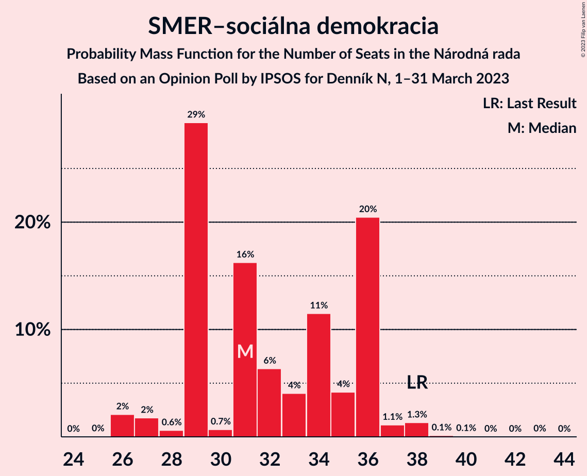
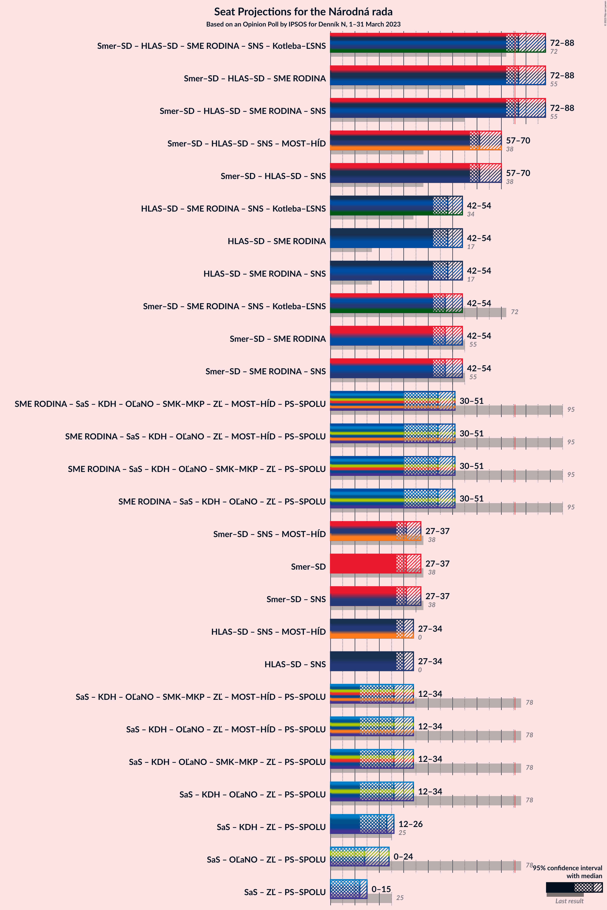

# Opinion Poll by IPSOS for Denník N, 1–31 March 2023

<a href="#voting-intentions">Voting Intentions</a> | <a href="#seats">Seats</a> | <a href="#coalitions">Coalitions</a> | <a href="#technical-information">Technical Information</a>

## Voting Intentions

### Confidence Intervals

| Party | Last Result | Poll Result | 80% Confidence Interval | 90% Confidence Interval | 95% Confidence Interval | 99% Confidence Interval |
|:-----:|:-----------:|:-----------:|:-----------------------:|:-----------------------:|:-----------------------:|:-----------------------:|
| SMER–sociálna demokracia | 18.3% | 16.2% | 14.7–17.7% |14.3–18.2% |14.0–18.6% |13.4–19.3% |
| HLAS–sociálna demokracia | 0.0% | 16.0% | 14.5–17.5% |14.1–18.0% |13.8–18.4% |13.2–19.1% |
| Progresívne Slovensko | 7.0% | 11.1% | 9.9–12.4% |9.6–12.8% |9.3–13.2% |8.7–13.9% |
| REPUBLIKA | 0.0% | 8.6% | 7.5–9.8% |7.2–10.2% |7.0–10.5% |6.5–11.1% |
| SME RODINA | 8.2% | 8.5% | 7.4–9.7% |7.1–10.1% |6.9–10.4% |6.4–11.0% |
| Sloboda a Solidarita | 6.2% | 6.4% | 5.5–7.5% |5.2–7.8% |5.0–8.1% |4.6–8.6% |
| Kresťanskodemokratické hnutie | 4.6% | 5.7% | 4.8–6.7% |4.6–7.0% |4.4–7.3% |4.0–7.8% |
| OBYČAJNÍ ĽUDIA a nezávislé osobnosti | 25.0% | 4.8% | 4.0–5.8% |3.8–6.1% |3.6–6.3% |3.3–6.8% |
| SPOLU–Občianska Demokracia | 7.0% | 4.8% | 4.0–5.8% |3.8–6.1% |3.6–6.3% |3.3–6.8% |
| Strana maďarskej koalície–Magyar Koalíció Pártja | 3.9% | 3.8% | 3.1–4.7% |2.9–4.9% |2.8–5.2% |2.5–5.6% |
| Slovenská národná strana | 3.2% | 3.0% | 2.4–3.8% |2.2–4.0% |2.1–4.3% |1.8–4.7% |
| Za ľudí | 5.8% | 2.9% | 2.3–3.7% |2.1–3.9% |2.0–4.1% |1.8–4.5% |
| Kotleba–Ľudová strana Naše Slovensko | 8.0% | 2.2% | 1.7–2.9% |1.6–3.1% |1.4–3.3% |1.2–3.7% |

*Note:* The poll result column reflects the actual value used in the calculations. Published results may vary slightly, and in addition be rounded to fewer digits.

## Seats

### Confidence Intervals

| Party | Last Result | Median | 80% Confidence Interval | 90% Confidence Interval | 95% Confidence Interval | 99% Confidence Interval |
|:-----:|:-----------:|:------:|:-----------------------:|:-----------------------:|:-----------------------:|:-----------------------:|
| <a href="#smer–sociálna-demokracia">SMER–sociálna demokracia</a> | 38 | 31 | 29–36 |29–36 |27–37 |26–38 |
| <a href="#hlas–sociálna-demokracia">HLAS–sociálna demokracia</a> | 0 | 30 | 29–34 |29–34 |27–34 |26–38 |
| <a href="#progresívne-slovensko">Progresívne Slovensko</a> | 0 | 21 | 18–24 |18–24 |18–26 |18–27 |
| <a href="#republika">REPUBLIKA</a> | 0 | 16 | 15–17 |15–19 |15–20 |14–23 |
| <a href="#sme-rodina">SME RODINA</a> | 17 | 18 | 15–18 |15–18 |14–19 |13–22 |
| <a href="#sloboda-a-solidarita">Sloboda a Solidarita</a> | 13 | 12 | 0–14 |0–14 |0–15 |0–16 |
| <a href="#kresťanskodemokratické-hnutie">Kresťanskodemokratické hnutie</a> | 0 | 12 | 11–12 |9–13 |0–13 |0–15 |
| <a href="#obyčajní-ľudia-a-nezávislé-osobnosti">OBYČAJNÍ ĽUDIA a nezávislé osobnosti</a> | 53 | 0 | 0–11 |0–11 |0–12 |0–13 |
| <a href="#spolu–občianska-demokracia">SPOLU–Občianska Demokracia</a> | 0 | 10 | 0–10 |0–10 |0–11 |0–13 |
| <a href="#strana-maďarskej-koalície–magyar-koalíció-pártja">Strana maďarskej koalície–Magyar Koalíció Pártja</a> | 0 | 0 | 0 |0 |0 |0–10 |
| <a href="#slovenská-národná-strana">Slovenská národná strana</a> | 0 | 0 | 0 |0 |0 |0 |
| <a href="#za-ľudí">Za ľudí</a> | 12 | 0 | 0 |0 |0 |0 |
| <a href="#kotleba–ľudová-strana-naše-slovensko">Kotleba–Ľudová strana Naše Slovensko</a> | 17 | 0 | 0 |0 |0 |0 |

### SMER–sociálna demokracia

*For a full overview of the results for this party, see the [SMER–sociálna demokracia](party-smer–sociálnademokracia.html) page.*

| Number of Seats | Probability | Accumulated | Special Marks |
|:---------------:|:-----------:|:-----------:|:-------------:|
| 25 | 0% | 100% |  |
| 26 | 2% | 99.9% |  |
| 27 | 2% | 98% |  |
| 28 | 0.6% | 96% |  |
| 29 | 29% | 95% |  |
| 30 | 0.7% | 66% |  |
| 31 | 16% | 66% | Median |
| 32 | 6% | 49% |  |
| 33 | 4% | 43% |  |
| 34 | 11% | 39% |  |
| 35 | 4% | 27% |  |
| 36 | 20% | 23% |  |
| 37 | 1.1% | 3% |  |
| 38 | 1.3% | 2% | Last Result |
| 39 | 0.1% | 0.3% |  |
| 40 | 0.1% | 0.1% |  |
| 41 | 0% | 0.1% |  |
| 42 | 0% | 0.1% |  |
| 43 | 0% | 0% |  |

### HLAS–sociálna demokracia

*For a full overview of the results for this party, see the [HLAS–sociálna demokracia](party-hlas–sociálnademokracia.html) page.*

| Number of Seats | Probability | Accumulated | Special Marks |
|:---------------:|:-----------:|:-----------:|:-------------:|
| 0 | 0% | 100% | Last Result |
| 1 | 0% | 100% |  |
| 2 | 0% | 100% |  |
| 3 | 0% | 100% |  |
| 4 | 0% | 100% |  |
| 5 | 0% | 100% |  |
| 6 | 0% | 100% |  |
| 7 | 0% | 100% |  |
| 8 | 0% | 100% |  |
| 9 | 0% | 100% |  |
| 10 | 0% | 100% |  |
| 11 | 0% | 100% |  |
| 12 | 0% | 100% |  |
| 13 | 0% | 100% |  |
| 14 | 0% | 100% |  |
| 15 | 0% | 100% |  |
| 16 | 0% | 100% |  |
| 17 | 0% | 100% |  |
| 18 | 0% | 100% |  |
| 19 | 0% | 100% |  |
| 20 | 0% | 100% |  |
| 21 | 0% | 100% |  |
| 22 | 0% | 100% |  |
| 23 | 0% | 100% |  |
| 24 | 0.1% | 100% |  |
| 25 | 0.3% | 99.9% |  |
| 26 | 2% | 99.5% |  |
| 27 | 0.4% | 98% |  |
| 28 | 0.6% | 97% |  |
| 29 | 29% | 97% |  |
| 30 | 35% | 68% | Median |
| 31 | 1.0% | 33% |  |
| 32 | 0.3% | 32% |  |
| 33 | 4% | 31% |  |
| 34 | 25% | 27% |  |
| 35 | 0.7% | 2% |  |
| 36 | 0.2% | 1.1% |  |
| 37 | 0.1% | 0.9% |  |
| 38 | 0.5% | 0.8% |  |
| 39 | 0.1% | 0.4% |  |
| 40 | 0.1% | 0.2% |  |
| 41 | 0% | 0.2% |  |
| 42 | 0% | 0.1% |  |
| 43 | 0.1% | 0.1% |  |
| 44 | 0% | 0.1% |  |
| 45 | 0.1% | 0.1% |  |
| 46 | 0% | 0% |  |

### Progresívne Slovensko

*For a full overview of the results for this party, see the [Progresívne Slovensko](party-progresívneslovensko.html) page.*

| Number of Seats | Probability | Accumulated | Special Marks |
|:---------------:|:-----------:|:-----------:|:-------------:|
| 0 | 0% | 100% | Last Result |
| 1 | 0% | 100% |  |
| 2 | 0% | 100% |  |
| 3 | 0% | 100% |  |
| 4 | 0% | 100% |  |
| 5 | 0% | 100% |  |
| 6 | 0% | 100% |  |
| 7 | 0% | 100% |  |
| 8 | 0% | 100% |  |
| 9 | 0% | 100% |  |
| 10 | 0% | 100% |  |
| 11 | 0% | 100% |  |
| 12 | 0% | 100% |  |
| 13 | 0% | 100% |  |
| 14 | 0% | 100% |  |
| 15 | 0% | 100% |  |
| 16 | 0.1% | 100% |  |
| 17 | 0.1% | 99.9% |  |
| 18 | 17% | 99.8% |  |
| 19 | 4% | 83% |  |
| 20 | 4% | 79% |  |
| 21 | 43% | 75% | Median |
| 22 | 3% | 32% |  |
| 23 | 3% | 29% |  |
| 24 | 22% | 26% |  |
| 25 | 1.1% | 4% |  |
| 26 | 0.8% | 3% |  |
| 27 | 2% | 2% |  |
| 28 | 0.2% | 0.4% |  |
| 29 | 0.1% | 0.2% |  |
| 30 | 0% | 0% |  |

### REPUBLIKA

*For a full overview of the results for this party, see the [REPUBLIKA](party-republika.html) page.*

| Number of Seats | Probability | Accumulated | Special Marks |
|:---------------:|:-----------:|:-----------:|:-------------:|
| 0 | 0% | 100% | Last Result |
| 1 | 0% | 100% |  |
| 2 | 0% | 100% |  |
| 3 | 0% | 100% |  |
| 4 | 0% | 100% |  |
| 5 | 0% | 100% |  |
| 6 | 0% | 100% |  |
| 7 | 0% | 100% |  |
| 8 | 0% | 100% |  |
| 9 | 0% | 100% |  |
| 10 | 0% | 100% |  |
| 11 | 0% | 100% |  |
| 12 | 0.1% | 100% |  |
| 13 | 0.2% | 99.9% |  |
| 14 | 0.9% | 99.7% |  |
| 15 | 16% | 98.8% |  |
| 16 | 70% | 83% | Median |
| 17 | 5% | 13% |  |
| 18 | 0.7% | 9% |  |
| 19 | 5% | 8% |  |
| 20 | 0.7% | 3% |  |
| 21 | 0.1% | 2% |  |
| 22 | 2% | 2% |  |
| 23 | 0.1% | 0.5% |  |
| 24 | 0.4% | 0.5% |  |
| 25 | 0.1% | 0.1% |  |
| 26 | 0% | 0% |  |

### SME RODINA

*For a full overview of the results for this party, see the [SME RODINA](party-smerodina.html) page.*

| Number of Seats | Probability | Accumulated | Special Marks |
|:---------------:|:-----------:|:-----------:|:-------------:|
| 11 | 0.1% | 100% |  |
| 12 | 0.3% | 99.9% |  |
| 13 | 0.8% | 99.6% |  |
| 14 | 3% | 98.9% |  |
| 15 | 21% | 96% |  |
| 16 | 8% | 75% |  |
| 17 | 13% | 67% | Last Result |
| 18 | 51% | 54% | Median |
| 19 | 1.1% | 3% |  |
| 20 | 2% | 2% |  |
| 21 | 0.1% | 0.7% |  |
| 22 | 0.6% | 0.6% |  |
| 23 | 0% | 0.1% |  |
| 24 | 0% | 0% |  |

### Sloboda a Solidarita

*For a full overview of the results for this party, see the [Sloboda a Solidarita](party-slobodaasolidarita.html) page.*

| Number of Seats | Probability | Accumulated | Special Marks |
|:---------------:|:-----------:|:-----------:|:-------------:|
| 0 | 22% | 100% |  |
| 1 | 0% | 78% |  |
| 2 | 0% | 78% |  |
| 3 | 0% | 78% |  |
| 4 | 0% | 78% |  |
| 5 | 0% | 78% |  |
| 6 | 0% | 78% |  |
| 7 | 0% | 78% |  |
| 8 | 0% | 78% |  |
| 9 | 0.1% | 78% |  |
| 10 | 9% | 78% |  |
| 11 | 0.8% | 69% |  |
| 12 | 29% | 68% | Median |
| 13 | 4% | 40% | Last Result |
| 14 | 33% | 36% |  |
| 15 | 2% | 3% |  |
| 16 | 0.5% | 0.8% |  |
| 17 | 0.2% | 0.3% |  |
| 18 | 0.1% | 0.1% |  |
| 19 | 0% | 0% |  |

### Kresťanskodemokratické hnutie

*For a full overview of the results for this party, see the [Kresťanskodemokratické hnutie](party-kresťanskodemokratickéhnutie.html) page.*

| Number of Seats | Probability | Accumulated | Special Marks |
|:---------------:|:-----------:|:-----------:|:-------------:|
| 0 | 5% | 100% | Last Result |
| 1 | 0% | 95% |  |
| 2 | 0% | 95% |  |
| 3 | 0% | 95% |  |
| 4 | 0% | 95% |  |
| 5 | 0% | 95% |  |
| 6 | 0% | 95% |  |
| 7 | 0% | 95% |  |
| 8 | 0% | 95% |  |
| 9 | 0.3% | 95% |  |
| 10 | 4% | 95% |  |
| 11 | 31% | 91% |  |
| 12 | 53% | 60% | Median |
| 13 | 5% | 7% |  |
| 14 | 0.3% | 2% |  |
| 15 | 2% | 2% |  |
| 16 | 0% | 0.1% |  |
| 17 | 0% | 0% |  |

### OBYČAJNÍ ĽUDIA a nezávislé osobnosti

*For a full overview of the results for this party, see the [OBYČAJNÍ ĽUDIA a nezávislé osobnosti](party-obyčajníľudiaanezávisléosobnosti.html) page.*

| Number of Seats | Probability | Accumulated | Special Marks |
|:---------------:|:-----------:|:-----------:|:-------------:|
| 0 | 65% | 100% | Median |
| 1 | 0% | 35% |  |
| 2 | 0% | 35% |  |
| 3 | 0% | 35% |  |
| 4 | 0% | 35% |  |
| 5 | 0% | 35% |  |
| 6 | 0% | 35% |  |
| 7 | 0% | 35% |  |
| 8 | 0% | 35% |  |
| 9 | 15% | 35% |  |
| 10 | 3% | 20% |  |
| 11 | 14% | 17% |  |
| 12 | 0.8% | 3% |  |
| 13 | 2% | 2% |  |
| 14 | 0% | 0% |  |
| 15 | 0% | 0% |  |
| 16 | 0% | 0% |  |
| 17 | 0% | 0% |  |
| 18 | 0% | 0% |  |
| 19 | 0% | 0% |  |
| 20 | 0% | 0% |  |
| 21 | 0% | 0% |  |
| 22 | 0% | 0% |  |
| 23 | 0% | 0% |  |
| 24 | 0% | 0% |  |
| 25 | 0% | 0% |  |
| 26 | 0% | 0% |  |
| 27 | 0% | 0% |  |
| 28 | 0% | 0% |  |
| 29 | 0% | 0% |  |
| 30 | 0% | 0% |  |
| 31 | 0% | 0% |  |
| 32 | 0% | 0% |  |
| 33 | 0% | 0% |  |
| 34 | 0% | 0% |  |
| 35 | 0% | 0% |  |
| 36 | 0% | 0% |  |
| 37 | 0% | 0% |  |
| 38 | 0% | 0% |  |
| 39 | 0% | 0% |  |
| 40 | 0% | 0% |  |
| 41 | 0% | 0% |  |
| 42 | 0% | 0% |  |
| 43 | 0% | 0% |  |
| 44 | 0% | 0% |  |
| 45 | 0% | 0% |  |
| 46 | 0% | 0% |  |
| 47 | 0% | 0% |  |
| 48 | 0% | 0% |  |
| 49 | 0% | 0% |  |
| 50 | 0% | 0% |  |
| 51 | 0% | 0% |  |
| 52 | 0% | 0% |  |
| 53 | 0% | 0% | Last Result |

### SPOLU–Občianska Demokracia

*For a full overview of the results for this party, see the [SPOLU–Občianska Demokracia](party-spolu–občianskademokracia.html) page.*

| Number of Seats | Probability | Accumulated | Special Marks |
|:---------------:|:-----------:|:-----------:|:-------------:|
| 0 | 22% | 100% | Last Result |
| 1 | 0% | 78% |  |
| 2 | 0% | 78% |  |
| 3 | 0% | 78% |  |
| 4 | 0% | 78% |  |
| 5 | 0% | 78% |  |
| 6 | 0% | 78% |  |
| 7 | 0% | 78% |  |
| 8 | 0% | 78% |  |
| 9 | 16% | 78% |  |
| 10 | 58% | 62% | Median |
| 11 | 4% | 5% |  |
| 12 | 0.4% | 1.0% |  |
| 13 | 0.4% | 0.6% |  |
| 14 | 0.1% | 0.1% |  |
| 15 | 0% | 0% |  |

### Strana maďarskej koalície–Magyar Koalíció Pártja

*For a full overview of the results for this party, see the [Strana maďarskej koalície–Magyar Koalíció Pártja](party-stranamaďarskejkoalície–magyarkoalíciópártja.html) page.*

| Number of Seats | Probability | Accumulated | Special Marks |
|:---------------:|:-----------:|:-----------:|:-------------:|
| 0 | 99.2% | 100% | Last Result, Median |
| 1 | 0% | 0.8% |  |
| 2 | 0% | 0.8% |  |
| 3 | 0% | 0.8% |  |
| 4 | 0% | 0.8% |  |
| 5 | 0% | 0.8% |  |
| 6 | 0% | 0.8% |  |
| 7 | 0% | 0.8% |  |
| 8 | 0% | 0.8% |  |
| 9 | 0% | 0.8% |  |
| 10 | 0.5% | 0.8% |  |
| 11 | 0.2% | 0.3% |  |
| 12 | 0.1% | 0.1% |  |
| 13 | 0% | 0% |  |

### Slovenská národná strana

*For a full overview of the results for this party, see the [Slovenská národná strana](party-slovenskánárodnástrana.html) page.*

| Number of Seats | Probability | Accumulated | Special Marks |
|:---------------:|:-----------:|:-----------:|:-------------:|
| 0 | 100% | 100% | Last Result, Median |

### Za ľudí

*For a full overview of the results for this party, see the [Za ľudí](party-zaľudí.html) page.*

| Number of Seats | Probability | Accumulated | Special Marks |
|:---------------:|:-----------:|:-----------:|:-------------:|
| 0 | 99.9% | 100% | Median |
| 1 | 0% | 0.1% |  |
| 2 | 0% | 0.1% |  |
| 3 | 0% | 0.1% |  |
| 4 | 0% | 0.1% |  |
| 5 | 0% | 0.1% |  |
| 6 | 0% | 0.1% |  |
| 7 | 0% | 0.1% |  |
| 8 | 0% | 0.1% |  |
| 9 | 0% | 0.1% |  |
| 10 | 0% | 0.1% |  |
| 11 | 0% | 0% |  |
| 12 | 0% | 0% | Last Result |

### Kotleba–Ľudová strana Naše Slovensko

*For a full overview of the results for this party, see the [Kotleba–Ľudová strana Naše Slovensko](party-kotleba–ľudovástrananašeslovensko.html) page.*

| Number of Seats | Probability | Accumulated | Special Marks |
|:---------------:|:-----------:|:-----------:|:-------------:|
| 0 | 100% | 100% | Median |
| 1 | 0% | 0% |  |
| 2 | 0% | 0% |  |
| 3 | 0% | 0% |  |
| 4 | 0% | 0% |  |
| 5 | 0% | 0% |  |
| 6 | 0% | 0% |  |
| 7 | 0% | 0% |  |
| 8 | 0% | 0% |  |
| 9 | 0% | 0% |  |
| 10 | 0% | 0% |  |
| 11 | 0% | 0% |  |
| 12 | 0% | 0% |  |
| 13 | 0% | 0% |  |
| 14 | 0% | 0% |  |
| 15 | 0% | 0% |  |
| 16 | 0% | 0% |  |
| 17 | 0% | 0% | Last Result |

## Coalitions

### Confidence Intervals

| Coalition | Last Result | Median | Majority? | 80% Confidence Interval | 90% Confidence Interval | 95% Confidence Interval | 99% Confidence Interval |
|:---------:|:-----------:|:------:|:---------:|:-----------------------:|:-----------------------:|:-----------------------:|:-----------------------:|
| SMER–sociálna demokracia – HLAS–sociálna demokracia – SME RODINA – Slovenská národná strana – Kotleba–Ľudová strana Naše Slovensko | 72 | 77 | 79% | 75–88 | 74–88 | 72–88 | 67–92 |
| SMER–sociálna demokracia – HLAS–sociálna demokracia – SME RODINA | 55 | 77 | 79% | 75–88 | 74–88 | 72–88 | 67–92 |
| SMER–sociálna demokracia – HLAS–sociálna demokracia – SME RODINA – Slovenská národná strana | 55 | 77 | 79% | 75–88 | 74–88 | 72–88 | 67–92 |
| SMER–sociálna demokracia – HLAS–sociálna demokracia – Slovenská národná strana | 38 | 61 | 0.2% | 59–70 | 59–70 | 57–70 | 52–72 |
| HLAS–sociálna demokracia – SME RODINA – Slovenská národná strana – Kotleba–Ľudová strana Naše Slovensko | 34 | 48 | 0% | 44–52 | 44–52 | 42–54 | 41–57 |
| HLAS–sociálna demokracia – SME RODINA | 17 | 48 | 0% | 44–52 | 44–52 | 42–54 | 41–57 |
| HLAS–sociálna demokracia – SME RODINA – Slovenská národná strana | 17 | 48 | 0% | 44–52 | 44–52 | 42–54 | 41–57 |
| SMER–sociálna demokracia – SME RODINA – Slovenská národná strana – Kotleba–Ľudová strana Naše Slovensko | 72 | 47 | 0% | 46–54 | 44–54 | 42–54 | 41–58 |
| SMER–sociálna demokracia – SME RODINA | 55 | 47 | 0% | 46–54 | 44–54 | 42–54 | 41–58 |
| SMER–sociálna demokracia – SME RODINA – Slovenská národná strana | 55 | 47 | 0% | 46–54 | 44–54 | 42–54 | 41–58 |
| SMER–sociálna demokracia | 38 | 31 | 0% | 29–36 | 29–36 | 27–37 | 26–38 |
| SMER–sociálna demokracia – Slovenská národná strana | 38 | 31 | 0% | 29–36 | 29–36 | 27–37 | 26–38 |
| HLAS–sociálna demokracia – Slovenská národná strana | 0 | 30 | 0% | 29–34 | 29–34 | 27–34 | 26–38 |

### SMER–sociálna demokracia – HLAS–sociálna demokracia – SME RODINA – Slovenská národná strana – Kotleba–Ľudová strana Naše Slovensko

| Number of Seats | Probability | Accumulated | Special Marks |
|:---------------:|:-----------:|:-----------:|:-------------:|
| 67 | 2% | 100% |  |
| 68 | 0.1% | 98% |  |
| 69 | 0.1% | 98% |  |
| 70 | 0.2% | 98% |  |
| 71 | 0.2% | 98% |  |
| 72 | 0.7% | 98% | Last Result |
| 73 | 1.3% | 97% |  |
| 74 | 0.9% | 96% |  |
| 75 | 16% | 95% |  |
| 76 | 0.4% | 79% | Majority |
| 77 | 31% | 79% |  |
| 78 | 0.3% | 48% |  |
| 79 | 3% | 48% | Median |
| 80 | 11% | 44% |  |
| 81 | 4% | 34% |  |
| 82 | 3% | 29% |  |
| 83 | 1.2% | 26% |  |
| 84 | 0.7% | 25% |  |
| 85 | 0.3% | 24% |  |
| 86 | 0.4% | 24% |  |
| 87 | 0.6% | 24% |  |
| 88 | 21% | 23% |  |
| 89 | 0.3% | 2% |  |
| 90 | 0.2% | 2% |  |
| 91 | 0% | 1.4% |  |
| 92 | 1.1% | 1.4% |  |
| 93 | 0% | 0.3% |  |
| 94 | 0.1% | 0.2% |  |
| 95 | 0% | 0.2% |  |
| 96 | 0.1% | 0.2% |  |
| 97 | 0.1% | 0.1% |  |
| 98 | 0% | 0% |  |

### SMER–sociálna demokracia – HLAS–sociálna demokracia – SME RODINA

| Number of Seats | Probability | Accumulated | Special Marks |
|:---------------:|:-----------:|:-----------:|:-------------:|
| 55 | 0% | 100% | Last Result |
| 56 | 0% | 100% |  |
| 57 | 0% | 100% |  |
| 58 | 0% | 100% |  |
| 59 | 0% | 100% |  |
| 60 | 0% | 100% |  |
| 61 | 0% | 100% |  |
| 62 | 0% | 100% |  |
| 63 | 0% | 100% |  |
| 64 | 0% | 100% |  |
| 65 | 0% | 100% |  |
| 66 | 0% | 100% |  |
| 67 | 2% | 100% |  |
| 68 | 0.1% | 98% |  |
| 69 | 0.1% | 98% |  |
| 70 | 0.2% | 98% |  |
| 71 | 0.2% | 98% |  |
| 72 | 0.7% | 98% |  |
| 73 | 1.3% | 97% |  |
| 74 | 1.0% | 96% |  |
| 75 | 16% | 95% |  |
| 76 | 0.4% | 79% | Majority |
| 77 | 31% | 79% |  |
| 78 | 0.3% | 48% |  |
| 79 | 3% | 48% | Median |
| 80 | 11% | 44% |  |
| 81 | 4% | 34% |  |
| 82 | 3% | 29% |  |
| 83 | 1.2% | 26% |  |
| 84 | 0.7% | 25% |  |
| 85 | 0.3% | 24% |  |
| 86 | 0.4% | 24% |  |
| 87 | 0.6% | 24% |  |
| 88 | 21% | 23% |  |
| 89 | 0.3% | 2% |  |
| 90 | 0.2% | 2% |  |
| 91 | 0% | 1.4% |  |
| 92 | 1.1% | 1.4% |  |
| 93 | 0% | 0.3% |  |
| 94 | 0.1% | 0.2% |  |
| 95 | 0% | 0.2% |  |
| 96 | 0.1% | 0.2% |  |
| 97 | 0.1% | 0.1% |  |
| 98 | 0% | 0% |  |

### SMER–sociálna demokracia – HLAS–sociálna demokracia – SME RODINA – Slovenská národná strana

| Number of Seats | Probability | Accumulated | Special Marks |
|:---------------:|:-----------:|:-----------:|:-------------:|
| 55 | 0% | 100% | Last Result |
| 56 | 0% | 100% |  |
| 57 | 0% | 100% |  |
| 58 | 0% | 100% |  |
| 59 | 0% | 100% |  |
| 60 | 0% | 100% |  |
| 61 | 0% | 100% |  |
| 62 | 0% | 100% |  |
| 63 | 0% | 100% |  |
| 64 | 0% | 100% |  |
| 65 | 0% | 100% |  |
| 66 | 0% | 100% |  |
| 67 | 2% | 100% |  |
| 68 | 0.1% | 98% |  |
| 69 | 0.1% | 98% |  |
| 70 | 0.2% | 98% |  |
| 71 | 0.2% | 98% |  |
| 72 | 0.7% | 98% |  |
| 73 | 1.3% | 97% |  |
| 74 | 0.9% | 96% |  |
| 75 | 16% | 95% |  |
| 76 | 0.4% | 79% | Majority |
| 77 | 31% | 79% |  |
| 78 | 0.3% | 48% |  |
| 79 | 3% | 48% | Median |
| 80 | 11% | 44% |  |
| 81 | 4% | 34% |  |
| 82 | 3% | 29% |  |
| 83 | 1.2% | 26% |  |
| 84 | 0.7% | 25% |  |
| 85 | 0.3% | 24% |  |
| 86 | 0.4% | 24% |  |
| 87 | 0.6% | 24% |  |
| 88 | 21% | 23% |  |
| 89 | 0.3% | 2% |  |
| 90 | 0.2% | 2% |  |
| 91 | 0% | 1.4% |  |
| 92 | 1.1% | 1.4% |  |
| 93 | 0% | 0.3% |  |
| 94 | 0.1% | 0.2% |  |
| 95 | 0% | 0.2% |  |
| 96 | 0.1% | 0.2% |  |
| 97 | 0.1% | 0.1% |  |
| 98 | 0% | 0% |  |

### SMER–sociálna demokracia – HLAS–sociálna demokracia – Slovenská národná strana

| Number of Seats | Probability | Accumulated | Special Marks |
|:---------------:|:-----------:|:-----------:|:-------------:|
| 38 | 0% | 100% | Last Result |
| 39 | 0% | 100% |  |
| 40 | 0% | 100% |  |
| 41 | 0% | 100% |  |
| 42 | 0% | 100% |  |
| 43 | 0% | 100% |  |
| 44 | 0% | 100% |  |
| 45 | 0% | 100% |  |
| 46 | 0% | 100% |  |
| 47 | 0% | 100% |  |
| 48 | 0% | 100% |  |
| 49 | 0% | 100% |  |
| 50 | 0% | 100% |  |
| 51 | 0.1% | 100% |  |
| 52 | 2% | 99.9% |  |
| 53 | 0% | 98% |  |
| 54 | 0% | 98% |  |
| 55 | 0.3% | 98% |  |
| 56 | 0.1% | 98% |  |
| 57 | 2% | 98% |  |
| 58 | 0.4% | 96% |  |
| 59 | 30% | 96% |  |
| 60 | 15% | 66% |  |
| 61 | 3% | 50% | Median |
| 62 | 1.3% | 48% |  |
| 63 | 11% | 46% |  |
| 64 | 0.4% | 36% |  |
| 65 | 7% | 35% |  |
| 66 | 0.6% | 28% |  |
| 67 | 3% | 27% |  |
| 68 | 0.7% | 24% |  |
| 69 | 0.8% | 24% |  |
| 70 | 21% | 23% |  |
| 71 | 0.9% | 2% |  |
| 72 | 1.2% | 2% |  |
| 73 | 0% | 0.3% |  |
| 74 | 0% | 0.3% |  |
| 75 | 0% | 0.2% |  |
| 76 | 0% | 0.2% | Majority |
| 77 | 0.1% | 0.2% |  |
| 78 | 0% | 0.1% |  |
| 79 | 0.1% | 0.1% |  |
| 80 | 0% | 0% |  |

### HLAS–sociálna demokracia – SME RODINA – Slovenská národná strana – Kotleba–Ľudová strana Naše Slovensko

| Number of Seats | Probability | Accumulated | Special Marks |
|:---------------:|:-----------:|:-----------:|:-------------:|
| 34 | 0% | 100% | Last Result |
| 35 | 0% | 100% |  |
| 36 | 0% | 100% |  |
| 37 | 0% | 100% |  |
| 38 | 0% | 100% |  |
| 39 | 0.1% | 99.9% |  |
| 40 | 0.1% | 99.9% |  |
| 41 | 2% | 99.7% |  |
| 42 | 0.4% | 98% |  |
| 43 | 0.8% | 97% |  |
| 44 | 18% | 97% |  |
| 45 | 3% | 79% |  |
| 46 | 12% | 76% |  |
| 47 | 2% | 63% |  |
| 48 | 30% | 61% | Median |
| 49 | 7% | 32% |  |
| 50 | 0.5% | 25% |  |
| 51 | 1.0% | 25% |  |
| 52 | 21% | 24% |  |
| 53 | 0.1% | 3% |  |
| 54 | 2% | 3% |  |
| 55 | 0.2% | 1.1% |  |
| 56 | 0.2% | 0.9% |  |
| 57 | 0.3% | 0.7% |  |
| 58 | 0.2% | 0.4% |  |
| 59 | 0% | 0.2% |  |
| 60 | 0% | 0.2% |  |
| 61 | 0% | 0.2% |  |
| 62 | 0.1% | 0.2% |  |
| 63 | 0.1% | 0.1% |  |
| 64 | 0% | 0% |  |

### HLAS–sociálna demokracia – SME RODINA

| Number of Seats | Probability | Accumulated | Special Marks |
|:---------------:|:-----------:|:-----------:|:-------------:|
| 17 | 0% | 100% | Last Result |
| 18 | 0% | 100% |  |
| 19 | 0% | 100% |  |
| 20 | 0% | 100% |  |
| 21 | 0% | 100% |  |
| 22 | 0% | 100% |  |
| 23 | 0% | 100% |  |
| 24 | 0% | 100% |  |
| 25 | 0% | 100% |  |
| 26 | 0% | 100% |  |
| 27 | 0% | 100% |  |
| 28 | 0% | 100% |  |
| 29 | 0% | 100% |  |
| 30 | 0% | 100% |  |
| 31 | 0% | 100% |  |
| 32 | 0% | 100% |  |
| 33 | 0% | 100% |  |
| 34 | 0% | 100% |  |
| 35 | 0% | 100% |  |
| 36 | 0% | 100% |  |
| 37 | 0% | 100% |  |
| 38 | 0% | 100% |  |
| 39 | 0.1% | 99.9% |  |
| 40 | 0.1% | 99.9% |  |
| 41 | 2% | 99.7% |  |
| 42 | 0.4% | 98% |  |
| 43 | 0.8% | 97% |  |
| 44 | 18% | 97% |  |
| 45 | 3% | 79% |  |
| 46 | 12% | 76% |  |
| 47 | 2% | 63% |  |
| 48 | 30% | 61% | Median |
| 49 | 7% | 32% |  |
| 50 | 0.5% | 25% |  |
| 51 | 1.0% | 25% |  |
| 52 | 21% | 24% |  |
| 53 | 0.1% | 3% |  |
| 54 | 2% | 3% |  |
| 55 | 0.2% | 1.1% |  |
| 56 | 0.2% | 0.8% |  |
| 57 | 0.3% | 0.7% |  |
| 58 | 0.1% | 0.4% |  |
| 59 | 0% | 0.2% |  |
| 60 | 0% | 0.2% |  |
| 61 | 0% | 0.2% |  |
| 62 | 0.1% | 0.2% |  |
| 63 | 0.1% | 0.1% |  |
| 64 | 0% | 0% |  |

### HLAS–sociálna demokracia – SME RODINA – Slovenská národná strana

| Number of Seats | Probability | Accumulated | Special Marks |
|:---------------:|:-----------:|:-----------:|:-------------:|
| 17 | 0% | 100% | Last Result |
| 18 | 0% | 100% |  |
| 19 | 0% | 100% |  |
| 20 | 0% | 100% |  |
| 21 | 0% | 100% |  |
| 22 | 0% | 100% |  |
| 23 | 0% | 100% |  |
| 24 | 0% | 100% |  |
| 25 | 0% | 100% |  |
| 26 | 0% | 100% |  |
| 27 | 0% | 100% |  |
| 28 | 0% | 100% |  |
| 29 | 0% | 100% |  |
| 30 | 0% | 100% |  |
| 31 | 0% | 100% |  |
| 32 | 0% | 100% |  |
| 33 | 0% | 100% |  |
| 34 | 0% | 100% |  |
| 35 | 0% | 100% |  |
| 36 | 0% | 100% |  |
| 37 | 0% | 100% |  |
| 38 | 0% | 100% |  |
| 39 | 0.1% | 99.9% |  |
| 40 | 0.1% | 99.9% |  |
| 41 | 2% | 99.7% |  |
| 42 | 0.4% | 98% |  |
| 43 | 0.8% | 97% |  |
| 44 | 18% | 97% |  |
| 45 | 3% | 79% |  |
| 46 | 12% | 76% |  |
| 47 | 2% | 63% |  |
| 48 | 30% | 61% | Median |
| 49 | 7% | 32% |  |
| 50 | 0.5% | 25% |  |
| 51 | 1.0% | 25% |  |
| 52 | 21% | 24% |  |
| 53 | 0.1% | 3% |  |
| 54 | 2% | 3% |  |
| 55 | 0.2% | 1.1% |  |
| 56 | 0.2% | 0.9% |  |
| 57 | 0.3% | 0.7% |  |
| 58 | 0.2% | 0.4% |  |
| 59 | 0% | 0.2% |  |
| 60 | 0% | 0.2% |  |
| 61 | 0% | 0.2% |  |
| 62 | 0.1% | 0.2% |  |
| 63 | 0.1% | 0.1% |  |
| 64 | 0% | 0% |  |

### SMER–sociálna demokracia – SME RODINA – Slovenská národná strana – Kotleba–Ľudová strana Naše Slovensko

| Number of Seats | Probability | Accumulated | Special Marks |
|:---------------:|:-----------:|:-----------:|:-------------:|
| 40 | 0.2% | 100% |  |
| 41 | 2% | 99.7% |  |
| 42 | 0.7% | 98% |  |
| 43 | 1.1% | 97% |  |
| 44 | 1.1% | 96% |  |
| 45 | 0.6% | 95% |  |
| 46 | 16% | 94% |  |
| 47 | 29% | 79% |  |
| 48 | 8% | 50% |  |
| 49 | 3% | 41% | Median |
| 50 | 1.2% | 38% |  |
| 51 | 11% | 37% |  |
| 52 | 1.3% | 26% |  |
| 53 | 1.2% | 25% |  |
| 54 | 22% | 24% |  |
| 55 | 0.1% | 2% |  |
| 56 | 0.2% | 2% |  |
| 57 | 0% | 1.3% |  |
| 58 | 1.1% | 1.3% |  |
| 59 | 0% | 0.1% |  |
| 60 | 0% | 0.1% |  |
| 61 | 0% | 0.1% |  |
| 62 | 0% | 0% |  |
| 63 | 0% | 0% |  |
| 64 | 0% | 0% |  |
| 65 | 0% | 0% |  |
| 66 | 0% | 0% |  |
| 67 | 0% | 0% |  |
| 68 | 0% | 0% |  |
| 69 | 0% | 0% |  |
| 70 | 0% | 0% |  |
| 71 | 0% | 0% |  |
| 72 | 0% | 0% | Last Result |

### SMER–sociálna demokracia – SME RODINA

| Number of Seats | Probability | Accumulated | Special Marks |
|:---------------:|:-----------:|:-----------:|:-------------:|
| 40 | 0.2% | 100% |  |
| 41 | 2% | 99.7% |  |
| 42 | 0.7% | 98% |  |
| 43 | 1.1% | 97% |  |
| 44 | 1.1% | 96% |  |
| 45 | 0.6% | 95% |  |
| 46 | 16% | 94% |  |
| 47 | 29% | 79% |  |
| 48 | 8% | 50% |  |
| 49 | 3% | 41% | Median |
| 50 | 1.2% | 38% |  |
| 51 | 11% | 37% |  |
| 52 | 1.3% | 26% |  |
| 53 | 1.2% | 25% |  |
| 54 | 22% | 24% |  |
| 55 | 0.1% | 2% | Last Result |
| 56 | 0.2% | 2% |  |
| 57 | 0% | 1.3% |  |
| 58 | 1.1% | 1.3% |  |
| 59 | 0% | 0.1% |  |
| 60 | 0% | 0.1% |  |
| 61 | 0% | 0.1% |  |
| 62 | 0% | 0% |  |

### SMER–sociálna demokracia – SME RODINA – Slovenská národná strana

| Number of Seats | Probability | Accumulated | Special Marks |
|:---------------:|:-----------:|:-----------:|:-------------:|
| 40 | 0.2% | 100% |  |
| 41 | 2% | 99.7% |  |
| 42 | 0.7% | 98% |  |
| 43 | 1.1% | 97% |  |
| 44 | 1.1% | 96% |  |
| 45 | 0.6% | 95% |  |
| 46 | 16% | 94% |  |
| 47 | 29% | 79% |  |
| 48 | 8% | 50% |  |
| 49 | 3% | 41% | Median |
| 50 | 1.2% | 38% |  |
| 51 | 11% | 37% |  |
| 52 | 1.3% | 26% |  |
| 53 | 1.2% | 25% |  |
| 54 | 22% | 24% |  |
| 55 | 0.1% | 2% | Last Result |
| 56 | 0.2% | 2% |  |
| 57 | 0% | 1.3% |  |
| 58 | 1.1% | 1.3% |  |
| 59 | 0% | 0.1% |  |
| 60 | 0% | 0.1% |  |
| 61 | 0% | 0.1% |  |
| 62 | 0% | 0% |  |

### SMER–sociálna demokracia

| Number of Seats | Probability | Accumulated | Special Marks |
|:---------------:|:-----------:|:-----------:|:-------------:|
| 25 | 0% | 100% |  |
| 26 | 2% | 99.9% |  |
| 27 | 2% | 98% |  |
| 28 | 0.6% | 96% |  |
| 29 | 29% | 95% |  |
| 30 | 0.7% | 66% |  |
| 31 | 16% | 66% | Median |
| 32 | 6% | 49% |  |
| 33 | 4% | 43% |  |
| 34 | 11% | 39% |  |
| 35 | 4% | 27% |  |
| 36 | 20% | 23% |  |
| 37 | 1.1% | 3% |  |
| 38 | 1.3% | 2% | Last Result |
| 39 | 0.1% | 0.3% |  |
| 40 | 0.1% | 0.1% |  |
| 41 | 0% | 0.1% |  |
| 42 | 0% | 0.1% |  |
| 43 | 0% | 0% |  |

### SMER–sociálna demokracia – Slovenská národná strana

| Number of Seats | Probability | Accumulated | Special Marks |
|:---------------:|:-----------:|:-----------:|:-------------:|
| 25 | 0% | 100% |  |
| 26 | 2% | 99.9% |  |
| 27 | 2% | 98% |  |
| 28 | 0.6% | 96% |  |
| 29 | 29% | 95% |  |
| 30 | 0.7% | 66% |  |
| 31 | 16% | 66% | Median |
| 32 | 6% | 49% |  |
| 33 | 4% | 43% |  |
| 34 | 11% | 39% |  |
| 35 | 4% | 27% |  |
| 36 | 20% | 23% |  |
| 37 | 1.1% | 3% |  |
| 38 | 1.3% | 2% | Last Result |
| 39 | 0.1% | 0.3% |  |
| 40 | 0.1% | 0.1% |  |
| 41 | 0% | 0.1% |  |
| 42 | 0% | 0.1% |  |
| 43 | 0% | 0% |  |

### HLAS–sociálna demokracia – Slovenská národná strana

| Number of Seats | Probability | Accumulated | Special Marks |
|:---------------:|:-----------:|:-----------:|:-------------:|
| 0 | 0% | 100% | Last Result |
| 1 | 0% | 100% |  |
| 2 | 0% | 100% |  |
| 3 | 0% | 100% |  |
| 4 | 0% | 100% |  |
| 5 | 0% | 100% |  |
| 6 | 0% | 100% |  |
| 7 | 0% | 100% |  |
| 8 | 0% | 100% |  |
| 9 | 0% | 100% |  |
| 10 | 0% | 100% |  |
| 11 | 0% | 100% |  |
| 12 | 0% | 100% |  |
| 13 | 0% | 100% |  |
| 14 | 0% | 100% |  |
| 15 | 0% | 100% |  |
| 16 | 0% | 100% |  |
| 17 | 0% | 100% |  |
| 18 | 0% | 100% |  |
| 19 | 0% | 100% |  |
| 20 | 0% | 100% |  |
| 21 | 0% | 100% |  |
| 22 | 0% | 100% |  |
| 23 | 0% | 100% |  |
| 24 | 0.1% | 100% |  |
| 25 | 0.3% | 99.9% |  |
| 26 | 2% | 99.5% |  |
| 27 | 0.4% | 98% |  |
| 28 | 0.6% | 97% |  |
| 29 | 29% | 97% |  |
| 30 | 35% | 68% | Median |
| 31 | 1.0% | 33% |  |
| 32 | 0.3% | 32% |  |
| 33 | 4% | 31% |  |
| 34 | 25% | 27% |  |
| 35 | 0.7% | 2% |  |
| 36 | 0.2% | 1.1% |  |
| 37 | 0.1% | 1.0% |  |
| 38 | 0.5% | 0.8% |  |
| 39 | 0.1% | 0.4% |  |
| 40 | 0.1% | 0.2% |  |
| 41 | 0% | 0.2% |  |
| 42 | 0% | 0.2% |  |
| 43 | 0.1% | 0.2% |  |
| 44 | 0% | 0.1% |  |
| 45 | 0.1% | 0.1% |  |
| 46 | 0% | 0% |  |

## Technical Information

### Opinion Poll

+ **Polling firm:** IPSOS
+ **Commissioner(s):** Denník N
+ **Fieldwork period:** 1–31 March 2023

### Calculations

+ **Sample size:** 1003
+ **Simulations done:** 1,048,576
+ **Error estimate:** 2.76%

