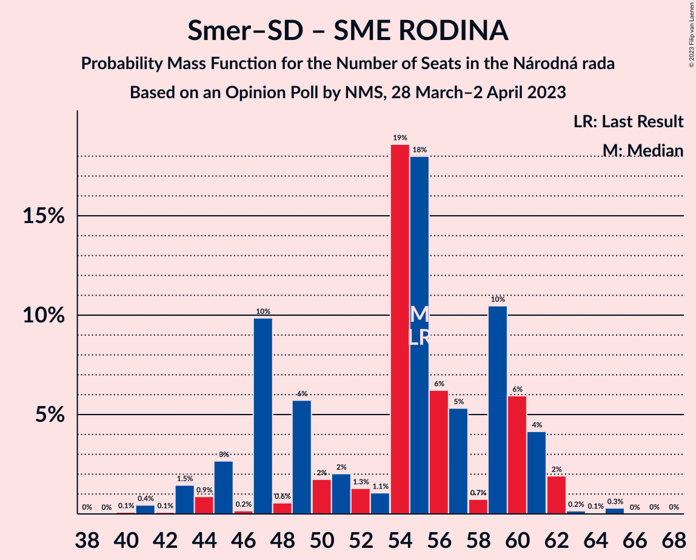

# Opinion Poll by NMS, 28 March–2 April 2023

<a href="#voting-intentions">Voting Intentions</a> | <a href="#seats">Seats</a> | <a href="#coalitions">Coalitions</a> | <a href="#technical-information">Technical Information</a>

## Voting Intentions

### Confidence Intervals

| Party | Last Result | Poll Result | 80% Confidence Interval | 90% Confidence Interval | 95% Confidence Interval | 99% Confidence Interval |
|:-----:|:-----------:|:-----------:|:-----------------------:|:-----------------------:|:-----------------------:|:-----------------------:|
| SMER–sociálna demokracia | 18.3% | 22.4% | 20.8–24.1% |20.3–24.6% |19.9–25.1% |19.2–25.9% |
| HLAS–sociálna demokracia | 0.0% | 14.2% | 12.9–15.7% |12.5–16.2% |12.2–16.5% |11.6–17.3% |
| Progresívne Slovensko | 7.0% | 12.8% | 11.5–14.2% |11.2–14.6% |10.9–15.0% |10.3–15.7% |
| REPUBLIKA | 0.0% | 9.9% | 8.8–11.2% |8.5–11.6% |8.2–11.9% |7.7–12.6% |
| Kresťanskodemokratické hnutie | 4.6% | 6.3% | 5.4–7.4% |5.2–7.7% |5.0–8.0% |4.6–8.5% |
| SME RODINA | 8.2% | 5.7% | 4.9–6.8% |4.6–7.0% |4.4–7.3% |4.1–7.8% |
| OBYČAJNÍ ĽUDIA a nezávislé osobnosti | 25.0% | 5.2% | 4.4–6.2% |4.2–6.5% |4.0–6.8% |3.6–7.3% |
| Sloboda a Solidarita | 6.2% | 5.1% | 4.3–6.1% |4.1–6.4% |3.9–6.6% |3.6–7.1% |
| SPOLU–Občianska Demokracia | 7.0% | 3.0% | 2.5–3.9% |2.3–4.1% |2.1–4.3% |1.9–4.7% |
| Strana maďarskej koalície–Magyar Koalíció Pártja | 3.9% | 3.0% | 2.5–3.9% |2.3–4.1% |2.1–4.3% |1.9–4.7% |
| Slovenská národná strana | 3.2% | 2.4% | 1.8–3.1% |1.7–3.3% |1.6–3.5% |1.4–3.9% |
| Za ľudí | 5.8% | 2.0% | 1.5–2.7% |1.4–2.9% |1.3–3.0% |1.1–3.4% |
| Kotleba–Ľudová strana Naše Slovensko | 8.0% | 1.9% | 1.4–2.5% |1.3–2.7% |1.2–2.9% |1.0–3.3% |

*Note:* The poll result column reflects the actual value used in the calculations. Published results may vary slightly, and in addition be rounded to fewer digits.

## Seats

### Confidence Intervals

| Party | Last Result | Median | 80% Confidence Interval | 90% Confidence Interval | 95% Confidence Interval | 99% Confidence Interval |
|:-----:|:-----------:|:------:|:-----------------------:|:-----------------------:|:-----------------------:|:-----------------------:|
| <a href="#smer–sociálna-demokracia">SMER–sociálna demokracia</a> | 38 | 43 | 42–49 |38–49 |38–50 |37–51 |
| <a href="#hlas–sociálna-demokracia">HLAS–sociálna demokracia</a> | 0 | 28 | 25–31 |24–32 |23–32 |22–34 |
| <a href="#progresívne-slovensko">Progresívne Slovensko</a> | 0 | 25 | 23–30 |22–30 |22–30 |19–31 |
| <a href="#republika">REPUBLIKA</a> | 0 | 21 | 17–23 |15–27 |15–27 |15–27 |
| <a href="#kresťanskodemokratické-hnutie">Kresťanskodemokratické hnutie</a> | 0 | 12 | 11–14 |10–14 |0–15 |0–16 |
| <a href="#sme-rodina">SME RODINA</a> | 17 | 12 | 0–14 |0–14 |0–14 |0–15 |
| <a href="#obyčajní-ľudia-a-nezávislé-osobnosti">OBYČAJNÍ ĽUDIA a nezávislé osobnosti</a> | 53 | 10 | 0–12 |0–12 |0–13 |0–14 |
| <a href="#sloboda-a-solidarita">Sloboda a Solidarita</a> | 13 | 0 | 0–12 |0–14 |0–14 |0–14 |
| <a href="#spolu–občianska-demokracia">SPOLU–Občianska Demokracia</a> | 0 | 0 | 0 |0 |0 |0 |
| <a href="#strana-maďarskej-koalície–magyar-koalíció-pártja">Strana maďarskej koalície–Magyar Koalíció Pártja</a> | 0 | 0 | 0 |0 |0 |0 |
| <a href="#slovenská-národná-strana">Slovenská národná strana</a> | 0 | 0 | 0 |0 |0 |0 |
| <a href="#za-ľudí">Za ľudí</a> | 12 | 0 | 0 |0 |0 |0 |
| <a href="#kotleba–ľudová-strana-naše-slovensko">Kotleba–Ľudová strana Naše Slovensko</a> | 17 | 0 | 0 |0 |0 |0 |

### SMER–sociálna demokracia

*For a full overview of the results for this party, see the [SMER–sociálna demokracia](party-smer–sociálnademokracia.html) page.*

| Number of Seats | Probability | Accumulated | Special Marks |
|:---------------:|:-----------:|:-----------:|:-------------:|
| 35 | 0.1% | 100% |  |
| 36 | 0.3% | 99.9% |  |
| 37 | 1.0% | 99.6% |  |
| 38 | 4% | 98.6% | Last Result |
| 39 | 0.5% | 95% |  |
| 40 | 1.5% | 94% |  |
| 41 | 3% | 93% |  |
| 42 | 20% | 90% |  |
| 43 | 21% | 70% | Median |
| 44 | 8% | 48% |  |
| 45 | 6% | 40% |  |
| 46 | 6% | 34% |  |
| 47 | 12% | 28% |  |
| 48 | 5% | 16% |  |
| 49 | 8% | 11% |  |
| 50 | 2% | 3% |  |
| 51 | 0.4% | 0.7% |  |
| 52 | 0% | 0.3% |  |
| 53 | 0% | 0.2% |  |
| 54 | 0% | 0.2% |  |
| 55 | 0% | 0.2% |  |
| 56 | 0% | 0.2% |  |
| 57 | 0% | 0.1% |  |
| 58 | 0% | 0.1% |  |
| 59 | 0.1% | 0.1% |  |
| 60 | 0% | 0% |  |

### HLAS–sociálna demokracia

*For a full overview of the results for this party, see the [HLAS–sociálna demokracia](party-hlas–sociálnademokracia.html) page.*

| Number of Seats | Probability | Accumulated | Special Marks |
|:---------------:|:-----------:|:-----------:|:-------------:|
| 0 | 0% | 100% | Last Result |
| 1 | 0% | 100% |  |
| 2 | 0% | 100% |  |
| 3 | 0% | 100% |  |
| 4 | 0% | 100% |  |
| 5 | 0% | 100% |  |
| 6 | 0% | 100% |  |
| 7 | 0% | 100% |  |
| 8 | 0% | 100% |  |
| 9 | 0% | 100% |  |
| 10 | 0% | 100% |  |
| 11 | 0% | 100% |  |
| 12 | 0% | 100% |  |
| 13 | 0% | 100% |  |
| 14 | 0% | 100% |  |
| 15 | 0% | 100% |  |
| 16 | 0% | 100% |  |
| 17 | 0% | 100% |  |
| 18 | 0% | 100% |  |
| 19 | 0% | 100% |  |
| 20 | 0% | 100% |  |
| 21 | 0.1% | 100% |  |
| 22 | 1.2% | 99.9% |  |
| 23 | 2% | 98.7% |  |
| 24 | 2% | 97% |  |
| 25 | 7% | 95% |  |
| 26 | 24% | 88% |  |
| 27 | 11% | 64% |  |
| 28 | 8% | 53% | Median |
| 29 | 24% | 45% |  |
| 30 | 4% | 22% |  |
| 31 | 10% | 18% |  |
| 32 | 5% | 7% |  |
| 33 | 1.4% | 2% |  |
| 34 | 0.5% | 0.9% |  |
| 35 | 0.1% | 0.4% |  |
| 36 | 0.1% | 0.3% |  |
| 37 | 0.1% | 0.2% |  |
| 38 | 0% | 0.1% |  |
| 39 | 0% | 0% |  |

### Progresívne Slovensko

*For a full overview of the results for this party, see the [Progresívne Slovensko](party-progresívneslovensko.html) page.*

| Number of Seats | Probability | Accumulated | Special Marks |
|:---------------:|:-----------:|:-----------:|:-------------:|
| 0 | 0% | 100% | Last Result |
| 1 | 0% | 100% |  |
| 2 | 0% | 100% |  |
| 3 | 0% | 100% |  |
| 4 | 0% | 100% |  |
| 5 | 0% | 100% |  |
| 6 | 0% | 100% |  |
| 7 | 0% | 100% |  |
| 8 | 0% | 100% |  |
| 9 | 0% | 100% |  |
| 10 | 0% | 100% |  |
| 11 | 0% | 100% |  |
| 12 | 0% | 100% |  |
| 13 | 0% | 100% |  |
| 14 | 0% | 100% |  |
| 15 | 0% | 100% |  |
| 16 | 0% | 100% |  |
| 17 | 0% | 100% |  |
| 18 | 0% | 100% |  |
| 19 | 0.6% | 99.9% |  |
| 20 | 1.4% | 99.4% |  |
| 21 | 0.3% | 98% |  |
| 22 | 4% | 98% |  |
| 23 | 19% | 94% |  |
| 24 | 7% | 75% |  |
| 25 | 26% | 68% | Median |
| 26 | 11% | 41% |  |
| 27 | 8% | 30% |  |
| 28 | 9% | 22% |  |
| 29 | 2% | 13% |  |
| 30 | 10% | 11% |  |
| 31 | 0.7% | 0.9% |  |
| 32 | 0.1% | 0.2% |  |
| 33 | 0.1% | 0.1% |  |
| 34 | 0% | 0% |  |

### REPUBLIKA

*For a full overview of the results for this party, see the [REPUBLIKA](party-republika.html) page.*

| Number of Seats | Probability | Accumulated | Special Marks |
|:---------------:|:-----------:|:-----------:|:-------------:|
| 0 | 0% | 100% | Last Result |
| 1 | 0% | 100% |  |
| 2 | 0% | 100% |  |
| 3 | 0% | 100% |  |
| 4 | 0% | 100% |  |
| 5 | 0% | 100% |  |
| 6 | 0% | 100% |  |
| 7 | 0% | 100% |  |
| 8 | 0% | 100% |  |
| 9 | 0% | 100% |  |
| 10 | 0% | 100% |  |
| 11 | 0% | 100% |  |
| 12 | 0% | 100% |  |
| 13 | 0% | 100% |  |
| 14 | 0.1% | 100% |  |
| 15 | 6% | 99.9% |  |
| 16 | 4% | 94% |  |
| 17 | 8% | 90% |  |
| 18 | 5% | 83% |  |
| 19 | 19% | 78% |  |
| 20 | 7% | 58% |  |
| 21 | 23% | 52% | Median |
| 22 | 15% | 28% |  |
| 23 | 5% | 13% |  |
| 24 | 3% | 9% |  |
| 25 | 1.2% | 6% |  |
| 26 | 0.1% | 5% |  |
| 27 | 5% | 5% |  |
| 28 | 0% | 0% |  |

### Kresťanskodemokratické hnutie

*For a full overview of the results for this party, see the [Kresťanskodemokratické hnutie](party-kresťanskodemokratickéhnutie.html) page.*

| Number of Seats | Probability | Accumulated | Special Marks |
|:---------------:|:-----------:|:-----------:|:-------------:|
| 0 | 3% | 100% | Last Result |
| 1 | 0% | 97% |  |
| 2 | 0% | 97% |  |
| 3 | 0% | 97% |  |
| 4 | 0% | 97% |  |
| 5 | 0% | 97% |  |
| 6 | 0% | 97% |  |
| 7 | 0% | 97% |  |
| 8 | 0% | 97% |  |
| 9 | 0.1% | 97% |  |
| 10 | 4% | 97% |  |
| 11 | 15% | 93% |  |
| 12 | 56% | 78% | Median |
| 13 | 10% | 22% |  |
| 14 | 9% | 12% |  |
| 15 | 2% | 3% |  |
| 16 | 0.7% | 1.0% |  |
| 17 | 0.2% | 0.3% |  |
| 18 | 0.1% | 0.1% |  |
| 19 | 0% | 0% |  |

### SME RODINA

*For a full overview of the results for this party, see the [SME RODINA](party-smerodina.html) page.*

| Number of Seats | Probability | Accumulated | Special Marks |
|:---------------:|:-----------:|:-----------:|:-------------:|
| 0 | 18% | 100% |  |
| 1 | 0% | 82% |  |
| 2 | 0% | 82% |  |
| 3 | 0% | 82% |  |
| 4 | 0% | 82% |  |
| 5 | 0% | 82% |  |
| 6 | 0% | 82% |  |
| 7 | 0% | 82% |  |
| 8 | 0% | 82% |  |
| 9 | 0.4% | 82% |  |
| 10 | 5% | 82% |  |
| 11 | 14% | 77% |  |
| 12 | 49% | 63% | Median |
| 13 | 2% | 13% |  |
| 14 | 11% | 12% |  |
| 15 | 0.5% | 0.6% |  |
| 16 | 0.1% | 0.2% |  |
| 17 | 0% | 0% | Last Result |

### OBYČAJNÍ ĽUDIA a nezávislé osobnosti

*For a full overview of the results for this party, see the [OBYČAJNÍ ĽUDIA a nezávislé osobnosti](party-obyčajníľudiaanezávisléosobnosti.html) page.*

| Number of Seats | Probability | Accumulated | Special Marks |
|:---------------:|:-----------:|:-----------:|:-------------:|
| 0 | 45% | 100% |  |
| 1 | 0% | 55% |  |
| 2 | 0% | 55% |  |
| 3 | 0% | 55% |  |
| 4 | 0% | 55% |  |
| 5 | 0% | 55% |  |
| 6 | 0% | 55% |  |
| 7 | 0% | 55% |  |
| 8 | 0% | 55% |  |
| 9 | 0.1% | 55% |  |
| 10 | 11% | 55% | Median |
| 11 | 7% | 44% |  |
| 12 | 34% | 38% |  |
| 13 | 3% | 4% |  |
| 14 | 0.7% | 0.9% |  |
| 15 | 0.2% | 0.2% |  |
| 16 | 0% | 0% |  |
| 17 | 0% | 0% |  |
| 18 | 0% | 0% |  |
| 19 | 0% | 0% |  |
| 20 | 0% | 0% |  |
| 21 | 0% | 0% |  |
| 22 | 0% | 0% |  |
| 23 | 0% | 0% |  |
| 24 | 0% | 0% |  |
| 25 | 0% | 0% |  |
| 26 | 0% | 0% |  |
| 27 | 0% | 0% |  |
| 28 | 0% | 0% |  |
| 29 | 0% | 0% |  |
| 30 | 0% | 0% |  |
| 31 | 0% | 0% |  |
| 32 | 0% | 0% |  |
| 33 | 0% | 0% |  |
| 34 | 0% | 0% |  |
| 35 | 0% | 0% |  |
| 36 | 0% | 0% |  |
| 37 | 0% | 0% |  |
| 38 | 0% | 0% |  |
| 39 | 0% | 0% |  |
| 40 | 0% | 0% |  |
| 41 | 0% | 0% |  |
| 42 | 0% | 0% |  |
| 43 | 0% | 0% |  |
| 44 | 0% | 0% |  |
| 45 | 0% | 0% |  |
| 46 | 0% | 0% |  |
| 47 | 0% | 0% |  |
| 48 | 0% | 0% |  |
| 49 | 0% | 0% |  |
| 50 | 0% | 0% |  |
| 51 | 0% | 0% |  |
| 52 | 0% | 0% |  |
| 53 | 0% | 0% | Last Result |

### Sloboda a Solidarita

*For a full overview of the results for this party, see the [Sloboda a Solidarita](party-slobodaasolidarita.html) page.*

| Number of Seats | Probability | Accumulated | Special Marks |
|:---------------:|:-----------:|:-----------:|:-------------:|
| 0 | 65% | 100% | Median |
| 1 | 0% | 35% |  |
| 2 | 0% | 35% |  |
| 3 | 0% | 35% |  |
| 4 | 0% | 35% |  |
| 5 | 0% | 35% |  |
| 6 | 0% | 35% |  |
| 7 | 0% | 35% |  |
| 8 | 0% | 35% |  |
| 9 | 0.9% | 35% |  |
| 10 | 6% | 34% |  |
| 11 | 4% | 28% |  |
| 12 | 16% | 24% |  |
| 13 | 1.3% | 7% | Last Result |
| 14 | 6% | 6% |  |
| 15 | 0% | 0.1% |  |
| 16 | 0% | 0% |  |

### SPOLU–Občianska Demokracia

*For a full overview of the results for this party, see the [SPOLU–Občianska Demokracia](party-spolu–občianskademokracia.html) page.*

| Number of Seats | Probability | Accumulated | Special Marks |
|:---------------:|:-----------:|:-----------:|:-------------:|
| 0 | 99.9% | 100% | Last Result, Median |
| 1 | 0% | 0.1% |  |
| 2 | 0% | 0.1% |  |
| 3 | 0% | 0.1% |  |
| 4 | 0% | 0.1% |  |
| 5 | 0% | 0.1% |  |
| 6 | 0% | 0.1% |  |
| 7 | 0% | 0.1% |  |
| 8 | 0% | 0.1% |  |
| 9 | 0% | 0.1% |  |
| 10 | 0.1% | 0.1% |  |
| 11 | 0% | 0% |  |

### Strana maďarskej koalície–Magyar Koalíció Pártja

*For a full overview of the results for this party, see the [Strana maďarskej koalície–Magyar Koalíció Pártja](party-stranamaďarskejkoalície–magyarkoalíciópártja.html) page.*

| Number of Seats | Probability | Accumulated | Special Marks |
|:---------------:|:-----------:|:-----------:|:-------------:|
| 0 | 100% | 100% | Last Result, Median |

### Slovenská národná strana

*For a full overview of the results for this party, see the [Slovenská národná strana](party-slovenskánárodnástrana.html) page.*

| Number of Seats | Probability | Accumulated | Special Marks |
|:---------------:|:-----------:|:-----------:|:-------------:|
| 0 | 100% | 100% | Last Result, Median |

### Za ľudí

*For a full overview of the results for this party, see the [Za ľudí](party-zaľudí.html) page.*

| Number of Seats | Probability | Accumulated | Special Marks |
|:---------------:|:-----------:|:-----------:|:-------------:|
| 0 | 100% | 100% | Median |
| 1 | 0% | 0% |  |
| 2 | 0% | 0% |  |
| 3 | 0% | 0% |  |
| 4 | 0% | 0% |  |
| 5 | 0% | 0% |  |
| 6 | 0% | 0% |  |
| 7 | 0% | 0% |  |
| 8 | 0% | 0% |  |
| 9 | 0% | 0% |  |
| 10 | 0% | 0% |  |
| 11 | 0% | 0% |  |
| 12 | 0% | 0% | Last Result |

### Kotleba–Ľudová strana Naše Slovensko

*For a full overview of the results for this party, see the [Kotleba–Ľudová strana Naše Slovensko](party-kotleba–ľudovástrananašeslovensko.html) page.*

| Number of Seats | Probability | Accumulated | Special Marks |
|:---------------:|:-----------:|:-----------:|:-------------:|
| 0 | 100% | 100% | Median |
| 1 | 0% | 0% |  |
| 2 | 0% | 0% |  |
| 3 | 0% | 0% |  |
| 4 | 0% | 0% |  |
| 5 | 0% | 0% |  |
| 6 | 0% | 0% |  |
| 7 | 0% | 0% |  |
| 8 | 0% | 0% |  |
| 9 | 0% | 0% |  |
| 10 | 0% | 0% |  |
| 11 | 0% | 0% |  |
| 12 | 0% | 0% |  |
| 13 | 0% | 0% |  |
| 14 | 0% | 0% |  |
| 15 | 0% | 0% |  |
| 16 | 0% | 0% |  |
| 17 | 0% | 0% | Last Result |

## Coalitions

### Confidence Intervals

| Coalition | Last Result | Median | Majority? | 80% Confidence Interval | 90% Confidence Interval | 95% Confidence Interval | 99% Confidence Interval |
|:---------:|:-----------:|:------:|:---------:|:-----------------------:|:-----------------------:|:-----------------------:|:-----------------------:|
| SMER–sociálna demokracia – HLAS–sociálna demokracia – SME RODINA – Slovenská národná strana – Kotleba–Ľudová strana Naše Slovensko | 72 | 82 | 83% | 74–90 | 73–91 | 70–92 | 70–92 |
| SMER–sociálna demokracia – HLAS–sociálna demokracia – SME RODINA | 55 | 82 | 83% | 74–90 | 73–91 | 70–92 | 70–92 |
| SMER–sociálna demokracia – HLAS–sociálna demokracia – SME RODINA – Slovenská národná strana | 55 | 82 | 83% | 74–90 | 73–91 | 70–92 | 70–92 |
| SMER–sociálna demokracia – HLAS–sociálna demokracia – Slovenská národná strana | 38 | 72 | 21% | 67–78 | 66–78 | 64–80 | 62–82 |
| SMER–sociálna demokracia – SME RODINA – Slovenská národná strana – Kotleba–Ľudová strana Naše Slovensko | 72 | 55 | 0% | 47–60 | 45–61 | 44–61 | 41–63 |
| SMER–sociálna demokracia – SME RODINA | 55 | 55 | 0% | 47–60 | 45–61 | 44–61 | 41–63 |
| SMER–sociálna demokracia – SME RODINA – Slovenská národná strana | 55 | 55 | 0% | 47–60 | 45–61 | 44–61 | 41–63 |
| SMER–sociálna demokracia | 38 | 43 | 0% | 42–49 | 38–49 | 38–50 | 37–51 |
| SMER–sociálna demokracia – Slovenská národná strana | 38 | 43 | 0% | 42–49 | 38–49 | 38–50 | 37–51 |
| HLAS–sociálna demokracia – SME RODINA – Slovenská národná strana – Kotleba–Ľudová strana Naše Slovensko | 34 | 39 | 0% | 27–43 | 27–45 | 25–46 | 25–46 |
| HLAS–sociálna demokracia – SME RODINA | 17 | 39 | 0% | 27–43 | 27–45 | 25–46 | 25–46 |
| HLAS–sociálna demokracia – SME RODINA – Slovenská národná strana | 17 | 39 | 0% | 27–43 | 27–45 | 25–46 | 25–46 |
| HLAS–sociálna demokracia – Slovenská národná strana | 0 | 28 | 0% | 25–31 | 24–32 | 23–32 | 22–34 |

### SMER–sociálna demokracia – HLAS–sociálna demokracia – SME RODINA – Slovenská národná strana – Kotleba–Ľudová strana Naše Slovensko

| Number of Seats | Probability | Accumulated | Special Marks |
|:---------------:|:-----------:|:-----------:|:-------------:|
| 67 | 0.1% | 100% |  |
| 68 | 0% | 99.9% |  |
| 69 | 0.2% | 99.9% |  |
| 70 | 3% | 99.7% |  |
| 71 | 0.6% | 97% |  |
| 72 | 1.0% | 96% | Last Result |
| 73 | 1.3% | 95% |  |
| 74 | 11% | 94% |  |
| 75 | 0.5% | 83% |  |
| 76 | 2% | 83% | Majority |
| 77 | 4% | 81% |  |
| 78 | 2% | 77% |  |
| 79 | 1.0% | 75% |  |
| 80 | 20% | 74% |  |
| 81 | 1.0% | 54% |  |
| 82 | 3% | 53% |  |
| 83 | 0.6% | 50% | Median |
| 84 | 16% | 49% |  |
| 85 | 7% | 33% |  |
| 86 | 0.9% | 26% |  |
| 87 | 7% | 25% |  |
| 88 | 4% | 19% |  |
| 89 | 3% | 15% |  |
| 90 | 6% | 12% |  |
| 91 | 1.4% | 6% |  |
| 92 | 4% | 4% |  |
| 93 | 0.1% | 0.2% |  |
| 94 | 0.1% | 0.2% |  |
| 95 | 0% | 0.1% |  |
| 96 | 0% | 0.1% |  |
| 97 | 0% | 0.1% |  |
| 98 | 0% | 0.1% |  |
| 99 | 0% | 0% |  |

### SMER–sociálna demokracia – HLAS–sociálna demokracia – SME RODINA

| Number of Seats | Probability | Accumulated | Special Marks |
|:---------------:|:-----------:|:-----------:|:-------------:|
| 55 | 0% | 100% | Last Result |
| 56 | 0% | 100% |  |
| 57 | 0% | 100% |  |
| 58 | 0% | 100% |  |
| 59 | 0% | 100% |  |
| 60 | 0% | 100% |  |
| 61 | 0% | 100% |  |
| 62 | 0% | 100% |  |
| 63 | 0% | 100% |  |
| 64 | 0% | 100% |  |
| 65 | 0% | 100% |  |
| 66 | 0% | 100% |  |
| 67 | 0.1% | 100% |  |
| 68 | 0% | 99.9% |  |
| 69 | 0.2% | 99.9% |  |
| 70 | 3% | 99.7% |  |
| 71 | 0.6% | 97% |  |
| 72 | 1.0% | 96% |  |
| 73 | 1.3% | 95% |  |
| 74 | 11% | 94% |  |
| 75 | 0.5% | 83% |  |
| 76 | 2% | 83% | Majority |
| 77 | 4% | 81% |  |
| 78 | 2% | 77% |  |
| 79 | 1.0% | 75% |  |
| 80 | 20% | 74% |  |
| 81 | 1.0% | 54% |  |
| 82 | 3% | 53% |  |
| 83 | 0.6% | 50% | Median |
| 84 | 16% | 49% |  |
| 85 | 7% | 33% |  |
| 86 | 0.9% | 26% |  |
| 87 | 7% | 25% |  |
| 88 | 4% | 19% |  |
| 89 | 3% | 15% |  |
| 90 | 6% | 12% |  |
| 91 | 1.4% | 6% |  |
| 92 | 4% | 4% |  |
| 93 | 0.1% | 0.2% |  |
| 94 | 0.1% | 0.2% |  |
| 95 | 0% | 0.1% |  |
| 96 | 0% | 0.1% |  |
| 97 | 0% | 0.1% |  |
| 98 | 0% | 0.1% |  |
| 99 | 0% | 0% |  |

### SMER–sociálna demokracia – HLAS–sociálna demokracia – SME RODINA – Slovenská národná strana

| Number of Seats | Probability | Accumulated | Special Marks |
|:---------------:|:-----------:|:-----------:|:-------------:|
| 55 | 0% | 100% | Last Result |
| 56 | 0% | 100% |  |
| 57 | 0% | 100% |  |
| 58 | 0% | 100% |  |
| 59 | 0% | 100% |  |
| 60 | 0% | 100% |  |
| 61 | 0% | 100% |  |
| 62 | 0% | 100% |  |
| 63 | 0% | 100% |  |
| 64 | 0% | 100% |  |
| 65 | 0% | 100% |  |
| 66 | 0% | 100% |  |
| 67 | 0.1% | 100% |  |
| 68 | 0% | 99.9% |  |
| 69 | 0.2% | 99.9% |  |
| 70 | 3% | 99.7% |  |
| 71 | 0.6% | 97% |  |
| 72 | 1.0% | 96% |  |
| 73 | 1.3% | 95% |  |
| 74 | 11% | 94% |  |
| 75 | 0.5% | 83% |  |
| 76 | 2% | 83% | Majority |
| 77 | 4% | 81% |  |
| 78 | 2% | 77% |  |
| 79 | 1.0% | 75% |  |
| 80 | 20% | 74% |  |
| 81 | 1.0% | 54% |  |
| 82 | 3% | 53% |  |
| 83 | 0.6% | 50% | Median |
| 84 | 16% | 49% |  |
| 85 | 7% | 33% |  |
| 86 | 0.9% | 26% |  |
| 87 | 7% | 25% |  |
| 88 | 4% | 19% |  |
| 89 | 3% | 15% |  |
| 90 | 6% | 12% |  |
| 91 | 1.4% | 6% |  |
| 92 | 4% | 4% |  |
| 93 | 0.1% | 0.2% |  |
| 94 | 0.1% | 0.2% |  |
| 95 | 0% | 0.1% |  |
| 96 | 0% | 0.1% |  |
| 97 | 0% | 0.1% |  |
| 98 | 0% | 0.1% |  |
| 99 | 0% | 0% |  |

### SMER–sociálna demokracia – HLAS–sociálna demokracia – Slovenská národná strana

| Number of Seats | Probability | Accumulated | Special Marks |
|:---------------:|:-----------:|:-----------:|:-------------:|
| 38 | 0% | 100% | Last Result |
| 39 | 0% | 100% |  |
| 40 | 0% | 100% |  |
| 41 | 0% | 100% |  |
| 42 | 0% | 100% |  |
| 43 | 0% | 100% |  |
| 44 | 0% | 100% |  |
| 45 | 0% | 100% |  |
| 46 | 0% | 100% |  |
| 47 | 0% | 100% |  |
| 48 | 0% | 100% |  |
| 49 | 0% | 100% |  |
| 50 | 0% | 100% |  |
| 51 | 0% | 100% |  |
| 52 | 0% | 100% |  |
| 53 | 0% | 100% |  |
| 54 | 0% | 100% |  |
| 55 | 0% | 100% |  |
| 56 | 0% | 100% |  |
| 57 | 0% | 100% |  |
| 58 | 0% | 100% |  |
| 59 | 0% | 100% |  |
| 60 | 0% | 100% |  |
| 61 | 0.1% | 99.9% |  |
| 62 | 1.0% | 99.9% |  |
| 63 | 0.6% | 98.9% |  |
| 64 | 2% | 98% |  |
| 65 | 1.0% | 96% |  |
| 66 | 3% | 95% |  |
| 67 | 3% | 92% |  |
| 68 | 21% | 89% |  |
| 69 | 1.0% | 68% |  |
| 70 | 3% | 67% |  |
| 71 | 3% | 64% | Median |
| 72 | 16% | 62% |  |
| 73 | 1.0% | 46% |  |
| 74 | 15% | 45% |  |
| 75 | 8% | 29% |  |
| 76 | 4% | 21% | Majority |
| 77 | 2% | 17% |  |
| 78 | 10% | 15% |  |
| 79 | 0.3% | 4% |  |
| 80 | 3% | 4% |  |
| 81 | 0.2% | 0.7% |  |
| 82 | 0.1% | 0.5% |  |
| 83 | 0.1% | 0.5% |  |
| 84 | 0.1% | 0.4% |  |
| 85 | 0% | 0.3% |  |
| 86 | 0% | 0.3% |  |
| 87 | 0.2% | 0.3% |  |
| 88 | 0% | 0% |  |

### SMER–sociálna demokracia – SME RODINA – Slovenská národná strana – Kotleba–Ľudová strana Naše Slovensko

| Number of Seats | Probability | Accumulated | Special Marks |
|:---------------:|:-----------:|:-----------:|:-------------:|
| 40 | 0.1% | 100% |  |
| 41 | 0.4% | 99.9% |  |
| 42 | 0.1% | 99.4% |  |
| 43 | 1.5% | 99.3% |  |
| 44 | 0.9% | 98% |  |
| 45 | 3% | 97% |  |
| 46 | 0.2% | 94% |  |
| 47 | 10% | 94% |  |
| 48 | 0.6% | 84% |  |
| 49 | 6% | 84% |  |
| 50 | 2% | 78% |  |
| 51 | 2% | 76% |  |
| 52 | 1.3% | 74% |  |
| 53 | 1.1% | 73% |  |
| 54 | 19% | 72% |  |
| 55 | 18% | 53% | Median |
| 56 | 6% | 35% |  |
| 57 | 5% | 29% |  |
| 58 | 0.7% | 24% |  |
| 59 | 10% | 23% |  |
| 60 | 6% | 13% |  |
| 61 | 4% | 7% |  |
| 62 | 2% | 2% |  |
| 63 | 0.2% | 0.6% |  |
| 64 | 0.1% | 0.4% |  |
| 65 | 0.3% | 0.4% |  |
| 66 | 0% | 0.1% |  |
| 67 | 0% | 0.1% |  |
| 68 | 0% | 0% |  |
| 69 | 0% | 0% |  |
| 70 | 0% | 0% |  |
| 71 | 0% | 0% |  |
| 72 | 0% | 0% | Last Result |

### SMER–sociálna demokracia – SME RODINA

| Number of Seats | Probability | Accumulated | Special Marks |
|:---------------:|:-----------:|:-----------:|:-------------:|
| 40 | 0.1% | 100% |  |
| 41 | 0.4% | 99.9% |  |
| 42 | 0.1% | 99.4% |  |
| 43 | 1.5% | 99.3% |  |
| 44 | 0.9% | 98% |  |
| 45 | 3% | 97% |  |
| 46 | 0.2% | 94% |  |
| 47 | 10% | 94% |  |
| 48 | 0.6% | 84% |  |
| 49 | 6% | 84% |  |
| 50 | 2% | 78% |  |
| 51 | 2% | 76% |  |
| 52 | 1.3% | 74% |  |
| 53 | 1.1% | 73% |  |
| 54 | 19% | 72% |  |
| 55 | 18% | 53% | Last Result, Median |
| 56 | 6% | 35% |  |
| 57 | 5% | 29% |  |
| 58 | 0.7% | 24% |  |
| 59 | 10% | 23% |  |
| 60 | 6% | 13% |  |
| 61 | 4% | 7% |  |
| 62 | 2% | 2% |  |
| 63 | 0.2% | 0.6% |  |
| 64 | 0.1% | 0.4% |  |
| 65 | 0.3% | 0.4% |  |
| 66 | 0% | 0.1% |  |
| 67 | 0% | 0.1% |  |
| 68 | 0% | 0% |  |

### SMER–sociálna demokracia – SME RODINA – Slovenská národná strana

| Number of Seats | Probability | Accumulated | Special Marks |
|:---------------:|:-----------:|:-----------:|:-------------:|
| 40 | 0.1% | 100% |  |
| 41 | 0.4% | 99.9% |  |
| 42 | 0.1% | 99.4% |  |
| 43 | 1.5% | 99.3% |  |
| 44 | 0.9% | 98% |  |
| 45 | 3% | 97% |  |
| 46 | 0.2% | 94% |  |
| 47 | 10% | 94% |  |
| 48 | 0.6% | 84% |  |
| 49 | 6% | 84% |  |
| 50 | 2% | 78% |  |
| 51 | 2% | 76% |  |
| 52 | 1.3% | 74% |  |
| 53 | 1.1% | 73% |  |
| 54 | 19% | 72% |  |
| 55 | 18% | 53% | Last Result, Median |
| 56 | 6% | 35% |  |
| 57 | 5% | 29% |  |
| 58 | 0.7% | 24% |  |
| 59 | 10% | 23% |  |
| 60 | 6% | 13% |  |
| 61 | 4% | 7% |  |
| 62 | 2% | 2% |  |
| 63 | 0.2% | 0.6% |  |
| 64 | 0.1% | 0.4% |  |
| 65 | 0.3% | 0.4% |  |
| 66 | 0% | 0.1% |  |
| 67 | 0% | 0.1% |  |
| 68 | 0% | 0% |  |

### SMER–sociálna demokracia

| Number of Seats | Probability | Accumulated | Special Marks |
|:---------------:|:-----------:|:-----------:|:-------------:|
| 35 | 0.1% | 100% |  |
| 36 | 0.3% | 99.9% |  |
| 37 | 1.0% | 99.6% |  |
| 38 | 4% | 98.6% | Last Result |
| 39 | 0.5% | 95% |  |
| 40 | 1.5% | 94% |  |
| 41 | 3% | 93% |  |
| 42 | 20% | 90% |  |
| 43 | 21% | 70% | Median |
| 44 | 8% | 48% |  |
| 45 | 6% | 40% |  |
| 46 | 6% | 34% |  |
| 47 | 12% | 28% |  |
| 48 | 5% | 16% |  |
| 49 | 8% | 11% |  |
| 50 | 2% | 3% |  |
| 51 | 0.4% | 0.7% |  |
| 52 | 0% | 0.3% |  |
| 53 | 0% | 0.2% |  |
| 54 | 0% | 0.2% |  |
| 55 | 0% | 0.2% |  |
| 56 | 0% | 0.2% |  |
| 57 | 0% | 0.1% |  |
| 58 | 0% | 0.1% |  |
| 59 | 0.1% | 0.1% |  |
| 60 | 0% | 0% |  |

### SMER–sociálna demokracia – Slovenská národná strana

| Number of Seats | Probability | Accumulated | Special Marks |
|:---------------:|:-----------:|:-----------:|:-------------:|
| 35 | 0.1% | 100% |  |
| 36 | 0.3% | 99.9% |  |
| 37 | 1.0% | 99.6% |  |
| 38 | 4% | 98.6% | Last Result |
| 39 | 0.5% | 95% |  |
| 40 | 1.5% | 94% |  |
| 41 | 3% | 93% |  |
| 42 | 20% | 90% |  |
| 43 | 21% | 70% | Median |
| 44 | 8% | 48% |  |
| 45 | 6% | 40% |  |
| 46 | 6% | 34% |  |
| 47 | 12% | 28% |  |
| 48 | 5% | 16% |  |
| 49 | 8% | 11% |  |
| 50 | 2% | 3% |  |
| 51 | 0.4% | 0.7% |  |
| 52 | 0% | 0.3% |  |
| 53 | 0% | 0.2% |  |
| 54 | 0% | 0.2% |  |
| 55 | 0% | 0.2% |  |
| 56 | 0% | 0.2% |  |
| 57 | 0% | 0.1% |  |
| 58 | 0% | 0.1% |  |
| 59 | 0.1% | 0.1% |  |
| 60 | 0% | 0% |  |

### HLAS–sociálna demokracia – SME RODINA – Slovenská národná strana – Kotleba–Ľudová strana Naše Slovensko

| Number of Seats | Probability | Accumulated | Special Marks |
|:---------------:|:-----------:|:-----------:|:-------------:|
| 22 | 0.1% | 100% |  |
| 23 | 0% | 99.9% |  |
| 24 | 0% | 99.9% |  |
| 25 | 3% | 99.9% |  |
| 26 | 0.2% | 97% |  |
| 27 | 9% | 97% |  |
| 28 | 0.5% | 88% |  |
| 29 | 0.7% | 88% |  |
| 30 | 0.4% | 87% |  |
| 31 | 2% | 86% |  |
| 32 | 0.6% | 84% |  |
| 33 | 3% | 84% |  |
| 34 | 1.3% | 81% | Last Result |
| 35 | 2% | 79% |  |
| 36 | 2% | 78% |  |
| 37 | 6% | 76% |  |
| 38 | 19% | 70% |  |
| 39 | 7% | 51% |  |
| 40 | 3% | 44% | Median |
| 41 | 23% | 42% |  |
| 42 | 4% | 18% |  |
| 43 | 6% | 14% |  |
| 44 | 3% | 8% |  |
| 45 | 0.8% | 5% |  |
| 46 | 4% | 4% |  |
| 47 | 0.1% | 0.2% |  |
| 48 | 0.1% | 0.1% |  |
| 49 | 0% | 0.1% |  |
| 50 | 0% | 0% |  |

### HLAS–sociálna demokracia – SME RODINA

| Number of Seats | Probability | Accumulated | Special Marks |
|:---------------:|:-----------:|:-----------:|:-------------:|
| 17 | 0% | 100% | Last Result |
| 18 | 0% | 100% |  |
| 19 | 0% | 100% |  |
| 20 | 0% | 100% |  |
| 21 | 0% | 100% |  |
| 22 | 0.1% | 100% |  |
| 23 | 0% | 99.9% |  |
| 24 | 0% | 99.9% |  |
| 25 | 3% | 99.9% |  |
| 26 | 0.2% | 97% |  |
| 27 | 9% | 97% |  |
| 28 | 0.5% | 88% |  |
| 29 | 0.7% | 88% |  |
| 30 | 0.4% | 87% |  |
| 31 | 2% | 86% |  |
| 32 | 0.6% | 84% |  |
| 33 | 3% | 84% |  |
| 34 | 1.3% | 81% |  |
| 35 | 2% | 79% |  |
| 36 | 2% | 78% |  |
| 37 | 6% | 76% |  |
| 38 | 19% | 70% |  |
| 39 | 7% | 51% |  |
| 40 | 3% | 44% | Median |
| 41 | 23% | 42% |  |
| 42 | 4% | 18% |  |
| 43 | 6% | 14% |  |
| 44 | 3% | 8% |  |
| 45 | 0.8% | 5% |  |
| 46 | 4% | 4% |  |
| 47 | 0.1% | 0.2% |  |
| 48 | 0.1% | 0.1% |  |
| 49 | 0% | 0.1% |  |
| 50 | 0% | 0% |  |

### HLAS–sociálna demokracia – SME RODINA – Slovenská národná strana

| Number of Seats | Probability | Accumulated | Special Marks |
|:---------------:|:-----------:|:-----------:|:-------------:|
| 17 | 0% | 100% | Last Result |
| 18 | 0% | 100% |  |
| 19 | 0% | 100% |  |
| 20 | 0% | 100% |  |
| 21 | 0% | 100% |  |
| 22 | 0.1% | 100% |  |
| 23 | 0% | 99.9% |  |
| 24 | 0% | 99.9% |  |
| 25 | 3% | 99.9% |  |
| 26 | 0.2% | 97% |  |
| 27 | 9% | 97% |  |
| 28 | 0.5% | 88% |  |
| 29 | 0.7% | 88% |  |
| 30 | 0.4% | 87% |  |
| 31 | 2% | 86% |  |
| 32 | 0.6% | 84% |  |
| 33 | 3% | 84% |  |
| 34 | 1.3% | 81% |  |
| 35 | 2% | 79% |  |
| 36 | 2% | 78% |  |
| 37 | 6% | 76% |  |
| 38 | 19% | 70% |  |
| 39 | 7% | 51% |  |
| 40 | 3% | 44% | Median |
| 41 | 23% | 42% |  |
| 42 | 4% | 18% |  |
| 43 | 6% | 14% |  |
| 44 | 3% | 8% |  |
| 45 | 0.8% | 5% |  |
| 46 | 4% | 4% |  |
| 47 | 0.1% | 0.2% |  |
| 48 | 0.1% | 0.1% |  |
| 49 | 0% | 0.1% |  |
| 50 | 0% | 0% |  |

### HLAS–sociálna demokracia – Slovenská národná strana

| Number of Seats | Probability | Accumulated | Special Marks |
|:---------------:|:-----------:|:-----------:|:-------------:|
| 0 | 0% | 100% | Last Result |
| 1 | 0% | 100% |  |
| 2 | 0% | 100% |  |
| 3 | 0% | 100% |  |
| 4 | 0% | 100% |  |
| 5 | 0% | 100% |  |
| 6 | 0% | 100% |  |
| 7 | 0% | 100% |  |
| 8 | 0% | 100% |  |
| 9 | 0% | 100% |  |
| 10 | 0% | 100% |  |
| 11 | 0% | 100% |  |
| 12 | 0% | 100% |  |
| 13 | 0% | 100% |  |
| 14 | 0% | 100% |  |
| 15 | 0% | 100% |  |
| 16 | 0% | 100% |  |
| 17 | 0% | 100% |  |
| 18 | 0% | 100% |  |
| 19 | 0% | 100% |  |
| 20 | 0% | 100% |  |
| 21 | 0.1% | 100% |  |
| 22 | 1.2% | 99.9% |  |
| 23 | 2% | 98.7% |  |
| 24 | 2% | 97% |  |
| 25 | 7% | 95% |  |
| 26 | 24% | 88% |  |
| 27 | 11% | 64% |  |
| 28 | 8% | 53% | Median |
| 29 | 24% | 45% |  |
| 30 | 4% | 22% |  |
| 31 | 10% | 18% |  |
| 32 | 5% | 7% |  |
| 33 | 1.4% | 2% |  |
| 34 | 0.5% | 0.9% |  |
| 35 | 0.1% | 0.4% |  |
| 36 | 0.1% | 0.3% |  |
| 37 | 0.1% | 0.2% |  |
| 38 | 0% | 0.1% |  |
| 39 | 0% | 0% |  |

## Technical Information

### Opinion Poll

+ **Polling firm:** NMS
+ **Commissioner(s):** —
+ **Fieldwork period:** 28 March–2 April 2023

### Calculations

+ **Sample size:** 1018
+ **Simulations done:** 1,048,576
+ **Error estimate:** 1.71%

