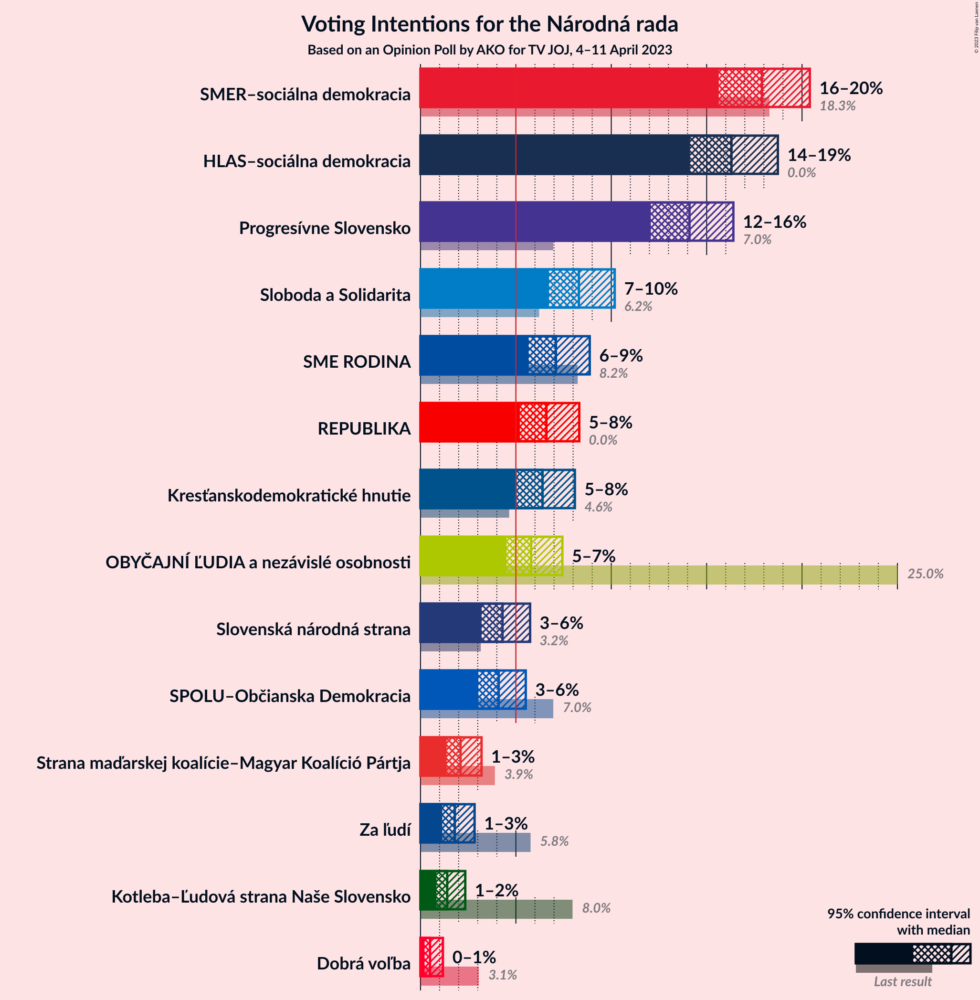

# Opinion Poll by AKO for TV JOJ, 4–11 April 2023

<a href="#voting-intentions">Voting Intentions</a> | <a href="#seats">Seats</a> | <a href="#coalitions">Coalitions</a> | <a href="#technical-information">Technical Information</a>

## Voting Intentions

### Confidence Intervals

| Party | Last Result | Poll Result | 80% Confidence Interval | 90% Confidence Interval | 95% Confidence Interval | 99% Confidence Interval |
|:-----:|:-----------:|:-----------:|:-----------------------:|:-----------------------:|:-----------------------:|:-----------------------:|
| SMER–sociálna demokracia | 18.3% | 17.9% | 16.4–19.5% |16.0–20.0% |15.6–20.4% |15.0–21.2% |
| HLAS–sociálna demokracia | 0.0% | 16.3% | 14.9–17.9% |14.5–18.3% |14.1–18.7% |13.5–19.5% |
| Progresívne Slovensko | 7.0% | 14.1% | 12.8–15.6% |12.4–16.0% |12.1–16.4% |11.5–17.1% |
| Sloboda a Solidarita | 6.2% | 8.3% | 7.3–9.5% |7.0–9.9% |6.7–10.2% |6.3–10.8% |
| SME RODINA | 8.2% | 7.1% | 6.2–8.3% |5.9–8.6% |5.7–8.9% |5.2–9.4% |
| REPUBLIKA | 0.0% | 6.6% | 5.7–7.7% |5.4–8.0% |5.2–8.3% |4.8–8.9% |
| Kresťanskodemokratické hnutie | 4.6% | 6.4% | 5.5–7.5% |5.3–7.8% |5.0–8.1% |4.6–8.7% |
| OBYČAJNÍ ĽUDIA a nezávislé osobnosti | 25.0% | 5.8% | 5.0–6.9% |4.7–7.2% |4.5–7.4% |4.1–8.0% |
| Slovenská národná strana | 3.2% | 4.3% | 3.6–5.2% |3.4–5.5% |3.2–5.7% |2.9–6.2% |
| SPOLU–Občianska Demokracia | 7.0% | 4.1% | 3.4–5.0% |3.2–5.3% |3.0–5.5% |2.7–6.0% |
| Strana maďarskej koalície–Magyar Koalíció Pártja | 3.9% | 2.1% | 1.6–2.8% |1.5–3.0% |1.4–3.2% |1.2–3.6% |
| Za ľudí | 5.8% | 1.8% | 1.4–2.5% |1.2–2.7% |1.1–2.8% |1.0–3.2% |
| Kotleba–Ľudová strana Naše Slovensko | 8.0% | 1.4% | 1.0–2.0% |0.9–2.2% |0.8–2.3% |0.7–2.7% |
| Dobrá voľba | 3.1% | 0.5% | 0.3–0.9% |0.3–1.1% |0.2–1.2% |0.2–1.4% |

*Note:* The poll result column reflects the actual value used in the calculations. Published results may vary slightly, and in addition be rounded to fewer digits.

## Seats

### Confidence Intervals

| Party | Last Result | Median | 80% Confidence Interval | 90% Confidence Interval | 95% Confidence Interval | 99% Confidence Interval |
|:-----:|:-----------:|:------:|:-----------------------:|:-----------------------:|:-----------------------:|:-----------------------:|
| <a href="#smer–sociálna-demokracia">SMER–sociálna demokracia</a> | 38 | 34 | 29–35 |28–36 |28–37 |25–39 |
| <a href="#hlas–sociálna-demokracia">HLAS–sociálna demokracia</a> | 0 | 30 | 27–33 |24–33 |23–33 |23–36 |
| <a href="#progresívne-slovensko">Progresívne Slovensko</a> | 0 | 26 | 21–31 |21–31 |20–31 |20–31 |
| <a href="#sloboda-a-solidarita">Sloboda a Solidarita</a> | 13 | 17 | 13–18 |13–19 |12–21 |11–21 |
| <a href="#sme-rodina">SME RODINA</a> | 17 | 14 | 11–14 |11–15 |10–16 |9–17 |
| <a href="#republika">REPUBLIKA</a> | 0 | 14 | 10–14 |9–14 |9–15 |0–15 |
| <a href="#kresťanskodemokratické-hnutie">Kresťanskodemokratické hnutie</a> | 0 | 10 | 0–14 |0–15 |0–15 |0–16 |
| <a href="#obyčajní-ľudia-a-nezávislé-osobnosti">OBYČAJNÍ ĽUDIA a nezávislé osobnosti</a> | 53 | 10 | 0–12 |0–13 |0–13 |0–14 |
| <a href="#slovenská-národná-strana">Slovenská národná strana</a> | 0 | 0 | 0–8 |0–9 |0–10 |0–10 |
| <a href="#spolu–občianska-demokracia">SPOLU–Občianska Demokracia</a> | 0 | 0 | 0–10 |0–10 |0–10 |0–12 |
| <a href="#strana-maďarskej-koalície–magyar-koalíció-pártja">Strana maďarskej koalície–Magyar Koalíció Pártja</a> | 0 | 0 | 0 |0 |0 |0 |
| <a href="#za-ľudí">Za ľudí</a> | 12 | 0 | 0 |0 |0 |0 |
| <a href="#kotleba–ľudová-strana-naše-slovensko">Kotleba–Ľudová strana Naše Slovensko</a> | 17 | 0 | 0 |0 |0 |0 |
| <a href="#dobrá-voľba">Dobrá voľba</a> | 0 | 0 | 0 |0 |0 |0 |

### SMER–sociálna demokracia

*For a full overview of the results for this party, see the [SMER–sociálna demokracia](party-smer–sociálnademokracia.html) page.*

| Number of Seats | Probability | Accumulated | Special Marks |
|:---------------:|:-----------:|:-----------:|:-------------:|
| 24 | 0.2% | 100% |  |
| 25 | 0.5% | 99.8% |  |
| 26 | 0.1% | 99.3% |  |
| 27 | 0.6% | 99.2% |  |
| 28 | 6% | 98.6% |  |
| 29 | 7% | 92% |  |
| 30 | 10% | 85% |  |
| 31 | 4% | 75% |  |
| 32 | 6% | 71% |  |
| 33 | 2% | 66% |  |
| 34 | 52% | 64% | Median |
| 35 | 2% | 12% |  |
| 36 | 7% | 9% |  |
| 37 | 1.5% | 3% |  |
| 38 | 0.2% | 1.2% | Last Result |
| 39 | 0.7% | 1.0% |  |
| 40 | 0.3% | 0.3% |  |
| 41 | 0% | 0% |  |

### HLAS–sociálna demokracia

*For a full overview of the results for this party, see the [HLAS–sociálna demokracia](party-hlas–sociálnademokracia.html) page.*

| Number of Seats | Probability | Accumulated | Special Marks |
|:---------------:|:-----------:|:-----------:|:-------------:|
| 0 | 0% | 100% | Last Result |
| 1 | 0% | 100% |  |
| 2 | 0% | 100% |  |
| 3 | 0% | 100% |  |
| 4 | 0% | 100% |  |
| 5 | 0% | 100% |  |
| 6 | 0% | 100% |  |
| 7 | 0% | 100% |  |
| 8 | 0% | 100% |  |
| 9 | 0% | 100% |  |
| 10 | 0% | 100% |  |
| 11 | 0% | 100% |  |
| 12 | 0% | 100% |  |
| 13 | 0% | 100% |  |
| 14 | 0% | 100% |  |
| 15 | 0% | 100% |  |
| 16 | 0% | 100% |  |
| 17 | 0% | 100% |  |
| 18 | 0% | 100% |  |
| 19 | 0% | 100% |  |
| 20 | 0% | 100% |  |
| 21 | 0% | 100% |  |
| 22 | 0.1% | 100% |  |
| 23 | 5% | 99.9% |  |
| 24 | 0.7% | 95% |  |
| 25 | 0.3% | 94% |  |
| 26 | 3% | 94% |  |
| 27 | 3% | 91% |  |
| 28 | 8% | 87% |  |
| 29 | 3% | 79% |  |
| 30 | 51% | 77% | Median |
| 31 | 6% | 25% |  |
| 32 | 7% | 19% |  |
| 33 | 10% | 12% |  |
| 34 | 0.5% | 2% |  |
| 35 | 0.5% | 2% |  |
| 36 | 1.0% | 1.2% |  |
| 37 | 0.2% | 0.2% |  |
| 38 | 0% | 0.1% |  |
| 39 | 0% | 0.1% |  |
| 40 | 0% | 0.1% |  |
| 41 | 0% | 0.1% |  |
| 42 | 0% | 0.1% |  |
| 43 | 0.1% | 0.1% |  |
| 44 | 0% | 0% |  |

### Progresívne Slovensko

*For a full overview of the results for this party, see the [Progresívne Slovensko](party-progresívneslovensko.html) page.*

| Number of Seats | Probability | Accumulated | Special Marks |
|:---------------:|:-----------:|:-----------:|:-------------:|
| 0 | 0% | 100% | Last Result |
| 1 | 0% | 100% |  |
| 2 | 0% | 100% |  |
| 3 | 0% | 100% |  |
| 4 | 0% | 100% |  |
| 5 | 0% | 100% |  |
| 6 | 0% | 100% |  |
| 7 | 0% | 100% |  |
| 8 | 0% | 100% |  |
| 9 | 0% | 100% |  |
| 10 | 0% | 100% |  |
| 11 | 0% | 100% |  |
| 12 | 0% | 100% |  |
| 13 | 0% | 100% |  |
| 14 | 0% | 100% |  |
| 15 | 0% | 100% |  |
| 16 | 0% | 100% |  |
| 17 | 0% | 100% |  |
| 18 | 0% | 100% |  |
| 19 | 0.1% | 100% |  |
| 20 | 2% | 99.9% |  |
| 21 | 17% | 97% |  |
| 22 | 2% | 81% |  |
| 23 | 4% | 79% |  |
| 24 | 6% | 74% |  |
| 25 | 12% | 69% |  |
| 26 | 7% | 57% | Median |
| 27 | 2% | 50% |  |
| 28 | 5% | 48% |  |
| 29 | 1.5% | 43% |  |
| 30 | 0.5% | 41% |  |
| 31 | 41% | 41% |  |
| 32 | 0.2% | 0.3% |  |
| 33 | 0% | 0.1% |  |
| 34 | 0.1% | 0.1% |  |
| 35 | 0% | 0% |  |

### Sloboda a Solidarita

*For a full overview of the results for this party, see the [Sloboda a Solidarita](party-slobodaasolidarita.html) page.*

| Number of Seats | Probability | Accumulated | Special Marks |
|:---------------:|:-----------:|:-----------:|:-------------:|
| 10 | 0.4% | 100% |  |
| 11 | 1.0% | 99.6% |  |
| 12 | 3% | 98.6% |  |
| 13 | 14% | 96% | Last Result |
| 14 | 14% | 82% |  |
| 15 | 8% | 68% |  |
| 16 | 2% | 59% |  |
| 17 | 46% | 57% | Median |
| 18 | 2% | 11% |  |
| 19 | 4% | 9% |  |
| 20 | 0.2% | 5% |  |
| 21 | 5% | 5% |  |
| 22 | 0% | 0.1% |  |
| 23 | 0% | 0% |  |

### SME RODINA

*For a full overview of the results for this party, see the [SME RODINA](party-smerodina.html) page.*

| Number of Seats | Probability | Accumulated | Special Marks |
|:---------------:|:-----------:|:-----------:|:-------------:|
| 0 | 0.3% | 100% |  |
| 1 | 0% | 99.7% |  |
| 2 | 0% | 99.7% |  |
| 3 | 0% | 99.7% |  |
| 4 | 0% | 99.7% |  |
| 5 | 0% | 99.7% |  |
| 6 | 0% | 99.7% |  |
| 7 | 0% | 99.7% |  |
| 8 | 0% | 99.7% |  |
| 9 | 0.3% | 99.7% |  |
| 10 | 2% | 99.5% |  |
| 11 | 16% | 97% |  |
| 12 | 6% | 82% |  |
| 13 | 19% | 76% |  |
| 14 | 48% | 57% | Median |
| 15 | 7% | 9% |  |
| 16 | 0.6% | 3% |  |
| 17 | 2% | 2% | Last Result |
| 18 | 0.4% | 0.4% |  |
| 19 | 0% | 0% |  |

### REPUBLIKA

*For a full overview of the results for this party, see the [REPUBLIKA](party-republika.html) page.*

| Number of Seats | Probability | Accumulated | Special Marks |
|:---------------:|:-----------:|:-----------:|:-------------:|
| 0 | 2% | 100% | Last Result |
| 1 | 0% | 98% |  |
| 2 | 0% | 98% |  |
| 3 | 0% | 98% |  |
| 4 | 0% | 98% |  |
| 5 | 0% | 98% |  |
| 6 | 0% | 98% |  |
| 7 | 0% | 98% |  |
| 8 | 0% | 98% |  |
| 9 | 4% | 98% |  |
| 10 | 4% | 94% |  |
| 11 | 9% | 90% |  |
| 12 | 8% | 81% |  |
| 13 | 20% | 73% |  |
| 14 | 49% | 52% | Median |
| 15 | 3% | 4% |  |
| 16 | 0.2% | 0.4% |  |
| 17 | 0.2% | 0.2% |  |
| 18 | 0% | 0% |  |

### Kresťanskodemokratické hnutie

*For a full overview of the results for this party, see the [Kresťanskodemokratické hnutie](party-kresťanskodemokratickéhnutie.html) page.*

| Number of Seats | Probability | Accumulated | Special Marks |
|:---------------:|:-----------:|:-----------:|:-------------:|
| 0 | 42% | 100% | Last Result |
| 1 | 0% | 58% |  |
| 2 | 0% | 58% |  |
| 3 | 0% | 58% |  |
| 4 | 0% | 58% |  |
| 5 | 0% | 58% |  |
| 6 | 0% | 58% |  |
| 7 | 0% | 58% |  |
| 8 | 0% | 58% |  |
| 9 | 6% | 58% |  |
| 10 | 8% | 53% | Median |
| 11 | 14% | 45% |  |
| 12 | 13% | 31% |  |
| 13 | 6% | 18% |  |
| 14 | 6% | 13% |  |
| 15 | 6% | 6% |  |
| 16 | 0.4% | 0.5% |  |
| 17 | 0.1% | 0.1% |  |
| 18 | 0% | 0% |  |

### OBYČAJNÍ ĽUDIA a nezávislé osobnosti

*For a full overview of the results for this party, see the [OBYČAJNÍ ĽUDIA a nezávislé osobnosti](party-obyčajníľudiaanezávisléosobnosti.html) page.*

| Number of Seats | Probability | Accumulated | Special Marks |
|:---------------:|:-----------:|:-----------:|:-------------:|
| 0 | 18% | 100% |  |
| 1 | 0% | 82% |  |
| 2 | 0% | 82% |  |
| 3 | 0% | 82% |  |
| 4 | 0% | 82% |  |
| 5 | 0% | 82% |  |
| 6 | 0% | 82% |  |
| 7 | 0% | 82% |  |
| 8 | 0% | 82% |  |
| 9 | 7% | 82% |  |
| 10 | 49% | 76% | Median |
| 11 | 9% | 26% |  |
| 12 | 12% | 17% |  |
| 13 | 4% | 5% |  |
| 14 | 0.8% | 1.1% |  |
| 15 | 0.3% | 0.4% |  |
| 16 | 0% | 0% |  |
| 17 | 0% | 0% |  |
| 18 | 0% | 0% |  |
| 19 | 0% | 0% |  |
| 20 | 0% | 0% |  |
| 21 | 0% | 0% |  |
| 22 | 0% | 0% |  |
| 23 | 0% | 0% |  |
| 24 | 0% | 0% |  |
| 25 | 0% | 0% |  |
| 26 | 0% | 0% |  |
| 27 | 0% | 0% |  |
| 28 | 0% | 0% |  |
| 29 | 0% | 0% |  |
| 30 | 0% | 0% |  |
| 31 | 0% | 0% |  |
| 32 | 0% | 0% |  |
| 33 | 0% | 0% |  |
| 34 | 0% | 0% |  |
| 35 | 0% | 0% |  |
| 36 | 0% | 0% |  |
| 37 | 0% | 0% |  |
| 38 | 0% | 0% |  |
| 39 | 0% | 0% |  |
| 40 | 0% | 0% |  |
| 41 | 0% | 0% |  |
| 42 | 0% | 0% |  |
| 43 | 0% | 0% |  |
| 44 | 0% | 0% |  |
| 45 | 0% | 0% |  |
| 46 | 0% | 0% |  |
| 47 | 0% | 0% |  |
| 48 | 0% | 0% |  |
| 49 | 0% | 0% |  |
| 50 | 0% | 0% |  |
| 51 | 0% | 0% |  |
| 52 | 0% | 0% |  |
| 53 | 0% | 0% | Last Result |

### Slovenská národná strana

*For a full overview of the results for this party, see the [Slovenská národná strana](party-slovenskánárodnástrana.html) page.*

| Number of Seats | Probability | Accumulated | Special Marks |
|:---------------:|:-----------:|:-----------:|:-------------:|
| 0 | 86% | 100% | Last Result, Median |
| 1 | 0% | 14% |  |
| 2 | 0% | 14% |  |
| 3 | 0% | 14% |  |
| 4 | 0% | 14% |  |
| 5 | 0% | 14% |  |
| 6 | 0% | 14% |  |
| 7 | 0% | 14% |  |
| 8 | 5% | 14% |  |
| 9 | 6% | 9% |  |
| 10 | 3% | 3% |  |
| 11 | 0.4% | 0.5% |  |
| 12 | 0.1% | 0.1% |  |
| 13 | 0% | 0% |  |

### SPOLU–Občianska Demokracia

*For a full overview of the results for this party, see the [SPOLU–Občianska Demokracia](party-spolu–občianskademokracia.html) page.*

| Number of Seats | Probability | Accumulated | Special Marks |
|:---------------:|:-----------:|:-----------:|:-------------:|
| 0 | 81% | 100% | Last Result, Median |
| 1 | 0% | 19% |  |
| 2 | 0% | 19% |  |
| 3 | 0% | 19% |  |
| 4 | 0% | 19% |  |
| 5 | 0% | 19% |  |
| 6 | 0% | 19% |  |
| 7 | 0% | 19% |  |
| 8 | 0.1% | 19% |  |
| 9 | 5% | 19% |  |
| 10 | 13% | 14% |  |
| 11 | 0.1% | 0.8% |  |
| 12 | 0.6% | 0.7% |  |
| 13 | 0% | 0% |  |

### Strana maďarskej koalície–Magyar Koalíció Pártja

*For a full overview of the results for this party, see the [Strana maďarskej koalície–Magyar Koalíció Pártja](party-stranamaďarskejkoalície–magyarkoalíciópártja.html) page.*

| Number of Seats | Probability | Accumulated | Special Marks |
|:---------------:|:-----------:|:-----------:|:-------------:|
| 0 | 100% | 100% | Last Result, Median |

### Za ľudí

*For a full overview of the results for this party, see the [Za ľudí](party-zaľudí.html) page.*

| Number of Seats | Probability | Accumulated | Special Marks |
|:---------------:|:-----------:|:-----------:|:-------------:|
| 0 | 100% | 100% | Median |
| 1 | 0% | 0% |  |
| 2 | 0% | 0% |  |
| 3 | 0% | 0% |  |
| 4 | 0% | 0% |  |
| 5 | 0% | 0% |  |
| 6 | 0% | 0% |  |
| 7 | 0% | 0% |  |
| 8 | 0% | 0% |  |
| 9 | 0% | 0% |  |
| 10 | 0% | 0% |  |
| 11 | 0% | 0% |  |
| 12 | 0% | 0% | Last Result |

### Kotleba–Ľudová strana Naše Slovensko

*For a full overview of the results for this party, see the [Kotleba–Ľudová strana Naše Slovensko](party-kotleba–ľudovástrananašeslovensko.html) page.*

| Number of Seats | Probability | Accumulated | Special Marks |
|:---------------:|:-----------:|:-----------:|:-------------:|
| 0 | 100% | 100% | Median |
| 1 | 0% | 0% |  |
| 2 | 0% | 0% |  |
| 3 | 0% | 0% |  |
| 4 | 0% | 0% |  |
| 5 | 0% | 0% |  |
| 6 | 0% | 0% |  |
| 7 | 0% | 0% |  |
| 8 | 0% | 0% |  |
| 9 | 0% | 0% |  |
| 10 | 0% | 0% |  |
| 11 | 0% | 0% |  |
| 12 | 0% | 0% |  |
| 13 | 0% | 0% |  |
| 14 | 0% | 0% |  |
| 15 | 0% | 0% |  |
| 16 | 0% | 0% |  |
| 17 | 0% | 0% | Last Result |

### Dobrá voľba

*For a full overview of the results for this party, see the [Dobrá voľba](party-dobrávoľba.html) page.*

| Number of Seats | Probability | Accumulated | Special Marks |
|:---------------:|:-----------:|:-----------:|:-------------:|
| 0 | 100% | 100% | Last Result, Median |

## Coalitions

### Confidence Intervals

| Coalition | Last Result | Median | Majority? | 80% Confidence Interval | 90% Confidence Interval | 95% Confidence Interval | 99% Confidence Interval |
|:---------:|:-----------:|:------:|:---------:|:-----------------------:|:-----------------------:|:-----------------------:|:-----------------------:|
| SMER–sociálna demokracia – HLAS–sociálna demokracia – SME RODINA – Slovenská národná strana – Kotleba–Ľudová strana Naše Slovensko | 72 | 78 | 73% | 72–80 | 71–80 | 70–83 | 68–86 |
| SMER–sociálna demokracia – HLAS–sociálna demokracia – SME RODINA – Slovenská národná strana | 55 | 78 | 73% | 72–80 | 71–80 | 70–83 | 68–86 |
| SMER–sociálna demokracia – HLAS–sociálna demokracia – SME RODINA | 55 | 78 | 65% | 70–80 | 67–80 | 64–81 | 64–86 |
| SMER–sociálna demokracia – HLAS–sociálna demokracia – Slovenská národná strana | 38 | 64 | 0.3% | 60–67 | 59–68 | 56–69 | 55–75 |
| SMER–sociálna demokracia – SME RODINA – Slovenská národná strana – Kotleba–Ľudová strana Naše Slovensko | 72 | 48 | 0% | 43–50 | 41–51 | 41–51 | 38–56 |
| SMER–sociálna demokracia – SME RODINA – Slovenská národná strana | 55 | 48 | 0% | 43–50 | 41–51 | 41–51 | 38–56 |
| SMER–sociálna demokracia – SME RODINA | 55 | 48 | 0% | 41–49 | 40–51 | 40–51 | 38–52 |
| HLAS–sociálna demokracia – SME RODINA – Slovenská národná strana – Kotleba–Ľudová strana Naše Slovensko | 34 | 44 | 0% | 41–49 | 40–50 | 39–50 | 35–53 |
| HLAS–sociálna demokracia – SME RODINA – Slovenská národná strana | 17 | 44 | 0% | 41–49 | 40–50 | 39–50 | 35–53 |
| HLAS–sociálna demokracia – SME RODINA | 17 | 44 | 0% | 39–46 | 34–47 | 34–48 | 34–49 |
| SMER–sociálna demokracia – Slovenská národná strana | 38 | 34 | 0% | 30–38 | 28–38 | 28–39 | 25–44 |
| HLAS–sociálna demokracia – Slovenská národná strana | 0 | 30 | 0% | 28–35 | 27–39 | 26–39 | 24–41 |
| SMER–sociálna demokracia | 38 | 34 | 0% | 29–35 | 28–36 | 28–37 | 25–39 |

### SMER–sociálna demokracia – HLAS–sociálna demokracia – SME RODINA – Slovenská národná strana – Kotleba–Ľudová strana Naše Slovensko

| Number of Seats | Probability | Accumulated | Special Marks |
|:---------------:|:-----------:|:-----------:|:-------------:|
| 65 | 0% | 100% |  |
| 66 | 0% | 99.9% |  |
| 67 | 0.4% | 99.9% |  |
| 68 | 0.2% | 99.5% |  |
| 69 | 0.7% | 99.4% |  |
| 70 | 3% | 98.6% |  |
| 71 | 1.1% | 96% |  |
| 72 | 6% | 95% | Last Result |
| 73 | 10% | 89% |  |
| 74 | 2% | 79% |  |
| 75 | 4% | 77% |  |
| 76 | 2% | 73% | Majority |
| 77 | 3% | 71% |  |
| 78 | 42% | 69% | Median |
| 79 | 13% | 27% |  |
| 80 | 9% | 14% |  |
| 81 | 2% | 5% |  |
| 82 | 0.4% | 3% |  |
| 83 | 1.2% | 3% |  |
| 84 | 0.1% | 2% |  |
| 85 | 0.3% | 1.5% |  |
| 86 | 0.8% | 1.1% |  |
| 87 | 0.1% | 0.4% |  |
| 88 | 0% | 0.3% |  |
| 89 | 0% | 0.3% |  |
| 90 | 0.1% | 0.2% |  |
| 91 | 0% | 0.1% |  |
| 92 | 0% | 0.1% |  |
| 93 | 0.1% | 0.1% |  |
| 94 | 0% | 0% |  |

### SMER–sociálna demokracia – HLAS–sociálna demokracia – SME RODINA – Slovenská národná strana

| Number of Seats | Probability | Accumulated | Special Marks |
|:---------------:|:-----------:|:-----------:|:-------------:|
| 55 | 0% | 100% | Last Result |
| 56 | 0% | 100% |  |
| 57 | 0% | 100% |  |
| 58 | 0% | 100% |  |
| 59 | 0% | 100% |  |
| 60 | 0% | 100% |  |
| 61 | 0% | 100% |  |
| 62 | 0% | 100% |  |
| 63 | 0% | 100% |  |
| 64 | 0% | 100% |  |
| 65 | 0% | 100% |  |
| 66 | 0% | 99.9% |  |
| 67 | 0.4% | 99.9% |  |
| 68 | 0.2% | 99.5% |  |
| 69 | 0.7% | 99.4% |  |
| 70 | 3% | 98.6% |  |
| 71 | 1.1% | 96% |  |
| 72 | 6% | 95% |  |
| 73 | 10% | 89% |  |
| 74 | 2% | 79% |  |
| 75 | 4% | 77% |  |
| 76 | 2% | 73% | Majority |
| 77 | 3% | 71% |  |
| 78 | 42% | 69% | Median |
| 79 | 13% | 27% |  |
| 80 | 9% | 14% |  |
| 81 | 2% | 5% |  |
| 82 | 0.4% | 3% |  |
| 83 | 1.2% | 3% |  |
| 84 | 0.1% | 2% |  |
| 85 | 0.3% | 1.5% |  |
| 86 | 0.8% | 1.1% |  |
| 87 | 0.1% | 0.4% |  |
| 88 | 0% | 0.3% |  |
| 89 | 0% | 0.3% |  |
| 90 | 0.1% | 0.2% |  |
| 91 | 0% | 0.1% |  |
| 92 | 0% | 0.1% |  |
| 93 | 0.1% | 0.1% |  |
| 94 | 0% | 0% |  |

### SMER–sociálna demokracia – HLAS–sociálna demokracia – SME RODINA

| Number of Seats | Probability | Accumulated | Special Marks |
|:---------------:|:-----------:|:-----------:|:-------------:|
| 55 | 0% | 100% | Last Result |
| 56 | 0% | 100% |  |
| 57 | 0% | 100% |  |
| 58 | 0% | 100% |  |
| 59 | 0% | 100% |  |
| 60 | 0% | 100% |  |
| 61 | 0% | 100% |  |
| 62 | 0% | 100% |  |
| 63 | 0% | 99.9% |  |
| 64 | 5% | 99.9% |  |
| 65 | 0.1% | 95% |  |
| 66 | 0.2% | 95% |  |
| 67 | 0.7% | 95% |  |
| 68 | 2% | 94% |  |
| 69 | 0.8% | 93% |  |
| 70 | 8% | 92% |  |
| 71 | 1.2% | 84% |  |
| 72 | 1.2% | 82% |  |
| 73 | 11% | 81% |  |
| 74 | 2% | 71% |  |
| 75 | 4% | 69% |  |
| 76 | 2% | 65% | Majority |
| 77 | 3% | 63% |  |
| 78 | 41% | 61% | Median |
| 79 | 8% | 20% |  |
| 80 | 8% | 11% |  |
| 81 | 1.4% | 3% |  |
| 82 | 0.3% | 2% |  |
| 83 | 0.8% | 2% |  |
| 84 | 0.1% | 0.8% |  |
| 85 | 0.2% | 0.8% |  |
| 86 | 0.5% | 0.6% |  |
| 87 | 0% | 0.1% |  |
| 88 | 0% | 0.1% |  |
| 89 | 0% | 0.1% |  |
| 90 | 0% | 0.1% |  |
| 91 | 0% | 0.1% |  |
| 92 | 0% | 0.1% |  |
| 93 | 0.1% | 0.1% |  |
| 94 | 0% | 0% |  |

### SMER–sociálna demokracia – HLAS–sociálna demokracia – Slovenská národná strana

| Number of Seats | Probability | Accumulated | Special Marks |
|:---------------:|:-----------:|:-----------:|:-------------:|
| 38 | 0% | 100% | Last Result |
| 39 | 0% | 100% |  |
| 40 | 0% | 100% |  |
| 41 | 0% | 100% |  |
| 42 | 0% | 100% |  |
| 43 | 0% | 100% |  |
| 44 | 0% | 100% |  |
| 45 | 0% | 100% |  |
| 46 | 0% | 100% |  |
| 47 | 0% | 100% |  |
| 48 | 0% | 100% |  |
| 49 | 0% | 100% |  |
| 50 | 0% | 100% |  |
| 51 | 0% | 100% |  |
| 52 | 0% | 100% |  |
| 53 | 0.2% | 100% |  |
| 54 | 0.1% | 99.7% |  |
| 55 | 0.6% | 99.7% |  |
| 56 | 2% | 99.1% |  |
| 57 | 0.5% | 97% |  |
| 58 | 0.7% | 96% |  |
| 59 | 2% | 96% |  |
| 60 | 7% | 94% |  |
| 61 | 7% | 87% |  |
| 62 | 7% | 81% |  |
| 63 | 3% | 74% |  |
| 64 | 47% | 71% | Median |
| 65 | 3% | 25% |  |
| 66 | 4% | 22% |  |
| 67 | 9% | 19% |  |
| 68 | 6% | 9% |  |
| 69 | 1.3% | 3% |  |
| 70 | 0.2% | 2% |  |
| 71 | 0.5% | 2% |  |
| 72 | 0.3% | 1.1% |  |
| 73 | 0.2% | 0.9% |  |
| 74 | 0.1% | 0.6% |  |
| 75 | 0.2% | 0.5% |  |
| 76 | 0% | 0.3% | Majority |
| 77 | 0.1% | 0.3% |  |
| 78 | 0.2% | 0.2% |  |
| 79 | 0% | 0% |  |

### SMER–sociálna demokracia – SME RODINA – Slovenská národná strana – Kotleba–Ľudová strana Naše Slovensko

| Number of Seats | Probability | Accumulated | Special Marks |
|:---------------:|:-----------:|:-----------:|:-------------:|
| 34 | 0% | 100% |  |
| 35 | 0% | 99.9% |  |
| 36 | 0% | 99.9% |  |
| 37 | 0.2% | 99.9% |  |
| 38 | 0.2% | 99.7% |  |
| 39 | 0% | 99.5% |  |
| 40 | 0.7% | 99.4% |  |
| 41 | 6% | 98.8% |  |
| 42 | 2% | 93% |  |
| 43 | 6% | 91% |  |
| 44 | 5% | 85% |  |
| 45 | 1.2% | 80% |  |
| 46 | 2% | 79% |  |
| 47 | 11% | 78% |  |
| 48 | 43% | 67% | Median |
| 49 | 13% | 24% |  |
| 50 | 2% | 11% |  |
| 51 | 7% | 9% |  |
| 52 | 0.4% | 2% |  |
| 53 | 0.4% | 2% |  |
| 54 | 0.1% | 1.4% |  |
| 55 | 0.4% | 1.3% |  |
| 56 | 0.4% | 0.9% |  |
| 57 | 0.1% | 0.4% |  |
| 58 | 0.1% | 0.3% |  |
| 59 | 0.1% | 0.2% |  |
| 60 | 0% | 0.1% |  |
| 61 | 0% | 0.1% |  |
| 62 | 0% | 0% |  |
| 63 | 0% | 0% |  |
| 64 | 0% | 0% |  |
| 65 | 0% | 0% |  |
| 66 | 0% | 0% |  |
| 67 | 0% | 0% |  |
| 68 | 0% | 0% |  |
| 69 | 0% | 0% |  |
| 70 | 0% | 0% |  |
| 71 | 0% | 0% |  |
| 72 | 0% | 0% | Last Result |

### SMER–sociálna demokracia – SME RODINA – Slovenská národná strana

| Number of Seats | Probability | Accumulated | Special Marks |
|:---------------:|:-----------:|:-----------:|:-------------:|
| 34 | 0% | 100% |  |
| 35 | 0% | 99.9% |  |
| 36 | 0% | 99.9% |  |
| 37 | 0.2% | 99.9% |  |
| 38 | 0.2% | 99.7% |  |
| 39 | 0% | 99.5% |  |
| 40 | 0.7% | 99.4% |  |
| 41 | 6% | 98.8% |  |
| 42 | 2% | 93% |  |
| 43 | 6% | 91% |  |
| 44 | 5% | 85% |  |
| 45 | 1.2% | 80% |  |
| 46 | 2% | 79% |  |
| 47 | 11% | 78% |  |
| 48 | 43% | 67% | Median |
| 49 | 13% | 24% |  |
| 50 | 2% | 11% |  |
| 51 | 7% | 9% |  |
| 52 | 0.4% | 2% |  |
| 53 | 0.4% | 2% |  |
| 54 | 0.1% | 1.4% |  |
| 55 | 0.4% | 1.3% | Last Result |
| 56 | 0.4% | 0.9% |  |
| 57 | 0.1% | 0.4% |  |
| 58 | 0.1% | 0.3% |  |
| 59 | 0.1% | 0.2% |  |
| 60 | 0% | 0.1% |  |
| 61 | 0% | 0.1% |  |
| 62 | 0% | 0% |  |

### SMER–sociálna demokracia – SME RODINA

| Number of Seats | Probability | Accumulated | Special Marks |
|:---------------:|:-----------:|:-----------:|:-------------:|
| 34 | 0.1% | 100% |  |
| 35 | 0% | 99.8% |  |
| 36 | 0.1% | 99.8% |  |
| 37 | 0.2% | 99.8% |  |
| 38 | 0.2% | 99.6% |  |
| 39 | 0.3% | 99.3% |  |
| 40 | 6% | 99.0% |  |
| 41 | 13% | 93% |  |
| 42 | 2% | 81% |  |
| 43 | 6% | 79% |  |
| 44 | 5% | 73% |  |
| 45 | 2% | 68% |  |
| 46 | 2% | 66% |  |
| 47 | 11% | 65% |  |
| 48 | 43% | 53% | Median |
| 49 | 4% | 11% |  |
| 50 | 2% | 7% |  |
| 51 | 5% | 5% |  |
| 52 | 0.2% | 0.6% |  |
| 53 | 0.2% | 0.5% |  |
| 54 | 0.1% | 0.3% |  |
| 55 | 0.2% | 0.2% | Last Result |
| 56 | 0% | 0% |  |

### HLAS–sociálna demokracia – SME RODINA – Slovenská národná strana – Kotleba–Ľudová strana Naše Slovensko

| Number of Seats | Probability | Accumulated | Special Marks |
|:---------------:|:-----------:|:-----------:|:-------------:|
| 33 | 0.1% | 100% |  |
| 34 | 0.1% | 99.9% | Last Result |
| 35 | 0.3% | 99.8% |  |
| 36 | 0.2% | 99.5% |  |
| 37 | 0.2% | 99.3% |  |
| 38 | 1.3% | 99.1% |  |
| 39 | 2% | 98% |  |
| 40 | 4% | 96% |  |
| 41 | 6% | 92% |  |
| 42 | 6% | 86% |  |
| 43 | 6% | 80% |  |
| 44 | 43% | 74% | Median |
| 45 | 8% | 31% |  |
| 46 | 9% | 23% |  |
| 47 | 4% | 15% |  |
| 48 | 0.8% | 11% |  |
| 49 | 3% | 10% |  |
| 50 | 5% | 7% |  |
| 51 | 0.7% | 2% |  |
| 52 | 0.9% | 1.4% |  |
| 53 | 0.1% | 0.6% |  |
| 54 | 0.2% | 0.5% |  |
| 55 | 0.1% | 0.3% |  |
| 56 | 0% | 0.2% |  |
| 57 | 0% | 0.2% |  |
| 58 | 0.2% | 0.2% |  |
| 59 | 0% | 0% |  |

### HLAS–sociálna demokracia – SME RODINA – Slovenská národná strana

| Number of Seats | Probability | Accumulated | Special Marks |
|:---------------:|:-----------:|:-----------:|:-------------:|
| 17 | 0% | 100% | Last Result |
| 18 | 0% | 100% |  |
| 19 | 0% | 100% |  |
| 20 | 0% | 100% |  |
| 21 | 0% | 100% |  |
| 22 | 0% | 100% |  |
| 23 | 0% | 100% |  |
| 24 | 0% | 100% |  |
| 25 | 0% | 100% |  |
| 26 | 0% | 100% |  |
| 27 | 0% | 100% |  |
| 28 | 0% | 100% |  |
| 29 | 0% | 100% |  |
| 30 | 0% | 100% |  |
| 31 | 0% | 100% |  |
| 32 | 0% | 100% |  |
| 33 | 0.1% | 100% |  |
| 34 | 0.1% | 99.9% |  |
| 35 | 0.3% | 99.8% |  |
| 36 | 0.2% | 99.5% |  |
| 37 | 0.2% | 99.3% |  |
| 38 | 1.3% | 99.1% |  |
| 39 | 2% | 98% |  |
| 40 | 4% | 96% |  |
| 41 | 6% | 92% |  |
| 42 | 6% | 86% |  |
| 43 | 6% | 80% |  |
| 44 | 43% | 74% | Median |
| 45 | 8% | 31% |  |
| 46 | 9% | 23% |  |
| 47 | 4% | 15% |  |
| 48 | 0.8% | 11% |  |
| 49 | 3% | 10% |  |
| 50 | 5% | 7% |  |
| 51 | 0.7% | 2% |  |
| 52 | 0.9% | 1.4% |  |
| 53 | 0.1% | 0.6% |  |
| 54 | 0.2% | 0.5% |  |
| 55 | 0.1% | 0.3% |  |
| 56 | 0% | 0.2% |  |
| 57 | 0% | 0.2% |  |
| 58 | 0.2% | 0.2% |  |
| 59 | 0% | 0% |  |

### HLAS–sociálna demokracia – SME RODINA

| Number of Seats | Probability | Accumulated | Special Marks |
|:---------------:|:-----------:|:-----------:|:-------------:|
| 17 | 0% | 100% | Last Result |
| 18 | 0% | 100% |  |
| 19 | 0% | 100% |  |
| 20 | 0% | 100% |  |
| 21 | 0% | 100% |  |
| 22 | 0% | 100% |  |
| 23 | 0% | 100% |  |
| 24 | 0% | 100% |  |
| 25 | 0% | 100% |  |
| 26 | 0% | 100% |  |
| 27 | 0% | 100% |  |
| 28 | 0% | 100% |  |
| 29 | 0% | 100% |  |
| 30 | 0% | 100% |  |
| 31 | 0% | 100% |  |
| 32 | 0% | 100% |  |
| 33 | 0.1% | 99.9% |  |
| 34 | 5% | 99.8% |  |
| 35 | 0.4% | 95% |  |
| 36 | 0.3% | 95% |  |
| 37 | 0.3% | 94% |  |
| 38 | 2% | 94% |  |
| 39 | 3% | 92% |  |
| 40 | 4% | 89% |  |
| 41 | 11% | 85% |  |
| 42 | 2% | 73% |  |
| 43 | 6% | 71% |  |
| 44 | 43% | 66% | Median |
| 45 | 8% | 23% |  |
| 46 | 8% | 15% |  |
| 47 | 4% | 6% |  |
| 48 | 0.5% | 3% |  |
| 49 | 2% | 2% |  |
| 50 | 0.2% | 0.5% |  |
| 51 | 0% | 0.2% |  |
| 52 | 0.1% | 0.2% |  |
| 53 | 0% | 0.1% |  |
| 54 | 0% | 0.1% |  |
| 55 | 0% | 0.1% |  |
| 56 | 0% | 0.1% |  |
| 57 | 0% | 0.1% |  |
| 58 | 0.1% | 0.1% |  |
| 59 | 0% | 0% |  |

### SMER–sociálna demokracia – Slovenská národná strana

| Number of Seats | Probability | Accumulated | Special Marks |
|:---------------:|:-----------:|:-----------:|:-------------:|
| 24 | 0.2% | 100% |  |
| 25 | 0.5% | 99.8% |  |
| 26 | 0% | 99.3% |  |
| 27 | 0.1% | 99.3% |  |
| 28 | 5% | 99.1% |  |
| 29 | 1.2% | 94% |  |
| 30 | 6% | 93% |  |
| 31 | 3% | 87% |  |
| 32 | 5% | 84% |  |
| 33 | 1.3% | 78% |  |
| 34 | 52% | 77% | Median |
| 35 | 2% | 25% |  |
| 36 | 7% | 23% |  |
| 37 | 2% | 16% |  |
| 38 | 10% | 14% | Last Result |
| 39 | 2% | 4% |  |
| 40 | 0.5% | 2% |  |
| 41 | 0.2% | 2% |  |
| 42 | 0.3% | 1.3% |  |
| 43 | 0.3% | 1.0% |  |
| 44 | 0.2% | 0.7% |  |
| 45 | 0.2% | 0.5% |  |
| 46 | 0.2% | 0.3% |  |
| 47 | 0% | 0.1% |  |
| 48 | 0% | 0.1% |  |
| 49 | 0% | 0% |  |

### HLAS–sociálna demokracia – Slovenská národná strana

| Number of Seats | Probability | Accumulated | Special Marks |
|:---------------:|:-----------:|:-----------:|:-------------:|
| 0 | 0% | 100% | Last Result |
| 1 | 0% | 100% |  |
| 2 | 0% | 100% |  |
| 3 | 0% | 100% |  |
| 4 | 0% | 100% |  |
| 5 | 0% | 100% |  |
| 6 | 0% | 100% |  |
| 7 | 0% | 100% |  |
| 8 | 0% | 100% |  |
| 9 | 0% | 100% |  |
| 10 | 0% | 100% |  |
| 11 | 0% | 100% |  |
| 12 | 0% | 100% |  |
| 13 | 0% | 100% |  |
| 14 | 0% | 100% |  |
| 15 | 0% | 100% |  |
| 16 | 0% | 100% |  |
| 17 | 0% | 100% |  |
| 18 | 0% | 100% |  |
| 19 | 0% | 100% |  |
| 20 | 0% | 100% |  |
| 21 | 0% | 100% |  |
| 22 | 0.1% | 100% |  |
| 23 | 0.1% | 99.9% |  |
| 24 | 0.7% | 99.8% |  |
| 25 | 0.1% | 99.1% |  |
| 26 | 3% | 99.0% |  |
| 27 | 2% | 96% |  |
| 28 | 8% | 94% |  |
| 29 | 1.4% | 86% |  |
| 30 | 46% | 85% | Median |
| 31 | 10% | 39% |  |
| 32 | 7% | 28% |  |
| 33 | 10% | 21% |  |
| 34 | 0.5% | 11% |  |
| 35 | 0.8% | 11% |  |
| 36 | 1.3% | 10% |  |
| 37 | 1.4% | 8% |  |
| 38 | 0.4% | 7% |  |
| 39 | 6% | 7% |  |
| 40 | 0.2% | 0.9% |  |
| 41 | 0.4% | 0.7% |  |
| 42 | 0.1% | 0.3% |  |
| 43 | 0.1% | 0.2% |  |
| 44 | 0.1% | 0.1% |  |
| 45 | 0% | 0% |  |

### SMER–sociálna demokracia

| Number of Seats | Probability | Accumulated | Special Marks |
|:---------------:|:-----------:|:-----------:|:-------------:|
| 24 | 0.2% | 100% |  |
| 25 | 0.5% | 99.8% |  |
| 26 | 0.1% | 99.3% |  |
| 27 | 0.6% | 99.2% |  |
| 28 | 6% | 98.6% |  |
| 29 | 7% | 92% |  |
| 30 | 10% | 85% |  |
| 31 | 4% | 75% |  |
| 32 | 6% | 71% |  |
| 33 | 2% | 66% |  |
| 34 | 52% | 64% | Median |
| 35 | 2% | 12% |  |
| 36 | 7% | 9% |  |
| 37 | 1.5% | 3% |  |
| 38 | 0.2% | 1.2% | Last Result |
| 39 | 0.7% | 1.0% |  |
| 40 | 0.3% | 0.3% |  |
| 41 | 0% | 0% |  |

## Technical Information

### Opinion Poll

+ **Polling firm:** AKO
+ **Commissioner(s):** TV JOJ
+ **Fieldwork period:** 4–11 April 2023

### Calculations

+ **Sample size:** 1000
+ **Simulations done:** 1,048,576
+ **Error estimate:** 4.13%

