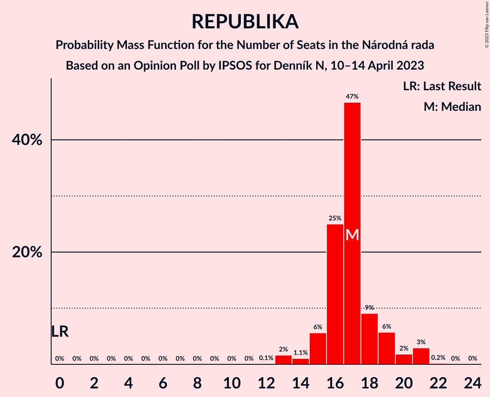

# Opinion Poll by IPSOS for Denník N, 10–14 April 2023

<a href="#voting-intentions">Voting Intentions</a> | <a href="#seats">Seats</a> | <a href="#coalitions">Coalitions</a> | <a href="#technical-information">Technical Information</a>

## Voting Intentions

### Confidence Intervals

| Party | Last Result | Poll Result | 80% Confidence Interval | 90% Confidence Interval | 95% Confidence Interval | 99% Confidence Interval |
|:-----:|:-----------:|:-----------:|:-----------------------:|:-----------------------:|:-----------------------:|:-----------------------:|
| SMER–sociálna demokracia | 18.3% | 16.8% | 15.4–18.4% |15.0–18.9% |14.6–19.3% |13.9–20.0% |
| HLAS–sociálna demokracia | 0.0% | 16.2% | 14.8–17.8% |14.4–18.2% |14.0–18.6% |13.4–19.4% |
| Progresívne Slovensko | 7.0% | 14.1% | 12.8–15.6% |12.4–16.0% |12.1–16.4% |11.5–17.1% |
| REPUBLIKA | 0.0% | 8.8% | 7.7–10.1% |7.4–10.4% |7.2–10.7% |6.7–11.4% |
| OBYČAJNÍ ĽUDIA a nezávislé osobnosti | 25.0% | 7.0% | 6.1–8.2% |5.8–8.5% |5.6–8.8% |5.2–9.3% |
| Sloboda a Solidarita | 6.2% | 6.4% | 5.5–7.5% |5.3–7.8% |5.0–8.1% |4.6–8.7% |
| SME RODINA | 8.2% | 6.4% | 5.5–7.5% |5.3–7.8% |5.0–8.1% |4.6–8.7% |
| Kresťanskodemokratické hnutie | 4.6% | 4.8% | 4.0–5.8% |3.8–6.1% |3.6–6.3% |3.3–6.8% |
| Slovenská národná strana | 3.2% | 4.2% | 3.5–5.1% |3.3–5.4% |3.1–5.6% |2.8–6.1% |
| SPOLU–Občianska Demokracia | 7.0% | 3.6% | 2.9–4.5% |2.8–4.7% |2.6–5.0% |2.3–5.4% |
| Strana maďarskej koalície–Magyar Koalíció Pártja | 3.9% | 2.4% | 1.9–3.2% |1.7–3.4% |1.6–3.6% |1.4–3.9% |
| Kotleba–Ľudová strana Naše Slovensko | 8.0% | 2.3% | 1.8–3.0% |1.6–3.2% |1.5–3.4% |1.3–3.8% |
| Za ľudí | 5.8% | 1.8% | 1.4–2.5% |1.2–2.7% |1.1–2.8% |1.0–3.2% |

*Note:* The poll result column reflects the actual value used in the calculations. Published results may vary slightly, and in addition be rounded to fewer digits.

## Seats

### Confidence Intervals

| Party | Last Result | Median | 80% Confidence Interval | 90% Confidence Interval | 95% Confidence Interval | 99% Confidence Interval |
|:-----:|:-----------:|:------:|:-----------------------:|:-----------------------:|:-----------------------:|:-----------------------:|
| <a href="#smer–sociálna-demokracia">SMER–sociálna demokracia</a> | 38 | 34 | 29–34 |29–36 |28–37 |27–40 |
| <a href="#hlas–sociálna-demokracia">HLAS–sociálna demokracia</a> | 0 | 32 | 28–34 |26–35 |26–37 |25–38 |
| <a href="#progresívne-slovensko">Progresívne Slovensko</a> | 0 | 26 | 25–31 |24–31 |23–31 |22–32 |
| <a href="#republika">REPUBLIKA</a> | 0 | 17 | 16–19 |15–20 |14–21 |13–21 |
| <a href="#obyčajní-ľudia-a-nezávislé-osobnosti">OBYČAJNÍ ĽUDIA a nezávislé osobnosti</a> | 53 | 15 | 12–17 |11–17 |10–17 |10–18 |
| <a href="#sloboda-a-solidarita">Sloboda a Solidarita</a> | 13 | 12 | 10–15 |10–16 |10–16 |0–16 |
| <a href="#sme-rodina">SME RODINA</a> | 17 | 12 | 11–13 |11–14 |10–16 |0–16 |
| <a href="#kresťanskodemokratické-hnutie">Kresťanskodemokratické hnutie</a> | 0 | 0 | 0–10 |0–11 |0–12 |0–12 |
| <a href="#slovenská-národná-strana">Slovenská národná strana</a> | 0 | 0 | 0 |0 |0–10 |0–11 |
| <a href="#spolu–občianska-demokracia">SPOLU–Občianska Demokracia</a> | 0 | 0 | 0 |0 |0 |0–10 |
| <a href="#strana-maďarskej-koalície–magyar-koalíció-pártja">Strana maďarskej koalície–Magyar Koalíció Pártja</a> | 0 | 0 | 0 |0 |0 |0 |
| <a href="#kotleba–ľudová-strana-naše-slovensko">Kotleba–Ľudová strana Naše Slovensko</a> | 17 | 0 | 0 |0 |0 |0 |
| <a href="#za-ľudí">Za ľudí</a> | 12 | 0 | 0 |0 |0 |0 |

### SMER–sociálna demokracia

*For a full overview of the results for this party, see the [SMER–sociálna demokracia](party-smer–sociálnademokracia.html) page.*

| Number of Seats | Probability | Accumulated | Special Marks |
|:---------------:|:-----------:|:-----------:|:-------------:|
| 24 | 0.1% | 100% |  |
| 25 | 0% | 99.9% |  |
| 26 | 0.4% | 99.9% |  |
| 27 | 2% | 99.5% |  |
| 28 | 3% | 98% |  |
| 29 | 7% | 95% |  |
| 30 | 5% | 88% |  |
| 31 | 8% | 83% |  |
| 32 | 4% | 75% |  |
| 33 | 17% | 70% |  |
| 34 | 44% | 53% | Median |
| 35 | 3% | 9% |  |
| 36 | 3% | 6% |  |
| 37 | 2% | 3% |  |
| 38 | 0.1% | 1.3% | Last Result |
| 39 | 0.2% | 1.2% |  |
| 40 | 0.9% | 1.0% |  |
| 41 | 0.1% | 0.1% |  |
| 42 | 0% | 0% |  |

### HLAS–sociálna demokracia

*For a full overview of the results for this party, see the [HLAS–sociálna demokracia](party-hlas–sociálnademokracia.html) page.*

| Number of Seats | Probability | Accumulated | Special Marks |
|:---------------:|:-----------:|:-----------:|:-------------:|
| 0 | 0% | 100% | Last Result |
| 1 | 0% | 100% |  |
| 2 | 0% | 100% |  |
| 3 | 0% | 100% |  |
| 4 | 0% | 100% |  |
| 5 | 0% | 100% |  |
| 6 | 0% | 100% |  |
| 7 | 0% | 100% |  |
| 8 | 0% | 100% |  |
| 9 | 0% | 100% |  |
| 10 | 0% | 100% |  |
| 11 | 0% | 100% |  |
| 12 | 0% | 100% |  |
| 13 | 0% | 100% |  |
| 14 | 0% | 100% |  |
| 15 | 0% | 100% |  |
| 16 | 0% | 100% |  |
| 17 | 0% | 100% |  |
| 18 | 0% | 100% |  |
| 19 | 0% | 100% |  |
| 20 | 0% | 100% |  |
| 21 | 0% | 100% |  |
| 22 | 0% | 100% |  |
| 23 | 0% | 100% |  |
| 24 | 0.2% | 100% |  |
| 25 | 0.3% | 99.8% |  |
| 26 | 5% | 99.4% |  |
| 27 | 4% | 94% |  |
| 28 | 4% | 91% |  |
| 29 | 6% | 87% |  |
| 30 | 7% | 81% |  |
| 31 | 4% | 74% |  |
| 32 | 45% | 70% | Median |
| 33 | 14% | 25% |  |
| 34 | 4% | 11% |  |
| 35 | 3% | 7% |  |
| 36 | 1.1% | 4% |  |
| 37 | 3% | 3% |  |
| 38 | 0.3% | 0.6% |  |
| 39 | 0.3% | 0.3% |  |
| 40 | 0% | 0% |  |

### Progresívne Slovensko

*For a full overview of the results for this party, see the [Progresívne Slovensko](party-progresívneslovensko.html) page.*

| Number of Seats | Probability | Accumulated | Special Marks |
|:---------------:|:-----------:|:-----------:|:-------------:|
| 0 | 0% | 100% | Last Result |
| 1 | 0% | 100% |  |
| 2 | 0% | 100% |  |
| 3 | 0% | 100% |  |
| 4 | 0% | 100% |  |
| 5 | 0% | 100% |  |
| 6 | 0% | 100% |  |
| 7 | 0% | 100% |  |
| 8 | 0% | 100% |  |
| 9 | 0% | 100% |  |
| 10 | 0% | 100% |  |
| 11 | 0% | 100% |  |
| 12 | 0% | 100% |  |
| 13 | 0% | 100% |  |
| 14 | 0% | 100% |  |
| 15 | 0% | 100% |  |
| 16 | 0% | 100% |  |
| 17 | 0% | 100% |  |
| 18 | 0% | 100% |  |
| 19 | 0% | 100% |  |
| 20 | 0% | 100% |  |
| 21 | 0.1% | 100% |  |
| 22 | 0.9% | 99.9% |  |
| 23 | 2% | 98.9% |  |
| 24 | 6% | 97% |  |
| 25 | 9% | 91% |  |
| 26 | 45% | 82% | Median |
| 27 | 5% | 38% |  |
| 28 | 9% | 32% |  |
| 29 | 3% | 24% |  |
| 30 | 3% | 20% |  |
| 31 | 16% | 18% |  |
| 32 | 1.1% | 1.4% |  |
| 33 | 0.1% | 0.4% |  |
| 34 | 0.2% | 0.2% |  |
| 35 | 0% | 0.1% |  |
| 36 | 0% | 0% |  |

### REPUBLIKA

*For a full overview of the results for this party, see the [REPUBLIKA](party-republika.html) page.*

| Number of Seats | Probability | Accumulated | Special Marks |
|:---------------:|:-----------:|:-----------:|:-------------:|
| 0 | 0% | 100% | Last Result |
| 1 | 0% | 100% |  |
| 2 | 0% | 100% |  |
| 3 | 0% | 100% |  |
| 4 | 0% | 100% |  |
| 5 | 0% | 100% |  |
| 6 | 0% | 100% |  |
| 7 | 0% | 100% |  |
| 8 | 0% | 100% |  |
| 9 | 0% | 100% |  |
| 10 | 0% | 100% |  |
| 11 | 0% | 100% |  |
| 12 | 0.1% | 100% |  |
| 13 | 2% | 99.9% |  |
| 14 | 1.1% | 98% |  |
| 15 | 6% | 97% |  |
| 16 | 25% | 92% |  |
| 17 | 47% | 67% | Median |
| 18 | 9% | 20% |  |
| 19 | 6% | 11% |  |
| 20 | 2% | 5% |  |
| 21 | 3% | 3% |  |
| 22 | 0.2% | 0.2% |  |
| 23 | 0% | 0.1% |  |
| 24 | 0% | 0% |  |

### OBYČAJNÍ ĽUDIA a nezávislé osobnosti

*For a full overview of the results for this party, see the [OBYČAJNÍ ĽUDIA a nezávislé osobnosti](party-obyčajníľudiaanezávisléosobnosti.html) page.*

| Number of Seats | Probability | Accumulated | Special Marks |
|:---------------:|:-----------:|:-----------:|:-------------:|
| 0 | 0.2% | 100% |  |
| 1 | 0% | 99.8% |  |
| 2 | 0% | 99.8% |  |
| 3 | 0% | 99.8% |  |
| 4 | 0% | 99.8% |  |
| 5 | 0% | 99.8% |  |
| 6 | 0% | 99.8% |  |
| 7 | 0% | 99.8% |  |
| 8 | 0% | 99.8% |  |
| 9 | 0.1% | 99.8% |  |
| 10 | 3% | 99.6% |  |
| 11 | 3% | 97% |  |
| 12 | 15% | 94% |  |
| 13 | 8% | 79% |  |
| 14 | 20% | 71% |  |
| 15 | 6% | 52% | Median |
| 16 | 2% | 46% |  |
| 17 | 43% | 44% |  |
| 18 | 0.5% | 0.7% |  |
| 19 | 0.1% | 0.1% |  |
| 20 | 0.1% | 0.1% |  |
| 21 | 0% | 0% |  |
| 22 | 0% | 0% |  |
| 23 | 0% | 0% |  |
| 24 | 0% | 0% |  |
| 25 | 0% | 0% |  |
| 26 | 0% | 0% |  |
| 27 | 0% | 0% |  |
| 28 | 0% | 0% |  |
| 29 | 0% | 0% |  |
| 30 | 0% | 0% |  |
| 31 | 0% | 0% |  |
| 32 | 0% | 0% |  |
| 33 | 0% | 0% |  |
| 34 | 0% | 0% |  |
| 35 | 0% | 0% |  |
| 36 | 0% | 0% |  |
| 37 | 0% | 0% |  |
| 38 | 0% | 0% |  |
| 39 | 0% | 0% |  |
| 40 | 0% | 0% |  |
| 41 | 0% | 0% |  |
| 42 | 0% | 0% |  |
| 43 | 0% | 0% |  |
| 44 | 0% | 0% |  |
| 45 | 0% | 0% |  |
| 46 | 0% | 0% |  |
| 47 | 0% | 0% |  |
| 48 | 0% | 0% |  |
| 49 | 0% | 0% |  |
| 50 | 0% | 0% |  |
| 51 | 0% | 0% |  |
| 52 | 0% | 0% |  |
| 53 | 0% | 0% | Last Result |

### Sloboda a Solidarita

*For a full overview of the results for this party, see the [Sloboda a Solidarita](party-slobodaasolidarita.html) page.*

| Number of Seats | Probability | Accumulated | Special Marks |
|:---------------:|:-----------:|:-----------:|:-------------:|
| 0 | 0.7% | 100% |  |
| 1 | 0% | 99.3% |  |
| 2 | 0% | 99.3% |  |
| 3 | 0% | 99.3% |  |
| 4 | 0% | 99.3% |  |
| 5 | 0% | 99.3% |  |
| 6 | 0% | 99.3% |  |
| 7 | 0% | 99.3% |  |
| 8 | 0% | 99.3% |  |
| 9 | 0.1% | 99.3% |  |
| 10 | 16% | 99.2% |  |
| 11 | 11% | 84% |  |
| 12 | 49% | 73% | Median |
| 13 | 7% | 24% | Last Result |
| 14 | 5% | 17% |  |
| 15 | 6% | 12% |  |
| 16 | 6% | 6% |  |
| 17 | 0.1% | 0.2% |  |
| 18 | 0% | 0% |  |

### SME RODINA

*For a full overview of the results for this party, see the [SME RODINA](party-smerodina.html) page.*

| Number of Seats | Probability | Accumulated | Special Marks |
|:---------------:|:-----------:|:-----------:|:-------------:|
| 0 | 1.1% | 100% |  |
| 1 | 0% | 98.9% |  |
| 2 | 0% | 98.9% |  |
| 3 | 0% | 98.9% |  |
| 4 | 0% | 98.9% |  |
| 5 | 0% | 98.9% |  |
| 6 | 0% | 98.9% |  |
| 7 | 0% | 98.9% |  |
| 8 | 0% | 98.9% |  |
| 9 | 0.2% | 98.9% |  |
| 10 | 1.5% | 98.7% |  |
| 11 | 14% | 97% |  |
| 12 | 52% | 83% | Median |
| 13 | 23% | 31% |  |
| 14 | 4% | 8% |  |
| 15 | 1.4% | 4% |  |
| 16 | 3% | 3% |  |
| 17 | 0.2% | 0.3% | Last Result |
| 18 | 0.1% | 0.1% |  |
| 19 | 0% | 0% |  |

### Kresťanskodemokratické hnutie

*For a full overview of the results for this party, see the [Kresťanskodemokratické hnutie](party-kresťanskodemokratickéhnutie.html) page.*

| Number of Seats | Probability | Accumulated | Special Marks |
|:---------------:|:-----------:|:-----------:|:-------------:|
| 0 | 79% | 100% | Last Result, Median |
| 1 | 0% | 21% |  |
| 2 | 0% | 21% |  |
| 3 | 0% | 21% |  |
| 4 | 0% | 21% |  |
| 5 | 0% | 21% |  |
| 6 | 0% | 21% |  |
| 7 | 0% | 21% |  |
| 8 | 0% | 21% |  |
| 9 | 3% | 21% |  |
| 10 | 12% | 18% |  |
| 11 | 3% | 6% |  |
| 12 | 3% | 3% |  |
| 13 | 0.3% | 0.3% |  |
| 14 | 0% | 0.1% |  |
| 15 | 0% | 0.1% |  |
| 16 | 0% | 0% |  |

### Slovenská národná strana

*For a full overview of the results for this party, see the [Slovenská národná strana](party-slovenskánárodnástrana.html) page.*

| Number of Seats | Probability | Accumulated | Special Marks |
|:---------------:|:-----------:|:-----------:|:-------------:|
| 0 | 96% | 100% | Last Result, Median |
| 1 | 0% | 4% |  |
| 2 | 0% | 4% |  |
| 3 | 0% | 4% |  |
| 4 | 0% | 4% |  |
| 5 | 0% | 4% |  |
| 6 | 0% | 4% |  |
| 7 | 0% | 4% |  |
| 8 | 0% | 4% |  |
| 9 | 0.4% | 4% |  |
| 10 | 2% | 3% |  |
| 11 | 0.7% | 0.8% |  |
| 12 | 0.1% | 0.1% |  |
| 13 | 0% | 0% |  |

### SPOLU–Občianska Demokracia

*For a full overview of the results for this party, see the [SPOLU–Občianska Demokracia](party-spolu–občianskademokracia.html) page.*

| Number of Seats | Probability | Accumulated | Special Marks |
|:---------------:|:-----------:|:-----------:|:-------------:|
| 0 | 98.9% | 100% | Last Result, Median |
| 1 | 0% | 1.1% |  |
| 2 | 0% | 1.1% |  |
| 3 | 0% | 1.1% |  |
| 4 | 0% | 1.1% |  |
| 5 | 0% | 1.1% |  |
| 6 | 0% | 1.1% |  |
| 7 | 0% | 1.1% |  |
| 8 | 0% | 1.1% |  |
| 9 | 0.2% | 1.1% |  |
| 10 | 0.6% | 0.9% |  |
| 11 | 0.3% | 0.3% |  |
| 12 | 0% | 0% |  |

### Strana maďarskej koalície–Magyar Koalíció Pártja

*For a full overview of the results for this party, see the [Strana maďarskej koalície–Magyar Koalíció Pártja](party-stranamaďarskejkoalície–magyarkoalíciópártja.html) page.*

| Number of Seats | Probability | Accumulated | Special Marks |
|:---------------:|:-----------:|:-----------:|:-------------:|
| 0 | 100% | 100% | Last Result, Median |

### Kotleba–Ľudová strana Naše Slovensko

*For a full overview of the results for this party, see the [Kotleba–Ľudová strana Naše Slovensko](party-kotleba–ľudovástrananašeslovensko.html) page.*

| Number of Seats | Probability | Accumulated | Special Marks |
|:---------------:|:-----------:|:-----------:|:-------------:|
| 0 | 100% | 100% | Median |
| 1 | 0% | 0% |  |
| 2 | 0% | 0% |  |
| 3 | 0% | 0% |  |
| 4 | 0% | 0% |  |
| 5 | 0% | 0% |  |
| 6 | 0% | 0% |  |
| 7 | 0% | 0% |  |
| 8 | 0% | 0% |  |
| 9 | 0% | 0% |  |
| 10 | 0% | 0% |  |
| 11 | 0% | 0% |  |
| 12 | 0% | 0% |  |
| 13 | 0% | 0% |  |
| 14 | 0% | 0% |  |
| 15 | 0% | 0% |  |
| 16 | 0% | 0% |  |
| 17 | 0% | 0% | Last Result |

### Za ľudí

*For a full overview of the results for this party, see the [Za ľudí](party-zaľudí.html) page.*

| Number of Seats | Probability | Accumulated | Special Marks |
|:---------------:|:-----------:|:-----------:|:-------------:|
| 0 | 100% | 100% | Median |
| 1 | 0% | 0% |  |
| 2 | 0% | 0% |  |
| 3 | 0% | 0% |  |
| 4 | 0% | 0% |  |
| 5 | 0% | 0% |  |
| 6 | 0% | 0% |  |
| 7 | 0% | 0% |  |
| 8 | 0% | 0% |  |
| 9 | 0% | 0% |  |
| 10 | 0% | 0% |  |
| 11 | 0% | 0% |  |
| 12 | 0% | 0% | Last Result |

## Coalitions

### Confidence Intervals

| Coalition | Last Result | Median | Majority? | 80% Confidence Interval | 90% Confidence Interval | 95% Confidence Interval | 99% Confidence Interval |
|:---------:|:-----------:|:------:|:---------:|:-----------------------:|:-----------------------:|:-----------------------:|:-----------------------:|
| SMER–sociálna demokracia – HLAS–sociálna demokracia – SME RODINA – Slovenská národná strana – Kotleba–Ľudová strana Naše Slovensko | 72 | 78 | 79% | 71–81 | 67–83 | 67–85 | 65–88 |
| SMER–sociálna demokracia – HLAS–sociálna demokracia – SME RODINA – Slovenská národná strana | 55 | 78 | 79% | 71–81 | 67–83 | 67–85 | 65–88 |
| SMER–sociálna demokracia – HLAS–sociálna demokracia – SME RODINA | 55 | 78 | 76% | 70–80 | 67–82 | 67–83 | 65–85 |
| SMER–sociálna demokracia – HLAS–sociálna demokracia – Slovenská národná strana | 38 | 66 | 0.1% | 59–68 | 56–71 | 55–73 | 55–75 |
| SMER–sociálna demokracia – SME RODINA – Slovenská národná strana – Kotleba–Ľudová strana Naše Slovensko | 72 | 46 | 0% | 41–48 | 41–50 | 40–51 | 33–58 |
| SMER–sociálna demokracia – SME RODINA – Slovenská národná strana | 55 | 46 | 0% | 41–48 | 41–50 | 40–51 | 33–58 |
| HLAS–sociálna demokracia – SME RODINA – Slovenská národná strana – Kotleba–Ľudová strana Naše Slovensko | 34 | 44 | 0% | 40–47 | 38–49 | 38–51 | 32–53 |
| HLAS–sociálna demokracia – SME RODINA – Slovenská národná strana | 17 | 44 | 0% | 40–47 | 38–49 | 38–51 | 32–53 |
| SMER–sociálna demokracia – SME RODINA | 55 | 46 | 0% | 41–47 | 41–49 | 40–50 | 33–51 |
| HLAS–sociálna demokracia – SME RODINA | 17 | 44 | 0% | 39–46 | 38–49 | 38–49 | 32–51 |
| SMER–sociálna demokracia – Slovenská národná strana | 38 | 34 | 0% | 29–35 | 29–37 | 28–40 | 27–45 |
| HLAS–sociálna demokracia – Slovenská národná strana | 0 | 32 | 0% | 28–35 | 26–37 | 26–39 | 26–42 |
| SMER–sociálna demokracia | 38 | 34 | 0% | 29–34 | 29–36 | 28–37 | 27–40 |

### SMER–sociálna demokracia – HLAS–sociálna demokracia – SME RODINA – Slovenská národná strana – Kotleba–Ľudová strana Naše Slovensko

| Number of Seats | Probability | Accumulated | Special Marks |
|:---------------:|:-----------:|:-----------:|:-------------:|
| 62 | 0.3% | 100% |  |
| 63 | 0% | 99.7% |  |
| 64 | 0% | 99.7% |  |
| 65 | 0.2% | 99.7% |  |
| 66 | 0.2% | 99.5% |  |
| 67 | 4% | 99.3% |  |
| 68 | 3% | 95% |  |
| 69 | 0.6% | 92% |  |
| 70 | 0.9% | 91% |  |
| 71 | 5% | 91% |  |
| 72 | 4% | 85% | Last Result |
| 73 | 0.6% | 81% |  |
| 74 | 1.0% | 81% |  |
| 75 | 1.1% | 80% |  |
| 76 | 6% | 79% | Majority |
| 77 | 5% | 73% |  |
| 78 | 42% | 68% | Median |
| 79 | 13% | 26% |  |
| 80 | 3% | 13% |  |
| 81 | 2% | 10% |  |
| 82 | 2% | 8% |  |
| 83 | 1.5% | 5% |  |
| 84 | 0.6% | 4% |  |
| 85 | 2% | 3% |  |
| 86 | 0.5% | 1.0% |  |
| 87 | 0.1% | 0.6% |  |
| 88 | 0.4% | 0.5% |  |
| 89 | 0.1% | 0.1% |  |
| 90 | 0% | 0% |  |

### SMER–sociálna demokracia – HLAS–sociálna demokracia – SME RODINA – Slovenská národná strana

| Number of Seats | Probability | Accumulated | Special Marks |
|:---------------:|:-----------:|:-----------:|:-------------:|
| 55 | 0% | 100% | Last Result |
| 56 | 0% | 100% |  |
| 57 | 0% | 100% |  |
| 58 | 0% | 100% |  |
| 59 | 0% | 100% |  |
| 60 | 0% | 100% |  |
| 61 | 0% | 100% |  |
| 62 | 0.3% | 100% |  |
| 63 | 0% | 99.7% |  |
| 64 | 0% | 99.7% |  |
| 65 | 0.2% | 99.7% |  |
| 66 | 0.2% | 99.5% |  |
| 67 | 4% | 99.3% |  |
| 68 | 3% | 95% |  |
| 69 | 0.6% | 92% |  |
| 70 | 0.9% | 91% |  |
| 71 | 5% | 91% |  |
| 72 | 4% | 85% |  |
| 73 | 0.6% | 81% |  |
| 74 | 1.0% | 81% |  |
| 75 | 1.1% | 80% |  |
| 76 | 6% | 79% | Majority |
| 77 | 5% | 73% |  |
| 78 | 42% | 68% | Median |
| 79 | 13% | 26% |  |
| 80 | 3% | 13% |  |
| 81 | 2% | 10% |  |
| 82 | 2% | 8% |  |
| 83 | 1.5% | 5% |  |
| 84 | 0.6% | 4% |  |
| 85 | 2% | 3% |  |
| 86 | 0.5% | 1.0% |  |
| 87 | 0.1% | 0.6% |  |
| 88 | 0.4% | 0.5% |  |
| 89 | 0.1% | 0.1% |  |
| 90 | 0% | 0% |  |

### SMER–sociálna demokracia – HLAS–sociálna demokracia – SME RODINA

| Number of Seats | Probability | Accumulated | Special Marks |
|:---------------:|:-----------:|:-----------:|:-------------:|
| 55 | 0% | 100% | Last Result |
| 56 | 0% | 100% |  |
| 57 | 0% | 100% |  |
| 58 | 0% | 100% |  |
| 59 | 0% | 100% |  |
| 60 | 0% | 100% |  |
| 61 | 0% | 100% |  |
| 62 | 0.3% | 100% |  |
| 63 | 0% | 99.7% |  |
| 64 | 0.1% | 99.6% |  |
| 65 | 0.3% | 99.6% |  |
| 66 | 0.4% | 99.3% |  |
| 67 | 4% | 98.9% |  |
| 68 | 3% | 94% |  |
| 69 | 0.8% | 91% |  |
| 70 | 0.9% | 91% |  |
| 71 | 5% | 90% |  |
| 72 | 5% | 84% |  |
| 73 | 0.7% | 79% |  |
| 74 | 0.9% | 79% |  |
| 75 | 2% | 78% |  |
| 76 | 6% | 76% | Majority |
| 77 | 5% | 70% |  |
| 78 | 42% | 65% | Median |
| 79 | 13% | 23% |  |
| 80 | 3% | 10% |  |
| 81 | 2% | 7% |  |
| 82 | 1.2% | 5% |  |
| 83 | 1.4% | 4% |  |
| 84 | 0.5% | 2% |  |
| 85 | 2% | 2% |  |
| 86 | 0.1% | 0.2% |  |
| 87 | 0% | 0.1% |  |
| 88 | 0.1% | 0.1% |  |
| 89 | 0% | 0.1% |  |
| 90 | 0% | 0% |  |

### SMER–sociálna demokracia – HLAS–sociálna demokracia – Slovenská národná strana

| Number of Seats | Probability | Accumulated | Special Marks |
|:---------------:|:-----------:|:-----------:|:-------------:|
| 38 | 0% | 100% | Last Result |
| 39 | 0% | 100% |  |
| 40 | 0% | 100% |  |
| 41 | 0% | 100% |  |
| 42 | 0% | 100% |  |
| 43 | 0% | 100% |  |
| 44 | 0% | 100% |  |
| 45 | 0% | 100% |  |
| 46 | 0% | 100% |  |
| 47 | 0% | 100% |  |
| 48 | 0% | 100% |  |
| 49 | 0% | 100% |  |
| 50 | 0% | 100% |  |
| 51 | 0% | 100% |  |
| 52 | 0% | 100% |  |
| 53 | 0% | 100% |  |
| 54 | 0% | 100% |  |
| 55 | 5% | 99.9% |  |
| 56 | 0.5% | 95% |  |
| 57 | 3% | 95% |  |
| 58 | 1.0% | 92% |  |
| 59 | 4% | 91% |  |
| 60 | 5% | 87% |  |
| 61 | 1.3% | 82% |  |
| 62 | 2% | 81% |  |
| 63 | 6% | 79% |  |
| 64 | 1.3% | 73% |  |
| 65 | 2% | 71% |  |
| 66 | 57% | 69% | Median |
| 67 | 1.4% | 12% |  |
| 68 | 2% | 10% |  |
| 69 | 2% | 9% |  |
| 70 | 1.3% | 7% |  |
| 71 | 2% | 6% |  |
| 72 | 0.2% | 4% |  |
| 73 | 2% | 4% |  |
| 74 | 1.2% | 2% |  |
| 75 | 0.4% | 0.6% |  |
| 76 | 0% | 0.1% | Majority |
| 77 | 0% | 0.1% |  |
| 78 | 0% | 0.1% |  |
| 79 | 0.1% | 0.1% |  |
| 80 | 0% | 0% |  |

### SMER–sociálna demokracia – SME RODINA – Slovenská národná strana – Kotleba–Ľudová strana Naše Slovensko

| Number of Seats | Probability | Accumulated | Special Marks |
|:---------------:|:-----------:|:-----------:|:-------------:|
| 29 | 0% | 100% |  |
| 30 | 0.1% | 99.9% |  |
| 31 | 0.2% | 99.9% |  |
| 32 | 0.1% | 99.7% |  |
| 33 | 0.3% | 99.5% |  |
| 34 | 0% | 99.3% |  |
| 35 | 0.2% | 99.3% |  |
| 36 | 0% | 99.0% |  |
| 37 | 0.3% | 99.0% |  |
| 38 | 0.4% | 98.7% |  |
| 39 | 0.3% | 98% |  |
| 40 | 1.3% | 98% |  |
| 41 | 8% | 97% |  |
| 42 | 7% | 89% |  |
| 43 | 4% | 82% |  |
| 44 | 3% | 78% |  |
| 45 | 3% | 74% |  |
| 46 | 57% | 72% | Median |
| 47 | 3% | 15% |  |
| 48 | 3% | 12% |  |
| 49 | 2% | 9% |  |
| 50 | 3% | 7% |  |
| 51 | 1.5% | 3% |  |
| 52 | 0.2% | 2% |  |
| 53 | 0.1% | 2% |  |
| 54 | 0.5% | 2% |  |
| 55 | 0.3% | 1.1% |  |
| 56 | 0.2% | 0.8% |  |
| 57 | 0% | 0.6% |  |
| 58 | 0.6% | 0.6% |  |
| 59 | 0% | 0% |  |
| 60 | 0% | 0% |  |
| 61 | 0% | 0% |  |
| 62 | 0% | 0% |  |
| 63 | 0% | 0% |  |
| 64 | 0% | 0% |  |
| 65 | 0% | 0% |  |
| 66 | 0% | 0% |  |
| 67 | 0% | 0% |  |
| 68 | 0% | 0% |  |
| 69 | 0% | 0% |  |
| 70 | 0% | 0% |  |
| 71 | 0% | 0% |  |
| 72 | 0% | 0% | Last Result |

### SMER–sociálna demokracia – SME RODINA – Slovenská národná strana

| Number of Seats | Probability | Accumulated | Special Marks |
|:---------------:|:-----------:|:-----------:|:-------------:|
| 29 | 0% | 100% |  |
| 30 | 0.1% | 99.9% |  |
| 31 | 0.2% | 99.9% |  |
| 32 | 0.1% | 99.7% |  |
| 33 | 0.3% | 99.5% |  |
| 34 | 0% | 99.3% |  |
| 35 | 0.2% | 99.3% |  |
| 36 | 0% | 99.0% |  |
| 37 | 0.3% | 99.0% |  |
| 38 | 0.4% | 98.7% |  |
| 39 | 0.3% | 98% |  |
| 40 | 1.3% | 98% |  |
| 41 | 8% | 97% |  |
| 42 | 7% | 89% |  |
| 43 | 4% | 82% |  |
| 44 | 3% | 78% |  |
| 45 | 3% | 74% |  |
| 46 | 57% | 72% | Median |
| 47 | 3% | 15% |  |
| 48 | 3% | 12% |  |
| 49 | 2% | 9% |  |
| 50 | 3% | 7% |  |
| 51 | 1.5% | 3% |  |
| 52 | 0.2% | 2% |  |
| 53 | 0.1% | 2% |  |
| 54 | 0.5% | 2% |  |
| 55 | 0.3% | 1.1% | Last Result |
| 56 | 0.2% | 0.8% |  |
| 57 | 0% | 0.6% |  |
| 58 | 0.6% | 0.6% |  |
| 59 | 0% | 0% |  |

### HLAS–sociálna demokracia – SME RODINA – Slovenská národná strana – Kotleba–Ľudová strana Naše Slovensko

| Number of Seats | Probability | Accumulated | Special Marks |
|:---------------:|:-----------:|:-----------:|:-------------:|
| 29 | 0.1% | 100% |  |
| 30 | 0.1% | 99.9% |  |
| 31 | 0.1% | 99.7% |  |
| 32 | 0.2% | 99.6% |  |
| 33 | 0% | 99.5% |  |
| 34 | 0% | 99.4% | Last Result |
| 35 | 0.1% | 99.4% |  |
| 36 | 0.1% | 99.3% |  |
| 37 | 0.4% | 99.2% |  |
| 38 | 7% | 98.7% |  |
| 39 | 1.1% | 92% |  |
| 40 | 6% | 91% |  |
| 41 | 2% | 85% |  |
| 42 | 2% | 83% |  |
| 43 | 8% | 81% |  |
| 44 | 43% | 73% | Median |
| 45 | 4% | 30% |  |
| 46 | 12% | 26% |  |
| 47 | 4% | 13% |  |
| 48 | 0.5% | 9% |  |
| 49 | 4% | 9% |  |
| 50 | 0.2% | 4% |  |
| 51 | 2% | 4% |  |
| 52 | 0.7% | 2% |  |
| 53 | 1.1% | 2% |  |
| 54 | 0% | 0.5% |  |
| 55 | 0.1% | 0.5% |  |
| 56 | 0.2% | 0.3% |  |
| 57 | 0.1% | 0.1% |  |
| 58 | 0% | 0% |  |

### HLAS–sociálna demokracia – SME RODINA – Slovenská národná strana

| Number of Seats | Probability | Accumulated | Special Marks |
|:---------------:|:-----------:|:-----------:|:-------------:|
| 17 | 0% | 100% | Last Result |
| 18 | 0% | 100% |  |
| 19 | 0% | 100% |  |
| 20 | 0% | 100% |  |
| 21 | 0% | 100% |  |
| 22 | 0% | 100% |  |
| 23 | 0% | 100% |  |
| 24 | 0% | 100% |  |
| 25 | 0% | 100% |  |
| 26 | 0% | 100% |  |
| 27 | 0% | 100% |  |
| 28 | 0% | 100% |  |
| 29 | 0.1% | 100% |  |
| 30 | 0.1% | 99.9% |  |
| 31 | 0.1% | 99.7% |  |
| 32 | 0.2% | 99.6% |  |
| 33 | 0% | 99.5% |  |
| 34 | 0% | 99.4% |  |
| 35 | 0.1% | 99.4% |  |
| 36 | 0.1% | 99.3% |  |
| 37 | 0.4% | 99.2% |  |
| 38 | 7% | 98.7% |  |
| 39 | 1.1% | 92% |  |
| 40 | 6% | 91% |  |
| 41 | 2% | 85% |  |
| 42 | 2% | 83% |  |
| 43 | 8% | 81% |  |
| 44 | 43% | 73% | Median |
| 45 | 4% | 30% |  |
| 46 | 12% | 26% |  |
| 47 | 4% | 13% |  |
| 48 | 0.5% | 9% |  |
| 49 | 4% | 9% |  |
| 50 | 0.2% | 4% |  |
| 51 | 2% | 4% |  |
| 52 | 0.7% | 2% |  |
| 53 | 1.1% | 2% |  |
| 54 | 0% | 0.5% |  |
| 55 | 0.1% | 0.5% |  |
| 56 | 0.2% | 0.3% |  |
| 57 | 0.1% | 0.1% |  |
| 58 | 0% | 0% |  |

### SMER–sociálna demokracia – SME RODINA

| Number of Seats | Probability | Accumulated | Special Marks |
|:---------------:|:-----------:|:-----------:|:-------------:|
| 29 | 0% | 100% |  |
| 30 | 0.1% | 99.9% |  |
| 31 | 0.2% | 99.9% |  |
| 32 | 0.1% | 99.7% |  |
| 33 | 0.3% | 99.5% |  |
| 34 | 0% | 99.3% |  |
| 35 | 0.3% | 99.2% |  |
| 36 | 0.1% | 99.0% |  |
| 37 | 0.3% | 98.9% |  |
| 38 | 0.6% | 98.6% |  |
| 39 | 0.3% | 98% |  |
| 40 | 2% | 98% |  |
| 41 | 8% | 96% |  |
| 42 | 7% | 87% |  |
| 43 | 5% | 80% |  |
| 44 | 4% | 75% |  |
| 45 | 3% | 72% |  |
| 46 | 57% | 69% | Median |
| 47 | 4% | 12% |  |
| 48 | 3% | 9% |  |
| 49 | 2% | 5% |  |
| 50 | 3% | 4% |  |
| 51 | 0.9% | 1.1% |  |
| 52 | 0.1% | 0.2% |  |
| 53 | 0% | 0.1% |  |
| 54 | 0% | 0.1% |  |
| 55 | 0.1% | 0.1% | Last Result |
| 56 | 0% | 0% |  |

### HLAS–sociálna demokracia – SME RODINA

| Number of Seats | Probability | Accumulated | Special Marks |
|:---------------:|:-----------:|:-----------:|:-------------:|
| 17 | 0% | 100% | Last Result |
| 18 | 0% | 100% |  |
| 19 | 0% | 100% |  |
| 20 | 0% | 100% |  |
| 21 | 0% | 100% |  |
| 22 | 0% | 100% |  |
| 23 | 0% | 100% |  |
| 24 | 0% | 100% |  |
| 25 | 0% | 100% |  |
| 26 | 0% | 100% |  |
| 27 | 0% | 100% |  |
| 28 | 0% | 100% |  |
| 29 | 0.1% | 100% |  |
| 30 | 0.1% | 99.8% |  |
| 31 | 0.1% | 99.7% |  |
| 32 | 0.2% | 99.6% |  |
| 33 | 0% | 99.4% |  |
| 34 | 0.1% | 99.4% |  |
| 35 | 0.1% | 99.3% |  |
| 36 | 0.2% | 99.2% |  |
| 37 | 0.5% | 99.0% |  |
| 38 | 7% | 98.5% |  |
| 39 | 1.3% | 91% |  |
| 40 | 6% | 90% |  |
| 41 | 2% | 84% |  |
| 42 | 2% | 81% |  |
| 43 | 9% | 79% |  |
| 44 | 43% | 70% | Median |
| 45 | 4% | 27% |  |
| 46 | 12% | 22% |  |
| 47 | 4% | 10% |  |
| 48 | 0.4% | 6% |  |
| 49 | 4% | 6% |  |
| 50 | 0.1% | 1.5% |  |
| 51 | 1.3% | 1.4% |  |
| 52 | 0.1% | 0.1% |  |
| 53 | 0% | 0.1% |  |
| 54 | 0% | 0% |  |

### SMER–sociálna demokracia – Slovenská národná strana

| Number of Seats | Probability | Accumulated | Special Marks |
|:---------------:|:-----------:|:-----------:|:-------------:|
| 24 | 0.1% | 100% |  |
| 25 | 0% | 99.9% |  |
| 26 | 0.3% | 99.9% |  |
| 27 | 1.5% | 99.6% |  |
| 28 | 2% | 98% |  |
| 29 | 6% | 96% |  |
| 30 | 5% | 90% |  |
| 31 | 8% | 85% |  |
| 32 | 4% | 77% |  |
| 33 | 17% | 73% |  |
| 34 | 44% | 56% | Median |
| 35 | 2% | 12% |  |
| 36 | 3% | 10% |  |
| 37 | 2% | 7% |  |
| 38 | 0.1% | 5% | Last Result |
| 39 | 1.4% | 4% |  |
| 40 | 1.4% | 3% |  |
| 41 | 0.3% | 2% |  |
| 42 | 0% | 1.3% |  |
| 43 | 0.6% | 1.3% |  |
| 44 | 0.1% | 0.7% |  |
| 45 | 0.2% | 0.6% |  |
| 46 | 0.4% | 0.4% |  |
| 47 | 0% | 0% |  |

### HLAS–sociálna demokracia – Slovenská národná strana

| Number of Seats | Probability | Accumulated | Special Marks |
|:---------------:|:-----------:|:-----------:|:-------------:|
| 0 | 0% | 100% | Last Result |
| 1 | 0% | 100% |  |
| 2 | 0% | 100% |  |
| 3 | 0% | 100% |  |
| 4 | 0% | 100% |  |
| 5 | 0% | 100% |  |
| 6 | 0% | 100% |  |
| 7 | 0% | 100% |  |
| 8 | 0% | 100% |  |
| 9 | 0% | 100% |  |
| 10 | 0% | 100% |  |
| 11 | 0% | 100% |  |
| 12 | 0% | 100% |  |
| 13 | 0% | 100% |  |
| 14 | 0% | 100% |  |
| 15 | 0% | 100% |  |
| 16 | 0% | 100% |  |
| 17 | 0% | 100% |  |
| 18 | 0% | 100% |  |
| 19 | 0% | 100% |  |
| 20 | 0% | 100% |  |
| 21 | 0% | 100% |  |
| 22 | 0% | 100% |  |
| 23 | 0% | 100% |  |
| 24 | 0.1% | 100% |  |
| 25 | 0.3% | 99.9% |  |
| 26 | 5% | 99.6% |  |
| 27 | 3% | 95% |  |
| 28 | 3% | 91% |  |
| 29 | 6% | 88% |  |
| 30 | 7% | 83% |  |
| 31 | 4% | 76% |  |
| 32 | 44% | 72% | Median |
| 33 | 14% | 28% |  |
| 34 | 4% | 14% |  |
| 35 | 3% | 10% |  |
| 36 | 1.1% | 8% |  |
| 37 | 3% | 6% |  |
| 38 | 0.5% | 3% |  |
| 39 | 0.8% | 3% |  |
| 40 | 0.4% | 2% |  |
| 41 | 0.6% | 2% |  |
| 42 | 0.9% | 1.2% |  |
| 43 | 0.1% | 0.3% |  |
| 44 | 0% | 0.1% |  |
| 45 | 0% | 0.1% |  |
| 46 | 0% | 0.1% |  |
| 47 | 0.1% | 0.1% |  |
| 48 | 0% | 0% |  |

### SMER–sociálna demokracia

| Number of Seats | Probability | Accumulated | Special Marks |
|:---------------:|:-----------:|:-----------:|:-------------:|
| 24 | 0.1% | 100% |  |
| 25 | 0% | 99.9% |  |
| 26 | 0.4% | 99.9% |  |
| 27 | 2% | 99.5% |  |
| 28 | 3% | 98% |  |
| 29 | 7% | 95% |  |
| 30 | 5% | 88% |  |
| 31 | 8% | 83% |  |
| 32 | 4% | 75% |  |
| 33 | 17% | 70% |  |
| 34 | 44% | 53% | Median |
| 35 | 3% | 9% |  |
| 36 | 3% | 6% |  |
| 37 | 2% | 3% |  |
| 38 | 0.1% | 1.3% | Last Result |
| 39 | 0.2% | 1.2% |  |
| 40 | 0.9% | 1.0% |  |
| 41 | 0.1% | 0.1% |  |
| 42 | 0% | 0% |  |

## Technical Information

### Opinion Poll

+ **Polling firm:** IPSOS
+ **Commissioner(s):** Denník N
+ **Fieldwork period:** 10–14 April 2023

### Calculations

+ **Sample size:** 1000
+ **Simulations done:** 1,048,576
+ **Error estimate:** 2.68%

