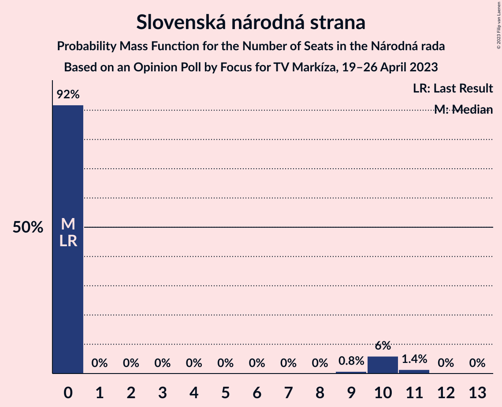

# Opinion Poll by Focus for TV Markíza, 19–26 April 2023

<a href="#voting-intentions">Voting Intentions</a> | <a href="#seats">Seats</a> | <a href="#coalitions">Coalitions</a> | <a href="#technical-information">Technical Information</a>

## Voting Intentions

### Confidence Intervals

| Party | Last Result | Poll Result | 80% Confidence Interval | 90% Confidence Interval | 95% Confidence Interval | 99% Confidence Interval |
|:-----:|:-----------:|:-----------:|:-----------------------:|:-----------------------:|:-----------------------:|:-----------------------:|
| SMER–sociálna demokracia | 18.3% | 17.7% | 16.2–19.3% |15.8–19.8% |15.4–20.1% |14.8–20.9% |
| HLAS–sociálna demokracia | 0.0% | 17.0% | 15.5–18.6% |15.1–19.0% |14.8–19.4% |14.1–20.2% |
| Progresívne Slovensko | 7.0% | 13.1% | 11.8–14.6% |11.5–15.0% |11.2–15.4% |10.6–16.1% |
| REPUBLIKA | 0.0% | 9.8% | 8.7–11.1% |8.4–11.4% |8.1–11.8% |7.6–12.4% |
| SME RODINA | 8.2% | 6.1% | 5.2–7.2% |5.0–7.5% |4.8–7.8% |4.4–8.3% |
| Kresťanskodemokratické hnutie | 4.6% | 6.0% | 5.2–7.1% |4.9–7.4% |4.7–7.7% |4.3–8.2% |
| OBYČAJNÍ ĽUDIA a nezávislé osobnosti | 25.0% | 5.6% | 4.8–6.7% |4.6–7.0% |4.4–7.2% |4.0–7.8% |
| Sloboda a Solidarita | 6.2% | 5.2% | 4.4–6.2% |4.2–6.5% |4.0–6.8% |3.7–7.3% |
| Strana maďarskej koalície–Magyar Koalíció Pártja | 3.9% | 4.3% | 3.6–5.3% |3.4–5.5% |3.2–5.8% |2.9–6.3% |
| Slovenská národná strana | 3.2% | 4.0% | 3.4–5.0% |3.2–5.2% |3.0–5.5% |2.7–5.9% |
| SPOLU–Občianska Demokracia | 7.0% | 3.6% | 2.9–4.4% |2.7–4.7% |2.6–4.9% |2.3–5.3% |
| Kotleba–Ľudová strana Naše Slovensko | 8.0% | 2.7% | 2.1–3.4% |2.0–3.7% |1.8–3.9% |1.6–4.3% |
| Dobrá voľba | 3.1% | 1.1% | 0.8–1.6% |0.7–1.8% |0.6–1.9% |0.5–2.2% |
| Za ľudí | 5.8% | 1.0% | 0.7–1.5% |0.6–1.7% |0.5–1.8% |0.4–2.1% |

*Note:* The poll result column reflects the actual value used in the calculations. Published results may vary slightly, and in addition be rounded to fewer digits.

## Seats

### Confidence Intervals

| Party | Last Result | Median | 80% Confidence Interval | 90% Confidence Interval | 95% Confidence Interval | 99% Confidence Interval |
|:-----:|:-----------:|:------:|:-----------------------:|:-----------------------:|:-----------------------:|:-----------------------:|
| <a href="#smer–sociálna-demokracia">SMER–sociálna demokracia</a> | 38 | 37 | 29–38 |28–40 |28–40 |28–45 |
| <a href="#hlas–sociálna-demokracia">HLAS–sociálna demokracia</a> | 0 | 35 | 29–40 |27–40 |27–40 |27–40 |
| <a href="#progresívne-slovensko">Progresívne Slovensko</a> | 0 | 27 | 23–28 |22–29 |20–30 |20–32 |
| <a href="#republika">REPUBLIKA</a> | 0 | 18 | 17–21 |17–21 |15–23 |14–24 |
| <a href="#sme-rodina">SME RODINA</a> | 17 | 12 | 9–14 |0–15 |0–15 |0–16 |
| <a href="#kresťanskodemokratické-hnutie">Kresťanskodemokratické hnutie</a> | 0 | 13 | 10–14 |0–14 |0–15 |0–15 |
| <a href="#obyčajní-ľudia-a-nezávislé-osobnosti">OBYČAJNÍ ĽUDIA a nezávislé osobnosti</a> | 53 | 0 | 0–12 |0–13 |0–13 |0–15 |
| <a href="#sloboda-a-solidarita">Sloboda a Solidarita</a> | 13 | 0 | 0–11 |0–11 |0–12 |0–13 |
| <a href="#strana-maďarskej-koalície–magyar-koalíció-pártja">Strana maďarskej koalície–Magyar Koalíció Pártja</a> | 0 | 0 | 0–10 |0–11 |0–12 |0–12 |
| <a href="#slovenská-národná-strana">Slovenská národná strana</a> | 0 | 0 | 0 |0–10 |0–10 |0–11 |
| <a href="#spolu–občianska-demokracia">SPOLU–Občianska Demokracia</a> | 0 | 0 | 0 |0–9 |0–9 |0–9 |
| <a href="#kotleba–ľudová-strana-naše-slovensko">Kotleba–Ľudová strana Naše Slovensko</a> | 17 | 0 | 0 |0 |0 |0 |
| <a href="#dobrá-voľba">Dobrá voľba</a> | 0 | 0 | 0 |0 |0 |0 |
| <a href="#za-ľudí">Za ľudí</a> | 12 | 0 | 0 |0 |0 |0 |

### SMER–sociálna demokracia

*For a full overview of the results for this party, see the [SMER–sociálna demokracia](party-smer–sociálnademokracia.html) page.*

| Number of Seats | Probability | Accumulated | Special Marks |
|:---------------:|:-----------:|:-----------:|:-------------:|
| 26 | 0.1% | 100% |  |
| 27 | 0.1% | 99.8% |  |
| 28 | 6% | 99.7% |  |
| 29 | 7% | 94% |  |
| 30 | 8% | 86% |  |
| 31 | 3% | 78% |  |
| 32 | 9% | 75% |  |
| 33 | 4% | 66% |  |
| 34 | 1.1% | 61% |  |
| 35 | 4% | 60% |  |
| 36 | 3% | 56% |  |
| 37 | 7% | 53% | Median |
| 38 | 37% | 46% | Last Result |
| 39 | 1.2% | 10% |  |
| 40 | 7% | 9% |  |
| 41 | 0.7% | 2% |  |
| 42 | 0.3% | 0.9% |  |
| 43 | 0% | 0.6% |  |
| 44 | 0% | 0.6% |  |
| 45 | 0.4% | 0.5% |  |
| 46 | 0.1% | 0.2% |  |
| 47 | 0% | 0% |  |

### HLAS–sociálna demokracia

*For a full overview of the results for this party, see the [HLAS–sociálna demokracia](party-hlas–sociálnademokracia.html) page.*

| Number of Seats | Probability | Accumulated | Special Marks |
|:---------------:|:-----------:|:-----------:|:-------------:|
| 0 | 0% | 100% | Last Result |
| 1 | 0% | 100% |  |
| 2 | 0% | 100% |  |
| 3 | 0% | 100% |  |
| 4 | 0% | 100% |  |
| 5 | 0% | 100% |  |
| 6 | 0% | 100% |  |
| 7 | 0% | 100% |  |
| 8 | 0% | 100% |  |
| 9 | 0% | 100% |  |
| 10 | 0% | 100% |  |
| 11 | 0% | 100% |  |
| 12 | 0% | 100% |  |
| 13 | 0% | 100% |  |
| 14 | 0% | 100% |  |
| 15 | 0% | 100% |  |
| 16 | 0% | 100% |  |
| 17 | 0% | 100% |  |
| 18 | 0% | 100% |  |
| 19 | 0% | 100% |  |
| 20 | 0% | 100% |  |
| 21 | 0% | 100% |  |
| 22 | 0% | 100% |  |
| 23 | 0.1% | 100% |  |
| 24 | 0% | 99.9% |  |
| 25 | 0% | 99.9% |  |
| 26 | 0.2% | 99.9% |  |
| 27 | 6% | 99.7% |  |
| 28 | 1.1% | 93% |  |
| 29 | 7% | 92% |  |
| 30 | 7% | 86% |  |
| 31 | 11% | 78% |  |
| 32 | 11% | 68% |  |
| 33 | 1.3% | 56% |  |
| 34 | 3% | 55% |  |
| 35 | 3% | 52% | Median |
| 36 | 0.7% | 49% |  |
| 37 | 5% | 48% |  |
| 38 | 0.1% | 43% |  |
| 39 | 0.4% | 43% |  |
| 40 | 42% | 42% |  |
| 41 | 0% | 0.1% |  |
| 42 | 0.1% | 0.1% |  |
| 43 | 0% | 0% |  |

### Progresívne Slovensko

*For a full overview of the results for this party, see the [Progresívne Slovensko](party-progresívneslovensko.html) page.*

| Number of Seats | Probability | Accumulated | Special Marks |
|:---------------:|:-----------:|:-----------:|:-------------:|
| 0 | 0% | 100% | Last Result |
| 1 | 0% | 100% |  |
| 2 | 0% | 100% |  |
| 3 | 0% | 100% |  |
| 4 | 0% | 100% |  |
| 5 | 0% | 100% |  |
| 6 | 0% | 100% |  |
| 7 | 0% | 100% |  |
| 8 | 0% | 100% |  |
| 9 | 0% | 100% |  |
| 10 | 0% | 100% |  |
| 11 | 0% | 100% |  |
| 12 | 0% | 100% |  |
| 13 | 0% | 100% |  |
| 14 | 0% | 100% |  |
| 15 | 0% | 100% |  |
| 16 | 0% | 100% |  |
| 17 | 0.1% | 100% |  |
| 18 | 0.1% | 99.9% |  |
| 19 | 0.1% | 99.8% |  |
| 20 | 2% | 99.7% |  |
| 21 | 1.0% | 97% |  |
| 22 | 3% | 96% |  |
| 23 | 7% | 93% |  |
| 24 | 17% | 86% |  |
| 25 | 9% | 69% |  |
| 26 | 9% | 60% |  |
| 27 | 2% | 51% | Median |
| 28 | 44% | 49% |  |
| 29 | 0.7% | 5% |  |
| 30 | 3% | 5% |  |
| 31 | 1.0% | 2% |  |
| 32 | 0.7% | 0.7% |  |
| 33 | 0% | 0% |  |

### REPUBLIKA

*For a full overview of the results for this party, see the [REPUBLIKA](party-republika.html) page.*

| Number of Seats | Probability | Accumulated | Special Marks |
|:---------------:|:-----------:|:-----------:|:-------------:|
| 0 | 0% | 100% | Last Result |
| 1 | 0% | 100% |  |
| 2 | 0% | 100% |  |
| 3 | 0% | 100% |  |
| 4 | 0% | 100% |  |
| 5 | 0% | 100% |  |
| 6 | 0% | 100% |  |
| 7 | 0% | 100% |  |
| 8 | 0% | 100% |  |
| 9 | 0% | 100% |  |
| 10 | 0% | 100% |  |
| 11 | 0% | 100% |  |
| 12 | 0% | 100% |  |
| 13 | 0% | 100% |  |
| 14 | 0.7% | 100% |  |
| 15 | 2% | 99.2% |  |
| 16 | 1.2% | 97% |  |
| 17 | 11% | 96% |  |
| 18 | 39% | 85% | Median |
| 19 | 16% | 46% |  |
| 20 | 8% | 30% |  |
| 21 | 18% | 22% |  |
| 22 | 2% | 4% |  |
| 23 | 0.5% | 3% |  |
| 24 | 2% | 2% |  |
| 25 | 0.3% | 0.3% |  |
| 26 | 0% | 0% |  |

### SME RODINA

*For a full overview of the results for this party, see the [SME RODINA](party-smerodina.html) page.*

| Number of Seats | Probability | Accumulated | Special Marks |
|:---------------:|:-----------:|:-----------:|:-------------:|
| 0 | 8% | 100% |  |
| 1 | 0% | 92% |  |
| 2 | 0% | 92% |  |
| 3 | 0% | 92% |  |
| 4 | 0% | 92% |  |
| 5 | 0% | 92% |  |
| 6 | 0% | 92% |  |
| 7 | 0% | 92% |  |
| 8 | 0.1% | 92% |  |
| 9 | 5% | 91% |  |
| 10 | 3% | 86% |  |
| 11 | 12% | 83% |  |
| 12 | 47% | 71% | Median |
| 13 | 5% | 24% |  |
| 14 | 9% | 19% |  |
| 15 | 9% | 9% |  |
| 16 | 0.5% | 0.6% |  |
| 17 | 0% | 0.1% | Last Result |
| 18 | 0.1% | 0.1% |  |
| 19 | 0% | 0% |  |

### Kresťanskodemokratické hnutie

*For a full overview of the results for this party, see the [Kresťanskodemokratické hnutie](party-kresťanskodemokratickéhnutie.html) page.*

| Number of Seats | Probability | Accumulated | Special Marks |
|:---------------:|:-----------:|:-----------:|:-------------:|
| 0 | 6% | 100% | Last Result |
| 1 | 0% | 94% |  |
| 2 | 0% | 94% |  |
| 3 | 0% | 94% |  |
| 4 | 0% | 94% |  |
| 5 | 0% | 94% |  |
| 6 | 0% | 94% |  |
| 7 | 0% | 94% |  |
| 8 | 0% | 94% |  |
| 9 | 0.5% | 94% |  |
| 10 | 9% | 94% |  |
| 11 | 4% | 85% |  |
| 12 | 18% | 81% |  |
| 13 | 15% | 63% | Median |
| 14 | 45% | 48% |  |
| 15 | 3% | 3% |  |
| 16 | 0.1% | 0.2% |  |
| 17 | 0.1% | 0.1% |  |
| 18 | 0% | 0% |  |

### OBYČAJNÍ ĽUDIA a nezávislé osobnosti

*For a full overview of the results for this party, see the [OBYČAJNÍ ĽUDIA a nezávislé osobnosti](party-obyčajníľudiaanezávisléosobnosti.html) page.*

| Number of Seats | Probability | Accumulated | Special Marks |
|:---------------:|:-----------:|:-----------:|:-------------:|
| 0 | 52% | 100% | Median |
| 1 | 0% | 48% |  |
| 2 | 0% | 48% |  |
| 3 | 0% | 48% |  |
| 4 | 0% | 48% |  |
| 5 | 0% | 48% |  |
| 6 | 0% | 48% |  |
| 7 | 0% | 48% |  |
| 8 | 0.1% | 48% |  |
| 9 | 6% | 48% |  |
| 10 | 16% | 42% |  |
| 11 | 10% | 26% |  |
| 12 | 10% | 16% |  |
| 13 | 4% | 6% |  |
| 14 | 2% | 2% |  |
| 15 | 0.1% | 0.5% |  |
| 16 | 0.1% | 0.4% |  |
| 17 | 0.2% | 0.3% |  |
| 18 | 0% | 0% |  |
| 19 | 0% | 0% |  |
| 20 | 0% | 0% |  |
| 21 | 0% | 0% |  |
| 22 | 0% | 0% |  |
| 23 | 0% | 0% |  |
| 24 | 0% | 0% |  |
| 25 | 0% | 0% |  |
| 26 | 0% | 0% |  |
| 27 | 0% | 0% |  |
| 28 | 0% | 0% |  |
| 29 | 0% | 0% |  |
| 30 | 0% | 0% |  |
| 31 | 0% | 0% |  |
| 32 | 0% | 0% |  |
| 33 | 0% | 0% |  |
| 34 | 0% | 0% |  |
| 35 | 0% | 0% |  |
| 36 | 0% | 0% |  |
| 37 | 0% | 0% |  |
| 38 | 0% | 0% |  |
| 39 | 0% | 0% |  |
| 40 | 0% | 0% |  |
| 41 | 0% | 0% |  |
| 42 | 0% | 0% |  |
| 43 | 0% | 0% |  |
| 44 | 0% | 0% |  |
| 45 | 0% | 0% |  |
| 46 | 0% | 0% |  |
| 47 | 0% | 0% |  |
| 48 | 0% | 0% |  |
| 49 | 0% | 0% |  |
| 50 | 0% | 0% |  |
| 51 | 0% | 0% |  |
| 52 | 0% | 0% |  |
| 53 | 0% | 0% | Last Result |

### Sloboda a Solidarita

*For a full overview of the results for this party, see the [Sloboda a Solidarita](party-slobodaasolidarita.html) page.*

| Number of Seats | Probability | Accumulated | Special Marks |
|:---------------:|:-----------:|:-----------:|:-------------:|
| 0 | 64% | 100% | Median |
| 1 | 0% | 36% |  |
| 2 | 0% | 36% |  |
| 3 | 0% | 36% |  |
| 4 | 0% | 36% |  |
| 5 | 0% | 36% |  |
| 6 | 0% | 36% |  |
| 7 | 0% | 36% |  |
| 8 | 0% | 36% |  |
| 9 | 0.2% | 36% |  |
| 10 | 16% | 36% |  |
| 11 | 17% | 20% |  |
| 12 | 1.0% | 3% |  |
| 13 | 1.4% | 2% | Last Result |
| 14 | 0.4% | 0.4% |  |
| 15 | 0% | 0% |  |

### Strana maďarskej koalície–Magyar Koalíció Pártja

*For a full overview of the results for this party, see the [Strana maďarskej koalície–Magyar Koalíció Pártja](party-stranamaďarskejkoalície–magyarkoalíciópártja.html) page.*

| Number of Seats | Probability | Accumulated | Special Marks |
|:---------------:|:-----------:|:-----------:|:-------------:|
| 0 | 90% | 100% | Last Result, Median |
| 1 | 0% | 10% |  |
| 2 | 0% | 10% |  |
| 3 | 0% | 10% |  |
| 4 | 0% | 10% |  |
| 5 | 0% | 10% |  |
| 6 | 0% | 10% |  |
| 7 | 0% | 10% |  |
| 8 | 0.1% | 10% |  |
| 9 | 0.2% | 10% |  |
| 10 | 4% | 10% |  |
| 11 | 3% | 6% |  |
| 12 | 3% | 3% |  |
| 13 | 0% | 0% |  |

### Slovenská národná strana

*For a full overview of the results for this party, see the [Slovenská národná strana](party-slovenskánárodnástrana.html) page.*

| Number of Seats | Probability | Accumulated | Special Marks |
|:---------------:|:-----------:|:-----------:|:-------------:|
| 0 | 92% | 100% | Last Result, Median |
| 1 | 0% | 8% |  |
| 2 | 0% | 8% |  |
| 3 | 0% | 8% |  |
| 4 | 0% | 8% |  |
| 5 | 0% | 8% |  |
| 6 | 0% | 8% |  |
| 7 | 0% | 8% |  |
| 8 | 0% | 8% |  |
| 9 | 0.7% | 8% |  |
| 10 | 6% | 7% |  |
| 11 | 1.4% | 1.4% |  |
| 12 | 0% | 0.1% |  |
| 13 | 0% | 0% |  |

### SPOLU–Občianska Demokracia

*For a full overview of the results for this party, see the [SPOLU–Občianska Demokracia](party-spolu–občianskademokracia.html) page.*

| Number of Seats | Probability | Accumulated | Special Marks |
|:---------------:|:-----------:|:-----------:|:-------------:|
| 0 | 94% | 100% | Last Result, Median |
| 1 | 0% | 6% |  |
| 2 | 0% | 6% |  |
| 3 | 0% | 6% |  |
| 4 | 0% | 6% |  |
| 5 | 0% | 6% |  |
| 6 | 0% | 6% |  |
| 7 | 0% | 6% |  |
| 8 | 0% | 6% |  |
| 9 | 6% | 6% |  |
| 10 | 0.2% | 0.2% |  |
| 11 | 0% | 0.1% |  |
| 12 | 0% | 0% |  |

### Kotleba–Ľudová strana Naše Slovensko

*For a full overview of the results for this party, see the [Kotleba–Ľudová strana Naše Slovensko](party-kotleba–ľudovástrananašeslovensko.html) page.*

| Number of Seats | Probability | Accumulated | Special Marks |
|:---------------:|:-----------:|:-----------:|:-------------:|
| 0 | 100% | 100% | Median |
| 1 | 0% | 0% |  |
| 2 | 0% | 0% |  |
| 3 | 0% | 0% |  |
| 4 | 0% | 0% |  |
| 5 | 0% | 0% |  |
| 6 | 0% | 0% |  |
| 7 | 0% | 0% |  |
| 8 | 0% | 0% |  |
| 9 | 0% | 0% |  |
| 10 | 0% | 0% |  |
| 11 | 0% | 0% |  |
| 12 | 0% | 0% |  |
| 13 | 0% | 0% |  |
| 14 | 0% | 0% |  |
| 15 | 0% | 0% |  |
| 16 | 0% | 0% |  |
| 17 | 0% | 0% | Last Result |

### Dobrá voľba

*For a full overview of the results for this party, see the [Dobrá voľba](party-dobrávoľba.html) page.*

| Number of Seats | Probability | Accumulated | Special Marks |
|:---------------:|:-----------:|:-----------:|:-------------:|
| 0 | 100% | 100% | Last Result, Median |

### Za ľudí

*For a full overview of the results for this party, see the [Za ľudí](party-zaľudí.html) page.*

| Number of Seats | Probability | Accumulated | Special Marks |
|:---------------:|:-----------:|:-----------:|:-------------:|
| 0 | 100% | 100% | Median |
| 1 | 0% | 0% |  |
| 2 | 0% | 0% |  |
| 3 | 0% | 0% |  |
| 4 | 0% | 0% |  |
| 5 | 0% | 0% |  |
| 6 | 0% | 0% |  |
| 7 | 0% | 0% |  |
| 8 | 0% | 0% |  |
| 9 | 0% | 0% |  |
| 10 | 0% | 0% |  |
| 11 | 0% | 0% |  |
| 12 | 0% | 0% | Last Result |

## Coalitions

### Confidence Intervals

| Coalition | Last Result | Median | Majority? | 80% Confidence Interval | 90% Confidence Interval | 95% Confidence Interval | 99% Confidence Interval |
|:---------:|:-----------:|:------:|:---------:|:-----------------------:|:-----------------------:|:-----------------------:|:-----------------------:|
| SMER–sociálna demokracia – HLAS–sociálna demokracia – SME RODINA – Slovenská národná strana – Kotleba–Ľudová strana Naše Slovensko | 72 | 83 | 75% | 68–90 | 68–90 | 68–90 | 64–90 |
| SMER–sociálna demokracia – HLAS–sociálna demokracia – SME RODINA | 55 | 82 | 69% | 68–90 | 68–90 | 68–90 | 64–90 |
| SMER–sociálna demokracia – HLAS–sociálna demokracia – SME RODINA – Slovenská národná strana | 55 | 83 | 75% | 68–90 | 68–90 | 68–90 | 64–90 |
| SMER–sociálna demokracia – HLAS–sociálna demokracia – Slovenská národná strana | 38 | 71 | 37% | 59–78 | 57–78 | 57–78 | 57–84 |
| HLAS–sociálna demokracia – SME RODINA – Slovenská národná strana – Kotleba–Ľudová strana Naše Slovensko | 34 | 51 | 0% | 38–52 | 32–55 | 32–55 | 29–57 |
| HLAS–sociálna demokracia – SME RODINA | 17 | 48 | 0% | 38–52 | 32–55 | 32–55 | 29–55 |
| HLAS–sociálna demokracia – SME RODINA – Slovenská národná strana | 17 | 51 | 0% | 38–52 | 32–55 | 32–55 | 29–57 |
| SMER–sociálna demokracia – SME RODINA – Slovenská národná strana – Kotleba–Ľudová strana Naše Slovensko | 72 | 50 | 0% | 40–51 | 37–54 | 37–54 | 35–59 |
| SMER–sociálna demokracia – SME RODINA – Slovenská národná strana | 55 | 50 | 0% | 40–51 | 37–54 | 37–54 | 35–59 |
| SMER–sociálna demokracia – SME RODINA | 55 | 48 | 0% | 40–50 | 37–51 | 37–51 | 35–54 |
| SMER–sociálna demokracia – Slovenská národná strana | 38 | 38 | 0% | 29–40 | 28–42 | 28–42 | 28–50 |
| SMER–sociálna demokracia | 38 | 37 | 0% | 29–38 | 28–40 | 28–40 | 28–45 |
| HLAS–sociálna demokracia – Slovenská národná strana | 0 | 39 | 0% | 30–40 | 27–40 | 27–40 | 27–46 |

### SMER–sociálna demokracia – HLAS–sociálna demokracia – SME RODINA – Slovenská národná strana – Kotleba–Ľudová strana Naše Slovensko

| Number of Seats | Probability | Accumulated | Special Marks |
|:---------------:|:-----------:|:-----------:|:-------------:|
| 63 | 0.1% | 100% |  |
| 64 | 0.6% | 99.9% |  |
| 65 | 0.1% | 99.3% |  |
| 66 | 0.1% | 99.2% |  |
| 67 | 0.1% | 99.1% |  |
| 68 | 11% | 99.0% |  |
| 69 | 0.1% | 88% |  |
| 70 | 0.3% | 88% |  |
| 71 | 2% | 88% |  |
| 72 | 8% | 86% | Last Result |
| 73 | 0.5% | 78% |  |
| 74 | 1.3% | 77% |  |
| 75 | 0.4% | 76% |  |
| 76 | 1.2% | 75% | Majority |
| 77 | 2% | 74% |  |
| 78 | 2% | 72% |  |
| 79 | 2% | 70% |  |
| 80 | 4% | 68% |  |
| 81 | 7% | 65% |  |
| 82 | 1.0% | 58% |  |
| 83 | 8% | 57% |  |
| 84 | 7% | 49% | Median |
| 85 | 0.4% | 42% |  |
| 86 | 0.7% | 42% |  |
| 87 | 3% | 41% |  |
| 88 | 0.2% | 38% |  |
| 89 | 0.5% | 38% |  |
| 90 | 37% | 37% |  |
| 91 | 0.1% | 0.4% |  |
| 92 | 0.2% | 0.3% |  |
| 93 | 0% | 0.2% |  |
| 94 | 0.1% | 0.1% |  |
| 95 | 0% | 0% |  |

### SMER–sociálna demokracia – HLAS–sociálna demokracia – SME RODINA

| Number of Seats | Probability | Accumulated | Special Marks |
|:---------------:|:-----------:|:-----------:|:-------------:|
| 55 | 0% | 100% | Last Result |
| 56 | 0% | 100% |  |
| 57 | 0% | 100% |  |
| 58 | 0% | 100% |  |
| 59 | 0% | 100% |  |
| 60 | 0% | 100% |  |
| 61 | 0% | 100% |  |
| 62 | 0% | 100% |  |
| 63 | 0.1% | 100% |  |
| 64 | 0.7% | 99.9% |  |
| 65 | 0.1% | 99.2% |  |
| 66 | 0.1% | 99.1% |  |
| 67 | 0.1% | 99.0% |  |
| 68 | 11% | 98.9% |  |
| 69 | 0.3% | 88% |  |
| 70 | 0.3% | 87% |  |
| 71 | 2% | 87% |  |
| 72 | 8% | 85% |  |
| 73 | 6% | 77% |  |
| 74 | 1.3% | 71% |  |
| 75 | 0.4% | 70% |  |
| 76 | 2% | 69% | Majority |
| 77 | 2% | 68% |  |
| 78 | 2% | 65% |  |
| 79 | 3% | 63% |  |
| 80 | 4% | 61% |  |
| 81 | 6% | 57% |  |
| 82 | 1.0% | 51% |  |
| 83 | 2% | 50% |  |
| 84 | 7% | 47% | Median |
| 85 | 0.4% | 40% |  |
| 86 | 0.6% | 40% |  |
| 87 | 2% | 39% |  |
| 88 | 0.1% | 37% |  |
| 89 | 0.5% | 37% |  |
| 90 | 36% | 36% |  |
| 91 | 0% | 0.2% |  |
| 92 | 0.2% | 0.2% |  |
| 93 | 0% | 0.1% |  |
| 94 | 0% | 0% |  |

### SMER–sociálna demokracia – HLAS–sociálna demokracia – SME RODINA – Slovenská národná strana

| Number of Seats | Probability | Accumulated | Special Marks |
|:---------------:|:-----------:|:-----------:|:-------------:|
| 55 | 0% | 100% | Last Result |
| 56 | 0% | 100% |  |
| 57 | 0% | 100% |  |
| 58 | 0% | 100% |  |
| 59 | 0% | 100% |  |
| 60 | 0% | 100% |  |
| 61 | 0% | 100% |  |
| 62 | 0% | 100% |  |
| 63 | 0.1% | 100% |  |
| 64 | 0.6% | 99.9% |  |
| 65 | 0.1% | 99.3% |  |
| 66 | 0.1% | 99.2% |  |
| 67 | 0.1% | 99.1% |  |
| 68 | 11% | 99.0% |  |
| 69 | 0.1% | 88% |  |
| 70 | 0.3% | 88% |  |
| 71 | 2% | 88% |  |
| 72 | 8% | 86% |  |
| 73 | 0.5% | 78% |  |
| 74 | 1.3% | 77% |  |
| 75 | 0.4% | 76% |  |
| 76 | 1.2% | 75% | Majority |
| 77 | 2% | 74% |  |
| 78 | 2% | 72% |  |
| 79 | 2% | 70% |  |
| 80 | 4% | 68% |  |
| 81 | 7% | 65% |  |
| 82 | 1.0% | 58% |  |
| 83 | 8% | 57% |  |
| 84 | 7% | 49% | Median |
| 85 | 0.4% | 42% |  |
| 86 | 0.7% | 42% |  |
| 87 | 3% | 41% |  |
| 88 | 0.2% | 38% |  |
| 89 | 0.5% | 38% |  |
| 90 | 37% | 37% |  |
| 91 | 0.1% | 0.4% |  |
| 92 | 0.2% | 0.3% |  |
| 93 | 0% | 0.2% |  |
| 94 | 0.1% | 0.1% |  |
| 95 | 0% | 0% |  |

### SMER–sociálna demokracia – HLAS–sociálna demokracia – Slovenská národná strana

| Number of Seats | Probability | Accumulated | Special Marks |
|:---------------:|:-----------:|:-----------:|:-------------:|
| 38 | 0% | 100% | Last Result |
| 39 | 0% | 100% |  |
| 40 | 0% | 100% |  |
| 41 | 0% | 100% |  |
| 42 | 0% | 100% |  |
| 43 | 0% | 100% |  |
| 44 | 0% | 100% |  |
| 45 | 0% | 100% |  |
| 46 | 0% | 100% |  |
| 47 | 0% | 100% |  |
| 48 | 0% | 100% |  |
| 49 | 0% | 100% |  |
| 50 | 0% | 100% |  |
| 51 | 0% | 100% |  |
| 52 | 0% | 100% |  |
| 53 | 0.1% | 100% |  |
| 54 | 0.2% | 99.9% |  |
| 55 | 0% | 99.8% |  |
| 56 | 0.1% | 99.8% |  |
| 57 | 6% | 99.6% |  |
| 58 | 0.1% | 94% |  |
| 59 | 7% | 94% |  |
| 60 | 0.2% | 87% |  |
| 61 | 1.5% | 87% |  |
| 62 | 0.3% | 85% |  |
| 63 | 2% | 85% |  |
| 64 | 1.2% | 83% |  |
| 65 | 3% | 82% |  |
| 66 | 1.3% | 79% |  |
| 67 | 10% | 78% |  |
| 68 | 2% | 68% |  |
| 69 | 8% | 66% |  |
| 70 | 2% | 58% |  |
| 71 | 6% | 56% |  |
| 72 | 7% | 50% | Median |
| 73 | 4% | 43% |  |
| 74 | 0.1% | 39% |  |
| 75 | 1.2% | 39% |  |
| 76 | 0.5% | 37% | Majority |
| 77 | 0.1% | 37% |  |
| 78 | 36% | 37% |  |
| 79 | 0.1% | 0.9% |  |
| 80 | 0.3% | 0.9% |  |
| 81 | 0% | 0.6% |  |
| 82 | 0.1% | 0.6% |  |
| 83 | 0% | 0.5% |  |
| 84 | 0.1% | 0.5% |  |
| 85 | 0% | 0.4% |  |
| 86 | 0% | 0.4% |  |
| 87 | 0.4% | 0.4% |  |
| 88 | 0% | 0% |  |

### HLAS–sociálna demokracia – SME RODINA – Slovenská národná strana – Kotleba–Ľudová strana Naše Slovensko

| Number of Seats | Probability | Accumulated | Special Marks |
|:---------------:|:-----------:|:-----------:|:-------------:|
| 29 | 0.6% | 100% |  |
| 30 | 0% | 99.4% |  |
| 31 | 0.1% | 99.4% |  |
| 32 | 7% | 99.4% |  |
| 33 | 0% | 93% |  |
| 34 | 0.2% | 93% | Last Result |
| 35 | 0.1% | 92% |  |
| 36 | 0.1% | 92% |  |
| 37 | 0.2% | 92% |  |
| 38 | 6% | 92% |  |
| 39 | 0.4% | 86% |  |
| 40 | 6% | 86% |  |
| 41 | 0.7% | 79% |  |
| 42 | 2% | 79% |  |
| 43 | 3% | 76% |  |
| 44 | 10% | 73% |  |
| 45 | 4% | 64% |  |
| 46 | 1.4% | 60% |  |
| 47 | 0.7% | 59% | Median |
| 48 | 3% | 58% |  |
| 49 | 0.9% | 55% |  |
| 50 | 2% | 54% |  |
| 51 | 8% | 52% |  |
| 52 | 35% | 44% |  |
| 53 | 0.1% | 9% |  |
| 54 | 0.3% | 9% |  |
| 55 | 7% | 8% |  |
| 56 | 0.1% | 1.1% |  |
| 57 | 0.9% | 1.1% |  |
| 58 | 0.2% | 0.2% |  |
| 59 | 0% | 0.1% |  |
| 60 | 0% | 0% |  |

### HLAS–sociálna demokracia – SME RODINA

| Number of Seats | Probability | Accumulated | Special Marks |
|:---------------:|:-----------:|:-----------:|:-------------:|
| 17 | 0% | 100% | Last Result |
| 18 | 0% | 100% |  |
| 19 | 0% | 100% |  |
| 20 | 0% | 100% |  |
| 21 | 0% | 100% |  |
| 22 | 0% | 100% |  |
| 23 | 0% | 100% |  |
| 24 | 0% | 100% |  |
| 25 | 0% | 100% |  |
| 26 | 0% | 100% |  |
| 27 | 0% | 100% |  |
| 28 | 0% | 100% |  |
| 29 | 0.6% | 100% |  |
| 30 | 0% | 99.4% |  |
| 31 | 0.1% | 99.4% |  |
| 32 | 7% | 99.3% |  |
| 33 | 0% | 93% |  |
| 34 | 0.2% | 92% |  |
| 35 | 0.1% | 92% |  |
| 36 | 0.1% | 92% |  |
| 37 | 0.7% | 92% |  |
| 38 | 6% | 91% |  |
| 39 | 0.6% | 85% |  |
| 40 | 6% | 85% |  |
| 41 | 6% | 79% |  |
| 42 | 3% | 72% |  |
| 43 | 3% | 70% |  |
| 44 | 10% | 67% |  |
| 45 | 4% | 57% |  |
| 46 | 2% | 53% |  |
| 47 | 0.7% | 51% | Median |
| 48 | 2% | 50% |  |
| 49 | 0.9% | 48% |  |
| 50 | 2% | 47% |  |
| 51 | 2% | 45% |  |
| 52 | 35% | 43% |  |
| 53 | 0.1% | 7% |  |
| 54 | 0% | 7% |  |
| 55 | 7% | 7% |  |
| 56 | 0% | 0% |  |

### HLAS–sociálna demokracia – SME RODINA – Slovenská národná strana

| Number of Seats | Probability | Accumulated | Special Marks |
|:---------------:|:-----------:|:-----------:|:-------------:|
| 17 | 0% | 100% | Last Result |
| 18 | 0% | 100% |  |
| 19 | 0% | 100% |  |
| 20 | 0% | 100% |  |
| 21 | 0% | 100% |  |
| 22 | 0% | 100% |  |
| 23 | 0% | 100% |  |
| 24 | 0% | 100% |  |
| 25 | 0% | 100% |  |
| 26 | 0% | 100% |  |
| 27 | 0% | 100% |  |
| 28 | 0% | 100% |  |
| 29 | 0.6% | 100% |  |
| 30 | 0% | 99.4% |  |
| 31 | 0.1% | 99.4% |  |
| 32 | 7% | 99.4% |  |
| 33 | 0% | 93% |  |
| 34 | 0.2% | 93% |  |
| 35 | 0.1% | 92% |  |
| 36 | 0.1% | 92% |  |
| 37 | 0.2% | 92% |  |
| 38 | 6% | 92% |  |
| 39 | 0.4% | 86% |  |
| 40 | 6% | 86% |  |
| 41 | 0.7% | 79% |  |
| 42 | 2% | 79% |  |
| 43 | 3% | 76% |  |
| 44 | 10% | 73% |  |
| 45 | 4% | 64% |  |
| 46 | 1.4% | 60% |  |
| 47 | 0.7% | 59% | Median |
| 48 | 3% | 58% |  |
| 49 | 0.9% | 55% |  |
| 50 | 2% | 54% |  |
| 51 | 8% | 52% |  |
| 52 | 35% | 44% |  |
| 53 | 0.1% | 9% |  |
| 54 | 0.3% | 9% |  |
| 55 | 7% | 8% |  |
| 56 | 0.1% | 1.1% |  |
| 57 | 0.9% | 1.1% |  |
| 58 | 0.2% | 0.2% |  |
| 59 | 0% | 0.1% |  |
| 60 | 0% | 0% |  |

### SMER–sociálna demokracia – SME RODINA – Slovenská národná strana – Kotleba–Ľudová strana Naše Slovensko

| Number of Seats | Probability | Accumulated | Special Marks |
|:---------------:|:-----------:|:-----------:|:-------------:|
| 31 | 0.1% | 100% |  |
| 32 | 0% | 99.9% |  |
| 33 | 0% | 99.9% |  |
| 34 | 0% | 99.9% |  |
| 35 | 0.6% | 99.8% |  |
| 36 | 0.2% | 99.2% |  |
| 37 | 5% | 99.0% |  |
| 38 | 0.1% | 94% |  |
| 39 | 0.2% | 94% |  |
| 40 | 8% | 93% |  |
| 41 | 7% | 85% |  |
| 42 | 1.5% | 78% |  |
| 43 | 4% | 77% |  |
| 44 | 7% | 72% |  |
| 45 | 2% | 65% |  |
| 46 | 2% | 63% |  |
| 47 | 3% | 61% |  |
| 48 | 1.0% | 58% |  |
| 49 | 2% | 57% | Median |
| 50 | 40% | 55% |  |
| 51 | 6% | 15% |  |
| 52 | 0.8% | 9% |  |
| 53 | 0.8% | 8% |  |
| 54 | 6% | 7% |  |
| 55 | 0% | 2% |  |
| 56 | 0.1% | 2% |  |
| 57 | 0% | 2% |  |
| 58 | 0.4% | 2% |  |
| 59 | 1.1% | 1.2% |  |
| 60 | 0% | 0.1% |  |
| 61 | 0% | 0.1% |  |
| 62 | 0.1% | 0.1% |  |
| 63 | 0% | 0% |  |
| 64 | 0% | 0% |  |
| 65 | 0% | 0% |  |
| 66 | 0% | 0% |  |
| 67 | 0% | 0% |  |
| 68 | 0% | 0% |  |
| 69 | 0% | 0% |  |
| 70 | 0% | 0% |  |
| 71 | 0% | 0% |  |
| 72 | 0% | 0% | Last Result |

### SMER–sociálna demokracia – SME RODINA – Slovenská národná strana

| Number of Seats | Probability | Accumulated | Special Marks |
|:---------------:|:-----------:|:-----------:|:-------------:|
| 31 | 0.1% | 100% |  |
| 32 | 0% | 99.9% |  |
| 33 | 0% | 99.9% |  |
| 34 | 0% | 99.9% |  |
| 35 | 0.6% | 99.8% |  |
| 36 | 0.2% | 99.2% |  |
| 37 | 5% | 99.0% |  |
| 38 | 0.1% | 94% |  |
| 39 | 0.2% | 94% |  |
| 40 | 8% | 93% |  |
| 41 | 7% | 85% |  |
| 42 | 1.5% | 78% |  |
| 43 | 4% | 77% |  |
| 44 | 7% | 72% |  |
| 45 | 2% | 65% |  |
| 46 | 2% | 63% |  |
| 47 | 3% | 61% |  |
| 48 | 1.0% | 58% |  |
| 49 | 2% | 57% | Median |
| 50 | 40% | 55% |  |
| 51 | 6% | 15% |  |
| 52 | 0.8% | 9% |  |
| 53 | 0.7% | 8% |  |
| 54 | 6% | 7% |  |
| 55 | 0% | 2% | Last Result |
| 56 | 0.1% | 2% |  |
| 57 | 0% | 2% |  |
| 58 | 0.4% | 2% |  |
| 59 | 1.1% | 1.2% |  |
| 60 | 0% | 0.1% |  |
| 61 | 0% | 0.1% |  |
| 62 | 0.1% | 0.1% |  |
| 63 | 0% | 0% |  |

### SMER–sociálna demokracia – SME RODINA

| Number of Seats | Probability | Accumulated | Special Marks |
|:---------------:|:-----------:|:-----------:|:-------------:|
| 31 | 0.1% | 100% |  |
| 32 | 0% | 99.9% |  |
| 33 | 0.1% | 99.9% |  |
| 34 | 0% | 99.8% |  |
| 35 | 0.6% | 99.8% |  |
| 36 | 0.3% | 99.2% |  |
| 37 | 5% | 98.9% |  |
| 38 | 0.1% | 94% |  |
| 39 | 0.7% | 93% |  |
| 40 | 8% | 93% |  |
| 41 | 8% | 85% |  |
| 42 | 2% | 77% |  |
| 43 | 4% | 75% |  |
| 44 | 13% | 71% |  |
| 45 | 3% | 58% |  |
| 46 | 2% | 56% |  |
| 47 | 3% | 54% |  |
| 48 | 2% | 51% |  |
| 49 | 2% | 49% | Median |
| 50 | 39% | 47% |  |
| 51 | 6% | 8% |  |
| 52 | 0.8% | 2% |  |
| 53 | 0.6% | 1.3% |  |
| 54 | 0.2% | 0.7% |  |
| 55 | 0% | 0.5% | Last Result |
| 56 | 0% | 0.5% |  |
| 57 | 0% | 0.4% |  |
| 58 | 0.1% | 0.4% |  |
| 59 | 0.3% | 0.3% |  |
| 60 | 0% | 0% |  |

### SMER–sociálna demokracia – Slovenská národná strana

| Number of Seats | Probability | Accumulated | Special Marks |
|:---------------:|:-----------:|:-----------:|:-------------:|
| 26 | 0.1% | 100% |  |
| 27 | 0.1% | 99.9% |  |
| 28 | 6% | 99.8% |  |
| 29 | 7% | 94% |  |
| 30 | 7% | 86% |  |
| 31 | 3% | 79% |  |
| 32 | 4% | 76% |  |
| 33 | 3% | 72% |  |
| 34 | 1.1% | 69% |  |
| 35 | 4% | 68% |  |
| 36 | 3% | 64% |  |
| 37 | 7% | 61% | Median |
| 38 | 37% | 54% | Last Result |
| 39 | 1.2% | 17% |  |
| 40 | 7% | 16% |  |
| 41 | 0.8% | 9% |  |
| 42 | 6% | 8% |  |
| 43 | 0.1% | 2% |  |
| 44 | 0.9% | 2% |  |
| 45 | 0.4% | 1.2% |  |
| 46 | 0.2% | 0.8% |  |
| 47 | 0.1% | 0.6% |  |
| 48 | 0% | 0.5% |  |
| 49 | 0% | 0.5% |  |
| 50 | 0.5% | 0.5% |  |
| 51 | 0% | 0% |  |

### SMER–sociálna demokracia

| Number of Seats | Probability | Accumulated | Special Marks |
|:---------------:|:-----------:|:-----------:|:-------------:|
| 26 | 0.1% | 100% |  |
| 27 | 0.1% | 99.8% |  |
| 28 | 6% | 99.7% |  |
| 29 | 7% | 94% |  |
| 30 | 8% | 86% |  |
| 31 | 3% | 78% |  |
| 32 | 9% | 75% |  |
| 33 | 4% | 66% |  |
| 34 | 1.1% | 61% |  |
| 35 | 4% | 60% |  |
| 36 | 3% | 56% |  |
| 37 | 7% | 53% | Median |
| 38 | 37% | 46% | Last Result |
| 39 | 1.2% | 10% |  |
| 40 | 7% | 9% |  |
| 41 | 0.7% | 2% |  |
| 42 | 0.3% | 0.9% |  |
| 43 | 0% | 0.6% |  |
| 44 | 0% | 0.6% |  |
| 45 | 0.4% | 0.5% |  |
| 46 | 0.1% | 0.2% |  |
| 47 | 0% | 0% |  |

### HLAS–sociálna demokracia – Slovenská národná strana

| Number of Seats | Probability | Accumulated | Special Marks |
|:---------------:|:-----------:|:-----------:|:-------------:|
| 0 | 0% | 100% | Last Result |
| 1 | 0% | 100% |  |
| 2 | 0% | 100% |  |
| 3 | 0% | 100% |  |
| 4 | 0% | 100% |  |
| 5 | 0% | 100% |  |
| 6 | 0% | 100% |  |
| 7 | 0% | 100% |  |
| 8 | 0% | 100% |  |
| 9 | 0% | 100% |  |
| 10 | 0% | 100% |  |
| 11 | 0% | 100% |  |
| 12 | 0% | 100% |  |
| 13 | 0% | 100% |  |
| 14 | 0% | 100% |  |
| 15 | 0% | 100% |  |
| 16 | 0% | 100% |  |
| 17 | 0% | 100% |  |
| 18 | 0% | 100% |  |
| 19 | 0% | 100% |  |
| 20 | 0% | 100% |  |
| 21 | 0% | 100% |  |
| 22 | 0% | 100% |  |
| 23 | 0% | 100% |  |
| 24 | 0% | 100% |  |
| 25 | 0% | 99.9% |  |
| 26 | 0.2% | 99.9% |  |
| 27 | 6% | 99.7% |  |
| 28 | 0.9% | 94% |  |
| 29 | 0.8% | 93% |  |
| 30 | 7% | 92% |  |
| 31 | 10% | 85% |  |
| 32 | 11% | 75% |  |
| 33 | 1.3% | 64% |  |
| 34 | 3% | 63% |  |
| 35 | 3% | 60% | Median |
| 36 | 0.7% | 56% |  |
| 37 | 5% | 56% |  |
| 38 | 0.4% | 51% |  |
| 39 | 6% | 50% |  |
| 40 | 42% | 44% |  |
| 41 | 0.1% | 2% |  |
| 42 | 0.9% | 2% |  |
| 43 | 0% | 0.8% |  |
| 44 | 0.1% | 0.8% |  |
| 45 | 0.2% | 0.7% |  |
| 46 | 0.1% | 0.5% |  |
| 47 | 0% | 0.4% |  |
| 48 | 0.4% | 0.4% |  |
| 49 | 0% | 0% |  |

## Technical Information

### Opinion Poll

+ **Polling firm:** Focus
+ **Commissioner(s):** TV Markíza
+ **Fieldwork period:** 19–26 April 2023

### Calculations

+ **Sample size:** 1013
+ **Simulations done:** 1,048,576
+ **Error estimate:** 4.27%

