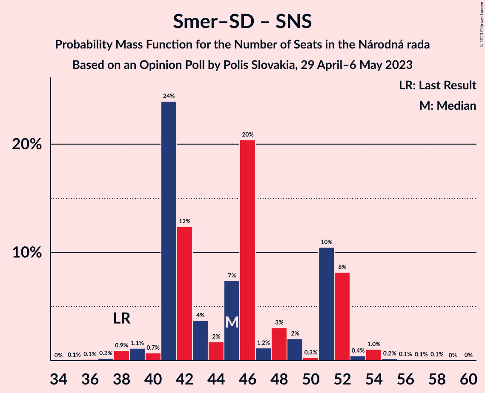

# Opinion Poll by Polis Slovakia, 29 April–6 May 2023

<a href="#voting-intentions">Voting Intentions</a> | <a href="#seats">Seats</a> | <a href="#coalitions">Coalitions</a> | <a href="#technical-information">Technical Information</a>

## Voting Intentions

### Confidence Intervals

| Party | Last Result | Poll Result | 80% Confidence Interval | 90% Confidence Interval | 95% Confidence Interval | 99% Confidence Interval |
|:-----:|:-----------:|:-----------:|:-----------------------:|:-----------------------:|:-----------------------:|:-----------------------:|
| SMER–sociálna demokracia | 18.3% | 24.2% | 22.6–26.0% |22.1–26.5% |21.7–27.0% |20.9–27.8% |
| HLAS–sociálna demokracia | 0.0% | 17.0% | 15.6–18.6% |15.2–19.1% |14.8–19.5% |14.1–20.2% |
| Progresívne Slovensko | 7.0% | 11.7% | 10.5–13.1% |10.1–13.5% |9.8–13.8% |9.3–14.5% |
| REPUBLIKA | 0.0% | 7.2% | 6.3–8.4% |6.0–8.7% |5.8–9.0% |5.3–9.6% |
| SME RODINA | 8.2% | 6.9% | 6.0–8.1% |5.7–8.4% |5.5–8.7% |5.1–9.2% |
| OBYČAJNÍ ĽUDIA a nezávislé osobnosti | 25.0% | 6.6% | 5.7–7.7% |5.5–8.1% |5.2–8.3% |4.8–8.9% |
| Sloboda a Solidarita | 6.2% | 6.5% | 5.6–7.6% |5.4–8.0% |5.2–8.2% |4.8–8.8% |
| Kresťanskodemokratické hnutie | 4.6% | 5.8% | 5.0–6.9% |4.7–7.2% |4.5–7.5% |4.2–8.0% |
| Slovenská národná strana | 3.2% | 4.9% | 4.2–5.9% |3.9–6.2% |3.8–6.5% |3.4–7.0% |
| Strana maďarskej koalície–Magyar Koalíció Pártja | 3.9% | 3.0% | 2.4–3.8% |2.2–4.0% |2.1–4.2% |1.8–4.6% |
| Kotleba–Ľudová strana Naše Slovensko | 8.0% | 2.4% | 1.9–3.1% |1.7–3.3% |1.6–3.5% |1.4–3.9% |
| SPOLU–Občianska Demokracia | 7.0% | 2.1% | 1.6–2.8% |1.5–3.0% |1.4–3.2% |1.2–3.5% |
| Za ľudí | 5.8% | 1.0% | 0.7–1.5% |0.6–1.7% |0.5–1.8% |0.4–2.1% |

*Note:* The poll result column reflects the actual value used in the calculations. Published results may vary slightly, and in addition be rounded to fewer digits.

## Seats

### Confidence Intervals

| Party | Last Result | Median | 80% Confidence Interval | 90% Confidence Interval | 95% Confidence Interval | 99% Confidence Interval |
|:-----:|:-----------:|:------:|:-----------------------:|:-----------------------:|:-----------------------:|:-----------------------:|
| <a href="#smer–sociálna-demokracia">SMER–sociálna demokracia</a> | 38 | 41 | 38–44 |37–45 |37–47 |36–49 |
| <a href="#hlas–sociálna-demokracia">HLAS–sociálna demokracia</a> | 0 | 30 | 28–33 |26–33 |25–33 |23–34 |
| <a href="#progresívne-slovensko">Progresívne Slovensko</a> | 0 | 19 | 17–21 |16–22 |16–24 |16–25 |
| <a href="#republika">REPUBLIKA</a> | 0 | 12 | 10–14 |10–14 |9–15 |9–17 |
| <a href="#sme-rodina">SME RODINA</a> | 17 | 12 | 10–14 |10–14 |9–14 |0–16 |
| <a href="#obyčajní-ľudia-a-nezávislé-osobnosti">OBYČAJNÍ ĽUDIA a nezávislé osobnosti</a> | 53 | 12 | 9–14 |9–14 |9–14 |0–15 |
| <a href="#sloboda-a-solidarita">Sloboda a Solidarita</a> | 13 | 12 | 10–13 |10–14 |9–14 |0–16 |
| <a href="#kresťanskodemokratické-hnutie">Kresťanskodemokratické hnutie</a> | 0 | 10 | 0–11 |0–12 |0–12 |0–14 |
| <a href="#slovenská-národná-strana">Slovenská národná strana</a> | 0 | 0 | 0–10 |0–10 |0–10 |0–11 |
| <a href="#strana-maďarskej-koalície–magyar-koalíció-pártja">Strana maďarskej koalície–Magyar Koalíció Pártja</a> | 0 | 0 | 0 |0 |0 |0 |
| <a href="#kotleba–ľudová-strana-naše-slovensko">Kotleba–Ľudová strana Naše Slovensko</a> | 17 | 0 | 0 |0 |0 |0 |
| <a href="#spolu–občianska-demokracia">SPOLU–Občianska Demokracia</a> | 0 | 0 | 0 |0 |0 |0 |
| <a href="#za-ľudí">Za ľudí</a> | 12 | 0 | 0 |0 |0 |0 |

### SMER–sociálna demokracia

*For a full overview of the results for this party, see the [SMER–sociálna demokracia](party-smer–sociálnademokracia.html) page.*

| Number of Seats | Probability | Accumulated | Special Marks |
|:---------------:|:-----------:|:-----------:|:-------------:|
| 34 | 0.1% | 100% |  |
| 35 | 0.2% | 99.8% |  |
| 36 | 0.6% | 99.7% |  |
| 37 | 4% | 99.1% |  |
| 38 | 21% | 95% | Last Result |
| 39 | 2% | 74% |  |
| 40 | 2% | 72% |  |
| 41 | 32% | 70% | Median |
| 42 | 22% | 38% |  |
| 43 | 4% | 16% |  |
| 44 | 2% | 12% |  |
| 45 | 6% | 10% |  |
| 46 | 0.5% | 3% |  |
| 47 | 0.8% | 3% |  |
| 48 | 0.6% | 2% |  |
| 49 | 1.3% | 2% |  |
| 50 | 0.1% | 0.2% |  |
| 51 | 0% | 0.1% |  |
| 52 | 0% | 0% |  |

### HLAS–sociálna demokracia

*For a full overview of the results for this party, see the [HLAS–sociálna demokracia](party-hlas–sociálnademokracia.html) page.*

| Number of Seats | Probability | Accumulated | Special Marks |
|:---------------:|:-----------:|:-----------:|:-------------:|
| 0 | 0% | 100% | Last Result |
| 1 | 0% | 100% |  |
| 2 | 0% | 100% |  |
| 3 | 0% | 100% |  |
| 4 | 0% | 100% |  |
| 5 | 0% | 100% |  |
| 6 | 0% | 100% |  |
| 7 | 0% | 100% |  |
| 8 | 0% | 100% |  |
| 9 | 0% | 100% |  |
| 10 | 0% | 100% |  |
| 11 | 0% | 100% |  |
| 12 | 0% | 100% |  |
| 13 | 0% | 100% |  |
| 14 | 0% | 100% |  |
| 15 | 0% | 100% |  |
| 16 | 0% | 100% |  |
| 17 | 0% | 100% |  |
| 18 | 0% | 100% |  |
| 19 | 0% | 100% |  |
| 20 | 0% | 100% |  |
| 21 | 0% | 100% |  |
| 22 | 0.1% | 100% |  |
| 23 | 1.0% | 99.9% |  |
| 24 | 1.1% | 98.9% |  |
| 25 | 0.8% | 98% |  |
| 26 | 3% | 97% |  |
| 27 | 2% | 94% |  |
| 28 | 9% | 92% |  |
| 29 | 31% | 82% |  |
| 30 | 14% | 52% | Median |
| 31 | 13% | 37% |  |
| 32 | 3% | 25% |  |
| 33 | 20% | 22% |  |
| 34 | 1.4% | 2% |  |
| 35 | 0.2% | 0.4% |  |
| 36 | 0.1% | 0.1% |  |
| 37 | 0.1% | 0.1% |  |
| 38 | 0% | 0% |  |

### Progresívne Slovensko

*For a full overview of the results for this party, see the [Progresívne Slovensko](party-progresívneslovensko.html) page.*

| Number of Seats | Probability | Accumulated | Special Marks |
|:---------------:|:-----------:|:-----------:|:-------------:|
| 0 | 0% | 100% | Last Result |
| 1 | 0% | 100% |  |
| 2 | 0% | 100% |  |
| 3 | 0% | 100% |  |
| 4 | 0% | 100% |  |
| 5 | 0% | 100% |  |
| 6 | 0% | 100% |  |
| 7 | 0% | 100% |  |
| 8 | 0% | 100% |  |
| 9 | 0% | 100% |  |
| 10 | 0% | 100% |  |
| 11 | 0% | 100% |  |
| 12 | 0% | 100% |  |
| 13 | 0% | 100% |  |
| 14 | 0% | 100% |  |
| 15 | 0.3% | 100% |  |
| 16 | 10% | 99.7% |  |
| 17 | 3% | 90% |  |
| 18 | 27% | 88% |  |
| 19 | 33% | 60% | Median |
| 20 | 7% | 27% |  |
| 21 | 14% | 21% |  |
| 22 | 3% | 7% |  |
| 23 | 0.4% | 3% |  |
| 24 | 2% | 3% |  |
| 25 | 0.5% | 0.7% |  |
| 26 | 0.1% | 0.1% |  |
| 27 | 0.1% | 0.1% |  |
| 28 | 0% | 0% |  |

### REPUBLIKA

*For a full overview of the results for this party, see the [REPUBLIKA](party-republika.html) page.*

| Number of Seats | Probability | Accumulated | Special Marks |
|:---------------:|:-----------:|:-----------:|:-------------:|
| 0 | 0.1% | 100% | Last Result |
| 1 | 0% | 99.9% |  |
| 2 | 0% | 99.9% |  |
| 3 | 0% | 99.9% |  |
| 4 | 0% | 99.9% |  |
| 5 | 0% | 99.9% |  |
| 6 | 0% | 99.9% |  |
| 7 | 0% | 99.9% |  |
| 8 | 0% | 99.9% |  |
| 9 | 3% | 99.9% |  |
| 10 | 35% | 97% |  |
| 11 | 7% | 62% |  |
| 12 | 17% | 54% | Median |
| 13 | 22% | 38% |  |
| 14 | 13% | 16% |  |
| 15 | 2% | 3% |  |
| 16 | 0.8% | 1.4% |  |
| 17 | 0.4% | 0.6% |  |
| 18 | 0.2% | 0.2% |  |
| 19 | 0% | 0% |  |

### SME RODINA

*For a full overview of the results for this party, see the [SME RODINA](party-smerodina.html) page.*

| Number of Seats | Probability | Accumulated | Special Marks |
|:---------------:|:-----------:|:-----------:|:-------------:|
| 0 | 0.6% | 100% |  |
| 1 | 0% | 99.4% |  |
| 2 | 0% | 99.4% |  |
| 3 | 0% | 99.4% |  |
| 4 | 0% | 99.4% |  |
| 5 | 0% | 99.4% |  |
| 6 | 0% | 99.4% |  |
| 7 | 0% | 99.4% |  |
| 8 | 0% | 99.4% |  |
| 9 | 3% | 99.4% |  |
| 10 | 10% | 96% |  |
| 11 | 14% | 87% |  |
| 12 | 33% | 73% | Median |
| 13 | 18% | 39% |  |
| 14 | 21% | 22% |  |
| 15 | 0.4% | 1.2% |  |
| 16 | 0.3% | 0.8% |  |
| 17 | 0.4% | 0.5% | Last Result |
| 18 | 0% | 0% |  |

### OBYČAJNÍ ĽUDIA a nezávislé osobnosti

*For a full overview of the results for this party, see the [OBYČAJNÍ ĽUDIA a nezávislé osobnosti](party-obyčajníľudiaanezávisléosobnosti.html) page.*

| Number of Seats | Probability | Accumulated | Special Marks |
|:---------------:|:-----------:|:-----------:|:-------------:|
| 0 | 0.6% | 100% |  |
| 1 | 0% | 99.4% |  |
| 2 | 0% | 99.4% |  |
| 3 | 0% | 99.4% |  |
| 4 | 0% | 99.4% |  |
| 5 | 0% | 99.4% |  |
| 6 | 0% | 99.4% |  |
| 7 | 0% | 99.4% |  |
| 8 | 0% | 99.4% |  |
| 9 | 16% | 99.4% |  |
| 10 | 12% | 84% |  |
| 11 | 8% | 72% |  |
| 12 | 34% | 63% | Median |
| 13 | 16% | 29% |  |
| 14 | 12% | 14% |  |
| 15 | 0.9% | 1.1% |  |
| 16 | 0.1% | 0.2% |  |
| 17 | 0.1% | 0.1% |  |
| 18 | 0% | 0% |  |
| 19 | 0% | 0% |  |
| 20 | 0% | 0% |  |
| 21 | 0% | 0% |  |
| 22 | 0% | 0% |  |
| 23 | 0% | 0% |  |
| 24 | 0% | 0% |  |
| 25 | 0% | 0% |  |
| 26 | 0% | 0% |  |
| 27 | 0% | 0% |  |
| 28 | 0% | 0% |  |
| 29 | 0% | 0% |  |
| 30 | 0% | 0% |  |
| 31 | 0% | 0% |  |
| 32 | 0% | 0% |  |
| 33 | 0% | 0% |  |
| 34 | 0% | 0% |  |
| 35 | 0% | 0% |  |
| 36 | 0% | 0% |  |
| 37 | 0% | 0% |  |
| 38 | 0% | 0% |  |
| 39 | 0% | 0% |  |
| 40 | 0% | 0% |  |
| 41 | 0% | 0% |  |
| 42 | 0% | 0% |  |
| 43 | 0% | 0% |  |
| 44 | 0% | 0% |  |
| 45 | 0% | 0% |  |
| 46 | 0% | 0% |  |
| 47 | 0% | 0% |  |
| 48 | 0% | 0% |  |
| 49 | 0% | 0% |  |
| 50 | 0% | 0% |  |
| 51 | 0% | 0% |  |
| 52 | 0% | 0% |  |
| 53 | 0% | 0% | Last Result |

### Sloboda a Solidarita

*For a full overview of the results for this party, see the [Sloboda a Solidarita](party-slobodaasolidarita.html) page.*

| Number of Seats | Probability | Accumulated | Special Marks |
|:---------------:|:-----------:|:-----------:|:-------------:|
| 0 | 1.0% | 100% |  |
| 1 | 0% | 99.0% |  |
| 2 | 0% | 99.0% |  |
| 3 | 0% | 99.0% |  |
| 4 | 0% | 99.0% |  |
| 5 | 0% | 99.0% |  |
| 6 | 0% | 99.0% |  |
| 7 | 0% | 99.0% |  |
| 8 | 0.1% | 99.0% |  |
| 9 | 3% | 99.0% |  |
| 10 | 31% | 96% |  |
| 11 | 13% | 64% |  |
| 12 | 25% | 51% | Median |
| 13 | 20% | 26% | Last Result |
| 14 | 3% | 5% |  |
| 15 | 2% | 2% |  |
| 16 | 0.1% | 0.6% |  |
| 17 | 0.5% | 0.5% |  |
| 18 | 0% | 0% |  |

### Kresťanskodemokratické hnutie

*For a full overview of the results for this party, see the [Kresťanskodemokratické hnutie](party-kresťanskodemokratickéhnutie.html) page.*

| Number of Seats | Probability | Accumulated | Special Marks |
|:---------------:|:-----------:|:-----------:|:-------------:|
| 0 | 15% | 100% | Last Result |
| 1 | 0% | 85% |  |
| 2 | 0% | 85% |  |
| 3 | 0% | 85% |  |
| 4 | 0% | 85% |  |
| 5 | 0% | 85% |  |
| 6 | 0% | 85% |  |
| 7 | 0% | 85% |  |
| 8 | 0.3% | 85% |  |
| 9 | 6% | 85% |  |
| 10 | 33% | 79% | Median |
| 11 | 37% | 46% |  |
| 12 | 7% | 9% |  |
| 13 | 1.1% | 2% |  |
| 14 | 1.3% | 1.4% |  |
| 15 | 0.1% | 0.1% |  |
| 16 | 0% | 0% |  |

### Slovenská národná strana

*For a full overview of the results for this party, see the [Slovenská národná strana](party-slovenskánárodnástrana.html) page.*

| Number of Seats | Probability | Accumulated | Special Marks |
|:---------------:|:-----------:|:-----------:|:-------------:|
| 0 | 53% | 100% | Last Result, Median |
| 1 | 0% | 47% |  |
| 2 | 0% | 47% |  |
| 3 | 0% | 47% |  |
| 4 | 0% | 47% |  |
| 5 | 0% | 47% |  |
| 6 | 0% | 47% |  |
| 7 | 0% | 47% |  |
| 8 | 20% | 47% |  |
| 9 | 6% | 27% |  |
| 10 | 20% | 21% |  |
| 11 | 0.5% | 1.0% |  |
| 12 | 0.4% | 0.5% |  |
| 13 | 0% | 0.1% |  |
| 14 | 0.1% | 0.1% |  |
| 15 | 0% | 0% |  |

### Strana maďarskej koalície–Magyar Koalíció Pártja

*For a full overview of the results for this party, see the [Strana maďarskej koalície–Magyar Koalíció Pártja](party-stranamaďarskejkoalície–magyarkoalíciópártja.html) page.*

| Number of Seats | Probability | Accumulated | Special Marks |
|:---------------:|:-----------:|:-----------:|:-------------:|
| 0 | 99.9% | 100% | Last Result, Median |
| 1 | 0% | 0.1% |  |
| 2 | 0% | 0.1% |  |
| 3 | 0% | 0.1% |  |
| 4 | 0% | 0.1% |  |
| 5 | 0% | 0.1% |  |
| 6 | 0% | 0.1% |  |
| 7 | 0% | 0.1% |  |
| 8 | 0.1% | 0.1% |  |
| 9 | 0% | 0% |  |

### Kotleba–Ľudová strana Naše Slovensko

*For a full overview of the results for this party, see the [Kotleba–Ľudová strana Naše Slovensko](party-kotleba–ľudovástrananašeslovensko.html) page.*

| Number of Seats | Probability | Accumulated | Special Marks |
|:---------------:|:-----------:|:-----------:|:-------------:|
| 0 | 100% | 100% | Median |
| 1 | 0% | 0% |  |
| 2 | 0% | 0% |  |
| 3 | 0% | 0% |  |
| 4 | 0% | 0% |  |
| 5 | 0% | 0% |  |
| 6 | 0% | 0% |  |
| 7 | 0% | 0% |  |
| 8 | 0% | 0% |  |
| 9 | 0% | 0% |  |
| 10 | 0% | 0% |  |
| 11 | 0% | 0% |  |
| 12 | 0% | 0% |  |
| 13 | 0% | 0% |  |
| 14 | 0% | 0% |  |
| 15 | 0% | 0% |  |
| 16 | 0% | 0% |  |
| 17 | 0% | 0% | Last Result |

### SPOLU–Občianska Demokracia

*For a full overview of the results for this party, see the [SPOLU–Občianska Demokracia](party-spolu–občianskademokracia.html) page.*

| Number of Seats | Probability | Accumulated | Special Marks |
|:---------------:|:-----------:|:-----------:|:-------------:|
| 0 | 100% | 100% | Last Result, Median |

### Za ľudí

*For a full overview of the results for this party, see the [Za ľudí](party-zaľudí.html) page.*

| Number of Seats | Probability | Accumulated | Special Marks |
|:---------------:|:-----------:|:-----------:|:-------------:|
| 0 | 100% | 100% | Median |
| 1 | 0% | 0% |  |
| 2 | 0% | 0% |  |
| 3 | 0% | 0% |  |
| 4 | 0% | 0% |  |
| 5 | 0% | 0% |  |
| 6 | 0% | 0% |  |
| 7 | 0% | 0% |  |
| 8 | 0% | 0% |  |
| 9 | 0% | 0% |  |
| 10 | 0% | 0% |  |
| 11 | 0% | 0% |  |
| 12 | 0% | 0% | Last Result |

## Coalitions

### Confidence Intervals

| Coalition | Last Result | Median | Majority? | 80% Confidence Interval | 90% Confidence Interval | 95% Confidence Interval | 99% Confidence Interval |
|:---------:|:-----------:|:------:|:---------:|:-----------------------:|:-----------------------:|:-----------------------:|:-----------------------:|
| SMER–sociálna demokracia – HLAS–sociálna demokracia – SME RODINA – Slovenská národná strana – Kotleba–Ľudová strana Naše Slovensko | 72 | 87 | 100% | 83–94 | 83–94 | 80–95 | 77–97 |
| SMER–sociálna demokracia – HLAS–sociálna demokracia – SME RODINA – Slovenská národná strana | 55 | 87 | 100% | 83–94 | 83–94 | 80–95 | 77–97 |
| SMER–sociálna demokracia – HLAS–sociálna demokracia – SME RODINA | 55 | 83 | 98% | 79–87 | 77–90 | 76–90 | 73–92 |
| SMER–sociálna demokracia – HLAS–sociálna demokracia – Slovenská národná strana | 38 | 75 | 32% | 71–83 | 71–83 | 69–84 | 67–85 |
| SMER–sociálna demokracia – SME RODINA – Slovenská národná strana – Kotleba–Ľudová strana Naše Slovensko | 72 | 57 | 0% | 53–63 | 53–63 | 51–64 | 48–66 |
| SMER–sociálna demokracia – SME RODINA – Slovenská národná strana | 55 | 57 | 0% | 53–63 | 53–63 | 51–64 | 48–66 |
| SMER–sociálna demokracia – SME RODINA | 55 | 53 | 0% | 51–56 | 48–57 | 47–59 | 45–61 |
| HLAS–sociálna demokracia – SME RODINA – Slovenská národná strana – Kotleba–Ľudová strana Naše Slovensko | 34 | 46 | 0% | 41–52 | 40–52 | 39–54 | 36–54 |
| HLAS–sociálna demokracia – SME RODINA – Slovenská národná strana | 17 | 46 | 0% | 41–52 | 40–52 | 39–54 | 36–54 |
| SMER–sociálna demokracia – Slovenská národná strana | 38 | 45 | 0% | 41–52 | 41–52 | 40–52 | 38–55 |
| SMER–sociálna demokracia | 38 | 41 | 0% | 38–44 | 37–45 | 37–47 | 36–49 |
| HLAS–sociálna demokracia – SME RODINA | 17 | 42 | 0% | 38–46 | 37–46 | 37–46 | 33–49 |
| HLAS–sociálna demokracia – Slovenská národná strana | 0 | 33 | 0% | 29–41 | 28–41 | 28–43 | 26–43 |

### SMER–sociálna demokracia – HLAS–sociálna demokracia – SME RODINA – Slovenská národná strana – Kotleba–Ľudová strana Naše Slovensko

| Number of Seats | Probability | Accumulated | Special Marks |
|:---------------:|:-----------:|:-----------:|:-------------:|
| 72 | 0% | 100% | Last Result |
| 73 | 0% | 100% |  |
| 74 | 0% | 100% |  |
| 75 | 0% | 100% |  |
| 76 | 0.1% | 100% | Majority |
| 77 | 0.6% | 99.9% |  |
| 78 | 0.3% | 99.3% |  |
| 79 | 0.8% | 99.0% |  |
| 80 | 1.0% | 98% |  |
| 81 | 0.3% | 97% |  |
| 82 | 2% | 97% |  |
| 83 | 20% | 95% | Median |
| 84 | 6% | 75% |  |
| 85 | 3% | 68% |  |
| 86 | 3% | 66% |  |
| 87 | 14% | 63% |  |
| 88 | 3% | 49% |  |
| 89 | 26% | 45% |  |
| 90 | 6% | 20% |  |
| 91 | 0.5% | 14% |  |
| 92 | 0.7% | 14% |  |
| 93 | 0.3% | 13% |  |
| 94 | 8% | 12% |  |
| 95 | 4% | 5% |  |
| 96 | 0.1% | 0.8% |  |
| 97 | 0.4% | 0.7% |  |
| 98 | 0.1% | 0.3% |  |
| 99 | 0% | 0.2% |  |
| 100 | 0% | 0.2% |  |
| 101 | 0% | 0.1% |  |
| 102 | 0.1% | 0.1% |  |
| 103 | 0% | 0% |  |

### SMER–sociálna demokracia – HLAS–sociálna demokracia – SME RODINA – Slovenská národná strana

| Number of Seats | Probability | Accumulated | Special Marks |
|:---------------:|:-----------:|:-----------:|:-------------:|
| 55 | 0% | 100% | Last Result |
| 56 | 0% | 100% |  |
| 57 | 0% | 100% |  |
| 58 | 0% | 100% |  |
| 59 | 0% | 100% |  |
| 60 | 0% | 100% |  |
| 61 | 0% | 100% |  |
| 62 | 0% | 100% |  |
| 63 | 0% | 100% |  |
| 64 | 0% | 100% |  |
| 65 | 0% | 100% |  |
| 66 | 0% | 100% |  |
| 67 | 0% | 100% |  |
| 68 | 0% | 100% |  |
| 69 | 0% | 100% |  |
| 70 | 0% | 100% |  |
| 71 | 0% | 100% |  |
| 72 | 0% | 100% |  |
| 73 | 0% | 100% |  |
| 74 | 0% | 100% |  |
| 75 | 0% | 100% |  |
| 76 | 0.1% | 100% | Majority |
| 77 | 0.6% | 99.9% |  |
| 78 | 0.3% | 99.3% |  |
| 79 | 0.8% | 99.0% |  |
| 80 | 1.0% | 98% |  |
| 81 | 0.3% | 97% |  |
| 82 | 2% | 97% |  |
| 83 | 20% | 95% | Median |
| 84 | 6% | 75% |  |
| 85 | 3% | 68% |  |
| 86 | 3% | 66% |  |
| 87 | 14% | 63% |  |
| 88 | 3% | 49% |  |
| 89 | 26% | 45% |  |
| 90 | 6% | 20% |  |
| 91 | 0.5% | 14% |  |
| 92 | 0.7% | 14% |  |
| 93 | 0.3% | 13% |  |
| 94 | 8% | 12% |  |
| 95 | 4% | 5% |  |
| 96 | 0.1% | 0.8% |  |
| 97 | 0.4% | 0.7% |  |
| 98 | 0.1% | 0.3% |  |
| 99 | 0% | 0.2% |  |
| 100 | 0% | 0.2% |  |
| 101 | 0% | 0.1% |  |
| 102 | 0.1% | 0.1% |  |
| 103 | 0% | 0% |  |

### SMER–sociálna demokracia – HLAS–sociálna demokracia – SME RODINA

| Number of Seats | Probability | Accumulated | Special Marks |
|:---------------:|:-----------:|:-----------:|:-------------:|
| 55 | 0% | 100% | Last Result |
| 56 | 0% | 100% |  |
| 57 | 0% | 100% |  |
| 58 | 0% | 100% |  |
| 59 | 0% | 100% |  |
| 60 | 0% | 100% |  |
| 61 | 0% | 100% |  |
| 62 | 0% | 100% |  |
| 63 | 0% | 100% |  |
| 64 | 0% | 100% |  |
| 65 | 0% | 100% |  |
| 66 | 0% | 100% |  |
| 67 | 0% | 100% |  |
| 68 | 0% | 100% |  |
| 69 | 0% | 100% |  |
| 70 | 0% | 100% |  |
| 71 | 0% | 99.9% |  |
| 72 | 0.1% | 99.9% |  |
| 73 | 0.5% | 99.8% |  |
| 74 | 0.1% | 99.3% |  |
| 75 | 0.9% | 99.3% |  |
| 76 | 3% | 98% | Majority |
| 77 | 3% | 96% |  |
| 78 | 0.4% | 92% |  |
| 79 | 9% | 92% |  |
| 80 | 3% | 83% |  |
| 81 | 17% | 81% |  |
| 82 | 2% | 63% |  |
| 83 | 19% | 61% | Median |
| 84 | 12% | 42% |  |
| 85 | 6% | 30% |  |
| 86 | 0.6% | 23% |  |
| 87 | 14% | 23% |  |
| 88 | 1.4% | 9% |  |
| 89 | 1.4% | 7% |  |
| 90 | 5% | 6% |  |
| 91 | 0.1% | 0.6% |  |
| 92 | 0.1% | 0.6% |  |
| 93 | 0% | 0.5% |  |
| 94 | 0.1% | 0.4% |  |
| 95 | 0% | 0.4% |  |
| 96 | 0% | 0.4% |  |
| 97 | 0.3% | 0.4% |  |
| 98 | 0% | 0% |  |

### SMER–sociálna demokracia – HLAS–sociálna demokracia – Slovenská národná strana

| Number of Seats | Probability | Accumulated | Special Marks |
|:---------------:|:-----------:|:-----------:|:-------------:|
| 38 | 0% | 100% | Last Result |
| 39 | 0% | 100% |  |
| 40 | 0% | 100% |  |
| 41 | 0% | 100% |  |
| 42 | 0% | 100% |  |
| 43 | 0% | 100% |  |
| 44 | 0% | 100% |  |
| 45 | 0% | 100% |  |
| 46 | 0% | 100% |  |
| 47 | 0% | 100% |  |
| 48 | 0% | 100% |  |
| 49 | 0% | 100% |  |
| 50 | 0% | 100% |  |
| 51 | 0% | 100% |  |
| 52 | 0% | 100% |  |
| 53 | 0% | 100% |  |
| 54 | 0% | 100% |  |
| 55 | 0% | 100% |  |
| 56 | 0% | 100% |  |
| 57 | 0% | 100% |  |
| 58 | 0% | 100% |  |
| 59 | 0% | 100% |  |
| 60 | 0% | 100% |  |
| 61 | 0% | 100% |  |
| 62 | 0% | 100% |  |
| 63 | 0% | 100% |  |
| 64 | 0.1% | 100% |  |
| 65 | 0.1% | 99.9% |  |
| 66 | 0.1% | 99.8% |  |
| 67 | 1.4% | 99.7% |  |
| 68 | 0.4% | 98% |  |
| 69 | 1.1% | 98% |  |
| 70 | 1.4% | 97% |  |
| 71 | 24% | 95% | Median |
| 72 | 3% | 72% |  |
| 73 | 2% | 69% |  |
| 74 | 14% | 67% |  |
| 75 | 20% | 53% |  |
| 76 | 2% | 32% | Majority |
| 77 | 3% | 30% |  |
| 78 | 5% | 28% |  |
| 79 | 9% | 22% |  |
| 80 | 1.0% | 14% |  |
| 81 | 0.4% | 13% |  |
| 82 | 0.1% | 12% |  |
| 83 | 8% | 12% |  |
| 84 | 4% | 5% |  |
| 85 | 0.1% | 0.5% |  |
| 86 | 0.2% | 0.4% |  |
| 87 | 0% | 0.2% |  |
| 88 | 0% | 0.2% |  |
| 89 | 0.1% | 0.2% |  |
| 90 | 0.1% | 0.1% |  |
| 91 | 0% | 0.1% |  |
| 92 | 0% | 0% |  |

### SMER–sociálna demokracia – SME RODINA – Slovenská národná strana – Kotleba–Ľudová strana Naše Slovensko

| Number of Seats | Probability | Accumulated | Special Marks |
|:---------------:|:-----------:|:-----------:|:-------------:|
| 45 | 0.1% | 100% |  |
| 46 | 0% | 99.9% |  |
| 47 | 0% | 99.9% |  |
| 48 | 0.4% | 99.9% |  |
| 49 | 0.8% | 99.5% |  |
| 50 | 0.7% | 98.7% |  |
| 51 | 2% | 98% |  |
| 52 | 0.6% | 96% |  |
| 53 | 8% | 95% | Median |
| 54 | 26% | 87% |  |
| 55 | 7% | 61% |  |
| 56 | 2% | 54% |  |
| 57 | 5% | 52% |  |
| 58 | 3% | 47% |  |
| 59 | 2% | 44% |  |
| 60 | 21% | 42% |  |
| 61 | 5% | 21% |  |
| 62 | 6% | 16% |  |
| 63 | 8% | 11% |  |
| 64 | 0.6% | 3% |  |
| 65 | 0.5% | 2% |  |
| 66 | 1.2% | 2% |  |
| 67 | 0.2% | 0.4% |  |
| 68 | 0.1% | 0.3% |  |
| 69 | 0% | 0.2% |  |
| 70 | 0.1% | 0.1% |  |
| 71 | 0.1% | 0.1% |  |
| 72 | 0% | 0% | Last Result |

### SMER–sociálna demokracia – SME RODINA – Slovenská národná strana

| Number of Seats | Probability | Accumulated | Special Marks |
|:---------------:|:-----------:|:-----------:|:-------------:|
| 45 | 0.1% | 100% |  |
| 46 | 0% | 99.9% |  |
| 47 | 0% | 99.9% |  |
| 48 | 0.4% | 99.9% |  |
| 49 | 0.8% | 99.5% |  |
| 50 | 0.7% | 98.7% |  |
| 51 | 2% | 98% |  |
| 52 | 0.6% | 96% |  |
| 53 | 8% | 95% | Median |
| 54 | 26% | 87% |  |
| 55 | 7% | 61% | Last Result |
| 56 | 2% | 54% |  |
| 57 | 5% | 52% |  |
| 58 | 3% | 47% |  |
| 59 | 2% | 44% |  |
| 60 | 21% | 42% |  |
| 61 | 5% | 21% |  |
| 62 | 6% | 16% |  |
| 63 | 8% | 11% |  |
| 64 | 0.6% | 3% |  |
| 65 | 0.5% | 2% |  |
| 66 | 1.2% | 2% |  |
| 67 | 0.2% | 0.4% |  |
| 68 | 0.1% | 0.3% |  |
| 69 | 0% | 0.2% |  |
| 70 | 0.1% | 0.1% |  |
| 71 | 0.1% | 0.1% |  |
| 72 | 0% | 0% |  |

### SMER–sociálna demokracia – SME RODINA

| Number of Seats | Probability | Accumulated | Special Marks |
|:---------------:|:-----------:|:-----------:|:-------------:|
| 42 | 0% | 100% |  |
| 43 | 0% | 99.9% |  |
| 44 | 0.1% | 99.9% |  |
| 45 | 0.4% | 99.8% |  |
| 46 | 0.2% | 99.4% |  |
| 47 | 2% | 99.3% |  |
| 48 | 3% | 97% |  |
| 49 | 1.3% | 94% |  |
| 50 | 2% | 93% |  |
| 51 | 10% | 92% |  |
| 52 | 23% | 82% |  |
| 53 | 16% | 59% | Median |
| 54 | 26% | 43% |  |
| 55 | 5% | 17% | Last Result |
| 56 | 2% | 12% |  |
| 57 | 6% | 10% |  |
| 58 | 0.4% | 3% |  |
| 59 | 0.8% | 3% |  |
| 60 | 0.4% | 2% |  |
| 61 | 1.3% | 2% |  |
| 62 | 0.1% | 0.5% |  |
| 63 | 0% | 0.4% |  |
| 64 | 0.3% | 0.4% |  |
| 65 | 0% | 0% |  |

### HLAS–sociálna demokracia – SME RODINA – Slovenská národná strana – Kotleba–Ľudová strana Naše Slovensko

| Number of Seats | Probability | Accumulated | Special Marks |
|:---------------:|:-----------:|:-----------:|:-------------:|
| 31 | 0.4% | 100% |  |
| 32 | 0% | 99.6% |  |
| 33 | 0% | 99.6% |  |
| 34 | 0% | 99.6% | Last Result |
| 35 | 0.1% | 99.6% |  |
| 36 | 0.1% | 99.5% |  |
| 37 | 0.1% | 99.4% |  |
| 38 | 1.3% | 99.3% |  |
| 39 | 1.1% | 98% |  |
| 40 | 3% | 97% |  |
| 41 | 11% | 94% |  |
| 42 | 10% | 84% | Median |
| 43 | 5% | 73% |  |
| 44 | 5% | 68% |  |
| 45 | 6% | 63% |  |
| 46 | 14% | 57% |  |
| 47 | 3% | 44% |  |
| 48 | 4% | 40% |  |
| 49 | 3% | 36% |  |
| 50 | 1.1% | 33% |  |
| 51 | 19% | 32% |  |
| 52 | 8% | 13% |  |
| 53 | 0.2% | 5% |  |
| 54 | 4% | 4% |  |
| 55 | 0.1% | 0.3% |  |
| 56 | 0.1% | 0.1% |  |
| 57 | 0% | 0.1% |  |
| 58 | 0% | 0% |  |

### HLAS–sociálna demokracia – SME RODINA – Slovenská národná strana

| Number of Seats | Probability | Accumulated | Special Marks |
|:---------------:|:-----------:|:-----------:|:-------------:|
| 17 | 0% | 100% | Last Result |
| 18 | 0% | 100% |  |
| 19 | 0% | 100% |  |
| 20 | 0% | 100% |  |
| 21 | 0% | 100% |  |
| 22 | 0% | 100% |  |
| 23 | 0% | 100% |  |
| 24 | 0% | 100% |  |
| 25 | 0% | 100% |  |
| 26 | 0% | 100% |  |
| 27 | 0% | 100% |  |
| 28 | 0% | 100% |  |
| 29 | 0% | 100% |  |
| 30 | 0% | 100% |  |
| 31 | 0.4% | 100% |  |
| 32 | 0% | 99.6% |  |
| 33 | 0% | 99.6% |  |
| 34 | 0% | 99.6% |  |
| 35 | 0.1% | 99.6% |  |
| 36 | 0.1% | 99.5% |  |
| 37 | 0.1% | 99.4% |  |
| 38 | 1.3% | 99.3% |  |
| 39 | 1.1% | 98% |  |
| 40 | 3% | 97% |  |
| 41 | 11% | 94% |  |
| 42 | 10% | 84% | Median |
| 43 | 5% | 73% |  |
| 44 | 5% | 68% |  |
| 45 | 6% | 63% |  |
| 46 | 14% | 57% |  |
| 47 | 3% | 44% |  |
| 48 | 4% | 40% |  |
| 49 | 3% | 36% |  |
| 50 | 1.1% | 33% |  |
| 51 | 19% | 32% |  |
| 52 | 8% | 13% |  |
| 53 | 0.2% | 5% |  |
| 54 | 4% | 4% |  |
| 55 | 0.1% | 0.3% |  |
| 56 | 0.1% | 0.1% |  |
| 57 | 0% | 0% |  |

### SMER–sociálna demokracia – Slovenská národná strana

| Number of Seats | Probability | Accumulated | Special Marks |
|:---------------:|:-----------:|:-----------:|:-------------:|
| 35 | 0.1% | 100% |  |
| 36 | 0.1% | 99.9% |  |
| 37 | 0.2% | 99.8% |  |
| 38 | 0.9% | 99.6% | Last Result |
| 39 | 1.1% | 98.7% |  |
| 40 | 0.7% | 98% |  |
| 41 | 24% | 97% | Median |
| 42 | 12% | 73% |  |
| 43 | 4% | 60% |  |
| 44 | 2% | 57% |  |
| 45 | 7% | 55% |  |
| 46 | 20% | 48% |  |
| 47 | 1.2% | 27% |  |
| 48 | 3% | 26% |  |
| 49 | 2% | 23% |  |
| 50 | 0.3% | 21% |  |
| 51 | 10% | 21% |  |
| 52 | 8% | 10% |  |
| 53 | 0.4% | 2% |  |
| 54 | 1.0% | 2% |  |
| 55 | 0.2% | 0.6% |  |
| 56 | 0.1% | 0.4% |  |
| 57 | 0.1% | 0.3% |  |
| 58 | 0.1% | 0.2% |  |
| 59 | 0% | 0.1% |  |
| 60 | 0% | 0% |  |

### SMER–sociálna demokracia

| Number of Seats | Probability | Accumulated | Special Marks |
|:---------------:|:-----------:|:-----------:|:-------------:|
| 34 | 0.1% | 100% |  |
| 35 | 0.2% | 99.8% |  |
| 36 | 0.6% | 99.7% |  |
| 37 | 4% | 99.1% |  |
| 38 | 21% | 95% | Last Result |
| 39 | 2% | 74% |  |
| 40 | 2% | 72% |  |
| 41 | 32% | 70% | Median |
| 42 | 22% | 38% |  |
| 43 | 4% | 16% |  |
| 44 | 2% | 12% |  |
| 45 | 6% | 10% |  |
| 46 | 0.5% | 3% |  |
| 47 | 0.8% | 3% |  |
| 48 | 0.6% | 2% |  |
| 49 | 1.3% | 2% |  |
| 50 | 0.1% | 0.2% |  |
| 51 | 0% | 0.1% |  |
| 52 | 0% | 0% |  |

### HLAS–sociálna demokracia – SME RODINA

| Number of Seats | Probability | Accumulated | Special Marks |
|:---------------:|:-----------:|:-----------:|:-------------:|
| 17 | 0% | 100% | Last Result |
| 18 | 0% | 100% |  |
| 19 | 0% | 100% |  |
| 20 | 0% | 100% |  |
| 21 | 0% | 100% |  |
| 22 | 0% | 100% |  |
| 23 | 0% | 100% |  |
| 24 | 0% | 100% |  |
| 25 | 0% | 100% |  |
| 26 | 0% | 100% |  |
| 27 | 0% | 100% |  |
| 28 | 0% | 100% |  |
| 29 | 0% | 100% |  |
| 30 | 0% | 100% |  |
| 31 | 0.4% | 99.9% |  |
| 32 | 0% | 99.5% |  |
| 33 | 0.2% | 99.5% |  |
| 34 | 0.2% | 99.4% |  |
| 35 | 1.2% | 99.2% |  |
| 36 | 0.3% | 98% |  |
| 37 | 4% | 98% |  |
| 38 | 5% | 94% |  |
| 39 | 4% | 89% |  |
| 40 | 5% | 85% |  |
| 41 | 13% | 79% |  |
| 42 | 18% | 66% | Median |
| 43 | 22% | 48% |  |
| 44 | 8% | 26% |  |
| 45 | 5% | 18% |  |
| 46 | 12% | 13% |  |
| 47 | 0.4% | 1.0% |  |
| 48 | 0.1% | 0.7% |  |
| 49 | 0.2% | 0.5% |  |
| 50 | 0.3% | 0.3% |  |
| 51 | 0% | 0% |  |

### HLAS–sociálna demokracia – Slovenská národná strana

| Number of Seats | Probability | Accumulated | Special Marks |
|:---------------:|:-----------:|:-----------:|:-------------:|
| 0 | 0% | 100% | Last Result |
| 1 | 0% | 100% |  |
| 2 | 0% | 100% |  |
| 3 | 0% | 100% |  |
| 4 | 0% | 100% |  |
| 5 | 0% | 100% |  |
| 6 | 0% | 100% |  |
| 7 | 0% | 100% |  |
| 8 | 0% | 100% |  |
| 9 | 0% | 100% |  |
| 10 | 0% | 100% |  |
| 11 | 0% | 100% |  |
| 12 | 0% | 100% |  |
| 13 | 0% | 100% |  |
| 14 | 0% | 100% |  |
| 15 | 0% | 100% |  |
| 16 | 0% | 100% |  |
| 17 | 0% | 100% |  |
| 18 | 0% | 100% |  |
| 19 | 0% | 100% |  |
| 20 | 0% | 100% |  |
| 21 | 0% | 100% |  |
| 22 | 0% | 100% |  |
| 23 | 0% | 100% |  |
| 24 | 0.2% | 100% |  |
| 25 | 0.1% | 99.8% |  |
| 26 | 0.8% | 99.8% |  |
| 27 | 0.8% | 98.9% |  |
| 28 | 3% | 98% |  |
| 29 | 11% | 95% |  |
| 30 | 14% | 84% | Median |
| 31 | 3% | 70% |  |
| 32 | 4% | 67% |  |
| 33 | 16% | 63% |  |
| 34 | 2% | 46% |  |
| 35 | 3% | 45% |  |
| 36 | 0.6% | 42% |  |
| 37 | 21% | 41% |  |
| 38 | 5% | 20% |  |
| 39 | 0.4% | 15% |  |
| 40 | 0.4% | 15% |  |
| 41 | 10% | 14% |  |
| 42 | 0.1% | 4% |  |
| 43 | 4% | 4% |  |
| 44 | 0.1% | 0.2% |  |
| 45 | 0.1% | 0.1% |  |
| 46 | 0% | 0% |  |

## Technical Information

### Opinion Poll

+ **Polling firm:** Polis Slovakia
+ **Commissioner(s):** —
+ **Fieldwork period:** 29 April–6 May 2023

### Calculations

+ **Sample size:** 1011
+ **Simulations done:** 1,048,576
+ **Error estimate:** 1.48%

