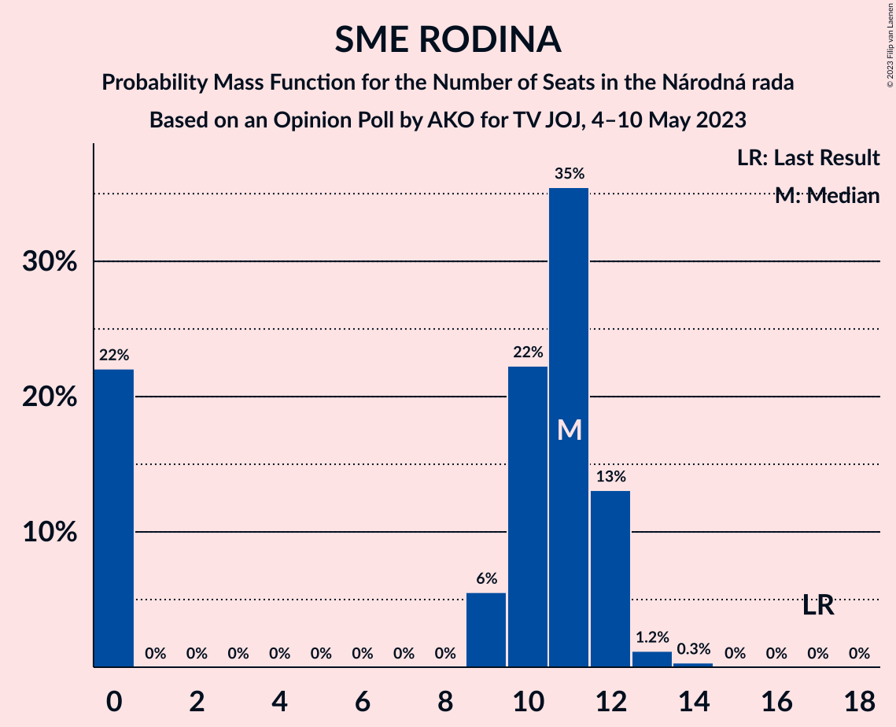
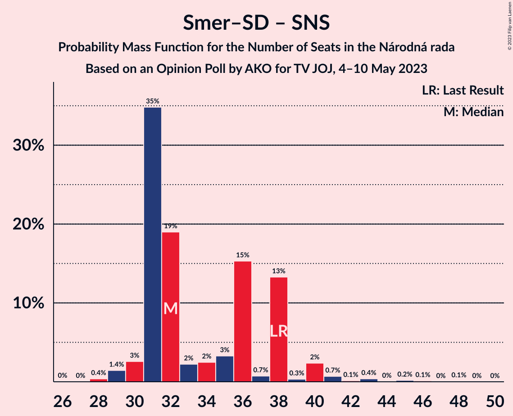

# Opinion Poll by AKO for TV JOJ, 4–10 May 2023

<a href="#voting-intentions">Voting Intentions</a> | <a href="#seats">Seats</a> | <a href="#coalitions">Coalitions</a> | <a href="#technical-information">Technical Information</a>

## Voting Intentions

### Confidence Intervals

| Party | Last Result | Poll Result | 80% Confidence Interval | 90% Confidence Interval | 95% Confidence Interval | 99% Confidence Interval |
|:-----:|:-----------:|:-----------:|:-----------------------:|:-----------------------:|:-----------------------:|:-----------------------:|
| SMER–sociálna demokracia | 18.3% | 18.0% | 16.5–19.6% |16.1–20.1% |15.7–20.5% |15.0–21.3% |
| HLAS–sociálna demokracia | 0.0% | 16.5% | 15.1–18.1% |14.7–18.5% |14.3–18.9% |13.7–19.7% |
| Progresívne Slovensko | 7.0% | 14.3% | 13.0–15.8% |12.6–16.2% |12.3–16.6% |11.6–17.4% |
| Sloboda a Solidarita | 6.2% | 8.3% | 7.3–9.5% |7.0–9.9% |6.7–10.2% |6.3–10.8% |
| OBYČAJNÍ ĽUDIA a nezávislé osobnosti | 25.0% | 7.4% | 6.4–8.6% |6.2–8.9% |5.9–9.2% |5.5–9.8% |
| REPUBLIKA | 0.0% | 6.9% | 6.0–8.0% |5.7–8.4% |5.5–8.7% |5.1–9.2% |
| Kresťanskodemokratické hnutie | 4.6% | 6.6% | 5.7–7.7% |5.4–8.0% |5.2–8.3% |4.8–8.9% |
| SME RODINA | 8.2% | 5.6% | 4.8–6.6% |4.5–7.0% |4.3–7.2% |4.0–7.7% |
| Slovenská národná strana | 3.2% | 4.4% | 3.7–5.3% |3.5–5.6% |3.3–5.9% |3.0–6.4% |
| SPOLU–Občianska Demokracia | 7.0% | 3.4% | 2.8–4.3% |2.6–4.5% |2.4–4.7% |2.2–5.2% |
| Za ľudí | 5.8% | 1.9% | 1.4–2.6% |1.3–2.8% |1.2–3.0% |1.0–3.3% |
| Strana maďarskej koalície–Magyar Koalíció Pártja | 3.9% | 1.1% | 0.8–1.7% |0.7–1.8% |0.6–2.0% |0.5–2.3% |
| Kotleba–Ľudová strana Naše Slovensko | 8.0% | 0.7% | 0.5–1.2% |0.4–1.3% |0.3–1.4% |0.2–1.7% |

*Note:* The poll result column reflects the actual value used in the calculations. Published results may vary slightly, and in addition be rounded to fewer digits.

## Seats

### Confidence Intervals

| Party | Last Result | Median | 80% Confidence Interval | 90% Confidence Interval | 95% Confidence Interval | 99% Confidence Interval |
|:-----:|:-----------:|:------:|:-----------------------:|:-----------------------:|:-----------------------:|:-----------------------:|
| <a href="#smer–sociálna-demokracia">SMER–sociálna demokracia</a> | 38 | 31 | 29–36 |29–36 |29–36 |28–38 |
| <a href="#hlas–sociálna-demokracia">HLAS–sociálna demokracia</a> | 0 | 31 | 28–32 |27–33 |26–34 |24–35 |
| <a href="#progresívne-slovensko">Progresívne Slovensko</a> | 0 | 27 | 23–29 |23–29 |22–30 |21–30 |
| <a href="#sloboda-a-solidarita">Sloboda a Solidarita</a> | 13 | 13 | 13–18 |12–18 |12–18 |12–20 |
| <a href="#obyčajní-ľudia-a-nezávislé-osobnosti">OBYČAJNÍ ĽUDIA a nezávislé osobnosti</a> | 53 | 13 | 12–15 |12–15 |11–17 |10–17 |
| <a href="#republika">REPUBLIKA</a> | 0 | 11 | 10–14 |10–15 |10–15 |9–17 |
| <a href="#kresťanskodemokratické-hnutie">Kresťanskodemokratické hnutie</a> | 0 | 12 | 10–13 |10–14 |10–14 |0–16 |
| <a href="#sme-rodina">SME RODINA</a> | 17 | 11 | 0–12 |0–12 |0–12 |0–13 |
| <a href="#slovenská-národná-strana">Slovenská národná strana</a> | 0 | 0 | 0–9 |0–9 |0–9 |0–10 |
| <a href="#spolu–občianska-demokracia">SPOLU–Občianska Demokracia</a> | 0 | 0 | 0 |0 |0 |0 |
| <a href="#za-ľudí">Za ľudí</a> | 12 | 0 | 0 |0 |0 |0 |
| <a href="#strana-maďarskej-koalície–magyar-koalíció-pártja">Strana maďarskej koalície–Magyar Koalíció Pártja</a> | 0 | 0 | 0 |0 |0 |0 |
| <a href="#kotleba–ľudová-strana-naše-slovensko">Kotleba–Ľudová strana Naše Slovensko</a> | 17 | 0 | 0 |0 |0 |0 |

### SMER–sociálna demokracia

*For a full overview of the results for this party, see the [SMER–sociálna demokracia](party-smer–sociálnademokracia.html) page.*

| Number of Seats | Probability | Accumulated | Special Marks |
|:---------------:|:-----------:|:-----------:|:-------------:|
| 26 | 0.1% | 100% |  |
| 27 | 0.1% | 99.8% |  |
| 28 | 0.5% | 99.7% |  |
| 29 | 14% | 99.2% |  |
| 30 | 3% | 85% |  |
| 31 | 37% | 82% | Median |
| 32 | 20% | 45% |  |
| 33 | 3% | 25% |  |
| 34 | 3% | 23% |  |
| 35 | 3% | 20% |  |
| 36 | 15% | 17% |  |
| 37 | 0.6% | 2% |  |
| 38 | 0.8% | 1.0% | Last Result |
| 39 | 0.1% | 0.2% |  |
| 40 | 0% | 0.1% |  |
| 41 | 0.1% | 0.1% |  |
| 42 | 0% | 0% |  |

### HLAS–sociálna demokracia

*For a full overview of the results for this party, see the [HLAS–sociálna demokracia](party-hlas–sociálnademokracia.html) page.*

| Number of Seats | Probability | Accumulated | Special Marks |
|:---------------:|:-----------:|:-----------:|:-------------:|
| 0 | 0% | 100% | Last Result |
| 1 | 0% | 100% |  |
| 2 | 0% | 100% |  |
| 3 | 0% | 100% |  |
| 4 | 0% | 100% |  |
| 5 | 0% | 100% |  |
| 6 | 0% | 100% |  |
| 7 | 0% | 100% |  |
| 8 | 0% | 100% |  |
| 9 | 0% | 100% |  |
| 10 | 0% | 100% |  |
| 11 | 0% | 100% |  |
| 12 | 0% | 100% |  |
| 13 | 0% | 100% |  |
| 14 | 0% | 100% |  |
| 15 | 0% | 100% |  |
| 16 | 0% | 100% |  |
| 17 | 0% | 100% |  |
| 18 | 0% | 100% |  |
| 19 | 0% | 100% |  |
| 20 | 0% | 100% |  |
| 21 | 0% | 100% |  |
| 22 | 0% | 100% |  |
| 23 | 0.1% | 100% |  |
| 24 | 0.9% | 99.9% |  |
| 25 | 0.2% | 99.1% |  |
| 26 | 3% | 98.8% |  |
| 27 | 3% | 96% |  |
| 28 | 15% | 93% |  |
| 29 | 12% | 78% |  |
| 30 | 1.1% | 65% |  |
| 31 | 18% | 64% | Median |
| 32 | 41% | 46% |  |
| 33 | 2% | 5% |  |
| 34 | 2% | 3% |  |
| 35 | 0.4% | 0.8% |  |
| 36 | 0.3% | 0.4% |  |
| 37 | 0.1% | 0.1% |  |
| 38 | 0% | 0.1% |  |
| 39 | 0% | 0% |  |

### Progresívne Slovensko

*For a full overview of the results for this party, see the [Progresívne Slovensko](party-progresívneslovensko.html) page.*

| Number of Seats | Probability | Accumulated | Special Marks |
|:---------------:|:-----------:|:-----------:|:-------------:|
| 0 | 0% | 100% | Last Result |
| 1 | 0% | 100% |  |
| 2 | 0% | 100% |  |
| 3 | 0% | 100% |  |
| 4 | 0% | 100% |  |
| 5 | 0% | 100% |  |
| 6 | 0% | 100% |  |
| 7 | 0% | 100% |  |
| 8 | 0% | 100% |  |
| 9 | 0% | 100% |  |
| 10 | 0% | 100% |  |
| 11 | 0% | 100% |  |
| 12 | 0% | 100% |  |
| 13 | 0% | 100% |  |
| 14 | 0% | 100% |  |
| 15 | 0% | 100% |  |
| 16 | 0% | 100% |  |
| 17 | 0% | 100% |  |
| 18 | 0% | 100% |  |
| 19 | 0.2% | 100% |  |
| 20 | 0.1% | 99.8% |  |
| 21 | 0.7% | 99.7% |  |
| 22 | 3% | 99.0% |  |
| 23 | 14% | 96% |  |
| 24 | 13% | 81% |  |
| 25 | 3% | 69% |  |
| 26 | 2% | 65% |  |
| 27 | 17% | 63% | Median |
| 28 | 34% | 46% |  |
| 29 | 8% | 11% |  |
| 30 | 3% | 3% |  |
| 31 | 0.3% | 0.4% |  |
| 32 | 0% | 0.1% |  |
| 33 | 0% | 0% |  |

### Sloboda a Solidarita

*For a full overview of the results for this party, see the [Sloboda a Solidarita](party-slobodaasolidarita.html) page.*

| Number of Seats | Probability | Accumulated | Special Marks |
|:---------------:|:-----------:|:-----------:|:-------------:|
| 10 | 0.1% | 100% |  |
| 11 | 0.2% | 99.8% |  |
| 12 | 8% | 99.7% |  |
| 13 | 47% | 92% | Last Result, Median |
| 14 | 19% | 45% |  |
| 15 | 6% | 26% |  |
| 16 | 4% | 20% |  |
| 17 | 3% | 15% |  |
| 18 | 10% | 12% |  |
| 19 | 0.6% | 1.3% |  |
| 20 | 0.6% | 0.7% |  |
| 21 | 0% | 0% |  |

### OBYČAJNÍ ĽUDIA a nezávislé osobnosti

*For a full overview of the results for this party, see the [OBYČAJNÍ ĽUDIA a nezávislé osobnosti](party-obyčajníľudiaanezávisléosobnosti.html) page.*

| Number of Seats | Probability | Accumulated | Special Marks |
|:---------------:|:-----------:|:-----------:|:-------------:|
| 0 | 0.2% | 100% |  |
| 1 | 0% | 99.8% |  |
| 2 | 0% | 99.8% |  |
| 3 | 0% | 99.8% |  |
| 4 | 0% | 99.8% |  |
| 5 | 0% | 99.8% |  |
| 6 | 0% | 99.8% |  |
| 7 | 0% | 99.8% |  |
| 8 | 0% | 99.8% |  |
| 9 | 0.1% | 99.7% |  |
| 10 | 0.5% | 99.7% |  |
| 11 | 2% | 99.2% |  |
| 12 | 44% | 97% |  |
| 13 | 18% | 53% | Median |
| 14 | 13% | 35% |  |
| 15 | 17% | 22% |  |
| 16 | 2% | 5% |  |
| 17 | 2% | 3% |  |
| 18 | 0.2% | 0.2% |  |
| 19 | 0% | 0% |  |
| 20 | 0% | 0% |  |
| 21 | 0% | 0% |  |
| 22 | 0% | 0% |  |
| 23 | 0% | 0% |  |
| 24 | 0% | 0% |  |
| 25 | 0% | 0% |  |
| 26 | 0% | 0% |  |
| 27 | 0% | 0% |  |
| 28 | 0% | 0% |  |
| 29 | 0% | 0% |  |
| 30 | 0% | 0% |  |
| 31 | 0% | 0% |  |
| 32 | 0% | 0% |  |
| 33 | 0% | 0% |  |
| 34 | 0% | 0% |  |
| 35 | 0% | 0% |  |
| 36 | 0% | 0% |  |
| 37 | 0% | 0% |  |
| 38 | 0% | 0% |  |
| 39 | 0% | 0% |  |
| 40 | 0% | 0% |  |
| 41 | 0% | 0% |  |
| 42 | 0% | 0% |  |
| 43 | 0% | 0% |  |
| 44 | 0% | 0% |  |
| 45 | 0% | 0% |  |
| 46 | 0% | 0% |  |
| 47 | 0% | 0% |  |
| 48 | 0% | 0% |  |
| 49 | 0% | 0% |  |
| 50 | 0% | 0% |  |
| 51 | 0% | 0% |  |
| 52 | 0% | 0% |  |
| 53 | 0% | 0% | Last Result |

### REPUBLIKA

*For a full overview of the results for this party, see the [REPUBLIKA](party-republika.html) page.*

| Number of Seats | Probability | Accumulated | Special Marks |
|:---------------:|:-----------:|:-----------:|:-------------:|
| 0 | 0.2% | 100% | Last Result |
| 1 | 0% | 99.8% |  |
| 2 | 0% | 99.8% |  |
| 3 | 0% | 99.8% |  |
| 4 | 0% | 99.8% |  |
| 5 | 0% | 99.8% |  |
| 6 | 0% | 99.8% |  |
| 7 | 0% | 99.8% |  |
| 8 | 0% | 99.8% |  |
| 9 | 0.7% | 99.8% |  |
| 10 | 24% | 99.1% |  |
| 11 | 34% | 76% | Median |
| 12 | 4% | 41% |  |
| 13 | 16% | 37% |  |
| 14 | 16% | 21% |  |
| 15 | 4% | 5% |  |
| 16 | 0.7% | 1.3% |  |
| 17 | 0.6% | 0.6% |  |
| 18 | 0% | 0.1% |  |
| 19 | 0.1% | 0.1% |  |
| 20 | 0% | 0% |  |

### Kresťanskodemokratické hnutie

*For a full overview of the results for this party, see the [Kresťanskodemokratické hnutie](party-kresťanskodemokratickéhnutie.html) page.*

| Number of Seats | Probability | Accumulated | Special Marks |
|:---------------:|:-----------:|:-----------:|:-------------:|
| 0 | 0.6% | 100% | Last Result |
| 1 | 0% | 99.4% |  |
| 2 | 0% | 99.4% |  |
| 3 | 0% | 99.4% |  |
| 4 | 0% | 99.4% |  |
| 5 | 0% | 99.4% |  |
| 6 | 0% | 99.4% |  |
| 7 | 0% | 99.4% |  |
| 8 | 0% | 99.4% |  |
| 9 | 0.8% | 99.4% |  |
| 10 | 10% | 98.6% |  |
| 11 | 4% | 89% |  |
| 12 | 39% | 84% | Median |
| 13 | 40% | 45% |  |
| 14 | 3% | 5% |  |
| 15 | 1.4% | 2% |  |
| 16 | 0.3% | 0.6% |  |
| 17 | 0.2% | 0.3% |  |
| 18 | 0% | 0% |  |

### SME RODINA

*For a full overview of the results for this party, see the [SME RODINA](party-smerodina.html) page.*

| Number of Seats | Probability | Accumulated | Special Marks |
|:---------------:|:-----------:|:-----------:|:-------------:|
| 0 | 22% | 100% |  |
| 1 | 0% | 78% |  |
| 2 | 0% | 78% |  |
| 3 | 0% | 78% |  |
| 4 | 0% | 78% |  |
| 5 | 0% | 78% |  |
| 6 | 0% | 78% |  |
| 7 | 0% | 78% |  |
| 8 | 0% | 78% |  |
| 9 | 6% | 78% |  |
| 10 | 22% | 72% |  |
| 11 | 35% | 50% | Median |
| 12 | 13% | 15% |  |
| 13 | 1.2% | 2% |  |
| 14 | 0.3% | 0.4% |  |
| 15 | 0% | 0% |  |
| 16 | 0% | 0% |  |
| 17 | 0% | 0% | Last Result |

### Slovenská národná strana

*For a full overview of the results for this party, see the [Slovenská národná strana](party-slovenskánárodnástrana.html) page.*

| Number of Seats | Probability | Accumulated | Special Marks |
|:---------------:|:-----------:|:-----------:|:-------------:|
| 0 | 83% | 100% | Last Result, Median |
| 1 | 0% | 17% |  |
| 2 | 0% | 17% |  |
| 3 | 0% | 17% |  |
| 4 | 0% | 17% |  |
| 5 | 0% | 17% |  |
| 6 | 0% | 17% |  |
| 7 | 0% | 17% |  |
| 8 | 0.1% | 17% |  |
| 9 | 16% | 17% |  |
| 10 | 0.7% | 1.1% |  |
| 11 | 0.2% | 0.3% |  |
| 12 | 0.1% | 0.1% |  |
| 13 | 0% | 0% |  |

### SPOLU–Občianska Demokracia

*For a full overview of the results for this party, see the [SPOLU–Občianska Demokracia](party-spolu–občianskademokracia.html) page.*

| Number of Seats | Probability | Accumulated | Special Marks |
|:---------------:|:-----------:|:-----------:|:-------------:|
| 0 | 99.8% | 100% | Last Result, Median |
| 1 | 0% | 0.2% |  |
| 2 | 0% | 0.2% |  |
| 3 | 0% | 0.2% |  |
| 4 | 0% | 0.2% |  |
| 5 | 0% | 0.2% |  |
| 6 | 0% | 0.2% |  |
| 7 | 0% | 0.2% |  |
| 8 | 0% | 0.2% |  |
| 9 | 0.1% | 0.2% |  |
| 10 | 0.1% | 0.1% |  |
| 11 | 0% | 0% |  |

### Za ľudí

*For a full overview of the results for this party, see the [Za ľudí](party-zaľudí.html) page.*

| Number of Seats | Probability | Accumulated | Special Marks |
|:---------------:|:-----------:|:-----------:|:-------------:|
| 0 | 100% | 100% | Median |
| 1 | 0% | 0% |  |
| 2 | 0% | 0% |  |
| 3 | 0% | 0% |  |
| 4 | 0% | 0% |  |
| 5 | 0% | 0% |  |
| 6 | 0% | 0% |  |
| 7 | 0% | 0% |  |
| 8 | 0% | 0% |  |
| 9 | 0% | 0% |  |
| 10 | 0% | 0% |  |
| 11 | 0% | 0% |  |
| 12 | 0% | 0% | Last Result |

### Strana maďarskej koalície–Magyar Koalíció Pártja

*For a full overview of the results for this party, see the [Strana maďarskej koalície–Magyar Koalíció Pártja](party-stranamaďarskejkoalície–magyarkoalíciópártja.html) page.*

| Number of Seats | Probability | Accumulated | Special Marks |
|:---------------:|:-----------:|:-----------:|:-------------:|
| 0 | 100% | 100% | Last Result, Median |

### Kotleba–Ľudová strana Naše Slovensko

*For a full overview of the results for this party, see the [Kotleba–Ľudová strana Naše Slovensko](party-kotleba–ľudovástrananašeslovensko.html) page.*

| Number of Seats | Probability | Accumulated | Special Marks |
|:---------------:|:-----------:|:-----------:|:-------------:|
| 0 | 100% | 100% | Median |
| 1 | 0% | 0% |  |
| 2 | 0% | 0% |  |
| 3 | 0% | 0% |  |
| 4 | 0% | 0% |  |
| 5 | 0% | 0% |  |
| 6 | 0% | 0% |  |
| 7 | 0% | 0% |  |
| 8 | 0% | 0% |  |
| 9 | 0% | 0% |  |
| 10 | 0% | 0% |  |
| 11 | 0% | 0% |  |
| 12 | 0% | 0% |  |
| 13 | 0% | 0% |  |
| 14 | 0% | 0% |  |
| 15 | 0% | 0% |  |
| 16 | 0% | 0% |  |
| 17 | 0% | 0% | Last Result |

## Coalitions

### Confidence Intervals

| Coalition | Last Result | Median | Majority? | 80% Confidence Interval | 90% Confidence Interval | 95% Confidence Interval | 99% Confidence Interval |
|:---------:|:-----------:|:------:|:---------:|:-----------------------:|:-----------------------:|:-----------------------:|:-----------------------:|
| SMER–sociálna demokracia – HLAS–sociálna demokracia – SME RODINA – Slovenská národná strana – Kotleba–Ľudová strana Naše Slovensko | 72 | 74 | 19% | 67–78 | 67–78 | 65–78 | 63–80 |
| SMER–sociálna demokracia – HLAS–sociálna demokracia – SME RODINA – Slovenská národná strana | 55 | 74 | 19% | 67–78 | 67–78 | 65–78 | 63–80 |
| SMER–sociálna demokracia – HLAS–sociálna demokracia – SME RODINA | 55 | 71 | 3% | 67–74 | 66–74 | 64–76 | 61–79 |
| SMER–sociálna demokracia – HLAS–sociálna demokracia – Slovenská národná strana | 38 | 63 | 0.2% | 61–67 | 60–67 | 58–69 | 56–74 |
| SMER–sociálna demokracia – SME RODINA – Slovenská národná strana – Kotleba–Ľudová strana Naše Slovensko | 72 | 42 | 0% | 36–50 | 35–50 | 33–50 | 31–51 |
| SMER–sociálna demokracia – SME RODINA – Slovenská národná strana | 55 | 42 | 0% | 36–50 | 35–50 | 33–50 | 31–51 |
| HLAS–sociálna demokracia – SME RODINA – Slovenská národná strana – Kotleba–Ľudová strana Naše Slovensko | 34 | 43 | 0% | 31–49 | 31–49 | 31–49 | 29–49 |
| HLAS–sociálna demokracia – SME RODINA – Slovenská národná strana | 17 | 43 | 0% | 31–49 | 31–49 | 31–49 | 29–49 |
| SMER–sociálna demokracia – SME RODINA | 55 | 42 | 0% | 36–42 | 34–44 | 32–46 | 29–48 |
| HLAS–sociálna demokracia – SME RODINA | 17 | 40 | 0% | 31–43 | 31–43 | 31–43 | 28–45 |
| SMER–sociálna demokracia – Slovenská národná strana | 38 | 32 | 0% | 31–38 | 31–38 | 30–40 | 29–43 |
| HLAS–sociálna demokracia – Slovenská národná strana | 0 | 32 | 0% | 29–37 | 28–37 | 26–37 | 24–40 |
| SMER–sociálna demokracia | 38 | 31 | 0% | 29–36 | 29–36 | 29–36 | 28–38 |

### SMER–sociálna demokracia – HLAS–sociálna demokracia – SME RODINA – Slovenská národná strana – Kotleba–Ľudová strana Naše Slovensko

| Number of Seats | Probability | Accumulated | Special Marks |
|:---------------:|:-----------:|:-----------:|:-------------:|
| 59 | 0.1% | 100% |  |
| 60 | 0% | 99.9% |  |
| 61 | 0.3% | 99.9% |  |
| 62 | 0.1% | 99.6% |  |
| 63 | 0.7% | 99.5% |  |
| 64 | 1.1% | 98.9% |  |
| 65 | 1.0% | 98% |  |
| 66 | 1.0% | 97% |  |
| 67 | 17% | 96% |  |
| 68 | 2% | 79% |  |
| 69 | 2% | 77% |  |
| 70 | 2% | 75% |  |
| 71 | 10% | 73% |  |
| 72 | 1.2% | 63% | Last Result |
| 73 | 1.3% | 61% | Median |
| 74 | 41% | 60% |  |
| 75 | 0.8% | 19% |  |
| 76 | 4% | 19% | Majority |
| 77 | 1.0% | 15% |  |
| 78 | 13% | 14% |  |
| 79 | 0.4% | 1.0% |  |
| 80 | 0.2% | 0.6% |  |
| 81 | 0.1% | 0.4% |  |
| 82 | 0% | 0.3% |  |
| 83 | 0.1% | 0.3% |  |
| 84 | 0.1% | 0.2% |  |
| 85 | 0% | 0.1% |  |
| 86 | 0% | 0.1% |  |
| 87 | 0% | 0% |  |

### SMER–sociálna demokracia – HLAS–sociálna demokracia – SME RODINA – Slovenská národná strana

| Number of Seats | Probability | Accumulated | Special Marks |
|:---------------:|:-----------:|:-----------:|:-------------:|
| 55 | 0% | 100% | Last Result |
| 56 | 0% | 100% |  |
| 57 | 0% | 100% |  |
| 58 | 0% | 100% |  |
| 59 | 0.1% | 100% |  |
| 60 | 0% | 99.9% |  |
| 61 | 0.3% | 99.9% |  |
| 62 | 0.1% | 99.6% |  |
| 63 | 0.7% | 99.5% |  |
| 64 | 1.1% | 98.9% |  |
| 65 | 1.0% | 98% |  |
| 66 | 1.0% | 97% |  |
| 67 | 17% | 96% |  |
| 68 | 2% | 79% |  |
| 69 | 2% | 77% |  |
| 70 | 2% | 75% |  |
| 71 | 10% | 73% |  |
| 72 | 1.2% | 63% |  |
| 73 | 1.3% | 61% | Median |
| 74 | 41% | 60% |  |
| 75 | 0.8% | 19% |  |
| 76 | 4% | 19% | Majority |
| 77 | 1.0% | 15% |  |
| 78 | 13% | 14% |  |
| 79 | 0.4% | 1.0% |  |
| 80 | 0.2% | 0.6% |  |
| 81 | 0.1% | 0.4% |  |
| 82 | 0% | 0.3% |  |
| 83 | 0.1% | 0.3% |  |
| 84 | 0.1% | 0.2% |  |
| 85 | 0% | 0.1% |  |
| 86 | 0% | 0.1% |  |
| 87 | 0% | 0% |  |

### SMER–sociálna demokracia – HLAS–sociálna demokracia – SME RODINA

| Number of Seats | Probability | Accumulated | Special Marks |
|:---------------:|:-----------:|:-----------:|:-------------:|
| 55 | 0% | 100% | Last Result |
| 56 | 0% | 100% |  |
| 57 | 0% | 100% |  |
| 58 | 0% | 100% |  |
| 59 | 0.3% | 100% |  |
| 60 | 0.1% | 99.7% |  |
| 61 | 0.5% | 99.6% |  |
| 62 | 0.2% | 99.1% |  |
| 63 | 0.7% | 98.9% |  |
| 64 | 1.1% | 98% |  |
| 65 | 1.3% | 97% |  |
| 66 | 1.1% | 96% |  |
| 67 | 20% | 95% |  |
| 68 | 2% | 75% |  |
| 69 | 14% | 73% |  |
| 70 | 2% | 58% |  |
| 71 | 10% | 56% |  |
| 72 | 1.2% | 46% |  |
| 73 | 1.1% | 45% | Median |
| 74 | 41% | 44% |  |
| 75 | 0.5% | 3% |  |
| 76 | 2% | 3% | Majority |
| 77 | 0.4% | 1.1% |  |
| 78 | 0.2% | 0.7% |  |
| 79 | 0.4% | 0.5% |  |
| 80 | 0% | 0.2% |  |
| 81 | 0% | 0.1% |  |
| 82 | 0% | 0.1% |  |
| 83 | 0.1% | 0.1% |  |
| 84 | 0% | 0% |  |

### SMER–sociálna demokracia – HLAS–sociálna demokracia – Slovenská národná strana

| Number of Seats | Probability | Accumulated | Special Marks |
|:---------------:|:-----------:|:-----------:|:-------------:|
| 38 | 0% | 100% | Last Result |
| 39 | 0% | 100% |  |
| 40 | 0% | 100% |  |
| 41 | 0% | 100% |  |
| 42 | 0% | 100% |  |
| 43 | 0% | 100% |  |
| 44 | 0% | 100% |  |
| 45 | 0% | 100% |  |
| 46 | 0% | 100% |  |
| 47 | 0% | 100% |  |
| 48 | 0% | 100% |  |
| 49 | 0% | 100% |  |
| 50 | 0% | 100% |  |
| 51 | 0% | 100% |  |
| 52 | 0% | 100% |  |
| 53 | 0% | 100% |  |
| 54 | 0% | 100% |  |
| 55 | 0% | 100% |  |
| 56 | 2% | 99.9% |  |
| 57 | 0.4% | 98% |  |
| 58 | 0.6% | 98% |  |
| 59 | 2% | 97% |  |
| 60 | 0.7% | 95% |  |
| 61 | 12% | 95% |  |
| 62 | 0.3% | 83% | Median |
| 63 | 35% | 82% |  |
| 64 | 9% | 48% |  |
| 65 | 3% | 38% |  |
| 66 | 13% | 36% |  |
| 67 | 19% | 23% |  |
| 68 | 0.6% | 3% |  |
| 69 | 1.4% | 3% |  |
| 70 | 0.2% | 1.2% |  |
| 71 | 0.1% | 1.0% |  |
| 72 | 0.2% | 1.0% |  |
| 73 | 0.2% | 0.7% |  |
| 74 | 0.2% | 0.6% |  |
| 75 | 0.2% | 0.4% |  |
| 76 | 0% | 0.2% | Majority |
| 77 | 0.1% | 0.2% |  |
| 78 | 0.1% | 0.1% |  |
| 79 | 0% | 0% |  |

### SMER–sociálna demokracia – SME RODINA – Slovenská národná strana – Kotleba–Ľudová strana Naše Slovensko

| Number of Seats | Probability | Accumulated | Special Marks |
|:---------------:|:-----------:|:-----------:|:-------------:|
| 28 | 0.1% | 100% |  |
| 29 | 0.3% | 99.9% |  |
| 30 | 0% | 99.6% |  |
| 31 | 1.5% | 99.6% |  |
| 32 | 0.4% | 98% |  |
| 33 | 0.9% | 98% |  |
| 34 | 1.2% | 97% |  |
| 35 | 2% | 96% |  |
| 36 | 15% | 94% |  |
| 37 | 0% | 79% |  |
| 38 | 0.6% | 79% |  |
| 39 | 0.9% | 78% |  |
| 40 | 1.1% | 78% |  |
| 41 | 3% | 76% |  |
| 42 | 51% | 73% | Median |
| 43 | 0.9% | 22% |  |
| 44 | 0.8% | 21% |  |
| 45 | 2% | 21% |  |
| 46 | 0.7% | 19% |  |
| 47 | 0.8% | 18% |  |
| 48 | 1.3% | 17% |  |
| 49 | 2% | 16% |  |
| 50 | 13% | 14% |  |
| 51 | 0.7% | 1.1% |  |
| 52 | 0.2% | 0.4% |  |
| 53 | 0.1% | 0.3% |  |
| 54 | 0% | 0.2% |  |
| 55 | 0.1% | 0.2% |  |
| 56 | 0% | 0.1% |  |
| 57 | 0% | 0% |  |
| 58 | 0% | 0% |  |
| 59 | 0% | 0% |  |
| 60 | 0% | 0% |  |
| 61 | 0% | 0% |  |
| 62 | 0% | 0% |  |
| 63 | 0% | 0% |  |
| 64 | 0% | 0% |  |
| 65 | 0% | 0% |  |
| 66 | 0% | 0% |  |
| 67 | 0% | 0% |  |
| 68 | 0% | 0% |  |
| 69 | 0% | 0% |  |
| 70 | 0% | 0% |  |
| 71 | 0% | 0% |  |
| 72 | 0% | 0% | Last Result |

### SMER–sociálna demokracia – SME RODINA – Slovenská národná strana

| Number of Seats | Probability | Accumulated | Special Marks |
|:---------------:|:-----------:|:-----------:|:-------------:|
| 28 | 0.1% | 100% |  |
| 29 | 0.3% | 99.9% |  |
| 30 | 0% | 99.6% |  |
| 31 | 1.5% | 99.6% |  |
| 32 | 0.4% | 98% |  |
| 33 | 0.9% | 98% |  |
| 34 | 1.2% | 97% |  |
| 35 | 2% | 96% |  |
| 36 | 15% | 94% |  |
| 37 | 0% | 79% |  |
| 38 | 0.6% | 79% |  |
| 39 | 0.9% | 78% |  |
| 40 | 1.1% | 78% |  |
| 41 | 3% | 76% |  |
| 42 | 51% | 73% | Median |
| 43 | 0.9% | 22% |  |
| 44 | 0.8% | 21% |  |
| 45 | 2% | 21% |  |
| 46 | 0.7% | 19% |  |
| 47 | 0.8% | 18% |  |
| 48 | 1.3% | 17% |  |
| 49 | 2% | 16% |  |
| 50 | 13% | 14% |  |
| 51 | 0.7% | 1.1% |  |
| 52 | 0.2% | 0.4% |  |
| 53 | 0.1% | 0.3% |  |
| 54 | 0% | 0.2% |  |
| 55 | 0.1% | 0.2% | Last Result |
| 56 | 0% | 0.1% |  |
| 57 | 0% | 0% |  |

### HLAS–sociálna demokracia – SME RODINA – Slovenská národná strana – Kotleba–Ľudová strana Naše Slovensko

| Number of Seats | Probability | Accumulated | Special Marks |
|:---------------:|:-----------:|:-----------:|:-------------:|
| 27 | 0.1% | 100% |  |
| 28 | 0.3% | 99.9% |  |
| 29 | 0.3% | 99.6% |  |
| 30 | 0.3% | 99.3% |  |
| 31 | 15% | 99.0% |  |
| 32 | 1.2% | 84% |  |
| 33 | 2% | 83% |  |
| 34 | 3% | 81% | Last Result |
| 35 | 1.2% | 78% |  |
| 36 | 0.9% | 77% |  |
| 37 | 1.3% | 76% |  |
| 38 | 2% | 75% |  |
| 39 | 11% | 73% |  |
| 40 | 0.7% | 62% |  |
| 41 | 3% | 61% |  |
| 42 | 9% | 59% | Median |
| 43 | 33% | 50% |  |
| 44 | 0.3% | 17% |  |
| 45 | 4% | 17% |  |
| 46 | 0.2% | 13% |  |
| 47 | 0.2% | 13% |  |
| 48 | 0.2% | 13% |  |
| 49 | 12% | 13% |  |
| 50 | 0.1% | 0.3% |  |
| 51 | 0.1% | 0.2% |  |
| 52 | 0.1% | 0.1% |  |
| 53 | 0% | 0% |  |

### HLAS–sociálna demokracia – SME RODINA – Slovenská národná strana

| Number of Seats | Probability | Accumulated | Special Marks |
|:---------------:|:-----------:|:-----------:|:-------------:|
| 17 | 0% | 100% | Last Result |
| 18 | 0% | 100% |  |
| 19 | 0% | 100% |  |
| 20 | 0% | 100% |  |
| 21 | 0% | 100% |  |
| 22 | 0% | 100% |  |
| 23 | 0% | 100% |  |
| 24 | 0% | 100% |  |
| 25 | 0% | 100% |  |
| 26 | 0% | 100% |  |
| 27 | 0.1% | 100% |  |
| 28 | 0.3% | 99.9% |  |
| 29 | 0.3% | 99.6% |  |
| 30 | 0.3% | 99.3% |  |
| 31 | 15% | 99.0% |  |
| 32 | 1.2% | 84% |  |
| 33 | 2% | 83% |  |
| 34 | 3% | 81% |  |
| 35 | 1.2% | 78% |  |
| 36 | 0.9% | 77% |  |
| 37 | 1.3% | 76% |  |
| 38 | 2% | 75% |  |
| 39 | 11% | 73% |  |
| 40 | 0.7% | 62% |  |
| 41 | 3% | 61% |  |
| 42 | 9% | 59% | Median |
| 43 | 33% | 50% |  |
| 44 | 0.3% | 17% |  |
| 45 | 4% | 17% |  |
| 46 | 0.2% | 13% |  |
| 47 | 0.2% | 13% |  |
| 48 | 0.2% | 13% |  |
| 49 | 12% | 13% |  |
| 50 | 0.1% | 0.3% |  |
| 51 | 0.1% | 0.2% |  |
| 52 | 0.1% | 0.1% |  |
| 53 | 0% | 0% |  |

### SMER–sociálna demokracia – SME RODINA

| Number of Seats | Probability | Accumulated | Special Marks |
|:---------------:|:-----------:|:-----------:|:-------------:|
| 28 | 0.1% | 100% |  |
| 29 | 0.4% | 99.9% |  |
| 30 | 0.1% | 99.5% |  |
| 31 | 1.5% | 99.4% |  |
| 32 | 0.5% | 98% |  |
| 33 | 1.1% | 97% |  |
| 34 | 1.4% | 96% |  |
| 35 | 2% | 95% |  |
| 36 | 15% | 93% |  |
| 37 | 0.2% | 78% |  |
| 38 | 0.7% | 78% |  |
| 39 | 1.0% | 77% |  |
| 40 | 3% | 76% |  |
| 41 | 15% | 73% |  |
| 42 | 52% | 58% | Median |
| 43 | 0.7% | 6% |  |
| 44 | 0.8% | 5% |  |
| 45 | 2% | 4% |  |
| 46 | 0.5% | 3% |  |
| 47 | 0.7% | 2% |  |
| 48 | 1.2% | 1.3% |  |
| 49 | 0% | 0.2% |  |
| 50 | 0% | 0.1% |  |
| 51 | 0% | 0.1% |  |
| 52 | 0.1% | 0.1% |  |
| 53 | 0% | 0% |  |
| 54 | 0% | 0% |  |
| 55 | 0% | 0% | Last Result |

### HLAS–sociálna demokracia – SME RODINA

| Number of Seats | Probability | Accumulated | Special Marks |
|:---------------:|:-----------:|:-----------:|:-------------:|
| 17 | 0% | 100% | Last Result |
| 18 | 0% | 100% |  |
| 19 | 0% | 100% |  |
| 20 | 0% | 100% |  |
| 21 | 0% | 100% |  |
| 22 | 0% | 100% |  |
| 23 | 0% | 100% |  |
| 24 | 0% | 100% |  |
| 25 | 0% | 100% |  |
| 26 | 0% | 100% |  |
| 27 | 0.3% | 100% |  |
| 28 | 0.3% | 99.7% |  |
| 29 | 0.4% | 99.4% |  |
| 30 | 0.4% | 98.9% |  |
| 31 | 15% | 98.5% |  |
| 32 | 1.4% | 83% |  |
| 33 | 2% | 82% |  |
| 34 | 3% | 80% |  |
| 35 | 1.3% | 77% |  |
| 36 | 4% | 76% |  |
| 37 | 1.4% | 72% |  |
| 38 | 2% | 71% |  |
| 39 | 11% | 69% |  |
| 40 | 13% | 58% |  |
| 41 | 3% | 45% |  |
| 42 | 8% | 42% | Median |
| 43 | 33% | 34% |  |
| 44 | 0.3% | 1.1% |  |
| 45 | 0.6% | 0.8% |  |
| 46 | 0.1% | 0.2% |  |
| 47 | 0.1% | 0.2% |  |
| 48 | 0% | 0.1% |  |
| 49 | 0.1% | 0.1% |  |
| 50 | 0% | 0% |  |

### SMER–sociálna demokracia – Slovenská národná strana

| Number of Seats | Probability | Accumulated | Special Marks |
|:---------------:|:-----------:|:-----------:|:-------------:|
| 26 | 0% | 100% |  |
| 27 | 0% | 99.9% |  |
| 28 | 0.4% | 99.9% |  |
| 29 | 1.4% | 99.5% |  |
| 30 | 3% | 98% |  |
| 31 | 35% | 96% | Median |
| 32 | 19% | 61% |  |
| 33 | 2% | 42% |  |
| 34 | 2% | 39% |  |
| 35 | 3% | 37% |  |
| 36 | 15% | 34% |  |
| 37 | 0.7% | 18% |  |
| 38 | 13% | 18% | Last Result |
| 39 | 0.3% | 4% |  |
| 40 | 2% | 4% |  |
| 41 | 0.7% | 2% |  |
| 42 | 0.1% | 1.0% |  |
| 43 | 0.4% | 0.8% |  |
| 44 | 0% | 0.5% |  |
| 45 | 0.2% | 0.4% |  |
| 46 | 0.1% | 0.2% |  |
| 47 | 0% | 0.1% |  |
| 48 | 0.1% | 0.1% |  |
| 49 | 0% | 0% |  |

### HLAS–sociálna demokracia – Slovenská národná strana

| Number of Seats | Probability | Accumulated | Special Marks |
|:---------------:|:-----------:|:-----------:|:-------------:|
| 0 | 0% | 100% | Last Result |
| 1 | 0% | 100% |  |
| 2 | 0% | 100% |  |
| 3 | 0% | 100% |  |
| 4 | 0% | 100% |  |
| 5 | 0% | 100% |  |
| 6 | 0% | 100% |  |
| 7 | 0% | 100% |  |
| 8 | 0% | 100% |  |
| 9 | 0% | 100% |  |
| 10 | 0% | 100% |  |
| 11 | 0% | 100% |  |
| 12 | 0% | 100% |  |
| 13 | 0% | 100% |  |
| 14 | 0% | 100% |  |
| 15 | 0% | 100% |  |
| 16 | 0% | 100% |  |
| 17 | 0% | 100% |  |
| 18 | 0% | 100% |  |
| 19 | 0% | 100% |  |
| 20 | 0% | 100% |  |
| 21 | 0% | 100% |  |
| 22 | 0% | 100% |  |
| 23 | 0% | 100% |  |
| 24 | 0.8% | 100% |  |
| 25 | 0.1% | 99.2% |  |
| 26 | 3% | 99.1% |  |
| 27 | 0.5% | 97% |  |
| 28 | 2% | 96% |  |
| 29 | 12% | 94% |  |
| 30 | 0.9% | 82% |  |
| 31 | 18% | 81% | Median |
| 32 | 41% | 63% |  |
| 33 | 2% | 22% |  |
| 34 | 2% | 20% |  |
| 35 | 1.2% | 18% |  |
| 36 | 3% | 17% |  |
| 37 | 13% | 14% |  |
| 38 | 0.2% | 1.3% |  |
| 39 | 0.5% | 1.1% |  |
| 40 | 0.2% | 0.6% |  |
| 41 | 0.1% | 0.4% |  |
| 42 | 0.2% | 0.3% |  |
| 43 | 0.1% | 0.1% |  |
| 44 | 0.1% | 0.1% |  |
| 45 | 0% | 0% |  |

### SMER–sociálna demokracia

| Number of Seats | Probability | Accumulated | Special Marks |
|:---------------:|:-----------:|:-----------:|:-------------:|
| 26 | 0.1% | 100% |  |
| 27 | 0.1% | 99.8% |  |
| 28 | 0.5% | 99.7% |  |
| 29 | 14% | 99.2% |  |
| 30 | 3% | 85% |  |
| 31 | 37% | 82% | Median |
| 32 | 20% | 45% |  |
| 33 | 3% | 25% |  |
| 34 | 3% | 23% |  |
| 35 | 3% | 20% |  |
| 36 | 15% | 17% |  |
| 37 | 0.6% | 2% |  |
| 38 | 0.8% | 1.0% | Last Result |
| 39 | 0.1% | 0.2% |  |
| 40 | 0% | 0.1% |  |
| 41 | 0.1% | 0.1% |  |
| 42 | 0% | 0% |  |

## Technical Information

### Opinion Poll

+ **Polling firm:** AKO
+ **Commissioner(s):** TV JOJ
+ **Fieldwork period:** 4–10 May 2023

### Calculations

+ **Sample size:** 1000
+ **Simulations done:** 1,048,576
+ **Error estimate:** 1.91%

