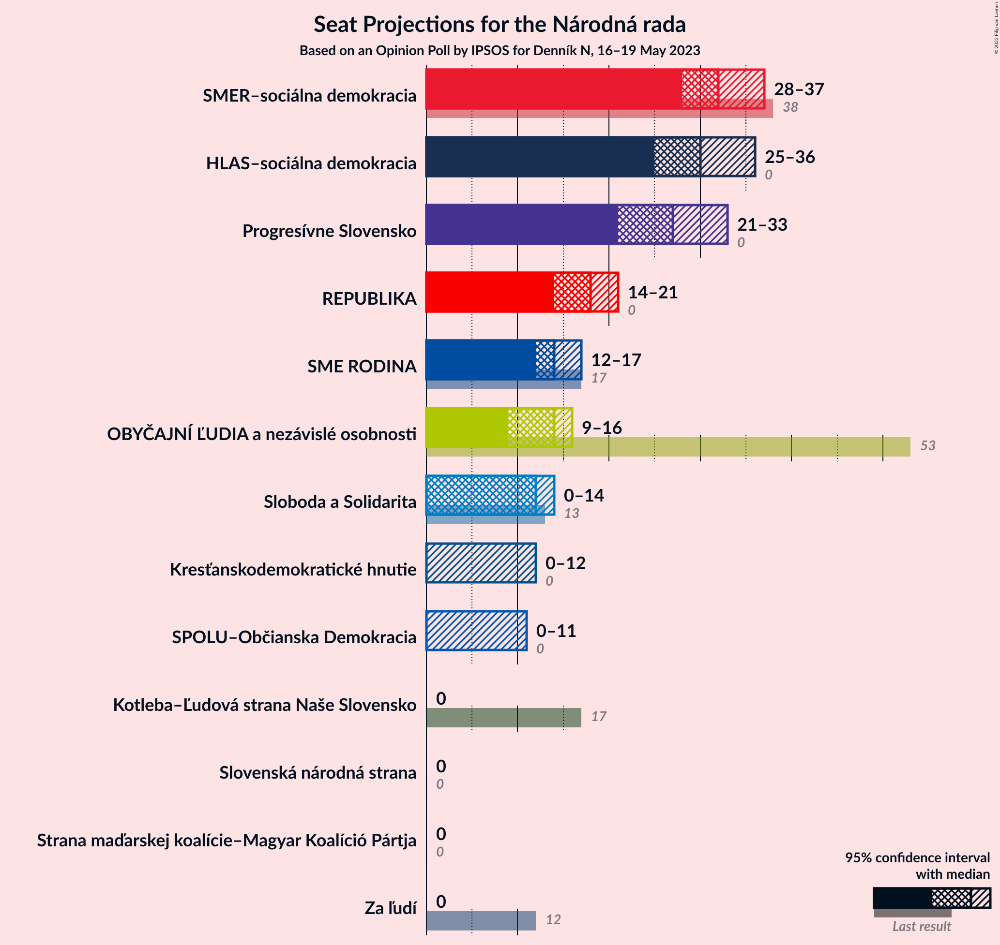
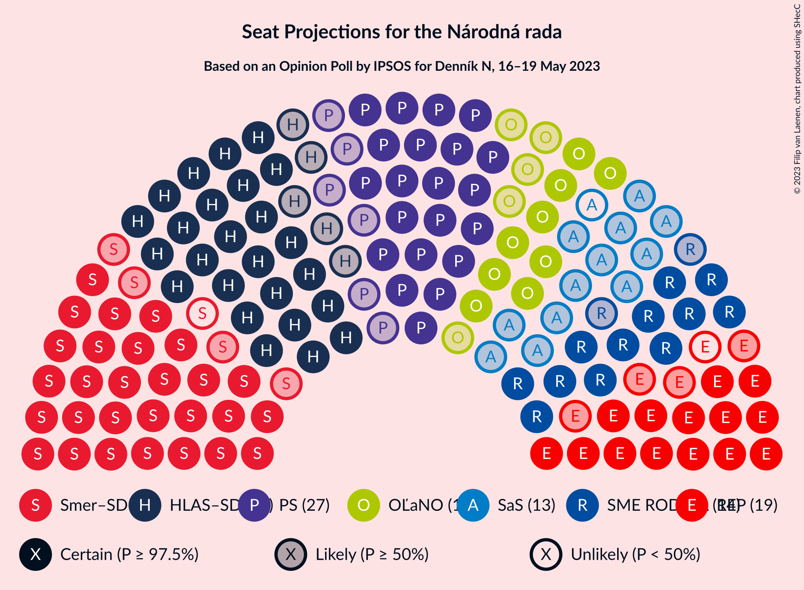

# Opinion Poll by IPSOS for Denník N, 16–19 May 2023

<a href="#voting-intentions">Voting Intentions</a> | <a href="#seats">Seats</a> | <a href="#coalitions">Coalitions</a> | <a href="#technical-information">Technical Information</a>

## Voting Intentions

### Confidence Intervals

| Party | Last Result | Poll Result | 80% Confidence Interval | 90% Confidence Interval | 95% Confidence Interval | 99% Confidence Interval |
|:-----:|:-----------:|:-----------:|:-----------------------:|:-----------------------:|:-----------------------:|:-----------------------:|
| SMER–sociálna demokracia | 18.3% | 16.9% | 15.5–18.5% |15.1–19.0% |14.7–19.4% |14.1–20.2% |
| HLAS–sociálna demokracia | 0.0% | 15.6% | 14.3–17.2% |13.9–17.6% |13.5–18.0% |12.9–18.8% |
| Progresívne Slovensko | 7.0% | 13.3% | 12.1–14.8% |11.7–15.2% |11.4–15.6% |10.8–16.3% |
| REPUBLIKA | 0.0% | 9.0% | 7.9–10.2% |7.6–10.6% |7.3–10.9% |6.9–11.5% |
| SME RODINA | 8.2% | 7.5% | 6.5–8.6% |6.2–9.0% |6.0–9.3% |5.6–9.9% |
| OBYČAJNÍ ĽUDIA a nezávislé osobnosti | 25.0% | 7.0% | 6.0–8.1% |5.8–8.4% |5.5–8.7% |5.1–9.3% |
| Sloboda a Solidarita | 6.2% | 6.1% | 5.2–7.2% |5.0–7.5% |4.8–7.7% |4.4–8.3% |
| Kresťanskodemokratické hnutie | 4.6% | 5.2% | 4.4–6.2% |4.2–6.5% |4.0–6.7% |3.6–7.3% |
| Slovenská národná strana | 3.2% | 3.8% | 3.1–4.7% |2.9–4.9% |2.8–5.2% |2.5–5.6% |
| Strana maďarskej koalície–Magyar Koalíció Pártja | 3.9% | 3.8% | 3.1–4.7% |2.9–4.9% |2.8–5.2% |2.5–5.6% |
| SPOLU–Občianska Demokracia | 7.0% | 3.4% | 2.8–4.2% |2.6–4.5% |2.4–4.7% |2.2–5.2% |
| Za ľudí | 5.8% | 2.2% | 1.7–2.9% |1.6–3.1% |1.4–3.3% |1.2–3.7% |
| Kotleba–Ľudová strana Naše Slovensko | 8.0% | 1.8% | 1.4–2.5% |1.2–2.7% |1.1–2.8% |1.0–3.2% |

*Note:* The poll result column reflects the actual value used in the calculations. Published results may vary slightly, and in addition be rounded to fewer digits.

## Seats

### Confidence Intervals

| Party | Last Result | Median | 80% Confidence Interval | 90% Confidence Interval | 95% Confidence Interval | 99% Confidence Interval |
|:-----:|:-----------:|:------:|:-----------------------:|:-----------------------:|:-----------------------:|:-----------------------:|
| <a href="#smer–sociálna-demokracia">SMER–sociálna demokracia</a> | 38 | 32 | 29–35 |28–36 |28–37 |27–39 |
| <a href="#hlas–sociálna-demokracia">HLAS–sociálna demokracia</a> | 0 | 30 | 25–32 |25–34 |25–36 |24–37 |
| <a href="#progresívne-slovensko">Progresívne Slovensko</a> | 0 | 27 | 23–29 |22–33 |21–33 |20–33 |
| <a href="#republika">REPUBLIKA</a> | 0 | 18 | 15–19 |14–19 |14–21 |13–23 |
| <a href="#sme-rodina">SME RODINA</a> | 17 | 14 | 13–16 |12–16 |12–17 |11–18 |
| <a href="#obyčajní-ľudia-a-nezávislé-osobnosti">OBYČAJNÍ ĽUDIA a nezávislé osobnosti</a> | 53 | 14 | 10–15 |9–15 |9–16 |0–19 |
| <a href="#sloboda-a-solidarita">Sloboda a Solidarita</a> | 13 | 12 | 11–14 |10–14 |0–14 |0–16 |
| <a href="#kresťanskodemokratické-hnutie">Kresťanskodemokratické hnutie</a> | 0 | 0 | 0–11 |0–11 |0–12 |0–13 |
| <a href="#slovenská-národná-strana">Slovenská národná strana</a> | 0 | 0 | 0 |0 |0 |0–10 |
| <a href="#strana-maďarskej-koalície–magyar-koalíció-pártja">Strana maďarskej koalície–Magyar Koalíció Pártja</a> | 0 | 0 | 0 |0 |0 |0–9 |
| <a href="#spolu–občianska-demokracia">SPOLU–Občianska Demokracia</a> | 0 | 0 | 0 |0–10 |0–11 |0–11 |
| <a href="#za-ľudí">Za ľudí</a> | 12 | 0 | 0 |0 |0 |0 |
| <a href="#kotleba–ľudová-strana-naše-slovensko">Kotleba–Ľudová strana Naše Slovensko</a> | 17 | 0 | 0 |0 |0 |0 |

### SMER–sociálna demokracia

*For a full overview of the results for this party, see the [SMER–sociálna demokracia](party-smer–sociálnademokracia.html) page.*

| Number of Seats | Probability | Accumulated | Special Marks |
|:---------------:|:-----------:|:-----------:|:-------------:|
| 25 | 0.1% | 100% |  |
| 26 | 0.3% | 99.9% |  |
| 27 | 1.1% | 99.6% |  |
| 28 | 4% | 98.5% |  |
| 29 | 21% | 95% |  |
| 30 | 6% | 74% |  |
| 31 | 6% | 68% |  |
| 32 | 14% | 62% | Median |
| 33 | 32% | 48% |  |
| 34 | 0.9% | 16% |  |
| 35 | 10% | 16% |  |
| 36 | 0.9% | 5% |  |
| 37 | 3% | 4% |  |
| 38 | 0.6% | 1.2% | Last Result |
| 39 | 0.4% | 0.6% |  |
| 40 | 0.1% | 0.2% |  |
| 41 | 0% | 0.1% |  |
| 42 | 0% | 0% |  |

### HLAS–sociálna demokracia

*For a full overview of the results for this party, see the [HLAS–sociálna demokracia](party-hlas–sociálnademokracia.html) page.*

| Number of Seats | Probability | Accumulated | Special Marks |
|:---------------:|:-----------:|:-----------:|:-------------:|
| 0 | 0% | 100% | Last Result |
| 1 | 0% | 100% |  |
| 2 | 0% | 100% |  |
| 3 | 0% | 100% |  |
| 4 | 0% | 100% |  |
| 5 | 0% | 100% |  |
| 6 | 0% | 100% |  |
| 7 | 0% | 100% |  |
| 8 | 0% | 100% |  |
| 9 | 0% | 100% |  |
| 10 | 0% | 100% |  |
| 11 | 0% | 100% |  |
| 12 | 0% | 100% |  |
| 13 | 0% | 100% |  |
| 14 | 0% | 100% |  |
| 15 | 0% | 100% |  |
| 16 | 0% | 100% |  |
| 17 | 0% | 100% |  |
| 18 | 0% | 100% |  |
| 19 | 0% | 100% |  |
| 20 | 0% | 100% |  |
| 21 | 0% | 100% |  |
| 22 | 0% | 100% |  |
| 23 | 0.2% | 100% |  |
| 24 | 0.3% | 99.8% |  |
| 25 | 16% | 99.5% |  |
| 26 | 2% | 83% |  |
| 27 | 7% | 81% |  |
| 28 | 19% | 75% |  |
| 29 | 5% | 55% |  |
| 30 | 33% | 50% | Median |
| 31 | 5% | 17% |  |
| 32 | 2% | 12% |  |
| 33 | 3% | 10% |  |
| 34 | 2% | 6% |  |
| 35 | 0.3% | 5% |  |
| 36 | 3% | 4% |  |
| 37 | 0.9% | 1.3% |  |
| 38 | 0.4% | 0.4% |  |
| 39 | 0% | 0% |  |

### Progresívne Slovensko

*For a full overview of the results for this party, see the [Progresívne Slovensko](party-progresívneslovensko.html) page.*

| Number of Seats | Probability | Accumulated | Special Marks |
|:---------------:|:-----------:|:-----------:|:-------------:|
| 0 | 0% | 100% | Last Result |
| 1 | 0% | 100% |  |
| 2 | 0% | 100% |  |
| 3 | 0% | 100% |  |
| 4 | 0% | 100% |  |
| 5 | 0% | 100% |  |
| 6 | 0% | 100% |  |
| 7 | 0% | 100% |  |
| 8 | 0% | 100% |  |
| 9 | 0% | 100% |  |
| 10 | 0% | 100% |  |
| 11 | 0% | 100% |  |
| 12 | 0% | 100% |  |
| 13 | 0% | 100% |  |
| 14 | 0% | 100% |  |
| 15 | 0% | 100% |  |
| 16 | 0% | 100% |  |
| 17 | 0% | 100% |  |
| 18 | 0.1% | 100% |  |
| 19 | 0.4% | 99.9% |  |
| 20 | 1.1% | 99.5% |  |
| 21 | 2% | 98% |  |
| 22 | 3% | 97% |  |
| 23 | 5% | 94% |  |
| 24 | 6% | 90% |  |
| 25 | 16% | 83% |  |
| 26 | 11% | 68% |  |
| 27 | 17% | 57% | Median |
| 28 | 1.2% | 40% |  |
| 29 | 30% | 38% |  |
| 30 | 0.7% | 8% |  |
| 31 | 1.3% | 8% |  |
| 32 | 0.1% | 6% |  |
| 33 | 6% | 6% |  |
| 34 | 0.1% | 0.1% |  |
| 35 | 0% | 0% |  |

### REPUBLIKA

*For a full overview of the results for this party, see the [REPUBLIKA](party-republika.html) page.*

| Number of Seats | Probability | Accumulated | Special Marks |
|:---------------:|:-----------:|:-----------:|:-------------:|
| 0 | 0% | 100% | Last Result |
| 1 | 0% | 100% |  |
| 2 | 0% | 100% |  |
| 3 | 0% | 100% |  |
| 4 | 0% | 100% |  |
| 5 | 0% | 100% |  |
| 6 | 0% | 100% |  |
| 7 | 0% | 100% |  |
| 8 | 0% | 100% |  |
| 9 | 0% | 100% |  |
| 10 | 0% | 100% |  |
| 11 | 0.3% | 100% |  |
| 12 | 0.1% | 99.7% |  |
| 13 | 1.3% | 99.6% |  |
| 14 | 4% | 98% |  |
| 15 | 6% | 94% |  |
| 16 | 26% | 88% |  |
| 17 | 7% | 62% |  |
| 18 | 8% | 55% | Median |
| 19 | 43% | 47% |  |
| 20 | 1.5% | 4% |  |
| 21 | 2% | 3% |  |
| 22 | 0.7% | 1.4% |  |
| 23 | 0.6% | 0.7% |  |
| 24 | 0% | 0% |  |

### SME RODINA

*For a full overview of the results for this party, see the [SME RODINA](party-smerodina.html) page.*

| Number of Seats | Probability | Accumulated | Special Marks |
|:---------------:|:-----------:|:-----------:|:-------------:|
| 10 | 0.3% | 100% |  |
| 11 | 1.1% | 99.7% |  |
| 12 | 7% | 98.6% |  |
| 13 | 10% | 92% |  |
| 14 | 32% | 81% | Median |
| 15 | 31% | 49% |  |
| 16 | 15% | 18% |  |
| 17 | 1.0% | 3% | Last Result |
| 18 | 1.2% | 2% |  |
| 19 | 0.2% | 0.4% |  |
| 20 | 0% | 0.2% |  |
| 21 | 0.1% | 0.1% |  |
| 22 | 0% | 0% |  |

### OBYČAJNÍ ĽUDIA a nezávislé osobnosti

*For a full overview of the results for this party, see the [OBYČAJNÍ ĽUDIA a nezávislé osobnosti](party-obyčajníľudiaanezávisléosobnosti.html) page.*

| Number of Seats | Probability | Accumulated | Special Marks |
|:---------------:|:-----------:|:-----------:|:-------------:|
| 0 | 0.6% | 100% |  |
| 1 | 0% | 99.4% |  |
| 2 | 0% | 99.4% |  |
| 3 | 0% | 99.4% |  |
| 4 | 0% | 99.4% |  |
| 5 | 0% | 99.4% |  |
| 6 | 0% | 99.4% |  |
| 7 | 0% | 99.4% |  |
| 8 | 0% | 99.4% |  |
| 9 | 6% | 99.4% |  |
| 10 | 6% | 93% |  |
| 11 | 2% | 87% |  |
| 12 | 16% | 85% |  |
| 13 | 14% | 69% |  |
| 14 | 31% | 55% | Median |
| 15 | 20% | 24% |  |
| 16 | 2% | 4% |  |
| 17 | 1.1% | 2% |  |
| 18 | 0.3% | 1.0% |  |
| 19 | 0.6% | 0.7% |  |
| 20 | 0.1% | 0.1% |  |
| 21 | 0% | 0% |  |
| 22 | 0% | 0% |  |
| 23 | 0% | 0% |  |
| 24 | 0% | 0% |  |
| 25 | 0% | 0% |  |
| 26 | 0% | 0% |  |
| 27 | 0% | 0% |  |
| 28 | 0% | 0% |  |
| 29 | 0% | 0% |  |
| 30 | 0% | 0% |  |
| 31 | 0% | 0% |  |
| 32 | 0% | 0% |  |
| 33 | 0% | 0% |  |
| 34 | 0% | 0% |  |
| 35 | 0% | 0% |  |
| 36 | 0% | 0% |  |
| 37 | 0% | 0% |  |
| 38 | 0% | 0% |  |
| 39 | 0% | 0% |  |
| 40 | 0% | 0% |  |
| 41 | 0% | 0% |  |
| 42 | 0% | 0% |  |
| 43 | 0% | 0% |  |
| 44 | 0% | 0% |  |
| 45 | 0% | 0% |  |
| 46 | 0% | 0% |  |
| 47 | 0% | 0% |  |
| 48 | 0% | 0% |  |
| 49 | 0% | 0% |  |
| 50 | 0% | 0% |  |
| 51 | 0% | 0% |  |
| 52 | 0% | 0% |  |
| 53 | 0% | 0% | Last Result |

### Sloboda a Solidarita

*For a full overview of the results for this party, see the [Sloboda a Solidarita](party-slobodaasolidarita.html) page.*

| Number of Seats | Probability | Accumulated | Special Marks |
|:---------------:|:-----------:|:-----------:|:-------------:|
| 0 | 4% | 100% |  |
| 1 | 0% | 96% |  |
| 2 | 0% | 96% |  |
| 3 | 0% | 96% |  |
| 4 | 0% | 96% |  |
| 5 | 0% | 96% |  |
| 6 | 0% | 96% |  |
| 7 | 0% | 96% |  |
| 8 | 0% | 96% |  |
| 9 | 0.3% | 96% |  |
| 10 | 4% | 96% |  |
| 11 | 40% | 91% |  |
| 12 | 18% | 52% | Median |
| 13 | 21% | 33% | Last Result |
| 14 | 12% | 13% |  |
| 15 | 0.7% | 1.3% |  |
| 16 | 0.5% | 0.5% |  |
| 17 | 0% | 0.1% |  |
| 18 | 0% | 0% |  |

### Kresťanskodemokratické hnutie

*For a full overview of the results for this party, see the [Kresťanskodemokratické hnutie](party-kresťanskodemokratickéhnutie.html) page.*

| Number of Seats | Probability | Accumulated | Special Marks |
|:---------------:|:-----------:|:-----------:|:-------------:|
| 0 | 54% | 100% | Last Result, Median |
| 1 | 0% | 46% |  |
| 2 | 0% | 46% |  |
| 3 | 0% | 46% |  |
| 4 | 0% | 46% |  |
| 5 | 0% | 46% |  |
| 6 | 0% | 46% |  |
| 7 | 0% | 46% |  |
| 8 | 0% | 46% |  |
| 9 | 8% | 46% |  |
| 10 | 25% | 38% |  |
| 11 | 8% | 13% |  |
| 12 | 4% | 4% |  |
| 13 | 0.4% | 0.6% |  |
| 14 | 0.2% | 0.3% |  |
| 15 | 0.1% | 0.1% |  |
| 16 | 0% | 0% |  |

### Slovenská národná strana

*For a full overview of the results for this party, see the [Slovenská národná strana](party-slovenskánárodnástrana.html) page.*

| Number of Seats | Probability | Accumulated | Special Marks |
|:---------------:|:-----------:|:-----------:|:-------------:|
| 0 | 98% | 100% | Last Result, Median |
| 1 | 0% | 2% |  |
| 2 | 0% | 2% |  |
| 3 | 0% | 2% |  |
| 4 | 0% | 2% |  |
| 5 | 0% | 2% |  |
| 6 | 0% | 2% |  |
| 7 | 0% | 2% |  |
| 8 | 0% | 2% |  |
| 9 | 0.2% | 2% |  |
| 10 | 1.4% | 2% |  |
| 11 | 0.2% | 0.3% |  |
| 12 | 0.1% | 0.1% |  |
| 13 | 0% | 0% |  |

### Strana maďarskej koalície–Magyar Koalíció Pártja

*For a full overview of the results for this party, see the [Strana maďarskej koalície–Magyar Koalíció Pártja](party-stranamaďarskejkoalície–magyarkoalíciópártja.html) page.*

| Number of Seats | Probability | Accumulated | Special Marks |
|:---------------:|:-----------:|:-----------:|:-------------:|
| 0 | 99.3% | 100% | Last Result, Median |
| 1 | 0% | 0.7% |  |
| 2 | 0% | 0.7% |  |
| 3 | 0% | 0.7% |  |
| 4 | 0% | 0.7% |  |
| 5 | 0% | 0.7% |  |
| 6 | 0% | 0.7% |  |
| 7 | 0% | 0.7% |  |
| 8 | 0% | 0.7% |  |
| 9 | 0.3% | 0.7% |  |
| 10 | 0.3% | 0.4% |  |
| 11 | 0% | 0.1% |  |
| 12 | 0% | 0.1% |  |
| 13 | 0% | 0% |  |

### SPOLU–Občianska Demokracia

*For a full overview of the results for this party, see the [SPOLU–Občianska Demokracia](party-spolu–občianskademokracia.html) page.*

| Number of Seats | Probability | Accumulated | Special Marks |
|:---------------:|:-----------:|:-----------:|:-------------:|
| 0 | 94% | 100% | Last Result, Median |
| 1 | 0% | 6% |  |
| 2 | 0% | 6% |  |
| 3 | 0% | 6% |  |
| 4 | 0% | 6% |  |
| 5 | 0% | 6% |  |
| 6 | 0% | 6% |  |
| 7 | 0% | 6% |  |
| 8 | 0% | 6% |  |
| 9 | 0.2% | 6% |  |
| 10 | 2% | 6% |  |
| 11 | 3% | 3% |  |
| 12 | 0% | 0% |  |

### Za ľudí

*For a full overview of the results for this party, see the [Za ľudí](party-zaľudí.html) page.*

| Number of Seats | Probability | Accumulated | Special Marks |
|:---------------:|:-----------:|:-----------:|:-------------:|
| 0 | 100% | 100% | Median |
| 1 | 0% | 0% |  |
| 2 | 0% | 0% |  |
| 3 | 0% | 0% |  |
| 4 | 0% | 0% |  |
| 5 | 0% | 0% |  |
| 6 | 0% | 0% |  |
| 7 | 0% | 0% |  |
| 8 | 0% | 0% |  |
| 9 | 0% | 0% |  |
| 10 | 0% | 0% |  |
| 11 | 0% | 0% |  |
| 12 | 0% | 0% | Last Result |

### Kotleba–Ľudová strana Naše Slovensko

*For a full overview of the results for this party, see the [Kotleba–Ľudová strana Naše Slovensko](party-kotleba–ľudovástrananašeslovensko.html) page.*

| Number of Seats | Probability | Accumulated | Special Marks |
|:---------------:|:-----------:|:-----------:|:-------------:|
| 0 | 100% | 100% | Median |
| 1 | 0% | 0% |  |
| 2 | 0% | 0% |  |
| 3 | 0% | 0% |  |
| 4 | 0% | 0% |  |
| 5 | 0% | 0% |  |
| 6 | 0% | 0% |  |
| 7 | 0% | 0% |  |
| 8 | 0% | 0% |  |
| 9 | 0% | 0% |  |
| 10 | 0% | 0% |  |
| 11 | 0% | 0% |  |
| 12 | 0% | 0% |  |
| 13 | 0% | 0% |  |
| 14 | 0% | 0% |  |
| 15 | 0% | 0% |  |
| 16 | 0% | 0% |  |
| 17 | 0% | 0% | Last Result |

## Coalitions

### Confidence Intervals

| Coalition | Last Result | Median | Majority? | 80% Confidence Interval | 90% Confidence Interval | 95% Confidence Interval | 99% Confidence Interval |
|:---------:|:-----------:|:------:|:---------:|:-----------------------:|:-----------------------:|:-----------------------:|:-----------------------:|
| SMER–sociálna demokracia – HLAS–sociálna demokracia – SME RODINA – Slovenská národná strana – Kotleba–Ľudová strana Naše Slovensko | 72 | 77 | 60% | 69–80 | 69–83 | 68–84 | 67–90 |
| SMER–sociálna demokracia – HLAS–sociálna demokracia – SME RODINA | 55 | 76 | 59% | 69–79 | 69–83 | 68–84 | 67–88 |
| SMER–sociálna demokracia – HLAS–sociálna demokracia – SME RODINA – Slovenská národná strana | 55 | 77 | 60% | 69–80 | 69–83 | 68–84 | 67–90 |
| SMER–sociálna demokracia – HLAS–sociálna demokracia – Slovenská národná strana | 38 | 63 | 0.5% | 54–66 | 54–67 | 54–69 | 54–75 |
| SMER–sociálna demokracia – SME RODINA – Slovenská národná strana – Kotleba–Ľudová strana Naše Slovensko | 72 | 47 | 0% | 43–51 | 42–51 | 41–52 | 40–56 |
| SMER–sociálna demokracia – SME RODINA | 55 | 47 | 0% | 42–51 | 42–51 | 41–52 | 39–55 |
| SMER–sociálna demokracia – SME RODINA – Slovenská národná strana | 55 | 47 | 0% | 43–51 | 42–51 | 41–52 | 40–56 |
| HLAS–sociálna demokracia – SME RODINA – Slovenská národná strana – Kotleba–Ľudová strana Naše Slovensko | 34 | 44 | 0% | 40–48 | 39–52 | 39–52 | 37–56 |
| HLAS–sociálna demokracia – SME RODINA | 17 | 44 | 0% | 40–47 | 39–50 | 39–52 | 37–53 |
| HLAS–sociálna demokracia – SME RODINA – Slovenská národná strana | 17 | 44 | 0% | 40–48 | 39–52 | 39–52 | 37–56 |
| SMER–sociálna demokracia | 38 | 32 | 0% | 29–35 | 28–36 | 28–37 | 27–39 |
| SMER–sociálna demokracia – Slovenská národná strana | 38 | 32 | 0% | 29–35 | 29–37 | 28–37 | 27–41 |
| HLAS–sociálna demokracia – Slovenská národná strana | 0 | 30 | 0% | 25–33 | 25–36 | 25–37 | 25–41 |

### SMER–sociálna demokracia – HLAS–sociálna demokracia – SME RODINA – Slovenská národná strana – Kotleba–Ľudová strana Naše Slovensko

| Number of Seats | Probability | Accumulated | Special Marks |
|:---------------:|:-----------:|:-----------:|:-------------:|
| 65 | 0% | 100% |  |
| 66 | 0.1% | 99.9% |  |
| 67 | 2% | 99.9% |  |
| 68 | 0.9% | 98% |  |
| 69 | 16% | 97% |  |
| 70 | 4% | 81% |  |
| 71 | 2% | 77% |  |
| 72 | 4% | 75% | Last Result |
| 73 | 0.4% | 71% |  |
| 74 | 1.1% | 70% |  |
| 75 | 9% | 69% |  |
| 76 | 9% | 60% | Median, Majority |
| 77 | 24% | 51% |  |
| 78 | 1.2% | 27% |  |
| 79 | 15% | 26% |  |
| 80 | 1.4% | 11% |  |
| 81 | 1.4% | 9% |  |
| 82 | 0.6% | 8% |  |
| 83 | 4% | 7% |  |
| 84 | 2% | 4% |  |
| 85 | 0.3% | 2% |  |
| 86 | 0.2% | 2% |  |
| 87 | 0.5% | 1.4% |  |
| 88 | 0.4% | 0.9% |  |
| 89 | 0.1% | 0.6% |  |
| 90 | 0.4% | 0.5% |  |
| 91 | 0% | 0.1% |  |
| 92 | 0% | 0.1% |  |
| 93 | 0% | 0% |  |

### SMER–sociálna demokracia – HLAS–sociálna demokracia – SME RODINA

| Number of Seats | Probability | Accumulated | Special Marks |
|:---------------:|:-----------:|:-----------:|:-------------:|
| 55 | 0% | 100% | Last Result |
| 56 | 0% | 100% |  |
| 57 | 0% | 100% |  |
| 58 | 0% | 100% |  |
| 59 | 0% | 100% |  |
| 60 | 0% | 100% |  |
| 61 | 0% | 100% |  |
| 62 | 0% | 100% |  |
| 63 | 0% | 100% |  |
| 64 | 0% | 100% |  |
| 65 | 0% | 100% |  |
| 66 | 0.1% | 99.9% |  |
| 67 | 2% | 99.8% |  |
| 68 | 1.2% | 98% |  |
| 69 | 16% | 97% |  |
| 70 | 4% | 81% |  |
| 71 | 3% | 77% |  |
| 72 | 4% | 74% |  |
| 73 | 1.0% | 70% |  |
| 74 | 1.1% | 69% |  |
| 75 | 9% | 68% |  |
| 76 | 9% | 59% | Median, Majority |
| 77 | 24% | 50% |  |
| 78 | 1.1% | 25% |  |
| 79 | 15% | 24% |  |
| 80 | 1.2% | 10% |  |
| 81 | 1.3% | 8% |  |
| 82 | 0.7% | 7% |  |
| 83 | 3% | 6% |  |
| 84 | 2% | 3% |  |
| 85 | 0.3% | 1.4% |  |
| 86 | 0.1% | 1.1% |  |
| 87 | 0.2% | 1.0% |  |
| 88 | 0.3% | 0.8% |  |
| 89 | 0% | 0.4% |  |
| 90 | 0.4% | 0.4% |  |
| 91 | 0% | 0% |  |

### SMER–sociálna demokracia – HLAS–sociálna demokracia – SME RODINA – Slovenská národná strana

| Number of Seats | Probability | Accumulated | Special Marks |
|:---------------:|:-----------:|:-----------:|:-------------:|
| 55 | 0% | 100% | Last Result |
| 56 | 0% | 100% |  |
| 57 | 0% | 100% |  |
| 58 | 0% | 100% |  |
| 59 | 0% | 100% |  |
| 60 | 0% | 100% |  |
| 61 | 0% | 100% |  |
| 62 | 0% | 100% |  |
| 63 | 0% | 100% |  |
| 64 | 0% | 100% |  |
| 65 | 0% | 100% |  |
| 66 | 0.1% | 99.9% |  |
| 67 | 2% | 99.9% |  |
| 68 | 0.9% | 98% |  |
| 69 | 16% | 97% |  |
| 70 | 4% | 81% |  |
| 71 | 2% | 77% |  |
| 72 | 4% | 75% |  |
| 73 | 0.4% | 71% |  |
| 74 | 1.1% | 70% |  |
| 75 | 9% | 69% |  |
| 76 | 9% | 60% | Median, Majority |
| 77 | 24% | 51% |  |
| 78 | 1.2% | 27% |  |
| 79 | 15% | 26% |  |
| 80 | 1.4% | 11% |  |
| 81 | 1.4% | 9% |  |
| 82 | 0.6% | 8% |  |
| 83 | 4% | 7% |  |
| 84 | 2% | 4% |  |
| 85 | 0.3% | 2% |  |
| 86 | 0.2% | 2% |  |
| 87 | 0.5% | 1.4% |  |
| 88 | 0.4% | 0.9% |  |
| 89 | 0.1% | 0.6% |  |
| 90 | 0.4% | 0.5% |  |
| 91 | 0% | 0.1% |  |
| 92 | 0% | 0.1% |  |
| 93 | 0% | 0% |  |

### SMER–sociálna demokracia – HLAS–sociálna demokracia – Slovenská národná strana

| Number of Seats | Probability | Accumulated | Special Marks |
|:---------------:|:-----------:|:-----------:|:-------------:|
| 38 | 0% | 100% | Last Result |
| 39 | 0% | 100% |  |
| 40 | 0% | 100% |  |
| 41 | 0% | 100% |  |
| 42 | 0% | 100% |  |
| 43 | 0% | 100% |  |
| 44 | 0% | 100% |  |
| 45 | 0% | 100% |  |
| 46 | 0% | 100% |  |
| 47 | 0% | 100% |  |
| 48 | 0% | 100% |  |
| 49 | 0% | 100% |  |
| 50 | 0% | 100% |  |
| 51 | 0% | 100% |  |
| 52 | 0% | 100% |  |
| 53 | 0% | 99.9% |  |
| 54 | 16% | 99.9% |  |
| 55 | 2% | 84% |  |
| 56 | 1.0% | 82% |  |
| 57 | 4% | 81% |  |
| 58 | 0.8% | 77% |  |
| 59 | 6% | 76% |  |
| 60 | 10% | 71% |  |
| 61 | 1.4% | 61% |  |
| 62 | 7% | 59% | Median |
| 63 | 33% | 52% |  |
| 64 | 7% | 19% |  |
| 65 | 2% | 12% |  |
| 66 | 3% | 10% |  |
| 67 | 3% | 8% |  |
| 68 | 2% | 4% |  |
| 69 | 0.8% | 3% |  |
| 70 | 0.4% | 2% |  |
| 71 | 0.3% | 1.4% |  |
| 72 | 0.2% | 1.0% |  |
| 73 | 0.2% | 0.9% |  |
| 74 | 0.2% | 0.7% |  |
| 75 | 0.1% | 0.5% |  |
| 76 | 0.4% | 0.5% | Majority |
| 77 | 0% | 0% |  |

### SMER–sociálna demokracia – SME RODINA – Slovenská národná strana – Kotleba–Ľudová strana Naše Slovensko

| Number of Seats | Probability | Accumulated | Special Marks |
|:---------------:|:-----------:|:-----------:|:-------------:|
| 37 | 0.1% | 100% |  |
| 38 | 0% | 99.9% |  |
| 39 | 0.2% | 99.9% |  |
| 40 | 2% | 99.7% |  |
| 41 | 2% | 98% |  |
| 42 | 5% | 96% |  |
| 43 | 4% | 90% |  |
| 44 | 17% | 86% |  |
| 45 | 2% | 69% |  |
| 46 | 8% | 68% | Median |
| 47 | 33% | 60% |  |
| 48 | 8% | 26% |  |
| 49 | 3% | 18% |  |
| 50 | 1.0% | 15% |  |
| 51 | 10% | 14% |  |
| 52 | 2% | 4% |  |
| 53 | 0.9% | 2% |  |
| 54 | 0.7% | 2% |  |
| 55 | 0.4% | 0.9% |  |
| 56 | 0.3% | 0.6% |  |
| 57 | 0.1% | 0.3% |  |
| 58 | 0% | 0.1% |  |
| 59 | 0% | 0.1% |  |
| 60 | 0.1% | 0.1% |  |
| 61 | 0% | 0% |  |
| 62 | 0% | 0% |  |
| 63 | 0% | 0% |  |
| 64 | 0% | 0% |  |
| 65 | 0% | 0% |  |
| 66 | 0% | 0% |  |
| 67 | 0% | 0% |  |
| 68 | 0% | 0% |  |
| 69 | 0% | 0% |  |
| 70 | 0% | 0% |  |
| 71 | 0% | 0% |  |
| 72 | 0% | 0% | Last Result |

### SMER–sociálna demokracia – SME RODINA

| Number of Seats | Probability | Accumulated | Special Marks |
|:---------------:|:-----------:|:-----------:|:-------------:|
| 37 | 0.1% | 100% |  |
| 38 | 0% | 99.9% |  |
| 39 | 0.4% | 99.9% |  |
| 40 | 2% | 99.4% |  |
| 41 | 2% | 98% |  |
| 42 | 6% | 95% |  |
| 43 | 4% | 89% |  |
| 44 | 17% | 85% |  |
| 45 | 2% | 68% |  |
| 46 | 8% | 66% | Median |
| 47 | 33% | 58% |  |
| 48 | 8% | 25% |  |
| 49 | 3% | 16% |  |
| 50 | 1.0% | 14% |  |
| 51 | 10% | 13% |  |
| 52 | 0.9% | 3% |  |
| 53 | 0.6% | 2% |  |
| 54 | 0.4% | 1.0% |  |
| 55 | 0.4% | 0.6% | Last Result |
| 56 | 0.2% | 0.3% |  |
| 57 | 0% | 0.1% |  |
| 58 | 0% | 0% |  |

### SMER–sociálna demokracia – SME RODINA – Slovenská národná strana

| Number of Seats | Probability | Accumulated | Special Marks |
|:---------------:|:-----------:|:-----------:|:-------------:|
| 37 | 0.1% | 100% |  |
| 38 | 0% | 99.9% |  |
| 39 | 0.2% | 99.9% |  |
| 40 | 2% | 99.7% |  |
| 41 | 2% | 98% |  |
| 42 | 5% | 96% |  |
| 43 | 4% | 90% |  |
| 44 | 17% | 86% |  |
| 45 | 2% | 69% |  |
| 46 | 8% | 68% | Median |
| 47 | 33% | 60% |  |
| 48 | 8% | 26% |  |
| 49 | 3% | 18% |  |
| 50 | 1.0% | 15% |  |
| 51 | 10% | 14% |  |
| 52 | 2% | 4% |  |
| 53 | 0.9% | 2% |  |
| 54 | 0.7% | 2% |  |
| 55 | 0.4% | 0.9% | Last Result |
| 56 | 0.3% | 0.6% |  |
| 57 | 0.1% | 0.3% |  |
| 58 | 0% | 0.1% |  |
| 59 | 0% | 0.1% |  |
| 60 | 0.1% | 0.1% |  |
| 61 | 0% | 0% |  |

### HLAS–sociálna demokracia – SME RODINA – Slovenská národná strana – Kotleba–Ľudová strana Naše Slovensko

| Number of Seats | Probability | Accumulated | Special Marks |
|:---------------:|:-----------:|:-----------:|:-------------:|
| 34 | 0% | 100% | Last Result |
| 35 | 0.1% | 100% |  |
| 36 | 0.2% | 99.8% |  |
| 37 | 0.2% | 99.6% |  |
| 38 | 0.3% | 99.4% |  |
| 39 | 4% | 99.1% |  |
| 40 | 16% | 95% |  |
| 41 | 4% | 78% |  |
| 42 | 10% | 74% |  |
| 43 | 7% | 64% |  |
| 44 | 39% | 58% | Median |
| 45 | 1.4% | 19% |  |
| 46 | 5% | 18% |  |
| 47 | 1.5% | 13% |  |
| 48 | 2% | 11% |  |
| 49 | 2% | 9% |  |
| 50 | 0.9% | 7% |  |
| 51 | 0.7% | 6% |  |
| 52 | 4% | 6% |  |
| 53 | 0.8% | 2% |  |
| 54 | 0.1% | 1.2% |  |
| 55 | 0.1% | 1.0% |  |
| 56 | 0.8% | 1.0% |  |
| 57 | 0% | 0.2% |  |
| 58 | 0% | 0.1% |  |
| 59 | 0.1% | 0.1% |  |
| 60 | 0% | 0% |  |

### HLAS–sociálna demokracia – SME RODINA

| Number of Seats | Probability | Accumulated | Special Marks |
|:---------------:|:-----------:|:-----------:|:-------------:|
| 17 | 0% | 100% | Last Result |
| 18 | 0% | 100% |  |
| 19 | 0% | 100% |  |
| 20 | 0% | 100% |  |
| 21 | 0% | 100% |  |
| 22 | 0% | 100% |  |
| 23 | 0% | 100% |  |
| 24 | 0% | 100% |  |
| 25 | 0% | 100% |  |
| 26 | 0% | 100% |  |
| 27 | 0% | 100% |  |
| 28 | 0% | 100% |  |
| 29 | 0% | 100% |  |
| 30 | 0% | 100% |  |
| 31 | 0% | 100% |  |
| 32 | 0% | 100% |  |
| 33 | 0% | 100% |  |
| 34 | 0% | 100% |  |
| 35 | 0.1% | 100% |  |
| 36 | 0.3% | 99.8% |  |
| 37 | 0.2% | 99.6% |  |
| 38 | 0.4% | 99.3% |  |
| 39 | 4% | 98.9% |  |
| 40 | 17% | 94% |  |
| 41 | 4% | 78% |  |
| 42 | 10% | 74% |  |
| 43 | 7% | 64% |  |
| 44 | 39% | 57% | Median |
| 45 | 2% | 18% |  |
| 46 | 6% | 16% |  |
| 47 | 1.4% | 11% |  |
| 48 | 2% | 9% |  |
| 49 | 2% | 8% |  |
| 50 | 0.7% | 6% |  |
| 51 | 0.6% | 5% |  |
| 52 | 3% | 4% |  |
| 53 | 0.8% | 0.8% |  |
| 54 | 0% | 0.1% |  |
| 55 | 0% | 0% |  |

### HLAS–sociálna demokracia – SME RODINA – Slovenská národná strana

| Number of Seats | Probability | Accumulated | Special Marks |
|:---------------:|:-----------:|:-----------:|:-------------:|
| 17 | 0% | 100% | Last Result |
| 18 | 0% | 100% |  |
| 19 | 0% | 100% |  |
| 20 | 0% | 100% |  |
| 21 | 0% | 100% |  |
| 22 | 0% | 100% |  |
| 23 | 0% | 100% |  |
| 24 | 0% | 100% |  |
| 25 | 0% | 100% |  |
| 26 | 0% | 100% |  |
| 27 | 0% | 100% |  |
| 28 | 0% | 100% |  |
| 29 | 0% | 100% |  |
| 30 | 0% | 100% |  |
| 31 | 0% | 100% |  |
| 32 | 0% | 100% |  |
| 33 | 0% | 100% |  |
| 34 | 0% | 100% |  |
| 35 | 0.1% | 100% |  |
| 36 | 0.2% | 99.8% |  |
| 37 | 0.2% | 99.6% |  |
| 38 | 0.3% | 99.4% |  |
| 39 | 4% | 99.1% |  |
| 40 | 16% | 95% |  |
| 41 | 4% | 78% |  |
| 42 | 10% | 74% |  |
| 43 | 7% | 64% |  |
| 44 | 39% | 58% | Median |
| 45 | 1.4% | 19% |  |
| 46 | 5% | 18% |  |
| 47 | 1.5% | 13% |  |
| 48 | 2% | 11% |  |
| 49 | 2% | 9% |  |
| 50 | 0.9% | 7% |  |
| 51 | 0.7% | 6% |  |
| 52 | 4% | 6% |  |
| 53 | 0.8% | 2% |  |
| 54 | 0.1% | 1.2% |  |
| 55 | 0.1% | 1.0% |  |
| 56 | 0.8% | 1.0% |  |
| 57 | 0% | 0.2% |  |
| 58 | 0% | 0.1% |  |
| 59 | 0.1% | 0.1% |  |
| 60 | 0% | 0% |  |

### SMER–sociálna demokracia

| Number of Seats | Probability | Accumulated | Special Marks |
|:---------------:|:-----------:|:-----------:|:-------------:|
| 25 | 0.1% | 100% |  |
| 26 | 0.3% | 99.9% |  |
| 27 | 1.1% | 99.6% |  |
| 28 | 4% | 98.5% |  |
| 29 | 21% | 95% |  |
| 30 | 6% | 74% |  |
| 31 | 6% | 68% |  |
| 32 | 14% | 62% | Median |
| 33 | 32% | 48% |  |
| 34 | 0.9% | 16% |  |
| 35 | 10% | 16% |  |
| 36 | 0.9% | 5% |  |
| 37 | 3% | 4% |  |
| 38 | 0.6% | 1.2% | Last Result |
| 39 | 0.4% | 0.6% |  |
| 40 | 0.1% | 0.2% |  |
| 41 | 0% | 0.1% |  |
| 42 | 0% | 0% |  |

### SMER–sociálna demokracia – Slovenská národná strana

| Number of Seats | Probability | Accumulated | Special Marks |
|:---------------:|:-----------:|:-----------:|:-------------:|
| 25 | 0.1% | 100% |  |
| 26 | 0.2% | 99.9% |  |
| 27 | 0.4% | 99.6% |  |
| 28 | 3% | 99.2% |  |
| 29 | 21% | 96% |  |
| 30 | 6% | 75% |  |
| 31 | 5% | 69% |  |
| 32 | 13% | 63% | Median |
| 33 | 32% | 50% |  |
| 34 | 0.9% | 18% |  |
| 35 | 10% | 17% |  |
| 36 | 0.9% | 7% |  |
| 37 | 4% | 6% |  |
| 38 | 1.1% | 2% | Last Result |
| 39 | 0.4% | 1.3% |  |
| 40 | 0.3% | 0.9% |  |
| 41 | 0.2% | 0.7% |  |
| 42 | 0.2% | 0.4% |  |
| 43 | 0.1% | 0.2% |  |
| 44 | 0% | 0.1% |  |
| 45 | 0% | 0.1% |  |
| 46 | 0% | 0.1% |  |
| 47 | 0% | 0.1% |  |
| 48 | 0% | 0.1% |  |
| 49 | 0% | 0% |  |

### HLAS–sociálna demokracia – Slovenská národná strana

| Number of Seats | Probability | Accumulated | Special Marks |
|:---------------:|:-----------:|:-----------:|:-------------:|
| 0 | 0% | 100% | Last Result |
| 1 | 0% | 100% |  |
| 2 | 0% | 100% |  |
| 3 | 0% | 100% |  |
| 4 | 0% | 100% |  |
| 5 | 0% | 100% |  |
| 6 | 0% | 100% |  |
| 7 | 0% | 100% |  |
| 8 | 0% | 100% |  |
| 9 | 0% | 100% |  |
| 10 | 0% | 100% |  |
| 11 | 0% | 100% |  |
| 12 | 0% | 100% |  |
| 13 | 0% | 100% |  |
| 14 | 0% | 100% |  |
| 15 | 0% | 100% |  |
| 16 | 0% | 100% |  |
| 17 | 0% | 100% |  |
| 18 | 0% | 100% |  |
| 19 | 0% | 100% |  |
| 20 | 0% | 100% |  |
| 21 | 0% | 100% |  |
| 22 | 0% | 100% |  |
| 23 | 0.1% | 100% |  |
| 24 | 0.3% | 99.8% |  |
| 25 | 16% | 99.5% |  |
| 26 | 2% | 83% |  |
| 27 | 6% | 81% |  |
| 28 | 19% | 75% |  |
| 29 | 4% | 56% |  |
| 30 | 33% | 51% | Median |
| 31 | 5% | 18% |  |
| 32 | 2% | 13% |  |
| 33 | 3% | 11% |  |
| 34 | 2% | 8% |  |
| 35 | 0.4% | 6% |  |
| 36 | 3% | 6% |  |
| 37 | 1.1% | 3% |  |
| 38 | 0.5% | 2% |  |
| 39 | 0.3% | 1.4% |  |
| 40 | 0.1% | 1.1% |  |
| 41 | 0.7% | 1.0% |  |
| 42 | 0% | 0.3% |  |
| 43 | 0.2% | 0.3% |  |
| 44 | 0% | 0.1% |  |
| 45 | 0% | 0.1% |  |
| 46 | 0% | 0% |  |

## Technical Information

### Opinion Poll

+ **Polling firm:** IPSOS
+ **Commissioner(s):** Denník N
+ **Fieldwork period:** 16–19 May 2023

### Calculations

+ **Sample size:** 1004
+ **Simulations done:** 1,048,576
+ **Error estimate:** 1.57%

