# Opinion Poll by Focus for TV Markíza, 24–31 May 2023

<a href="#voting-intentions">Voting Intentions</a> | <a href="#seats">Seats</a> | <a href="#coalitions">Coalitions</a> | <a href="#technical-information">Technical Information</a>

## Voting Intentions

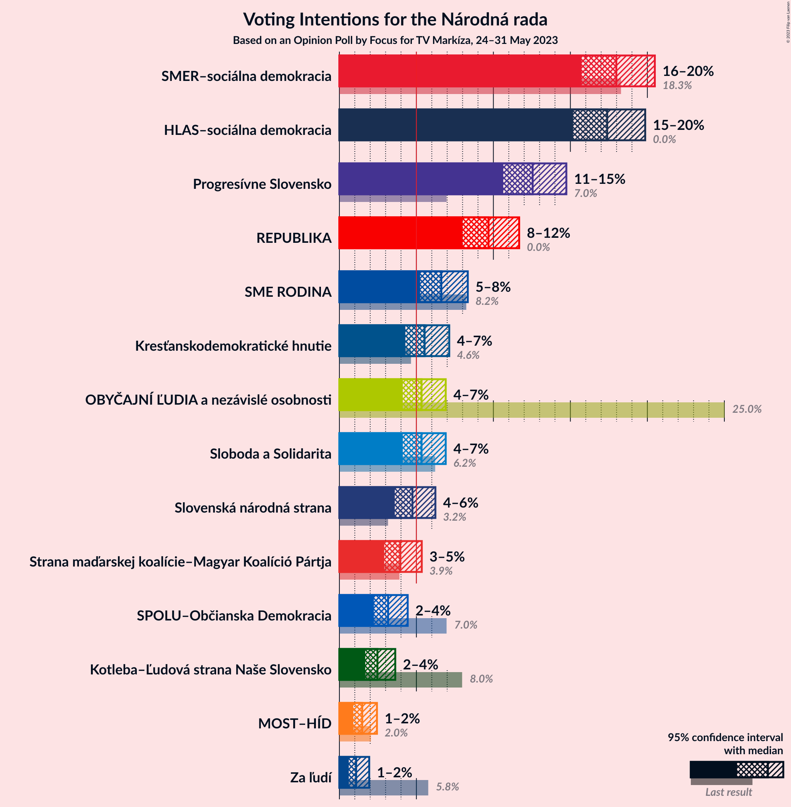

### Confidence Intervals

| Party | Last Result | Poll Result | 80% Confidence Interval | 90% Confidence Interval | 95% Confidence Interval | 99% Confidence Interval |
|:-----:|:-----------:|:-----------:|:-----------------------:|:-----------------------:|:-----------------------:|:-----------------------:|
| SMER–sociálna demokracia | 18.3% | 18.0% | 16.5–19.6% |16.1–20.1% |15.7–20.5% |15.1–21.3% |
| HLAS–sociálna demokracia | 0.0% | 17.4% | 15.9–19.0% |15.5–19.5% |15.2–19.9% |14.5–20.7% |
| Progresívne Slovensko | 7.0% | 12.5% | 11.3–14.0% |10.9–14.4% |10.6–14.7% |10.1–15.5% |
| REPUBLIKA | 0.0% | 9.7% | 8.6–11.0% |8.3–11.3% |8.0–11.7% |7.5–12.3% |
| SME RODINA | 8.2% | 6.6% | 5.7–7.7% |5.5–8.0% |5.2–8.3% |4.8–8.9% |
| Kresťanskodemokratické hnutie | 4.6% | 5.5% | 4.7–6.6% |4.5–6.9% |4.3–7.1% |3.9–7.7% |
| Sloboda a Solidarita | 6.2% | 5.3% | 4.5–6.4% |4.3–6.6% |4.1–6.9% |3.7–7.4% |
| OBYČAJNÍ ĽUDIA a nezávislé osobnosti | 25.0% | 5.3% | 4.5–6.4% |4.3–6.6% |4.1–6.9% |3.7–7.4% |
| Slovenská národná strana | 3.2% | 4.7% | 4.0–5.7% |3.8–6.0% |3.6–6.2% |3.3–6.7% |
| Strana maďarskej koalície–Magyar Koalíció Pártja | 3.9% | 4.0% | 3.3–4.9% |3.1–5.1% |2.9–5.3% |2.6–5.8% |
| SPOLU–Občianska Demokracia | 7.0% | 3.2% | 2.6–4.0% |2.4–4.2% |2.2–4.4% |2.0–4.9% |
| Kotleba–Ľudová strana Naše Slovensko | 8.0% | 2.5% | 2.0–3.2% |1.8–3.4% |1.7–3.6% |1.4–4.0% |
| MOST–HÍD | 2.0% | 1.5% | 1.1–2.1% |1.0–2.3% |0.9–2.4% |0.7–2.8% |
| Za ľudí | 5.8% | 1.1% | 0.8–1.6% |0.7–1.8% |0.6–1.9% |0.5–2.2% |

*Note:* The poll result column reflects the actual value used in the calculations. Published results may vary slightly, and in addition be rounded to fewer digits.

## Seats

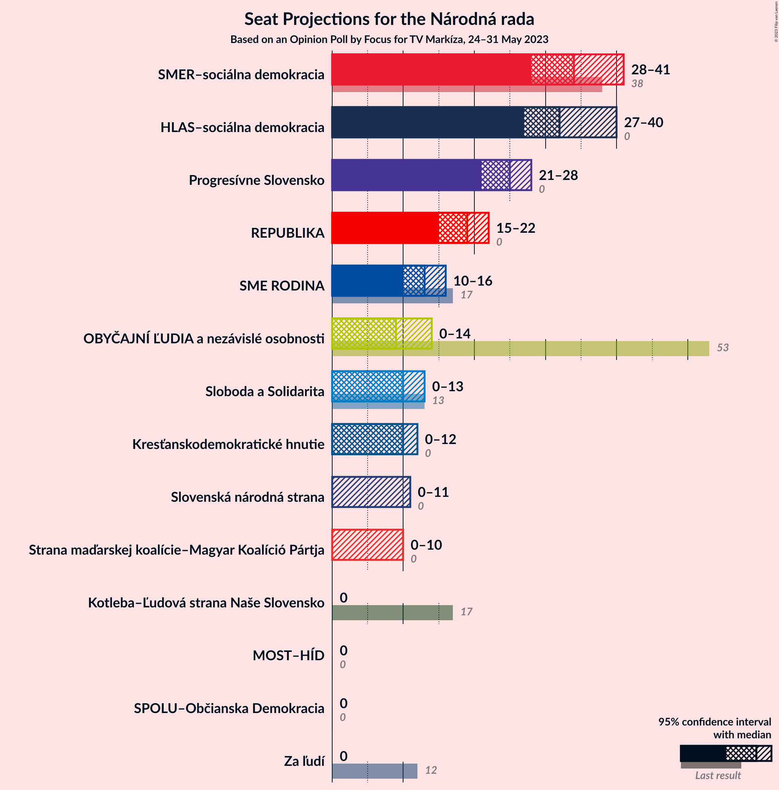

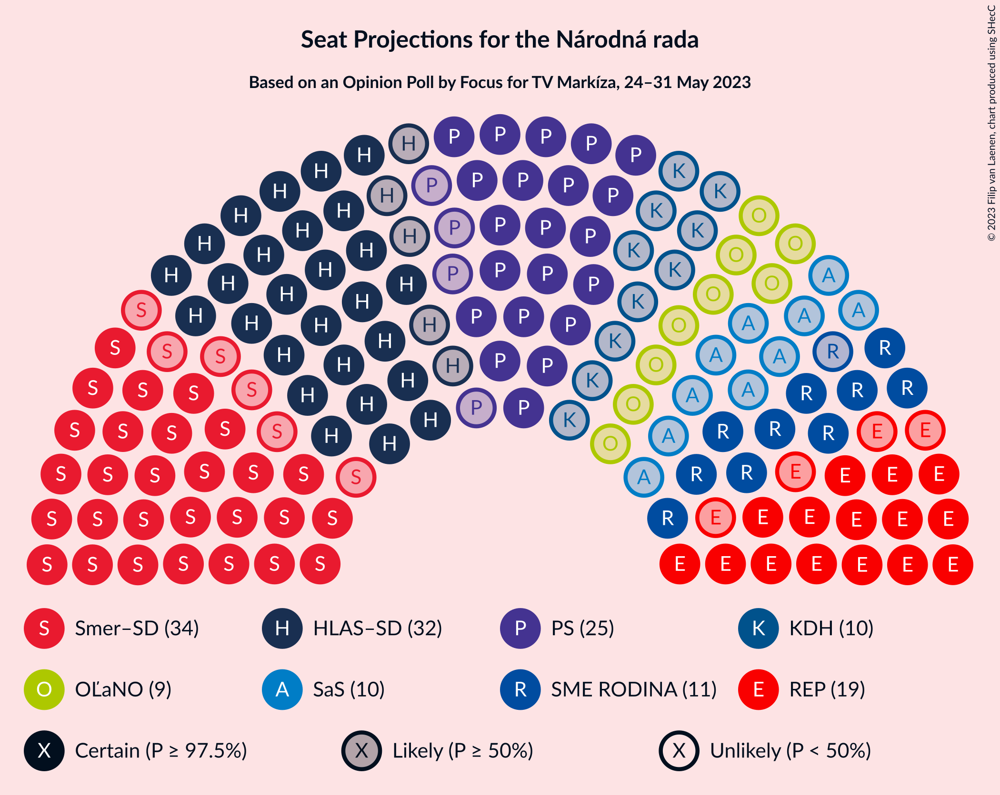

### Confidence Intervals

| Party | Last Result | Median | 80% Confidence Interval | 90% Confidence Interval | 95% Confidence Interval | 99% Confidence Interval |
|:-----:|:-----------:|:------:|:-----------------------:|:-----------------------:|:-----------------------:|:-----------------------:|
| <a href="#smer–sociálna-demokracia">SMER–sociálna demokracia</a> | 38 | 34 | 29–40 |29–41 |28–41 |28–46 |
| <a href="#hlas–sociálna-demokracia">HLAS–sociálna demokracia</a> | 0 | 32 | 27–38 |27–40 |27–40 |25–42 |
| <a href="#progresívne-slovensko">Progresívne Slovensko</a> | 0 | 25 | 23–28 |22–28 |21–28 |19–29 |
| <a href="#republika">REPUBLIKA</a> | 0 | 19 | 17–22 |16–22 |15–22 |14–23 |
| <a href="#sme-rodina">SME RODINA</a> | 17 | 13 | 11–14 |10–14 |10–16 |0–16 |
| <a href="#kresťanskodemokratické-hnutie">Kresťanskodemokratické hnutie</a> | 0 | 10 | 0–12 |0–12 |0–12 |0–13 |
| <a href="#sloboda-a-solidarita">Sloboda a Solidarita</a> | 13 | 10 | 0–12 |0–13 |0–13 |0–13 |
| <a href="#obyčajní-ľudia-a-nezávislé-osobnosti">OBYČAJNÍ ĽUDIA a nezávislé osobnosti</a> | 53 | 9 | 0–13 |0–13 |0–14 |0–14 |
| <a href="#slovenská-národná-strana">Slovenská národná strana</a> | 0 | 0 | 0–10 |0–10 |0–11 |0–12 |
| <a href="#strana-maďarskej-koalície–magyar-koalíció-pártja">Strana maďarskej koalície–Magyar Koalíció Pártja</a> | 0 | 0 | 0 |0–9 |0–10 |0–11 |
| <a href="#spolu–občianska-demokracia">SPOLU–Občianska Demokracia</a> | 0 | 0 | 0 |0 |0 |0 |
| <a href="#kotleba–ľudová-strana-naše-slovensko">Kotleba–Ľudová strana Naše Slovensko</a> | 17 | 0 | 0 |0 |0 |0 |
| <a href="#most–híd">MOST–HÍD</a> | 0 | 0 | 0 |0 |0 |0 |
| <a href="#za-ľudí">Za ľudí</a> | 12 | 0 | 0 |0 |0 |0 |

### SMER–sociálna demokracia

*For a full overview of the results for this party, see the [SMER–sociálna demokracia](party-smer–sociálnademokracia.html) page.*

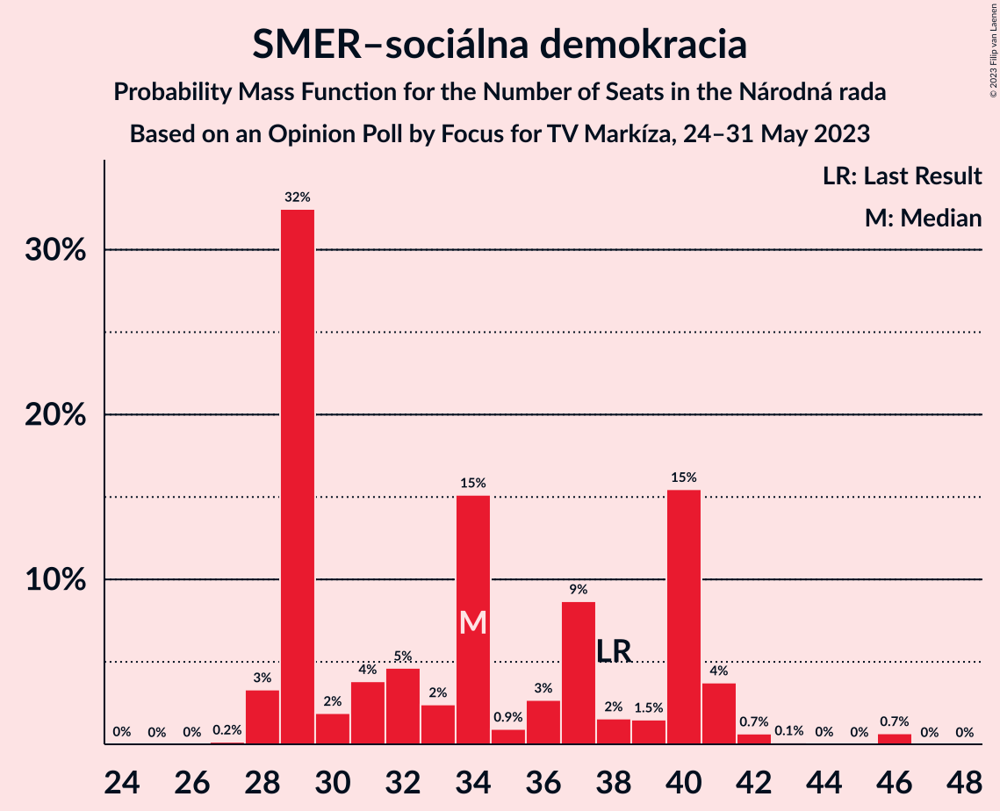

| Number of Seats | Probability | Accumulated | Special Marks |
|:---------------:|:-----------:|:-----------:|:-------------:|
| 25 | 0% | 100% |  |
| 26 | 0% | 99.9% |  |
| 27 | 0.2% | 99.9% |  |
| 28 | 3% | 99.8% |  |
| 29 | 32% | 96% |  |
| 30 | 2% | 64% |  |
| 31 | 4% | 62% |  |
| 32 | 5% | 58% |  |
| 33 | 2% | 54% |  |
| 34 | 15% | 51% | Median |
| 35 | 0.9% | 36% |  |
| 36 | 3% | 35% |  |
| 37 | 9% | 32% |  |
| 38 | 2% | 24% | Last Result |
| 39 | 1.5% | 22% |  |
| 40 | 15% | 21% |  |
| 41 | 4% | 5% |  |
| 42 | 0.7% | 1.5% |  |
| 43 | 0.1% | 0.8% |  |
| 44 | 0% | 0.7% |  |
| 45 | 0% | 0.7% |  |
| 46 | 0.7% | 0.7% |  |
| 47 | 0% | 0% |  |

### HLAS–sociálna demokracia

*For a full overview of the results for this party, see the [HLAS–sociálna demokracia](party-hlas–sociálnademokracia.html) page.*

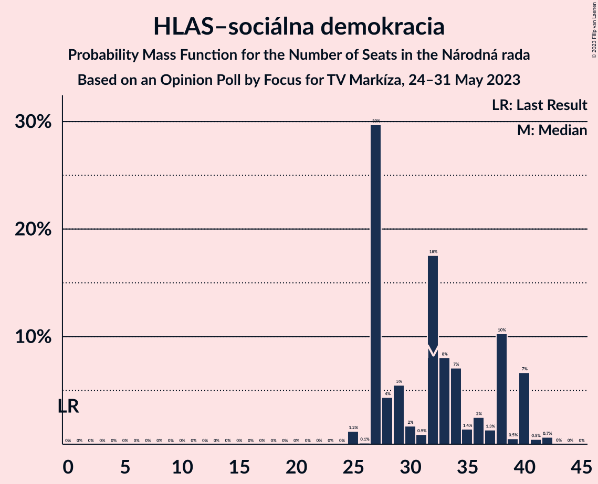

| Number of Seats | Probability | Accumulated | Special Marks |
|:---------------:|:-----------:|:-----------:|:-------------:|
| 0 | 0% | 100% | Last Result |
| 1 | 0% | 100% |  |
| 2 | 0% | 100% |  |
| 3 | 0% | 100% |  |
| 4 | 0% | 100% |  |
| 5 | 0% | 100% |  |
| 6 | 0% | 100% |  |
| 7 | 0% | 100% |  |
| 8 | 0% | 100% |  |
| 9 | 0% | 100% |  |
| 10 | 0% | 100% |  |
| 11 | 0% | 100% |  |
| 12 | 0% | 100% |  |
| 13 | 0% | 100% |  |
| 14 | 0% | 100% |  |
| 15 | 0% | 100% |  |
| 16 | 0% | 100% |  |
| 17 | 0% | 100% |  |
| 18 | 0% | 100% |  |
| 19 | 0% | 100% |  |
| 20 | 0% | 100% |  |
| 21 | 0% | 100% |  |
| 22 | 0% | 100% |  |
| 23 | 0% | 100% |  |
| 24 | 0% | 100% |  |
| 25 | 1.2% | 100% |  |
| 26 | 0.1% | 98.8% |  |
| 27 | 30% | 98.7% |  |
| 28 | 4% | 69% |  |
| 29 | 5% | 65% |  |
| 30 | 2% | 59% |  |
| 31 | 0.9% | 57% |  |
| 32 | 18% | 57% | Median |
| 33 | 8% | 39% |  |
| 34 | 7% | 31% |  |
| 35 | 1.4% | 24% |  |
| 36 | 2% | 22% |  |
| 37 | 1.3% | 20% |  |
| 38 | 10% | 19% |  |
| 39 | 0.5% | 8% |  |
| 40 | 7% | 8% |  |
| 41 | 0.5% | 1.2% |  |
| 42 | 0.7% | 0.7% |  |
| 43 | 0% | 0% |  |

### Progresívne Slovensko

*For a full overview of the results for this party, see the [Progresívne Slovensko](party-progresívneslovensko.html) page.*

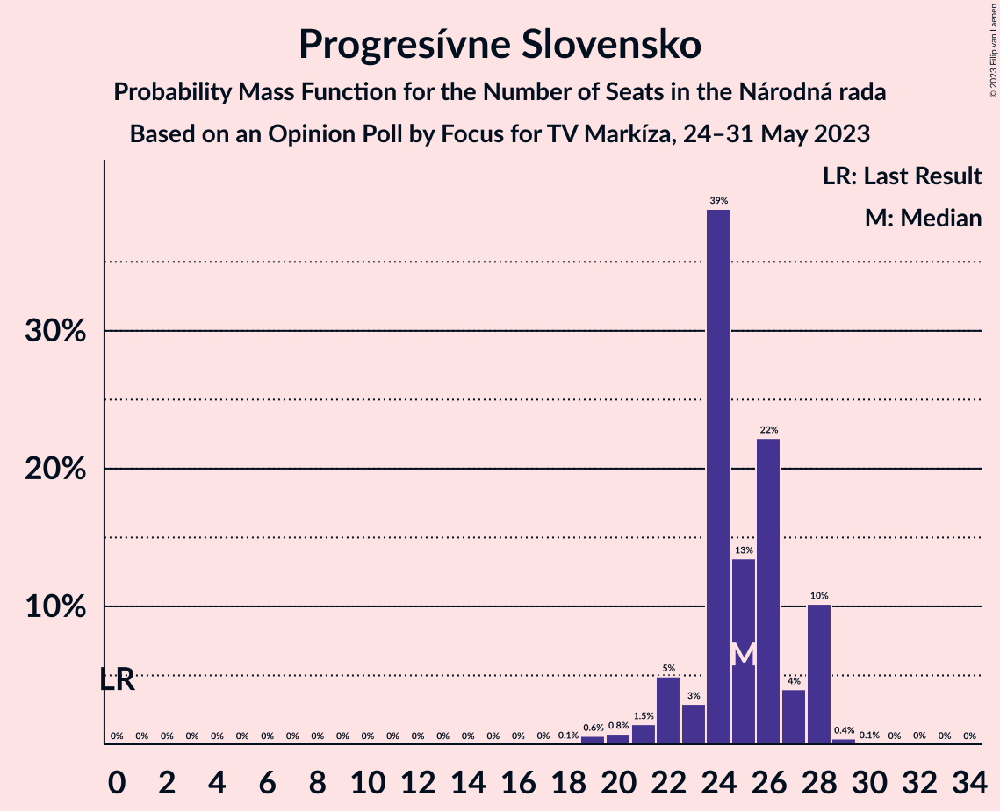

| Number of Seats | Probability | Accumulated | Special Marks |
|:---------------:|:-----------:|:-----------:|:-------------:|
| 0 | 0% | 100% | Last Result |
| 1 | 0% | 100% |  |
| 2 | 0% | 100% |  |
| 3 | 0% | 100% |  |
| 4 | 0% | 100% |  |
| 5 | 0% | 100% |  |
| 6 | 0% | 100% |  |
| 7 | 0% | 100% |  |
| 8 | 0% | 100% |  |
| 9 | 0% | 100% |  |
| 10 | 0% | 100% |  |
| 11 | 0% | 100% |  |
| 12 | 0% | 100% |  |
| 13 | 0% | 100% |  |
| 14 | 0% | 100% |  |
| 15 | 0% | 100% |  |
| 16 | 0% | 100% |  |
| 17 | 0% | 100% |  |
| 18 | 0.1% | 100% |  |
| 19 | 0.6% | 99.9% |  |
| 20 | 0.8% | 99.3% |  |
| 21 | 1.5% | 98.6% |  |
| 22 | 5% | 97% |  |
| 23 | 3% | 92% |  |
| 24 | 39% | 89% |  |
| 25 | 13% | 50% | Median |
| 26 | 22% | 37% |  |
| 27 | 4% | 15% |  |
| 28 | 10% | 11% |  |
| 29 | 0.4% | 0.6% |  |
| 30 | 0.1% | 0.1% |  |
| 31 | 0% | 0.1% |  |
| 32 | 0% | 0.1% |  |
| 33 | 0% | 0% |  |

### REPUBLIKA

*For a full overview of the results for this party, see the [REPUBLIKA](party-republika.html) page.*

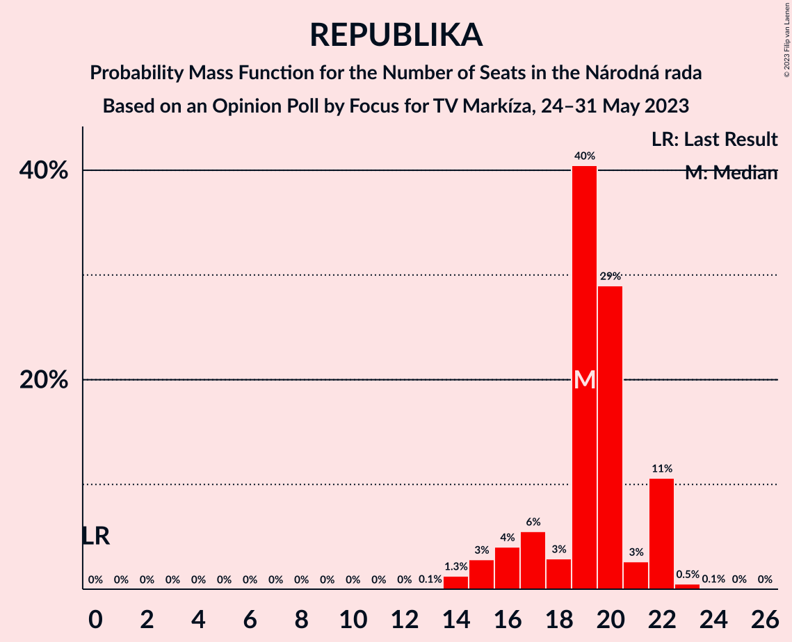

| Number of Seats | Probability | Accumulated | Special Marks |
|:---------------:|:-----------:|:-----------:|:-------------:|
| 0 | 0% | 100% | Last Result |
| 1 | 0% | 100% |  |
| 2 | 0% | 100% |  |
| 3 | 0% | 100% |  |
| 4 | 0% | 100% |  |
| 5 | 0% | 100% |  |
| 6 | 0% | 100% |  |
| 7 | 0% | 100% |  |
| 8 | 0% | 100% |  |
| 9 | 0% | 100% |  |
| 10 | 0% | 100% |  |
| 11 | 0% | 100% |  |
| 12 | 0% | 100% |  |
| 13 | 0.1% | 100% |  |
| 14 | 1.3% | 99.9% |  |
| 15 | 3% | 98.7% |  |
| 16 | 4% | 96% |  |
| 17 | 6% | 92% |  |
| 18 | 3% | 86% |  |
| 19 | 40% | 83% | Median |
| 20 | 29% | 43% |  |
| 21 | 3% | 14% |  |
| 22 | 11% | 11% |  |
| 23 | 0.5% | 0.7% |  |
| 24 | 0.1% | 0.2% |  |
| 25 | 0% | 0.1% |  |
| 26 | 0% | 0% |  |

### SME RODINA

*For a full overview of the results for this party, see the [SME RODINA](party-smerodina.html) page.*

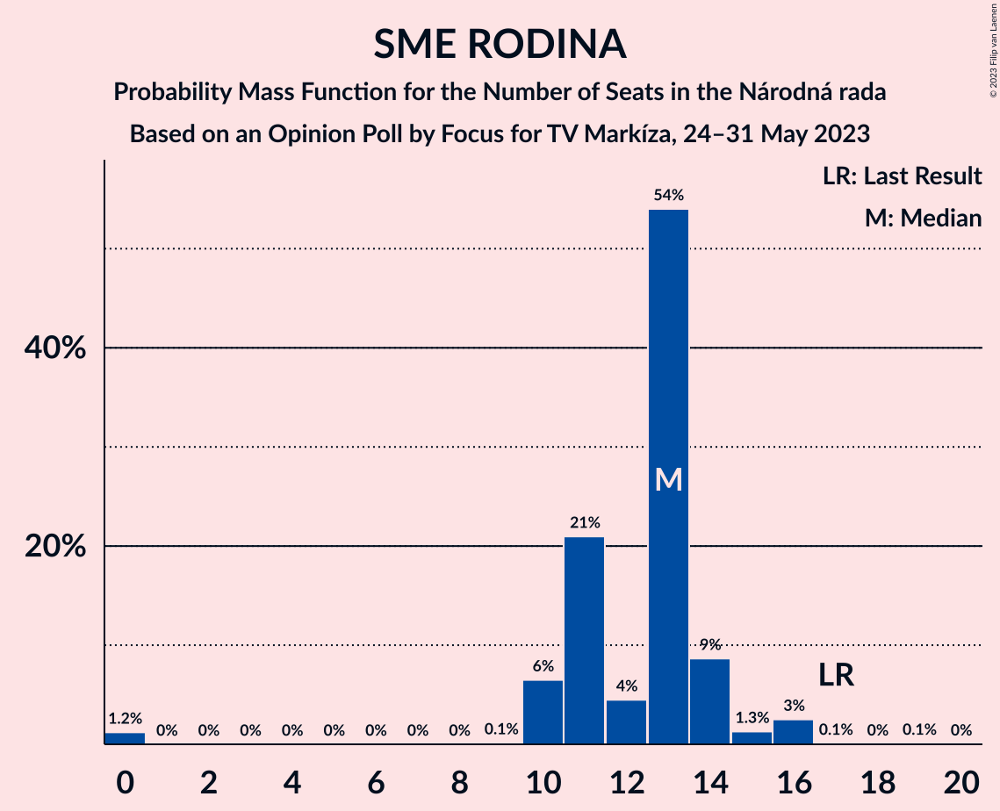

| Number of Seats | Probability | Accumulated | Special Marks |
|:---------------:|:-----------:|:-----------:|:-------------:|
| 0 | 1.2% | 100% |  |
| 1 | 0% | 98.8% |  |
| 2 | 0% | 98.8% |  |
| 3 | 0% | 98.8% |  |
| 4 | 0% | 98.8% |  |
| 5 | 0% | 98.8% |  |
| 6 | 0% | 98.8% |  |
| 7 | 0% | 98.8% |  |
| 8 | 0% | 98.8% |  |
| 9 | 0.1% | 98.8% |  |
| 10 | 6% | 98.6% |  |
| 11 | 21% | 92% |  |
| 12 | 4% | 71% |  |
| 13 | 54% | 67% | Median |
| 14 | 9% | 13% |  |
| 15 | 1.3% | 4% |  |
| 16 | 3% | 3% |  |
| 17 | 0.1% | 0.2% | Last Result |
| 18 | 0% | 0.1% |  |
| 19 | 0.1% | 0.1% |  |
| 20 | 0% | 0% |  |

### Kresťanskodemokratické hnutie

*For a full overview of the results for this party, see the [Kresťanskodemokratické hnutie](party-kresťanskodemokratickéhnutie.html) page.*

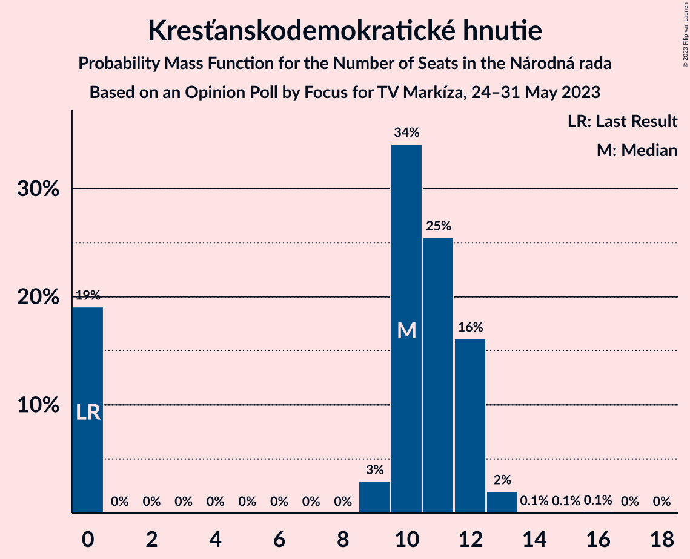

| Number of Seats | Probability | Accumulated | Special Marks |
|:---------------:|:-----------:|:-----------:|:-------------:|
| 0 | 19% | 100% | Last Result |
| 1 | 0% | 81% |  |
| 2 | 0% | 81% |  |
| 3 | 0% | 81% |  |
| 4 | 0% | 81% |  |
| 5 | 0% | 81% |  |
| 6 | 0% | 81% |  |
| 7 | 0% | 81% |  |
| 8 | 0% | 81% |  |
| 9 | 3% | 81% |  |
| 10 | 34% | 78% | Median |
| 11 | 25% | 44% |  |
| 12 | 16% | 18% |  |
| 13 | 2% | 2% |  |
| 14 | 0.1% | 0.3% |  |
| 15 | 0.1% | 0.2% |  |
| 16 | 0.1% | 0.1% |  |
| 17 | 0% | 0% |  |

### Sloboda a Solidarita

*For a full overview of the results for this party, see the [Sloboda a Solidarita](party-slobodaasolidarita.html) page.*

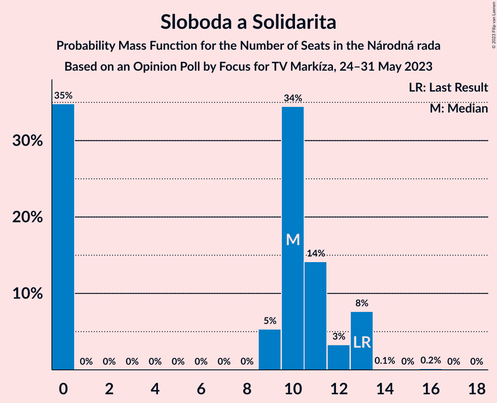

| Number of Seats | Probability | Accumulated | Special Marks |
|:---------------:|:-----------:|:-----------:|:-------------:|
| 0 | 35% | 100% |  |
| 1 | 0% | 65% |  |
| 2 | 0% | 65% |  |
| 3 | 0% | 65% |  |
| 4 | 0% | 65% |  |
| 5 | 0% | 65% |  |
| 6 | 0% | 65% |  |
| 7 | 0% | 65% |  |
| 8 | 0% | 65% |  |
| 9 | 5% | 65% |  |
| 10 | 34% | 60% | Median |
| 11 | 14% | 25% |  |
| 12 | 3% | 11% |  |
| 13 | 8% | 8% | Last Result |
| 14 | 0.1% | 0.3% |  |
| 15 | 0% | 0.2% |  |
| 16 | 0.2% | 0.2% |  |
| 17 | 0% | 0% |  |

### OBYČAJNÍ ĽUDIA a nezávislé osobnosti

*For a full overview of the results for this party, see the [OBYČAJNÍ ĽUDIA a nezávislé osobnosti](party-obyčajníľudiaanezávisléosobnosti.html) page.*

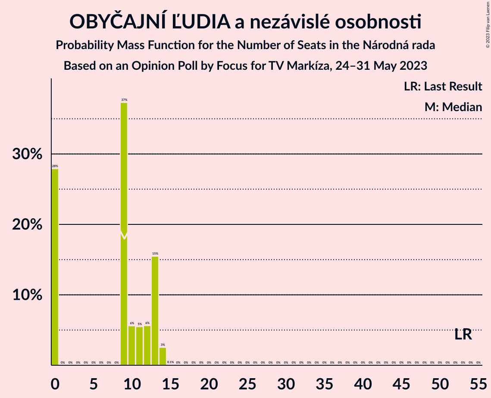

| Number of Seats | Probability | Accumulated | Special Marks |
|:---------------:|:-----------:|:-----------:|:-------------:|
| 0 | 28% | 100% |  |
| 1 | 0% | 72% |  |
| 2 | 0% | 72% |  |
| 3 | 0% | 72% |  |
| 4 | 0% | 72% |  |
| 5 | 0% | 72% |  |
| 6 | 0% | 72% |  |
| 7 | 0% | 72% |  |
| 8 | 0% | 72% |  |
| 9 | 37% | 72% | Median |
| 10 | 6% | 35% |  |
| 11 | 5% | 29% |  |
| 12 | 6% | 24% |  |
| 13 | 15% | 18% |  |
| 14 | 3% | 3% |  |
| 15 | 0.1% | 0.1% |  |
| 16 | 0% | 0% |  |
| 17 | 0% | 0% |  |
| 18 | 0% | 0% |  |
| 19 | 0% | 0% |  |
| 20 | 0% | 0% |  |
| 21 | 0% | 0% |  |
| 22 | 0% | 0% |  |
| 23 | 0% | 0% |  |
| 24 | 0% | 0% |  |
| 25 | 0% | 0% |  |
| 26 | 0% | 0% |  |
| 27 | 0% | 0% |  |
| 28 | 0% | 0% |  |
| 29 | 0% | 0% |  |
| 30 | 0% | 0% |  |
| 31 | 0% | 0% |  |
| 32 | 0% | 0% |  |
| 33 | 0% | 0% |  |
| 34 | 0% | 0% |  |
| 35 | 0% | 0% |  |
| 36 | 0% | 0% |  |
| 37 | 0% | 0% |  |
| 38 | 0% | 0% |  |
| 39 | 0% | 0% |  |
| 40 | 0% | 0% |  |
| 41 | 0% | 0% |  |
| 42 | 0% | 0% |  |
| 43 | 0% | 0% |  |
| 44 | 0% | 0% |  |
| 45 | 0% | 0% |  |
| 46 | 0% | 0% |  |
| 47 | 0% | 0% |  |
| 48 | 0% | 0% |  |
| 49 | 0% | 0% |  |
| 50 | 0% | 0% |  |
| 51 | 0% | 0% |  |
| 52 | 0% | 0% |  |
| 53 | 0% | 0% | Last Result |

### Slovenská národná strana

*For a full overview of the results for this party, see the [Slovenská národná strana](party-slovenskánárodnástrana.html) page.*

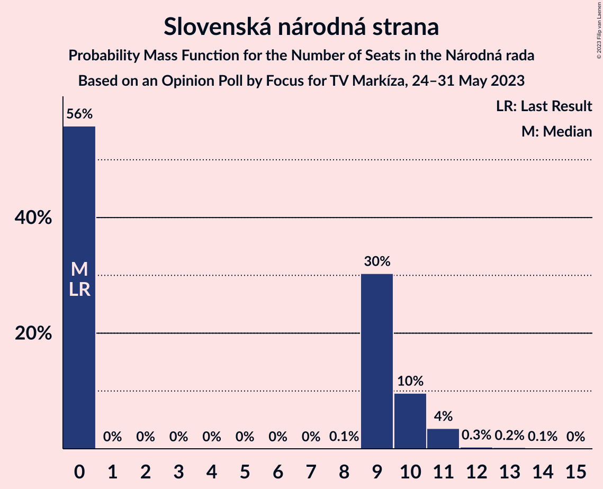

| Number of Seats | Probability | Accumulated | Special Marks |
|:---------------:|:-----------:|:-----------:|:-------------:|
| 0 | 56% | 100% | Last Result, Median |
| 1 | 0% | 44% |  |
| 2 | 0% | 44% |  |
| 3 | 0% | 44% |  |
| 4 | 0% | 44% |  |
| 5 | 0% | 44% |  |
| 6 | 0% | 44% |  |
| 7 | 0% | 44% |  |
| 8 | 0.1% | 44% |  |
| 9 | 30% | 44% |  |
| 10 | 10% | 14% |  |
| 11 | 4% | 4% |  |
| 12 | 0.3% | 0.6% |  |
| 13 | 0.2% | 0.3% |  |
| 14 | 0.1% | 0.1% |  |
| 15 | 0% | 0% |  |

### Strana maďarskej koalície–Magyar Koalíció Pártja

*For a full overview of the results for this party, see the [Strana maďarskej koalície–Magyar Koalíció Pártja](party-stranamaďarskejkoalície–magyarkoalíciópártja.html) page.*

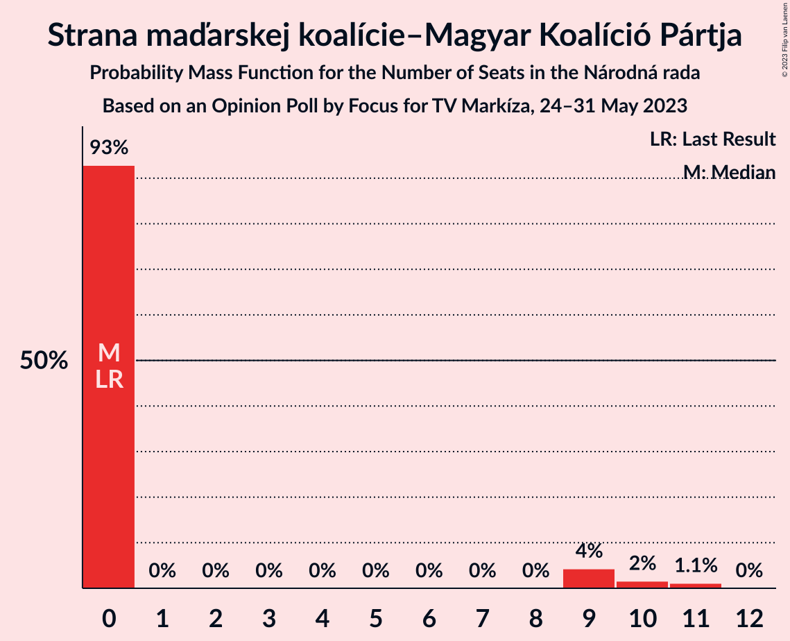

| Number of Seats | Probability | Accumulated | Special Marks |
|:---------------:|:-----------:|:-----------:|:-------------:|
| 0 | 93% | 100% | Last Result, Median |
| 1 | 0% | 7% |  |
| 2 | 0% | 7% |  |
| 3 | 0% | 7% |  |
| 4 | 0% | 7% |  |
| 5 | 0% | 7% |  |
| 6 | 0% | 7% |  |
| 7 | 0% | 7% |  |
| 8 | 0% | 7% |  |
| 9 | 4% | 7% |  |
| 10 | 2% | 3% |  |
| 11 | 1.1% | 1.2% |  |
| 12 | 0% | 0% |  |

### SPOLU–Občianska Demokracia

*For a full overview of the results for this party, see the [SPOLU–Občianska Demokracia](party-spolu–občianskademokracia.html) page.*

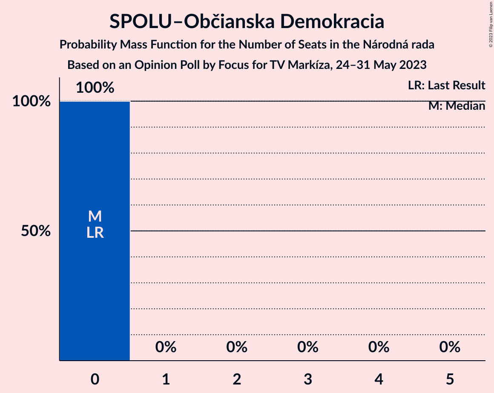

| Number of Seats | Probability | Accumulated | Special Marks |
|:---------------:|:-----------:|:-----------:|:-------------:|
| 0 | 100% | 100% | Last Result, Median |

### Kotleba–Ľudová strana Naše Slovensko

*For a full overview of the results for this party, see the [Kotleba–Ľudová strana Naše Slovensko](party-kotleba–ľudovástrananašeslovensko.html) page.*

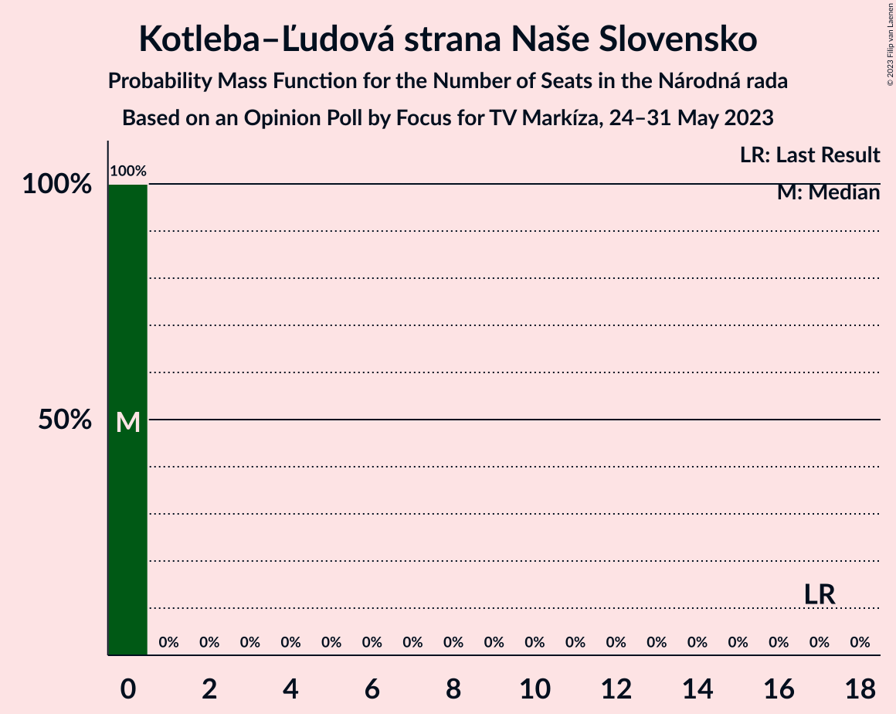

| Number of Seats | Probability | Accumulated | Special Marks |
|:---------------:|:-----------:|:-----------:|:-------------:|
| 0 | 100% | 100% | Median |
| 1 | 0% | 0% |  |
| 2 | 0% | 0% |  |
| 3 | 0% | 0% |  |
| 4 | 0% | 0% |  |
| 5 | 0% | 0% |  |
| 6 | 0% | 0% |  |
| 7 | 0% | 0% |  |
| 8 | 0% | 0% |  |
| 9 | 0% | 0% |  |
| 10 | 0% | 0% |  |
| 11 | 0% | 0% |  |
| 12 | 0% | 0% |  |
| 13 | 0% | 0% |  |
| 14 | 0% | 0% |  |
| 15 | 0% | 0% |  |
| 16 | 0% | 0% |  |
| 17 | 0% | 0% | Last Result |

### MOST–HÍD

*For a full overview of the results for this party, see the [MOST–HÍD](party-most–híd.html) page.*

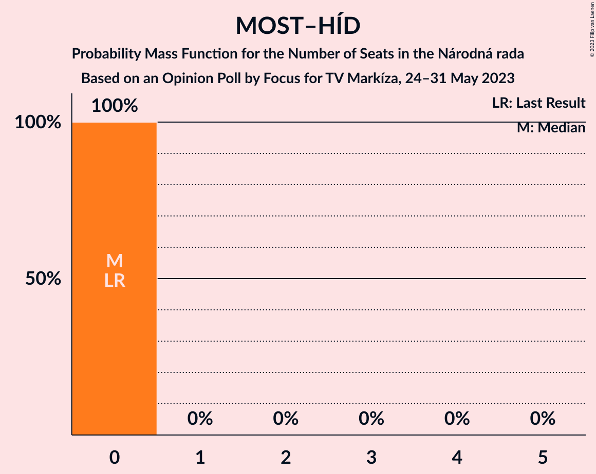

| Number of Seats | Probability | Accumulated | Special Marks |
|:---------------:|:-----------:|:-----------:|:-------------:|
| 0 | 100% | 100% | Last Result, Median |

### Za ľudí

*For a full overview of the results for this party, see the [Za ľudí](party-zaľudí.html) page.*

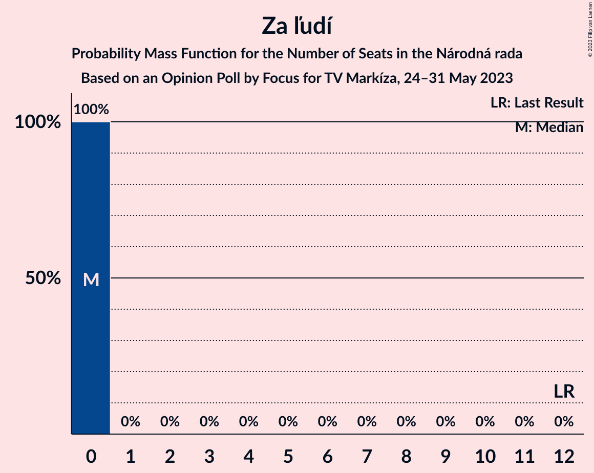

| Number of Seats | Probability | Accumulated | Special Marks |
|:---------------:|:-----------:|:-----------:|:-------------:|
| 0 | 100% | 100% | Median |
| 1 | 0% | 0% |  |
| 2 | 0% | 0% |  |
| 3 | 0% | 0% |  |
| 4 | 0% | 0% |  |
| 5 | 0% | 0% |  |
| 6 | 0% | 0% |  |
| 7 | 0% | 0% |  |
| 8 | 0% | 0% |  |
| 9 | 0% | 0% |  |
| 10 | 0% | 0% |  |
| 11 | 0% | 0% |  |
| 12 | 0% | 0% | Last Result |

## Coalitions

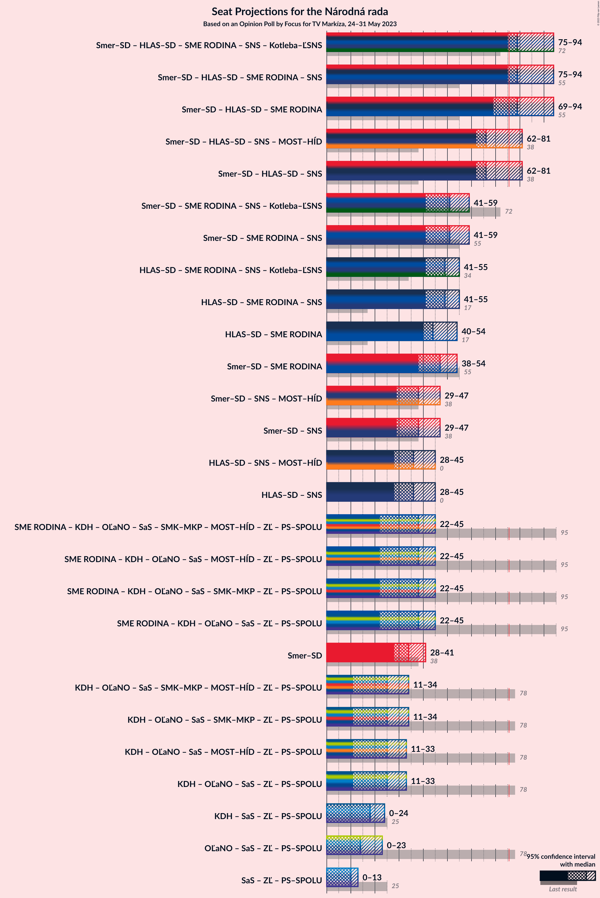

### Confidence Intervals

| Coalition | Last Result | Median | Majority? | 80% Confidence Interval | 90% Confidence Interval | 95% Confidence Interval | 99% Confidence Interval |
|:---------:|:-----------:|:------:|:---------:|:-----------------------:|:-----------------------:|:-----------------------:|:-----------------------:|
| SMER–sociálna demokracia – HLAS–sociálna demokracia – SME RODINA – Slovenská národná strana – Kotleba–Ľudová strana Naše Slovensko | 72 | 79 | 95% | 78–91 | 75–94 | 75–94 | 70–96 |
| SMER–sociálna demokracia – HLAS–sociálna demokracia – SME RODINA – Slovenská národná strana | 55 | 79 | 95% | 78–91 | 75–94 | 75–94 | 70–96 |
| SMER–sociálna demokracia – HLAS–sociálna demokracia – SME RODINA | 55 | 79 | 56% | 69–89 | 69–94 | 69–94 | 69–94 |
| SMER–sociálna demokracia – HLAS–sociálna demokracia – Slovenská národná strana – MOST–HÍD | 38 | 66 | 22% | 65–79 | 63–80 | 62–81 | 58–88 |
| SMER–sociálna demokracia – HLAS–sociálna demokracia – Slovenská národná strana | 38 | 66 | 22% | 65–79 | 63–80 | 62–81 | 58–88 |
| SMER–sociálna demokracia – SME RODINA – Slovenská národná strana – Kotleba–Ľudová strana Naše Slovensko | 72 | 51 | 0% | 47–54 | 43–57 | 41–59 | 40–62 |
| SMER–sociálna demokracia – SME RODINA – Slovenská národná strana | 55 | 51 | 0% | 47–54 | 43–57 | 41–59 | 40–62 |
| HLAS–sociálna demokracia – SME RODINA – Slovenská národná strana – Kotleba–Ľudová strana Naše Slovensko | 34 | 49 | 0% | 44–54 | 41–54 | 41–55 | 41–62 |
| HLAS–sociálna demokracia – SME RODINA – Slovenská národná strana | 17 | 49 | 0% | 44–54 | 41–54 | 41–55 | 41–62 |
| HLAS–sociálna demokracia – SME RODINA | 17 | 44 | 0% | 40–49 | 40–54 | 40–54 | 38–54 |
| SMER–sociálna demokracia – SME RODINA | 55 | 47 | 0% | 42–54 | 41–54 | 38–54 | 38–57 |
| SMER–sociálna demokracia – Slovenská národná strana – MOST–HÍD | 38 | 38 | 0% | 34–42 | 31–45 | 29–47 | 29–49 |
| SMER–sociálna demokracia – Slovenská národná strana | 38 | 38 | 0% | 34–42 | 31–45 | 29–47 | 29–49 |
| HLAS–sociálna demokracia – Slovenská národná strana – MOST–HÍD | 0 | 36 | 0% | 32–40 | 29–44 | 28–45 | 28–49 |
| HLAS–sociálna demokracia – Slovenská národná strana | 0 | 36 | 0% | 32–40 | 29–44 | 28–45 | 28–49 |
| SMER–sociálna demokracia | 38 | 34 | 0% | 29–40 | 29–41 | 28–41 | 28–46 |

### SMER–sociálna demokracia – HLAS–sociálna demokracia – SME RODINA – Slovenská národná strana – Kotleba–Ľudová strana Naše Slovensko

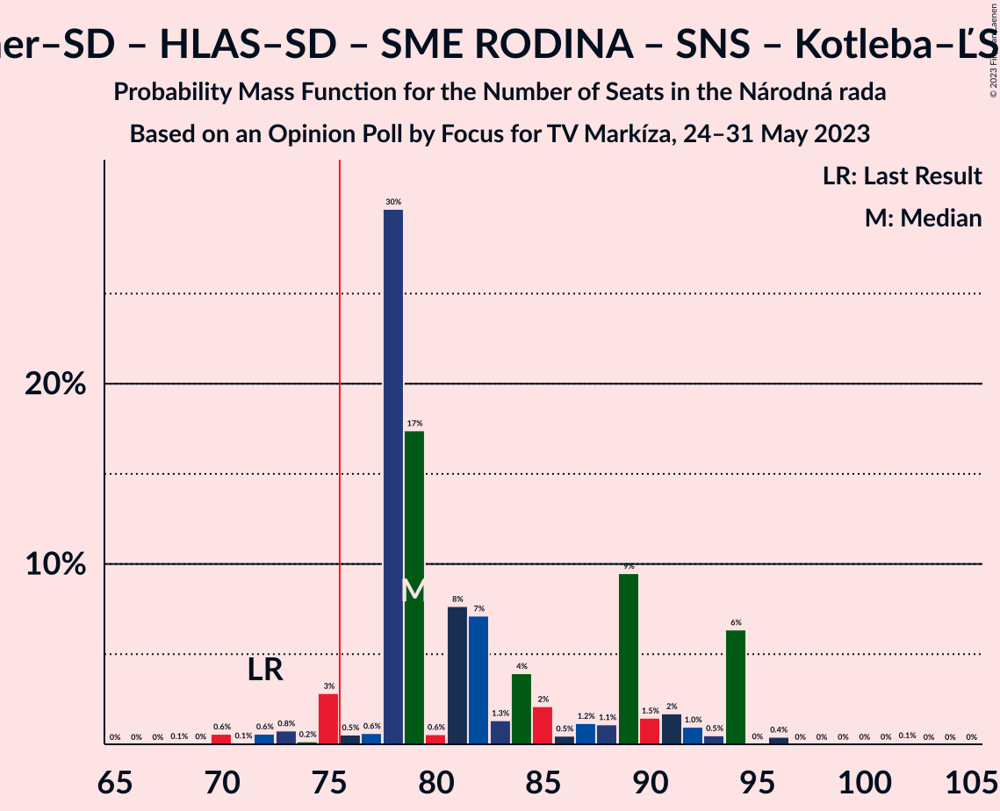

| Number of Seats | Probability | Accumulated | Special Marks |
|:---------------:|:-----------:|:-----------:|:-------------:|
| 68 | 0.1% | 100% |  |
| 69 | 0% | 99.9% |  |
| 70 | 0.6% | 99.9% |  |
| 71 | 0.1% | 99.3% |  |
| 72 | 0.6% | 99.2% | Last Result |
| 73 | 0.8% | 98.7% |  |
| 74 | 0.2% | 98% |  |
| 75 | 3% | 98% |  |
| 76 | 0.5% | 95% | Majority |
| 77 | 0.6% | 94% |  |
| 78 | 30% | 94% |  |
| 79 | 17% | 64% | Median |
| 80 | 0.6% | 47% |  |
| 81 | 8% | 46% |  |
| 82 | 7% | 38% |  |
| 83 | 1.3% | 31% |  |
| 84 | 4% | 30% |  |
| 85 | 2% | 26% |  |
| 86 | 0.5% | 24% |  |
| 87 | 1.2% | 23% |  |
| 88 | 1.1% | 22% |  |
| 89 | 9% | 21% |  |
| 90 | 1.5% | 12% |  |
| 91 | 2% | 10% |  |
| 92 | 1.0% | 8% |  |
| 93 | 0.5% | 8% |  |
| 94 | 6% | 7% |  |
| 95 | 0% | 0.6% |  |
| 96 | 0.4% | 0.6% |  |
| 97 | 0% | 0.2% |  |
| 98 | 0% | 0.2% |  |
| 99 | 0% | 0.2% |  |
| 100 | 0% | 0.2% |  |
| 101 | 0% | 0.1% |  |
| 102 | 0.1% | 0.1% |  |
| 103 | 0% | 0% |  |

### SMER–sociálna demokracia – HLAS–sociálna demokracia – SME RODINA – Slovenská národná strana

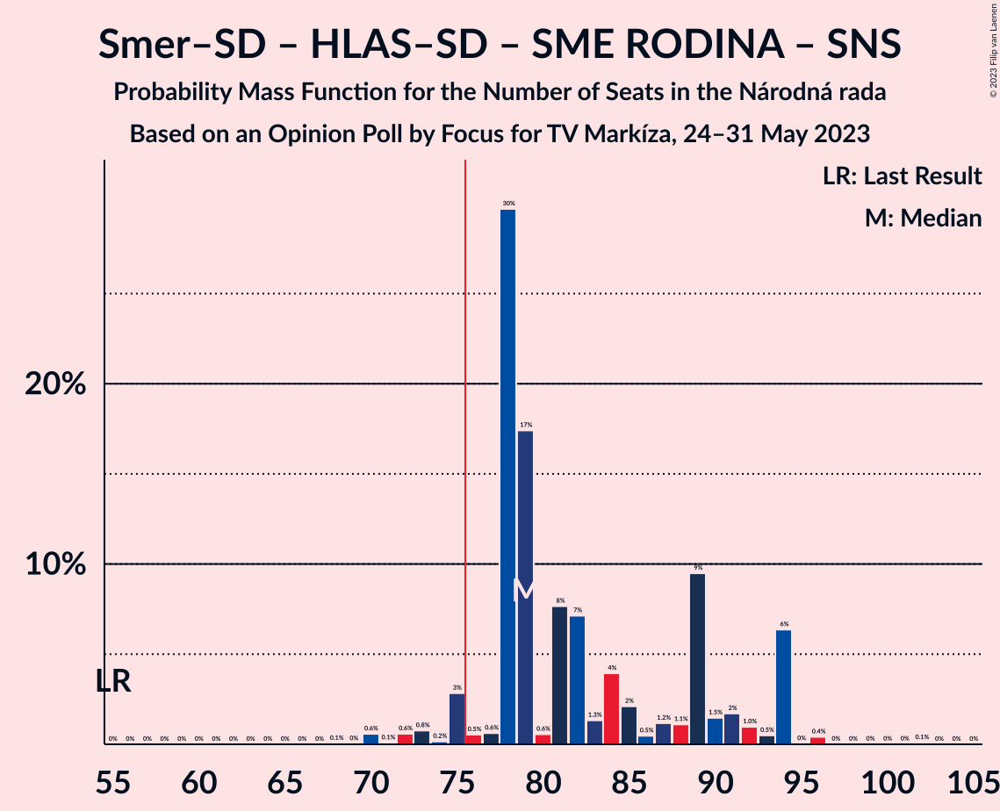

| Number of Seats | Probability | Accumulated | Special Marks |
|:---------------:|:-----------:|:-----------:|:-------------:|
| 55 | 0% | 100% | Last Result |
| 56 | 0% | 100% |  |
| 57 | 0% | 100% |  |
| 58 | 0% | 100% |  |
| 59 | 0% | 100% |  |
| 60 | 0% | 100% |  |
| 61 | 0% | 100% |  |
| 62 | 0% | 100% |  |
| 63 | 0% | 100% |  |
| 64 | 0% | 100% |  |
| 65 | 0% | 100% |  |
| 66 | 0% | 100% |  |
| 67 | 0% | 100% |  |
| 68 | 0.1% | 100% |  |
| 69 | 0% | 99.9% |  |
| 70 | 0.6% | 99.9% |  |
| 71 | 0.1% | 99.3% |  |
| 72 | 0.6% | 99.2% |  |
| 73 | 0.8% | 98.7% |  |
| 74 | 0.2% | 98% |  |
| 75 | 3% | 98% |  |
| 76 | 0.5% | 95% | Majority |
| 77 | 0.6% | 94% |  |
| 78 | 30% | 94% |  |
| 79 | 17% | 64% | Median |
| 80 | 0.6% | 47% |  |
| 81 | 8% | 46% |  |
| 82 | 7% | 38% |  |
| 83 | 1.3% | 31% |  |
| 84 | 4% | 30% |  |
| 85 | 2% | 26% |  |
| 86 | 0.5% | 24% |  |
| 87 | 1.2% | 23% |  |
| 88 | 1.1% | 22% |  |
| 89 | 9% | 21% |  |
| 90 | 1.5% | 12% |  |
| 91 | 2% | 10% |  |
| 92 | 1.0% | 8% |  |
| 93 | 0.5% | 8% |  |
| 94 | 6% | 7% |  |
| 95 | 0% | 0.6% |  |
| 96 | 0.4% | 0.6% |  |
| 97 | 0% | 0.2% |  |
| 98 | 0% | 0.2% |  |
| 99 | 0% | 0.2% |  |
| 100 | 0% | 0.2% |  |
| 101 | 0% | 0.1% |  |
| 102 | 0.1% | 0.1% |  |
| 103 | 0% | 0% |  |

### SMER–sociálna demokracia – HLAS–sociálna demokracia – SME RODINA

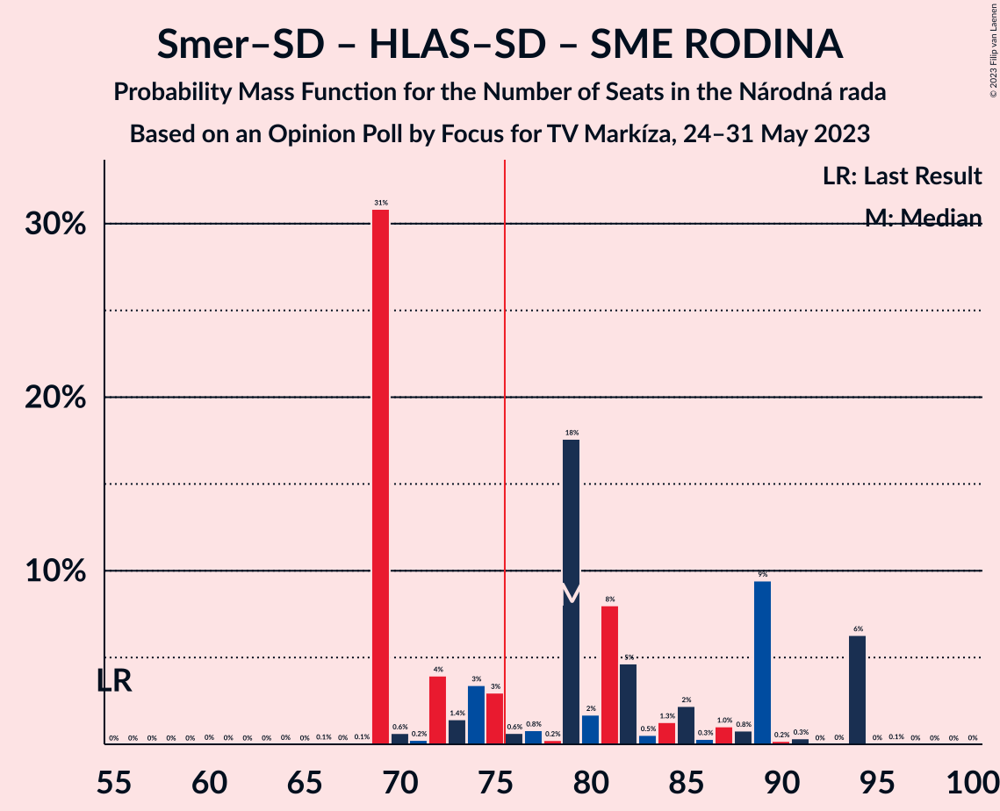

| Number of Seats | Probability | Accumulated | Special Marks |
|:---------------:|:-----------:|:-----------:|:-------------:|
| 55 | 0% | 100% | Last Result |
| 56 | 0% | 100% |  |
| 57 | 0% | 100% |  |
| 58 | 0% | 100% |  |
| 59 | 0% | 100% |  |
| 60 | 0% | 100% |  |
| 61 | 0% | 100% |  |
| 62 | 0% | 99.9% |  |
| 63 | 0% | 99.9% |  |
| 64 | 0% | 99.9% |  |
| 65 | 0% | 99.9% |  |
| 66 | 0.1% | 99.9% |  |
| 67 | 0% | 99.8% |  |
| 68 | 0.1% | 99.8% |  |
| 69 | 31% | 99.7% |  |
| 70 | 0.6% | 69% |  |
| 71 | 0.2% | 68% |  |
| 72 | 4% | 68% |  |
| 73 | 1.4% | 64% |  |
| 74 | 3% | 63% |  |
| 75 | 3% | 59% |  |
| 76 | 0.6% | 56% | Majority |
| 77 | 0.8% | 56% |  |
| 78 | 0.2% | 55% |  |
| 79 | 18% | 55% | Median |
| 80 | 2% | 37% |  |
| 81 | 8% | 35% |  |
| 82 | 5% | 27% |  |
| 83 | 0.5% | 23% |  |
| 84 | 1.3% | 22% |  |
| 85 | 2% | 21% |  |
| 86 | 0.3% | 19% |  |
| 87 | 1.0% | 18% |  |
| 88 | 0.8% | 17% |  |
| 89 | 9% | 16% |  |
| 90 | 0.2% | 7% |  |
| 91 | 0.3% | 7% |  |
| 92 | 0% | 6% |  |
| 93 | 0% | 6% |  |
| 94 | 6% | 6% |  |
| 95 | 0% | 0.1% |  |
| 96 | 0.1% | 0.1% |  |
| 97 | 0% | 0% |  |

### SMER–sociálna demokracia – HLAS–sociálna demokracia – Slovenská národná strana – MOST–HÍD

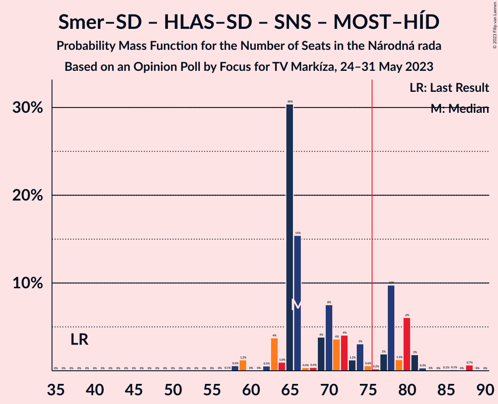

| Number of Seats | Probability | Accumulated | Special Marks |
|:---------------:|:-----------:|:-----------:|:-------------:|
| 38 | 0% | 100% | Last Result |
| 39 | 0% | 100% |  |
| 40 | 0% | 100% |  |
| 41 | 0% | 100% |  |
| 42 | 0% | 100% |  |
| 43 | 0% | 100% |  |
| 44 | 0% | 100% |  |
| 45 | 0% | 100% |  |
| 46 | 0% | 100% |  |
| 47 | 0% | 100% |  |
| 48 | 0% | 100% |  |
| 49 | 0% | 100% |  |
| 50 | 0% | 100% |  |
| 51 | 0% | 100% |  |
| 52 | 0% | 100% |  |
| 53 | 0% | 100% |  |
| 54 | 0% | 100% |  |
| 55 | 0% | 100% |  |
| 56 | 0% | 100% |  |
| 57 | 0.1% | 100% |  |
| 58 | 0.6% | 99.9% |  |
| 59 | 1.2% | 99.3% |  |
| 60 | 0% | 98% |  |
| 61 | 0% | 98% |  |
| 62 | 0.5% | 98% |  |
| 63 | 4% | 97% |  |
| 64 | 1.0% | 94% |  |
| 65 | 30% | 93% |  |
| 66 | 15% | 62% | Median |
| 67 | 0.4% | 47% |  |
| 68 | 0.4% | 47% |  |
| 69 | 4% | 46% |  |
| 70 | 8% | 42% |  |
| 71 | 4% | 35% |  |
| 72 | 4% | 31% |  |
| 73 | 1.2% | 27% |  |
| 74 | 3% | 26% |  |
| 75 | 0.6% | 23% |  |
| 76 | 0.2% | 22% | Majority |
| 77 | 2% | 22% |  |
| 78 | 10% | 20% |  |
| 79 | 1.3% | 10% |  |
| 80 | 6% | 9% |  |
| 81 | 2% | 3% |  |
| 82 | 0.3% | 1.3% |  |
| 83 | 0% | 1.0% |  |
| 84 | 0% | 0.9% |  |
| 85 | 0.1% | 0.9% |  |
| 86 | 0.1% | 0.8% |  |
| 87 | 0% | 0.7% |  |
| 88 | 0.7% | 0.7% |  |
| 89 | 0% | 0.1% |  |
| 90 | 0% | 0% |  |

### SMER–sociálna demokracia – HLAS–sociálna demokracia – Slovenská národná strana

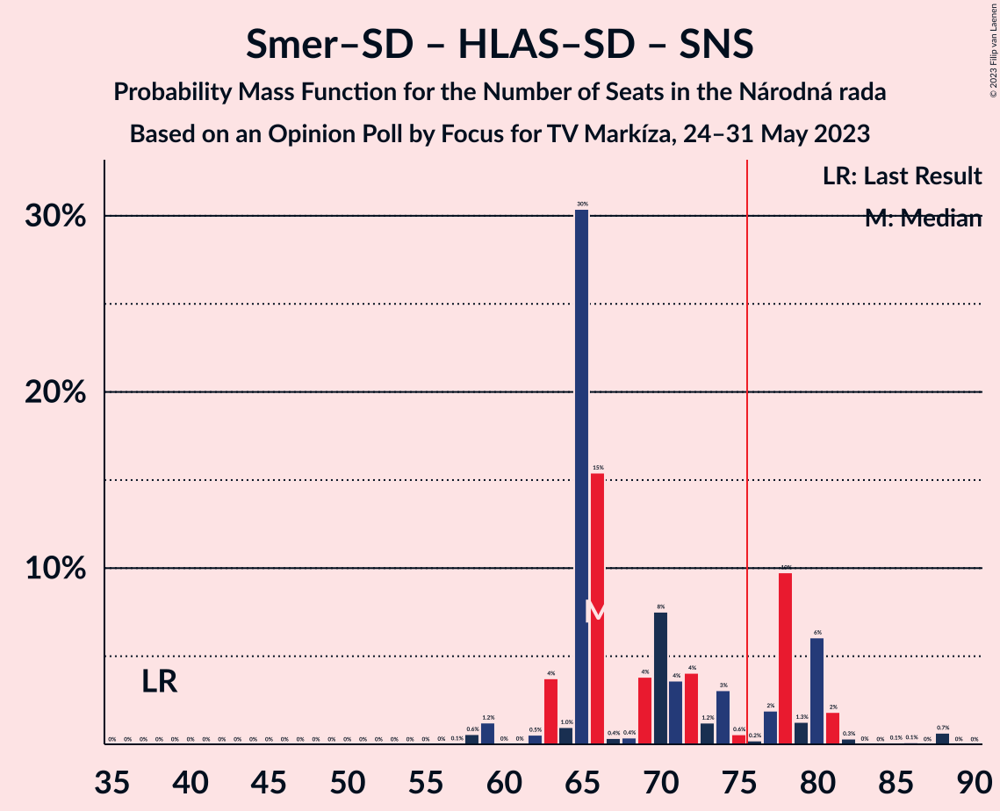

| Number of Seats | Probability | Accumulated | Special Marks |
|:---------------:|:-----------:|:-----------:|:-------------:|
| 38 | 0% | 100% | Last Result |
| 39 | 0% | 100% |  |
| 40 | 0% | 100% |  |
| 41 | 0% | 100% |  |
| 42 | 0% | 100% |  |
| 43 | 0% | 100% |  |
| 44 | 0% | 100% |  |
| 45 | 0% | 100% |  |
| 46 | 0% | 100% |  |
| 47 | 0% | 100% |  |
| 48 | 0% | 100% |  |
| 49 | 0% | 100% |  |
| 50 | 0% | 100% |  |
| 51 | 0% | 100% |  |
| 52 | 0% | 100% |  |
| 53 | 0% | 100% |  |
| 54 | 0% | 100% |  |
| 55 | 0% | 100% |  |
| 56 | 0% | 100% |  |
| 57 | 0.1% | 100% |  |
| 58 | 0.6% | 99.9% |  |
| 59 | 1.2% | 99.3% |  |
| 60 | 0% | 98% |  |
| 61 | 0% | 98% |  |
| 62 | 0.5% | 98% |  |
| 63 | 4% | 97% |  |
| 64 | 1.0% | 94% |  |
| 65 | 30% | 93% |  |
| 66 | 15% | 62% | Median |
| 67 | 0.4% | 47% |  |
| 68 | 0.4% | 47% |  |
| 69 | 4% | 46% |  |
| 70 | 8% | 42% |  |
| 71 | 4% | 35% |  |
| 72 | 4% | 31% |  |
| 73 | 1.2% | 27% |  |
| 74 | 3% | 26% |  |
| 75 | 0.6% | 23% |  |
| 76 | 0.2% | 22% | Majority |
| 77 | 2% | 22% |  |
| 78 | 10% | 20% |  |
| 79 | 1.3% | 10% |  |
| 80 | 6% | 9% |  |
| 81 | 2% | 3% |  |
| 82 | 0.3% | 1.3% |  |
| 83 | 0% | 1.0% |  |
| 84 | 0% | 0.9% |  |
| 85 | 0.1% | 0.9% |  |
| 86 | 0.1% | 0.8% |  |
| 87 | 0% | 0.7% |  |
| 88 | 0.7% | 0.7% |  |
| 89 | 0% | 0.1% |  |
| 90 | 0% | 0% |  |

### SMER–sociálna demokracia – SME RODINA – Slovenská národná strana – Kotleba–Ľudová strana Naše Slovensko

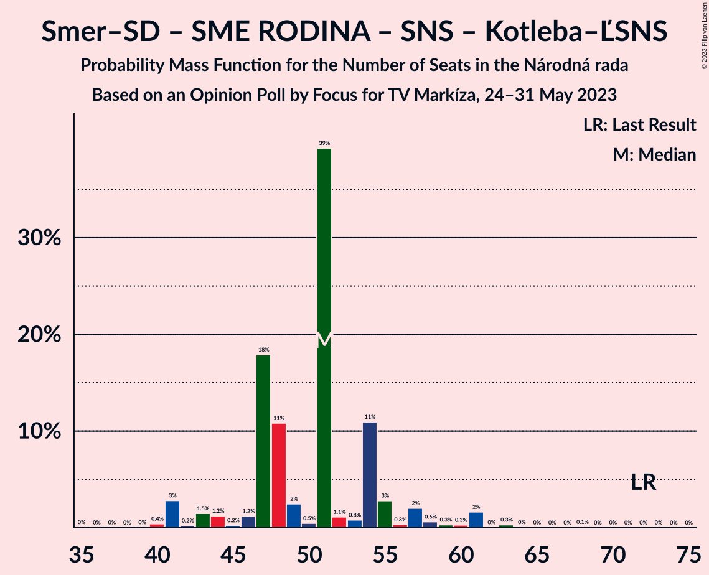

| Number of Seats | Probability | Accumulated | Special Marks |
|:---------------:|:-----------:|:-----------:|:-------------:|
| 35 | 0% | 100% |  |
| 36 | 0% | 99.9% |  |
| 37 | 0% | 99.9% |  |
| 38 | 0% | 99.9% |  |
| 39 | 0% | 99.9% |  |
| 40 | 0.4% | 99.8% |  |
| 41 | 3% | 99.4% |  |
| 42 | 0.2% | 97% |  |
| 43 | 1.5% | 96% |  |
| 44 | 1.2% | 95% |  |
| 45 | 0.2% | 94% |  |
| 46 | 1.2% | 93% |  |
| 47 | 18% | 92% | Median |
| 48 | 11% | 74% |  |
| 49 | 2% | 64% |  |
| 50 | 0.5% | 61% |  |
| 51 | 39% | 61% |  |
| 52 | 1.1% | 21% |  |
| 53 | 0.8% | 20% |  |
| 54 | 11% | 19% |  |
| 55 | 3% | 9% |  |
| 56 | 0.3% | 6% |  |
| 57 | 2% | 5% |  |
| 58 | 0.6% | 3% |  |
| 59 | 0.3% | 3% |  |
| 60 | 0.3% | 2% |  |
| 61 | 2% | 2% |  |
| 62 | 0% | 0.5% |  |
| 63 | 0.3% | 0.5% |  |
| 64 | 0% | 0.2% |  |
| 65 | 0% | 0.1% |  |
| 66 | 0% | 0.1% |  |
| 67 | 0% | 0.1% |  |
| 68 | 0.1% | 0.1% |  |
| 69 | 0% | 0% |  |
| 70 | 0% | 0% |  |
| 71 | 0% | 0% |  |
| 72 | 0% | 0% | Last Result |

### SMER–sociálna demokracia – SME RODINA – Slovenská národná strana

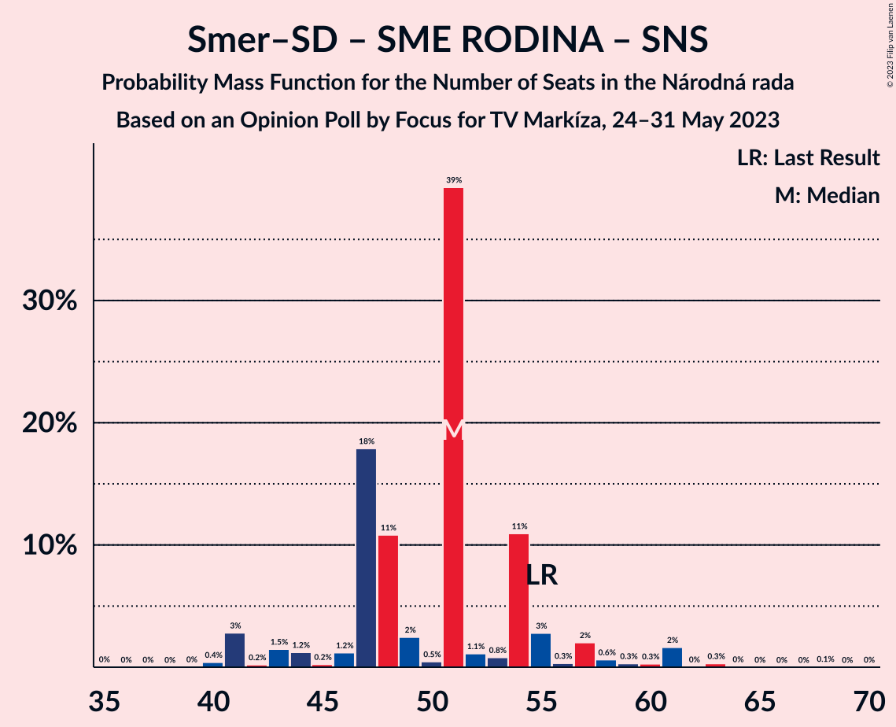

| Number of Seats | Probability | Accumulated | Special Marks |
|:---------------:|:-----------:|:-----------:|:-------------:|
| 35 | 0% | 100% |  |
| 36 | 0% | 99.9% |  |
| 37 | 0% | 99.9% |  |
| 38 | 0% | 99.9% |  |
| 39 | 0% | 99.9% |  |
| 40 | 0.4% | 99.8% |  |
| 41 | 3% | 99.4% |  |
| 42 | 0.2% | 97% |  |
| 43 | 1.5% | 96% |  |
| 44 | 1.2% | 95% |  |
| 45 | 0.2% | 94% |  |
| 46 | 1.2% | 93% |  |
| 47 | 18% | 92% | Median |
| 48 | 11% | 74% |  |
| 49 | 2% | 64% |  |
| 50 | 0.5% | 61% |  |
| 51 | 39% | 61% |  |
| 52 | 1.1% | 21% |  |
| 53 | 0.8% | 20% |  |
| 54 | 11% | 19% |  |
| 55 | 3% | 9% | Last Result |
| 56 | 0.3% | 6% |  |
| 57 | 2% | 5% |  |
| 58 | 0.6% | 3% |  |
| 59 | 0.3% | 3% |  |
| 60 | 0.3% | 2% |  |
| 61 | 2% | 2% |  |
| 62 | 0% | 0.5% |  |
| 63 | 0.3% | 0.5% |  |
| 64 | 0% | 0.2% |  |
| 65 | 0% | 0.1% |  |
| 66 | 0% | 0.1% |  |
| 67 | 0% | 0.1% |  |
| 68 | 0.1% | 0.1% |  |
| 69 | 0% | 0% |  |

### HLAS–sociálna demokracia – SME RODINA – Slovenská národná strana – Kotleba–Ľudová strana Naše Slovensko

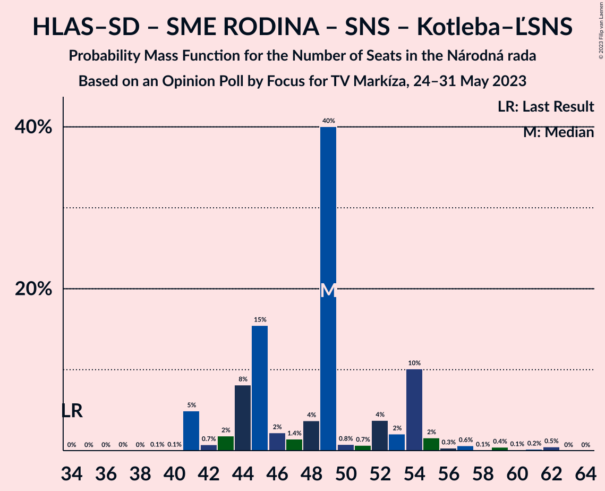

| Number of Seats | Probability | Accumulated | Special Marks |
|:---------------:|:-----------:|:-----------:|:-------------:|
| 34 | 0% | 100% | Last Result |
| 35 | 0% | 100% |  |
| 36 | 0% | 100% |  |
| 37 | 0% | 100% |  |
| 38 | 0% | 99.9% |  |
| 39 | 0.1% | 99.9% |  |
| 40 | 0.1% | 99.9% |  |
| 41 | 5% | 99.8% |  |
| 42 | 0.7% | 95% |  |
| 43 | 2% | 94% |  |
| 44 | 8% | 92% |  |
| 45 | 15% | 84% | Median |
| 46 | 2% | 69% |  |
| 47 | 1.4% | 66% |  |
| 48 | 4% | 65% |  |
| 49 | 40% | 61% |  |
| 50 | 0.8% | 21% |  |
| 51 | 0.7% | 20% |  |
| 52 | 4% | 20% |  |
| 53 | 2% | 16% |  |
| 54 | 10% | 14% |  |
| 55 | 2% | 4% |  |
| 56 | 0.3% | 2% |  |
| 57 | 0.6% | 2% |  |
| 58 | 0.1% | 1.3% |  |
| 59 | 0.4% | 1.3% |  |
| 60 | 0.1% | 0.8% |  |
| 61 | 0.2% | 0.7% |  |
| 62 | 0.5% | 0.5% |  |
| 63 | 0% | 0% |  |

### HLAS–sociálna demokracia – SME RODINA – Slovenská národná strana

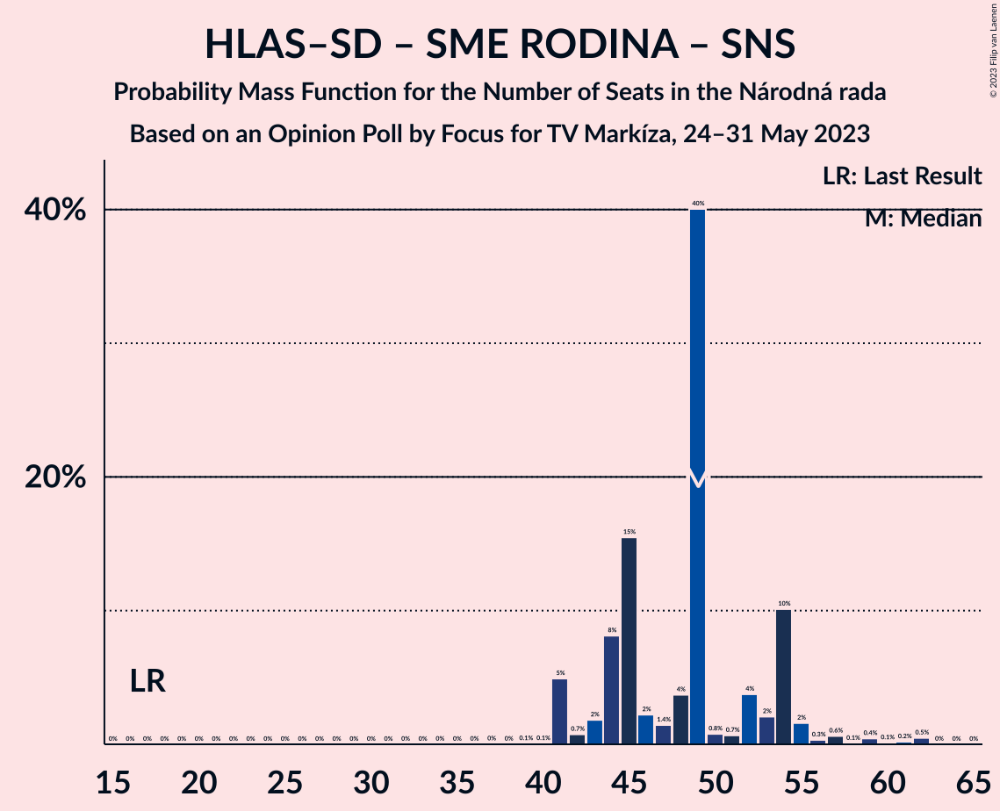

| Number of Seats | Probability | Accumulated | Special Marks |
|:---------------:|:-----------:|:-----------:|:-------------:|
| 17 | 0% | 100% | Last Result |
| 18 | 0% | 100% |  |
| 19 | 0% | 100% |  |
| 20 | 0% | 100% |  |
| 21 | 0% | 100% |  |
| 22 | 0% | 100% |  |
| 23 | 0% | 100% |  |
| 24 | 0% | 100% |  |
| 25 | 0% | 100% |  |
| 26 | 0% | 100% |  |
| 27 | 0% | 100% |  |
| 28 | 0% | 100% |  |
| 29 | 0% | 100% |  |
| 30 | 0% | 100% |  |
| 31 | 0% | 100% |  |
| 32 | 0% | 100% |  |
| 33 | 0% | 100% |  |
| 34 | 0% | 100% |  |
| 35 | 0% | 100% |  |
| 36 | 0% | 100% |  |
| 37 | 0% | 100% |  |
| 38 | 0% | 99.9% |  |
| 39 | 0.1% | 99.9% |  |
| 40 | 0.1% | 99.9% |  |
| 41 | 5% | 99.8% |  |
| 42 | 0.7% | 95% |  |
| 43 | 2% | 94% |  |
| 44 | 8% | 92% |  |
| 45 | 15% | 84% | Median |
| 46 | 2% | 69% |  |
| 47 | 1.4% | 66% |  |
| 48 | 4% | 65% |  |
| 49 | 40% | 61% |  |
| 50 | 0.8% | 21% |  |
| 51 | 0.7% | 20% |  |
| 52 | 4% | 20% |  |
| 53 | 2% | 16% |  |
| 54 | 10% | 14% |  |
| 55 | 2% | 4% |  |
| 56 | 0.3% | 2% |  |
| 57 | 0.6% | 2% |  |
| 58 | 0.1% | 1.3% |  |
| 59 | 0.4% | 1.3% |  |
| 60 | 0.1% | 0.8% |  |
| 61 | 0.2% | 0.7% |  |
| 62 | 0.5% | 0.5% |  |
| 63 | 0% | 0% |  |

### HLAS–sociálna demokracia – SME RODINA

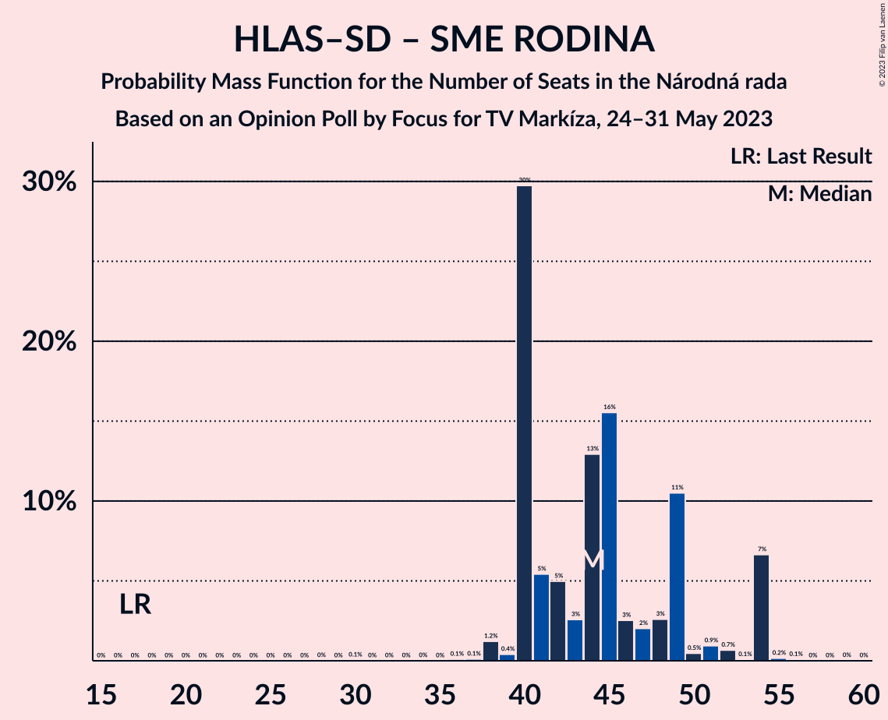

| Number of Seats | Probability | Accumulated | Special Marks |
|:---------------:|:-----------:|:-----------:|:-------------:|
| 17 | 0% | 100% | Last Result |
| 18 | 0% | 100% |  |
| 19 | 0% | 100% |  |
| 20 | 0% | 100% |  |
| 21 | 0% | 100% |  |
| 22 | 0% | 100% |  |
| 23 | 0% | 100% |  |
| 24 | 0% | 100% |  |
| 25 | 0% | 100% |  |
| 26 | 0% | 100% |  |
| 27 | 0% | 100% |  |
| 28 | 0% | 100% |  |
| 29 | 0% | 100% |  |
| 30 | 0.1% | 100% |  |
| 31 | 0% | 99.9% |  |
| 32 | 0% | 99.9% |  |
| 33 | 0% | 99.9% |  |
| 34 | 0% | 99.9% |  |
| 35 | 0% | 99.9% |  |
| 36 | 0.1% | 99.9% |  |
| 37 | 0.1% | 99.8% |  |
| 38 | 1.2% | 99.7% |  |
| 39 | 0.4% | 98% |  |
| 40 | 30% | 98% |  |
| 41 | 5% | 68% |  |
| 42 | 5% | 63% |  |
| 43 | 3% | 58% |  |
| 44 | 13% | 55% |  |
| 45 | 16% | 42% | Median |
| 46 | 3% | 27% |  |
| 47 | 2% | 24% |  |
| 48 | 3% | 22% |  |
| 49 | 11% | 20% |  |
| 50 | 0.5% | 9% |  |
| 51 | 0.9% | 9% |  |
| 52 | 0.7% | 8% |  |
| 53 | 0.1% | 7% |  |
| 54 | 7% | 7% |  |
| 55 | 0.2% | 0.3% |  |
| 56 | 0.1% | 0.1% |  |
| 57 | 0% | 0% |  |

### SMER–sociálna demokracia – SME RODINA

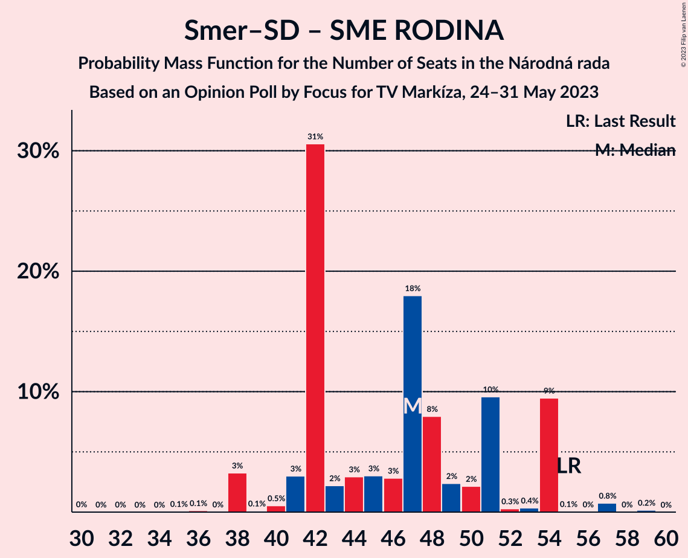

| Number of Seats | Probability | Accumulated | Special Marks |
|:---------------:|:-----------:|:-----------:|:-------------:|
| 31 | 0% | 100% |  |
| 32 | 0% | 99.9% |  |
| 33 | 0% | 99.9% |  |
| 34 | 0% | 99.9% |  |
| 35 | 0.1% | 99.9% |  |
| 36 | 0.1% | 99.8% |  |
| 37 | 0% | 99.7% |  |
| 38 | 3% | 99.7% |  |
| 39 | 0.1% | 96% |  |
| 40 | 0.5% | 96% |  |
| 41 | 3% | 96% |  |
| 42 | 31% | 93% |  |
| 43 | 2% | 62% |  |
| 44 | 3% | 60% |  |
| 45 | 3% | 57% |  |
| 46 | 3% | 54% |  |
| 47 | 18% | 51% | Median |
| 48 | 8% | 33% |  |
| 49 | 2% | 25% |  |
| 50 | 2% | 23% |  |
| 51 | 10% | 21% |  |
| 52 | 0.3% | 11% |  |
| 53 | 0.4% | 11% |  |
| 54 | 9% | 11% |  |
| 55 | 0.1% | 1.1% | Last Result |
| 56 | 0% | 1.0% |  |
| 57 | 0.8% | 1.0% |  |
| 58 | 0% | 0.2% |  |
| 59 | 0.2% | 0.2% |  |
| 60 | 0% | 0% |  |

### SMER–sociálna demokracia – Slovenská národná strana – MOST–HÍD

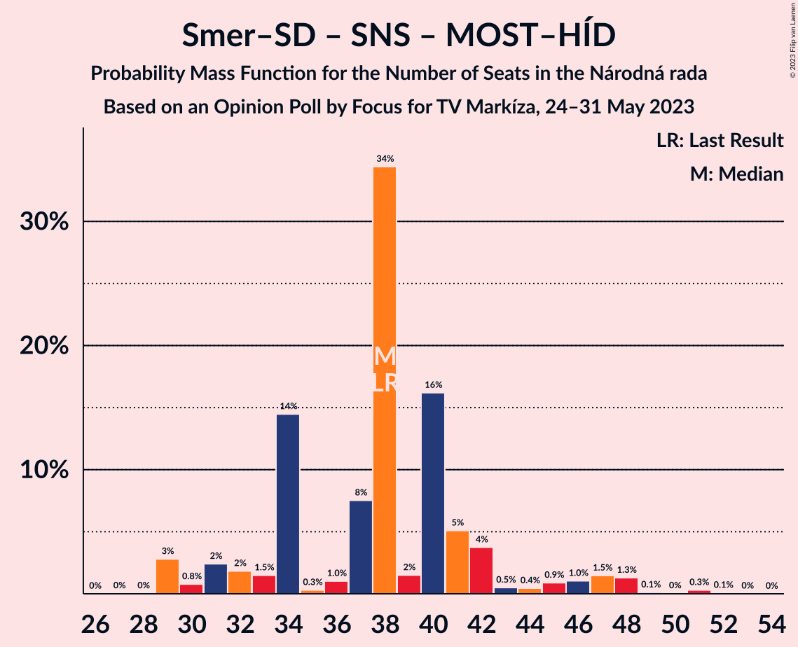

| Number of Seats | Probability | Accumulated | Special Marks |
|:---------------:|:-----------:|:-----------:|:-------------:|
| 26 | 0% | 100% |  |
| 27 | 0% | 99.9% |  |
| 28 | 0% | 99.9% |  |
| 29 | 3% | 99.9% |  |
| 30 | 0.8% | 97% |  |
| 31 | 2% | 96% |  |
| 32 | 2% | 94% |  |
| 33 | 1.5% | 92% |  |
| 34 | 14% | 91% | Median |
| 35 | 0.3% | 76% |  |
| 36 | 1.0% | 76% |  |
| 37 | 8% | 75% |  |
| 38 | 34% | 67% | Last Result |
| 39 | 2% | 33% |  |
| 40 | 16% | 31% |  |
| 41 | 5% | 15% |  |
| 42 | 4% | 10% |  |
| 43 | 0.5% | 6% |  |
| 44 | 0.4% | 6% |  |
| 45 | 0.9% | 5% |  |
| 46 | 1.0% | 4% |  |
| 47 | 1.5% | 3% |  |
| 48 | 1.3% | 2% |  |
| 49 | 0.1% | 0.6% |  |
| 50 | 0% | 0.5% |  |
| 51 | 0.3% | 0.5% |  |
| 52 | 0.1% | 0.2% |  |
| 53 | 0% | 0.1% |  |
| 54 | 0% | 0% |  |

### SMER–sociálna demokracia – Slovenská národná strana

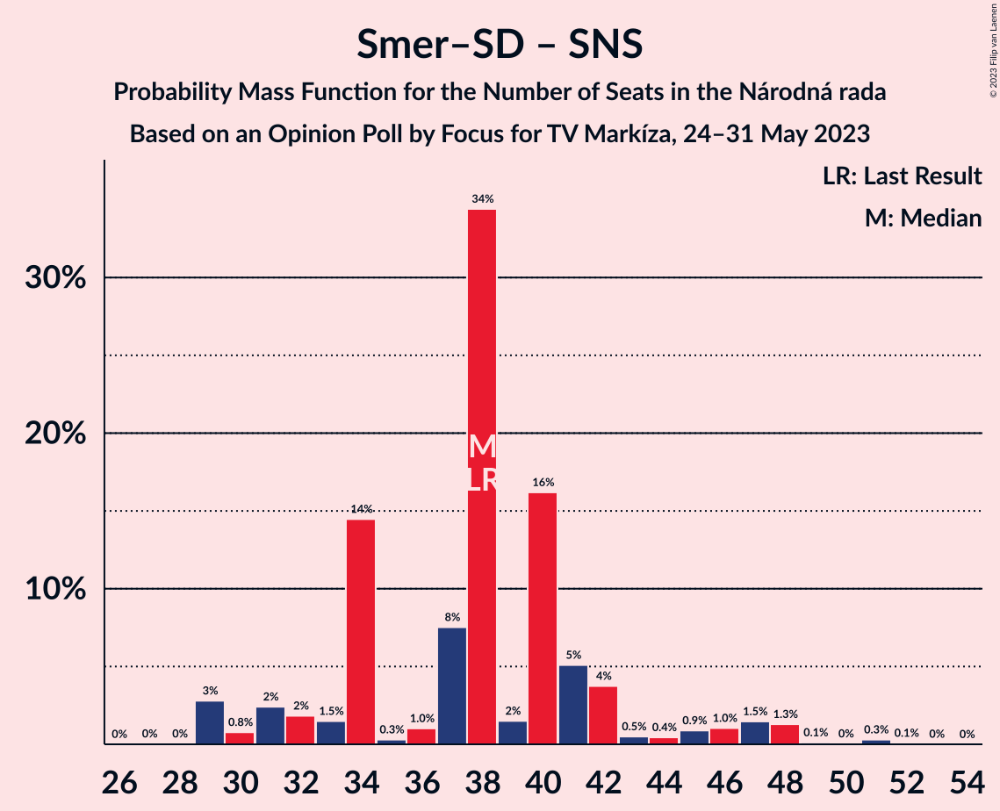

| Number of Seats | Probability | Accumulated | Special Marks |
|:---------------:|:-----------:|:-----------:|:-------------:|
| 26 | 0% | 100% |  |
| 27 | 0% | 99.9% |  |
| 28 | 0% | 99.9% |  |
| 29 | 3% | 99.9% |  |
| 30 | 0.8% | 97% |  |
| 31 | 2% | 96% |  |
| 32 | 2% | 94% |  |
| 33 | 1.5% | 92% |  |
| 34 | 14% | 91% | Median |
| 35 | 0.3% | 76% |  |
| 36 | 1.0% | 76% |  |
| 37 | 8% | 75% |  |
| 38 | 34% | 67% | Last Result |
| 39 | 2% | 33% |  |
| 40 | 16% | 31% |  |
| 41 | 5% | 15% |  |
| 42 | 4% | 10% |  |
| 43 | 0.5% | 6% |  |
| 44 | 0.4% | 6% |  |
| 45 | 0.9% | 5% |  |
| 46 | 1.0% | 4% |  |
| 47 | 1.5% | 3% |  |
| 48 | 1.3% | 2% |  |
| 49 | 0.1% | 0.6% |  |
| 50 | 0% | 0.5% |  |
| 51 | 0.3% | 0.5% |  |
| 52 | 0.1% | 0.2% |  |
| 53 | 0% | 0.1% |  |
| 54 | 0% | 0% |  |

### HLAS–sociálna demokracia – Slovenská národná strana – MOST–HÍD

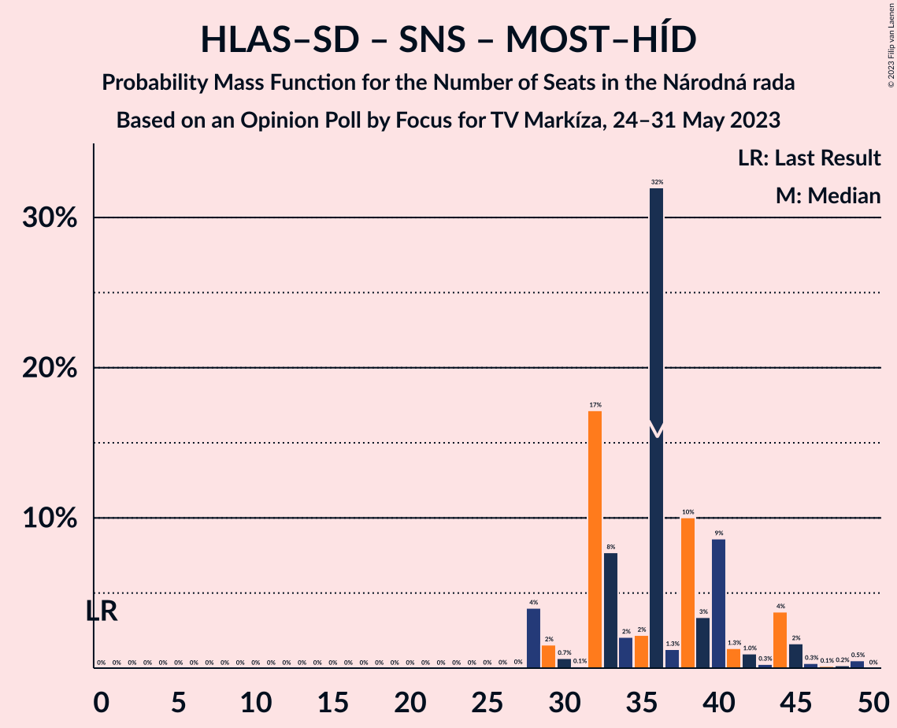

| Number of Seats | Probability | Accumulated | Special Marks |
|:---------------:|:-----------:|:-----------:|:-------------:|
| 0 | 0% | 100% | Last Result |
| 1 | 0% | 100% |  |
| 2 | 0% | 100% |  |
| 3 | 0% | 100% |  |
| 4 | 0% | 100% |  |
| 5 | 0% | 100% |  |
| 6 | 0% | 100% |  |
| 7 | 0% | 100% |  |
| 8 | 0% | 100% |  |
| 9 | 0% | 100% |  |
| 10 | 0% | 100% |  |
| 11 | 0% | 100% |  |
| 12 | 0% | 100% |  |
| 13 | 0% | 100% |  |
| 14 | 0% | 100% |  |
| 15 | 0% | 100% |  |
| 16 | 0% | 100% |  |
| 17 | 0% | 100% |  |
| 18 | 0% | 100% |  |
| 19 | 0% | 100% |  |
| 20 | 0% | 100% |  |
| 21 | 0% | 100% |  |
| 22 | 0% | 100% |  |
| 23 | 0% | 100% |  |
| 24 | 0% | 100% |  |
| 25 | 0% | 100% |  |
| 26 | 0% | 100% |  |
| 27 | 0% | 100% |  |
| 28 | 4% | 99.9% |  |
| 29 | 2% | 96% |  |
| 30 | 0.7% | 94% |  |
| 31 | 0.1% | 94% |  |
| 32 | 17% | 94% | Median |
| 33 | 8% | 76% |  |
| 34 | 2% | 69% |  |
| 35 | 2% | 67% |  |
| 36 | 32% | 64% |  |
| 37 | 1.3% | 32% |  |
| 38 | 10% | 31% |  |
| 39 | 3% | 21% |  |
| 40 | 9% | 18% |  |
| 41 | 1.3% | 9% |  |
| 42 | 1.0% | 8% |  |
| 43 | 0.3% | 7% |  |
| 44 | 4% | 7% |  |
| 45 | 2% | 3% |  |
| 46 | 0.3% | 1.2% |  |
| 47 | 0.1% | 0.9% |  |
| 48 | 0.2% | 0.7% |  |
| 49 | 0.5% | 0.6% |  |
| 50 | 0% | 0% |  |

### HLAS–sociálna demokracia – Slovenská národná strana

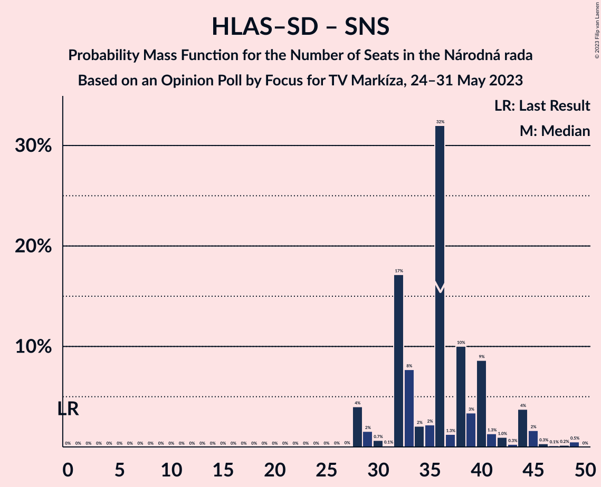

| Number of Seats | Probability | Accumulated | Special Marks |
|:---------------:|:-----------:|:-----------:|:-------------:|
| 0 | 0% | 100% | Last Result |
| 1 | 0% | 100% |  |
| 2 | 0% | 100% |  |
| 3 | 0% | 100% |  |
| 4 | 0% | 100% |  |
| 5 | 0% | 100% |  |
| 6 | 0% | 100% |  |
| 7 | 0% | 100% |  |
| 8 | 0% | 100% |  |
| 9 | 0% | 100% |  |
| 10 | 0% | 100% |  |
| 11 | 0% | 100% |  |
| 12 | 0% | 100% |  |
| 13 | 0% | 100% |  |
| 14 | 0% | 100% |  |
| 15 | 0% | 100% |  |
| 16 | 0% | 100% |  |
| 17 | 0% | 100% |  |
| 18 | 0% | 100% |  |
| 19 | 0% | 100% |  |
| 20 | 0% | 100% |  |
| 21 | 0% | 100% |  |
| 22 | 0% | 100% |  |
| 23 | 0% | 100% |  |
| 24 | 0% | 100% |  |
| 25 | 0% | 100% |  |
| 26 | 0% | 100% |  |
| 27 | 0% | 100% |  |
| 28 | 4% | 99.9% |  |
| 29 | 2% | 96% |  |
| 30 | 0.7% | 94% |  |
| 31 | 0.1% | 94% |  |
| 32 | 17% | 94% | Median |
| 33 | 8% | 76% |  |
| 34 | 2% | 69% |  |
| 35 | 2% | 67% |  |
| 36 | 32% | 64% |  |
| 37 | 1.3% | 32% |  |
| 38 | 10% | 31% |  |
| 39 | 3% | 21% |  |
| 40 | 9% | 18% |  |
| 41 | 1.3% | 9% |  |
| 42 | 1.0% | 8% |  |
| 43 | 0.3% | 7% |  |
| 44 | 4% | 7% |  |
| 45 | 2% | 3% |  |
| 46 | 0.3% | 1.2% |  |
| 47 | 0.1% | 0.9% |  |
| 48 | 0.2% | 0.7% |  |
| 49 | 0.5% | 0.6% |  |
| 50 | 0% | 0% |  |

### SMER–sociálna demokracia

| Number of Seats | Probability | Accumulated | Special Marks |
|:---------------:|:-----------:|:-----------:|:-------------:|
| 25 | 0% | 100% |  |
| 26 | 0% | 99.9% |  |
| 27 | 0.2% | 99.9% |  |
| 28 | 3% | 99.8% |  |
| 29 | 32% | 96% |  |
| 30 | 2% | 64% |  |
| 31 | 4% | 62% |  |
| 32 | 5% | 58% |  |
| 33 | 2% | 54% |  |
| 34 | 15% | 51% | Median |
| 35 | 0.9% | 36% |  |
| 36 | 3% | 35% |  |
| 37 | 9% | 32% |  |
| 38 | 2% | 24% | Last Result |
| 39 | 1.5% | 22% |  |
| 40 | 15% | 21% |  |
| 41 | 4% | 5% |  |
| 42 | 0.7% | 1.5% |  |
| 43 | 0.1% | 0.8% |  |
| 44 | 0% | 0.7% |  |
| 45 | 0% | 0.7% |  |
| 46 | 0.7% | 0.7% |  |
| 47 | 0% | 0% |  |

## Technical Information

### Opinion Poll

+ **Polling firm:** Focus
+ **Commissioner(s):** TV Markíza
+ **Fieldwork period:** 24–31 May 2023

### Calculations

+ **Sample size:** 1012
+ **Simulations done:** 1,048,576
+ **Error estimate:** 1.77%

