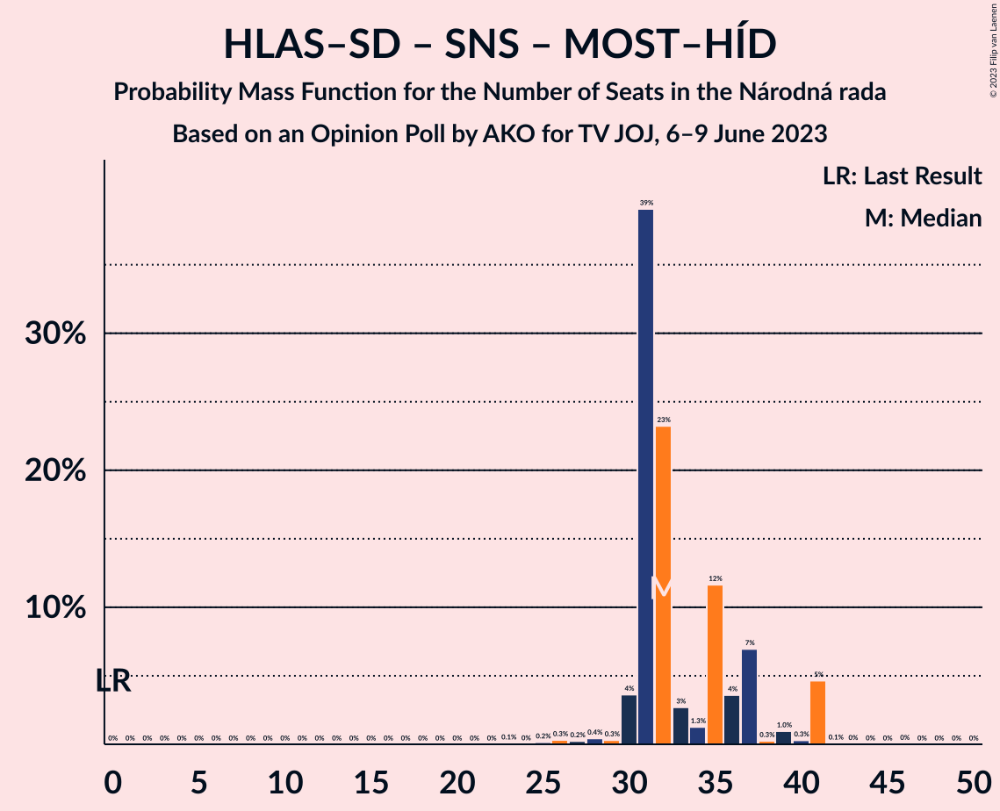

# Opinion Poll by AKO for TV JOJ, 6–9 June 2023

<a href="#voting-intentions">Voting Intentions</a> | <a href="#seats">Seats</a> | <a href="#coalitions">Coalitions</a> | <a href="#technical-information">Technical Information</a>

## Voting Intentions

### Confidence Intervals

| Party | Last Result | Poll Result | 80% Confidence Interval | 90% Confidence Interval | 95% Confidence Interval | 99% Confidence Interval |
|:-----:|:-----------:|:-----------:|:-----------------------:|:-----------------------:|:-----------------------:|:-----------------------:|
| SMER–sociálna demokracia | 18.3% | 19.0% | 17.5–20.7% |17.1–21.1% |16.7–21.6% |16.0–22.4% |
| HLAS–sociálna demokracia | 0.0% | 17.2% | 15.7–18.8% |15.3–19.3% |15.0–19.7% |14.3–20.5% |
| Progresívne Slovensko | 7.0% | 14.4% | 13.1–15.9% |12.7–16.3% |12.4–16.7% |11.7–17.5% |
| Sloboda a Solidarita | 6.2% | 7.8% | 6.8–9.0% |6.5–9.3% |6.3–9.6% |5.8–10.2% |
| OBYČAJNÍ ĽUDIA a nezávislé osobnosti | 25.0% | 7.1% | 6.2–8.3% |5.9–8.6% |5.7–8.9% |5.2–9.4% |
| REPUBLIKA | 0.0% | 7.0% | 6.1–8.2% |5.8–8.5% |5.6–8.8% |5.2–9.3% |
| Kresťanskodemokratické hnutie | 4.6% | 6.5% | 5.6–7.6% |5.3–7.9% |5.1–8.2% |4.7–8.8% |
| SME RODINA | 8.2% | 6.2% | 5.3–7.3% |5.1–7.6% |4.9–7.9% |4.5–8.4% |
| Slovenská národná strana | 3.2% | 4.7% | 3.9–5.7% |3.7–6.0% |3.6–6.2% |3.2–6.7% |
| SPOLU–Občianska Demokracia | 7.0% | 2.8% | 2.2–3.6% |2.1–3.8% |1.9–4.0% |1.7–4.4% |
| Strana maďarskej koalície–Magyar Koalíció Pártja | 3.9% | 1.3% | 0.9–1.9% |0.8–2.1% |0.8–2.2% |0.6–2.5% |
| MOST–HÍD | 2.0% | 1.3% | 0.9–1.9% |0.8–2.1% |0.8–2.2% |0.6–2.5% |
| Kotleba–Ľudová strana Naše Slovensko | 8.0% | 1.0% | 0.7–1.5% |0.6–1.7% |0.5–1.8% |0.4–2.1% |
| Za ľudí | 5.8% | 0.6% | 0.4–1.1% |0.3–1.2% |0.3–1.3% |0.2–1.6% |

*Note:* The poll result column reflects the actual value used in the calculations. Published results may vary slightly, and in addition be rounded to fewer digits.

## Seats

### Confidence Intervals

| Party | Last Result | Median | 80% Confidence Interval | 90% Confidence Interval | 95% Confidence Interval | 99% Confidence Interval |
|:-----:|:-----------:|:------:|:-----------------------:|:-----------------------:|:-----------------------:|:-----------------------:|
| <a href="#smer–sociálna-demokracia">SMER–sociálna demokracia</a> | 38 | 35 | 30–36 |29–36 |27–36 |26–36 |
| <a href="#hlas–sociálna-demokracia">HLAS–sociálna demokracia</a> | 0 | 31 | 26–32 |26–32 |26–33 |25–34 |
| <a href="#progresívne-slovensko">Progresívne Slovensko</a> | 0 | 25 | 23–27 |23–27 |23–28 |21–29 |
| <a href="#sloboda-a-solidarita">Sloboda a Solidarita</a> | 13 | 13 | 12–16 |10–16 |10–16 |10–16 |
| <a href="#obyčajní-ľudia-a-nezávislé-osobnosti">OBYČAJNÍ ĽUDIA a nezávislé osobnosti</a> | 53 | 11 | 10–13 |10–14 |10–15 |10–15 |
| <a href="#republika">REPUBLIKA</a> | 0 | 13 | 11–13 |10–13 |8–14 |8–15 |
| <a href="#kresťanskodemokratické-hnutie">Kresťanskodemokratické hnutie</a> | 0 | 10 | 8–13 |8–13 |8–14 |8–15 |
| <a href="#sme-rodina">SME RODINA</a> | 17 | 11 | 9–12 |9–12 |9–12 |0–13 |
| <a href="#slovenská-národná-strana">Slovenská národná strana</a> | 0 | 0 | 0–9 |0–9 |0–9 |0–10 |
| <a href="#spolu–občianska-demokracia">SPOLU–Občianska Demokracia</a> | 0 | 0 | 0 |0 |0 |0 |
| <a href="#strana-maďarskej-koalície–magyar-koalíció-pártja">Strana maďarskej koalície–Magyar Koalíció Pártja</a> | 0 | 0 | 0 |0 |0 |0 |
| <a href="#most–híd">MOST–HÍD</a> | 0 | 0 | 0 |0 |0 |0 |
| <a href="#kotleba–ľudová-strana-naše-slovensko">Kotleba–Ľudová strana Naše Slovensko</a> | 17 | 0 | 0 |0 |0 |0 |
| <a href="#za-ľudí">Za ľudí</a> | 12 | 0 | 0 |0 |0 |0 |

### SMER–sociálna demokracia

*For a full overview of the results for this party, see the [SMER–sociálna demokracia](party-smer–sociálnademokracia.html) page.*

| Number of Seats | Probability | Accumulated | Special Marks |
|:---------------:|:-----------:|:-----------:|:-------------:|
| 25 | 0% | 100% |  |
| 26 | 2% | 99.9% |  |
| 27 | 0.9% | 98% |  |
| 28 | 1.3% | 97% |  |
| 29 | 0.7% | 96% |  |
| 30 | 9% | 95% |  |
| 31 | 7% | 86% |  |
| 32 | 24% | 79% |  |
| 33 | 0.8% | 55% |  |
| 34 | 0.5% | 54% |  |
| 35 | 4% | 53% | Median |
| 36 | 49% | 50% |  |
| 37 | 0.3% | 0.5% |  |
| 38 | 0.1% | 0.2% | Last Result |
| 39 | 0% | 0.1% |  |
| 40 | 0.1% | 0.1% |  |
| 41 | 0% | 0% |  |

### HLAS–sociálna demokracia

*For a full overview of the results for this party, see the [HLAS–sociálna demokracia](party-hlas–sociálnademokracia.html) page.*

| Number of Seats | Probability | Accumulated | Special Marks |
|:---------------:|:-----------:|:-----------:|:-------------:|
| 0 | 0% | 100% | Last Result |
| 1 | 0% | 100% |  |
| 2 | 0% | 100% |  |
| 3 | 0% | 100% |  |
| 4 | 0% | 100% |  |
| 5 | 0% | 100% |  |
| 6 | 0% | 100% |  |
| 7 | 0% | 100% |  |
| 8 | 0% | 100% |  |
| 9 | 0% | 100% |  |
| 10 | 0% | 100% |  |
| 11 | 0% | 100% |  |
| 12 | 0% | 100% |  |
| 13 | 0% | 100% |  |
| 14 | 0% | 100% |  |
| 15 | 0% | 100% |  |
| 16 | 0% | 100% |  |
| 17 | 0% | 100% |  |
| 18 | 0% | 100% |  |
| 19 | 0% | 100% |  |
| 20 | 0% | 100% |  |
| 21 | 0% | 100% |  |
| 22 | 0% | 100% |  |
| 23 | 0.1% | 100% |  |
| 24 | 0.3% | 99.9% |  |
| 25 | 0.2% | 99.6% |  |
| 26 | 11% | 99.4% |  |
| 27 | 3% | 88% |  |
| 28 | 10% | 85% |  |
| 29 | 1.3% | 76% |  |
| 30 | 4% | 74% |  |
| 31 | 39% | 70% | Median |
| 32 | 28% | 31% |  |
| 33 | 3% | 3% |  |
| 34 | 0.3% | 0.7% |  |
| 35 | 0.3% | 0.4% |  |
| 36 | 0% | 0.1% |  |
| 37 | 0% | 0.1% |  |
| 38 | 0% | 0% |  |

### Progresívne Slovensko

*For a full overview of the results for this party, see the [Progresívne Slovensko](party-progresívneslovensko.html) page.*

| Number of Seats | Probability | Accumulated | Special Marks |
|:---------------:|:-----------:|:-----------:|:-------------:|
| 0 | 0% | 100% | Last Result |
| 1 | 0% | 100% |  |
| 2 | 0% | 100% |  |
| 3 | 0% | 100% |  |
| 4 | 0% | 100% |  |
| 5 | 0% | 100% |  |
| 6 | 0% | 100% |  |
| 7 | 0% | 100% |  |
| 8 | 0% | 100% |  |
| 9 | 0% | 100% |  |
| 10 | 0% | 100% |  |
| 11 | 0% | 100% |  |
| 12 | 0% | 100% |  |
| 13 | 0% | 100% |  |
| 14 | 0% | 100% |  |
| 15 | 0% | 100% |  |
| 16 | 0% | 100% |  |
| 17 | 0% | 100% |  |
| 18 | 0% | 100% |  |
| 19 | 0.1% | 100% |  |
| 20 | 0.3% | 99.9% |  |
| 21 | 0.7% | 99.6% |  |
| 22 | 1.2% | 98.9% |  |
| 23 | 8% | 98% |  |
| 24 | 11% | 90% |  |
| 25 | 47% | 79% | Median |
| 26 | 2% | 33% |  |
| 27 | 27% | 31% |  |
| 28 | 2% | 3% |  |
| 29 | 0.5% | 0.8% |  |
| 30 | 0.1% | 0.3% |  |
| 31 | 0.1% | 0.2% |  |
| 32 | 0% | 0.1% |  |
| 33 | 0% | 0% |  |

### Sloboda a Solidarita

*For a full overview of the results for this party, see the [Sloboda a Solidarita](party-slobodaasolidarita.html) page.*

| Number of Seats | Probability | Accumulated | Special Marks |
|:---------------:|:-----------:|:-----------:|:-------------:|
| 10 | 6% | 100% |  |
| 11 | 3% | 94% |  |
| 12 | 10% | 92% |  |
| 13 | 41% | 82% | Last Result, Median |
| 14 | 6% | 41% |  |
| 15 | 23% | 35% |  |
| 16 | 12% | 12% |  |
| 17 | 0.2% | 0.4% |  |
| 18 | 0.2% | 0.2% |  |
| 19 | 0% | 0% |  |

### OBYČAJNÍ ĽUDIA a nezávislé osobnosti

*For a full overview of the results for this party, see the [OBYČAJNÍ ĽUDIA a nezávislé osobnosti](party-obyčajníľudiaanezávisléosobnosti.html) page.*

| Number of Seats | Probability | Accumulated | Special Marks |
|:---------------:|:-----------:|:-----------:|:-------------:|
| 0 | 0.1% | 100% |  |
| 1 | 0% | 99.9% |  |
| 2 | 0% | 99.9% |  |
| 3 | 0% | 99.9% |  |
| 4 | 0% | 99.9% |  |
| 5 | 0% | 99.9% |  |
| 6 | 0% | 99.9% |  |
| 7 | 0% | 99.9% |  |
| 8 | 0% | 99.9% |  |
| 9 | 0.3% | 99.9% |  |
| 10 | 44% | 99.6% |  |
| 11 | 12% | 55% | Median |
| 12 | 31% | 43% |  |
| 13 | 4% | 12% |  |
| 14 | 3% | 8% |  |
| 15 | 5% | 5% |  |
| 16 | 0.2% | 0.3% |  |
| 17 | 0.1% | 0.1% |  |
| 18 | 0% | 0% |  |
| 19 | 0% | 0% |  |
| 20 | 0% | 0% |  |
| 21 | 0% | 0% |  |
| 22 | 0% | 0% |  |
| 23 | 0% | 0% |  |
| 24 | 0% | 0% |  |
| 25 | 0% | 0% |  |
| 26 | 0% | 0% |  |
| 27 | 0% | 0% |  |
| 28 | 0% | 0% |  |
| 29 | 0% | 0% |  |
| 30 | 0% | 0% |  |
| 31 | 0% | 0% |  |
| 32 | 0% | 0% |  |
| 33 | 0% | 0% |  |
| 34 | 0% | 0% |  |
| 35 | 0% | 0% |  |
| 36 | 0% | 0% |  |
| 37 | 0% | 0% |  |
| 38 | 0% | 0% |  |
| 39 | 0% | 0% |  |
| 40 | 0% | 0% |  |
| 41 | 0% | 0% |  |
| 42 | 0% | 0% |  |
| 43 | 0% | 0% |  |
| 44 | 0% | 0% |  |
| 45 | 0% | 0% |  |
| 46 | 0% | 0% |  |
| 47 | 0% | 0% |  |
| 48 | 0% | 0% |  |
| 49 | 0% | 0% |  |
| 50 | 0% | 0% |  |
| 51 | 0% | 0% |  |
| 52 | 0% | 0% |  |
| 53 | 0% | 0% | Last Result |

### REPUBLIKA

*For a full overview of the results for this party, see the [REPUBLIKA](party-republika.html) page.*

| Number of Seats | Probability | Accumulated | Special Marks |
|:---------------:|:-----------:|:-----------:|:-------------:|
| 0 | 0% | 100% | Last Result |
| 1 | 0% | 100% |  |
| 2 | 0% | 100% |  |
| 3 | 0% | 100% |  |
| 4 | 0% | 100% |  |
| 5 | 0% | 100% |  |
| 6 | 0% | 100% |  |
| 7 | 0% | 100% |  |
| 8 | 3% | 100% |  |
| 9 | 0.4% | 97% |  |
| 10 | 3% | 96% |  |
| 11 | 15% | 93% |  |
| 12 | 4% | 78% |  |
| 13 | 70% | 73% | Median |
| 14 | 3% | 3% |  |
| 15 | 0.3% | 0.5% |  |
| 16 | 0.1% | 0.2% |  |
| 17 | 0.1% | 0.1% |  |
| 18 | 0% | 0% |  |

### Kresťanskodemokratické hnutie

*For a full overview of the results for this party, see the [Kresťanskodemokratické hnutie](party-kresťanskodemokratickéhnutie.html) page.*

| Number of Seats | Probability | Accumulated | Special Marks |
|:---------------:|:-----------:|:-----------:|:-------------:|
| 0 | 0.1% | 100% | Last Result |
| 1 | 0% | 99.9% |  |
| 2 | 0% | 99.9% |  |
| 3 | 0% | 99.9% |  |
| 4 | 0% | 99.9% |  |
| 5 | 0% | 99.9% |  |
| 6 | 0% | 99.9% |  |
| 7 | 0% | 99.9% |  |
| 8 | 10% | 99.9% |  |
| 9 | 0.5% | 90% |  |
| 10 | 66% | 89% | Median |
| 11 | 5% | 24% |  |
| 12 | 8% | 19% |  |
| 13 | 8% | 10% |  |
| 14 | 2% | 3% |  |
| 15 | 1.2% | 1.2% |  |
| 16 | 0% | 0.1% |  |
| 17 | 0% | 0% |  |

### SME RODINA

*For a full overview of the results for this party, see the [SME RODINA](party-smerodina.html) page.*

| Number of Seats | Probability | Accumulated | Special Marks |
|:---------------:|:-----------:|:-----------:|:-------------:|
| 0 | 0.5% | 100% |  |
| 1 | 0% | 99.5% |  |
| 2 | 0% | 99.5% |  |
| 3 | 0% | 99.5% |  |
| 4 | 0% | 99.5% |  |
| 5 | 0% | 99.5% |  |
| 6 | 0% | 99.5% |  |
| 7 | 0% | 99.5% |  |
| 8 | 0% | 99.5% |  |
| 9 | 43% | 99.5% |  |
| 10 | 2% | 57% |  |
| 11 | 7% | 55% | Median |
| 12 | 46% | 48% |  |
| 13 | 2% | 2% |  |
| 14 | 0.3% | 0.4% |  |
| 15 | 0.1% | 0.1% |  |
| 16 | 0% | 0% |  |
| 17 | 0% | 0% | Last Result |

### Slovenská národná strana

*For a full overview of the results for this party, see the [Slovenská národná strana](party-slovenskánárodnástrana.html) page.*

| Number of Seats | Probability | Accumulated | Special Marks |
|:---------------:|:-----------:|:-----------:|:-------------:|
| 0 | 71% | 100% | Last Result, Median |
| 1 | 0% | 29% |  |
| 2 | 0% | 29% |  |
| 3 | 0% | 29% |  |
| 4 | 0% | 29% |  |
| 5 | 0% | 29% |  |
| 6 | 0% | 29% |  |
| 7 | 0% | 29% |  |
| 8 | 5% | 29% |  |
| 9 | 22% | 24% |  |
| 10 | 2% | 2% |  |
| 11 | 0.4% | 0.4% |  |
| 12 | 0.1% | 0.1% |  |
| 13 | 0% | 0% |  |

### SPOLU–Občianska Demokracia

*For a full overview of the results for this party, see the [SPOLU–Občianska Demokracia](party-spolu–občianskademokracia.html) page.*

| Number of Seats | Probability | Accumulated | Special Marks |
|:---------------:|:-----------:|:-----------:|:-------------:|
| 0 | 100% | 100% | Last Result, Median |

### Strana maďarskej koalície–Magyar Koalíció Pártja

*For a full overview of the results for this party, see the [Strana maďarskej koalície–Magyar Koalíció Pártja](party-stranamaďarskejkoalície–magyarkoalíciópártja.html) page.*

| Number of Seats | Probability | Accumulated | Special Marks |
|:---------------:|:-----------:|:-----------:|:-------------:|
| 0 | 100% | 100% | Last Result, Median |

### MOST–HÍD

*For a full overview of the results for this party, see the [MOST–HÍD](party-most–híd.html) page.*

| Number of Seats | Probability | Accumulated | Special Marks |
|:---------------:|:-----------:|:-----------:|:-------------:|
| 0 | 100% | 100% | Last Result, Median |

### Kotleba–Ľudová strana Naše Slovensko

*For a full overview of the results for this party, see the [Kotleba–Ľudová strana Naše Slovensko](party-kotleba–ľudovástrananašeslovensko.html) page.*

| Number of Seats | Probability | Accumulated | Special Marks |
|:---------------:|:-----------:|:-----------:|:-------------:|
| 0 | 100% | 100% | Median |
| 1 | 0% | 0% |  |
| 2 | 0% | 0% |  |
| 3 | 0% | 0% |  |
| 4 | 0% | 0% |  |
| 5 | 0% | 0% |  |
| 6 | 0% | 0% |  |
| 7 | 0% | 0% |  |
| 8 | 0% | 0% |  |
| 9 | 0% | 0% |  |
| 10 | 0% | 0% |  |
| 11 | 0% | 0% |  |
| 12 | 0% | 0% |  |
| 13 | 0% | 0% |  |
| 14 | 0% | 0% |  |
| 15 | 0% | 0% |  |
| 16 | 0% | 0% |  |
| 17 | 0% | 0% | Last Result |

### Za ľudí

*For a full overview of the results for this party, see the [Za ľudí](party-zaľudí.html) page.*

| Number of Seats | Probability | Accumulated | Special Marks |
|:---------------:|:-----------:|:-----------:|:-------------:|
| 0 | 100% | 100% | Median |
| 1 | 0% | 0% |  |
| 2 | 0% | 0% |  |
| 3 | 0% | 0% |  |
| 4 | 0% | 0% |  |
| 5 | 0% | 0% |  |
| 6 | 0% | 0% |  |
| 7 | 0% | 0% |  |
| 8 | 0% | 0% |  |
| 9 | 0% | 0% |  |
| 10 | 0% | 0% |  |
| 11 | 0% | 0% |  |
| 12 | 0% | 0% | Last Result |

## Coalitions

### Confidence Intervals

| Coalition | Last Result | Median | Majority? | 80% Confidence Interval | 90% Confidence Interval | 95% Confidence Interval | 99% Confidence Interval |
|:---------:|:-----------:|:------:|:---------:|:-----------------------:|:-----------------------:|:-----------------------:|:-----------------------:|
| SMER–sociálna demokracia – HLAS–sociálna demokracia – SME RODINA – Slovenská národná strana – Kotleba–Ľudová strana Naše Slovensko | 72 | 79 | 68% | 73–80 | 73–80 | 72–82 | 68–83 |
| SMER–sociálna demokracia – HLAS–sociálna demokracia – SME RODINA – Slovenská národná strana | 55 | 79 | 68% | 73–80 | 73–80 | 72–82 | 68–83 |
| SMER–sociálna demokracia – HLAS–sociálna demokracia – SME RODINA | 55 | 73 | 42% | 68–79 | 67–79 | 66–79 | 65–79 |
| SMER–sociálna demokracia – HLAS–sociálna demokracia – Slovenská národná strana – MOST–HÍD | 38 | 67 | 0.1% | 64–71 | 63–71 | 62–71 | 58–72 |
| SMER–sociálna demokracia – HLAS–sociálna demokracia – Slovenská národná strana | 38 | 67 | 0.1% | 64–71 | 63–71 | 62–71 | 58–72 |
| SMER–sociálna demokracia – SME RODINA – Slovenská národná strana – Kotleba–Ľudová strana Naše Slovensko | 72 | 48 | 0% | 41–54 | 41–54 | 41–54 | 40–54 |
| SMER–sociálna demokracia – SME RODINA – Slovenská národná strana | 55 | 48 | 0% | 41–54 | 41–54 | 41–54 | 40–54 |
| HLAS–sociálna demokracia – SME RODINA – Slovenská národná strana – Kotleba–Ľudová strana Naše Slovensko | 34 | 43 | 0% | 41–48 | 41–50 | 41–50 | 36–50 |
| HLAS–sociálna demokracia – SME RODINA – Slovenská národná strana | 17 | 43 | 0% | 41–48 | 41–50 | 41–50 | 36–50 |
| SMER–sociálna demokracia – SME RODINA | 55 | 45 | 0% | 39–48 | 39–48 | 37–48 | 37–48 |
| HLAS–sociálna demokracia – SME RODINA | 17 | 41 | 0% | 35–43 | 35–43 | 35–45 | 34–46 |
| SMER–sociálna demokracia – Slovenská národná strana – MOST–HÍD | 38 | 36 | 0% | 32–45 | 31–45 | 31–45 | 30–45 |
| SMER–sociálna demokracia – Slovenská národná strana | 38 | 36 | 0% | 32–45 | 31–45 | 31–45 | 30–45 |
| HLAS–sociálna demokracia – Slovenská národná strana – MOST–HÍD | 0 | 32 | 0% | 31–37 | 30–40 | 30–41 | 26–41 |
| HLAS–sociálna demokracia – Slovenská národná strana | 0 | 32 | 0% | 31–37 | 30–40 | 30–41 | 26–41 |
| SMER–sociálna demokracia | 38 | 35 | 0% | 30–36 | 29–36 | 27–36 | 26–36 |

### SMER–sociálna demokracia – HLAS–sociálna demokracia – SME RODINA – Slovenská národná strana – Kotleba–Ľudová strana Naše Slovensko

| Number of Seats | Probability | Accumulated | Special Marks |
|:---------------:|:-----------:|:-----------:|:-------------:|
| 64 | 0.1% | 100% |  |
| 65 | 0% | 99.9% |  |
| 66 | 0.1% | 99.9% |  |
| 67 | 0.2% | 99.8% |  |
| 68 | 0.2% | 99.7% |  |
| 69 | 0% | 99.4% |  |
| 70 | 0.1% | 99.4% |  |
| 71 | 0.3% | 99.3% |  |
| 72 | 2% | 98.9% | Last Result |
| 73 | 21% | 97% |  |
| 74 | 7% | 75% |  |
| 75 | 0.7% | 69% |  |
| 76 | 8% | 68% | Majority |
| 77 | 0.4% | 60% | Median |
| 78 | 2% | 60% |  |
| 79 | 39% | 58% |  |
| 80 | 14% | 18% |  |
| 81 | 0.3% | 4% |  |
| 82 | 3% | 4% |  |
| 83 | 0.4% | 0.6% |  |
| 84 | 0.1% | 0.2% |  |
| 85 | 0.1% | 0.1% |  |
| 86 | 0% | 0% |  |

### SMER–sociálna demokracia – HLAS–sociálna demokracia – SME RODINA – Slovenská národná strana

| Number of Seats | Probability | Accumulated | Special Marks |
|:---------------:|:-----------:|:-----------:|:-------------:|
| 55 | 0% | 100% | Last Result |
| 56 | 0% | 100% |  |
| 57 | 0% | 100% |  |
| 58 | 0% | 100% |  |
| 59 | 0% | 100% |  |
| 60 | 0% | 100% |  |
| 61 | 0% | 100% |  |
| 62 | 0% | 100% |  |
| 63 | 0% | 100% |  |
| 64 | 0.1% | 100% |  |
| 65 | 0% | 99.9% |  |
| 66 | 0.1% | 99.9% |  |
| 67 | 0.2% | 99.8% |  |
| 68 | 0.2% | 99.7% |  |
| 69 | 0% | 99.4% |  |
| 70 | 0.1% | 99.4% |  |
| 71 | 0.3% | 99.3% |  |
| 72 | 2% | 98.9% |  |
| 73 | 21% | 97% |  |
| 74 | 7% | 75% |  |
| 75 | 0.7% | 69% |  |
| 76 | 8% | 68% | Majority |
| 77 | 0.4% | 60% | Median |
| 78 | 2% | 60% |  |
| 79 | 39% | 58% |  |
| 80 | 14% | 18% |  |
| 81 | 0.3% | 4% |  |
| 82 | 3% | 4% |  |
| 83 | 0.4% | 0.6% |  |
| 84 | 0.1% | 0.2% |  |
| 85 | 0.1% | 0.1% |  |
| 86 | 0% | 0% |  |

### SMER–sociálna demokracia – HLAS–sociálna demokracia – SME RODINA

| Number of Seats | Probability | Accumulated | Special Marks |
|:---------------:|:-----------:|:-----------:|:-------------:|
| 55 | 0% | 100% | Last Result |
| 56 | 0% | 100% |  |
| 57 | 0% | 100% |  |
| 58 | 0% | 100% |  |
| 59 | 0% | 100% |  |
| 60 | 0% | 100% |  |
| 61 | 0% | 100% |  |
| 62 | 0% | 100% |  |
| 63 | 0.1% | 100% |  |
| 64 | 0.1% | 99.9% |  |
| 65 | 2% | 99.8% |  |
| 66 | 2% | 98% |  |
| 67 | 5% | 96% |  |
| 68 | 0.9% | 91% |  |
| 69 | 0.2% | 90% |  |
| 70 | 2% | 90% |  |
| 71 | 15% | 88% |  |
| 72 | 2% | 73% |  |
| 73 | 22% | 71% |  |
| 74 | 6% | 49% |  |
| 75 | 0.7% | 43% |  |
| 76 | 2% | 42% | Majority |
| 77 | 0.3% | 40% | Median |
| 78 | 0.3% | 39% |  |
| 79 | 39% | 39% |  |
| 80 | 0% | 0.3% |  |
| 81 | 0.2% | 0.3% |  |
| 82 | 0.1% | 0.1% |  |
| 83 | 0% | 0% |  |

### SMER–sociálna demokracia – HLAS–sociálna demokracia – Slovenská národná strana – MOST–HÍD

| Number of Seats | Probability | Accumulated | Special Marks |
|:---------------:|:-----------:|:-----------:|:-------------:|
| 38 | 0% | 100% | Last Result |
| 39 | 0% | 100% |  |
| 40 | 0% | 100% |  |
| 41 | 0% | 100% |  |
| 42 | 0% | 100% |  |
| 43 | 0% | 100% |  |
| 44 | 0% | 100% |  |
| 45 | 0% | 100% |  |
| 46 | 0% | 100% |  |
| 47 | 0% | 100% |  |
| 48 | 0% | 100% |  |
| 49 | 0% | 100% |  |
| 50 | 0% | 100% |  |
| 51 | 0% | 100% |  |
| 52 | 0% | 100% |  |
| 53 | 0% | 100% |  |
| 54 | 0% | 100% |  |
| 55 | 0% | 100% |  |
| 56 | 0.1% | 100% |  |
| 57 | 0.3% | 99.9% |  |
| 58 | 0.2% | 99.6% |  |
| 59 | 0.2% | 99.4% |  |
| 60 | 0.4% | 99.2% |  |
| 61 | 1.0% | 98.8% |  |
| 62 | 3% | 98% |  |
| 63 | 4% | 95% |  |
| 64 | 24% | 91% |  |
| 65 | 2% | 67% |  |
| 66 | 3% | 65% | Median |
| 67 | 43% | 62% |  |
| 68 | 0.2% | 19% |  |
| 69 | 0.2% | 19% |  |
| 70 | 0.5% | 19% |  |
| 71 | 17% | 18% |  |
| 72 | 0.4% | 0.9% |  |
| 73 | 0.2% | 0.5% |  |
| 74 | 0.1% | 0.2% |  |
| 75 | 0.1% | 0.2% |  |
| 76 | 0% | 0.1% | Majority |
| 77 | 0% | 0.1% |  |
| 78 | 0% | 0.1% |  |
| 79 | 0% | 0.1% |  |
| 80 | 0% | 0.1% |  |
| 81 | 0% | 0% |  |

### SMER–sociálna demokracia – HLAS–sociálna demokracia – Slovenská národná strana

| Number of Seats | Probability | Accumulated | Special Marks |
|:---------------:|:-----------:|:-----------:|:-------------:|
| 38 | 0% | 100% | Last Result |
| 39 | 0% | 100% |  |
| 40 | 0% | 100% |  |
| 41 | 0% | 100% |  |
| 42 | 0% | 100% |  |
| 43 | 0% | 100% |  |
| 44 | 0% | 100% |  |
| 45 | 0% | 100% |  |
| 46 | 0% | 100% |  |
| 47 | 0% | 100% |  |
| 48 | 0% | 100% |  |
| 49 | 0% | 100% |  |
| 50 | 0% | 100% |  |
| 51 | 0% | 100% |  |
| 52 | 0% | 100% |  |
| 53 | 0% | 100% |  |
| 54 | 0% | 100% |  |
| 55 | 0% | 100% |  |
| 56 | 0.1% | 100% |  |
| 57 | 0.3% | 99.9% |  |
| 58 | 0.2% | 99.6% |  |
| 59 | 0.2% | 99.4% |  |
| 60 | 0.4% | 99.2% |  |
| 61 | 1.0% | 98.8% |  |
| 62 | 3% | 98% |  |
| 63 | 4% | 95% |  |
| 64 | 24% | 91% |  |
| 65 | 2% | 67% |  |
| 66 | 3% | 65% | Median |
| 67 | 43% | 62% |  |
| 68 | 0.2% | 19% |  |
| 69 | 0.2% | 19% |  |
| 70 | 0.5% | 19% |  |
| 71 | 17% | 18% |  |
| 72 | 0.4% | 0.9% |  |
| 73 | 0.2% | 0.5% |  |
| 74 | 0.1% | 0.2% |  |
| 75 | 0.1% | 0.2% |  |
| 76 | 0% | 0.1% | Majority |
| 77 | 0% | 0.1% |  |
| 78 | 0% | 0.1% |  |
| 79 | 0% | 0.1% |  |
| 80 | 0% | 0.1% |  |
| 81 | 0% | 0% |  |

### SMER–sociálna demokracia – SME RODINA – Slovenská národná strana – Kotleba–Ľudová strana Naše Slovensko

| Number of Seats | Probability | Accumulated | Special Marks |
|:---------------:|:-----------:|:-----------:|:-------------:|
| 34 | 0.1% | 100% |  |
| 35 | 0.1% | 99.9% |  |
| 36 | 0% | 99.8% |  |
| 37 | 0% | 99.8% |  |
| 38 | 0.1% | 99.7% |  |
| 39 | 0.1% | 99.6% |  |
| 40 | 2% | 99.6% |  |
| 41 | 21% | 98% |  |
| 42 | 1.0% | 76% |  |
| 43 | 2% | 75% |  |
| 44 | 4% | 73% |  |
| 45 | 0.6% | 70% |  |
| 46 | 2% | 69% | Median |
| 47 | 2% | 67% |  |
| 48 | 48% | 65% |  |
| 49 | 0.6% | 17% |  |
| 50 | 0.2% | 16% |  |
| 51 | 2% | 16% |  |
| 52 | 0.1% | 14% |  |
| 53 | 0.2% | 14% |  |
| 54 | 13% | 14% |  |
| 55 | 0.1% | 0.4% |  |
| 56 | 0.3% | 0.4% |  |
| 57 | 0.1% | 0.1% |  |
| 58 | 0% | 0% |  |
| 59 | 0% | 0% |  |
| 60 | 0% | 0% |  |
| 61 | 0% | 0% |  |
| 62 | 0% | 0% |  |
| 63 | 0% | 0% |  |
| 64 | 0% | 0% |  |
| 65 | 0% | 0% |  |
| 66 | 0% | 0% |  |
| 67 | 0% | 0% |  |
| 68 | 0% | 0% |  |
| 69 | 0% | 0% |  |
| 70 | 0% | 0% |  |
| 71 | 0% | 0% |  |
| 72 | 0% | 0% | Last Result |

### SMER–sociálna demokracia – SME RODINA – Slovenská národná strana

| Number of Seats | Probability | Accumulated | Special Marks |
|:---------------:|:-----------:|:-----------:|:-------------:|
| 34 | 0.1% | 100% |  |
| 35 | 0.1% | 99.9% |  |
| 36 | 0% | 99.8% |  |
| 37 | 0% | 99.8% |  |
| 38 | 0.1% | 99.7% |  |
| 39 | 0.1% | 99.6% |  |
| 40 | 2% | 99.6% |  |
| 41 | 21% | 98% |  |
| 42 | 1.0% | 76% |  |
| 43 | 2% | 75% |  |
| 44 | 4% | 73% |  |
| 45 | 0.6% | 70% |  |
| 46 | 2% | 69% | Median |
| 47 | 2% | 67% |  |
| 48 | 48% | 65% |  |
| 49 | 0.6% | 17% |  |
| 50 | 0.2% | 16% |  |
| 51 | 2% | 16% |  |
| 52 | 0.1% | 14% |  |
| 53 | 0.2% | 14% |  |
| 54 | 13% | 14% |  |
| 55 | 0.1% | 0.4% | Last Result |
| 56 | 0.3% | 0.4% |  |
| 57 | 0.1% | 0.1% |  |
| 58 | 0% | 0% |  |

### HLAS–sociálna demokracia – SME RODINA – Slovenská národná strana – Kotleba–Ľudová strana Naše Slovensko

| Number of Seats | Probability | Accumulated | Special Marks |
|:---------------:|:-----------:|:-----------:|:-------------:|
| 30 | 0.1% | 100% |  |
| 31 | 0.1% | 99.9% |  |
| 32 | 0% | 99.8% |  |
| 33 | 0% | 99.8% |  |
| 34 | 0.1% | 99.7% | Last Result |
| 35 | 0% | 99.6% |  |
| 36 | 0.2% | 99.6% |  |
| 37 | 0.2% | 99.4% |  |
| 38 | 0.2% | 99.2% |  |
| 39 | 0.1% | 99.0% |  |
| 40 | 0.6% | 98.9% |  |
| 41 | 23% | 98% |  |
| 42 | 3% | 75% | Median |
| 43 | 41% | 72% |  |
| 44 | 10% | 31% |  |
| 45 | 2% | 21% |  |
| 46 | 4% | 19% |  |
| 47 | 5% | 15% |  |
| 48 | 4% | 10% |  |
| 49 | 1.0% | 6% |  |
| 50 | 5% | 5% |  |
| 51 | 0.2% | 0.4% |  |
| 52 | 0.1% | 0.2% |  |
| 53 | 0% | 0.1% |  |
| 54 | 0% | 0% |  |

### HLAS–sociálna demokracia – SME RODINA – Slovenská národná strana

| Number of Seats | Probability | Accumulated | Special Marks |
|:---------------:|:-----------:|:-----------:|:-------------:|
| 17 | 0% | 100% | Last Result |
| 18 | 0% | 100% |  |
| 19 | 0% | 100% |  |
| 20 | 0% | 100% |  |
| 21 | 0% | 100% |  |
| 22 | 0% | 100% |  |
| 23 | 0% | 100% |  |
| 24 | 0% | 100% |  |
| 25 | 0% | 100% |  |
| 26 | 0% | 100% |  |
| 27 | 0% | 100% |  |
| 28 | 0% | 100% |  |
| 29 | 0% | 100% |  |
| 30 | 0.1% | 100% |  |
| 31 | 0.1% | 99.9% |  |
| 32 | 0% | 99.8% |  |
| 33 | 0% | 99.8% |  |
| 34 | 0.1% | 99.7% |  |
| 35 | 0% | 99.6% |  |
| 36 | 0.2% | 99.6% |  |
| 37 | 0.2% | 99.4% |  |
| 38 | 0.2% | 99.2% |  |
| 39 | 0.1% | 99.0% |  |
| 40 | 0.6% | 98.9% |  |
| 41 | 23% | 98% |  |
| 42 | 3% | 75% | Median |
| 43 | 41% | 72% |  |
| 44 | 10% | 31% |  |
| 45 | 2% | 21% |  |
| 46 | 4% | 19% |  |
| 47 | 5% | 15% |  |
| 48 | 4% | 10% |  |
| 49 | 1.0% | 6% |  |
| 50 | 5% | 5% |  |
| 51 | 0.2% | 0.4% |  |
| 52 | 0.1% | 0.2% |  |
| 53 | 0% | 0.1% |  |
| 54 | 0% | 0% |  |

### SMER–sociálna demokracia – SME RODINA

| Number of Seats | Probability | Accumulated | Special Marks |
|:---------------:|:-----------:|:-----------:|:-------------:|
| 33 | 0% | 100% |  |
| 34 | 0.1% | 99.9% |  |
| 35 | 0.2% | 99.8% |  |
| 36 | 0.1% | 99.6% |  |
| 37 | 3% | 99.6% |  |
| 38 | 0.6% | 97% |  |
| 39 | 8% | 96% |  |
| 40 | 3% | 88% |  |
| 41 | 22% | 84% |  |
| 42 | 1.1% | 62% |  |
| 43 | 4% | 61% |  |
| 44 | 4% | 58% |  |
| 45 | 11% | 54% |  |
| 46 | 3% | 43% | Median |
| 47 | 0.5% | 40% |  |
| 48 | 39% | 39% |  |
| 49 | 0.1% | 0.3% |  |
| 50 | 0.1% | 0.1% |  |
| 51 | 0% | 0.1% |  |
| 52 | 0% | 0% |  |
| 53 | 0% | 0% |  |
| 54 | 0% | 0% |  |
| 55 | 0% | 0% | Last Result |

### HLAS–sociálna demokracia – SME RODINA

| Number of Seats | Probability | Accumulated | Special Marks |
|:---------------:|:-----------:|:-----------:|:-------------:|
| 17 | 0% | 100% | Last Result |
| 18 | 0% | 100% |  |
| 19 | 0% | 100% |  |
| 20 | 0% | 100% |  |
| 21 | 0% | 100% |  |
| 22 | 0% | 100% |  |
| 23 | 0% | 100% |  |
| 24 | 0% | 100% |  |
| 25 | 0% | 100% |  |
| 26 | 0% | 100% |  |
| 27 | 0% | 100% |  |
| 28 | 0% | 100% |  |
| 29 | 0% | 100% |  |
| 30 | 0.2% | 99.9% |  |
| 31 | 0.1% | 99.8% |  |
| 32 | 0.1% | 99.7% |  |
| 33 | 0% | 99.6% |  |
| 34 | 0.2% | 99.6% |  |
| 35 | 11% | 99.3% |  |
| 36 | 0.4% | 88% |  |
| 37 | 4% | 88% |  |
| 38 | 1.1% | 84% |  |
| 39 | 8% | 83% |  |
| 40 | 0.9% | 75% |  |
| 41 | 28% | 74% |  |
| 42 | 3% | 46% | Median |
| 43 | 40% | 43% |  |
| 44 | 0.2% | 3% |  |
| 45 | 2% | 3% |  |
| 46 | 0.3% | 0.6% |  |
| 47 | 0.2% | 0.3% |  |
| 48 | 0% | 0% |  |

### SMER–sociálna demokracia – Slovenská národná strana – MOST–HÍD

| Number of Seats | Probability | Accumulated | Special Marks |
|:---------------:|:-----------:|:-----------:|:-------------:|
| 28 | 0.1% | 100% |  |
| 29 | 0.2% | 99.8% |  |
| 30 | 0.8% | 99.6% |  |
| 31 | 5% | 98.8% |  |
| 32 | 24% | 94% |  |
| 33 | 0.6% | 70% |  |
| 34 | 0.5% | 70% |  |
| 35 | 2% | 69% | Median |
| 36 | 39% | 67% |  |
| 37 | 2% | 28% |  |
| 38 | 0.5% | 25% | Last Result |
| 39 | 10% | 25% |  |
| 40 | 0.7% | 15% |  |
| 41 | 0.1% | 14% |  |
| 42 | 0.5% | 14% |  |
| 43 | 3% | 14% |  |
| 44 | 0.2% | 11% |  |
| 45 | 10% | 10% |  |
| 46 | 0% | 0.1% |  |
| 47 | 0.1% | 0.1% |  |
| 48 | 0% | 0% |  |

### SMER–sociálna demokracia – Slovenská národná strana

| Number of Seats | Probability | Accumulated | Special Marks |
|:---------------:|:-----------:|:-----------:|:-------------:|
| 28 | 0.1% | 100% |  |
| 29 | 0.2% | 99.8% |  |
| 30 | 0.8% | 99.6% |  |
| 31 | 5% | 98.8% |  |
| 32 | 24% | 94% |  |
| 33 | 0.6% | 70% |  |
| 34 | 0.5% | 70% |  |
| 35 | 2% | 69% | Median |
| 36 | 39% | 67% |  |
| 37 | 2% | 28% |  |
| 38 | 0.5% | 25% | Last Result |
| 39 | 10% | 25% |  |
| 40 | 0.7% | 15% |  |
| 41 | 0.1% | 14% |  |
| 42 | 0.5% | 14% |  |
| 43 | 3% | 14% |  |
| 44 | 0.2% | 11% |  |
| 45 | 10% | 10% |  |
| 46 | 0% | 0.1% |  |
| 47 | 0.1% | 0.1% |  |
| 48 | 0% | 0% |  |

### HLAS–sociálna demokracia – Slovenská národná strana – MOST–HÍD

| Number of Seats | Probability | Accumulated | Special Marks |
|:---------------:|:-----------:|:-----------:|:-------------:|
| 0 | 0% | 100% | Last Result |
| 1 | 0% | 100% |  |
| 2 | 0% | 100% |  |
| 3 | 0% | 100% |  |
| 4 | 0% | 100% |  |
| 5 | 0% | 100% |  |
| 6 | 0% | 100% |  |
| 7 | 0% | 100% |  |
| 8 | 0% | 100% |  |
| 9 | 0% | 100% |  |
| 10 | 0% | 100% |  |
| 11 | 0% | 100% |  |
| 12 | 0% | 100% |  |
| 13 | 0% | 100% |  |
| 14 | 0% | 100% |  |
| 15 | 0% | 100% |  |
| 16 | 0% | 100% |  |
| 17 | 0% | 100% |  |
| 18 | 0% | 100% |  |
| 19 | 0% | 100% |  |
| 20 | 0% | 100% |  |
| 21 | 0% | 100% |  |
| 22 | 0% | 100% |  |
| 23 | 0.1% | 100% |  |
| 24 | 0% | 99.9% |  |
| 25 | 0.2% | 99.9% |  |
| 26 | 0.3% | 99.7% |  |
| 27 | 0.2% | 99.4% |  |
| 28 | 0.4% | 99.2% |  |
| 29 | 0.3% | 98.8% |  |
| 30 | 4% | 98% |  |
| 31 | 39% | 95% | Median |
| 32 | 23% | 56% |  |
| 33 | 3% | 33% |  |
| 34 | 1.3% | 30% |  |
| 35 | 12% | 29% |  |
| 36 | 4% | 17% |  |
| 37 | 7% | 13% |  |
| 38 | 0.3% | 6% |  |
| 39 | 1.0% | 6% |  |
| 40 | 0.3% | 5% |  |
| 41 | 5% | 5% |  |
| 42 | 0.1% | 0.2% |  |
| 43 | 0% | 0.1% |  |
| 44 | 0% | 0.1% |  |
| 45 | 0% | 0.1% |  |
| 46 | 0% | 0.1% |  |
| 47 | 0% | 0% |  |

### HLAS–sociálna demokracia – Slovenská národná strana

| Number of Seats | Probability | Accumulated | Special Marks |
|:---------------:|:-----------:|:-----------:|:-------------:|
| 0 | 0% | 100% | Last Result |
| 1 | 0% | 100% |  |
| 2 | 0% | 100% |  |
| 3 | 0% | 100% |  |
| 4 | 0% | 100% |  |
| 5 | 0% | 100% |  |
| 6 | 0% | 100% |  |
| 7 | 0% | 100% |  |
| 8 | 0% | 100% |  |
| 9 | 0% | 100% |  |
| 10 | 0% | 100% |  |
| 11 | 0% | 100% |  |
| 12 | 0% | 100% |  |
| 13 | 0% | 100% |  |
| 14 | 0% | 100% |  |
| 15 | 0% | 100% |  |
| 16 | 0% | 100% |  |
| 17 | 0% | 100% |  |
| 18 | 0% | 100% |  |
| 19 | 0% | 100% |  |
| 20 | 0% | 100% |  |
| 21 | 0% | 100% |  |
| 22 | 0% | 100% |  |
| 23 | 0.1% | 100% |  |
| 24 | 0% | 99.9% |  |
| 25 | 0.2% | 99.9% |  |
| 26 | 0.3% | 99.7% |  |
| 27 | 0.2% | 99.4% |  |
| 28 | 0.4% | 99.2% |  |
| 29 | 0.3% | 98.8% |  |
| 30 | 4% | 98% |  |
| 31 | 39% | 95% | Median |
| 32 | 23% | 56% |  |
| 33 | 3% | 33% |  |
| 34 | 1.3% | 30% |  |
| 35 | 12% | 29% |  |
| 36 | 4% | 17% |  |
| 37 | 7% | 13% |  |
| 38 | 0.3% | 6% |  |
| 39 | 1.0% | 6% |  |
| 40 | 0.3% | 5% |  |
| 41 | 5% | 5% |  |
| 42 | 0.1% | 0.2% |  |
| 43 | 0% | 0.1% |  |
| 44 | 0% | 0.1% |  |
| 45 | 0% | 0.1% |  |
| 46 | 0% | 0.1% |  |
| 47 | 0% | 0% |  |

### SMER–sociálna demokracia

| Number of Seats | Probability | Accumulated | Special Marks |
|:---------------:|:-----------:|:-----------:|:-------------:|
| 25 | 0% | 100% |  |
| 26 | 2% | 99.9% |  |
| 27 | 0.9% | 98% |  |
| 28 | 1.3% | 97% |  |
| 29 | 0.7% | 96% |  |
| 30 | 9% | 95% |  |
| 31 | 7% | 86% |  |
| 32 | 24% | 79% |  |
| 33 | 0.8% | 55% |  |
| 34 | 0.5% | 54% |  |
| 35 | 4% | 53% | Median |
| 36 | 49% | 50% |  |
| 37 | 0.3% | 0.5% |  |
| 38 | 0.1% | 0.2% | Last Result |
| 39 | 0% | 0.1% |  |
| 40 | 0.1% | 0.1% |  |
| 41 | 0% | 0% |  |

## Technical Information

### Opinion Poll

+ **Polling firm:** AKO
+ **Commissioner(s):** TV JOJ
+ **Fieldwork period:** 6–9 June 2023

### Calculations

+ **Sample size:** 1000
+ **Simulations done:** 1,048,576
+ **Error estimate:** 1.84%

