# Opinion Poll by IPSOS for Denník N, 12–16 June 2023

<a href="#voting-intentions">Voting Intentions</a> | <a href="#seats">Seats</a> | <a href="#coalitions">Coalitions</a> | <a href="#technical-information">Technical Information</a>

## Voting Intentions

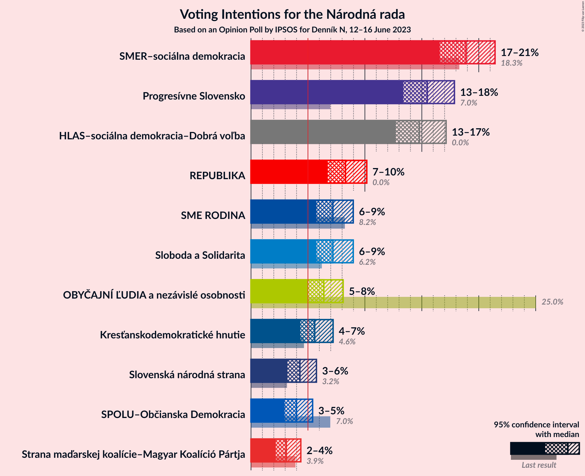

### Confidence Intervals

| Party | Last Result | Poll Result | 80% Confidence Interval | 90% Confidence Interval | 95% Confidence Interval | 99% Confidence Interval |
|:-----:|:-----------:|:-----------:|:-----------------------:|:-----------------------:|:-----------------------:|:-----------------------:|
| SMER–sociálna demokracia | 18.3% | 18.9% | 17.4–20.5% |16.9–21.0% |16.6–21.4% |15.9–22.3% |
| Progresívne Slovensko | 7.0% | 15.5% | 14.1–17.0% |13.7–17.5% |13.4–17.9% |12.7–18.6% |
| HLAS–sociálna demokracia–Dobrá voľba | 0.0% | 14.8% | 13.4–16.3% |13.0–16.8% |12.7–17.1% |12.1–17.9% |
| REPUBLIKA | 0.0% | 8.3% | 7.3–9.5% |7.0–9.9% |6.7–10.2% |6.3–10.8% |
| Sloboda a Solidarita | 6.2% | 7.2% | 6.2–8.4% |6.0–8.7% |5.7–9.0% |5.3–9.6% |
| SME RODINA | 8.2% | 7.2% | 6.2–8.4% |6.0–8.7% |5.7–9.0% |5.3–9.6% |
| OBYČAJNÍ ĽUDIA a nezávislé osobnosti | 25.0% | 6.4% | 5.5–7.5% |5.2–7.8% |5.0–8.1% |4.6–8.6% |
| Kresťanskodemokratické hnutie | 4.6% | 5.6% | 4.8–6.6% |4.5–6.9% |4.3–7.2% |4.0–7.7% |
| Slovenská národná strana | 3.2% | 4.3% | 3.6–5.2% |3.4–5.5% |3.2–5.7% |2.9–6.2% |
| SPOLU–Občianska Demokracia | 7.0% | 4.0% | 3.3–4.9% |3.1–5.2% |2.9–5.4% |2.6–5.9% |
| Strana maďarskej koalície–Magyar Koalíció Pártja | 3.9% | 3.1% | 2.5–3.9% |2.3–4.2% |2.2–4.4% |1.9–4.8% |

*Note:* The poll result column reflects the actual value used in the calculations. Published results may vary slightly, and in addition be rounded to fewer digits.

## Seats

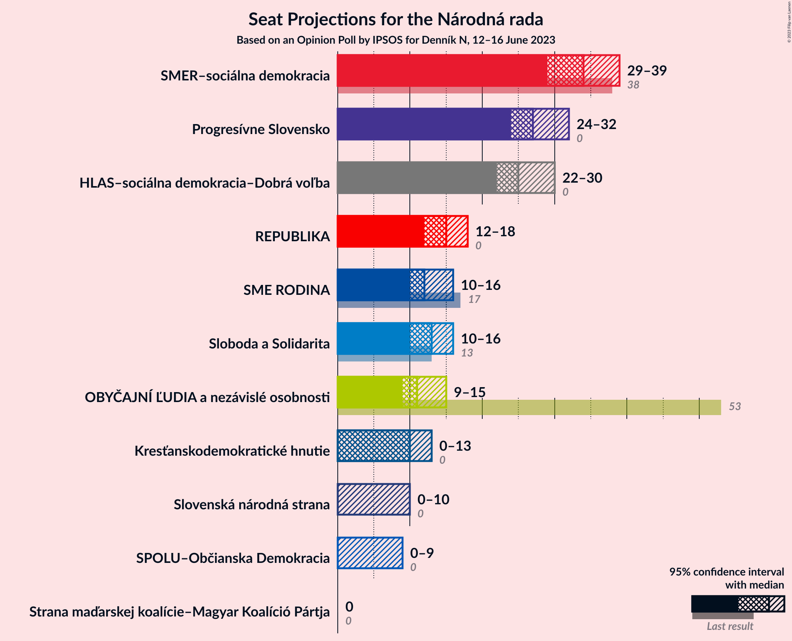

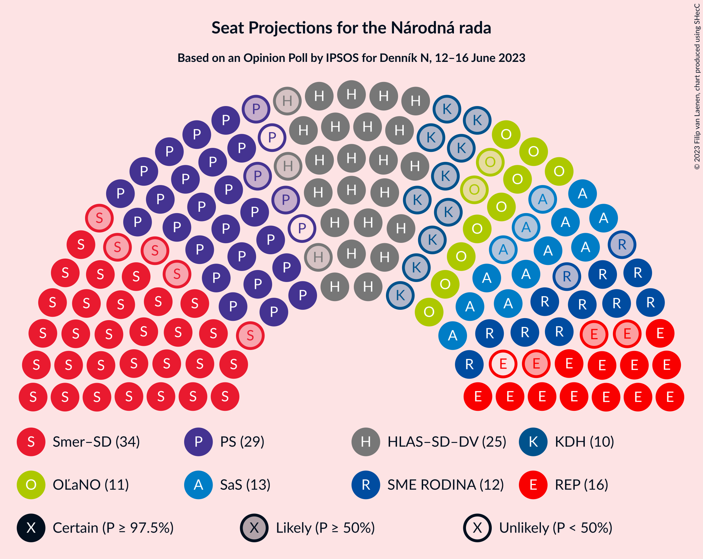

### Confidence Intervals

| Party | Last Result | Median | 80% Confidence Interval | 90% Confidence Interval | 95% Confidence Interval | 99% Confidence Interval |
|:-----:|:-----------:|:------:|:-----------------------:|:-----------------------:|:-----------------------:|:-----------------------:|
| <a href="#smer–sociálna-demokracia">SMER–sociálna demokracia</a> | 38 | 34 | 31–38 |30–39 |29–39 |28–41 |
| <a href="#progresívne-slovensko">Progresívne Slovensko</a> | 0 | 27 | 25–32 |24–32 |24–32 |23–34 |
| <a href="#hlas–sociálna-demokracia–dobrá-voľba">HLAS–sociálna demokracia–Dobrá voľba</a> | 0 | 25 | 24–29 |23–30 |22–30 |22–32 |
| <a href="#republika">REPUBLIKA</a> | 0 | 15 | 12–17 |12–17 |12–18 |11–20 |
| <a href="#sloboda-a-solidarita">Sloboda a Solidarita</a> | 13 | 13 | 11–15 |10–16 |10–16 |9–17 |
| <a href="#sme-rodina">SME RODINA</a> | 17 | 12 | 11–15 |10–15 |10–16 |9–18 |
| <a href="#obyčajní-ľudia-a-nezávislé-osobnosti">OBYČAJNÍ ĽUDIA a nezávislé osobnosti</a> | 53 | 11 | 10–13 |9–14 |9–15 |0–15 |
| <a href="#kresťanskodemokratické-hnutie">Kresťanskodemokratické hnutie</a> | 0 | 10 | 0–12 |0–13 |0–13 |0–13 |
| <a href="#slovenská-národná-strana">Slovenská národná strana</a> | 0 | 0 | 0–9 |0–10 |0–10 |0–11 |
| <a href="#spolu–občianska-demokracia">SPOLU–Občianska Demokracia</a> | 0 | 0 | 0 |0–9 |0–9 |0–11 |
| <a href="#strana-maďarskej-koalície–magyar-koalíció-pártja">Strana maďarskej koalície–Magyar Koalíció Pártja</a> | 0 | 0 | 0 |0 |0 |0 |

### SMER–sociálna demokracia

*For a full overview of the results for this party, see the [SMER–sociálna demokracia](party-smer–sociálnademokracia.html) page.*

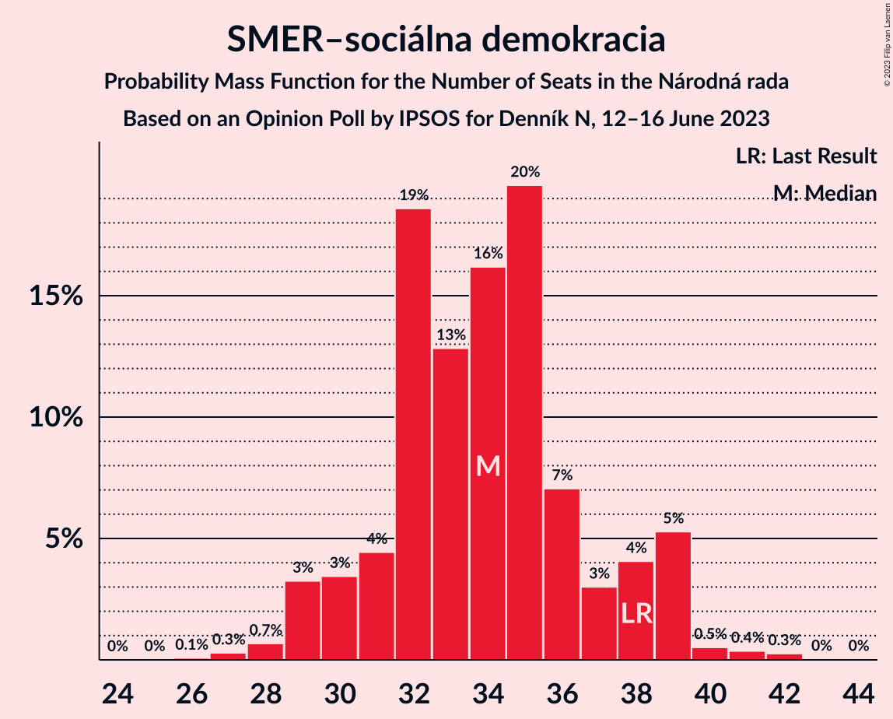

| Number of Seats | Probability | Accumulated | Special Marks |
|:---------------:|:-----------:|:-----------:|:-------------:|
| 26 | 0.1% | 100% |  |
| 27 | 0.3% | 99.9% |  |
| 28 | 0.7% | 99.6% |  |
| 29 | 3% | 98.9% |  |
| 30 | 3% | 96% |  |
| 31 | 4% | 92% |  |
| 32 | 19% | 88% |  |
| 33 | 13% | 69% |  |
| 34 | 16% | 56% | Median |
| 35 | 20% | 40% |  |
| 36 | 7% | 21% |  |
| 37 | 3% | 14% |  |
| 38 | 4% | 11% | Last Result |
| 39 | 5% | 6% |  |
| 40 | 0.5% | 1.2% |  |
| 41 | 0.4% | 0.7% |  |
| 42 | 0.3% | 0.3% |  |
| 43 | 0% | 0.1% |  |
| 44 | 0% | 0% |  |

### Progresívne Slovensko

*For a full overview of the results for this party, see the [Progresívne Slovensko](party-progresívneslovensko.html) page.*

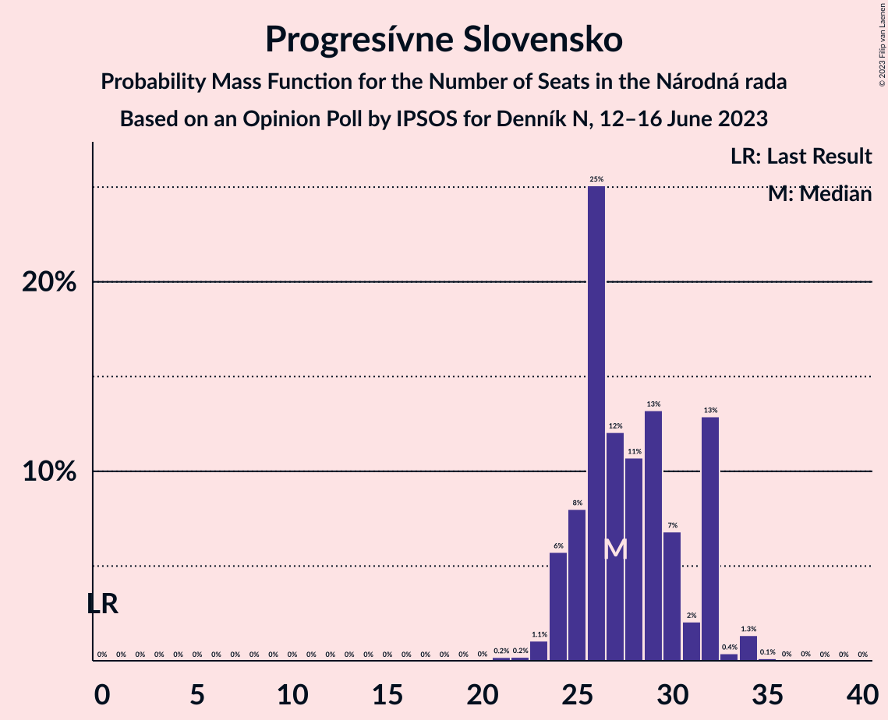

| Number of Seats | Probability | Accumulated | Special Marks |
|:---------------:|:-----------:|:-----------:|:-------------:|
| 0 | 0% | 100% | Last Result |
| 1 | 0% | 100% |  |
| 2 | 0% | 100% |  |
| 3 | 0% | 100% |  |
| 4 | 0% | 100% |  |
| 5 | 0% | 100% |  |
| 6 | 0% | 100% |  |
| 7 | 0% | 100% |  |
| 8 | 0% | 100% |  |
| 9 | 0% | 100% |  |
| 10 | 0% | 100% |  |
| 11 | 0% | 100% |  |
| 12 | 0% | 100% |  |
| 13 | 0% | 100% |  |
| 14 | 0% | 100% |  |
| 15 | 0% | 100% |  |
| 16 | 0% | 100% |  |
| 17 | 0% | 100% |  |
| 18 | 0% | 100% |  |
| 19 | 0% | 100% |  |
| 20 | 0% | 100% |  |
| 21 | 0.2% | 100% |  |
| 22 | 0.2% | 99.8% |  |
| 23 | 1.1% | 99.6% |  |
| 24 | 6% | 98.5% |  |
| 25 | 8% | 93% |  |
| 26 | 25% | 85% |  |
| 27 | 12% | 60% | Median |
| 28 | 11% | 48% |  |
| 29 | 13% | 37% |  |
| 30 | 7% | 24% |  |
| 31 | 2% | 17% |  |
| 32 | 13% | 15% |  |
| 33 | 0.4% | 2% |  |
| 34 | 1.3% | 2% |  |
| 35 | 0.1% | 0.2% |  |
| 36 | 0% | 0.1% |  |
| 37 | 0% | 0% |  |

### HLAS–sociálna demokracia–Dobrá voľba

*For a full overview of the results for this party, see the [HLAS–sociálna demokracia–Dobrá voľba](party-hlas–sociálnademokracia–dobrávoľba.html) page.*

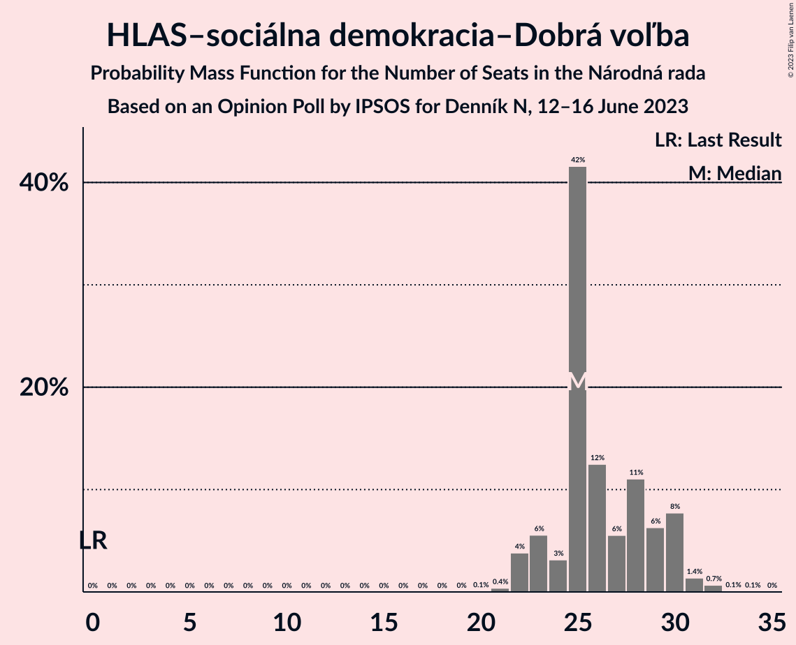

| Number of Seats | Probability | Accumulated | Special Marks |
|:---------------:|:-----------:|:-----------:|:-------------:|
| 0 | 0% | 100% | Last Result |
| 1 | 0% | 100% |  |
| 2 | 0% | 100% |  |
| 3 | 0% | 100% |  |
| 4 | 0% | 100% |  |
| 5 | 0% | 100% |  |
| 6 | 0% | 100% |  |
| 7 | 0% | 100% |  |
| 8 | 0% | 100% |  |
| 9 | 0% | 100% |  |
| 10 | 0% | 100% |  |
| 11 | 0% | 100% |  |
| 12 | 0% | 100% |  |
| 13 | 0% | 100% |  |
| 14 | 0% | 100% |  |
| 15 | 0% | 100% |  |
| 16 | 0% | 100% |  |
| 17 | 0% | 100% |  |
| 18 | 0% | 100% |  |
| 19 | 0% | 100% |  |
| 20 | 0.1% | 100% |  |
| 21 | 0.4% | 99.9% |  |
| 22 | 4% | 99.5% |  |
| 23 | 6% | 96% |  |
| 24 | 3% | 90% |  |
| 25 | 42% | 87% | Median |
| 26 | 12% | 45% |  |
| 27 | 6% | 33% |  |
| 28 | 11% | 27% |  |
| 29 | 6% | 16% |  |
| 30 | 8% | 10% |  |
| 31 | 1.4% | 2% |  |
| 32 | 0.7% | 0.9% |  |
| 33 | 0.1% | 0.2% |  |
| 34 | 0.1% | 0.1% |  |
| 35 | 0% | 0% |  |

### REPUBLIKA

*For a full overview of the results for this party, see the [REPUBLIKA](party-republika.html) page.*

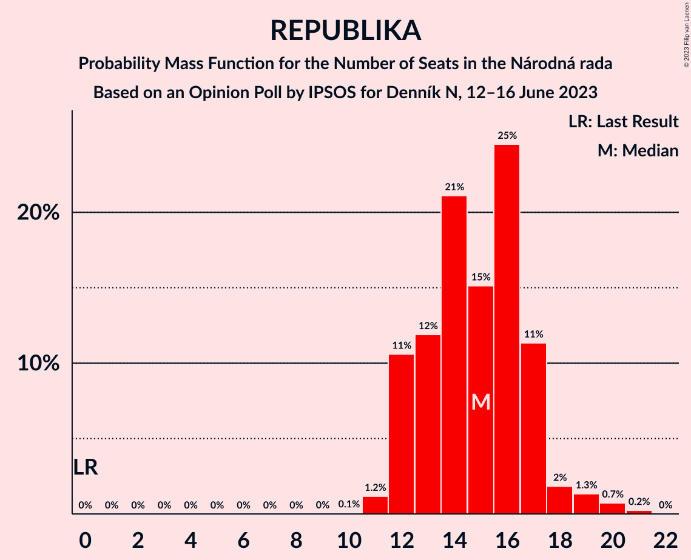

| Number of Seats | Probability | Accumulated | Special Marks |
|:---------------:|:-----------:|:-----------:|:-------------:|
| 0 | 0% | 100% | Last Result |
| 1 | 0% | 100% |  |
| 2 | 0% | 100% |  |
| 3 | 0% | 100% |  |
| 4 | 0% | 100% |  |
| 5 | 0% | 100% |  |
| 6 | 0% | 100% |  |
| 7 | 0% | 100% |  |
| 8 | 0% | 100% |  |
| 9 | 0% | 100% |  |
| 10 | 0.1% | 100% |  |
| 11 | 1.2% | 99.9% |  |
| 12 | 11% | 98.7% |  |
| 13 | 12% | 88% |  |
| 14 | 21% | 76% |  |
| 15 | 15% | 55% | Median |
| 16 | 25% | 40% |  |
| 17 | 11% | 15% |  |
| 18 | 2% | 4% |  |
| 19 | 1.3% | 2% |  |
| 20 | 0.7% | 1.0% |  |
| 21 | 0.2% | 0.3% |  |
| 22 | 0% | 0% |  |

### Sloboda a Solidarita

*For a full overview of the results for this party, see the [Sloboda a Solidarita](party-slobodaasolidarita.html) page.*

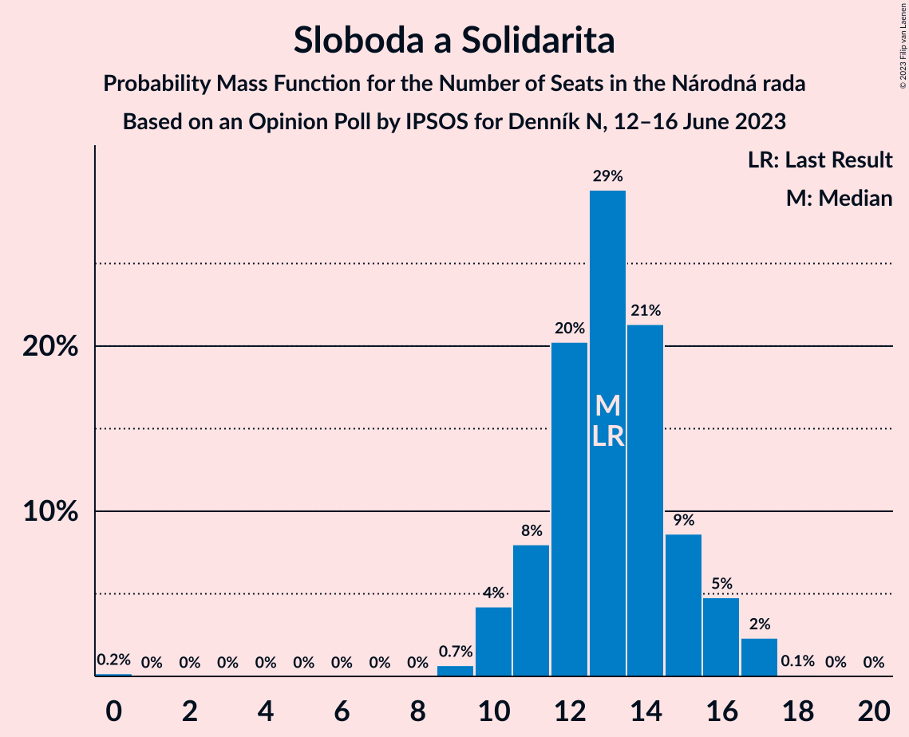

| Number of Seats | Probability | Accumulated | Special Marks |
|:---------------:|:-----------:|:-----------:|:-------------:|
| 0 | 0.2% | 100% |  |
| 1 | 0% | 99.8% |  |
| 2 | 0% | 99.8% |  |
| 3 | 0% | 99.8% |  |
| 4 | 0% | 99.8% |  |
| 5 | 0% | 99.8% |  |
| 6 | 0% | 99.8% |  |
| 7 | 0% | 99.8% |  |
| 8 | 0% | 99.8% |  |
| 9 | 0.7% | 99.8% |  |
| 10 | 4% | 99.1% |  |
| 11 | 8% | 95% |  |
| 12 | 20% | 87% |  |
| 13 | 29% | 67% | Last Result, Median |
| 14 | 21% | 37% |  |
| 15 | 9% | 16% |  |
| 16 | 5% | 7% |  |
| 17 | 2% | 2% |  |
| 18 | 0.1% | 0.1% |  |
| 19 | 0% | 0% |  |

### SME RODINA

*For a full overview of the results for this party, see the [SME RODINA](party-smerodina.html) page.*

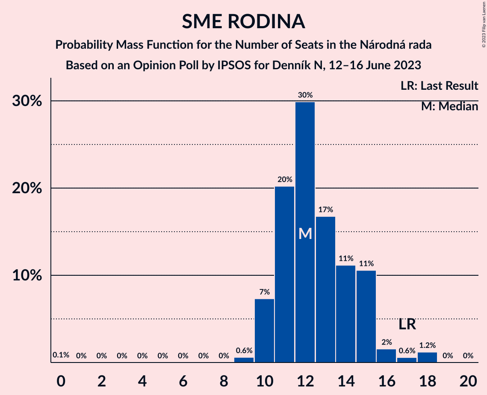

| Number of Seats | Probability | Accumulated | Special Marks |
|:---------------:|:-----------:|:-----------:|:-------------:|
| 0 | 0.1% | 100% |  |
| 1 | 0% | 99.9% |  |
| 2 | 0% | 99.9% |  |
| 3 | 0% | 99.9% |  |
| 4 | 0% | 99.9% |  |
| 5 | 0% | 99.9% |  |
| 6 | 0% | 99.9% |  |
| 7 | 0% | 99.9% |  |
| 8 | 0% | 99.9% |  |
| 9 | 0.6% | 99.9% |  |
| 10 | 7% | 99.3% |  |
| 11 | 20% | 92% |  |
| 12 | 30% | 72% | Median |
| 13 | 17% | 42% |  |
| 14 | 11% | 25% |  |
| 15 | 11% | 14% |  |
| 16 | 2% | 3% |  |
| 17 | 0.6% | 2% | Last Result |
| 18 | 1.2% | 1.2% |  |
| 19 | 0% | 0% |  |

### OBYČAJNÍ ĽUDIA a nezávislé osobnosti

*For a full overview of the results for this party, see the [OBYČAJNÍ ĽUDIA a nezávislé osobnosti](party-obyčajníľudiaanezávisléosobnosti.html) page.*

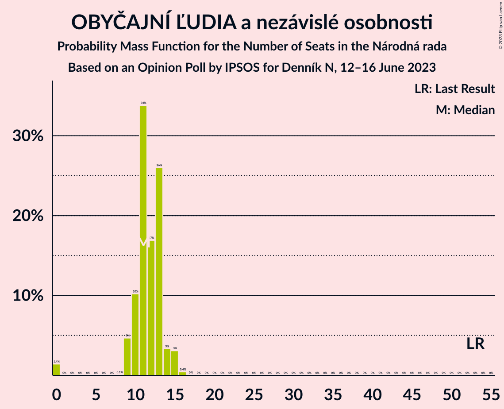

| Number of Seats | Probability | Accumulated | Special Marks |
|:---------------:|:-----------:|:-----------:|:-------------:|
| 0 | 1.4% | 100% |  |
| 1 | 0% | 98.6% |  |
| 2 | 0% | 98.6% |  |
| 3 | 0% | 98.6% |  |
| 4 | 0% | 98.6% |  |
| 5 | 0% | 98.6% |  |
| 6 | 0% | 98.6% |  |
| 7 | 0% | 98.6% |  |
| 8 | 0.1% | 98.6% |  |
| 9 | 5% | 98.5% |  |
| 10 | 10% | 94% |  |
| 11 | 34% | 84% | Median |
| 12 | 17% | 50% |  |
| 13 | 26% | 33% |  |
| 14 | 3% | 7% |  |
| 15 | 3% | 4% |  |
| 16 | 0.4% | 0.5% |  |
| 17 | 0% | 0.1% |  |
| 18 | 0% | 0% |  |
| 19 | 0% | 0% |  |
| 20 | 0% | 0% |  |
| 21 | 0% | 0% |  |
| 22 | 0% | 0% |  |
| 23 | 0% | 0% |  |
| 24 | 0% | 0% |  |
| 25 | 0% | 0% |  |
| 26 | 0% | 0% |  |
| 27 | 0% | 0% |  |
| 28 | 0% | 0% |  |
| 29 | 0% | 0% |  |
| 30 | 0% | 0% |  |
| 31 | 0% | 0% |  |
| 32 | 0% | 0% |  |
| 33 | 0% | 0% |  |
| 34 | 0% | 0% |  |
| 35 | 0% | 0% |  |
| 36 | 0% | 0% |  |
| 37 | 0% | 0% |  |
| 38 | 0% | 0% |  |
| 39 | 0% | 0% |  |
| 40 | 0% | 0% |  |
| 41 | 0% | 0% |  |
| 42 | 0% | 0% |  |
| 43 | 0% | 0% |  |
| 44 | 0% | 0% |  |
| 45 | 0% | 0% |  |
| 46 | 0% | 0% |  |
| 47 | 0% | 0% |  |
| 48 | 0% | 0% |  |
| 49 | 0% | 0% |  |
| 50 | 0% | 0% |  |
| 51 | 0% | 0% |  |
| 52 | 0% | 0% |  |
| 53 | 0% | 0% | Last Result |

### Kresťanskodemokratické hnutie

*For a full overview of the results for this party, see the [Kresťanskodemokratické hnutie](party-kresťanskodemokratickéhnutie.html) page.*

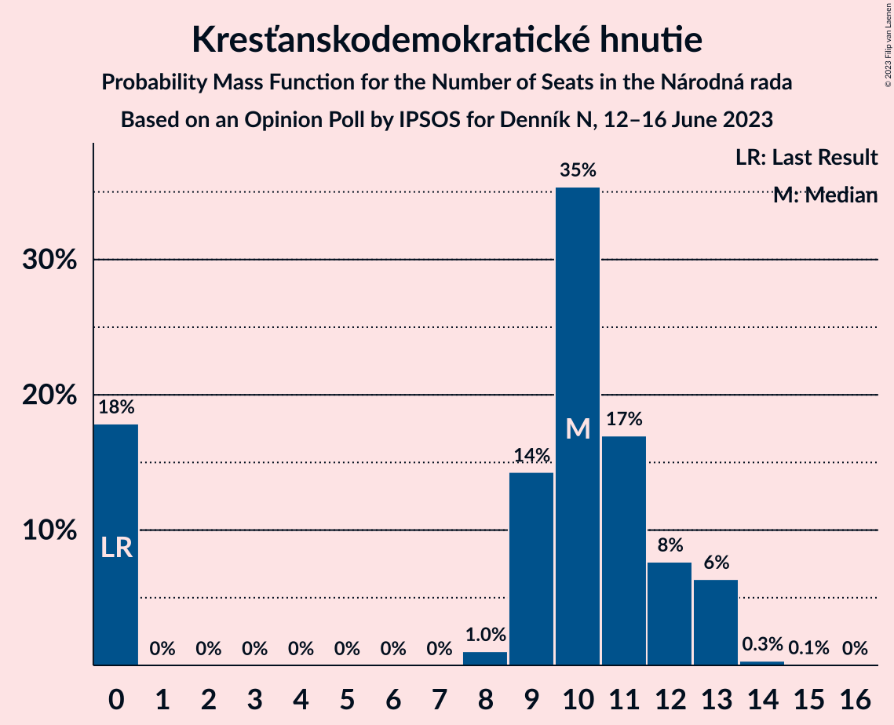

| Number of Seats | Probability | Accumulated | Special Marks |
|:---------------:|:-----------:|:-----------:|:-------------:|
| 0 | 18% | 100% | Last Result |
| 1 | 0% | 82% |  |
| 2 | 0% | 82% |  |
| 3 | 0% | 82% |  |
| 4 | 0% | 82% |  |
| 5 | 0% | 82% |  |
| 6 | 0% | 82% |  |
| 7 | 0% | 82% |  |
| 8 | 1.0% | 82% |  |
| 9 | 14% | 81% |  |
| 10 | 35% | 67% | Median |
| 11 | 17% | 31% |  |
| 12 | 8% | 14% |  |
| 13 | 6% | 7% |  |
| 14 | 0.3% | 0.4% |  |
| 15 | 0.1% | 0.1% |  |
| 16 | 0% | 0% |  |

### Slovenská národná strana

*For a full overview of the results for this party, see the [Slovenská národná strana](party-slovenskánárodnástrana.html) page.*

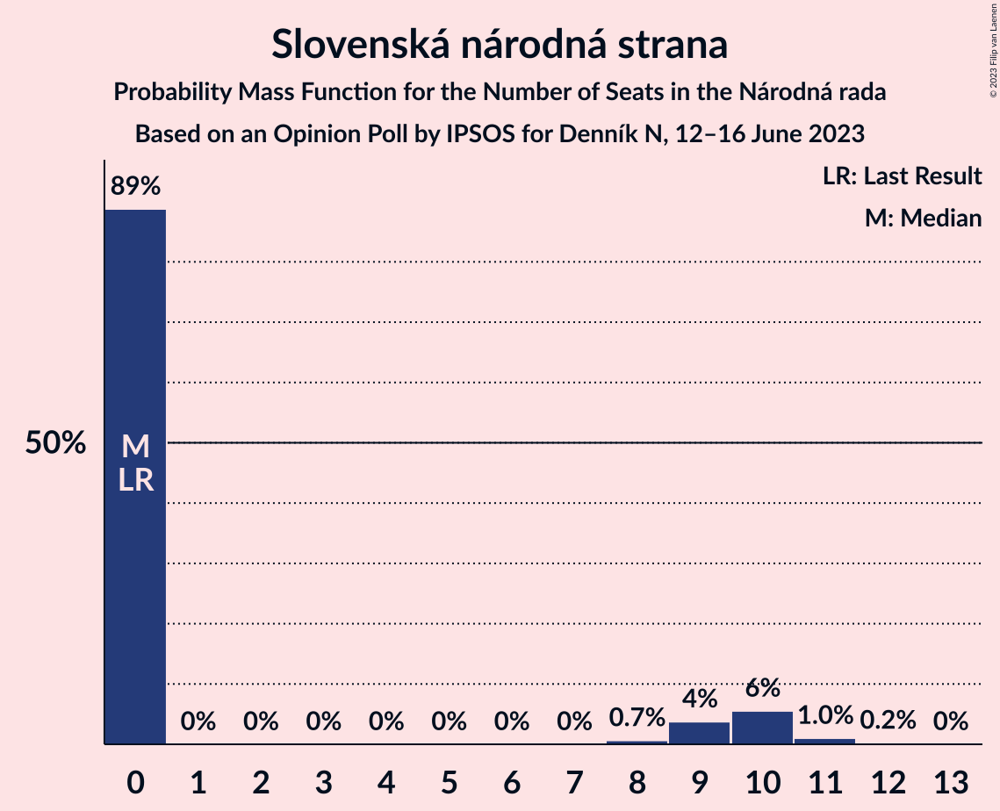

| Number of Seats | Probability | Accumulated | Special Marks |
|:---------------:|:-----------:|:-----------:|:-------------:|
| 0 | 89% | 100% | Last Result, Median |
| 1 | 0% | 11% |  |
| 2 | 0% | 11% |  |
| 3 | 0% | 11% |  |
| 4 | 0% | 11% |  |
| 5 | 0% | 11% |  |
| 6 | 0% | 11% |  |
| 7 | 0% | 11% |  |
| 8 | 0.7% | 11% |  |
| 9 | 4% | 11% |  |
| 10 | 6% | 7% |  |
| 11 | 1.0% | 1.3% |  |
| 12 | 0.2% | 0.2% |  |
| 13 | 0% | 0% |  |

### SPOLU–Občianska Demokracia

*For a full overview of the results for this party, see the [SPOLU–Občianska Demokracia](party-spolu–občianskademokracia.html) page.*

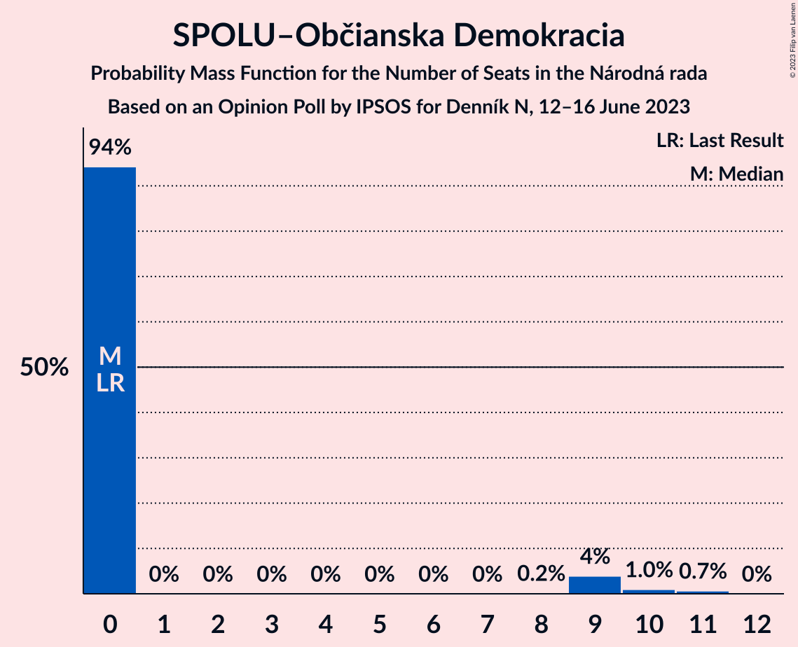

| Number of Seats | Probability | Accumulated | Special Marks |
|:---------------:|:-----------:|:-----------:|:-------------:|
| 0 | 94% | 100% | Last Result, Median |
| 1 | 0% | 6% |  |
| 2 | 0% | 6% |  |
| 3 | 0% | 6% |  |
| 4 | 0% | 6% |  |
| 5 | 0% | 6% |  |
| 6 | 0% | 6% |  |
| 7 | 0% | 6% |  |
| 8 | 0.2% | 6% |  |
| 9 | 4% | 6% |  |
| 10 | 1.0% | 2% |  |
| 11 | 0.7% | 0.7% |  |
| 12 | 0% | 0% |  |

### Strana maďarskej koalície–Magyar Koalíció Pártja

*For a full overview of the results for this party, see the [Strana maďarskej koalície–Magyar Koalíció Pártja](party-stranamaďarskejkoalície–magyarkoalíciópártja.html) page.*

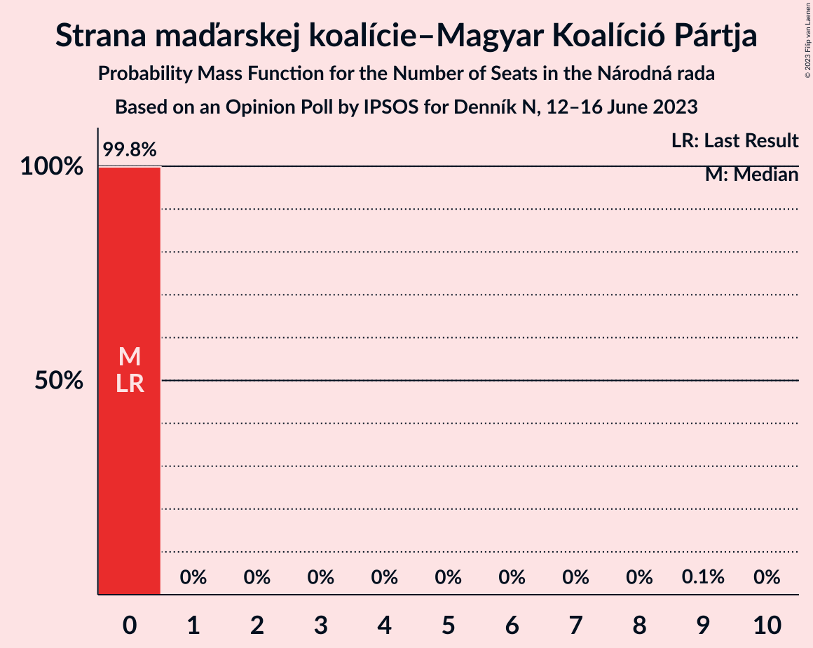

| Number of Seats | Probability | Accumulated | Special Marks |
|:---------------:|:-----------:|:-----------:|:-------------:|
| 0 | 99.8% | 100% | Last Result, Median |
| 1 | 0% | 0.2% |  |
| 2 | 0% | 0.2% |  |
| 3 | 0% | 0.2% |  |
| 4 | 0% | 0.2% |  |
| 5 | 0% | 0.2% |  |
| 6 | 0% | 0.2% |  |
| 7 | 0% | 0.2% |  |
| 8 | 0% | 0.2% |  |
| 9 | 0.1% | 0.1% |  |
| 10 | 0% | 0% |  |

## Coalitions

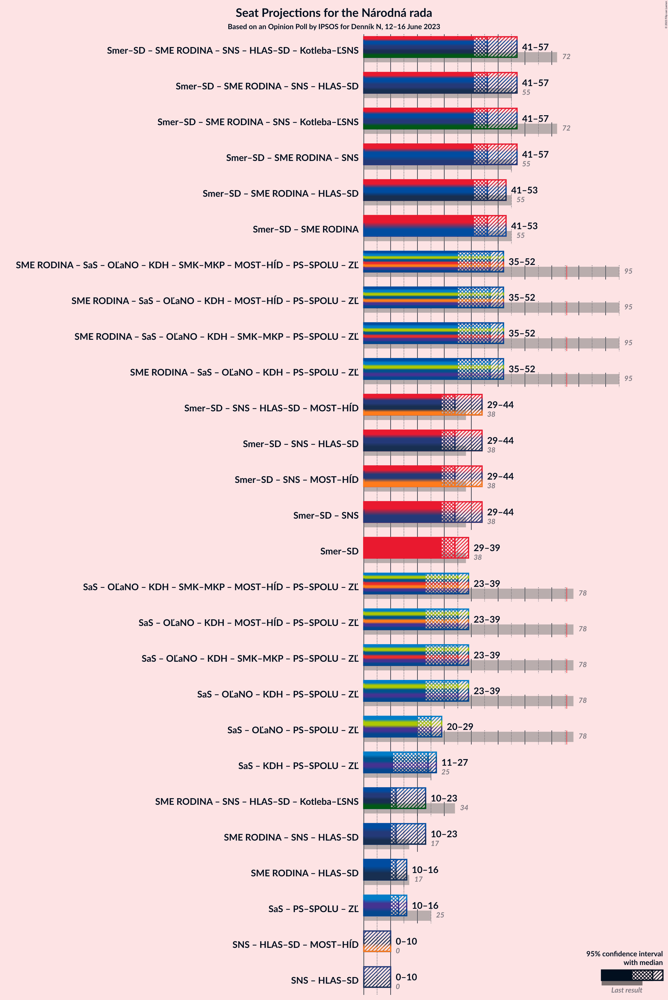

### Confidence Intervals

| Coalition | Last Result | Median | Majority? | 80% Confidence Interval | 90% Confidence Interval | 95% Confidence Interval | 99% Confidence Interval |
|:---------:|:-----------:|:------:|:---------:|:-----------------------:|:-----------------------:|:-----------------------:|:-----------------------:|
| SMER–sociálna demokracia – SME RODINA – Slovenská národná strana | 55 | 46 | 0% | 44–53 | 42–57 | 41–57 | 40–59 |
| SMER–sociálna demokracia – SME RODINA | 55 | 46 | 0% | 43–51 | 42–52 | 41–53 | 40–55 |
| SMER–sociálna demokracia – Slovenská národná strana | 38 | 34 | 0% | 32–40 | 30–44 | 29–44 | 28–46 |
| SMER–sociálna demokracia | 38 | 34 | 0% | 31–38 | 30–39 | 29–39 | 28–41 |

### SMER–sociálna demokracia – SME RODINA – Slovenská národná strana

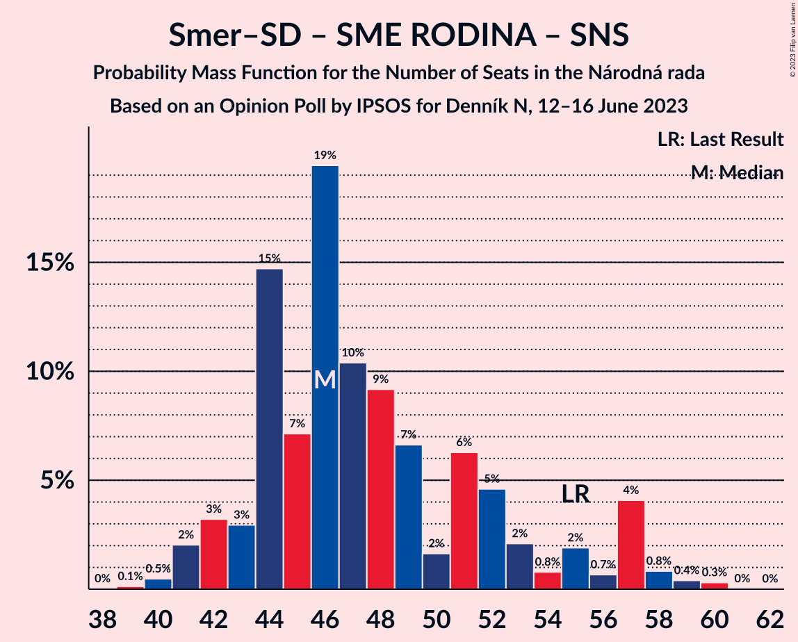

| Number of Seats | Probability | Accumulated | Special Marks |
|:---------------:|:-----------:|:-----------:|:-------------:|
| 38 | 0% | 100% |  |
| 39 | 0.1% | 99.9% |  |
| 40 | 0.5% | 99.8% |  |
| 41 | 2% | 99.3% |  |
| 42 | 3% | 97% |  |
| 43 | 3% | 94% |  |
| 44 | 15% | 91% |  |
| 45 | 7% | 76% |  |
| 46 | 19% | 69% | Median |
| 47 | 10% | 50% |  |
| 48 | 9% | 39% |  |
| 49 | 7% | 30% |  |
| 50 | 2% | 24% |  |
| 51 | 6% | 22% |  |
| 52 | 5% | 16% |  |
| 53 | 2% | 11% |  |
| 54 | 0.8% | 9% |  |
| 55 | 2% | 8% | Last Result |
| 56 | 0.7% | 6% |  |
| 57 | 4% | 6% |  |
| 58 | 0.8% | 2% |  |
| 59 | 0.4% | 0.8% |  |
| 60 | 0.3% | 0.4% |  |
| 61 | 0% | 0.1% |  |
| 62 | 0% | 0% |  |

### SMER–sociálna demokracia – SME RODINA

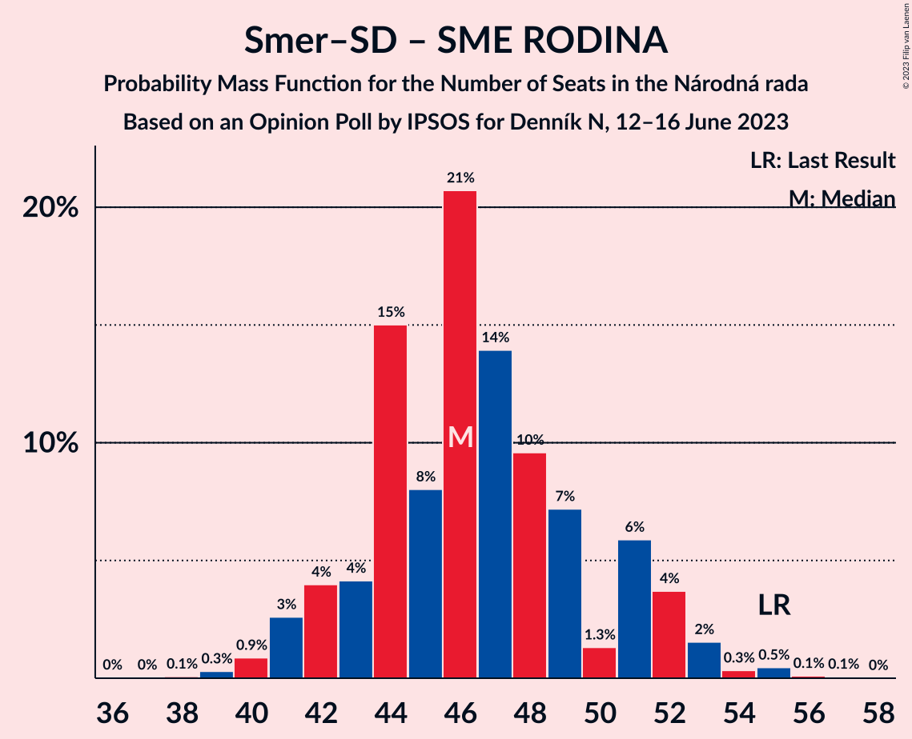

| Number of Seats | Probability | Accumulated | Special Marks |
|:---------------:|:-----------:|:-----------:|:-------------:|
| 36 | 0% | 100% |  |
| 37 | 0% | 99.9% |  |
| 38 | 0.1% | 99.9% |  |
| 39 | 0.3% | 99.8% |  |
| 40 | 0.9% | 99.5% |  |
| 41 | 3% | 98.6% |  |
| 42 | 4% | 96% |  |
| 43 | 4% | 92% |  |
| 44 | 15% | 88% |  |
| 45 | 8% | 73% |  |
| 46 | 21% | 65% | Median |
| 47 | 14% | 44% |  |
| 48 | 10% | 30% |  |
| 49 | 7% | 21% |  |
| 50 | 1.3% | 13% |  |
| 51 | 6% | 12% |  |
| 52 | 4% | 6% |  |
| 53 | 2% | 3% |  |
| 54 | 0.3% | 1.0% |  |
| 55 | 0.5% | 0.7% | Last Result |
| 56 | 0.1% | 0.2% |  |
| 57 | 0.1% | 0.1% |  |
| 58 | 0% | 0% |  |

### SMER–sociálna demokracia – Slovenská národná strana

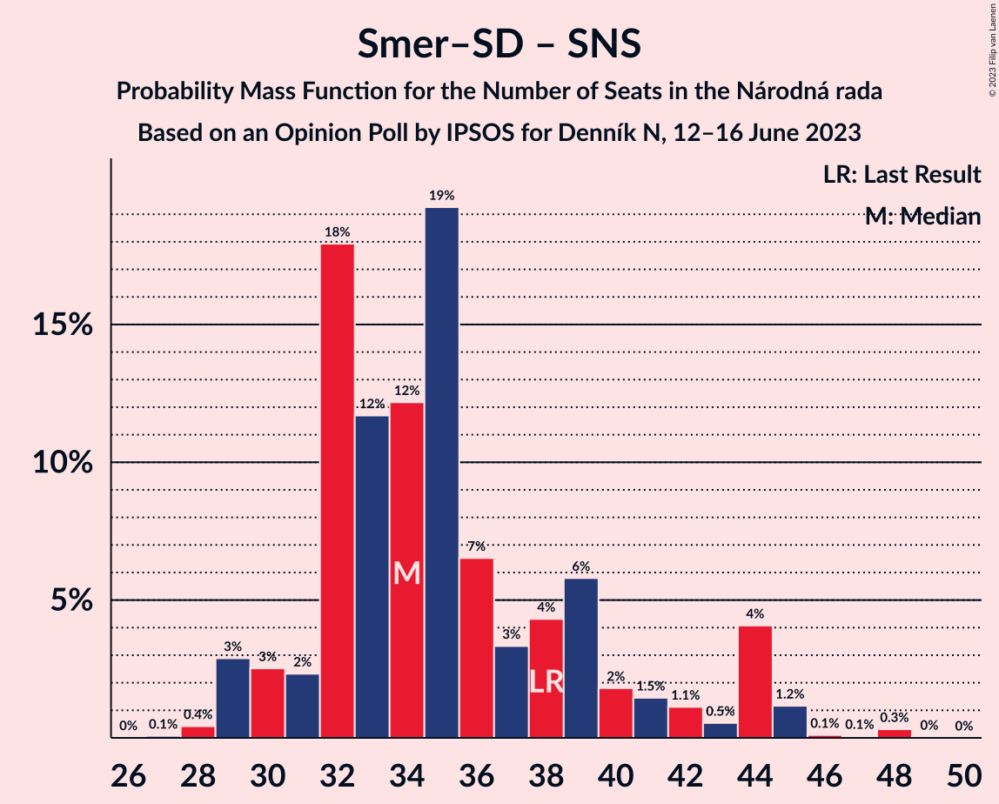

| Number of Seats | Probability | Accumulated | Special Marks |
|:---------------:|:-----------:|:-----------:|:-------------:|
| 27 | 0.1% | 100% |  |
| 28 | 0.4% | 99.9% |  |
| 29 | 3% | 99.5% |  |
| 30 | 3% | 97% |  |
| 31 | 2% | 94% |  |
| 32 | 18% | 92% |  |
| 33 | 12% | 74% |  |
| 34 | 12% | 62% | Median |
| 35 | 19% | 50% |  |
| 36 | 7% | 31% |  |
| 37 | 3% | 24% |  |
| 38 | 4% | 21% | Last Result |
| 39 | 6% | 16% |  |
| 40 | 2% | 11% |  |
| 41 | 1.5% | 9% |  |
| 42 | 1.1% | 7% |  |
| 43 | 0.5% | 6% |  |
| 44 | 4% | 6% |  |
| 45 | 1.2% | 2% |  |
| 46 | 0.1% | 0.5% |  |
| 47 | 0.1% | 0.4% |  |
| 48 | 0.3% | 0.4% |  |
| 49 | 0% | 0% |  |

### SMER–sociálna demokracia

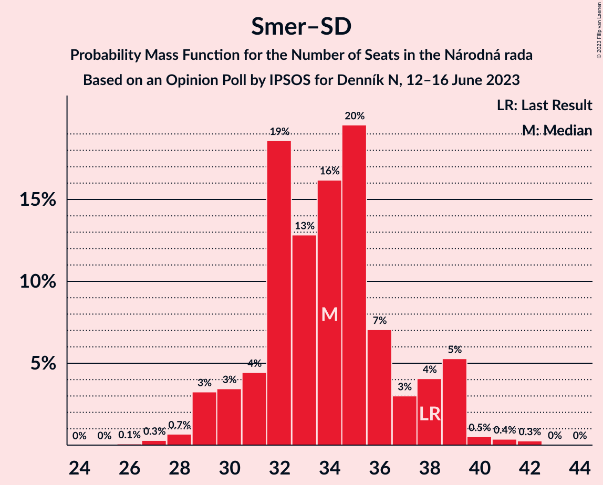

| Number of Seats | Probability | Accumulated | Special Marks |
|:---------------:|:-----------:|:-----------:|:-------------:|
| 26 | 0.1% | 100% |  |
| 27 | 0.3% | 99.9% |  |
| 28 | 0.7% | 99.6% |  |
| 29 | 3% | 98.9% |  |
| 30 | 3% | 96% |  |
| 31 | 4% | 92% |  |
| 32 | 19% | 88% |  |
| 33 | 13% | 69% |  |
| 34 | 16% | 56% | Median |
| 35 | 20% | 40% |  |
| 36 | 7% | 21% |  |
| 37 | 3% | 14% |  |
| 38 | 4% | 11% | Last Result |
| 39 | 5% | 6% |  |
| 40 | 0.5% | 1.2% |  |
| 41 | 0.4% | 0.7% |  |
| 42 | 0.3% | 0.3% |  |
| 43 | 0% | 0.1% |  |
| 44 | 0% | 0% |  |

## Technical Information

### Opinion Poll

+ **Polling firm:** IPSOS
+ **Commissioner(s):** Denník N
+ **Fieldwork period:** 12–16 June 2023

### Calculations

+ **Sample size:** 1001
+ **Simulations done:** 1,048,576
+ **Error estimate:** 1.74%

