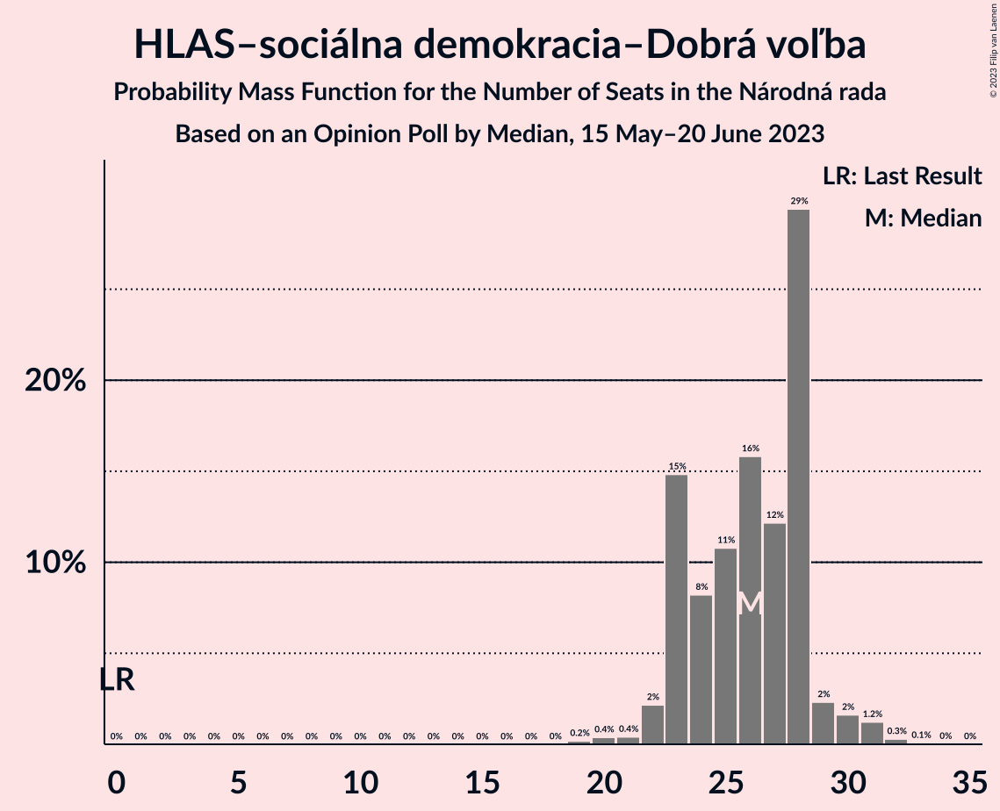

# Opinion Poll by Median, 15 May–20 June 2023

<a href="#voting-intentions">Voting Intentions</a> | <a href="#seats">Seats</a> | <a href="#coalitions">Coalitions</a> | <a href="#technical-information">Technical Information</a>

## Voting Intentions

### Confidence Intervals

| Party | Last Result | Poll Result | 80% Confidence Interval | 90% Confidence Interval | 95% Confidence Interval | 99% Confidence Interval |
|:-----:|:-----------:|:-----------:|:-----------------------:|:-----------------------:|:-----------------------:|:-----------------------:|
| SMER–sociálna demokracia | 18.3% | 18.0% | 16.5–19.6% |16.1–20.0% |15.7–20.4% |15.1–21.2% |
| HLAS–sociálna demokracia–Dobrá voľba | 0.0% | 14.1% | 12.8–15.6% |12.4–16.0% |12.1–16.4% |11.5–17.1% |
| Progresívne Slovensko | 7.0% | 11.6% | 10.4–13.0% |10.1–13.3% |9.8–13.7% |9.2–14.4% |
| REPUBLIKA | 0.0% | 8.2% | 7.2–9.4% |6.9–9.7% |6.7–10.0% |6.2–10.6% |
| OBYČAJNÍ ĽUDIA a nezávislé osobnosti | 25.0% | 7.1% | 6.2–8.3% |5.9–8.6% |5.7–8.9% |5.3–9.4% |
| SME RODINA | 8.2% | 7.0% | 6.1–8.2% |5.9–8.5% |5.6–8.8% |5.2–9.3% |
| Sloboda a Solidarita | 6.2% | 6.6% | 5.7–7.7% |5.4–8.0% |5.2–8.2% |4.8–8.8% |
| Kresťanskodemokratické hnutie | 4.6% | 6.5% | 5.6–7.6% |5.3–7.9% |5.1–8.1% |4.7–8.7% |
| SPOLU–Občianska Demokracia | 7.0% | 4.7% | 4.0–5.7% |3.8–6.0% |3.6–6.2% |3.3–6.7% |
| Slovenská národná strana | 3.2% | 4.6% | 3.9–5.6% |3.7–5.9% |3.5–6.1% |3.2–6.6% |
| Kotleba–Ľudová strana Naše Slovensko | 8.0% | 3.0% | 2.4–3.8% |2.2–4.0% |2.1–4.2% |1.9–4.6% |
| Za ľudí | 5.8% | 1.5% | 1.1–2.2% |1.0–2.3% |0.9–2.5% |0.8–2.8% |

*Note:* The poll result column reflects the actual value used in the calculations. Published results may vary slightly, and in addition be rounded to fewer digits.

## Seats

### Confidence Intervals

| Party | Last Result | Median | 80% Confidence Interval | 90% Confidence Interval | 95% Confidence Interval | 99% Confidence Interval |
|:-----:|:-----------:|:------:|:-----------------------:|:-----------------------:|:-----------------------:|:-----------------------:|
| <a href="#smer–sociálna-demokracia">SMER–sociálna demokracia</a> | 38 | 33 | 29–36 |28–37 |28–37 |27–39 |
| <a href="#hlas–sociálna-demokracia–dobrá-voľba">HLAS–sociálna demokracia–Dobrá voľba</a> | 0 | 26 | 23–28 |23–29 |22–30 |20–31 |
| <a href="#progresívne-slovensko">Progresívne Slovensko</a> | 0 | 21 | 18–24 |17–24 |16–24 |16–26 |
| <a href="#republika">REPUBLIKA</a> | 0 | 16 | 13–18 |12–18 |10–18 |10–19 |
| <a href="#obyčajní-ľudia-a-nezávislé-osobnosti">OBYČAJNÍ ĽUDIA a nezávislé osobnosti</a> | 53 | 13 | 11–14 |11–15 |10–16 |0–17 |
| <a href="#sme-rodina">SME RODINA</a> | 17 | 13 | 12–14 |11–15 |11–15 |9–17 |
| <a href="#sloboda-a-solidarita">Sloboda a Solidarita</a> | 13 | 12 | 10–13 |10–14 |9–15 |0–15 |
| <a href="#kresťanskodemokratické-hnutie">Kresťanskodemokratické hnutie</a> | 0 | 11 | 9–15 |9–16 |9–16 |0–16 |
| <a href="#spolu–občianska-demokracia">SPOLU–Občianska Demokracia</a> | 0 | 0 | 0–9 |0–10 |0–10 |0–12 |
| <a href="#slovenská-národná-strana">Slovenská národná strana</a> | 0 | 0 | 0–10 |0–10 |0–10 |0–11 |
| <a href="#kotleba–ľudová-strana-naše-slovensko">Kotleba–Ľudová strana Naše Slovensko</a> | 17 | 0 | 0 |0 |0 |0 |
| <a href="#za-ľudí">Za ľudí</a> | 12 | 0 | 0 |0 |0 |0 |

### SMER–sociálna demokracia

*For a full overview of the results for this party, see the [SMER–sociálna demokracia](party-smer–sociálnademokracia.html) page.*

| Number of Seats | Probability | Accumulated | Special Marks |
|:---------------:|:-----------:|:-----------:|:-------------:|
| 26 | 0.1% | 100% |  |
| 27 | 2% | 99.9% |  |
| 28 | 7% | 98% |  |
| 29 | 3% | 90% |  |
| 30 | 7% | 87% |  |
| 31 | 10% | 80% |  |
| 32 | 12% | 71% |  |
| 33 | 16% | 59% | Median |
| 34 | 27% | 42% |  |
| 35 | 5% | 15% |  |
| 36 | 2% | 10% |  |
| 37 | 7% | 8% |  |
| 38 | 0.1% | 1.0% | Last Result |
| 39 | 0.7% | 0.9% |  |
| 40 | 0.1% | 0.2% |  |
| 41 | 0.1% | 0.1% |  |
| 42 | 0% | 0% |  |

### HLAS–sociálna demokracia–Dobrá voľba

*For a full overview of the results for this party, see the [HLAS–sociálna demokracia–Dobrá voľba](party-hlas–sociálnademokracia–dobrávoľba.html) page.*

| Number of Seats | Probability | Accumulated | Special Marks |
|:---------------:|:-----------:|:-----------:|:-------------:|
| 0 | 0% | 100% | Last Result |
| 1 | 0% | 100% |  |
| 2 | 0% | 100% |  |
| 3 | 0% | 100% |  |
| 4 | 0% | 100% |  |
| 5 | 0% | 100% |  |
| 6 | 0% | 100% |  |
| 7 | 0% | 100% |  |
| 8 | 0% | 100% |  |
| 9 | 0% | 100% |  |
| 10 | 0% | 100% |  |
| 11 | 0% | 100% |  |
| 12 | 0% | 100% |  |
| 13 | 0% | 100% |  |
| 14 | 0% | 100% |  |
| 15 | 0% | 100% |  |
| 16 | 0% | 100% |  |
| 17 | 0% | 100% |  |
| 18 | 0% | 100% |  |
| 19 | 0.2% | 100% |  |
| 20 | 0.4% | 99.8% |  |
| 21 | 0.4% | 99.4% |  |
| 22 | 2% | 99.0% |  |
| 23 | 15% | 97% |  |
| 24 | 8% | 82% |  |
| 25 | 11% | 74% |  |
| 26 | 16% | 63% | Median |
| 27 | 12% | 47% |  |
| 28 | 29% | 35% |  |
| 29 | 2% | 6% |  |
| 30 | 2% | 3% |  |
| 31 | 1.2% | 2% |  |
| 32 | 0.3% | 0.4% |  |
| 33 | 0.1% | 0.1% |  |
| 34 | 0% | 0% |  |

### Progresívne Slovensko

*For a full overview of the results for this party, see the [Progresívne Slovensko](party-progresívneslovensko.html) page.*

| Number of Seats | Probability | Accumulated | Special Marks |
|:---------------:|:-----------:|:-----------:|:-------------:|
| 0 | 0% | 100% | Last Result |
| 1 | 0% | 100% |  |
| 2 | 0% | 100% |  |
| 3 | 0% | 100% |  |
| 4 | 0% | 100% |  |
| 5 | 0% | 100% |  |
| 6 | 0% | 100% |  |
| 7 | 0% | 100% |  |
| 8 | 0% | 100% |  |
| 9 | 0% | 100% |  |
| 10 | 0% | 100% |  |
| 11 | 0% | 100% |  |
| 12 | 0% | 100% |  |
| 13 | 0% | 100% |  |
| 14 | 0% | 100% |  |
| 15 | 0% | 100% |  |
| 16 | 3% | 100% |  |
| 17 | 7% | 97% |  |
| 18 | 2% | 91% |  |
| 19 | 11% | 89% |  |
| 20 | 21% | 78% |  |
| 21 | 26% | 57% | Median |
| 22 | 11% | 31% |  |
| 23 | 5% | 20% |  |
| 24 | 13% | 15% |  |
| 25 | 1.0% | 2% |  |
| 26 | 0.5% | 0.7% |  |
| 27 | 0.1% | 0.2% |  |
| 28 | 0% | 0.1% |  |
| 29 | 0.1% | 0.1% |  |
| 30 | 0% | 0% |  |

### REPUBLIKA

*For a full overview of the results for this party, see the [REPUBLIKA](party-republika.html) page.*

| Number of Seats | Probability | Accumulated | Special Marks |
|:---------------:|:-----------:|:-----------:|:-------------:|
| 0 | 0% | 100% | Last Result |
| 1 | 0% | 100% |  |
| 2 | 0% | 100% |  |
| 3 | 0% | 100% |  |
| 4 | 0% | 100% |  |
| 5 | 0% | 100% |  |
| 6 | 0% | 100% |  |
| 7 | 0% | 100% |  |
| 8 | 0% | 100% |  |
| 9 | 0% | 100% |  |
| 10 | 3% | 100% |  |
| 11 | 0.7% | 97% |  |
| 12 | 3% | 96% |  |
| 13 | 4% | 93% |  |
| 14 | 22% | 90% |  |
| 15 | 9% | 68% |  |
| 16 | 25% | 59% | Median |
| 17 | 8% | 34% |  |
| 18 | 24% | 26% |  |
| 19 | 2% | 2% |  |
| 20 | 0.4% | 0.5% |  |
| 21 | 0% | 0% |  |

### OBYČAJNÍ ĽUDIA a nezávislé osobnosti

*For a full overview of the results for this party, see the [OBYČAJNÍ ĽUDIA a nezávislé osobnosti](party-obyčajníľudiaanezávisléosobnosti.html) page.*

| Number of Seats | Probability | Accumulated | Special Marks |
|:---------------:|:-----------:|:-----------:|:-------------:|
| 0 | 0.7% | 100% |  |
| 1 | 0% | 99.3% |  |
| 2 | 0% | 99.3% |  |
| 3 | 0% | 99.3% |  |
| 4 | 0% | 99.3% |  |
| 5 | 0% | 99.3% |  |
| 6 | 0% | 99.3% |  |
| 7 | 0% | 99.3% |  |
| 8 | 0% | 99.3% |  |
| 9 | 0.2% | 99.3% |  |
| 10 | 2% | 99.1% |  |
| 11 | 9% | 97% |  |
| 12 | 20% | 89% |  |
| 13 | 34% | 69% | Median |
| 14 | 25% | 34% |  |
| 15 | 5% | 9% |  |
| 16 | 3% | 4% |  |
| 17 | 1.3% | 1.5% |  |
| 18 | 0.1% | 0.2% |  |
| 19 | 0% | 0% |  |
| 20 | 0% | 0% |  |
| 21 | 0% | 0% |  |
| 22 | 0% | 0% |  |
| 23 | 0% | 0% |  |
| 24 | 0% | 0% |  |
| 25 | 0% | 0% |  |
| 26 | 0% | 0% |  |
| 27 | 0% | 0% |  |
| 28 | 0% | 0% |  |
| 29 | 0% | 0% |  |
| 30 | 0% | 0% |  |
| 31 | 0% | 0% |  |
| 32 | 0% | 0% |  |
| 33 | 0% | 0% |  |
| 34 | 0% | 0% |  |
| 35 | 0% | 0% |  |
| 36 | 0% | 0% |  |
| 37 | 0% | 0% |  |
| 38 | 0% | 0% |  |
| 39 | 0% | 0% |  |
| 40 | 0% | 0% |  |
| 41 | 0% | 0% |  |
| 42 | 0% | 0% |  |
| 43 | 0% | 0% |  |
| 44 | 0% | 0% |  |
| 45 | 0% | 0% |  |
| 46 | 0% | 0% |  |
| 47 | 0% | 0% |  |
| 48 | 0% | 0% |  |
| 49 | 0% | 0% |  |
| 50 | 0% | 0% |  |
| 51 | 0% | 0% |  |
| 52 | 0% | 0% |  |
| 53 | 0% | 0% | Last Result |

### SME RODINA

*For a full overview of the results for this party, see the [SME RODINA](party-smerodina.html) page.*

| Number of Seats | Probability | Accumulated | Special Marks |
|:---------------:|:-----------:|:-----------:|:-------------:|
| 0 | 0.1% | 100% |  |
| 1 | 0% | 99.9% |  |
| 2 | 0% | 99.9% |  |
| 3 | 0% | 99.9% |  |
| 4 | 0% | 99.9% |  |
| 5 | 0% | 99.9% |  |
| 6 | 0% | 99.9% |  |
| 7 | 0% | 99.9% |  |
| 8 | 0% | 99.9% |  |
| 9 | 0.4% | 99.9% |  |
| 10 | 2% | 99.5% |  |
| 11 | 3% | 98% |  |
| 12 | 12% | 95% |  |
| 13 | 50% | 82% | Median |
| 14 | 26% | 33% |  |
| 15 | 5% | 7% |  |
| 16 | 1.1% | 2% |  |
| 17 | 0.5% | 0.7% | Last Result |
| 18 | 0.1% | 0.2% |  |
| 19 | 0.1% | 0.1% |  |
| 20 | 0% | 0% |  |

### Sloboda a Solidarita

*For a full overview of the results for this party, see the [Sloboda a Solidarita](party-slobodaasolidarita.html) page.*

| Number of Seats | Probability | Accumulated | Special Marks |
|:---------------:|:-----------:|:-----------:|:-------------:|
| 0 | 0.7% | 100% |  |
| 1 | 0% | 99.3% |  |
| 2 | 0% | 99.3% |  |
| 3 | 0% | 99.3% |  |
| 4 | 0% | 99.3% |  |
| 5 | 0% | 99.3% |  |
| 6 | 0% | 99.3% |  |
| 7 | 0% | 99.3% |  |
| 8 | 0.2% | 99.3% |  |
| 9 | 3% | 99.1% |  |
| 10 | 12% | 96% |  |
| 11 | 27% | 83% |  |
| 12 | 25% | 56% | Median |
| 13 | 24% | 31% | Last Result |
| 14 | 5% | 7% |  |
| 15 | 2% | 3% |  |
| 16 | 0.4% | 0.5% |  |
| 17 | 0.1% | 0.1% |  |
| 18 | 0% | 0% |  |

### Kresťanskodemokratické hnutie

*For a full overview of the results for this party, see the [Kresťanskodemokratické hnutie](party-kresťanskodemokratickéhnutie.html) page.*

| Number of Seats | Probability | Accumulated | Special Marks |
|:---------------:|:-----------:|:-----------:|:-------------:|
| 0 | 1.3% | 100% | Last Result |
| 1 | 0% | 98.7% |  |
| 2 | 0% | 98.7% |  |
| 3 | 0% | 98.7% |  |
| 4 | 0% | 98.7% |  |
| 5 | 0% | 98.7% |  |
| 6 | 0% | 98.7% |  |
| 7 | 0% | 98.7% |  |
| 8 | 0% | 98.7% |  |
| 9 | 10% | 98.7% |  |
| 10 | 25% | 88% |  |
| 11 | 16% | 63% | Median |
| 12 | 15% | 47% |  |
| 13 | 16% | 32% |  |
| 14 | 3% | 16% |  |
| 15 | 3% | 13% |  |
| 16 | 10% | 10% |  |
| 17 | 0% | 0% |  |

### SPOLU–Občianska Demokracia

*For a full overview of the results for this party, see the [SPOLU–Občianska Demokracia](party-spolu–občianskademokracia.html) page.*

| Number of Seats | Probability | Accumulated | Special Marks |
|:---------------:|:-----------:|:-----------:|:-------------:|
| 0 | 79% | 100% | Last Result, Median |
| 1 | 0% | 21% |  |
| 2 | 0% | 21% |  |
| 3 | 0% | 21% |  |
| 4 | 0% | 21% |  |
| 5 | 0% | 21% |  |
| 6 | 0% | 21% |  |
| 7 | 0% | 21% |  |
| 8 | 0% | 21% |  |
| 9 | 16% | 21% |  |
| 10 | 3% | 5% |  |
| 11 | 2% | 2% |  |
| 12 | 0.4% | 0.6% |  |
| 13 | 0.2% | 0.2% |  |
| 14 | 0% | 0% |  |

### Slovenská národná strana

*For a full overview of the results for this party, see the [Slovenská národná strana](party-slovenskánárodnástrana.html) page.*

| Number of Seats | Probability | Accumulated | Special Marks |
|:---------------:|:-----------:|:-----------:|:-------------:|
| 0 | 63% | 100% | Last Result, Median |
| 1 | 0% | 37% |  |
| 2 | 0% | 37% |  |
| 3 | 0% | 37% |  |
| 4 | 0% | 37% |  |
| 5 | 0% | 37% |  |
| 6 | 0% | 37% |  |
| 7 | 0% | 37% |  |
| 8 | 5% | 37% |  |
| 9 | 19% | 32% |  |
| 10 | 11% | 13% |  |
| 11 | 1.4% | 2% |  |
| 12 | 0.3% | 0.4% |  |
| 13 | 0% | 0% |  |

### Kotleba–Ľudová strana Naše Slovensko

*For a full overview of the results for this party, see the [Kotleba–Ľudová strana Naše Slovensko](party-kotleba–ľudovástrananašeslovensko.html) page.*

| Number of Seats | Probability | Accumulated | Special Marks |
|:---------------:|:-----------:|:-----------:|:-------------:|
| 0 | 99.9% | 100% | Median |
| 1 | 0% | 0.1% |  |
| 2 | 0% | 0.1% |  |
| 3 | 0% | 0.1% |  |
| 4 | 0% | 0.1% |  |
| 5 | 0% | 0.1% |  |
| 6 | 0% | 0.1% |  |
| 7 | 0% | 0.1% |  |
| 8 | 0% | 0.1% |  |
| 9 | 0.1% | 0.1% |  |
| 10 | 0% | 0% |  |
| 11 | 0% | 0% |  |
| 12 | 0% | 0% |  |
| 13 | 0% | 0% |  |
| 14 | 0% | 0% |  |
| 15 | 0% | 0% |  |
| 16 | 0% | 0% |  |
| 17 | 0% | 0% | Last Result |

### Za ľudí

*For a full overview of the results for this party, see the [Za ľudí](party-zaľudí.html) page.*

| Number of Seats | Probability | Accumulated | Special Marks |
|:---------------:|:-----------:|:-----------:|:-------------:|
| 0 | 100% | 100% | Median |
| 1 | 0% | 0% |  |
| 2 | 0% | 0% |  |
| 3 | 0% | 0% |  |
| 4 | 0% | 0% |  |
| 5 | 0% | 0% |  |
| 6 | 0% | 0% |  |
| 7 | 0% | 0% |  |
| 8 | 0% | 0% |  |
| 9 | 0% | 0% |  |
| 10 | 0% | 0% |  |
| 11 | 0% | 0% |  |
| 12 | 0% | 0% | Last Result |

## Coalitions

### Confidence Intervals

| Coalition | Last Result | Median | Majority? | 80% Confidence Interval | 90% Confidence Interval | 95% Confidence Interval | 99% Confidence Interval |
|:---------:|:-----------:|:------:|:---------:|:-----------------------:|:-----------------------:|:-----------------------:|:-----------------------:|
| SMER–sociálna demokracia – SME RODINA – Slovenská národná strana – Kotleba–Ľudová strana Naše Slovensko | 72 | 48 | 0% | 45–55 | 42–55 | 41–57 | 39–60 |
| SMER–sociálna demokracia – SME RODINA – Slovenská národná strana | 55 | 48 | 0% | 45–55 | 42–55 | 41–57 | 39–60 |
| SMER–sociálna demokracia – SME RODINA | 55 | 46 | 0% | 42–49 | 40–50 | 40–50 | 39–55 |
| SMER–sociálna demokracia – Slovenská národná strana | 38 | 34 | 0% | 32–42 | 29–42 | 28–44 | 27–47 |
| SMER–sociálna demokracia | 38 | 33 | 0% | 29–36 | 28–37 | 28–37 | 27–39 |

### SMER–sociálna demokracia – SME RODINA – Slovenská národná strana – Kotleba–Ľudová strana Naše Slovensko

| Number of Seats | Probability | Accumulated | Special Marks |
|:---------------:|:-----------:|:-----------:|:-------------:|
| 38 | 0.1% | 100% |  |
| 39 | 0.6% | 99.9% |  |
| 40 | 1.4% | 99.3% |  |
| 41 | 2% | 98% |  |
| 42 | 1.1% | 96% |  |
| 43 | 2% | 95% |  |
| 44 | 2% | 93% |  |
| 45 | 2% | 91% |  |
| 46 | 11% | 89% | Median |
| 47 | 21% | 77% |  |
| 48 | 14% | 56% |  |
| 49 | 1.5% | 43% |  |
| 50 | 8% | 41% |  |
| 51 | 2% | 33% |  |
| 52 | 4% | 32% |  |
| 53 | 3% | 28% |  |
| 54 | 7% | 24% |  |
| 55 | 13% | 18% |  |
| 56 | 0.7% | 4% |  |
| 57 | 3% | 4% |  |
| 58 | 0.2% | 1.0% |  |
| 59 | 0.1% | 0.8% |  |
| 60 | 0.6% | 0.7% |  |
| 61 | 0% | 0.1% |  |
| 62 | 0% | 0.1% |  |
| 63 | 0% | 0% |  |
| 64 | 0% | 0% |  |
| 65 | 0% | 0% |  |
| 66 | 0% | 0% |  |
| 67 | 0% | 0% |  |
| 68 | 0% | 0% |  |
| 69 | 0% | 0% |  |
| 70 | 0% | 0% |  |
| 71 | 0% | 0% |  |
| 72 | 0% | 0% | Last Result |

### SMER–sociálna demokracia – SME RODINA – Slovenská národná strana

| Number of Seats | Probability | Accumulated | Special Marks |
|:---------------:|:-----------:|:-----------:|:-------------:|
| 38 | 0.1% | 100% |  |
| 39 | 0.6% | 99.9% |  |
| 40 | 1.4% | 99.3% |  |
| 41 | 2% | 98% |  |
| 42 | 1.1% | 96% |  |
| 43 | 2% | 95% |  |
| 44 | 2% | 93% |  |
| 45 | 2% | 91% |  |
| 46 | 11% | 89% | Median |
| 47 | 21% | 77% |  |
| 48 | 14% | 56% |  |
| 49 | 1.5% | 43% |  |
| 50 | 8% | 41% |  |
| 51 | 2% | 33% |  |
| 52 | 4% | 31% |  |
| 53 | 3% | 28% |  |
| 54 | 7% | 24% |  |
| 55 | 13% | 18% | Last Result |
| 56 | 0.7% | 4% |  |
| 57 | 3% | 4% |  |
| 58 | 0.2% | 1.0% |  |
| 59 | 0.1% | 0.8% |  |
| 60 | 0.6% | 0.7% |  |
| 61 | 0% | 0.1% |  |
| 62 | 0% | 0.1% |  |
| 63 | 0% | 0% |  |

### SMER–sociálna demokracia – SME RODINA

| Number of Seats | Probability | Accumulated | Special Marks |
|:---------------:|:-----------:|:-----------:|:-------------:|
| 35 | 0% | 100% |  |
| 36 | 0.1% | 99.9% |  |
| 37 | 0.1% | 99.9% |  |
| 38 | 0.2% | 99.8% |  |
| 39 | 0.7% | 99.6% |  |
| 40 | 6% | 98.9% |  |
| 41 | 3% | 93% |  |
| 42 | 3% | 90% |  |
| 43 | 8% | 87% |  |
| 44 | 9% | 80% |  |
| 45 | 3% | 71% |  |
| 46 | 24% | 68% | Median |
| 47 | 21% | 44% |  |
| 48 | 12% | 22% |  |
| 49 | 1.3% | 10% |  |
| 50 | 7% | 9% |  |
| 51 | 0.8% | 2% |  |
| 52 | 0.2% | 1.0% |  |
| 53 | 0.1% | 0.8% |  |
| 54 | 0.1% | 0.7% |  |
| 55 | 0.5% | 0.6% | Last Result |
| 56 | 0.1% | 0.1% |  |
| 57 | 0% | 0% |  |

### SMER–sociálna demokracia – Slovenská národná strana

| Number of Seats | Probability | Accumulated | Special Marks |
|:---------------:|:-----------:|:-----------:|:-------------:|
| 26 | 0.1% | 100% |  |
| 27 | 2% | 99.9% |  |
| 28 | 2% | 98% |  |
| 29 | 2% | 96% |  |
| 30 | 3% | 95% |  |
| 31 | 1.3% | 92% |  |
| 32 | 11% | 91% |  |
| 33 | 4% | 79% | Median |
| 34 | 26% | 75% |  |
| 35 | 3% | 49% |  |
| 36 | 6% | 46% |  |
| 37 | 7% | 40% |  |
| 38 | 2% | 33% | Last Result |
| 39 | 5% | 31% |  |
| 40 | 2% | 26% |  |
| 41 | 8% | 24% |  |
| 42 | 12% | 17% |  |
| 43 | 0.7% | 4% |  |
| 44 | 3% | 4% |  |
| 45 | 0.4% | 1.2% |  |
| 46 | 0.1% | 0.8% |  |
| 47 | 0.6% | 0.7% |  |
| 48 | 0% | 0.1% |  |
| 49 | 0% | 0% |  |

### SMER–sociálna demokracia

| Number of Seats | Probability | Accumulated | Special Marks |
|:---------------:|:-----------:|:-----------:|:-------------:|
| 26 | 0.1% | 100% |  |
| 27 | 2% | 99.9% |  |
| 28 | 7% | 98% |  |
| 29 | 3% | 90% |  |
| 30 | 7% | 87% |  |
| 31 | 10% | 80% |  |
| 32 | 12% | 71% |  |
| 33 | 16% | 59% | Median |
| 34 | 27% | 42% |  |
| 35 | 5% | 15% |  |
| 36 | 2% | 10% |  |
| 37 | 7% | 8% |  |
| 38 | 0.1% | 1.0% | Last Result |
| 39 | 0.7% | 0.9% |  |
| 40 | 0.1% | 0.2% |  |
| 41 | 0.1% | 0.1% |  |
| 42 | 0% | 0% |  |

## Technical Information

### Opinion Poll

+ **Polling firm:** Median
+ **Commissioner(s):** —
+ **Fieldwork period:** 15 May–20 June 2023

### Calculations

+ **Sample size:** 1036
+ **Simulations done:** 1,048,576
+ **Error estimate:** 3.19%

