# Opinion Poll by Focus for TV Markíza, 21–28 June 2023

<a href="#voting-intentions">Voting Intentions</a> | <a href="#seats">Seats</a> | <a href="#coalitions">Coalitions</a> | <a href="#technical-information">Technical Information</a>

## Voting Intentions

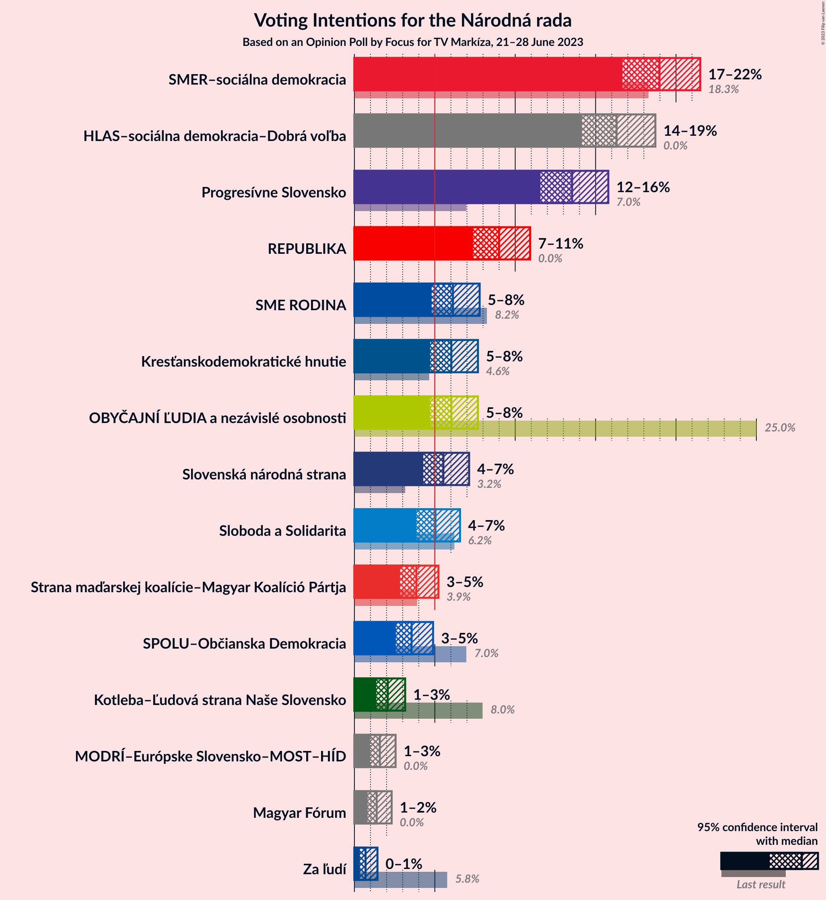

### Confidence Intervals

| Party | Last Result | Poll Result | 80% Confidence Interval | 90% Confidence Interval | 95% Confidence Interval | 99% Confidence Interval |
|:-----:|:-----------:|:-----------:|:-----------------------:|:-----------------------:|:-----------------------:|:-----------------------:|
| SMER–sociálna demokracia | 18.3% | 19.0% | 17.5–20.6% |17.0–21.1% |16.7–21.5% |16.0–22.3% |
| HLAS–sociálna demokracia–Dobrá voľba | 0.0% | 16.3% | 14.9–17.9% |14.5–18.3% |14.1–18.7% |13.5–19.5% |
| Progresívne Slovensko | 7.0% | 13.5% | 12.2–15.0% |11.9–15.4% |11.6–15.8% |11.0–16.5% |
| REPUBLIKA | 0.0% | 9.0% | 7.9–10.3% |7.6–10.6% |7.4–10.9% |6.9–11.6% |
| SME RODINA | 8.2% | 6.1% | 5.3–7.2% |5.0–7.5% |4.8–7.8% |4.4–8.3% |
| OBYČAJNÍ ĽUDIA a nezávislé osobnosti | 25.0% | 6.0% | 5.2–7.1% |4.9–7.4% |4.7–7.7% |4.3–8.2% |
| Kresťanskodemokratické hnutie | 4.6% | 6.0% | 5.2–7.1% |4.9–7.4% |4.7–7.7% |4.3–8.2% |
| Slovenská národná strana | 3.2% | 5.5% | 4.7–6.6% |4.5–6.9% |4.3–7.1% |3.9–7.7% |
| Sloboda a Solidarita | 6.2% | 5.0% | 4.3–6.0% |4.0–6.3% |3.9–6.6% |3.5–7.1% |
| Strana maďarskej koalície–Magyar Koalíció Pártja | 3.9% | 3.9% | 3.2–4.8% |3.0–5.0% |2.8–5.2% |2.5–5.7% |
| SPOLU–Občianska Demokracia | 7.0% | 3.6% | 2.9–4.4% |2.7–4.7% |2.6–4.9% |2.3–5.3% |
| Kotleba–Ľudová strana Naše Slovensko | 8.0% | 2.1% | 1.6–2.8% |1.5–3.0% |1.4–3.2% |1.2–3.5% |
| MODRÍ–Európske Slovensko–MOST–HÍD | 0.0% | 1.6% | 1.2–2.2% |1.1–2.4% |1.0–2.6% |0.8–2.9% |
| Magyar Fórum | 0.0% | 1.4% | 1.0–2.0% |0.9–2.2% |0.8–2.3% |0.7–2.6% |
| Za ľudí | 5.8% | 0.7% | 0.5–1.2% |0.4–1.3% |0.3–1.4% |0.2–1.7% |

*Note:* The poll result column reflects the actual value used in the calculations. Published results may vary slightly, and in addition be rounded to fewer digits.

## Seats

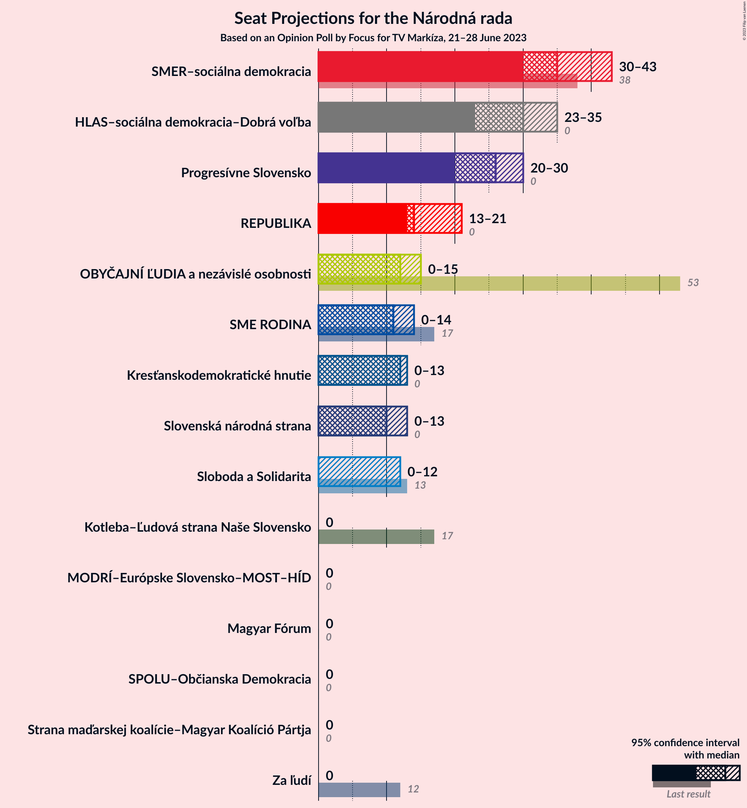

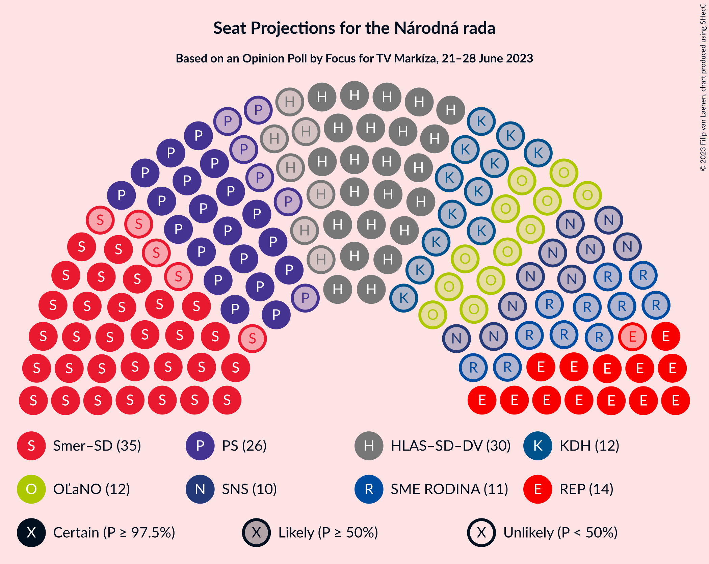

### Confidence Intervals

| Party | Last Result | Median | 80% Confidence Interval | 90% Confidence Interval | 95% Confidence Interval | 99% Confidence Interval |
|:-----:|:-----------:|:------:|:-----------------------:|:-----------------------:|:-----------------------:|:-----------------------:|
| <a href="#smer–sociálna-demokracia">SMER–sociálna demokracia</a> | 38 | 35 | 32–38 |31–41 |30–43 |28–43 |
| <a href="#hlas–sociálna-demokracia–dobrá-voľba">HLAS–sociálna demokracia–Dobrá voľba</a> | 0 | 30 | 23–35 |23–35 |23–35 |23–37 |
| <a href="#progresívne-slovensko">Progresívne Slovensko</a> | 0 | 26 | 22–27 |21–29 |20–30 |19–31 |
| <a href="#republika">REPUBLIKA</a> | 0 | 14 | 14–19 |14–19 |13–21 |13–23 |
| <a href="#sme-rodina">SME RODINA</a> | 17 | 11 | 10–14 |0–14 |0–14 |0–15 |
| <a href="#obyčajní-ľudia-a-nezávislé-osobnosti">OBYČAJNÍ ĽUDIA a nezávislé osobnosti</a> | 53 | 12 | 0–13 |0–13 |0–15 |0–17 |
| <a href="#kresťanskodemokratické-hnutie">Kresťanskodemokratické hnutie</a> | 0 | 12 | 10–13 |9–13 |0–13 |0–15 |
| <a href="#slovenská-národná-strana">Slovenská národná strana</a> | 0 | 10 | 0–11 |0–12 |0–13 |0–13 |
| <a href="#sloboda-a-solidarita">Sloboda a Solidarita</a> | 13 | 0 | 0–11 |0–11 |0–12 |0–12 |
| <a href="#strana-maďarskej-koalície–magyar-koalíció-pártja">Strana maďarskej koalície–Magyar Koalíció Pártja</a> | 0 | 0 | 0 |0 |0 |0–11 |
| <a href="#spolu–občianska-demokracia">SPOLU–Občianska Demokracia</a> | 0 | 0 | 0 |0 |0 |0–9 |
| <a href="#kotleba–ľudová-strana-naše-slovensko">Kotleba–Ľudová strana Naše Slovensko</a> | 17 | 0 | 0 |0 |0 |0 |
| <a href="#modrí–európske-slovensko–most–híd">MODRÍ–Európske Slovensko–MOST–HÍD</a> | 0 | 0 | 0 |0 |0 |0 |
| <a href="#magyar-fórum">Magyar Fórum</a> | 0 | 0 | 0 |0 |0 |0 |
| <a href="#za-ľudí">Za ľudí</a> | 12 | 0 | 0 |0 |0 |0 |

### SMER–sociálna demokracia

*For a full overview of the results for this party, see the [SMER–sociálna demokracia](party-smer–sociálnademokracia.html) page.*

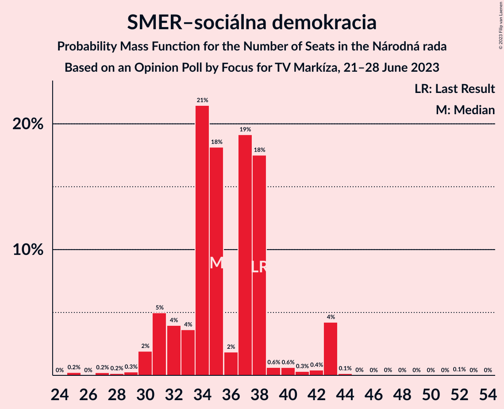

| Number of Seats | Probability | Accumulated | Special Marks |
|:---------------:|:-----------:|:-----------:|:-------------:|
| 25 | 0.2% | 100% |  |
| 26 | 0% | 99.8% |  |
| 27 | 0.2% | 99.8% |  |
| 28 | 0.2% | 99.5% |  |
| 29 | 0.3% | 99.4% |  |
| 30 | 2% | 99.1% |  |
| 31 | 5% | 97% |  |
| 32 | 4% | 92% |  |
| 33 | 4% | 88% |  |
| 34 | 21% | 85% |  |
| 35 | 18% | 63% | Median |
| 36 | 2% | 45% |  |
| 37 | 19% | 43% |  |
| 38 | 18% | 24% | Last Result |
| 39 | 0.6% | 6% |  |
| 40 | 0.6% | 6% |  |
| 41 | 0.3% | 5% |  |
| 42 | 0.4% | 5% |  |
| 43 | 4% | 4% |  |
| 44 | 0.1% | 0.2% |  |
| 45 | 0% | 0.1% |  |
| 46 | 0% | 0.1% |  |
| 47 | 0% | 0.1% |  |
| 48 | 0% | 0.1% |  |
| 49 | 0% | 0.1% |  |
| 50 | 0% | 0.1% |  |
| 51 | 0% | 0.1% |  |
| 52 | 0.1% | 0.1% |  |
| 53 | 0% | 0% |  |

### HLAS–sociálna demokracia–Dobrá voľba

*For a full overview of the results for this party, see the [HLAS–sociálna demokracia–Dobrá voľba](party-hlas–sociálnademokracia–dobrávoľba.html) page.*

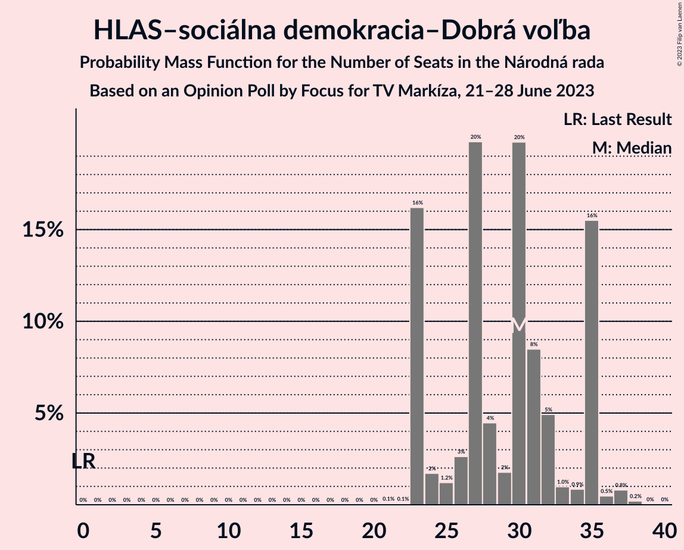

| Number of Seats | Probability | Accumulated | Special Marks |
|:---------------:|:-----------:|:-----------:|:-------------:|
| 0 | 0% | 100% | Last Result |
| 1 | 0% | 100% |  |
| 2 | 0% | 100% |  |
| 3 | 0% | 100% |  |
| 4 | 0% | 100% |  |
| 5 | 0% | 100% |  |
| 6 | 0% | 100% |  |
| 7 | 0% | 100% |  |
| 8 | 0% | 100% |  |
| 9 | 0% | 100% |  |
| 10 | 0% | 100% |  |
| 11 | 0% | 100% |  |
| 12 | 0% | 100% |  |
| 13 | 0% | 100% |  |
| 14 | 0% | 100% |  |
| 15 | 0% | 100% |  |
| 16 | 0% | 100% |  |
| 17 | 0% | 100% |  |
| 18 | 0% | 100% |  |
| 19 | 0% | 100% |  |
| 20 | 0% | 100% |  |
| 21 | 0.1% | 100% |  |
| 22 | 0.1% | 99.9% |  |
| 23 | 16% | 99.9% |  |
| 24 | 2% | 84% |  |
| 25 | 1.2% | 82% |  |
| 26 | 3% | 81% |  |
| 27 | 20% | 78% |  |
| 28 | 4% | 58% |  |
| 29 | 2% | 54% |  |
| 30 | 20% | 52% | Median |
| 31 | 8% | 32% |  |
| 32 | 5% | 24% |  |
| 33 | 1.0% | 19% |  |
| 34 | 0.9% | 18% |  |
| 35 | 16% | 17% |  |
| 36 | 0.5% | 2% |  |
| 37 | 0.8% | 1.1% |  |
| 38 | 0.2% | 0.3% |  |
| 39 | 0% | 0.1% |  |
| 40 | 0% | 0% |  |

### Progresívne Slovensko

*For a full overview of the results for this party, see the [Progresívne Slovensko](party-progresívneslovensko.html) page.*

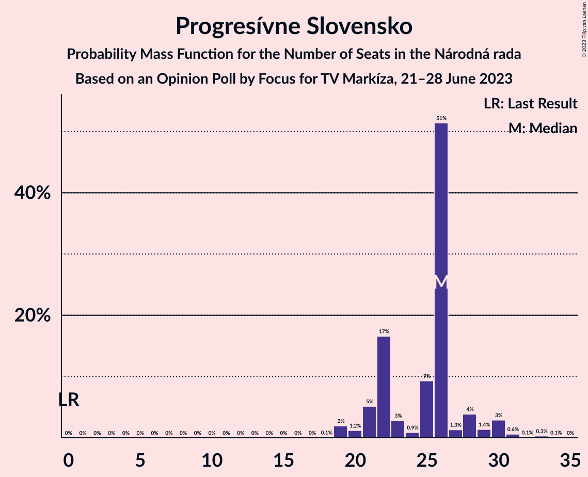

| Number of Seats | Probability | Accumulated | Special Marks |
|:---------------:|:-----------:|:-----------:|:-------------:|
| 0 | 0% | 100% | Last Result |
| 1 | 0% | 100% |  |
| 2 | 0% | 100% |  |
| 3 | 0% | 100% |  |
| 4 | 0% | 100% |  |
| 5 | 0% | 100% |  |
| 6 | 0% | 100% |  |
| 7 | 0% | 100% |  |
| 8 | 0% | 100% |  |
| 9 | 0% | 100% |  |
| 10 | 0% | 100% |  |
| 11 | 0% | 100% |  |
| 12 | 0% | 100% |  |
| 13 | 0% | 100% |  |
| 14 | 0% | 100% |  |
| 15 | 0% | 100% |  |
| 16 | 0% | 100% |  |
| 17 | 0% | 100% |  |
| 18 | 0.1% | 100% |  |
| 19 | 2% | 99.9% |  |
| 20 | 1.2% | 98% |  |
| 21 | 5% | 97% |  |
| 22 | 17% | 92% |  |
| 23 | 3% | 75% |  |
| 24 | 0.9% | 72% |  |
| 25 | 9% | 71% |  |
| 26 | 51% | 62% | Median |
| 27 | 1.3% | 11% |  |
| 28 | 4% | 9% |  |
| 29 | 1.4% | 5% |  |
| 30 | 3% | 4% |  |
| 31 | 0.6% | 1.1% |  |
| 32 | 0.1% | 0.5% |  |
| 33 | 0.3% | 0.4% |  |
| 34 | 0.1% | 0.1% |  |
| 35 | 0% | 0% |  |

### REPUBLIKA

*For a full overview of the results for this party, see the [REPUBLIKA](party-republika.html) page.*

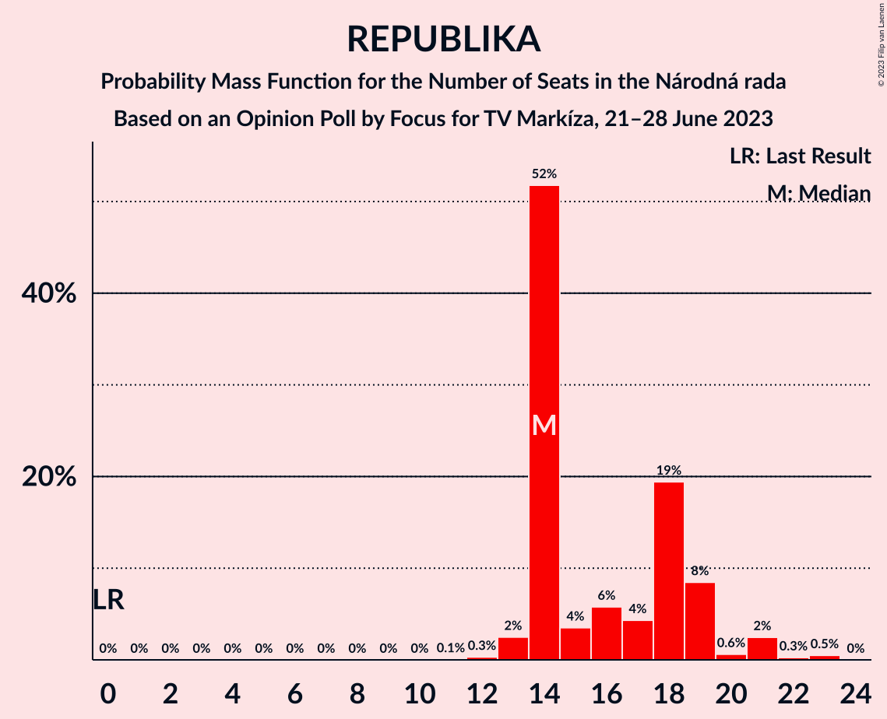

| Number of Seats | Probability | Accumulated | Special Marks |
|:---------------:|:-----------:|:-----------:|:-------------:|
| 0 | 0% | 100% | Last Result |
| 1 | 0% | 100% |  |
| 2 | 0% | 100% |  |
| 3 | 0% | 100% |  |
| 4 | 0% | 100% |  |
| 5 | 0% | 100% |  |
| 6 | 0% | 100% |  |
| 7 | 0% | 100% |  |
| 8 | 0% | 100% |  |
| 9 | 0% | 100% |  |
| 10 | 0% | 100% |  |
| 11 | 0.1% | 100% |  |
| 12 | 0.3% | 99.9% |  |
| 13 | 2% | 99.6% |  |
| 14 | 52% | 97% | Median |
| 15 | 4% | 45% |  |
| 16 | 6% | 42% |  |
| 17 | 4% | 36% |  |
| 18 | 19% | 32% |  |
| 19 | 8% | 12% |  |
| 20 | 0.6% | 4% |  |
| 21 | 2% | 3% |  |
| 22 | 0.3% | 0.8% |  |
| 23 | 0.5% | 0.5% |  |
| 24 | 0% | 0% |  |

### SME RODINA

*For a full overview of the results for this party, see the [SME RODINA](party-smerodina.html) page.*

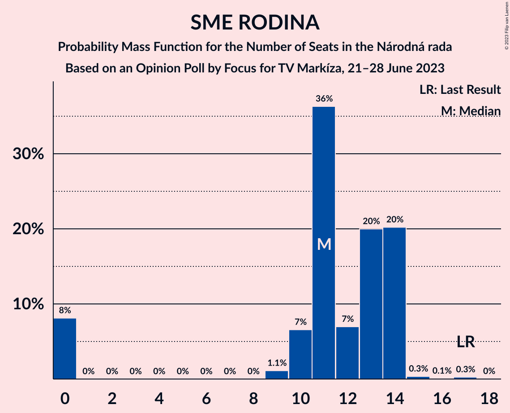

| Number of Seats | Probability | Accumulated | Special Marks |
|:---------------:|:-----------:|:-----------:|:-------------:|
| 0 | 8% | 100% |  |
| 1 | 0% | 92% |  |
| 2 | 0% | 92% |  |
| 3 | 0% | 92% |  |
| 4 | 0% | 92% |  |
| 5 | 0% | 92% |  |
| 6 | 0% | 92% |  |
| 7 | 0% | 92% |  |
| 8 | 0% | 92% |  |
| 9 | 1.1% | 92% |  |
| 10 | 7% | 91% |  |
| 11 | 36% | 84% | Median |
| 12 | 7% | 48% |  |
| 13 | 20% | 41% |  |
| 14 | 20% | 21% |  |
| 15 | 0.3% | 0.7% |  |
| 16 | 0.1% | 0.4% |  |
| 17 | 0.3% | 0.3% | Last Result |
| 18 | 0% | 0% |  |

### OBYČAJNÍ ĽUDIA a nezávislé osobnosti

*For a full overview of the results for this party, see the [OBYČAJNÍ ĽUDIA a nezávislé osobnosti](party-obyčajníľudiaanezávisléosobnosti.html) page.*

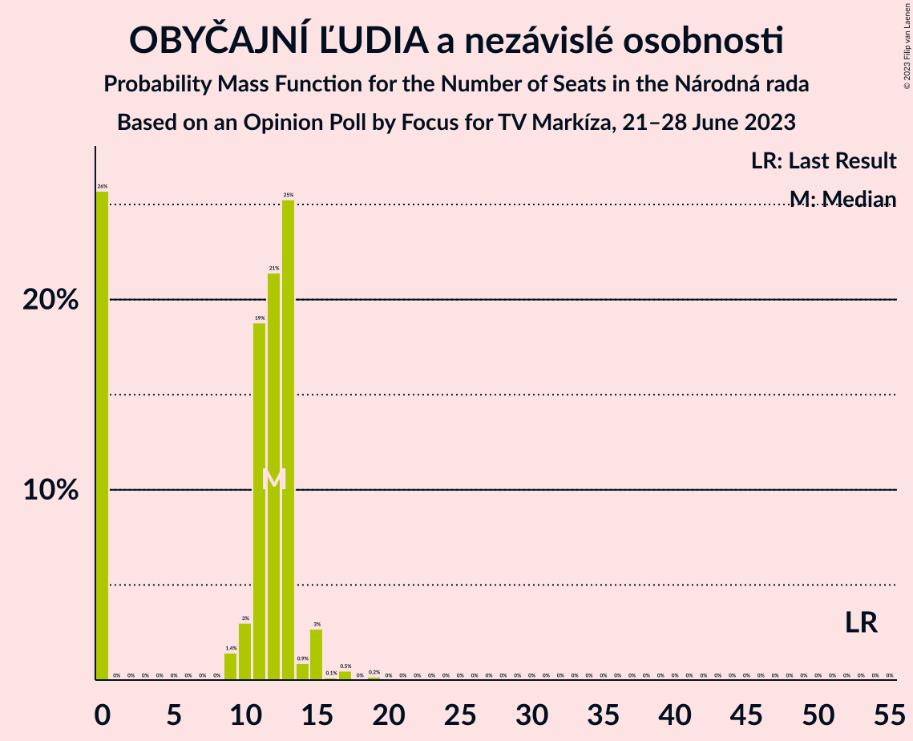

| Number of Seats | Probability | Accumulated | Special Marks |
|:---------------:|:-----------:|:-----------:|:-------------:|
| 0 | 26% | 100% |  |
| 1 | 0% | 74% |  |
| 2 | 0% | 74% |  |
| 3 | 0% | 74% |  |
| 4 | 0% | 74% |  |
| 5 | 0% | 74% |  |
| 6 | 0% | 74% |  |
| 7 | 0% | 74% |  |
| 8 | 0% | 74% |  |
| 9 | 1.4% | 74% |  |
| 10 | 3% | 73% |  |
| 11 | 19% | 70% |  |
| 12 | 21% | 51% | Median |
| 13 | 25% | 30% |  |
| 14 | 0.9% | 4% |  |
| 15 | 3% | 3% |  |
| 16 | 0.1% | 0.8% |  |
| 17 | 0.5% | 0.7% |  |
| 18 | 0% | 0.2% |  |
| 19 | 0.2% | 0.2% |  |
| 20 | 0% | 0% |  |
| 21 | 0% | 0% |  |
| 22 | 0% | 0% |  |
| 23 | 0% | 0% |  |
| 24 | 0% | 0% |  |
| 25 | 0% | 0% |  |
| 26 | 0% | 0% |  |
| 27 | 0% | 0% |  |
| 28 | 0% | 0% |  |
| 29 | 0% | 0% |  |
| 30 | 0% | 0% |  |
| 31 | 0% | 0% |  |
| 32 | 0% | 0% |  |
| 33 | 0% | 0% |  |
| 34 | 0% | 0% |  |
| 35 | 0% | 0% |  |
| 36 | 0% | 0% |  |
| 37 | 0% | 0% |  |
| 38 | 0% | 0% |  |
| 39 | 0% | 0% |  |
| 40 | 0% | 0% |  |
| 41 | 0% | 0% |  |
| 42 | 0% | 0% |  |
| 43 | 0% | 0% |  |
| 44 | 0% | 0% |  |
| 45 | 0% | 0% |  |
| 46 | 0% | 0% |  |
| 47 | 0% | 0% |  |
| 48 | 0% | 0% |  |
| 49 | 0% | 0% |  |
| 50 | 0% | 0% |  |
| 51 | 0% | 0% |  |
| 52 | 0% | 0% |  |
| 53 | 0% | 0% | Last Result |

### Kresťanskodemokratické hnutie

*For a full overview of the results for this party, see the [Kresťanskodemokratické hnutie](party-kresťanskodemokratickéhnutie.html) page.*

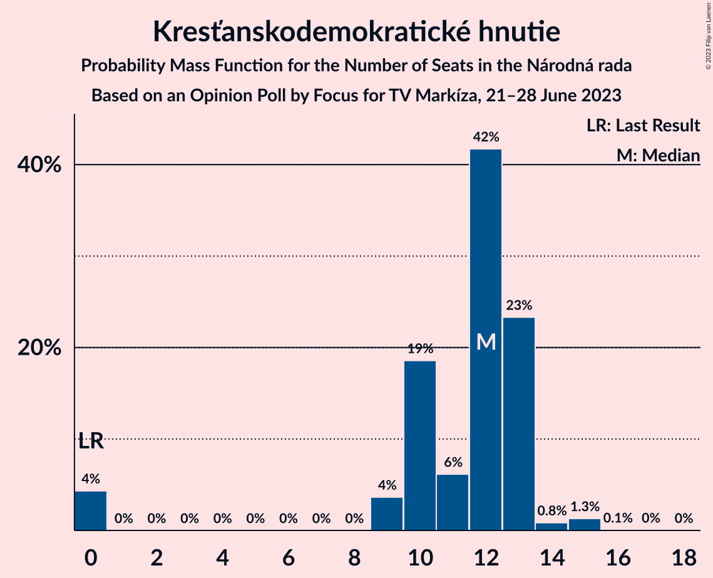

| Number of Seats | Probability | Accumulated | Special Marks |
|:---------------:|:-----------:|:-----------:|:-------------:|
| 0 | 4% | 100% | Last Result |
| 1 | 0% | 96% |  |
| 2 | 0% | 96% |  |
| 3 | 0% | 96% |  |
| 4 | 0% | 96% |  |
| 5 | 0% | 96% |  |
| 6 | 0% | 96% |  |
| 7 | 0% | 96% |  |
| 8 | 0% | 96% |  |
| 9 | 4% | 96% |  |
| 10 | 19% | 92% |  |
| 11 | 6% | 73% |  |
| 12 | 42% | 67% | Median |
| 13 | 23% | 26% |  |
| 14 | 0.8% | 2% |  |
| 15 | 1.3% | 1.4% |  |
| 16 | 0.1% | 0.1% |  |
| 17 | 0% | 0.1% |  |
| 18 | 0% | 0% |  |

### Slovenská národná strana

*For a full overview of the results for this party, see the [Slovenská národná strana](party-slovenskánárodnástrana.html) page.*

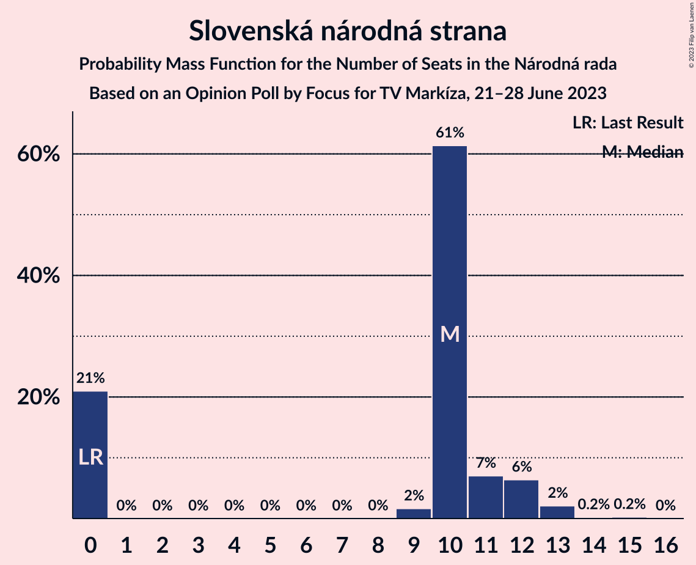

| Number of Seats | Probability | Accumulated | Special Marks |
|:---------------:|:-----------:|:-----------:|:-------------:|
| 0 | 21% | 100% | Last Result |
| 1 | 0% | 79% |  |
| 2 | 0% | 79% |  |
| 3 | 0% | 79% |  |
| 4 | 0% | 79% |  |
| 5 | 0% | 79% |  |
| 6 | 0% | 79% |  |
| 7 | 0% | 79% |  |
| 8 | 0% | 79% |  |
| 9 | 2% | 79% |  |
| 10 | 61% | 77% | Median |
| 11 | 7% | 16% |  |
| 12 | 6% | 9% |  |
| 13 | 2% | 3% |  |
| 14 | 0.2% | 0.5% |  |
| 15 | 0.2% | 0.3% |  |
| 16 | 0% | 0% |  |

### Sloboda a Solidarita

*For a full overview of the results for this party, see the [Sloboda a Solidarita](party-slobodaasolidarita.html) page.*

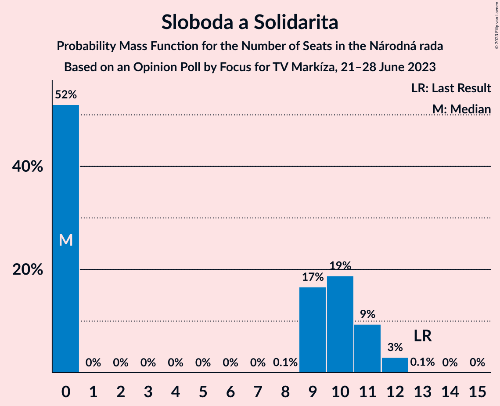

| Number of Seats | Probability | Accumulated | Special Marks |
|:---------------:|:-----------:|:-----------:|:-------------:|
| 0 | 52% | 100% | Median |
| 1 | 0% | 48% |  |
| 2 | 0% | 48% |  |
| 3 | 0% | 48% |  |
| 4 | 0% | 48% |  |
| 5 | 0% | 48% |  |
| 6 | 0% | 48% |  |
| 7 | 0% | 48% |  |
| 8 | 0.1% | 48% |  |
| 9 | 17% | 48% |  |
| 10 | 19% | 31% |  |
| 11 | 9% | 13% |  |
| 12 | 3% | 3% |  |
| 13 | 0.1% | 0.2% | Last Result |
| 14 | 0% | 0.1% |  |
| 15 | 0% | 0% |  |

### Strana maďarskej koalície–Magyar Koalíció Pártja

*For a full overview of the results for this party, see the [Strana maďarskej koalície–Magyar Koalíció Pártja](party-stranamaďarskejkoalície–magyarkoalíciópártja.html) page.*

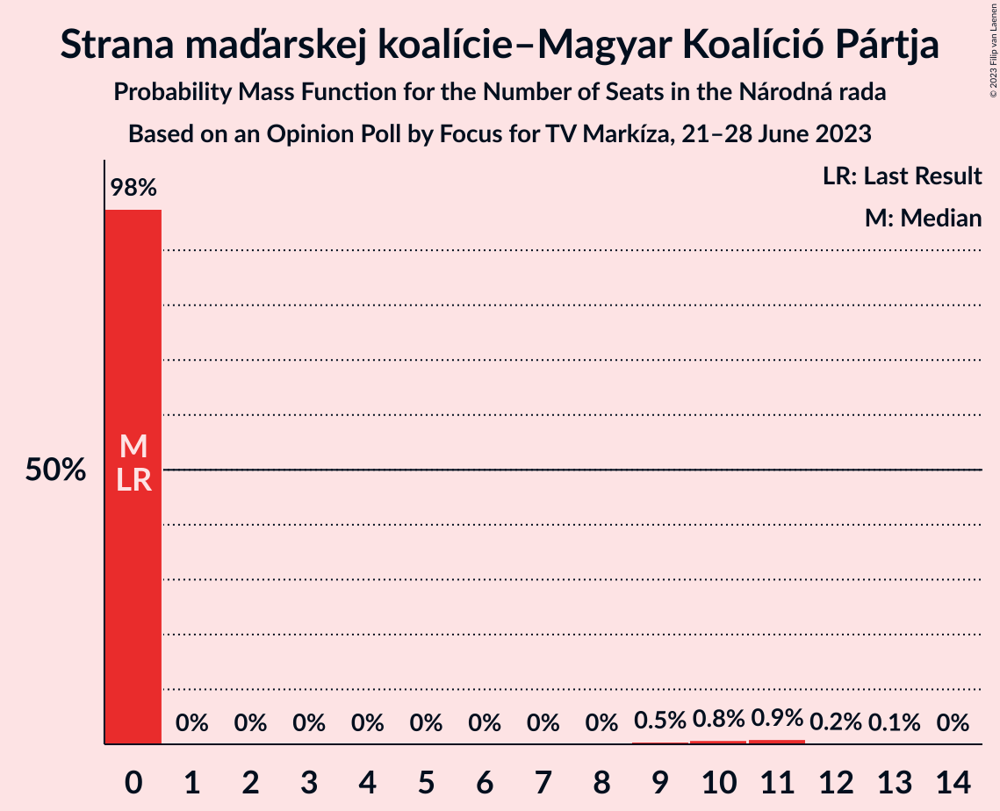

| Number of Seats | Probability | Accumulated | Special Marks |
|:---------------:|:-----------:|:-----------:|:-------------:|
| 0 | 98% | 100% | Last Result, Median |
| 1 | 0% | 2% |  |
| 2 | 0% | 2% |  |
| 3 | 0% | 2% |  |
| 4 | 0% | 2% |  |
| 5 | 0% | 2% |  |
| 6 | 0% | 2% |  |
| 7 | 0% | 2% |  |
| 8 | 0% | 2% |  |
| 9 | 0.5% | 2% |  |
| 10 | 0.8% | 2% |  |
| 11 | 0.9% | 1.2% |  |
| 12 | 0.2% | 0.3% |  |
| 13 | 0.1% | 0.1% |  |
| 14 | 0% | 0% |  |

### SPOLU–Občianska Demokracia

*For a full overview of the results for this party, see the [SPOLU–Občianska Demokracia](party-spolu–občianskademokracia.html) page.*

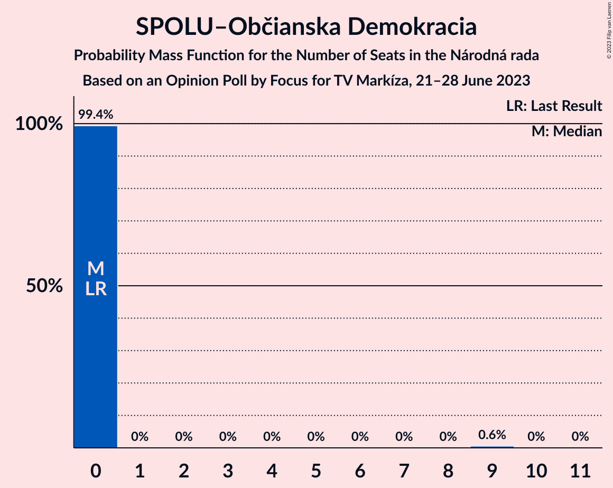

| Number of Seats | Probability | Accumulated | Special Marks |
|:---------------:|:-----------:|:-----------:|:-------------:|
| 0 | 99.4% | 100% | Last Result, Median |
| 1 | 0% | 0.6% |  |
| 2 | 0% | 0.6% |  |
| 3 | 0% | 0.6% |  |
| 4 | 0% | 0.6% |  |
| 5 | 0% | 0.6% |  |
| 6 | 0% | 0.6% |  |
| 7 | 0% | 0.6% |  |
| 8 | 0% | 0.6% |  |
| 9 | 0.6% | 0.6% |  |
| 10 | 0% | 0.1% |  |
| 11 | 0% | 0% |  |

### Kotleba–Ľudová strana Naše Slovensko

*For a full overview of the results for this party, see the [Kotleba–Ľudová strana Naše Slovensko](party-kotleba–ľudovástrananašeslovensko.html) page.*

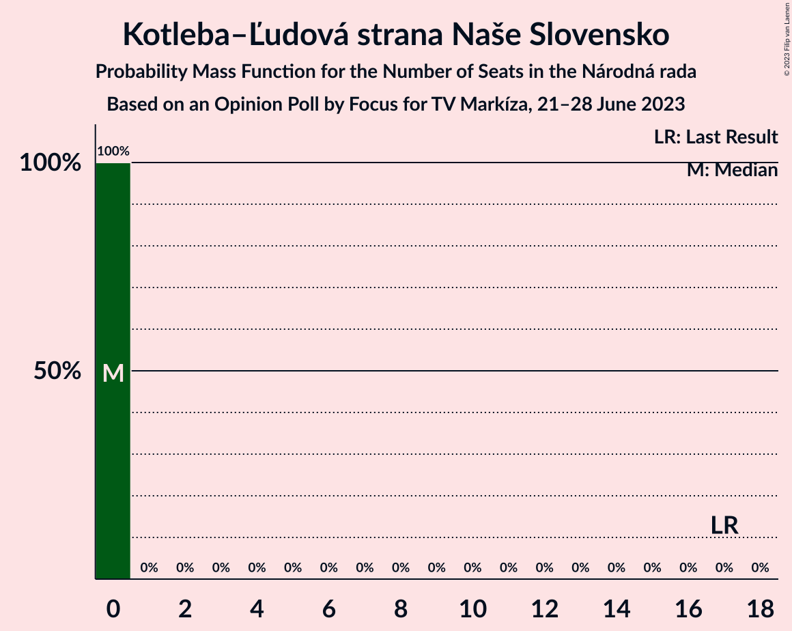

| Number of Seats | Probability | Accumulated | Special Marks |
|:---------------:|:-----------:|:-----------:|:-------------:|
| 0 | 100% | 100% | Median |
| 1 | 0% | 0% |  |
| 2 | 0% | 0% |  |
| 3 | 0% | 0% |  |
| 4 | 0% | 0% |  |
| 5 | 0% | 0% |  |
| 6 | 0% | 0% |  |
| 7 | 0% | 0% |  |
| 8 | 0% | 0% |  |
| 9 | 0% | 0% |  |
| 10 | 0% | 0% |  |
| 11 | 0% | 0% |  |
| 12 | 0% | 0% |  |
| 13 | 0% | 0% |  |
| 14 | 0% | 0% |  |
| 15 | 0% | 0% |  |
| 16 | 0% | 0% |  |
| 17 | 0% | 0% | Last Result |

### MODRÍ–Európske Slovensko–MOST–HÍD

*For a full overview of the results for this party, see the [MODRÍ–Európske Slovensko–MOST–HÍD](party-modrí–európskeslovensko–most–híd.html) page.*

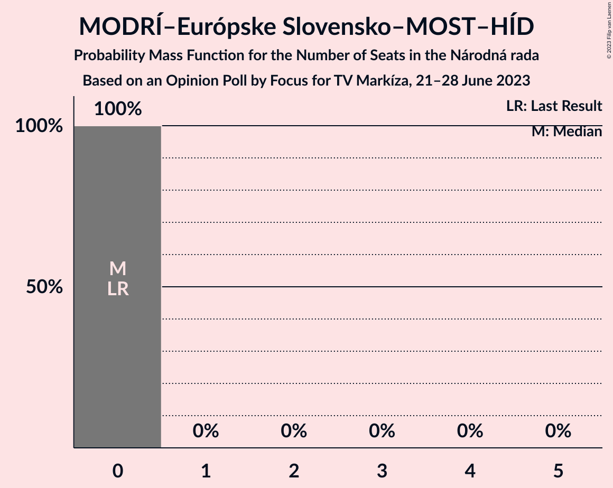

| Number of Seats | Probability | Accumulated | Special Marks |
|:---------------:|:-----------:|:-----------:|:-------------:|
| 0 | 100% | 100% | Last Result, Median |

### Magyar Fórum

*For a full overview of the results for this party, see the [Magyar Fórum](party-magyarfórum.html) page.*

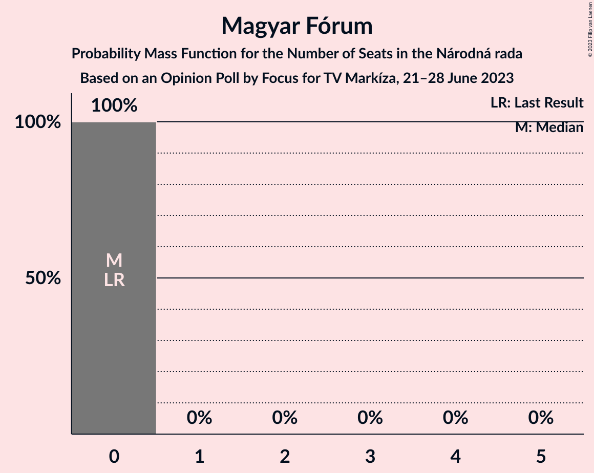

| Number of Seats | Probability | Accumulated | Special Marks |
|:---------------:|:-----------:|:-----------:|:-------------:|
| 0 | 100% | 100% | Last Result, Median |

### Za ľudí

*For a full overview of the results for this party, see the [Za ľudí](party-zaľudí.html) page.*

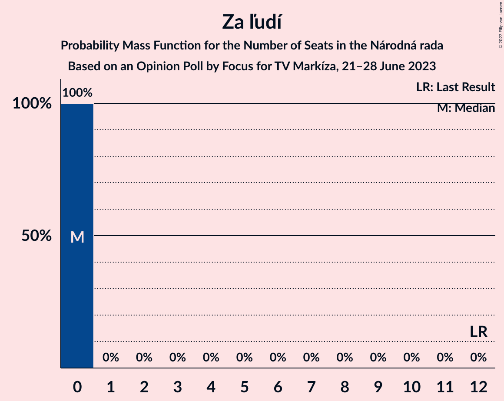

| Number of Seats | Probability | Accumulated | Special Marks |
|:---------------:|:-----------:|:-----------:|:-------------:|
| 0 | 100% | 100% | Median |
| 1 | 0% | 0% |  |
| 2 | 0% | 0% |  |
| 3 | 0% | 0% |  |
| 4 | 0% | 0% |  |
| 5 | 0% | 0% |  |
| 6 | 0% | 0% |  |
| 7 | 0% | 0% |  |
| 8 | 0% | 0% |  |
| 9 | 0% | 0% |  |
| 10 | 0% | 0% |  |
| 11 | 0% | 0% |  |
| 12 | 0% | 0% | Last Result |

## Coalitions

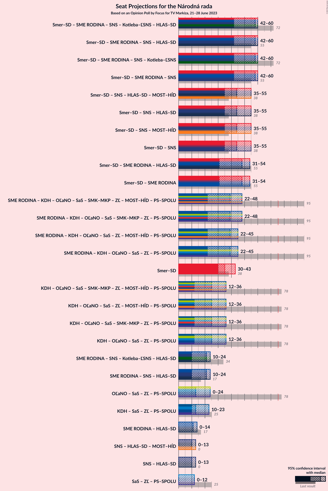

### Confidence Intervals

| Coalition | Last Result | Median | Majority? | 80% Confidence Interval | 90% Confidence Interval | 95% Confidence Interval | 99% Confidence Interval |
|:---------:|:-----------:|:------:|:---------:|:-----------------------:|:-----------------------:|:-----------------------:|:-----------------------:|
| SMER–sociálna demokracia – SME RODINA – Slovenská národná strana – Kotleba–Ľudová strana Naše Slovensko | 72 | 58 | 0% | 46–60 | 46–60 | 42–60 | 42–65 |
| SMER–sociálna demokracia – SME RODINA – Slovenská národná strana | 55 | 58 | 0% | 46–60 | 46–60 | 42–60 | 42–65 |
| SMER–sociálna demokracia – Slovenská národná strana | 38 | 44 | 0% | 35–48 | 35–49 | 35–55 | 33–55 |
| SMER–sociálna demokracia – SME RODINA | 55 | 48 | 0% | 42–50 | 37–50 | 31–54 | 31–56 |
| SMER–sociálna demokracia | 38 | 35 | 0% | 32–38 | 31–41 | 30–43 | 28–43 |

### SMER–sociálna demokracia – SME RODINA – Slovenská národná strana – Kotleba–Ľudová strana Naše Slovensko

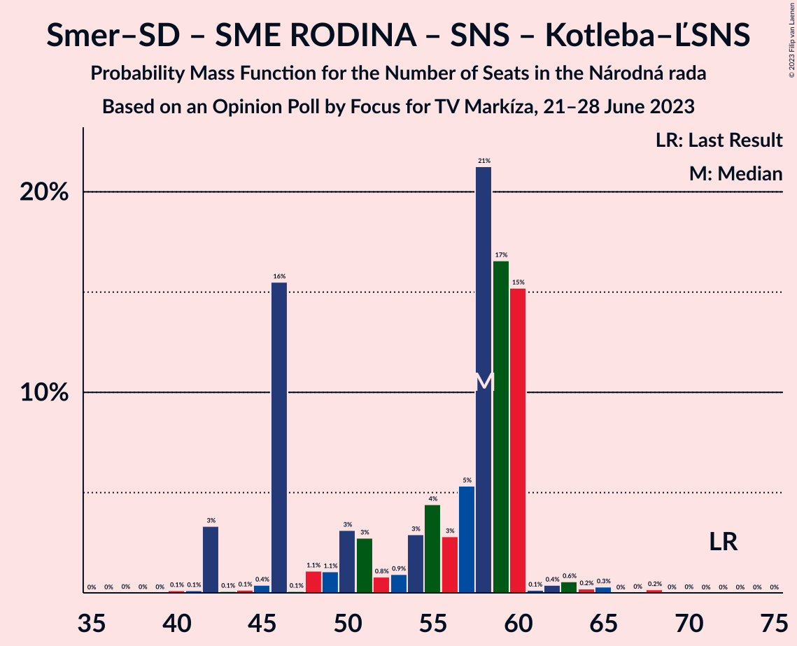

| Number of Seats | Probability | Accumulated | Special Marks |
|:---------------:|:-----------:|:-----------:|:-------------:|
| 37 | 0% | 100% |  |
| 38 | 0% | 99.9% |  |
| 39 | 0% | 99.9% |  |
| 40 | 0.1% | 99.9% |  |
| 41 | 0.1% | 99.8% |  |
| 42 | 3% | 99.7% |  |
| 43 | 0.1% | 96% |  |
| 44 | 0.1% | 96% |  |
| 45 | 0.4% | 96% |  |
| 46 | 16% | 96% |  |
| 47 | 0.1% | 80% |  |
| 48 | 1.1% | 80% |  |
| 49 | 1.1% | 79% |  |
| 50 | 3% | 78% |  |
| 51 | 3% | 75% |  |
| 52 | 0.8% | 72% |  |
| 53 | 0.9% | 71% |  |
| 54 | 3% | 70% |  |
| 55 | 4% | 67% |  |
| 56 | 3% | 63% | Median |
| 57 | 5% | 60% |  |
| 58 | 21% | 55% |  |
| 59 | 17% | 34% |  |
| 60 | 15% | 17% |  |
| 61 | 0.1% | 2% |  |
| 62 | 0.4% | 2% |  |
| 63 | 0.6% | 1.3% |  |
| 64 | 0.2% | 0.7% |  |
| 65 | 0.3% | 0.5% |  |
| 66 | 0% | 0.2% |  |
| 67 | 0% | 0.2% |  |
| 68 | 0.2% | 0.2% |  |
| 69 | 0% | 0% |  |
| 70 | 0% | 0% |  |
| 71 | 0% | 0% |  |
| 72 | 0% | 0% | Last Result |

### SMER–sociálna demokracia – SME RODINA – Slovenská národná strana

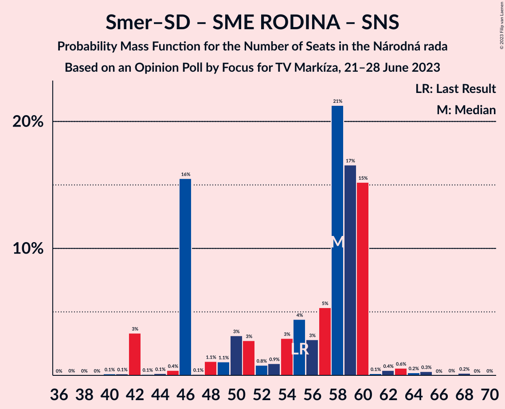

| Number of Seats | Probability | Accumulated | Special Marks |
|:---------------:|:-----------:|:-----------:|:-------------:|
| 37 | 0% | 100% |  |
| 38 | 0% | 99.9% |  |
| 39 | 0% | 99.9% |  |
| 40 | 0.1% | 99.9% |  |
| 41 | 0.1% | 99.8% |  |
| 42 | 3% | 99.7% |  |
| 43 | 0.1% | 96% |  |
| 44 | 0.1% | 96% |  |
| 45 | 0.4% | 96% |  |
| 46 | 16% | 96% |  |
| 47 | 0.1% | 80% |  |
| 48 | 1.1% | 80% |  |
| 49 | 1.1% | 79% |  |
| 50 | 3% | 78% |  |
| 51 | 3% | 75% |  |
| 52 | 0.8% | 72% |  |
| 53 | 0.9% | 71% |  |
| 54 | 3% | 70% |  |
| 55 | 4% | 67% | Last Result |
| 56 | 3% | 63% | Median |
| 57 | 5% | 60% |  |
| 58 | 21% | 55% |  |
| 59 | 17% | 34% |  |
| 60 | 15% | 17% |  |
| 61 | 0.1% | 2% |  |
| 62 | 0.4% | 2% |  |
| 63 | 0.6% | 1.3% |  |
| 64 | 0.2% | 0.7% |  |
| 65 | 0.3% | 0.5% |  |
| 66 | 0% | 0.2% |  |
| 67 | 0% | 0.2% |  |
| 68 | 0.2% | 0.2% |  |
| 69 | 0% | 0% |  |

### SMER–sociálna demokracia – Slovenská národná strana

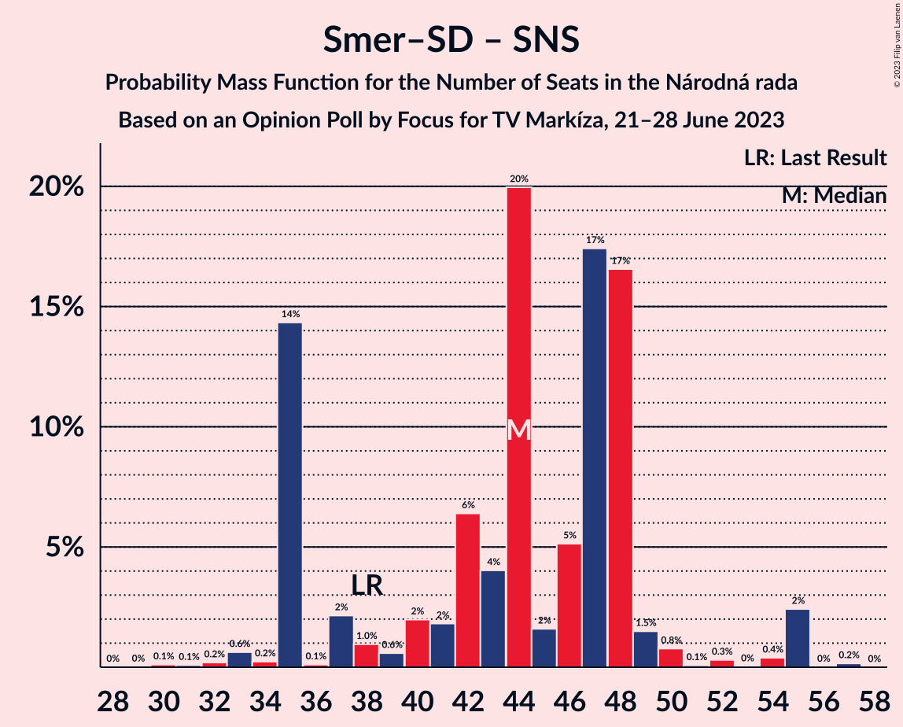

| Number of Seats | Probability | Accumulated | Special Marks |
|:---------------:|:-----------:|:-----------:|:-------------:|
| 29 | 0% | 100% |  |
| 30 | 0.1% | 99.9% |  |
| 31 | 0.1% | 99.8% |  |
| 32 | 0.2% | 99.7% |  |
| 33 | 0.6% | 99.6% |  |
| 34 | 0.2% | 98.9% |  |
| 35 | 14% | 98.7% |  |
| 36 | 0.1% | 84% |  |
| 37 | 2% | 84% |  |
| 38 | 1.0% | 82% | Last Result |
| 39 | 0.6% | 81% |  |
| 40 | 2% | 81% |  |
| 41 | 2% | 79% |  |
| 42 | 6% | 77% |  |
| 43 | 4% | 70% |  |
| 44 | 20% | 66% |  |
| 45 | 2% | 46% | Median |
| 46 | 5% | 45% |  |
| 47 | 17% | 40% |  |
| 48 | 17% | 22% |  |
| 49 | 1.5% | 6% |  |
| 50 | 0.8% | 4% |  |
| 51 | 0.1% | 3% |  |
| 52 | 0.3% | 3% |  |
| 53 | 0% | 3% |  |
| 54 | 0.4% | 3% |  |
| 55 | 2% | 3% |  |
| 56 | 0% | 0.2% |  |
| 57 | 0.2% | 0.2% |  |
| 58 | 0% | 0% |  |

### SMER–sociálna demokracia – SME RODINA

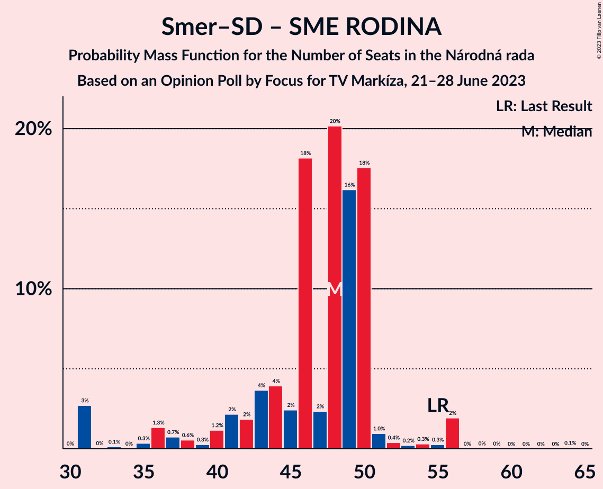

| Number of Seats | Probability | Accumulated | Special Marks |
|:---------------:|:-----------:|:-----------:|:-------------:|
| 31 | 3% | 100% |  |
| 32 | 0% | 97% |  |
| 33 | 0.1% | 97% |  |
| 34 | 0% | 97% |  |
| 35 | 0.3% | 97% |  |
| 36 | 1.3% | 97% |  |
| 37 | 0.7% | 95% |  |
| 38 | 0.6% | 95% |  |
| 39 | 0.3% | 94% |  |
| 40 | 1.2% | 94% |  |
| 41 | 2% | 93% |  |
| 42 | 2% | 90% |  |
| 43 | 4% | 89% |  |
| 44 | 4% | 85% |  |
| 45 | 2% | 81% |  |
| 46 | 18% | 79% | Median |
| 47 | 2% | 60% |  |
| 48 | 20% | 58% |  |
| 49 | 16% | 38% |  |
| 50 | 18% | 22% |  |
| 51 | 1.0% | 4% |  |
| 52 | 0.4% | 3% |  |
| 53 | 0.2% | 3% |  |
| 54 | 0.3% | 3% |  |
| 55 | 0.3% | 2% | Last Result |
| 56 | 2% | 2% |  |
| 57 | 0% | 0.1% |  |
| 58 | 0% | 0.1% |  |
| 59 | 0% | 0.1% |  |
| 60 | 0% | 0.1% |  |
| 61 | 0% | 0.1% |  |
| 62 | 0% | 0.1% |  |
| 63 | 0% | 0.1% |  |
| 64 | 0.1% | 0.1% |  |
| 65 | 0% | 0% |  |

### SMER–sociálna demokracia

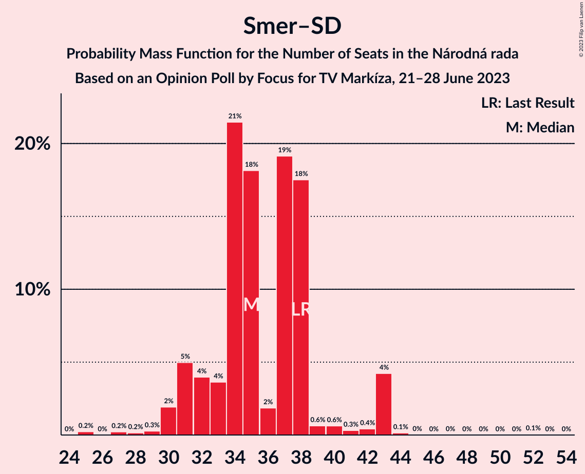

| Number of Seats | Probability | Accumulated | Special Marks |
|:---------------:|:-----------:|:-----------:|:-------------:|
| 25 | 0.2% | 100% |  |
| 26 | 0% | 99.8% |  |
| 27 | 0.2% | 99.8% |  |
| 28 | 0.2% | 99.5% |  |
| 29 | 0.3% | 99.4% |  |
| 30 | 2% | 99.1% |  |
| 31 | 5% | 97% |  |
| 32 | 4% | 92% |  |
| 33 | 4% | 88% |  |
| 34 | 21% | 85% |  |
| 35 | 18% | 63% | Median |
| 36 | 2% | 45% |  |
| 37 | 19% | 43% |  |
| 38 | 18% | 24% | Last Result |
| 39 | 0.6% | 6% |  |
| 40 | 0.6% | 6% |  |
| 41 | 0.3% | 5% |  |
| 42 | 0.4% | 5% |  |
| 43 | 4% | 4% |  |
| 44 | 0.1% | 0.2% |  |
| 45 | 0% | 0.1% |  |
| 46 | 0% | 0.1% |  |
| 47 | 0% | 0.1% |  |
| 48 | 0% | 0.1% |  |
| 49 | 0% | 0.1% |  |
| 50 | 0% | 0.1% |  |
| 51 | 0% | 0.1% |  |
| 52 | 0.1% | 0.1% |  |
| 53 | 0% | 0% |  |

## Technical Information

### Opinion Poll

+ **Polling firm:** Focus
+ **Commissioner(s):** TV Markíza
+ **Fieldwork period:** 21–28 June 2023

### Calculations

+ **Sample size:** 1012
+ **Simulations done:** 1,048,576
+ **Error estimate:** 2.06%

