# Opinion Poll by NMS, 4–9 July 2023

<a href="#voting-intentions">Voting Intentions</a> | <a href="#seats">Seats</a> | <a href="#coalitions">Coalitions</a> | <a href="#technical-information">Technical Information</a>

## Voting Intentions

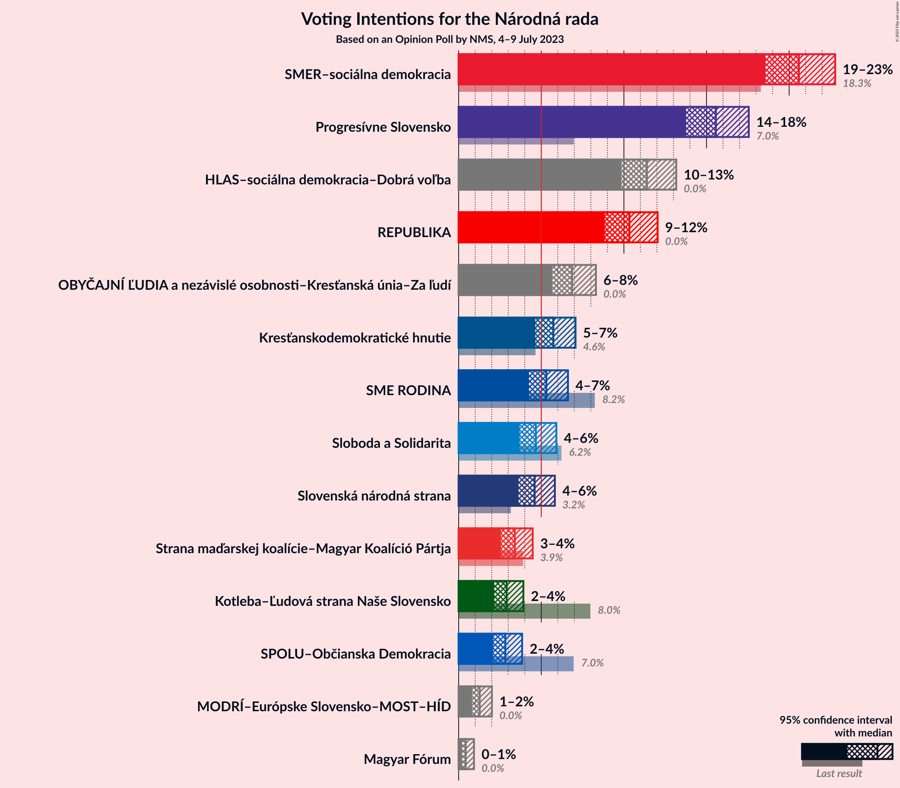

### Confidence Intervals

| Party | Last Result | Poll Result | 80% Confidence Interval | 90% Confidence Interval | 95% Confidence Interval | 99% Confidence Interval |
|:-----:|:-----------:|:-----------:|:-----------------------:|:-----------------------:|:-----------------------:|:-----------------------:|
| SMER–sociálna demokracia | 18.3% | 20.6% | 19.3–22.0% |18.9–22.4% |18.6–22.8% |17.9–23.5% |
| Progresívne Slovensko | 7.0% | 15.6% | 14.4–16.9% |14.1–17.2% |13.8–17.6% |13.2–18.2% |
| HLAS–sociálna demokracia–Dobrá voľba | 0.0% | 11.4% | 10.4–12.6% |10.1–12.9% |9.8–13.2% |9.4–13.7% |
| REPUBLIKA | 0.0% | 10.3% | 9.4–11.4% |9.1–11.8% |8.8–12.0% |8.4–12.6% |
| OBYČAJNÍ ĽUDIA a nezávislé osobnosti–Kresťanská únia–Za ľudí | 0.0% | 6.9% | 6.1–7.8% |5.8–8.1% |5.7–8.3% |5.3–8.8% |
| Kresťanskodemokratické hnutie | 4.6% | 5.7% | 5.0–6.6% |4.8–6.9% |4.6–7.1% |4.3–7.5% |
| SME RODINA | 8.2% | 5.3% | 4.6–6.2% |4.4–6.4% |4.3–6.6% |3.9–7.0% |
| Sloboda a Solidarita | 6.2% | 4.7% | 4.0–5.5% |3.8–5.7% |3.7–5.9% |3.4–6.3% |
| Slovenská národná strana | 3.2% | 4.6% | 3.9–5.4% |3.8–5.6% |3.6–5.8% |3.3–6.2% |
| Strana maďarskej koalície–Magyar Koalíció Pártja | 3.9% | 3.4% | 2.9–4.1% |2.7–4.3% |2.6–4.5% |2.3–4.8% |
| Kotleba–Ľudová strana Naše Slovensko | 8.0% | 2.9% | 2.4–3.6% |2.3–3.7% |2.1–3.9% |1.9–4.3% |
| SPOLU–Občianska Demokracia | 7.0% | 2.8% | 2.3–3.5% |2.2–3.7% |2.1–3.8% |1.9–4.2% |
| MODRÍ–Európske Slovensko–MOST–HÍD | 0.0% | 1.3% | 1.0–1.8% |0.9–1.9% |0.8–2.0% |0.7–2.3% |
| Magyar Fórum | 0.0% | 0.4% | 0.3–0.7% |0.2–0.8% |0.2–0.9% |0.1–1.1% |

*Note:* The poll result column reflects the actual value used in the calculations. Published results may vary slightly, and in addition be rounded to fewer digits.

## Seats

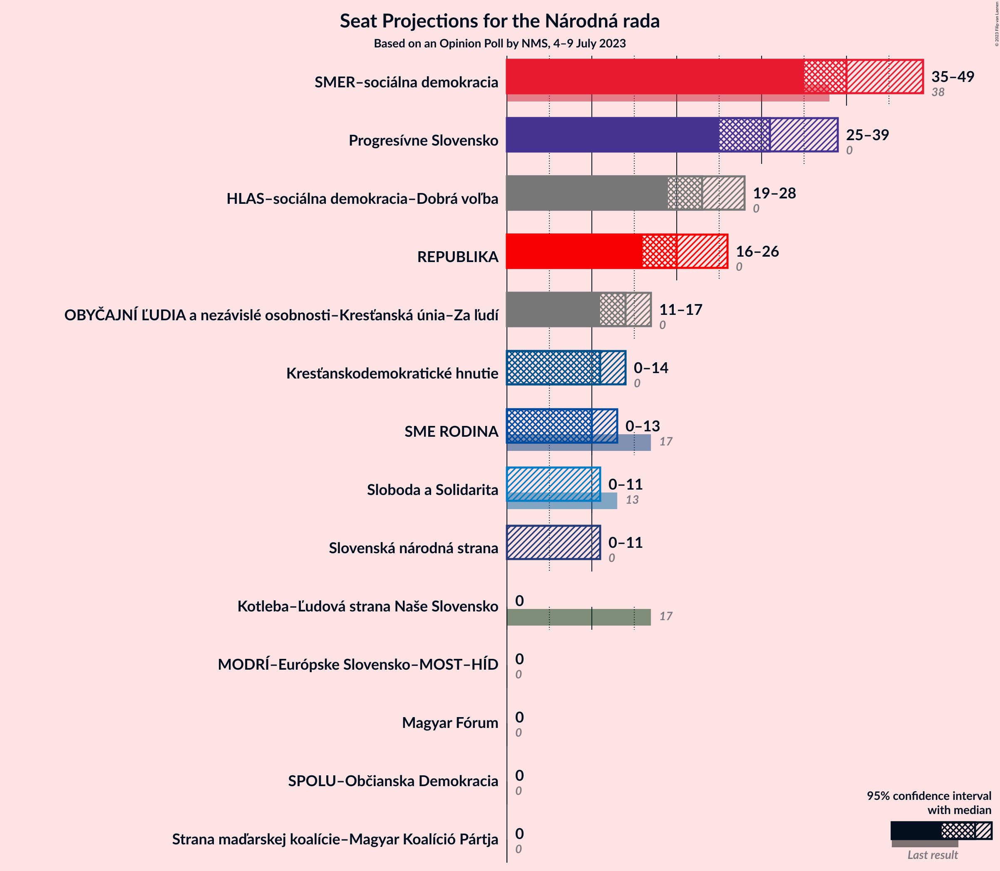

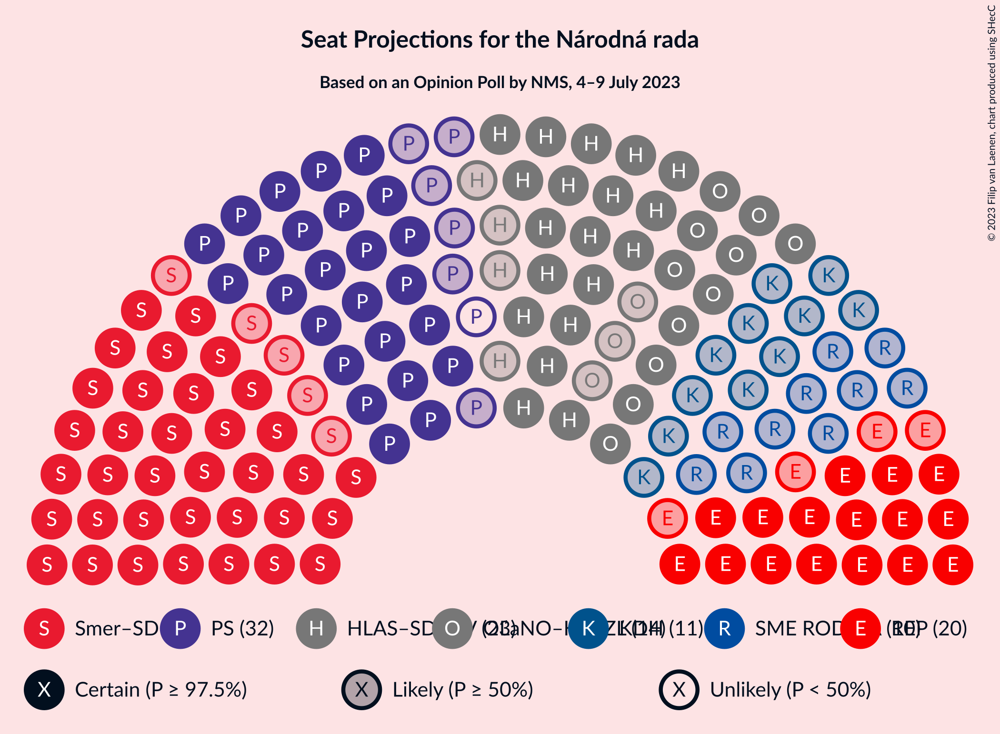

### Confidence Intervals

| Party | Last Result | Median | 80% Confidence Interval | 90% Confidence Interval | 95% Confidence Interval | 99% Confidence Interval |
|:-----:|:-----------:|:------:|:-----------------------:|:-----------------------:|:-----------------------:|:-----------------------:|
| <a href="#smer–sociálna-demokracia">SMER–sociálna demokracia</a> | 38 | 40 | 37–46 |37–48 |35–49 |34–49 |
| <a href="#progresívne-slovensko">Progresívne Slovensko</a> | 0 | 31 | 26–34 |25–36 |25–39 |24–39 |
| <a href="#hlas–sociálna-demokracia–dobrá-voľba">HLAS–sociálna demokracia–Dobrá voľba</a> | 0 | 23 | 20–27 |20–27 |19–28 |17–29 |
| <a href="#republika">REPUBLIKA</a> | 0 | 20 | 18–25 |16–26 |16–26 |16–27 |
| <a href="#obyčajní-ľudia-a-nezávislé-osobnosti–kresťanská-únia–za-ľudí">OBYČAJNÍ ĽUDIA a nezávislé osobnosti–Kresťanská únia–Za ľudí</a> | 0 | 14 | 12–16 |11–16 |11–17 |10–17 |
| <a href="#kresťanskodemokratické-hnutie">Kresťanskodemokratické hnutie</a> | 0 | 11 | 0–13 |0–14 |0–14 |0–14 |
| <a href="#sme-rodina">SME RODINA</a> | 17 | 10 | 0–12 |0–12 |0–13 |0–15 |
| <a href="#sloboda-a-solidarita">Sloboda a Solidarita</a> | 13 | 0 | 0–9 |0–11 |0–11 |0–12 |
| <a href="#slovenská-národná-strana">Slovenská národná strana</a> | 0 | 0 | 0–10 |0–10 |0–11 |0–12 |
| <a href="#strana-maďarskej-koalície–magyar-koalíció-pártja">Strana maďarskej koalície–Magyar Koalíció Pártja</a> | 0 | 0 | 0 |0 |0 |0 |
| <a href="#kotleba–ľudová-strana-naše-slovensko">Kotleba–Ľudová strana Naše Slovensko</a> | 17 | 0 | 0 |0 |0 |0 |
| <a href="#spolu–občianska-demokracia">SPOLU–Občianska Demokracia</a> | 0 | 0 | 0 |0 |0 |0 |
| <a href="#modrí–európske-slovensko–most–híd">MODRÍ–Európske Slovensko–MOST–HÍD</a> | 0 | 0 | 0 |0 |0 |0 |
| <a href="#magyar-fórum">Magyar Fórum</a> | 0 | 0 | 0 |0 |0 |0 |

### SMER–sociálna demokracia

*For a full overview of the results for this party, see the [SMER–sociálna demokracia](party-smer–sociálnademokracia.html) page.*

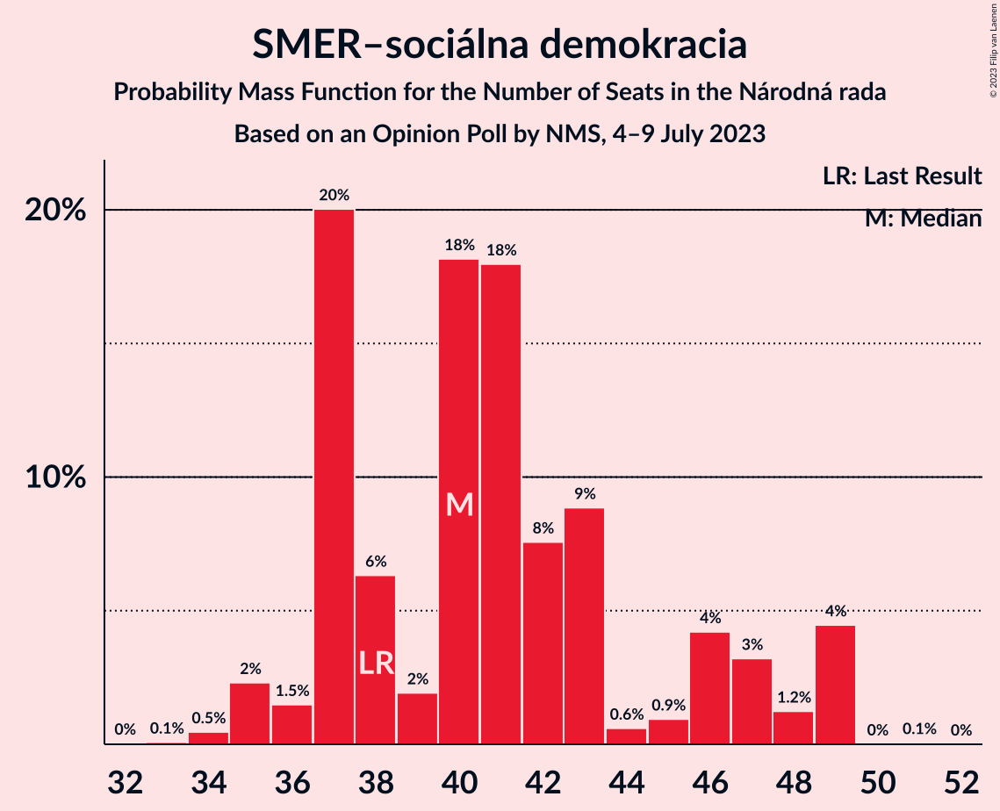

| Number of Seats | Probability | Accumulated | Special Marks |
|:---------------:|:-----------:|:-----------:|:-------------:|
| 33 | 0.1% | 100% |  |
| 34 | 0.5% | 99.9% |  |
| 35 | 2% | 99.4% |  |
| 36 | 1.5% | 97% |  |
| 37 | 20% | 96% |  |
| 38 | 6% | 76% | Last Result |
| 39 | 2% | 69% |  |
| 40 | 18% | 67% | Median |
| 41 | 18% | 49% |  |
| 42 | 8% | 31% |  |
| 43 | 9% | 24% |  |
| 44 | 0.6% | 15% |  |
| 45 | 0.9% | 14% |  |
| 46 | 4% | 13% |  |
| 47 | 3% | 9% |  |
| 48 | 1.2% | 6% |  |
| 49 | 4% | 5% |  |
| 50 | 0% | 0.1% |  |
| 51 | 0.1% | 0.1% |  |
| 52 | 0% | 0% |  |

### Progresívne Slovensko

*For a full overview of the results for this party, see the [Progresívne Slovensko](party-progresívneslovensko.html) page.*

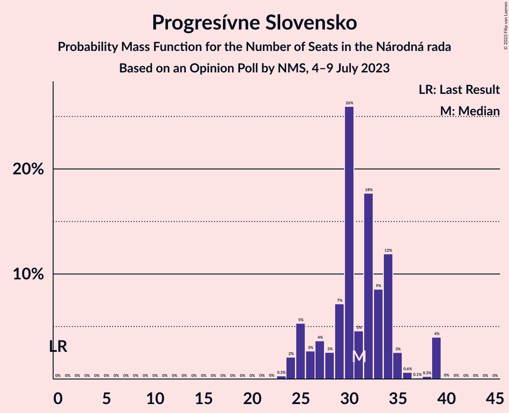

| Number of Seats | Probability | Accumulated | Special Marks |
|:---------------:|:-----------:|:-----------:|:-------------:|
| 0 | 0% | 100% | Last Result |
| 1 | 0% | 100% |  |
| 2 | 0% | 100% |  |
| 3 | 0% | 100% |  |
| 4 | 0% | 100% |  |
| 5 | 0% | 100% |  |
| 6 | 0% | 100% |  |
| 7 | 0% | 100% |  |
| 8 | 0% | 100% |  |
| 9 | 0% | 100% |  |
| 10 | 0% | 100% |  |
| 11 | 0% | 100% |  |
| 12 | 0% | 100% |  |
| 13 | 0% | 100% |  |
| 14 | 0% | 100% |  |
| 15 | 0% | 100% |  |
| 16 | 0% | 100% |  |
| 17 | 0% | 100% |  |
| 18 | 0% | 100% |  |
| 19 | 0% | 100% |  |
| 20 | 0% | 100% |  |
| 21 | 0% | 100% |  |
| 22 | 0% | 100% |  |
| 23 | 0.3% | 100% |  |
| 24 | 2% | 99.7% |  |
| 25 | 5% | 98% |  |
| 26 | 3% | 92% |  |
| 27 | 4% | 90% |  |
| 28 | 3% | 86% |  |
| 29 | 7% | 83% |  |
| 30 | 26% | 76% |  |
| 31 | 5% | 50% | Median |
| 32 | 18% | 46% |  |
| 33 | 9% | 28% |  |
| 34 | 12% | 19% |  |
| 35 | 3% | 8% |  |
| 36 | 0.6% | 5% |  |
| 37 | 0.1% | 4% |  |
| 38 | 0.3% | 4% |  |
| 39 | 4% | 4% |  |
| 40 | 0% | 0.1% |  |
| 41 | 0% | 0% |  |

### HLAS–sociálna demokracia–Dobrá voľba

*For a full overview of the results for this party, see the [HLAS–sociálna demokracia–Dobrá voľba](party-hlas–sociálnademokracia–dobrávoľba.html) page.*

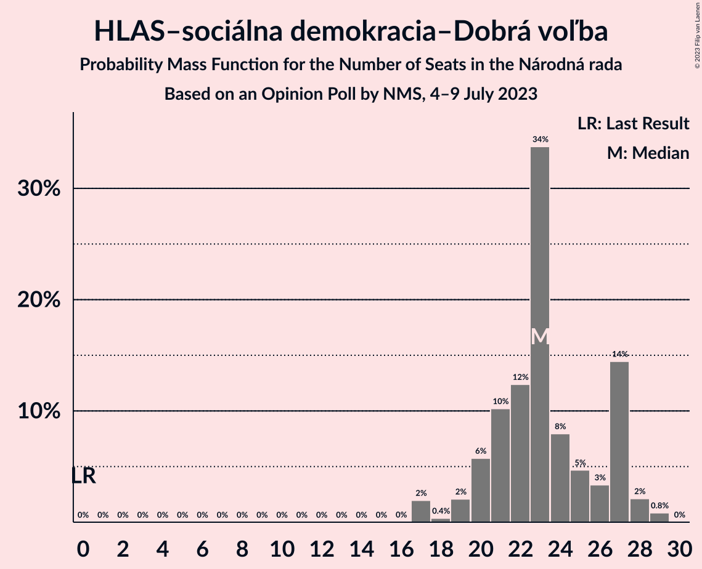

| Number of Seats | Probability | Accumulated | Special Marks |
|:---------------:|:-----------:|:-----------:|:-------------:|
| 0 | 0% | 100% | Last Result |
| 1 | 0% | 100% |  |
| 2 | 0% | 100% |  |
| 3 | 0% | 100% |  |
| 4 | 0% | 100% |  |
| 5 | 0% | 100% |  |
| 6 | 0% | 100% |  |
| 7 | 0% | 100% |  |
| 8 | 0% | 100% |  |
| 9 | 0% | 100% |  |
| 10 | 0% | 100% |  |
| 11 | 0% | 100% |  |
| 12 | 0% | 100% |  |
| 13 | 0% | 100% |  |
| 14 | 0% | 100% |  |
| 15 | 0% | 100% |  |
| 16 | 0% | 100% |  |
| 17 | 2% | 100% |  |
| 18 | 0.4% | 98% |  |
| 19 | 2% | 98% |  |
| 20 | 6% | 96% |  |
| 21 | 10% | 90% |  |
| 22 | 12% | 80% |  |
| 23 | 34% | 67% | Median |
| 24 | 8% | 33% |  |
| 25 | 5% | 26% |  |
| 26 | 3% | 21% |  |
| 27 | 14% | 17% |  |
| 28 | 2% | 3% |  |
| 29 | 0.8% | 0.9% |  |
| 30 | 0% | 0% |  |

### REPUBLIKA

*For a full overview of the results for this party, see the [REPUBLIKA](party-republika.html) page.*

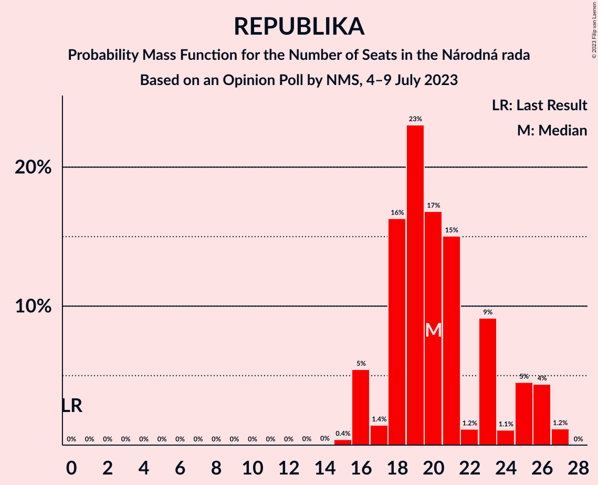

| Number of Seats | Probability | Accumulated | Special Marks |
|:---------------:|:-----------:|:-----------:|:-------------:|
| 0 | 0% | 100% | Last Result |
| 1 | 0% | 100% |  |
| 2 | 0% | 100% |  |
| 3 | 0% | 100% |  |
| 4 | 0% | 100% |  |
| 5 | 0% | 100% |  |
| 6 | 0% | 100% |  |
| 7 | 0% | 100% |  |
| 8 | 0% | 100% |  |
| 9 | 0% | 100% |  |
| 10 | 0% | 100% |  |
| 11 | 0% | 100% |  |
| 12 | 0% | 100% |  |
| 13 | 0% | 100% |  |
| 14 | 0% | 100% |  |
| 15 | 0.4% | 99.9% |  |
| 16 | 5% | 99.5% |  |
| 17 | 1.4% | 94% |  |
| 18 | 16% | 93% |  |
| 19 | 23% | 76% |  |
| 20 | 17% | 53% | Median |
| 21 | 15% | 36% |  |
| 22 | 1.2% | 21% |  |
| 23 | 9% | 20% |  |
| 24 | 1.1% | 11% |  |
| 25 | 5% | 10% |  |
| 26 | 4% | 6% |  |
| 27 | 1.2% | 1.2% |  |
| 28 | 0% | 0% |  |

### OBYČAJNÍ ĽUDIA a nezávislé osobnosti–Kresťanská únia–Za ľudí

*For a full overview of the results for this party, see the [OBYČAJNÍ ĽUDIA a nezávislé osobnosti–Kresťanská únia–Za ľudí](party-obyčajníľudiaanezávisléosobnosti–kresťanskáúnia–zaľudí.html) page.*

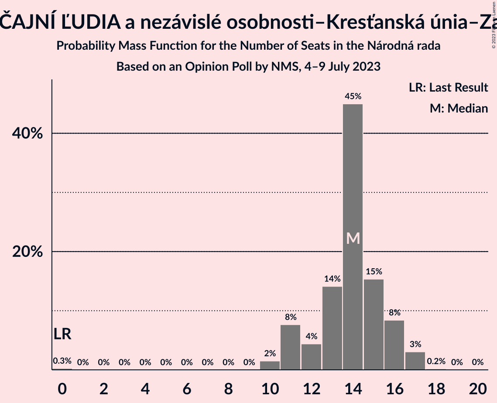

| Number of Seats | Probability | Accumulated | Special Marks |
|:---------------:|:-----------:|:-----------:|:-------------:|
| 0 | 0.3% | 100% | Last Result |
| 1 | 0% | 99.7% |  |
| 2 | 0% | 99.7% |  |
| 3 | 0% | 99.7% |  |
| 4 | 0% | 99.7% |  |
| 5 | 0% | 99.7% |  |
| 6 | 0% | 99.7% |  |
| 7 | 0% | 99.7% |  |
| 8 | 0% | 99.7% |  |
| 9 | 0% | 99.7% |  |
| 10 | 2% | 99.7% |  |
| 11 | 8% | 98% |  |
| 12 | 4% | 91% |  |
| 13 | 14% | 86% |  |
| 14 | 45% | 72% | Median |
| 15 | 15% | 27% |  |
| 16 | 8% | 12% |  |
| 17 | 3% | 3% |  |
| 18 | 0.2% | 0.2% |  |
| 19 | 0% | 0.1% |  |
| 20 | 0% | 0% |  |

### Kresťanskodemokratické hnutie

*For a full overview of the results for this party, see the [Kresťanskodemokratické hnutie](party-kresťanskodemokratickéhnutie.html) page.*

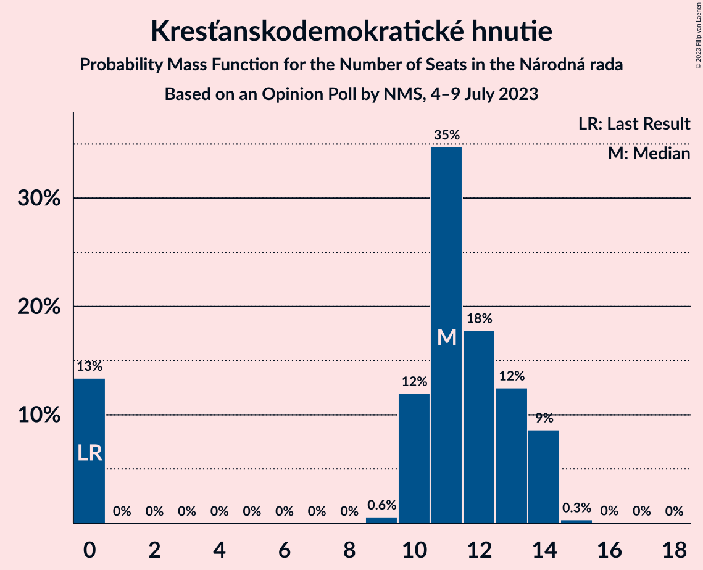

| Number of Seats | Probability | Accumulated | Special Marks |
|:---------------:|:-----------:|:-----------:|:-------------:|
| 0 | 13% | 100% | Last Result |
| 1 | 0% | 87% |  |
| 2 | 0% | 87% |  |
| 3 | 0% | 87% |  |
| 4 | 0% | 87% |  |
| 5 | 0% | 87% |  |
| 6 | 0% | 87% |  |
| 7 | 0% | 87% |  |
| 8 | 0% | 87% |  |
| 9 | 0.6% | 87% |  |
| 10 | 12% | 86% |  |
| 11 | 35% | 74% | Median |
| 12 | 18% | 39% |  |
| 13 | 12% | 22% |  |
| 14 | 9% | 9% |  |
| 15 | 0.3% | 0.4% |  |
| 16 | 0% | 0.1% |  |
| 17 | 0% | 0% |  |

### SME RODINA

*For a full overview of the results for this party, see the [SME RODINA](party-smerodina.html) page.*

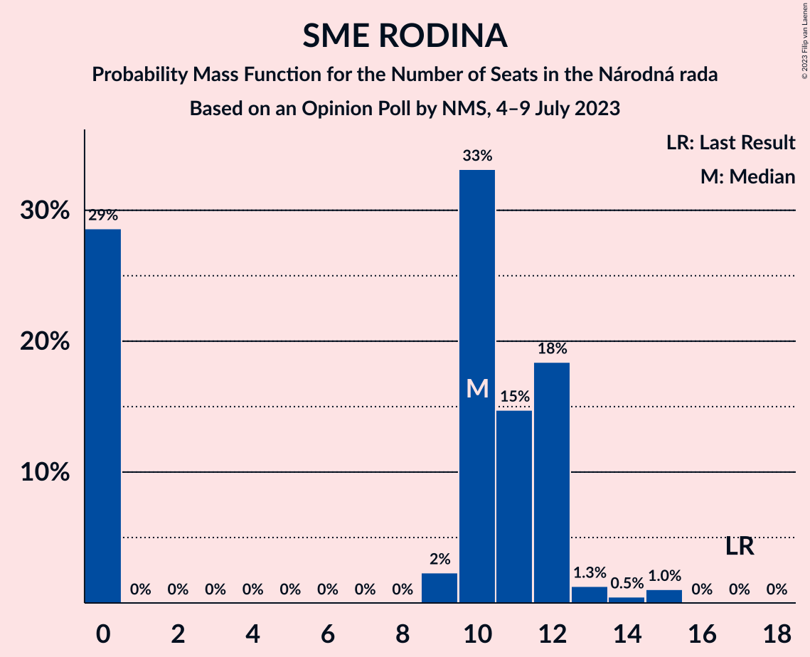

| Number of Seats | Probability | Accumulated | Special Marks |
|:---------------:|:-----------:|:-----------:|:-------------:|
| 0 | 29% | 100% |  |
| 1 | 0% | 71% |  |
| 2 | 0% | 71% |  |
| 3 | 0% | 71% |  |
| 4 | 0% | 71% |  |
| 5 | 0% | 71% |  |
| 6 | 0% | 71% |  |
| 7 | 0% | 71% |  |
| 8 | 0% | 71% |  |
| 9 | 2% | 71% |  |
| 10 | 33% | 69% | Median |
| 11 | 15% | 36% |  |
| 12 | 18% | 21% |  |
| 13 | 1.3% | 3% |  |
| 14 | 0.5% | 2% |  |
| 15 | 1.0% | 1.0% |  |
| 16 | 0% | 0% |  |
| 17 | 0% | 0% | Last Result |

### Sloboda a Solidarita

*For a full overview of the results for this party, see the [Sloboda a Solidarita](party-slobodaasolidarita.html) page.*

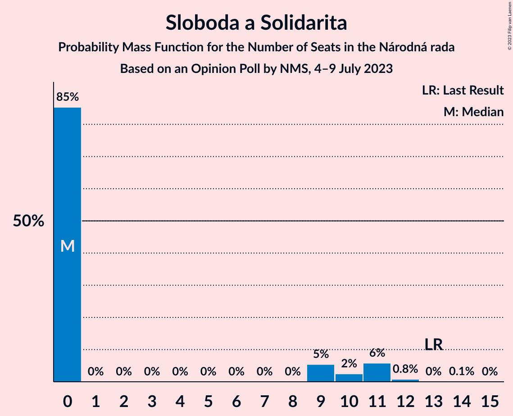

| Number of Seats | Probability | Accumulated | Special Marks |
|:---------------:|:-----------:|:-----------:|:-------------:|
| 0 | 85% | 100% | Median |
| 1 | 0% | 15% |  |
| 2 | 0% | 15% |  |
| 3 | 0% | 15% |  |
| 4 | 0% | 15% |  |
| 5 | 0% | 15% |  |
| 6 | 0% | 15% |  |
| 7 | 0% | 15% |  |
| 8 | 0% | 15% |  |
| 9 | 5% | 15% |  |
| 10 | 2% | 9% |  |
| 11 | 6% | 7% |  |
| 12 | 0.8% | 0.9% |  |
| 13 | 0% | 0.1% | Last Result |
| 14 | 0.1% | 0.1% |  |
| 15 | 0% | 0% |  |

### Slovenská národná strana

*For a full overview of the results for this party, see the [Slovenská národná strana](party-slovenskánárodnástrana.html) page.*

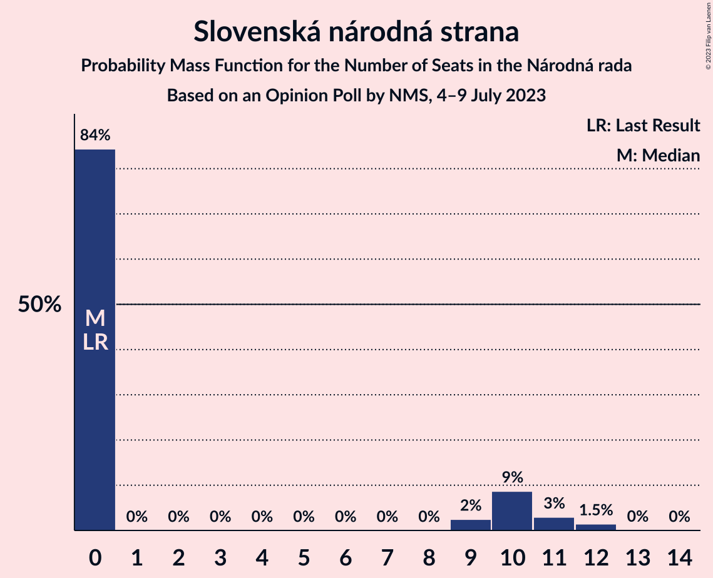

| Number of Seats | Probability | Accumulated | Special Marks |
|:---------------:|:-----------:|:-----------:|:-------------:|
| 0 | 84% | 100% | Last Result, Median |
| 1 | 0% | 16% |  |
| 2 | 0% | 16% |  |
| 3 | 0% | 16% |  |
| 4 | 0% | 16% |  |
| 5 | 0% | 16% |  |
| 6 | 0% | 16% |  |
| 7 | 0% | 16% |  |
| 8 | 0% | 16% |  |
| 9 | 2% | 16% |  |
| 10 | 9% | 13% |  |
| 11 | 3% | 4% |  |
| 12 | 1.5% | 2% |  |
| 13 | 0% | 0.1% |  |
| 14 | 0% | 0% |  |

### Strana maďarskej koalície–Magyar Koalíció Pártja

*For a full overview of the results for this party, see the [Strana maďarskej koalície–Magyar Koalíció Pártja](party-stranamaďarskejkoalície–magyarkoalíciópártja.html) page.*

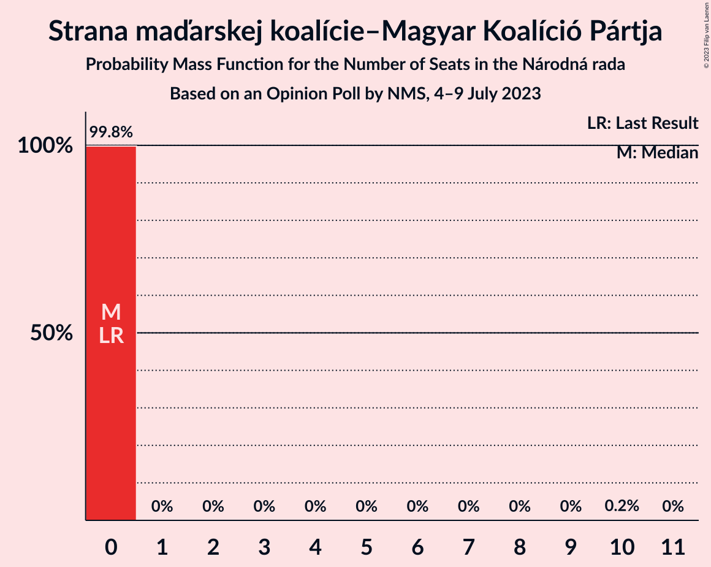

| Number of Seats | Probability | Accumulated | Special Marks |
|:---------------:|:-----------:|:-----------:|:-------------:|
| 0 | 99.8% | 100% | Last Result, Median |
| 1 | 0% | 0.2% |  |
| 2 | 0% | 0.2% |  |
| 3 | 0% | 0.2% |  |
| 4 | 0% | 0.2% |  |
| 5 | 0% | 0.2% |  |
| 6 | 0% | 0.2% |  |
| 7 | 0% | 0.2% |  |
| 8 | 0% | 0.2% |  |
| 9 | 0% | 0.2% |  |
| 10 | 0.2% | 0.2% |  |
| 11 | 0% | 0% |  |

### Kotleba–Ľudová strana Naše Slovensko

*For a full overview of the results for this party, see the [Kotleba–Ľudová strana Naše Slovensko](party-kotleba–ľudovástrananašeslovensko.html) page.*

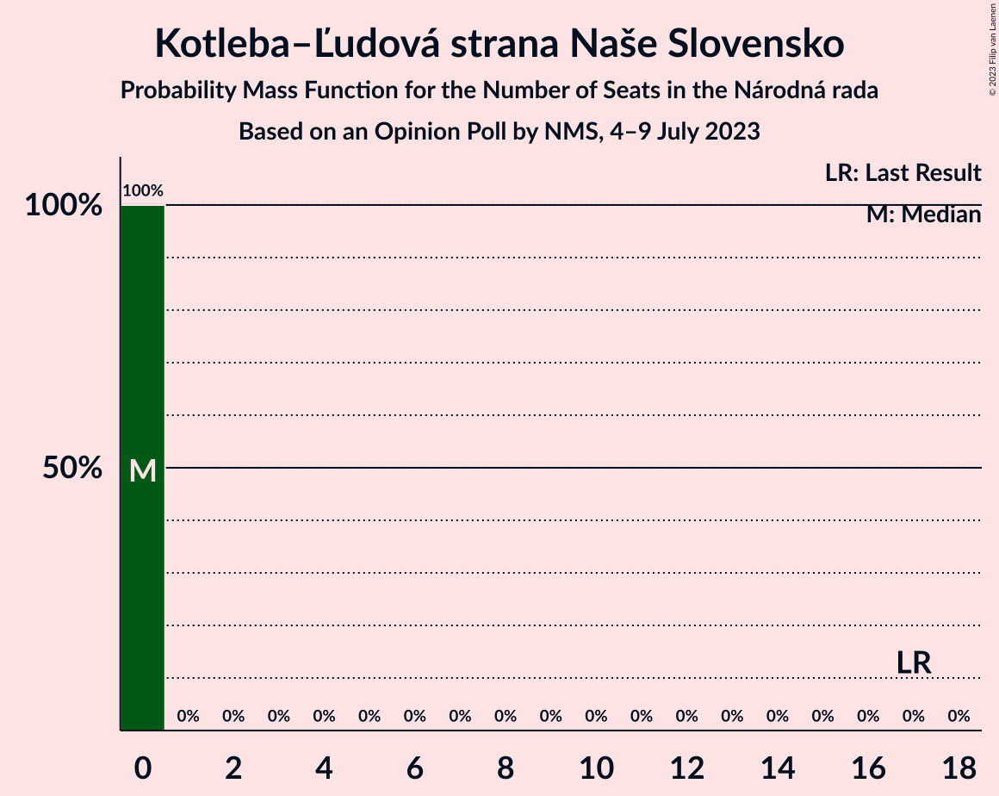

| Number of Seats | Probability | Accumulated | Special Marks |
|:---------------:|:-----------:|:-----------:|:-------------:|
| 0 | 100% | 100% | Median |
| 1 | 0% | 0% |  |
| 2 | 0% | 0% |  |
| 3 | 0% | 0% |  |
| 4 | 0% | 0% |  |
| 5 | 0% | 0% |  |
| 6 | 0% | 0% |  |
| 7 | 0% | 0% |  |
| 8 | 0% | 0% |  |
| 9 | 0% | 0% |  |
| 10 | 0% | 0% |  |
| 11 | 0% | 0% |  |
| 12 | 0% | 0% |  |
| 13 | 0% | 0% |  |
| 14 | 0% | 0% |  |
| 15 | 0% | 0% |  |
| 16 | 0% | 0% |  |
| 17 | 0% | 0% | Last Result |

### SPOLU–Občianska Demokracia

*For a full overview of the results for this party, see the [SPOLU–Občianska Demokracia](party-spolu–občianskademokracia.html) page.*

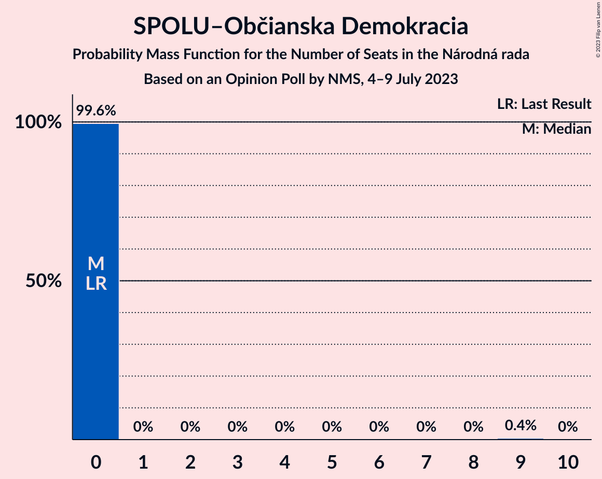

| Number of Seats | Probability | Accumulated | Special Marks |
|:---------------:|:-----------:|:-----------:|:-------------:|
| 0 | 99.6% | 100% | Last Result, Median |
| 1 | 0% | 0.4% |  |
| 2 | 0% | 0.4% |  |
| 3 | 0% | 0.4% |  |
| 4 | 0% | 0.4% |  |
| 5 | 0% | 0.4% |  |
| 6 | 0% | 0.4% |  |
| 7 | 0% | 0.4% |  |
| 8 | 0% | 0.4% |  |
| 9 | 0.4% | 0.4% |  |
| 10 | 0% | 0% |  |

### MODRÍ–Európske Slovensko–MOST–HÍD

*For a full overview of the results for this party, see the [MODRÍ–Európske Slovensko–MOST–HÍD](party-modrí–európskeslovensko–most–híd.html) page.*

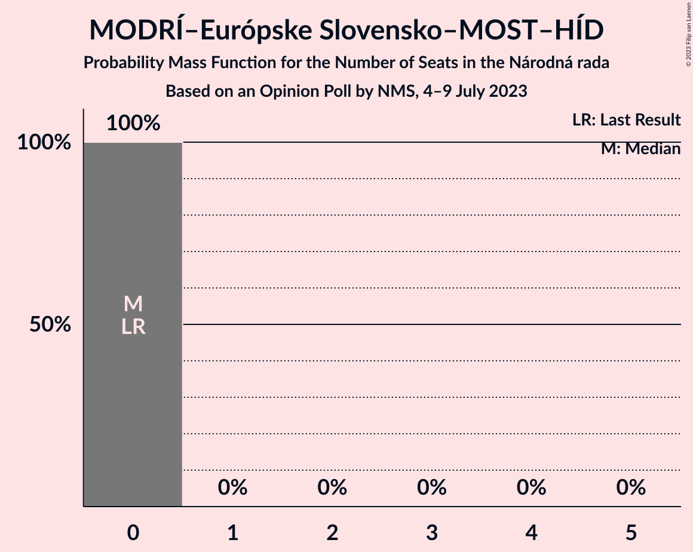

| Number of Seats | Probability | Accumulated | Special Marks |
|:---------------:|:-----------:|:-----------:|:-------------:|
| 0 | 100% | 100% | Last Result, Median |

### Magyar Fórum

*For a full overview of the results for this party, see the [Magyar Fórum](party-magyarfórum.html) page.*

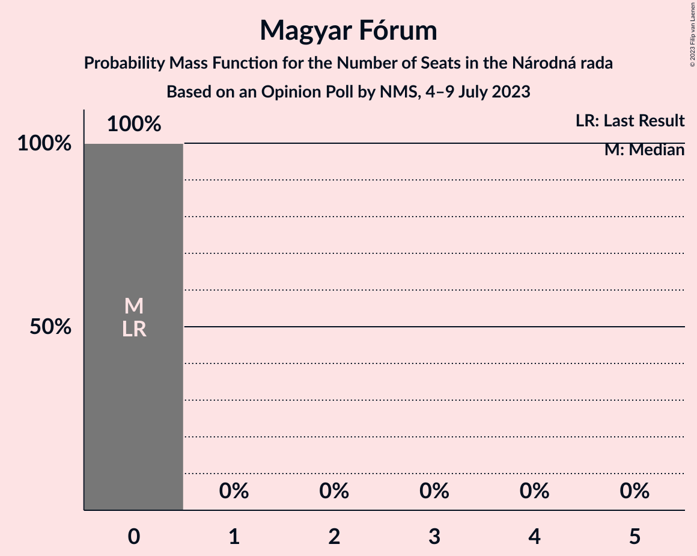

| Number of Seats | Probability | Accumulated | Special Marks |
|:---------------:|:-----------:|:-----------:|:-------------:|
| 0 | 100% | 100% | Last Result, Median |

## Coalitions

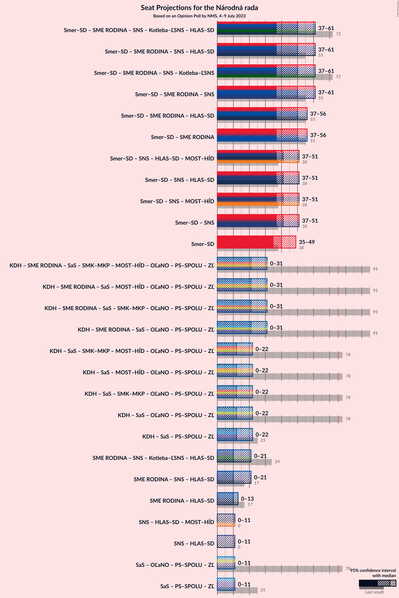

### Confidence Intervals

| Coalition | Last Result | Median | Majority? | 80% Confidence Interval | 90% Confidence Interval | 95% Confidence Interval | 99% Confidence Interval |
|:---------:|:-----------:|:------:|:---------:|:-----------------------:|:-----------------------:|:-----------------------:|:-----------------------:|
| SMER–sociálna demokracia – SME RODINA – Slovenská národná strana – Kotleba–Ľudová strana Naše Slovensko | 72 | 50 | 0% | 45–57 | 38–61 | 37–61 | 37–63 |
| SMER–sociálna demokracia – SME RODINA – Slovenská národná strana | 55 | 50 | 0% | 45–57 | 38–61 | 37–61 | 37–63 |
| SMER–sociálna demokracia – SME RODINA | 55 | 50 | 0% | 38–55 | 38–55 | 37–56 | 37–60 |
| SMER–sociálna demokracia – Slovenská národná strana | 38 | 41 | 0% | 37–49 | 37–50 | 37–51 | 36–53 |
| SMER–sociálna demokracia | 38 | 40 | 0% | 37–46 | 37–48 | 35–49 | 34–49 |

### SMER–sociálna demokracia – SME RODINA – Slovenská národná strana – Kotleba–Ľudová strana Naše Slovensko

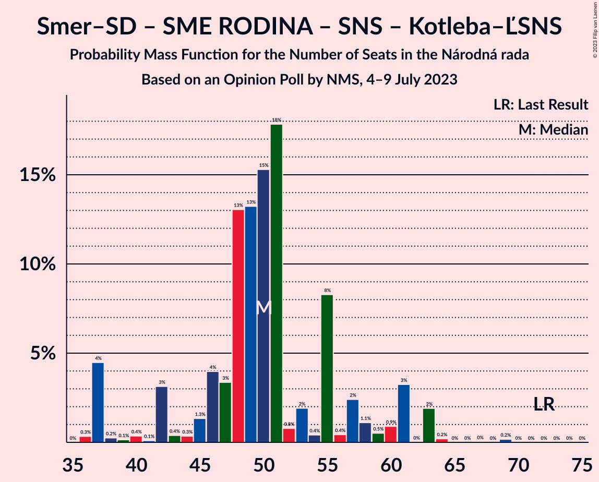

| Number of Seats | Probability | Accumulated | Special Marks |
|:---------------:|:-----------:|:-----------:|:-------------:|
| 36 | 0.3% | 100% |  |
| 37 | 4% | 99.7% |  |
| 38 | 0.2% | 95% |  |
| 39 | 0.1% | 95% |  |
| 40 | 0.4% | 95% |  |
| 41 | 0.1% | 94% |  |
| 42 | 3% | 94% |  |
| 43 | 0.4% | 91% |  |
| 44 | 0.3% | 91% |  |
| 45 | 1.3% | 90% |  |
| 46 | 4% | 89% |  |
| 47 | 3% | 85% |  |
| 48 | 13% | 82% |  |
| 49 | 13% | 69% |  |
| 50 | 15% | 55% | Median |
| 51 | 18% | 40% |  |
| 52 | 0.8% | 22% |  |
| 53 | 2% | 22% |  |
| 54 | 0.4% | 20% |  |
| 55 | 8% | 19% |  |
| 56 | 0.4% | 11% |  |
| 57 | 2% | 11% |  |
| 58 | 1.1% | 8% |  |
| 59 | 0.5% | 7% |  |
| 60 | 0.9% | 6% |  |
| 61 | 3% | 6% |  |
| 62 | 0% | 2% |  |
| 63 | 2% | 2% |  |
| 64 | 0.2% | 0.4% |  |
| 65 | 0% | 0.2% |  |
| 66 | 0% | 0.2% |  |
| 67 | 0% | 0.2% |  |
| 68 | 0% | 0.2% |  |
| 69 | 0.2% | 0.2% |  |
| 70 | 0% | 0% |  |
| 71 | 0% | 0% |  |
| 72 | 0% | 0% | Last Result |

### SMER–sociálna demokracia – SME RODINA – Slovenská národná strana

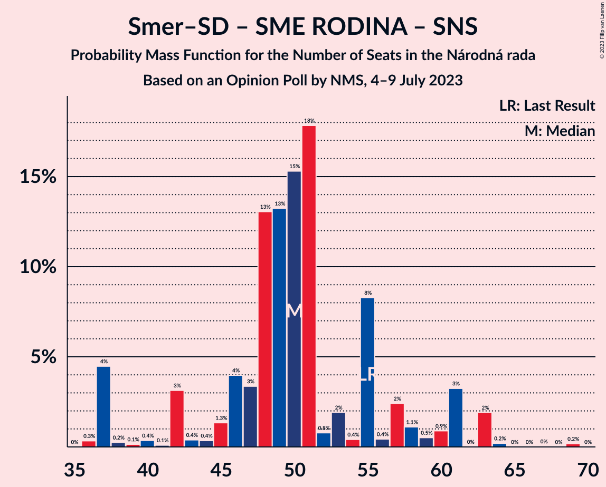

| Number of Seats | Probability | Accumulated | Special Marks |
|:---------------:|:-----------:|:-----------:|:-------------:|
| 36 | 0.3% | 100% |  |
| 37 | 4% | 99.7% |  |
| 38 | 0.2% | 95% |  |
| 39 | 0.1% | 95% |  |
| 40 | 0.4% | 95% |  |
| 41 | 0.1% | 94% |  |
| 42 | 3% | 94% |  |
| 43 | 0.4% | 91% |  |
| 44 | 0.4% | 91% |  |
| 45 | 1.3% | 90% |  |
| 46 | 4% | 89% |  |
| 47 | 3% | 85% |  |
| 48 | 13% | 82% |  |
| 49 | 13% | 69% |  |
| 50 | 15% | 55% | Median |
| 51 | 18% | 40% |  |
| 52 | 0.8% | 22% |  |
| 53 | 2% | 22% |  |
| 54 | 0.4% | 20% |  |
| 55 | 8% | 19% | Last Result |
| 56 | 0.4% | 11% |  |
| 57 | 2% | 11% |  |
| 58 | 1.1% | 8% |  |
| 59 | 0.5% | 7% |  |
| 60 | 0.9% | 6% |  |
| 61 | 3% | 6% |  |
| 62 | 0% | 2% |  |
| 63 | 2% | 2% |  |
| 64 | 0.2% | 0.4% |  |
| 65 | 0% | 0.2% |  |
| 66 | 0% | 0.2% |  |
| 67 | 0% | 0.2% |  |
| 68 | 0% | 0.2% |  |
| 69 | 0.2% | 0.2% |  |
| 70 | 0% | 0% |  |

### SMER–sociálna demokracia – SME RODINA

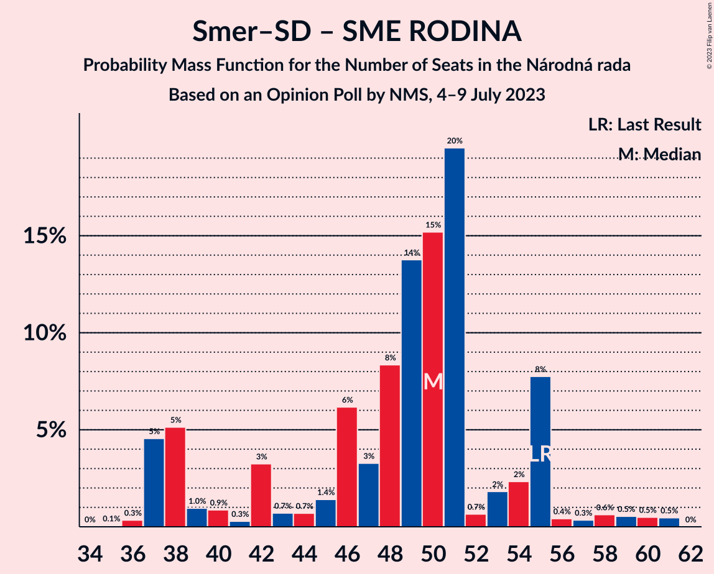

| Number of Seats | Probability | Accumulated | Special Marks |
|:---------------:|:-----------:|:-----------:|:-------------:|
| 35 | 0.1% | 100% |  |
| 36 | 0.3% | 99.9% |  |
| 37 | 5% | 99.6% |  |
| 38 | 5% | 95% |  |
| 39 | 1.0% | 90% |  |
| 40 | 0.9% | 89% |  |
| 41 | 0.3% | 88% |  |
| 42 | 3% | 88% |  |
| 43 | 0.7% | 85% |  |
| 44 | 0.7% | 84% |  |
| 45 | 1.4% | 83% |  |
| 46 | 6% | 82% |  |
| 47 | 3% | 76% |  |
| 48 | 8% | 72% |  |
| 49 | 14% | 64% |  |
| 50 | 15% | 50% | Median |
| 51 | 20% | 35% |  |
| 52 | 0.7% | 15% |  |
| 53 | 2% | 15% |  |
| 54 | 2% | 13% |  |
| 55 | 8% | 11% | Last Result |
| 56 | 0.4% | 3% |  |
| 57 | 0.3% | 2% |  |
| 58 | 0.6% | 2% |  |
| 59 | 0.5% | 2% |  |
| 60 | 0.5% | 1.0% |  |
| 61 | 0.5% | 0.5% |  |
| 62 | 0% | 0% |  |

### SMER–sociálna demokracia – Slovenská národná strana

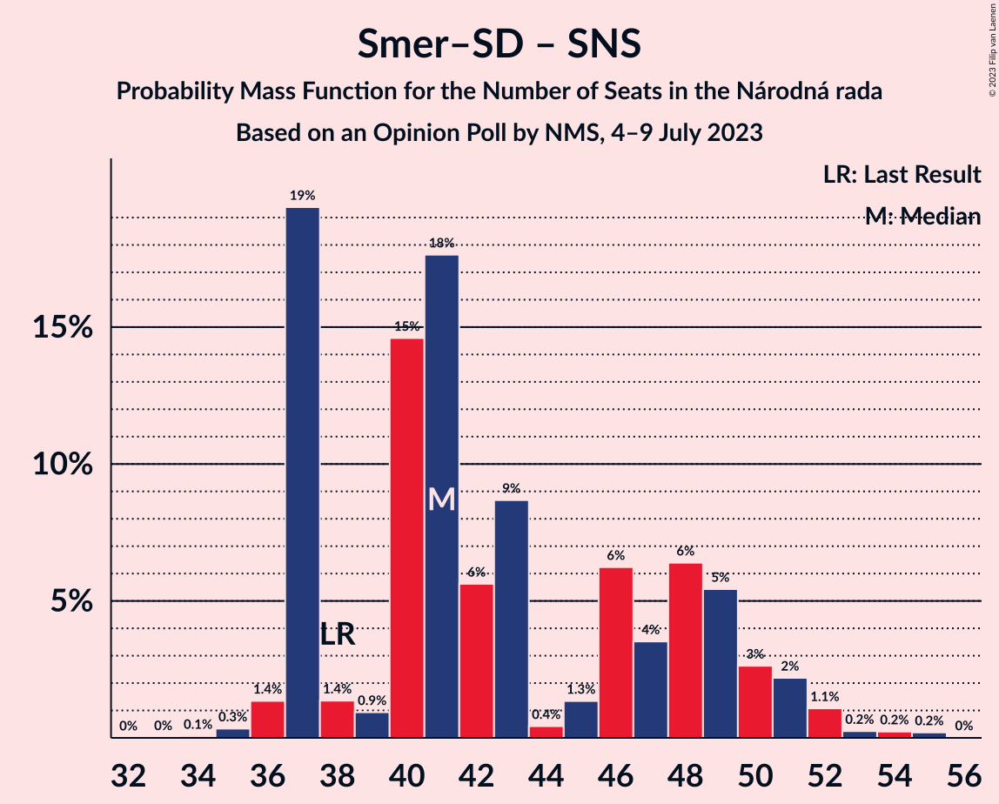

| Number of Seats | Probability | Accumulated | Special Marks |
|:---------------:|:-----------:|:-----------:|:-------------:|
| 34 | 0.1% | 100% |  |
| 35 | 0.3% | 99.9% |  |
| 36 | 1.4% | 99.6% |  |
| 37 | 19% | 98% |  |
| 38 | 1.4% | 79% | Last Result |
| 39 | 0.9% | 77% |  |
| 40 | 15% | 77% | Median |
| 41 | 18% | 62% |  |
| 42 | 6% | 44% |  |
| 43 | 9% | 39% |  |
| 44 | 0.4% | 30% |  |
| 45 | 1.3% | 30% |  |
| 46 | 6% | 28% |  |
| 47 | 4% | 22% |  |
| 48 | 6% | 18% |  |
| 49 | 5% | 12% |  |
| 50 | 3% | 7% |  |
| 51 | 2% | 4% |  |
| 52 | 1.1% | 2% |  |
| 53 | 0.2% | 0.7% |  |
| 54 | 0.2% | 0.5% |  |
| 55 | 0.2% | 0.2% |  |
| 56 | 0% | 0% |  |

### SMER–sociálna demokracia

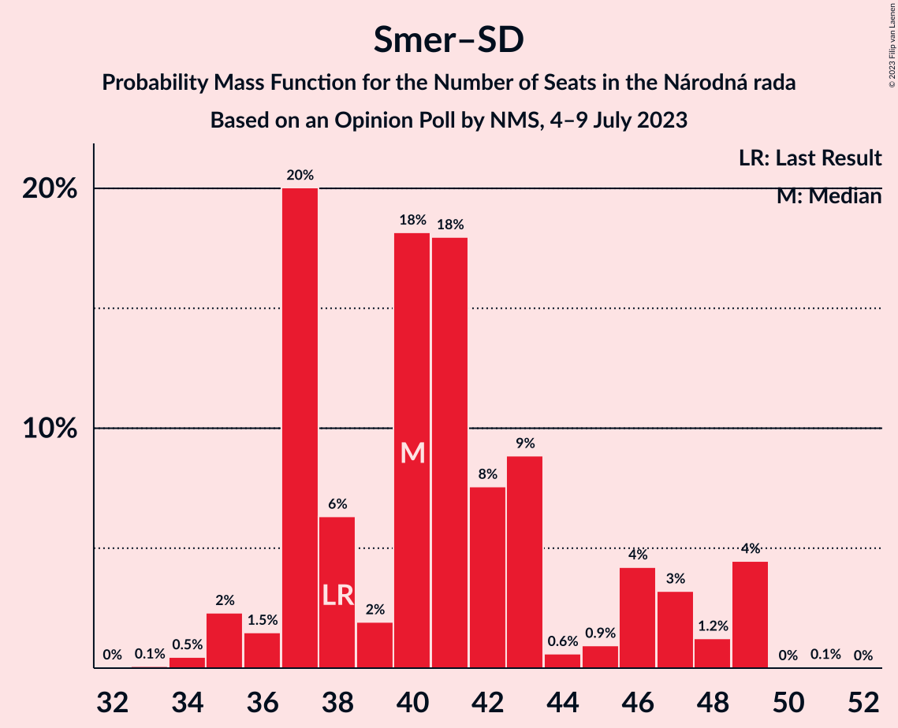

| Number of Seats | Probability | Accumulated | Special Marks |
|:---------------:|:-----------:|:-----------:|:-------------:|
| 33 | 0.1% | 100% |  |
| 34 | 0.5% | 99.9% |  |
| 35 | 2% | 99.4% |  |
| 36 | 1.5% | 97% |  |
| 37 | 20% | 96% |  |
| 38 | 6% | 76% | Last Result |
| 39 | 2% | 69% |  |
| 40 | 18% | 67% | Median |
| 41 | 18% | 49% |  |
| 42 | 8% | 31% |  |
| 43 | 9% | 24% |  |
| 44 | 0.6% | 15% |  |
| 45 | 0.9% | 14% |  |
| 46 | 4% | 13% |  |
| 47 | 3% | 9% |  |
| 48 | 1.2% | 6% |  |
| 49 | 4% | 5% |  |
| 50 | 0% | 0.1% |  |
| 51 | 0.1% | 0.1% |  |
| 52 | 0% | 0% |  |

## Technical Information

### Opinion Poll

+ **Polling firm:** NMS
+ **Commissioner(s):** —
+ **Fieldwork period:** 4–9 July 2023

### Calculations

+ **Sample size:** 1413
+ **Simulations done:** 1,048,576
+ **Error estimate:** 1.95%

