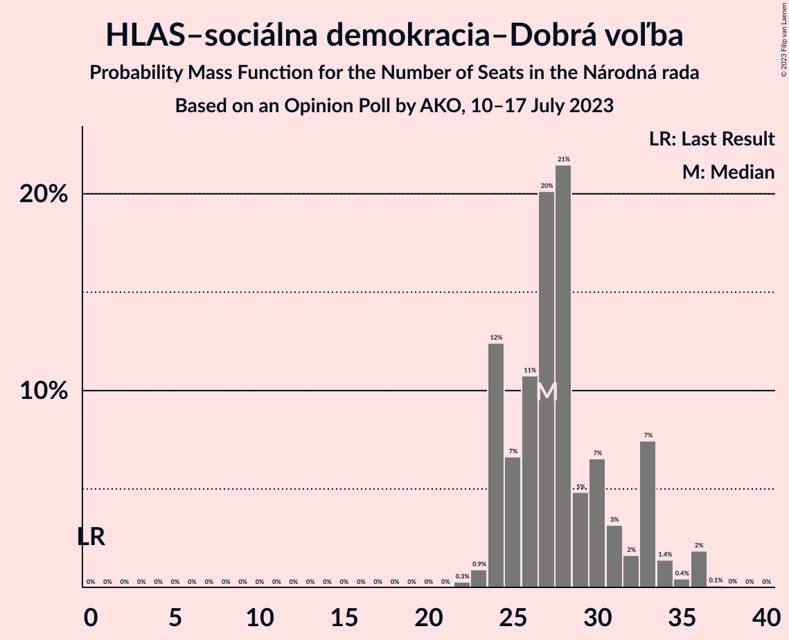

# Opinion Poll by AKO, 10–17 July 2023

<a href="#voting-intentions">Voting Intentions</a> | <a href="#seats">Seats</a> | <a href="#coalitions">Coalitions</a> | <a href="#technical-information">Technical Information</a>

## Voting Intentions

### Confidence Intervals

| Party | Last Result | Poll Result | 80% Confidence Interval | 90% Confidence Interval | 95% Confidence Interval | 99% Confidence Interval |
|:-----:|:-----------:|:-----------:|:-----------------------:|:-----------------------:|:-----------------------:|:-----------------------:|
| SMER–sociálna demokracia | 18.3% | 18.1% | 16.6–19.7% |16.2–20.2% |15.8–20.6% |15.2–21.4% |
| HLAS–sociálna demokracia–Dobrá voľba | 0.0% | 16.5% | 15.1–18.1% |14.7–18.5% |14.3–18.9% |13.7–19.7% |
| Progresívne Slovensko | 7.0% | 15.4% | 14.0–16.9% |13.6–17.4% |13.3–17.8% |12.7–18.5% |
| Sloboda a Solidarita | 6.2% | 7.6% | 6.6–8.8% |6.3–9.1% |6.1–9.4% |5.7–10.0% |
| OBYČAJNÍ ĽUDIA a nezávislé osobnosti–Kresťanská únia–Za ľudí | 0.0% | 7.2% | 6.2–8.4% |6.0–8.7% |5.7–9.0% |5.3–9.6% |
| REPUBLIKA | 0.0% | 6.8% | 5.9–7.9% |5.6–8.3% |5.4–8.5% |5.0–9.1% |
| SME RODINA | 8.2% | 6.2% | 5.3–7.3% |5.1–7.6% |4.9–7.9% |4.5–8.4% |
| Kresťanskodemokratické hnutie | 4.6% | 5.9% | 5.0–7.0% |4.8–7.3% |4.6–7.5% |4.2–8.1% |
| Slovenská národná strana | 3.2% | 5.1% | 4.3–6.1% |4.1–6.4% |3.9–6.6% |3.6–7.2% |
| SPOLU–Občianska Demokracia | 7.0% | 2.2% | 1.7–2.9% |1.6–3.1% |1.4–3.3% |1.2–3.7% |
| Kotleba–Ľudová strana Naše Slovensko | 8.0% | 1.7% | 1.3–2.4% |1.2–2.5% |1.1–2.7% |0.9–3.1% |
| Strana maďarskej koalície–Magyar Koalíció Pártja | 3.9% | 1.7% | 1.3–2.4% |1.2–2.5% |1.1–2.7% |0.9–3.1% |

*Note:* The poll result column reflects the actual value used in the calculations. Published results may vary slightly, and in addition be rounded to fewer digits.

## Seats

### Confidence Intervals

| Party | Last Result | Median | 80% Confidence Interval | 90% Confidence Interval | 95% Confidence Interval | 99% Confidence Interval |
|:-----:|:-----------:|:------:|:-----------------------:|:-----------------------:|:-----------------------:|:-----------------------:|
| <a href="#smer–sociálna-demokracia">SMER–sociálna demokracia</a> | 38 | 31 | 29–36 |26–36 |26–36 |26–38 |
| <a href="#hlas–sociálna-demokracia–dobrá-voľba">HLAS–sociálna demokracia–Dobrá voľba</a> | 0 | 27 | 24–33 |24–33 |24–34 |23–36 |
| <a href="#progresívne-slovensko">Progresívne Slovensko</a> | 0 | 27 | 24–30 |24–31 |23–31 |22–33 |
| <a href="#sloboda-a-solidarita">Sloboda a Solidarita</a> | 13 | 14 | 11–15 |11–16 |11–16 |10–18 |
| <a href="#obyčajní-ľudia-a-nezávislé-osobnosti–kresťanská-únia–za-ľudí">OBYČAJNÍ ĽUDIA a nezávislé osobnosti–Kresťanská únia–Za ľudí</a> | 0 | 13 | 11–15 |11–15 |10–16 |9–16 |
| <a href="#republika">REPUBLIKA</a> | 0 | 12 | 10–14 |10–15 |10–16 |0–16 |
| <a href="#sme-rodina">SME RODINA</a> | 17 | 11 | 9–13 |9–13 |0–13 |0–15 |
| <a href="#kresťanskodemokratické-hnutie">Kresťanskodemokratické hnutie</a> | 0 | 10 | 9–12 |0–12 |0–13 |0–14 |
| <a href="#slovenská-národná-strana">Slovenská národná strana</a> | 0 | 9 | 0–9 |0–10 |0–11 |0–12 |
| <a href="#spolu–občianska-demokracia">SPOLU–Občianska Demokracia</a> | 0 | 0 | 0 |0 |0 |0 |
| <a href="#kotleba–ľudová-strana-naše-slovensko">Kotleba–Ľudová strana Naše Slovensko</a> | 17 | 0 | 0 |0 |0 |0 |
| <a href="#strana-maďarskej-koalície–magyar-koalíció-pártja">Strana maďarskej koalície–Magyar Koalíció Pártja</a> | 0 | 0 | 0 |0 |0 |0 |

### SMER–sociálna demokracia

*For a full overview of the results for this party, see the [SMER–sociálna demokracia](party-smer–sociálnademokracia.html) page.*

| Number of Seats | Probability | Accumulated | Special Marks |
|:---------------:|:-----------:|:-----------:|:-------------:|
| 25 | 0.1% | 100% |  |
| 26 | 6% | 99.9% |  |
| 27 | 0.6% | 94% |  |
| 28 | 1.1% | 94% |  |
| 29 | 13% | 93% |  |
| 30 | 4% | 79% |  |
| 31 | 30% | 75% | Median |
| 32 | 6% | 45% |  |
| 33 | 11% | 39% |  |
| 34 | 9% | 28% |  |
| 35 | 4% | 19% |  |
| 36 | 14% | 15% |  |
| 37 | 0.4% | 1.0% |  |
| 38 | 0.2% | 0.6% | Last Result |
| 39 | 0.1% | 0.4% |  |
| 40 | 0.1% | 0.3% |  |
| 41 | 0.1% | 0.2% |  |
| 42 | 0% | 0.1% |  |
| 43 | 0.1% | 0.1% |  |
| 44 | 0% | 0% |  |

### HLAS–sociálna demokracia–Dobrá voľba

*For a full overview of the results for this party, see the [HLAS–sociálna demokracia–Dobrá voľba](party-hlas–sociálnademokracia–dobrávoľba.html) page.*

| Number of Seats | Probability | Accumulated | Special Marks |
|:---------------:|:-----------:|:-----------:|:-------------:|
| 0 | 0% | 100% | Last Result |
| 1 | 0% | 100% |  |
| 2 | 0% | 100% |  |
| 3 | 0% | 100% |  |
| 4 | 0% | 100% |  |
| 5 | 0% | 100% |  |
| 6 | 0% | 100% |  |
| 7 | 0% | 100% |  |
| 8 | 0% | 100% |  |
| 9 | 0% | 100% |  |
| 10 | 0% | 100% |  |
| 11 | 0% | 100% |  |
| 12 | 0% | 100% |  |
| 13 | 0% | 100% |  |
| 14 | 0% | 100% |  |
| 15 | 0% | 100% |  |
| 16 | 0% | 100% |  |
| 17 | 0% | 100% |  |
| 18 | 0% | 100% |  |
| 19 | 0% | 100% |  |
| 20 | 0% | 100% |  |
| 21 | 0% | 100% |  |
| 22 | 0.3% | 100% |  |
| 23 | 0.9% | 99.7% |  |
| 24 | 12% | 98.8% |  |
| 25 | 7% | 86% |  |
| 26 | 11% | 80% |  |
| 27 | 20% | 69% | Median |
| 28 | 21% | 49% |  |
| 29 | 5% | 27% |  |
| 30 | 7% | 23% |  |
| 31 | 3% | 16% |  |
| 32 | 2% | 13% |  |
| 33 | 7% | 11% |  |
| 34 | 1.4% | 4% |  |
| 35 | 0.4% | 2% |  |
| 36 | 2% | 2% |  |
| 37 | 0.1% | 0.1% |  |
| 38 | 0% | 0% |  |

### Progresívne Slovensko

*For a full overview of the results for this party, see the [Progresívne Slovensko](party-progresívneslovensko.html) page.*

| Number of Seats | Probability | Accumulated | Special Marks |
|:---------------:|:-----------:|:-----------:|:-------------:|
| 0 | 0% | 100% | Last Result |
| 1 | 0% | 100% |  |
| 2 | 0% | 100% |  |
| 3 | 0% | 100% |  |
| 4 | 0% | 100% |  |
| 5 | 0% | 100% |  |
| 6 | 0% | 100% |  |
| 7 | 0% | 100% |  |
| 8 | 0% | 100% |  |
| 9 | 0% | 100% |  |
| 10 | 0% | 100% |  |
| 11 | 0% | 100% |  |
| 12 | 0% | 100% |  |
| 13 | 0% | 100% |  |
| 14 | 0% | 100% |  |
| 15 | 0% | 100% |  |
| 16 | 0% | 100% |  |
| 17 | 0% | 100% |  |
| 18 | 0% | 100% |  |
| 19 | 0% | 100% |  |
| 20 | 0.1% | 100% |  |
| 21 | 0.4% | 99.9% |  |
| 22 | 1.5% | 99.5% |  |
| 23 | 2% | 98% |  |
| 24 | 14% | 96% |  |
| 25 | 12% | 82% |  |
| 26 | 12% | 70% |  |
| 27 | 23% | 58% | Median |
| 28 | 14% | 35% |  |
| 29 | 10% | 21% |  |
| 30 | 3% | 11% |  |
| 31 | 5% | 7% |  |
| 32 | 1.1% | 2% |  |
| 33 | 0.4% | 0.8% |  |
| 34 | 0.2% | 0.4% |  |
| 35 | 0.1% | 0.2% |  |
| 36 | 0.1% | 0.1% |  |
| 37 | 0% | 0% |  |

### Sloboda a Solidarita

*For a full overview of the results for this party, see the [Sloboda a Solidarita](party-slobodaasolidarita.html) page.*

| Number of Seats | Probability | Accumulated | Special Marks |
|:---------------:|:-----------:|:-----------:|:-------------:|
| 9 | 0.2% | 100% |  |
| 10 | 1.5% | 99.7% |  |
| 11 | 9% | 98% |  |
| 12 | 17% | 90% |  |
| 13 | 6% | 72% | Last Result |
| 14 | 42% | 66% | Median |
| 15 | 16% | 24% |  |
| 16 | 7% | 9% |  |
| 17 | 0.8% | 2% |  |
| 18 | 0.7% | 0.8% |  |
| 19 | 0% | 0.1% |  |
| 20 | 0% | 0% |  |

### OBYČAJNÍ ĽUDIA a nezávislé osobnosti–Kresťanská únia–Za ľudí

*For a full overview of the results for this party, see the [OBYČAJNÍ ĽUDIA a nezávislé osobnosti–Kresťanská únia–Za ľudí](party-obyčajníľudiaanezávisléosobnosti–kresťanskáúnia–zaľudí.html) page.*

| Number of Seats | Probability | Accumulated | Special Marks |
|:---------------:|:-----------:|:-----------:|:-------------:|
| 0 | 0.3% | 100% | Last Result |
| 1 | 0% | 99.7% |  |
| 2 | 0% | 99.7% |  |
| 3 | 0% | 99.7% |  |
| 4 | 0% | 99.7% |  |
| 5 | 0% | 99.7% |  |
| 6 | 0% | 99.7% |  |
| 7 | 0% | 99.7% |  |
| 8 | 0% | 99.7% |  |
| 9 | 0.3% | 99.7% |  |
| 10 | 3% | 99.4% |  |
| 11 | 13% | 96% |  |
| 12 | 29% | 84% |  |
| 13 | 27% | 54% | Median |
| 14 | 8% | 27% |  |
| 15 | 15% | 19% |  |
| 16 | 4% | 4% |  |
| 17 | 0.2% | 0.4% |  |
| 18 | 0.2% | 0.2% |  |
| 19 | 0% | 0% |  |

### REPUBLIKA

*For a full overview of the results for this party, see the [REPUBLIKA](party-republika.html) page.*

| Number of Seats | Probability | Accumulated | Special Marks |
|:---------------:|:-----------:|:-----------:|:-------------:|
| 0 | 0.6% | 100% | Last Result |
| 1 | 0% | 99.4% |  |
| 2 | 0% | 99.4% |  |
| 3 | 0% | 99.4% |  |
| 4 | 0% | 99.4% |  |
| 5 | 0% | 99.4% |  |
| 6 | 0% | 99.4% |  |
| 7 | 0% | 99.4% |  |
| 8 | 0.1% | 99.4% |  |
| 9 | 1.1% | 99.4% |  |
| 10 | 19% | 98% |  |
| 11 | 9% | 79% |  |
| 12 | 25% | 70% | Median |
| 13 | 33% | 45% |  |
| 14 | 5% | 12% |  |
| 15 | 3% | 7% |  |
| 16 | 4% | 5% |  |
| 17 | 0.1% | 0.1% |  |
| 18 | 0% | 0% |  |

### SME RODINA

*For a full overview of the results for this party, see the [SME RODINA](party-smerodina.html) page.*

| Number of Seats | Probability | Accumulated | Special Marks |
|:---------------:|:-----------:|:-----------:|:-------------:|
| 0 | 4% | 100% |  |
| 1 | 0% | 96% |  |
| 2 | 0% | 96% |  |
| 3 | 0% | 96% |  |
| 4 | 0% | 96% |  |
| 5 | 0% | 96% |  |
| 6 | 0% | 96% |  |
| 7 | 0% | 96% |  |
| 8 | 0.1% | 96% |  |
| 9 | 17% | 96% |  |
| 10 | 23% | 79% |  |
| 11 | 9% | 56% | Median |
| 12 | 32% | 47% |  |
| 13 | 14% | 15% |  |
| 14 | 0.5% | 1.3% |  |
| 15 | 0.8% | 0.9% |  |
| 16 | 0.1% | 0.1% |  |
| 17 | 0% | 0% | Last Result |

### Kresťanskodemokratické hnutie

*For a full overview of the results for this party, see the [Kresťanskodemokratické hnutie](party-kresťanskodemokratickéhnutie.html) page.*

| Number of Seats | Probability | Accumulated | Special Marks |
|:---------------:|:-----------:|:-----------:|:-------------:|
| 0 | 6% | 100% | Last Result |
| 1 | 0% | 94% |  |
| 2 | 0% | 94% |  |
| 3 | 0% | 94% |  |
| 4 | 0% | 94% |  |
| 5 | 0% | 94% |  |
| 6 | 0% | 94% |  |
| 7 | 0% | 94% |  |
| 8 | 0.5% | 94% |  |
| 9 | 30% | 94% |  |
| 10 | 33% | 64% | Median |
| 11 | 17% | 30% |  |
| 12 | 10% | 13% |  |
| 13 | 2% | 3% |  |
| 14 | 0.9% | 1.0% |  |
| 15 | 0.1% | 0.1% |  |
| 16 | 0% | 0% |  |

### Slovenská národná strana

*For a full overview of the results for this party, see the [Slovenská národná strana](party-slovenskánárodnástrana.html) page.*

| Number of Seats | Probability | Accumulated | Special Marks |
|:---------------:|:-----------:|:-----------:|:-------------:|
| 0 | 49% | 100% | Last Result |
| 1 | 0% | 51% |  |
| 2 | 0% | 51% |  |
| 3 | 0% | 51% |  |
| 4 | 0% | 51% |  |
| 5 | 0% | 51% |  |
| 6 | 0% | 51% |  |
| 7 | 0% | 51% |  |
| 8 | 0.7% | 51% |  |
| 9 | 41% | 50% | Median |
| 10 | 4% | 9% |  |
| 11 | 3% | 5% |  |
| 12 | 1.4% | 2% |  |
| 13 | 0.2% | 0.2% |  |
| 14 | 0% | 0% |  |

### SPOLU–Občianska Demokracia

*For a full overview of the results for this party, see the [SPOLU–Občianska Demokracia](party-spolu–občianskademokracia.html) page.*

| Number of Seats | Probability | Accumulated | Special Marks |
|:---------------:|:-----------:|:-----------:|:-------------:|
| 0 | 100% | 100% | Last Result, Median |

### Kotleba–Ľudová strana Naše Slovensko

*For a full overview of the results for this party, see the [Kotleba–Ľudová strana Naše Slovensko](party-kotleba–ľudovástrananašeslovensko.html) page.*

| Number of Seats | Probability | Accumulated | Special Marks |
|:---------------:|:-----------:|:-----------:|:-------------:|
| 0 | 100% | 100% | Median |
| 1 | 0% | 0% |  |
| 2 | 0% | 0% |  |
| 3 | 0% | 0% |  |
| 4 | 0% | 0% |  |
| 5 | 0% | 0% |  |
| 6 | 0% | 0% |  |
| 7 | 0% | 0% |  |
| 8 | 0% | 0% |  |
| 9 | 0% | 0% |  |
| 10 | 0% | 0% |  |
| 11 | 0% | 0% |  |
| 12 | 0% | 0% |  |
| 13 | 0% | 0% |  |
| 14 | 0% | 0% |  |
| 15 | 0% | 0% |  |
| 16 | 0% | 0% |  |
| 17 | 0% | 0% | Last Result |

### Strana maďarskej koalície–Magyar Koalíció Pártja

*For a full overview of the results for this party, see the [Strana maďarskej koalície–Magyar Koalíció Pártja](party-stranamaďarskejkoalície–magyarkoalíciópártja.html) page.*

| Number of Seats | Probability | Accumulated | Special Marks |
|:---------------:|:-----------:|:-----------:|:-------------:|
| 0 | 100% | 100% | Last Result, Median |

## Coalitions

### Confidence Intervals

| Coalition | Last Result | Median | Majority? | 80% Confidence Interval | 90% Confidence Interval | 95% Confidence Interval | 99% Confidence Interval |
|:---------:|:-----------:|:------:|:---------:|:-----------------------:|:-----------------------:|:-----------------------:|:-----------------------:|
| SMER–sociálna demokracia – SME RODINA – Slovenská národná strana – Kotleba–Ľudová strana Naše Slovensko | 72 | 47 | 0% | 42–52 | 41–53 | 39–54 | 35–56 |
| SMER–sociálna demokracia – SME RODINA – Slovenská národná strana | 55 | 47 | 0% | 42–52 | 41–53 | 39–54 | 35–56 |
| SMER–sociálna demokracia – SME RODINA | 55 | 43 | 0% | 39–46 | 39–47 | 35–47 | 33–49 |
| SMER–sociálna demokracia – Slovenská národná strana | 38 | 36 | 0% | 31–41 | 31–43 | 30–44 | 28–45 |
| SMER–sociálna demokracia | 38 | 31 | 0% | 29–36 | 26–36 | 26–36 | 26–38 |

### SMER–sociálna demokracia – SME RODINA – Slovenská národná strana – Kotleba–Ľudová strana Naše Slovensko

| Number of Seats | Probability | Accumulated | Special Marks |
|:---------------:|:-----------:|:-----------:|:-------------:|
| 32 | 0% | 100% |  |
| 33 | 0% | 99.9% |  |
| 34 | 0.1% | 99.9% |  |
| 35 | 0.3% | 99.8% |  |
| 36 | 1.1% | 99.5% |  |
| 37 | 0.1% | 98% |  |
| 38 | 0.1% | 98% |  |
| 39 | 1.0% | 98% |  |
| 40 | 0.5% | 97% |  |
| 41 | 5% | 97% |  |
| 42 | 3% | 92% |  |
| 43 | 8% | 89% |  |
| 44 | 0.9% | 81% |  |
| 45 | 21% | 80% |  |
| 46 | 3% | 59% |  |
| 47 | 6% | 56% |  |
| 48 | 13% | 50% |  |
| 49 | 1.4% | 37% |  |
| 50 | 12% | 35% |  |
| 51 | 2% | 23% | Median |
| 52 | 16% | 21% |  |
| 53 | 1.5% | 5% |  |
| 54 | 2% | 4% |  |
| 55 | 0.5% | 1.4% |  |
| 56 | 0.4% | 0.8% |  |
| 57 | 0.2% | 0.4% |  |
| 58 | 0.1% | 0.2% |  |
| 59 | 0.1% | 0.1% |  |
| 60 | 0% | 0.1% |  |
| 61 | 0% | 0% |  |
| 62 | 0% | 0% |  |
| 63 | 0% | 0% |  |
| 64 | 0% | 0% |  |
| 65 | 0% | 0% |  |
| 66 | 0% | 0% |  |
| 67 | 0% | 0% |  |
| 68 | 0% | 0% |  |
| 69 | 0% | 0% |  |
| 70 | 0% | 0% |  |
| 71 | 0% | 0% |  |
| 72 | 0% | 0% | Last Result |

### SMER–sociálna demokracia – SME RODINA – Slovenská národná strana

| Number of Seats | Probability | Accumulated | Special Marks |
|:---------------:|:-----------:|:-----------:|:-------------:|
| 32 | 0% | 100% |  |
| 33 | 0% | 99.9% |  |
| 34 | 0.1% | 99.9% |  |
| 35 | 0.3% | 99.8% |  |
| 36 | 1.1% | 99.5% |  |
| 37 | 0.1% | 98% |  |
| 38 | 0.1% | 98% |  |
| 39 | 1.0% | 98% |  |
| 40 | 0.5% | 97% |  |
| 41 | 5% | 97% |  |
| 42 | 3% | 92% |  |
| 43 | 8% | 89% |  |
| 44 | 0.9% | 81% |  |
| 45 | 21% | 80% |  |
| 46 | 3% | 59% |  |
| 47 | 6% | 56% |  |
| 48 | 13% | 50% |  |
| 49 | 1.4% | 37% |  |
| 50 | 12% | 35% |  |
| 51 | 2% | 23% | Median |
| 52 | 16% | 21% |  |
| 53 | 1.5% | 5% |  |
| 54 | 2% | 4% |  |
| 55 | 0.5% | 1.4% | Last Result |
| 56 | 0.4% | 0.8% |  |
| 57 | 0.2% | 0.4% |  |
| 58 | 0.1% | 0.2% |  |
| 59 | 0.1% | 0.1% |  |
| 60 | 0% | 0.1% |  |
| 61 | 0% | 0% |  |

### SMER–sociálna demokracia – SME RODINA

| Number of Seats | Probability | Accumulated | Special Marks |
|:---------------:|:-----------:|:-----------:|:-------------:|
| 30 | 0.1% | 100% |  |
| 31 | 0.2% | 99.8% |  |
| 32 | 0.1% | 99.6% |  |
| 33 | 0.1% | 99.5% |  |
| 34 | 1.5% | 99.5% |  |
| 35 | 0.6% | 98% |  |
| 36 | 1.3% | 97% |  |
| 37 | 0.6% | 96% |  |
| 38 | 0.4% | 95% |  |
| 39 | 14% | 95% |  |
| 40 | 3% | 81% |  |
| 41 | 18% | 79% |  |
| 42 | 4% | 61% | Median |
| 43 | 22% | 57% |  |
| 44 | 1.0% | 35% |  |
| 45 | 23% | 34% |  |
| 46 | 3% | 11% |  |
| 47 | 6% | 8% |  |
| 48 | 0.7% | 2% |  |
| 49 | 0.8% | 1.3% |  |
| 50 | 0.2% | 0.4% |  |
| 51 | 0.2% | 0.2% |  |
| 52 | 0.1% | 0.1% |  |
| 53 | 0% | 0% |  |
| 54 | 0% | 0% |  |
| 55 | 0% | 0% | Last Result |

### SMER–sociálna demokracia – Slovenská národná strana

| Number of Seats | Probability | Accumulated | Special Marks |
|:---------------:|:-----------:|:-----------:|:-------------:|
| 27 | 0.2% | 100% |  |
| 28 | 0.4% | 99.7% |  |
| 29 | 0.7% | 99.4% |  |
| 30 | 3% | 98.7% |  |
| 31 | 9% | 96% |  |
| 32 | 2% | 87% |  |
| 33 | 10% | 85% |  |
| 34 | 7% | 75% |  |
| 35 | 8% | 68% |  |
| 36 | 14% | 60% |  |
| 37 | 0.6% | 46% |  |
| 38 | 12% | 45% | Last Result |
| 39 | 2% | 33% |  |
| 40 | 20% | 32% | Median |
| 41 | 4% | 12% |  |
| 42 | 2% | 8% |  |
| 43 | 4% | 7% |  |
| 44 | 2% | 3% |  |
| 45 | 0.6% | 1.0% |  |
| 46 | 0.2% | 0.5% |  |
| 47 | 0.2% | 0.2% |  |
| 48 | 0% | 0.1% |  |
| 49 | 0% | 0% |  |

### SMER–sociálna demokracia

| Number of Seats | Probability | Accumulated | Special Marks |
|:---------------:|:-----------:|:-----------:|:-------------:|
| 25 | 0.1% | 100% |  |
| 26 | 6% | 99.9% |  |
| 27 | 0.6% | 94% |  |
| 28 | 1.1% | 94% |  |
| 29 | 13% | 93% |  |
| 30 | 4% | 79% |  |
| 31 | 30% | 75% | Median |
| 32 | 6% | 45% |  |
| 33 | 11% | 39% |  |
| 34 | 9% | 28% |  |
| 35 | 4% | 19% |  |
| 36 | 14% | 15% |  |
| 37 | 0.4% | 1.0% |  |
| 38 | 0.2% | 0.6% | Last Result |
| 39 | 0.1% | 0.4% |  |
| 40 | 0.1% | 0.3% |  |
| 41 | 0.1% | 0.2% |  |
| 42 | 0% | 0.1% |  |
| 43 | 0.1% | 0.1% |  |
| 44 | 0% | 0% |  |

## Technical Information

### Opinion Poll

+ **Polling firm:** AKO
+ **Commissioner(s):** —
+ **Fieldwork period:** 10–17 July 2023

### Calculations

+ **Sample size:** 1000
+ **Simulations done:** 1,048,576
+ **Error estimate:** 2.03%

