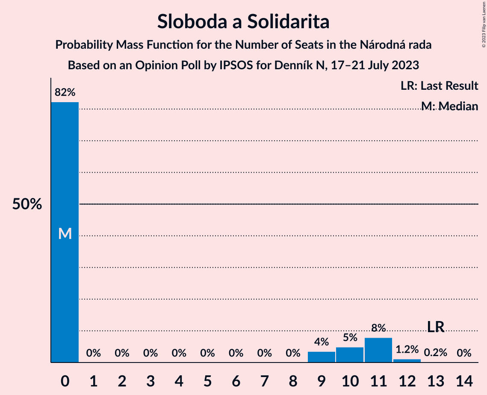

# Opinion Poll by IPSOS for Denník N, 17–21 July 2023

<a href="#voting-intentions">Voting Intentions</a> | <a href="#seats">Seats</a> | <a href="#coalitions">Coalitions</a> | <a href="#technical-information">Technical Information</a>

## Voting Intentions

### Confidence Intervals

| Party | Last Result | Poll Result | 80% Confidence Interval | 90% Confidence Interval | 95% Confidence Interval | 99% Confidence Interval |
|:-----:|:-----------:|:-----------:|:-----------------------:|:-----------------------:|:-----------------------:|:-----------------------:|
| SMER–sociálna demokracia | 18.3% | 19.4% | 17.9–21.1% |17.4–21.6% |17.1–22.0% |16.4–22.8% |
| Progresívne Slovensko | 7.0% | 15.9% | 14.5–17.5% |14.1–17.9% |13.8–18.3% |13.1–19.1% |
| HLAS–sociálna demokracia | 0.0% | 14.9% | 13.6–16.5% |13.2–16.9% |12.8–17.3% |12.2–18.0% |
| REPUBLIKA | 0.0% | 8.6% | 7.5–9.8% |7.2–10.2% |7.0–10.5% |6.5–11.1% |
| OBYČAJNÍ ĽUDIA a nezávislé osobnosti–Kresťanská únia–Za ľudí | 0.0% | 7.1% | 6.1–8.2% |5.9–8.5% |5.6–8.8% |5.2–9.4% |
| SME RODINA | 8.2% | 6.4% | 5.5–7.5% |5.2–7.8% |5.0–8.1% |4.6–8.6% |
| Kresťanskodemokratické hnutie | 4.6% | 5.9% | 5.0–6.9% |4.8–7.2% |4.6–7.5% |4.2–8.0% |
| Sloboda a Solidarita | 6.2% | 5.0% | 4.2–6.0% |4.0–6.2% |3.8–6.5% |3.4–7.0% |
| Slovenská národná strana | 3.2% | 5.0% | 4.2–6.0% |4.0–6.2% |3.8–6.5% |3.4–7.0% |
| Strana maďarskej koalície–Magyar Koalíció Pártja | 3.9% | 3.5% | 2.8–4.3% |2.7–4.6% |2.5–4.8% |2.2–5.3% |
| Kotleba–Ľudová strana Naše Slovensko | 8.0% | 2.6% | 2.0–3.4% |1.9–3.6% |1.8–3.8% |1.5–4.2% |
| SPOLU–Občianska Demokracia | 7.0% | 2.1% | 1.6–2.8% |1.5–3.0% |1.4–3.2% |1.2–3.6% |
| MODRÍ–Európske Slovensko–MOST–HÍD | 0.0% | 1.8% | 1.4–2.5% |1.2–2.7% |1.1–2.8% |1.0–3.2% |
| Magyar Fórum | 0.0% | 0.8% | 0.5–1.3% |0.5–1.4% |0.4–1.6% |0.3–1.8% |

*Note:* The poll result column reflects the actual value used in the calculations. Published results may vary slightly, and in addition be rounded to fewer digits.

## Seats

### Confidence Intervals

| Party | Last Result | Median | 80% Confidence Interval | 90% Confidence Interval | 95% Confidence Interval | 99% Confidence Interval |
|:-----:|:-----------:|:------:|:-----------------------:|:-----------------------:|:-----------------------:|:-----------------------:|
| <a href="#smer–sociálna-demokracia">SMER–sociálna demokracia</a> | 38 | 36 | 33–38 |32–38 |29–40 |28–43 |
| <a href="#progresívne-slovensko">Progresívne Slovensko</a> | 0 | 30 | 28–32 |27–32 |26–32 |24–34 |
| <a href="#hlas–sociálna-demokracia">HLAS–sociálna demokracia</a> | 0 | 29 | 25–30 |25–30 |24–30 |23–32 |
| <a href="#republika">REPUBLIKA</a> | 0 | 17 | 16–17 |15–18 |13–19 |12–22 |
| <a href="#obyčajní-ľudia-a-nezávislé-osobnosti–kresťanská-únia–za-ľudí">OBYČAJNÍ ĽUDIA a nezávislé osobnosti–Kresťanská únia–Za ľudí</a> | 0 | 12 | 10–14 |10–15 |10–16 |9–17 |
| <a href="#sme-rodina">SME RODINA</a> | 17 | 13 | 11–13 |10–13 |9–13 |0–15 |
| <a href="#kresťanskodemokratické-hnutie">Kresťanskodemokratické hnutie</a> | 0 | 10 | 9–11 |0–12 |0–13 |0–14 |
| <a href="#sloboda-a-solidarita">Sloboda a Solidarita</a> | 13 | 0 | 0–10 |0–11 |0–11 |0–12 |
| <a href="#slovenská-národná-strana">Slovenská národná strana</a> | 0 | 0 | 0–9 |0–9 |0–10 |0–11 |
| <a href="#strana-maďarskej-koalície–magyar-koalíció-pártja">Strana maďarskej koalície–Magyar Koalíció Pártja</a> | 0 | 0 | 0 |0 |0 |0 |
| <a href="#kotleba–ľudová-strana-naše-slovensko">Kotleba–Ľudová strana Naše Slovensko</a> | 17 | 0 | 0 |0 |0 |0 |
| <a href="#spolu–občianska-demokracia">SPOLU–Občianska Demokracia</a> | 0 | 0 | 0 |0 |0 |0 |
| <a href="#modrí–európske-slovensko–most–híd">MODRÍ–Európske Slovensko–MOST–HÍD</a> | 0 | 0 | 0 |0 |0 |0 |
| <a href="#magyar-fórum">Magyar Fórum</a> | 0 | 0 | 0 |0 |0 |0 |

### SMER–sociálna demokracia

*For a full overview of the results for this party, see the [SMER–sociálna demokracia](party-smer–sociálnademokracia.html) page.*

| Number of Seats | Probability | Accumulated | Special Marks |
|:---------------:|:-----------:|:-----------:|:-------------:|
| 28 | 2% | 100% |  |
| 29 | 0% | 98% |  |
| 30 | 0.7% | 97% |  |
| 31 | 0.4% | 97% |  |
| 32 | 1.4% | 96% |  |
| 33 | 8% | 95% |  |
| 34 | 3% | 87% |  |
| 35 | 31% | 84% |  |
| 36 | 5% | 53% | Median |
| 37 | 0.2% | 48% |  |
| 38 | 45% | 48% | Last Result |
| 39 | 0.2% | 3% |  |
| 40 | 2% | 3% |  |
| 41 | 0.1% | 1.0% |  |
| 42 | 0.3% | 0.9% |  |
| 43 | 0.4% | 0.6% |  |
| 44 | 0% | 0.2% |  |
| 45 | 0.2% | 0.2% |  |
| 46 | 0% | 0% |  |

### Progresívne Slovensko

*For a full overview of the results for this party, see the [Progresívne Slovensko](party-progresívneslovensko.html) page.*

| Number of Seats | Probability | Accumulated | Special Marks |
|:---------------:|:-----------:|:-----------:|:-------------:|
| 0 | 0% | 100% | Last Result |
| 1 | 0% | 100% |  |
| 2 | 0% | 100% |  |
| 3 | 0% | 100% |  |
| 4 | 0% | 100% |  |
| 5 | 0% | 100% |  |
| 6 | 0% | 100% |  |
| 7 | 0% | 100% |  |
| 8 | 0% | 100% |  |
| 9 | 0% | 100% |  |
| 10 | 0% | 100% |  |
| 11 | 0% | 100% |  |
| 12 | 0% | 100% |  |
| 13 | 0% | 100% |  |
| 14 | 0% | 100% |  |
| 15 | 0% | 100% |  |
| 16 | 0% | 100% |  |
| 17 | 0% | 100% |  |
| 18 | 0% | 100% |  |
| 19 | 0% | 100% |  |
| 20 | 0% | 100% |  |
| 21 | 0% | 100% |  |
| 22 | 0% | 100% |  |
| 23 | 0.1% | 100% |  |
| 24 | 0.8% | 99.9% |  |
| 25 | 1.3% | 99.1% |  |
| 26 | 1.2% | 98% |  |
| 27 | 2% | 96% |  |
| 28 | 9% | 95% |  |
| 29 | 5% | 86% |  |
| 30 | 46% | 81% | Median |
| 31 | 3% | 35% |  |
| 32 | 31% | 32% |  |
| 33 | 0.3% | 0.9% |  |
| 34 | 0.3% | 0.6% |  |
| 35 | 0% | 0.3% |  |
| 36 | 0% | 0.3% |  |
| 37 | 0.2% | 0.2% |  |
| 38 | 0% | 0% |  |

### HLAS–sociálna demokracia

*For a full overview of the results for this party, see the [HLAS–sociálna demokracia](party-hlas–sociálnademokracia.html) page.*

| Number of Seats | Probability | Accumulated | Special Marks |
|:---------------:|:-----------:|:-----------:|:-------------:|
| 0 | 0% | 100% | Last Result |
| 1 | 0% | 100% |  |
| 2 | 0% | 100% |  |
| 3 | 0% | 100% |  |
| 4 | 0% | 100% |  |
| 5 | 0% | 100% |  |
| 6 | 0% | 100% |  |
| 7 | 0% | 100% |  |
| 8 | 0% | 100% |  |
| 9 | 0% | 100% |  |
| 10 | 0% | 100% |  |
| 11 | 0% | 100% |  |
| 12 | 0% | 100% |  |
| 13 | 0% | 100% |  |
| 14 | 0% | 100% |  |
| 15 | 0% | 100% |  |
| 16 | 0% | 100% |  |
| 17 | 0% | 100% |  |
| 18 | 0% | 100% |  |
| 19 | 0% | 100% |  |
| 20 | 0.1% | 100% |  |
| 21 | 0.3% | 99.9% |  |
| 22 | 0.1% | 99.6% |  |
| 23 | 2% | 99.6% |  |
| 24 | 0.8% | 98% |  |
| 25 | 31% | 97% |  |
| 26 | 2% | 66% |  |
| 27 | 3% | 64% |  |
| 28 | 3% | 61% |  |
| 29 | 10% | 57% | Median |
| 30 | 45% | 47% |  |
| 31 | 2% | 2% |  |
| 32 | 0.6% | 0.8% |  |
| 33 | 0.1% | 0.2% |  |
| 34 | 0.1% | 0.2% |  |
| 35 | 0.1% | 0.1% |  |
| 36 | 0% | 0% |  |

### REPUBLIKA

*For a full overview of the results for this party, see the [REPUBLIKA](party-republika.html) page.*

| Number of Seats | Probability | Accumulated | Special Marks |
|:---------------:|:-----------:|:-----------:|:-------------:|
| 0 | 0% | 100% | Last Result |
| 1 | 0% | 100% |  |
| 2 | 0% | 100% |  |
| 3 | 0% | 100% |  |
| 4 | 0% | 100% |  |
| 5 | 0% | 100% |  |
| 6 | 0% | 100% |  |
| 7 | 0% | 100% |  |
| 8 | 0% | 100% |  |
| 9 | 0% | 100% |  |
| 10 | 0% | 100% |  |
| 11 | 0% | 100% |  |
| 12 | 2% | 100% |  |
| 13 | 1.1% | 98% |  |
| 14 | 1.5% | 97% |  |
| 15 | 3% | 96% |  |
| 16 | 12% | 93% |  |
| 17 | 76% | 82% | Median |
| 18 | 3% | 6% |  |
| 19 | 0.7% | 3% |  |
| 20 | 0.2% | 2% |  |
| 21 | 0.3% | 2% |  |
| 22 | 1.5% | 1.5% |  |
| 23 | 0% | 0% |  |

### OBYČAJNÍ ĽUDIA a nezávislé osobnosti–Kresťanská únia–Za ľudí

*For a full overview of the results for this party, see the [OBYČAJNÍ ĽUDIA a nezávislé osobnosti–Kresťanská únia–Za ľudí](party-obyčajníľudiaanezávisléosobnosti–kresťanskáúnia–zaľudí.html) page.*

| Number of Seats | Probability | Accumulated | Special Marks |
|:---------------:|:-----------:|:-----------:|:-------------:|
| 0 | 0% | 100% | Last Result |
| 1 | 0% | 100% |  |
| 2 | 0% | 100% |  |
| 3 | 0% | 100% |  |
| 4 | 0% | 100% |  |
| 5 | 0% | 100% |  |
| 6 | 0% | 100% |  |
| 7 | 0% | 100% |  |
| 8 | 0% | 100% |  |
| 9 | 0.9% | 100% |  |
| 10 | 31% | 99.1% |  |
| 11 | 1.3% | 68% |  |
| 12 | 47% | 67% | Median |
| 13 | 9% | 19% |  |
| 14 | 5% | 10% |  |
| 15 | 2% | 6% |  |
| 16 | 3% | 4% |  |
| 17 | 1.0% | 1.2% |  |
| 18 | 0.2% | 0.2% |  |
| 19 | 0% | 0% |  |

### SME RODINA

*For a full overview of the results for this party, see the [SME RODINA](party-smerodina.html) page.*

| Number of Seats | Probability | Accumulated | Special Marks |
|:---------------:|:-----------:|:-----------:|:-------------:|
| 0 | 1.1% | 100% |  |
| 1 | 0% | 98.9% |  |
| 2 | 0% | 98.9% |  |
| 3 | 0% | 98.9% |  |
| 4 | 0% | 98.9% |  |
| 5 | 0% | 98.9% |  |
| 6 | 0% | 98.9% |  |
| 7 | 0% | 98.9% |  |
| 8 | 0% | 98.9% |  |
| 9 | 2% | 98.9% |  |
| 10 | 3% | 96% |  |
| 11 | 11% | 93% |  |
| 12 | 4% | 82% |  |
| 13 | 77% | 79% | Median |
| 14 | 0.6% | 1.2% |  |
| 15 | 0.3% | 0.6% |  |
| 16 | 0.2% | 0.3% |  |
| 17 | 0% | 0.1% | Last Result |
| 18 | 0% | 0% |  |

### Kresťanskodemokratické hnutie

*For a full overview of the results for this party, see the [Kresťanskodemokratické hnutie](party-kresťanskodemokratickéhnutie.html) page.*

| Number of Seats | Probability | Accumulated | Special Marks |
|:---------------:|:-----------:|:-----------:|:-------------:|
| 0 | 8% | 100% | Last Result |
| 1 | 0% | 92% |  |
| 2 | 0% | 92% |  |
| 3 | 0% | 92% |  |
| 4 | 0% | 92% |  |
| 5 | 0% | 92% |  |
| 6 | 0% | 92% |  |
| 7 | 0% | 92% |  |
| 8 | 0% | 92% |  |
| 9 | 32% | 92% |  |
| 10 | 47% | 60% | Median |
| 11 | 7% | 13% |  |
| 12 | 3% | 6% |  |
| 13 | 2% | 3% |  |
| 14 | 0.5% | 0.6% |  |
| 15 | 0% | 0.1% |  |
| 16 | 0% | 0% |  |

### Sloboda a Solidarita

*For a full overview of the results for this party, see the [Sloboda a Solidarita](party-slobodaasolidarita.html) page.*

| Number of Seats | Probability | Accumulated | Special Marks |
|:---------------:|:-----------:|:-----------:|:-------------:|
| 0 | 82% | 100% | Median |
| 1 | 0% | 18% |  |
| 2 | 0% | 18% |  |
| 3 | 0% | 18% |  |
| 4 | 0% | 18% |  |
| 5 | 0% | 18% |  |
| 6 | 0% | 18% |  |
| 7 | 0% | 18% |  |
| 8 | 0% | 18% |  |
| 9 | 4% | 18% |  |
| 10 | 5% | 14% |  |
| 11 | 8% | 9% |  |
| 12 | 1.2% | 1.3% |  |
| 13 | 0.2% | 0.2% | Last Result |
| 14 | 0% | 0% |  |

### Slovenská národná strana

*For a full overview of the results for this party, see the [Slovenská národná strana](party-slovenskánárodnástrana.html) page.*

| Number of Seats | Probability | Accumulated | Special Marks |
|:---------------:|:-----------:|:-----------:|:-------------:|
| 0 | 58% | 100% | Last Result, Median |
| 1 | 0% | 42% |  |
| 2 | 0% | 42% |  |
| 3 | 0% | 42% |  |
| 4 | 0% | 42% |  |
| 5 | 0% | 42% |  |
| 6 | 0% | 42% |  |
| 7 | 0% | 42% |  |
| 8 | 0% | 42% |  |
| 9 | 38% | 42% |  |
| 10 | 2% | 3% |  |
| 11 | 0.8% | 1.0% |  |
| 12 | 0.1% | 0.2% |  |
| 13 | 0.1% | 0.1% |  |
| 14 | 0% | 0% |  |

### Strana maďarskej koalície–Magyar Koalíció Pártja

*For a full overview of the results for this party, see the [Strana maďarskej koalície–Magyar Koalíció Pártja](party-stranamaďarskejkoalície–magyarkoalíciópártja.html) page.*

| Number of Seats | Probability | Accumulated | Special Marks |
|:---------------:|:-----------:|:-----------:|:-------------:|
| 0 | 99.8% | 100% | Last Result, Median |
| 1 | 0% | 0.2% |  |
| 2 | 0% | 0.2% |  |
| 3 | 0% | 0.2% |  |
| 4 | 0% | 0.2% |  |
| 5 | 0% | 0.2% |  |
| 6 | 0% | 0.2% |  |
| 7 | 0% | 0.2% |  |
| 8 | 0% | 0.2% |  |
| 9 | 0.1% | 0.2% |  |
| 10 | 0% | 0% |  |

### Kotleba–Ľudová strana Naše Slovensko

*For a full overview of the results for this party, see the [Kotleba–Ľudová strana Naše Slovensko](party-kotleba–ľudovástrananašeslovensko.html) page.*

| Number of Seats | Probability | Accumulated | Special Marks |
|:---------------:|:-----------:|:-----------:|:-------------:|
| 0 | 100% | 100% | Median |
| 1 | 0% | 0% |  |
| 2 | 0% | 0% |  |
| 3 | 0% | 0% |  |
| 4 | 0% | 0% |  |
| 5 | 0% | 0% |  |
| 6 | 0% | 0% |  |
| 7 | 0% | 0% |  |
| 8 | 0% | 0% |  |
| 9 | 0% | 0% |  |
| 10 | 0% | 0% |  |
| 11 | 0% | 0% |  |
| 12 | 0% | 0% |  |
| 13 | 0% | 0% |  |
| 14 | 0% | 0% |  |
| 15 | 0% | 0% |  |
| 16 | 0% | 0% |  |
| 17 | 0% | 0% | Last Result |

### SPOLU–Občianska Demokracia

*For a full overview of the results for this party, see the [SPOLU–Občianska Demokracia](party-spolu–občianskademokracia.html) page.*

| Number of Seats | Probability | Accumulated | Special Marks |
|:---------------:|:-----------:|:-----------:|:-------------:|
| 0 | 100% | 100% | Last Result, Median |

### MODRÍ–Európske Slovensko–MOST–HÍD

*For a full overview of the results for this party, see the [MODRÍ–Európske Slovensko–MOST–HÍD](party-modrí–európskeslovensko–most–híd.html) page.*

| Number of Seats | Probability | Accumulated | Special Marks |
|:---------------:|:-----------:|:-----------:|:-------------:|
| 0 | 100% | 100% | Last Result, Median |

### Magyar Fórum

*For a full overview of the results for this party, see the [Magyar Fórum](party-magyarfórum.html) page.*

| Number of Seats | Probability | Accumulated | Special Marks |
|:---------------:|:-----------:|:-----------:|:-------------:|
| 0 | 100% | 100% | Last Result, Median |

## Coalitions

### Confidence Intervals

| Coalition | Last Result | Median | Majority? | 80% Confidence Interval | 90% Confidence Interval | 95% Confidence Interval | 99% Confidence Interval |
|:---------:|:-----------:|:------:|:---------:|:-----------------------:|:-----------------------:|:-----------------------:|:-----------------------:|
| SMER–sociálna demokracia – HLAS–sociálna demokracia – SME RODINA – Slovenská národná strana – Kotleba–Ľudová strana Naše Slovensko | 72 | 81 | 90% | 76–82 | 68–82 | 67–83 | 66–87 |
| SMER–sociálna demokracia – HLAS–sociálna demokracia – SME RODINA – Slovenská národná strana | 55 | 81 | 90% | 76–82 | 68–82 | 67–83 | 66–87 |
| SMER–sociálna demokracia – HLAS–sociálna demokracia – SME RODINA | 55 | 75 | 50% | 73–81 | 67–81 | 67–81 | 65–82 |
| SMER–sociálna demokracia – HLAS–sociálna demokracia – Slovenská národná strana | 38 | 68 | 0.9% | 65–70 | 59–71 | 56–73 | 55–78 |
| SMER–sociálna demokracia – SME RODINA – Slovenská národná strana – Kotleba–Ľudová strana Naše Slovensko | 72 | 51 | 0% | 48–57 | 44–57 | 40–57 | 39–59 |
| SMER–sociálna demokracia – SME RODINA – Slovenská národná strana | 55 | 51 | 0% | 48–57 | 44–57 | 40–57 | 39–59 |
| SMER–sociálna demokracia – SME RODINA | 55 | 48 | 0% | 44–51 | 43–51 | 39–51 | 39–54 |
| HLAS–sociálna demokracia – SME RODINA – Slovenská národná strana – Kotleba–Ľudová strana Naše Slovensko | 34 | 43 | 0% | 40–48 | 38–49 | 33–49 | 30–52 |
| HLAS–sociálna demokracia – SME RODINA – Slovenská národná strana | 17 | 43 | 0% | 40–48 | 38–49 | 33–49 | 30–52 |
| SMER–sociálna demokracia – Slovenská národná strana | 38 | 38 | 0% | 36–44 | 34–44 | 30–45 | 28–46 |
| HLAS–sociálna demokracia – SME RODINA | 17 | 40 | 0% | 38–43 | 37–43 | 33–43 | 29–45 |
| SMER–sociálna demokracia | 38 | 36 | 0% | 33–38 | 32–38 | 29–40 | 28–43 |
| HLAS–sociálna demokracia – Slovenská národná strana | 0 | 30 | 0% | 29–36 | 27–38 | 25–38 | 23–41 |

### SMER–sociálna demokracia – HLAS–sociálna demokracia – SME RODINA – Slovenská národná strana – Kotleba–Ľudová strana Naše Slovensko

| Number of Seats | Probability | Accumulated | Special Marks |
|:---------------:|:-----------:|:-----------:|:-------------:|
| 65 | 0.2% | 100% |  |
| 66 | 0.4% | 99.7% |  |
| 67 | 4% | 99.3% |  |
| 68 | 0.5% | 95% |  |
| 69 | 0% | 95% |  |
| 70 | 1.5% | 95% |  |
| 71 | 0.1% | 93% |  |
| 72 | 0.2% | 93% | Last Result |
| 73 | 0.2% | 93% |  |
| 74 | 2% | 93% |  |
| 75 | 1.4% | 91% |  |
| 76 | 0.4% | 90% | Majority |
| 77 | 2% | 90% |  |
| 78 | 1.0% | 88% | Median |
| 79 | 0.1% | 87% |  |
| 80 | 0.2% | 87% |  |
| 81 | 45% | 86% |  |
| 82 | 39% | 42% |  |
| 83 | 0.6% | 3% |  |
| 84 | 2% | 2% |  |
| 85 | 0.1% | 0.7% |  |
| 86 | 0% | 0.6% |  |
| 87 | 0% | 0.5% |  |
| 88 | 0% | 0.5% |  |
| 89 | 0% | 0.5% |  |
| 90 | 0.1% | 0.5% |  |
| 91 | 0.3% | 0.4% |  |
| 92 | 0.1% | 0.1% |  |
| 93 | 0% | 0% |  |

### SMER–sociálna demokracia – HLAS–sociálna demokracia – SME RODINA – Slovenská národná strana

| Number of Seats | Probability | Accumulated | Special Marks |
|:---------------:|:-----------:|:-----------:|:-------------:|
| 55 | 0% | 100% | Last Result |
| 56 | 0% | 100% |  |
| 57 | 0% | 100% |  |
| 58 | 0% | 100% |  |
| 59 | 0% | 100% |  |
| 60 | 0% | 100% |  |
| 61 | 0% | 100% |  |
| 62 | 0% | 100% |  |
| 63 | 0% | 100% |  |
| 64 | 0% | 100% |  |
| 65 | 0.2% | 100% |  |
| 66 | 0.4% | 99.7% |  |
| 67 | 4% | 99.3% |  |
| 68 | 0.5% | 95% |  |
| 69 | 0% | 95% |  |
| 70 | 1.5% | 95% |  |
| 71 | 0.1% | 93% |  |
| 72 | 0.2% | 93% |  |
| 73 | 0.2% | 93% |  |
| 74 | 2% | 93% |  |
| 75 | 1.4% | 91% |  |
| 76 | 0.4% | 90% | Majority |
| 77 | 2% | 90% |  |
| 78 | 1.0% | 88% | Median |
| 79 | 0.1% | 87% |  |
| 80 | 0.2% | 87% |  |
| 81 | 45% | 86% |  |
| 82 | 39% | 42% |  |
| 83 | 0.6% | 3% |  |
| 84 | 2% | 2% |  |
| 85 | 0.1% | 0.7% |  |
| 86 | 0% | 0.6% |  |
| 87 | 0% | 0.5% |  |
| 88 | 0% | 0.5% |  |
| 89 | 0% | 0.5% |  |
| 90 | 0.1% | 0.5% |  |
| 91 | 0.3% | 0.4% |  |
| 92 | 0.1% | 0.1% |  |
| 93 | 0% | 0% |  |

### SMER–sociálna demokracia – HLAS–sociálna demokracia – SME RODINA

| Number of Seats | Probability | Accumulated | Special Marks |
|:---------------:|:-----------:|:-----------:|:-------------:|
| 55 | 0% | 100% | Last Result |
| 56 | 0% | 100% |  |
| 57 | 0% | 100% |  |
| 58 | 0% | 100% |  |
| 59 | 0% | 100% |  |
| 60 | 0% | 100% |  |
| 61 | 0.2% | 100% |  |
| 62 | 0% | 99.8% |  |
| 63 | 0.1% | 99.8% |  |
| 64 | 0% | 99.7% |  |
| 65 | 0.9% | 99.7% |  |
| 66 | 0.6% | 98.8% |  |
| 67 | 4% | 98% |  |
| 68 | 0.7% | 94% |  |
| 69 | 0.1% | 94% |  |
| 70 | 1.5% | 93% |  |
| 71 | 0.3% | 92% |  |
| 72 | 0.6% | 92% |  |
| 73 | 38% | 91% |  |
| 74 | 2% | 53% |  |
| 75 | 1.3% | 51% |  |
| 76 | 0.4% | 50% | Majority |
| 77 | 2% | 49% |  |
| 78 | 0.8% | 48% | Median |
| 79 | 0.2% | 47% |  |
| 80 | 0.1% | 47% |  |
| 81 | 45% | 46% |  |
| 82 | 1.2% | 2% |  |
| 83 | 0.2% | 0.5% |  |
| 84 | 0.3% | 0.3% |  |
| 85 | 0% | 0% |  |

### SMER–sociálna demokracia – HLAS–sociálna demokracia – Slovenská národná strana

| Number of Seats | Probability | Accumulated | Special Marks |
|:---------------:|:-----------:|:-----------:|:-------------:|
| 38 | 0% | 100% | Last Result |
| 39 | 0% | 100% |  |
| 40 | 0% | 100% |  |
| 41 | 0% | 100% |  |
| 42 | 0% | 100% |  |
| 43 | 0% | 100% |  |
| 44 | 0% | 100% |  |
| 45 | 0% | 100% |  |
| 46 | 0% | 100% |  |
| 47 | 0% | 100% |  |
| 48 | 0% | 100% |  |
| 49 | 0% | 100% |  |
| 50 | 0% | 100% |  |
| 51 | 0% | 100% |  |
| 52 | 0% | 100% |  |
| 53 | 0% | 100% |  |
| 54 | 0.2% | 100% |  |
| 55 | 0.4% | 99.8% |  |
| 56 | 2% | 99.3% |  |
| 57 | 2% | 97% |  |
| 58 | 0.1% | 95% |  |
| 59 | 1.1% | 95% |  |
| 60 | 0.4% | 94% |  |
| 61 | 1.2% | 94% |  |
| 62 | 0.2% | 93% |  |
| 63 | 0.3% | 93% |  |
| 64 | 0.2% | 92% |  |
| 65 | 3% | 92% | Median |
| 66 | 1.0% | 89% |  |
| 67 | 0.2% | 88% |  |
| 68 | 45% | 88% |  |
| 69 | 32% | 43% |  |
| 70 | 2% | 11% |  |
| 71 | 6% | 9% |  |
| 72 | 0.3% | 3% |  |
| 73 | 0.1% | 3% |  |
| 74 | 0% | 2% |  |
| 75 | 2% | 2% |  |
| 76 | 0.2% | 0.9% | Majority |
| 77 | 0% | 0.7% |  |
| 78 | 0.5% | 0.6% |  |
| 79 | 0.1% | 0.1% |  |
| 80 | 0% | 0% |  |

### SMER–sociálna demokracia – SME RODINA – Slovenská národná strana – Kotleba–Ľudová strana Naše Slovensko

| Number of Seats | Probability | Accumulated | Special Marks |
|:---------------:|:-----------:|:-----------:|:-------------:|
| 39 | 2% | 100% |  |
| 40 | 0.7% | 98% |  |
| 41 | 0.5% | 97% |  |
| 42 | 0% | 96% |  |
| 43 | 0.7% | 96% |  |
| 44 | 2% | 96% |  |
| 45 | 0.5% | 94% |  |
| 46 | 1.3% | 93% |  |
| 47 | 0.9% | 92% |  |
| 48 | 2% | 91% |  |
| 49 | 0.8% | 89% | Median |
| 50 | 0.7% | 88% |  |
| 51 | 45% | 87% |  |
| 52 | 0.9% | 42% |  |
| 53 | 7% | 41% |  |
| 54 | 0.5% | 35% |  |
| 55 | 2% | 34% |  |
| 56 | 0.5% | 32% |  |
| 57 | 31% | 31% |  |
| 58 | 0.1% | 0.7% |  |
| 59 | 0.3% | 0.6% |  |
| 60 | 0% | 0.3% |  |
| 61 | 0% | 0.3% |  |
| 62 | 0.1% | 0.3% |  |
| 63 | 0.1% | 0.2% |  |
| 64 | 0% | 0.1% |  |
| 65 | 0% | 0.1% |  |
| 66 | 0.1% | 0.1% |  |
| 67 | 0% | 0% |  |
| 68 | 0% | 0% |  |
| 69 | 0% | 0% |  |
| 70 | 0% | 0% |  |
| 71 | 0% | 0% |  |
| 72 | 0% | 0% | Last Result |

### SMER–sociálna demokracia – SME RODINA – Slovenská národná strana

| Number of Seats | Probability | Accumulated | Special Marks |
|:---------------:|:-----------:|:-----------:|:-------------:|
| 39 | 2% | 100% |  |
| 40 | 0.7% | 98% |  |
| 41 | 0.5% | 97% |  |
| 42 | 0% | 96% |  |
| 43 | 0.7% | 96% |  |
| 44 | 2% | 96% |  |
| 45 | 0.5% | 94% |  |
| 46 | 1.3% | 93% |  |
| 47 | 0.9% | 92% |  |
| 48 | 2% | 91% |  |
| 49 | 0.8% | 89% | Median |
| 50 | 0.7% | 88% |  |
| 51 | 45% | 87% |  |
| 52 | 0.9% | 42% |  |
| 53 | 7% | 41% |  |
| 54 | 0.5% | 35% |  |
| 55 | 2% | 34% | Last Result |
| 56 | 0.5% | 32% |  |
| 57 | 31% | 31% |  |
| 58 | 0.1% | 0.7% |  |
| 59 | 0.3% | 0.6% |  |
| 60 | 0% | 0.3% |  |
| 61 | 0% | 0.3% |  |
| 62 | 0.1% | 0.3% |  |
| 63 | 0.1% | 0.2% |  |
| 64 | 0% | 0.1% |  |
| 65 | 0% | 0.1% |  |
| 66 | 0.1% | 0.1% |  |
| 67 | 0% | 0% |  |

### SMER–sociálna demokracia – SME RODINA

| Number of Seats | Probability | Accumulated | Special Marks |
|:---------------:|:-----------:|:-----------:|:-------------:|
| 31 | 0.2% | 100% |  |
| 32 | 0% | 99.8% |  |
| 33 | 0% | 99.8% |  |
| 34 | 0% | 99.8% |  |
| 35 | 0.1% | 99.8% |  |
| 36 | 0.1% | 99.7% |  |
| 37 | 0% | 99.6% |  |
| 38 | 0% | 99.6% |  |
| 39 | 2% | 99.6% |  |
| 40 | 0.8% | 97% |  |
| 41 | 1.0% | 96% |  |
| 42 | 0.2% | 95% |  |
| 43 | 0.8% | 95% |  |
| 44 | 9% | 94% |  |
| 45 | 2% | 86% |  |
| 46 | 2% | 84% |  |
| 47 | 1.0% | 81% |  |
| 48 | 32% | 80% |  |
| 49 | 0.9% | 48% | Median |
| 50 | 0.1% | 47% |  |
| 51 | 45% | 47% |  |
| 52 | 0.9% | 2% |  |
| 53 | 0.2% | 1.0% |  |
| 54 | 0.4% | 0.8% |  |
| 55 | 0.1% | 0.4% | Last Result |
| 56 | 0.3% | 0.3% |  |
| 57 | 0% | 0% |  |

### HLAS–sociálna demokracia – SME RODINA – Slovenská národná strana – Kotleba–Ľudová strana Naše Slovensko

| Number of Seats | Probability | Accumulated | Special Marks |
|:---------------:|:-----------:|:-----------:|:-------------:|
| 28 | 0.5% | 100% |  |
| 29 | 0% | 99.5% |  |
| 30 | 0.2% | 99.5% |  |
| 31 | 0.2% | 99.3% |  |
| 32 | 0% | 99.1% |  |
| 33 | 2% | 99.1% |  |
| 34 | 0% | 97% | Last Result |
| 35 | 0% | 97% |  |
| 36 | 0.8% | 97% |  |
| 37 | 0.8% | 97% |  |
| 38 | 2% | 96% |  |
| 39 | 4% | 94% |  |
| 40 | 0.9% | 90% |  |
| 41 | 2% | 89% |  |
| 42 | 0.9% | 88% | Median |
| 43 | 44% | 87% |  |
| 44 | 2% | 43% |  |
| 45 | 0.3% | 41% |  |
| 46 | 0.2% | 41% |  |
| 47 | 30% | 41% |  |
| 48 | 2% | 10% |  |
| 49 | 6% | 8% |  |
| 50 | 0.6% | 1.2% |  |
| 51 | 0% | 0.6% |  |
| 52 | 0.1% | 0.5% |  |
| 53 | 0.1% | 0.4% |  |
| 54 | 0.1% | 0.3% |  |
| 55 | 0.3% | 0.3% |  |
| 56 | 0% | 0% |  |

### HLAS–sociálna demokracia – SME RODINA – Slovenská národná strana

| Number of Seats | Probability | Accumulated | Special Marks |
|:---------------:|:-----------:|:-----------:|:-------------:|
| 17 | 0% | 100% | Last Result |
| 18 | 0% | 100% |  |
| 19 | 0% | 100% |  |
| 20 | 0% | 100% |  |
| 21 | 0% | 100% |  |
| 22 | 0% | 100% |  |
| 23 | 0% | 100% |  |
| 24 | 0% | 100% |  |
| 25 | 0% | 100% |  |
| 26 | 0% | 100% |  |
| 27 | 0% | 100% |  |
| 28 | 0.5% | 100% |  |
| 29 | 0% | 99.5% |  |
| 30 | 0.2% | 99.5% |  |
| 31 | 0.2% | 99.3% |  |
| 32 | 0% | 99.1% |  |
| 33 | 2% | 99.1% |  |
| 34 | 0% | 97% |  |
| 35 | 0% | 97% |  |
| 36 | 0.8% | 97% |  |
| 37 | 0.8% | 97% |  |
| 38 | 2% | 96% |  |
| 39 | 4% | 94% |  |
| 40 | 0.9% | 90% |  |
| 41 | 2% | 89% |  |
| 42 | 0.9% | 88% | Median |
| 43 | 44% | 87% |  |
| 44 | 2% | 43% |  |
| 45 | 0.3% | 41% |  |
| 46 | 0.2% | 41% |  |
| 47 | 30% | 41% |  |
| 48 | 2% | 10% |  |
| 49 | 6% | 8% |  |
| 50 | 0.6% | 1.2% |  |
| 51 | 0% | 0.6% |  |
| 52 | 0.1% | 0.5% |  |
| 53 | 0.1% | 0.4% |  |
| 54 | 0.1% | 0.3% |  |
| 55 | 0.3% | 0.3% |  |
| 56 | 0% | 0% |  |

### SMER–sociálna demokracia – Slovenská národná strana

| Number of Seats | Probability | Accumulated | Special Marks |
|:---------------:|:-----------:|:-----------:|:-------------:|
| 28 | 2% | 100% |  |
| 29 | 0% | 98% |  |
| 30 | 0.5% | 98% |  |
| 31 | 0.1% | 97% |  |
| 32 | 0.6% | 97% |  |
| 33 | 0.8% | 96% |  |
| 34 | 3% | 96% |  |
| 35 | 0.3% | 93% |  |
| 36 | 3% | 93% | Median |
| 37 | 0.1% | 90% |  |
| 38 | 45% | 90% | Last Result |
| 39 | 0.3% | 44% |  |
| 40 | 2% | 44% |  |
| 41 | 0.8% | 42% |  |
| 42 | 7% | 41% |  |
| 43 | 1.1% | 35% |  |
| 44 | 31% | 34% |  |
| 45 | 0.4% | 3% |  |
| 46 | 2% | 2% |  |
| 47 | 0.1% | 0.4% |  |
| 48 | 0.1% | 0.3% |  |
| 49 | 0% | 0.2% |  |
| 50 | 0% | 0.1% |  |
| 51 | 0.1% | 0.1% |  |
| 52 | 0% | 0.1% |  |
| 53 | 0% | 0.1% |  |
| 54 | 0.1% | 0.1% |  |
| 55 | 0% | 0% |  |

### HLAS–sociálna demokracia – SME RODINA

| Number of Seats | Probability | Accumulated | Special Marks |
|:---------------:|:-----------:|:-----------:|:-------------:|
| 17 | 0% | 100% | Last Result |
| 18 | 0% | 100% |  |
| 19 | 0% | 100% |  |
| 20 | 0% | 100% |  |
| 21 | 0% | 100% |  |
| 22 | 0% | 100% |  |
| 23 | 0% | 100% |  |
| 24 | 0% | 100% |  |
| 25 | 0% | 100% |  |
| 26 | 0% | 100% |  |
| 27 | 0% | 100% |  |
| 28 | 0.5% | 100% |  |
| 29 | 0% | 99.5% |  |
| 30 | 0.4% | 99.5% |  |
| 31 | 0.3% | 99.1% |  |
| 32 | 0.1% | 98.8% |  |
| 33 | 2% | 98.7% |  |
| 34 | 0.1% | 96% |  |
| 35 | 0.2% | 96% |  |
| 36 | 0.9% | 96% |  |
| 37 | 1.0% | 95% |  |
| 38 | 34% | 94% |  |
| 39 | 5% | 60% |  |
| 40 | 7% | 56% |  |
| 41 | 2% | 48% |  |
| 42 | 0.3% | 47% | Median |
| 43 | 44% | 46% |  |
| 44 | 1.4% | 2% |  |
| 45 | 0.5% | 0.8% |  |
| 46 | 0.1% | 0.2% |  |
| 47 | 0% | 0.1% |  |
| 48 | 0% | 0.1% |  |
| 49 | 0.1% | 0.1% |  |
| 50 | 0% | 0% |  |

### SMER–sociálna demokracia

| Number of Seats | Probability | Accumulated | Special Marks |
|:---------------:|:-----------:|:-----------:|:-------------:|
| 28 | 2% | 100% |  |
| 29 | 0% | 98% |  |
| 30 | 0.7% | 97% |  |
| 31 | 0.4% | 97% |  |
| 32 | 1.4% | 96% |  |
| 33 | 8% | 95% |  |
| 34 | 3% | 87% |  |
| 35 | 31% | 84% |  |
| 36 | 5% | 53% | Median |
| 37 | 0.2% | 48% |  |
| 38 | 45% | 48% | Last Result |
| 39 | 0.2% | 3% |  |
| 40 | 2% | 3% |  |
| 41 | 0.1% | 1.0% |  |
| 42 | 0.3% | 0.9% |  |
| 43 | 0.4% | 0.6% |  |
| 44 | 0% | 0.2% |  |
| 45 | 0.2% | 0.2% |  |
| 46 | 0% | 0% |  |

### HLAS–sociálna demokracia – Slovenská národná strana

| Number of Seats | Probability | Accumulated | Special Marks |
|:---------------:|:-----------:|:-----------:|:-------------:|
| 0 | 0% | 100% | Last Result |
| 1 | 0% | 100% |  |
| 2 | 0% | 100% |  |
| 3 | 0% | 100% |  |
| 4 | 0% | 100% |  |
| 5 | 0% | 100% |  |
| 6 | 0% | 100% |  |
| 7 | 0% | 100% |  |
| 8 | 0% | 100% |  |
| 9 | 0% | 100% |  |
| 10 | 0% | 100% |  |
| 11 | 0% | 100% |  |
| 12 | 0% | 100% |  |
| 13 | 0% | 100% |  |
| 14 | 0% | 100% |  |
| 15 | 0% | 100% |  |
| 16 | 0% | 100% |  |
| 17 | 0% | 100% |  |
| 18 | 0% | 100% |  |
| 19 | 0% | 100% |  |
| 20 | 0% | 100% |  |
| 21 | 0.2% | 100% |  |
| 22 | 0% | 99.8% |  |
| 23 | 2% | 99.8% |  |
| 24 | 0.1% | 98% |  |
| 25 | 0.6% | 98% |  |
| 26 | 2% | 97% |  |
| 27 | 2% | 96% |  |
| 28 | 3% | 94% |  |
| 29 | 3% | 91% | Median |
| 30 | 44% | 88% |  |
| 31 | 1.5% | 44% |  |
| 32 | 0.3% | 42% |  |
| 33 | 0.7% | 42% |  |
| 34 | 31% | 41% |  |
| 35 | 0.2% | 11% |  |
| 36 | 1.0% | 10% |  |
| 37 | 0.5% | 9% |  |
| 38 | 7% | 9% |  |
| 39 | 2% | 2% |  |
| 40 | 0.2% | 0.7% |  |
| 41 | 0.1% | 0.6% |  |
| 42 | 0.4% | 0.5% |  |
| 43 | 0% | 0.1% |  |
| 44 | 0.1% | 0.1% |  |
| 45 | 0% | 0% |  |

## Technical Information

### Opinion Poll

+ **Polling firm:** IPSOS
+ **Commissioner(s):** Denník N
+ **Fieldwork period:** 17–21 July 2023

### Calculations

+ **Sample size:** 1005
+ **Simulations done:** 1,048,576
+ **Error estimate:** 1.77%

