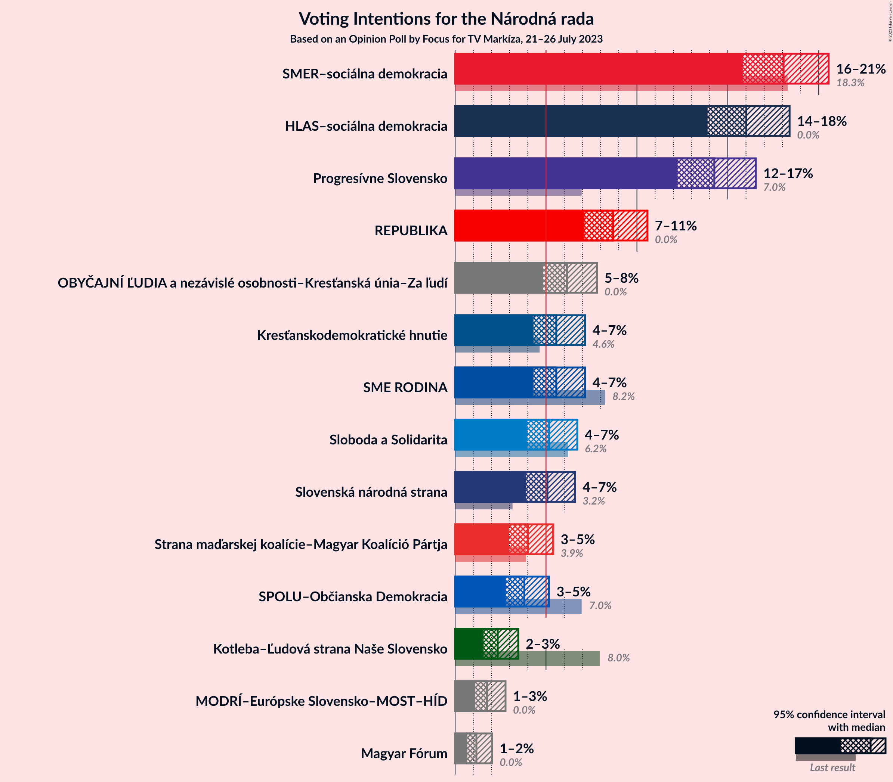
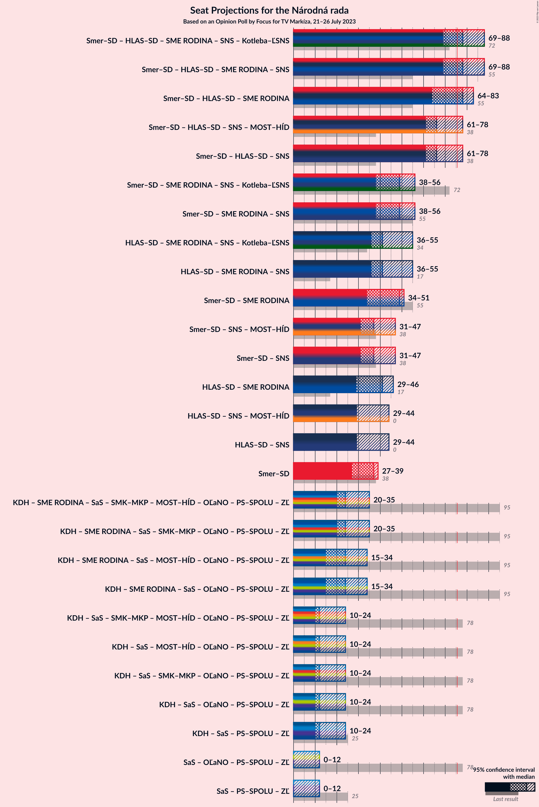

# Opinion Poll by Focus for TV Markíza, 21–26 July 2023

<a href="#voting-intentions">Voting Intentions</a> | <a href="#seats">Seats</a> | <a href="#coalitions">Coalitions</a> | <a href="#technical-information">Technical Information</a>

## Voting Intentions

### Confidence Intervals

| Party | Last Result | Poll Result | 80% Confidence Interval | 90% Confidence Interval | 95% Confidence Interval | 99% Confidence Interval |
|:-----:|:-----------:|:-----------:|:-----------------------:|:-----------------------:|:-----------------------:|:-----------------------:|
| SMER–sociálna demokracia | 18.3% | 18.1% | 16.6–19.7% |16.2–20.1% |15.8–20.5% |15.2–21.4% |
| HLAS–sociálna demokracia | 0.0% | 16.0% | 14.6–17.6% |14.2–18.0% |13.9–18.4% |13.2–19.2% |
| Progresívne Slovensko | 7.0% | 14.3% | 12.9–15.7% |12.6–16.2% |12.2–16.5% |11.6–17.3% |
| REPUBLIKA | 0.0% | 8.7% | 7.7–9.9% |7.4–10.3% |7.1–10.6% |6.6–11.2% |
| OBYČAJNÍ ĽUDIA a nezávislé osobnosti–Kresťanská únia–Za ľudí | 0.0% | 6.2% | 5.3–7.2% |5.0–7.5% |4.8–7.8% |4.5–8.4% |
| Kresťanskodemokratické hnutie | 4.6% | 5.6% | 4.7–6.6% |4.5–6.9% |4.3–7.1% |3.9–7.7% |
| SME RODINA | 8.2% | 5.6% | 4.7–6.6% |4.5–6.9% |4.3–7.1% |3.9–7.7% |
| Sloboda a Solidarita | 6.2% | 5.2% | 4.4–6.2% |4.2–6.5% |4.0–6.7% |3.6–7.2% |
| Slovenská národná strana | 3.2% | 5.1% | 4.3–6.1% |4.1–6.4% |3.9–6.6% |3.6–7.1% |
| Strana maďarskej koalície–Magyar Koalíció Pártja | 3.9% | 4.0% | 3.3–4.9% |3.1–5.2% |3.0–5.4% |2.7–5.9% |
| SPOLU–Občianska Demokracia | 7.0% | 3.8% | 3.1–4.7% |3.0–5.0% |2.8–5.2% |2.5–5.6% |
| Kotleba–Ľudová strana Naše Slovensko | 8.0% | 2.3% | 1.8–3.1% |1.7–3.3% |1.6–3.5% |1.4–3.9% |
| MODRÍ–Európske Slovensko–MOST–HÍD | 0.0% | 1.8% | 1.3–2.4% |1.2–2.6% |1.1–2.8% |0.9–3.1% |
| Magyar Fórum | 0.0% | 1.2% | 0.8–1.7% |0.7–1.9% |0.7–2.0% |0.5–2.3% |

*Note:* The poll result column reflects the actual value used in the calculations. Published results may vary slightly, and in addition be rounded to fewer digits.

## Seats

### Confidence Intervals

| Party | Last Result | Median | 80% Confidence Interval | 90% Confidence Interval | 95% Confidence Interval | 99% Confidence Interval |
|:-----:|:-----------:|:------:|:-----------------------:|:-----------------------:|:-----------------------:|:-----------------------:|
| <a href="#smer–sociálna-demokracia">SMER–sociálna demokracia</a> | 38 | 37 | 32–37 |30–39 |27–39 |27–41 |
| <a href="#hlas–sociálna-demokracia">HLAS–sociálna demokracia</a> | 0 | 29 | 29–32 |28–34 |26–35 |25–37 |
| <a href="#progresívne-slovensko">Progresívne Slovensko</a> | 0 | 31 | 25–31 |24–31 |23–31 |21–33 |
| <a href="#republika">REPUBLIKA</a> | 0 | 16 | 14–18 |13–18 |13–19 |12–21 |
| <a href="#obyčajní-ľudia-a-nezávislé-osobnosti–kresťanská-únia–za-ľudí">OBYČAJNÍ ĽUDIA a nezávislé osobnosti–Kresťanská únia–Za ľudí</a> | 0 | 13 | 11–13 |10–13 |0–14 |0–15 |
| <a href="#kresťanskodemokratické-hnutie">Kresťanskodemokratické hnutie</a> | 0 | 12 | 10–12 |0–12 |0–14 |0–15 |
| <a href="#sme-rodina">SME RODINA</a> | 17 | 12 | 0–12 |0–12 |0–13 |0–15 |
| <a href="#sloboda-a-solidarita">Sloboda a Solidarita</a> | 13 | 0 | 0–10 |0–11 |0–12 |0–13 |
| <a href="#slovenská-národná-strana">Slovenská národná strana</a> | 0 | 0 | 0–11 |0–11 |0–12 |0–13 |
| <a href="#strana-maďarskej-koalície–magyar-koalíció-pártja">Strana maďarskej koalície–Magyar Koalíció Pártja</a> | 0 | 0 | 0 |0 |0 |0–11 |
| <a href="#spolu–občianska-demokracia">SPOLU–Občianska Demokracia</a> | 0 | 0 | 0 |0 |0 |0–10 |
| <a href="#kotleba–ľudová-strana-naše-slovensko">Kotleba–Ľudová strana Naše Slovensko</a> | 17 | 0 | 0 |0 |0 |0 |
| <a href="#modrí–európske-slovensko–most–híd">MODRÍ–Európske Slovensko–MOST–HÍD</a> | 0 | 0 | 0 |0 |0 |0 |
| <a href="#magyar-fórum">Magyar Fórum</a> | 0 | 0 | 0 |0 |0 |0 |

### SMER–sociálna demokracia

*For a full overview of the results for this party, see the [SMER–sociálna demokracia](party-smer–sociálnademokracia.html) page.*

| Number of Seats | Probability | Accumulated | Special Marks |
|:---------------:|:-----------:|:-----------:|:-------------:|
| 27 | 3% | 100% |  |
| 28 | 0.2% | 97% |  |
| 29 | 2% | 97% |  |
| 30 | 1.2% | 95% |  |
| 31 | 2% | 94% |  |
| 32 | 4% | 92% |  |
| 33 | 4% | 88% |  |
| 34 | 7% | 84% |  |
| 35 | 2% | 77% |  |
| 36 | 2% | 75% |  |
| 37 | 64% | 73% | Median |
| 38 | 0.9% | 8% | Last Result |
| 39 | 6% | 7% |  |
| 40 | 0.6% | 1.2% |  |
| 41 | 0.2% | 0.6% |  |
| 42 | 0.1% | 0.3% |  |
| 43 | 0.2% | 0.3% |  |
| 44 | 0% | 0% |  |

### HLAS–sociálna demokracia

*For a full overview of the results for this party, see the [HLAS–sociálna demokracia](party-hlas–sociálnademokracia.html) page.*

| Number of Seats | Probability | Accumulated | Special Marks |
|:---------------:|:-----------:|:-----------:|:-------------:|
| 0 | 0% | 100% | Last Result |
| 1 | 0% | 100% |  |
| 2 | 0% | 100% |  |
| 3 | 0% | 100% |  |
| 4 | 0% | 100% |  |
| 5 | 0% | 100% |  |
| 6 | 0% | 100% |  |
| 7 | 0% | 100% |  |
| 8 | 0% | 100% |  |
| 9 | 0% | 100% |  |
| 10 | 0% | 100% |  |
| 11 | 0% | 100% |  |
| 12 | 0% | 100% |  |
| 13 | 0% | 100% |  |
| 14 | 0% | 100% |  |
| 15 | 0% | 100% |  |
| 16 | 0% | 100% |  |
| 17 | 0% | 100% |  |
| 18 | 0% | 100% |  |
| 19 | 0% | 100% |  |
| 20 | 0% | 100% |  |
| 21 | 0% | 100% |  |
| 22 | 0% | 100% |  |
| 23 | 0.2% | 100% |  |
| 24 | 0.2% | 99.8% |  |
| 25 | 0.8% | 99.5% |  |
| 26 | 1.4% | 98.8% |  |
| 27 | 1.1% | 97% |  |
| 28 | 3% | 96% |  |
| 29 | 68% | 93% | Median |
| 30 | 3% | 25% |  |
| 31 | 6% | 22% |  |
| 32 | 8% | 16% |  |
| 33 | 2% | 8% |  |
| 34 | 3% | 6% |  |
| 35 | 0.9% | 3% |  |
| 36 | 1.5% | 2% |  |
| 37 | 0.6% | 0.7% |  |
| 38 | 0.1% | 0.1% |  |
| 39 | 0% | 0.1% |  |
| 40 | 0% | 0% |  |

### Progresívne Slovensko

*For a full overview of the results for this party, see the [Progresívne Slovensko](party-progresívneslovensko.html) page.*

| Number of Seats | Probability | Accumulated | Special Marks |
|:---------------:|:-----------:|:-----------:|:-------------:|
| 0 | 0% | 100% | Last Result |
| 1 | 0% | 100% |  |
| 2 | 0% | 100% |  |
| 3 | 0% | 100% |  |
| 4 | 0% | 100% |  |
| 5 | 0% | 100% |  |
| 6 | 0% | 100% |  |
| 7 | 0% | 100% |  |
| 8 | 0% | 100% |  |
| 9 | 0% | 100% |  |
| 10 | 0% | 100% |  |
| 11 | 0% | 100% |  |
| 12 | 0% | 100% |  |
| 13 | 0% | 100% |  |
| 14 | 0% | 100% |  |
| 15 | 0% | 100% |  |
| 16 | 0% | 100% |  |
| 17 | 0% | 100% |  |
| 18 | 0% | 100% |  |
| 19 | 0% | 100% |  |
| 20 | 0% | 100% |  |
| 21 | 0.9% | 100% |  |
| 22 | 1.0% | 99.1% |  |
| 23 | 1.3% | 98% |  |
| 24 | 3% | 97% |  |
| 25 | 8% | 94% |  |
| 26 | 5% | 86% |  |
| 27 | 1.5% | 81% |  |
| 28 | 2% | 80% |  |
| 29 | 9% | 77% |  |
| 30 | 1.3% | 68% |  |
| 31 | 64% | 66% | Median |
| 32 | 2% | 2% |  |
| 33 | 0.5% | 0.8% |  |
| 34 | 0.1% | 0.3% |  |
| 35 | 0.1% | 0.3% |  |
| 36 | 0.1% | 0.2% |  |
| 37 | 0% | 0.1% |  |
| 38 | 0.1% | 0.1% |  |
| 39 | 0% | 0% |  |

### REPUBLIKA

*For a full overview of the results for this party, see the [REPUBLIKA](party-republika.html) page.*

| Number of Seats | Probability | Accumulated | Special Marks |
|:---------------:|:-----------:|:-----------:|:-------------:|
| 0 | 0% | 100% | Last Result |
| 1 | 0% | 100% |  |
| 2 | 0% | 100% |  |
| 3 | 0% | 100% |  |
| 4 | 0% | 100% |  |
| 5 | 0% | 100% |  |
| 6 | 0% | 100% |  |
| 7 | 0% | 100% |  |
| 8 | 0% | 100% |  |
| 9 | 0% | 100% |  |
| 10 | 0% | 100% |  |
| 11 | 0% | 100% |  |
| 12 | 2% | 100% |  |
| 13 | 3% | 98% |  |
| 14 | 7% | 95% |  |
| 15 | 6% | 88% |  |
| 16 | 67% | 82% | Median |
| 17 | 3% | 15% |  |
| 18 | 9% | 12% |  |
| 19 | 2% | 3% |  |
| 20 | 1.0% | 2% |  |
| 21 | 0.3% | 0.5% |  |
| 22 | 0.1% | 0.2% |  |
| 23 | 0% | 0.1% |  |
| 24 | 0% | 0.1% |  |
| 25 | 0% | 0% |  |

### OBYČAJNÍ ĽUDIA a nezávislé osobnosti–Kresťanská únia–Za ľudí

*For a full overview of the results for this party, see the [OBYČAJNÍ ĽUDIA a nezávislé osobnosti–Kresťanská únia–Za ľudí](party-obyčajníľudiaanezávisléosobnosti–kresťanskáúnia–zaľudí.html) page.*

| Number of Seats | Probability | Accumulated | Special Marks |
|:---------------:|:-----------:|:-----------:|:-------------:|
| 0 | 4% | 100% | Last Result |
| 1 | 0% | 96% |  |
| 2 | 0% | 96% |  |
| 3 | 0% | 96% |  |
| 4 | 0% | 96% |  |
| 5 | 0% | 96% |  |
| 6 | 0% | 96% |  |
| 7 | 0% | 96% |  |
| 8 | 0.1% | 96% |  |
| 9 | 0.9% | 96% |  |
| 10 | 4% | 95% |  |
| 11 | 13% | 92% |  |
| 12 | 4% | 79% |  |
| 13 | 72% | 75% | Median |
| 14 | 2% | 3% |  |
| 15 | 0.9% | 1.3% |  |
| 16 | 0.3% | 0.4% |  |
| 17 | 0.1% | 0.1% |  |
| 18 | 0% | 0% |  |

### Kresťanskodemokratické hnutie

*For a full overview of the results for this party, see the [Kresťanskodemokratické hnutie](party-kresťanskodemokratickéhnutie.html) page.*

| Number of Seats | Probability | Accumulated | Special Marks |
|:---------------:|:-----------:|:-----------:|:-------------:|
| 0 | 8% | 100% | Last Result |
| 1 | 0% | 92% |  |
| 2 | 0% | 92% |  |
| 3 | 0% | 92% |  |
| 4 | 0% | 92% |  |
| 5 | 0% | 92% |  |
| 6 | 0% | 92% |  |
| 7 | 0% | 92% |  |
| 8 | 0.1% | 92% |  |
| 9 | 0.9% | 92% |  |
| 10 | 5% | 91% |  |
| 11 | 12% | 87% |  |
| 12 | 70% | 75% | Median |
| 13 | 2% | 4% |  |
| 14 | 2% | 3% |  |
| 15 | 0.6% | 1.0% |  |
| 16 | 0.3% | 0.4% |  |
| 17 | 0% | 0% |  |

### SME RODINA

*For a full overview of the results for this party, see the [SME RODINA](party-smerodina.html) page.*

| Number of Seats | Probability | Accumulated | Special Marks |
|:---------------:|:-----------:|:-----------:|:-------------:|
| 0 | 11% | 100% |  |
| 1 | 0% | 89% |  |
| 2 | 0% | 89% |  |
| 3 | 0% | 89% |  |
| 4 | 0% | 89% |  |
| 5 | 0% | 89% |  |
| 6 | 0% | 89% |  |
| 7 | 0% | 89% |  |
| 8 | 0% | 89% |  |
| 9 | 0.8% | 89% |  |
| 10 | 8% | 88% |  |
| 11 | 6% | 80% |  |
| 12 | 71% | 74% | Median |
| 13 | 2% | 3% |  |
| 14 | 0.3% | 1.1% |  |
| 15 | 0.7% | 0.8% |  |
| 16 | 0% | 0.1% |  |
| 17 | 0% | 0% | Last Result |

### Sloboda a Solidarita

*For a full overview of the results for this party, see the [Sloboda a Solidarita](party-slobodaasolidarita.html) page.*

| Number of Seats | Probability | Accumulated | Special Marks |
|:---------------:|:-----------:|:-----------:|:-------------:|
| 0 | 73% | 100% | Median |
| 1 | 0% | 27% |  |
| 2 | 0% | 27% |  |
| 3 | 0% | 27% |  |
| 4 | 0% | 27% |  |
| 5 | 0% | 27% |  |
| 6 | 0% | 27% |  |
| 7 | 0% | 27% |  |
| 8 | 0% | 27% |  |
| 9 | 4% | 27% |  |
| 10 | 15% | 23% |  |
| 11 | 4% | 8% |  |
| 12 | 2% | 4% |  |
| 13 | 1.4% | 2% | Last Result |
| 14 | 0.1% | 0.2% |  |
| 15 | 0.1% | 0.1% |  |
| 16 | 0% | 0% |  |

### Slovenská národná strana

*For a full overview of the results for this party, see the [Slovenská národná strana](party-slovenskánárodnástrana.html) page.*

| Number of Seats | Probability | Accumulated | Special Marks |
|:---------------:|:-----------:|:-----------:|:-------------:|
| 0 | 78% | 100% | Last Result, Median |
| 1 | 0% | 22% |  |
| 2 | 0% | 22% |  |
| 3 | 0% | 22% |  |
| 4 | 0% | 22% |  |
| 5 | 0% | 22% |  |
| 6 | 0% | 22% |  |
| 7 | 0% | 22% |  |
| 8 | 0% | 22% |  |
| 9 | 2% | 22% |  |
| 10 | 10% | 20% |  |
| 11 | 6% | 11% |  |
| 12 | 3% | 4% |  |
| 13 | 1.0% | 1.2% |  |
| 14 | 0.2% | 0.2% |  |
| 15 | 0% | 0% |  |

### Strana maďarskej koalície–Magyar Koalíció Pártja

*For a full overview of the results for this party, see the [Strana maďarskej koalície–Magyar Koalíció Pártja](party-stranamaďarskejkoalície–magyarkoalíciópártja.html) page.*

| Number of Seats | Probability | Accumulated | Special Marks |
|:---------------:|:-----------:|:-----------:|:-------------:|
| 0 | 98% | 100% | Last Result, Median |
| 1 | 0% | 2% |  |
| 2 | 0% | 2% |  |
| 3 | 0% | 2% |  |
| 4 | 0% | 2% |  |
| 5 | 0% | 2% |  |
| 6 | 0% | 2% |  |
| 7 | 0% | 2% |  |
| 8 | 0% | 2% |  |
| 9 | 1.2% | 2% |  |
| 10 | 0.5% | 1.2% |  |
| 11 | 0.5% | 0.6% |  |
| 12 | 0.1% | 0.1% |  |
| 13 | 0% | 0% |  |

### SPOLU–Občianska Demokracia

*For a full overview of the results for this party, see the [SPOLU–Občianska Demokracia](party-spolu–občianskademokracia.html) page.*

| Number of Seats | Probability | Accumulated | Special Marks |
|:---------------:|:-----------:|:-----------:|:-------------:|
| 0 | 98.6% | 100% | Last Result, Median |
| 1 | 0% | 1.4% |  |
| 2 | 0% | 1.4% |  |
| 3 | 0% | 1.4% |  |
| 4 | 0% | 1.4% |  |
| 5 | 0% | 1.4% |  |
| 6 | 0% | 1.4% |  |
| 7 | 0% | 1.4% |  |
| 8 | 0% | 1.4% |  |
| 9 | 0.2% | 1.4% |  |
| 10 | 1.0% | 1.1% |  |
| 11 | 0.1% | 0.1% |  |
| 12 | 0% | 0.1% |  |
| 13 | 0% | 0% |  |

### Kotleba–Ľudová strana Naše Slovensko

*For a full overview of the results for this party, see the [Kotleba–Ľudová strana Naše Slovensko](party-kotleba–ľudovástrananašeslovensko.html) page.*

| Number of Seats | Probability | Accumulated | Special Marks |
|:---------------:|:-----------:|:-----------:|:-------------:|
| 0 | 100% | 100% | Median |
| 1 | 0% | 0% |  |
| 2 | 0% | 0% |  |
| 3 | 0% | 0% |  |
| 4 | 0% | 0% |  |
| 5 | 0% | 0% |  |
| 6 | 0% | 0% |  |
| 7 | 0% | 0% |  |
| 8 | 0% | 0% |  |
| 9 | 0% | 0% |  |
| 10 | 0% | 0% |  |
| 11 | 0% | 0% |  |
| 12 | 0% | 0% |  |
| 13 | 0% | 0% |  |
| 14 | 0% | 0% |  |
| 15 | 0% | 0% |  |
| 16 | 0% | 0% |  |
| 17 | 0% | 0% | Last Result |

### MODRÍ–Európske Slovensko–MOST–HÍD

*For a full overview of the results for this party, see the [MODRÍ–Európske Slovensko–MOST–HÍD](party-modrí–európskeslovensko–most–híd.html) page.*

| Number of Seats | Probability | Accumulated | Special Marks |
|:---------------:|:-----------:|:-----------:|:-------------:|
| 0 | 100% | 100% | Last Result, Median |

### Magyar Fórum

*For a full overview of the results for this party, see the [Magyar Fórum](party-magyarfórum.html) page.*

| Number of Seats | Probability | Accumulated | Special Marks |
|:---------------:|:-----------:|:-----------:|:-------------:|
| 0 | 100% | 100% | Last Result, Median |

## Coalitions

### Confidence Intervals

| Coalition | Last Result | Median | Majority? | 80% Confidence Interval | 90% Confidence Interval | 95% Confidence Interval | 99% Confidence Interval |
|:---------:|:-----------:|:------:|:---------:|:-----------------------:|:-----------------------:|:-----------------------:|:-----------------------:|
| SMER–sociálna demokracia – HLAS–sociálna demokracia – SME RODINA – Slovenská národná strana – Kotleba–Ľudová strana Naše Slovensko | 72 | 78 | 87% | 75–83 | 72–87 | 69–88 | 64–91 |
| SMER–sociálna demokracia – HLAS–sociálna demokracia – SME RODINA – Slovenská národná strana | 55 | 78 | 87% | 75–83 | 72–87 | 69–88 | 64–91 |
| SMER–sociálna demokracia – HLAS–sociálna demokracia – SME RODINA | 55 | 78 | 77% | 69–78 | 65–81 | 64–83 | 58–86 |
| SMER–sociálna demokracia – HLAS–sociálna demokracia – Slovenská národná strana | 38 | 66 | 7% | 66–75 | 65–76 | 61–78 | 58–81 |
| SMER–sociálna demokracia – SME RODINA – Slovenská národná strana – Kotleba–Ľudová strana Naše Slovensko | 72 | 49 | 0% | 44–52 | 42–55 | 38–56 | 32–60 |
| SMER–sociálna demokracia – SME RODINA – Slovenská národná strana | 55 | 49 | 0% | 44–52 | 42–55 | 38–56 | 32–60 |
| HLAS–sociálna demokracia – SME RODINA – Slovenská národná strana – Kotleba–Ľudová strana Naše Slovensko | 34 | 41 | 0% | 41–52 | 38–54 | 36–55 | 31–57 |
| HLAS–sociálna demokracia – SME RODINA – Slovenská národná strana | 17 | 41 | 0% | 41–52 | 38–54 | 36–55 | 31–57 |
| SMER–sociálna demokracia – SME RODINA | 55 | 49 | 0% | 37–49 | 34–49 | 34–51 | 31–51 |
| SMER–sociálna demokracia – Slovenská národná strana | 38 | 37 | 0% | 37–44 | 34–45 | 31–47 | 29–51 |
| HLAS–sociálna demokracia – SME RODINA | 17 | 41 | 0% | 34–43 | 31–44 | 29–46 | 26–49 |
| HLAS–sociálna demokracia – Slovenská národná strana | 0 | 29 | 0% | 29–41 | 29–43 | 29–44 | 26–45 |
| SMER–sociálna demokracia | 38 | 37 | 0% | 32–37 | 30–39 | 27–39 | 27–41 |

### SMER–sociálna demokracia – HLAS–sociálna demokracia – SME RODINA – Slovenská národná strana – Kotleba–Ľudová strana Naše Slovensko

| Number of Seats | Probability | Accumulated | Special Marks |
|:---------------:|:-----------:|:-----------:|:-------------:|
| 60 | 0.1% | 100% |  |
| 61 | 0% | 99.9% |  |
| 62 | 0% | 99.9% |  |
| 63 | 0.4% | 99.9% |  |
| 64 | 0.1% | 99.5% |  |
| 65 | 0% | 99.4% |  |
| 66 | 0.1% | 99.4% |  |
| 67 | 0.1% | 99.3% |  |
| 68 | 0.7% | 99.2% |  |
| 69 | 1.4% | 98.6% |  |
| 70 | 0.7% | 97% |  |
| 71 | 0.9% | 96% |  |
| 72 | 1.4% | 96% | Last Result |
| 73 | 0.9% | 94% |  |
| 74 | 0.4% | 93% |  |
| 75 | 6% | 93% |  |
| 76 | 1.1% | 87% | Majority |
| 77 | 1.3% | 86% |  |
| 78 | 63% | 85% | Median |
| 79 | 3% | 21% |  |
| 80 | 1.1% | 18% |  |
| 81 | 4% | 17% |  |
| 82 | 1.0% | 12% |  |
| 83 | 3% | 11% |  |
| 84 | 3% | 9% |  |
| 85 | 0.1% | 6% |  |
| 86 | 0.6% | 6% |  |
| 87 | 2% | 6% |  |
| 88 | 2% | 4% |  |
| 89 | 0.3% | 2% |  |
| 90 | 0.2% | 1.3% |  |
| 91 | 0.7% | 1.2% |  |
| 92 | 0.2% | 0.4% |  |
| 93 | 0% | 0.2% |  |
| 94 | 0% | 0.2% |  |
| 95 | 0% | 0.2% |  |
| 96 | 0% | 0.1% |  |
| 97 | 0.1% | 0.1% |  |
| 98 | 0% | 0% |  |

### SMER–sociálna demokracia – HLAS–sociálna demokracia – SME RODINA – Slovenská národná strana

| Number of Seats | Probability | Accumulated | Special Marks |
|:---------------:|:-----------:|:-----------:|:-------------:|
| 55 | 0% | 100% | Last Result |
| 56 | 0% | 100% |  |
| 57 | 0% | 100% |  |
| 58 | 0% | 100% |  |
| 59 | 0% | 100% |  |
| 60 | 0.1% | 100% |  |
| 61 | 0% | 99.9% |  |
| 62 | 0% | 99.9% |  |
| 63 | 0.4% | 99.9% |  |
| 64 | 0.1% | 99.5% |  |
| 65 | 0% | 99.4% |  |
| 66 | 0.1% | 99.4% |  |
| 67 | 0.1% | 99.3% |  |
| 68 | 0.7% | 99.2% |  |
| 69 | 1.4% | 98.6% |  |
| 70 | 0.7% | 97% |  |
| 71 | 0.9% | 96% |  |
| 72 | 1.4% | 96% |  |
| 73 | 0.9% | 94% |  |
| 74 | 0.4% | 93% |  |
| 75 | 6% | 93% |  |
| 76 | 1.1% | 87% | Majority |
| 77 | 1.3% | 86% |  |
| 78 | 63% | 85% | Median |
| 79 | 3% | 21% |  |
| 80 | 1.1% | 18% |  |
| 81 | 4% | 17% |  |
| 82 | 1.0% | 12% |  |
| 83 | 3% | 11% |  |
| 84 | 3% | 9% |  |
| 85 | 0.1% | 6% |  |
| 86 | 0.6% | 6% |  |
| 87 | 2% | 6% |  |
| 88 | 2% | 4% |  |
| 89 | 0.3% | 2% |  |
| 90 | 0.2% | 1.3% |  |
| 91 | 0.7% | 1.2% |  |
| 92 | 0.2% | 0.4% |  |
| 93 | 0% | 0.2% |  |
| 94 | 0% | 0.2% |  |
| 95 | 0% | 0.2% |  |
| 96 | 0% | 0.1% |  |
| 97 | 0.1% | 0.1% |  |
| 98 | 0% | 0% |  |

### SMER–sociálna demokracia – HLAS–sociálna demokracia – SME RODINA

| Number of Seats | Probability | Accumulated | Special Marks |
|:---------------:|:-----------:|:-----------:|:-------------:|
| 55 | 0% | 100% | Last Result |
| 56 | 0% | 100% |  |
| 57 | 0.1% | 100% |  |
| 58 | 0.4% | 99.9% |  |
| 59 | 0.3% | 99.5% |  |
| 60 | 0.2% | 99.2% |  |
| 61 | 0.1% | 98.9% |  |
| 62 | 0% | 98.8% |  |
| 63 | 0.4% | 98.8% |  |
| 64 | 1.1% | 98% |  |
| 65 | 5% | 97% |  |
| 66 | 1.2% | 93% |  |
| 67 | 0.2% | 91% |  |
| 68 | 1.1% | 91% |  |
| 69 | 4% | 90% |  |
| 70 | 2% | 86% |  |
| 71 | 1.4% | 84% |  |
| 72 | 3% | 83% |  |
| 73 | 1.5% | 79% |  |
| 74 | 0.5% | 78% |  |
| 75 | 0.4% | 77% |  |
| 76 | 2% | 77% | Majority |
| 77 | 2% | 75% |  |
| 78 | 64% | 72% | Median |
| 79 | 0.2% | 8% |  |
| 80 | 0.6% | 8% |  |
| 81 | 4% | 8% |  |
| 82 | 0.2% | 3% |  |
| 83 | 2% | 3% |  |
| 84 | 0.6% | 1.2% |  |
| 85 | 0.1% | 0.6% |  |
| 86 | 0.4% | 0.6% |  |
| 87 | 0% | 0.1% |  |
| 88 | 0% | 0.1% |  |
| 89 | 0% | 0.1% |  |
| 90 | 0% | 0.1% |  |
| 91 | 0% | 0.1% |  |
| 92 | 0% | 0% |  |

### SMER–sociálna demokracia – HLAS–sociálna demokracia – Slovenská národná strana

| Number of Seats | Probability | Accumulated | Special Marks |
|:---------------:|:-----------:|:-----------:|:-------------:|
| 38 | 0% | 100% | Last Result |
| 39 | 0% | 100% |  |
| 40 | 0% | 100% |  |
| 41 | 0% | 100% |  |
| 42 | 0% | 100% |  |
| 43 | 0% | 100% |  |
| 44 | 0% | 100% |  |
| 45 | 0% | 100% |  |
| 46 | 0% | 100% |  |
| 47 | 0% | 100% |  |
| 48 | 0% | 100% |  |
| 49 | 0% | 100% |  |
| 50 | 0% | 100% |  |
| 51 | 0% | 100% |  |
| 52 | 0% | 100% |  |
| 53 | 0% | 100% |  |
| 54 | 0% | 100% |  |
| 55 | 0.1% | 100% |  |
| 56 | 0% | 99.8% |  |
| 57 | 0.1% | 99.8% |  |
| 58 | 1.1% | 99.8% |  |
| 59 | 0% | 98.6% |  |
| 60 | 0.9% | 98.6% |  |
| 61 | 0.8% | 98% |  |
| 62 | 0.3% | 97% |  |
| 63 | 0.7% | 97% |  |
| 64 | 0.7% | 96% |  |
| 65 | 0.2% | 95% |  |
| 66 | 63% | 95% | Median |
| 67 | 3% | 32% |  |
| 68 | 1.2% | 29% |  |
| 69 | 1.3% | 27% |  |
| 70 | 2% | 26% |  |
| 71 | 6% | 24% |  |
| 72 | 3% | 18% |  |
| 73 | 2% | 15% |  |
| 74 | 0.5% | 13% |  |
| 75 | 6% | 13% |  |
| 76 | 3% | 7% | Majority |
| 77 | 1.1% | 5% |  |
| 78 | 2% | 4% |  |
| 79 | 0.5% | 1.4% |  |
| 80 | 0.2% | 0.8% |  |
| 81 | 0.2% | 0.6% |  |
| 82 | 0% | 0.5% |  |
| 83 | 0.2% | 0.4% |  |
| 84 | 0.1% | 0.3% |  |
| 85 | 0% | 0.2% |  |
| 86 | 0.1% | 0.2% |  |
| 87 | 0% | 0.1% |  |
| 88 | 0% | 0.1% |  |
| 89 | 0% | 0% |  |

### SMER–sociálna demokracia – SME RODINA – Slovenská národná strana – Kotleba–Ľudová strana Naše Slovensko

| Number of Seats | Probability | Accumulated | Special Marks |
|:---------------:|:-----------:|:-----------:|:-------------:|
| 31 | 0% | 100% |  |
| 32 | 0.5% | 99.9% |  |
| 33 | 0% | 99.5% |  |
| 34 | 0.2% | 99.4% |  |
| 35 | 0.3% | 99.2% |  |
| 36 | 1.2% | 98.9% |  |
| 37 | 0% | 98% |  |
| 38 | 0.2% | 98% |  |
| 39 | 0.1% | 97% |  |
| 40 | 1.4% | 97% |  |
| 41 | 0.3% | 96% |  |
| 42 | 1.5% | 96% |  |
| 43 | 0.5% | 94% |  |
| 44 | 6% | 94% |  |
| 45 | 0.4% | 88% |  |
| 46 | 1.3% | 87% |  |
| 47 | 0.6% | 86% |  |
| 48 | 0.7% | 85% |  |
| 49 | 70% | 85% | Median |
| 50 | 1.0% | 14% |  |
| 51 | 2% | 13% |  |
| 52 | 2% | 11% |  |
| 53 | 0.9% | 9% |  |
| 54 | 2% | 9% |  |
| 55 | 2% | 6% |  |
| 56 | 2% | 4% |  |
| 57 | 0.2% | 2% |  |
| 58 | 0.6% | 2% |  |
| 59 | 0.3% | 0.9% |  |
| 60 | 0.2% | 0.6% |  |
| 61 | 0% | 0.3% |  |
| 62 | 0.2% | 0.3% |  |
| 63 | 0% | 0.1% |  |
| 64 | 0.1% | 0.1% |  |
| 65 | 0% | 0.1% |  |
| 66 | 0% | 0% |  |
| 67 | 0% | 0% |  |
| 68 | 0% | 0% |  |
| 69 | 0% | 0% |  |
| 70 | 0% | 0% |  |
| 71 | 0% | 0% |  |
| 72 | 0% | 0% | Last Result |

### SMER–sociálna demokracia – SME RODINA – Slovenská národná strana

| Number of Seats | Probability | Accumulated | Special Marks |
|:---------------:|:-----------:|:-----------:|:-------------:|
| 31 | 0% | 100% |  |
| 32 | 0.5% | 99.9% |  |
| 33 | 0% | 99.5% |  |
| 34 | 0.2% | 99.4% |  |
| 35 | 0.3% | 99.2% |  |
| 36 | 1.2% | 98.9% |  |
| 37 | 0% | 98% |  |
| 38 | 0.2% | 98% |  |
| 39 | 0.1% | 97% |  |
| 40 | 1.4% | 97% |  |
| 41 | 0.3% | 96% |  |
| 42 | 1.5% | 96% |  |
| 43 | 0.5% | 94% |  |
| 44 | 6% | 94% |  |
| 45 | 0.4% | 88% |  |
| 46 | 1.3% | 87% |  |
| 47 | 0.6% | 86% |  |
| 48 | 0.7% | 85% |  |
| 49 | 70% | 85% | Median |
| 50 | 1.0% | 14% |  |
| 51 | 2% | 13% |  |
| 52 | 2% | 11% |  |
| 53 | 0.9% | 9% |  |
| 54 | 2% | 9% |  |
| 55 | 2% | 6% | Last Result |
| 56 | 2% | 4% |  |
| 57 | 0.2% | 2% |  |
| 58 | 0.6% | 2% |  |
| 59 | 0.3% | 0.9% |  |
| 60 | 0.2% | 0.6% |  |
| 61 | 0% | 0.3% |  |
| 62 | 0.2% | 0.3% |  |
| 63 | 0% | 0.1% |  |
| 64 | 0.1% | 0.1% |  |
| 65 | 0% | 0.1% |  |
| 66 | 0% | 0% |  |

### HLAS–sociálna demokracia – SME RODINA – Slovenská národná strana – Kotleba–Ľudová strana Naše Slovensko

| Number of Seats | Probability | Accumulated | Special Marks |
|:---------------:|:-----------:|:-----------:|:-------------:|
| 26 | 0.1% | 100% |  |
| 27 | 0% | 99.9% |  |
| 28 | 0% | 99.9% |  |
| 29 | 0% | 99.9% |  |
| 30 | 0% | 99.8% |  |
| 31 | 0.4% | 99.8% |  |
| 32 | 0.2% | 99.4% |  |
| 33 | 0.3% | 99.2% |  |
| 34 | 0.1% | 98.9% | Last Result |
| 35 | 0.4% | 98.7% |  |
| 36 | 2% | 98% |  |
| 37 | 0.6% | 97% |  |
| 38 | 1.4% | 96% |  |
| 39 | 0.9% | 95% |  |
| 40 | 2% | 94% |  |
| 41 | 68% | 92% | Median |
| 42 | 5% | 23% |  |
| 43 | 0.7% | 19% |  |
| 44 | 2% | 18% |  |
| 45 | 1.0% | 16% |  |
| 46 | 1.4% | 15% |  |
| 47 | 0.4% | 14% |  |
| 48 | 0.4% | 13% |  |
| 49 | 0.5% | 13% |  |
| 50 | 1.1% | 12% |  |
| 51 | 0.4% | 11% |  |
| 52 | 5% | 11% |  |
| 53 | 1.0% | 6% |  |
| 54 | 2% | 5% |  |
| 55 | 2% | 3% |  |
| 56 | 0.1% | 1.2% |  |
| 57 | 0.8% | 1.1% |  |
| 58 | 0.3% | 0.3% |  |
| 59 | 0% | 0% |  |

### HLAS–sociálna demokracia – SME RODINA – Slovenská národná strana

| Number of Seats | Probability | Accumulated | Special Marks |
|:---------------:|:-----------:|:-----------:|:-------------:|
| 17 | 0% | 100% | Last Result |
| 18 | 0% | 100% |  |
| 19 | 0% | 100% |  |
| 20 | 0% | 100% |  |
| 21 | 0% | 100% |  |
| 22 | 0% | 100% |  |
| 23 | 0% | 100% |  |
| 24 | 0% | 100% |  |
| 25 | 0% | 100% |  |
| 26 | 0.1% | 100% |  |
| 27 | 0% | 99.9% |  |
| 28 | 0% | 99.9% |  |
| 29 | 0% | 99.9% |  |
| 30 | 0% | 99.8% |  |
| 31 | 0.4% | 99.8% |  |
| 32 | 0.2% | 99.4% |  |
| 33 | 0.3% | 99.2% |  |
| 34 | 0.1% | 98.9% |  |
| 35 | 0.4% | 98.7% |  |
| 36 | 2% | 98% |  |
| 37 | 0.6% | 97% |  |
| 38 | 1.4% | 96% |  |
| 39 | 0.9% | 95% |  |
| 40 | 2% | 94% |  |
| 41 | 68% | 92% | Median |
| 42 | 5% | 23% |  |
| 43 | 0.7% | 19% |  |
| 44 | 2% | 18% |  |
| 45 | 1.0% | 16% |  |
| 46 | 1.4% | 15% |  |
| 47 | 0.4% | 14% |  |
| 48 | 0.4% | 13% |  |
| 49 | 0.5% | 13% |  |
| 50 | 1.1% | 12% |  |
| 51 | 0.4% | 11% |  |
| 52 | 5% | 11% |  |
| 53 | 1.0% | 6% |  |
| 54 | 2% | 5% |  |
| 55 | 2% | 3% |  |
| 56 | 0.1% | 1.2% |  |
| 57 | 0.8% | 1.1% |  |
| 58 | 0.3% | 0.3% |  |
| 59 | 0% | 0% |  |

### SMER–sociálna demokracia – SME RODINA

| Number of Seats | Probability | Accumulated | Special Marks |
|:---------------:|:-----------:|:-----------:|:-------------:|
| 28 | 0.1% | 100% |  |
| 29 | 0.1% | 99.9% |  |
| 30 | 0.2% | 99.9% |  |
| 31 | 0.3% | 99.7% |  |
| 32 | 0.8% | 99.4% |  |
| 33 | 0.1% | 98.7% |  |
| 34 | 5% | 98.5% |  |
| 35 | 1.0% | 94% |  |
| 36 | 1.2% | 93% |  |
| 37 | 2% | 91% |  |
| 38 | 0.3% | 90% |  |
| 39 | 3% | 89% |  |
| 40 | 1.5% | 86% |  |
| 41 | 0.8% | 85% |  |
| 42 | 2% | 84% |  |
| 43 | 3% | 82% |  |
| 44 | 6% | 79% |  |
| 45 | 0.5% | 73% |  |
| 46 | 0.7% | 73% |  |
| 47 | 1.0% | 72% |  |
| 48 | 0.3% | 71% |  |
| 49 | 68% | 71% | Median |
| 50 | 0.5% | 3% |  |
| 51 | 2% | 3% |  |
| 52 | 0.1% | 0.4% |  |
| 53 | 0.1% | 0.3% |  |
| 54 | 0.1% | 0.2% |  |
| 55 | 0.1% | 0.1% | Last Result |
| 56 | 0% | 0% |  |

### SMER–sociálna demokracia – Slovenská národná strana

| Number of Seats | Probability | Accumulated | Special Marks |
|:---------------:|:-----------:|:-----------:|:-------------:|
| 28 | 0.1% | 100% |  |
| 29 | 1.4% | 99.9% |  |
| 30 | 0.4% | 98% |  |
| 31 | 0.8% | 98% |  |
| 32 | 2% | 97% |  |
| 33 | 0.3% | 96% |  |
| 34 | 0.8% | 95% |  |
| 35 | 0.5% | 95% |  |
| 36 | 2% | 94% |  |
| 37 | 65% | 92% | Median |
| 38 | 0.9% | 27% | Last Result |
| 39 | 6% | 26% |  |
| 40 | 2% | 20% |  |
| 41 | 0.6% | 18% |  |
| 42 | 0.9% | 17% |  |
| 43 | 0.5% | 17% |  |
| 44 | 11% | 16% |  |
| 45 | 1.2% | 5% |  |
| 46 | 1.4% | 4% |  |
| 47 | 0.7% | 3% |  |
| 48 | 0.8% | 2% |  |
| 49 | 0.5% | 1.3% |  |
| 50 | 0.3% | 0.9% |  |
| 51 | 0.1% | 0.5% |  |
| 52 | 0.3% | 0.4% |  |
| 53 | 0.1% | 0.1% |  |
| 54 | 0.1% | 0.1% |  |
| 55 | 0% | 0% |  |

### HLAS–sociálna demokracia – SME RODINA

| Number of Seats | Probability | Accumulated | Special Marks |
|:---------------:|:-----------:|:-----------:|:-------------:|
| 17 | 0% | 100% | Last Result |
| 18 | 0% | 100% |  |
| 19 | 0% | 100% |  |
| 20 | 0% | 100% |  |
| 21 | 0% | 100% |  |
| 22 | 0% | 100% |  |
| 23 | 0.2% | 100% |  |
| 24 | 0.1% | 99.8% |  |
| 25 | 0.1% | 99.7% |  |
| 26 | 0.4% | 99.6% |  |
| 27 | 0.6% | 99.2% |  |
| 28 | 0.4% | 98.6% |  |
| 29 | 2% | 98% |  |
| 30 | 0.1% | 97% |  |
| 31 | 5% | 96% |  |
| 32 | 0.3% | 91% |  |
| 33 | 0.5% | 91% |  |
| 34 | 0.7% | 90% |  |
| 35 | 0.2% | 90% |  |
| 36 | 2% | 90% |  |
| 37 | 0.7% | 88% |  |
| 38 | 0.7% | 87% |  |
| 39 | 0.6% | 86% |  |
| 40 | 4% | 86% |  |
| 41 | 64% | 82% | Median |
| 42 | 7% | 17% |  |
| 43 | 3% | 10% |  |
| 44 | 4% | 7% |  |
| 45 | 0.8% | 3% |  |
| 46 | 2% | 3% |  |
| 47 | 0.3% | 1.0% |  |
| 48 | 0.1% | 0.7% |  |
| 49 | 0.1% | 0.6% |  |
| 50 | 0.4% | 0.5% |  |
| 51 | 0% | 0.1% |  |
| 52 | 0% | 0.1% |  |
| 53 | 0% | 0% |  |

### HLAS–sociálna demokracia – Slovenská národná strana

| Number of Seats | Probability | Accumulated | Special Marks |
|:---------------:|:-----------:|:-----------:|:-------------:|
| 0 | 0% | 100% | Last Result |
| 1 | 0% | 100% |  |
| 2 | 0% | 100% |  |
| 3 | 0% | 100% |  |
| 4 | 0% | 100% |  |
| 5 | 0% | 100% |  |
| 6 | 0% | 100% |  |
| 7 | 0% | 100% |  |
| 8 | 0% | 100% |  |
| 9 | 0% | 100% |  |
| 10 | 0% | 100% |  |
| 11 | 0% | 100% |  |
| 12 | 0% | 100% |  |
| 13 | 0% | 100% |  |
| 14 | 0% | 100% |  |
| 15 | 0% | 100% |  |
| 16 | 0% | 100% |  |
| 17 | 0% | 100% |  |
| 18 | 0% | 100% |  |
| 19 | 0% | 100% |  |
| 20 | 0% | 100% |  |
| 21 | 0% | 100% |  |
| 22 | 0% | 100% |  |
| 23 | 0% | 100% |  |
| 24 | 0.1% | 100% |  |
| 25 | 0.2% | 99.9% |  |
| 26 | 0.3% | 99.7% |  |
| 27 | 0.4% | 99.4% |  |
| 28 | 0.6% | 99.0% |  |
| 29 | 65% | 98% | Median |
| 30 | 0.2% | 33% |  |
| 31 | 0.7% | 33% |  |
| 32 | 6% | 33% |  |
| 33 | 1.0% | 27% |  |
| 34 | 0.8% | 26% |  |
| 35 | 2% | 25% |  |
| 36 | 2% | 23% |  |
| 37 | 1.1% | 21% |  |
| 38 | 2% | 20% |  |
| 39 | 1.0% | 18% |  |
| 40 | 5% | 17% |  |
| 41 | 5% | 12% |  |
| 42 | 1.5% | 7% |  |
| 43 | 2% | 6% |  |
| 44 | 0.7% | 3% |  |
| 45 | 2% | 2% |  |
| 46 | 0.1% | 0.3% |  |
| 47 | 0.1% | 0.2% |  |
| 48 | 0% | 0.1% |  |
| 49 | 0% | 0.1% |  |
| 50 | 0% | 0% |  |

### SMER–sociálna demokracia

| Number of Seats | Probability | Accumulated | Special Marks |
|:---------------:|:-----------:|:-----------:|:-------------:|
| 27 | 3% | 100% |  |
| 28 | 0.2% | 97% |  |
| 29 | 2% | 97% |  |
| 30 | 1.2% | 95% |  |
| 31 | 2% | 94% |  |
| 32 | 4% | 92% |  |
| 33 | 4% | 88% |  |
| 34 | 7% | 84% |  |
| 35 | 2% | 77% |  |
| 36 | 2% | 75% |  |
| 37 | 64% | 73% | Median |
| 38 | 0.9% | 8% | Last Result |
| 39 | 6% | 7% |  |
| 40 | 0.6% | 1.2% |  |
| 41 | 0.2% | 0.6% |  |
| 42 | 0.1% | 0.3% |  |
| 43 | 0.2% | 0.3% |  |
| 44 | 0% | 0% |  |

## Technical Information

### Opinion Poll

+ **Polling firm:** Focus
+ **Commissioner(s):** TV Markíza
+ **Fieldwork period:** 21–26 July 2023

### Calculations

+ **Sample size:** 1024
+ **Simulations done:** 1,048,576
+ **Error estimate:** 2.23%

