# Opinion Poll by Median for RTVS, 21–26 July 2023

<a href="#voting-intentions">Voting Intentions</a> | <a href="#seats">Seats</a> | <a href="#coalitions">Coalitions</a> | <a href="#technical-information">Technical Information</a>

## Voting Intentions

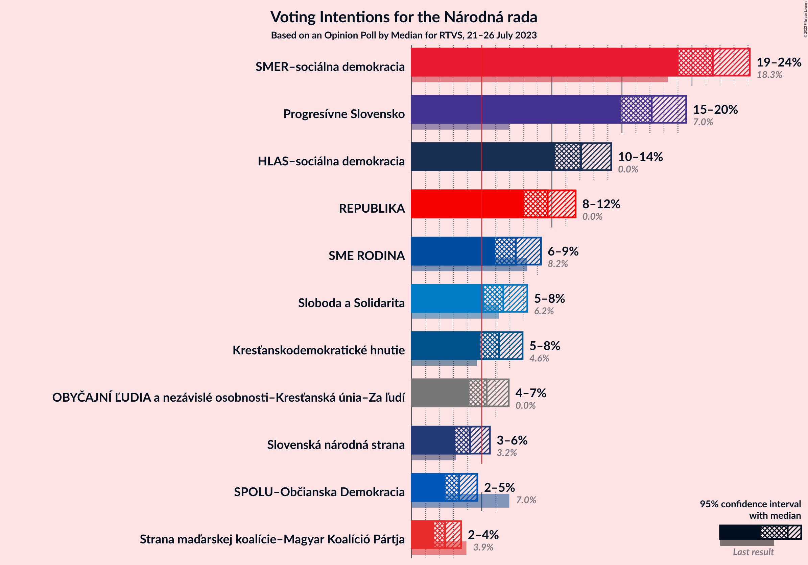

### Confidence Intervals

| Party | Last Result | Poll Result | 80% Confidence Interval | 90% Confidence Interval | 95% Confidence Interval | 99% Confidence Interval |
|:-----:|:-----------:|:-----------:|:-----------------------:|:-----------------------:|:-----------------------:|:-----------------------:|
| SMER–sociálna demokracia | 18.3% | 21.5% | 19.9–23.2% |19.4–23.7% |19.1–24.1% |18.3–25.0% |
| Progresívne Slovensko | 7.0% | 17.1% | 15.7–18.7% |15.3–19.2% |14.9–19.6% |14.3–20.4% |
| HLAS–sociálna demokracia | 0.0% | 12.1% | 10.9–13.5% |10.5–13.9% |10.2–14.2% |9.6–14.9% |
| REPUBLIKA | 0.0% | 9.7% | 8.6–11.0% |8.3–11.4% |8.0–11.7% |7.5–12.3% |
| SME RODINA | 8.2% | 7.4% | 6.5–8.6% |6.2–8.9% |6.0–9.2% |5.5–9.8% |
| Sloboda a Solidarita | 6.2% | 6.5% | 5.6–7.7% |5.4–8.0% |5.2–8.2% |4.8–8.8% |
| Kresťanskodemokratické hnutie | 4.6% | 6.2% | 5.3–7.3% |5.1–7.6% |4.9–7.9% |4.5–8.5% |
| OBYČAJNÍ ĽUDIA a nezávislé osobnosti–Kresťanská únia–Za ľudí | 0.0% | 5.3% | 4.5–6.4% |4.3–6.7% |4.1–6.9% |3.8–7.4% |
| Slovenská národná strana | 3.2% | 4.2% | 3.4–5.1% |3.2–5.3% |3.1–5.6% |2.8–6.1% |
| SPOLU–Občianska Demokracia | 7.0% | 3.4% | 2.7–4.2% |2.6–4.5% |2.4–4.7% |2.1–5.1% |
| Strana maďarskej koalície–Magyar Koalíció Pártja | 3.9% | 2.4% | 1.9–3.1% |1.7–3.3% |1.6–3.5% |1.4–3.9% |

*Note:* The poll result column reflects the actual value used in the calculations. Published results may vary slightly, and in addition be rounded to fewer digits.

## Seats

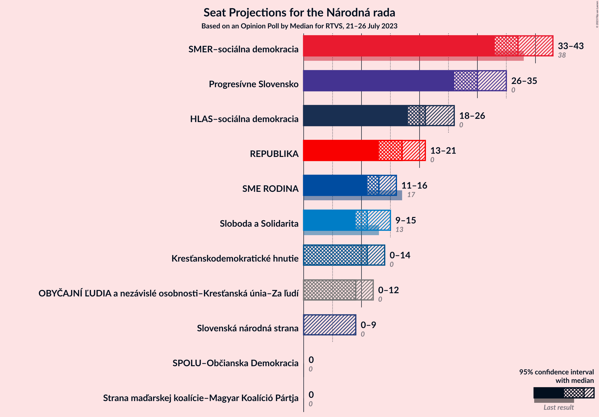

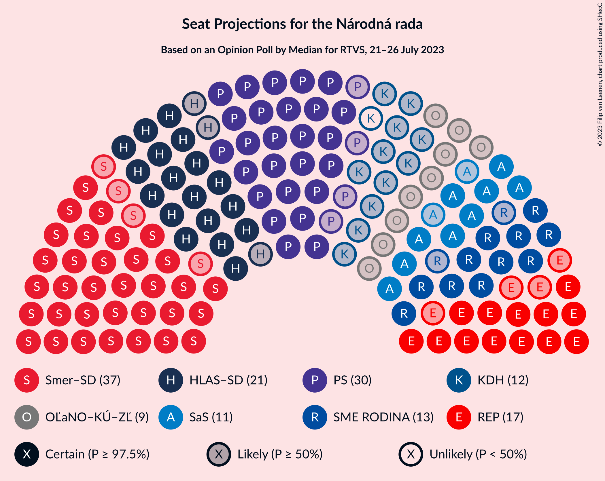

### Confidence Intervals

| Party | Last Result | Median | 80% Confidence Interval | 90% Confidence Interval | 95% Confidence Interval | 99% Confidence Interval |
|:-----:|:-----------:|:------:|:-----------------------:|:-----------------------:|:-----------------------:|:-----------------------:|
| <a href="#smer–sociálna-demokracia">SMER–sociálna demokracia</a> | 38 | 37 | 34–41 |33–41 |33–43 |32–45 |
| <a href="#progresívne-slovensko">Progresívne Slovensko</a> | 0 | 30 | 27–33 |26–34 |26–35 |24–37 |
| <a href="#hlas–sociálna-demokracia">HLAS–sociálna demokracia</a> | 0 | 21 | 19–23 |18–26 |18–26 |17–27 |
| <a href="#republika">REPUBLIKA</a> | 0 | 17 | 15–19 |14–20 |13–21 |13–22 |
| <a href="#sme-rodina">SME RODINA</a> | 17 | 13 | 11–15 |11–16 |11–16 |10–18 |
| <a href="#sloboda-a-solidarita">Sloboda a Solidarita</a> | 13 | 11 | 10–14 |9–14 |9–15 |0–15 |
| <a href="#kresťanskodemokratické-hnutie">Kresťanskodemokratické hnutie</a> | 0 | 11 | 9–13 |9–14 |0–14 |0–15 |
| <a href="#obyčajní-ľudia-a-nezávislé-osobnosti–kresťanská-únia–za-ľudí">OBYČAJNÍ ĽUDIA a nezávislé osobnosti–Kresťanská únia–Za ľudí</a> | 0 | 9 | 0–10 |0–11 |0–12 |0–13 |
| <a href="#slovenská-národná-strana">Slovenská národná strana</a> | 0 | 0 | 0 |0–9 |0–9 |0–10 |
| <a href="#spolu–občianska-demokracia">SPOLU–Občianska Demokracia</a> | 0 | 0 | 0 |0 |0 |0–9 |
| <a href="#strana-maďarskej-koalície–magyar-koalíció-pártja">Strana maďarskej koalície–Magyar Koalíció Pártja</a> | 0 | 0 | 0 |0 |0 |0 |

### SMER–sociálna demokracia

*For a full overview of the results for this party, see the [SMER–sociálna demokracia](party-smer–sociálnademokracia.html) page.*

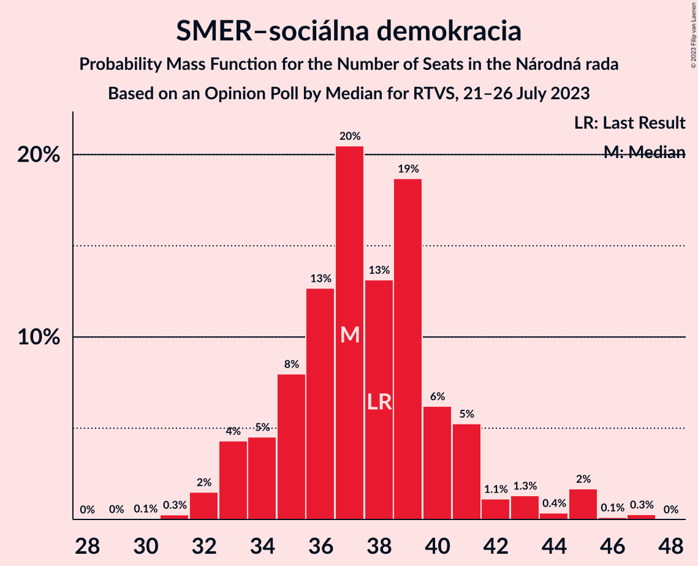

| Number of Seats | Probability | Accumulated | Special Marks |
|:---------------:|:-----------:|:-----------:|:-------------:|
| 30 | 0.1% | 100% |  |
| 31 | 0.3% | 99.9% |  |
| 32 | 2% | 99.7% |  |
| 33 | 4% | 98% |  |
| 34 | 5% | 94% |  |
| 35 | 8% | 89% |  |
| 36 | 13% | 81% |  |
| 37 | 20% | 69% | Median |
| 38 | 13% | 48% | Last Result |
| 39 | 19% | 35% |  |
| 40 | 6% | 16% |  |
| 41 | 5% | 10% |  |
| 42 | 1.1% | 5% |  |
| 43 | 1.3% | 4% |  |
| 44 | 0.4% | 2% |  |
| 45 | 2% | 2% |  |
| 46 | 0.1% | 0.4% |  |
| 47 | 0.3% | 0.3% |  |
| 48 | 0% | 0% |  |

### Progresívne Slovensko

*For a full overview of the results for this party, see the [Progresívne Slovensko](party-progresívneslovensko.html) page.*

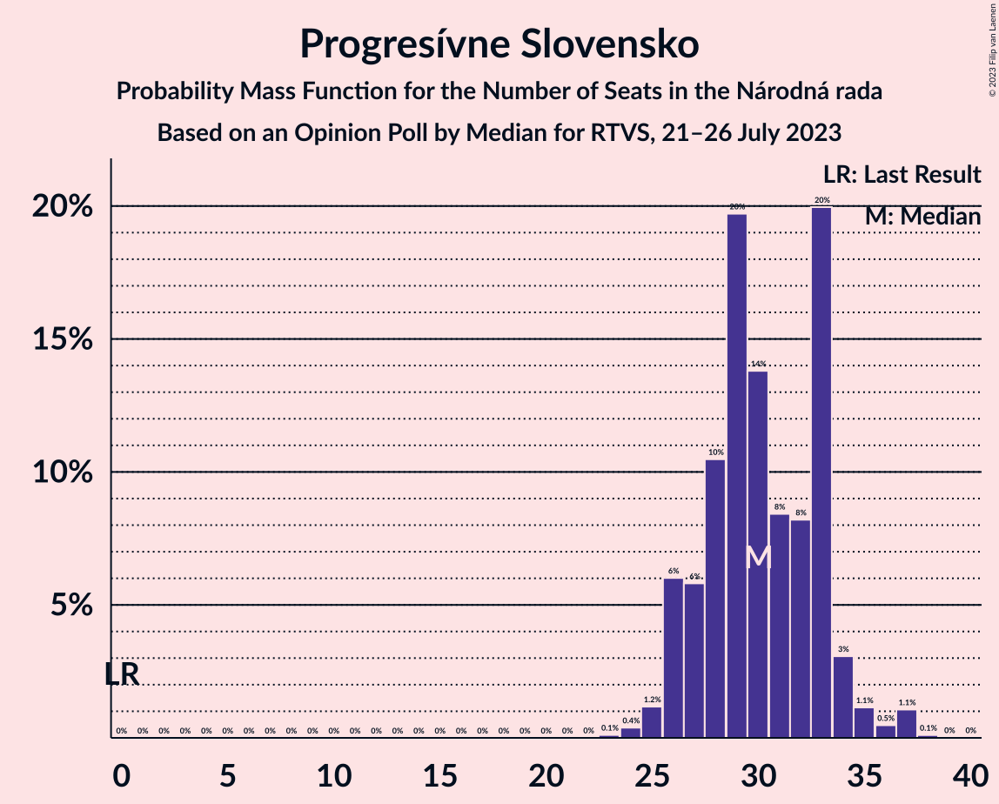

| Number of Seats | Probability | Accumulated | Special Marks |
|:---------------:|:-----------:|:-----------:|:-------------:|
| 0 | 0% | 100% | Last Result |
| 1 | 0% | 100% |  |
| 2 | 0% | 100% |  |
| 3 | 0% | 100% |  |
| 4 | 0% | 100% |  |
| 5 | 0% | 100% |  |
| 6 | 0% | 100% |  |
| 7 | 0% | 100% |  |
| 8 | 0% | 100% |  |
| 9 | 0% | 100% |  |
| 10 | 0% | 100% |  |
| 11 | 0% | 100% |  |
| 12 | 0% | 100% |  |
| 13 | 0% | 100% |  |
| 14 | 0% | 100% |  |
| 15 | 0% | 100% |  |
| 16 | 0% | 100% |  |
| 17 | 0% | 100% |  |
| 18 | 0% | 100% |  |
| 19 | 0% | 100% |  |
| 20 | 0% | 100% |  |
| 21 | 0% | 100% |  |
| 22 | 0% | 100% |  |
| 23 | 0.1% | 100% |  |
| 24 | 0.4% | 99.9% |  |
| 25 | 1.2% | 99.5% |  |
| 26 | 6% | 98% |  |
| 27 | 6% | 92% |  |
| 28 | 10% | 86% |  |
| 29 | 20% | 76% |  |
| 30 | 14% | 56% | Median |
| 31 | 8% | 42% |  |
| 32 | 8% | 34% |  |
| 33 | 20% | 26% |  |
| 34 | 3% | 6% |  |
| 35 | 1.1% | 3% |  |
| 36 | 0.5% | 2% |  |
| 37 | 1.1% | 1.2% |  |
| 38 | 0.1% | 0.2% |  |
| 39 | 0% | 0% |  |

### HLAS–sociálna demokracia

*For a full overview of the results for this party, see the [HLAS–sociálna demokracia](party-hlas–sociálnademokracia.html) page.*

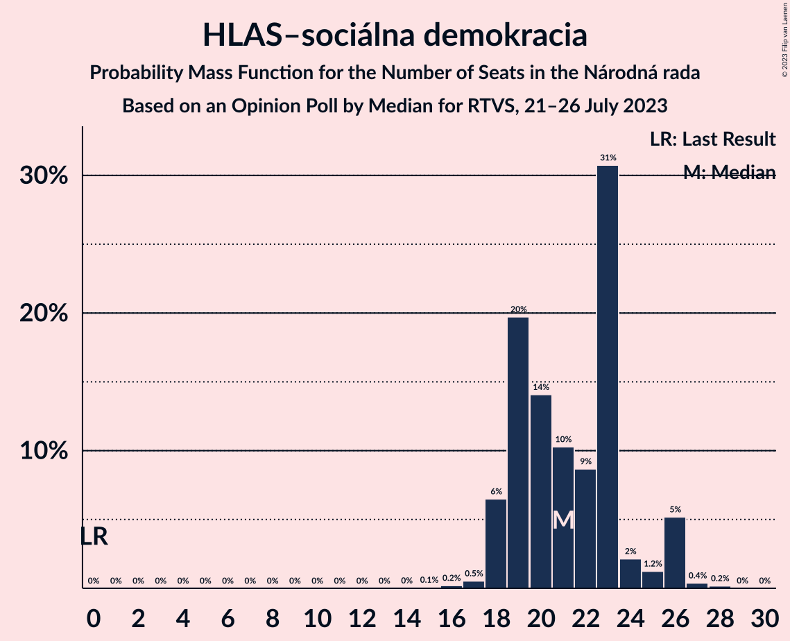

| Number of Seats | Probability | Accumulated | Special Marks |
|:---------------:|:-----------:|:-----------:|:-------------:|
| 0 | 0% | 100% | Last Result |
| 1 | 0% | 100% |  |
| 2 | 0% | 100% |  |
| 3 | 0% | 100% |  |
| 4 | 0% | 100% |  |
| 5 | 0% | 100% |  |
| 6 | 0% | 100% |  |
| 7 | 0% | 100% |  |
| 8 | 0% | 100% |  |
| 9 | 0% | 100% |  |
| 10 | 0% | 100% |  |
| 11 | 0% | 100% |  |
| 12 | 0% | 100% |  |
| 13 | 0% | 100% |  |
| 14 | 0% | 100% |  |
| 15 | 0.1% | 100% |  |
| 16 | 0.2% | 99.9% |  |
| 17 | 0.5% | 99.7% |  |
| 18 | 6% | 99.2% |  |
| 19 | 20% | 93% |  |
| 20 | 14% | 73% |  |
| 21 | 10% | 59% | Median |
| 22 | 9% | 49% |  |
| 23 | 31% | 40% |  |
| 24 | 2% | 9% |  |
| 25 | 1.2% | 7% |  |
| 26 | 5% | 6% |  |
| 27 | 0.4% | 0.6% |  |
| 28 | 0.2% | 0.2% |  |
| 29 | 0% | 0% |  |

### REPUBLIKA

*For a full overview of the results for this party, see the [REPUBLIKA](party-republika.html) page.*

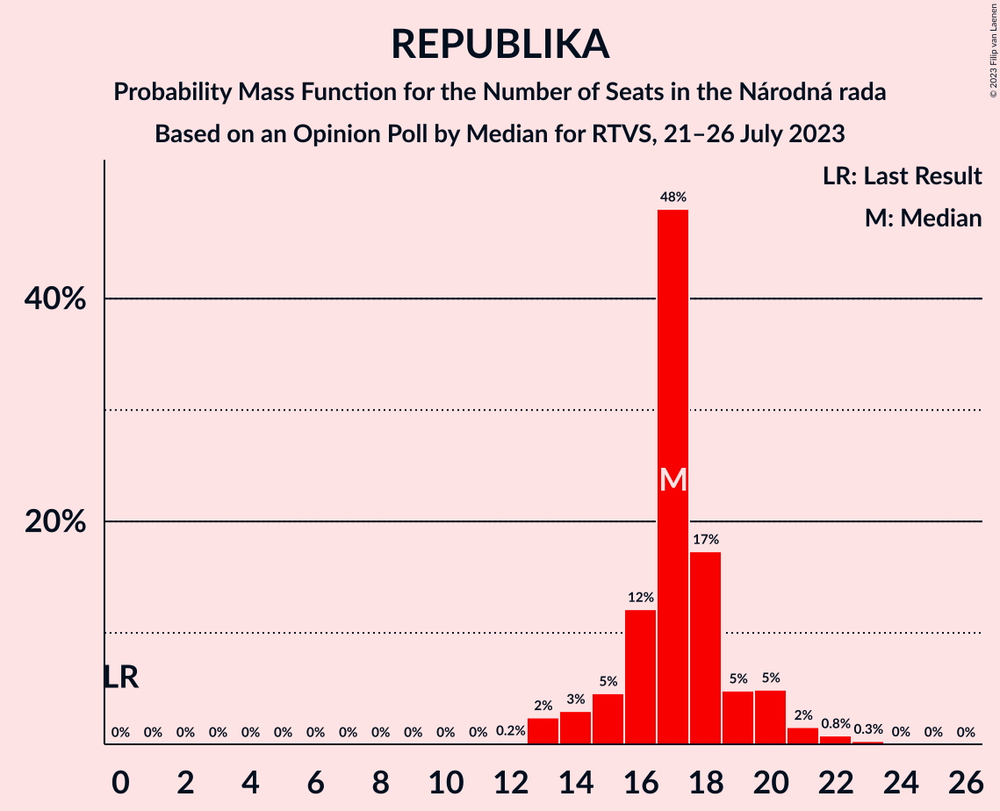

| Number of Seats | Probability | Accumulated | Special Marks |
|:---------------:|:-----------:|:-----------:|:-------------:|
| 0 | 0% | 100% | Last Result |
| 1 | 0% | 100% |  |
| 2 | 0% | 100% |  |
| 3 | 0% | 100% |  |
| 4 | 0% | 100% |  |
| 5 | 0% | 100% |  |
| 6 | 0% | 100% |  |
| 7 | 0% | 100% |  |
| 8 | 0% | 100% |  |
| 9 | 0% | 100% |  |
| 10 | 0% | 100% |  |
| 11 | 0% | 100% |  |
| 12 | 0.2% | 100% |  |
| 13 | 2% | 99.8% |  |
| 14 | 3% | 97% |  |
| 15 | 5% | 94% |  |
| 16 | 12% | 90% |  |
| 17 | 48% | 78% | Median |
| 18 | 17% | 30% |  |
| 19 | 5% | 12% |  |
| 20 | 5% | 8% |  |
| 21 | 2% | 3% |  |
| 22 | 0.8% | 1.1% |  |
| 23 | 0.3% | 0.4% |  |
| 24 | 0% | 0.1% |  |
| 25 | 0% | 0% |  |

### SME RODINA

*For a full overview of the results for this party, see the [SME RODINA](party-smerodina.html) page.*

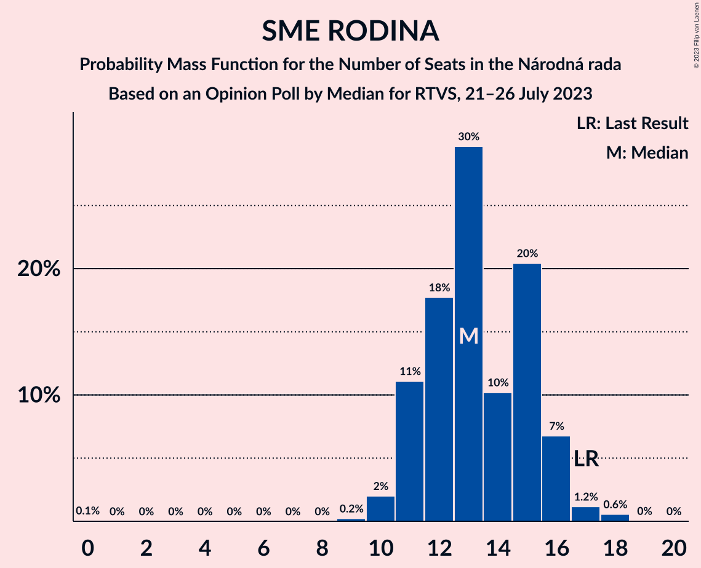

| Number of Seats | Probability | Accumulated | Special Marks |
|:---------------:|:-----------:|:-----------:|:-------------:|
| 0 | 0.1% | 100% |  |
| 1 | 0% | 99.9% |  |
| 2 | 0% | 99.9% |  |
| 3 | 0% | 99.9% |  |
| 4 | 0% | 99.9% |  |
| 5 | 0% | 99.9% |  |
| 6 | 0% | 99.9% |  |
| 7 | 0% | 99.9% |  |
| 8 | 0% | 99.9% |  |
| 9 | 0.2% | 99.9% |  |
| 10 | 2% | 99.7% |  |
| 11 | 11% | 98% |  |
| 12 | 18% | 87% |  |
| 13 | 30% | 69% | Median |
| 14 | 10% | 39% |  |
| 15 | 20% | 29% |  |
| 16 | 7% | 9% |  |
| 17 | 1.2% | 2% | Last Result |
| 18 | 0.6% | 0.6% |  |
| 19 | 0% | 0% |  |

### Sloboda a Solidarita

*For a full overview of the results for this party, see the [Sloboda a Solidarita](party-slobodaasolidarita.html) page.*

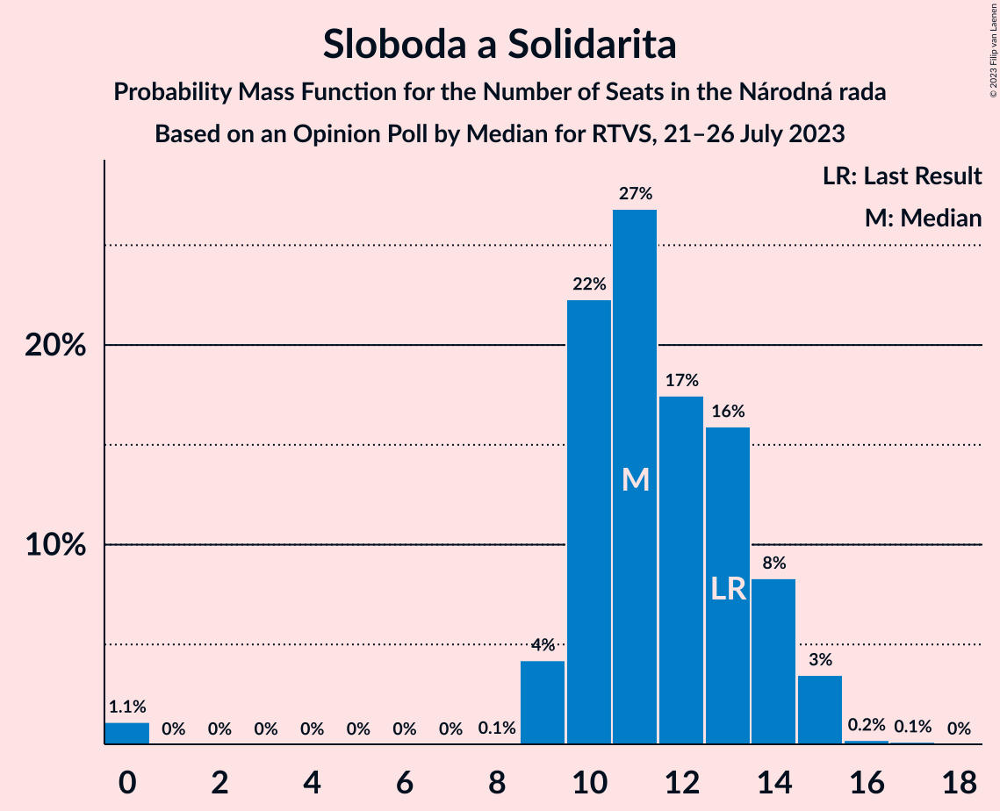

| Number of Seats | Probability | Accumulated | Special Marks |
|:---------------:|:-----------:|:-----------:|:-------------:|
| 0 | 1.1% | 100% |  |
| 1 | 0% | 98.9% |  |
| 2 | 0% | 98.9% |  |
| 3 | 0% | 98.9% |  |
| 4 | 0% | 98.9% |  |
| 5 | 0% | 98.9% |  |
| 6 | 0% | 98.9% |  |
| 7 | 0% | 98.9% |  |
| 8 | 0.1% | 98.9% |  |
| 9 | 4% | 98.8% |  |
| 10 | 22% | 95% |  |
| 11 | 27% | 72% | Median |
| 12 | 17% | 46% |  |
| 13 | 16% | 28% | Last Result |
| 14 | 8% | 12% |  |
| 15 | 3% | 4% |  |
| 16 | 0.2% | 0.4% |  |
| 17 | 0.1% | 0.1% |  |
| 18 | 0% | 0% |  |

### Kresťanskodemokratické hnutie

*For a full overview of the results for this party, see the [Kresťanskodemokratické hnutie](party-kresťanskodemokratickéhnutie.html) page.*

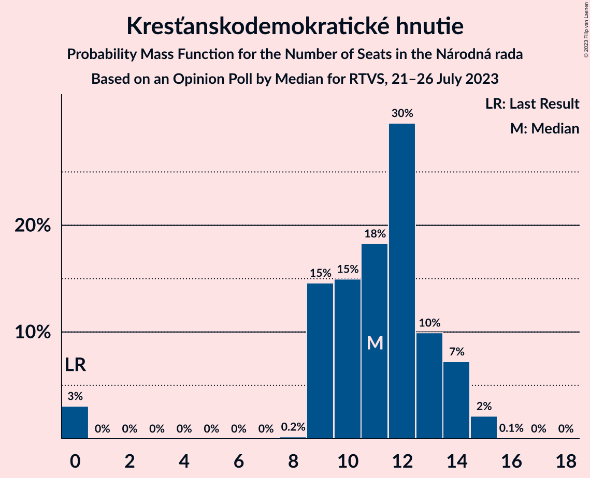

| Number of Seats | Probability | Accumulated | Special Marks |
|:---------------:|:-----------:|:-----------:|:-------------:|
| 0 | 3% | 100% | Last Result |
| 1 | 0% | 97% |  |
| 2 | 0% | 97% |  |
| 3 | 0% | 97% |  |
| 4 | 0% | 97% |  |
| 5 | 0% | 97% |  |
| 6 | 0% | 97% |  |
| 7 | 0% | 97% |  |
| 8 | 0.2% | 97% |  |
| 9 | 15% | 97% |  |
| 10 | 15% | 82% |  |
| 11 | 18% | 67% | Median |
| 12 | 30% | 49% |  |
| 13 | 10% | 19% |  |
| 14 | 7% | 9% |  |
| 15 | 2% | 2% |  |
| 16 | 0.1% | 0.1% |  |
| 17 | 0% | 0% |  |

### OBYČAJNÍ ĽUDIA a nezávislé osobnosti–Kresťanská únia–Za ľudí

*For a full overview of the results for this party, see the [OBYČAJNÍ ĽUDIA a nezávislé osobnosti–Kresťanská únia–Za ľudí](party-obyčajníľudiaanezávisléosobnosti–kresťanskáúnia–zaľudí.html) page.*

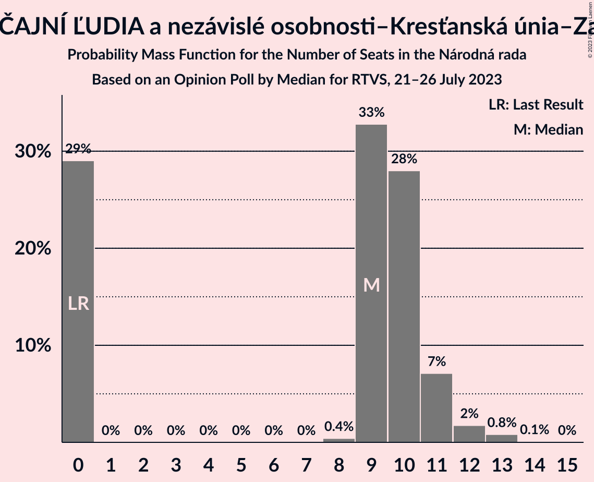

| Number of Seats | Probability | Accumulated | Special Marks |
|:---------------:|:-----------:|:-----------:|:-------------:|
| 0 | 29% | 100% | Last Result |
| 1 | 0% | 71% |  |
| 2 | 0% | 71% |  |
| 3 | 0% | 71% |  |
| 4 | 0% | 71% |  |
| 5 | 0% | 71% |  |
| 6 | 0% | 71% |  |
| 7 | 0% | 71% |  |
| 8 | 0.4% | 71% |  |
| 9 | 33% | 71% | Median |
| 10 | 28% | 38% |  |
| 11 | 7% | 10% |  |
| 12 | 2% | 3% |  |
| 13 | 0.8% | 0.9% |  |
| 14 | 0.1% | 0.1% |  |
| 15 | 0% | 0% |  |

### Slovenská národná strana

*For a full overview of the results for this party, see the [Slovenská národná strana](party-slovenskánárodnástrana.html) page.*

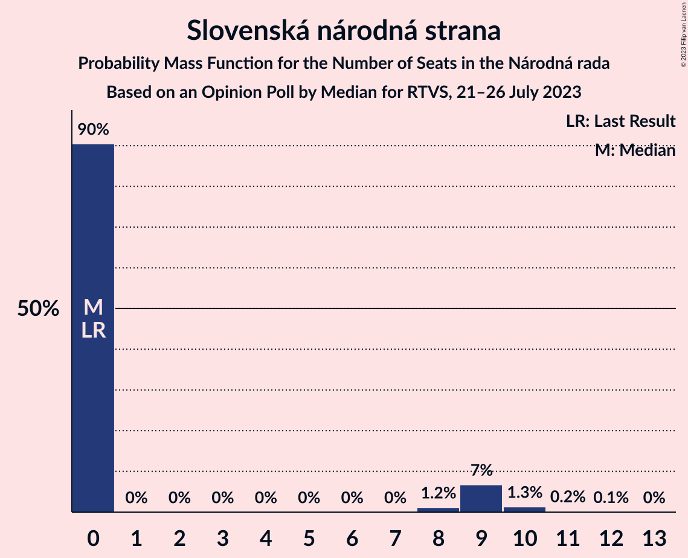

| Number of Seats | Probability | Accumulated | Special Marks |
|:---------------:|:-----------:|:-----------:|:-------------:|
| 0 | 90% | 100% | Last Result, Median |
| 1 | 0% | 10% |  |
| 2 | 0% | 10% |  |
| 3 | 0% | 10% |  |
| 4 | 0% | 10% |  |
| 5 | 0% | 10% |  |
| 6 | 0% | 10% |  |
| 7 | 0% | 10% |  |
| 8 | 1.2% | 10% |  |
| 9 | 7% | 8% |  |
| 10 | 1.3% | 2% |  |
| 11 | 0.2% | 0.3% |  |
| 12 | 0.1% | 0.1% |  |
| 13 | 0% | 0% |  |

### SPOLU–Občianska Demokracia

*For a full overview of the results for this party, see the [SPOLU–Občianska Demokracia](party-spolu–občianskademokracia.html) page.*

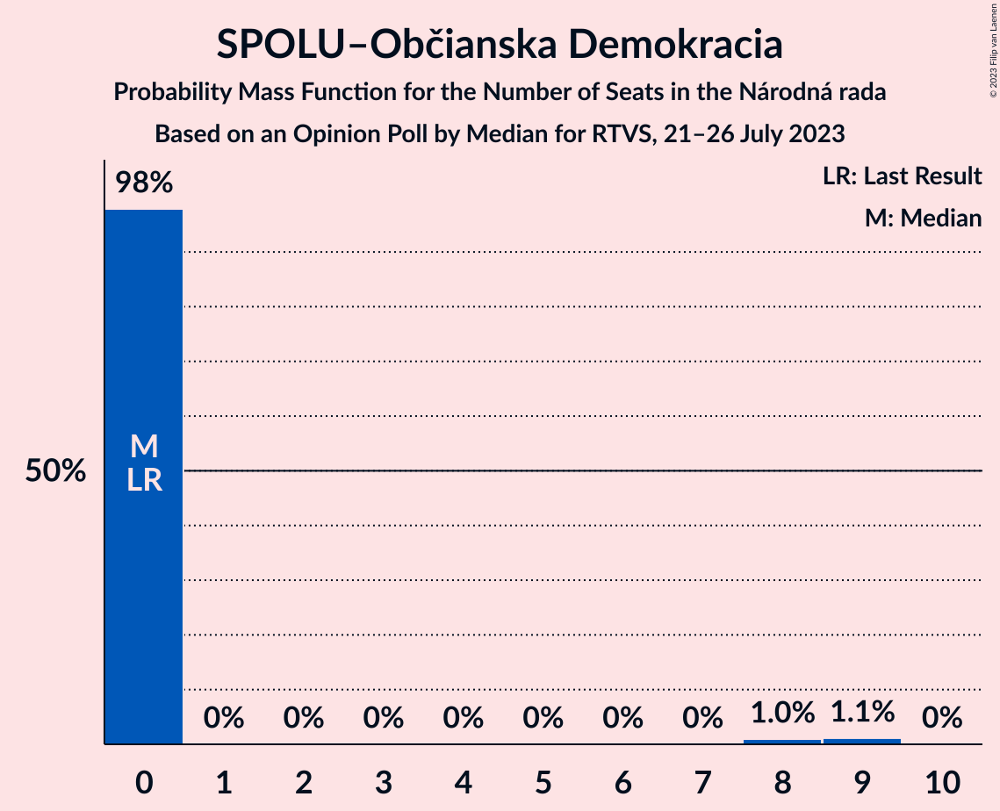

| Number of Seats | Probability | Accumulated | Special Marks |
|:---------------:|:-----------:|:-----------:|:-------------:|
| 0 | 98% | 100% | Last Result, Median |
| 1 | 0% | 2% |  |
| 2 | 0% | 2% |  |
| 3 | 0% | 2% |  |
| 4 | 0% | 2% |  |
| 5 | 0% | 2% |  |
| 6 | 0% | 2% |  |
| 7 | 0% | 2% |  |
| 8 | 1.0% | 2% |  |
| 9 | 1.1% | 1.2% |  |
| 10 | 0% | 0% |  |

### Strana maďarskej koalície–Magyar Koalíció Pártja

*For a full overview of the results for this party, see the [Strana maďarskej koalície–Magyar Koalíció Pártja](party-stranamaďarskejkoalície–magyarkoalíciópártja.html) page.*

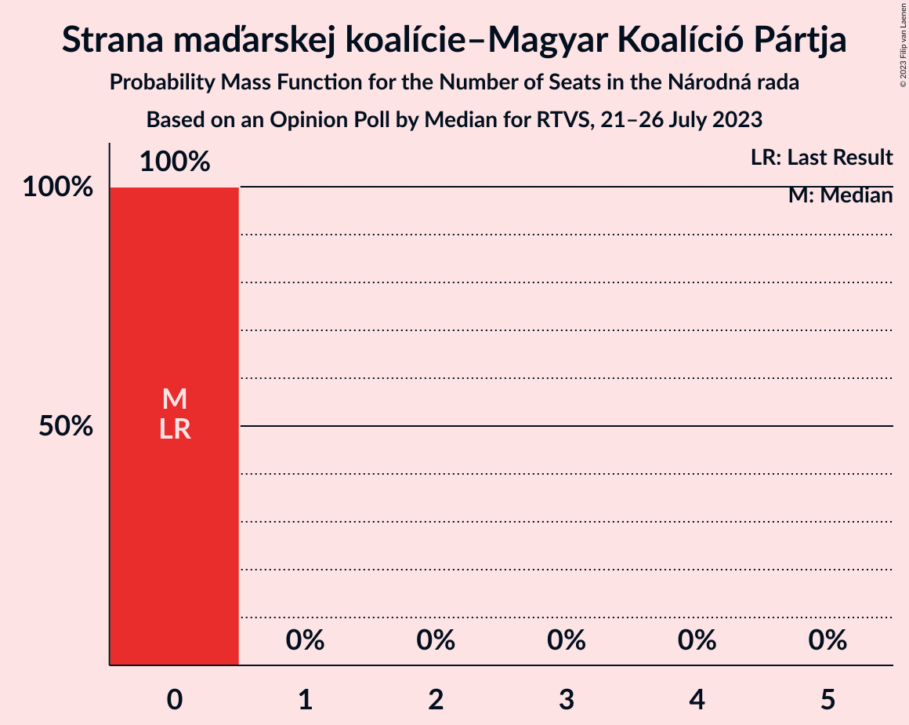

| Number of Seats | Probability | Accumulated | Special Marks |
|:---------------:|:-----------:|:-----------:|:-------------:|
| 0 | 100% | 100% | Last Result, Median |

## Coalitions

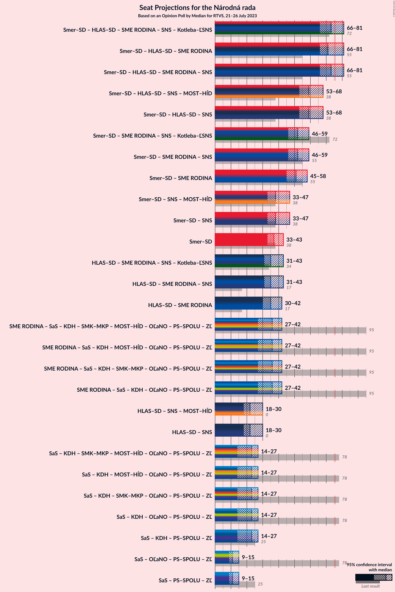

### Confidence Intervals

| Coalition | Last Result | Median | Majority? | 80% Confidence Interval | 90% Confidence Interval | 95% Confidence Interval | 99% Confidence Interval |
|:---------:|:-----------:|:------:|:---------:|:-----------------------:|:-----------------------:|:-----------------------:|:-----------------------:|
| SMER–sociálna demokracia – HLAS–sociálna demokracia – SME RODINA | 55 | 71 | 17% | 67–77 | 66–79 | 66–81 | 64–83 |
| SMER–sociálna demokracia – HLAS–sociálna demokracia – SME RODINA – Slovenská národná strana | 55 | 73 | 24% | 68–78 | 66–81 | 66–81 | 65–84 |
| SMER–sociálna demokracia – HLAS–sociálna demokracia – Slovenská národná strana | 38 | 59 | 0% | 56–64 | 55–66 | 53–68 | 53–71 |
| SMER–sociálna demokracia – SME RODINA – Slovenská národná strana | 55 | 52 | 0% | 47–56 | 46–58 | 46–59 | 45–63 |
| SMER–sociálna demokracia – SME RODINA | 55 | 51 | 0% | 47–55 | 46–56 | 45–58 | 44–60 |
| SMER–sociálna demokracia – Slovenská národná strana | 38 | 38 | 0% | 35–42 | 34–46 | 33–47 | 33–49 |
| SMER–sociálna demokracia | 38 | 37 | 0% | 34–41 | 33–41 | 33–43 | 32–45 |
| HLAS–sociálna demokracia – SME RODINA – Slovenská národná strana | 17 | 35 | 0% | 31–40 | 31–42 | 31–43 | 30–46 |
| HLAS–sociálna demokracia – SME RODINA | 17 | 35 | 0% | 31–38 | 31–39 | 30–42 | 29–42 |
| HLAS–sociálna demokracia – Slovenská národná strana | 0 | 22 | 0% | 19–26 | 18–29 | 18–30 | 17–33 |

### SMER–sociálna demokracia – HLAS–sociálna demokracia – SME RODINA

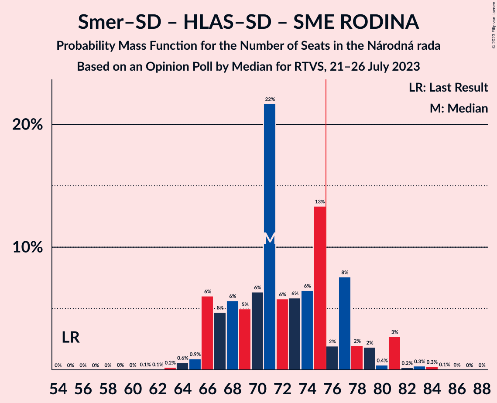

| Number of Seats | Probability | Accumulated | Special Marks |
|:---------------:|:-----------:|:-----------:|:-------------:|
| 55 | 0% | 100% | Last Result |
| 56 | 0% | 100% |  |
| 57 | 0% | 100% |  |
| 58 | 0% | 100% |  |
| 59 | 0% | 100% |  |
| 60 | 0% | 100% |  |
| 61 | 0.1% | 100% |  |
| 62 | 0.1% | 99.9% |  |
| 63 | 0.2% | 99.8% |  |
| 64 | 0.6% | 99.6% |  |
| 65 | 0.9% | 99.0% |  |
| 66 | 6% | 98% |  |
| 67 | 5% | 92% |  |
| 68 | 6% | 87% |  |
| 69 | 5% | 82% |  |
| 70 | 6% | 77% |  |
| 71 | 22% | 70% | Median |
| 72 | 6% | 49% |  |
| 73 | 6% | 43% |  |
| 74 | 6% | 37% |  |
| 75 | 13% | 31% |  |
| 76 | 2% | 17% | Majority |
| 77 | 8% | 15% |  |
| 78 | 2% | 8% |  |
| 79 | 2% | 6% |  |
| 80 | 0.4% | 4% |  |
| 81 | 3% | 4% |  |
| 82 | 0.2% | 0.9% |  |
| 83 | 0.3% | 0.7% |  |
| 84 | 0.3% | 0.4% |  |
| 85 | 0.1% | 0.1% |  |
| 86 | 0% | 0.1% |  |
| 87 | 0% | 0% |  |

### SMER–sociálna demokracia – HLAS–sociálna demokracia – SME RODINA – Slovenská národná strana

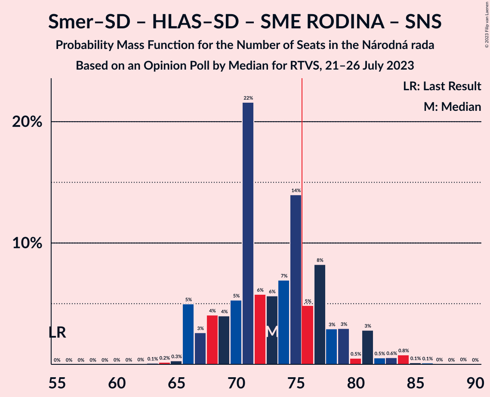

| Number of Seats | Probability | Accumulated | Special Marks |
|:---------------:|:-----------:|:-----------:|:-------------:|
| 55 | 0% | 100% | Last Result |
| 56 | 0% | 100% |  |
| 57 | 0% | 100% |  |
| 58 | 0% | 100% |  |
| 59 | 0% | 100% |  |
| 60 | 0% | 100% |  |
| 61 | 0% | 100% |  |
| 62 | 0% | 100% |  |
| 63 | 0.1% | 99.9% |  |
| 64 | 0.2% | 99.8% |  |
| 65 | 0.3% | 99.7% |  |
| 66 | 5% | 99.4% |  |
| 67 | 3% | 94% |  |
| 68 | 4% | 92% |  |
| 69 | 4% | 88% |  |
| 70 | 5% | 84% |  |
| 71 | 22% | 78% | Median |
| 72 | 6% | 57% |  |
| 73 | 6% | 51% |  |
| 74 | 7% | 45% |  |
| 75 | 14% | 38% |  |
| 76 | 5% | 24% | Majority |
| 77 | 8% | 20% |  |
| 78 | 3% | 11% |  |
| 79 | 3% | 8% |  |
| 80 | 0.5% | 6% |  |
| 81 | 3% | 5% |  |
| 82 | 0.5% | 2% |  |
| 83 | 0.6% | 2% |  |
| 84 | 0.8% | 1.1% |  |
| 85 | 0.1% | 0.3% |  |
| 86 | 0.1% | 0.2% |  |
| 87 | 0% | 0.1% |  |
| 88 | 0% | 0.1% |  |
| 89 | 0% | 0.1% |  |
| 90 | 0% | 0% |  |

### SMER–sociálna demokracia – HLAS–sociálna demokracia – Slovenská národná strana

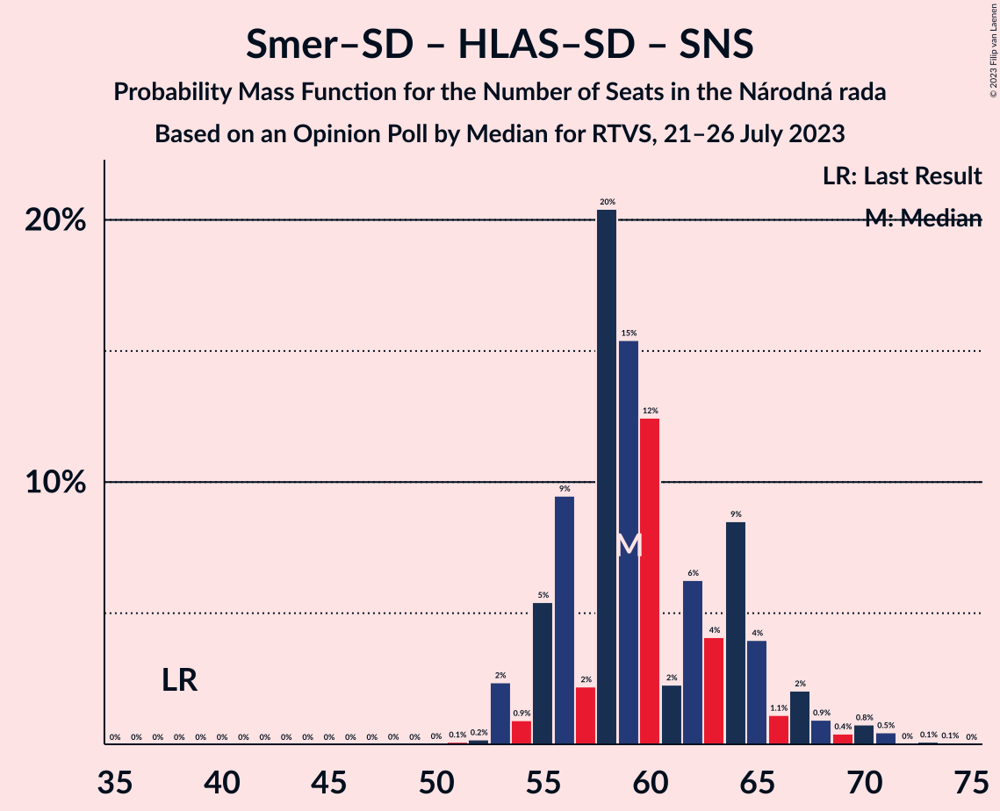

| Number of Seats | Probability | Accumulated | Special Marks |
|:---------------:|:-----------:|:-----------:|:-------------:|
| 38 | 0% | 100% | Last Result |
| 39 | 0% | 100% |  |
| 40 | 0% | 100% |  |
| 41 | 0% | 100% |  |
| 42 | 0% | 100% |  |
| 43 | 0% | 100% |  |
| 44 | 0% | 100% |  |
| 45 | 0% | 100% |  |
| 46 | 0% | 100% |  |
| 47 | 0% | 100% |  |
| 48 | 0% | 100% |  |
| 49 | 0% | 100% |  |
| 50 | 0% | 100% |  |
| 51 | 0.1% | 100% |  |
| 52 | 0.2% | 99.9% |  |
| 53 | 2% | 99.7% |  |
| 54 | 0.9% | 97% |  |
| 55 | 5% | 96% |  |
| 56 | 9% | 91% |  |
| 57 | 2% | 82% |  |
| 58 | 20% | 79% | Median |
| 59 | 15% | 59% |  |
| 60 | 12% | 43% |  |
| 61 | 2% | 31% |  |
| 62 | 6% | 29% |  |
| 63 | 4% | 22% |  |
| 64 | 9% | 18% |  |
| 65 | 4% | 10% |  |
| 66 | 1.1% | 6% |  |
| 67 | 2% | 5% |  |
| 68 | 0.9% | 3% |  |
| 69 | 0.4% | 2% |  |
| 70 | 0.8% | 1.4% |  |
| 71 | 0.5% | 0.7% |  |
| 72 | 0% | 0.2% |  |
| 73 | 0.1% | 0.2% |  |
| 74 | 0.1% | 0.1% |  |
| 75 | 0% | 0% |  |

### SMER–sociálna demokracia – SME RODINA – Slovenská národná strana

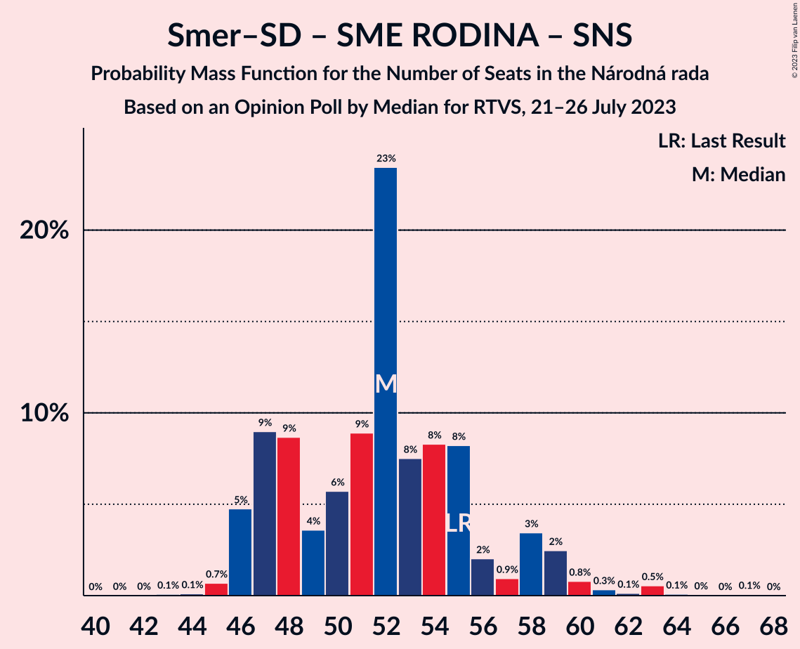

| Number of Seats | Probability | Accumulated | Special Marks |
|:---------------:|:-----------:|:-----------:|:-------------:|
| 41 | 0% | 100% |  |
| 42 | 0% | 99.9% |  |
| 43 | 0.1% | 99.9% |  |
| 44 | 0.1% | 99.8% |  |
| 45 | 0.7% | 99.7% |  |
| 46 | 5% | 99.0% |  |
| 47 | 9% | 94% |  |
| 48 | 9% | 85% |  |
| 49 | 4% | 77% |  |
| 50 | 6% | 73% | Median |
| 51 | 9% | 67% |  |
| 52 | 23% | 58% |  |
| 53 | 8% | 35% |  |
| 54 | 8% | 27% |  |
| 55 | 8% | 19% | Last Result |
| 56 | 2% | 11% |  |
| 57 | 0.9% | 9% |  |
| 58 | 3% | 8% |  |
| 59 | 2% | 5% |  |
| 60 | 0.8% | 2% |  |
| 61 | 0.3% | 1.2% |  |
| 62 | 0.1% | 0.9% |  |
| 63 | 0.5% | 0.8% |  |
| 64 | 0.1% | 0.2% |  |
| 65 | 0% | 0.1% |  |
| 66 | 0% | 0.1% |  |
| 67 | 0.1% | 0.1% |  |
| 68 | 0% | 0% |  |

### SMER–sociálna demokracia – SME RODINA

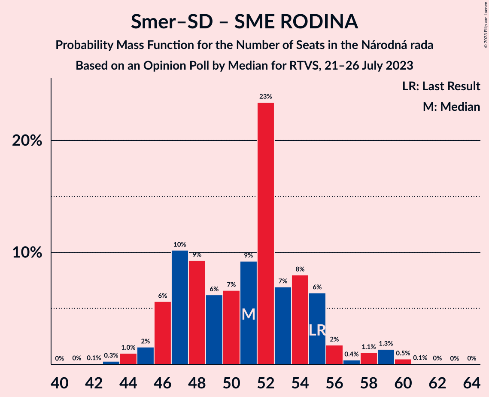

| Number of Seats | Probability | Accumulated | Special Marks |
|:---------------:|:-----------:|:-----------:|:-------------:|
| 40 | 0% | 100% |  |
| 41 | 0% | 99.9% |  |
| 42 | 0.1% | 99.9% |  |
| 43 | 0.3% | 99.8% |  |
| 44 | 1.0% | 99.6% |  |
| 45 | 2% | 98.6% |  |
| 46 | 6% | 97% |  |
| 47 | 10% | 91% |  |
| 48 | 9% | 81% |  |
| 49 | 6% | 72% |  |
| 50 | 7% | 66% | Median |
| 51 | 9% | 59% |  |
| 52 | 23% | 50% |  |
| 53 | 7% | 26% |  |
| 54 | 8% | 20% |  |
| 55 | 6% | 12% | Last Result |
| 56 | 2% | 5% |  |
| 57 | 0.4% | 3% |  |
| 58 | 1.1% | 3% |  |
| 59 | 1.3% | 2% |  |
| 60 | 0.5% | 0.6% |  |
| 61 | 0.1% | 0.2% |  |
| 62 | 0% | 0.1% |  |
| 63 | 0% | 0% |  |

### SMER–sociálna demokracia – Slovenská národná strana

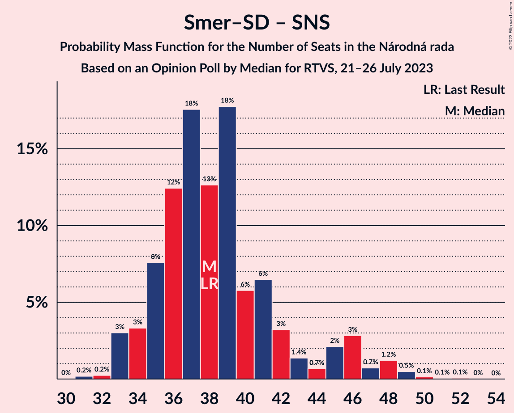

| Number of Seats | Probability | Accumulated | Special Marks |
|:---------------:|:-----------:|:-----------:|:-------------:|
| 31 | 0.2% | 100% |  |
| 32 | 0.2% | 99.8% |  |
| 33 | 3% | 99.5% |  |
| 34 | 3% | 97% |  |
| 35 | 8% | 93% |  |
| 36 | 12% | 86% |  |
| 37 | 18% | 73% | Median |
| 38 | 13% | 56% | Last Result |
| 39 | 18% | 43% |  |
| 40 | 6% | 25% |  |
| 41 | 6% | 19% |  |
| 42 | 3% | 13% |  |
| 43 | 1.4% | 10% |  |
| 44 | 0.7% | 8% |  |
| 45 | 2% | 8% |  |
| 46 | 3% | 6% |  |
| 47 | 0.7% | 3% |  |
| 48 | 1.2% | 2% |  |
| 49 | 0.5% | 0.8% |  |
| 50 | 0.1% | 0.3% |  |
| 51 | 0.1% | 0.1% |  |
| 52 | 0.1% | 0.1% |  |
| 53 | 0% | 0% |  |

### SMER–sociálna demokracia

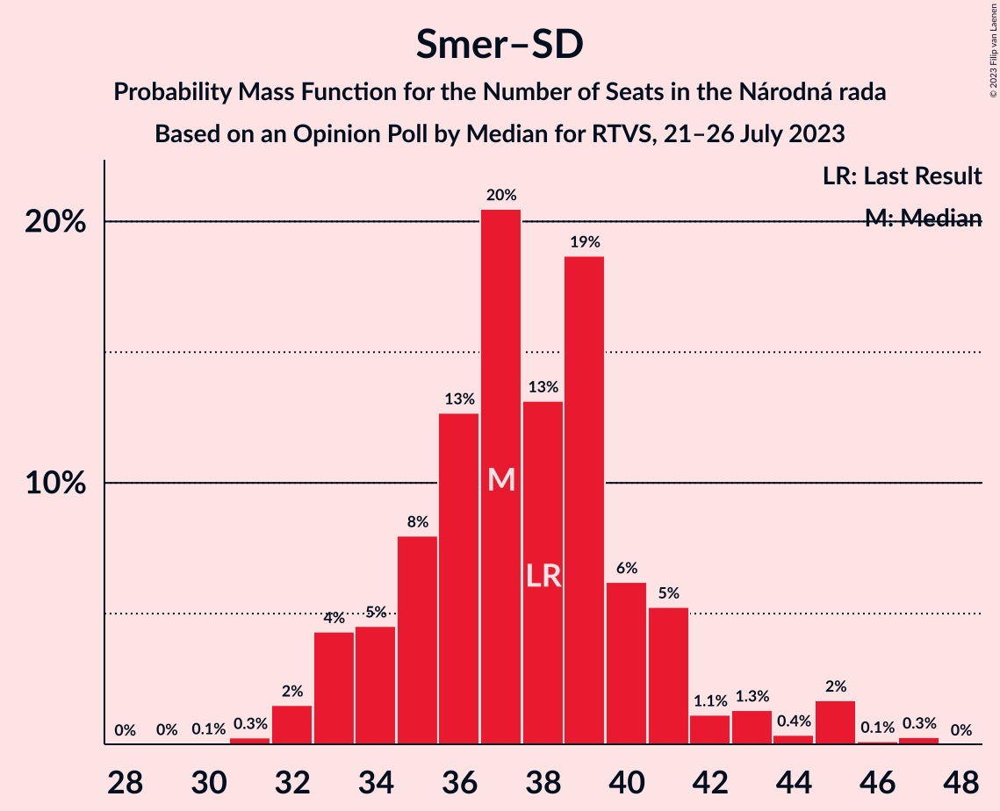

| Number of Seats | Probability | Accumulated | Special Marks |
|:---------------:|:-----------:|:-----------:|:-------------:|
| 30 | 0.1% | 100% |  |
| 31 | 0.3% | 99.9% |  |
| 32 | 2% | 99.7% |  |
| 33 | 4% | 98% |  |
| 34 | 5% | 94% |  |
| 35 | 8% | 89% |  |
| 36 | 13% | 81% |  |
| 37 | 20% | 69% | Median |
| 38 | 13% | 48% | Last Result |
| 39 | 19% | 35% |  |
| 40 | 6% | 16% |  |
| 41 | 5% | 10% |  |
| 42 | 1.1% | 5% |  |
| 43 | 1.3% | 4% |  |
| 44 | 0.4% | 2% |  |
| 45 | 2% | 2% |  |
| 46 | 0.1% | 0.4% |  |
| 47 | 0.3% | 0.3% |  |
| 48 | 0% | 0% |  |

### HLAS–sociálna demokracia – SME RODINA – Slovenská národná strana

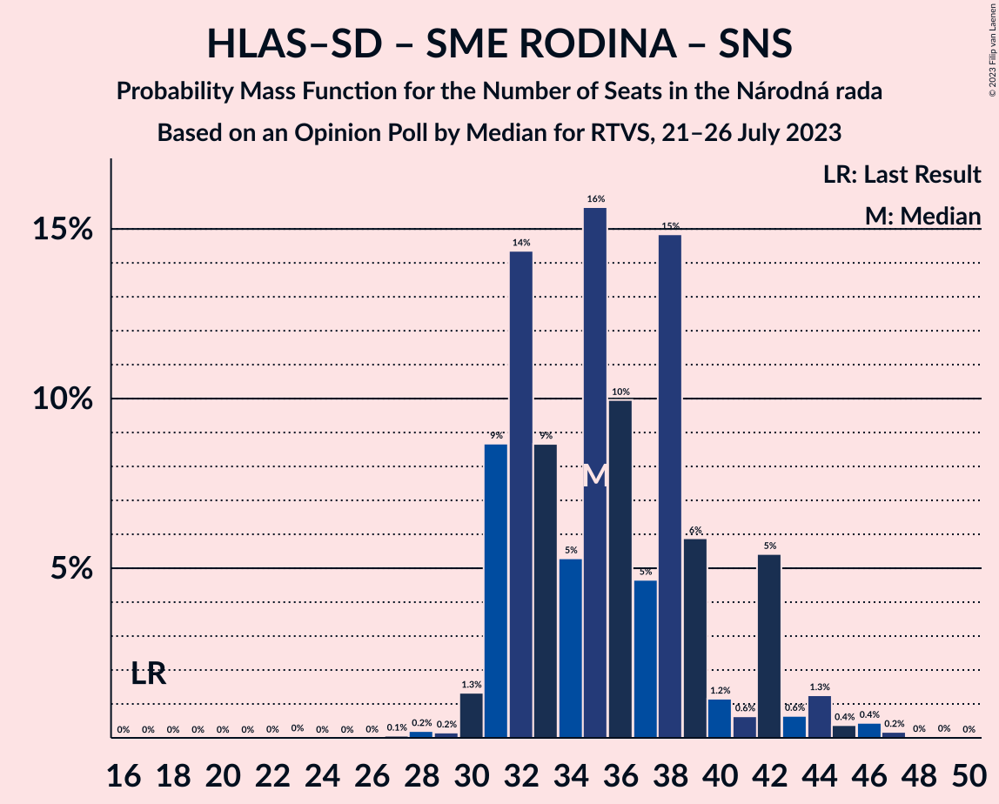

| Number of Seats | Probability | Accumulated | Special Marks |
|:---------------:|:-----------:|:-----------:|:-------------:|
| 17 | 0% | 100% | Last Result |
| 18 | 0% | 100% |  |
| 19 | 0% | 100% |  |
| 20 | 0% | 100% |  |
| 21 | 0% | 100% |  |
| 22 | 0% | 100% |  |
| 23 | 0% | 100% |  |
| 24 | 0% | 99.9% |  |
| 25 | 0% | 99.9% |  |
| 26 | 0% | 99.9% |  |
| 27 | 0.1% | 99.9% |  |
| 28 | 0.2% | 99.9% |  |
| 29 | 0.2% | 99.7% |  |
| 30 | 1.3% | 99.5% |  |
| 31 | 9% | 98% |  |
| 32 | 14% | 89% |  |
| 33 | 9% | 75% |  |
| 34 | 5% | 66% | Median |
| 35 | 16% | 61% |  |
| 36 | 10% | 46% |  |
| 37 | 5% | 36% |  |
| 38 | 15% | 31% |  |
| 39 | 6% | 16% |  |
| 40 | 1.2% | 10% |  |
| 41 | 0.6% | 9% |  |
| 42 | 5% | 8% |  |
| 43 | 0.6% | 3% |  |
| 44 | 1.3% | 2% |  |
| 45 | 0.4% | 1.1% |  |
| 46 | 0.4% | 0.7% |  |
| 47 | 0.2% | 0.3% |  |
| 48 | 0% | 0.1% |  |
| 49 | 0% | 0.1% |  |
| 50 | 0% | 0% |  |

### HLAS–sociálna demokracia – SME RODINA

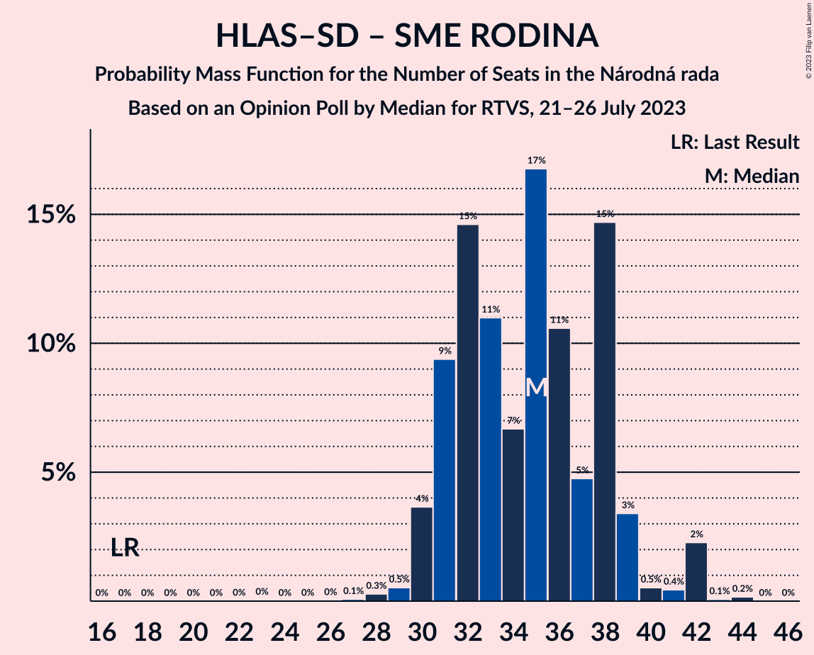

| Number of Seats | Probability | Accumulated | Special Marks |
|:---------------:|:-----------:|:-----------:|:-------------:|
| 17 | 0% | 100% | Last Result |
| 18 | 0% | 100% |  |
| 19 | 0% | 100% |  |
| 20 | 0% | 100% |  |
| 21 | 0% | 100% |  |
| 22 | 0% | 100% |  |
| 23 | 0% | 100% |  |
| 24 | 0% | 99.9% |  |
| 25 | 0% | 99.9% |  |
| 26 | 0% | 99.9% |  |
| 27 | 0.1% | 99.9% |  |
| 28 | 0.3% | 99.8% |  |
| 29 | 0.5% | 99.5% |  |
| 30 | 4% | 99.0% |  |
| 31 | 9% | 95% |  |
| 32 | 15% | 86% |  |
| 33 | 11% | 71% |  |
| 34 | 7% | 60% | Median |
| 35 | 17% | 54% |  |
| 36 | 11% | 37% |  |
| 37 | 5% | 26% |  |
| 38 | 15% | 22% |  |
| 39 | 3% | 7% |  |
| 40 | 0.5% | 3% |  |
| 41 | 0.4% | 3% |  |
| 42 | 2% | 3% |  |
| 43 | 0.1% | 0.2% |  |
| 44 | 0.2% | 0.2% |  |
| 45 | 0% | 0% |  |

### HLAS–sociálna demokracia – Slovenská národná strana

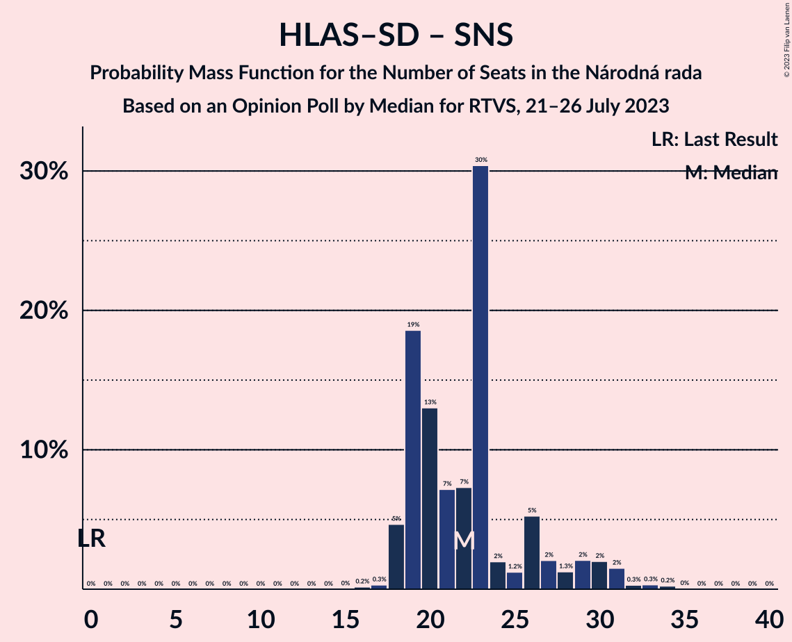

| Number of Seats | Probability | Accumulated | Special Marks |
|:---------------:|:-----------:|:-----------:|:-------------:|
| 0 | 0% | 100% | Last Result |
| 1 | 0% | 100% |  |
| 2 | 0% | 100% |  |
| 3 | 0% | 100% |  |
| 4 | 0% | 100% |  |
| 5 | 0% | 100% |  |
| 6 | 0% | 100% |  |
| 7 | 0% | 100% |  |
| 8 | 0% | 100% |  |
| 9 | 0% | 100% |  |
| 10 | 0% | 100% |  |
| 11 | 0% | 100% |  |
| 12 | 0% | 100% |  |
| 13 | 0% | 100% |  |
| 14 | 0% | 100% |  |
| 15 | 0% | 100% |  |
| 16 | 0.2% | 100% |  |
| 17 | 0.3% | 99.8% |  |
| 18 | 5% | 99.5% |  |
| 19 | 19% | 95% |  |
| 20 | 13% | 76% |  |
| 21 | 7% | 63% | Median |
| 22 | 7% | 56% |  |
| 23 | 30% | 49% |  |
| 24 | 2% | 18% |  |
| 25 | 1.2% | 16% |  |
| 26 | 5% | 15% |  |
| 27 | 2% | 10% |  |
| 28 | 1.3% | 8% |  |
| 29 | 2% | 7% |  |
| 30 | 2% | 4% |  |
| 31 | 2% | 2% |  |
| 32 | 0.3% | 0.9% |  |
| 33 | 0.3% | 0.6% |  |
| 34 | 0.2% | 0.3% |  |
| 35 | 0% | 0.1% |  |
| 36 | 0% | 0% |  |

## Technical Information

### Opinion Poll

+ **Polling firm:** Median
+ **Commissioner(s):** RTVS
+ **Fieldwork period:** 21–26 July 2023

### Calculations

+ **Sample size:** 1010
+ **Simulations done:** 1,048,576
+ **Error estimate:** 1.66%

