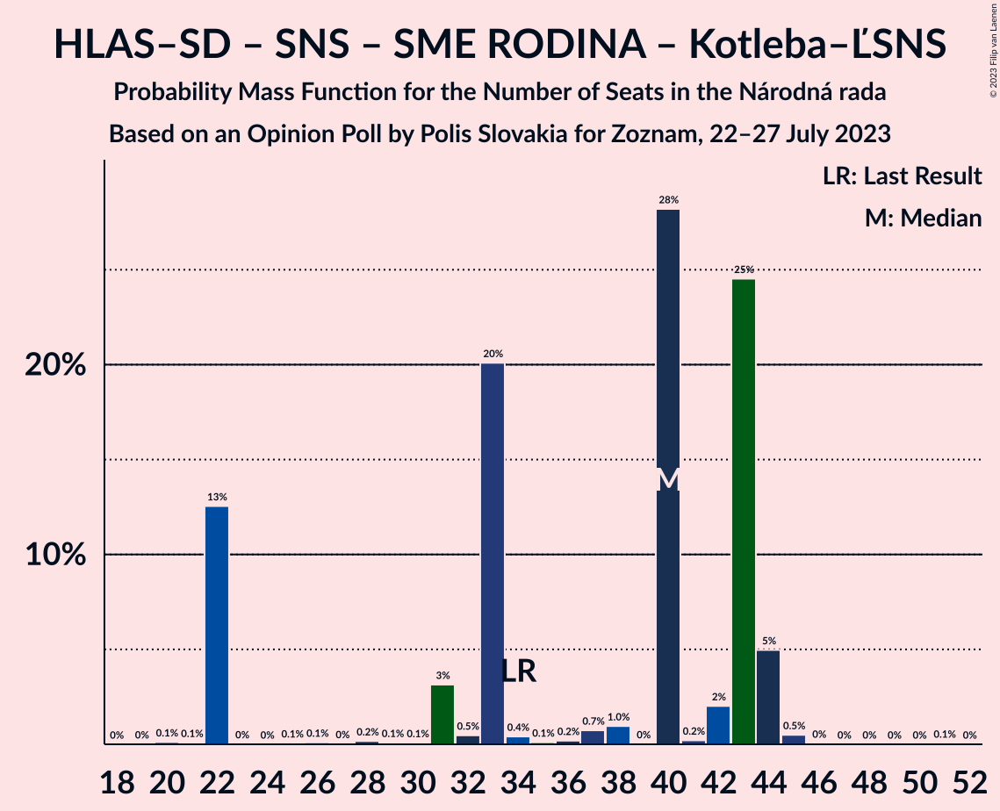

# Opinion Poll by Polis Slovakia for Zoznam, 22–27 July 2023

<a href="#voting-intentions">Voting Intentions</a> | <a href="#seats">Seats</a> | <a href="#coalitions">Coalitions</a> | <a href="#technical-information">Technical Information</a>

## Voting Intentions

### Confidence Intervals

| Party | Last Result | Poll Result | 80% Confidence Interval | 90% Confidence Interval | 95% Confidence Interval | 99% Confidence Interval |
|:-----:|:-----------:|:-----------:|:-----------------------:|:-----------------------:|:-----------------------:|:-----------------------:|
| SMER–sociálna demokracia | 18.3% | 23.1% | 21.4–24.8% |21.0–25.3% |20.6–25.7% |19.8–26.6% |
| Progresívne Slovensko | 7.0% | 13.6% | 12.3–15.1% |12.0–15.5% |11.6–15.8% |11.1–16.6% |
| HLAS–sociálna demokracia | 0.0% | 12.5% | 11.2–13.9% |10.9–14.3% |10.6–14.6% |10.0–15.3% |
| REPUBLIKA | 0.0% | 8.4% | 7.4–9.6% |7.1–10.0% |6.9–10.3% |6.4–10.9% |
| OBYČAJNÍ ĽUDIA a nezávislé osobnosti–Kresťanská únia–Za ľudí | 0.0% | 6.2% | 5.3–7.3% |5.1–7.5% |4.9–7.8% |4.5–8.4% |
| Kresťanskodemokratické hnutie | 4.6% | 5.5% | 4.7–6.5% |4.5–6.8% |4.3–7.1% |3.9–7.6% |
| Slovenská národná strana | 3.2% | 5.4% | 4.6–6.4% |4.4–6.7% |4.2–7.0% |3.8–7.5% |
| Strana maďarskej koalície–Magyar Koalíció Pártja | 3.9% | 5.4% | 4.6–6.4% |4.4–6.7% |4.2–7.0% |3.8–7.5% |
| Sloboda a Solidarita | 6.2% | 5.2% | 4.4–6.2% |4.2–6.5% |4.0–6.8% |3.7–7.3% |
| SME RODINA | 8.2% | 4.5% | 3.8–5.5% |3.6–5.7% |3.4–6.0% |3.1–6.5% |
| Kotleba–Ľudová strana Naše Slovensko | 8.0% | 3.1% | 2.5–3.9% |2.3–4.1% |2.2–4.3% |1.9–4.8% |
| SPOLU–Občianska Demokracia | 7.0% | 3.0% | 2.4–3.8% |2.2–4.0% |2.1–4.2% |1.9–4.6% |
| MODRÍ–Európske Slovensko–MOST–HÍD | 0.0% | 2.5% | 2.0–3.3% |1.8–3.5% |1.7–3.7% |1.5–4.1% |
| Magyar Fórum | 0.0% | 1.6% | 1.2–2.3% |1.1–2.5% |1.0–2.6% |0.9–3.0% |

*Note:* The poll result column reflects the actual value used in the calculations. Published results may vary slightly, and in addition be rounded to fewer digits.

## Seats

### Confidence Intervals

| Party | Last Result | Median | 80% Confidence Interval | 90% Confidence Interval | 95% Confidence Interval | 99% Confidence Interval |
|:-----:|:-----------:|:------:|:-----------------------:|:-----------------------:|:-----------------------:|:-----------------------:|
| <a href="#smer–sociálna-demokracia">SMER–sociálna demokracia</a> | 38 | 42 | 35–46 |35–46 |35–46 |35–46 |
| <a href="#progresívne-slovensko">Progresívne Slovensko</a> | 0 | 23 | 20–29 |20–29 |20–31 |19–31 |
| <a href="#hlas–sociálna-demokracia">HLAS–sociálna demokracia</a> | 0 | 21 | 21–23 |21–29 |20–29 |19–29 |
| <a href="#republika">REPUBLIKA</a> | 0 | 16 | 13–18 |13–18 |12–18 |12–19 |
| <a href="#obyčajní-ľudia-a-nezávislé-osobnosti–kresťanská-únia–za-ľudí">OBYČAJNÍ ĽUDIA a nezávislé osobnosti–Kresťanská únia–Za ľudí</a> | 0 | 12 | 10–13 |10–13 |9–13 |9–15 |
| <a href="#kresťanskodemokratické-hnutie">Kresťanskodemokratické hnutie</a> | 0 | 10 | 0–11 |0–11 |0–11 |0–13 |
| <a href="#slovenská-národná-strana">Slovenská národná strana</a> | 0 | 10 | 0–12 |0–12 |0–13 |0–14 |
| <a href="#strana-maďarskej-koalície–magyar-koalíció-pártja">Strana maďarskej koalície–Magyar Koalíció Pártja</a> | 0 | 8 | 0–13 |0–13 |0–13 |0–13 |
| <a href="#sloboda-a-solidarita">Sloboda a Solidarita</a> | 13 | 9 | 0–13 |0–13 |0–13 |0–13 |
| <a href="#sme-rodina">SME RODINA</a> | 17 | 9 | 0–10 |0–10 |0–12 |0–12 |
| <a href="#kotleba–ľudová-strana-naše-slovensko">Kotleba–Ľudová strana Naše Slovensko</a> | 17 | 0 | 0 |0 |0 |0 |
| <a href="#spolu–občianska-demokracia">SPOLU–Občianska Demokracia</a> | 0 | 0 | 0 |0 |0 |0 |
| <a href="#modrí–európske-slovensko–most–híd">MODRÍ–Európske Slovensko–MOST–HÍD</a> | 0 | 0 | 0 |0 |0 |0 |
| <a href="#magyar-fórum">Magyar Fórum</a> | 0 | 0 | 0 |0 |0 |0 |

### SMER–sociálna demokracia

*For a full overview of the results for this party, see the [SMER–sociálna demokracia](party-smer–sociálnademokracia.html) page.*

| Number of Seats | Probability | Accumulated | Special Marks |
|:---------------:|:-----------:|:-----------:|:-------------:|
| 35 | 23% | 100% |  |
| 36 | 0.3% | 77% |  |
| 37 | 2% | 77% |  |
| 38 | 0.2% | 75% | Last Result |
| 39 | 20% | 74% |  |
| 40 | 0.6% | 54% |  |
| 41 | 0.8% | 53% |  |
| 42 | 5% | 53% | Median |
| 43 | 9% | 47% |  |
| 44 | 25% | 38% |  |
| 45 | 0.1% | 13% |  |
| 46 | 13% | 13% |  |
| 47 | 0.2% | 0.5% |  |
| 48 | 0% | 0.3% |  |
| 49 | 0.1% | 0.3% |  |
| 50 | 0.1% | 0.2% |  |
| 51 | 0% | 0.1% |  |
| 52 | 0% | 0.1% |  |
| 53 | 0% | 0% |  |

### Progresívne Slovensko

*For a full overview of the results for this party, see the [Progresívne Slovensko](party-progresívneslovensko.html) page.*

| Number of Seats | Probability | Accumulated | Special Marks |
|:---------------:|:-----------:|:-----------:|:-------------:|
| 0 | 0% | 100% | Last Result |
| 1 | 0% | 100% |  |
| 2 | 0% | 100% |  |
| 3 | 0% | 100% |  |
| 4 | 0% | 100% |  |
| 5 | 0% | 100% |  |
| 6 | 0% | 100% |  |
| 7 | 0% | 100% |  |
| 8 | 0% | 100% |  |
| 9 | 0% | 100% |  |
| 10 | 0% | 100% |  |
| 11 | 0% | 100% |  |
| 12 | 0% | 100% |  |
| 13 | 0% | 100% |  |
| 14 | 0% | 100% |  |
| 15 | 0% | 100% |  |
| 16 | 0% | 100% |  |
| 17 | 0% | 100% |  |
| 18 | 0% | 100% |  |
| 19 | 0.6% | 100% |  |
| 20 | 23% | 99.4% |  |
| 21 | 1.0% | 76% |  |
| 22 | 2% | 75% |  |
| 23 | 25% | 73% | Median |
| 24 | 10% | 48% |  |
| 25 | 2% | 39% |  |
| 26 | 0.2% | 37% |  |
| 27 | 0.3% | 36% |  |
| 28 | 20% | 36% |  |
| 29 | 13% | 16% |  |
| 30 | 0.4% | 3% |  |
| 31 | 3% | 3% |  |
| 32 | 0.1% | 0.1% |  |
| 33 | 0% | 0% |  |

### HLAS–sociálna demokracia

*For a full overview of the results for this party, see the [HLAS–sociálna demokracia](party-hlas–sociálnademokracia.html) page.*

| Number of Seats | Probability | Accumulated | Special Marks |
|:---------------:|:-----------:|:-----------:|:-------------:|
| 0 | 0% | 100% | Last Result |
| 1 | 0% | 100% |  |
| 2 | 0% | 100% |  |
| 3 | 0% | 100% |  |
| 4 | 0% | 100% |  |
| 5 | 0% | 100% |  |
| 6 | 0% | 100% |  |
| 7 | 0% | 100% |  |
| 8 | 0% | 100% |  |
| 9 | 0% | 100% |  |
| 10 | 0% | 100% |  |
| 11 | 0% | 100% |  |
| 12 | 0% | 100% |  |
| 13 | 0% | 100% |  |
| 14 | 0% | 100% |  |
| 15 | 0% | 100% |  |
| 16 | 0.1% | 100% |  |
| 17 | 0.1% | 99.9% |  |
| 18 | 0.1% | 99.8% |  |
| 19 | 0.6% | 99.7% |  |
| 20 | 2% | 99.1% |  |
| 21 | 50% | 97% | Median |
| 22 | 13% | 46% |  |
| 23 | 26% | 33% |  |
| 24 | 0.1% | 7% |  |
| 25 | 1.4% | 7% |  |
| 26 | 0.2% | 6% |  |
| 27 | 0% | 6% |  |
| 28 | 0.1% | 6% |  |
| 29 | 5% | 5% |  |
| 30 | 0% | 0.2% |  |
| 31 | 0.2% | 0.2% |  |
| 32 | 0% | 0.1% |  |
| 33 | 0% | 0% |  |

### REPUBLIKA

*For a full overview of the results for this party, see the [REPUBLIKA](party-republika.html) page.*

| Number of Seats | Probability | Accumulated | Special Marks |
|:---------------:|:-----------:|:-----------:|:-------------:|
| 0 | 0% | 100% | Last Result |
| 1 | 0% | 100% |  |
| 2 | 0% | 100% |  |
| 3 | 0% | 100% |  |
| 4 | 0% | 100% |  |
| 5 | 0% | 100% |  |
| 6 | 0% | 100% |  |
| 7 | 0% | 100% |  |
| 8 | 0% | 100% |  |
| 9 | 0% | 100% |  |
| 10 | 0% | 100% |  |
| 11 | 0.2% | 100% |  |
| 12 | 3% | 99.8% |  |
| 13 | 10% | 97% |  |
| 14 | 3% | 87% |  |
| 15 | 25% | 84% |  |
| 16 | 44% | 59% | Median |
| 17 | 1.4% | 15% |  |
| 18 | 13% | 13% |  |
| 19 | 0.6% | 0.7% |  |
| 20 | 0.1% | 0.2% |  |
| 21 | 0.1% | 0.1% |  |
| 22 | 0% | 0% |  |

### OBYČAJNÍ ĽUDIA a nezávislé osobnosti–Kresťanská únia–Za ľudí

*For a full overview of the results for this party, see the [OBYČAJNÍ ĽUDIA a nezávislé osobnosti–Kresťanská únia–Za ľudí](party-obyčajníľudiaanezávisléosobnosti–kresťanskáúnia–zaľudí.html) page.*

| Number of Seats | Probability | Accumulated | Special Marks |
|:---------------:|:-----------:|:-----------:|:-------------:|
| 0 | 0.4% | 100% | Last Result |
| 1 | 0% | 99.6% |  |
| 2 | 0% | 99.6% |  |
| 3 | 0% | 99.6% |  |
| 4 | 0% | 99.6% |  |
| 5 | 0% | 99.6% |  |
| 6 | 0% | 99.6% |  |
| 7 | 0% | 99.6% |  |
| 8 | 0% | 99.6% |  |
| 9 | 3% | 99.6% |  |
| 10 | 11% | 96% |  |
| 11 | 27% | 86% |  |
| 12 | 33% | 59% | Median |
| 13 | 25% | 26% |  |
| 14 | 0.8% | 2% |  |
| 15 | 0.5% | 0.7% |  |
| 16 | 0.1% | 0.2% |  |
| 17 | 0.1% | 0.1% |  |
| 18 | 0% | 0% |  |

### Kresťanskodemokratické hnutie

*For a full overview of the results for this party, see the [Kresťanskodemokratické hnutie](party-kresťanskodemokratickéhnutie.html) page.*

| Number of Seats | Probability | Accumulated | Special Marks |
|:---------------:|:-----------:|:-----------:|:-------------:|
| 0 | 29% | 100% | Last Result |
| 1 | 0% | 71% |  |
| 2 | 0% | 71% |  |
| 3 | 0% | 71% |  |
| 4 | 0% | 71% |  |
| 5 | 0% | 71% |  |
| 6 | 0% | 71% |  |
| 7 | 0% | 71% |  |
| 8 | 0% | 71% |  |
| 9 | 0.4% | 71% |  |
| 10 | 41% | 71% | Median |
| 11 | 27% | 29% |  |
| 12 | 0.6% | 2% |  |
| 13 | 1.1% | 1.2% |  |
| 14 | 0.1% | 0.1% |  |
| 15 | 0% | 0% |  |

### Slovenská národná strana

*For a full overview of the results for this party, see the [Slovenská národná strana](party-slovenskánárodnástrana.html) page.*

| Number of Seats | Probability | Accumulated | Special Marks |
|:---------------:|:-----------:|:-----------:|:-------------:|
| 0 | 13% | 100% | Last Result |
| 1 | 0% | 87% |  |
| 2 | 0% | 87% |  |
| 3 | 0% | 87% |  |
| 4 | 0% | 87% |  |
| 5 | 0% | 87% |  |
| 6 | 0% | 87% |  |
| 7 | 0% | 87% |  |
| 8 | 0% | 87% |  |
| 9 | 3% | 87% |  |
| 10 | 47% | 83% | Median |
| 11 | 5% | 37% |  |
| 12 | 27% | 31% |  |
| 13 | 3% | 4% |  |
| 14 | 0.8% | 0.8% |  |
| 15 | 0% | 0% |  |

### Strana maďarskej koalície–Magyar Koalíció Pártja

*For a full overview of the results for this party, see the [Strana maďarskej koalície–Magyar Koalíció Pártja](party-stranamaďarskejkoalície–magyarkoalíciópártja.html) page.*

| Number of Seats | Probability | Accumulated | Special Marks |
|:---------------:|:-----------:|:-----------:|:-------------:|
| 0 | 45% | 100% | Last Result |
| 1 | 0% | 55% |  |
| 2 | 0% | 55% |  |
| 3 | 0% | 55% |  |
| 4 | 0% | 55% |  |
| 5 | 0% | 55% |  |
| 6 | 0% | 55% |  |
| 7 | 0% | 55% |  |
| 8 | 23% | 55% | Median |
| 9 | 9% | 32% |  |
| 10 | 1.3% | 24% |  |
| 11 | 2% | 22% |  |
| 12 | 0.6% | 21% |  |
| 13 | 20% | 20% |  |
| 14 | 0.2% | 0.2% |  |
| 15 | 0% | 0% |  |

### Sloboda a Solidarita

*For a full overview of the results for this party, see the [Sloboda a Solidarita](party-slobodaasolidarita.html) page.*

| Number of Seats | Probability | Accumulated | Special Marks |
|:---------------:|:-----------:|:-----------:|:-------------:|
| 0 | 28% | 100% |  |
| 1 | 0% | 72% |  |
| 2 | 0% | 72% |  |
| 3 | 0% | 72% |  |
| 4 | 0% | 72% |  |
| 5 | 0% | 72% |  |
| 6 | 0% | 72% |  |
| 7 | 0% | 72% |  |
| 8 | 0% | 72% |  |
| 9 | 23% | 72% | Median |
| 10 | 3% | 50% |  |
| 11 | 33% | 46% |  |
| 12 | 0.6% | 13% |  |
| 13 | 13% | 13% | Last Result |
| 14 | 0% | 0.1% |  |
| 15 | 0% | 0% |  |

### SME RODINA

*For a full overview of the results for this party, see the [SME RODINA](party-smerodina.html) page.*

| Number of Seats | Probability | Accumulated | Special Marks |
|:---------------:|:-----------:|:-----------:|:-------------:|
| 0 | 44% | 100% |  |
| 1 | 0% | 56% |  |
| 2 | 0% | 56% |  |
| 3 | 0% | 56% |  |
| 4 | 0% | 56% |  |
| 5 | 0% | 56% |  |
| 6 | 0% | 56% |  |
| 7 | 0% | 56% |  |
| 8 | 0% | 56% |  |
| 9 | 27% | 56% | Median |
| 10 | 26% | 29% |  |
| 11 | 0.1% | 3% |  |
| 12 | 3% | 3% |  |
| 13 | 0% | 0.1% |  |
| 14 | 0.1% | 0.1% |  |
| 15 | 0% | 0% |  |
| 16 | 0% | 0% |  |
| 17 | 0% | 0% | Last Result |

### Kotleba–Ľudová strana Naše Slovensko

*For a full overview of the results for this party, see the [Kotleba–Ľudová strana Naše Slovensko](party-kotleba–ľudovástrananašeslovensko.html) page.*

| Number of Seats | Probability | Accumulated | Special Marks |
|:---------------:|:-----------:|:-----------:|:-------------:|
| 0 | 100% | 100% | Median |
| 1 | 0% | 0% |  |
| 2 | 0% | 0% |  |
| 3 | 0% | 0% |  |
| 4 | 0% | 0% |  |
| 5 | 0% | 0% |  |
| 6 | 0% | 0% |  |
| 7 | 0% | 0% |  |
| 8 | 0% | 0% |  |
| 9 | 0% | 0% |  |
| 10 | 0% | 0% |  |
| 11 | 0% | 0% |  |
| 12 | 0% | 0% |  |
| 13 | 0% | 0% |  |
| 14 | 0% | 0% |  |
| 15 | 0% | 0% |  |
| 16 | 0% | 0% |  |
| 17 | 0% | 0% | Last Result |

### SPOLU–Občianska Demokracia

*For a full overview of the results for this party, see the [SPOLU–Občianska Demokracia](party-spolu–občianskademokracia.html) page.*

| Number of Seats | Probability | Accumulated | Special Marks |
|:---------------:|:-----------:|:-----------:|:-------------:|
| 0 | 99.9% | 100% | Last Result, Median |
| 1 | 0% | 0.1% |  |
| 2 | 0% | 0.1% |  |
| 3 | 0% | 0.1% |  |
| 4 | 0% | 0.1% |  |
| 5 | 0% | 0.1% |  |
| 6 | 0% | 0.1% |  |
| 7 | 0% | 0.1% |  |
| 8 | 0% | 0.1% |  |
| 9 | 0% | 0.1% |  |
| 10 | 0.1% | 0.1% |  |
| 11 | 0% | 0% |  |

### MODRÍ–Európske Slovensko–MOST–HÍD

*For a full overview of the results for this party, see the [MODRÍ–Európske Slovensko–MOST–HÍD](party-modrí–európskeslovensko–most–híd.html) page.*

| Number of Seats | Probability | Accumulated | Special Marks |
|:---------------:|:-----------:|:-----------:|:-------------:|
| 0 | 100% | 100% | Last Result, Median |

### Magyar Fórum

*For a full overview of the results for this party, see the [Magyar Fórum](party-magyarfórum.html) page.*

| Number of Seats | Probability | Accumulated | Special Marks |
|:---------------:|:-----------:|:-----------:|:-------------:|
| 0 | 100% | 100% | Last Result, Median |

## Coalitions

### Confidence Intervals

| Coalition | Last Result | Median | Majority? | 80% Confidence Interval | 90% Confidence Interval | 95% Confidence Interval | 99% Confidence Interval |
|:---------:|:-----------:|:------:|:---------:|:-----------------------:|:-----------------------:|:-----------------------:|:-----------------------:|
| SMER–sociálna demokracia – HLAS–sociálna demokracia – Slovenská národná strana – SME RODINA – Kotleba–Ľudová strana Naše Slovensko | 72 | 75 | 40% | 68–87 | 68–87 | 68–87 | 68–87 |
| SMER–sociálna demokracia – HLAS–sociálna demokracia – Slovenská národná strana – SME RODINA | 55 | 75 | 40% | 68–87 | 68–87 | 68–87 | 68–87 |
| SMER–sociálna demokracia – HLAS–sociálna demokracia – Slovenská národná strana | 38 | 72 | 32% | 66–77 | 66–83 | 66–83 | 66–83 |
| SMER–sociálna demokracia – HLAS–sociálna demokracia – SME RODINA | 55 | 68 | 3% | 62–75 | 62–75 | 62–77 | 62–77 |
| SMER–sociálna demokracia – Slovenská národná strana – SME RODINA – Kotleba–Ľudová strana Naše Slovensko | 72 | 54 | 0% | 46–66 | 46–66 | 46–66 | 46–66 |
| SMER–sociálna demokracia – Slovenská národná strana – SME RODINA | 55 | 54 | 0% | 46–66 | 46–66 | 46–66 | 46–66 |
| SMER–sociálna demokracia – Slovenská národná strana | 38 | 49 | 0% | 45–56 | 45–56 | 45–56 | 44–56 |
| SMER–sociálna demokracia – SME RODINA | 55 | 44 | 0% | 39–54 | 39–54 | 39–54 | 38–54 |
| SMER–sociálna demokracia | 38 | 42 | 0% | 35–46 | 35–46 | 35–46 | 35–46 |
| HLAS–sociálna demokracia – Slovenská národná strana – SME RODINA – Kotleba–Ľudová strana Naše Slovensko | 34 | 40 | 0% | 22–43 | 22–44 | 22–44 | 22–45 |
| HLAS–sociálna demokracia – Slovenská národná strana – SME RODINA | 17 | 40 | 0% | 22–43 | 22–44 | 22–44 | 22–45 |
| HLAS–sociálna demokracia – Slovenská národná strana | 0 | 33 | 0% | 22–34 | 22–40 | 22–40 | 22–40 |
| HLAS–sociálna demokracia – SME RODINA | 17 | 30 | 0% | 22–31 | 22–32 | 21–35 | 19–35 |

### SMER–sociálna demokracia – HLAS–sociálna demokracia – Slovenská národná strana – SME RODINA – Kotleba–Ľudová strana Naše Slovensko

| Number of Seats | Probability | Accumulated | Special Marks |
|:---------------:|:-----------:|:-----------:|:-------------:|
| 56 | 0.1% | 100% |  |
| 57 | 0% | 99.9% |  |
| 58 | 0% | 99.9% |  |
| 59 | 0% | 99.9% |  |
| 60 | 0% | 99.9% |  |
| 61 | 0% | 99.9% |  |
| 62 | 0% | 99.9% |  |
| 63 | 0% | 99.9% |  |
| 64 | 0% | 99.9% |  |
| 65 | 0.1% | 99.9% |  |
| 66 | 0% | 99.8% |  |
| 67 | 0.1% | 99.8% |  |
| 68 | 13% | 99.7% |  |
| 69 | 0.3% | 87% |  |
| 70 | 0% | 87% |  |
| 71 | 0% | 87% |  |
| 72 | 20% | 87% | Last Result |
| 73 | 0.1% | 67% |  |
| 74 | 3% | 67% |  |
| 75 | 24% | 64% |  |
| 76 | 0.4% | 40% | Majority |
| 77 | 0.1% | 39% |  |
| 78 | 0.7% | 39% |  |
| 79 | 0% | 38% |  |
| 80 | 0.1% | 38% |  |
| 81 | 3% | 38% |  |
| 82 | 0.1% | 36% | Median |
| 83 | 5% | 36% |  |
| 84 | 2% | 30% |  |
| 85 | 0.5% | 28% |  |
| 86 | 3% | 28% |  |
| 87 | 25% | 25% |  |
| 88 | 0.1% | 0.2% |  |
| 89 | 0% | 0.1% |  |
| 90 | 0% | 0.1% |  |
| 91 | 0% | 0.1% |  |
| 92 | 0% | 0.1% |  |
| 93 | 0% | 0.1% |  |
| 94 | 0% | 0% |  |

### SMER–sociálna demokracia – HLAS–sociálna demokracia – Slovenská národná strana – SME RODINA

| Number of Seats | Probability | Accumulated | Special Marks |
|:---------------:|:-----------:|:-----------:|:-------------:|
| 55 | 0% | 100% | Last Result |
| 56 | 0.1% | 100% |  |
| 57 | 0% | 99.9% |  |
| 58 | 0% | 99.9% |  |
| 59 | 0% | 99.9% |  |
| 60 | 0% | 99.9% |  |
| 61 | 0% | 99.9% |  |
| 62 | 0% | 99.9% |  |
| 63 | 0% | 99.9% |  |
| 64 | 0% | 99.9% |  |
| 65 | 0.1% | 99.9% |  |
| 66 | 0% | 99.8% |  |
| 67 | 0.1% | 99.8% |  |
| 68 | 13% | 99.7% |  |
| 69 | 0.3% | 87% |  |
| 70 | 0% | 87% |  |
| 71 | 0% | 87% |  |
| 72 | 20% | 87% |  |
| 73 | 0.1% | 67% |  |
| 74 | 3% | 67% |  |
| 75 | 24% | 64% |  |
| 76 | 0.4% | 40% | Majority |
| 77 | 0.1% | 39% |  |
| 78 | 0.7% | 39% |  |
| 79 | 0% | 38% |  |
| 80 | 0.1% | 38% |  |
| 81 | 3% | 38% |  |
| 82 | 0.1% | 36% | Median |
| 83 | 5% | 36% |  |
| 84 | 2% | 30% |  |
| 85 | 0.5% | 28% |  |
| 86 | 3% | 28% |  |
| 87 | 25% | 25% |  |
| 88 | 0.1% | 0.2% |  |
| 89 | 0% | 0.1% |  |
| 90 | 0% | 0.1% |  |
| 91 | 0% | 0.1% |  |
| 92 | 0% | 0.1% |  |
| 93 | 0% | 0.1% |  |
| 94 | 0% | 0% |  |

### SMER–sociálna demokracia – HLAS–sociálna demokracia – Slovenská národná strana

| Number of Seats | Probability | Accumulated | Special Marks |
|:---------------:|:-----------:|:-----------:|:-------------:|
| 38 | 0% | 100% | Last Result |
| 39 | 0% | 100% |  |
| 40 | 0% | 100% |  |
| 41 | 0% | 100% |  |
| 42 | 0% | 100% |  |
| 43 | 0% | 100% |  |
| 44 | 0% | 100% |  |
| 45 | 0% | 100% |  |
| 46 | 0% | 100% |  |
| 47 | 0% | 100% |  |
| 48 | 0% | 100% |  |
| 49 | 0% | 100% |  |
| 50 | 0% | 100% |  |
| 51 | 0% | 100% |  |
| 52 | 0% | 100% |  |
| 53 | 0% | 100% |  |
| 54 | 0% | 100% |  |
| 55 | 0% | 100% |  |
| 56 | 0.1% | 100% |  |
| 57 | 0.1% | 99.9% |  |
| 58 | 0% | 99.8% |  |
| 59 | 0% | 99.8% |  |
| 60 | 0% | 99.8% |  |
| 61 | 0% | 99.8% |  |
| 62 | 0% | 99.8% |  |
| 63 | 0% | 99.8% |  |
| 64 | 0% | 99.8% |  |
| 65 | 0.2% | 99.8% |  |
| 66 | 23% | 99.6% |  |
| 67 | 0% | 77% |  |
| 68 | 13% | 77% |  |
| 69 | 0.4% | 64% |  |
| 70 | 0% | 63% |  |
| 71 | 0% | 63% |  |
| 72 | 22% | 63% |  |
| 73 | 0.1% | 41% | Median |
| 74 | 6% | 41% |  |
| 75 | 3% | 35% |  |
| 76 | 0.4% | 32% | Majority |
| 77 | 25% | 32% |  |
| 78 | 0.9% | 7% |  |
| 79 | 0% | 6% |  |
| 80 | 0% | 6% |  |
| 81 | 0.7% | 6% |  |
| 82 | 0% | 5% |  |
| 83 | 5% | 5% |  |
| 84 | 0% | 0.1% |  |
| 85 | 0% | 0.1% |  |
| 86 | 0.1% | 0.1% |  |
| 87 | 0% | 0% |  |

### SMER–sociálna demokracia – HLAS–sociálna demokracia – SME RODINA

| Number of Seats | Probability | Accumulated | Special Marks |
|:---------------:|:-----------:|:-----------:|:-------------:|
| 55 | 0.1% | 100% | Last Result |
| 56 | 0.1% | 99.9% |  |
| 57 | 0% | 99.8% |  |
| 58 | 0% | 99.8% |  |
| 59 | 0.1% | 99.8% |  |
| 60 | 0.2% | 99.7% |  |
| 61 | 0% | 99.5% |  |
| 62 | 21% | 99.5% |  |
| 63 | 0% | 79% |  |
| 64 | 4% | 79% |  |
| 65 | 23% | 75% |  |
| 66 | 0.1% | 52% |  |
| 67 | 0.2% | 52% |  |
| 68 | 13% | 52% |  |
| 69 | 2% | 38% |  |
| 70 | 0% | 36% |  |
| 71 | 2% | 36% |  |
| 72 | 5% | 34% | Median |
| 73 | 0% | 29% |  |
| 74 | 0.3% | 29% |  |
| 75 | 25% | 29% |  |
| 76 | 0.1% | 3% | Majority |
| 77 | 3% | 3% |  |
| 78 | 0% | 0.2% |  |
| 79 | 0% | 0.2% |  |
| 80 | 0% | 0.2% |  |
| 81 | 0.1% | 0.2% |  |
| 82 | 0.1% | 0.2% |  |
| 83 | 0% | 0.1% |  |
| 84 | 0% | 0.1% |  |
| 85 | 0% | 0% |  |

### SMER–sociálna demokracia – Slovenská národná strana – SME RODINA – Kotleba–Ľudová strana Naše Slovensko

| Number of Seats | Probability | Accumulated | Special Marks |
|:---------------:|:-----------:|:-----------:|:-------------:|
| 36 | 0.1% | 100% |  |
| 37 | 0% | 99.9% |  |
| 38 | 0% | 99.9% |  |
| 39 | 0% | 99.9% |  |
| 40 | 0% | 99.9% |  |
| 41 | 0% | 99.9% |  |
| 42 | 0% | 99.9% |  |
| 43 | 0% | 99.9% |  |
| 44 | 0.2% | 99.8% |  |
| 45 | 0% | 99.7% |  |
| 46 | 13% | 99.7% |  |
| 47 | 0.3% | 87% |  |
| 48 | 0.3% | 87% |  |
| 49 | 20% | 87% |  |
| 50 | 0.2% | 66% |  |
| 51 | 0% | 66% |  |
| 52 | 0.1% | 66% |  |
| 53 | 3% | 66% |  |
| 54 | 29% | 63% |  |
| 55 | 0.8% | 35% |  |
| 56 | 1.2% | 34% |  |
| 57 | 0.1% | 33% |  |
| 58 | 2% | 33% |  |
| 59 | 0% | 31% |  |
| 60 | 0.5% | 30% |  |
| 61 | 0.2% | 30% | Median |
| 62 | 0% | 30% |  |
| 63 | 3% | 30% |  |
| 64 | 2% | 27% |  |
| 65 | 0% | 25% |  |
| 66 | 24% | 25% |  |
| 67 | 0% | 0.1% |  |
| 68 | 0.1% | 0.1% |  |
| 69 | 0% | 0% |  |
| 70 | 0% | 0% |  |
| 71 | 0% | 0% |  |
| 72 | 0% | 0% | Last Result |

### SMER–sociálna demokracia – Slovenská národná strana – SME RODINA

| Number of Seats | Probability | Accumulated | Special Marks |
|:---------------:|:-----------:|:-----------:|:-------------:|
| 36 | 0.1% | 100% |  |
| 37 | 0% | 99.9% |  |
| 38 | 0% | 99.9% |  |
| 39 | 0% | 99.9% |  |
| 40 | 0% | 99.9% |  |
| 41 | 0% | 99.9% |  |
| 42 | 0% | 99.9% |  |
| 43 | 0% | 99.9% |  |
| 44 | 0.2% | 99.8% |  |
| 45 | 0% | 99.7% |  |
| 46 | 13% | 99.7% |  |
| 47 | 0.3% | 87% |  |
| 48 | 0.3% | 87% |  |
| 49 | 20% | 87% |  |
| 50 | 0.2% | 66% |  |
| 51 | 0% | 66% |  |
| 52 | 0.1% | 66% |  |
| 53 | 3% | 66% |  |
| 54 | 29% | 63% |  |
| 55 | 0.8% | 35% | Last Result |
| 56 | 1.2% | 34% |  |
| 57 | 0.1% | 33% |  |
| 58 | 2% | 33% |  |
| 59 | 0% | 31% |  |
| 60 | 0.5% | 30% |  |
| 61 | 0.2% | 30% | Median |
| 62 | 0% | 30% |  |
| 63 | 3% | 30% |  |
| 64 | 2% | 27% |  |
| 65 | 0% | 25% |  |
| 66 | 24% | 25% |  |
| 67 | 0% | 0.1% |  |
| 68 | 0.1% | 0.1% |  |
| 69 | 0% | 0% |  |

### SMER–sociálna demokracia – Slovenská národná strana

| Number of Seats | Probability | Accumulated | Special Marks |
|:---------------:|:-----------:|:-----------:|:-------------:|
| 36 | 0.1% | 100% |  |
| 37 | 0% | 99.9% |  |
| 38 | 0% | 99.9% | Last Result |
| 39 | 0.1% | 99.9% |  |
| 40 | 0% | 99.8% |  |
| 41 | 0.1% | 99.8% |  |
| 42 | 0% | 99.7% |  |
| 43 | 0% | 99.7% |  |
| 44 | 0.2% | 99.6% |  |
| 45 | 23% | 99.4% |  |
| 46 | 13% | 76% |  |
| 47 | 0.4% | 64% |  |
| 48 | 0.4% | 64% |  |
| 49 | 22% | 63% |  |
| 50 | 0.7% | 41% |  |
| 51 | 3% | 40% |  |
| 52 | 0.1% | 37% | Median |
| 53 | 3% | 37% |  |
| 54 | 6% | 34% |  |
| 55 | 3% | 29% |  |
| 56 | 26% | 26% |  |
| 57 | 0.1% | 0.3% |  |
| 58 | 0.1% | 0.2% |  |
| 59 | 0% | 0.1% |  |
| 60 | 0% | 0.1% |  |
| 61 | 0.1% | 0.1% |  |
| 62 | 0% | 0% |  |

### SMER–sociálna demokracia – SME RODINA

| Number of Seats | Probability | Accumulated | Special Marks |
|:---------------:|:-----------:|:-----------:|:-------------:|
| 36 | 0.3% | 100% |  |
| 37 | 0.1% | 99.7% |  |
| 38 | 0.2% | 99.6% |  |
| 39 | 20% | 99.4% |  |
| 40 | 0.1% | 79% |  |
| 41 | 0.7% | 79% |  |
| 42 | 0.4% | 78% |  |
| 43 | 9% | 78% |  |
| 44 | 23% | 69% |  |
| 45 | 0.1% | 46% |  |
| 46 | 15% | 46% |  |
| 47 | 0.1% | 31% |  |
| 48 | 0% | 31% |  |
| 49 | 0.3% | 31% |  |
| 50 | 0.6% | 31% |  |
| 51 | 2% | 30% | Median |
| 52 | 0.2% | 28% |  |
| 53 | 0.3% | 28% |  |
| 54 | 27% | 28% |  |
| 55 | 0% | 0.2% | Last Result |
| 56 | 0% | 0.1% |  |
| 57 | 0% | 0.1% |  |
| 58 | 0% | 0.1% |  |
| 59 | 0% | 0.1% |  |
| 60 | 0% | 0.1% |  |
| 61 | 0.1% | 0.1% |  |
| 62 | 0% | 0% |  |

### SMER–sociálna demokracia

| Number of Seats | Probability | Accumulated | Special Marks |
|:---------------:|:-----------:|:-----------:|:-------------:|
| 35 | 23% | 100% |  |
| 36 | 0.3% | 77% |  |
| 37 | 2% | 77% |  |
| 38 | 0.2% | 75% | Last Result |
| 39 | 20% | 74% |  |
| 40 | 0.6% | 54% |  |
| 41 | 0.8% | 53% |  |
| 42 | 5% | 53% | Median |
| 43 | 9% | 47% |  |
| 44 | 25% | 38% |  |
| 45 | 0.1% | 13% |  |
| 46 | 13% | 13% |  |
| 47 | 0.2% | 0.5% |  |
| 48 | 0% | 0.3% |  |
| 49 | 0.1% | 0.3% |  |
| 50 | 0.1% | 0.2% |  |
| 51 | 0% | 0.1% |  |
| 52 | 0% | 0.1% |  |
| 53 | 0% | 0% |  |

### HLAS–sociálna demokracia – Slovenská národná strana – SME RODINA – Kotleba–Ľudová strana Naše Slovensko

| Number of Seats | Probability | Accumulated | Special Marks |
|:---------------:|:-----------:|:-----------:|:-------------:|
| 20 | 0.1% | 100% |  |
| 21 | 0.1% | 99.9% |  |
| 22 | 13% | 99.8% |  |
| 23 | 0% | 87% |  |
| 24 | 0% | 87% |  |
| 25 | 0.1% | 87% |  |
| 26 | 0.1% | 87% |  |
| 27 | 0% | 87% |  |
| 28 | 0.2% | 87% |  |
| 29 | 0.1% | 87% |  |
| 30 | 0.1% | 87% |  |
| 31 | 3% | 87% |  |
| 32 | 0.5% | 84% |  |
| 33 | 20% | 83% |  |
| 34 | 0.4% | 63% | Last Result |
| 35 | 0.1% | 63% |  |
| 36 | 0.2% | 62% |  |
| 37 | 0.7% | 62% |  |
| 38 | 1.0% | 62% |  |
| 39 | 0% | 61% |  |
| 40 | 28% | 61% | Median |
| 41 | 0.2% | 32% |  |
| 42 | 2% | 32% |  |
| 43 | 25% | 30% |  |
| 44 | 5% | 6% |  |
| 45 | 0.5% | 0.6% |  |
| 46 | 0% | 0.1% |  |
| 47 | 0% | 0.1% |  |
| 48 | 0% | 0.1% |  |
| 49 | 0% | 0.1% |  |
| 50 | 0% | 0.1% |  |
| 51 | 0.1% | 0.1% |  |
| 52 | 0% | 0% |  |

### HLAS–sociálna demokracia – Slovenská národná strana – SME RODINA

| Number of Seats | Probability | Accumulated | Special Marks |
|:---------------:|:-----------:|:-----------:|:-------------:|
| 17 | 0% | 100% | Last Result |
| 18 | 0% | 100% |  |
| 19 | 0% | 100% |  |
| 20 | 0.1% | 100% |  |
| 21 | 0.1% | 99.9% |  |
| 22 | 13% | 99.8% |  |
| 23 | 0% | 87% |  |
| 24 | 0% | 87% |  |
| 25 | 0.1% | 87% |  |
| 26 | 0.1% | 87% |  |
| 27 | 0% | 87% |  |
| 28 | 0.2% | 87% |  |
| 29 | 0.1% | 87% |  |
| 30 | 0.1% | 87% |  |
| 31 | 3% | 87% |  |
| 32 | 0.5% | 84% |  |
| 33 | 20% | 83% |  |
| 34 | 0.4% | 63% |  |
| 35 | 0.1% | 63% |  |
| 36 | 0.2% | 62% |  |
| 37 | 0.7% | 62% |  |
| 38 | 1.0% | 62% |  |
| 39 | 0% | 61% |  |
| 40 | 28% | 61% | Median |
| 41 | 0.2% | 32% |  |
| 42 | 2% | 32% |  |
| 43 | 25% | 30% |  |
| 44 | 5% | 6% |  |
| 45 | 0.5% | 0.6% |  |
| 46 | 0% | 0.1% |  |
| 47 | 0% | 0.1% |  |
| 48 | 0% | 0.1% |  |
| 49 | 0% | 0.1% |  |
| 50 | 0% | 0.1% |  |
| 51 | 0.1% | 0.1% |  |
| 52 | 0% | 0% |  |

### HLAS–sociálna demokracia – Slovenská národná strana

| Number of Seats | Probability | Accumulated | Special Marks |
|:---------------:|:-----------:|:-----------:|:-------------:|
| 0 | 0% | 100% | Last Result |
| 1 | 0% | 100% |  |
| 2 | 0% | 100% |  |
| 3 | 0% | 100% |  |
| 4 | 0% | 100% |  |
| 5 | 0% | 100% |  |
| 6 | 0% | 100% |  |
| 7 | 0% | 100% |  |
| 8 | 0% | 100% |  |
| 9 | 0% | 100% |  |
| 10 | 0% | 100% |  |
| 11 | 0% | 100% |  |
| 12 | 0% | 100% |  |
| 13 | 0% | 100% |  |
| 14 | 0% | 100% |  |
| 15 | 0% | 100% |  |
| 16 | 0% | 100% |  |
| 17 | 0% | 100% |  |
| 18 | 0.1% | 100% |  |
| 19 | 0% | 99.9% |  |
| 20 | 0.1% | 99.9% |  |
| 21 | 0.2% | 99.7% |  |
| 22 | 13% | 99.6% |  |
| 23 | 0% | 87% |  |
| 24 | 0% | 87% |  |
| 25 | 0.1% | 87% |  |
| 26 | 0.2% | 87% |  |
| 27 | 0% | 87% |  |
| 28 | 0.1% | 87% |  |
| 29 | 0.1% | 87% |  |
| 30 | 0.1% | 86% |  |
| 31 | 26% | 86% | Median |
| 32 | 4% | 60% |  |
| 33 | 46% | 57% |  |
| 34 | 0.5% | 10% |  |
| 35 | 2% | 10% |  |
| 36 | 0.1% | 7% |  |
| 37 | 0.7% | 7% |  |
| 38 | 1.0% | 6% |  |
| 39 | 0% | 5% |  |
| 40 | 5% | 5% |  |
| 41 | 0.1% | 0.1% |  |
| 42 | 0% | 0% |  |

### HLAS–sociálna demokracia – SME RODINA

| Number of Seats | Probability | Accumulated | Special Marks |
|:---------------:|:-----------:|:-----------:|:-------------:|
| 16 | 0.1% | 100% |  |
| 17 | 0% | 99.9% | Last Result |
| 18 | 0% | 99.9% |  |
| 19 | 0.6% | 99.9% |  |
| 20 | 0.2% | 99.3% |  |
| 21 | 3% | 99.1% |  |
| 22 | 13% | 96% |  |
| 23 | 21% | 83% |  |
| 24 | 0.1% | 62% |  |
| 25 | 0.9% | 62% |  |
| 26 | 0.2% | 61% |  |
| 27 | 0.1% | 61% |  |
| 28 | 0.2% | 61% |  |
| 29 | 7% | 61% |  |
| 30 | 23% | 54% | Median |
| 31 | 25% | 31% |  |
| 32 | 2% | 6% |  |
| 33 | 0.1% | 4% |  |
| 34 | 0.1% | 4% |  |
| 35 | 4% | 4% |  |
| 36 | 0% | 0.1% |  |
| 37 | 0% | 0.1% |  |
| 38 | 0% | 0.1% |  |
| 39 | 0% | 0.1% |  |
| 40 | 0.1% | 0.1% |  |
| 41 | 0% | 0% |  |

## Technical Information

### Opinion Poll

+ **Polling firm:** Polis Slovakia
+ **Commissioner(s):** Zoznam
+ **Fieldwork period:** 22–27 July 2023

### Calculations

+ **Sample size:** 1036
+ **Simulations done:** 1,048,576
+ **Error estimate:** 2.85%

