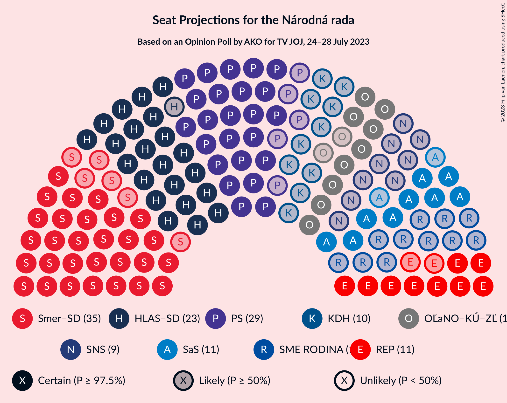
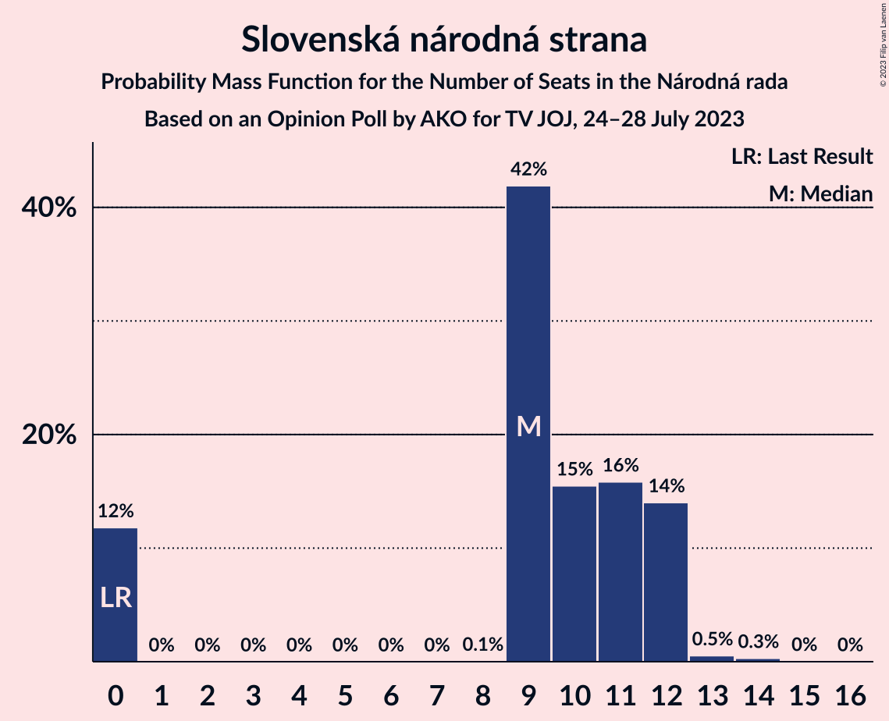

# Opinion Poll by AKO for TV JOJ, 24–28 July 2023

<a href="#voting-intentions">Voting Intentions</a> | <a href="#seats">Seats</a> | <a href="#coalitions">Coalitions</a> | <a href="#technical-information">Technical Information</a>

## Voting Intentions

### Confidence Intervals

| Party | Last Result | Poll Result | 80% Confidence Interval | 90% Confidence Interval | 95% Confidence Interval | 99% Confidence Interval |
|:-----:|:-----------:|:-----------:|:-----------------------:|:-----------------------:|:-----------------------:|:-----------------------:|
| SMER–sociálna demokracia | 18.3% | 19.9% | 18.4–21.6% |17.9–22.1% |17.5–22.5% |16.8–23.3% |
| Progresívne Slovensko | 7.0% | 16.4% | 15.0–18.0% |14.6–18.4% |14.2–18.8% |13.6–19.6% |
| HLAS–sociálna demokracia | 0.0% | 15.2% | 13.8–16.8% |13.4–17.2% |13.1–17.6% |12.5–18.3% |
| OBYČAJNÍ ĽUDIA a nezávislé osobnosti–Kresťanská únia–Za ľudí | 0.0% | 6.7% | 5.8–7.8% |5.5–8.2% |5.3–8.4% |4.9–9.0% |
| REPUBLIKA | 0.0% | 6.7% | 5.8–7.8% |5.5–8.2% |5.3–8.4% |4.9–9.0% |
| Sloboda a Solidarita | 6.2% | 6.6% | 5.7–7.7% |5.4–8.0% |5.2–8.3% |4.8–8.9% |
| SME RODINA | 8.2% | 6.1% | 5.2–7.2% |5.0–7.5% |4.8–7.8% |4.4–8.3% |
| Kresťanskodemokratické hnutie | 4.6% | 6.0% | 5.1–7.1% |4.9–7.4% |4.7–7.7% |4.3–8.2% |
| Slovenská národná strana | 3.2% | 5.8% | 5.0–6.9% |4.7–7.2% |4.5–7.4% |4.1–8.0% |
| SPOLU–Občianska Demokracia | 7.0% | 2.2% | 1.7–2.9% |1.6–3.1% |1.4–3.3% |1.2–3.7% |
| Strana maďarskej koalície–Magyar Koalíció Pártja | 3.9% | 2.2% | 1.7–2.9% |1.6–3.1% |1.4–3.3% |1.2–3.7% |
| MODRÍ–Európske Slovensko–MOST–HÍD | 0.0% | 1.5% | 1.1–2.1% |1.0–2.3% |0.9–2.5% |0.7–2.8% |
| Kotleba–Ľudová strana Naše Slovensko | 8.0% | 1.2% | 0.9–1.8% |0.8–1.9% |0.7–2.1% |0.5–2.4% |
| Magyar Fórum | 0.0% | 0.9% | 0.6–1.4% |0.5–1.6% |0.5–1.7% |0.4–2.0% |

*Note:* The poll result column reflects the actual value used in the calculations. Published results may vary slightly, and in addition be rounded to fewer digits.

## Seats

### Confidence Intervals

| Party | Last Result | Median | 80% Confidence Interval | 90% Confidence Interval | 95% Confidence Interval | 99% Confidence Interval |
|:-----:|:-----------:|:------:|:-----------------------:|:-----------------------:|:-----------------------:|:-----------------------:|
| <a href="#smer–sociálna-demokracia">SMER–sociálna demokracia</a> | 38 | 35 | 32–35 |31–37 |29–37 |29–41 |
| <a href="#progresívne-slovensko">Progresívne Slovensko</a> | 0 | 29 | 25–32 |25–32 |24–32 |23–34 |
| <a href="#hlas–sociálna-demokracia">HLAS–sociálna demokracia</a> | 0 | 24 | 22–29 |22–30 |22–30 |22–32 |
| <a href="#obyčajní-ľudia-a-nezávislé-osobnosti–kresťanská-únia–za-ľudí">OBYČAJNÍ ĽUDIA a nezávislé osobnosti–Kresťanská únia–Za ľudí</a> | 0 | 11 | 10–13 |9–14 |9–15 |0–15 |
| <a href="#republika">REPUBLIKA</a> | 0 | 12 | 10–14 |10–15 |9–16 |0–16 |
| <a href="#sloboda-a-solidarita">Sloboda a Solidarita</a> | 13 | 11 | 10–13 |9–13 |9–14 |0–15 |
| <a href="#sme-rodina">SME RODINA</a> | 17 | 11 | 9–12 |0–12 |0–12 |0–13 |
| <a href="#kresťanskodemokratické-hnutie">Kresťanskodemokratické hnutie</a> | 0 | 10 | 0–12 |0–13 |0–13 |0–14 |
| <a href="#slovenská-národná-strana">Slovenská národná strana</a> | 0 | 9 | 0–12 |0–12 |0–12 |0–13 |
| <a href="#spolu–občianska-demokracia">SPOLU–Občianska Demokracia</a> | 0 | 0 | 0 |0 |0 |0 |
| <a href="#strana-maďarskej-koalície–magyar-koalíció-pártja">Strana maďarskej koalície–Magyar Koalíció Pártja</a> | 0 | 0 | 0 |0 |0 |0 |
| <a href="#modrí–európske-slovensko–most–híd">MODRÍ–Európske Slovensko–MOST–HÍD</a> | 0 | 0 | 0 |0 |0 |0 |
| <a href="#kotleba–ľudová-strana-naše-slovensko">Kotleba–Ľudová strana Naše Slovensko</a> | 17 | 0 | 0 |0 |0 |0 |
| <a href="#magyar-fórum">Magyar Fórum</a> | 0 | 0 | 0 |0 |0 |0 |

### SMER–sociálna demokracia

*For a full overview of the results for this party, see the [SMER–sociálna demokracia](party-smer–sociálnademokracia.html) page.*

| Number of Seats | Probability | Accumulated | Special Marks |
|:---------------:|:-----------:|:-----------:|:-------------:|
| 27 | 0.1% | 100% |  |
| 28 | 0.1% | 99.9% |  |
| 29 | 2% | 99.8% |  |
| 30 | 0.3% | 97% |  |
| 31 | 2% | 97% |  |
| 32 | 19% | 95% |  |
| 33 | 13% | 76% |  |
| 34 | 12% | 63% |  |
| 35 | 41% | 50% | Median |
| 36 | 1.0% | 9% |  |
| 37 | 6% | 8% |  |
| 38 | 0.4% | 2% | Last Result |
| 39 | 0.7% | 2% |  |
| 40 | 0.7% | 1.4% |  |
| 41 | 0.4% | 0.7% |  |
| 42 | 0.2% | 0.3% |  |
| 43 | 0% | 0.1% |  |
| 44 | 0% | 0% |  |

### Progresívne Slovensko

*For a full overview of the results for this party, see the [Progresívne Slovensko](party-progresívneslovensko.html) page.*

| Number of Seats | Probability | Accumulated | Special Marks |
|:---------------:|:-----------:|:-----------:|:-------------:|
| 0 | 0% | 100% | Last Result |
| 1 | 0% | 100% |  |
| 2 | 0% | 100% |  |
| 3 | 0% | 100% |  |
| 4 | 0% | 100% |  |
| 5 | 0% | 100% |  |
| 6 | 0% | 100% |  |
| 7 | 0% | 100% |  |
| 8 | 0% | 100% |  |
| 9 | 0% | 100% |  |
| 10 | 0% | 100% |  |
| 11 | 0% | 100% |  |
| 12 | 0% | 100% |  |
| 13 | 0% | 100% |  |
| 14 | 0% | 100% |  |
| 15 | 0% | 100% |  |
| 16 | 0% | 100% |  |
| 17 | 0% | 100% |  |
| 18 | 0% | 100% |  |
| 19 | 0% | 100% |  |
| 20 | 0% | 100% |  |
| 21 | 0% | 100% |  |
| 22 | 0.1% | 100% |  |
| 23 | 1.4% | 99.9% |  |
| 24 | 2% | 98.5% |  |
| 25 | 10% | 97% |  |
| 26 | 6% | 87% |  |
| 27 | 7% | 81% |  |
| 28 | 3% | 74% |  |
| 29 | 30% | 70% | Median |
| 30 | 8% | 41% |  |
| 31 | 14% | 33% |  |
| 32 | 16% | 19% |  |
| 33 | 2% | 2% |  |
| 34 | 0.3% | 0.5% |  |
| 35 | 0.1% | 0.2% |  |
| 36 | 0% | 0.1% |  |
| 37 | 0% | 0% |  |

### HLAS–sociálna demokracia

*For a full overview of the results for this party, see the [HLAS–sociálna demokracia](party-hlas–sociálnademokracia.html) page.*

| Number of Seats | Probability | Accumulated | Special Marks |
|:---------------:|:-----------:|:-----------:|:-------------:|
| 0 | 0% | 100% | Last Result |
| 1 | 0% | 100% |  |
| 2 | 0% | 100% |  |
| 3 | 0% | 100% |  |
| 4 | 0% | 100% |  |
| 5 | 0% | 100% |  |
| 6 | 0% | 100% |  |
| 7 | 0% | 100% |  |
| 8 | 0% | 100% |  |
| 9 | 0% | 100% |  |
| 10 | 0% | 100% |  |
| 11 | 0% | 100% |  |
| 12 | 0% | 100% |  |
| 13 | 0% | 100% |  |
| 14 | 0% | 100% |  |
| 15 | 0% | 100% |  |
| 16 | 0% | 100% |  |
| 17 | 0% | 100% |  |
| 18 | 0% | 100% |  |
| 19 | 0% | 100% |  |
| 20 | 0.3% | 100% |  |
| 21 | 0.1% | 99.7% |  |
| 22 | 16% | 99.6% |  |
| 23 | 31% | 84% |  |
| 24 | 5% | 53% | Median |
| 25 | 10% | 49% |  |
| 26 | 8% | 39% |  |
| 27 | 13% | 31% |  |
| 28 | 3% | 17% |  |
| 29 | 6% | 15% |  |
| 30 | 7% | 9% |  |
| 31 | 0.1% | 2% |  |
| 32 | 1.4% | 2% |  |
| 33 | 0% | 0.3% |  |
| 34 | 0.2% | 0.2% |  |
| 35 | 0% | 0.1% |  |
| 36 | 0.1% | 0.1% |  |
| 37 | 0% | 0% |  |

### OBYČAJNÍ ĽUDIA a nezávislé osobnosti–Kresťanská únia–Za ľudí

*For a full overview of the results for this party, see the [OBYČAJNÍ ĽUDIA a nezávislé osobnosti–Kresťanská únia–Za ľudí](party-obyčajníľudiaanezávisléosobnosti–kresťanskáúnia–zaľudí.html) page.*

| Number of Seats | Probability | Accumulated | Special Marks |
|:---------------:|:-----------:|:-----------:|:-------------:|
| 0 | 0.8% | 100% | Last Result |
| 1 | 0% | 99.2% |  |
| 2 | 0% | 99.2% |  |
| 3 | 0% | 99.2% |  |
| 4 | 0% | 99.2% |  |
| 5 | 0% | 99.2% |  |
| 6 | 0% | 99.2% |  |
| 7 | 0% | 99.2% |  |
| 8 | 0.1% | 99.2% |  |
| 9 | 7% | 99.1% |  |
| 10 | 26% | 92% |  |
| 11 | 37% | 66% | Median |
| 12 | 15% | 29% |  |
| 13 | 7% | 14% |  |
| 14 | 3% | 6% |  |
| 15 | 2% | 3% |  |
| 16 | 0.3% | 0.4% |  |
| 17 | 0.2% | 0.2% |  |
| 18 | 0% | 0% |  |

### REPUBLIKA

*For a full overview of the results for this party, see the [REPUBLIKA](party-republika.html) page.*

| Number of Seats | Probability | Accumulated | Special Marks |
|:---------------:|:-----------:|:-----------:|:-------------:|
| 0 | 2% | 100% | Last Result |
| 1 | 0% | 98% |  |
| 2 | 0% | 98% |  |
| 3 | 0% | 98% |  |
| 4 | 0% | 98% |  |
| 5 | 0% | 98% |  |
| 6 | 0% | 98% |  |
| 7 | 0% | 98% |  |
| 8 | 0% | 98% |  |
| 9 | 1.3% | 98% |  |
| 10 | 13% | 97% |  |
| 11 | 26% | 84% |  |
| 12 | 20% | 58% | Median |
| 13 | 23% | 38% |  |
| 14 | 9% | 15% |  |
| 15 | 2% | 6% |  |
| 16 | 4% | 4% |  |
| 17 | 0.1% | 0.1% |  |
| 18 | 0% | 0% |  |

### Sloboda a Solidarita

*For a full overview of the results for this party, see the [Sloboda a Solidarita](party-slobodaasolidarita.html) page.*

| Number of Seats | Probability | Accumulated | Special Marks |
|:---------------:|:-----------:|:-----------:|:-------------:|
| 0 | 1.2% | 100% |  |
| 1 | 0% | 98.8% |  |
| 2 | 0% | 98.8% |  |
| 3 | 0% | 98.8% |  |
| 4 | 0% | 98.8% |  |
| 5 | 0% | 98.8% |  |
| 6 | 0% | 98.8% |  |
| 7 | 0% | 98.8% |  |
| 8 | 0.5% | 98.8% |  |
| 9 | 7% | 98% |  |
| 10 | 15% | 91% |  |
| 11 | 48% | 76% | Median |
| 12 | 9% | 28% |  |
| 13 | 16% | 19% | Last Result |
| 14 | 1.1% | 3% |  |
| 15 | 1.4% | 2% |  |
| 16 | 0.3% | 0.4% |  |
| 17 | 0.1% | 0.1% |  |
| 18 | 0% | 0% |  |

### SME RODINA

*For a full overview of the results for this party, see the [SME RODINA](party-smerodina.html) page.*

| Number of Seats | Probability | Accumulated | Special Marks |
|:---------------:|:-----------:|:-----------:|:-------------:|
| 0 | 9% | 100% |  |
| 1 | 0% | 91% |  |
| 2 | 0% | 91% |  |
| 3 | 0% | 91% |  |
| 4 | 0% | 91% |  |
| 5 | 0% | 91% |  |
| 6 | 0% | 91% |  |
| 7 | 0% | 91% |  |
| 8 | 0.1% | 91% |  |
| 9 | 3% | 91% |  |
| 10 | 14% | 87% |  |
| 11 | 32% | 74% | Median |
| 12 | 41% | 42% |  |
| 13 | 0.5% | 0.9% |  |
| 14 | 0.3% | 0.4% |  |
| 15 | 0.1% | 0.2% |  |
| 16 | 0.1% | 0.1% |  |
| 17 | 0% | 0% | Last Result |

### Kresťanskodemokratické hnutie

*For a full overview of the results for this party, see the [Kresťanskodemokratické hnutie](party-kresťanskodemokratickéhnutie.html) page.*

| Number of Seats | Probability | Accumulated | Special Marks |
|:---------------:|:-----------:|:-----------:|:-------------:|
| 0 | 12% | 100% | Last Result |
| 1 | 0% | 88% |  |
| 2 | 0% | 88% |  |
| 3 | 0% | 88% |  |
| 4 | 0% | 88% |  |
| 5 | 0% | 88% |  |
| 6 | 0% | 88% |  |
| 7 | 0% | 88% |  |
| 8 | 0.9% | 88% |  |
| 9 | 33% | 87% |  |
| 10 | 31% | 55% | Median |
| 11 | 8% | 24% |  |
| 12 | 10% | 16% |  |
| 13 | 6% | 6% |  |
| 14 | 0.7% | 0.7% |  |
| 15 | 0% | 0% |  |

### Slovenská národná strana

*For a full overview of the results for this party, see the [Slovenská národná strana](party-slovenskánárodnástrana.html) page.*

| Number of Seats | Probability | Accumulated | Special Marks |
|:---------------:|:-----------:|:-----------:|:-------------:|
| 0 | 12% | 100% | Last Result |
| 1 | 0% | 88% |  |
| 2 | 0% | 88% |  |
| 3 | 0% | 88% |  |
| 4 | 0% | 88% |  |
| 5 | 0% | 88% |  |
| 6 | 0% | 88% |  |
| 7 | 0% | 88% |  |
| 8 | 0.1% | 88% |  |
| 9 | 42% | 88% | Median |
| 10 | 15% | 46% |  |
| 11 | 16% | 31% |  |
| 12 | 14% | 15% |  |
| 13 | 0.5% | 0.9% |  |
| 14 | 0.3% | 0.4% |  |
| 15 | 0% | 0.1% |  |
| 16 | 0% | 0% |  |

### SPOLU–Občianska Demokracia

*For a full overview of the results for this party, see the [SPOLU–Občianska Demokracia](party-spolu–občianskademokracia.html) page.*

| Number of Seats | Probability | Accumulated | Special Marks |
|:---------------:|:-----------:|:-----------:|:-------------:|
| 0 | 100% | 100% | Last Result, Median |

### Strana maďarskej koalície–Magyar Koalíció Pártja

*For a full overview of the results for this party, see the [Strana maďarskej koalície–Magyar Koalíció Pártja](party-stranamaďarskejkoalície–magyarkoalíciópártja.html) page.*

| Number of Seats | Probability | Accumulated | Special Marks |
|:---------------:|:-----------:|:-----------:|:-------------:|
| 0 | 100% | 100% | Last Result, Median |

### MODRÍ–Európske Slovensko–MOST–HÍD

*For a full overview of the results for this party, see the [MODRÍ–Európske Slovensko–MOST–HÍD](party-modrí–európskeslovensko–most–híd.html) page.*

| Number of Seats | Probability | Accumulated | Special Marks |
|:---------------:|:-----------:|:-----------:|:-------------:|
| 0 | 100% | 100% | Last Result, Median |

### Kotleba–Ľudová strana Naše Slovensko

*For a full overview of the results for this party, see the [Kotleba–Ľudová strana Naše Slovensko](party-kotleba–ľudovástrananašeslovensko.html) page.*

| Number of Seats | Probability | Accumulated | Special Marks |
|:---------------:|:-----------:|:-----------:|:-------------:|
| 0 | 100% | 100% | Median |
| 1 | 0% | 0% |  |
| 2 | 0% | 0% |  |
| 3 | 0% | 0% |  |
| 4 | 0% | 0% |  |
| 5 | 0% | 0% |  |
| 6 | 0% | 0% |  |
| 7 | 0% | 0% |  |
| 8 | 0% | 0% |  |
| 9 | 0% | 0% |  |
| 10 | 0% | 0% |  |
| 11 | 0% | 0% |  |
| 12 | 0% | 0% |  |
| 13 | 0% | 0% |  |
| 14 | 0% | 0% |  |
| 15 | 0% | 0% |  |
| 16 | 0% | 0% |  |
| 17 | 0% | 0% | Last Result |

### Magyar Fórum

*For a full overview of the results for this party, see the [Magyar Fórum](party-magyarfórum.html) page.*

| Number of Seats | Probability | Accumulated | Special Marks |
|:---------------:|:-----------:|:-----------:|:-------------:|
| 0 | 100% | 100% | Last Result, Median |

## Coalitions

### Confidence Intervals

| Coalition | Last Result | Median | Majority? | 80% Confidence Interval | 90% Confidence Interval | 95% Confidence Interval | 99% Confidence Interval |
|:---------:|:-----------:|:------:|:---------:|:-----------------------:|:-----------------------:|:-----------------------:|:-----------------------:|
| SMER–sociálna demokracia – HLAS–sociálna demokracia – SME RODINA – Slovenská národná strana – Kotleba–Ľudová strana Naše Slovensko | 72 | 79 | 70% | 72–83 | 71–86 | 71–86 | 70–88 |
| SMER–sociálna demokracia – HLAS–sociálna demokracia – SME RODINA – Slovenská národná strana | 55 | 79 | 70% | 72–83 | 71–86 | 71–86 | 70–88 |
| SMER–sociálna demokracia – HLAS–sociálna demokracia – SME RODINA | 55 | 70 | 7% | 65–75 | 60–77 | 60–78 | 60–79 |
| SMER–sociálna demokracia – HLAS–sociálna demokracia – Slovenská národná strana | 38 | 67 | 9% | 63–74 | 62–76 | 60–76 | 60–78 |
| SMER–sociálna demokracia – SME RODINA – Slovenská národná strana – Kotleba–Ľudová strana Naše Slovensko | 72 | 55 | 0% | 45–57 | 45–58 | 45–58 | 42–60 |
| SMER–sociálna demokracia – SME RODINA – Slovenská národná strana | 55 | 55 | 0% | 45–57 | 45–58 | 45–58 | 42–60 |
| HLAS–sociálna demokracia – SME RODINA – Slovenská národná strana – Kotleba–Ľudová strana Naše Slovensko | 34 | 44 | 0% | 39–49 | 37–51 | 37–51 | 34–51 |
| HLAS–sociálna demokracia – SME RODINA – Slovenská národná strana | 17 | 44 | 0% | 39–49 | 37–51 | 37–51 | 34–51 |
| SMER–sociálna demokracia – SME RODINA | 55 | 45 | 0% | 40–47 | 34–49 | 34–49 | 34–51 |
| SMER–sociálna demokracia – Slovenská národná strana | 38 | 44 | 0% | 37–47 | 33–47 | 33–48 | 33–50 |
| HLAS–sociálna demokracia – Slovenská národná strana | 0 | 33 | 0% | 30–38 | 29–41 | 27–41 | 26–41 |
| HLAS–sociálna demokracia – SME RODINA | 17 | 35 | 0% | 32–40 | 26–41 | 26–41 | 25–43 |
| SMER–sociálna demokracia | 38 | 35 | 0% | 32–35 | 31–37 | 29–37 | 29–41 |

### SMER–sociálna demokracia – HLAS–sociálna demokracia – SME RODINA – Slovenská národná strana – Kotleba–Ľudová strana Naše Slovensko

| Number of Seats | Probability | Accumulated | Special Marks |
|:---------------:|:-----------:|:-----------:|:-------------:|
| 65 | 0.2% | 100% |  |
| 66 | 0% | 99.8% |  |
| 67 | 0.1% | 99.8% |  |
| 68 | 0.1% | 99.7% |  |
| 69 | 0% | 99.6% |  |
| 70 | 0.1% | 99.5% |  |
| 71 | 6% | 99.4% |  |
| 72 | 5% | 93% | Last Result |
| 73 | 0.5% | 88% |  |
| 74 | 16% | 88% |  |
| 75 | 2% | 72% |  |
| 76 | 2% | 70% | Majority |
| 77 | 4% | 67% |  |
| 78 | 10% | 64% |  |
| 79 | 23% | 53% | Median |
| 80 | 2% | 31% |  |
| 81 | 13% | 29% |  |
| 82 | 0.3% | 16% |  |
| 83 | 7% | 16% |  |
| 84 | 0.8% | 8% |  |
| 85 | 0.2% | 7% |  |
| 86 | 6% | 7% |  |
| 87 | 0.2% | 0.9% |  |
| 88 | 0.3% | 0.7% |  |
| 89 | 0% | 0.4% |  |
| 90 | 0.1% | 0.4% |  |
| 91 | 0% | 0.2% |  |
| 92 | 0.1% | 0.2% |  |
| 93 | 0% | 0.1% |  |
| 94 | 0% | 0.1% |  |
| 95 | 0% | 0.1% |  |
| 96 | 0% | 0.1% |  |
| 97 | 0.1% | 0.1% |  |
| 98 | 0% | 0% |  |

### SMER–sociálna demokracia – HLAS–sociálna demokracia – SME RODINA – Slovenská národná strana

| Number of Seats | Probability | Accumulated | Special Marks |
|:---------------:|:-----------:|:-----------:|:-------------:|
| 55 | 0% | 100% | Last Result |
| 56 | 0% | 100% |  |
| 57 | 0% | 100% |  |
| 58 | 0% | 100% |  |
| 59 | 0% | 100% |  |
| 60 | 0% | 100% |  |
| 61 | 0% | 100% |  |
| 62 | 0% | 100% |  |
| 63 | 0% | 100% |  |
| 64 | 0% | 100% |  |
| 65 | 0.2% | 100% |  |
| 66 | 0% | 99.8% |  |
| 67 | 0.1% | 99.8% |  |
| 68 | 0.1% | 99.7% |  |
| 69 | 0% | 99.6% |  |
| 70 | 0.1% | 99.5% |  |
| 71 | 6% | 99.4% |  |
| 72 | 5% | 93% |  |
| 73 | 0.5% | 88% |  |
| 74 | 16% | 88% |  |
| 75 | 2% | 72% |  |
| 76 | 2% | 70% | Majority |
| 77 | 4% | 67% |  |
| 78 | 10% | 64% |  |
| 79 | 23% | 53% | Median |
| 80 | 2% | 31% |  |
| 81 | 13% | 29% |  |
| 82 | 0.3% | 16% |  |
| 83 | 7% | 16% |  |
| 84 | 0.8% | 8% |  |
| 85 | 0.2% | 7% |  |
| 86 | 6% | 7% |  |
| 87 | 0.2% | 0.9% |  |
| 88 | 0.3% | 0.7% |  |
| 89 | 0% | 0.4% |  |
| 90 | 0.1% | 0.4% |  |
| 91 | 0% | 0.2% |  |
| 92 | 0.1% | 0.2% |  |
| 93 | 0% | 0.1% |  |
| 94 | 0% | 0.1% |  |
| 95 | 0% | 0.1% |  |
| 96 | 0% | 0.1% |  |
| 97 | 0.1% | 0.1% |  |
| 98 | 0% | 0% |  |

### SMER–sociálna demokracia – HLAS–sociálna demokracia – SME RODINA

| Number of Seats | Probability | Accumulated | Special Marks |
|:---------------:|:-----------:|:-----------:|:-------------:|
| 55 | 0% | 100% | Last Result |
| 56 | 0% | 100% |  |
| 57 | 0% | 100% |  |
| 58 | 0.1% | 99.9% |  |
| 59 | 0.2% | 99.8% |  |
| 60 | 6% | 99.7% |  |
| 61 | 0% | 93% |  |
| 62 | 0.1% | 93% |  |
| 63 | 0.1% | 93% |  |
| 64 | 1.2% | 93% |  |
| 65 | 17% | 92% |  |
| 66 | 3% | 75% |  |
| 67 | 1.4% | 72% |  |
| 68 | 7% | 70% |  |
| 69 | 10% | 64% |  |
| 70 | 23% | 53% | Median |
| 71 | 4% | 31% |  |
| 72 | 6% | 26% |  |
| 73 | 6% | 20% |  |
| 74 | 0.9% | 14% |  |
| 75 | 6% | 13% |  |
| 76 | 0.6% | 7% | Majority |
| 77 | 2% | 6% |  |
| 78 | 4% | 5% |  |
| 79 | 0.3% | 0.7% |  |
| 80 | 0.1% | 0.4% |  |
| 81 | 0.2% | 0.3% |  |
| 82 | 0% | 0.2% |  |
| 83 | 0% | 0.1% |  |
| 84 | 0% | 0.1% |  |
| 85 | 0% | 0.1% |  |
| 86 | 0.1% | 0.1% |  |
| 87 | 0% | 0% |  |

### SMER–sociálna demokracia – HLAS–sociálna demokracia – Slovenská národná strana

| Number of Seats | Probability | Accumulated | Special Marks |
|:---------------:|:-----------:|:-----------:|:-------------:|
| 38 | 0% | 100% | Last Result |
| 39 | 0% | 100% |  |
| 40 | 0% | 100% |  |
| 41 | 0% | 100% |  |
| 42 | 0% | 100% |  |
| 43 | 0% | 100% |  |
| 44 | 0% | 100% |  |
| 45 | 0% | 100% |  |
| 46 | 0% | 100% |  |
| 47 | 0% | 100% |  |
| 48 | 0% | 100% |  |
| 49 | 0% | 100% |  |
| 50 | 0% | 100% |  |
| 51 | 0% | 100% |  |
| 52 | 0% | 100% |  |
| 53 | 0% | 100% |  |
| 54 | 0% | 100% |  |
| 55 | 0% | 100% |  |
| 56 | 0% | 100% |  |
| 57 | 0% | 100% |  |
| 58 | 0% | 100% |  |
| 59 | 0% | 99.9% |  |
| 60 | 3% | 99.9% |  |
| 61 | 0.2% | 96% |  |
| 62 | 2% | 96% |  |
| 63 | 17% | 95% |  |
| 64 | 0.6% | 78% |  |
| 65 | 0.8% | 77% |  |
| 66 | 11% | 76% |  |
| 67 | 23% | 65% |  |
| 68 | 2% | 42% | Median |
| 69 | 5% | 40% |  |
| 70 | 7% | 35% |  |
| 71 | 12% | 28% |  |
| 72 | 6% | 17% |  |
| 73 | 0.3% | 10% |  |
| 74 | 1.1% | 10% |  |
| 75 | 0.1% | 9% |  |
| 76 | 8% | 9% | Majority |
| 77 | 0.2% | 1.2% |  |
| 78 | 0.6% | 1.0% |  |
| 79 | 0% | 0.3% |  |
| 80 | 0% | 0.3% |  |
| 81 | 0.1% | 0.3% |  |
| 82 | 0% | 0.2% |  |
| 83 | 0% | 0.1% |  |
| 84 | 0% | 0.1% |  |
| 85 | 0% | 0.1% |  |
| 86 | 0.1% | 0.1% |  |
| 87 | 0% | 0% |  |

### SMER–sociálna demokracia – SME RODINA – Slovenská národná strana – Kotleba–Ľudová strana Naše Slovensko

| Number of Seats | Probability | Accumulated | Special Marks |
|:---------------:|:-----------:|:-----------:|:-------------:|
| 35 | 0.2% | 100% |  |
| 36 | 0% | 99.8% |  |
| 37 | 0% | 99.8% |  |
| 38 | 0% | 99.8% |  |
| 39 | 0% | 99.8% |  |
| 40 | 0% | 99.8% |  |
| 41 | 0.1% | 99.7% |  |
| 42 | 0.2% | 99.7% |  |
| 43 | 1.1% | 99.4% |  |
| 44 | 0.3% | 98% |  |
| 45 | 11% | 98% |  |
| 46 | 0.4% | 87% |  |
| 47 | 0.5% | 86% |  |
| 48 | 1.2% | 86% |  |
| 49 | 4% | 84% |  |
| 50 | 2% | 80% |  |
| 51 | 1.3% | 78% |  |
| 52 | 17% | 76% |  |
| 53 | 1.3% | 59% |  |
| 54 | 5% | 58% |  |
| 55 | 7% | 53% | Median |
| 56 | 36% | 46% |  |
| 57 | 2% | 10% |  |
| 58 | 6% | 8% |  |
| 59 | 0.9% | 2% |  |
| 60 | 0.7% | 1.1% |  |
| 61 | 0.1% | 0.4% |  |
| 62 | 0.2% | 0.3% |  |
| 63 | 0% | 0.1% |  |
| 64 | 0% | 0.1% |  |
| 65 | 0% | 0% |  |
| 66 | 0% | 0% |  |
| 67 | 0% | 0% |  |
| 68 | 0% | 0% |  |
| 69 | 0% | 0% |  |
| 70 | 0% | 0% |  |
| 71 | 0% | 0% |  |
| 72 | 0% | 0% | Last Result |

### SMER–sociálna demokracia – SME RODINA – Slovenská národná strana

| Number of Seats | Probability | Accumulated | Special Marks |
|:---------------:|:-----------:|:-----------:|:-------------:|
| 35 | 0.2% | 100% |  |
| 36 | 0% | 99.8% |  |
| 37 | 0% | 99.8% |  |
| 38 | 0% | 99.8% |  |
| 39 | 0% | 99.8% |  |
| 40 | 0% | 99.8% |  |
| 41 | 0.1% | 99.7% |  |
| 42 | 0.2% | 99.7% |  |
| 43 | 1.1% | 99.4% |  |
| 44 | 0.3% | 98% |  |
| 45 | 11% | 98% |  |
| 46 | 0.4% | 87% |  |
| 47 | 0.5% | 86% |  |
| 48 | 1.2% | 86% |  |
| 49 | 4% | 84% |  |
| 50 | 2% | 80% |  |
| 51 | 1.3% | 78% |  |
| 52 | 17% | 76% |  |
| 53 | 1.3% | 59% |  |
| 54 | 5% | 58% |  |
| 55 | 7% | 53% | Last Result, Median |
| 56 | 36% | 46% |  |
| 57 | 2% | 10% |  |
| 58 | 6% | 8% |  |
| 59 | 0.9% | 2% |  |
| 60 | 0.7% | 1.1% |  |
| 61 | 0.1% | 0.4% |  |
| 62 | 0.2% | 0.3% |  |
| 63 | 0% | 0.1% |  |
| 64 | 0% | 0.1% |  |
| 65 | 0% | 0% |  |

### HLAS–sociálna demokracia – SME RODINA – Slovenská národná strana – Kotleba–Ľudová strana Naše Slovensko

| Number of Seats | Probability | Accumulated | Special Marks |
|:---------------:|:-----------:|:-----------:|:-------------:|
| 28 | 0% | 100% |  |
| 29 | 0% | 99.9% |  |
| 30 | 0.2% | 99.9% |  |
| 31 | 0% | 99.7% |  |
| 32 | 0% | 99.7% |  |
| 33 | 0% | 99.7% |  |
| 34 | 0.3% | 99.6% | Last Result |
| 35 | 0.1% | 99.4% |  |
| 36 | 0.1% | 99.2% |  |
| 37 | 7% | 99.1% |  |
| 38 | 1.2% | 92% |  |
| 39 | 6% | 91% |  |
| 40 | 0.3% | 85% |  |
| 41 | 4% | 85% |  |
| 42 | 15% | 81% |  |
| 43 | 2% | 65% |  |
| 44 | 24% | 64% | Median |
| 45 | 5% | 40% |  |
| 46 | 10% | 34% |  |
| 47 | 5% | 25% |  |
| 48 | 6% | 20% |  |
| 49 | 5% | 13% |  |
| 50 | 2% | 8% |  |
| 51 | 6% | 7% |  |
| 52 | 0.1% | 0.4% |  |
| 53 | 0.1% | 0.3% |  |
| 54 | 0.1% | 0.2% |  |
| 55 | 0% | 0.2% |  |
| 56 | 0% | 0.2% |  |
| 57 | 0.1% | 0.2% |  |
| 58 | 0.1% | 0.1% |  |
| 59 | 0% | 0% |  |

### HLAS–sociálna demokracia – SME RODINA – Slovenská národná strana

| Number of Seats | Probability | Accumulated | Special Marks |
|:---------------:|:-----------:|:-----------:|:-------------:|
| 17 | 0% | 100% | Last Result |
| 18 | 0% | 100% |  |
| 19 | 0% | 100% |  |
| 20 | 0% | 100% |  |
| 21 | 0% | 100% |  |
| 22 | 0% | 100% |  |
| 23 | 0% | 100% |  |
| 24 | 0% | 100% |  |
| 25 | 0% | 100% |  |
| 26 | 0% | 100% |  |
| 27 | 0% | 100% |  |
| 28 | 0% | 100% |  |
| 29 | 0% | 99.9% |  |
| 30 | 0.2% | 99.9% |  |
| 31 | 0% | 99.7% |  |
| 32 | 0% | 99.7% |  |
| 33 | 0% | 99.7% |  |
| 34 | 0.3% | 99.6% |  |
| 35 | 0.1% | 99.4% |  |
| 36 | 0.1% | 99.2% |  |
| 37 | 7% | 99.1% |  |
| 38 | 1.2% | 92% |  |
| 39 | 6% | 91% |  |
| 40 | 0.3% | 85% |  |
| 41 | 4% | 85% |  |
| 42 | 15% | 81% |  |
| 43 | 2% | 65% |  |
| 44 | 24% | 64% | Median |
| 45 | 5% | 40% |  |
| 46 | 10% | 34% |  |
| 47 | 5% | 25% |  |
| 48 | 6% | 20% |  |
| 49 | 5% | 13% |  |
| 50 | 2% | 8% |  |
| 51 | 6% | 7% |  |
| 52 | 0.1% | 0.4% |  |
| 53 | 0.1% | 0.3% |  |
| 54 | 0.1% | 0.2% |  |
| 55 | 0% | 0.2% |  |
| 56 | 0% | 0.2% |  |
| 57 | 0.1% | 0.2% |  |
| 58 | 0.1% | 0.1% |  |
| 59 | 0% | 0% |  |

### SMER–sociálna demokracia – SME RODINA

| Number of Seats | Probability | Accumulated | Special Marks |
|:---------------:|:-----------:|:-----------:|:-------------:|
| 33 | 0.2% | 100% |  |
| 34 | 6% | 99.8% |  |
| 35 | 0.6% | 94% |  |
| 36 | 0.4% | 93% |  |
| 37 | 1.2% | 93% |  |
| 38 | 0.1% | 92% |  |
| 39 | 0.2% | 91% |  |
| 40 | 1.3% | 91% |  |
| 41 | 3% | 90% |  |
| 42 | 2% | 87% |  |
| 43 | 20% | 86% |  |
| 44 | 7% | 66% |  |
| 45 | 19% | 59% |  |
| 46 | 14% | 40% | Median |
| 47 | 20% | 27% |  |
| 48 | 0.5% | 6% |  |
| 49 | 5% | 6% |  |
| 50 | 0.4% | 1.0% |  |
| 51 | 0.2% | 0.6% |  |
| 52 | 0.1% | 0.4% |  |
| 53 | 0.3% | 0.3% |  |
| 54 | 0% | 0.1% |  |
| 55 | 0% | 0% | Last Result |

### SMER–sociálna demokracia – Slovenská národná strana

| Number of Seats | Probability | Accumulated | Special Marks |
|:---------------:|:-----------:|:-----------:|:-------------:|
| 31 | 0% | 100% |  |
| 32 | 0% | 99.9% |  |
| 33 | 5% | 99.9% |  |
| 34 | 1.3% | 95% |  |
| 35 | 0.5% | 94% |  |
| 36 | 0.1% | 93% |  |
| 37 | 4% | 93% |  |
| 38 | 2% | 89% | Last Result |
| 39 | 0.8% | 87% |  |
| 40 | 0.5% | 86% |  |
| 41 | 15% | 86% |  |
| 42 | 4% | 71% |  |
| 43 | 7% | 67% |  |
| 44 | 28% | 60% | Median |
| 45 | 15% | 32% |  |
| 46 | 7% | 18% |  |
| 47 | 7% | 11% |  |
| 48 | 2% | 4% |  |
| 49 | 0.5% | 2% |  |
| 50 | 0.9% | 1.3% |  |
| 51 | 0.3% | 0.4% |  |
| 52 | 0.1% | 0.1% |  |
| 53 | 0% | 0.1% |  |
| 54 | 0% | 0.1% |  |
| 55 | 0% | 0% |  |

### HLAS–sociálna demokracia – Slovenská národná strana

| Number of Seats | Probability | Accumulated | Special Marks |
|:---------------:|:-----------:|:-----------:|:-------------:|
| 0 | 0% | 100% | Last Result |
| 1 | 0% | 100% |  |
| 2 | 0% | 100% |  |
| 3 | 0% | 100% |  |
| 4 | 0% | 100% |  |
| 5 | 0% | 100% |  |
| 6 | 0% | 100% |  |
| 7 | 0% | 100% |  |
| 8 | 0% | 100% |  |
| 9 | 0% | 100% |  |
| 10 | 0% | 100% |  |
| 11 | 0% | 100% |  |
| 12 | 0% | 100% |  |
| 13 | 0% | 100% |  |
| 14 | 0% | 100% |  |
| 15 | 0% | 100% |  |
| 16 | 0% | 100% |  |
| 17 | 0% | 100% |  |
| 18 | 0% | 100% |  |
| 19 | 0% | 100% |  |
| 20 | 0% | 100% |  |
| 21 | 0% | 100% |  |
| 22 | 0% | 100% |  |
| 23 | 0% | 100% |  |
| 24 | 0.1% | 100% |  |
| 25 | 0.3% | 99.9% |  |
| 26 | 0.2% | 99.6% |  |
| 27 | 4% | 99.4% |  |
| 28 | 0.2% | 96% |  |
| 29 | 5% | 96% |  |
| 30 | 0.8% | 90% |  |
| 31 | 15% | 89% |  |
| 32 | 22% | 74% |  |
| 33 | 6% | 53% | Median |
| 34 | 5% | 47% |  |
| 35 | 9% | 42% |  |
| 36 | 2% | 33% |  |
| 37 | 19% | 31% |  |
| 38 | 2% | 12% |  |
| 39 | 2% | 9% |  |
| 40 | 0.7% | 7% |  |
| 41 | 6% | 6% |  |
| 42 | 0.2% | 0.3% |  |
| 43 | 0% | 0.2% |  |
| 44 | 0% | 0.1% |  |
| 45 | 0% | 0.1% |  |
| 46 | 0% | 0.1% |  |
| 47 | 0.1% | 0.1% |  |
| 48 | 0% | 0% |  |

### HLAS–sociálna demokracia – SME RODINA

| Number of Seats | Probability | Accumulated | Special Marks |
|:---------------:|:-----------:|:-----------:|:-------------:|
| 17 | 0% | 100% | Last Result |
| 18 | 0% | 100% |  |
| 19 | 0% | 100% |  |
| 20 | 0% | 100% |  |
| 21 | 0% | 100% |  |
| 22 | 0% | 100% |  |
| 23 | 0% | 100% |  |
| 24 | 0.1% | 99.9% |  |
| 25 | 0.5% | 99.8% |  |
| 26 | 6% | 99.3% |  |
| 27 | 0% | 93% |  |
| 28 | 2% | 93% |  |
| 29 | 0.2% | 91% |  |
| 30 | 0.3% | 91% |  |
| 31 | 0.3% | 91% |  |
| 32 | 0.5% | 90% |  |
| 33 | 15% | 90% |  |
| 34 | 7% | 75% |  |
| 35 | 31% | 68% | Median |
| 36 | 1.4% | 37% |  |
| 37 | 9% | 35% |  |
| 38 | 8% | 26% |  |
| 39 | 6% | 18% |  |
| 40 | 6% | 13% |  |
| 41 | 4% | 6% |  |
| 42 | 0.3% | 2% |  |
| 43 | 1.4% | 2% |  |
| 44 | 0.1% | 0.2% |  |
| 45 | 0% | 0.2% |  |
| 46 | 0.1% | 0.2% |  |
| 47 | 0.1% | 0.1% |  |
| 48 | 0% | 0% |  |

### SMER–sociálna demokracia

| Number of Seats | Probability | Accumulated | Special Marks |
|:---------------:|:-----------:|:-----------:|:-------------:|
| 27 | 0.1% | 100% |  |
| 28 | 0.1% | 99.9% |  |
| 29 | 2% | 99.8% |  |
| 30 | 0.3% | 97% |  |
| 31 | 2% | 97% |  |
| 32 | 19% | 95% |  |
| 33 | 13% | 76% |  |
| 34 | 12% | 63% |  |
| 35 | 41% | 50% | Median |
| 36 | 1.0% | 9% |  |
| 37 | 6% | 8% |  |
| 38 | 0.4% | 2% | Last Result |
| 39 | 0.7% | 2% |  |
| 40 | 0.7% | 1.4% |  |
| 41 | 0.4% | 0.7% |  |
| 42 | 0.2% | 0.3% |  |
| 43 | 0% | 0.1% |  |
| 44 | 0% | 0% |  |

## Technical Information

### Opinion Poll

+ **Polling firm:** AKO
+ **Commissioner(s):** TV JOJ
+ **Fieldwork period:** 24–28 July 2023

### Calculations

+ **Sample size:** 1000
+ **Simulations done:** 1,048,576
+ **Error estimate:** 2.56%

