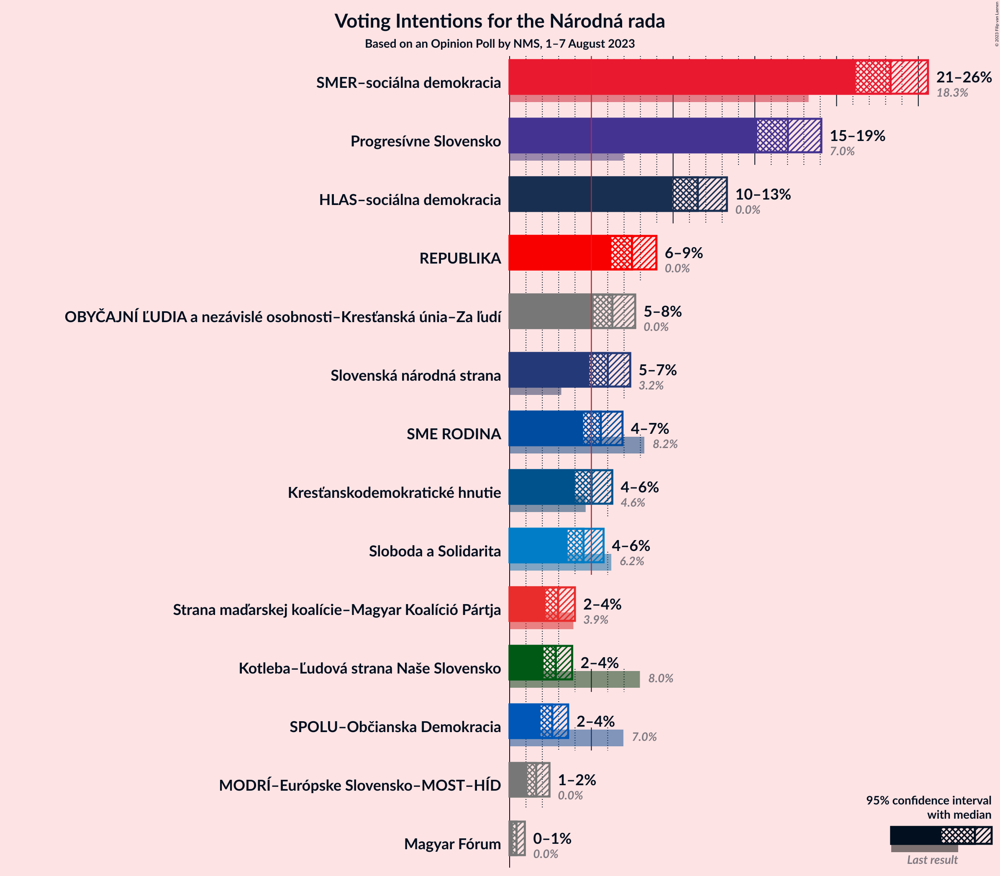

# Opinion Poll by NMS, 1–7 August 2023

<a href="#voting-intentions">Voting Intentions</a> | <a href="#seats">Seats</a> | <a href="#coalitions">Coalitions</a> | <a href="#technical-information">Technical Information</a>

## Voting Intentions

### Confidence Intervals

| Party | Last Result | Poll Result | 80% Confidence Interval | 90% Confidence Interval | 95% Confidence Interval | 99% Confidence Interval |
|:-----:|:-----------:|:-----------:|:-----------------------:|:-----------------------:|:-----------------------:|:-----------------------:|
| SMER–sociálna demokracia | 18.3% | 23.3% | 21.9–24.8% |21.5–25.2% |21.2–25.6% |20.5–26.3% |
| Progresívne Slovensko | 7.0% | 17.0% | 15.8–18.4% |15.4–18.7% |15.2–19.1% |14.6–19.7% |
| HLAS–sociálna demokracia | 0.0% | 11.5% | 10.5–12.7% |10.2–13.0% |10.0–13.3% |9.5–13.9% |
| REPUBLIKA | 0.0% | 7.5% | 6.7–8.5% |6.4–8.7% |6.2–9.0% |5.9–9.5% |
| OBYČAJNÍ ĽUDIA a nezávislé osobnosti–Kresťanská únia–Za ľudí | 0.0% | 6.3% | 5.5–7.2% |5.3–7.5% |5.1–7.7% |4.8–8.1% |
| Slovenská národná strana | 3.2% | 6.0% | 5.3–6.9% |5.0–7.1% |4.9–7.4% |4.5–7.8% |
| SME RODINA | 8.2% | 5.6% | 4.9–6.4% |4.7–6.7% |4.5–6.9% |4.2–7.3% |
| Kresťanskodemokratické hnutie | 4.6% | 5.0% | 4.3–5.8% |4.1–6.1% |4.0–6.3% |3.7–6.7% |
| Sloboda a Solidarita | 6.2% | 4.5% | 3.9–5.3% |3.7–5.5% |3.6–5.7% |3.3–6.1% |
| Strana maďarskej koalície–Magyar Koalíció Pártja | 3.9% | 3.0% | 2.5–3.6% |2.3–3.8% |2.2–4.0% |2.0–4.3% |
| Kotleba–Ľudová strana Naše Slovensko | 8.0% | 2.8% | 2.3–3.5% |2.2–3.7% |2.1–3.8% |1.9–4.2% |
| SPOLU–Občianska Demokracia | 7.0% | 2.6% | 2.1–3.2% |2.0–3.4% |1.9–3.6% |1.7–3.9% |
| MODRÍ–Európske Slovensko–MOST–HÍD | 0.0% | 1.6% | 1.3–2.1% |1.2–2.3% |1.1–2.4% |0.9–2.7% |
| Magyar Fórum | 0.0% | 0.4% | 0.3–0.7% |0.2–0.8% |0.2–0.9% |0.1–1.1% |

*Note:* The poll result column reflects the actual value used in the calculations. Published results may vary slightly, and in addition be rounded to fewer digits.

## Seats

### Confidence Intervals

| Party | Last Result | Median | 80% Confidence Interval | 90% Confidence Interval | 95% Confidence Interval | 99% Confidence Interval |
|:-----:|:-----------:|:------:|:-----------------------:|:-----------------------:|:-----------------------:|:-----------------------:|
| <a href="#smer–sociálna-demokracia">SMER–sociálna demokracia</a> | 38 | 44 | 41–49 |40–51 |38–53 |36–53 |
| <a href="#progresívne-slovensko">Progresívne Slovensko</a> | 0 | 32 | 30–33 |29–35 |29–40 |28–40 |
| <a href="#hlas–sociálna-demokracia">HLAS–sociálna demokracia</a> | 0 | 20 | 20–24 |20–25 |19–25 |18–26 |
| <a href="#republika">REPUBLIKA</a> | 0 | 14 | 13–16 |10–16 |10–17 |10–18 |
| <a href="#obyčajní-ľudia-a-nezávislé-osobnosti–kresťanská-únia–za-ľudí">OBYČAJNÍ ĽUDIA a nezávislé osobnosti–Kresťanská únia–Za ľudí</a> | 0 | 11 | 10–14 |10–14 |10–16 |0–16 |
| <a href="#slovenská-národná-strana">Slovenská národná strana</a> | 0 | 12 | 9–14 |0–14 |0–14 |0–14 |
| <a href="#sme-rodina">SME RODINA</a> | 17 | 11 | 0–11 |0–12 |0–12 |0–14 |
| <a href="#kresťanskodemokratické-hnutie">Kresťanskodemokratické hnutie</a> | 0 | 10 | 0–10 |0–11 |0–11 |0–12 |
| <a href="#sloboda-a-solidarita">Sloboda a Solidarita</a> | 13 | 0 | 0–10 |0–11 |0–11 |0–12 |
| <a href="#strana-maďarskej-koalície–magyar-koalíció-pártja">Strana maďarskej koalície–Magyar Koalíció Pártja</a> | 0 | 0 | 0 |0 |0 |0 |
| <a href="#kotleba–ľudová-strana-naše-slovensko">Kotleba–Ľudová strana Naše Slovensko</a> | 17 | 0 | 0 |0 |0 |0 |
| <a href="#spolu–občianska-demokracia">SPOLU–Občianska Demokracia</a> | 0 | 0 | 0 |0 |0 |0 |
| <a href="#modrí–európske-slovensko–most–híd">MODRÍ–Európske Slovensko–MOST–HÍD</a> | 0 | 0 | 0 |0 |0 |0 |
| <a href="#magyar-fórum">Magyar Fórum</a> | 0 | 0 | 0 |0 |0 |0 |

### SMER–sociálna demokracia

*For a full overview of the results for this party, see the [SMER–sociálna demokracia](party-smer–sociálnademokracia.html) page.*

| Number of Seats | Probability | Accumulated | Special Marks |
|:---------------:|:-----------:|:-----------:|:-------------:|
| 36 | 1.0% | 100% |  |
| 37 | 0.2% | 99.0% |  |
| 38 | 2% | 98.8% | Last Result |
| 39 | 0.6% | 97% |  |
| 40 | 2% | 96% |  |
| 41 | 40% | 94% |  |
| 42 | 0.7% | 54% |  |
| 43 | 2% | 53% |  |
| 44 | 10% | 52% | Median |
| 45 | 5% | 42% |  |
| 46 | 0.9% | 37% |  |
| 47 | 1.1% | 36% |  |
| 48 | 25% | 35% |  |
| 49 | 3% | 10% |  |
| 50 | 3% | 8% |  |
| 51 | 0.9% | 5% |  |
| 52 | 0.1% | 4% |  |
| 53 | 4% | 4% |  |
| 54 | 0% | 0.3% |  |
| 55 | 0% | 0.3% |  |
| 56 | 0.3% | 0.3% |  |
| 57 | 0% | 0% |  |

### Progresívne Slovensko

*For a full overview of the results for this party, see the [Progresívne Slovensko](party-progresívneslovensko.html) page.*

| Number of Seats | Probability | Accumulated | Special Marks |
|:---------------:|:-----------:|:-----------:|:-------------:|
| 0 | 0% | 100% | Last Result |
| 1 | 0% | 100% |  |
| 2 | 0% | 100% |  |
| 3 | 0% | 100% |  |
| 4 | 0% | 100% |  |
| 5 | 0% | 100% |  |
| 6 | 0% | 100% |  |
| 7 | 0% | 100% |  |
| 8 | 0% | 100% |  |
| 9 | 0% | 100% |  |
| 10 | 0% | 100% |  |
| 11 | 0% | 100% |  |
| 12 | 0% | 100% |  |
| 13 | 0% | 100% |  |
| 14 | 0% | 100% |  |
| 15 | 0% | 100% |  |
| 16 | 0% | 100% |  |
| 17 | 0% | 100% |  |
| 18 | 0% | 100% |  |
| 19 | 0% | 100% |  |
| 20 | 0% | 100% |  |
| 21 | 0% | 100% |  |
| 22 | 0% | 100% |  |
| 23 | 0% | 100% |  |
| 24 | 0% | 100% |  |
| 25 | 0.1% | 100% |  |
| 26 | 0.1% | 99.9% |  |
| 27 | 0.3% | 99.8% |  |
| 28 | 1.1% | 99.5% |  |
| 29 | 4% | 98% |  |
| 30 | 7% | 94% |  |
| 31 | 10% | 87% |  |
| 32 | 41% | 77% | Median |
| 33 | 26% | 36% |  |
| 34 | 1.2% | 10% |  |
| 35 | 4% | 9% |  |
| 36 | 0.1% | 5% |  |
| 37 | 0.5% | 5% |  |
| 38 | 0.3% | 4% |  |
| 39 | 0.4% | 4% |  |
| 40 | 4% | 4% |  |
| 41 | 0% | 0% |  |

### HLAS–sociálna demokracia

*For a full overview of the results for this party, see the [HLAS–sociálna demokracia](party-hlas–sociálnademokracia.html) page.*

| Number of Seats | Probability | Accumulated | Special Marks |
|:---------------:|:-----------:|:-----------:|:-------------:|
| 0 | 0% | 100% | Last Result |
| 1 | 0% | 100% |  |
| 2 | 0% | 100% |  |
| 3 | 0% | 100% |  |
| 4 | 0% | 100% |  |
| 5 | 0% | 100% |  |
| 6 | 0% | 100% |  |
| 7 | 0% | 100% |  |
| 8 | 0% | 100% |  |
| 9 | 0% | 100% |  |
| 10 | 0% | 100% |  |
| 11 | 0% | 100% |  |
| 12 | 0% | 100% |  |
| 13 | 0% | 100% |  |
| 14 | 0% | 100% |  |
| 15 | 0% | 100% |  |
| 16 | 0.1% | 100% |  |
| 17 | 0.3% | 99.9% |  |
| 18 | 1.3% | 99.6% |  |
| 19 | 1.4% | 98% |  |
| 20 | 48% | 97% | Median |
| 21 | 15% | 49% |  |
| 22 | 21% | 35% |  |
| 23 | 2% | 14% |  |
| 24 | 5% | 12% |  |
| 25 | 6% | 7% |  |
| 26 | 0.4% | 0.6% |  |
| 27 | 0.2% | 0.3% |  |
| 28 | 0.1% | 0.1% |  |
| 29 | 0% | 0% |  |

### REPUBLIKA

*For a full overview of the results for this party, see the [REPUBLIKA](party-republika.html) page.*

| Number of Seats | Probability | Accumulated | Special Marks |
|:---------------:|:-----------:|:-----------:|:-------------:|
| 0 | 0% | 100% | Last Result |
| 1 | 0% | 100% |  |
| 2 | 0% | 100% |  |
| 3 | 0% | 100% |  |
| 4 | 0% | 100% |  |
| 5 | 0% | 100% |  |
| 6 | 0% | 100% |  |
| 7 | 0% | 100% |  |
| 8 | 0% | 100% |  |
| 9 | 0% | 100% |  |
| 10 | 5% | 100% |  |
| 11 | 1.2% | 94% |  |
| 12 | 2% | 93% |  |
| 13 | 28% | 92% |  |
| 14 | 25% | 64% | Median |
| 15 | 28% | 39% |  |
| 16 | 8% | 11% |  |
| 17 | 2% | 3% |  |
| 18 | 0.5% | 0.7% |  |
| 19 | 0.2% | 0.2% |  |
| 20 | 0% | 0% |  |

### OBYČAJNÍ ĽUDIA a nezávislé osobnosti–Kresťanská únia–Za ľudí

*For a full overview of the results for this party, see the [OBYČAJNÍ ĽUDIA a nezávislé osobnosti–Kresťanská únia–Za ľudí](party-obyčajníľudiaanezávisléosobnosti–kresťanskáúnia–zaľudí.html) page.*

| Number of Seats | Probability | Accumulated | Special Marks |
|:---------------:|:-----------:|:-----------:|:-------------:|
| 0 | 0.8% | 100% | Last Result |
| 1 | 0% | 99.2% |  |
| 2 | 0% | 99.2% |  |
| 3 | 0% | 99.2% |  |
| 4 | 0% | 99.2% |  |
| 5 | 0% | 99.2% |  |
| 6 | 0% | 99.2% |  |
| 7 | 0% | 99.2% |  |
| 8 | 0% | 99.2% |  |
| 9 | 0.1% | 99.2% |  |
| 10 | 22% | 99.1% |  |
| 11 | 49% | 77% | Median |
| 12 | 17% | 29% |  |
| 13 | 1.2% | 12% |  |
| 14 | 6% | 11% |  |
| 15 | 0.6% | 4% |  |
| 16 | 4% | 4% |  |
| 17 | 0.1% | 0.1% |  |
| 18 | 0% | 0% |  |

### Slovenská národná strana

*For a full overview of the results for this party, see the [Slovenská národná strana](party-slovenskánárodnástrana.html) page.*

| Number of Seats | Probability | Accumulated | Special Marks |
|:---------------:|:-----------:|:-----------:|:-------------:|
| 0 | 5% | 100% | Last Result |
| 1 | 0% | 95% |  |
| 2 | 0% | 95% |  |
| 3 | 0% | 95% |  |
| 4 | 0% | 95% |  |
| 5 | 0% | 95% |  |
| 6 | 0% | 95% |  |
| 7 | 0% | 95% |  |
| 8 | 0% | 95% |  |
| 9 | 18% | 95% |  |
| 10 | 2% | 77% |  |
| 11 | 17% | 74% |  |
| 12 | 24% | 58% | Median |
| 13 | 3% | 33% |  |
| 14 | 30% | 30% |  |
| 15 | 0.1% | 0.2% |  |
| 16 | 0.1% | 0.1% |  |
| 17 | 0% | 0% |  |

### SME RODINA

*For a full overview of the results for this party, see the [SME RODINA](party-smerodina.html) page.*

| Number of Seats | Probability | Accumulated | Special Marks |
|:---------------:|:-----------:|:-----------:|:-------------:|
| 0 | 18% | 100% |  |
| 1 | 0% | 82% |  |
| 2 | 0% | 82% |  |
| 3 | 0% | 82% |  |
| 4 | 0% | 82% |  |
| 5 | 0% | 82% |  |
| 6 | 0% | 82% |  |
| 7 | 0% | 82% |  |
| 8 | 0% | 82% |  |
| 9 | 2% | 82% |  |
| 10 | 21% | 80% |  |
| 11 | 53% | 59% | Median |
| 12 | 5% | 7% |  |
| 13 | 1.2% | 2% |  |
| 14 | 0.2% | 0.7% |  |
| 15 | 0.3% | 0.5% |  |
| 16 | 0.2% | 0.2% |  |
| 17 | 0% | 0% | Last Result |

### Kresťanskodemokratické hnutie

*For a full overview of the results for this party, see the [Kresťanskodemokratické hnutie](party-kresťanskodemokratickéhnutie.html) page.*

| Number of Seats | Probability | Accumulated | Special Marks |
|:---------------:|:-----------:|:-----------:|:-------------:|
| 0 | 44% | 100% | Last Result |
| 1 | 0% | 56% |  |
| 2 | 0% | 56% |  |
| 3 | 0% | 56% |  |
| 4 | 0% | 56% |  |
| 5 | 0% | 56% |  |
| 6 | 0% | 56% |  |
| 7 | 0% | 56% |  |
| 8 | 0.9% | 56% |  |
| 9 | 0.9% | 55% |  |
| 10 | 48% | 54% | Median |
| 11 | 4% | 6% |  |
| 12 | 1.1% | 2% |  |
| 13 | 0.3% | 0.4% |  |
| 14 | 0.1% | 0.1% |  |
| 15 | 0% | 0% |  |

### Sloboda a Solidarita

*For a full overview of the results for this party, see the [Sloboda a Solidarita](party-slobodaasolidarita.html) page.*

| Number of Seats | Probability | Accumulated | Special Marks |
|:---------------:|:-----------:|:-----------:|:-------------:|
| 0 | 88% | 100% | Median |
| 1 | 0% | 12% |  |
| 2 | 0% | 12% |  |
| 3 | 0% | 12% |  |
| 4 | 0% | 12% |  |
| 5 | 0% | 12% |  |
| 6 | 0% | 12% |  |
| 7 | 0% | 12% |  |
| 8 | 0% | 12% |  |
| 9 | 0.7% | 12% |  |
| 10 | 4% | 11% |  |
| 11 | 6% | 7% |  |
| 12 | 0.8% | 0.8% |  |
| 13 | 0% | 0% | Last Result |

### Strana maďarskej koalície–Magyar Koalíció Pártja

*For a full overview of the results for this party, see the [Strana maďarskej koalície–Magyar Koalíció Pártja](party-stranamaďarskejkoalície–magyarkoalíciópártja.html) page.*

| Number of Seats | Probability | Accumulated | Special Marks |
|:---------------:|:-----------:|:-----------:|:-------------:|
| 0 | 100% | 100% | Last Result, Median |

### Kotleba–Ľudová strana Naše Slovensko

*For a full overview of the results for this party, see the [Kotleba–Ľudová strana Naše Slovensko](party-kotleba–ľudovástrananašeslovensko.html) page.*

| Number of Seats | Probability | Accumulated | Special Marks |
|:---------------:|:-----------:|:-----------:|:-------------:|
| 0 | 100% | 100% | Median |
| 1 | 0% | 0% |  |
| 2 | 0% | 0% |  |
| 3 | 0% | 0% |  |
| 4 | 0% | 0% |  |
| 5 | 0% | 0% |  |
| 6 | 0% | 0% |  |
| 7 | 0% | 0% |  |
| 8 | 0% | 0% |  |
| 9 | 0% | 0% |  |
| 10 | 0% | 0% |  |
| 11 | 0% | 0% |  |
| 12 | 0% | 0% |  |
| 13 | 0% | 0% |  |
| 14 | 0% | 0% |  |
| 15 | 0% | 0% |  |
| 16 | 0% | 0% |  |
| 17 | 0% | 0% | Last Result |

### SPOLU–Občianska Demokracia

*For a full overview of the results for this party, see the [SPOLU–Občianska Demokracia](party-spolu–občianskademokracia.html) page.*

| Number of Seats | Probability | Accumulated | Special Marks |
|:---------------:|:-----------:|:-----------:|:-------------:|
| 0 | 100% | 100% | Last Result, Median |

### MODRÍ–Európske Slovensko–MOST–HÍD

*For a full overview of the results for this party, see the [MODRÍ–Európske Slovensko–MOST–HÍD](party-modrí–európskeslovensko–most–híd.html) page.*

| Number of Seats | Probability | Accumulated | Special Marks |
|:---------------:|:-----------:|:-----------:|:-------------:|
| 0 | 100% | 100% | Last Result, Median |

### Magyar Fórum

*For a full overview of the results for this party, see the [Magyar Fórum](party-magyarfórum.html) page.*

| Number of Seats | Probability | Accumulated | Special Marks |
|:---------------:|:-----------:|:-----------:|:-------------:|
| 0 | 100% | 100% | Last Result, Median |

## Coalitions

### Confidence Intervals

| Coalition | Last Result | Median | Majority? | 80% Confidence Interval | 90% Confidence Interval | 95% Confidence Interval | 99% Confidence Interval |
|:---------:|:-----------:|:------:|:---------:|:-----------------------:|:-----------------------:|:-----------------------:|:-----------------------:|
| SMER–sociálna demokracia – HLAS–sociálna demokracia – Slovenská národná strana – SME RODINA – Kotleba–Ľudová strana Naše Slovensko | 72 | 84 | 99.4% | 78–93 | 76–93 | 76–94 | 75–94 |
| SMER–sociálna demokracia – HLAS–sociálna demokracia – Slovenská národná strana – SME RODINA | 55 | 84 | 99.4% | 78–93 | 76–93 | 76–94 | 75–94 |
| SMER–sociálna demokracia – HLAS–sociálna demokracia – Slovenská národná strana | 38 | 76 | 51% | 72–82 | 72–82 | 69–89 | 67–89 |
| SMER–sociálna demokracia – HLAS–sociálna demokracia – SME RODINA | 55 | 73 | 38% | 68–79 | 65–80 | 65–82 | 65–85 |
| SMER–sociálna demokracia – Slovenská národná strana – SME RODINA – Kotleba–Ľudová strana Naše Slovensko | 72 | 64 | 0.2% | 55–73 | 55–73 | 53–73 | 53–73 |
| SMER–sociálna demokracia – Slovenská národná strana – SME RODINA | 55 | 64 | 0.2% | 55–73 | 55–73 | 53–73 | 53–73 |
| SMER–sociálna demokracia – Slovenská národná strana | 38 | 53 | 0% | 50–62 | 50–62 | 49–64 | 46–65 |
| SMER–sociálna demokracia – SME RODINA | 55 | 52 | 0% | 46–59 | 44–59 | 44–61 | 44–63 |
| SMER–sociálna demokracia | 38 | 44 | 0% | 41–49 | 40–51 | 38–53 | 36–53 |
| HLAS–sociálna demokracia – Slovenská národná strana – SME RODINA – Kotleba–Ľudová strana Naše Slovensko | 34 | 43 | 0% | 33–45 | 32–45 | 25–45 | 25–48 |
| HLAS–sociálna demokracia – Slovenská národná strana – SME RODINA | 17 | 43 | 0% | 33–45 | 32–45 | 25–45 | 25–48 |
| HLAS–sociálna demokracia – Slovenská národná strana | 0 | 32 | 0% | 31–34 | 26–35 | 25–39 | 21–39 |
| HLAS–sociálna demokracia – SME RODINA | 17 | 31 | 0% | 24–32 | 21–33 | 21–34 | 21–37 |

### SMER–sociálna demokracia – HLAS–sociálna demokracia – Slovenská národná strana – SME RODINA – Kotleba–Ľudová strana Naše Slovensko

| Number of Seats | Probability | Accumulated | Special Marks |
|:---------------:|:-----------:|:-----------:|:-------------:|
| 68 | 0% | 100% |  |
| 69 | 0.2% | 99.9% |  |
| 70 | 0% | 99.7% |  |
| 71 | 0% | 99.7% |  |
| 72 | 0.1% | 99.7% | Last Result |
| 73 | 0% | 99.7% |  |
| 74 | 0.1% | 99.6% |  |
| 75 | 0.1% | 99.6% |  |
| 76 | 6% | 99.4% | Majority |
| 77 | 0.1% | 94% |  |
| 78 | 5% | 94% |  |
| 79 | 3% | 89% |  |
| 80 | 1.4% | 86% |  |
| 81 | 1.0% | 85% |  |
| 82 | 19% | 84% |  |
| 83 | 5% | 65% |  |
| 84 | 21% | 60% |  |
| 85 | 2% | 39% |  |
| 86 | 0.5% | 38% |  |
| 87 | 4% | 37% | Median |
| 88 | 0.3% | 34% |  |
| 89 | 4% | 33% |  |
| 90 | 0.6% | 30% |  |
| 91 | 0.2% | 29% |  |
| 92 | 0.8% | 29% |  |
| 93 | 25% | 28% |  |
| 94 | 3% | 3% |  |
| 95 | 0.2% | 0.5% |  |
| 96 | 0% | 0.3% |  |
| 97 | 0.3% | 0.3% |  |
| 98 | 0% | 0% |  |

### SMER–sociálna demokracia – HLAS–sociálna demokracia – Slovenská národná strana – SME RODINA

| Number of Seats | Probability | Accumulated | Special Marks |
|:---------------:|:-----------:|:-----------:|:-------------:|
| 55 | 0% | 100% | Last Result |
| 56 | 0% | 100% |  |
| 57 | 0% | 100% |  |
| 58 | 0% | 100% |  |
| 59 | 0% | 100% |  |
| 60 | 0% | 100% |  |
| 61 | 0% | 100% |  |
| 62 | 0% | 100% |  |
| 63 | 0% | 100% |  |
| 64 | 0% | 100% |  |
| 65 | 0% | 100% |  |
| 66 | 0% | 100% |  |
| 67 | 0% | 100% |  |
| 68 | 0% | 100% |  |
| 69 | 0.2% | 99.9% |  |
| 70 | 0% | 99.7% |  |
| 71 | 0% | 99.7% |  |
| 72 | 0.1% | 99.7% |  |
| 73 | 0% | 99.7% |  |
| 74 | 0.1% | 99.6% |  |
| 75 | 0.1% | 99.6% |  |
| 76 | 6% | 99.4% | Majority |
| 77 | 0.1% | 94% |  |
| 78 | 5% | 94% |  |
| 79 | 3% | 89% |  |
| 80 | 1.4% | 86% |  |
| 81 | 1.0% | 85% |  |
| 82 | 19% | 84% |  |
| 83 | 5% | 65% |  |
| 84 | 21% | 60% |  |
| 85 | 2% | 39% |  |
| 86 | 0.4% | 38% |  |
| 87 | 4% | 37% | Median |
| 88 | 0.3% | 34% |  |
| 89 | 4% | 33% |  |
| 90 | 0.6% | 30% |  |
| 91 | 0.2% | 29% |  |
| 92 | 0.8% | 29% |  |
| 93 | 25% | 28% |  |
| 94 | 3% | 3% |  |
| 95 | 0.2% | 0.5% |  |
| 96 | 0% | 0.3% |  |
| 97 | 0.3% | 0.3% |  |
| 98 | 0% | 0% |  |

### SMER–sociálna demokracia – HLAS–sociálna demokracia – Slovenská národná strana

| Number of Seats | Probability | Accumulated | Special Marks |
|:---------------:|:-----------:|:-----------:|:-------------:|
| 38 | 0% | 100% | Last Result |
| 39 | 0% | 100% |  |
| 40 | 0% | 100% |  |
| 41 | 0% | 100% |  |
| 42 | 0% | 100% |  |
| 43 | 0% | 100% |  |
| 44 | 0% | 100% |  |
| 45 | 0% | 100% |  |
| 46 | 0% | 100% |  |
| 47 | 0% | 100% |  |
| 48 | 0% | 100% |  |
| 49 | 0% | 100% |  |
| 50 | 0% | 100% |  |
| 51 | 0% | 100% |  |
| 52 | 0% | 100% |  |
| 53 | 0% | 100% |  |
| 54 | 0% | 100% |  |
| 55 | 0% | 100% |  |
| 56 | 0% | 100% |  |
| 57 | 0% | 100% |  |
| 58 | 0% | 100% |  |
| 59 | 0% | 100% |  |
| 60 | 0% | 100% |  |
| 61 | 0% | 100% |  |
| 62 | 0% | 100% |  |
| 63 | 0% | 100% |  |
| 64 | 0% | 100% |  |
| 65 | 0% | 99.9% |  |
| 66 | 0.2% | 99.9% |  |
| 67 | 0.9% | 99.7% |  |
| 68 | 0.9% | 98.7% |  |
| 69 | 0.3% | 98% |  |
| 70 | 0.4% | 97% |  |
| 71 | 0.5% | 97% |  |
| 72 | 21% | 97% |  |
| 73 | 21% | 76% |  |
| 74 | 2% | 55% |  |
| 75 | 2% | 52% |  |
| 76 | 9% | 51% | Median, Majority |
| 77 | 0.8% | 42% |  |
| 78 | 4% | 41% |  |
| 79 | 4% | 37% |  |
| 80 | 1.0% | 33% |  |
| 81 | 0.8% | 32% |  |
| 82 | 27% | 32% |  |
| 83 | 0.3% | 5% |  |
| 84 | 0.3% | 4% |  |
| 85 | 0.2% | 4% |  |
| 86 | 0.5% | 4% |  |
| 87 | 0% | 3% |  |
| 88 | 0% | 3% |  |
| 89 | 3% | 3% |  |
| 90 | 0% | 0.3% |  |
| 91 | 0% | 0.3% |  |
| 92 | 0% | 0.3% |  |
| 93 | 0.3% | 0.3% |  |
| 94 | 0% | 0% |  |

### SMER–sociálna demokracia – HLAS–sociálna demokracia – SME RODINA

| Number of Seats | Probability | Accumulated | Special Marks |
|:---------------:|:-----------:|:-----------:|:-------------:|
| 55 | 0.1% | 100% | Last Result |
| 56 | 0% | 99.9% |  |
| 57 | 0% | 99.9% |  |
| 58 | 0.1% | 99.9% |  |
| 59 | 0% | 99.8% |  |
| 60 | 0% | 99.8% |  |
| 61 | 0% | 99.8% |  |
| 62 | 0% | 99.8% |  |
| 63 | 0.2% | 99.8% |  |
| 64 | 0.1% | 99.6% |  |
| 65 | 5% | 99.5% |  |
| 66 | 0.8% | 94% |  |
| 67 | 0.6% | 93% |  |
| 68 | 4% | 93% |  |
| 69 | 0.3% | 89% |  |
| 70 | 3% | 89% |  |
| 71 | 1.1% | 86% |  |
| 72 | 22% | 85% |  |
| 73 | 20% | 63% |  |
| 74 | 1.0% | 43% |  |
| 75 | 4% | 42% | Median |
| 76 | 3% | 38% | Majority |
| 77 | 0.5% | 35% |  |
| 78 | 4% | 34% |  |
| 79 | 25% | 30% |  |
| 80 | 2% | 5% |  |
| 81 | 0.4% | 4% |  |
| 82 | 2% | 4% |  |
| 83 | 0.3% | 1.1% |  |
| 84 | 0.1% | 0.8% |  |
| 85 | 0.6% | 0.8% |  |
| 86 | 0% | 0.1% |  |
| 87 | 0.1% | 0.1% |  |
| 88 | 0% | 0% |  |

### SMER–sociálna demokracia – Slovenská národná strana – SME RODINA – Kotleba–Ľudová strana Naše Slovensko

| Number of Seats | Probability | Accumulated | Special Marks |
|:---------------:|:-----------:|:-----------:|:-------------:|
| 47 | 0.1% | 100% |  |
| 48 | 0% | 99.9% |  |
| 49 | 0% | 99.9% |  |
| 50 | 0% | 99.9% |  |
| 51 | 0.2% | 99.9% |  |
| 52 | 0.1% | 99.7% |  |
| 53 | 4% | 99.6% |  |
| 54 | 0.3% | 96% |  |
| 55 | 8% | 96% |  |
| 56 | 0.1% | 88% |  |
| 57 | 1.4% | 88% |  |
| 58 | 0.8% | 86% |  |
| 59 | 2% | 85% |  |
| 60 | 19% | 84% |  |
| 61 | 2% | 65% |  |
| 62 | 5% | 63% |  |
| 63 | 1.0% | 59% |  |
| 64 | 22% | 58% |  |
| 65 | 0.9% | 35% |  |
| 66 | 0.4% | 35% |  |
| 67 | 4% | 34% | Median |
| 68 | 0.6% | 30% |  |
| 69 | 0.5% | 30% |  |
| 70 | 1.3% | 29% |  |
| 71 | 0.3% | 28% |  |
| 72 | 0.2% | 28% | Last Result |
| 73 | 27% | 27% |  |
| 74 | 0.1% | 0.3% |  |
| 75 | 0% | 0.3% |  |
| 76 | 0.2% | 0.2% | Majority |
| 77 | 0% | 0% |  |

### SMER–sociálna demokracia – Slovenská národná strana – SME RODINA

| Number of Seats | Probability | Accumulated | Special Marks |
|:---------------:|:-----------:|:-----------:|:-------------:|
| 47 | 0.1% | 100% |  |
| 48 | 0% | 99.9% |  |
| 49 | 0% | 99.9% |  |
| 50 | 0% | 99.9% |  |
| 51 | 0.2% | 99.9% |  |
| 52 | 0.1% | 99.7% |  |
| 53 | 4% | 99.6% |  |
| 54 | 0.3% | 96% |  |
| 55 | 8% | 96% | Last Result |
| 56 | 0.1% | 88% |  |
| 57 | 1.4% | 88% |  |
| 58 | 0.8% | 86% |  |
| 59 | 2% | 85% |  |
| 60 | 19% | 84% |  |
| 61 | 2% | 65% |  |
| 62 | 5% | 63% |  |
| 63 | 1.0% | 59% |  |
| 64 | 22% | 58% |  |
| 65 | 0.9% | 35% |  |
| 66 | 0.4% | 35% |  |
| 67 | 4% | 34% | Median |
| 68 | 0.6% | 30% |  |
| 69 | 0.5% | 30% |  |
| 70 | 1.3% | 29% |  |
| 71 | 0.3% | 28% |  |
| 72 | 0.2% | 28% |  |
| 73 | 27% | 27% |  |
| 74 | 0.1% | 0.3% |  |
| 75 | 0% | 0.3% |  |
| 76 | 0.2% | 0.2% | Majority |
| 77 | 0% | 0% |  |

### SMER–sociálna demokracia – Slovenská národná strana

| Number of Seats | Probability | Accumulated | Special Marks |
|:---------------:|:-----------:|:-----------:|:-------------:|
| 38 | 0% | 100% | Last Result |
| 39 | 0% | 100% |  |
| 40 | 0% | 100% |  |
| 41 | 0% | 100% |  |
| 42 | 0% | 100% |  |
| 43 | 0% | 99.9% |  |
| 44 | 0.1% | 99.9% |  |
| 45 | 0.1% | 99.9% |  |
| 46 | 1.0% | 99.8% |  |
| 47 | 0.9% | 98.8% |  |
| 48 | 0.2% | 98% |  |
| 49 | 0.2% | 98% |  |
| 50 | 18% | 97% |  |
| 51 | 5% | 79% |  |
| 52 | 3% | 75% |  |
| 53 | 23% | 72% |  |
| 54 | 0.9% | 49% |  |
| 55 | 9% | 48% |  |
| 56 | 4% | 39% | Median |
| 57 | 2% | 35% |  |
| 58 | 1.2% | 33% |  |
| 59 | 0.8% | 32% |  |
| 60 | 0.2% | 31% |  |
| 61 | 2% | 31% |  |
| 62 | 25% | 29% |  |
| 63 | 0.2% | 4% |  |
| 64 | 3% | 3% |  |
| 65 | 0.6% | 0.9% |  |
| 66 | 0% | 0.3% |  |
| 67 | 0% | 0.3% |  |
| 68 | 0% | 0.3% |  |
| 69 | 0.3% | 0.3% |  |
| 70 | 0% | 0% |  |

### SMER–sociálna demokracia – SME RODINA

| Number of Seats | Probability | Accumulated | Special Marks |
|:---------------:|:-----------:|:-----------:|:-------------:|
| 37 | 0.1% | 100% |  |
| 38 | 0% | 99.9% |  |
| 39 | 0% | 99.9% |  |
| 40 | 0.2% | 99.9% |  |
| 41 | 0.1% | 99.7% |  |
| 42 | 0.1% | 99.7% |  |
| 43 | 0.1% | 99.6% |  |
| 44 | 9% | 99.6% |  |
| 45 | 0.8% | 91% |  |
| 46 | 0.2% | 90% |  |
| 47 | 1.2% | 90% |  |
| 48 | 0.4% | 89% |  |
| 49 | 3% | 88% |  |
| 50 | 4% | 85% |  |
| 51 | 20% | 81% |  |
| 52 | 20% | 60% |  |
| 53 | 4% | 40% |  |
| 54 | 0.8% | 36% |  |
| 55 | 0.8% | 35% | Last Result, Median |
| 56 | 5% | 34% |  |
| 57 | 0.3% | 30% |  |
| 58 | 0.5% | 30% |  |
| 59 | 25% | 29% |  |
| 60 | 0.3% | 4% |  |
| 61 | 2% | 3% |  |
| 62 | 0.4% | 0.9% |  |
| 63 | 0.2% | 0.5% |  |
| 64 | 0.2% | 0.3% |  |
| 65 | 0% | 0.1% |  |
| 66 | 0% | 0% |  |

### SMER–sociálna demokracia

| Number of Seats | Probability | Accumulated | Special Marks |
|:---------------:|:-----------:|:-----------:|:-------------:|
| 36 | 1.0% | 100% |  |
| 37 | 0.2% | 99.0% |  |
| 38 | 2% | 98.8% | Last Result |
| 39 | 0.6% | 97% |  |
| 40 | 2% | 96% |  |
| 41 | 40% | 94% |  |
| 42 | 0.7% | 54% |  |
| 43 | 2% | 53% |  |
| 44 | 10% | 52% | Median |
| 45 | 5% | 42% |  |
| 46 | 0.9% | 37% |  |
| 47 | 1.1% | 36% |  |
| 48 | 25% | 35% |  |
| 49 | 3% | 10% |  |
| 50 | 3% | 8% |  |
| 51 | 0.9% | 5% |  |
| 52 | 0.1% | 4% |  |
| 53 | 4% | 4% |  |
| 54 | 0% | 0.3% |  |
| 55 | 0% | 0.3% |  |
| 56 | 0.3% | 0.3% |  |
| 57 | 0% | 0% |  |

### HLAS–sociálna demokracia – Slovenská národná strana – SME RODINA – Kotleba–Ľudová strana Naše Slovensko

| Number of Seats | Probability | Accumulated | Special Marks |
|:---------------:|:-----------:|:-----------:|:-------------:|
| 22 | 0.1% | 100% |  |
| 23 | 0% | 99.9% |  |
| 24 | 0% | 99.9% |  |
| 25 | 4% | 99.9% |  |
| 26 | 0% | 96% |  |
| 27 | 0% | 96% |  |
| 28 | 0% | 96% |  |
| 29 | 0.1% | 96% |  |
| 30 | 0.2% | 96% |  |
| 31 | 0.1% | 96% |  |
| 32 | 6% | 96% |  |
| 33 | 0.8% | 90% |  |
| 34 | 0.4% | 89% | Last Result |
| 35 | 3% | 89% |  |
| 36 | 0.2% | 86% |  |
| 37 | 1.0% | 85% |  |
| 38 | 0.4% | 84% |  |
| 39 | 3% | 84% |  |
| 40 | 0.3% | 81% |  |
| 41 | 19% | 80% |  |
| 42 | 7% | 61% |  |
| 43 | 20% | 54% | Median |
| 44 | 2% | 35% |  |
| 45 | 30% | 33% |  |
| 46 | 1.3% | 2% |  |
| 47 | 0.6% | 1.1% |  |
| 48 | 0.2% | 0.6% |  |
| 49 | 0.3% | 0.4% |  |
| 50 | 0% | 0.1% |  |
| 51 | 0% | 0.1% |  |
| 52 | 0% | 0.1% |  |
| 53 | 0% | 0% |  |

### HLAS–sociálna demokracia – Slovenská národná strana – SME RODINA

| Number of Seats | Probability | Accumulated | Special Marks |
|:---------------:|:-----------:|:-----------:|:-------------:|
| 17 | 0% | 100% | Last Result |
| 18 | 0% | 100% |  |
| 19 | 0% | 100% |  |
| 20 | 0% | 100% |  |
| 21 | 0% | 100% |  |
| 22 | 0.1% | 100% |  |
| 23 | 0% | 99.9% |  |
| 24 | 0% | 99.9% |  |
| 25 | 4% | 99.9% |  |
| 26 | 0% | 96% |  |
| 27 | 0% | 96% |  |
| 28 | 0% | 96% |  |
| 29 | 0.1% | 96% |  |
| 30 | 0.2% | 96% |  |
| 31 | 0.1% | 96% |  |
| 32 | 6% | 96% |  |
| 33 | 0.8% | 90% |  |
| 34 | 0.4% | 89% |  |
| 35 | 3% | 89% |  |
| 36 | 0.2% | 86% |  |
| 37 | 1.0% | 85% |  |
| 38 | 0.4% | 84% |  |
| 39 | 3% | 84% |  |
| 40 | 0.3% | 81% |  |
| 41 | 19% | 80% |  |
| 42 | 7% | 61% |  |
| 43 | 20% | 54% | Median |
| 44 | 2% | 35% |  |
| 45 | 30% | 33% |  |
| 46 | 1.3% | 2% |  |
| 47 | 0.6% | 1.1% |  |
| 48 | 0.2% | 0.6% |  |
| 49 | 0.3% | 0.4% |  |
| 50 | 0% | 0.1% |  |
| 51 | 0% | 0.1% |  |
| 52 | 0% | 0.1% |  |
| 53 | 0% | 0% |  |

### HLAS–sociálna demokracia – Slovenská národná strana

| Number of Seats | Probability | Accumulated | Special Marks |
|:---------------:|:-----------:|:-----------:|:-------------:|
| 0 | 0% | 100% | Last Result |
| 1 | 0% | 100% |  |
| 2 | 0% | 100% |  |
| 3 | 0% | 100% |  |
| 4 | 0% | 100% |  |
| 5 | 0% | 100% |  |
| 6 | 0% | 100% |  |
| 7 | 0% | 100% |  |
| 8 | 0% | 100% |  |
| 9 | 0% | 100% |  |
| 10 | 0% | 100% |  |
| 11 | 0% | 100% |  |
| 12 | 0% | 100% |  |
| 13 | 0% | 100% |  |
| 14 | 0% | 100% |  |
| 15 | 0% | 100% |  |
| 16 | 0% | 100% |  |
| 17 | 0% | 100% |  |
| 18 | 0% | 100% |  |
| 19 | 0% | 100% |  |
| 20 | 0% | 100% |  |
| 21 | 0.9% | 99.9% |  |
| 22 | 0.2% | 99.1% |  |
| 23 | 0.1% | 98.8% |  |
| 24 | 0.1% | 98.8% |  |
| 25 | 4% | 98.6% |  |
| 26 | 0% | 95% |  |
| 27 | 0.1% | 95% |  |
| 28 | 0.1% | 95% |  |
| 29 | 0.5% | 95% |  |
| 30 | 1.2% | 94% |  |
| 31 | 22% | 93% |  |
| 32 | 27% | 71% | Median |
| 33 | 6% | 44% |  |
| 34 | 28% | 38% |  |
| 35 | 5% | 9% |  |
| 36 | 0.3% | 5% |  |
| 37 | 1.0% | 5% |  |
| 38 | 0.5% | 4% |  |
| 39 | 3% | 3% |  |
| 40 | 0% | 0.1% |  |
| 41 | 0% | 0% |  |

### HLAS–sociálna demokracia – SME RODINA

| Number of Seats | Probability | Accumulated | Special Marks |
|:---------------:|:-----------:|:-----------:|:-------------:|
| 17 | 0% | 100% | Last Result |
| 18 | 0.3% | 100% |  |
| 19 | 0.1% | 99.7% |  |
| 20 | 0% | 99.7% |  |
| 21 | 6% | 99.6% |  |
| 22 | 0.5% | 94% |  |
| 23 | 0.7% | 93% |  |
| 24 | 3% | 92% |  |
| 25 | 6% | 89% |  |
| 26 | 0.3% | 83% |  |
| 27 | 0.2% | 83% |  |
| 28 | 0.4% | 82% |  |
| 29 | 1.3% | 82% |  |
| 30 | 0.5% | 81% |  |
| 31 | 49% | 80% | Median |
| 32 | 23% | 31% |  |
| 33 | 5% | 8% |  |
| 34 | 1.1% | 3% |  |
| 35 | 0.3% | 1.4% |  |
| 36 | 0.4% | 1.2% |  |
| 37 | 0.3% | 0.7% |  |
| 38 | 0.1% | 0.4% |  |
| 39 | 0.3% | 0.3% |  |
| 40 | 0% | 0% |  |

## Technical Information

### Opinion Poll

+ **Polling firm:** NMS
+ **Commissioner(s):** —
+ **Fieldwork period:** 1–7 August 2023

### Calculations

+ **Sample size:** 1416
+ **Simulations done:** 1,048,576
+ **Error estimate:** 2.12%

