# Opinion Poll by AKO for TV JOJ, 7–14 August 2023

<a href="#voting-intentions">Voting Intentions</a> | <a href="#seats">Seats</a> | <a href="#coalitions">Coalitions</a> | <a href="#technical-information">Technical Information</a>

## Voting Intentions

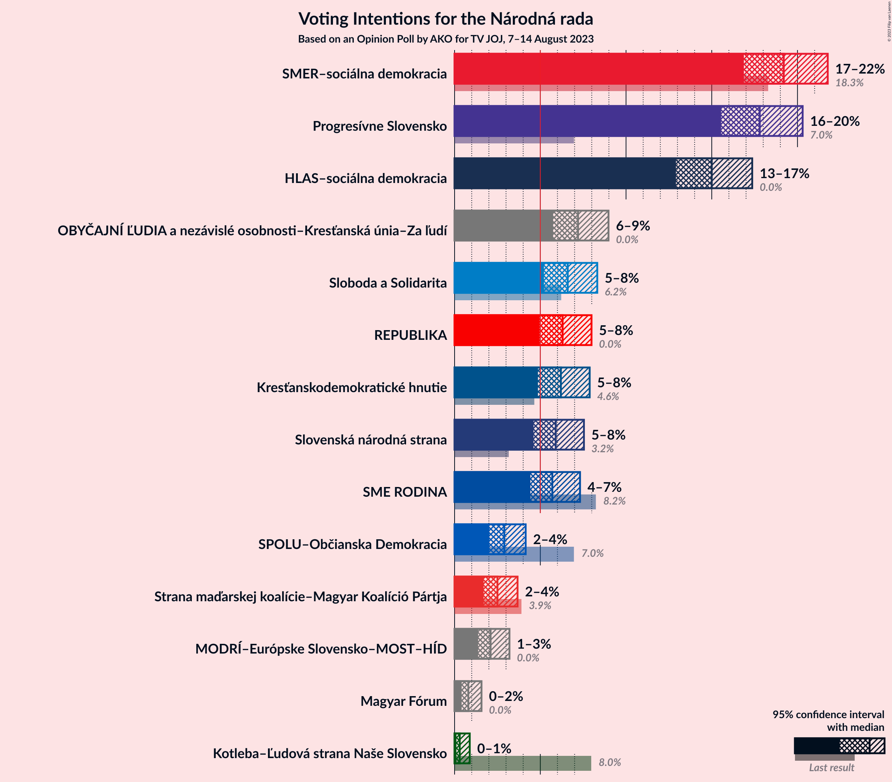

### Confidence Intervals

| Party | Last Result | Poll Result | 80% Confidence Interval | 90% Confidence Interval | 95% Confidence Interval | 99% Confidence Interval |
|:-----:|:-----------:|:-----------:|:-----------------------:|:-----------------------:|:-----------------------:|:-----------------------:|
| SMER–sociálna demokracia | 18.3% | 19.2% | 17.7–20.9% |17.2–21.4% |16.9–21.8% |16.2–22.6% |
| Progresívne Slovensko | 7.0% | 17.8% | 16.3–19.4% |15.9–19.9% |15.5–20.3% |14.9–21.1% |
| HLAS–sociálna demokracia | 0.0% | 15.0% | 13.6–16.5% |13.2–17.0% |12.9–17.4% |12.3–18.1% |
| OBYČAJNÍ ĽUDIA a nezávislé osobnosti–Kresťanská únia–Za ľudí | 0.0% | 7.2% | 6.2–8.4% |6.0–8.7% |5.7–9.0% |5.3–9.6% |
| Sloboda a Solidarita | 6.2% | 6.6% | 5.7–7.7% |5.4–8.0% |5.2–8.3% |4.8–8.9% |
| REPUBLIKA | 0.0% | 6.3% | 5.4–7.4% |5.2–7.7% |5.0–8.0% |4.6–8.6% |
| Kresťanskodemokratické hnutie | 4.6% | 6.2% | 5.3–7.3% |5.1–7.6% |4.9–7.9% |4.5–8.4% |
| Slovenská národná strana | 3.2% | 5.9% | 5.0–7.0% |4.8–7.3% |4.6–7.5% |4.2–8.1% |
| SME RODINA | 8.2% | 5.7% | 4.9–6.8% |4.6–7.1% |4.4–7.3% |4.1–7.9% |
| SPOLU–Občianska Demokracia | 7.0% | 2.9% | 2.3–3.7% |2.2–3.9% |2.0–4.1% |1.8–4.6% |
| Strana maďarskej koalície–Magyar Koalíció Pártja | 3.9% | 2.5% | 2.0–3.3% |1.8–3.5% |1.7–3.7% |1.5–4.1% |
| MODRÍ–Európske Slovensko–MOST–HÍD | 0.0% | 2.1% | 1.6–2.8% |1.5–3.0% |1.4–3.2% |1.2–3.6% |
| Magyar Fórum | 0.0% | 0.8% | 0.5–1.3% |0.5–1.4% |0.4–1.6% |0.3–1.9% |
| Kotleba–Ľudová strana Naše Slovensko | 8.0% | 0.3% | 0.2–0.7% |0.1–0.8% |0.1–0.9% |0.1–1.1% |

*Note:* The poll result column reflects the actual value used in the calculations. Published results may vary slightly, and in addition be rounded to fewer digits.

## Seats

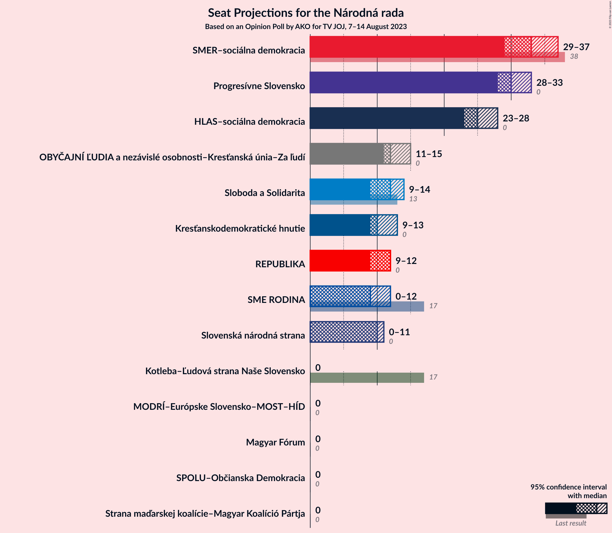

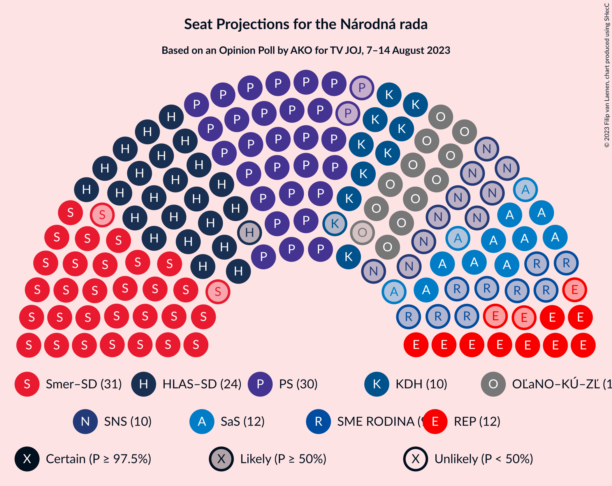

### Confidence Intervals

| Party | Last Result | Median | 80% Confidence Interval | 90% Confidence Interval | 95% Confidence Interval | 99% Confidence Interval |
|:-----:|:-----------:|:------:|:-----------------------:|:-----------------------:|:-----------------------:|:-----------------------:|
| <a href="#smer–sociálna-demokracia">SMER–sociálna demokracia</a> | 38 | 33 | 31–36 |31–37 |29–37 |29–42 |
| <a href="#progresívne-slovensko">Progresívne Slovensko</a> | 0 | 30 | 28–32 |28–33 |28–33 |26–35 |
| <a href="#hlas–sociálna-demokracia">HLAS–sociálna demokracia</a> | 0 | 25 | 24–27 |24–27 |23–28 |21–31 |
| <a href="#obyčajní-ľudia-a-nezávislé-osobnosti–kresťanská-únia–za-ľudí">OBYČAJNÍ ĽUDIA a nezávislé osobnosti–Kresťanská únia–Za ľudí</a> | 0 | 12 | 11–15 |11–15 |11–15 |10–16 |
| <a href="#sloboda-a-solidarita">Sloboda a Solidarita</a> | 13 | 12 | 9–13 |9–13 |9–14 |0–15 |
| <a href="#republika">REPUBLIKA</a> | 0 | 12 | 10–12 |9–12 |9–12 |8–14 |
| <a href="#kresťanskodemokratické-hnutie">Kresťanskodemokratické hnutie</a> | 0 | 10 | 9–11 |9–11 |9–13 |0–14 |
| <a href="#slovenská-národná-strana">Slovenská národná strana</a> | 0 | 10 | 0–11 |0–11 |0–11 |0–13 |
| <a href="#sme-rodina">SME RODINA</a> | 17 | 9 | 8–11 |8–11 |0–12 |0–13 |
| <a href="#spolu–občianska-demokracia">SPOLU–Občianska Demokracia</a> | 0 | 0 | 0 |0 |0 |0 |
| <a href="#strana-maďarskej-koalície–magyar-koalíció-pártja">Strana maďarskej koalície–Magyar Koalíció Pártja</a> | 0 | 0 | 0 |0 |0 |0 |
| <a href="#modrí–európske-slovensko–most–híd">MODRÍ–Európske Slovensko–MOST–HÍD</a> | 0 | 0 | 0 |0 |0 |0 |
| <a href="#magyar-fórum">Magyar Fórum</a> | 0 | 0 | 0 |0 |0 |0 |
| <a href="#kotleba–ľudová-strana-naše-slovensko">Kotleba–Ľudová strana Naše Slovensko</a> | 17 | 0 | 0 |0 |0 |0 |

### SMER–sociálna demokracia

*For a full overview of the results for this party, see the [SMER–sociálna demokracia](party-smer–sociálnademokracia.html) page.*

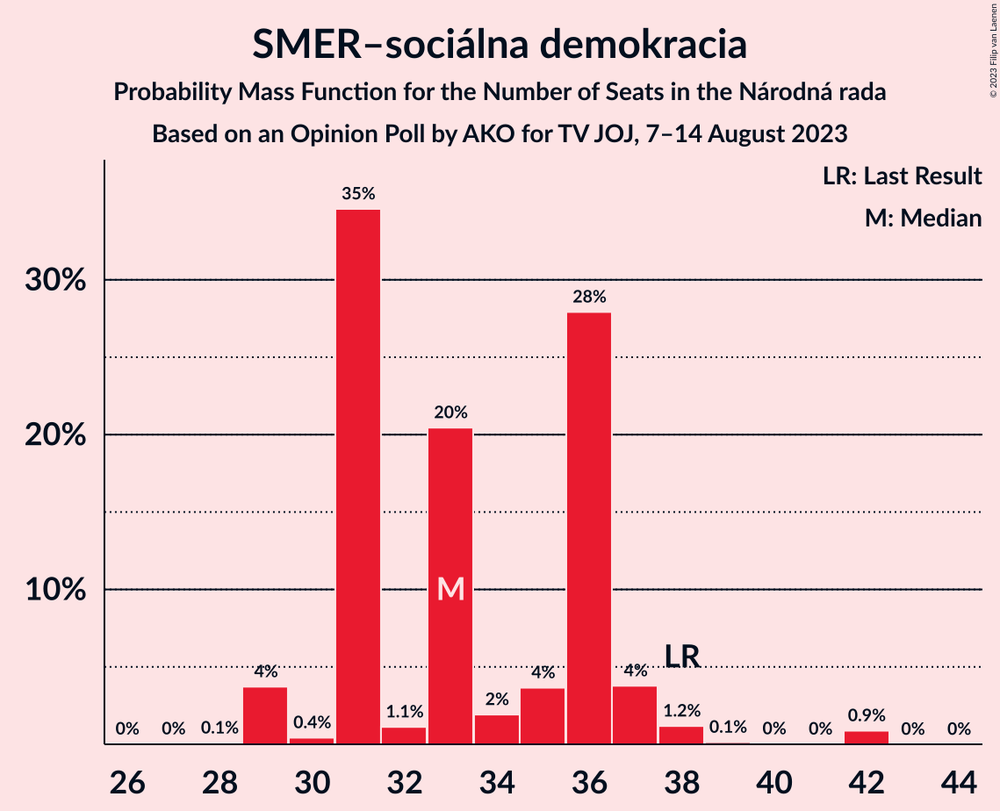

| Number of Seats | Probability | Accumulated | Special Marks |
|:---------------:|:-----------:|:-----------:|:-------------:|
| 26 | 0% | 100% |  |
| 27 | 0% | 99.9% |  |
| 28 | 0.1% | 99.9% |  |
| 29 | 4% | 99.8% |  |
| 30 | 0.4% | 96% |  |
| 31 | 35% | 96% |  |
| 32 | 1.1% | 61% |  |
| 33 | 20% | 60% | Median |
| 34 | 2% | 40% |  |
| 35 | 4% | 38% |  |
| 36 | 28% | 34% |  |
| 37 | 4% | 6% |  |
| 38 | 1.2% | 2% | Last Result |
| 39 | 0.1% | 1.1% |  |
| 40 | 0% | 0.9% |  |
| 41 | 0% | 0.9% |  |
| 42 | 0.9% | 0.9% |  |
| 43 | 0% | 0% |  |

### Progresívne Slovensko

*For a full overview of the results for this party, see the [Progresívne Slovensko](party-progresívneslovensko.html) page.*

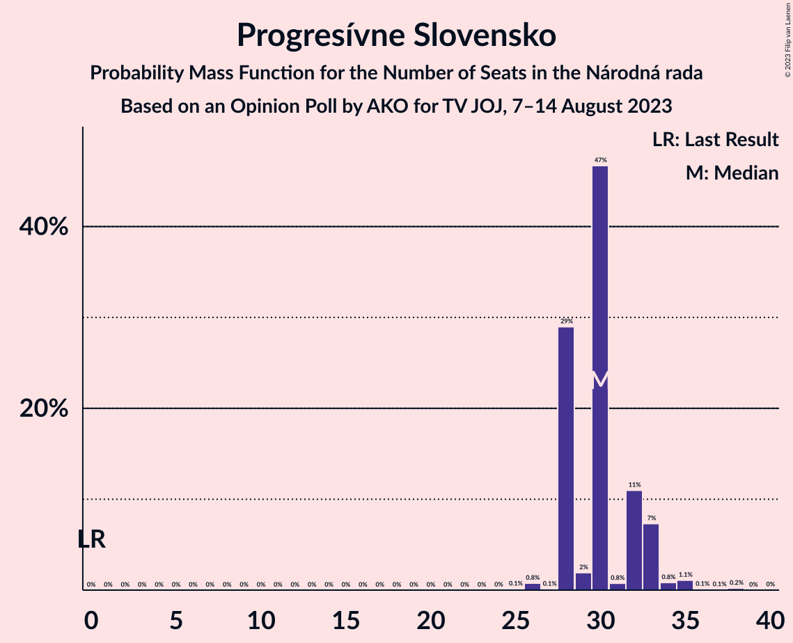

| Number of Seats | Probability | Accumulated | Special Marks |
|:---------------:|:-----------:|:-----------:|:-------------:|
| 0 | 0% | 100% | Last Result |
| 1 | 0% | 100% |  |
| 2 | 0% | 100% |  |
| 3 | 0% | 100% |  |
| 4 | 0% | 100% |  |
| 5 | 0% | 100% |  |
| 6 | 0% | 100% |  |
| 7 | 0% | 100% |  |
| 8 | 0% | 100% |  |
| 9 | 0% | 100% |  |
| 10 | 0% | 100% |  |
| 11 | 0% | 100% |  |
| 12 | 0% | 100% |  |
| 13 | 0% | 100% |  |
| 14 | 0% | 100% |  |
| 15 | 0% | 100% |  |
| 16 | 0% | 100% |  |
| 17 | 0% | 100% |  |
| 18 | 0% | 100% |  |
| 19 | 0% | 100% |  |
| 20 | 0% | 100% |  |
| 21 | 0% | 100% |  |
| 22 | 0% | 100% |  |
| 23 | 0% | 100% |  |
| 24 | 0% | 100% |  |
| 25 | 0.1% | 100% |  |
| 26 | 0.8% | 99.9% |  |
| 27 | 0.1% | 99.1% |  |
| 28 | 29% | 99.0% |  |
| 29 | 2% | 70% |  |
| 30 | 47% | 68% | Median |
| 31 | 0.8% | 21% |  |
| 32 | 11% | 21% |  |
| 33 | 7% | 10% |  |
| 34 | 0.8% | 2% |  |
| 35 | 1.1% | 1.5% |  |
| 36 | 0.1% | 0.4% |  |
| 37 | 0.1% | 0.3% |  |
| 38 | 0.2% | 0.3% |  |
| 39 | 0% | 0% |  |

### HLAS–sociálna demokracia

*For a full overview of the results for this party, see the [HLAS–sociálna demokracia](party-hlas–sociálnademokracia.html) page.*

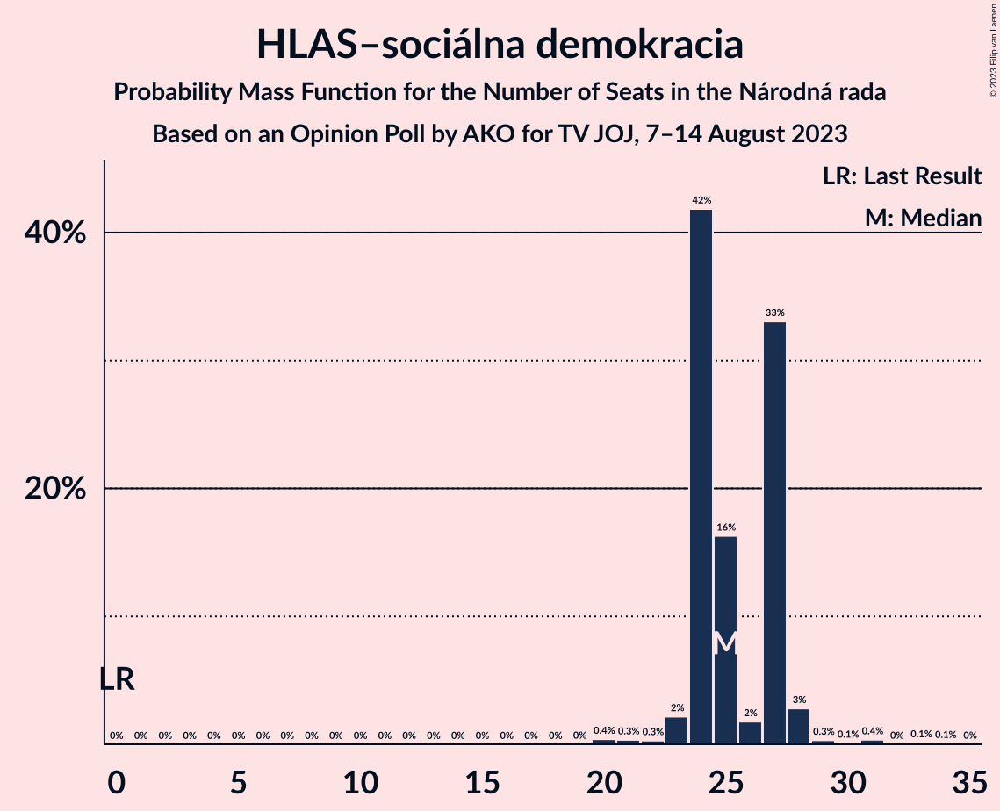

| Number of Seats | Probability | Accumulated | Special Marks |
|:---------------:|:-----------:|:-----------:|:-------------:|
| 0 | 0% | 100% | Last Result |
| 1 | 0% | 100% |  |
| 2 | 0% | 100% |  |
| 3 | 0% | 100% |  |
| 4 | 0% | 100% |  |
| 5 | 0% | 100% |  |
| 6 | 0% | 100% |  |
| 7 | 0% | 100% |  |
| 8 | 0% | 100% |  |
| 9 | 0% | 100% |  |
| 10 | 0% | 100% |  |
| 11 | 0% | 100% |  |
| 12 | 0% | 100% |  |
| 13 | 0% | 100% |  |
| 14 | 0% | 100% |  |
| 15 | 0% | 100% |  |
| 16 | 0% | 100% |  |
| 17 | 0% | 100% |  |
| 18 | 0% | 100% |  |
| 19 | 0% | 100% |  |
| 20 | 0.4% | 100% |  |
| 21 | 0.3% | 99.6% |  |
| 22 | 0.3% | 99.2% |  |
| 23 | 2% | 98.9% |  |
| 24 | 42% | 97% |  |
| 25 | 16% | 55% | Median |
| 26 | 2% | 39% |  |
| 27 | 33% | 37% |  |
| 28 | 3% | 4% |  |
| 29 | 0.3% | 1.0% |  |
| 30 | 0.1% | 0.7% |  |
| 31 | 0.4% | 0.6% |  |
| 32 | 0% | 0.2% |  |
| 33 | 0.1% | 0.2% |  |
| 34 | 0.1% | 0.1% |  |
| 35 | 0% | 0% |  |

### OBYČAJNÍ ĽUDIA a nezávislé osobnosti–Kresťanská únia–Za ľudí

*For a full overview of the results for this party, see the [OBYČAJNÍ ĽUDIA a nezávislé osobnosti–Kresťanská únia–Za ľudí](party-obyčajníľudiaanezávisléosobnosti–kresťanskáúnia–zaľudí.html) page.*

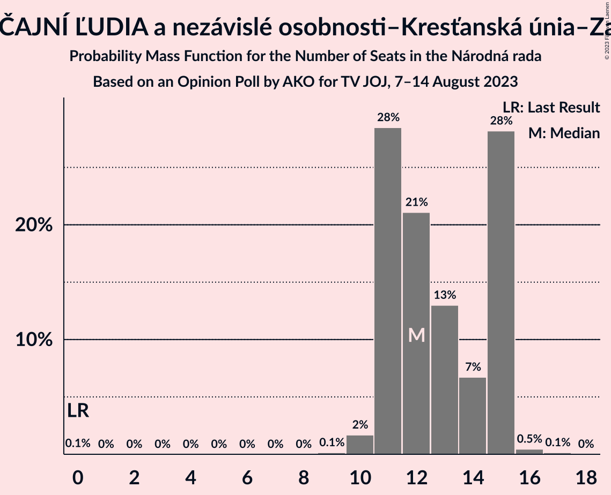

| Number of Seats | Probability | Accumulated | Special Marks |
|:---------------:|:-----------:|:-----------:|:-------------:|
| 0 | 0.1% | 100% | Last Result |
| 1 | 0% | 99.9% |  |
| 2 | 0% | 99.9% |  |
| 3 | 0% | 99.9% |  |
| 4 | 0% | 99.9% |  |
| 5 | 0% | 99.9% |  |
| 6 | 0% | 99.9% |  |
| 7 | 0% | 99.9% |  |
| 8 | 0% | 99.9% |  |
| 9 | 0.1% | 99.9% |  |
| 10 | 2% | 99.8% |  |
| 11 | 28% | 98% |  |
| 12 | 21% | 70% | Median |
| 13 | 13% | 49% |  |
| 14 | 7% | 36% |  |
| 15 | 28% | 29% |  |
| 16 | 0.5% | 0.6% |  |
| 17 | 0.1% | 0.2% |  |
| 18 | 0% | 0% |  |

### Sloboda a Solidarita

*For a full overview of the results for this party, see the [Sloboda a Solidarita](party-slobodaasolidarita.html) page.*

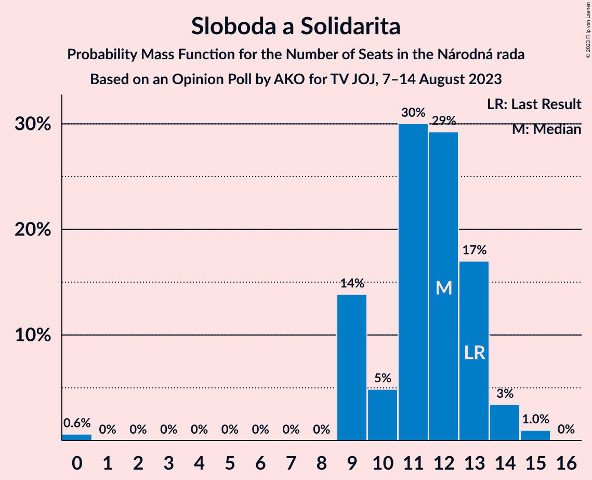

| Number of Seats | Probability | Accumulated | Special Marks |
|:---------------:|:-----------:|:-----------:|:-------------:|
| 0 | 0.6% | 100% |  |
| 1 | 0% | 99.4% |  |
| 2 | 0% | 99.4% |  |
| 3 | 0% | 99.4% |  |
| 4 | 0% | 99.4% |  |
| 5 | 0% | 99.4% |  |
| 6 | 0% | 99.4% |  |
| 7 | 0% | 99.4% |  |
| 8 | 0% | 99.4% |  |
| 9 | 14% | 99.4% |  |
| 10 | 5% | 86% |  |
| 11 | 30% | 81% |  |
| 12 | 29% | 51% | Median |
| 13 | 17% | 21% | Last Result |
| 14 | 3% | 4% |  |
| 15 | 1.0% | 1.0% |  |
| 16 | 0% | 0% |  |

### REPUBLIKA

*For a full overview of the results for this party, see the [REPUBLIKA](party-republika.html) page.*

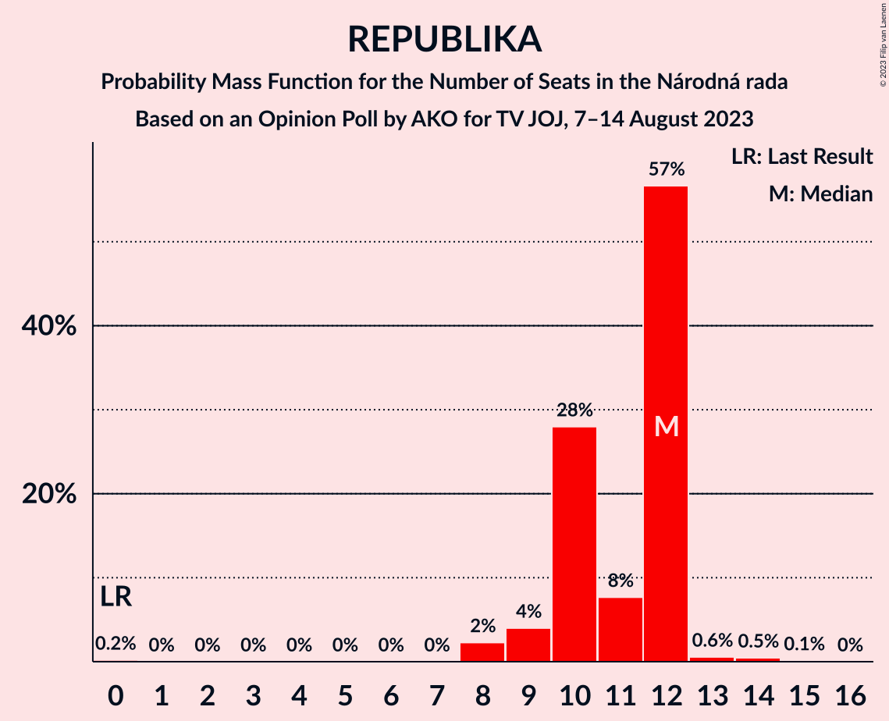

| Number of Seats | Probability | Accumulated | Special Marks |
|:---------------:|:-----------:|:-----------:|:-------------:|
| 0 | 0.2% | 100% | Last Result |
| 1 | 0% | 99.8% |  |
| 2 | 0% | 99.8% |  |
| 3 | 0% | 99.8% |  |
| 4 | 0% | 99.8% |  |
| 5 | 0% | 99.8% |  |
| 6 | 0% | 99.8% |  |
| 7 | 0% | 99.8% |  |
| 8 | 2% | 99.8% |  |
| 9 | 4% | 98% |  |
| 10 | 28% | 94% |  |
| 11 | 8% | 66% |  |
| 12 | 57% | 58% | Median |
| 13 | 0.6% | 1.2% |  |
| 14 | 0.5% | 0.6% |  |
| 15 | 0.1% | 0.1% |  |
| 16 | 0% | 0% |  |

### Kresťanskodemokratické hnutie

*For a full overview of the results for this party, see the [Kresťanskodemokratické hnutie](party-kresťanskodemokratickéhnutie.html) page.*

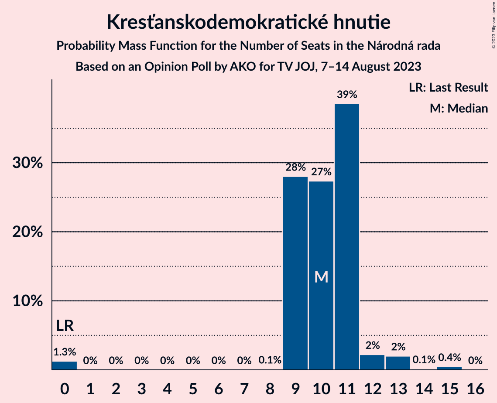

| Number of Seats | Probability | Accumulated | Special Marks |
|:---------------:|:-----------:|:-----------:|:-------------:|
| 0 | 1.3% | 100% | Last Result |
| 1 | 0% | 98.7% |  |
| 2 | 0% | 98.7% |  |
| 3 | 0% | 98.7% |  |
| 4 | 0% | 98.7% |  |
| 5 | 0% | 98.7% |  |
| 6 | 0% | 98.7% |  |
| 7 | 0% | 98.7% |  |
| 8 | 0.1% | 98.7% |  |
| 9 | 28% | 98.7% |  |
| 10 | 27% | 71% | Median |
| 11 | 39% | 43% |  |
| 12 | 2% | 5% |  |
| 13 | 2% | 3% |  |
| 14 | 0.1% | 0.6% |  |
| 15 | 0.4% | 0.5% |  |
| 16 | 0% | 0% |  |

### Slovenská národná strana

*For a full overview of the results for this party, see the [Slovenská národná strana](party-slovenskánárodnástrana.html) page.*

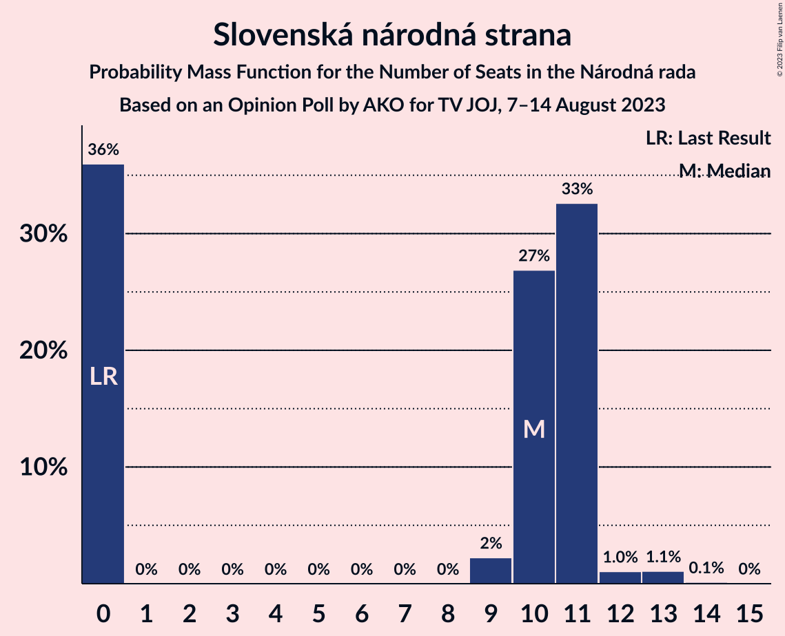

| Number of Seats | Probability | Accumulated | Special Marks |
|:---------------:|:-----------:|:-----------:|:-------------:|
| 0 | 36% | 100% | Last Result |
| 1 | 0% | 64% |  |
| 2 | 0% | 64% |  |
| 3 | 0% | 64% |  |
| 4 | 0% | 64% |  |
| 5 | 0% | 64% |  |
| 6 | 0% | 64% |  |
| 7 | 0% | 64% |  |
| 8 | 0% | 64% |  |
| 9 | 2% | 64% |  |
| 10 | 27% | 62% | Median |
| 11 | 33% | 35% |  |
| 12 | 1.0% | 2% |  |
| 13 | 1.1% | 1.2% |  |
| 14 | 0.1% | 0.2% |  |
| 15 | 0% | 0% |  |

### SME RODINA

*For a full overview of the results for this party, see the [SME RODINA](party-smerodina.html) page.*

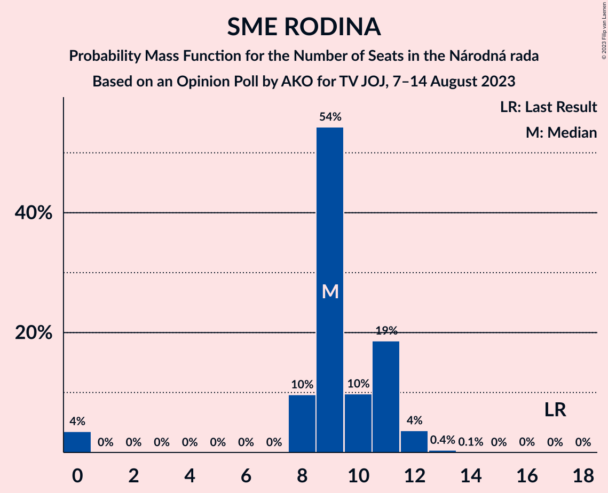

| Number of Seats | Probability | Accumulated | Special Marks |
|:---------------:|:-----------:|:-----------:|:-------------:|
| 0 | 4% | 100% |  |
| 1 | 0% | 96% |  |
| 2 | 0% | 96% |  |
| 3 | 0% | 96% |  |
| 4 | 0% | 96% |  |
| 5 | 0% | 96% |  |
| 6 | 0% | 96% |  |
| 7 | 0% | 96% |  |
| 8 | 10% | 96% |  |
| 9 | 54% | 87% | Median |
| 10 | 10% | 33% |  |
| 11 | 19% | 23% |  |
| 12 | 4% | 4% |  |
| 13 | 0.4% | 0.5% |  |
| 14 | 0.1% | 0.1% |  |
| 15 | 0% | 0.1% |  |
| 16 | 0% | 0% |  |
| 17 | 0% | 0% | Last Result |

### SPOLU–Občianska Demokracia

*For a full overview of the results for this party, see the [SPOLU–Občianska Demokracia](party-spolu–občianskademokracia.html) page.*

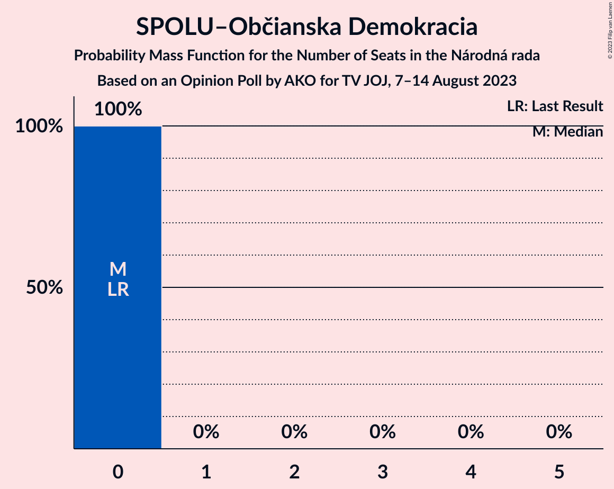

| Number of Seats | Probability | Accumulated | Special Marks |
|:---------------:|:-----------:|:-----------:|:-------------:|
| 0 | 100% | 100% | Last Result, Median |

### Strana maďarskej koalície–Magyar Koalíció Pártja

*For a full overview of the results for this party, see the [Strana maďarskej koalície–Magyar Koalíció Pártja](party-stranamaďarskejkoalície–magyarkoalíciópártja.html) page.*

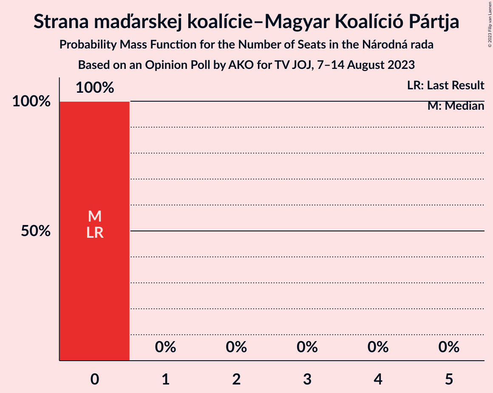

| Number of Seats | Probability | Accumulated | Special Marks |
|:---------------:|:-----------:|:-----------:|:-------------:|
| 0 | 100% | 100% | Last Result, Median |

### MODRÍ–Európske Slovensko–MOST–HÍD

*For a full overview of the results for this party, see the [MODRÍ–Európske Slovensko–MOST–HÍD](party-modrí–európskeslovensko–most–híd.html) page.*

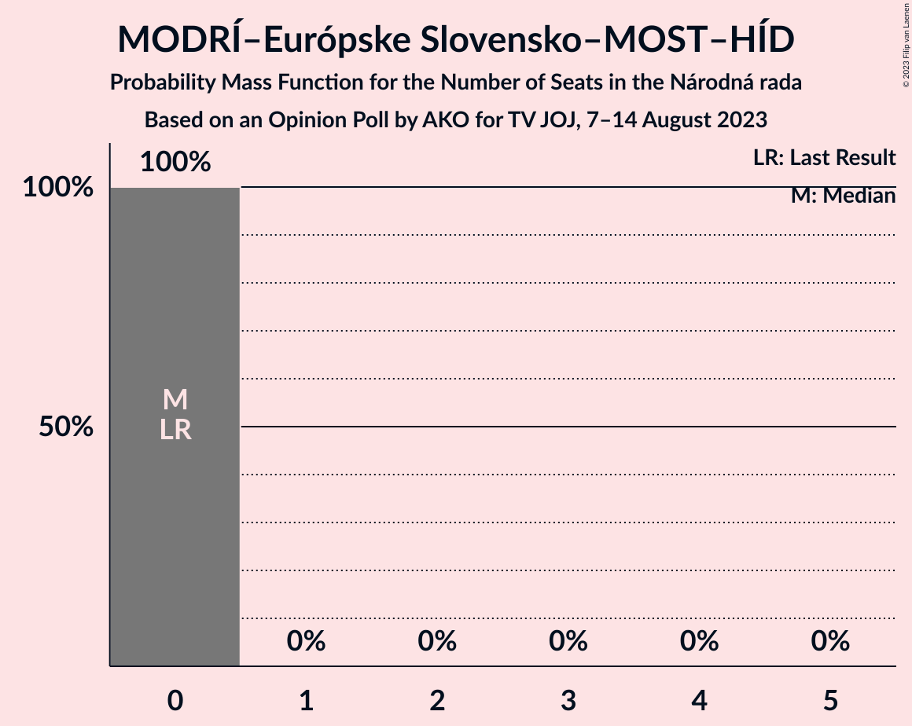

| Number of Seats | Probability | Accumulated | Special Marks |
|:---------------:|:-----------:|:-----------:|:-------------:|
| 0 | 100% | 100% | Last Result, Median |

### Magyar Fórum

*For a full overview of the results for this party, see the [Magyar Fórum](party-magyarfórum.html) page.*

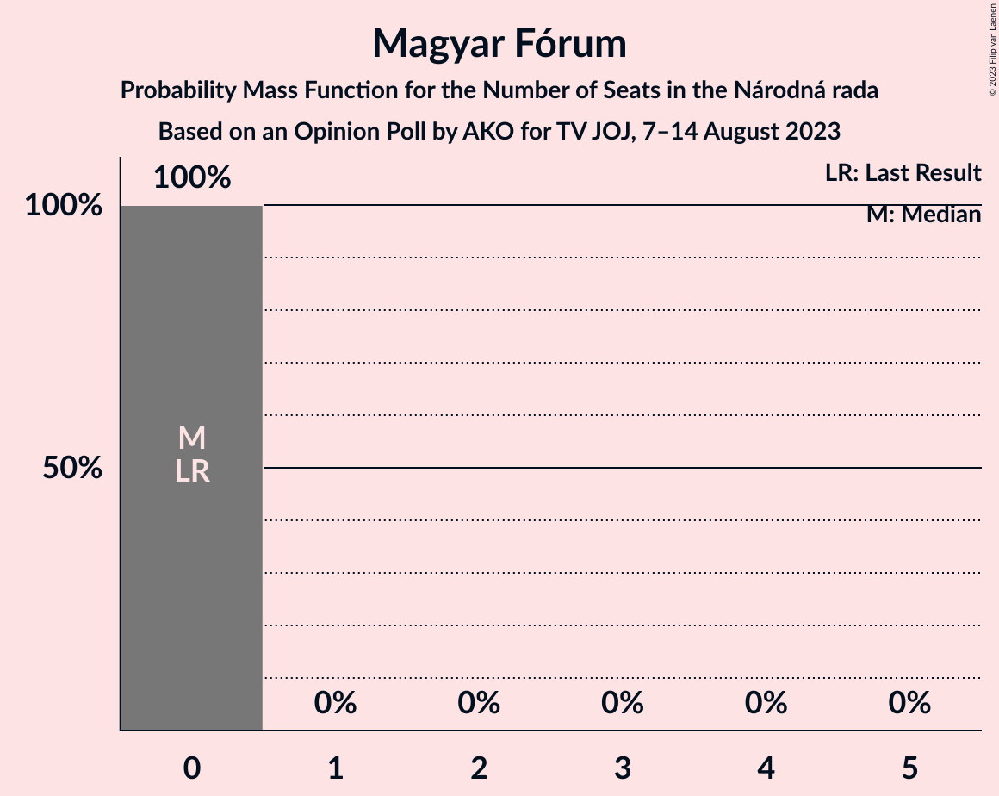

| Number of Seats | Probability | Accumulated | Special Marks |
|:---------------:|:-----------:|:-----------:|:-------------:|
| 0 | 100% | 100% | Last Result, Median |

### Kotleba–Ľudová strana Naše Slovensko

*For a full overview of the results for this party, see the [Kotleba–Ľudová strana Naše Slovensko](party-kotleba–ľudovástrananašeslovensko.html) page.*

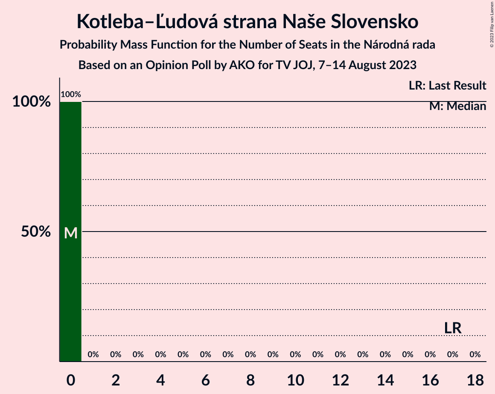

| Number of Seats | Probability | Accumulated | Special Marks |
|:---------------:|:-----------:|:-----------:|:-------------:|
| 0 | 100% | 100% | Median |
| 1 | 0% | 0% |  |
| 2 | 0% | 0% |  |
| 3 | 0% | 0% |  |
| 4 | 0% | 0% |  |
| 5 | 0% | 0% |  |
| 6 | 0% | 0% |  |
| 7 | 0% | 0% |  |
| 8 | 0% | 0% |  |
| 9 | 0% | 0% |  |
| 10 | 0% | 0% |  |
| 11 | 0% | 0% |  |
| 12 | 0% | 0% |  |
| 13 | 0% | 0% |  |
| 14 | 0% | 0% |  |
| 15 | 0% | 0% |  |
| 16 | 0% | 0% |  |
| 17 | 0% | 0% | Last Result |

## Coalitions

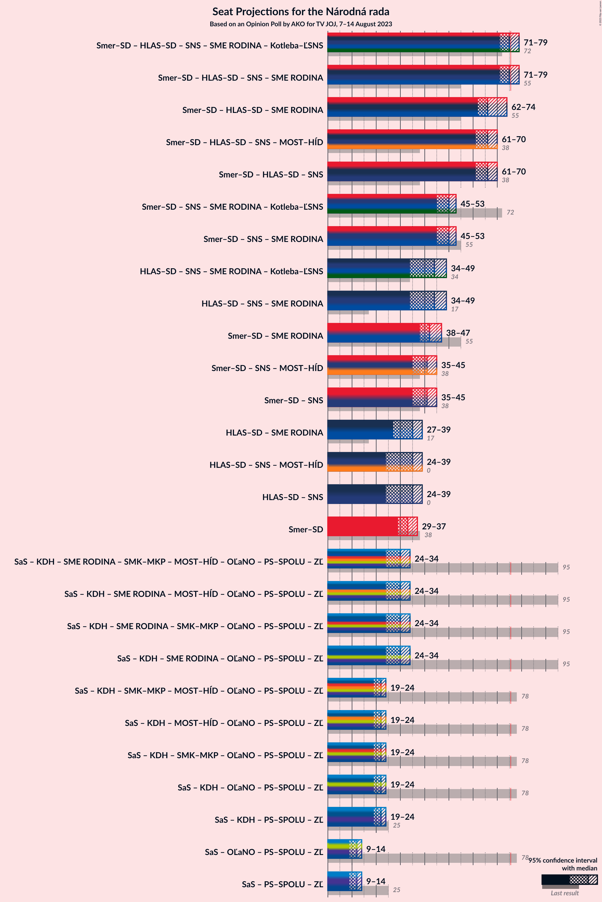

### Confidence Intervals

| Coalition | Last Result | Median | Majority? | 80% Confidence Interval | 90% Confidence Interval | 95% Confidence Interval | 99% Confidence Interval |
|:---------:|:-----------:|:------:|:---------:|:-----------------------:|:-----------------------:|:-----------------------:|:-----------------------:|
| SMER–sociálna demokracia – HLAS–sociálna demokracia – Slovenská národná strana – SME RODINA – Kotleba–Ľudová strana Naše Slovensko | 72 | 75 | 34% | 72–77 | 72–78 | 71–79 | 67–84 |
| SMER–sociálna demokracia – HLAS–sociálna demokracia – Slovenská národná strana – SME RODINA | 55 | 75 | 34% | 72–77 | 72–78 | 71–79 | 67–84 |
| SMER–sociálna demokracia – HLAS–sociálna demokracia – SME RODINA | 55 | 66 | 0.2% | 65–72 | 65–72 | 62–74 | 58–75 |
| SMER–sociálna demokracia – HLAS–sociálna demokracia – Slovenská národná strana | 38 | 66 | 0.2% | 63–68 | 62–69 | 61–70 | 61–74 |
| SMER–sociálna demokracia – Slovenská národná strana – SME RODINA – Kotleba–Ľudová strana Naše Slovensko | 72 | 50 | 0% | 45–53 | 45–53 | 45–53 | 42–56 |
| SMER–sociálna demokracia – Slovenská národná strana – SME RODINA | 55 | 50 | 0% | 45–53 | 45–53 | 45–53 | 42–56 |
| HLAS–sociálna demokracia – Slovenská národná strana – SME RODINA – Kotleba–Ľudová strana Naše Slovensko | 34 | 44 | 0% | 36–46 | 36–46 | 34–49 | 26–51 |
| HLAS–sociálna demokracia – Slovenská národná strana – SME RODINA | 17 | 44 | 0% | 36–46 | 36–46 | 34–49 | 26–51 |
| SMER–sociálna demokracia – SME RODINA | 55 | 42 | 0% | 40–45 | 39–47 | 38–47 | 32–48 |
| SMER–sociálna demokracia – Slovenská národná strana | 38 | 41 | 0% | 36–44 | 36–44 | 35–45 | 35–50 |
| HLAS–sociálna demokracia – SME RODINA | 17 | 35 | 0% | 32–36 | 32–38 | 27–39 | 23–40 |
| HLAS–sociálna demokracia – Slovenská národná strana | 0 | 35 | 0% | 27–35 | 27–36 | 24–39 | 24–40 |
| SMER–sociálna demokracia | 38 | 33 | 0% | 31–36 | 31–37 | 29–37 | 29–42 |

### SMER–sociálna demokracia – HLAS–sociálna demokracia – Slovenská národná strana – SME RODINA – Kotleba–Ľudová strana Naše Slovensko

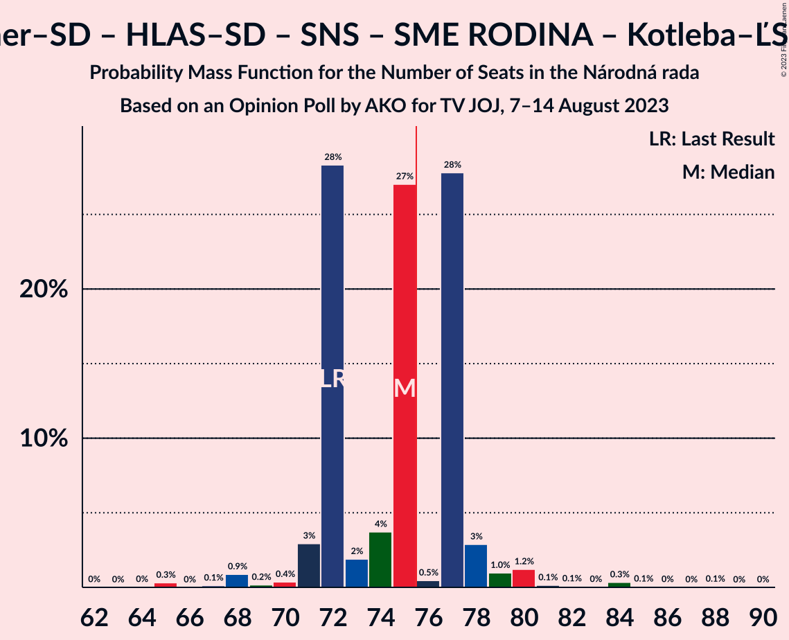

| Number of Seats | Probability | Accumulated | Special Marks |
|:---------------:|:-----------:|:-----------:|:-------------:|
| 63 | 0% | 100% |  |
| 64 | 0% | 99.9% |  |
| 65 | 0.3% | 99.9% |  |
| 66 | 0% | 99.6% |  |
| 67 | 0.1% | 99.6% |  |
| 68 | 0.9% | 99.5% |  |
| 69 | 0.2% | 98.6% |  |
| 70 | 0.4% | 98% |  |
| 71 | 3% | 98% |  |
| 72 | 28% | 95% | Last Result |
| 73 | 2% | 67% |  |
| 74 | 4% | 65% |  |
| 75 | 27% | 61% |  |
| 76 | 0.5% | 34% | Majority |
| 77 | 28% | 34% | Median |
| 78 | 3% | 6% |  |
| 79 | 1.0% | 3% |  |
| 80 | 1.2% | 2% |  |
| 81 | 0.1% | 0.8% |  |
| 82 | 0.1% | 0.6% |  |
| 83 | 0% | 0.5% |  |
| 84 | 0.3% | 0.5% |  |
| 85 | 0.1% | 0.2% |  |
| 86 | 0% | 0.1% |  |
| 87 | 0% | 0.1% |  |
| 88 | 0.1% | 0.1% |  |
| 89 | 0% | 0% |  |

### SMER–sociálna demokracia – HLAS–sociálna demokracia – Slovenská národná strana – SME RODINA

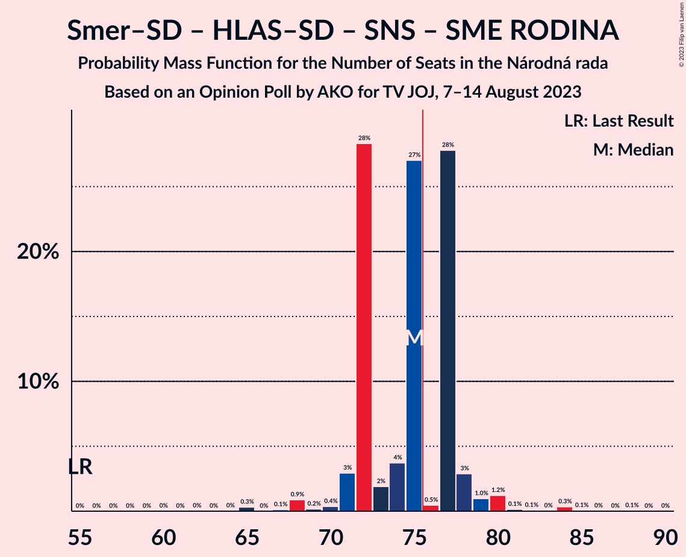

| Number of Seats | Probability | Accumulated | Special Marks |
|:---------------:|:-----------:|:-----------:|:-------------:|
| 55 | 0% | 100% | Last Result |
| 56 | 0% | 100% |  |
| 57 | 0% | 100% |  |
| 58 | 0% | 100% |  |
| 59 | 0% | 100% |  |
| 60 | 0% | 100% |  |
| 61 | 0% | 100% |  |
| 62 | 0% | 100% |  |
| 63 | 0% | 100% |  |
| 64 | 0% | 99.9% |  |
| 65 | 0.3% | 99.9% |  |
| 66 | 0% | 99.6% |  |
| 67 | 0.1% | 99.6% |  |
| 68 | 0.9% | 99.5% |  |
| 69 | 0.2% | 98.6% |  |
| 70 | 0.4% | 98% |  |
| 71 | 3% | 98% |  |
| 72 | 28% | 95% |  |
| 73 | 2% | 67% |  |
| 74 | 4% | 65% |  |
| 75 | 27% | 61% |  |
| 76 | 0.5% | 34% | Majority |
| 77 | 28% | 34% | Median |
| 78 | 3% | 6% |  |
| 79 | 1.0% | 3% |  |
| 80 | 1.2% | 2% |  |
| 81 | 0.1% | 0.8% |  |
| 82 | 0.1% | 0.6% |  |
| 83 | 0% | 0.5% |  |
| 84 | 0.3% | 0.5% |  |
| 85 | 0.1% | 0.2% |  |
| 86 | 0% | 0.1% |  |
| 87 | 0% | 0.1% |  |
| 88 | 0.1% | 0.1% |  |
| 89 | 0% | 0% |  |

### SMER–sociálna demokracia – HLAS–sociálna demokracia – SME RODINA

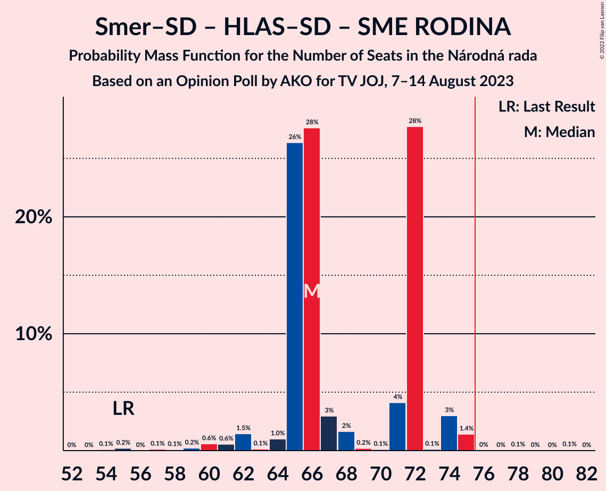

| Number of Seats | Probability | Accumulated | Special Marks |
|:---------------:|:-----------:|:-----------:|:-------------:|
| 54 | 0.1% | 100% |  |
| 55 | 0.2% | 99.9% | Last Result |
| 56 | 0% | 99.7% |  |
| 57 | 0.1% | 99.7% |  |
| 58 | 0.1% | 99.6% |  |
| 59 | 0.2% | 99.5% |  |
| 60 | 0.6% | 99.2% |  |
| 61 | 0.6% | 98.6% |  |
| 62 | 1.5% | 98% |  |
| 63 | 0.1% | 97% |  |
| 64 | 1.0% | 96% |  |
| 65 | 26% | 95% |  |
| 66 | 28% | 69% |  |
| 67 | 3% | 41% | Median |
| 68 | 2% | 39% |  |
| 69 | 0.2% | 37% |  |
| 70 | 0.1% | 37% |  |
| 71 | 4% | 37% |  |
| 72 | 28% | 32% |  |
| 73 | 0.1% | 5% |  |
| 74 | 3% | 5% |  |
| 75 | 1.4% | 2% |  |
| 76 | 0% | 0.2% | Majority |
| 77 | 0% | 0.2% |  |
| 78 | 0.1% | 0.2% |  |
| 79 | 0% | 0.1% |  |
| 80 | 0% | 0.1% |  |
| 81 | 0.1% | 0.1% |  |
| 82 | 0% | 0% |  |

### SMER–sociálna demokracia – HLAS–sociálna demokracia – Slovenská národná strana

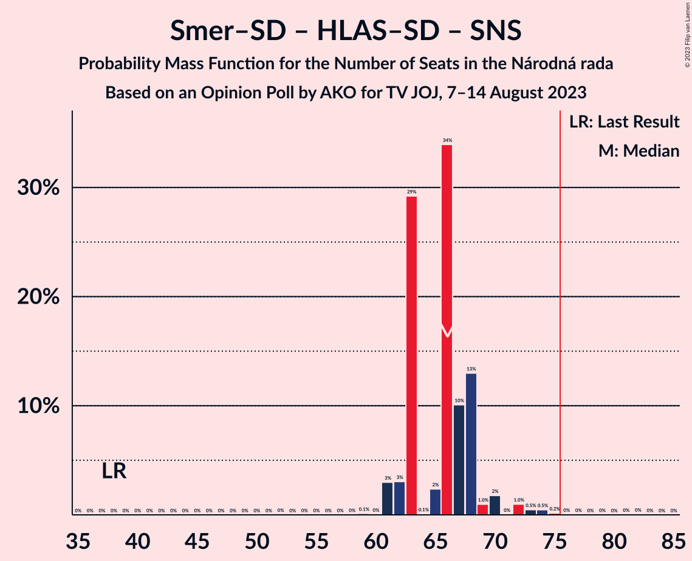

| Number of Seats | Probability | Accumulated | Special Marks |
|:---------------:|:-----------:|:-----------:|:-------------:|
| 38 | 0% | 100% | Last Result |
| 39 | 0% | 100% |  |
| 40 | 0% | 100% |  |
| 41 | 0% | 100% |  |
| 42 | 0% | 100% |  |
| 43 | 0% | 100% |  |
| 44 | 0% | 100% |  |
| 45 | 0% | 100% |  |
| 46 | 0% | 100% |  |
| 47 | 0% | 100% |  |
| 48 | 0% | 100% |  |
| 49 | 0% | 100% |  |
| 50 | 0% | 100% |  |
| 51 | 0% | 100% |  |
| 52 | 0% | 100% |  |
| 53 | 0% | 100% |  |
| 54 | 0% | 100% |  |
| 55 | 0% | 100% |  |
| 56 | 0% | 100% |  |
| 57 | 0% | 100% |  |
| 58 | 0% | 100% |  |
| 59 | 0.1% | 99.9% |  |
| 60 | 0% | 99.8% |  |
| 61 | 3% | 99.8% |  |
| 62 | 3% | 97% |  |
| 63 | 29% | 94% |  |
| 64 | 0.1% | 65% |  |
| 65 | 2% | 64% |  |
| 66 | 34% | 62% |  |
| 67 | 10% | 28% |  |
| 68 | 13% | 18% | Median |
| 69 | 1.0% | 5% |  |
| 70 | 2% | 4% |  |
| 71 | 0% | 2% |  |
| 72 | 1.0% | 2% |  |
| 73 | 0.5% | 1.3% |  |
| 74 | 0.5% | 0.8% |  |
| 75 | 0.2% | 0.3% |  |
| 76 | 0% | 0.2% | Majority |
| 77 | 0% | 0.1% |  |
| 78 | 0% | 0.1% |  |
| 79 | 0% | 0.1% |  |
| 80 | 0% | 0.1% |  |
| 81 | 0% | 0.1% |  |
| 82 | 0% | 0.1% |  |
| 83 | 0% | 0% |  |

### SMER–sociálna demokracia – Slovenská národná strana – SME RODINA – Kotleba–Ľudová strana Naše Slovensko

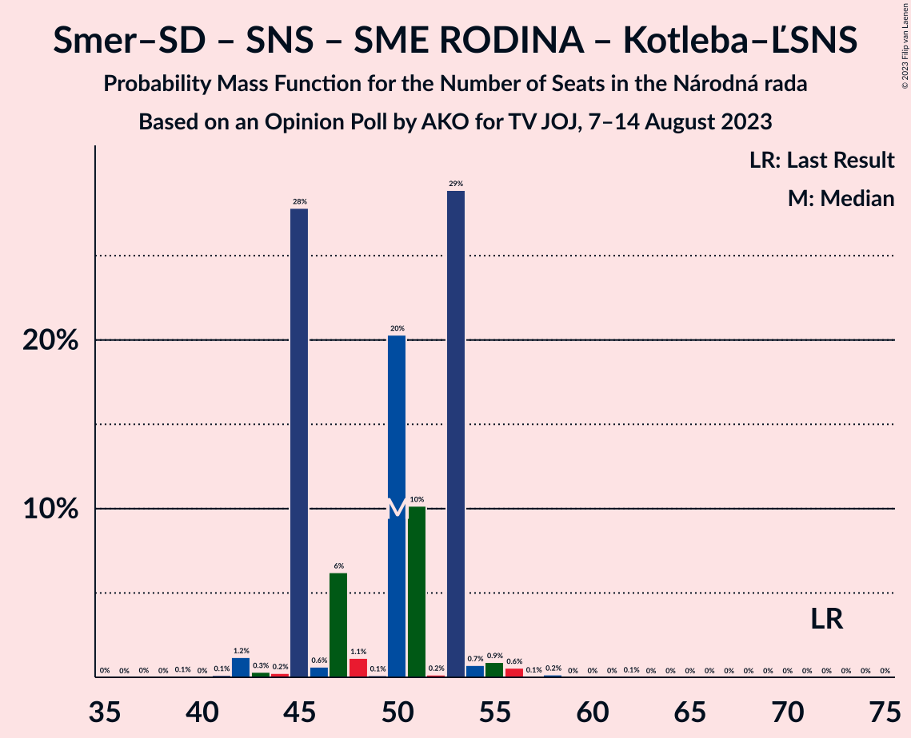

| Number of Seats | Probability | Accumulated | Special Marks |
|:---------------:|:-----------:|:-----------:|:-------------:|
| 37 | 0% | 100% |  |
| 38 | 0% | 99.9% |  |
| 39 | 0.1% | 99.9% |  |
| 40 | 0% | 99.8% |  |
| 41 | 0.1% | 99.8% |  |
| 42 | 1.2% | 99.7% |  |
| 43 | 0.3% | 98.5% |  |
| 44 | 0.2% | 98% |  |
| 45 | 28% | 98% |  |
| 46 | 0.6% | 70% |  |
| 47 | 6% | 69% |  |
| 48 | 1.1% | 63% |  |
| 49 | 0.1% | 62% |  |
| 50 | 20% | 62% |  |
| 51 | 10% | 42% |  |
| 52 | 0.2% | 32% | Median |
| 53 | 29% | 31% |  |
| 54 | 0.7% | 2% |  |
| 55 | 0.9% | 2% |  |
| 56 | 0.6% | 0.9% |  |
| 57 | 0.1% | 0.3% |  |
| 58 | 0.2% | 0.3% |  |
| 59 | 0% | 0.1% |  |
| 60 | 0% | 0.1% |  |
| 61 | 0% | 0.1% |  |
| 62 | 0.1% | 0.1% |  |
| 63 | 0% | 0% |  |
| 64 | 0% | 0% |  |
| 65 | 0% | 0% |  |
| 66 | 0% | 0% |  |
| 67 | 0% | 0% |  |
| 68 | 0% | 0% |  |
| 69 | 0% | 0% |  |
| 70 | 0% | 0% |  |
| 71 | 0% | 0% |  |
| 72 | 0% | 0% | Last Result |

### SMER–sociálna demokracia – Slovenská národná strana – SME RODINA

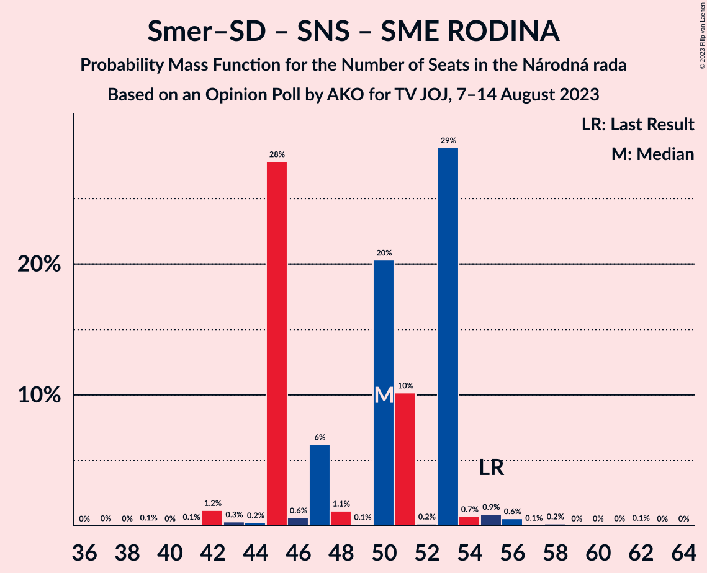

| Number of Seats | Probability | Accumulated | Special Marks |
|:---------------:|:-----------:|:-----------:|:-------------:|
| 37 | 0% | 100% |  |
| 38 | 0% | 99.9% |  |
| 39 | 0.1% | 99.9% |  |
| 40 | 0% | 99.8% |  |
| 41 | 0.1% | 99.8% |  |
| 42 | 1.2% | 99.7% |  |
| 43 | 0.3% | 98.5% |  |
| 44 | 0.2% | 98% |  |
| 45 | 28% | 98% |  |
| 46 | 0.6% | 70% |  |
| 47 | 6% | 69% |  |
| 48 | 1.1% | 63% |  |
| 49 | 0.1% | 62% |  |
| 50 | 20% | 62% |  |
| 51 | 10% | 42% |  |
| 52 | 0.2% | 32% | Median |
| 53 | 29% | 31% |  |
| 54 | 0.7% | 2% |  |
| 55 | 0.9% | 2% | Last Result |
| 56 | 0.6% | 0.9% |  |
| 57 | 0.1% | 0.3% |  |
| 58 | 0.2% | 0.3% |  |
| 59 | 0% | 0.1% |  |
| 60 | 0% | 0.1% |  |
| 61 | 0% | 0.1% |  |
| 62 | 0.1% | 0.1% |  |
| 63 | 0% | 0% |  |

### HLAS–sociálna demokracia – Slovenská národná strana – SME RODINA – Kotleba–Ľudová strana Naše Slovensko

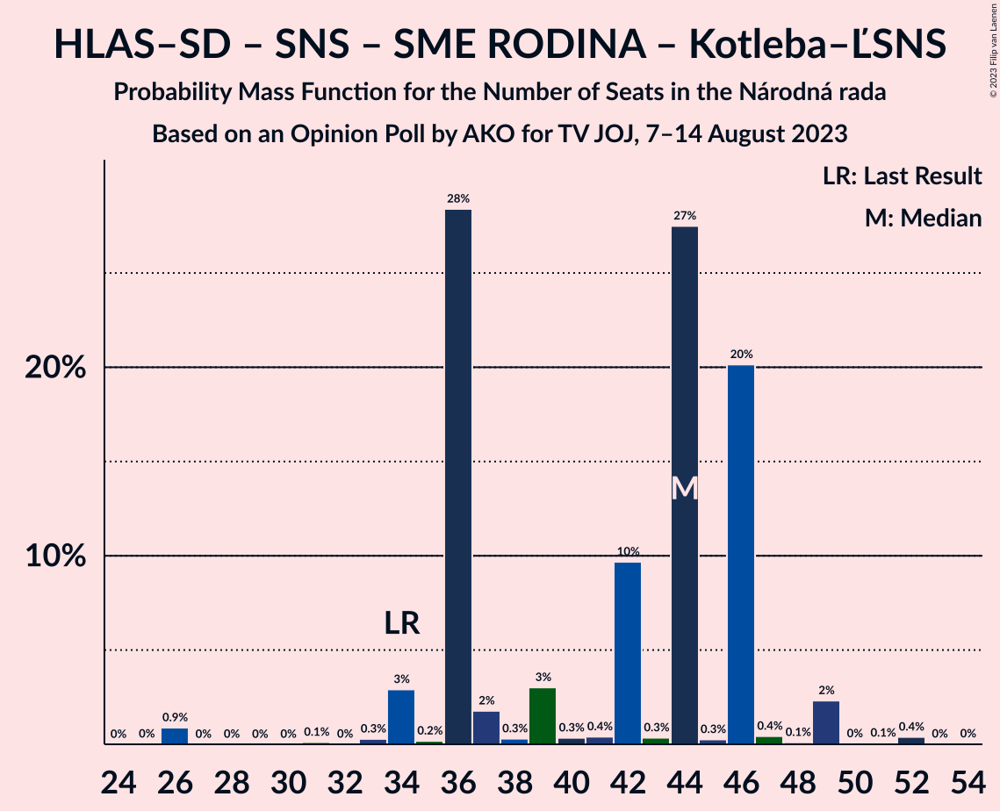

| Number of Seats | Probability | Accumulated | Special Marks |
|:---------------:|:-----------:|:-----------:|:-------------:|
| 26 | 0.9% | 100% |  |
| 27 | 0% | 99.1% |  |
| 28 | 0% | 99.1% |  |
| 29 | 0% | 99.1% |  |
| 30 | 0% | 99.1% |  |
| 31 | 0.1% | 99.1% |  |
| 32 | 0% | 99.0% |  |
| 33 | 0.3% | 98.9% |  |
| 34 | 3% | 98.7% | Last Result |
| 35 | 0.2% | 96% |  |
| 36 | 28% | 96% |  |
| 37 | 2% | 67% |  |
| 38 | 0.3% | 65% |  |
| 39 | 3% | 65% |  |
| 40 | 0.3% | 62% |  |
| 41 | 0.4% | 62% |  |
| 42 | 10% | 61% |  |
| 43 | 0.3% | 52% |  |
| 44 | 27% | 51% | Median |
| 45 | 0.3% | 24% |  |
| 46 | 20% | 24% |  |
| 47 | 0.4% | 3% |  |
| 48 | 0.1% | 3% |  |
| 49 | 2% | 3% |  |
| 50 | 0% | 0.5% |  |
| 51 | 0.1% | 0.5% |  |
| 52 | 0.4% | 0.4% |  |
| 53 | 0% | 0.1% |  |
| 54 | 0% | 0% |  |

### HLAS–sociálna demokracia – Slovenská národná strana – SME RODINA

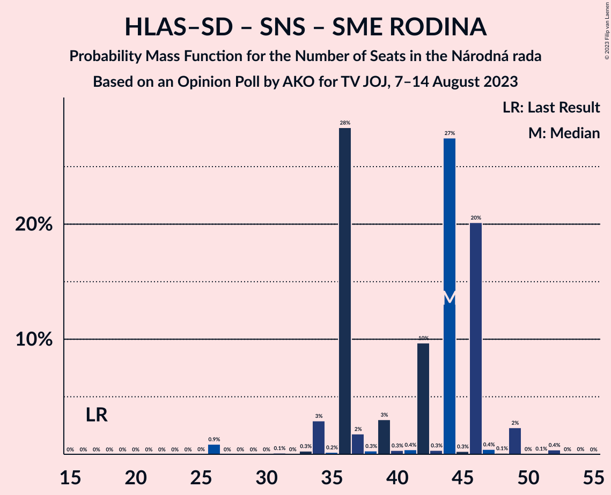

| Number of Seats | Probability | Accumulated | Special Marks |
|:---------------:|:-----------:|:-----------:|:-------------:|
| 17 | 0% | 100% | Last Result |
| 18 | 0% | 100% |  |
| 19 | 0% | 100% |  |
| 20 | 0% | 100% |  |
| 21 | 0% | 100% |  |
| 22 | 0% | 100% |  |
| 23 | 0% | 100% |  |
| 24 | 0% | 100% |  |
| 25 | 0% | 100% |  |
| 26 | 0.9% | 100% |  |
| 27 | 0% | 99.1% |  |
| 28 | 0% | 99.1% |  |
| 29 | 0% | 99.1% |  |
| 30 | 0% | 99.1% |  |
| 31 | 0.1% | 99.1% |  |
| 32 | 0% | 99.0% |  |
| 33 | 0.3% | 98.9% |  |
| 34 | 3% | 98.7% |  |
| 35 | 0.2% | 96% |  |
| 36 | 28% | 96% |  |
| 37 | 2% | 67% |  |
| 38 | 0.3% | 65% |  |
| 39 | 3% | 65% |  |
| 40 | 0.3% | 62% |  |
| 41 | 0.4% | 62% |  |
| 42 | 10% | 61% |  |
| 43 | 0.3% | 52% |  |
| 44 | 27% | 51% | Median |
| 45 | 0.3% | 24% |  |
| 46 | 20% | 24% |  |
| 47 | 0.4% | 3% |  |
| 48 | 0.1% | 3% |  |
| 49 | 2% | 3% |  |
| 50 | 0% | 0.5% |  |
| 51 | 0.1% | 0.5% |  |
| 52 | 0.4% | 0.4% |  |
| 53 | 0% | 0.1% |  |
| 54 | 0% | 0% |  |

### SMER–sociálna demokracia – SME RODINA

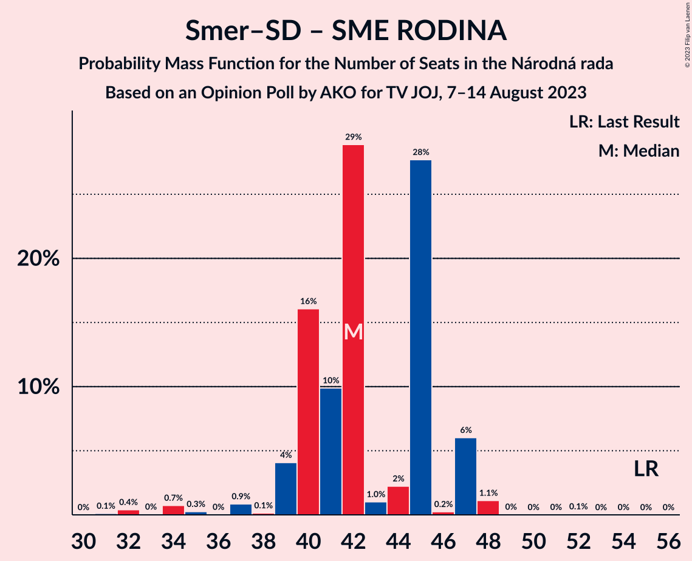

| Number of Seats | Probability | Accumulated | Special Marks |
|:---------------:|:-----------:|:-----------:|:-------------:|
| 31 | 0.1% | 100% |  |
| 32 | 0.4% | 99.9% |  |
| 33 | 0% | 99.5% |  |
| 34 | 0.7% | 99.4% |  |
| 35 | 0.3% | 98.7% |  |
| 36 | 0% | 98% |  |
| 37 | 0.9% | 98% |  |
| 38 | 0.1% | 98% |  |
| 39 | 4% | 97% |  |
| 40 | 16% | 93% |  |
| 41 | 10% | 77% |  |
| 42 | 29% | 67% | Median |
| 43 | 1.0% | 38% |  |
| 44 | 2% | 37% |  |
| 45 | 28% | 35% |  |
| 46 | 0.2% | 8% |  |
| 47 | 6% | 7% |  |
| 48 | 1.1% | 1.3% |  |
| 49 | 0% | 0.1% |  |
| 50 | 0% | 0.1% |  |
| 51 | 0% | 0.1% |  |
| 52 | 0.1% | 0.1% |  |
| 53 | 0% | 0% |  |
| 54 | 0% | 0% |  |
| 55 | 0% | 0% | Last Result |

### SMER–sociálna demokracia – Slovenská národná strana

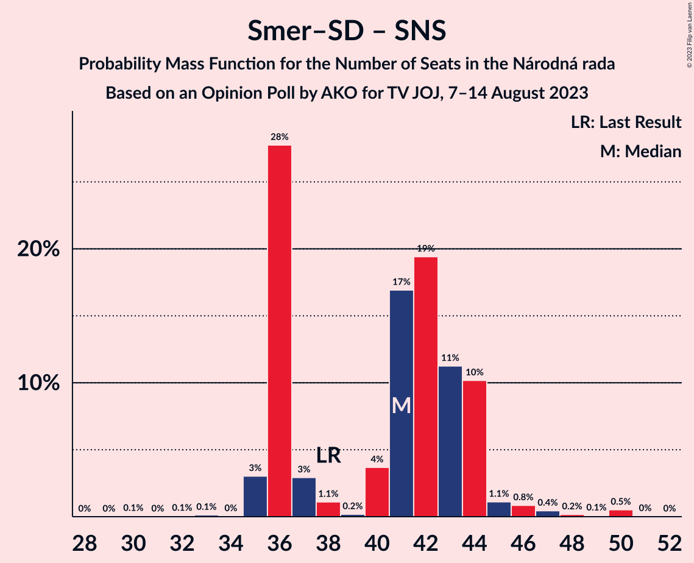

| Number of Seats | Probability | Accumulated | Special Marks |
|:---------------:|:-----------:|:-----------:|:-------------:|
| 30 | 0.1% | 100% |  |
| 31 | 0% | 99.9% |  |
| 32 | 0.1% | 99.9% |  |
| 33 | 0.1% | 99.9% |  |
| 34 | 0% | 99.7% |  |
| 35 | 3% | 99.7% |  |
| 36 | 28% | 97% |  |
| 37 | 3% | 69% |  |
| 38 | 1.1% | 66% | Last Result |
| 39 | 0.2% | 65% |  |
| 40 | 4% | 65% |  |
| 41 | 17% | 61% |  |
| 42 | 19% | 44% |  |
| 43 | 11% | 25% | Median |
| 44 | 10% | 13% |  |
| 45 | 1.1% | 3% |  |
| 46 | 0.8% | 2% |  |
| 47 | 0.4% | 1.3% |  |
| 48 | 0.2% | 0.8% |  |
| 49 | 0.1% | 0.7% |  |
| 50 | 0.5% | 0.6% |  |
| 51 | 0% | 0.1% |  |
| 52 | 0% | 0% |  |

### HLAS–sociálna demokracia – SME RODINA

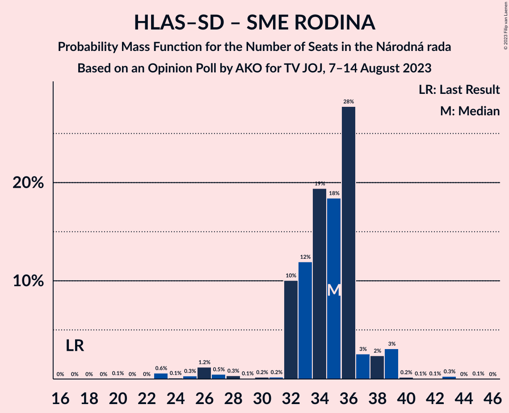

| Number of Seats | Probability | Accumulated | Special Marks |
|:---------------:|:-----------:|:-----------:|:-------------:|
| 17 | 0% | 100% | Last Result |
| 18 | 0% | 100% |  |
| 19 | 0% | 100% |  |
| 20 | 0.1% | 100% |  |
| 21 | 0% | 99.9% |  |
| 22 | 0% | 99.9% |  |
| 23 | 0.6% | 99.9% |  |
| 24 | 0.1% | 99.3% |  |
| 25 | 0.3% | 99.2% |  |
| 26 | 1.2% | 98.8% |  |
| 27 | 0.5% | 98% |  |
| 28 | 0.3% | 97% |  |
| 29 | 0.1% | 97% |  |
| 30 | 0.2% | 97% |  |
| 31 | 0.2% | 97% |  |
| 32 | 10% | 96% |  |
| 33 | 12% | 86% |  |
| 34 | 19% | 74% | Median |
| 35 | 18% | 55% |  |
| 36 | 28% | 36% |  |
| 37 | 3% | 9% |  |
| 38 | 2% | 6% |  |
| 39 | 3% | 4% |  |
| 40 | 0.2% | 0.7% |  |
| 41 | 0.1% | 0.5% |  |
| 42 | 0.1% | 0.4% |  |
| 43 | 0.3% | 0.4% |  |
| 44 | 0% | 0.1% |  |
| 45 | 0.1% | 0.1% |  |
| 46 | 0% | 0% |  |

### HLAS–sociálna demokracia – Slovenská národná strana

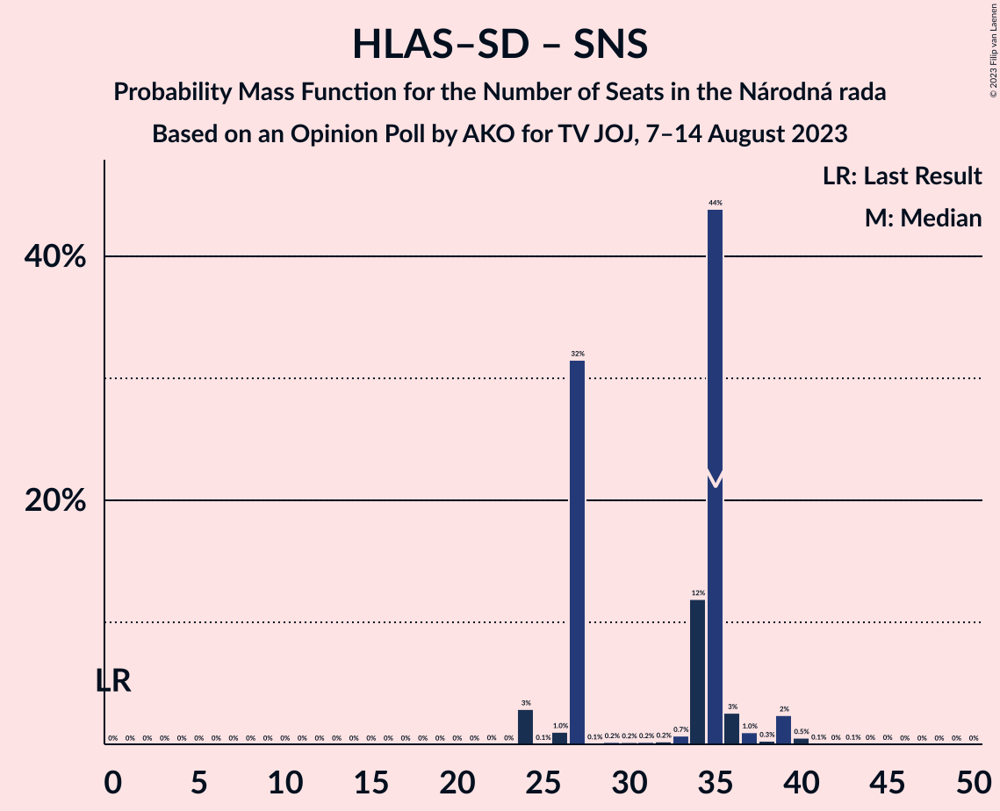

| Number of Seats | Probability | Accumulated | Special Marks |
|:---------------:|:-----------:|:-----------:|:-------------:|
| 0 | 0% | 100% | Last Result |
| 1 | 0% | 100% |  |
| 2 | 0% | 100% |  |
| 3 | 0% | 100% |  |
| 4 | 0% | 100% |  |
| 5 | 0% | 100% |  |
| 6 | 0% | 100% |  |
| 7 | 0% | 100% |  |
| 8 | 0% | 100% |  |
| 9 | 0% | 100% |  |
| 10 | 0% | 100% |  |
| 11 | 0% | 100% |  |
| 12 | 0% | 100% |  |
| 13 | 0% | 100% |  |
| 14 | 0% | 100% |  |
| 15 | 0% | 100% |  |
| 16 | 0% | 100% |  |
| 17 | 0% | 100% |  |
| 18 | 0% | 100% |  |
| 19 | 0% | 100% |  |
| 20 | 0% | 100% |  |
| 21 | 0% | 100% |  |
| 22 | 0% | 100% |  |
| 23 | 0% | 100% |  |
| 24 | 3% | 99.9% |  |
| 25 | 0.1% | 97% |  |
| 26 | 1.0% | 97% |  |
| 27 | 32% | 96% |  |
| 28 | 0.1% | 64% |  |
| 29 | 0.2% | 64% |  |
| 30 | 0.2% | 64% |  |
| 31 | 0.2% | 64% |  |
| 32 | 0.2% | 64% |  |
| 33 | 0.7% | 64% |  |
| 34 | 12% | 63% |  |
| 35 | 44% | 51% | Median |
| 36 | 3% | 7% |  |
| 37 | 1.0% | 4% |  |
| 38 | 0.3% | 4% |  |
| 39 | 2% | 3% |  |
| 40 | 0.5% | 0.8% |  |
| 41 | 0.1% | 0.3% |  |
| 42 | 0% | 0.2% |  |
| 43 | 0.1% | 0.2% |  |
| 44 | 0% | 0.1% |  |
| 45 | 0% | 0.1% |  |
| 46 | 0% | 0% |  |

### SMER–sociálna demokracia

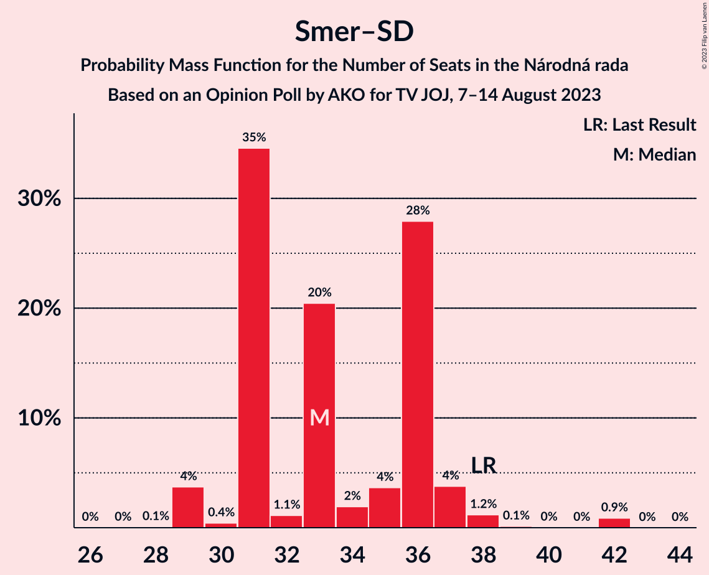

| Number of Seats | Probability | Accumulated | Special Marks |
|:---------------:|:-----------:|:-----------:|:-------------:|
| 26 | 0% | 100% |  |
| 27 | 0% | 99.9% |  |
| 28 | 0.1% | 99.9% |  |
| 29 | 4% | 99.8% |  |
| 30 | 0.4% | 96% |  |
| 31 | 35% | 96% |  |
| 32 | 1.1% | 61% |  |
| 33 | 20% | 60% | Median |
| 34 | 2% | 40% |  |
| 35 | 4% | 38% |  |
| 36 | 28% | 34% |  |
| 37 | 4% | 6% |  |
| 38 | 1.2% | 2% | Last Result |
| 39 | 0.1% | 1.1% |  |
| 40 | 0% | 0.9% |  |
| 41 | 0% | 0.9% |  |
| 42 | 0.9% | 0.9% |  |
| 43 | 0% | 0% |  |

## Technical Information

### Opinion Poll

+ **Polling firm:** AKO
+ **Commissioner(s):** TV JOJ
+ **Fieldwork period:** 7–14 August 2023

### Calculations

+ **Sample size:** 1000
+ **Simulations done:** 1,048,576
+ **Error estimate:** 1.62%

