# Opinion Poll by IPSOS for Denník N, 10–14 August 2023

<a href="#voting-intentions">Voting Intentions</a> | <a href="#seats">Seats</a> | <a href="#coalitions">Coalitions</a> | <a href="#technical-information">Technical Information</a>

## Voting Intentions

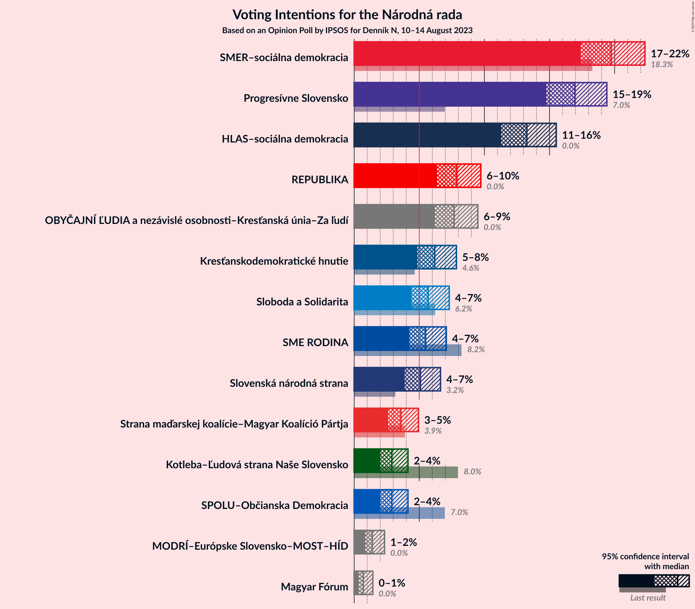

### Confidence Intervals

| Party | Last Result | Poll Result | 80% Confidence Interval | 90% Confidence Interval | 95% Confidence Interval | 99% Confidence Interval |
|:-----:|:-----------:|:-----------:|:-----------------------:|:-----------------------:|:-----------------------:|:-----------------------:|
| SMER–sociálna demokracia | 18.3% | 19.7% | 18.2–21.4% |17.8–21.9% |17.4–22.3% |16.7–23.2% |
| Progresívne Slovensko | 7.0% | 16.9% | 15.5–18.5% |15.1–19.0% |14.8–19.4% |14.1–20.2% |
| HLAS–sociálna demokracia | 0.0% | 13.3% | 12.0–14.7% |11.6–15.2% |11.3–15.5% |10.7–16.2% |
| REPUBLIKA | 0.0% | 7.9% | 6.9–9.1% |6.6–9.4% |6.4–9.7% |5.9–10.3% |
| OBYČAJNÍ ĽUDIA a nezávislé osobnosti–Kresťanská únia–Za ľudí | 0.0% | 7.7% | 6.7–8.9% |6.4–9.2% |6.2–9.5% |5.7–10.1% |
| Kresťanskodemokratické hnutie | 4.6% | 6.2% | 5.3–7.3% |5.1–7.6% |4.8–7.8% |4.5–8.4% |
| Sloboda a Solidarita | 6.2% | 5.7% | 4.8–6.7% |4.6–7.0% |4.4–7.3% |4.0–7.8% |
| SME RODINA | 8.2% | 5.5% | 4.7–6.5% |4.4–6.8% |4.2–7.1% |3.9–7.6% |
| Slovenská národná strana | 3.2% | 5.1% | 4.3–6.1% |4.1–6.4% |3.9–6.6% |3.5–7.1% |
| Strana maďarskej koalície–Magyar Koalíció Pártja | 3.9% | 3.6% | 2.9–4.5% |2.8–4.7% |2.6–4.9% |2.3–5.4% |
| SPOLU–Občianska Demokracia | 7.0% | 2.9% | 2.3–3.7% |2.1–3.9% |2.0–4.1% |1.8–4.5% |
| Kotleba–Ľudová strana Naše Slovensko | 8.0% | 2.9% | 2.3–3.7% |2.1–3.9% |2.0–4.1% |1.8–4.5% |
| MODRÍ–Európske Slovensko–MOST–HÍD | 0.0% | 1.4% | 1.0–2.0% |0.9–2.2% |0.8–2.3% |0.7–2.7% |
| Magyar Fórum | 0.0% | 0.7% | 0.5–1.2% |0.4–1.3% |0.3–1.4% |0.2–1.7% |

*Note:* The poll result column reflects the actual value used in the calculations. Published results may vary slightly, and in addition be rounded to fewer digits.

## Seats

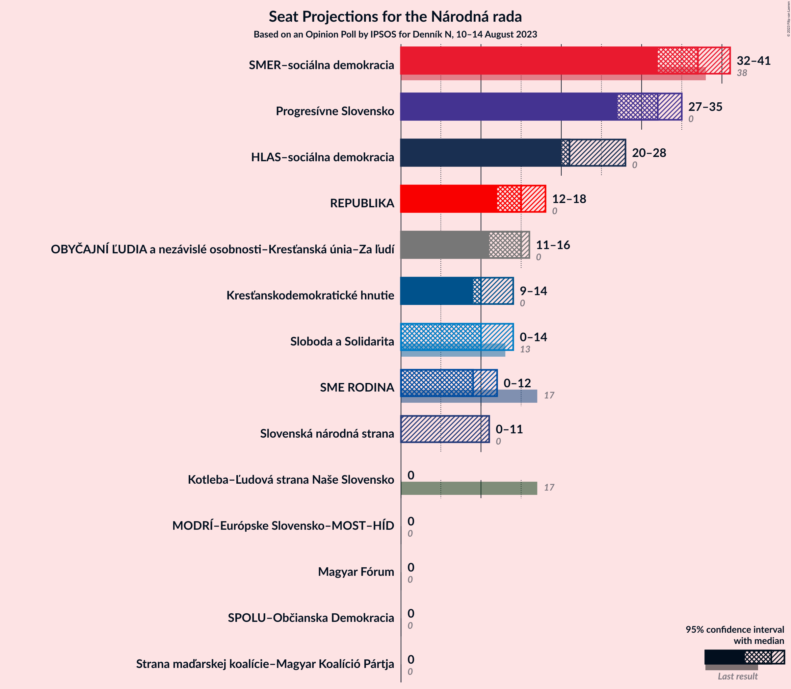

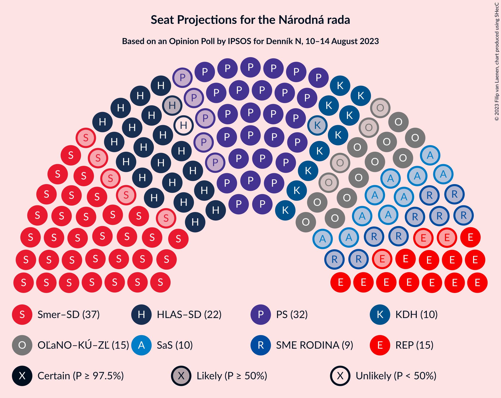

### Confidence Intervals

| Party | Last Result | Median | 80% Confidence Interval | 90% Confidence Interval | 95% Confidence Interval | 99% Confidence Interval |
|:-----:|:-----------:|:------:|:-----------------------:|:-----------------------:|:-----------------------:|:-----------------------:|
| <a href="#smer–sociálna-demokracia">SMER–sociálna demokracia</a> | 38 | 37 | 33–41 |32–41 |32–41 |31–41 |
| <a href="#progresívne-slovensko">Progresívne Slovensko</a> | 0 | 32 | 28–34 |27–34 |27–35 |26–36 |
| <a href="#hlas–sociálna-demokracia">HLAS–sociálna demokracia</a> | 0 | 21 | 20–27 |20–28 |20–28 |19–28 |
| <a href="#republika">REPUBLIKA</a> | 0 | 15 | 13–16 |13–17 |12–18 |10–20 |
| <a href="#obyčajní-ľudia-a-nezávislé-osobnosti–kresťanská-únia–za-ľudí">OBYČAJNÍ ĽUDIA a nezávislé osobnosti–Kresťanská únia–Za ľudí</a> | 0 | 15 | 13–16 |11–16 |11–16 |11–16 |
| <a href="#kresťanskodemokratické-hnutie">Kresťanskodemokratické hnutie</a> | 0 | 10 | 10–12 |10–13 |9–14 |0–14 |
| <a href="#sloboda-a-solidarita">Sloboda a Solidarita</a> | 13 | 10 | 9–12 |8–14 |0–14 |0–14 |
| <a href="#sme-rodina">SME RODINA</a> | 17 | 9 | 0–11 |0–11 |0–12 |0–13 |
| <a href="#slovenská-národná-strana">Slovenská národná strana</a> | 0 | 0 | 0–10 |0–10 |0–11 |0–13 |
| <a href="#strana-maďarskej-koalície–magyar-koalíció-pártja">Strana maďarskej koalície–Magyar Koalíció Pártja</a> | 0 | 0 | 0 |0 |0 |0–9 |
| <a href="#spolu–občianska-demokracia">SPOLU–Občianska Demokracia</a> | 0 | 0 | 0 |0 |0 |0 |
| <a href="#kotleba–ľudová-strana-naše-slovensko">Kotleba–Ľudová strana Naše Slovensko</a> | 17 | 0 | 0 |0 |0 |0 |
| <a href="#modrí–európske-slovensko–most–híd">MODRÍ–Európske Slovensko–MOST–HÍD</a> | 0 | 0 | 0 |0 |0 |0 |
| <a href="#magyar-fórum">Magyar Fórum</a> | 0 | 0 | 0 |0 |0 |0 |

### SMER–sociálna demokracia

*For a full overview of the results for this party, see the [SMER–sociálna demokracia](party-smer–sociálnademokracia.html) page.*

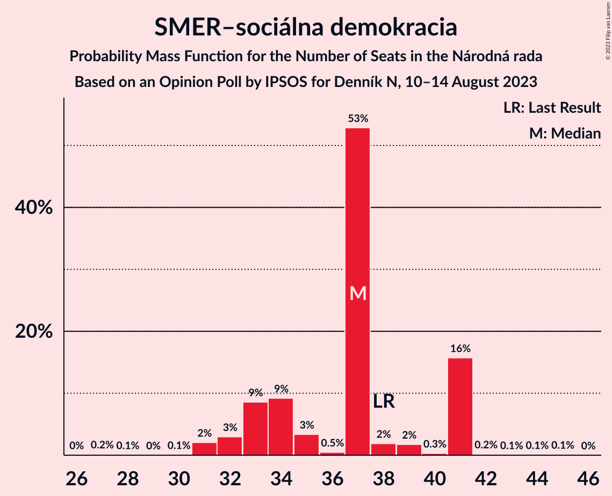

| Number of Seats | Probability | Accumulated | Special Marks |
|:---------------:|:-----------:|:-----------:|:-------------:|
| 26 | 0% | 100% |  |
| 27 | 0.2% | 99.9% |  |
| 28 | 0.1% | 99.7% |  |
| 29 | 0% | 99.7% |  |
| 30 | 0.1% | 99.7% |  |
| 31 | 2% | 99.6% |  |
| 32 | 3% | 98% |  |
| 33 | 9% | 95% |  |
| 34 | 9% | 86% |  |
| 35 | 3% | 77% |  |
| 36 | 0.5% | 73% |  |
| 37 | 53% | 73% | Median |
| 38 | 2% | 20% | Last Result |
| 39 | 2% | 18% |  |
| 40 | 0.3% | 16% |  |
| 41 | 16% | 16% |  |
| 42 | 0.2% | 0.4% |  |
| 43 | 0.1% | 0.3% |  |
| 44 | 0.1% | 0.2% |  |
| 45 | 0.1% | 0.1% |  |
| 46 | 0% | 0% |  |

### Progresívne Slovensko

*For a full overview of the results for this party, see the [Progresívne Slovensko](party-progresívneslovensko.html) page.*

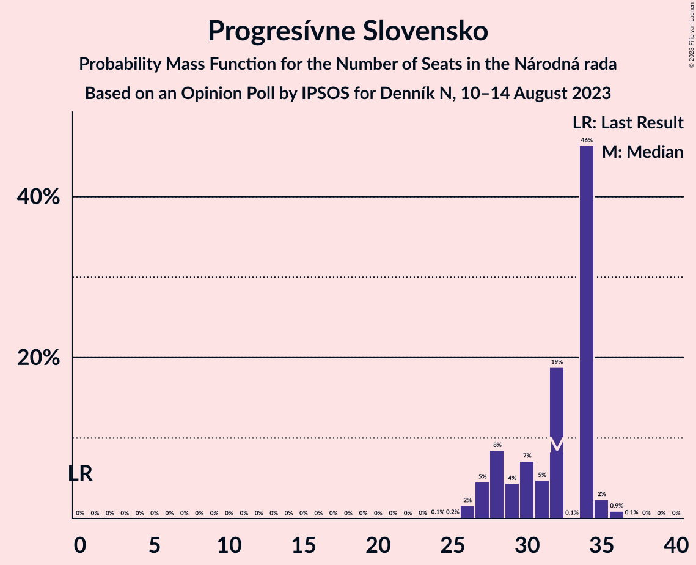

| Number of Seats | Probability | Accumulated | Special Marks |
|:---------------:|:-----------:|:-----------:|:-------------:|
| 0 | 0% | 100% | Last Result |
| 1 | 0% | 100% |  |
| 2 | 0% | 100% |  |
| 3 | 0% | 100% |  |
| 4 | 0% | 100% |  |
| 5 | 0% | 100% |  |
| 6 | 0% | 100% |  |
| 7 | 0% | 100% |  |
| 8 | 0% | 100% |  |
| 9 | 0% | 100% |  |
| 10 | 0% | 100% |  |
| 11 | 0% | 100% |  |
| 12 | 0% | 100% |  |
| 13 | 0% | 100% |  |
| 14 | 0% | 100% |  |
| 15 | 0% | 100% |  |
| 16 | 0% | 100% |  |
| 17 | 0% | 100% |  |
| 18 | 0% | 100% |  |
| 19 | 0% | 100% |  |
| 20 | 0% | 100% |  |
| 21 | 0% | 100% |  |
| 22 | 0% | 100% |  |
| 23 | 0% | 100% |  |
| 24 | 0.1% | 100% |  |
| 25 | 0.2% | 99.8% |  |
| 26 | 2% | 99.7% |  |
| 27 | 5% | 98% |  |
| 28 | 8% | 93% |  |
| 29 | 4% | 85% |  |
| 30 | 7% | 81% |  |
| 31 | 5% | 73% |  |
| 32 | 19% | 69% | Median |
| 33 | 0.1% | 50% |  |
| 34 | 46% | 50% |  |
| 35 | 2% | 4% |  |
| 36 | 0.9% | 1.1% |  |
| 37 | 0.1% | 0.2% |  |
| 38 | 0% | 0.1% |  |
| 39 | 0% | 0.1% |  |
| 40 | 0% | 0% |  |

### HLAS–sociálna demokracia

*For a full overview of the results for this party, see the [HLAS–sociálna demokracia](party-hlas–sociálnademokracia.html) page.*

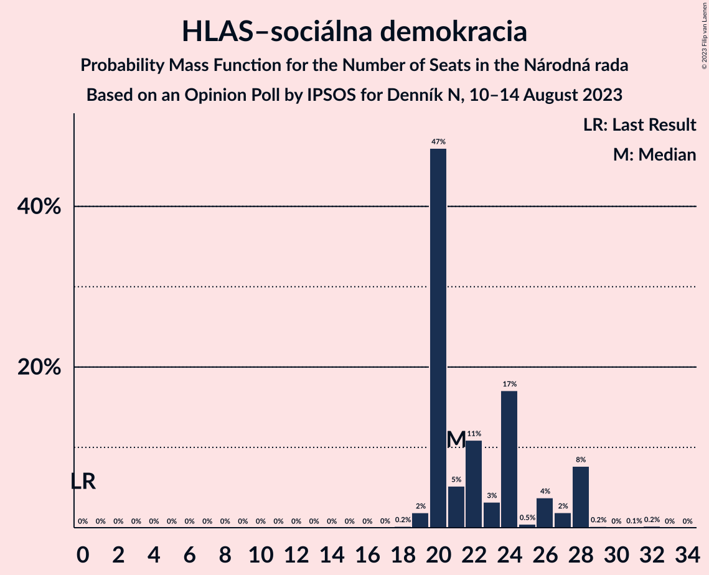

| Number of Seats | Probability | Accumulated | Special Marks |
|:---------------:|:-----------:|:-----------:|:-------------:|
| 0 | 0% | 100% | Last Result |
| 1 | 0% | 100% |  |
| 2 | 0% | 100% |  |
| 3 | 0% | 100% |  |
| 4 | 0% | 100% |  |
| 5 | 0% | 100% |  |
| 6 | 0% | 100% |  |
| 7 | 0% | 100% |  |
| 8 | 0% | 100% |  |
| 9 | 0% | 100% |  |
| 10 | 0% | 100% |  |
| 11 | 0% | 100% |  |
| 12 | 0% | 100% |  |
| 13 | 0% | 100% |  |
| 14 | 0% | 100% |  |
| 15 | 0% | 100% |  |
| 16 | 0% | 100% |  |
| 17 | 0% | 100% |  |
| 18 | 0.2% | 100% |  |
| 19 | 2% | 99.8% |  |
| 20 | 47% | 98% |  |
| 21 | 5% | 51% | Median |
| 22 | 11% | 45% |  |
| 23 | 3% | 35% |  |
| 24 | 17% | 31% |  |
| 25 | 0.5% | 14% |  |
| 26 | 4% | 14% |  |
| 27 | 2% | 10% |  |
| 28 | 8% | 8% |  |
| 29 | 0.2% | 0.5% |  |
| 30 | 0% | 0.3% |  |
| 31 | 0.1% | 0.3% |  |
| 32 | 0.2% | 0.2% |  |
| 33 | 0% | 0% |  |

### REPUBLIKA

*For a full overview of the results for this party, see the [REPUBLIKA](party-republika.html) page.*

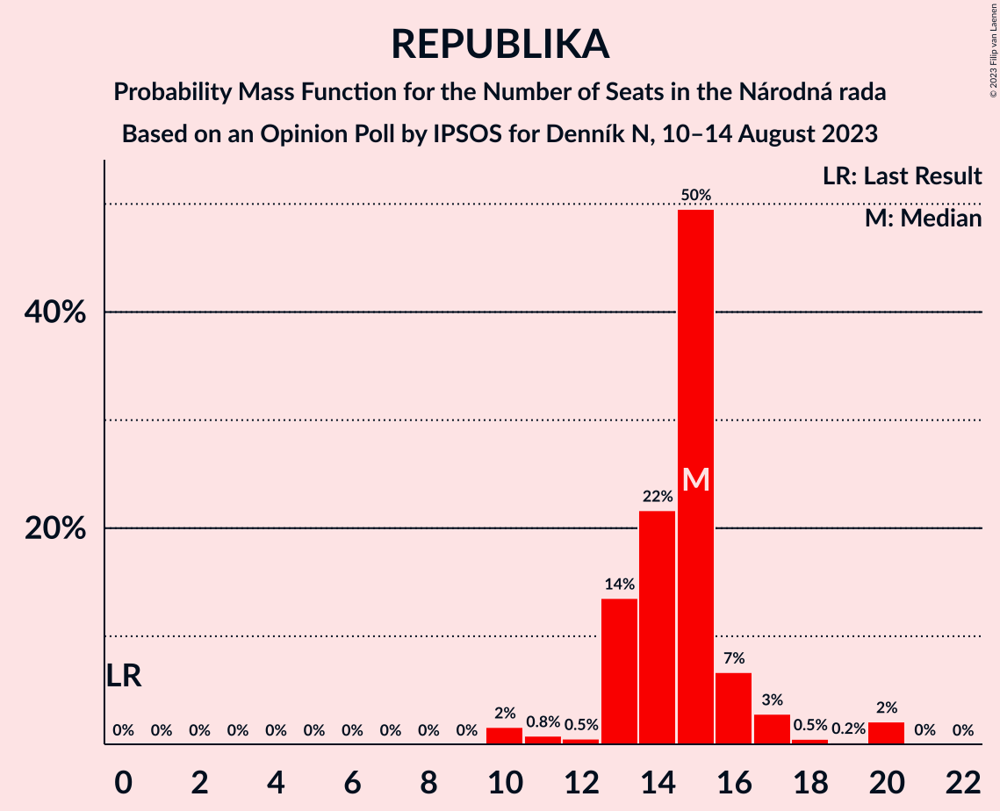

| Number of Seats | Probability | Accumulated | Special Marks |
|:---------------:|:-----------:|:-----------:|:-------------:|
| 0 | 0% | 100% | Last Result |
| 1 | 0% | 100% |  |
| 2 | 0% | 100% |  |
| 3 | 0% | 100% |  |
| 4 | 0% | 100% |  |
| 5 | 0% | 100% |  |
| 6 | 0% | 100% |  |
| 7 | 0% | 100% |  |
| 8 | 0% | 100% |  |
| 9 | 0% | 100% |  |
| 10 | 2% | 100% |  |
| 11 | 0.8% | 98% |  |
| 12 | 0.5% | 98% |  |
| 13 | 14% | 97% |  |
| 14 | 22% | 84% |  |
| 15 | 50% | 62% | Median |
| 16 | 7% | 12% |  |
| 17 | 3% | 6% |  |
| 18 | 0.5% | 3% |  |
| 19 | 0.2% | 2% |  |
| 20 | 2% | 2% |  |
| 21 | 0% | 0% |  |

### OBYČAJNÍ ĽUDIA a nezávislé osobnosti–Kresťanská únia–Za ľudí

*For a full overview of the results for this party, see the [OBYČAJNÍ ĽUDIA a nezávislé osobnosti–Kresťanská únia–Za ľudí](party-obyčajníľudiaanezávisléosobnosti–kresťanskáúnia–zaľudí.html) page.*

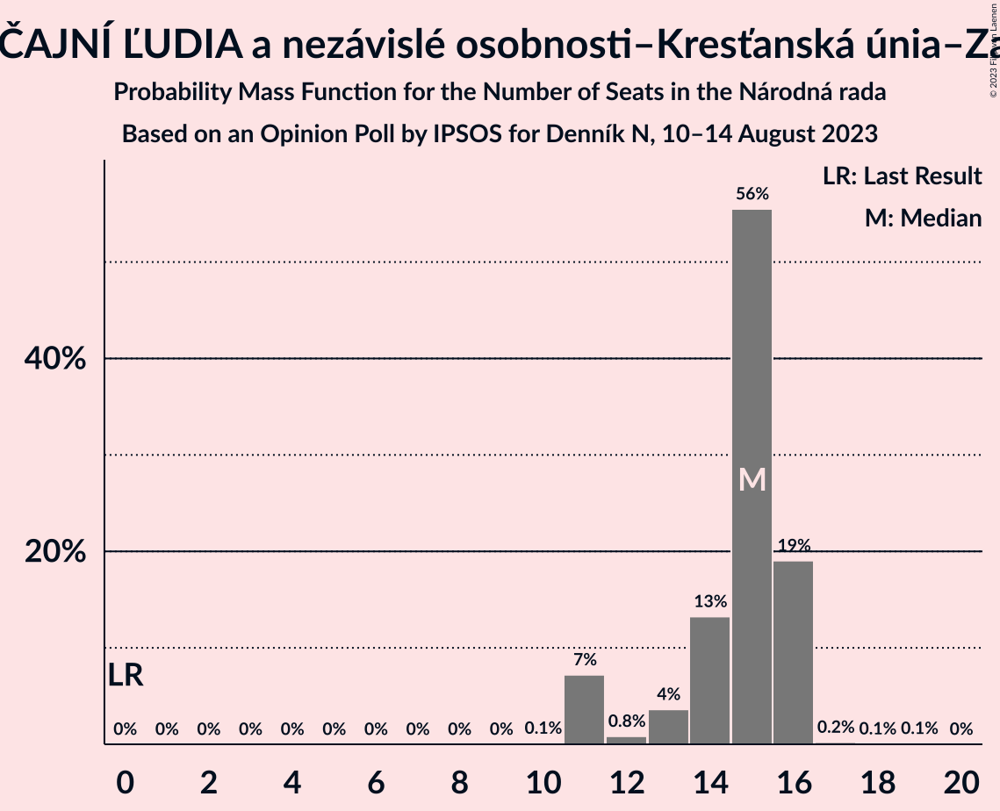

| Number of Seats | Probability | Accumulated | Special Marks |
|:---------------:|:-----------:|:-----------:|:-------------:|
| 0 | 0% | 100% | Last Result |
| 1 | 0% | 100% |  |
| 2 | 0% | 100% |  |
| 3 | 0% | 100% |  |
| 4 | 0% | 100% |  |
| 5 | 0% | 100% |  |
| 6 | 0% | 100% |  |
| 7 | 0% | 100% |  |
| 8 | 0% | 100% |  |
| 9 | 0% | 100% |  |
| 10 | 0.1% | 100% |  |
| 11 | 7% | 99.9% |  |
| 12 | 0.8% | 93% |  |
| 13 | 4% | 92% |  |
| 14 | 13% | 88% |  |
| 15 | 56% | 75% | Median |
| 16 | 19% | 19% |  |
| 17 | 0.2% | 0.4% |  |
| 18 | 0.1% | 0.2% |  |
| 19 | 0.1% | 0.1% |  |
| 20 | 0% | 0% |  |

### Kresťanskodemokratické hnutie

*For a full overview of the results for this party, see the [Kresťanskodemokratické hnutie](party-kresťanskodemokratickéhnutie.html) page.*

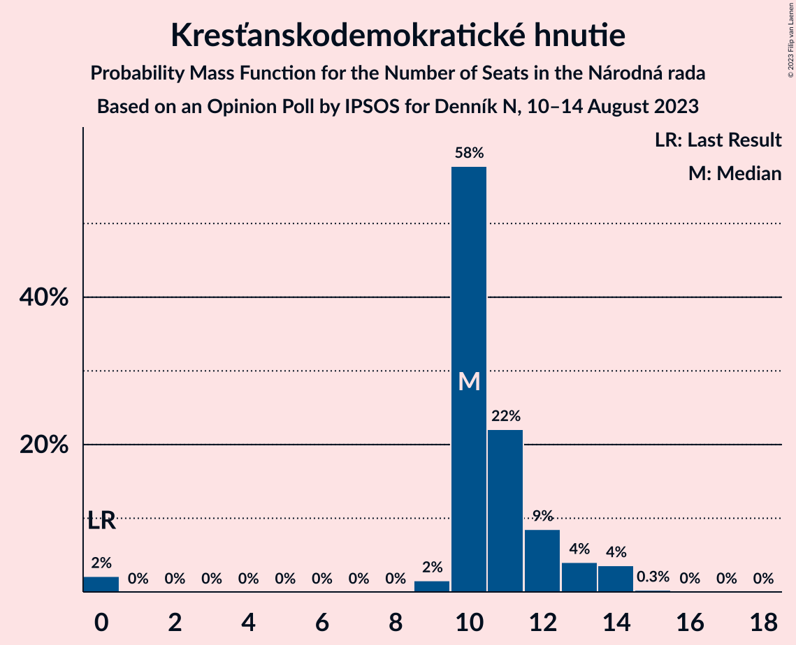

| Number of Seats | Probability | Accumulated | Special Marks |
|:---------------:|:-----------:|:-----------:|:-------------:|
| 0 | 2% | 100% | Last Result |
| 1 | 0% | 98% |  |
| 2 | 0% | 98% |  |
| 3 | 0% | 98% |  |
| 4 | 0% | 98% |  |
| 5 | 0% | 98% |  |
| 6 | 0% | 98% |  |
| 7 | 0% | 98% |  |
| 8 | 0% | 98% |  |
| 9 | 2% | 98% |  |
| 10 | 58% | 96% | Median |
| 11 | 22% | 39% |  |
| 12 | 9% | 16% |  |
| 13 | 4% | 8% |  |
| 14 | 4% | 4% |  |
| 15 | 0.3% | 0.3% |  |
| 16 | 0% | 0.1% |  |
| 17 | 0% | 0% |  |

### Sloboda a Solidarita

*For a full overview of the results for this party, see the [Sloboda a Solidarita](party-slobodaasolidarita.html) page.*

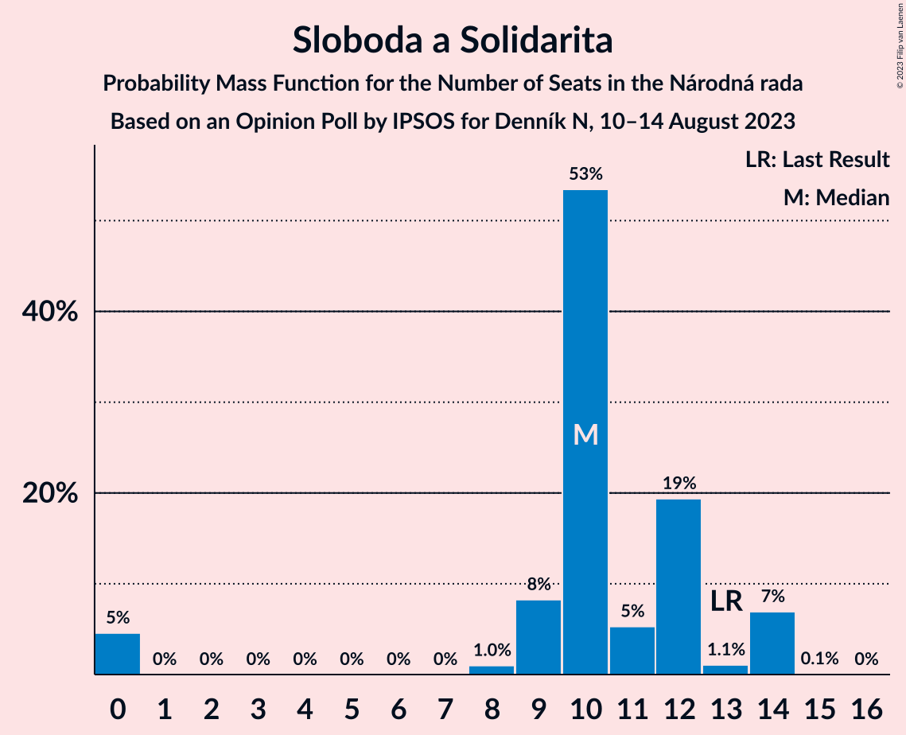

| Number of Seats | Probability | Accumulated | Special Marks |
|:---------------:|:-----------:|:-----------:|:-------------:|
| 0 | 5% | 100% |  |
| 1 | 0% | 95% |  |
| 2 | 0% | 95% |  |
| 3 | 0% | 95% |  |
| 4 | 0% | 95% |  |
| 5 | 0% | 95% |  |
| 6 | 0% | 95% |  |
| 7 | 0% | 95% |  |
| 8 | 1.0% | 95% |  |
| 9 | 8% | 94% |  |
| 10 | 53% | 86% | Median |
| 11 | 5% | 33% |  |
| 12 | 19% | 27% |  |
| 13 | 1.1% | 8% | Last Result |
| 14 | 7% | 7% |  |
| 15 | 0.1% | 0.1% |  |
| 16 | 0% | 0% |  |

### SME RODINA

*For a full overview of the results for this party, see the [SME RODINA](party-smerodina.html) page.*

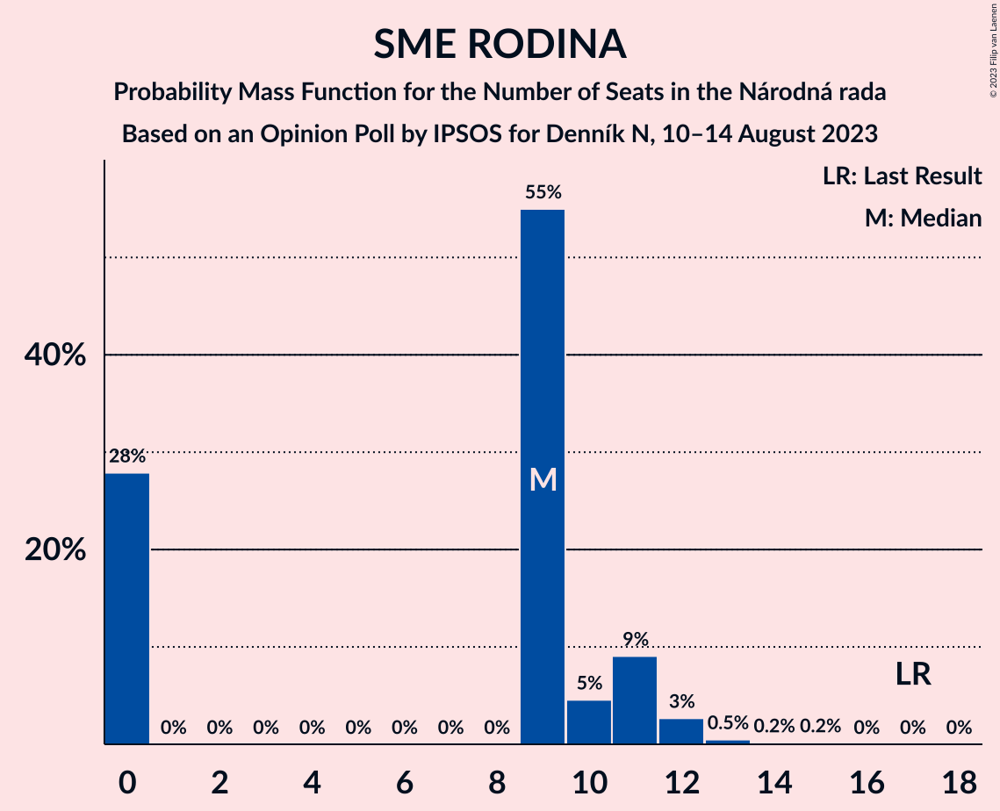

| Number of Seats | Probability | Accumulated | Special Marks |
|:---------------:|:-----------:|:-----------:|:-------------:|
| 0 | 28% | 100% |  |
| 1 | 0% | 72% |  |
| 2 | 0% | 72% |  |
| 3 | 0% | 72% |  |
| 4 | 0% | 72% |  |
| 5 | 0% | 72% |  |
| 6 | 0% | 72% |  |
| 7 | 0% | 72% |  |
| 8 | 0% | 72% |  |
| 9 | 55% | 72% | Median |
| 10 | 5% | 17% |  |
| 11 | 9% | 13% |  |
| 12 | 3% | 3% |  |
| 13 | 0.5% | 0.8% |  |
| 14 | 0.2% | 0.3% |  |
| 15 | 0.2% | 0.2% |  |
| 16 | 0% | 0% |  |
| 17 | 0% | 0% | Last Result |

### Slovenská národná strana

*For a full overview of the results for this party, see the [Slovenská národná strana](party-slovenskánárodnástrana.html) page.*

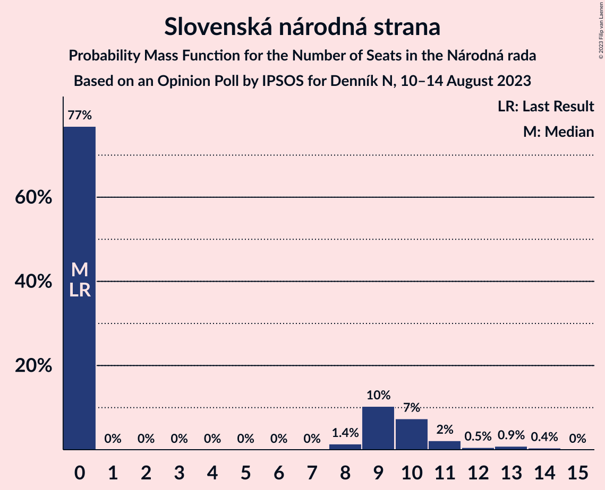

| Number of Seats | Probability | Accumulated | Special Marks |
|:---------------:|:-----------:|:-----------:|:-------------:|
| 0 | 77% | 100% | Last Result, Median |
| 1 | 0% | 23% |  |
| 2 | 0% | 23% |  |
| 3 | 0% | 23% |  |
| 4 | 0% | 23% |  |
| 5 | 0% | 23% |  |
| 6 | 0% | 23% |  |
| 7 | 0% | 23% |  |
| 8 | 1.4% | 23% |  |
| 9 | 10% | 22% |  |
| 10 | 7% | 11% |  |
| 11 | 2% | 4% |  |
| 12 | 0.5% | 2% |  |
| 13 | 0.9% | 1.3% |  |
| 14 | 0.4% | 0.5% |  |
| 15 | 0% | 0% |  |

### Strana maďarskej koalície–Magyar Koalíció Pártja

*For a full overview of the results for this party, see the [Strana maďarskej koalície–Magyar Koalíció Pártja](party-stranamaďarskejkoalície–magyarkoalíciópártja.html) page.*

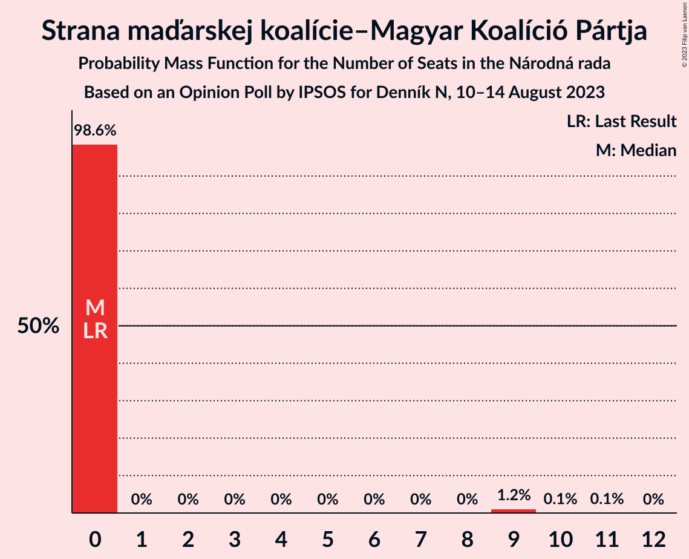

| Number of Seats | Probability | Accumulated | Special Marks |
|:---------------:|:-----------:|:-----------:|:-------------:|
| 0 | 98.6% | 100% | Last Result, Median |
| 1 | 0% | 1.4% |  |
| 2 | 0% | 1.4% |  |
| 3 | 0% | 1.4% |  |
| 4 | 0% | 1.4% |  |
| 5 | 0% | 1.4% |  |
| 6 | 0% | 1.4% |  |
| 7 | 0% | 1.4% |  |
| 8 | 0% | 1.4% |  |
| 9 | 1.2% | 1.4% |  |
| 10 | 0.1% | 0.3% |  |
| 11 | 0.1% | 0.1% |  |
| 12 | 0% | 0% |  |

### SPOLU–Občianska Demokracia

*For a full overview of the results for this party, see the [SPOLU–Občianska Demokracia](party-spolu–občianskademokracia.html) page.*

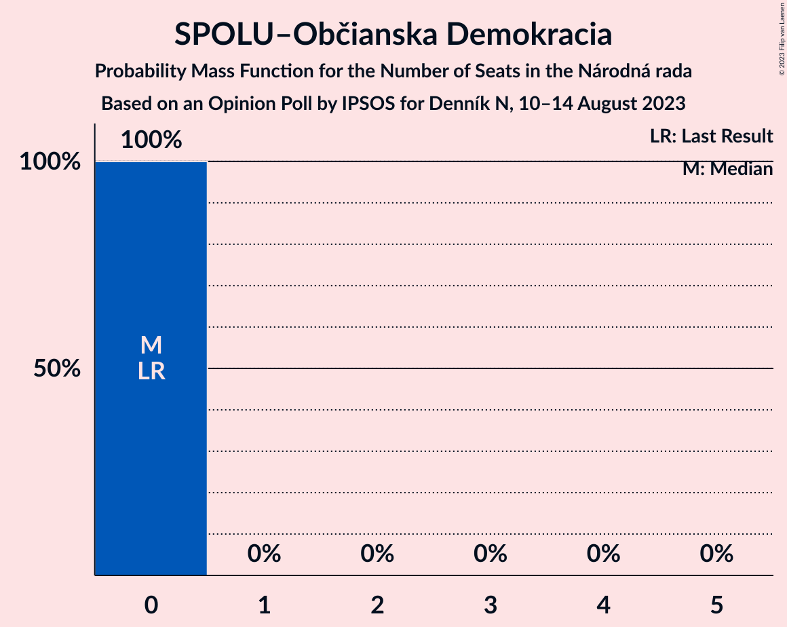

| Number of Seats | Probability | Accumulated | Special Marks |
|:---------------:|:-----------:|:-----------:|:-------------:|
| 0 | 100% | 100% | Last Result, Median |

### Kotleba–Ľudová strana Naše Slovensko

*For a full overview of the results for this party, see the [Kotleba–Ľudová strana Naše Slovensko](party-kotleba–ľudovástrananašeslovensko.html) page.*

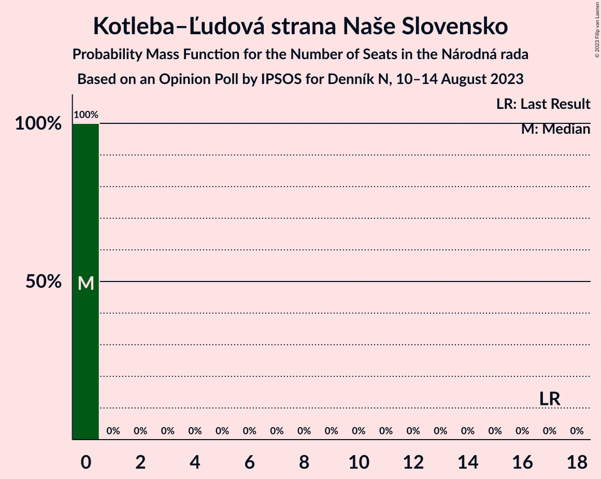

| Number of Seats | Probability | Accumulated | Special Marks |
|:---------------:|:-----------:|:-----------:|:-------------:|
| 0 | 100% | 100% | Median |
| 1 | 0% | 0% |  |
| 2 | 0% | 0% |  |
| 3 | 0% | 0% |  |
| 4 | 0% | 0% |  |
| 5 | 0% | 0% |  |
| 6 | 0% | 0% |  |
| 7 | 0% | 0% |  |
| 8 | 0% | 0% |  |
| 9 | 0% | 0% |  |
| 10 | 0% | 0% |  |
| 11 | 0% | 0% |  |
| 12 | 0% | 0% |  |
| 13 | 0% | 0% |  |
| 14 | 0% | 0% |  |
| 15 | 0% | 0% |  |
| 16 | 0% | 0% |  |
| 17 | 0% | 0% | Last Result |

### MODRÍ–Európske Slovensko–MOST–HÍD

*For a full overview of the results for this party, see the [MODRÍ–Európske Slovensko–MOST–HÍD](party-modrí–európskeslovensko–most–híd.html) page.*

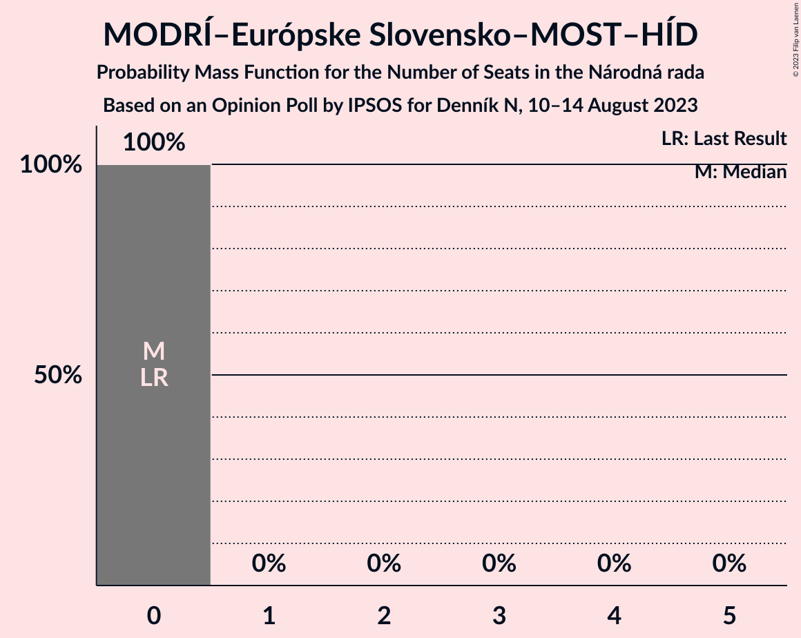

| Number of Seats | Probability | Accumulated | Special Marks |
|:---------------:|:-----------:|:-----------:|:-------------:|
| 0 | 100% | 100% | Last Result, Median |

### Magyar Fórum

*For a full overview of the results for this party, see the [Magyar Fórum](party-magyarfórum.html) page.*

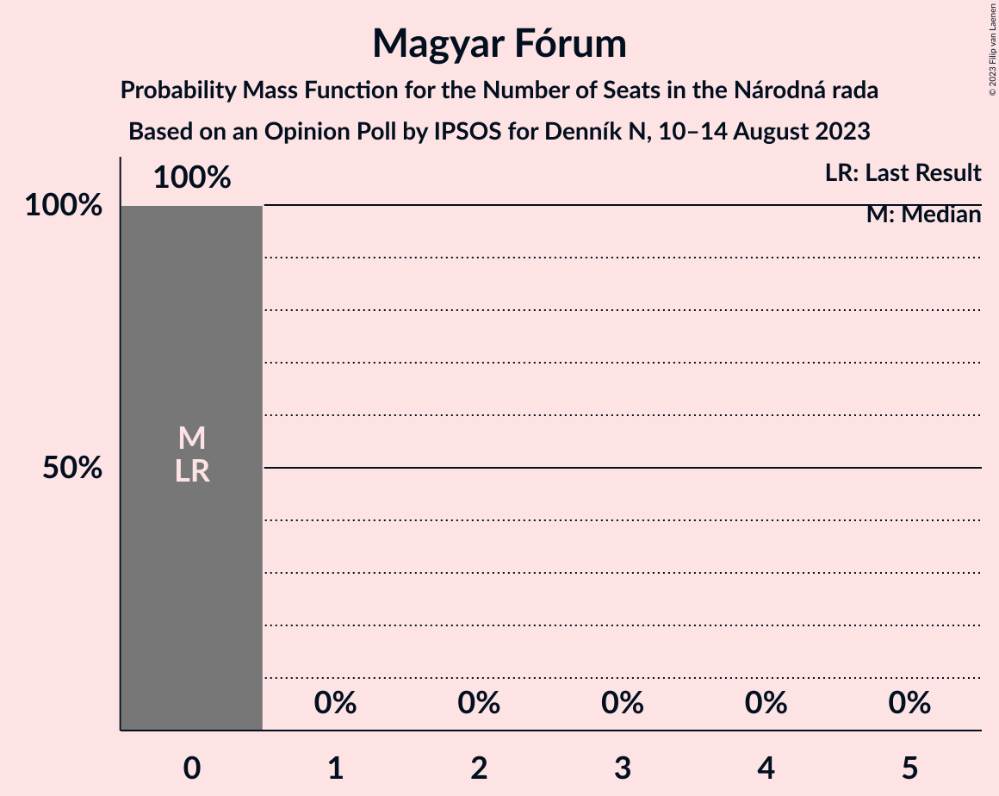

| Number of Seats | Probability | Accumulated | Special Marks |
|:---------------:|:-----------:|:-----------:|:-------------:|
| 0 | 100% | 100% | Last Result, Median |

## Coalitions

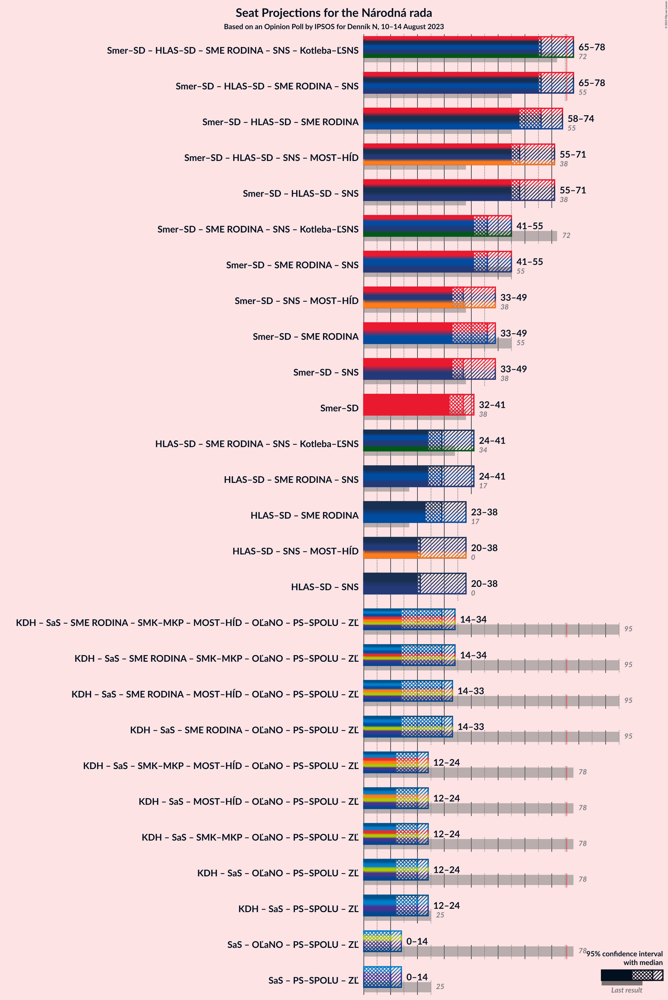

### Confidence Intervals

| Coalition | Last Result | Median | Majority? | 80% Confidence Interval | 90% Confidence Interval | 95% Confidence Interval | 99% Confidence Interval |
|:---------:|:-----------:|:------:|:---------:|:-----------------------:|:-----------------------:|:-----------------------:|:-----------------------:|
| SMER–sociálna demokracia – HLAS–sociálna demokracia – SME RODINA – Slovenská národná strana – Kotleba–Ľudová strana Naše Slovensko | 72 | 66 | 5% | 65–74 | 65–76 | 65–78 | 58–82 |
| SMER–sociálna demokracia – HLAS–sociálna demokracia – SME RODINA – Slovenská národná strana | 55 | 66 | 5% | 65–74 | 65–76 | 65–78 | 58–82 |
| SMER–sociálna demokracia – HLAS–sociálna demokracia – SME RODINA | 55 | 66 | 1.5% | 61–69 | 58–71 | 58–74 | 56–77 |
| SMER–sociálna demokracia – HLAS–sociálna demokracia – Slovenská národná strana | 38 | 58 | 0.5% | 57–67 | 57–71 | 55–71 | 55–75 |
| SMER–sociálna demokracia – SME RODINA – Slovenská národná strana – Kotleba–Ľudová strana Naše Slovensko | 72 | 46 | 0% | 41–52 | 41–52 | 41–55 | 32–59 |
| SMER–sociálna demokracia – SME RODINA – Slovenská národná strana | 55 | 46 | 0% | 41–52 | 41–52 | 41–55 | 32–59 |
| SMER–sociálna demokracia – SME RODINA | 55 | 46 | 0% | 35–46 | 33–48 | 33–49 | 32–51 |
| SMER–sociálna demokracia – Slovenská národná strana | 38 | 37 | 0% | 37–43 | 33–44 | 33–49 | 32–51 |
| SMER–sociálna demokracia | 38 | 37 | 0% | 33–41 | 32–41 | 32–41 | 31–41 |
| HLAS–sociálna demokracia – SME RODINA – Slovenská národná strana – Kotleba–Ľudová strana Naše Slovensko | 34 | 29 | 0% | 24–40 | 24–40 | 24–41 | 24–49 |
| HLAS–sociálna demokracia – SME RODINA – Slovenská národná strana | 17 | 29 | 0% | 24–40 | 24–40 | 24–41 | 24–49 |
| HLAS–sociálna demokracia – SME RODINA | 17 | 29 | 0% | 24–33 | 24–38 | 23–38 | 22–39 |
| HLAS–sociálna demokracia – Slovenská národná strana | 0 | 21 | 0% | 20–33 | 20–36 | 20–38 | 20–40 |

### SMER–sociálna demokracia – HLAS–sociálna demokracia – SME RODINA – Slovenská národná strana – Kotleba–Ľudová strana Naše Slovensko

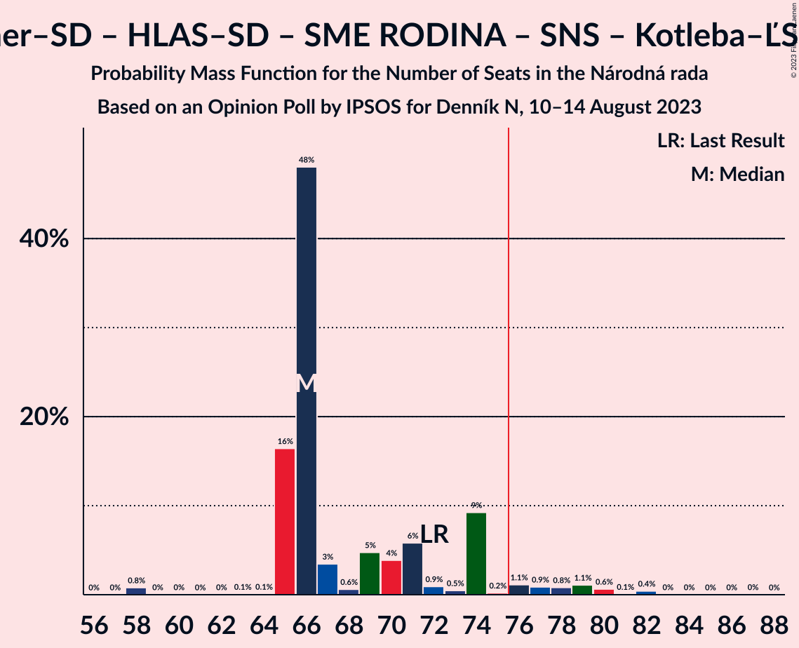

| Number of Seats | Probability | Accumulated | Special Marks |
|:---------------:|:-----------:|:-----------:|:-------------:|
| 58 | 0.8% | 100% |  |
| 59 | 0% | 99.2% |  |
| 60 | 0% | 99.2% |  |
| 61 | 0% | 99.1% |  |
| 62 | 0% | 99.1% |  |
| 63 | 0.1% | 99.1% |  |
| 64 | 0.1% | 99.1% |  |
| 65 | 16% | 99.0% |  |
| 66 | 48% | 83% |  |
| 67 | 3% | 35% | Median |
| 68 | 0.6% | 31% |  |
| 69 | 5% | 30% |  |
| 70 | 4% | 26% |  |
| 71 | 6% | 22% |  |
| 72 | 0.9% | 16% | Last Result |
| 73 | 0.5% | 15% |  |
| 74 | 9% | 15% |  |
| 75 | 0.2% | 5% |  |
| 76 | 1.1% | 5% | Majority |
| 77 | 0.9% | 4% |  |
| 78 | 0.8% | 3% |  |
| 79 | 1.1% | 2% |  |
| 80 | 0.6% | 1.2% |  |
| 81 | 0.1% | 0.6% |  |
| 82 | 0.4% | 0.5% |  |
| 83 | 0% | 0.1% |  |
| 84 | 0% | 0.1% |  |
| 85 | 0% | 0.1% |  |
| 86 | 0% | 0.1% |  |
| 87 | 0% | 0% |  |

### SMER–sociálna demokracia – HLAS–sociálna demokracia – SME RODINA – Slovenská národná strana

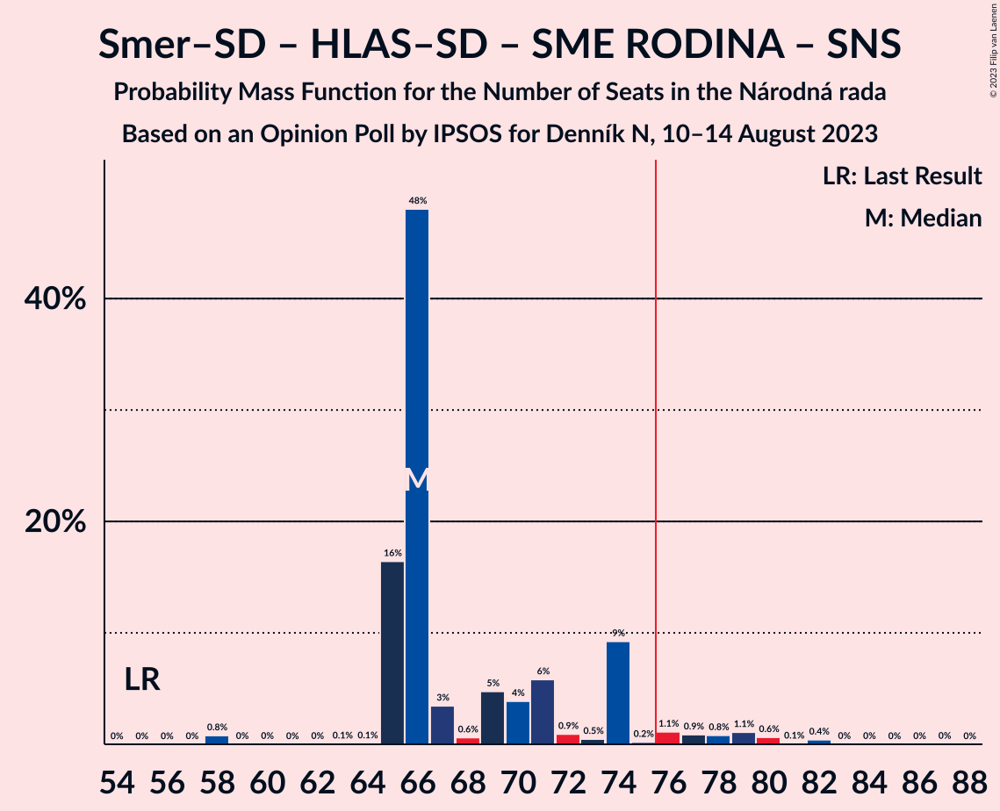

| Number of Seats | Probability | Accumulated | Special Marks |
|:---------------:|:-----------:|:-----------:|:-------------:|
| 55 | 0% | 100% | Last Result |
| 56 | 0% | 100% |  |
| 57 | 0% | 100% |  |
| 58 | 0.8% | 100% |  |
| 59 | 0% | 99.2% |  |
| 60 | 0% | 99.2% |  |
| 61 | 0% | 99.1% |  |
| 62 | 0% | 99.1% |  |
| 63 | 0.1% | 99.1% |  |
| 64 | 0.1% | 99.1% |  |
| 65 | 16% | 99.0% |  |
| 66 | 48% | 83% |  |
| 67 | 3% | 35% | Median |
| 68 | 0.6% | 31% |  |
| 69 | 5% | 30% |  |
| 70 | 4% | 26% |  |
| 71 | 6% | 22% |  |
| 72 | 0.9% | 16% |  |
| 73 | 0.5% | 15% |  |
| 74 | 9% | 15% |  |
| 75 | 0.2% | 5% |  |
| 76 | 1.1% | 5% | Majority |
| 77 | 0.9% | 4% |  |
| 78 | 0.8% | 3% |  |
| 79 | 1.1% | 2% |  |
| 80 | 0.6% | 1.2% |  |
| 81 | 0.1% | 0.6% |  |
| 82 | 0.4% | 0.5% |  |
| 83 | 0% | 0.1% |  |
| 84 | 0% | 0.1% |  |
| 85 | 0% | 0.1% |  |
| 86 | 0% | 0.1% |  |
| 87 | 0% | 0% |  |

### SMER–sociálna demokracia – HLAS–sociálna demokracia – SME RODINA

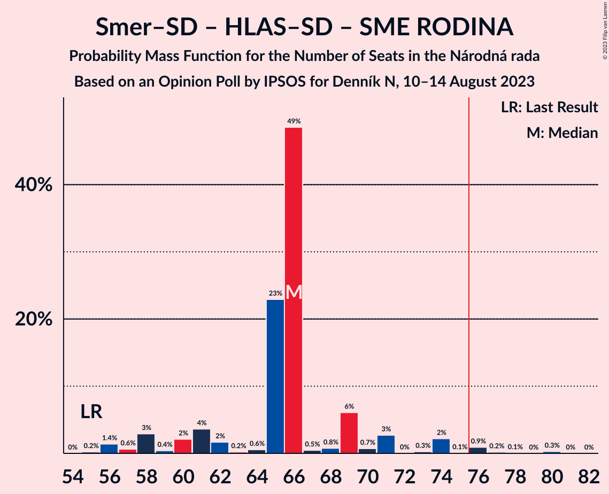

| Number of Seats | Probability | Accumulated | Special Marks |
|:---------------:|:-----------:|:-----------:|:-------------:|
| 55 | 0.2% | 100% | Last Result |
| 56 | 1.4% | 99.8% |  |
| 57 | 0.6% | 98% |  |
| 58 | 3% | 98% |  |
| 59 | 0.4% | 95% |  |
| 60 | 2% | 94% |  |
| 61 | 4% | 92% |  |
| 62 | 2% | 89% |  |
| 63 | 0.2% | 87% |  |
| 64 | 0.6% | 87% |  |
| 65 | 23% | 86% |  |
| 66 | 49% | 63% |  |
| 67 | 0.5% | 15% | Median |
| 68 | 0.8% | 14% |  |
| 69 | 6% | 14% |  |
| 70 | 0.7% | 7% |  |
| 71 | 3% | 7% |  |
| 72 | 0% | 4% |  |
| 73 | 0.3% | 4% |  |
| 74 | 2% | 4% |  |
| 75 | 0.1% | 2% |  |
| 76 | 0.9% | 1.5% | Majority |
| 77 | 0.2% | 0.6% |  |
| 78 | 0.1% | 0.4% |  |
| 79 | 0% | 0.3% |  |
| 80 | 0.3% | 0.3% |  |
| 81 | 0% | 0% |  |

### SMER–sociálna demokracia – HLAS–sociálna demokracia – Slovenská národná strana

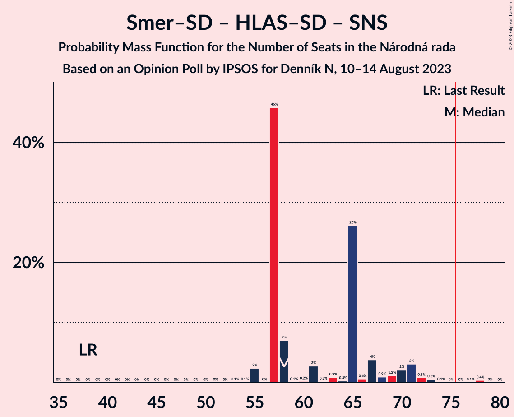

| Number of Seats | Probability | Accumulated | Special Marks |
|:---------------:|:-----------:|:-----------:|:-------------:|
| 38 | 0% | 100% | Last Result |
| 39 | 0% | 100% |  |
| 40 | 0% | 100% |  |
| 41 | 0% | 100% |  |
| 42 | 0% | 100% |  |
| 43 | 0% | 100% |  |
| 44 | 0% | 100% |  |
| 45 | 0% | 100% |  |
| 46 | 0% | 100% |  |
| 47 | 0% | 100% |  |
| 48 | 0% | 100% |  |
| 49 | 0% | 100% |  |
| 50 | 0% | 100% |  |
| 51 | 0% | 100% |  |
| 52 | 0% | 100% |  |
| 53 | 0.1% | 100% |  |
| 54 | 0.1% | 99.9% |  |
| 55 | 2% | 99.8% |  |
| 56 | 0% | 97% |  |
| 57 | 46% | 97% |  |
| 58 | 7% | 52% | Median |
| 59 | 0.1% | 44% |  |
| 60 | 0.2% | 44% |  |
| 61 | 3% | 44% |  |
| 62 | 0.2% | 41% |  |
| 63 | 0.9% | 41% |  |
| 64 | 0.3% | 40% |  |
| 65 | 26% | 40% |  |
| 66 | 0.6% | 14% |  |
| 67 | 4% | 13% |  |
| 68 | 0.9% | 9% |  |
| 69 | 1.2% | 8% |  |
| 70 | 2% | 7% |  |
| 71 | 3% | 5% |  |
| 72 | 0.8% | 2% |  |
| 73 | 0.6% | 1.2% |  |
| 74 | 0.1% | 0.6% |  |
| 75 | 0% | 0.5% |  |
| 76 | 0% | 0.5% | Majority |
| 77 | 0.1% | 0.5% |  |
| 78 | 0.4% | 0.4% |  |
| 79 | 0% | 0% |  |

### SMER–sociálna demokracia – SME RODINA – Slovenská národná strana – Kotleba–Ľudová strana Naše Slovensko

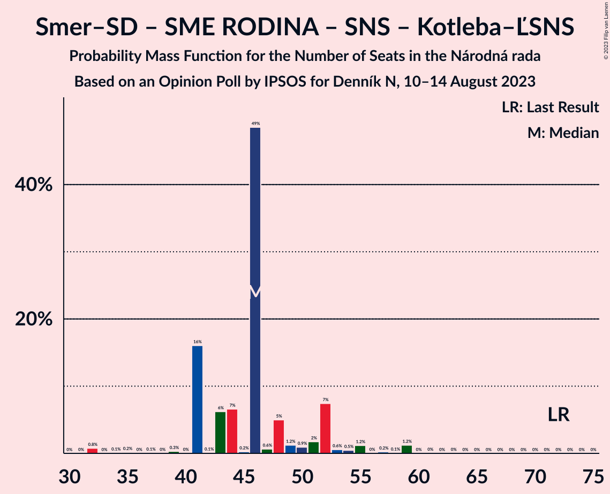

| Number of Seats | Probability | Accumulated | Special Marks |
|:---------------:|:-----------:|:-----------:|:-------------:|
| 32 | 0.8% | 100% |  |
| 33 | 0% | 99.2% |  |
| 34 | 0.1% | 99.2% |  |
| 35 | 0.2% | 99.1% |  |
| 36 | 0% | 99.0% |  |
| 37 | 0.1% | 99.0% |  |
| 38 | 0% | 98.9% |  |
| 39 | 0.3% | 98.9% |  |
| 40 | 0% | 98.6% |  |
| 41 | 16% | 98.6% |  |
| 42 | 0.1% | 83% |  |
| 43 | 6% | 82% |  |
| 44 | 7% | 76% |  |
| 45 | 0.2% | 70% |  |
| 46 | 49% | 69% | Median |
| 47 | 0.6% | 21% |  |
| 48 | 5% | 20% |  |
| 49 | 1.2% | 15% |  |
| 50 | 0.9% | 14% |  |
| 51 | 2% | 13% |  |
| 52 | 7% | 11% |  |
| 53 | 0.6% | 4% |  |
| 54 | 0.5% | 3% |  |
| 55 | 1.2% | 3% |  |
| 56 | 0% | 2% |  |
| 57 | 0.2% | 2% |  |
| 58 | 0.1% | 1.4% |  |
| 59 | 1.2% | 1.3% |  |
| 60 | 0% | 0.1% |  |
| 61 | 0% | 0.1% |  |
| 62 | 0% | 0% |  |
| 63 | 0% | 0% |  |
| 64 | 0% | 0% |  |
| 65 | 0% | 0% |  |
| 66 | 0% | 0% |  |
| 67 | 0% | 0% |  |
| 68 | 0% | 0% |  |
| 69 | 0% | 0% |  |
| 70 | 0% | 0% |  |
| 71 | 0% | 0% |  |
| 72 | 0% | 0% | Last Result |

### SMER–sociálna demokracia – SME RODINA – Slovenská národná strana

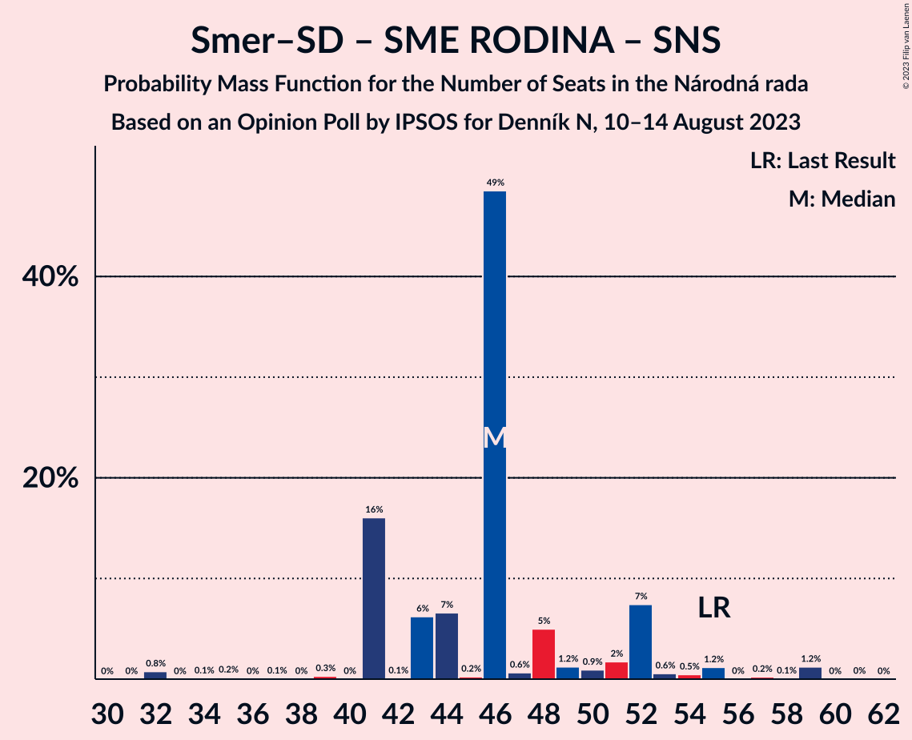

| Number of Seats | Probability | Accumulated | Special Marks |
|:---------------:|:-----------:|:-----------:|:-------------:|
| 32 | 0.8% | 100% |  |
| 33 | 0% | 99.2% |  |
| 34 | 0.1% | 99.2% |  |
| 35 | 0.2% | 99.1% |  |
| 36 | 0% | 99.0% |  |
| 37 | 0.1% | 99.0% |  |
| 38 | 0% | 98.9% |  |
| 39 | 0.3% | 98.9% |  |
| 40 | 0% | 98.6% |  |
| 41 | 16% | 98.6% |  |
| 42 | 0.1% | 82% |  |
| 43 | 6% | 82% |  |
| 44 | 7% | 76% |  |
| 45 | 0.2% | 70% |  |
| 46 | 49% | 69% | Median |
| 47 | 0.6% | 21% |  |
| 48 | 5% | 20% |  |
| 49 | 1.2% | 15% |  |
| 50 | 0.9% | 14% |  |
| 51 | 2% | 13% |  |
| 52 | 7% | 11% |  |
| 53 | 0.6% | 4% |  |
| 54 | 0.5% | 3% |  |
| 55 | 1.2% | 3% | Last Result |
| 56 | 0% | 2% |  |
| 57 | 0.2% | 2% |  |
| 58 | 0.1% | 1.4% |  |
| 59 | 1.2% | 1.3% |  |
| 60 | 0% | 0.1% |  |
| 61 | 0% | 0.1% |  |
| 62 | 0% | 0% |  |

### SMER–sociálna demokracia – SME RODINA

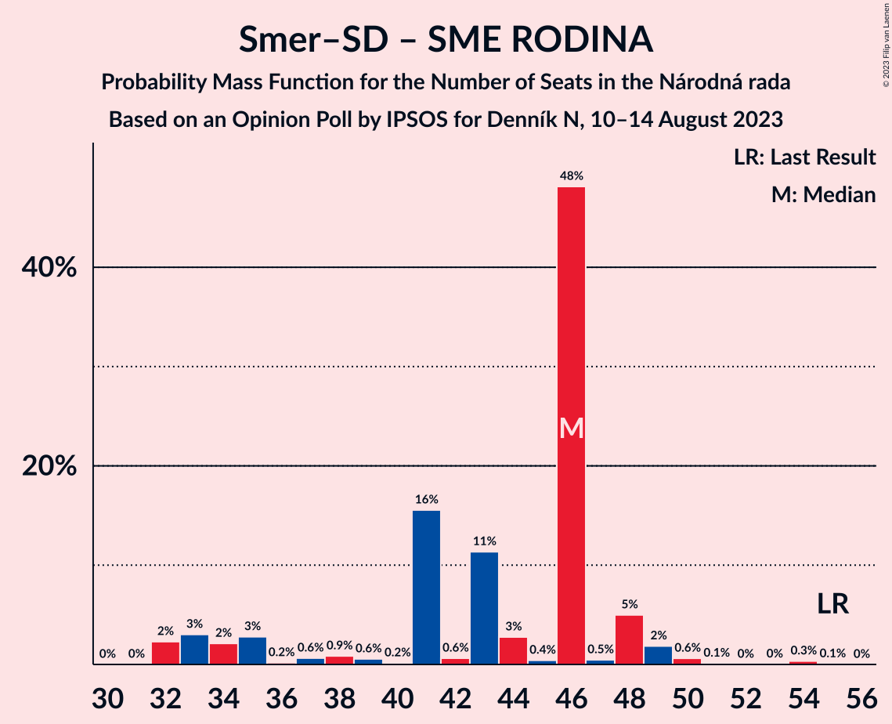

| Number of Seats | Probability | Accumulated | Special Marks |
|:---------------:|:-----------:|:-----------:|:-------------:|
| 32 | 2% | 100% |  |
| 33 | 3% | 98% |  |
| 34 | 2% | 95% |  |
| 35 | 3% | 93% |  |
| 36 | 0.2% | 90% |  |
| 37 | 0.6% | 90% |  |
| 38 | 0.9% | 89% |  |
| 39 | 0.6% | 88% |  |
| 40 | 0.2% | 88% |  |
| 41 | 16% | 87% |  |
| 42 | 0.6% | 72% |  |
| 43 | 11% | 71% |  |
| 44 | 3% | 60% |  |
| 45 | 0.4% | 57% |  |
| 46 | 48% | 57% | Median |
| 47 | 0.5% | 9% |  |
| 48 | 5% | 8% |  |
| 49 | 2% | 3% |  |
| 50 | 0.6% | 1.2% |  |
| 51 | 0.1% | 0.6% |  |
| 52 | 0% | 0.5% |  |
| 53 | 0% | 0.4% |  |
| 54 | 0.3% | 0.4% |  |
| 55 | 0.1% | 0.1% | Last Result |
| 56 | 0% | 0% |  |

### SMER–sociálna demokracia – Slovenská národná strana

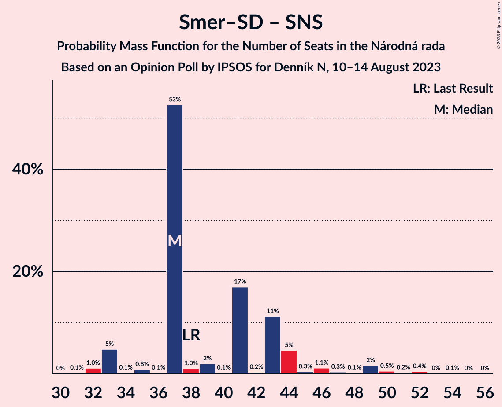

| Number of Seats | Probability | Accumulated | Special Marks |
|:---------------:|:-----------:|:-----------:|:-------------:|
| 31 | 0.1% | 100% |  |
| 32 | 1.0% | 99.9% |  |
| 33 | 5% | 98.9% |  |
| 34 | 0.1% | 94% |  |
| 35 | 0.8% | 94% |  |
| 36 | 0.1% | 93% |  |
| 37 | 53% | 93% | Median |
| 38 | 1.0% | 40% | Last Result |
| 39 | 2% | 39% |  |
| 40 | 0.1% | 38% |  |
| 41 | 17% | 37% |  |
| 42 | 0.2% | 20% |  |
| 43 | 11% | 20% |  |
| 44 | 5% | 9% |  |
| 45 | 0.3% | 5% |  |
| 46 | 1.1% | 4% |  |
| 47 | 0.3% | 3% |  |
| 48 | 0.1% | 3% |  |
| 49 | 2% | 3% |  |
| 50 | 0.5% | 1.1% |  |
| 51 | 0.2% | 0.7% |  |
| 52 | 0.4% | 0.5% |  |
| 53 | 0% | 0.1% |  |
| 54 | 0.1% | 0.1% |  |
| 55 | 0% | 0% |  |

### SMER–sociálna demokracia

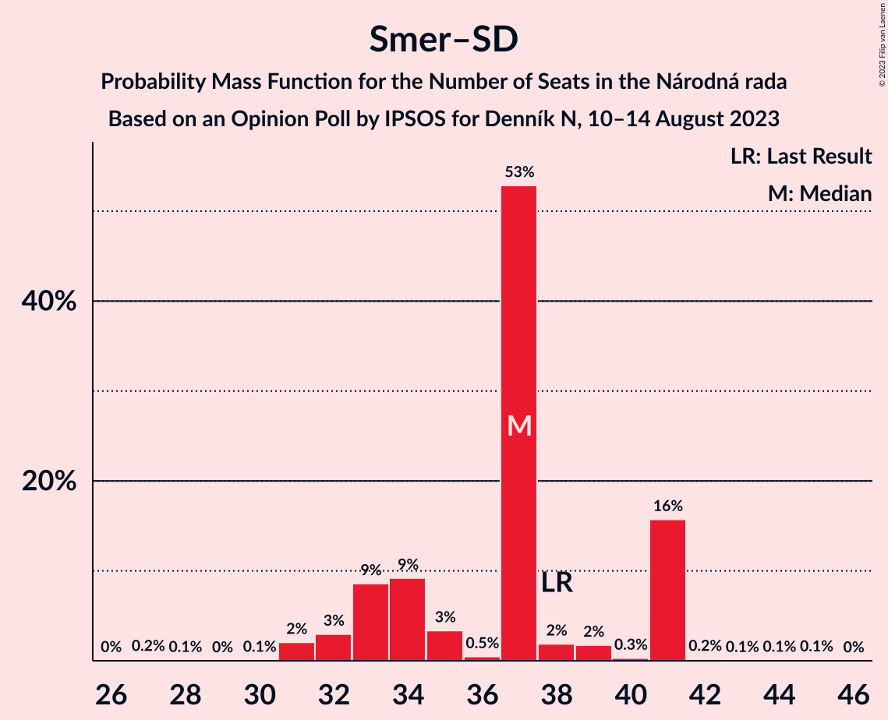

| Number of Seats | Probability | Accumulated | Special Marks |
|:---------------:|:-----------:|:-----------:|:-------------:|
| 26 | 0% | 100% |  |
| 27 | 0.2% | 99.9% |  |
| 28 | 0.1% | 99.7% |  |
| 29 | 0% | 99.7% |  |
| 30 | 0.1% | 99.7% |  |
| 31 | 2% | 99.6% |  |
| 32 | 3% | 98% |  |
| 33 | 9% | 95% |  |
| 34 | 9% | 86% |  |
| 35 | 3% | 77% |  |
| 36 | 0.5% | 73% |  |
| 37 | 53% | 73% | Median |
| 38 | 2% | 20% | Last Result |
| 39 | 2% | 18% |  |
| 40 | 0.3% | 16% |  |
| 41 | 16% | 16% |  |
| 42 | 0.2% | 0.4% |  |
| 43 | 0.1% | 0.3% |  |
| 44 | 0.1% | 0.2% |  |
| 45 | 0.1% | 0.1% |  |
| 46 | 0% | 0% |  |

### HLAS–sociálna demokracia – SME RODINA – Slovenská národná strana – Kotleba–Ľudová strana Naše Slovensko

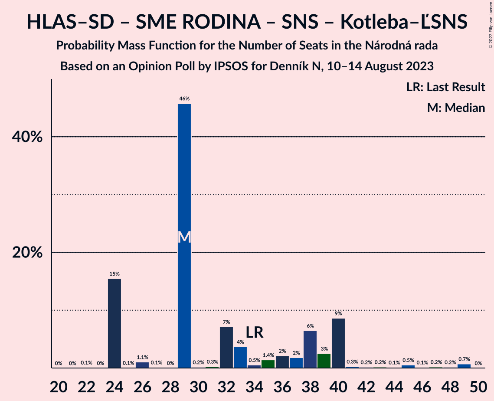

| Number of Seats | Probability | Accumulated | Special Marks |
|:---------------:|:-----------:|:-----------:|:-------------:|
| 22 | 0.1% | 100% |  |
| 23 | 0% | 99.9% |  |
| 24 | 15% | 99.9% |  |
| 25 | 0.1% | 84% |  |
| 26 | 1.1% | 84% |  |
| 27 | 0.1% | 83% |  |
| 28 | 0% | 83% |  |
| 29 | 46% | 83% |  |
| 30 | 0.2% | 37% | Median |
| 31 | 0.3% | 37% |  |
| 32 | 7% | 37% |  |
| 33 | 4% | 30% |  |
| 34 | 0.5% | 26% | Last Result |
| 35 | 1.4% | 26% |  |
| 36 | 2% | 24% |  |
| 37 | 2% | 22% |  |
| 38 | 6% | 20% |  |
| 39 | 3% | 14% |  |
| 40 | 9% | 11% |  |
| 41 | 0.3% | 3% |  |
| 42 | 0.2% | 2% |  |
| 43 | 0.2% | 2% |  |
| 44 | 0.1% | 2% |  |
| 45 | 0.5% | 2% |  |
| 46 | 0.1% | 1.2% |  |
| 47 | 0.2% | 1.1% |  |
| 48 | 0.2% | 0.9% |  |
| 49 | 0.7% | 0.7% |  |
| 50 | 0% | 0% |  |

### HLAS–sociálna demokracia – SME RODINA – Slovenská národná strana

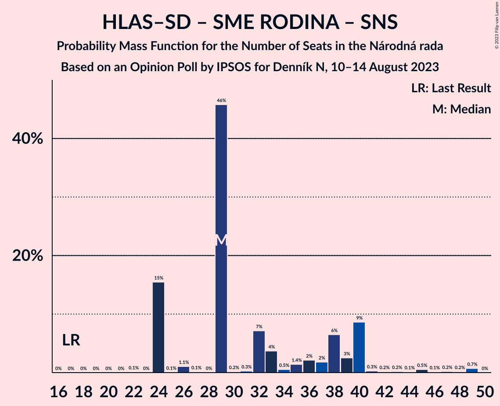

| Number of Seats | Probability | Accumulated | Special Marks |
|:---------------:|:-----------:|:-----------:|:-------------:|
| 17 | 0% | 100% | Last Result |
| 18 | 0% | 100% |  |
| 19 | 0% | 100% |  |
| 20 | 0% | 100% |  |
| 21 | 0% | 100% |  |
| 22 | 0.1% | 100% |  |
| 23 | 0% | 99.9% |  |
| 24 | 15% | 99.9% |  |
| 25 | 0.1% | 84% |  |
| 26 | 1.1% | 84% |  |
| 27 | 0.1% | 83% |  |
| 28 | 0% | 83% |  |
| 29 | 46% | 83% |  |
| 30 | 0.2% | 37% | Median |
| 31 | 0.3% | 37% |  |
| 32 | 7% | 37% |  |
| 33 | 4% | 30% |  |
| 34 | 0.5% | 26% |  |
| 35 | 1.4% | 26% |  |
| 36 | 2% | 24% |  |
| 37 | 2% | 22% |  |
| 38 | 6% | 20% |  |
| 39 | 3% | 14% |  |
| 40 | 9% | 11% |  |
| 41 | 0.3% | 3% |  |
| 42 | 0.2% | 2% |  |
| 43 | 0.2% | 2% |  |
| 44 | 0.1% | 2% |  |
| 45 | 0.5% | 2% |  |
| 46 | 0.1% | 1.2% |  |
| 47 | 0.2% | 1.1% |  |
| 48 | 0.2% | 0.9% |  |
| 49 | 0.7% | 0.7% |  |
| 50 | 0% | 0% |  |

### HLAS–sociálna demokracia – SME RODINA

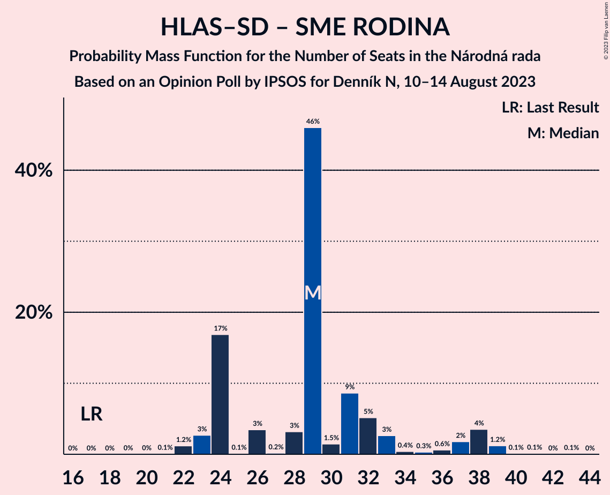

| Number of Seats | Probability | Accumulated | Special Marks |
|:---------------:|:-----------:|:-----------:|:-------------:|
| 17 | 0% | 100% | Last Result |
| 18 | 0% | 100% |  |
| 19 | 0% | 100% |  |
| 20 | 0% | 100% |  |
| 21 | 0.1% | 99.9% |  |
| 22 | 1.2% | 99.8% |  |
| 23 | 3% | 98.6% |  |
| 24 | 17% | 96% |  |
| 25 | 0.1% | 79% |  |
| 26 | 3% | 79% |  |
| 27 | 0.2% | 75% |  |
| 28 | 3% | 75% |  |
| 29 | 46% | 72% |  |
| 30 | 1.5% | 26% | Median |
| 31 | 9% | 25% |  |
| 32 | 5% | 16% |  |
| 33 | 3% | 11% |  |
| 34 | 0.4% | 8% |  |
| 35 | 0.3% | 8% |  |
| 36 | 0.6% | 7% |  |
| 37 | 2% | 7% |  |
| 38 | 4% | 5% |  |
| 39 | 1.2% | 2% |  |
| 40 | 0.1% | 0.3% |  |
| 41 | 0.1% | 0.2% |  |
| 42 | 0% | 0.1% |  |
| 43 | 0.1% | 0.1% |  |
| 44 | 0% | 0% |  |

### HLAS–sociálna demokracia – Slovenská národná strana

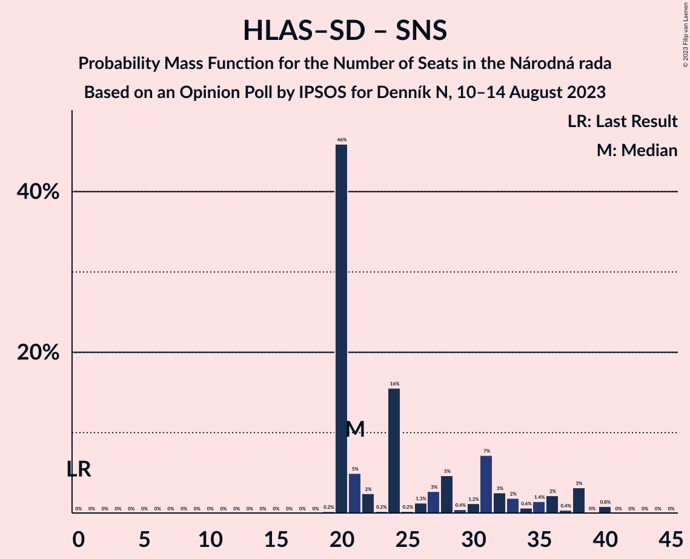

| Number of Seats | Probability | Accumulated | Special Marks |
|:---------------:|:-----------:|:-----------:|:-------------:|
| 0 | 0% | 100% | Last Result |
| 1 | 0% | 100% |  |
| 2 | 0% | 100% |  |
| 3 | 0% | 100% |  |
| 4 | 0% | 100% |  |
| 5 | 0% | 100% |  |
| 6 | 0% | 100% |  |
| 7 | 0% | 100% |  |
| 8 | 0% | 100% |  |
| 9 | 0% | 100% |  |
| 10 | 0% | 100% |  |
| 11 | 0% | 100% |  |
| 12 | 0% | 100% |  |
| 13 | 0% | 100% |  |
| 14 | 0% | 100% |  |
| 15 | 0% | 100% |  |
| 16 | 0% | 100% |  |
| 17 | 0% | 100% |  |
| 18 | 0% | 100% |  |
| 19 | 0.2% | 100% |  |
| 20 | 46% | 99.8% |  |
| 21 | 5% | 54% | Median |
| 22 | 2% | 49% |  |
| 23 | 0.2% | 46% |  |
| 24 | 16% | 46% |  |
| 25 | 0.2% | 31% |  |
| 26 | 1.3% | 30% |  |
| 27 | 3% | 29% |  |
| 28 | 5% | 27% |  |
| 29 | 0.4% | 22% |  |
| 30 | 1.2% | 21% |  |
| 31 | 7% | 20% |  |
| 32 | 3% | 13% |  |
| 33 | 2% | 11% |  |
| 34 | 0.6% | 9% |  |
| 35 | 1.4% | 8% |  |
| 36 | 2% | 7% |  |
| 37 | 0.4% | 4% |  |
| 38 | 3% | 4% |  |
| 39 | 0% | 0.9% |  |
| 40 | 0.8% | 0.8% |  |
| 41 | 0% | 0% |  |

## Technical Information

### Opinion Poll

+ **Polling firm:** IPSOS
+ **Commissioner(s):** Denník N
+ **Fieldwork period:** 10–14 August 2023

### Calculations

+ **Sample size:** 1003
+ **Simulations done:** 1,048,576
+ **Error estimate:** 2.36%

