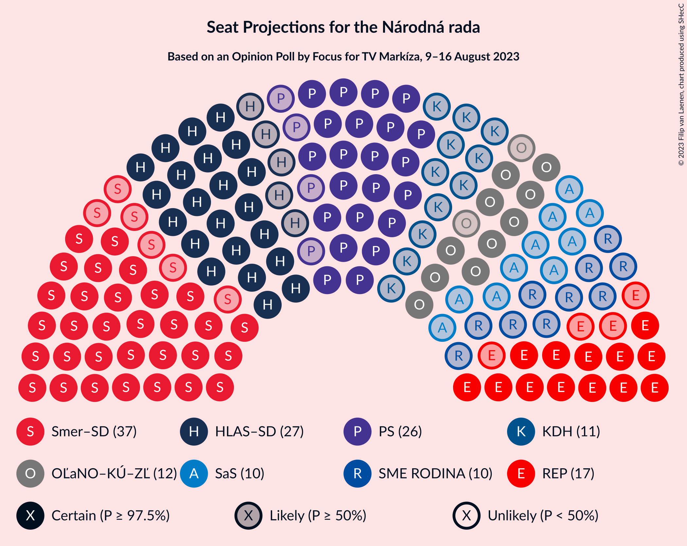

# Opinion Poll by Focus for TV Markíza, 9–16 August 2023

<a href="#voting-intentions">Voting Intentions</a> | <a href="#seats">Seats</a> | <a href="#coalitions">Coalitions</a> | <a href="#technical-information">Technical Information</a>

## Voting Intentions

### Confidence Intervals

| Party | Last Result | Poll Result | 80% Confidence Interval | 90% Confidence Interval | 95% Confidence Interval | 99% Confidence Interval |
|:-----:|:-----------:|:-----------:|:-----------------------:|:-----------------------:|:-----------------------:|:-----------------------:|
| SMER–sociálna demokracia | 18.3% | 20.0% | 18.5–21.7% |18.0–22.2% |17.7–22.6% |16.9–23.4% |
| Progresívne Slovensko | 7.0% | 15.0% | 13.6–16.5% |13.2–16.9% |12.9–17.3% |12.3–18.1% |
| HLAS–sociálna demokracia | 0.0% | 14.2% | 12.8–15.7% |12.5–16.1% |12.1–16.5% |11.5–17.2% |
| REPUBLIKA | 0.0% | 8.8% | 7.8–10.1% |7.5–10.4% |7.2–10.7% |6.7–11.4% |
| OBYČAJNÍ ĽUDIA a nezávislé osobnosti–Kresťanská únia–Za ľudí | 0.0% | 6.4% | 5.5–7.5% |5.3–7.9% |5.1–8.1% |4.7–8.7% |
| Sloboda a Solidarita | 6.2% | 6.1% | 5.3–7.2% |5.0–7.5% |4.8–7.8% |4.4–8.4% |
| Kresťanskodemokratické hnutie | 4.6% | 6.1% | 5.3–7.2% |5.0–7.5% |4.8–7.8% |4.4–8.4% |
| Slovenská národná strana | 3.2% | 5.3% | 4.5–6.3% |4.2–6.6% |4.0–6.8% |3.7–7.3% |
| SME RODINA | 8.2% | 5.1% | 4.3–6.1% |4.0–6.3% |3.9–6.6% |3.5–7.1% |
| Strana maďarskej koalície–Magyar Koalíció Pártja | 3.9% | 3.4% | 2.7–4.2% |2.6–4.5% |2.4–4.7% |2.1–5.1% |
| SPOLU–Občianska Demokracia | 7.0% | 3.1% | 2.5–3.9% |2.3–4.1% |2.2–4.3% |1.9–4.8% |
| Kotleba–Ľudová strana Naše Slovensko | 8.0% | 2.1% | 1.6–2.8% |1.5–3.0% |1.4–3.2% |1.2–3.5% |
| MODRÍ–Európske Slovensko–MOST–HÍD | 0.0% | 1.7% | 1.3–2.3% |1.1–2.5% |1.1–2.7% |0.9–3.0% |
| Magyar Fórum | 0.0% | 0.7% | 0.5–1.2% |0.4–1.3% |0.3–1.4% |0.2–1.7% |

*Note:* The poll result column reflects the actual value used in the calculations. Published results may vary slightly, and in addition be rounded to fewer digits.

## Seats

### Confidence Intervals

| Party | Last Result | Median | 80% Confidence Interval | 90% Confidence Interval | 95% Confidence Interval | 99% Confidence Interval |
|:-----:|:-----------:|:------:|:-----------------------:|:-----------------------:|:-----------------------:|:-----------------------:|
| <a href="#smer–sociálna-demokracia">SMER–sociálna demokracia</a> | 38 | 37 | 33–39 |31–41 |31–41 |31–44 |
| <a href="#progresívne-slovensko">Progresívne Slovensko</a> | 0 | 27 | 25–29 |23–31 |22–32 |22–34 |
| <a href="#hlas–sociálna-demokracia">HLAS–sociálna demokracia</a> | 0 | 27 | 23–29 |22–29 |22–29 |21–32 |
| <a href="#republika">REPUBLIKA</a> | 0 | 17 | 14–19 |13–19 |13–19 |12–20 |
| <a href="#obyčajní-ľudia-a-nezávislé-osobnosti–kresťanská-únia–za-ľudí">OBYČAJNÍ ĽUDIA a nezávislé osobnosti–Kresťanská únia–Za ľudí</a> | 0 | 12 | 10–13 |10–14 |10–15 |0–15 |
| <a href="#sloboda-a-solidarita">Sloboda a Solidarita</a> | 13 | 10 | 0–14 |0–14 |0–14 |0–14 |
| <a href="#kresťanskodemokratické-hnutie">Kresťanskodemokratické hnutie</a> | 0 | 11 | 9–13 |9–13 |0–15 |0–15 |
| <a href="#slovenská-národná-strana">Slovenská národná strana</a> | 0 | 9 | 0–11 |0–12 |0–12 |0–13 |
| <a href="#sme-rodina">SME RODINA</a> | 17 | 10 | 0–11 |0–12 |0–12 |0–13 |
| <a href="#strana-maďarskej-koalície–magyar-koalíció-pártja">Strana maďarskej koalície–Magyar Koalíció Pártja</a> | 0 | 0 | 0 |0 |0 |0 |
| <a href="#spolu–občianska-demokracia">SPOLU–Občianska Demokracia</a> | 0 | 0 | 0 |0 |0 |0 |
| <a href="#kotleba–ľudová-strana-naše-slovensko">Kotleba–Ľudová strana Naše Slovensko</a> | 17 | 0 | 0 |0 |0 |0 |
| <a href="#modrí–európske-slovensko–most–híd">MODRÍ–Európske Slovensko–MOST–HÍD</a> | 0 | 0 | 0 |0 |0 |0 |
| <a href="#magyar-fórum">Magyar Fórum</a> | 0 | 0 | 0 |0 |0 |0 |

### SMER–sociálna demokracia

*For a full overview of the results for this party, see the [SMER–sociálna demokracia](party-smer–sociálnademokracia.html) page.*

| Number of Seats | Probability | Accumulated | Special Marks |
|:---------------:|:-----------:|:-----------:|:-------------:|
| 29 | 0% | 100% |  |
| 30 | 0.2% | 99.9% |  |
| 31 | 6% | 99.8% |  |
| 32 | 0.7% | 94% |  |
| 33 | 5% | 93% |  |
| 34 | 11% | 88% |  |
| 35 | 2% | 78% |  |
| 36 | 5% | 76% |  |
| 37 | 55% | 71% | Median |
| 38 | 0.5% | 16% | Last Result |
| 39 | 8% | 15% |  |
| 40 | 1.1% | 8% |  |
| 41 | 6% | 7% |  |
| 42 | 0.6% | 1.2% |  |
| 43 | 0.1% | 0.6% |  |
| 44 | 0.4% | 0.5% |  |
| 45 | 0.1% | 0.1% |  |
| 46 | 0% | 0% |  |

### Progresívne Slovensko

*For a full overview of the results for this party, see the [Progresívne Slovensko](party-progresívneslovensko.html) page.*

| Number of Seats | Probability | Accumulated | Special Marks |
|:---------------:|:-----------:|:-----------:|:-------------:|
| 0 | 0% | 100% | Last Result |
| 1 | 0% | 100% |  |
| 2 | 0% | 100% |  |
| 3 | 0% | 100% |  |
| 4 | 0% | 100% |  |
| 5 | 0% | 100% |  |
| 6 | 0% | 100% |  |
| 7 | 0% | 100% |  |
| 8 | 0% | 100% |  |
| 9 | 0% | 100% |  |
| 10 | 0% | 100% |  |
| 11 | 0% | 100% |  |
| 12 | 0% | 100% |  |
| 13 | 0% | 100% |  |
| 14 | 0% | 100% |  |
| 15 | 0% | 100% |  |
| 16 | 0% | 100% |  |
| 17 | 0% | 100% |  |
| 18 | 0% | 100% |  |
| 19 | 0% | 100% |  |
| 20 | 0% | 100% |  |
| 21 | 0.2% | 100% |  |
| 22 | 4% | 99.8% |  |
| 23 | 2% | 96% |  |
| 24 | 1.0% | 95% |  |
| 25 | 6% | 94% |  |
| 26 | 35% | 88% |  |
| 27 | 9% | 53% | Median |
| 28 | 3% | 44% |  |
| 29 | 31% | 41% |  |
| 30 | 2% | 9% |  |
| 31 | 5% | 7% |  |
| 32 | 0.6% | 3% |  |
| 33 | 2% | 2% |  |
| 34 | 0.1% | 0.5% |  |
| 35 | 0.4% | 0.5% |  |
| 36 | 0.1% | 0.1% |  |
| 37 | 0% | 0% |  |

### HLAS–sociálna demokracia

*For a full overview of the results for this party, see the [HLAS–sociálna demokracia](party-hlas–sociálnademokracia.html) page.*

| Number of Seats | Probability | Accumulated | Special Marks |
|:---------------:|:-----------:|:-----------:|:-------------:|
| 0 | 0% | 100% | Last Result |
| 1 | 0% | 100% |  |
| 2 | 0% | 100% |  |
| 3 | 0% | 100% |  |
| 4 | 0% | 100% |  |
| 5 | 0% | 100% |  |
| 6 | 0% | 100% |  |
| 7 | 0% | 100% |  |
| 8 | 0% | 100% |  |
| 9 | 0% | 100% |  |
| 10 | 0% | 100% |  |
| 11 | 0% | 100% |  |
| 12 | 0% | 100% |  |
| 13 | 0% | 100% |  |
| 14 | 0% | 100% |  |
| 15 | 0% | 100% |  |
| 16 | 0% | 100% |  |
| 17 | 0% | 100% |  |
| 18 | 0% | 100% |  |
| 19 | 0% | 100% |  |
| 20 | 0.2% | 100% |  |
| 21 | 0.4% | 99.8% |  |
| 22 | 8% | 99.4% |  |
| 23 | 10% | 92% |  |
| 24 | 7% | 81% |  |
| 25 | 0.8% | 74% |  |
| 26 | 10% | 73% |  |
| 27 | 30% | 64% | Median |
| 28 | 1.4% | 34% |  |
| 29 | 30% | 33% |  |
| 30 | 0.8% | 2% |  |
| 31 | 0.5% | 1.4% |  |
| 32 | 0.6% | 0.9% |  |
| 33 | 0.3% | 0.3% |  |
| 34 | 0% | 0% |  |

### REPUBLIKA

*For a full overview of the results for this party, see the [REPUBLIKA](party-republika.html) page.*

| Number of Seats | Probability | Accumulated | Special Marks |
|:---------------:|:-----------:|:-----------:|:-------------:|
| 0 | 0% | 100% | Last Result |
| 1 | 0% | 100% |  |
| 2 | 0% | 100% |  |
| 3 | 0% | 100% |  |
| 4 | 0% | 100% |  |
| 5 | 0% | 100% |  |
| 6 | 0% | 100% |  |
| 7 | 0% | 100% |  |
| 8 | 0% | 100% |  |
| 9 | 0% | 100% |  |
| 10 | 0% | 100% |  |
| 11 | 0.2% | 100% |  |
| 12 | 1.1% | 99.8% |  |
| 13 | 7% | 98.7% |  |
| 14 | 10% | 92% |  |
| 15 | 10% | 82% |  |
| 16 | 4% | 72% |  |
| 17 | 56% | 67% | Median |
| 18 | 0.7% | 11% |  |
| 19 | 9% | 10% |  |
| 20 | 0.8% | 1.1% |  |
| 21 | 0% | 0.3% |  |
| 22 | 0.2% | 0.3% |  |
| 23 | 0% | 0% |  |

### OBYČAJNÍ ĽUDIA a nezávislé osobnosti–Kresťanská únia–Za ľudí

*For a full overview of the results for this party, see the [OBYČAJNÍ ĽUDIA a nezávislé osobnosti–Kresťanská únia–Za ľudí](party-obyčajníľudiaanezávisléosobnosti–kresťanskáúnia–zaľudí.html) page.*

| Number of Seats | Probability | Accumulated | Special Marks |
|:---------------:|:-----------:|:-----------:|:-------------:|
| 0 | 1.4% | 100% | Last Result |
| 1 | 0% | 98.6% |  |
| 2 | 0% | 98.6% |  |
| 3 | 0% | 98.6% |  |
| 4 | 0% | 98.6% |  |
| 5 | 0% | 98.6% |  |
| 6 | 0% | 98.6% |  |
| 7 | 0% | 98.6% |  |
| 8 | 0% | 98.6% |  |
| 9 | 1.0% | 98.6% |  |
| 10 | 9% | 98% |  |
| 11 | 29% | 88% |  |
| 12 | 20% | 59% | Median |
| 13 | 31% | 39% |  |
| 14 | 5% | 8% |  |
| 15 | 3% | 4% |  |
| 16 | 0.4% | 0.4% |  |
| 17 | 0% | 0% |  |

### Sloboda a Solidarita

*For a full overview of the results for this party, see the [Sloboda a Solidarita](party-slobodaasolidarita.html) page.*

| Number of Seats | Probability | Accumulated | Special Marks |
|:---------------:|:-----------:|:-----------:|:-------------:|
| 0 | 30% | 100% |  |
| 1 | 0% | 70% |  |
| 2 | 0% | 70% |  |
| 3 | 0% | 70% |  |
| 4 | 0% | 70% |  |
| 5 | 0% | 70% |  |
| 6 | 0% | 70% |  |
| 7 | 0% | 70% |  |
| 8 | 0% | 70% |  |
| 9 | 4% | 70% |  |
| 10 | 16% | 66% | Median |
| 11 | 6% | 50% |  |
| 12 | 28% | 44% |  |
| 13 | 4% | 16% | Last Result |
| 14 | 11% | 12% |  |
| 15 | 0.1% | 0.3% |  |
| 16 | 0.2% | 0.2% |  |
| 17 | 0% | 0% |  |

### Kresťanskodemokratické hnutie

*For a full overview of the results for this party, see the [Kresťanskodemokratické hnutie](party-kresťanskodemokratickéhnutie.html) page.*

| Number of Seats | Probability | Accumulated | Special Marks |
|:---------------:|:-----------:|:-----------:|:-------------:|
| 0 | 5% | 100% | Last Result |
| 1 | 0% | 95% |  |
| 2 | 0% | 95% |  |
| 3 | 0% | 95% |  |
| 4 | 0% | 95% |  |
| 5 | 0% | 95% |  |
| 6 | 0% | 95% |  |
| 7 | 0% | 95% |  |
| 8 | 0% | 95% |  |
| 9 | 13% | 95% |  |
| 10 | 14% | 82% |  |
| 11 | 33% | 68% | Median |
| 12 | 4% | 35% |  |
| 13 | 28% | 32% |  |
| 14 | 0.7% | 4% |  |
| 15 | 3% | 3% |  |
| 16 | 0.1% | 0.1% |  |
| 17 | 0% | 0% |  |

### Slovenská národná strana

*For a full overview of the results for this party, see the [Slovenská národná strana](party-slovenskánárodnástrana.html) page.*

| Number of Seats | Probability | Accumulated | Special Marks |
|:---------------:|:-----------:|:-----------:|:-------------:|
| 0 | 43% | 100% | Last Result |
| 1 | 0% | 57% |  |
| 2 | 0% | 57% |  |
| 3 | 0% | 57% |  |
| 4 | 0% | 57% |  |
| 5 | 0% | 57% |  |
| 6 | 0% | 57% |  |
| 7 | 0% | 57% |  |
| 8 | 0% | 57% |  |
| 9 | 10% | 57% | Median |
| 10 | 13% | 47% |  |
| 11 | 24% | 34% |  |
| 12 | 7% | 9% |  |
| 13 | 2% | 2% |  |
| 14 | 0.3% | 0.4% |  |
| 15 | 0% | 0.1% |  |
| 16 | 0% | 0.1% |  |
| 17 | 0% | 0% |  |

### SME RODINA

*For a full overview of the results for this party, see the [SME RODINA](party-smerodina.html) page.*

| Number of Seats | Probability | Accumulated | Special Marks |
|:---------------:|:-----------:|:-----------:|:-------------:|
| 0 | 39% | 100% |  |
| 1 | 0% | 61% |  |
| 2 | 0% | 61% |  |
| 3 | 0% | 61% |  |
| 4 | 0% | 61% |  |
| 5 | 0% | 61% |  |
| 6 | 0% | 61% |  |
| 7 | 0% | 61% |  |
| 8 | 0% | 61% |  |
| 9 | 3% | 60% |  |
| 10 | 29% | 57% | Median |
| 11 | 20% | 28% |  |
| 12 | 7% | 8% |  |
| 13 | 0.4% | 0.8% |  |
| 14 | 0.3% | 0.4% |  |
| 15 | 0% | 0% |  |
| 16 | 0% | 0% |  |
| 17 | 0% | 0% | Last Result |

### Strana maďarskej koalície–Magyar Koalíció Pártja

*For a full overview of the results for this party, see the [Strana maďarskej koalície–Magyar Koalíció Pártja](party-stranamaďarskejkoalície–magyarkoalíciópártja.html) page.*

| Number of Seats | Probability | Accumulated | Special Marks |
|:---------------:|:-----------:|:-----------:|:-------------:|
| 0 | 99.9% | 100% | Last Result, Median |
| 1 | 0% | 0.1% |  |
| 2 | 0% | 0.1% |  |
| 3 | 0% | 0.1% |  |
| 4 | 0% | 0.1% |  |
| 5 | 0% | 0.1% |  |
| 6 | 0% | 0.1% |  |
| 7 | 0% | 0.1% |  |
| 8 | 0% | 0.1% |  |
| 9 | 0% | 0.1% |  |
| 10 | 0.1% | 0.1% |  |
| 11 | 0% | 0% |  |

### SPOLU–Občianska Demokracia

*For a full overview of the results for this party, see the [SPOLU–Občianska Demokracia](party-spolu–občianskademokracia.html) page.*

| Number of Seats | Probability | Accumulated | Special Marks |
|:---------------:|:-----------:|:-----------:|:-------------:|
| 0 | 99.9% | 100% | Last Result, Median |
| 1 | 0% | 0.1% |  |
| 2 | 0% | 0.1% |  |
| 3 | 0% | 0.1% |  |
| 4 | 0% | 0.1% |  |
| 5 | 0% | 0.1% |  |
| 6 | 0% | 0.1% |  |
| 7 | 0% | 0.1% |  |
| 8 | 0% | 0.1% |  |
| 9 | 0.1% | 0.1% |  |
| 10 | 0% | 0% |  |

### Kotleba–Ľudová strana Naše Slovensko

*For a full overview of the results for this party, see the [Kotleba–Ľudová strana Naše Slovensko](party-kotleba–ľudovástrananašeslovensko.html) page.*

| Number of Seats | Probability | Accumulated | Special Marks |
|:---------------:|:-----------:|:-----------:|:-------------:|
| 0 | 100% | 100% | Median |
| 1 | 0% | 0% |  |
| 2 | 0% | 0% |  |
| 3 | 0% | 0% |  |
| 4 | 0% | 0% |  |
| 5 | 0% | 0% |  |
| 6 | 0% | 0% |  |
| 7 | 0% | 0% |  |
| 8 | 0% | 0% |  |
| 9 | 0% | 0% |  |
| 10 | 0% | 0% |  |
| 11 | 0% | 0% |  |
| 12 | 0% | 0% |  |
| 13 | 0% | 0% |  |
| 14 | 0% | 0% |  |
| 15 | 0% | 0% |  |
| 16 | 0% | 0% |  |
| 17 | 0% | 0% | Last Result |

### MODRÍ–Európske Slovensko–MOST–HÍD

*For a full overview of the results for this party, see the [MODRÍ–Európske Slovensko–MOST–HÍD](party-modrí–európskeslovensko–most–híd.html) page.*

| Number of Seats | Probability | Accumulated | Special Marks |
|:---------------:|:-----------:|:-----------:|:-------------:|
| 0 | 100% | 100% | Last Result, Median |

### Magyar Fórum

*For a full overview of the results for this party, see the [Magyar Fórum](party-magyarfórum.html) page.*

| Number of Seats | Probability | Accumulated | Special Marks |
|:---------------:|:-----------:|:-----------:|:-------------:|
| 0 | 100% | 100% | Last Result, Median |

## Coalitions

### Confidence Intervals

| Coalition | Last Result | Median | Majority? | 80% Confidence Interval | 90% Confidence Interval | 95% Confidence Interval | 99% Confidence Interval |
|:---------:|:-----------:|:------:|:---------:|:-----------------------:|:-----------------------:|:-----------------------:|:-----------------------:|
| SMER–sociálna demokracia – HLAS–sociálna demokracia – Slovenská národná strana – SME RODINA – Kotleba–Ľudová strana Naše Slovensko | 72 | 75 | 48% | 66–85 | 66–85 | 63–85 | 63–88 |
| SMER–sociálna demokracia – HLAS–sociálna demokracia – Slovenská národná strana – SME RODINA | 55 | 75 | 48% | 66–85 | 66–85 | 63–85 | 63–88 |
| SMER–sociálna demokracia – HLAS–sociálna demokracia – Slovenská národná strana | 38 | 68 | 3% | 62–75 | 60–75 | 60–77 | 60–84 |
| SMER–sociálna demokracia – HLAS–sociálna demokracia – SME RODINA | 55 | 71 | 2% | 63–74 | 63–74 | 60–74 | 55–80 |
| SMER–sociálna demokracia – Slovenská národná strana – SME RODINA – Kotleba–Ľudová strana Naše Slovensko | 72 | 50 | 0% | 37–58 | 37–58 | 37–60 | 37–61 |
| SMER–sociálna demokracia – Slovenská národná strana – SME RODINA | 55 | 50 | 0% | 37–58 | 37–58 | 37–60 | 37–61 |
| SMER–sociálna demokracia – Slovenská národná strana | 38 | 42 | 0% | 37–49 | 37–51 | 33–51 | 33–54 |
| HLAS–sociálna demokracia – Slovenská národná strana – SME RODINA – Kotleba–Ľudová strana Naše Slovensko | 34 | 40 | 0% | 29–48 | 29–51 | 24–51 | 24–51 |
| HLAS–sociálna demokracia – Slovenská národná strana – SME RODINA | 17 | 40 | 0% | 29–48 | 29–51 | 24–51 | 24–51 |
| SMER–sociálna demokracia – SME RODINA | 55 | 45 | 0% | 37–48 | 37–49 | 36–50 | 33–53 |
| SMER–sociálna demokracia | 38 | 37 | 0% | 33–39 | 31–41 | 31–41 | 31–44 |
| HLAS–sociálna demokracia – SME RODINA | 17 | 34 | 0% | 26–38 | 24–39 | 22–40 | 22–42 |
| HLAS–sociálna demokracia – Slovenská národná strana | 0 | 32 | 0% | 24–39 | 23–39 | 23–39 | 23–43 |

### SMER–sociálna demokracia – HLAS–sociálna demokracia – Slovenská národná strana – SME RODINA – Kotleba–Ľudová strana Naše Slovensko

| Number of Seats | Probability | Accumulated | Special Marks |
|:---------------:|:-----------:|:-----------:|:-------------:|
| 60 | 0% | 100% |  |
| 61 | 0% | 99.9% |  |
| 62 | 0% | 99.9% |  |
| 63 | 3% | 99.9% |  |
| 64 | 0.9% | 97% |  |
| 65 | 0.8% | 96% |  |
| 66 | 24% | 96% |  |
| 67 | 0.1% | 71% |  |
| 68 | 0.3% | 71% |  |
| 69 | 0.9% | 71% |  |
| 70 | 0.7% | 70% |  |
| 71 | 8% | 69% |  |
| 72 | 0.2% | 61% | Last Result |
| 73 | 9% | 61% |  |
| 74 | 1.3% | 51% |  |
| 75 | 2% | 50% |  |
| 76 | 4% | 48% | Majority |
| 77 | 0.3% | 44% |  |
| 78 | 3% | 43% |  |
| 79 | 0.5% | 40% |  |
| 80 | 4% | 40% |  |
| 81 | 0.2% | 35% |  |
| 82 | 3% | 35% |  |
| 83 | 0.2% | 32% | Median |
| 84 | 4% | 32% |  |
| 85 | 27% | 28% |  |
| 86 | 0% | 0.8% |  |
| 87 | 0% | 0.8% |  |
| 88 | 0.6% | 0.8% |  |
| 89 | 0% | 0.2% |  |
| 90 | 0.1% | 0.2% |  |
| 91 | 0% | 0.1% |  |
| 92 | 0% | 0% |  |

### SMER–sociálna demokracia – HLAS–sociálna demokracia – Slovenská národná strana – SME RODINA

| Number of Seats | Probability | Accumulated | Special Marks |
|:---------------:|:-----------:|:-----------:|:-------------:|
| 55 | 0% | 100% | Last Result |
| 56 | 0% | 100% |  |
| 57 | 0% | 100% |  |
| 58 | 0% | 100% |  |
| 59 | 0% | 100% |  |
| 60 | 0% | 100% |  |
| 61 | 0% | 99.9% |  |
| 62 | 0% | 99.9% |  |
| 63 | 3% | 99.9% |  |
| 64 | 0.9% | 97% |  |
| 65 | 0.8% | 96% |  |
| 66 | 24% | 96% |  |
| 67 | 0.1% | 71% |  |
| 68 | 0.3% | 71% |  |
| 69 | 0.9% | 71% |  |
| 70 | 0.7% | 70% |  |
| 71 | 8% | 69% |  |
| 72 | 0.2% | 61% |  |
| 73 | 9% | 61% |  |
| 74 | 1.3% | 51% |  |
| 75 | 2% | 50% |  |
| 76 | 4% | 48% | Majority |
| 77 | 0.3% | 44% |  |
| 78 | 3% | 43% |  |
| 79 | 0.5% | 40% |  |
| 80 | 4% | 40% |  |
| 81 | 0.2% | 35% |  |
| 82 | 3% | 35% |  |
| 83 | 0.2% | 32% | Median |
| 84 | 4% | 32% |  |
| 85 | 27% | 28% |  |
| 86 | 0% | 0.8% |  |
| 87 | 0% | 0.8% |  |
| 88 | 0.6% | 0.8% |  |
| 89 | 0% | 0.2% |  |
| 90 | 0.1% | 0.2% |  |
| 91 | 0% | 0.1% |  |
| 92 | 0% | 0% |  |

### SMER–sociálna demokracia – HLAS–sociálna demokracia – Slovenská národná strana

| Number of Seats | Probability | Accumulated | Special Marks |
|:---------------:|:-----------:|:-----------:|:-------------:|
| 38 | 0% | 100% | Last Result |
| 39 | 0% | 100% |  |
| 40 | 0% | 100% |  |
| 41 | 0% | 100% |  |
| 42 | 0% | 100% |  |
| 43 | 0% | 100% |  |
| 44 | 0% | 100% |  |
| 45 | 0% | 100% |  |
| 46 | 0% | 100% |  |
| 47 | 0% | 100% |  |
| 48 | 0% | 100% |  |
| 49 | 0% | 100% |  |
| 50 | 0% | 100% |  |
| 51 | 0% | 100% |  |
| 52 | 0% | 100% |  |
| 53 | 0% | 100% |  |
| 54 | 0% | 100% |  |
| 55 | 0% | 100% |  |
| 56 | 0% | 100% |  |
| 57 | 0% | 100% |  |
| 58 | 0% | 99.9% |  |
| 59 | 0.2% | 99.9% |  |
| 60 | 8% | 99.7% |  |
| 61 | 0.2% | 91% |  |
| 62 | 3% | 91% |  |
| 63 | 4% | 88% |  |
| 64 | 2% | 84% |  |
| 65 | 1.0% | 82% |  |
| 66 | 28% | 81% |  |
| 67 | 1.4% | 53% |  |
| 68 | 2% | 51% |  |
| 69 | 5% | 49% |  |
| 70 | 1.0% | 44% |  |
| 71 | 3% | 43% |  |
| 72 | 0.9% | 41% |  |
| 73 | 11% | 40% | Median |
| 74 | 0.9% | 29% |  |
| 75 | 25% | 28% |  |
| 76 | 0% | 3% | Majority |
| 77 | 0.6% | 3% |  |
| 78 | 0.9% | 2% |  |
| 79 | 0.3% | 1.0% |  |
| 80 | 0.1% | 0.7% |  |
| 81 | 0.1% | 0.6% |  |
| 82 | 0% | 0.6% |  |
| 83 | 0% | 0.6% |  |
| 84 | 0.6% | 0.6% |  |
| 85 | 0% | 0% |  |

### SMER–sociálna demokracia – HLAS–sociálna demokracia – SME RODINA

| Number of Seats | Probability | Accumulated | Special Marks |
|:---------------:|:-----------:|:-----------:|:-------------:|
| 55 | 0.8% | 100% | Last Result |
| 56 | 0% | 99.2% |  |
| 57 | 0.1% | 99.1% |  |
| 58 | 0.4% | 99.1% |  |
| 59 | 0.2% | 98.7% |  |
| 60 | 2% | 98.5% |  |
| 61 | 0.1% | 97% |  |
| 62 | 0.3% | 97% |  |
| 63 | 7% | 96% |  |
| 64 | 0.4% | 90% |  |
| 65 | 2% | 89% |  |
| 66 | 25% | 87% |  |
| 67 | 5% | 62% |  |
| 68 | 3% | 57% |  |
| 69 | 1.1% | 54% |  |
| 70 | 0.4% | 53% |  |
| 71 | 13% | 53% |  |
| 72 | 2% | 40% |  |
| 73 | 11% | 37% |  |
| 74 | 24% | 27% | Median |
| 75 | 0.6% | 2% |  |
| 76 | 0.6% | 2% | Majority |
| 77 | 0.6% | 1.3% |  |
| 78 | 0.1% | 0.7% |  |
| 79 | 0.1% | 0.7% |  |
| 80 | 0.2% | 0.6% |  |
| 81 | 0.1% | 0.4% |  |
| 82 | 0.3% | 0.3% |  |
| 83 | 0% | 0.1% |  |
| 84 | 0% | 0.1% |  |
| 85 | 0% | 0.1% |  |
| 86 | 0% | 0.1% |  |
| 87 | 0% | 0.1% |  |
| 88 | 0% | 0.1% |  |
| 89 | 0% | 0.1% |  |
| 90 | 0% | 0% |  |

### SMER–sociálna demokracia – Slovenská národná strana – SME RODINA – Kotleba–Ľudová strana Naše Slovensko

| Number of Seats | Probability | Accumulated | Special Marks |
|:---------------:|:-----------:|:-----------:|:-------------:|
| 34 | 0.1% | 100% |  |
| 35 | 0% | 99.9% |  |
| 36 | 0.3% | 99.9% |  |
| 37 | 24% | 99.6% |  |
| 38 | 0.1% | 76% |  |
| 39 | 3% | 75% |  |
| 40 | 0.1% | 73% |  |
| 41 | 1.1% | 73% |  |
| 42 | 1.3% | 71% |  |
| 43 | 0.3% | 70% |  |
| 44 | 4% | 70% |  |
| 45 | 0.2% | 66% |  |
| 46 | 0.6% | 66% |  |
| 47 | 2% | 65% |  |
| 48 | 8% | 64% |  |
| 49 | 3% | 55% |  |
| 50 | 4% | 53% |  |
| 51 | 4% | 48% |  |
| 52 | 3% | 44% |  |
| 53 | 0.8% | 41% |  |
| 54 | 5% | 41% |  |
| 55 | 4% | 36% |  |
| 56 | 0.3% | 32% | Median |
| 57 | 0.3% | 32% |  |
| 58 | 27% | 31% |  |
| 59 | 0.3% | 4% |  |
| 60 | 2% | 4% |  |
| 61 | 0.7% | 1.2% |  |
| 62 | 0.3% | 0.5% |  |
| 63 | 0.1% | 0.2% |  |
| 64 | 0% | 0% |  |
| 65 | 0% | 0% |  |
| 66 | 0% | 0% |  |
| 67 | 0% | 0% |  |
| 68 | 0% | 0% |  |
| 69 | 0% | 0% |  |
| 70 | 0% | 0% |  |
| 71 | 0% | 0% |  |
| 72 | 0% | 0% | Last Result |

### SMER–sociálna demokracia – Slovenská národná strana – SME RODINA

| Number of Seats | Probability | Accumulated | Special Marks |
|:---------------:|:-----------:|:-----------:|:-------------:|
| 34 | 0.1% | 100% |  |
| 35 | 0% | 99.9% |  |
| 36 | 0.3% | 99.9% |  |
| 37 | 24% | 99.6% |  |
| 38 | 0.1% | 76% |  |
| 39 | 3% | 75% |  |
| 40 | 0.1% | 73% |  |
| 41 | 1.1% | 73% |  |
| 42 | 1.3% | 71% |  |
| 43 | 0.3% | 70% |  |
| 44 | 4% | 70% |  |
| 45 | 0.2% | 66% |  |
| 46 | 0.6% | 66% |  |
| 47 | 2% | 65% |  |
| 48 | 8% | 64% |  |
| 49 | 3% | 55% |  |
| 50 | 4% | 53% |  |
| 51 | 4% | 48% |  |
| 52 | 3% | 44% |  |
| 53 | 0.8% | 41% |  |
| 54 | 5% | 41% |  |
| 55 | 4% | 36% | Last Result |
| 56 | 0.3% | 32% | Median |
| 57 | 0.3% | 32% |  |
| 58 | 27% | 31% |  |
| 59 | 0.3% | 4% |  |
| 60 | 2% | 4% |  |
| 61 | 0.7% | 1.2% |  |
| 62 | 0.3% | 0.5% |  |
| 63 | 0.1% | 0.2% |  |
| 64 | 0% | 0% |  |

### SMER–sociálna demokracia – Slovenská národná strana

| Number of Seats | Probability | Accumulated | Special Marks |
|:---------------:|:-----------:|:-----------:|:-------------:|
| 31 | 0.1% | 100% |  |
| 32 | 0.1% | 99.8% |  |
| 33 | 3% | 99.8% |  |
| 34 | 0.2% | 97% |  |
| 35 | 0.1% | 97% |  |
| 36 | 0.7% | 96% |  |
| 37 | 32% | 96% |  |
| 38 | 0.2% | 63% | Last Result |
| 39 | 4% | 63% |  |
| 40 | 4% | 59% |  |
| 41 | 3% | 55% |  |
| 42 | 2% | 52% |  |
| 43 | 4% | 50% |  |
| 44 | 1.2% | 46% |  |
| 45 | 1.5% | 44% |  |
| 46 | 10% | 43% | Median |
| 47 | 2% | 33% |  |
| 48 | 21% | 32% |  |
| 49 | 4% | 10% |  |
| 50 | 1.2% | 7% |  |
| 51 | 4% | 5% |  |
| 52 | 0.4% | 1.1% |  |
| 53 | 0% | 0.7% |  |
| 54 | 0.6% | 0.6% |  |
| 55 | 0% | 0% |  |

### HLAS–sociálna demokracia – Slovenská národná strana – SME RODINA – Kotleba–Ľudová strana Naše Slovensko

| Number of Seats | Probability | Accumulated | Special Marks |
|:---------------:|:-----------:|:-----------:|:-------------:|
| 24 | 3% | 100% |  |
| 25 | 0% | 97% |  |
| 26 | 0% | 97% |  |
| 27 | 0.4% | 97% |  |
| 28 | 0% | 96% |  |
| 29 | 24% | 96% |  |
| 30 | 0.1% | 72% |  |
| 31 | 1.2% | 72% |  |
| 32 | 4% | 70% |  |
| 33 | 0.4% | 67% |  |
| 34 | 10% | 66% | Last Result |
| 35 | 0.6% | 57% |  |
| 36 | 0.5% | 56% |  |
| 37 | 2% | 55% |  |
| 38 | 2% | 54% |  |
| 39 | 0.4% | 51% |  |
| 40 | 3% | 51% |  |
| 41 | 0.7% | 48% |  |
| 42 | 0.9% | 47% |  |
| 43 | 5% | 46% |  |
| 44 | 0.4% | 42% |  |
| 45 | 4% | 41% |  |
| 46 | 4% | 37% | Median |
| 47 | 2% | 33% |  |
| 48 | 24% | 31% |  |
| 49 | 1.0% | 7% |  |
| 50 | 0% | 6% |  |
| 51 | 6% | 6% |  |
| 52 | 0% | 0.1% |  |
| 53 | 0% | 0.1% |  |
| 54 | 0% | 0% |  |

### HLAS–sociálna demokracia – Slovenská národná strana – SME RODINA

| Number of Seats | Probability | Accumulated | Special Marks |
|:---------------:|:-----------:|:-----------:|:-------------:|
| 17 | 0% | 100% | Last Result |
| 18 | 0% | 100% |  |
| 19 | 0% | 100% |  |
| 20 | 0% | 100% |  |
| 21 | 0% | 100% |  |
| 22 | 0% | 100% |  |
| 23 | 0% | 100% |  |
| 24 | 3% | 100% |  |
| 25 | 0% | 97% |  |
| 26 | 0% | 97% |  |
| 27 | 0.4% | 97% |  |
| 28 | 0% | 96% |  |
| 29 | 24% | 96% |  |
| 30 | 0.1% | 72% |  |
| 31 | 1.2% | 72% |  |
| 32 | 4% | 70% |  |
| 33 | 0.4% | 67% |  |
| 34 | 10% | 66% |  |
| 35 | 0.6% | 57% |  |
| 36 | 0.5% | 56% |  |
| 37 | 2% | 55% |  |
| 38 | 2% | 54% |  |
| 39 | 0.4% | 51% |  |
| 40 | 3% | 51% |  |
| 41 | 0.7% | 48% |  |
| 42 | 0.9% | 47% |  |
| 43 | 5% | 46% |  |
| 44 | 0.4% | 42% |  |
| 45 | 4% | 41% |  |
| 46 | 4% | 37% | Median |
| 47 | 2% | 33% |  |
| 48 | 24% | 31% |  |
| 49 | 1.0% | 7% |  |
| 50 | 0% | 6% |  |
| 51 | 6% | 6% |  |
| 52 | 0% | 0.1% |  |
| 53 | 0% | 0.1% |  |
| 54 | 0% | 0% |  |

### SMER–sociálna demokracia – SME RODINA

| Number of Seats | Probability | Accumulated | Special Marks |
|:---------------:|:-----------:|:-----------:|:-------------:|
| 31 | 0.1% | 100% |  |
| 32 | 0.2% | 99.9% |  |
| 33 | 1.0% | 99.7% |  |
| 34 | 0.7% | 98.7% |  |
| 35 | 0.3% | 98% |  |
| 36 | 2% | 98% |  |
| 37 | 25% | 96% |  |
| 38 | 0.4% | 71% |  |
| 39 | 3% | 70% |  |
| 40 | 0.8% | 67% |  |
| 41 | 10% | 66% |  |
| 42 | 2% | 57% |  |
| 43 | 1.0% | 55% |  |
| 44 | 4% | 54% |  |
| 45 | 8% | 50% |  |
| 46 | 6% | 42% |  |
| 47 | 21% | 36% | Median |
| 48 | 8% | 14% |  |
| 49 | 2% | 6% |  |
| 50 | 3% | 4% |  |
| 51 | 0.1% | 1.0% |  |
| 52 | 0.1% | 0.9% |  |
| 53 | 0.7% | 0.8% |  |
| 54 | 0% | 0.2% |  |
| 55 | 0% | 0.2% | Last Result |
| 56 | 0.1% | 0.1% |  |
| 57 | 0% | 0.1% |  |
| 58 | 0% | 0% |  |

### SMER–sociálna demokracia

| Number of Seats | Probability | Accumulated | Special Marks |
|:---------------:|:-----------:|:-----------:|:-------------:|
| 29 | 0% | 100% |  |
| 30 | 0.2% | 99.9% |  |
| 31 | 6% | 99.8% |  |
| 32 | 0.7% | 94% |  |
| 33 | 5% | 93% |  |
| 34 | 11% | 88% |  |
| 35 | 2% | 78% |  |
| 36 | 5% | 76% |  |
| 37 | 55% | 71% | Median |
| 38 | 0.5% | 16% | Last Result |
| 39 | 8% | 15% |  |
| 40 | 1.1% | 8% |  |
| 41 | 6% | 7% |  |
| 42 | 0.6% | 1.2% |  |
| 43 | 0.1% | 0.6% |  |
| 44 | 0.4% | 0.5% |  |
| 45 | 0.1% | 0.1% |  |
| 46 | 0% | 0% |  |

### HLAS–sociálna demokracia – SME RODINA

| Number of Seats | Probability | Accumulated | Special Marks |
|:---------------:|:-----------:|:-----------:|:-------------:|
| 17 | 0% | 100% | Last Result |
| 18 | 0% | 100% |  |
| 19 | 0% | 100% |  |
| 20 | 0% | 100% |  |
| 21 | 0% | 100% |  |
| 22 | 4% | 99.9% |  |
| 23 | 0.1% | 96% |  |
| 24 | 5% | 95% |  |
| 25 | 0.3% | 90% |  |
| 26 | 0.4% | 90% |  |
| 27 | 2% | 90% |  |
| 28 | 1.1% | 88% |  |
| 29 | 25% | 87% |  |
| 30 | 0.8% | 62% |  |
| 31 | 0.7% | 61% |  |
| 32 | 1.0% | 61% |  |
| 33 | 4% | 60% |  |
| 34 | 10% | 55% |  |
| 35 | 0.7% | 45% |  |
| 36 | 4% | 45% |  |
| 37 | 26% | 40% | Median |
| 38 | 4% | 14% |  |
| 39 | 6% | 10% |  |
| 40 | 3% | 4% |  |
| 41 | 0.1% | 0.6% |  |
| 42 | 0.1% | 0.5% |  |
| 43 | 0% | 0.4% |  |
| 44 | 0% | 0.3% |  |
| 45 | 0.3% | 0.3% |  |
| 46 | 0% | 0.1% |  |
| 47 | 0% | 0% |  |

### HLAS–sociálna demokracia – Slovenská národná strana

| Number of Seats | Probability | Accumulated | Special Marks |
|:---------------:|:-----------:|:-----------:|:-------------:|
| 0 | 0% | 100% | Last Result |
| 1 | 0% | 100% |  |
| 2 | 0% | 100% |  |
| 3 | 0% | 100% |  |
| 4 | 0% | 100% |  |
| 5 | 0% | 100% |  |
| 6 | 0% | 100% |  |
| 7 | 0% | 100% |  |
| 8 | 0% | 100% |  |
| 9 | 0% | 100% |  |
| 10 | 0% | 100% |  |
| 11 | 0% | 100% |  |
| 12 | 0% | 100% |  |
| 13 | 0% | 100% |  |
| 14 | 0% | 100% |  |
| 15 | 0% | 100% |  |
| 16 | 0% | 100% |  |
| 17 | 0% | 100% |  |
| 18 | 0% | 100% |  |
| 19 | 0% | 100% |  |
| 20 | 0% | 100% |  |
| 21 | 0% | 100% |  |
| 22 | 0% | 100% |  |
| 23 | 8% | 99.9% |  |
| 24 | 5% | 92% |  |
| 25 | 0.2% | 87% |  |
| 26 | 0.2% | 86% |  |
| 27 | 0.5% | 86% |  |
| 28 | 0.4% | 86% |  |
| 29 | 27% | 85% |  |
| 30 | 0.4% | 58% |  |
| 31 | 2% | 58% |  |
| 32 | 7% | 56% |  |
| 33 | 3% | 49% |  |
| 34 | 0.6% | 47% |  |
| 35 | 8% | 46% |  |
| 36 | 2% | 38% | Median |
| 37 | 2% | 36% |  |
| 38 | 23% | 34% |  |
| 39 | 9% | 11% |  |
| 40 | 0.1% | 1.4% |  |
| 41 | 0.5% | 1.3% |  |
| 42 | 0.1% | 0.8% |  |
| 43 | 0.6% | 0.7% |  |
| 44 | 0% | 0% |  |

## Technical Information

### Opinion Poll

+ **Polling firm:** Focus
+ **Commissioner(s):** TV Markíza
+ **Fieldwork period:** 9–16 August 2023

### Calculations

+ **Sample size:** 1009
+ **Simulations done:** 1,048,576
+ **Error estimate:** 2.18%

