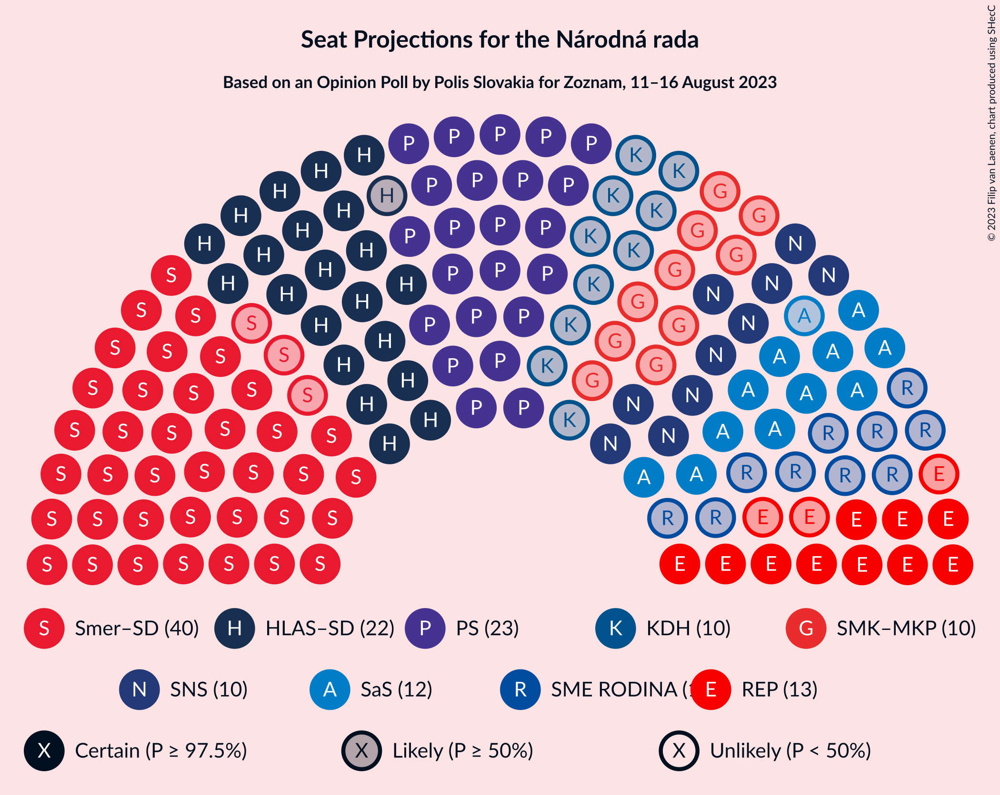
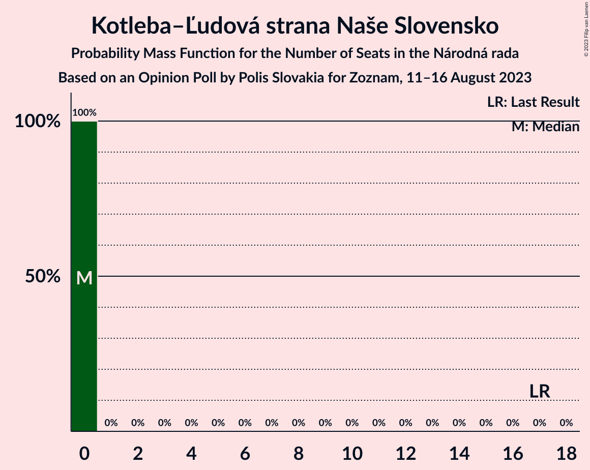
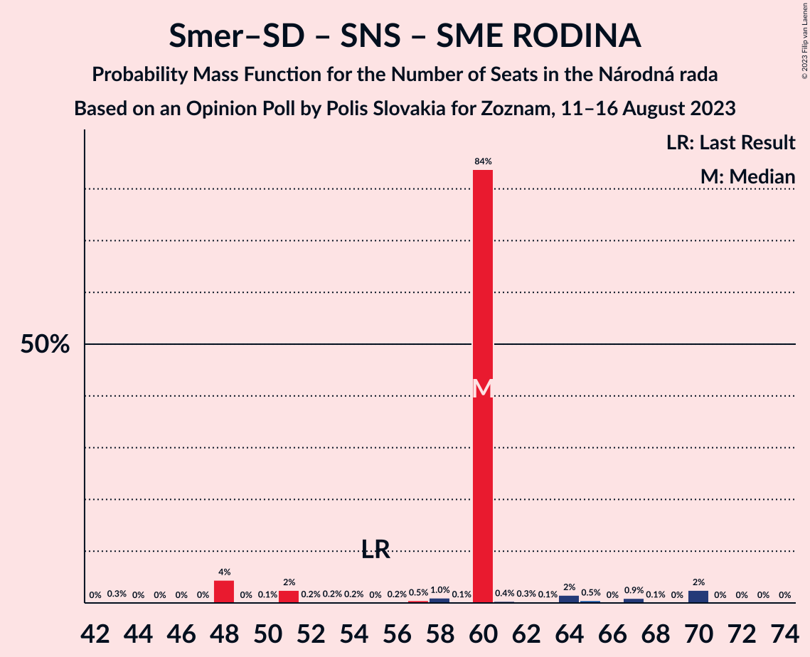
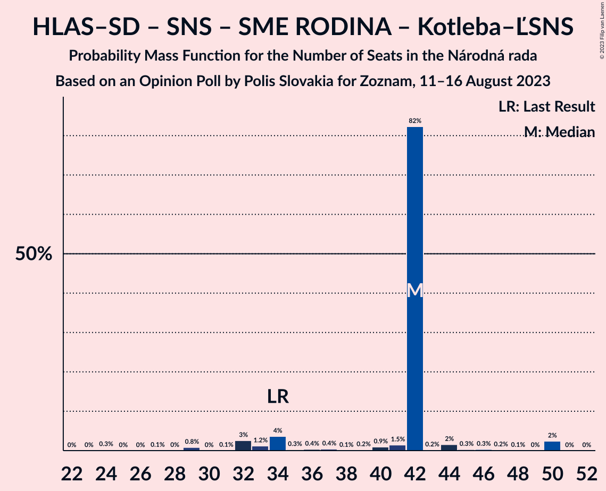

# Opinion Poll by Polis Slovakia for Zoznam, 11–16 August 2023

<a href="#voting-intentions">Voting Intentions</a> | <a href="#seats">Seats</a> | <a href="#coalitions">Coalitions</a> | <a href="#technical-information">Technical Information</a>

## Voting Intentions

### Confidence Intervals

| Party | Last Result | Poll Result | 80% Confidence Interval | 90% Confidence Interval | 95% Confidence Interval | 99% Confidence Interval |
|:-----:|:-----------:|:-----------:|:-----------------------:|:-----------------------:|:-----------------------:|:-----------------------:|
| SMER–sociálna demokracia | 18.3% | 23.4% | 21.7–25.2% |21.3–25.7% |20.9–26.1% |20.1–27.0% |
| Progresívne Slovensko | 7.0% | 14.2% | 12.8–15.7% |12.5–16.1% |12.1–16.5% |11.5–17.2% |
| HLAS–sociálna demokracia | 0.0% | 12.9% | 11.6–14.3% |11.3–14.7% |11.0–15.1% |10.4–15.8% |
| REPUBLIKA | 0.0% | 6.6% | 5.7–7.8% |5.5–8.1% |5.3–8.4% |4.8–8.9% |
| Sloboda a Solidarita | 6.2% | 6.5% | 5.6–7.7% |5.4–8.0% |5.2–8.2% |4.8–8.8% |
| Slovenská národná strana | 3.2% | 6.1% | 5.3–7.2% |5.0–7.5% |4.8–7.8% |4.4–8.4% |
| OBYČAJNÍ ĽUDIA a nezávislé osobnosti–Kresťanská únia–Za ľudí | 0.0% | 5.6% | 4.8–6.7% |4.6–7.0% |4.4–7.3% |4.0–7.8% |
| Strana maďarskej koalície–Magyar Koalíció Pártja | 3.9% | 5.3% | 4.5–6.3% |4.2–6.6% |4.0–6.8% |3.7–7.3% |
| SME RODINA | 8.2% | 5.3% | 4.5–6.3% |4.2–6.6% |4.0–6.8% |3.7–7.3% |
| Kresťanskodemokratické hnutie | 4.6% | 5.2% | 4.4–6.2% |4.1–6.4% |3.9–6.7% |3.6–7.2% |
| SPOLU–Občianska Demokracia | 7.0% | 2.3% | 1.8–3.0% |1.6–3.2% |1.5–3.4% |1.3–3.8% |
| Kotleba–Ľudová strana Naše Slovensko | 8.0% | 2.2% | 1.7–2.9% |1.6–3.1% |1.4–3.3% |1.2–3.7% |
| MODRÍ–Európske Slovensko–MOST–HÍD | 0.0% | 1.8% | 1.4–2.5% |1.2–2.6% |1.1–2.8% |0.9–3.2% |
| Magyar Fórum | 0.0% | 1.1% | 0.8–1.6% |0.7–1.8% |0.6–2.0% |0.5–2.3% |

*Note:* The poll result column reflects the actual value used in the calculations. Published results may vary slightly, and in addition be rounded to fewer digits.

## Seats

### Confidence Intervals

| Party | Last Result | Median | 80% Confidence Interval | 90% Confidence Interval | 95% Confidence Interval | 99% Confidence Interval |
|:-----:|:-----------:|:------:|:-----------------------:|:-----------------------:|:-----------------------:|:-----------------------:|
| <a href="#smer–sociálna-demokracia">SMER–sociálna demokracia</a> | 38 | 40 | 40–42 |40–46 |37–46 |37–48 |
| <a href="#progresívne-slovensko">Progresívne Slovensko</a> | 0 | 23 | 23–25 |23–26 |23–28 |21–31 |
| <a href="#hlas–sociálna-demokracia">HLAS–sociálna demokracia</a> | 0 | 22 | 22–23 |21–25 |21–26 |19–29 |
| <a href="#republika">REPUBLIKA</a> | 0 | 13 | 12–13 |12–13 |10–14 |9–15 |
| <a href="#sloboda-a-solidarita">Sloboda a Solidarita</a> | 13 | 12 | 12 |12–13 |11–14 |10–14 |
| <a href="#slovenská-národná-strana">Slovenská národná strana</a> | 0 | 10 | 10–11 |10–11 |10–13 |0–14 |
| <a href="#obyčajní-ľudia-a-nezávislé-osobnosti–kresťanská-únia–za-ľudí">OBYČAJNÍ ĽUDIA a nezávislé osobnosti–Kresťanská únia–Za ľudí</a> | 0 | 0 | 0–10 |0–11 |0–11 |0–13 |
| <a href="#strana-maďarskej-koalície–magyar-koalíció-pártja">Strana maďarskej koalície–Magyar Koalíció Pártja</a> | 0 | 10 | 9–10 |0–10 |0–10 |0–13 |
| <a href="#sme-rodina">SME RODINA</a> | 17 | 10 | 0–10 |0–10 |0–13 |0–14 |
| <a href="#kresťanskodemokratické-hnutie">Kresťanskodemokratické hnutie</a> | 0 | 10 | 9–10 |0–10 |0–10 |0–11 |
| <a href="#spolu–občianska-demokracia">SPOLU–Občianska Demokracia</a> | 0 | 0 | 0 |0 |0 |0 |
| <a href="#kotleba–ľudová-strana-naše-slovensko">Kotleba–Ľudová strana Naše Slovensko</a> | 17 | 0 | 0 |0 |0 |0 |
| <a href="#modrí–európske-slovensko–most–híd">MODRÍ–Európske Slovensko–MOST–HÍD</a> | 0 | 0 | 0 |0 |0 |0 |
| <a href="#magyar-fórum">Magyar Fórum</a> | 0 | 0 | 0 |0 |0 |0 |

### SMER–sociálna demokracia

*For a full overview of the results for this party, see the [SMER–sociálna demokracia](party-smer–sociálnademokracia.html) page.*

| Number of Seats | Probability | Accumulated | Special Marks |
|:---------------:|:-----------:|:-----------:|:-------------:|
| 33 | 0% | 100% |  |
| 34 | 0% | 99.9% |  |
| 35 | 0% | 99.9% |  |
| 36 | 0.1% | 99.9% |  |
| 37 | 4% | 99.8% |  |
| 38 | 0.3% | 96% | Last Result |
| 39 | 0.4% | 96% |  |
| 40 | 85% | 95% | Median |
| 41 | 0.2% | 11% |  |
| 42 | 0.5% | 10% |  |
| 43 | 2% | 10% |  |
| 44 | 1.4% | 8% |  |
| 45 | 0.2% | 6% |  |
| 46 | 4% | 6% |  |
| 47 | 1.0% | 2% |  |
| 48 | 1.3% | 1.4% |  |
| 49 | 0% | 0.2% |  |
| 50 | 0.1% | 0.2% |  |
| 51 | 0% | 0.1% |  |
| 52 | 0% | 0% |  |

### Progresívne Slovensko

*For a full overview of the results for this party, see the [Progresívne Slovensko](party-progresívneslovensko.html) page.*

| Number of Seats | Probability | Accumulated | Special Marks |
|:---------------:|:-----------:|:-----------:|:-------------:|
| 0 | 0% | 100% | Last Result |
| 1 | 0% | 100% |  |
| 2 | 0% | 100% |  |
| 3 | 0% | 100% |  |
| 4 | 0% | 100% |  |
| 5 | 0% | 100% |  |
| 6 | 0% | 100% |  |
| 7 | 0% | 100% |  |
| 8 | 0% | 100% |  |
| 9 | 0% | 100% |  |
| 10 | 0% | 100% |  |
| 11 | 0% | 100% |  |
| 12 | 0% | 100% |  |
| 13 | 0% | 100% |  |
| 14 | 0% | 100% |  |
| 15 | 0% | 100% |  |
| 16 | 0% | 100% |  |
| 17 | 0% | 100% |  |
| 18 | 0% | 100% |  |
| 19 | 0.1% | 100% |  |
| 20 | 0.1% | 99.9% |  |
| 21 | 0.4% | 99.8% |  |
| 22 | 0.3% | 99.4% |  |
| 23 | 82% | 99.1% | Median |
| 24 | 2% | 17% |  |
| 25 | 9% | 15% |  |
| 26 | 1.3% | 6% |  |
| 27 | 0.7% | 5% |  |
| 28 | 3% | 4% |  |
| 29 | 0.3% | 2% |  |
| 30 | 0.3% | 1.3% |  |
| 31 | 1.0% | 1.0% |  |
| 32 | 0% | 0% |  |

### HLAS–sociálna demokracia

*For a full overview of the results for this party, see the [HLAS–sociálna demokracia](party-hlas–sociálnademokracia.html) page.*

| Number of Seats | Probability | Accumulated | Special Marks |
|:---------------:|:-----------:|:-----------:|:-------------:|
| 0 | 0% | 100% | Last Result |
| 1 | 0% | 100% |  |
| 2 | 0% | 100% |  |
| 3 | 0% | 100% |  |
| 4 | 0% | 100% |  |
| 5 | 0% | 100% |  |
| 6 | 0% | 100% |  |
| 7 | 0% | 100% |  |
| 8 | 0% | 100% |  |
| 9 | 0% | 100% |  |
| 10 | 0% | 100% |  |
| 11 | 0% | 100% |  |
| 12 | 0% | 100% |  |
| 13 | 0% | 100% |  |
| 14 | 0% | 100% |  |
| 15 | 0% | 100% |  |
| 16 | 0% | 100% |  |
| 17 | 0.3% | 100% |  |
| 18 | 0% | 99.7% |  |
| 19 | 1.2% | 99.6% |  |
| 20 | 0.5% | 98% |  |
| 21 | 4% | 98% |  |
| 22 | 83% | 94% | Median |
| 23 | 6% | 12% |  |
| 24 | 0.7% | 6% |  |
| 25 | 0.8% | 5% |  |
| 26 | 4% | 5% |  |
| 27 | 0.1% | 1.1% |  |
| 28 | 0.1% | 1.0% |  |
| 29 | 0.9% | 0.9% |  |
| 30 | 0% | 0.1% |  |
| 31 | 0% | 0% |  |

### REPUBLIKA

*For a full overview of the results for this party, see the [REPUBLIKA](party-republika.html) page.*

| Number of Seats | Probability | Accumulated | Special Marks |
|:---------------:|:-----------:|:-----------:|:-------------:|
| 0 | 0.5% | 100% | Last Result |
| 1 | 0% | 99.5% |  |
| 2 | 0% | 99.5% |  |
| 3 | 0% | 99.5% |  |
| 4 | 0% | 99.5% |  |
| 5 | 0% | 99.5% |  |
| 6 | 0% | 99.5% |  |
| 7 | 0% | 99.5% |  |
| 8 | 0% | 99.5% |  |
| 9 | 0.2% | 99.5% |  |
| 10 | 2% | 99.3% |  |
| 11 | 1.0% | 97% |  |
| 12 | 7% | 96% |  |
| 13 | 84% | 89% | Median |
| 14 | 4% | 5% |  |
| 15 | 0.9% | 1.3% |  |
| 16 | 0.2% | 0.3% |  |
| 17 | 0.1% | 0.1% |  |
| 18 | 0% | 0% |  |

### Sloboda a Solidarita

*For a full overview of the results for this party, see the [Sloboda a Solidarita](party-slobodaasolidarita.html) page.*

| Number of Seats | Probability | Accumulated | Special Marks |
|:---------------:|:-----------:|:-----------:|:-------------:|
| 0 | 0.1% | 100% |  |
| 1 | 0% | 99.9% |  |
| 2 | 0% | 99.9% |  |
| 3 | 0% | 99.9% |  |
| 4 | 0% | 99.9% |  |
| 5 | 0% | 99.9% |  |
| 6 | 0% | 99.9% |  |
| 7 | 0% | 99.9% |  |
| 8 | 0% | 99.9% |  |
| 9 | 0.3% | 99.9% |  |
| 10 | 2% | 99.5% |  |
| 11 | 2% | 98% |  |
| 12 | 90% | 96% | Median |
| 13 | 2% | 6% | Last Result |
| 14 | 4% | 4% |  |
| 15 | 0.3% | 0.4% |  |
| 16 | 0% | 0.1% |  |
| 17 | 0.1% | 0.1% |  |
| 18 | 0% | 0% |  |

### Slovenská národná strana

*For a full overview of the results for this party, see the [Slovenská národná strana](party-slovenskánárodnástrana.html) page.*

| Number of Seats | Probability | Accumulated | Special Marks |
|:---------------:|:-----------:|:-----------:|:-------------:|
| 0 | 1.3% | 100% | Last Result |
| 1 | 0% | 98.7% |  |
| 2 | 0% | 98.7% |  |
| 3 | 0% | 98.7% |  |
| 4 | 0% | 98.7% |  |
| 5 | 0% | 98.7% |  |
| 6 | 0% | 98.7% |  |
| 7 | 0% | 98.7% |  |
| 8 | 0% | 98.7% |  |
| 9 | 0.8% | 98.6% |  |
| 10 | 86% | 98% | Median |
| 11 | 7% | 11% |  |
| 12 | 2% | 5% |  |
| 13 | 0.6% | 3% |  |
| 14 | 2% | 2% |  |
| 15 | 0.1% | 0.1% |  |
| 16 | 0% | 0% |  |

### OBYČAJNÍ ĽUDIA a nezávislé osobnosti–Kresťanská únia–Za ľudí

*For a full overview of the results for this party, see the [OBYČAJNÍ ĽUDIA a nezávislé osobnosti–Kresťanská únia–Za ľudí](party-obyčajníľudiaanezávisléosobnosti–kresťanskáúnia–zaľudí.html) page.*

| Number of Seats | Probability | Accumulated | Special Marks |
|:---------------:|:-----------:|:-----------:|:-------------:|
| 0 | 86% | 100% | Last Result, Median |
| 1 | 0% | 14% |  |
| 2 | 0% | 14% |  |
| 3 | 0% | 14% |  |
| 4 | 0% | 14% |  |
| 5 | 0% | 14% |  |
| 6 | 0% | 14% |  |
| 7 | 0% | 14% |  |
| 8 | 0% | 14% |  |
| 9 | 0.3% | 14% |  |
| 10 | 9% | 14% |  |
| 11 | 3% | 5% |  |
| 12 | 1.4% | 2% |  |
| 13 | 0.6% | 0.9% |  |
| 14 | 0.2% | 0.3% |  |
| 15 | 0% | 0% |  |

### Strana maďarskej koalície–Magyar Koalíció Pártja

*For a full overview of the results for this party, see the [Strana maďarskej koalície–Magyar Koalíció Pártja](party-stranamaďarskejkoalície–magyarkoalíciópártja.html) page.*

| Number of Seats | Probability | Accumulated | Special Marks |
|:---------------:|:-----------:|:-----------:|:-------------:|
| 0 | 8% | 100% | Last Result |
| 1 | 0% | 92% |  |
| 2 | 0% | 92% |  |
| 3 | 0% | 92% |  |
| 4 | 0% | 92% |  |
| 5 | 0% | 92% |  |
| 6 | 0% | 92% |  |
| 7 | 0% | 92% |  |
| 8 | 0.1% | 92% |  |
| 9 | 4% | 92% |  |
| 10 | 86% | 88% | Median |
| 11 | 0.2% | 1.3% |  |
| 12 | 0.3% | 1.0% |  |
| 13 | 0.7% | 0.7% |  |
| 14 | 0% | 0% |  |

### SME RODINA

*For a full overview of the results for this party, see the [SME RODINA](party-smerodina.html) page.*

| Number of Seats | Probability | Accumulated | Special Marks |
|:---------------:|:-----------:|:-----------:|:-------------:|
| 0 | 10% | 100% |  |
| 1 | 0% | 90% |  |
| 2 | 0% | 90% |  |
| 3 | 0% | 90% |  |
| 4 | 0% | 90% |  |
| 5 | 0% | 90% |  |
| 6 | 0% | 90% |  |
| 7 | 0% | 90% |  |
| 8 | 0% | 90% |  |
| 9 | 2% | 90% |  |
| 10 | 84% | 87% | Median |
| 11 | 0.5% | 3% |  |
| 12 | 0.2% | 3% |  |
| 13 | 0.1% | 3% |  |
| 14 | 2% | 2% |  |
| 15 | 0% | 0% |  |
| 16 | 0% | 0% |  |
| 17 | 0% | 0% | Last Result |

### Kresťanskodemokratické hnutie

*For a full overview of the results for this party, see the [Kresťanskodemokratické hnutie](party-kresťanskodemokratickéhnutie.html) page.*

| Number of Seats | Probability | Accumulated | Special Marks |
|:---------------:|:-----------:|:-----------:|:-------------:|
| 0 | 7% | 100% | Last Result |
| 1 | 0% | 93% |  |
| 2 | 0% | 93% |  |
| 3 | 0% | 93% |  |
| 4 | 0% | 93% |  |
| 5 | 0% | 93% |  |
| 6 | 0% | 93% |  |
| 7 | 0% | 93% |  |
| 8 | 0% | 93% |  |
| 9 | 9% | 93% |  |
| 10 | 83% | 84% | Median |
| 11 | 0.6% | 0.9% |  |
| 12 | 0.2% | 0.3% |  |
| 13 | 0% | 0.1% |  |
| 14 | 0.1% | 0.1% |  |
| 15 | 0% | 0% |  |

### SPOLU–Občianska Demokracia

*For a full overview of the results for this party, see the [SPOLU–Občianska Demokracia](party-spolu–občianskademokracia.html) page.*

| Number of Seats | Probability | Accumulated | Special Marks |
|:---------------:|:-----------:|:-----------:|:-------------:|
| 0 | 100% | 100% | Last Result, Median |

### Kotleba–Ľudová strana Naše Slovensko

*For a full overview of the results for this party, see the [Kotleba–Ľudová strana Naše Slovensko](party-kotleba–ľudovástrananašeslovensko.html) page.*

| Number of Seats | Probability | Accumulated | Special Marks |
|:---------------:|:-----------:|:-----------:|:-------------:|
| 0 | 100% | 100% | Median |
| 1 | 0% | 0% |  |
| 2 | 0% | 0% |  |
| 3 | 0% | 0% |  |
| 4 | 0% | 0% |  |
| 5 | 0% | 0% |  |
| 6 | 0% | 0% |  |
| 7 | 0% | 0% |  |
| 8 | 0% | 0% |  |
| 9 | 0% | 0% |  |
| 10 | 0% | 0% |  |
| 11 | 0% | 0% |  |
| 12 | 0% | 0% |  |
| 13 | 0% | 0% |  |
| 14 | 0% | 0% |  |
| 15 | 0% | 0% |  |
| 16 | 0% | 0% |  |
| 17 | 0% | 0% | Last Result |

### MODRÍ–Európske Slovensko–MOST–HÍD

*For a full overview of the results for this party, see the [MODRÍ–Európske Slovensko–MOST–HÍD](party-modrí–európskeslovensko–most–híd.html) page.*

| Number of Seats | Probability | Accumulated | Special Marks |
|:---------------:|:-----------:|:-----------:|:-------------:|
| 0 | 100% | 100% | Last Result, Median |

### Magyar Fórum

*For a full overview of the results for this party, see the [Magyar Fórum](party-magyarfórum.html) page.*

| Number of Seats | Probability | Accumulated | Special Marks |
|:---------------:|:-----------:|:-----------:|:-------------:|
| 0 | 100% | 100% | Last Result, Median |

## Coalitions

### Confidence Intervals

| Coalition | Last Result | Median | Majority? | 80% Confidence Interval | 90% Confidence Interval | 95% Confidence Interval | 99% Confidence Interval |
|:---------:|:-----------:|:------:|:---------:|:-----------------------:|:-----------------------:|:-----------------------:|:-----------------------:|
| SMER–sociálna demokracia – HLAS–sociálna demokracia – Slovenská národná strana – SME RODINA – Kotleba–Ľudová strana Naše Slovensko | 72 | 82 | 93% | 81–82 | 72–87 | 71–94 | 71–96 |
| SMER–sociálna demokracia – HLAS–sociálna demokracia – Slovenská národná strana – SME RODINA | 55 | 82 | 93% | 81–82 | 72–87 | 71–94 | 71–96 |
| SMER–sociálna demokracia – HLAS–sociálna demokracia – SME RODINA | 55 | 72 | 5% | 71–72 | 61–76 | 60–83 | 60–86 |
| SMER–sociálna demokracia – HLAS–sociálna demokracia – Slovenská národná strana | 38 | 72 | 9% | 72–75 | 72–79 | 71–82 | 67–84 |
| SMER–sociálna demokracia – Slovenská národná strana – SME RODINA – Kotleba–Ľudová strana Naše Slovensko | 72 | 60 | 0% | 60 | 51–64 | 48–70 | 48–70 |
| SMER–sociálna demokracia – Slovenská národná strana – SME RODINA | 55 | 60 | 0% | 60 | 51–64 | 48–70 | 48–70 |
| SMER–sociálna demokracia – SME RODINA | 55 | 50 | 0% | 48–50 | 40–52 | 37–58 | 37–60 |
| SMER–sociálna demokracia – Slovenská národná strana | 38 | 50 | 0% | 50–51 | 48–56 | 48–57 | 46–60 |
| HLAS–sociálna demokracia – Slovenská národná strana – SME RODINA – Kotleba–Ľudová strana Naše Slovensko | 34 | 42 | 0% | 39–42 | 33–43 | 32–48 | 29–50 |
| HLAS–sociálna demokracia – Slovenská národná strana – SME RODINA | 17 | 42 | 0% | 39–42 | 33–43 | 32–48 | 29–50 |
| SMER–sociálna demokracia | 38 | 40 | 0% | 40–42 | 40–46 | 37–46 | 37–48 |
| HLAS–sociálna demokracia – SME RODINA | 17 | 32 | 0% | 29–32 | 23–32 | 21–37 | 19–40 |
| HLAS–sociálna demokracia – Slovenská národná strana | 0 | 32 | 0% | 32–34 | 32–35 | 31–36 | 26–40 |

### SMER–sociálna demokracia – HLAS–sociálna demokracia – Slovenská národná strana – SME RODINA – Kotleba–Ľudová strana Naše Slovensko

| Number of Seats | Probability | Accumulated | Special Marks |
|:---------------:|:-----------:|:-----------:|:-------------:|
| 67 | 0.3% | 100% |  |
| 68 | 0% | 99.7% |  |
| 69 | 0.1% | 99.7% |  |
| 70 | 0% | 99.6% |  |
| 71 | 4% | 99.6% |  |
| 72 | 2% | 96% | Last Result |
| 73 | 0.1% | 94% |  |
| 74 | 0% | 94% |  |
| 75 | 0.3% | 94% |  |
| 76 | 0.5% | 93% | Majority |
| 77 | 1.0% | 93% |  |
| 78 | 0.1% | 92% |  |
| 79 | 1.5% | 92% |  |
| 80 | 0.5% | 90% |  |
| 81 | 0.2% | 90% |  |
| 82 | 82% | 90% | Median |
| 83 | 0.1% | 7% |  |
| 84 | 1.1% | 7% |  |
| 85 | 0.4% | 6% |  |
| 86 | 0.3% | 6% |  |
| 87 | 2% | 5% |  |
| 88 | 0.9% | 4% |  |
| 89 | 0% | 3% |  |
| 90 | 0.1% | 3% |  |
| 91 | 0.1% | 3% |  |
| 92 | 0.2% | 3% |  |
| 93 | 0% | 3% |  |
| 94 | 0% | 3% |  |
| 95 | 0% | 2% |  |
| 96 | 2% | 2% |  |
| 97 | 0% | 0.1% |  |
| 98 | 0% | 0% |  |

### SMER–sociálna demokracia – HLAS–sociálna demokracia – Slovenská národná strana – SME RODINA

| Number of Seats | Probability | Accumulated | Special Marks |
|:---------------:|:-----------:|:-----------:|:-------------:|
| 55 | 0% | 100% | Last Result |
| 56 | 0% | 100% |  |
| 57 | 0% | 100% |  |
| 58 | 0% | 100% |  |
| 59 | 0% | 100% |  |
| 60 | 0% | 100% |  |
| 61 | 0% | 100% |  |
| 62 | 0% | 100% |  |
| 63 | 0% | 100% |  |
| 64 | 0% | 100% |  |
| 65 | 0% | 100% |  |
| 66 | 0% | 100% |  |
| 67 | 0.3% | 100% |  |
| 68 | 0% | 99.7% |  |
| 69 | 0.1% | 99.7% |  |
| 70 | 0% | 99.6% |  |
| 71 | 4% | 99.6% |  |
| 72 | 2% | 96% |  |
| 73 | 0.1% | 94% |  |
| 74 | 0% | 94% |  |
| 75 | 0.3% | 94% |  |
| 76 | 0.5% | 93% | Majority |
| 77 | 1.0% | 93% |  |
| 78 | 0.1% | 92% |  |
| 79 | 1.5% | 92% |  |
| 80 | 0.5% | 90% |  |
| 81 | 0.2% | 90% |  |
| 82 | 82% | 90% | Median |
| 83 | 0.1% | 7% |  |
| 84 | 1.1% | 7% |  |
| 85 | 0.4% | 6% |  |
| 86 | 0.3% | 6% |  |
| 87 | 2% | 5% |  |
| 88 | 0.9% | 4% |  |
| 89 | 0% | 3% |  |
| 90 | 0.1% | 3% |  |
| 91 | 0.1% | 3% |  |
| 92 | 0.2% | 3% |  |
| 93 | 0% | 3% |  |
| 94 | 0% | 3% |  |
| 95 | 0% | 2% |  |
| 96 | 2% | 2% |  |
| 97 | 0% | 0.1% |  |
| 98 | 0% | 0% |  |

### SMER–sociálna demokracia – HLAS–sociálna demokracia – SME RODINA

| Number of Seats | Probability | Accumulated | Special Marks |
|:---------------:|:-----------:|:-----------:|:-------------:|
| 55 | 0% | 100% | Last Result |
| 56 | 0% | 100% |  |
| 57 | 0% | 100% |  |
| 58 | 0% | 100% |  |
| 59 | 0.1% | 99.9% |  |
| 60 | 4% | 99.9% |  |
| 61 | 2% | 96% |  |
| 62 | 0% | 94% |  |
| 63 | 0.1% | 94% |  |
| 64 | 0.5% | 94% |  |
| 65 | 1.2% | 94% |  |
| 66 | 0.3% | 92% |  |
| 67 | 0.4% | 92% |  |
| 68 | 0.1% | 92% |  |
| 69 | 0.4% | 92% |  |
| 70 | 1.0% | 91% |  |
| 71 | 0.5% | 90% |  |
| 72 | 82% | 90% | Median |
| 73 | 0.1% | 7% |  |
| 74 | 0.6% | 7% |  |
| 75 | 1.5% | 7% |  |
| 76 | 0.3% | 5% | Majority |
| 77 | 0.9% | 5% |  |
| 78 | 1.0% | 4% |  |
| 79 | 0.2% | 3% |  |
| 80 | 0.1% | 3% |  |
| 81 | 0.1% | 3% |  |
| 82 | 0% | 3% |  |
| 83 | 0.1% | 3% |  |
| 84 | 0% | 2% |  |
| 85 | 0% | 2% |  |
| 86 | 2% | 2% |  |
| 87 | 0% | 0.1% |  |
| 88 | 0% | 0% |  |

### SMER–sociálna demokracia – HLAS–sociálna demokracia – Slovenská národná strana

| Number of Seats | Probability | Accumulated | Special Marks |
|:---------------:|:-----------:|:-----------:|:-------------:|
| 38 | 0% | 100% | Last Result |
| 39 | 0% | 100% |  |
| 40 | 0% | 100% |  |
| 41 | 0% | 100% |  |
| 42 | 0% | 100% |  |
| 43 | 0% | 100% |  |
| 44 | 0% | 100% |  |
| 45 | 0% | 100% |  |
| 46 | 0% | 100% |  |
| 47 | 0% | 100% |  |
| 48 | 0% | 100% |  |
| 49 | 0% | 100% |  |
| 50 | 0% | 100% |  |
| 51 | 0% | 100% |  |
| 52 | 0% | 100% |  |
| 53 | 0% | 100% |  |
| 54 | 0% | 100% |  |
| 55 | 0% | 100% |  |
| 56 | 0% | 100% |  |
| 57 | 0% | 100% |  |
| 58 | 0% | 100% |  |
| 59 | 0% | 100% |  |
| 60 | 0% | 100% |  |
| 61 | 0% | 100% |  |
| 62 | 0% | 100% |  |
| 63 | 0% | 99.9% |  |
| 64 | 0% | 99.9% |  |
| 65 | 0.1% | 99.9% |  |
| 66 | 0% | 99.8% |  |
| 67 | 0.3% | 99.8% |  |
| 68 | 0.1% | 99.5% |  |
| 69 | 0.2% | 99.4% |  |
| 70 | 0.3% | 99.3% |  |
| 71 | 4% | 98.9% |  |
| 72 | 85% | 95% | Median |
| 73 | 0.2% | 11% |  |
| 74 | 0.2% | 10% |  |
| 75 | 0.8% | 10% |  |
| 76 | 0.5% | 9% | Majority |
| 77 | 1.0% | 9% |  |
| 78 | 2% | 8% |  |
| 79 | 1.2% | 6% |  |
| 80 | 0.4% | 4% |  |
| 81 | 0.1% | 4% |  |
| 82 | 3% | 4% |  |
| 83 | 0.1% | 1.2% |  |
| 84 | 0.9% | 1.1% |  |
| 85 | 0.1% | 0.2% |  |
| 86 | 0% | 0.1% |  |
| 87 | 0% | 0.1% |  |
| 88 | 0% | 0.1% |  |
| 89 | 0% | 0.1% |  |
| 90 | 0% | 0% |  |

### SMER–sociálna demokracia – Slovenská národná strana – SME RODINA – Kotleba–Ľudová strana Naše Slovensko

| Number of Seats | Probability | Accumulated | Special Marks |
|:---------------:|:-----------:|:-----------:|:-------------:|
| 43 | 0.3% | 100% |  |
| 44 | 0% | 99.7% |  |
| 45 | 0% | 99.7% |  |
| 46 | 0% | 99.7% |  |
| 47 | 0% | 99.7% |  |
| 48 | 4% | 99.7% |  |
| 49 | 0% | 95% |  |
| 50 | 0.1% | 95% |  |
| 51 | 2% | 95% |  |
| 52 | 0.2% | 93% |  |
| 53 | 0.2% | 92% |  |
| 54 | 0.2% | 92% |  |
| 55 | 0% | 92% |  |
| 56 | 0.2% | 92% |  |
| 57 | 0.5% | 92% |  |
| 58 | 1.0% | 91% |  |
| 59 | 0.1% | 90% |  |
| 60 | 84% | 90% | Median |
| 61 | 0.4% | 6% |  |
| 62 | 0.3% | 6% |  |
| 63 | 0.1% | 6% |  |
| 64 | 2% | 6% |  |
| 65 | 0.5% | 4% |  |
| 66 | 0% | 4% |  |
| 67 | 0.9% | 4% |  |
| 68 | 0.1% | 3% |  |
| 69 | 0% | 3% |  |
| 70 | 2% | 3% |  |
| 71 | 0% | 0.1% |  |
| 72 | 0% | 0.1% | Last Result |
| 73 | 0% | 0.1% |  |
| 74 | 0% | 0% |  |

### SMER–sociálna demokracia – Slovenská národná strana – SME RODINA

| Number of Seats | Probability | Accumulated | Special Marks |
|:---------------:|:-----------:|:-----------:|:-------------:|
| 43 | 0.3% | 100% |  |
| 44 | 0% | 99.7% |  |
| 45 | 0% | 99.7% |  |
| 46 | 0% | 99.7% |  |
| 47 | 0% | 99.7% |  |
| 48 | 4% | 99.7% |  |
| 49 | 0% | 95% |  |
| 50 | 0.1% | 95% |  |
| 51 | 2% | 95% |  |
| 52 | 0.2% | 93% |  |
| 53 | 0.2% | 92% |  |
| 54 | 0.2% | 92% |  |
| 55 | 0% | 92% | Last Result |
| 56 | 0.2% | 92% |  |
| 57 | 0.5% | 92% |  |
| 58 | 1.0% | 91% |  |
| 59 | 0.1% | 90% |  |
| 60 | 84% | 90% | Median |
| 61 | 0.4% | 6% |  |
| 62 | 0.3% | 6% |  |
| 63 | 0.1% | 6% |  |
| 64 | 2% | 6% |  |
| 65 | 0.5% | 4% |  |
| 66 | 0% | 4% |  |
| 67 | 0.9% | 4% |  |
| 68 | 0.1% | 3% |  |
| 69 | 0% | 3% |  |
| 70 | 2% | 3% |  |
| 71 | 0% | 0.1% |  |
| 72 | 0% | 0.1% |  |
| 73 | 0% | 0.1% |  |
| 74 | 0% | 0% |  |

### SMER–sociálna demokracia – SME RODINA

| Number of Seats | Probability | Accumulated | Special Marks |
|:---------------:|:-----------:|:-----------:|:-------------:|
| 36 | 0% | 100% |  |
| 37 | 4% | 99.9% |  |
| 38 | 0% | 96% |  |
| 39 | 0.3% | 96% |  |
| 40 | 2% | 96% |  |
| 41 | 0% | 94% |  |
| 42 | 0.2% | 94% |  |
| 43 | 0.4% | 94% |  |
| 44 | 1.0% | 93% |  |
| 45 | 0.1% | 92% |  |
| 46 | 1.4% | 92% |  |
| 47 | 0.3% | 91% |  |
| 48 | 1.3% | 90% |  |
| 49 | 0% | 89% |  |
| 50 | 83% | 89% | Median |
| 51 | 0.5% | 7% |  |
| 52 | 2% | 6% |  |
| 53 | 0.2% | 4% |  |
| 54 | 0.4% | 4% |  |
| 55 | 0.2% | 4% | Last Result |
| 56 | 0% | 4% |  |
| 57 | 1.1% | 4% |  |
| 58 | 0% | 3% |  |
| 59 | 0% | 2% |  |
| 60 | 2% | 2% |  |
| 61 | 0% | 0% |  |

### SMER–sociálna demokracia – Slovenská národná strana

| Number of Seats | Probability | Accumulated | Special Marks |
|:---------------:|:-----------:|:-----------:|:-------------:|
| 38 | 0% | 100% | Last Result |
| 39 | 0% | 100% |  |
| 40 | 0% | 100% |  |
| 41 | 0% | 100% |  |
| 42 | 0% | 99.9% |  |
| 43 | 0.3% | 99.9% |  |
| 44 | 0% | 99.6% |  |
| 45 | 0.1% | 99.6% |  |
| 46 | 0.1% | 99.5% |  |
| 47 | 0.2% | 99.5% |  |
| 48 | 5% | 99.2% |  |
| 49 | 0.1% | 95% |  |
| 50 | 83% | 95% | Median |
| 51 | 3% | 12% |  |
| 52 | 0.3% | 9% |  |
| 53 | 0.5% | 9% |  |
| 54 | 0.3% | 8% |  |
| 55 | 2% | 8% |  |
| 56 | 2% | 6% |  |
| 57 | 1.3% | 4% |  |
| 58 | 1.0% | 2% |  |
| 59 | 0.1% | 1.5% |  |
| 60 | 1.2% | 1.4% |  |
| 61 | 0.1% | 0.2% |  |
| 62 | 0.1% | 0.1% |  |
| 63 | 0% | 0% |  |

### HLAS–sociálna demokracia – Slovenská národná strana – SME RODINA – Kotleba–Ľudová strana Naše Slovensko

| Number of Seats | Probability | Accumulated | Special Marks |
|:---------------:|:-----------:|:-----------:|:-------------:|
| 24 | 0.3% | 100% |  |
| 25 | 0% | 99.7% |  |
| 26 | 0% | 99.7% |  |
| 27 | 0.1% | 99.7% |  |
| 28 | 0% | 99.6% |  |
| 29 | 0.8% | 99.6% |  |
| 30 | 0% | 98.8% |  |
| 31 | 0.1% | 98.8% |  |
| 32 | 3% | 98.7% |  |
| 33 | 1.2% | 96% |  |
| 34 | 4% | 95% | Last Result |
| 35 | 0.3% | 91% |  |
| 36 | 0.4% | 91% |  |
| 37 | 0.4% | 91% |  |
| 38 | 0.1% | 90% |  |
| 39 | 0.2% | 90% |  |
| 40 | 0.9% | 90% |  |
| 41 | 1.5% | 89% |  |
| 42 | 82% | 87% | Median |
| 43 | 0.2% | 5% |  |
| 44 | 2% | 5% |  |
| 45 | 0.3% | 3% |  |
| 46 | 0.3% | 3% |  |
| 47 | 0.2% | 3% |  |
| 48 | 0.1% | 3% |  |
| 49 | 0% | 2% |  |
| 50 | 2% | 2% |  |
| 51 | 0% | 0% |  |

### HLAS–sociálna demokracia – Slovenská národná strana – SME RODINA

| Number of Seats | Probability | Accumulated | Special Marks |
|:---------------:|:-----------:|:-----------:|:-------------:|
| 17 | 0% | 100% | Last Result |
| 18 | 0% | 100% |  |
| 19 | 0% | 100% |  |
| 20 | 0% | 100% |  |
| 21 | 0% | 100% |  |
| 22 | 0% | 100% |  |
| 23 | 0% | 100% |  |
| 24 | 0.3% | 100% |  |
| 25 | 0% | 99.7% |  |
| 26 | 0% | 99.7% |  |
| 27 | 0.1% | 99.7% |  |
| 28 | 0% | 99.6% |  |
| 29 | 0.8% | 99.6% |  |
| 30 | 0% | 98.8% |  |
| 31 | 0.1% | 98.8% |  |
| 32 | 3% | 98.7% |  |
| 33 | 1.2% | 96% |  |
| 34 | 4% | 95% |  |
| 35 | 0.3% | 91% |  |
| 36 | 0.4% | 91% |  |
| 37 | 0.4% | 91% |  |
| 38 | 0.1% | 90% |  |
| 39 | 0.2% | 90% |  |
| 40 | 0.9% | 90% |  |
| 41 | 1.5% | 89% |  |
| 42 | 82% | 87% | Median |
| 43 | 0.2% | 5% |  |
| 44 | 2% | 5% |  |
| 45 | 0.3% | 3% |  |
| 46 | 0.3% | 3% |  |
| 47 | 0.2% | 3% |  |
| 48 | 0.1% | 3% |  |
| 49 | 0% | 2% |  |
| 50 | 2% | 2% |  |
| 51 | 0% | 0% |  |

### SMER–sociálna demokracia

| Number of Seats | Probability | Accumulated | Special Marks |
|:---------------:|:-----------:|:-----------:|:-------------:|
| 33 | 0% | 100% |  |
| 34 | 0% | 99.9% |  |
| 35 | 0% | 99.9% |  |
| 36 | 0.1% | 99.9% |  |
| 37 | 4% | 99.8% |  |
| 38 | 0.3% | 96% | Last Result |
| 39 | 0.4% | 96% |  |
| 40 | 85% | 95% | Median |
| 41 | 0.2% | 11% |  |
| 42 | 0.5% | 10% |  |
| 43 | 2% | 10% |  |
| 44 | 1.4% | 8% |  |
| 45 | 0.2% | 6% |  |
| 46 | 4% | 6% |  |
| 47 | 1.0% | 2% |  |
| 48 | 1.3% | 1.4% |  |
| 49 | 0% | 0.2% |  |
| 50 | 0.1% | 0.2% |  |
| 51 | 0% | 0.1% |  |
| 52 | 0% | 0% |  |

### HLAS–sociálna demokracia – SME RODINA

| Number of Seats | Probability | Accumulated | Special Marks |
|:---------------:|:-----------:|:-----------:|:-------------:|
| 17 | 0.1% | 100% | Last Result |
| 18 | 0% | 99.9% |  |
| 19 | 1.2% | 99.9% |  |
| 20 | 0% | 98.8% |  |
| 21 | 2% | 98.7% |  |
| 22 | 0.1% | 97% |  |
| 23 | 4% | 96% |  |
| 24 | 0.4% | 92% |  |
| 25 | 0.5% | 92% |  |
| 26 | 1.1% | 91% |  |
| 27 | 0.1% | 90% |  |
| 28 | 0.1% | 90% |  |
| 29 | 0.9% | 90% |  |
| 30 | 0.6% | 89% |  |
| 31 | 1.2% | 89% |  |
| 32 | 84% | 87% | Median |
| 33 | 0.1% | 3% |  |
| 34 | 0.2% | 3% |  |
| 35 | 0.1% | 3% |  |
| 36 | 0.4% | 3% |  |
| 37 | 0.1% | 3% |  |
| 38 | 0% | 2% |  |
| 39 | 0% | 2% |  |
| 40 | 2% | 2% |  |
| 41 | 0% | 0% |  |

### HLAS–sociálna demokracia – Slovenská národná strana

| Number of Seats | Probability | Accumulated | Special Marks |
|:---------------:|:-----------:|:-----------:|:-------------:|
| 0 | 0% | 100% | Last Result |
| 1 | 0% | 100% |  |
| 2 | 0% | 100% |  |
| 3 | 0% | 100% |  |
| 4 | 0% | 100% |  |
| 5 | 0% | 100% |  |
| 6 | 0% | 100% |  |
| 7 | 0% | 100% |  |
| 8 | 0% | 100% |  |
| 9 | 0% | 100% |  |
| 10 | 0% | 100% |  |
| 11 | 0% | 100% |  |
| 12 | 0% | 100% |  |
| 13 | 0% | 100% |  |
| 14 | 0% | 100% |  |
| 15 | 0% | 100% |  |
| 16 | 0% | 100% |  |
| 17 | 0% | 100% |  |
| 18 | 0% | 100% |  |
| 19 | 0% | 100% |  |
| 20 | 0% | 100% |  |
| 21 | 0% | 100% |  |
| 22 | 0% | 100% |  |
| 23 | 0% | 99.9% |  |
| 24 | 0.3% | 99.9% |  |
| 25 | 0% | 99.6% |  |
| 26 | 0.1% | 99.6% |  |
| 27 | 0.3% | 99.5% |  |
| 28 | 0.1% | 99.2% |  |
| 29 | 0.9% | 99.1% |  |
| 30 | 0.2% | 98% |  |
| 31 | 1.4% | 98% |  |
| 32 | 85% | 97% | Median |
| 33 | 1.3% | 12% |  |
| 34 | 4% | 10% |  |
| 35 | 2% | 6% |  |
| 36 | 3% | 4% |  |
| 37 | 0.5% | 2% |  |
| 38 | 0.1% | 1.2% |  |
| 39 | 0.1% | 1.1% |  |
| 40 | 0.9% | 1.1% |  |
| 41 | 0% | 0.1% |  |
| 42 | 0% | 0.1% |  |
| 43 | 0% | 0.1% |  |
| 44 | 0% | 0% |  |

## Technical Information

### Opinion Poll

+ **Polling firm:** Polis Slovakia
+ **Commissioner(s):** Zoznam
+ **Fieldwork period:** 11–16 August 2023

### Calculations

+ **Sample size:** 1009
+ **Simulations done:** 1,048,576
+ **Error estimate:** 1.42%

